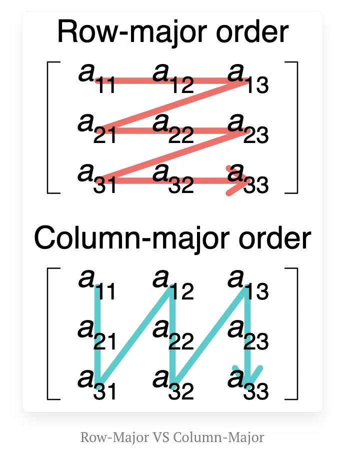

> 블로그 출처: https://leimao.github.io/blog/Row-Major-VS-Column-Major/ 이 글은 Lei Mao의 글이며, 저자의 전재 허가를 받았다.

# Row-Major VS Column-Major

## 소개

컴퓨팅 분야에서 row-major order와 column-major order는 multidimensional array를 linear storage(예: random access memory)에 저장하는 두 가지 방식이다. 아래 그림은 2D matrix의 row-major와 column-major 저장 방식을 보여준다.



이 블로그 글에서는，row-major와 column-major의 차이, 그리고 이들이 matrix multiplication 성능에 미치는 영향을 논의한다.

## Row-Major VS Column-Major

Shape가 $(M, N)$인 matrix $A$가 주어졌을 때, row-major order로 저장되면 leading dimension은 $N$이고, column-major order로 저장되면 leading dimension은 $M$이다.

$A$가 row-major로 저장되고 leading dimension이 $N$일 때, $A$를 저장한 같은 memory block에서 $A^T$를 읽으려면 memory의 matrix를 column-major로 저장된 것으로 보면 되며 leading dimension은 여전히 $N$이다.

$A$가 column-major로 저장되고 leading dimension이 $M$일 때, $A$를 저장한 같은 memory block에서 $A^T$를 읽으려면 memory의 matrix를 row-major로 저장된 것으로 보면 되며 leading dimension은 여전히 $M$이다.

예를 들어 matrix $A$가 있다고 하자.

$$A = \begin{bmatrix}
1 & 2 & 3 \\
4 & 5 & 6
\end{bmatrix}$$

$A$가 row-major로 저장되면 linear memory 안의 matrix 값은 $[1, 2, 3, 4, 5, 6]$이다.
$A$가 column-major로 저장되면 linear memory 안의 matrix 값은 $[1, 4, 2, 5, 3, 6]$이다.

$A$의 transpose $A^T$는 다음과 같다.

$$A^T = \begin{bmatrix}
1 & 4 \\
2 & 5 \\
3 & 6
\end{bmatrix}$$

$A^T$가 row-major로 저장되면 linear memory 안의 matrix 값은 $[1, 4, 2, 5, 3, 6]$이다.
$A^T$가 column-major로 저장되면 linear memory 안의 matrix 값은 $[1, 2, 3, 4, 5, 6]$이다.

$A$를 row-major로 memory에 저장한 것은 $A^T$를 column-major로 memory에 저장한 것과 완전히 같고, $A$를 column-major로 저장한 것은 $A^T$를 row-major로 memory에 저장한 것과 완전히 같음을 쉽게 알 수 있다.

Row-major로 저장된 matrix $A$에서 $A$의 row를 읽고 $A^T$의 column을 읽는 것은 빠르고 cache-friendly하지만, $A$의 column과 $A^T$의 row를 읽는 것은 느리고 cache를 invalidate한다.

Column-major로 저장된 matrix $A$에서 $A$의 column과 $A^T$의 row를 읽는 것은 빠르고 cache-friendly하지만, $A$의 row와 $A^T$의 column을 읽는 것은 느리고 cache를 invalidate한다.

## Matrix Multiplication

Memory 안에서 matrix를 저장하는 방식은 CPU와 GPU 같은 많은 processor에서 matrix multiplication 성능에 영향을 준다. 보통 matrix multiplication에서 matrix의 mathematical transpose가 필요한지에 따라 matrix multiplication을 계산하는 네 가지 방식이 있다. $C = AB$, $C = A^T B$, $C = AB^T$, $C = A^T B^T$이다. 이 operation들의 theoretical MAC 수는 같지만, matrix $A$와 $B$의 저장 순서에 따라 각 방식의 성능은 달라질 수 있다.

### $C = AB$

Matrix $A$의 shape가 $(M, K)$이고 matrix $B$의 shape가 $(K, N)$라고 하자. $C = AB$를 계산하려면 $C$는 shape가 $(M, N)$인 matrix이고, $C$의 각 element는 matrix $A$의 크기 $K$인 row 하나와 matrix $B$의 크기 $K$인 column 하나의 accumulated sum이다.

두 matrix의 저장 순서에 따라 네 가지 경우가 있다.

| 행렬 $A$ 저장 순서 | 행렬 $B$ 저장 순서 | 행렬 $A$ 행 읽기 | 행렬 $B$ 열 읽기 |
|------------------|------------------|---------------|---------------|
| column-major            | column-major            | 느림            | 빠름            |
| column-major            | row-major            | 느림            | 느림            |
| row-major            | column-major            | 빠름            | 빠름            |
| row-major            | row-major            | 빠름            | 느림            |

$A$가 row-major로 저장되고 $B$가 column-major로 저장되면 modern processor의 cache mechanism 때문에 $A$에서 row를 읽고 $B$에서 column을 읽는 것이 모두 빠르며, 같은 계산량에서는 더 빠른 read가 더 좋은 성능을 가져온다.

따라서 matrix multiplication $C = AB$는 $A$가 row-major로 저장되고 $B$가 column-major로 저장된 경우에 더 적합하다.

### $C = A^T B$

Matrix $A$의 shape가 $(K, M)$이고 matrix $B$의 shape가 $(K, N)$라고 하자. $C = A^T B$를 계산하려면 $C$는 shape가 $(M, N)$인 matrix이고, $C$의 각 element는 matrix $A$의 크기 $K$인 column 하나와 matrix $B$의 크기 $K$인 column 하나의 accumulated sum이다.

두 matrix의 저장 순서에 따라 네 가지 경우가 있다.

| 행렬 $A$ 저장 순서 | 행렬 $B$ 저장 순서 | 행렬 $A$ 열 읽기 | 행렬 $B$ 열 읽기 |
|------------------|------------------|---------------|---------------|
| column-major            | column-major            | 빠름            | 빠름            |
| column-major            | row-major            | 빠름            | 느림            |
| row-major            | column-major            | 느림            | 빠름            |
| row-major            | row-major            | 느림            | 느림            |

$A$가 column-major로 저장되고 $B$가 column-major로 저장되면 modern processor의 cache mechanism 때문에 $A$에서 column을 읽고 $B$에서 column을 읽는 것이 모두 빠르며, 같은 계산량에서는 더 빠른 read가 더 좋은 성능을 가져온다.

따라서 matrix multiplication $C = A^T B$는 $A$가 column-major로 저장되고 $B$가 column-major로 저장된 경우에 더 적합하다.

### $C = AB^T$

Matrix $A$의 shape가 $(M, K)$이고 matrix $B$의 shape가 $(N, K)$라고 하자. $C = AB^T$를 계산하려면 $C$는 shape가 $(M, N)$인 matrix이고, $C$의 각 element는 matrix $A$의 크기 $K$인 row 하나와 matrix $B$의 크기 $K$인 row 하나의 accumulated sum이다.

두 matrix의 저장 순서에 따라 네 가지 경우가 있다.

| 행렬 $A$ 저장 순서 | 행렬 $B$ 저장 순서 | 행렬 $A$ 행 읽기 | 행렬 $B$ 행 읽기 |
|------------------|------------------|---------------|---------------|
| column-major            | column-major            | 느림            | 느림            |
| column-major            | row-major            | 느림            | 빠름            |
| row-major            | column-major            | 빠름            | 느림            |
| row-major            | row-major            | 빠름            | 빠름            |

$A$가 row-major로 저장되고 $B$가 row-major로 저장되면 modern processor의 cache mechanism 때문에 $A$에서 row를 읽고 $B$에서 row를 읽는 것이 모두 빠르며, 같은 계산량에서는 더 빠른 read가 더 좋은 성능을 가져온다.

따라서 matrix multiplication $C = AB^T$는 $A$가 row-major로 저장되고 $B$가 row-major로 저장된 경우에 더 적합하다.

### $C = A^T B^T$

Matrix $A$의 shape가 $(K, M)$이고 matrix $B$의 shape가 $(N, K)$라고 하자. $C = A^T B^T$를 계산하려면 $C$는 shape가 $(M, N)$인 matrix이고, $C$의 각 element는 matrix $A$의 크기 $K$인 column 하나와 matrix $B$의 크기 $K$인 row 하나의 accumulated sum이다.

두 matrix의 저장 순서에 따라 네 가지 경우가 있다.

| 행렬 $A$ 저장 순서 | 행렬 $B$ 저장 순서 | 행렬 $A$ 열 읽기 | 행렬 $B$ 행 읽기 |
|------------------|------------------|---------------|---------------|
| column-major            | column-major            | 빠름            | 느림            |
| column-major            | row-major            | 빠름            | 빠름            |
| row-major            | column-major            | 느림            | 느림            |
| row-major            | row-major            | 느림            | 빠름            |

$A$가 column-major로 저장되고 $B$가 row-major로 저장되면 modern processor의 cache mechanism 때문에 $A$에서 column을 읽고 $B$에서 row를 읽는 것이 모두 빠르며, 같은 계산량에서는 더 빠른 read가 더 좋은 성능을 가져온다.

따라서 matrix multiplication $C = A^T B^T$는 $A$가 column-major로 저장되고 $B$가 row-major로 저장된 경우에 더 적합하다.

## Matrix Multiplication Preference

서로 다른 저장 순서 조합에서 피승수 matrix의 matrix multiplication preference는 다음과 같이 요약할 수 있다.

| 행렬 $A$ 저장 순서 | 행렬 $B$ 저장 순서 | matrix multiplication preference |
|------------------|------------------|-------------|
| column-major            | column-major            | $C = A^T B$ |
| column-major            | row-major            | $C = A^T B^T$ |
| row-major            | column-major            | $C = AB$ |
| row-major            | row-major            | $C = AB^T$ |

보통 하나의 software framework 안의 모든 matrix는 같은 저장 순서를 사용하므로, 이런 scenario에서는 $C = A^T B$와 $C = AB^T$만 선호된다는 뜻이다.

Optimization은 최적 matrix multiplication option과 다른 option 사이의 성능 격차를 줄일 수 있으며, 구체적인 구현과 processor에 따라 때로는 거의 0까지 줄일 수도 있다.

또한 네 가지 matrix multiplication option 중 성능이 가장 좋은 하나를 사용하기 위해 memory에서 matrix를 물리적으로 transpose하는 것이 좋은 생각이 아닐 때도 있다. 특히 모두 잘 최적화되어 있다면 transpose matrix의 overhead가 네 option 사이의 차이보다 훨씬 클 수 있기 때문이다.


## Matrix Multiplication Benchmark

또한 C++ single-thread simple implementation을 사용해 분석을 검증할 수 있다.

```c++
#include <cassert>
#include <chrono>
#include <cstdint>
#include <functional>
#include <iomanip>
#include <iostream>
#include <tuple>
#include <utility>
#include <vector>

template <class T>
float measure_performance(std::function<T(void)> bound_function,
                          int num_repeats = 100, int num_warmups = 100)
{
    for (int i{0}; i < num_warmups; ++i)
    {
        bound_function();
    }

    std::chrono::steady_clock::time_point time_start{
        std::chrono::steady_clock::now()};
    for (int i{0}; i < num_repeats; ++i)
    {
        bound_function();
    }
    std::chrono::steady_clock::time_point time_end{
        std::chrono::steady_clock::now()};

    auto time_elapsed{std::chrono::duration_cast<std::chrono::milliseconds>(
                          time_end - time_start)
                          .count()};
    float latency{time_elapsed / static_cast<float>(num_repeats)};

    return latency;
}

// A and B are column-major matrices.
template <typename T>
void mm_a_col_major_b_col_major(T const* A, T const* B, T* C, uint32_t m,
                                uint32_t n, uint32_t k, uint32_t lda,
                                uint32_t ldb, uint32_t ldc, bool is_A_transpose,
                                bool is_B_transpose)
{
    for (uint32_t ni{0}; ni < n; ++ni)
    {
        for (uint32_t mi{0}; mi < m; ++mi)
        {
            // Compute C[mi, ni]
            T accum{0};
            // A * B
            if ((!is_A_transpose) && (!is_B_transpose))
            {
                for (uint32_t ki{0}; ki < k; ++ki)
                {
                    // A[mi, ki] * B[ki, ni]
                    accum += A[ki * lda + mi] * B[ni * ldb + ki];
                }
            }
            // A^T * B
            else if ((is_A_transpose) && (!is_B_transpose))
            {
                for (uint32_t ki{0}; ki < k; ++ki)
                {
                    // A[ki, mi] * B[ki, ni]
                    accum += A[mi * lda + ki] * B[ni * ldb + ki];
                }
            }
            // A * B^T
            else if ((!is_A_transpose) && (is_B_transpose))
            {
                for (uint32_t ki{0}; ki < k; ++ki)
                {
                    // A[mi, ki] * B[ni, ki]
                    accum += A[ki * lda + mi] * B[ki * ldb + ni];
                }
            }
            // A^T * B^T
            else
            {
                for (uint32_t ki{0}; ki < k; ++ki)
                {
                    // A[ki, mi] * B[ni, ki]
                    accum += A[mi * lda + ki] * B[ki * ldb + ni];
                }
            }
            C[ni * ldc + mi] = accum;
        }
    }
}

void print_latency(float latency)
{
    std::cout << std::fixed << std::setprecision(3) << "Latency: " << latency
              << " ms" << std::endl;
}

int main()
{
    constexpr uint32_t num_repeats{10};
    constexpr uint32_t num_warmups{10};

    constexpr uint32_t M{256};
    constexpr uint32_t K{256};
    constexpr uint32_t N{256};

    std::vector<float> matrix_a(M * K);
    std::vector<float> matrix_b(K * N);
    std::vector<float> matrix_c(M * N);

    float const* A{matrix_a.data()};
    float const* B{matrix_b.data()};
    float* C{matrix_c.data()};

    uint32_t const matrix_a_col_major_ld{M};
    uint32_t const matrix_a_row_major_ld{K};
    uint32_t const matrix_a_transpose_col_major_ld{matrix_a_row_major_ld};
    uint32_t const matrix_a_transpose_row_major_ld{matrix_a_col_major_ld};

    uint32_t const matrix_b_col_major_ld{K};
    uint32_t const matrix_b_row_major_ld{N};
    uint32_t const matrix_b_transpose_col_major_ld{matrix_b_row_major_ld};
    uint32_t const matrix_b_transpose_row_major_ld{matrix_b_col_major_ld};

    uint32_t const matrix_c_col_major_ld{M};
    uint32_t const matrix_c_row_major_ld{N};
    uint32_t const matrix_c_transpose_col_major_ld{matrix_c_row_major_ld};
    uint32_t const matrix_c_transpose_row_major_ld{matrix_c_col_major_ld};

    std::function<void(void)> const mm_a_col_major_b_col_major_a_b{
        std::bind(mm_a_col_major_b_col_major<float>, A, B, C, M, N, K,
                  matrix_a_col_major_ld, matrix_b_col_major_ld,
                  matrix_c_col_major_ld, false, false)};

    std::function<void(void)> const mm_a_col_major_b_col_major_a_transpose_b{
        std::bind(mm_a_col_major_b_col_major<float>, A, B, C, M, N, K,
                  matrix_a_transpose_col_major_ld, matrix_b_col_major_ld,
                  matrix_c_col_major_ld, true, false)};

    std::function<void(void)> const
        mm_a_col_major_b_col_major_a_transpose_b_transpose{std::bind(
            mm_a_col_major_b_col_major<float>, A, B, C, M, N, K,
            matrix_a_transpose_col_major_ld, matrix_b_transpose_col_major_ld,
            matrix_c_col_major_ld, true, true)};

    std::function<void(void)> const mm_a_col_major_b_col_major_a_b_transpose{
        std::bind(mm_a_col_major_b_col_major<float>, A, B, C, M, N, K,
                  matrix_a_col_major_ld, matrix_b_transpose_col_major_ld,
                  matrix_c_col_major_ld, false, true)};

    std::cout << "C = A * B" << std::endl;
    float const latency_a_b = measure_performance(
        mm_a_col_major_b_col_major_a_b, num_repeats, num_warmups);
    print_latency(latency_a_b);

    std::cout << "C = A^T * B" << std::endl;
    float const latency_a_transpose_b = measure_performance(
        mm_a_col_major_b_col_major_a_transpose_b, num_repeats, num_warmups);
    print_latency(latency_a_transpose_b);

    std::cout << "C = A * B^T" << std::endl;
    float const latency_a_b_transpose = measure_performance(
        mm_a_col_major_b_col_major_a_b_transpose, num_repeats, num_warmups);
    print_latency(latency_a_b_transpose);

    std::cout << "C = A^T * B^T" << std::endl;
    float const latency_a_transpose_b_transpose =
        measure_performance(mm_a_col_major_b_col_major_a_transpose_b_transpose,
                            num_repeats, num_warmups);
    print_latency(latency_a_transpose_b_transpose);

    assert(latency_a_transpose_b ==
           std::min({latency_a_b, latency_a_transpose_b, latency_a_b_transpose,
                     latency_a_transpose_b_transpose}));
    assert(latency_a_b_transpose ==
           std::max({latency_a_b, latency_a_transpose_b, latency_a_b_transpose,
                     latency_a_transpose_b_transpose}));
}
```

Matrix $A$와 matrix $B$가 모두 column-major로 저장되어 있을 때, 예상대로 $C = A^T B$의 성능이 가장 좋고 $C = AB^T$의 성능이 가장 나쁘다는 것을 볼 수 있다.

```shell
$ g++ naive_mm.cpp -o naive_mm
$ ./naive_mm
C = A * B
Latency: 45.400 ms
C = A^T * B
Latency: 32.500 ms
C = A * B^T
Latency: 57.800 ms
C = A^T * B^T
Latency: 48.300 ms
```

cuBLAS library의 GEMM function 같은 multithreaded optimized matrix multiplication implementation을 사용하면 네 option 사이의 차이를 없앨 수 있다.

```c++
#include <cassert>
#include <chrono>
#include <cstdint>
#include <functional>
#include <iomanip>
#include <iostream>
#include <tuple>
#include <utility>
#include <vector>

#include <cublas_v2.h>
#include <cuda_runtime.h>

#define CHECK_CUBLAS_ERROR(val) checkCuBlas((val), #val, __FILE__, __LINE__)
template <typename T>
void checkCuBlas(T err, const char* const func, const char* const file,
                 const int line)
{
    if (err != CUBLAS_STATUS_SUCCESS)
    {
        std::cerr << "cuBlas Runtime Error at: " << file << ":" << line
                  << std::endl;
        std::exit(EXIT_FAILURE);
    }
}

#define CHECK_CUDA_ERROR(val) checkCuda((val), #val, __FILE__, __LINE__)
template <typename T>
void checkCuda(T err, const char* const func, const char* const file,
               const int line)
{
    if (err != cudaSuccess)
    {
        std::cerr << "CUDA Runtime Error at: " << file << ":" << line
                  << std::endl;
        std::cerr << cudaGetErrorString(err) << " " << func << std::endl;
        std::exit(EXIT_FAILURE);
    }
}

#define CHECK_LAST_CUDA_ERROR() checkCudaLast(__FILE__, __LINE__)
void checkCudaLast(const char* const file, const int line)
{
    cudaError_t const err{cudaGetLastError()};
    if (err != cudaSuccess)
    {
        std::cerr << "CUDA Runtime Error at: " << file << ":" << line
                  << std::endl;
        std::cerr << cudaGetErrorString(err) << std::endl;
        std::exit(EXIT_FAILURE);
    }
}

float measure_cublas_performance(
    std::function<cublasStatus_t(void)> bound_cublas_function,
    cudaStream_t stream, int num_repeats = 100, int num_warmups = 100)
{
    cudaEvent_t start, stop;
    float time;

    CHECK_CUDA_ERROR(cudaEventCreate(&start));
    CHECK_CUDA_ERROR(cudaEventCreate(&stop));

    for (int i{0}; i < num_warmups; ++i)
    {
        CHECK_CUBLAS_ERROR(bound_cublas_function());
    }

    CHECK_CUDA_ERROR(cudaStreamSynchronize(stream));

    CHECK_CUDA_ERROR(cudaEventRecord(start, stream));
    for (int i{0}; i < num_repeats; ++i)
    {
        CHECK_CUBLAS_ERROR(bound_cublas_function());
    }
    CHECK_CUDA_ERROR(cudaEventRecord(stop, stream));
    CHECK_CUDA_ERROR(cudaEventSynchronize(stop));
    CHECK_LAST_CUDA_ERROR();
    CHECK_CUDA_ERROR(cudaEventElapsedTime(&time, start, stop));
    CHECK_CUDA_ERROR(cudaEventDestroy(start));
    CHECK_CUDA_ERROR(cudaEventDestroy(stop));

    float const latency{time / num_repeats};

    return latency;
}

void print_latency(float latency)
{
    std::cout << std::fixed << std::setprecision(3) << "Latency: " << latency
              << " ms" << std::endl;
}

int main()
{
    constexpr uint32_t num_repeats{100};
    constexpr uint32_t num_warmups{100};

    constexpr uint32_t M{256};
    constexpr uint32_t K{256};
    constexpr uint32_t N{256};

    float* A{nullptr};
    float* B{nullptr};
    float* C{nullptr};

    CHECK_CUDA_ERROR(cudaMalloc(&A, M * K * sizeof(float)));
    CHECK_CUDA_ERROR(cudaMalloc(&B, K * N * sizeof(float)));
    CHECK_CUDA_ERROR(cudaMalloc(&C, M * N * sizeof(float)));

    uint32_t const matrix_a_col_major_ld{M};
    uint32_t const matrix_a_row_major_ld{K};
    uint32_t const matrix_a_transpose_col_major_ld{matrix_a_row_major_ld};
    uint32_t const matrix_a_transpose_row_major_ld{matrix_a_col_major_ld};

    uint32_t const matrix_b_col_major_ld{K};
    uint32_t const matrix_b_row_major_ld{N};
    uint32_t const matrix_b_transpose_col_major_ld{matrix_b_row_major_ld};
    uint32_t const matrix_b_transpose_row_major_ld{matrix_b_col_major_ld};

    uint32_t const matrix_c_col_major_ld{M};
    uint32_t const matrix_c_row_major_ld{N};
    uint32_t const matrix_c_transpose_col_major_ld{matrix_c_row_major_ld};
    uint32_t const matrix_c_transpose_row_major_ld{matrix_c_col_major_ld};

    cublasHandle_t cublas_handle;
    cudaStream_t stream;

    CHECK_CUDA_ERROR(cudaStreamCreate(&stream));
    CHECK_CUBLAS_ERROR(cublasCreate(&cublas_handle));
    CHECK_CUBLAS_ERROR(cublasSetStream(cublas_handle, stream));

    float const alpha{1.0};
    float const beta{0.0};

    // cublasSgemm assumes column-major matrices.
    std::function<cublasStatus_t(void)> const mm_a_col_major_b_col_major_a_b{
        std::bind(cublasSgemm, cublas_handle, CUBLAS_OP_N, CUBLAS_OP_N, M, N, K,
                  &alpha, A, matrix_a_col_major_ld, B, matrix_b_col_major_ld,
                  &beta, C, matrix_c_col_major_ld)};

    std::function<cublasStatus_t(void)> const
        mm_a_col_major_b_col_major_a_transpose_b{
            std::bind(cublasSgemm, cublas_handle, CUBLAS_OP_T, CUBLAS_OP_N, M,
                      N, K, &alpha, A, matrix_a_transpose_col_major_ld, B,
                      matrix_b_col_major_ld, &beta, C, matrix_c_col_major_ld)};

    std::function<cublasStatus_t(void)> const
        mm_a_col_major_b_col_major_a_transpose_b_transpose{std::bind(
            cublasSgemm, cublas_handle, CUBLAS_OP_T, CUBLAS_OP_T, M, N, K,
            &alpha, A, matrix_a_transpose_col_major_ld, B,
            matrix_b_transpose_col_major_ld, &beta, C, matrix_c_col_major_ld)};

    std::function<cublasStatus_t(void)> const
        mm_a_col_major_b_col_major_a_b_transpose{std::bind(
            cublasSgemm, cublas_handle, CUBLAS_OP_N, CUBLAS_OP_T, M, N, K,
            &alpha, A, matrix_a_col_major_ld, B,
            matrix_b_transpose_col_major_ld, &beta, C, matrix_c_col_major_ld)};

    std::cout << "C = A * B" << std::endl;
    float const latency_a_b = measure_cublas_performance(
        mm_a_col_major_b_col_major_a_b, stream, num_repeats, num_warmups);
    print_latency(latency_a_b);

    std::cout << "C = A^T * B" << std::endl;
    float const latency_a_transpose_b =
        measure_cublas_performance(mm_a_col_major_b_col_major_a_transpose_b,
                                   stream, num_repeats, num_warmups);
    print_latency(latency_a_transpose_b);

    std::cout << "C = A * B^T" << std::endl;
    float const latency_a_b_transpose =
        measure_cublas_performance(mm_a_col_major_b_col_major_a_b_transpose,
                                   stream, num_repeats, num_warmups);
    print_latency(latency_a_b_transpose);

    std::cout << "C = A^T * B^T" << std::endl;
    float const latency_a_transpose_b_transpose = measure_cublas_performance(
        mm_a_col_major_b_col_major_a_transpose_b_transpose, stream, num_repeats,
        num_warmups);
    print_latency(latency_a_transpose_b_transpose);

    CHECK_CUDA_ERROR(cudaFree(A));
    CHECK_CUDA_ERROR(cudaFree(B));
    CHECK_CUDA_ERROR(cudaFree(C));
    CHECK_CUBLAS_ERROR(cublasDestroy(cublas_handle));
    CHECK_CUDA_ERROR(cudaStreamDestroy(stream));
}
```

Highly optimized implementation을 사용하면 네 option 사이에는 거의 차이가 없다.

```shell
$ nvcc cublas_mm.cu -o cublas_mm -lcublas
$ ./cublas_mm
C = A * B
Latency: 0.008 ms
C = A^T * B
Latency: 0.010 ms
C = A * B^T
Latency: 0.009 ms
C = A^T * B^T
Latency: 0.008 ms
```

## 참고 문헌

- Row- and Column-Major Order - Wikipedia(https://en.wikipedia.org/wiki/Row-_and_column-major_order)
