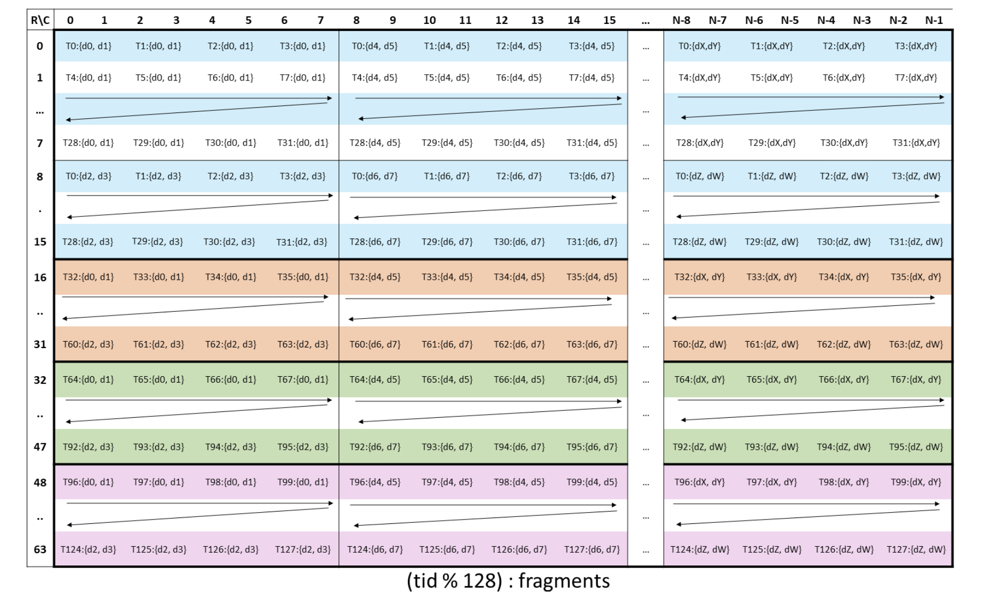
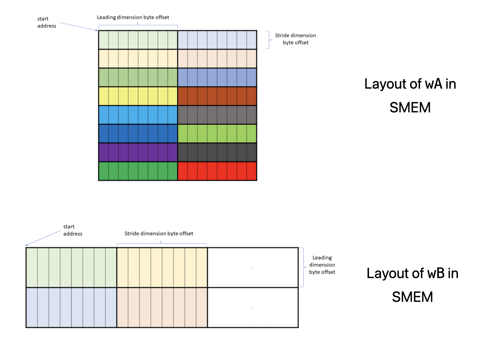

# Tutorial: Hopper GPU에서 WGMMA로 빠른 행렬 곱셈 사용하기

> 블로그 출처: https://research.colfax-intl.com/cutlass-tutorial-wgmma-hopper/

어떤 CUDA® tutorial series든 GEMM(General Matrix Multiplication) 내용이 없다면 완전하지 않습니다. GEMM은 현대 GPU에서 가장 중요한 compute routine이라고 할 수 있으며, neural network, large language model, 많은 graphics application에서 대부분의 계산을 구성합니다. GEMM은 이렇게 널리 쓰이지만, 이를 효율적으로 구현하는 것은 매우 어렵습니다.

이 3부 tutorial series는 독자가 NVIDIA Hopper GPU에서 CUTLASS library를 사용해 효율적인 GEMM kernel을 작성하는 방법을 전반적으로 이해하도록 돕는 것을 목표로 합니다.

- [1부, 즉 이 글]에서는 warpgroup matrix multiply-accumulate(WGMMA) instruction을 다룹니다. 이는 Hopper architecture 기반 NVIDIA GPU의 Tensor Core를 위한 기본 instruction입니다.
- [2부]에서는 효율적인 GEMM kernel의 전체 design(https://github.com/NVIDIA/cutlass/blob/main/media/docs/efficient_gemm.md)을 다룹니다. 여기에는 warp specialization과 Ping-Pong scheduling처럼 CUTLASS kernel에서 사용되는 advanced technique이 포함됩니다.
- [3부]에서는 persistent kernel과 Stream-K(https://arxiv.org/abs/2301.03598)를 다룹니다. 이는 많은 problem geometry에서 state-of-the-art efficiency를 달성하는 GEMM load-balancing strategy입니다.

큰 그림은 이렇습니다. 이 series의 세 부분은 GEMM kernel의 전체 개발 과정을 따르지만, "안쪽에서 바깥쪽으로" 진행합니다. 첫째, 최종적으로 Tensor Core를 호출해 계산을 수행하는 tiled GEMM primitive가 있습니다. 둘째, prologue, mainloop, epilogue로 구성된 "CTA마다 하나"의 GEMM kernel design이 있습니다. 여기서 주요 challenge는 memory load가 빠른 Tensor Core compute의 bottleneck이 되지 않게 하는 것입니다. 마지막으로 가장 바깥 grid level에서 CTA scheduling이 있으며, 여기서는 load balancing이 가장 중요한 고려사항이 됩니다.

이 series를 마친 뒤 독자가 GEMM algorithm의 전문가가 되고, 이 algorithm 안의 몇 가지 정교한 아이디어를 활용해 자신의 작업에서 다른 kernel을 설계하고 구현할 수 있기를 바랍니다.

## 비동기 Warpgroup MMA (WGMMA)

Hopper는 asynchronous warpgroup-level matrix multiply-accumulate operation(WGMMA)을 도입했습니다. 하나의 warpgroup은 연속된 4개 warp, 즉 연속된 128개 thread로 구성되며, 첫 번째 warp의 warp-rank는 4의 배수입니다. `wgmma.mma_async` instruction은 warpgroup 안의 128개 thread 전체가 함께 실행합니다. 이 operation은 일반적으로 다음 형태 중 하나를 따르며, matrix C가 accumulator 역할을 합니다.

- C = A * B + C 
- C = A * B, 여기서는 accumulator C의 input이 disable됩니다.

주목할 만한 요구사항은 operand B가 항상 shared memory(SMEM)에 저장되어야 한다는 점입니다. 반면 operand A는 shared memory나 register memory(RMEM)에 있을 수 있고, accumulator C는 항상 RMEM에 있습니다.

이 tutorial series는 다음처럼 구성됩니다. 먼저 CUTLASS에서 `wgmma.mma_async` instruction을 호출하는 기본 요소를 논의합니다. 여기에는 관련 `TiledMMA` object를 구성하고, WGMMA와 호환되도록 SMEM tensor를 만들고 partition하는 과정이 포함됩니다. 둘째, WGMMA correctness를 보장하기 위해 필요한 synchronization mechanism을 논의합니다. 마지막으로 WGMMA에서 사용되는 layout을 더 자세히 다룹니다. 여기에는 core matrix와 SMEM에서 오는 operand를 위한 matrix descriptor 개념이 포함됩니다.

이 tutorial 전체에서 간결성을 위해 `wgmma.mma_async`를 `wgmma`로 줄여 부르겠습니다. 주요 code reference는 Pradeep Ramani가 기여한 CUTLASS `wgmma` tutorial(https://github.com/NVIDIA/cutlass/blob/be60a0b27204078dc0f3f1d6ed4a95cdb2114111/examples/cute/tutorial/wgmma_sm90.cu)이며, 이는 3.5.1 version에 추가되었습니다.

## CUTLASS kernel의 WGMMA

이 tutorial의 주된 목표는 Hopper Tensor Core를 호출해 tile 기반 GEMM을 수행하는 `wgmma` primitive와, 이를 `cute::gemm` call의 일부로 호출하는 방법을 설명하는 것입니다. 이를 설명하기 위해 standard GEMM kernel을 생각해 보겠습니다. 이 kernel은 dimension이 `MxNxK`인 input matrix A와 B를 받아 `C=A*B`를 계산합니다. 계산을 parallelize하기 위해 kernel은 static tile size `bM`, `bN`, `bK`를 고정하고, 크기가 `⌈M/bM⌉x⌈N/bN⌉`인 CTA grid를 launch합니다. 각 CTA는 output matrix의 `bMxbN` tile 하나 `rC`를 계산합니다. 이는 CTA의 RMEM에 저장된 뒤 global C matrix에 다시 쓰입니다.

각 CTA에 대해 kernel의 mainloop가 있습니다. `⌈K/bK⌉`번 iteration 동안 inner dimension을 순회하고, A와 B의 bMxbK, bNxbK 크기 tile을 global memory에서 shared memory로 순서대로 load해 `sA`와 `sB`로 둡니다. CUTLASS에서는 `sB`의 shape을 수학적인 transpose로 고정한다는 점에 주의하세요. 실제로는 일반적인 practice를 따라 A와 B의 tile을 loop `SMEM` buffer로 load하며, stage 수는 2나 3 같은 compile-time integer로 주어집니다. `sA`와 `sB`의 shape tuple 마지막 mode는 이 stage count가 됩니다. 그런 다음 `cute::gemm` call이 `sA`와 `sB`의 staged slice product를 계산하고, 값을 순서대로 `rC`에 accumulate합니다. mainloop가 끝나면 `epilogue`가 `rC`를 global memory로 write out합니다.

이제 다음 `cute::gemm` call과 그 parameter를 설명하려 합니다. 이는 wgmma tutorial에서 선택적으로 추출한 아래 code snippet(https://github.com/NVIDIA/cutlass/blob/main/examples/cute/tutorial/wgmma_sm90.cu#L73)에 나타납니다. TMA load pipeline처럼 우리와 무관한 program 부분은 숨겼습니다.

```c++
template <class TiledMMA, ... >
__global__ device_gemm(TiledMMA tiled_mma, ...) {
  // PROLOGUE
  // ...
  // Define A/B partitioning and C accumulators
  ThrMMA thr_mma = tiled_mma.get_thread_slice(threadIdx.x);
  Tensor tCsA = thr_mma.partition_A(sA);  // (MMA,MMA_M,MMA_K,PIPE)
  Tensor tCsB = thr_mma.partition_B(sB);  // (MMA,MMA_N,MMA_K,PIPE)
  Tensor tCgC = thr_mma.partition_C(gC);  // (MMA,MMA_M,MMA_N)
 
  // Allocate accumulators and clear them
  Tensor tCrC = thr_mma.make_fragment_C(tCgC);  // (MMA,MMA_M,MMA_N)
  clear(tCrC);
 
  // Allocate "fragments"
  Tensor tCrA = thr_mma.make_fragment_A(tCsA);  // (MMA,MMA_M,MMA_K,PIPE)
  Tensor tCrB = thr_mma.make_fragment_B(tCsB);  // (MMA,MMA_N,MMA_K,PIPE)
   
  // PIPELINED MAIN LOOP
  while (k_tile_count > -K_PIPE_MAX) {
    // ...
    // MMAs to cover 1 K_TILE
    cute::warpgroup_arrive();
    // (V,M,K) x (V,N,K) => (V,M,N)
    cute::gemm(tiled_mma, tCrA(_,_,_,read_pipe), tCrB(_,_,_,read_pipe), tCrC);
    cute::warpgroup_commit_batch();
    // Wait for all MMAs in a K_TILE to complete
    cute::warpgroup_wait<0>();
    // ...
  }
 
  // EPILOGUE
  // ...
}
```

CUTLASS의 MMA paradigm(https://github.com/NVIDIA/cutlass/blob/main/media/docs/cute/0t_mma_atom.md)에서 `cute::gemm` method는 특정 architecture의 MMA instruction을 통일된 interface로 노출하도록 설계되어 있습니다. 실제로 SM80 tutorial의 GEMM kernel(https://github.com/NVIDIA/cutlass/blob/main/examples/cute/tutorial/sgemm_sm80.cu#L275)을 보면, 그곳의 `cute::gemm` call이 위에 제시한 것과 syntax상 **완전히 동일**함을 알 수 있습니다. 그러나 `cute::gemm` call에 관련된 parameter definition에는 WGMMA 특유의 측면이 많이 포함되어 있습니다.

- `TiledMMA` object `tiled_mma`의 definition은 `cute::gemm`을 특정 wgmma PTX instruction으로 dispatch하는 데 필요한 정보를 encapsulate합니다.
- SMEM tensor `sA`와 `sB`의 layout은 wgmma와 호환되도록 정의되어야 합니다.
- fragment `tCrA`, `tCrB`, `tCrC`는 `TiledMMA` object로 구성한 data의 thread-level partition이므로, programmer가 알아야 할 WGMMA-specific layout을 가집니다.
- fragment `tCrA`(SMEM에서 operand A를 가져오는 경우)와 `tCrB`는 SMEM에서 값을 copy한 register-backed tensor가 아니라, SMEM 위에 구성된 matrix descriptor입니다.

마지막으로 당연히 `cute::gemm` call을 둘러싼 warpgroup synchronization primitive가 있습니다. 이제 이 모든 개념을 차례대로 설명하겠습니다.

### WGMMA를 위한 TiledMMA object

data type이 FP16이고 A와 B가 `MN-major`라고 가정합니다. 따라서 BLAS notation에 따르면 NT GEMM을 계산합니다. host에서 `cute::make_tiled_mma` method를 사용해 다음처럼 `TiledMMA` object를 구성합니다.

```c++
TiledMMA tiled_mma = cute::make_tiled_mma(
  SM90_64x64x16_F16F16F16_SS<GMMA::Major::MN,GMMA::Major::MN>{});
```

`cute::make_tiled_mma`에도 몇 가지 optional parameter가 있지만, 여기서는 당장의 parameter인 `MMA Atom`에 집중하겠습니다. 이는 underlying PTX call을 encapsulate하는 struct이고, 이 경우에는 다음과 같습니다.

```c++
wgmma.mma_async.sync.aligned.m64n64k16.f16.f16.f16
```

CUTLASS의 표현 방식 덕분에 wrapped PTX instruction과 MMA Atom operation 사이의 관계를 바로 볼 수 있습니다. 먼저 SM90은 Hopper architecture의 또 다른 이름입니다. SM90 MMA Atom operation은 `SM90_MxNxK_XYZ_SS` 또는 `SM90_MxNxK_XYZ_RS`로 표시되고, `GMMA::Major::MN` 또는 `GMMA::Major::K`가 될 수 있는 두 template parameter를 가집니다. 그 의미는 다음과 같습니다.

- X와 Y는 operand의 data type입니다.
- Z는 accumulator의 data type입니다.
- MxNxK는 wgmma instruction이 계산하는 tile size, 즉 "wgmma Atom"입니다. 모든 MxNxK 값이 가능한 것은 아닙니다. 허용되는 shape list(https://docs.nvidia.com/cuda/parallel-thread-execution/index.html#asynchronous-warpgroup-level-matrix-shape)는 다음과 같습니다. M은 항상 64이고, N은 8부터 256까지 8의 배수이며, 16-bit operand data type에 대해 K는 16입니다(더 일반적으로 K는 32 byte로 고정됩니다).
- suffix RS 또는 SS는 operand A를 register(R)에서 가져오는지 shared memory(S)에서 가져오는지 나타냅니다. operand B는 항상 shared memory에서 가져오므로 S입니다.
- 두 template parameter는 operand A와 B가 MN mode에서 memory-contiguous인지 K mode에서 memory-contiguous인지 나타냅니다. 예를 들어 BLAS notation에서 operand가 모두 K-major이면 TN gemm에 대응합니다(이 table(https://github.com/NVIDIA/cutlass/blob/main/media/docs/cute/0x_gemm_tutorial.md#aside-m-major-n-major-k-major)을 참고하세요). 16-bit operand data type의 경우 memory layout은 MN-major 또는 K-major일 수 있습니다. 하지만 16-bit가 아닌 operand data type의 경우 **layout은 항상 K-major여야 합니다**.

이것이 MMA Atom operation syntax에 대해 알아야 할 내용입니다! 이제 WGMMA가 warpgroup scope의 instruction임을 강조했습니다. code에서는 size를 사용해 TiledMMA object가 정의한 MMA operation에 참여하는 thread 수를 얻을 수 있습니다. 예를 들어 다음 host code는

```c++
dim3 dimBlock(cute::size(tiled_mma));
```

각 CTA가 kernel에서 launch될 때 warpgroup 1개, 즉 128개 thread를 갖도록 규정합니다.

WGMMA를 수행할 warpgroup 2개를 원한다고 가정해 보겠습니다. 서로 다른 warpgroup이 output tile의 절반씩 독립적으로 계산하고, 각 warpgroup이 자기 wgmma instruction을 issue하게 하려는 것입니다. 이를 위해 non-trivial layout(AtomLayoutMNK)을 make_tiled_mma method의 두 번째 parameter로 전달할 수 있습니다. 예를 들어 다음 code는

```c++
TiledMMA tiled_mma = make_tiled_mma(
 SM90_64x64x16_F16F16F16_SS{},
 Layout<Shape<_2,_1,_1>>{});
```

warpgroup 1과 2가 각각 M dimension을 따라 나뉜 output tile의 위쪽 절반과 아래쪽 절반을 계산하는 WGMMA operation을 정의합니다(여기서는 bM이 128의 배수라고 가정합니다). 또한 `size(tiled_mma)`의 값은 256이 됩니다.

일반적으로 `make_tiled_mma`의 두 optional layout parameter인 `AtomLayoutMNK`와 `PermutationMNK`는 어떤 MMA Atom에서도 같은 방식으로 동작합니다. `PermutationMNK`의 사용법을 이해하려면 Cris Cecka의 훌륭한 설명(https://github.com/NVIDIA/cutlass/discussions/1345)을 참고하는 것을 추천합니다.


### WGMMA의 shared memory layout 제약

다음으로, 주어진 MMA atom 선택에서 SMEM에 있는 operand matrix의 tile size와 layout 제약을 설명합니다. 먼저 어떤 MMA instruction이든 MMA atom의 MxNxK는 operand와 accumulator tile의 크기를 나눌 수 있어야 합니다. 우리의 예에서는 bM이 64의 배수, bN이 64의 배수, bK가 16의 배수여야 한다는 뜻입니다.

둘째, WGMMA는 sA와 sB의 SMEM layout(shape과 stride 포함)에 추가적인 특정 제약을 부과하며, 이 제약은 선택한 interleaving mode에 따라 달라집니다. 특히 staged slice의 sA layout은 일반적으로 단순한 `(bM,bK):(1,bM)` 또는 `(bM,bK):(bK,1)`이 아니며, sB도 마찬가지입니다.

이 요구사항을 깊이 이해하려면 core matrix 개념이 필요하며, 이는 아래에서 소개합니다. 그러나 실용적인 관점에서는 CUTLASS가 제공하는 일부 predefined layout atom을 사용한 뒤 `cute::tile_to_shape` method로 wgmma compatibility가 보장되는 layout을 만들 수 있습니다. 우리의 예에서는 host에서 tile size와 sA, sB를 다음처럼 준비합니다. 여기서 `T=cutlass::half_t`는 CUTLASS의 FP16 이름입니다.


```c++
auto bM = Int<128>{};
auto bN = Int<128>{};
auto bK = Int< 64>{};  
auto bP = Int<  3>{};  // Pipeline
 
auto sA = cute::tile_to_shape(
    GMMA::Layout_MN_SW128_Atom<T>{},
    cute::make_shape(bM, bK, bP)
);
auto sB = cute::tile_to_shape(
    GMMA::Layout_MN_SW128_Atom<T>{},
    cute::make_shape(bN, bK, bP)
);
```

여기서 MN은 layout atom이 MN-major operand에 적용된다는 뜻이고, SW128은 128-byte interleaving mode입니다. sA 또는 sB를 print하면 다음이 표시됩니다.

```c++
Sw<3,4,3> o smem_ptr[16b](unset) o ((_64,_2),(_8,_8),_3):((_1,_512),(_64,_1024),_8192)
```

이 layout은 어디서 온 것일까요? `cute::tile_to_shape`는 하나의 layout, 즉 tile을 받아 더 큰 shape 위에 복사합니다(numpy.tile과 비슷합니다). swizzle function `Sw<3,4,3>`을 잠시 고려하지 않으면, layout atom이 `(64,8):(1,64)`로 주어지고 column-major 방식으로 shape `(128, 64, 3)` 위에 tiled된다는 것을 볼 수 있습니다. MxK shape에 대해 더 작은 outer stride 512는 M mode에 있고, 더 큰 outer stride 1024는 K mode에 있습니다. 가장 큰 stride 8192는 stage count P mode에 있는데, sA 또는 sB의 서로 다른 stage slice가 memory 안에서 섞이면 안 되므로 타당합니다.

64에 sizeof(`half_t`)를 곱하면 128 byte이며, 이것이 swizzle mode 이름입니다. 이는 의도된 것입니다. core matrix가 동작하는 방식 때문에, 우리는 항상 contiguous direction에서 layout atom의 길이가 swizzle byte 수와 같도록 배치합니다. 즉 no swizzle의 16이거나 32, 64, 128 중 하나입니다.

반대로 다음을 고려하면:

```c++
auto sA = cute::tile_to_shape(
  GMMA::Layout_K_SW128_Atom<T>{},
  cute::make_shape(bM,bK,bP)
);
auto sB = cute::tile_to_shape(
  GMMA::Layout_K_SW128_Atom<T>{},
  cute::make_shape(bN,bK,bP)
);
```

sA를 print하면 다음이 표시됩니다.

```c++
Sw<3,4,3> o smem_ptr[16b](unset) o (_128,_64,_3):(_64,_1,_8192)
```

왜냐하면 이번에는 `(8,64):(64,1)`을 `(128,64,3)` 위에 tile하기 때문입니다. layout `((_8,_16),(_64,_1),_3):((_64,_512),(_1,_0),_8192)`가 `(_128,_64,_3):(_64,_1,_8192)`로 merge된다는 점에 주의하세요.

```markdown
위 layout transformation은 조금 헷갈릴 수 있어서 여기서 설명해 보겠습니다.

1. 먼저 `(8,64):(64,1)`은 initial layout atom입니다.
- `8x64`는 basic block의 shape을 나타냅니다.
- `(64,1)`은 memory의 stride를 나타내며, 여기서 64는 row stride, 1은 column stride입니다.
2. 이 layout atom이 `(128,64,3)` shape 위에 tile되면 CUTLASS가 layout transformation을 수행합니다. 중간 과정은 `((_8,_16),(_64,_1),_3):((_64,_512),(_1,_0),_8192)`로 표시됩니다. 이는 이렇게 이해할 수 있습니다.
- `(_8,_16)`은 원래 128 rows를 8x16 block으로 나눈다는 뜻입니다.
- `_64,_1`은 64 columns가 그대로 유지된다는 뜻입니다.
- `_3`은 pipeline stage가 3개라는 뜻입니다.
- 대응하는 stride는 각각 다음과 같습니다. `(_64,_512)`는 row direction stride, `(_1,_0)`은 column direction stride, `_8192`는 pipeline direction stride입니다.
3. 최종적으로 이 복잡한 expression은 `(_128,_64,_3):(_64,_1,_8192)`로 merge되고 simplified됩니다. 이유는 다음과 같습니다.
- `8x16` block이 row direction에서 128(8*16=128)로 merge됩니다.
- 64 columns는 그대로 유지됩니다.
- 3 pipeline stages도 그대로 유지됩니다.
- stride도 그에 따라 simplify됩니다. 64는 row stride, 1은 column stride, 8192는 pipeline stride입니다.
```

일반적으로 우리는 8가지 layout atom 중에서 선택할 수 있습니다. 이는 MN 또는 K priority와 네 가지 interleaving mode 중 하나에 대응합니다.

- no interleaving: interleaving하지 않습니다. 암묵적으로 16-byte boundary입니다.
- 32-byte interleaving: 연속된 16-byte segment 2개를 interleave합니다.
- 64-byte interleaving: 연속된 16-byte segment 4개를 interleave합니다.
- 128-byte interleaving: 연속된 16-byte segment 8개를 interleave합니다.

이 layout atom들은 CUTLASS codebase에서 다음처럼 정의됩니다(https://github.com/NVIDIA/cutlass/blob/36cbfcf483cc9d2ee65a55c199176ce96da1e33e/include/cute/atom/mma_traits_sm90_gmma.hpp#L66):

```c++
GMMA::Layout_MN_INTER_Atom<T>
GMMA::Layout_MN_SW32_Atom<T>
GMMA::Layout_MN_SW64_Atom<T>
GMMA::Layout_MN_SW128_Atom<T>
 
GMMA::Layout_K_INTER_Atom<T>
GMMA::Layout_K_SW32_Atom<T>
GMMA::Layout_K_SW64_Atom<T>
GMMA::Layout_K_SW128_Atom<T>
```

이 layout atom들은 반드시 `tile_to_shape`에 전달되어야 하며, SMEM shape은 `make_shape(bM,bK,bP)` 또는 `make_shape(bN,bK,bP)`로 전달됩니다. shape의 mode는 이 순서대로 주어져 layout atom의 tile size가 더 큰 SMEM shape의 tile size를 나눌 수 있게 해야 합니다. 이는 결국 선택된 interleaving mode가 SMEM shape에 부과하는 제약 때문이며, MMA atom shape에서 발생하는 제약과는 별개입니다.

### WGMMA Fragments and Descriptors

우리는 host에서 TiledMMA object를 만들었고, 그에 맞게 SMEM layout도 준비했습니다. 이제 device에서는 TiledMMA object `tiled_mma`를 사용해 `cute::gemm` call에 전달할 적절한 partition tensor를 구성할 수 있습니다. 먼저 `tiled_mma`에서 `get_thread_slice` method를 호출해 `ThrMMA` object를 만들며, 이를 `thr_mma`라고 부릅니다. thread index는 0부터 127까지입니다(127 포함).
그다음 위 kernel code snippet을 참조하면, **어떤 thread index에 대해서도** tensor tCsA와 tCsB를 print하면 다음이 표시됩니다.

```c++
tCsA: Sw<3,4,3>_smem_ptr[16b](0x7f8800000400) o
    ((_64,(_8,_2)),_2,_4,_3):((_1,(_64,_1024)),_512,_2048,_8192)
tCsB: Sw<3,4,3>_smem_ptr[16b](0x7f880000c400) o
    ((_64,(_8,_2)),_2,_4,_3):((_1,(_64,_1024)),_512,_2048,_8192)
```

comment에 따르면 tCsA의 shape은 (`MMA,MMA_M,MMA_K,PIPE`)로 볼 수 있습니다.

- `MMA`는 MMA Atom의 `NxK` shape입니다.
- `MMA_M`과 `MMA_K`는 sA의 M 및 K mode에서 tiling range입니다. 따라서 `MMA_M=bM/64=2`, `MMA_K=bK/16=4`입니다.
- `PIPE`는 stage 수입니다.

stride와 Swizzle mode는 sA에서 옵니다. WGMMA 특유의 주의점은 tCsA가 SMEM의 thread-level slice가 아니라, 전체 SMEM tensor를 재구성한 layout이라는 것입니다.

다음으로 어떤 thread index에 대해서도 "fragment" tCrA와 tCrB를 print하면 다음이 표시됩니다.

```c++
tCrA: GMMA::DescriptorIterator o (_1,_2,_4,_3):(_0,_64,_256,_1024)
tCrB: GMMA::DescriptorIterator o (_1,_2,_4,_3):(_0,_64,_256,_1024)
```
내부적으로 CUTLASS는 "matrix descriptor"(https://docs.nvidia.com/cuda/parallel-thread-execution/index.html#asynchronous-warpgroup-level-matrix-shared-memory-layout-matrix-descriptor)를 구성합니다. 이는 SMEM을 설명하고 wgmma instruction 사용에 적합한 64-bit register value입니다. programmer가 주의해야 할 점은 SMEM의 값이 RMEM으로 copy되는 것이 아니라, tCrA와 tCrB의 값에 접근하는 일이 실제로는 이 64-bit descriptor에 접근하는 것이라는 점입니다. 또한 이 tensor들이 "iterator"라고 불리는 것은 주어진 wgmma instruction에서 사용하는 단일 64-bit descriptor만 register에 저장된다는 의미입니다. 예를 들어 24개 전체를 저장하는 것이 아닙니다.

operand와 비교하면 accumulator tensor는 더 standard하게 정의됩니다. thread 0에 대해 tCgC와 tCrC를 print하면 다음이 표시됩니다.

```c++
tCgC: gmem_ptr[16b](0x7f877a780000) o ((_2,_2,_8),_2,_2):((512,_8,4096),_64,32768)
tCrC: ptr[16b](0x7feee1fffbe0) o ((_2,_2,_8),_2,_2):((_1,_2,_4),_32,_64)
```

tCgC는 epilogue에서 accumulator 값을 copy하려는 output GMEM tensor의 slice이고, tCrC는 mainloop에서 이 값을 계산하는 register-backed tensor입니다. 이 tensor들의 (MMA,MMA_M,MMA_N) shape은 다음처럼 해석할 수 있습니다. MMA atom의 MxN=64x64 output tile에서 128개 thread 각각이 `32=2*2*8`개의 값을 보유하고, MMA_M=MMA_N=2는 tCsA 및 tCsB와 같습니다.

각 thread는 atom의 32개 값을 (2,2,8)로 factorization해야 하는 방식으로 보유합니다. 그래야 tCgC layout에 대응하는 stride를 정의할 수 있습니다. 이 partition pattern은 PTX documentation(https://docs.nvidia.com/cuda/parallel-thread-execution/index.html#wgmma-64n16-d)의 이 그림에서 읽을 수 있습니다.




이는 thread가 32개 값을 보유하는 replicated Z mode를 설명합니다. 예를 들어 thread 0은 (0,0), (0,1), (8,0), (8,1)에 위치한 값을 보유하며, 8 column마다 오른쪽으로 반복됩니다.

### gemm call 다시 살펴보기

위 kernel code snippet의 25번째 줄로 돌아가 보겠습니다.

```c++
// (V,M,K) x (V,N,K) => (V,M,N)
cute::gemm(tiled_mma, tCrA(_,_,_,read_pipe), tCrB(_,_,_,read_pipe), tCrC);
```

`cute::gemm` method의 다양한 overload는 먼저 outer mode인 MMA_M/N과 MMA_K에 대해 loop를 돕니다. 이 coordinate가 선택되면, 우리는 MMA atom tile shape으로 계산하는 것뿐입니다. 다르게 말하면, 먼저 dispatch shape (V)x(V)=>(V)(https://github.com/NVIDIA/cutlass/blob/be60a0b27204078dc0f3f1d6ed4a95cdb2114111/include/cute/algorithm/gemm.hpp#L178)에 대한 `cute::gemm` overload로 축소합니다.

그다음 code는 MMA atom의 fma operation(https://github.com/NVIDIA/cutlass/blob/be60a0b27204078dc0f3f1d6ed4a95cdb2114111/include/cute/arch/mma_sm90_gmma.hpp#L401)을 호출합니다. 정확히는 mma_unpack(https://github.com/NVIDIA/cutlass/blob/be60a0b27204078dc0f3f1d6ed4a95cdb2114111/include/cute/atom/mma_traits.hpp#L112) method 안에서 호출됩니다. 여기에는 inline PTX assembly가 포함됩니다.

```c++
CUTE_HOST_DEVICE static void
  fma(uint64_t const& desc_a,
      uint64_t const& desc_b,
      uint32_t& d00, uint32_t& d01, uint32_t& d02, uint32_t& d03,
      uint32_t& d04, uint32_t& d05, uint32_t& d06, uint32_t& d07,
      uint32_t& d08, uint32_t& d09, uint32_t& d10, uint32_t& d11,
      uint32_t& d12, uint32_t& d13, uint32_t& d14, uint32_t& d15,
      GMMA::ScaleOut const scale_D = GMMA::ScaleOut::One)
  {
#if defined(CUTE_ARCH_MMA_SM90A_ENABLED)
    asm volatile(
    "{\n"
      ".reg .pred p;\n"
      "setp.ne.b32 p, %18, 0;\n"
      "wgmma.mma_async.sync.aligned.m64n64k16.f16.f16.f16 "
      "{%0,  %1,  %2,  %3,  %4,  %5,  %6,  %7,  "
      " %8,  %9,  %10, %11, %12, %13, %14, %15},"
      " %16,"
      " %17,"
      " p,   %19, %20, %21, %22;\n"
    "}\n"
      : "+r"(d00), "+r"(d01), "+r"(d02), "+r"(d03),
        "+r"(d04), "+r"(d05), "+r"(d06), "+r"(d07),
        "+r"(d08), "+r"(d09), "+r"(d10), "+r"(d11),
        "+r"(d12), "+r"(d13), "+r"(d14), "+r"(d15)
      : "l"(desc_a),
        "l"(desc_b),
        "r"(int32_t(scale_D)),
        "n"(int32_t(scaleA)),
        "n"(int32_t(scaleB)),
        "n"(int32_t(tnspA)),
        "n"(int32_t(tnspB)));
#else
    CUTE_INVALID_CONTROL_PATH(
        "Attempting to use SM90_64x64x16_F16F16F16_SS "
        "without CUTE_ARCH_MMA_SM90A_ENABLED");
#endif
  }
```

이 syntax에 대응하는 PTX documentation은 여기(https://docs.nvidia.com/cuda/parallel-thread-execution/index.html#asynchronous-warpgroup-level-matrix-instructions-wgmma-mma)에 있습니다. 위에서 설명한 tensor tCrA, tCrB, tCrC와 일관되게, operand를 위한 uint64 variable desc_a와 desc_b가 있고 accumulator를 위한 16개의 uint32 variable이 있음을 볼 수 있습니다. scale_D는 0 또는 1이며, accumulator를 zero-initialize할지 여부를 제어합니다.

또한 variable `scaleA`, `scaleB`, `tnspA`, `tnspB`는 template parameter를 통해 fma method 밖에서 compile-time에 결정됩니다. `scaleA`와 `scaleB`는 operand를 negate하기 위한 1 또는 -1이고, `tnspA`와 `tnspB`는 operand를 transpose할지 여부를 나타내며 각각 `GMMA::Major::K` 또는 `GMMA::Major::MN`에 대해 0 또는 1입니다.

### WGMMA를 위한 synchronization

이제 `cute::gemm` call을 둘러싼 synchronization primitive를 설명해야 합니다.

```c++
cute::warpgroup_arrive();
cute::gemm(tiled_mma, tCrA(_,_,_,read_pipe), tCrB(_,_,_,read_pipe), tCrC);
cute::warpgroup_commit_batch();
cute::warpgroup_wait<0>();
```

이 추가 command들은 왜 필요한 것일까요? 이는 wgmma가 asynchronous instruction이라는 특성과 관련됩니다. Hopper architecture 맥락에서 asynchronous라는 말은 wgmma가 다른 operation과 동시에 실행될 수 있음을 뜻하며, 따라서 dependent step에는 synchronization mechanism이 필요합니다. 이 mechanism은 PTX memory consistency model(https://docs.nvidia.com/cuda/archive/12.3.2/parallel-thread-execution/index.html#program-order-async-operations)에 자세히 설명되어 있습니다. code에서 synchronization을 잘못 수행하면 (a) 미묘한 race condition으로 인해 잡기 어려운 bug가 생기거나, (b) compiler가 wgmma instruction을 serialize하여 큰 성능 저하가 발생하거나, (c) undefined behavior가 발생할 수 있습니다.

강조된 cute method들은 다음 PTX instruction을 wrapping합니다.

- `cute::warpgroup_arrive()` — `wgmma.fence.sync.aligned`;
- `cute::warpgroup_commit_batch()` — `wgmma.commit_group.sync.aligned`;
- `cute::warpgroup_wait<N>()` — `wgmma.wait_group.sync.aligned N`;

(이 글 전체에서는 wgmma를 wgmma.mma_async의 shorthand로 사용했지만, 이 subsection에서만 이를 구분합니다.) 이 command들의 사용법을 PTX documentation(https://docs.nvidia.com/cuda/archive/12.3.2/parallel-thread-execution/index.html#asynchronous-warpgroup-level-matrix-multiply-accumulate-instructions)에서 그대로 가져온 WGMMA 기반 GEMM 설명과 연결해 보겠습니다.

- matrix A, B, D를 register 또는 shared memory로 load합니다.
- 다음 fence operation을 수행합니다.
    - warpgroup 전체의 register/shared-memory에 write가 수행되었음을 나타내기 위한 `wgmma.fence` operation.
    - generic proxy operation이 async proxy에서 visible하도록 만들기 위한 `fence.proxy.async` operation.
- input matrix에 `wgmma.mma_async` operation을 사용해 asynchronous matrix multiply and accumulate operation을 issue합니다. `wgmma.mma_async` operation은 async proxy에서 수행됩니다.
- `wgmma.commit_group` operation을 사용해 wgmma-group을 만들고, 이전에 outstanding 상태였지만 아직 어떤 wgmma-group에도 commit되지 않은 모든 `wgmma.mma_async` operation을 그 group에 commit합니다.
- `wgmma.wait_group`을 사용해 필요한 wgmma-group의 completion을 기다립니다.
wgmma-group이 완료되면 모든 `wgmma.mma_async` operation이 수행되고 완료된 것입니다.


이 점들을 순서대로 설명하겠습니다. 먼저 `wgmma.fence` instruction은 해당 주소에 대한 이전 access가 모두 끝난 뒤에만 `wgmma.mma_async`가 특정 RMEM address에 접근하도록 보장합니다. `wgmma.fence`가 없으면 behavior는 undefined입니다. 이 규칙의 예외는 Hopper가 여러 `wgmma.mma_async` instruction을 동시에 in-flight 상태로 둘 수 있다는 점입니다. 이러한 `wgmma.mma_async` instruction들이 같은 accumulator shape을 가지는 한, 같은 accumulator tensor를 공유할 수 있습니다. 즉 같은 register memory address에 write할 수 있습니다. 이 경우 fence는 필요하지 않습니다. 예를 들어 `cute::gemm` call의 일부로 수행되는 `MMA_K` loop 안에는 `wgmma.fence`를 삽입할 필요가 없습니다.


TMA operation(https://research.colfax-intl.com/tutorial-hopper-tma/)과 마찬가지로, `wgmma.mma_async`는 async proxy에서 수행됩니다. 따라서 generic proxy에서 수행된 operation이 `wgmma.mma_async`가 읽는 SMEM에 영향을 준다면 `fence.proxy.async`를 issue해야 합니다. 예를 들어 일반적인 ld.global / st.shared operation을 통해 A와 B를 SMEM으로 copy했다면 이런 경우에 해당합니다. 우리의 예시에서는 TMA load를 사용하므로 `fence.proxy.async`가 필요하지 않으며, 실제로 WGMMA tutorial code나 CUTLASS Hopper GEMM kernel의 mainloop에도 나타나지 않습니다. 이를 확인하려면 `fence.proxy.async`가 `cutlass::arch::fence_view_async_shared()`로 wrapping되어 있음을 보면 됩니다.

`wgmma.commit_group` instruction은 warpgroup마다 새로운 wgmma-group을 만들고, 실행 중인 warpgroup이 시작했지만 아직 어떤 wgmma-group에도 commit하지 않은 이전의 모든 `wgmma.mma_async` instruction을 새 wgmma-group으로 batching합니다. 우리의 예시에서 `cute::warpgroup_commit_batch()`는 `MMA_M*MMA_N*MMA_K`개 `wgmma.mma_async` instruction을 하나의 wgmma-group으로 batching합니다.

마지막으로 argument N을 가진 `wgmma.wait_group` instruction은 가장 최근 wgmma-group 중 pending 상태가 N개 이하가 되고, 실행 중인 thread가 commit한 이전 wgmma-group이 모두 완료될 때까지 실행 thread를 기다리게 합니다. 우리의 예시에서는 N=0으로 두므로, warpgroup은 이후 instruction 실행을 계속하기 전에 전체 wgmma-group의 completion을 단순히 기다립니다.

warpgroup이 independent computation을 수행할 기회가 있는 상황에서는 parameter N의 유연성이 유용합니다. 예를 들어 FlashAttention-3 design에서 사용되는 GEMM-softmax overlapping strategy가 여기에 해당합니다.


### WGMMA core matrix

이 마지막 절에서는 wgmma가 두 operand를 모두 SMEM에서 가져온다고 가정하고, SMEM에 load되는 matrix A와 B의 tile에 대한 layout requirement를 더 다룹니다. 논의를 단순화하기 위해 먼저 A는 row-major이고 B는 column-major라고 가정합니다. 즉 둘 다 K-major입니다. 또한 wgmma instruction의 tile shape MxNxK는 M이 64이고, K에 datatype size를 곱한 값이 32 byte이며, N은 8부터 256까지의 8의 배수라는 제약을 갖는다는 점을 떠올리세요. A/B 또는 sA/sB와 혼동하지 않도록 WGMMA atom tile을 wA와 wB라고 표기하겠습니다.

matrix wA와 wB는 core matrix라고 불리는 여러 작은 matrix로 나뉩니다. 각 core matrix는 strided direction과 contiguous direction을 가지며, strided direction 길이는 8이고 contiguous direction 길이는 16 byte입니다. matrix wA는 8x2 core matrix로 구성되고, matrix wB는 2x(N/8) core matrix로 구성됩니다. wA와 wB를 core matrix로 tile하는 모습은 다음과 같습니다. 이미지는 PTX documentation에서 가져왔습니다.



위에서 언급했듯, SS mode의 wgmma는 wA(desc-a)와 wB(desc-b) 모두에 대한 matrix descriptor(https://docs.nvidia.com/cuda/parallel-thread-execution/index.html#asynchronous-warpgroup-level-matrix-shared-memory-layout-matrix-descriptor)를 input으로 요구합니다. 이 descriptor는 다섯 가지 parameter를 encode합니다.

- Start address: SMEM에서 operand의 시작 base address.
- LBO(leading dimension byte offset): K dimension에서 인접한 두 core matrix 사이의 거리(byte 단위).
- SBO(stride dimension byte offset): M 또는 N dimension에서 인접한 두 core matrix 사이의 거리(byte 단위).
- Swizzling mode: none, 32, 64 또는 128 byte.
- Matrix base offset: SMEM address가 swizzle mode의 repeating pattern에 대한 byte boundary에 align되지 않은 경우 SMEM alignment 문제를 해결하는 데 사용됩니다.

LBO와 SBO는 위 그림에 표시되어 있습니다.

CUTLASS의 `make_gmma_desc`(https://github.com/NVIDIA/cutlass/blob/06b21349bcf6ddf6a1686a47a137ad1446579db9/include/cute/atom/mma_traits_sm90_gmma.hpp#L194C1-L194C54) method는 input으로 제공된 SMEM tensor layout을 바탕으로 descriptor를 구성합니다. 이는 GmmaDescriptor(https://github.com/NVIDIA/cutlass/blob/be60a0b27204078dc0f3f1d6ed4a95cdb2114111/include/cute/arch/mma_sm90_desc.hpp#L86)의 instance입니다. 앞서 "WGMMA의 SMEM layout constraints"에서 자세히 설명했듯, input tensor의 layout이 8개의 canonical GMMA layout atom 중 하나와 `tile_to_shape`를 사용해 생성되었다면 `make_gmma_desc`는 LBO와 SBO를 정확히 계산하고, swizzling mode를 결정하며, descriptor를 구성합니다. 예를 들어 GmmaDescriptor는 K-major case에서 다음 admissible WGMMA layout을 설명합니다. 여기서 `T*sizeof(dtype)=16`입니다.


```c++
No swizzle       : Swizzle<0,4,3> o smem_ptr o ((8,m),(T,2)):((1T,SBO),(1,LBO))
32-byte swizzle  : Swizzle<1,4,3> o smem_ptr o ((8,m),(T,2)):((2T,SBO),(1, T ))
64-byte swizzle  : Swizzle<2,4,3> o smem_ptr o ((8,m),(T,2)):((4T,SBO),(1, T ))
128-byte swizzle : Swizzle<3,4,3> o smem_ptr o ((8,m),(T,2)):((8T,SBO),(1, T ))
```

GMMA layout atom => tile_to_shape pattern으로 생성된 compact(https://github.com/NVIDIA/cutlass/blob/be60a0b27204078dc0f3f1d6ed4a95cdb2114111/include/cute/layout.hpp#L415) layout에 대해, LBO와 SBO의 대응 값은 다음과 같습니다. 64-byte 및 128-byte swizzle의 경우 GMMA layout K atom이 WGMMA atom shape보다 더 큰 K-mode를 가진다는 점에 주의하세요.

```c++
No swizzle       : LBO = 16x8 = 128 bytes. SBO = 32x8 = 256 bytes.
32-byte swizzle  : SBO = 32x8 = 256 bytes.
64-byte swizzle  : SBO = 64x8 = 512 bytes.
128-byte swizzle : SBO = 128x8 = 1024 bytes.
```

특히 64-byte 및 128-byte swizzle에서 stride는 주어진 admissible WGMMA layout이 **compact하지 않도록** 만들어집니다. 오히려 2개 또는 4개의 WGMMA atom operand tile set이 K-direction으로 나란히 stack되어, core matrix M-mode에 대해 4T와 8T의 stride가 생깁니다. 다르게 말하면 swizzling할 때 K-mode에서 논리적으로 인접한 2개, 4개 또는 8개의 core matrix를 memory에서 interleave하며, 64-byte 및 128-byte swizzle의 경우 이 core matrix들은 서로 다른 WGMMA atom에 속합니다.

완전성을 위해 MN-major case의 admissible WGMMA layout도 제시합니다.

```c++
No swizzle       : Swizzle<0,4,3> o smem_ptr o ((T,1,m),(8,k)):((1,T,SBO),(1T,LBO))
32-byte swizzle  : Swizzle<1,4,3> o smem_ptr o ((T,2,m),(8,k)):((1,T,LBO),(2T,SBO))
64-byte swizzle  : Swizzle<2,4,3> o smem_ptr o ((T,4,m),(8,k)):((1,T,LBO),(4T,SBO))
128-byte swizzle : Swizzle<3,4,3> o smem_ptr o ((T,8,m),(8,k)):((1,T,LBO),(8T,SBO))
```

## 결론

GEMM series의 [Part 1]인 이 글에서는 Hopper 기반 GEMM에서 WGMMA(warpgroup matrix-multiply and accumulate)를 primitive로 사용하는 데 관련된 핵심 개념을 다뤘습니다.

WGMMA는 warpgroup, 즉 128개 thread가 함께 matrix multiplication을 실행해야 하며, matrix의 특정 fragment에 대해서만 동작할 수 있습니다. 우리는 여기에 관련된 특수한 shape과 layout을 살펴보았고, canonical GMMA Layout => `tile_to_shape` pattern을 사용해 WGMMA가 받아들일 것이 보장되는 operand layout을 구성하는 방법을 중점적으로 설명했습니다.

WGMMA의 사용이 well-defined되려면 특정 synchronization mechanism도 필요합니다. 이를 위해 `wgmma.mma_async`와 관련해 `wgmma.fence`, `fence.proxy.async`, `wgmma.commit_group`, `wgmma.wait_group`의 사용법을 설명했습니다.

마지막으로 WGMMA core matrix의 내부 동작과 CUTLASS가 SMEM에서 가져오는 operand에 대해 matrix descriptor를 구성하는 방법을 어느 정도 자세히 설명했습니다.

전체적으로 이 blog post는 programmer가 Hopper에서 WGMMA를 사용하는 CUTLASS kernel을 작성할 수 있게 해 줄 것입니다. [Part 2]에서는 논의를 TMA까지 확장하고, Hopper GEMM kernel에서 copy와 compute를 overlap하기 위해 TMA와 WGMMA를 함께 사용하는 방법을 다루겠습니다.
