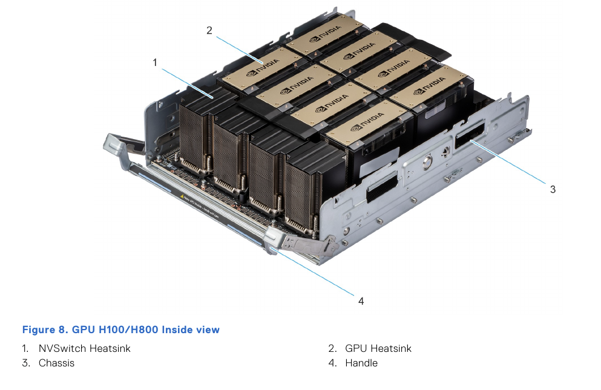
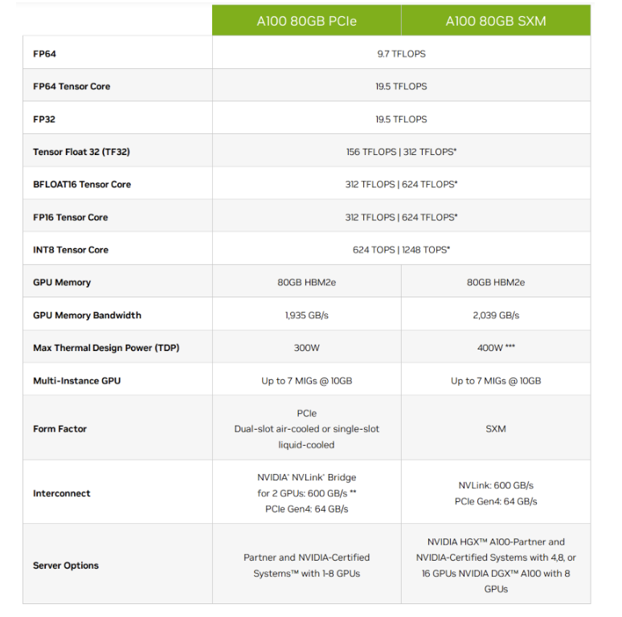
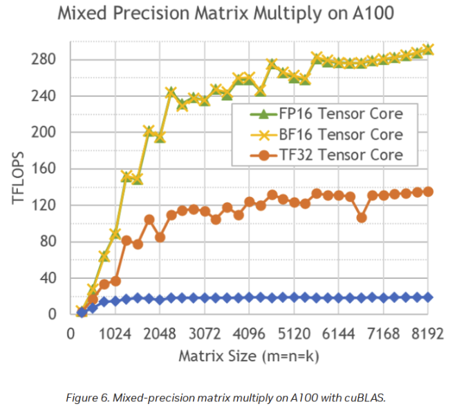

> 강의 노트, 팔로우 환영: https://github.com/BBuf/how-to-optim-algorithm-in-cuda/tree/master/cuda-mode 
> 이 문서의 출처: https://github.com/stas00/ml-engineering . 이 문서는 머신러닝 가속기의 현황과 기술적 세부 사항을 상세히 소개하며, GPU, TPU, FPGA 등 다양한 가속기 유형을 다룬다. 학습과 추론의 서로 다른 계산 요구 사항을 강조하고, NVIDIA, AMD, Intel 등 제조사의 고성능 가속기 사양을 분석하며 특히 TFLOPS 성능과 메모리 대역폭의 중요성을 다루면서 여러 가속기 비교 표를 제공한다. 클라우드 및 온프레미스 가속기 선택 방법, 하드웨어·소프트웨어 최적화를 통한 ROI 향상 방법도 논의한다. 마지막으로 가속기 구매 또는 임대 시 전원 및 냉각 문제에 주의해야 함을 상기시켜 안정적인 운용을 보장한다.

# 가속기

컴퓨팅 가속기는 머신러닝 학습의 주력이다. 초기에는 GPU만 있었지만, 이제 TPU, IPU, FPGA, HPU, QPU, RDU 등이 등장했고 새로운 가속기가 계속 발명되고 있다.

머신러닝에는 학습과 추론 두 가지 주요 워크로드가 있다. 또한 미세 조정 워크로드가 있는데, 이는 보통 학습과 동일하지만 더 가벼운 LORA 방식(https://arxiv.org/abs/2106.09685) 미세 조정을 수행하는 경우는 예외다. 후자는 일반 미세 조정보다 훨씬 적은 자원과 시간을 필요로 한다.

언어 모델 추론에서 생성은 순차적으로 진행된다 — 한 번에 하나의 토큰씩 생성된다. 따라서 동일한 `forward` 호출을 수천 번 반복해야 하며, 매번 작은 `matmul`(행렬 곱셈 또는 GEMM)을 수행한다. 이는 가속기(예: GPU) 또는 일부 최신 CPU에서 효율적으로 처리할 수 있다.

학습에서는 전체 시퀀스 길이가 하나의 거대한 `matmul` 연산으로 처리된다. 따라서 시퀀스 길이가 4k인 경우, 동일한 모델을 학습하려면 추론보다 4k배 더 많은 연산을 빠르게 처리할 수 있는 컴퓨팅 유닛이 필요하다. 가속기는 이 작업에 탁월하다. 실제로 곱해야 하는 행렬이 클수록 계산 효율이 높아진다.

또 다른 계산상의 차이는, 학습과 추론 모두 `forward` 과정에서 동일한 총량의 `matmul`을 수행하지만, 학습 전용인 `backward` 과정에서 입력과 가중치의 기울기를 계산하기 위해 2배의 추가 `matmul`이 필요하다는 점이다. 활성화 재계산을 사용하면 추가로 `forward` 한 번이 더 필요하다. 따라서 학습 과정은 추론보다 3-4배 더 많은 `matmul`이 필요하다.

## 하위 섹션

일반:
- 벤치마크(https://github.com/stas00/ml-engineering/tree/master/compute/accelerator/benchmarks)

NVIDIA:
- NVIDIA GPU 문제 해결(https://github.com/stas00/ml-engineering/blob/master/compute/accelerator/nvidia/debug.md)

AMD:
- AMD GPU 문제 해결(https://github.com/stas00/ml-engineering/blob/master/compute/accelerator/amd/debug.md)
- AMD GPU 성능(https://github.com/stas00/ml-engineering/blob/master/compute/accelerator/amd/performance.md)

## 고성능 가속기 현황 개요

미래에는 바뀔 수 있지만, 소비자용 GPU 시장과 달리 이 글을 쓰는 시점에서 고성능 가속기의 종류는 많지 않다. 클라우드에서 임대하는 경우 대부분의 제공업체에서 제공하는 가속기 선택지는 거의 비슷하다.

GPU:
- 현재 ML 클라우드/HPC는 NVIDIA A100에서 H100으로 전환이 시작되었으며, NVIDIA GPU의 만성적인 공급 부족으로 이 과정은 수개월이 걸릴 것이다. H200이 곧 출시 예정으로 2024년 4분기가 약속되어 있다. B100, B200, GB200은 2024년 1분기에 발표되었지만 생산 지연으로 인해 2025년 중반까지는 사용하기 어려울 수 있다.
- AMD의 MI250이 간헐적으로 등장하기 시작했지만 현재는 쉽게 구할 수 있는지 불분명하다. MI300X는 일부 2선급 클라우드 제공업체에서 이용 가능하기 시작했다.

HPU:
- Intel의 Gaudi2가 Intel 클라우드에서 서서히 등장하기 시작했다 — 꽤 많은 라인업이 있다. Supermicro, WiWynn 등을 통한 온프레미스 구현도 가능하며 곧 더 많은 선택지가 생길 것이다.
- Gaudi3는 2024년 중 출시 예정이다.

IPU:
- Graphcore가 IPU 제품을 제공한다. Paperspace(https://www.paperspace.com/graphcore) 클라우드 노트북을 통해 이 제품들을 체험할 수 있다.

TPU:
- Google의 TPU는 물론 이용 가능하지만, 임대만 가능하고 GPU와 TPU 간 소프트웨어 전환이 쉽지 않아 가장 인기 있는 가속기는 아니다. 많은(대부분의?) 개발자가 Google 독점 하드웨어에 종속되고 싶지 않아 GPU 생태계에 머문다.

Pod 및 랙에 대해서:
- Cerebras의 WaferScale Engine (WSE)
- SambaNova의 DataScale
- 위의 GPU들을 초고속 인터커넥트와 결합한 수십 가지 pod 및 랙 구성

이것이 2024년 3분기 현황이다.

컴퓨팅 자원을 임대하는 대부분의 사람들은 실제로 어떻게 생겼는지 본 적이 없을 것이므로, 8xH100 노드의 실물 사진을 소개한다(Dell PowerEdge XE9680 랙 서버의 GPU 트레이):

## 용어집

- CPU: 중앙 처리 장치
- FPGA: 현장 프로그래밍 가능 게이트 어레이
- GCD: 그래픽 컴퓨트 다이
- GPU: 그래픽 처리 장치
- HBM: 고대역폭 메모리
- HPC: 고성능 컴퓨팅
- HPU: Habana Gaudi AI 처리 장치
- IPU: 인텔리전트 처리 장치
- MME: 행렬 곱셈 엔진
- QPU: 양자 처리 장치
- RDU: 재구성 가능한 데이터플로우 유닛
- TPU: 텐서 처리 장치

## 가장 중요하게 이해해야 할 것

본문에서 이 관점을 여러 번 반복할 것이다 — 단순히 가장 비싼 가속기를 구매/임대하는 것만으로는 높은 ROI를 기대하기 어렵다.

ML 학습의 높은 ROI에는 두 가지 지표가 있다:
1. 학습 완료 속도. 계획보다 2-3배 오래 걸리면 모델이 출시 전에 이미 구식이 될 수 있다 — 현재의 경쟁적인 ML 시장에서 시간이 전부다.
2. 모델 학습의 총 비용. 계획보다 2-3배 오래 걸리면 결국 2-3배 더 많은 비용을 지불하게 된다.

가속기 이외의 구매/임대 하드웨어가 필요한 워크로드에 맞게 신중하게 선택되지 않으면, 가속기가 많은 시간 동안 유휴 상태가 되어 시간과 비용을 낭비하게 된다. 가장 중요한 구성 요소는 네트워크(https://github.com/stas00/ml-engineering/tree/master/network)이고, 그 다음이 스토리지(https://github.com/stas00/ml-engineering/tree/master/storage)이며, CPU와 CPU 메모리는 가장 덜 중요하다(적어도 일반적인 학습 워크로드에서는 CPU 병목은 여러 `DataLoader` 워커로 보상할 수 있다).

컴퓨팅 자원을 임대하는 경우 보통 선택의 자유가 없다 — 하드웨어가 고정되어 있거나 일부 구성 요소만 교체 가능하지만 선택지가 많지 않다. 따라서 선택한 클라우드 제공업체가 충분히 적합한 하드웨어를 제공하지 못하는 경우가 있으며, 이때는 다른 제공업체를 찾는 것이 최선이다.

자체 서버를 구매하는 경우 구매 전에 철저한 실사를 권장한다.

하드웨어 외에도 물론 하드웨어를 효율적으로 배포할 수 있는 소프트웨어가 필요하다.

하드웨어와 소프트웨어 측면은 본문의 다양한 섹션에서 논의한다. 여기(https://github.com/stas00/ml-engineering/tree/master/training/performance)와 여기(https://github.com/stas00/ml-engineering/tree/master/training/model-parallelism)서 시작할 수 있다.

## 가속기에서 중요하게 보는 특성

다음 섹션에서 NVIDIA A100의 사양을 참조 기준으로 사용한다.

source(https://www.nvidia.com/en-us/data-center/a100/)

### TFLOPS

앞서 언급했듯이 머신러닝 학습과 추론의 대부분 작업은 행렬 곱셈이다. 대수학에서 행렬 곱셈을 기억한다면, 여러 곱셈 연산 후 합산으로 구성된다. 각 연산을 계산할 수 있으며, 칩이 초당 수행할 수 있는 연산 수를 정의할 수 있다.

이것이 가속기를 평가하는 핵심 특성 중 하나다. TFLOPS 용어는 칩이 초당 수행할 수 있는 부동소수점 연산의 조(兆) 단위 수를 정의한다. 수치가 높을수록 좋다. 데이터 타입마다 다른 정의가 있다. 예를 들어, 다음은 A100 사양(https://www.nvidia.com/en-us/data-center/a100/)의 이론적 최대 TFLOPS의 몇 가지 항목이다:

| Data type \ TFLOPS     | w/o Sparsity | w/ Sparsity |
| :--------------------  | -----------: | ----------: |
| FP32                   |         19.5 |         n/a |
| Tensor Float 32 (TF32) |          156 |         312 |
| BFLOAT16 Tensor Core   |          312 |         624 |
| FP16 Tensor Core       |          312 |         624 |
| FP8 Tensor Core        |          624 |        1248 |
| INT8 Tensor Core       |          624 |        1248 |

주의 사항:

* INT8은 부동소수점 연산이 아니므로 TeraOperations(조 단위 연산)로 측정된다.

* FLOPS 용어는 단일 Transformer 반복에 필요한 부동소수점 연산의 총 수를 의미할 수도 있고, 초당 부동소수점 연산 수를 의미할 수도 있다 — 문맥에 주의해야 한다. 가속기 사양을 읽을 때는 거의 항상 초당 정의를 의미한다. 모델 아키텍처를 논의할 때는 보통 부동소수점 연산의 총 수만을 의미한다.

따라서 int8은 bf16의 2배 속도이고, bf16은 tf32의 2배 속도임을 알 수 있다.

또한 TFLOPS는 다음 표에서 보듯이 행렬 크기에 따라 달라진다:

source(https://developer.nvidia.com/blog/cuda-11-features-revealed/)

보다시피, tile 및 wave quantization 효과(https://github.com/stas00/ml-engineering/tree/master/training/performance#tile-and-wave-quantization)로 인해 성능 차이는 비선형적이다.

#### TFLOPS 비교 표

고성능 가속기가 지원하는 데이터 타입(https://github.com/stas00/ml-engineering/blob/master/training/dtype.md)과 해당 이론적 최대 TFLOPS 사양(희소성 제외)을 살펴보자. bf16 열 기준으로 정렬되어 있다.

| Accelerator \ TFLOPS |  fp32 |   tf32 | fp16 | bf16 |  fp8 | int8 | fp6  | fp4    | Notes |
| :---------------     | ----: | -----: | ---: | ---: | ---: | ---: | --:  | -----: | ----: |
| NVIDIA GB200 SXM     |    ?? | 1250.0 | 2500 | 2500 | 5000 | 5000 | 5000 | 10000  |     2 |
| NVIDIA B200 SXM      |    ?? | 1125.0 | 2250 | 2250 | 4500 | 4500 | 4500 | 9000   |       |
| NVIDIA B100 SXM      |    ?? |  875.0 | 1750 | 1750 | 3500 | 3500 | 3500 | 7000   |       |
| AMD MI300X           | 163.4 |  653.7 | 1300 | 1300 | 2600 | 2600 | X    | X      |     3 |
| NVIDIA H200 SXM      |  67.0 |  494.5 |  989 |  989 | 1979 | 1979 | X    | X      |     4 |
| NVIDIA H100 SXM      |  67.0 |  494.5 |  989 |  989 | 1979 | 1979 | X    | X      |       |
| NVIDIA GH200 SXM     |  67.0 |  494.5 |  989 |  989 | 1979 | 1979 | X    | X      |     6 |
| Intel Gaudi3         |   229 |    459 |  459 | 1835 | 1835 |    V | X    | X      |     1 |
| NVIDIA H100 PCIe     |  51.0 |  378.0 |  756 |  756 | 1513 | 1513 | X    | X      |       |
| Intel Gaudi2         |     V |      V |    V |  432 |  865 |    V | X    | X      |     1 |
| Google TPU v5p       |     X |      X |    X |  459 |    X |  918 | X    | X      |       |
| AMD MI250X           |  47.9 |      X |  383 |  383 |    X |  383 | X    | X      |       |
| NVIDIA L40S          |  91.6 |  183.0 |  362 |  362 |  733 |  733 | X    | X      |       |
| AMD MI250            |  45.3 |      X |  362 |  362 |    X |  362 | X    | X      |       |
| NVIDIA A100 SXM      |  19.5 |  156.0 |  312 |  312 |    X |  624 | X    | X      |       |
| NVIDIA A100 PCIe     |  19.5 |  156.0 |  312 |  312 |    X |  624 | X    | X      |     5 |
| Google TPU v4        |     X |      X |    X |  275 |    X |  275 | X    | X      |       |
| Google TPU v5e       |     X |      X |    X |  197 |    X |  394 | X    | X      |       |
|                      |       |        |      |      |      |      |      |        |       |

특정 행에 대한 주석:

1. Intel Gaudi2와 3은 일부 TFLOPS 사양만 공개(https://www.intel.com/content/www/us/en/content-details/817486/intel-gaudi-3-ai-accelerator-white-paper.html)했지만 FP32, TF32, BF16, FP16, FP8, INT8, INT16을 지원한다. 이 수치는 MME(행렬) 계산 기준이다.

2. GB200은 2개의 B200 칩이므로 공정한 비교를 위해 표에는 칩당 TFLOPS를 포함했다 — 실제 GB200의 경우 2를 곱해야 한다. B200 칩을 약간 더 빠르게 실행하므로 독립형 B200보다 사양이 더 높다. 또한 일반적인 8-GPU 노드와 달리 GB200은 4-GPU 노드를 제공하지만(8개의 B200에 해당하며 계산 속도도 약 10% 빠르다).

3. "NVIDIA H100 dual NVL"은 실제로 2개의 GPU이므로 포함하지 않았다 — 불공평하다 — FLOPS는 H100과 동일하지만 모든 파라미터가 2배이며 메모리가 약간 더 많고(칩당 94GB, H100의 80GB 대비) 메모리도 약간 빠르다.

4. H200은 H100과 동일하지만 메모리가 141GB(HBM)이고 더 빠르다, HBMe@4.8TBps 대 HBM@3.35TBps — 기본적으로 H200은 H100의 계산 효율 문제를 해결했다.

5. 흥미롭게도 NVIDIA A100 PCIe와 SXM 버전의 사양(https://www.nvidia.com/en-us/data-center/a100/)이 동일한 TFLOPS를 보고하는데, SXM 버전은 30% 더 많은 전력을 사용하고 5% 빠른 HBM을 사용함에도 불구하고 이상하다.

6. GH200 - GB200과 동일한 주석 - 2개의 칩이므로 표에는 희소성 제외 칩당 사양이 포함되어 있다.

일반 주석:

* int8은 부동소수점 연산이 아니므로 TeraOperations로 측정된다.

* 위의 수치의 2배를 발견하면 — 보통 희소성이 포함된 것을 의미한다(현재 행렬이 조밀하기 때문에 거의 아무도 이점을 얻지 못한다). 

* 사양을 볼 때 읽는 수치에 매우 주의해야 한다 — 많은 제조사가 약 2배 더 크기 때문에 희소성이 포함된 TFLOPS를 자주 발표하는데, 이를 지적하더라도 보통 작은 글씨로 표시된다. NVIDIA가 H100 사양에 이 중요한 기술적 사실을 언급하지 않았기 때문에 필자가 주석 추가를 요청해야 했다. 이 글을 쓰는 시점에서 99%의 경우 희소성을 사용하지 않으므로, 대부분의 경우 관심 있는 실제 이론적 TFLOPs는 희소성을 포함하지 않는 것이다(즉, 위 표의 데이터).

* 또한 가속기 A가 가속기 B보다 더 높은 TFLOPS를 발표했다고 해서 A가 더 빠르다는 의미가 아님을 주의해야 한다. 이는 이론적 수치이며, 실제로 달성될 수 없을 뿐만 아니라 — 실제 TFLOPS 효율(HFU)은 제조사마다, 심지어 동일 제조사의 다른 가속기 아키텍처에서도 크게 다를 수 있다.

#### 최대 달성 가능 FLOPS

이론적 최대 FLOPS는 가속기 사양에 공개된 수치다. 계산 방법은 다음과 같다:

`이론적 FLOPS = 컴퓨팅 유닛 클럭 속도 * 클럭 사이클당 컴퓨팅 유닛당 flops * 컴퓨팅 유닛 수`

여기서:
- `컴퓨팅 유닛 클럭 속도` - 컴퓨팅 유닛 클럭이 초당 몇 번 동작하는지(Hz 단위)
- `클럭 사이클당 컴퓨팅 유닛당 flops` - 컴퓨팅 유닛이 클럭 사이클당 수행할 수 있는 연산 수
- `컴퓨팅 유닛 수` - 디바이스에 있는 유닛 수

공개된 이론적 최대 FLOPS의 문제는 **매우** 이론적이어서 모든 완벽한 조건에서도 실제로 달성할 수 없다는 점이다. 각 가속기는 자체적인 실제 FLOPS가 있으며, 이 수치는 공개되지 않고 커뮤니티에서 실제 최선값을 찾으려는 일화적 보고가 있지만 공식 보고서는 아직 찾지 못했다.

이 장에서 논의한 하나 이상의 고성능 가속기에서 기대할 수 있는 실제 TFLOPS를 보여주는 신뢰할 만한 보고서(논문?)를 찾으면, 해당 정보를 포함한 PR을 제출해주길 바란다. 핵심은 독자가 제안된 정보를 검증할 수 있는 참조 출처가 있어야 한다는 것이다.

필자가 말하는 것에 수치적 감각을 주기 위해 A100 예시를 들자면, 사양에서 bf16 최대 성능이 312 TFLOPS다. FlashAttention이 발명되기 전에는 fp16/bf16 혼합 정밀도 학습 모드에서 150 TFLOPS가 달성 가능한 최대치에 가깝다는 것이 잘 알려져 있었다. FlashAttention 사용 시에는 약 180+ TFLOPS 정도다. 물론 이는 네트워크와 IO가 포함된 LLM 학습에서 측정된 것으로 추가 오버헤드가 발생한다. 따라서 여기서 최대 달성 가능한 최대 성능은 200에서 300 TFLOPS 사이일 것이다.

단일 가속기에서 완벽하게 정렬된 최대 크기 행렬 `matmul`을 수행하여 실제 최대 TFLOPS를 측정할 수 있다. 최대 달성 가능 행렬 곱셈 FLOPS 파인더(https://github.com/stas00/ml-engineering/tree/master/compute/accelerator/benchmarks#maximum-achievable-matmul-flops-finder)를 사용하여 결과를 재현할 수 있다. 물론 이것은 특정 가속기와 소프트웨어 스택이 `matmul`에서 어떻게 수행되는지만 알려준다 — 워크로드에 따라 이것이 알아야 할 전부일 수도 있고 아닐 수도 있다.

#### 최대 달성 가능 행렬 곱셈 FLOPS 비교 표

다음 측정 결과는 BF16 입력(희소성 제외)에 대한 `matmul` TFLOPS다(MAMF의 의미는 위를 참고). 가속기 효율 기준으로 정렬:

| Accelerator      |  MAMF | Theory | Efficiency |       Best Shape | Notes            |
| :--------------- | ----: | -----: | ---------: |  :-------------- | ---------------: |
| NVIDIA A100 SXM  | 267.9 |    312 |      85.9% |  6912x16384x2048 | CUDA-12.1        |
| NVIDIA GH200 SXM | 821.0 |    989 |      83.0% | 11264x19712x1536 | CUDA-12.5        |
| NVIDIA A100 PCIe | 256.4 |    312 |      82.2% |   2304x5120x1536 | CUDA-12.1        |
| NVIDIA H100 SXM  | 792.1 |    989 |      80.1% |  6144x17920x2816 | CUDA-12.1        |
| AMD MI250X       | 147.0 |  191.5 |      76.7% | 1024x14080x19968 | ROCm-6.2 / 1 GCD |
| AMD MI300X       | 781.9 |   1300 |      60.1% |  4096x10240x4864 | ROCm-6.2         |
|                  |       |        |            |                  |                  |

주의 사항: 이 수치는 다양한 형상에 대해 `matmul`을 수행하는 비완전 탐색 공간을 무작위 탐색하여 얻었다. 참고: 최대 달성 가능 행렬 곱셈 TFLOPS 파인더(https://github.com/stas00/ml-engineering/tree/master/compute/accelerator/benchmarks#maximum-achievable-matmul-flops-finder). 측정 시 사용 가능한 소프트웨어 구성 요소를 사용했으므로, 특정 설정에서 `mamf-finder.py`를 다시 실행하여 실제 데이터를 얻을 것을 강력히 권장한다. 이 표의 수치는 대략적인 추정치이며 절대값으로 사용해서는 안 된다. 소프트웨어가 개선됨에 따라 이 수치는 이론적 사양에 더 가까워질 것이다. 따라서 이상적으로는 약 6개월마다 다시 실행해야 한다.

참고:
- 완전한 이론적 데이터 세트는 이론적 가속기 TFLOPS(https://github.com/stas00/ml-engineering/blob/master/compute/accelerator/README.md#tflops-comparison-table) 참고
- 효율성은 MAMF/이론값*100
- 최적 형상은 스크립트가 감지한 것이지만 유사한 성능을 가진 다른 형상도 많을 수 있다 — 재현성을 위해 나열
- 이 표의 수치보다 훨씬 낮은 성능을 얻는 경우, 대상 하드웨어의 냉각이 충분한지 확인해야 한다. 가속기가 과열되면 성능이 저하되는 경우가 많다. 물론 여기서는 전원 공급이 사양을 충족한다고 가정한다. 후자는 데이터 센터에서 거의 문제가 되지 않지만 불충분한 냉각은 드물지 않다.
- 사용하는 소프트웨어가 큰 차이를 만들 수 있다 — 예를 들어 MI300X의 경우, ROCm-6.1로는 450TFLOPS를 달성했지만, 위에서 보듯이 ROCm-6.2는 무려 300 TFLOPS나 크게 개선되었다
- 또한 다양한 시스템 최적화가 있다 — 예를 들어 MI300X의 경우 커널 설정에서 numa_balancing을 비활성화하는 것이 필수다.
- AMD MI250X는 2개의 GCD를 가지므로 — 단일 matmul은 하나만 사용하고 383 TFLOPS는 2개의 GCD 기준으로 보고된 것이므로 이론적 TFLOPS를 절반으로 줄여야 한다.

또한, 특정 형상(예: `4352x13568x3840`)에서 최대 달성 가능 Matmul TFLOPS를 아는 것이 실제 애플리케이션에서 동일한 성능을 얻을 수 있음을 의미하지는 않는다. 해당 형상을 정확히 만날 가능성이 거의 없기 때문이다. 오히려 시스템을 실제로 이해하려면 모델이 학습 중 실제 사용하는 형상으로 MAMF Finder(최대 달성 가능 행렬 곱셈 성능 도구)를 실행해야 한다. 이것이 도구의 핵심 의도다. 이 TFLOPS 측정값을 얻은 후에야 학습 중 실제 TFLOPS를 측정할 때 최적화 작업을 언제 멈춰야 할지 대략적으로 판단할 수 있다.

마지막으로, **여기서 목적은 어느 가속기가 다른 것보다 더 효율적임을 지적하는 것이 아니라, 이러한 이론적 사양을 이해하는 방법을 알고 시스템 최적화를 언제 계속하고 언제 멈춰야 하는지 이해하도록 돕는 것임을 다시 강조한다. 따라서 이 메모와 수치를 출발점으로 삼고, 자신의 사용 사례를 측정하여 최선의 결과를 얻기 위해 후자의 측정값을 사용하라.**

### 가속기 메모리 크기와 속도

가속기는 고대역폭 메모리(https://en.wikipedia.org/wiki/High_Bandwidth_Memory)(HBM)을 사용하며, 이는 SDRAM 메모리의 3D 버전이다. 예를 들어 A100-SXM은 1.6TBps의 HBM2를, H100-SXM은 3.35TBps의 HBM3를 탑재했다.

다음은 사양이다:

| 세대 | 데이터 속도  (Gbps) | 디바이스당 대역폭  (GBps) | 스택  높이 | 최대 DRAM  용량 (GB) | 최대 디바이스  용량 (GB) |
| :---  | --: | ---:  | -: | -: | -: |
| HBM   | 1.0 |   128 |  8 |  2 | 16 |
| HBM2  | 2.0 |   256 |  8 |  2 | 16 |
| HBM2e | 3.6 |   461 | 12 |  3 | 36 |
| HBM3  | 6.4 |   819 | 16 |  4 | 64 |
| HBM3e | 9.6 |  1229 | 16 |  4 | 64 |

HBM은 여러 DRAM 칩의 스택이므로, *스택 높이*는 디바이스당 칩 수를 나타낸다.

일반적으로 가속기의 온칩 메모리가 많을수록 좋다. 특정 순간에 대부분의 모델 가중치는 처리 순서를 기다리며 사용되지 않으므로, 큰 메모리는 더 많은 모델을 가속기 메모리에 저장하여 즉시 접근하고 업데이트할 수 있게 한다. 메모리가 부족하면 모델을 여러 가속기로 분할하거나 CPU 및/또는 디스크로 오프로드해야 할 수 있다.

다음은 최근 고성능 가속기의 메모리 사양이다(일부는 아직 공식 출시 전), 메모리 크기 후 대역폭 기준으로 정렬:

| 가속기               | 메모리  (GB)     | 유형  | 최대 대역폭  (TBps)     |
| :------------------- | ----------------: | :---- | -------------------: |
| NVIDIA B200 SXM      |               192 | HBM3e |                 8.00 |
| NVIDIA B100 SXM      |               192 | HBM3e |                 8.00 |
| AMD MI300X           |               192 | HBM3  |                 5.30 |
| NVIDIA GH200 SXM (2) |               141 | HBM3e |                 4.80 |
| NVIDIA H200 SXM      |               141 | HBM3e |                 4.80 |
| Intel Gaudi3         |               128 | HBM2e |                 3.70 |
| AMD MI250            |               128 | HBM2e |                 3.28 |
| AMD MI250X           |               128 | HBM2e |                 3.28 |
| NVIDIA GH200 SXM (1) |                96 | HBM3  |                 4.00 |
| Intel Gaudi2         |                96 | HBM2e |                 2.46 |
| Google TPU v5p       |                95 | HBM2e |                 4.80 |
| NVIDIA H100 SXM      |                80 | HBM3  |                 3.35 |
| NVIDIA A100 SXM      |                80 | HBM2e |                 2.00 |
| NVIDIA H100 PCIe     |                80 | HBM3  |                 2.00 |
| NVIDIA L40S          |                48 | GDDR6 |                 0.86 |
| Google TPU v4        |                32 | HBM2  |                 1.20 |
| Google TPU v5e       |                16 | HBM2  |                 1.60 |

참고:

* `NVIDIA H100 dual NVL`은 2개의 H100 GPU로 구성되어 칩당 메모리가 14GB 더 많고 메모리 속도가 약간 빠르다(3.9TBps 대 3.35TBps) — 하지만 표의 다른 모든 항목은 단일 칩 기준이므로 불공평한 이점이 있다. (AMD MI250도 2개의 GCD지만 경쟁력이 없어 곧 표의 신제품으로 대체될 것이다)

메모리 속도(대역폭)는 물론 매우 중요하다. 속도가 충분히 빠르지 않으면 컴퓨팅 유닛이 메모리 간 데이터 이동을 기다리며 유휴 상태가 된다.

### 냉각

자체 하드웨어를 구매할 때 중요하다. 클라우드에서 임대하는 경우 제공업체가 적절한 냉각을 책임져야 한다.

냉각에 관해 실제로 이해해야 할 유일한 중요한 점은, 가속기가 냉각되지 않으면 컴퓨팅 클럭 속도가 저하되어 모든 것이 느려진다는 것이다(경우에 따라 충돌이 발생할 수도 있지만 클럭 저하로 방지해야 한다).

## LLM/VLM 워크로드용 고성능 가속기

### 클라우드 및 온프레미스 가속기 클러스터
가속기

클라우드에서 임대하거나 구매할 수 있는 가장 일반적인 가속기:

NVIDIA:
- B200 - 공식 사양 없음 - DGX 사양에서만 추론 가능: https://www.nvidia.com/en-us/data-center/hgx/(XXX: 공식 사양 출시 시 업데이트)
- B100 - 공식 사양 없음 - DGX 사양에서만 추론 가능: https://www.nvidia.com/en-us/data-center/hgx/(XXX: 공식 사양 출시 시 업데이트)
- H200(https://www.nvidia.com/en-us/data-center/h200/) - 주로 H100과 동일하지만 메모리가 더 크고 빠르다! 2024년 중반경 출시 예정.
- H100(https://www.nvidia.com/en-us/data-center/h100) - A100보다 2-3배 빠름(반정밀도), fp8에서 6배, 2023년 4분기부터 모든 1선급 컴퓨팅 클라우드에서 이용 가능.
- GH200(https://www.nvidia.com/en-us/data-center/grace-hopper-superchip/) - 카드 하나에 2개의 칩 - (1) H100, 96GB HBM3 또는 144GB HBM3e + (2) Grace CPU, 624GB RAM - 최초 단위 납품 시작 보고. H200과 혼동하지 말 것, 다른 카드다.
- L40S(https://www.nvidia.com/en-us/data-center/l40s/) - 강력한 카드로 H100보다 2배 이상 저렴하고 A100보다 강력하다고 한다.
- A100(https://www.nvidia.com/en-us/data-center/a100/#specifications) - 가용성이 높지만 이미 구식이 되기 시작했다. 그러나 H100보다 훨씬 저렴하므로 여전히 훌륭한 GPU다.

AMD:
- MI250(https://www.amd.com/en/products/accelerators/instinct/mi200/mi250.html) ~= A100 - 클라우드 제공 매우 드물다
- MI300X(https://www.amd.com/en/products/accelerators/instinct/mi300/mi300x.html) ~= H100 - 막 등장하기 시작 - 주로 2선급 클라우드(많은 신생 기업).

Intel:
- Gaudi2(https://habana.ai/products/gaudi2/) 이론적 TFLOPS 사양이 A100과 H100 사이(https://docs.habana.ai/en/latest/Gaudi_Overview/Gaudi_Architecture.html) - 현재 cloud.google.com(https://cloud.google.com)에서 이용률이 매우 낮고 긴 대기 목록이 있으며 2024년 1분기에 감소할 것으로 예상. AWS는 DL1 인스턴스(https://aws.amazon.com/ec2/instance-types/dl1/)를 통해 구형 Gaudi1을 제공. Supermicro와 WiWynn을 통한 온프레미스 구현도 가능.
- Gaudi3(https://habana.ai/products/gaudi3/), 이론적 TFLOPS 사양이 B100과 B200 사이(https://www.intel.com/content/www/us/en/content-details/817486/intel-gaudi-3-ai-accelerator-white-paper.html)

Graphcore:
- IPU(https://www.graphcore.ai/products) - Paperspace(https://www.paperspace.com/graphcore)를 통해 제공. 최신 제품 MK2(C600)는 카드당 0.9GB SRAM만 있어 작은 모델 추론조차 모델 가중치를 수용할 수 없는 ML 작업이 가능한지 불분명하다 — Graphcore는 새로운 작업을 진행 중이며 곧 알 수 있다고 한다. IPU 작동 방식에 대한 좋은 설명(https://thytu.com/posts/ipus-101/)이 있다.

SambaNova:
- DataScale SN30(https://sambanova.ai/products/datascale/)

### 온프레미스 가속기 클러스터

Cerebras:
- 클러스터(https://www.cerebras.net/product-cluster/)
- 시스템(https://www.cerebras.net/product-system/)
웨이퍼 스케일 엔진(WSE) 기반.

### 클라우드 전용 솔루션

클라우드로만 사용 가능:

Google
- TPU(https://cloud.google.com/tpu), 사양(https://cloud.google.com/tpu/docs/system-architecture-tpu-vm) - 독점, NVIDIA -> AMD와 같이 다른 제공업체로 전환 불가

Cerebras:
- Cloud(https://www.cerebras.net/product-cloud/)

### 최저 가격을 얻는 방법

대량 구매/임대 또는 1-3년 임대 의향이 있다면 광고 가격은 거의 항상 협상 가능하다. 최종 지불 가격이 광고된 "공개" 가격보다 몇 배 낮을 수 있다. 일부 클라우드 제공업체는 웹사이트에서 더 긴 기간 약정을 선택할 때 이미 할인을 포함하지만, 영업팀과 직접 협상하는 것이 항상 최선이다. 금전적 할인 외에도 유용한 무료 기능/업그레이드를 받을 수 있다.

회사에 벤처 투자자가 있다면 — 이를 언급하면 클라우드 제공업체가 향후 더 많은 컴퓨팅 자원을 구매할 가능성을 알게 되어 더 많은 할인을 제공할 가능성이 높다.

2선급 클라우드가 1선급 클라우드보다 더 좋은 가격을 제공할 수 있다. 이 글을 쓰는 시점에서 1선급 클라우드에는 AWS, OCI, Azure, GCP가 포함된다.

기준 가격은 최신 크로스 클라우드 공개 가격 비교를 제공하는 좋은 웹사이트를 쉽게 찾을 수 있다 — cloud gpu pricing comparison(https://www.google.com/search?q=cloud+gpu+pricing+comparison)과 같은 내용으로 검색하면 된다. 유용한 출발점: vast.ai(https://cloud.vast.ai/create/), 클러스터의 경우 특히 gpulist.ai(https://gpulist.ai).

솔루션을 찾을 때, 단순히 가장 강력한 가속기를 임대하는 것만으로는 충분하지 않다는 점을 기억해야 한다. 빠른 노드 내(https://github.com/stas00/ml-engineering/tree/master/network#intra-node-networking) 및 노드 간(https://github.com/stas00/ml-engineering/tree/master/network#inter-node-networking) 연결과 충분히 빠른 스토리지(https://github.com/stas00/ml-engineering/tree/master/storage)도 필요하다 — 이 없이는 비싼 가속기가 데이터 도착을 기다리며 유휴 상태가 되어 많은 비용과 시간을 낭비할 수 있다.

## 가속기 세부 정보

### NVIDIA

약어:

- CUDA: Compute Unified Device Architecture(NVIDIA 독점)

NVIDIA 특유의 GPU 핵심 특성:
- CUDA Core - CPU 코어와 유사하지만, 일반적으로 10-100개의 강력한 코어를 가진 CPU와 달리 CUDA Core는 더 약하고 수천 개로 대규모 범용 계산(병렬화)을 가능하게 한다. CPU 코어와 마찬가지로 CUDA Core는 클럭 사이클당 단일 연산을 수행한다.
- Tensor Core - 빠른 곱셈 및 덧셈 연산(예: 행렬 곱셈)을 수행하도록 특별히 설계된 특수 컴퓨팅 유닛이다. 이 코어는 클럭 사이클당 여러 연산을 수행한다. 저정밀도 또는 혼합 정밀도 데이터 타입(fp16, bf16, tf32, fp8 등)에 대해 매우 빠른 계산을 수행할 수 있지만 약간의 정밀도 손실이 있다. ML 워크로드를 위해 설계되었다.
- 스트리밍 멀티프로세서(SM)는 CUDA Core, Tensor Core 및 기타 구성 요소의 클러스터다.

예를 들어, A100-80GB는:

- 6912개의 CUDA Core
- 432개의 Tensor Core(3세대)
- 108개의 스트리밍 멀티프로세서(SM)

H100은:

- 16896개의 FP32 CUDA Core
- 528개의 Tensor Core(4세대)
- 132개의 스트리밍 멀티프로세서(SM)

### AMD

AMD 특유의 GPU 핵심 특성:
- 스트림 프로세서 - 기능적으로 CUDA Core와 유사하다 — 즉, 병렬 컴퓨팅 유닛이다. 하지만 동일하지 않으므로 CUDA Core 수와 스트림 프로세서 수를 비교하는 것만으로 두 GPU를 비교할 수 없다.
- 컴퓨팅 유닛 - 스트림 프로세서 및 기타 구성 요소의 클러스터

예를 들어, AMD MI250은:
- 13,312개의 스트림 프로세서
- 208개의 컴퓨팅 유닛

### Intel Gaudi2

아키텍처(https://docs.habana.ai/en/latest/Gaudi_Overview/Gaudi_Architecture.html)

- 칩에 통합된 24개의 100 기가비트 이더넷(RoCEv2) - 21개는 노드 내, 3개는 노드 간(따라서 노드 내 `21*8=168`장의 카드(GPU당 262.5GBps), 노드 간 `3*8=24`장의 카드(노드 간 2.4Tbps))
- 온보드 96GB HBM2E 메모리, 칩당 대역폭 2.45TBps, 노드당 총 768GB

서버/노드 하나는 8개의 GPU로 구성되며, 이 서버들의 랙으로 확장할 수 있다.

공식 TFLOPS 정보는 공개되지 않았다(Intel 담당자에 따르면 발표 의향이 없다). 다음 벤치마크(https://developer.habana.ai/resources/habana-models-performance/)는 공개했지만 다른 제공업체와 비교하는 방법을 모르겠다.

비교: Gaudi2는 NVIDIA H100과 경쟁한다고 한다

## API

고성능 GPU 배포에 필요한 소프트웨어는?

### NVIDIA

NVIDIA GPU는 CUDA(https://developer.nvidia.com/cuda-toolkit)에서 실행된다.

### AMD

AMD GPU는 ROCm(https://www.amd.com/en/products/software/rocm.html)에서 실행된다 — PyTorch에서는 ROCm 기반 GPU에서 CUDA 기반 소프트웨어를 사용할 수 있다! 따라서 최신 AMD MI250, MI300X 및 기타 신흥 GPU로 전환하는 것은 간단해야 한다.

### Intel Gaudi

API는 Habana SynapseAI® SDK(https://habana.ai/training-software/)를 통해 제공되며 PyTorch와 TensorFlow를 지원한다.

유용한 통합:
- HF Optimum Habana(https://github.com/huggingface/optimum-habana) (DeepSpeed(https://github.com/microsoft/DeepSpeed) 통합 포함).

## 공정한 비교

다양한 제품의 사양을 비교하기 어렵다. 거의 모든 경쟁업체가 마케팅 기법을 사용하여 두 세트의 사양을 비교하는 것만으로는 실제 차이를 이해하기 어렵게 만든다.

- MLPerf는 MLCommons(https://mlcommons.org/en/)를 통해 학습, 추론, 스토리지 및 기타 작업의 성능을 측정하는 다양한 하드웨어 벤치마크를 발표한다. 예를 들어, 이 글을 쓰는 시점 기준 최신 학습 v3.0(https://mlcommons.org/en/training-normal-30/)과 추론 v3.1(https://mlcommons.org/en/inference-datacenter-31/) 결과가 있다.

   다만 이 인터페이스를 어떻게 사용해야 할지 전혀 모르겠다 — 거의 이해하기 어렵거나 제어하기 어렵다. 필자의 눈에 이 좋은 의도의 도구는 사용자가 실제로 어떻게 혜택을 받을 수 있는지 고려하지 않고 과도하게 설계되어 가치를 잃었다. 예를 들어, CV 데이터에는 관심이 없고 LLM(대규모 언어 모델) 관련 행만 빠르게 보고 싶지만 그렇게 할 수 없다. 또한 이 비교들은 일대일 공정 비교가 아니므로 어떤 하드웨어가 더 좋은지 전혀 판단할 수 없다.

## 전원 및 냉각

가속기 노드를 임대하는 경우 올바르게 작동하는지 확인하는 것은 타인의 책임이다. 하지만 가속기를 소유하는 경우 충분한 전원과 적절한 냉각을 제공하는 방법을 알아야 한다.

### 전원

일부 고성능 소비자용 GPU 카드에는 2개 또는 3개의 PCI-E 8핀 전원 소켓이 있다. 각 소켓에 별도의 12V PCI-E 8핀 전원 케이블을 연결해야 한다. 동일한 케이블에서 두 개의 커넥터가 나오는 것("돼지 꼬리" 케이블)을 사용하지 말아야 한다. 즉, 카드에 소켓이 2개 있다면 하나의 케이블 끝에 2개의 PCI-E 8핀 커넥터가 달린 것이 아닌 PSU에서 두 개의 별도 PCI-E 8핀 전원 케이블을 연결해야 한다! 그렇지 않으면 카드가 최대 성능을 발휘하지 못한다.

각 PCI-E 8핀 전원 케이블은 PSU의 12V 레일 하나에 연결해야 하며, 케이블 하나당 최대 150W를 제공할 수 있다.

또한 일부 카드는 PCI-E 12핀 커넥터를 사용할 수 있으며, 최대 500-600W를 제공할 수 있다.

저성능 카드는 6핀 커넥터를 사용할 수 있으며, 최대 75W를 제공한다.

또한 전압이 안정적인 고성능 PSU를 사용해야 한다. 일부 저품질 PSU는 카드에 필요한 안정적인 전압을 제공하지 못하여 최적 성능에 이르지 못할 수 있다.

물론 PSU는 카드 작동을 지원할 만큼 충분한 여유 전력도 있어야 한다.

### 냉각

GPU가 과열되면 클럭 저하가 시작되어 최대 성능을 발휘하지 못하고, 온도가 너무 높으면 종료될 수도 있다.

GPU 고부하 시 추구해야 할 정확한 최적 온도를 단정하기 어렵지만, +80°C 미만이면 양호하며 낮을수록 좋다 — 아마도 70-75°C가 이상적인 범위다. 클럭 저하는 84-90°C 정도에서 시작될 수 있다. 성능 저하 외에도 장기간의 매우 높은 온도는 GPU 수명을 단축시킬 수 있다.
