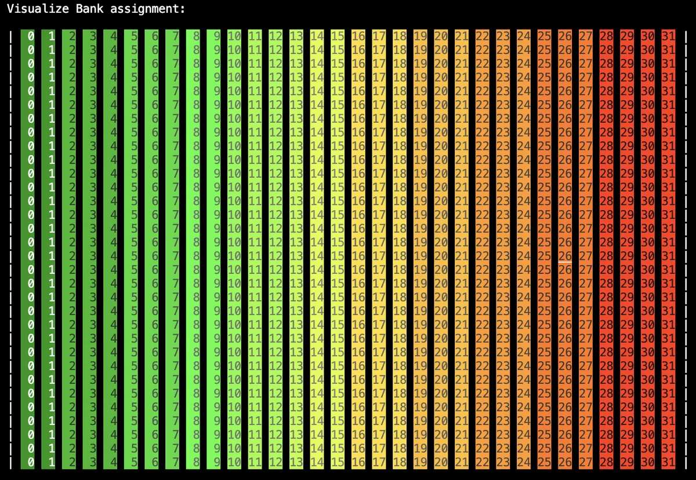
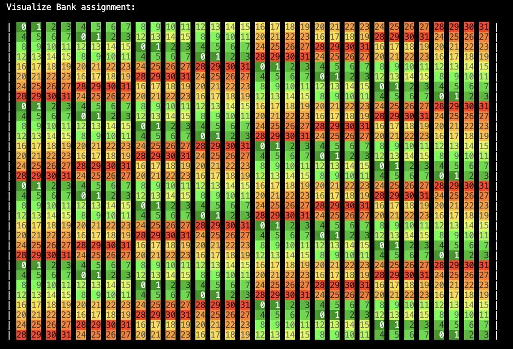
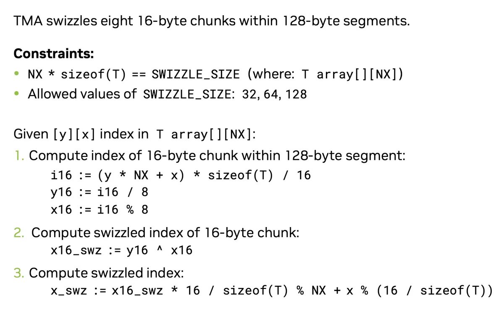
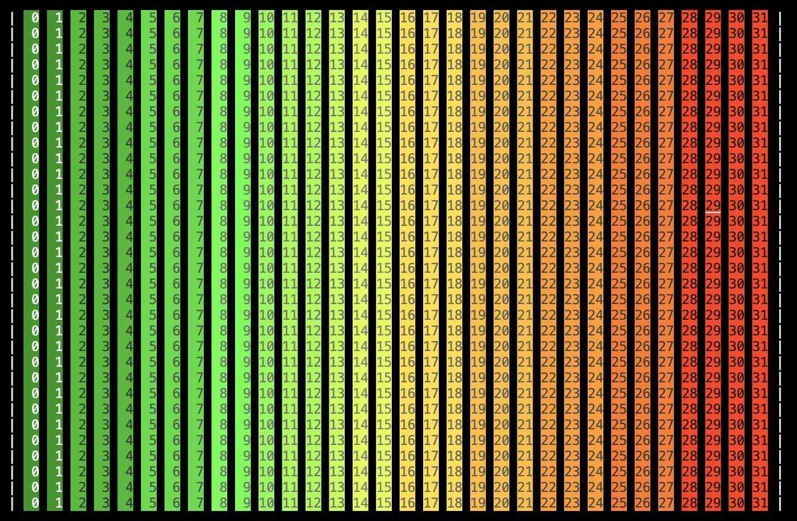
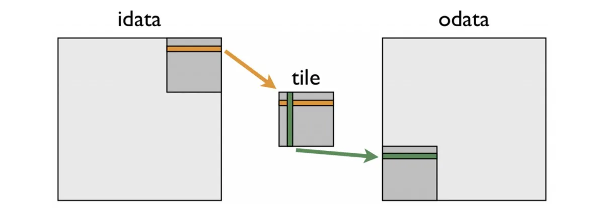

> 이 글은 @Simon V(https://github.com/simveit)의 허가를 받아 전재 및 번역하여 이 공식 계정에 게시한다. 원문 주소는 https://veitner.bearblog.dev/tma-introduction/ 이다.

# TMA 소개

2025년 4월 27일

data를 global memory에서 shared memory로, 그리고 그 반대로 효율적으로 전송하는 것은 CUDA application의 bottleneck인 경우가 많다. 따라서 이런 operation의 가장 빠른 mechanism을 충분히 활용해야 한다. TMA는 Hopper GPU의 새로운 feature이며, 주요 목표는 multi-dimensional array를 위해 global memory에서 shared memory로 data를 전송하는 효율적인 mechanism을 제공하는 것이다. 이 blog에서는 TMA를 사용해 2D array를 조작하는 방법을 설명한다.

기초에 집중하기 위해 매우 간단한 operation을 수행한다. matrix `M`이 주어졌을 때 matrix의 각 element에 `1`을 더하고 싶다.

## TensorMap 만들기

2D TMA operation을 활용하려면 `TensorMap`이 필요하다. 아래는 이를 만드는 방법이다.

```c++
int *d;
CHECK_CUDA_ERROR(cudaMalloc(&d, SIZE));
CHECK_CUDA_ERROR(cudaMemcpy(d, h_in, SIZE, cudaMemcpyHostToDevice));
void *tensor_ptr = (void *)d;

CUtensorMap tensor_map{};
// rank는 array의 dimension 수다.
constexpr uint32_t rank = 2;
uint64_t size[rank] = {GMEM_WIDTH, GMEM_HEIGHT};
// stride는 한 row의 첫 element에서 다음 row의 첫 element까지 가는 데 필요한 byte 수다. 16의 배수여야 한다.
uint64_t stride[rank - 1] = {GMEM_WIDTH * sizeof(int)};
// box_size는 TMA transfer target으로 쓰이는 shared memory buffer의 size다.
uint32_t box_size[rank] = {SMEM_WIDTH, SMEM_HEIGHT};
// element 사이의 거리이며 sizeof(element) 단위다. 예를 들어 stride가 2이면 complex-valued tensor의 real part만 load하는 데 사용할 수 있다.
uint32_t elem_stride[rank] = {1, 1};

// tensor descriptor를 만든다.
CUresult res = cuTensorMapEncodeTiled(
  &tensor_map,  // CUtensorMap *tensorMap,
  CUtensorMapDataType::CU_TENSOR_MAP_DATA_TYPE_INT32,
  rank,         // cuuint32_t tensorRank,
  tensor_ptr,   // void *globalAddress,
  size,         // const cuuint64_t *globalDim,
  stride,       // const cuuint64_t *globalStrides,
  box_size,     // const cuuint32_t *boxDim,
  elem_stride,  // const cuuint32_t *elementStrides,
  // interleave mode는 4 byte보다 작은 값을 더 빠르게 load하는 데 사용할 수 있다.
  CUtensorMapInterleave::CU_TENSOR_MAP_INTERLEAVE_NONE,
  // swizzle은 shared memory bank conflict를 피하는 데 사용할 수 있다.
  CUtensorMapSwizzle::CU_TENSOR_MAP_SWIZZLE_NONE,
  // L2 promotion은 cache policy 효과를 더 넓은 L2 cache line set으로 확장하는 데 사용할 수 있다.
  CUtensorMapL2promotion::CU_TENSOR_MAP_L2_PROMOTION_NONE,
  // TMA transfer는 boundary를 벗어난 element를 모두 zero로 설정한다.
  CUtensorMapFloatOOBfill::CU_TENSOR_MAP_FLOAT_OOB_FILL_NONE);

assert(res == CUDA_SUCCESS);
```

주석은 NVIDIA documentation(https://docs.nvidia.com/cuda/cuda-c-programming-guide/#asynchronous-data-copies-using-the-tensor-memory-accelerator-tma)에서 가져왔다. code에서 보듯 기본적으로 GMEM과 SMEM에 대한 configuration을 설정한다. matrix `d`는 `row-major` layout이라고 보고, 이 단계에서는 어떤 swizzling도 수행하지 않는다.

## Kernel

아래 kernel은 NVIDIA documentation에서 가져와 수정한 것이다. TMA의 기본 사용법을 볼 수 있다.

```c++
template <int BLOCK_SIZE>
__global__ void kernel(const __grid_constant__ CUtensorMap tensor_map) {
  // bulk tensor operation의 target shared memory buffer는 128 byte aligned여야 한다.
  __shared__ alignas(1024) int smem_buffer[BLOCK_SIZE * BLOCK_SIZE];

  // GMEM에서 top-left tile의 좌표다.
  int x = blockIdx.x * BLOCK_SIZE;
  int y = blockIdx.y * BLOCK_SIZE;

  int col = threadIdx.x % BLOCK_SIZE;
  int row = threadIdx.x / BLOCK_SIZE;

// shared memory barrier를 barrier에 참여하는 thread 수로 초기화한다.
#pragma nv_diag_suppress static_var_with_dynamic_init
  __shared__ barrier bar;

  if (threadIdx.x == 0) {
    // barrier를 초기화한다. block 안의 모든 `blockDim.x` thread가 참여한다.
    init(&bar, blockDim.x);
    // 초기화된 barrier가 async proxy에서 보이게 한다.
    cde::fence_proxy_async_shared_cta();
  }
  // 초기화된 barrier가 모든 thread에 보이도록 thread를 동기화한다.
  __syncthreads();

  barrier::arrival_token token;
  if (threadIdx.x == 0) {
    // bulk tensor copy를 시작한다.
    cde::cp_async_bulk_tensor_2d_global_to_shared(&smem_buffer, &tensor_map, x,
                                                  y, bar);
    // barrier에 arrive하고 들어올 것으로 예상되는 byte 수를 알린다.
    token = cuda::device::barrier_arrive_tx(bar, 1, sizeof(smem_buffer));
  } else {
    // 다른 thread는 arrive만 하면 된다.
    token = bar.arrive();
  }
  // data가 도착할 때까지 기다린다.
  bar.wait(std::move(token));

  // shared memory에서 상징적으로 값을 하나 수정한다.
  smem_buffer[row * BLOCK_SIZE + col] += 1;

  // shared memory write가 TMA engine에 보일 때까지 기다린다.
  cde::fence_proxy_async_shared_cta();
  __syncthreads();
  // thread 동기화 후 모든 thread의 write는 TMA engine에 보인다.

  // shared memory를 global memory로 copy하는 TMA transfer를 시작한다.
  if (threadIdx.x == 0) {
    cde::cp_async_bulk_tensor_2d_shared_to_global(&tensor_map, x, y,
                                                  &smem_buffer);
    // TMA transfer가 shared memory read를 완료할 때까지 기다린다.
    // 이전 bulk copy operation에서 "bulk async group"을 만든다.
    cde::cp_async_bulk_commit_group();
    // group이 shared memory read를 완료할 때까지 기다린다.
    cde::cp_async_bulk_wait_group_read<0>();
  }

  // barrier를 destroy한다. 이는 barrier의 memory region을 invalidate한다. kernel 안에 추가 computation이 있으면
  // shared memory barrier의 memory location을 reuse할 수 있게 한다.
  if (threadIdx.x == 0) {
    (&bar)->~barrier();
  }
}
```

아래에서

```c++
cde::cp_async_bulk_tensor_2d_global_to_shared(&smem_buffer, &tensor_map, x,
                                                  y, bar);
```

matrix tile을 shared memory로 copy한다. 여기서 x와 y는 matrix 안에서 top-left tile의 좌표에 대응한다. 그런 다음 shared memory에서 간단한 operation, 즉 각 element에 1을 더하는 operation을 수행하고 다시 global memory로 전달한다.


## Swizzling

shared memory에서는 bank conflict를 만날 수 있다. 이 주제의 추가 background를 원하면 NVIDIA documentation(https://docs.nvidia.com/cuda/parallel-thread-execution/index.html#data-movement-and-conversion-instructions-cp-async-bulk-tensor)의 전용 section을 읽을 수 있다.

bank conflict를 피하기 위해 tensor map에서 swizzle mode를 정의할 수 있다. TMA는 swizzled 방식으로 array를 전송하므로 shared memory의 column을 올바르게 index하려면 swizzled index를 사용해야 한다. kernel 조정은 다음과 같다.

```c++
template <int BLOCK_SIZE>
__global__ void kernel(const __grid_constant__ CUtensorMap tensor_map) {
  // bulk tensor operation의 target shared memory buffer는 128 byte aligned여야 한다.
  __shared__ alignas(256) int smem_buffer[BLOCK_SIZE * BLOCK_SIZE];

  // GMEM에서 top-left tile의 좌표다.
  int x = blockIdx.x * BLOCK_SIZE;
  int y = blockIdx.y * BLOCK_SIZE;

  int col = threadIdx.x % BLOCK_SIZE;
  int row = threadIdx.x / BLOCK_SIZE;
  int col_swizzle = (row % 2) ^ col;
// shared memory barrier를 barrier에 참여하는 thread 수로 초기화한다.
#pragma nv_diag_suppress static_var_with_dynamic_init
  __shared__ barrier bar;

  if (threadIdx.x == 0) {
    // barrier를 초기화한다. block 안의 모든 `blockDim.x` thread가 참여한다.
    init(&bar, blockDim.x);
    // 초기화된 barrier가 async proxy에서 보이게 한다.
    cde::fence_proxy_async_shared_cta();
  }
  // 초기화된 barrier가 모든 thread에 보이도록 thread를 동기화한다.
  __syncthreads();

  barrier::arrival_token token;
  if (threadIdx.x == 0) {
    // bulk tensor copy를 시작한다.
    cde::cp_async_bulk_tensor_2d_global_to_shared(&smem_buffer, &tensor_map, x,
                                                  y, bar);
    // barrier에 arrive하고 들어올 것으로 예상되는 byte 수를 알린다.
    token = cuda::device::barrier_arrive_tx(bar, 1, sizeof(smem_buffer));
  } else {
    // 다른 thread는 arrive만 하면 된다.
    token = bar.arrive();
  }
  // data가 도착할 때까지 기다린다.
  bar.wait(std::move(token));

  // shared memory에서 상징적으로 값을 하나 수정한다.
  smem_buffer[row * BLOCK_SIZE + col_swizzle] += 1;

  // shared memory write가 TMA engine에 보일 때까지 기다린다.
  cde::fence_proxy_async_shared_cta();
  __syncthreads();
  // thread 동기화 후 모든 thread의 write는 TMA engine에 보인다.

  // shared memory를 global memory로 copy하는 TMA transfer를 시작한다.
  if (threadIdx.x == 0) {
    cde::cp_async_bulk_tensor_2d_shared_to_global(&tensor_map, x, y,
                                                  &smem_buffer);
    // TMA transfer가 shared memory read를 완료할 때까지 기다린다.
    // 이전 bulk copy operation에서 "bulk async group"을 만든다.
    cde::cp_async_bulk_commit_group();
    // group이 shared memory read를 완료할 때까지 기다린다.
    cde::cp_async_bulk_wait_group_read<0>();
  }

  // barrier를 destroy한다. 이는 barrier의 memory region을 invalidate한다. kernel 안에 추가 computation이 있으면
  // shared memory barrier의 memory location을 reuse할 수 있게 한다.
  if (threadIdx.x == 0) {
    (&bar)->~barrier();
  }
}
```

그리고 tensor map에서는 swizzle setting을 조정해야 한다.

```c++
int *d;
  CHECK_CUDA_ERROR(cudaMalloc(&d, SIZE));
  CHECK_CUDA_ERROR(cudaMemcpy(d, h_in, SIZE, cudaMemcpyHostToDevice));
  void *tensor_ptr = (void *)d;

  CUtensorMap tensor_map{};
  // rank는 array의 dimension 수다.
  constexpr uint32_t rank = 2;
  uint64_t size[rank] = {GMEM_WIDTH, GMEM_HEIGHT};
  // stride는 한 row의 첫 element에서 다음 row의 첫 element까지 가는 데 필요한 byte 수다. 16의 배수여야 한다.
  uint64_t stride[rank - 1] = {GMEM_WIDTH * sizeof(int)};
  // box_size는 TMA transfer target으로 쓰이는 shared memory buffer의 size다.
  uint32_t box_size[rank] = {SMEM_WIDTH, SMEM_HEIGHT};
  // element 사이의 거리이며 sizeof(element) 단위다. 예를 들어 stride가 2이면 complex-valued tensor의 real part만 load하는 데 사용할 수 있다.
  uint32_t elem_stride[rank] = {1, 1};

  // tensor descriptor를 만든다.
  CUresult res = cuTensorMapEncodeTiled(
      &tensor_map,  // CUtensorMap *tensorMap,
      CUtensorMapDataType::CU_TENSOR_MAP_DATA_TYPE_INT32,
      rank,         // cuuint32_t tensorRank,
      tensor_ptr,   // void *globalAddress,
      size,         // const cuuint64_t *globalDim,
      stride,       // const cuuint64_t *globalStrides,
      box_size,     // const cuuint32_t *boxDim,
      elem_stride,  // const cuuint32_t *elementStrides,
      // interleave mode는 4 byte보다 작은 값을 더 빠르게 load하는 데 사용할 수 있다.
      CUtensorMapInterleave::CU_TENSOR_MAP_INTERLEAVE_NONE,
      // swizzle은 shared memory bank conflict를 피하는 데 사용할 수 있다.
      CUtensorMapSwizzle::CU_TENSOR_MAP_SWIZZLE_32B,
      // L2 promotion은 cache policy 효과를 더 넓은 L2 cache line set으로 확장하는 데 사용할 수 있다.
      CUtensorMapL2promotion::CU_TENSOR_MAP_L2_PROMOTION_NONE,
      // TMA transfer는 boundary를 벗어난 element를 모두 zero로 설정한다.
      CUtensorMapFloatOOBfill::CU_TENSOR_MAP_FLOAT_OOB_FILL_NONE);

  assert(res == CUDA_SUCCESS);
```

## 결론

위에서는 Hopper architecture에서 TMA를 사용하는 매우 간단한 application을 보여주었다. 또한 swizzle은 꽤 복잡하므로 더 잘 이해하려면 추가 실험과 더 깊은 연구가 도움이 될 것이다. 좋은 학습 resource 제안이 있다면 기꺼이 듣고 싶다. 코드는 Github(https://github.com/simveit/tma_intro)에서 찾을 수 있다.


# Making matrix transpose really fast on Hopper GPUs

2025년 5월 2일

## 소개

이 blog에서는 Hopper GPU를 위한 효율적인 matrix transpose operation을 구현하는 방법을 보여주고 싶다. 나는 native CUDA API를 사용하고 abstraction은 사용하지 않을 것이다. 이것이 hardware detail을 배우는 좋은 방법이라고 믿기 때문이다. 앞으로 보게 되듯 swizzle을 사용하고 swizzled index를 normal index에 mapping할 수 있는 능력이 매우 중요하다. 아쉽게도 이것은 다른 훌륭한 CUDA programming guide에 잘 기록되어 있지 않다. 이 blog가 더 많은 사람이 native CUDA로 high-performance kernel을 구현하는 데 도움이 되기를 바란다.

## Swizzling

### swizzle mode 시각화

matrix transpose를 구현하기 전에 swizzle을 이해하는 것이 중요하다. swizzle은 shared memory conflict를 피하는 technique이다. 아래에서는 Hopper GPU에서 TMA의 다음 개념을 사용할 것이다. 발생 가능한 bank conflict를 더 잘 이해하기 위해 2d `int` matrix의 bank allocation을 시각화해보자. swizzle을 사용하지 않는 다음 layout을 사용한다.

```c++
const int GMEM_WIDTH = 32;
const int GMEM_HEIGHT = 32;
const int BLOCK_SIZE = 32;
const int SMEM_WIDTH = BLOCK_SIZE;
const int SMEM_HEIGHT = BLOCK_SIZE;
  
// tensor descriptor를 만든다.
CUresult res = cuTensorMapEncodeTiled(
    &tensor_map,  // CUtensorMap *tensorMap,
    CUtensorMapDataType::CU_TENSOR_MAP_DATA_TYPE_INT32,
    rank,         // cuuint32_t tensorRank,
    tensor_ptr,   // void *globalAddress,
    size,         // const cuuint64_t *globalDim,
    stride,       // const cuuint64_t *globalStrides,
    box_size,     // const cuuint32_t *boxDim,
    elem_stride,  // const cuuint32_t *elementStrides,
    // interleave mode는 4 byte보다 작은 값을 더 빠르게 load하는 데 사용할 수 있다.
    CUtensorMapInterleave::CU_TENSOR_MAP_INTERLEAVE_NONE,
    // swizzle은 shared memory bank conflict를 피하는 데 사용할 수 있다.
    CUtensorMapSwizzle::CU_TENSOR_MAP_SWIZZLE_NONE,
    // L2 promotion은 cache policy 효과를 더 넓은 L2 cache line set으로 확장하는 데 사용할 수 있다.
    CUtensorMapL2promotion::CU_TENSOR_MAP_L2_PROMOTION_NONE,
    // boundary를 벗어난 모든 element는 TMA가 zero로 설정한다.
    CUtensorMapFloatOOBfill::CU_TENSOR_MAP_FLOAT_OOB_FILL_NONE);
```

그런 다음 shared memory block을 아래처럼 채운다.

```c++
smem_buffer[row * BLOCK_SIZE + col] = (row * BLOCK_SIZE + col) % 32;
```

이를 시각화할 수 있다.



각 column이 하나의 bank에 할당된 것을 볼 수 있다. 이는 같은 warp의 thread가 같은 column에 access하면 bank conflict가 생긴다는 뜻이다. 이제 128B swizzle mode를 사용하도록 layout을 수정할 수 있다.

```c++
// tensor descriptor를 만든다.
CUresult res = cuTensorMapEncodeTiled(
    &tensor_map,  // CUtensorMap *tensorMap,
    CUtensorMapDataType::CU_TENSOR_MAP_DATA_TYPE_INT32,
    rank,         // cuuint32_t tensorRank,
    tensor_ptr,   // void *globalAddress,
    size,         // const cuuint64_t *globalDim,
    stride,       // const cuuint64_t *globalStrides,
    box_size,     // const cuuint32_t *boxDim,
    elem_stride,  // const cuuint32_t *elementStrides,
    // interleave mode는 4 byte보다 작은 값을 더 빠르게 load하는 데 사용할 수 있다.
    CUtensorMapInterleave::CU_TENSOR_MAP_INTERLEAVE_NONE,
    // swizzle은 shared memory bank conflict를 피하는 데 사용할 수 있다.
    CUtensorMapSwizzle::CU_TENSOR_MAP_SWIZZLE_128B,
    // L2 promotion은 cache policy 효과를 더 넓은 L2 cache line set으로 확장하는 데 사용할 수 있다.
    CUtensorMapL2promotion::CU_TENSOR_MAP_L2_PROMOTION_NONE,
    // boundary를 벗어난 모든 element는 TMA가 zero로 설정한다.
    CUtensorMapFloatOOBfill::CU_TENSOR_MAP_FLOAT_OOB_FILL_NONE);

assert(res == CUDA_SUCCESS);

```

SMEM의 값에 같은 assignment를 수행하면 다음 그림이 나온다.



이제 잠재적인 bank conflict가 크게 줄어든 것을 볼 수 있다. swizzle mode는 periodic하며, matrix에서 `8 * 32 * sizeof(int) = 128`개 element마다 반복된다.

### 올바른 index로 shared memory 수정하기

TMA는 global memory에서 shared memory로 data를 전송할 때 자동으로 data swizzle을 수행한다. 그러면 이 swizzled index를 어떻게 복원할까? NVIDIA official documentation(https://docs.nvidia.com/cuda/cuda-c-programming-guide/#tma-swizzle)에는 TMA swizzle의 구체적 구현이 자세히 설명되어 있지 않지만, Igor Terentyev의 GTC Talk(https://www.nvidia.com/en-us/on-demand/session/gtc24-s62192/)에서 관련 계산 formula를 제공한다. 구체적인 formula는 다음과 같다.




> 그림 해설 시작

이 그림은 128 byte segment 안에서 16 byte block에 대해 swizzle operation을 수행하는 index 계산 방법을 자세히 설명한다.

#### 1. constraint
- `NX * sizeof(T) == SWIZZLE_SIZE`
여기서 `T array[][NX]`이며, 2D array의 각 row에는 `NX`개 element가 있고 `T`는 element type이다.
즉 각 row의 byte 수가 `SWIZZLE_SIZE`와 같아야 한다.
- `SWIZZLE_SIZE`의 허용 값: 32, 64, 128
이는 각 row의 byte 수가 32, 64, 128 byte 중 하나여야 함을 뜻한다.

#### 2. index 계산 flow

2D array `T array[][NX]`가 있고, `[y][x]` 위치에 대해 swizzle 후 index를 계산한다고 가정한다.

##### step 1: 128 byte segment 안에서 16 byte block의 index 계산
- `i16 := (y * NX + x) * sizeof(T) / 16`
먼저 2D index `[y][x]`를 1D linear index로 바꾸고, element byte 수를 곱해 byte offset을 얻은 뒤, 마지막으로 16으로 나누어 어느 16 byte block에 속하는지 얻는다.
- `y16 := i16 / 8`
128 byte segment에는 8개의 16 byte block이 있으므로 `i16`을 8로 나눠 block group number를 얻는다.
- `x16 := i16 % 8`
`i16`을 8로 modulo하여 128 byte segment 안의 intra-block offset을 얻는다.

##### step 2: 16 byte block의 swizzled index 계산
- `x16_swz := y16 ^ x16`
여기서는 XOR(`^`) operation을 사용한다. `y16`과 `x16`에 XOR을 수행해 swizzled intra-block offset을 얻는다.

##### step 3: 최종 swizzled index 계산
- `x_swz := x16_swz * 16 / sizeof(T) % NX + x % (16 / sizeof(T))`
`x16_swz * 16 / sizeof(T)`: swizzled block의 start element index, element 단위다.
`% NX`: index가 row를 넘지 않도록 보장한다.
`x % (16 / sizeof(T))`: 16 byte block 안의 element offset이다.


> 그림 해설 끝


`sizeof(T)=4`인 data type에 대해 다음처럼 구현할 수 있다.

```c++
template <int BLOCK_SIZE>
__device__ int calculate_col_swizzle(int row, int col) {
  int i16 = (row * BLOCK_SIZE + col) * 4 >> 4;
  int y16 = i16 >> 3;
  int x16 = i16 & 7;
  int x16_swz = y16 ^ x16;
  return ((x16_swz * 4) & (BLOCK_SIZE - 1)) + (col & 3);
}
```

다음 code로 formula의 correctness를 검증할 수 있다.

```c++
int col_swizzle = calculate_col_swizzle<BLOCK_SIZE>(row, col);
smem_buffer[row * BLOCK_SIZE + col_swizzle] = (row * BLOCK_SIZE + col) % 32;
```

swizzled layout을 사용하면 다음 결과를 얻는다.



## application: matrix transpose

### naive method

다음 그림은 NVIDIA blog(https://developer.nvidia.com/blog/efficient-matrix-transpose-cuda-cc/)에서 가져온 것이며, shared memory에서 transpose를 수행하는 방법을 매우 명확히 보여준다.



matrix block 하나를 가져와 그 block을 transpose한 뒤 matrix의 다른 쪽에 배치한다. 아래에서는 swizzle을 사용하지 않고 TMA와 layout으로 이 naive algorithm을 구현하는 방법을 개괄한다. 전체 code는 blog 끝의 link에 있는 내 github repository에서 찾을 수 있다. 두 개의 layout이 필요하며, 이 둘은 transpose되어 있다.

```c++
// tensor descriptor를 만든다.
CUresult res = cuTensorMapEncodeTiled(
  &tensor_map,  // CUtensorMap *tensorMap,
  CUtensorMapDataType::CU_TENSOR_MAP_DATA_TYPE_FLOAT32,
  rank,         // cuuint32_t tensorRank,
  tensor_ptr,   // void *globalAddress,
  size,         // const cuuint64_t *globalDim,
  stride,       // const cuuint64_t *globalStrides,
  box_size,     // const cuuint32_t *boxDim,
  elem_stride,  // const cuuint32_t *elementStrides,
  CUtensorMapInterleave::CU_TENSOR_MAP_INTERLEAVE_NONE,
  CUtensorMapSwizzle::CU_TENSOR_MAP_SWIZZLE_NONE,
  CUtensorMapL2promotion::CU_TENSOR_MAP_L2_PROMOTION_NONE,
  CUtensorMapFloatOOBfill::CU_TENSOR_MAP_FLOAT_OOB_FILL_NONE);

assert(res == CUDA_SUCCESS);

CUresult res_tr = cuTensorMapEncodeTiled(
  &tensor_map_tr,  // CUtensorMap *tensorMap,
  CUtensorMapDataType::CU_TENSOR_MAP_DATA_TYPE_FLOAT32,
  rank,           // cuuint32_t tensorRank,
  tensor_ptr_tr,  // void *globalAddress,
  size_tr,        // const cuuint64_t *globalDim,
  stride,         // const cuuint64_t *globalStrides,
  box_size_tr,    // const cuuint32_t *boxDim,
  elem_stride,    // const cuuint32_t *elementStrides,
  CUtensorMapInterleave::CU_TENSOR_MAP_INTERLEAVE_NONE,
  CUtensorMapSwizzle::CU_TENSOR_MAP_SWIZZLE_NONE,
  CUtensorMapL2promotion::CU_TENSOR_MAP_L2_PROMOTION_NONE,
  CUtensorMapFloatOOBfill::CU_TENSOR_MAP_FLOAT_OOB_FILL_NONE);

assert(res_tr == CUDA_SUCCESS);
```

다음 kernel로 transpose를 수행할 수 있다.

```c++
template <int BLOCK_SIZE>
__global__ void kernel(const __grid_constant__ CUtensorMap tensor_map,
                       const __grid_constant__ CUtensorMap tensor_map_tr) {
  // bulk tensor operation 하나의 target shared memory buffer는 128 byte aligned여야 한다.
  __shared__ alignas(1024) float smem_buffer[BLOCK_SIZE * BLOCK_SIZE];
  __shared__ alignas(1024) float smem_buffer_tr[BLOCK_SIZE * BLOCK_SIZE];
  // GMEM에서 top-left block의 좌표다.
  int x = blockIdx.x * BLOCK_SIZE;
  int y = blockIdx.y * BLOCK_SIZE;

  int col = threadIdx.x % BLOCK_SIZE;
  int row = threadIdx.x / BLOCK_SIZE;

// shared memory barrier를 참여 thread 수로 초기화한다.
#pragma nv_diag_suppress static_var_with_dynamic_init
  __shared__ barrier bar;

  if (threadIdx.x == 0) {
    // barrier를 초기화한다. 모든 `blockDim.x` thread가 참여한다.
    init(&bar, blockDim.x);
    // 초기화된 barrier가 async proxy에서 보이게 한다.
    cde::fence_proxy_async_shared_cta();
  }
  // 초기화된 barrier가 모든 thread에 보이도록 thread를 동기화한다.
  __syncthreads();

  barrier::arrival_token token;
  if (threadIdx.x == 0) {
    // bulk tensor copy를 시작한다.
    cde::cp_async_bulk_tensor_2d_global_to_shared(&smem_buffer, &tensor_map, x,
                                                  y, bar);
    // barrier에 arrive하고 곧 들어올 byte 수를 알린다.
    token = cuda::device::barrier_arrive_tx(bar, 1, sizeof(smem_buffer));
  } else {
    // 다른 thread는 arrive만 한다.
    token = bar.arrive();
  }
  // data가 도착할 때까지 기다린다.
  bar.wait(std::move(token));

  // block을 transpose한다.
  smem_buffer_tr[col * BLOCK_SIZE + row] = smem_buffer[row * BLOCK_SIZE + col];

  // shared memory write가 TMA engine에 보일 때까지 기다린다.
  cde::fence_proxy_async_shared_cta();
  __syncthreads();
  // thread 동기화 후 모든 thread의 write는 TMA engine에 보인다.

  // shared memory를 global memory로 copy하는 TMA transfer를 시작한다.
  if (threadIdx.x == 0) {
    // matrix 안에서 block을 transpose한다.
    cde::cp_async_bulk_tensor_2d_shared_to_global(&tensor_map_tr, y, x,
                                                  &smem_buffer_tr);
    // TMA transfer가 shared memory read를 완료할 때까지 기다린다.
    // 이전 bulk copy operation에서 "bulk async group"을 만든다.
    cde::cp_async_bulk_commit_group();
    // group이 shared memory read를 완료할 때까지 기다린다.
    cde::cp_async_bulk_wait_group_read<0>();
  }

  // barrier를 destroy한다. barrier의 memory region이 invalidate된다. kernel에서 추가 computation이 발생하면 shared memory barrier의 memory location을 reuse할 수 있다.
  if (threadIdx.x == 0) {
    (&bar)->~barrier();
  }
}

```

transpose에 필요한 것은 다음뿐이다.

```c++
smem_buffer_tr[col * BLOCK_SIZE + row] = smem_buffer[row * BLOCK_SIZE + col];
```

완료되면 transpose된 block을 transpose layout의 다른 쪽, 즉 `x`와 `y`를 swap한 위치로 transfer할 수 있다.

이 kernel은 32768 x 32768 matrix transpose에서 다음 성능을 달성했다.

```shell
Latency = 9.81191 ms
Bandwidth = 875.46 GB/s
% of max = 26.5291 %
```
### swizzled transpose

위 index formula가 생기면 swizzled transpose는 원리상 매우 직접적이다. 아쉽게도 이 formula는 찾기 어려워 올바르게 만드는 데 시간이 좀 걸렸다. layout에서는 swizzle mode만 다음으로 바꾸면 된다.

```c++
CUtensorMapSwizzle::CU_TENSOR_MAP_SWIZZLE_128B
```

중요한 점은 TMA가 `GMEM->SMEM` 또는 `SMEM->GMEM` 변환 시 memory를 swizzle하고 unswizzle한다는 점을 고려하기 위해 위 formula를 사용해야 한다는 것이다. input layout은 row-major format이고 output layout은 column-major format이다. 따라서 input block의 shared memory에는 `col` 대신 `col_swizzle`을 사용해야 하고, output block의 shared memory에는 `row` 대신 `row_swizzle`을 사용해야 한다. 전체 kernel은 다음과 같다.

```c++
template <int BLOCK_SIZE>
__device__ int calculate_col_swizzle(int row, int col) {
  int i16 = (row * BLOCK_SIZE + col) * 4 >> 4;
  int y16 = i16 >> 3;
  int x16 = i16 & 7;
  int x16_swz = y16 ^ x16;
  return ((x16_swz * 4) & (BLOCK_SIZE - 1)) + (col & 3);
}

template <int BLOCK_SIZE>
__device__ int calculate_row_swizzle(int row, int col) {
  int i16_tr = (col * BLOCK_SIZE + row) * 4 >> 4;
  int y16_tr = i16_tr >> 3;
  int x16_tr = i16_tr & 7;
  int x16_swz_tr = y16_tr ^ x16_tr;
  return ((x16_swz_tr * 4) & (BLOCK_SIZE - 1)) + (row & 3);
}

template <int BLOCK_SIZE, int LOG_BLOCK>
__global__ void kernel(const __grid_constant__ CUtensorMap tensor_map,
                       const __grid_constant__ CUtensorMap tensor_map_tr) {
  // bulk tensor operation의 target shared memory buffer는 128 byte aligned여야 한다.
  __shared__ alignas(1024) float smem_buffer[BLOCK_SIZE * BLOCK_SIZE];
  __shared__ alignas(1024) float smem_buffer_tr[BLOCK_SIZE * BLOCK_SIZE];
  // GMEM에서 top-left block의 좌표다.
  int x = blockIdx.x * BLOCK_SIZE;
  int y = blockIdx.y * BLOCK_SIZE;

  int col = threadIdx.x & (BLOCK_SIZE - 1);
  int row = threadIdx.x >> LOG_BLOCK;

  int col_swizzle = calculate_col_swizzle<BLOCK_SIZE>(row, col);

  int row_swizzle = calculate_row_swizzle<BLOCK_SIZE>(row, col);

// shared memory barrier를 참여 thread 수로 초기화한다.
#pragma nv_diag_suppress static_var_with_dynamic_init
  __shared__ barrier bar;

  if (threadIdx.x == 0) {
    // barrier를 초기화한다. 모든 `blockDim.x` thread가 참여한다.
    init(&bar, blockDim.x);
    // 초기화된 barrier가 async proxy에서 보이게 한다.
    cde::fence_proxy_async_shared_cta();
  }
  // 초기화된 barrier가 모든 thread에 보이도록 thread를 동기화한다.
  __syncthreads();

  barrier::arrival_token token;
  if (threadIdx.x == 0) {
    // bulk tensor copy를 시작한다.
    cde::cp_async_bulk_tensor_2d_global_to_shared(&smem_buffer, &tensor_map, x,
                                                  y, bar);
    // barrier에 arrive하고 곧 들어올 byte 수를 알린다.
    token = cuda::device::barrier_arrive_tx(bar, 1, sizeof(smem_buffer));
  } else {
    // 다른 thread는 arrive만 한다.
    token = bar.arrive();
  }
  // data가 도착할 때까지 기다린다.
  bar.wait(std::move(token));

  // Transpose tile.
  smem_buffer_tr[col * BLOCK_SIZE + row_swizzle] =
      smem_buffer[row * BLOCK_SIZE + col_swizzle];

  // shared memory write가 TMA engine에 보일 때까지 기다린다.
  cde::fence_proxy_async_shared_cta();
  __syncthreads();
  // thread 동기화 후 모든 thread의 write는 TMA engine에 보인다.

  // Initiate TMA transfer to copy shared memory to global memory
  if (threadIdx.x == 0) {
    // matrix 안에서 block을 transpose한다.
    cde::cp_async_bulk_tensor_2d_shared_to_global(&tensor_map_tr, y, x,
                                                  &smem_buffer_tr);
    // TMA transfer가 shared memory read를 완료할 때까지 기다린다.
    // 이전 bulk copy operation에서 "bulk async group"을 만든다.
    cde::cp_async_bulk_commit_group();
    // group이 shared memory read를 완료할 때까지 기다린다.
    cde::cp_async_bulk_wait_group_read<0>();
  }

  // barrier를 destroy한다. barrier의 memory region이 invalidate된다. kernel에서 추가 computation이 발생하면 shared memory barrier의 memory location을 reuse할 수 있다.
  if (threadIdx.x == 0) {
    (&bar)->~barrier();
  }
}
```

이 kernel은 32768 x 32768 matrix transpose에서 다음 성능을 달성했다.

```shell
Latency = 6.86226 ms
Bandwidth = 1251.76 GB/s
% of max = 37.9323 %
```

### thread batching

matrix transpose 같은 memory bandwidth 문제에서는, 보통 reduce 또는 scan 관련 blog 글에서 읽을 수 있듯, 각 thread가 여러 element를 처리하게 하면 큰 성능 향상을 얻을 수 있다. 다음처럼 구현할 수 있다. thread의 일부만 시작한다. 즉 `BLOCK_SIZE * BLOCK_SIZE` thread를 시작하는 대신 `BLOCK_SIZE * BLOCK_SIZE / BATCH_SIZE` thread만 시작한다. 그런 다음 각 thread가 `BATCH_SIZE` element를 처리하게 한다. 참고로 우리의 구현에서는 `BLOCK_SIZE=32`를 선택해 최대 thread 수를 시작한다. `BLOCK_SIZE=64`로 늘리고 `BATCH_SIZE=16`을 사용해 다시 최대 thread 수를 시작할 수도 있다.

matrix transpose 같은 memory bandwidth 문제에서는, 보통 내가 reduction 또는 scan에 관해 쓴 blog 글에서 읽을 수 있듯, 각 thread가 여러 element를 처리하게 하면 큰 성능 향상을 얻을 수 있다. 다음처럼 구현할 수 있다. thread의 일부만 시작한다. 즉 `BLOCK_SIZE * BLOCK_SIZE` thread를 시작하는 대신 `BLOCK_SIZE * BLOCK_SIZE / BATCH_SIZE` thread만 시작한다. 그런 다음 각 thread가 `BATCH_SIZE` element를 처리하게 한다. 참고로 우리의 구현에서는 `BLOCK_SIZE=32`를 선택해 최대 thread 수를 시작한다. `BLOCK_SIZE=64`로 늘리고 `BATCH_SIZE=16`을 사용해 다시 최대 thread 수를 시작할 수도 있다.

전체 kernel은 다음과 같다.

```c++
template <int BLOCK_SIZE>
__device__ int calculate_col_swizzle(int row, int col) {
  int i16 = (row * BLOCK_SIZE + col) * 4 >> 4;
  int y16 = i16 >> 3;
  int x16 = i16 & 7;
  int x16_swz = y16 ^ x16;
  return ((x16_swz * 4) & (BLOCK_SIZE - 1)) + (col & 3);
}

template <int BLOCK_SIZE>
__device__ int calculate_row_swizzle(int row, int col) {
  int i16_tr = (col * BLOCK_SIZE + row) * 4 >> 4;
  int y16_tr = i16_tr >> 3;
  int x16_tr = i16_tr & 7;
  int x16_swz_tr = y16_tr ^ x16_tr;
  return ((x16_swz_tr * 4) & (BLOCK_SIZE - 1)) + (row & 3);
}

template <int BLOCK_SIZE, int LOG_BLOCK, int BATCH_SIZE, int LOG_BATCH_SIZE>
__global__ void kernel(const __grid_constant__ CUtensorMap tensor_map,
                       const __grid_constant__ CUtensorMap tensor_map_tr) {
  // bulk tensor operation의 target shared memory buffer는 128 byte aligned여야 한다.
  __shared__ alignas(1024) float smem_buffer[BLOCK_SIZE * BLOCK_SIZE];
  __shared__ alignas(1024) float smem_buffer_tr[BLOCK_SIZE * BLOCK_SIZE];
  // GMEM에서 top-left block의 좌표다.
  int x = blockIdx.x * BLOCK_SIZE;
  int y = blockIdx.y * BLOCK_SIZE;

  int col = (threadIdx.x & (BLOCK_SIZE / BATCH_SIZE - 1)) * BATCH_SIZE;
  int row = threadIdx.x >> (LOG_BLOCK - LOG_BATCH_SIZE);

// shared memory barrier를 참여 thread 수로 초기화한다.
#pragma nv_diag_suppress static_var_with_dynamic_init
  __shared__ barrier bar;

  if (threadIdx.x == 0) {
    // barrier를 초기화한다. 모든 `blockDim.x` thread가 참여한다.
    init(&bar, blockDim.x);
    // 초기화된 barrier가 async proxy에서 보이게 한다.
    cde::fence_proxy_async_shared_cta();
  }
  // 초기화된 barrier가 모든 thread에 보이도록 thread를 동기화한다.
  __syncthreads();

  barrier::arrival_token token;
  if (threadIdx.x == 0) {
    // bulk tensor copy를 시작한다.
    cde::cp_async_bulk_tensor_2d_global_to_shared(&smem_buffer, &tensor_map, x,
                                                  y, bar);
    // barrier에 arrive하고 곧 들어올 byte 수를 알린다.
    token = cuda::device::barrier_arrive_tx(bar, 1, sizeof(smem_buffer));
  } else {
    // 다른 thread는 arrive만 한다.
    token = bar.arrive();
  }
  // data가 도착할 때까지 기다린다.
  bar.wait(std::move(token));

  // block을 transpose한다.
#pragma unroll
  for (int j = 0; j < BATCH_SIZE; j++) {
    int col_ = col + j;
    int row_ = row;
    int col_swizzle = calculate_col_swizzle<BLOCK_SIZE>(row_, col_);
    int row_swizzle = calculate_row_swizzle<BLOCK_SIZE>(row_, col_);

    smem_buffer_tr[col_ * BLOCK_SIZE + row_swizzle] =
        smem_buffer[row_ * BLOCK_SIZE + col_swizzle];
  }
  // shared memory write가 TMA engine에 보일 때까지 기다린다.
  cde::fence_proxy_async_shared_cta();
  __syncthreads();
  // thread 동기화 후 모든 thread의 write는 TMA engine에 보인다.

  // shared memory를 global memory로 copy하는 TMA transfer를 시작한다.
  if (threadIdx.x == 0) {
    // matrix 안에서 block을 transpose한다.
    cde::cp_async_bulk_tensor_2d_shared_to_global(&tensor_map_tr, y, x,
                                                  &smem_buffer_tr);
    // TMA transfer가 shared memory read를 완료할 때까지 기다린다.
    // 이전 bulk copy operation에서 "bulk async group"을 만든다.
    cde::cp_async_bulk_commit_group();
    // group이 shared memory read를 완료할 때까지 기다린다.
    cde::cp_async_bulk_wait_group_read<0>();
  }

  // barrier를 destroy한다. barrier의 memory region이 invalidate된다. kernel에서 추가 computation이 발생하면 shared memory barrier의 memory location을 reuse할 수 있다.
  if (threadIdx.x == 0) {
    (&bar)->~barrier();
  }
}
```

이 kernel은 32768 x 32768 matrix transpose에서 다음 성능을 달성했다.

```shell
Latency = 3.09955 ms
Bandwidth = 2771.35 GB/s
% of max = 83.9804 %
```

## Conclusion

swizzled index에서 index를 얻는 formula가 생기면 Hopper architecture에서 matrix transpose를 매우 효율적인 방식으로 구현하는 것은 아주 간단하다는 것을 보았다. CUTLASS를 사용해 같은 operation을 수행하는 훌륭한 blog 글도 있지만, 나는 어떤 abstraction도 사용하지 않고 operation을 구현하는 것이 교육적으로 의미 있다고 믿는다. CUTLASS에 관심이 있다면 이 blog 글(https://research.colfax-intl.com/tutorial-matrix-transpose-in-cutlass/)을 확인할 수 있다.


