# 마이크로벤치마킹과 명령어 수준 분석으로 NVIDIA Ampere 아키텍처 해부하기

## 마이크로벤치마킹과 명령어 수준 분석으로 NVIDIA Ampere 아키텍처 해부하기

> 이 글은 [CUDA-MODE 강의 노트 제8강: CUDA 성능 체크리스트](https://mp.weixin.qq.com/s/zJLDVF-yjuZ_lMjaCHoS5g)에서 언급된 논문 2편 중 하나로, 마이크로벤치마킹(Microbenchmarking)과 명령어 수준 분석(Instruction-level Analysis)을 통해 NVIDIA Ampere 아키텍처를 해부하는 내용이다. CUDA-MODE 제8강의 지식 보충으로 해설을 작성한다.

### 제목 & 저자

- 논문 링크：https://arxiv.org/pdf/2208.11174

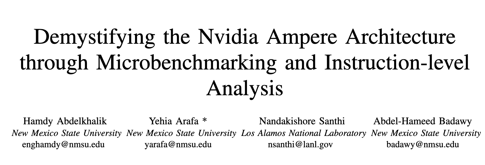

논문 제목은 "마이크로벤치마킹과 명령어 수준 분석으로 NVIDIA Ampere 아키텍처 해부하기"이다. 아래에 4명의 저자 정보가 나열되어 있으며, 이들은 각각 New Mexico State University와 Los Alamos National Laboratory 소속이다.

> 이 논문에서 마이크로벤치마크 코드 일부가 공개되어 있다：https://www.stuffedcow.net/research/cudabmk?q=research/cudabmk 및 WMMA 명령어 관련 마이크로벤치마크 테스트 코드는 공개되지 않았다. 또한 이 코드는 비교적 오래된 CUDA 버전을 사용하여 일부 API가 최신 CUDA와 호환되지 않는다.

### 초록

GPU는 AI, 데이터 분석, HPC 등 범용 워크로드를 가속하는 주요 하드웨어가 되었다. 지난 10여 년간 연구자들은 다양한 GPU 아키텍처의 마이크로아키텍처 특성을 해부하고 평가하는 작업을 해왔으며, 이는 하드웨어를 더 잘 이해하고 더 효율적인 워크로드와 애플리케이션을 구축하는 데 필수적이다. 많은 연구가 Volta, Turing 등 최근 NVIDIA 아키텍처를 연구하고 이전 세대인 Ampere와 비교해왔다. 그러나 Ampere 아키텍처의 일부 마이크로아키텍처 특성, 예를 들어 다양한 명령어의 클록 사이클 수는 아직 광범위하게 연구되지 않았다. 이 논문은 마이크로벤치마크를 사용하여 NVIDIA GPU의 명령어 집합 아키텍처(ISA)에서 발견된 다양한 데이터 타입의 명령어별(PTX ISA 명령어) 클록 사이클 수와 이에 대응하는 SASS ISA 명령어를 연구한다. 저자들은 나아가 각 메모리 단위에 접근하는 데 필요한 클록 사이클 수를 계산한다. WMMA API를 사용하여 Ampere 아키텍처의 새로운 Tensor Core를 해부하고, 다양한 데이터 타입과 입력 형상에 대한 명령어별 클록 사이클 수와 처리량을 측정한다. 연구 결과는 소프트웨어 개발자와 하드웨어 아키텍트에게 지침을 제공할 것이다. 또한 여기서의 명령어별 클록 사이클 수는 성능 모델링 시뮬레이터와 도구에서 하드웨어 성능을 시뮬레이션하고 예측하는 데 광범위하게 사용된다.

### 소개

GPU는 신경망에서 과학 계산에 이르기까지 다양한 범용 애플리케이션을 가속하는 주요 하드웨어가 되었다. NVIDIA Ampere 아키텍처 기반 슈퍼컴퓨터는 세계에서 가장 강력한 슈퍼컴퓨터가 되었다.

NVIDIA는 약 2년마다 새로운 아키텍처를 제공하지만 마이크로아키텍처 특성에 대한 정보가 거의 없어, 이러한 특성의 효과를 정량화하기 어렵다. 이에 따라 새로운 특성이 애플리케이션 성능에 미치는 영향을 연구하는 연구자들의 수요가 생겼다. NVIDIA는 딥 뉴럴 네트워크를 가속하기 위해 Tensor Core(TC) 유닛을 도입했으며, 이는 Volta 버전부터 도입되었다. 이 TC 버전은 FP16 및 FP32 정밀도 연산에서 실행된다. Ampere 아키텍처는 TC에 희소성 특성과 Int8, Int4, FP64, bf16, TF32 등 새로운 데이터 정밀도를 추가했다. 일반적으로 벤더가 백서에서 공개하기로 선택한 정보 외에는 이러한 특성에 대한 정보가 거의 없다. 따라서 연구자들은 매 GPU 세대의 새로운 특성을 해석하고 해부하려 노력한다. 그러나 일부 영역은 문헌에서 충분히 다루어지지 않고 있다. 이 연구에서는 ISA의 명령어 단위 클록 사이클 레이턴시를 해부하는 데 집중한다. 이전에도 유사한 연구가 제안된 바 있다. 예를 들어, 저자 [9]는 메모리, Tensor Core, 산술 유닛 등 일부 하드웨어 유닛의 레이턴시를 해부하기 위해 마이크로벤치마크를 개조했다. 그러나 이들은 단일 명령어의 레이턴시가 아닌 전체 warp 및 block의 명령어에 대한 메모리 레이턴시만 계산했다. 또 다른 연구 [10]에서는 다양한 NVIDIA 아키텍처의 메모리 계층 구조 레이턴시만 계산했다.

이 논문은 NVIDIA Ampere GPU 아키텍처에 대한 마이크로벤치마크 분석을 제공한다 [11]. 논문에서 제공하는 마이크로벤치마크는 병렬 스레드 실행(PTX) [12]을 기반으로 한다. PTX는 고수준 언어(CUDA)와 어셈블리 언어(SASS) 사이의 중간 표현이다. 따라서 서로 다른 아키텍처 간에 이식 가능하다. PTX는 오픈소스이며 문서화가 잘 되어 있다. 그러나 PTX 명령어는 하드웨어에서 직접 실행되지 않는다. 대신 아키텍처별 ISA인 SASS로 변환되어야 한다. 이 경우 SASS는 클로즈드 소스이며 각 아키텍처 계열과만 호환된다. 이 논문은 각 PTX 명령어를 SASS 명령어에 매핑하는 방법을 보여주면서 두 ISA 모두의 클록 사이클 수를 측정한다. 또한 각 메모리 단위에 접근하는 데 필요한 클록 사이클 수도 보여준다. 이 마이크로벤치마크는 Arafa 등의 이전 연구 [13]를 기반으로 하며, 이 연구는 다양한 NVIDIA 아키텍처에서 다양한 명령어의 클록 사이클 레이턴시를 계산했다. 그러나 Ampere 아키텍처에 대한 이러한 연구는 아직 없었다. 또한 다양한 데이터 타입에서 Tensor Core 명령어의 클록 사이클 수와 처리량도 보여준다.

[18]은 GPU 명령어에 올바른 레이턴시를 채택함으로써 성능 모델의 예측 정확도가 실제 하드웨어와 비교하여 향상될 수 있음을 보여준다. 또한 Andersch 등 [10]은 레이턴시와 성능 사이의 핵심 관계를 증명했다. 이 연구는 Ampere GPU 아키텍처를 정확하게 모델링하는 첫 번째 단계다.

### 배경

다중 코어 CPU와 달리 GPU는 수십 개의 단순한 프로세서로 구성되어 있어 많은 단순 연산을 동시에 실행할 수 있다. 이는 AI, 과학 계산 등 대규모 병렬 작업이 필요한 애플리케이션에 매우 유용하다.

NVIDIA GPU는 수십 개의 SM(Streaming Multiprocessor)으로 구성된다. 다양한 GPU 아키텍처(예: Kepler, Volta, Ampere)에서 SM 수는 다르며, 새 아키텍처일수록 SM 수가 많다(예: Ampere는 124개 SM). SM 내부에는 다양한 계산 리소스와 캐시 계층 구조가 포함된다. GPU에는 다양한 유형의 메모리 단위가 있으며, 전역 메모리와 L2 캐시는 모든 SM이 공유한다. 또한 각 SM에는 공유 메모리를 통해 통신할 수 있는 전용 L1 캐시가 있다.

많은 분야에서 GPU는 더 나은 성능을 제공해야 한다는 압박을 받고 있다. NVIDIA는 지난 몇 년 동안 새로운 GPU 아키텍처를 제공해왔다. 새 아키텍처에는 새로운 하드웨어 유닛뿐만 아니라 성능을 향상시키는 새로운 ISA도 포함될 수 있다. 예를 들어, 지난 2년 동안 NVIDIA는 Tensor Core를 대폭 개선하여 더 큰 행렬에서 더 빠르게 실행되게 했다. 또한 데이터를 L2 캐시에 자동으로 유지하는 새로운 L2 캐시 상주 제어 기능도 도입했다.

이러한 특성이 백서와 온라인 리뷰 사이트에 상세히 문서화되어 있음에도 불구하고, Ampere 아키텍처의 마이크로아키텍처 및 명령어 집합 강화에 대한 정보는 거의 없다. 따라서 이 논문은 Ampere GPU ISA의 상세한 명령어 수준 특성화를 제공하여 이 공백을 채운다.

### 관련 연구

마지막 몇 문장만 정리하자면, 이 논문은 자신들의 연구가 각 WMMA Tensor Core 명령어의 클록 사이클 레이턴시를 연구한 최초의 연구이며, 향후 아키텍처로 쉽게 확장할 수 있다고 주장한다.

### 방법

이 섹션에서는 마이크로벤치마크 설계 세부 사항을 소개한다. 이 연구는 Arafa 등 [13]이 제안한 마이크로벤치마크를 확장하여 NVIDIA Ampere (A100) GPU의 명령어별 클록 사이클 수를 계산한다. 관련 및 비관련 명령어의 레이턴시를 계산하도록 마이크로벤치마크를 수정했다. 또한 다양한 유형의 메모리 단위와 Tensor Core 명령어의 클록 사이클 레이턴시를 계산하도록 코드를 확장했다.

마이크로벤치마크는 PTX로 직접 작성되었다. PTX는 pseudo-어셈블리 중간 언어이며 모든 NVIDIA 아키텍처에 독립적인 ISA다. 그러나 PTX ISA로 직접 작성하는 것은 까다로울 수 있다. 컴파일러가 PTX 코드를 다른 아키텍처 의존적 ISA인 SASS로 변환하기 때문이다. 컴파일러가 PTX를 SASS에 어떻게 매핑하는지에 대한 정보가 많지 않다. 예를 들어, 컴파일러는 여러 PTX 명령어를 하나의 SASS 명령어로 최적화할 수 있다. 이러한 한계를 극복하고 실행되는 명령어가 우리가 필요로 하는 것인지 확인하기 위해, 각 PTX 마이크로벤치마크 실행 시 SASS 명령어 Trace를 동적으로 읽는다. 이를 위해 PPT-GPU [17]의 Tracing Tool을 사용한다. 그런 다음 반복 실험을 통해 PTX 마이크로벤치마크를 조정하여 올바른 SASS 결과를 얻는다.

#### A. 명령어 클록 사이클 레이턴시

명령어 레이턴시를 측정하기 위해 블록당 하나의 스레드만 사용한다. 두 단계가 있다. 먼저, 연구 중인 지정 데이터 타입 명령어의 클록 사이클을 계산하는 코드를 실행한다. 예를 들어, 그림 1의 코드는 32비트 레지스터를 피연산자로 하는 add 명령어의 레이턴시를 계산한다. 일반적으로 레이턴시 측정은 명령어 실행 전후에 클록을 읽어 수행할 수 있다. 이는 그림 1의 13행과 17행에 나타나 있다. 그런 다음 두 클록 읽기 값을 빼서(18행) 차이 또는 필요한 레이턴시를 계산한다. 세 개의 독립적인 add 명령어를 실행한다(14-16행). 또한 관련 명령어를 사용했으며, 독립 명령어에 비해 레이턴시가 증가함을 발견했다. 마지막으로 레이턴시 값을 메인 CUDA 함수로 반환하고 3으로 나누어 명령어당 사이클 수를 계산한다. 3개의 명령어를 사용하는 이유는 최초 실행 오버헤드를 극복하기 위함이다. 하나의 명령어만 실행하면 예상치 못하게 높은 사이클 수가 나타난다. 표 1은 add.u32 명령어의 예시를 보여준다. 첫 번째 명령어는 약 5사이클이 필요하다. 그러나 3개 이상의 명령어를 사용하면 명령어당 평균 사이클 수(CPI)는 2가 된다.

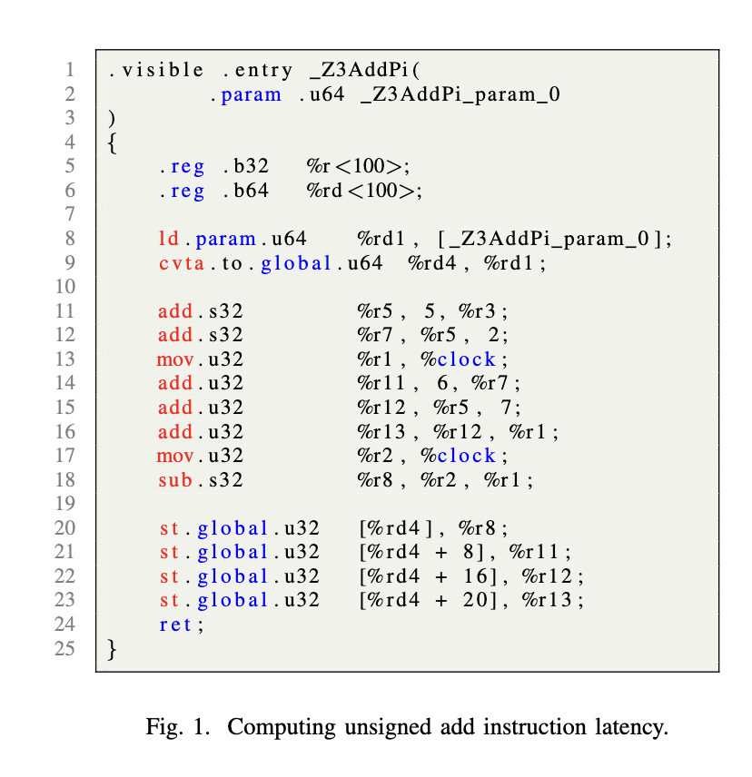

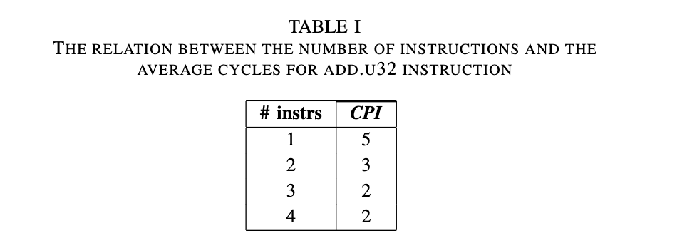

두 번째로, PPT-GPU [18]의 동적 Tracing Tool을 사용하여 sass 명령어를 검사하여 PTX에서 SASS로의 매핑이 올바르고 컴파일러가 런타임에 추가 오버헤드나 명령어를 추가하지 않았음을 확인한다. 그림 4(a)에 표시된 PTX 코드는 클록을 32비트 레지스터에 저장할 때 add 명령어에 대한 부정확한 레이턴시를 제공한다. 동적 SASS 명령어 추적에는 두 클록 읽기 사이에 Barrier가 표시되며, 이는 SASS 섹션의 두 번째 명령어에 나타난다. 이 Barrier는 결과를 상당히 변경시킨다(이 경우 약 33사이클 증가). 이 Barrier를 극복하는 한 가지 방법은 64비트 레지스터를 사용하여 클록을 저장하는 것인데, 그림 4(b)에서 보듯이 Barrier를 제거하고 정확한 측정을 제공한다. 첫 번째와 두 번째 경우의 CPI는 각각 13과 2사이클이다. 마지막으로, 두 개의 연속적인 클록 읽기 명령어를 사용하여 클록 오버헤드를 계산하면 2사이클임을 발견한다.

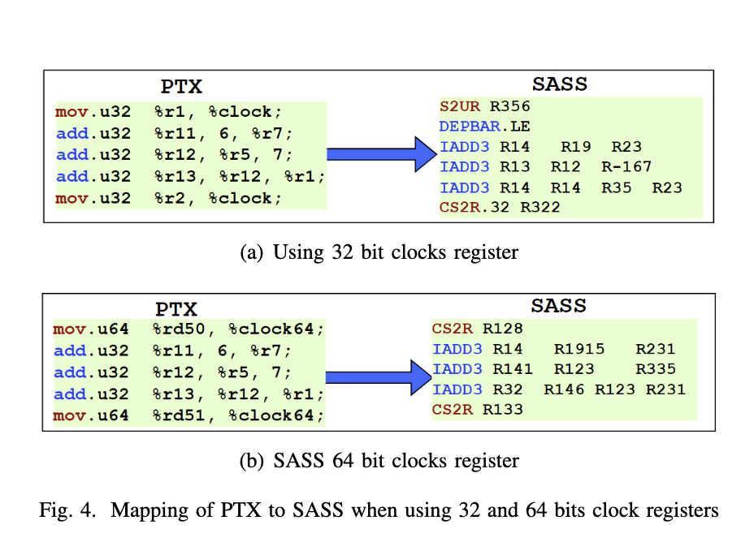

> 이 테스트 코드 구현은：https://github.com/BBuf/how-to-optim-algorithm-in-cuda/blob/master/cuda-mode/cudabmk/clock.cu 에서 볼 수 있다. 이 부분의 코드는 비교적 단순하므로 분석은 생략한다.

#### B. 메모리 단위 접근 레이턴시

전역 메모리, L2 캐시, L1 캐시의 레이턴시를 계산하기 위해 포인터 추적(pointer chasing) 기법을 사용하며, 각 배열 요소는 이전 요소에 의존한다. 이 기법은 읽기 연산을 직렬화하여 레이턴시를 정확하게 계산할 수 있게 한다. 그렇지 않으면 많은 읽기 연산이 동시에 발행될 수 있어 레이턴시 측정이 부정확해진다. 그림 2는 메모리 레이턴시 계산에 사용되는 PTX 마이크로벤치마크를 보여준다. 1행은 배열 주소를 %r19 레지스터로 이동한다. 그런 다음 %r40 레지스터의 제로 값으로 카운터를 시작한다. 이 카운터는 요소 배열을 순회하는 데 사용된다. 3행과 9-11행은 루프 명령어를 나타낸다. 4-7행은 배열 요소를 저장하는 데 사용되며, 각 요소는 이전 요소에 의존한다. 결과를 저장한 후, 14-24행의 명령어를 사용하여 배열의 각 요소를 읽는 동시에 클록을 읽는다. 16-19행에서 4개의 로드 명령어를 사용하여 4개의 값을 로드하며, 이는 모든 배열 요소를 읽기 위해 반복 실행된다.

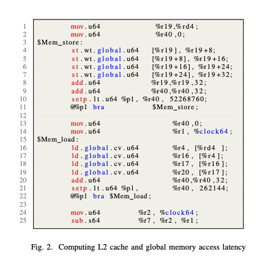

ld 명령어는 `cv`, `ca`, `cg` 등 다양한 연산자와 함께 사용할 수 있으며, 각각 용도가 다르다. `ca`는 사용 가능한 모든 레벨(전역-L1-L2)에 캐시하고, `cg`는 L2에만 캐시한다. 반면 전역 메모리 레이턴시를 계산할 때 필요하므로 캐시를 우회하는 `cv`를 사용한다. 4개의 명령어를 사용하는 이유는 일부 CUDA 애플리케이션의 동적 추적을 검사할 때 컴파일러가 루프를 4번 펼치는 것을 발견했기 때문이다. 전역 메모리 코드와 L2 캐시 코드의 차이는 ld 명령어에서 사용하는 연산자와 배열의 요소 수에 있다. L2 캐시의 경우 `cg` 연산자를 사용하고 배열 요소의 총 크기가 L2 크기보다 작아야 하며, 전역 메모리 코드의 경우 L2 캐시 상주를 방지하기 위해 L2 캐시보다 커야 한다. 마찬가지로 L1 캐시 레이턴시에도 동일한 방법을 반복하며 `ca` 연산자를 사용한다.

공유 메모리의 경우, 그림 3의 3-12행에 나타나 있듯이 클록 읽기 사이에 load 및 save 명령어를 발행한다. 그러나 컴파일러가 완료 전에 클록 읽기 명령어를 실행하지 못하도록 4-13행에 보이는 것처럼 ld 또는 st 명령어에 의존하는 또 다른 명령어를 추가해야 한다.

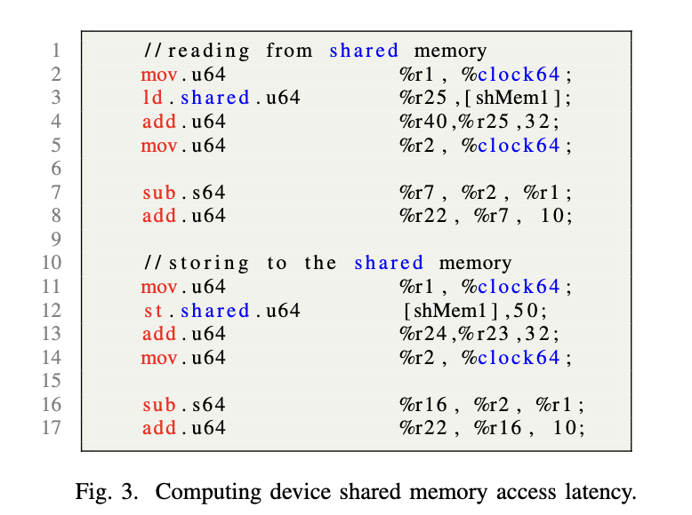

#### C. Tensor Core 명령어 레이턴시 및 처리량

Tensor Core(TC) 유닛은 머신러닝 애플리케이션을 가속하는 매우 중요한 유닛이다. Ampere 아키텍처에서 각 SM(Streaming Multiprocessor)에는 4개의 Tensor Core가 포함되어 있으며, D=A*B+C 형태의 세 행렬에 대한 다중 덧셈 연산을 수행할 수 있다. 여기서 A, B는 입력이고 C, D는 누산기다. fp16 정밀도 입력만 지원하는 Volta와 달리 Ampere 아키텍처는 `FP16`, `bf16`, `tf32`, `f64`, `u8`, `u4`, 단일 비트 등 다양한 타입을 지원한다. 범용 산술 명령어는 하나의 스레드를 사용하여 실행되며 전역 또는 공유 메모리를 통해서만 통신할 수 있다. 반면 TC 명령어는 전용 warp의 32개 스레드 모두를 사용한다. Ampere 아키텍처의 TC 명령어와 새로운 데이터 타입을 해부하기 위해 CUDA 프로그래밍 언어로 작성된 특수 마이크로벤치마크를 설계했다. 이 마이크로벤치마크는 Jia 등 [7]의 Volta 아키텍처 연구에서 영감을 받았다.

Ampere 아키텍처에서 도입된 일부 새로운 데이터 타입은 PTX 및 CUDA 문서 [28]에서 언급된 것처럼 아직 실험적 단계에 있다. 또한 각 데이터 타입에는 고유한 형상, 스트라이드, 레이아웃이 있으므로 다양한 함수를 사용하여 각 타입의 레이턴시를 계산한다. 그림 5는 U8 데이터 타입 TC 명령어 레이턴시 계산에 사용된 코드를 보여준다. 5-7행은 레지스터가 행렬 요소를 저장하도록 준비되는 fragment를 생성한다. 4개의 fragment를 생성하지만 형상을 작게 하기 위해 모두 쓰지는 않는다. 그런 다음 메모리에서 데이터를 로드하고(10-12행), 다른 fragment도 마찬가지다. 앞서 언급했듯이 TC WMMA 실행 전후에 클록을 읽으며(15-22행), 출력 전에 빼기를 수행한다(28-29행). 16-21행에서 4개의 TC 명령어(TC당 하나)를 여러 번 실행한다. 4개의 명령어를 사용하는 이유는 하나의 TC에 대한 하나의 명령어로 레이턴시를 계산하면 부정확한 측정이 발생함을 발견했기 때문이다.

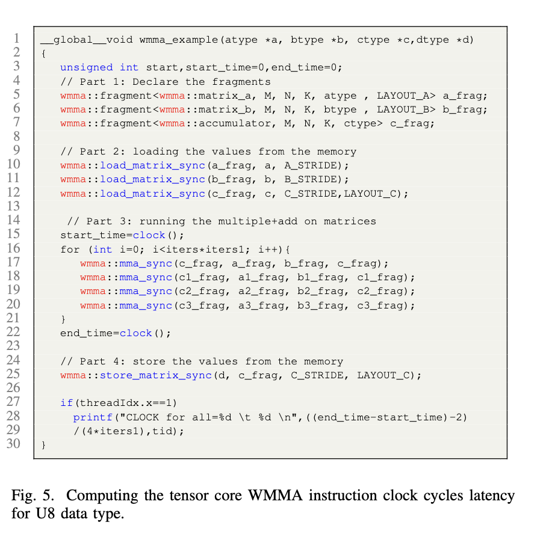

예를 들어, 그림 6은 하나의 TC에서 하나의 명령어를 실행하는 동적 SASS 명령어를 보여준다. NOP 명령어는 PTX의 warp 동기화를 의미하며, 여기서 레이턴시가 백서에 언급된 것과 다름을 발견한다. 하나의 명령어를 여러 번 실행할 때도 이런 상황이 발생한다. 마지막으로 명령어당 레이턴시를 계산하고 28-29행을 통해 출력한다. TC의 WMMA 처리량을 계산하는 데도 유사한 방법을 사용한다.

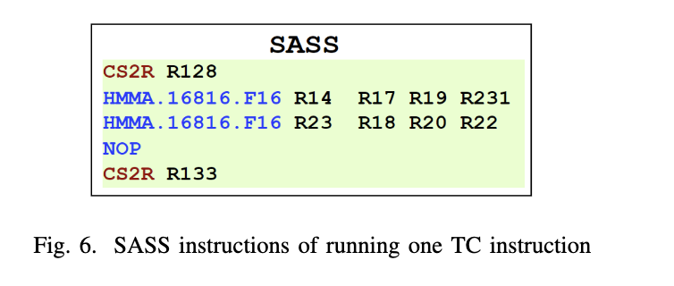

### 결과

이 섹션에서는 상세한 설정과 결과를 제시한다. 먼저 명령어 클록 사이클 레이턴시를 보여준다. 그런 다음 메모리 접근 레이턴시를 설명한다. 마지막으로 Tensor Core 레이턴시와 처리량을 보여준다. NVIDIA Tesla A100 GPU에서 모든 마이크로벤치마크를 실행했다.

#### 명령어 레이턴시

의존 관계가 명령어 클록 사이클 레이턴시에 직접 영향을 미침을 발견했다. 따라서 의존 명령어 시퀀스(그림 1에서 보여준)를 사용하여 마이크로벤치마크를 다시 실행하고, 의존 시퀀스를 또 다른 독립 명령어 시퀀스로 교체했다. 표 II는 일부 명령어에 대한 의존 및 독립 시퀀스의 CPI(명령어당 사이클 수)를 보여준다. 예를 들어, 단정밀도와 배정밀도 부동 소수점 명령어는 각각 4와 2사이클을 보인다. 또한 의존 관계가 없을 때 그림 1에서 언급한 3개의 add.u32 명령어가 같은 SASS 명령어(IADD)로 매핑됨을 발견했으며, 이는 그림 4(a)에 나타난다. 그러나 세 개의 의존 명령어를 사용하면 PTX 명령어가 다른 명령어로 변환될 수 있다. 예를 들어, add.u32 PTX 명령어는 의존 관계에 따라 IADD3 또는 IMAD.IADD에 매핑될 수 있다.

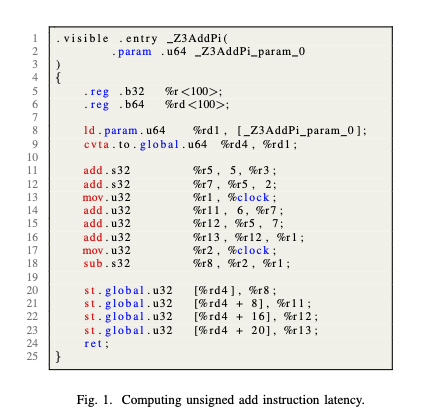

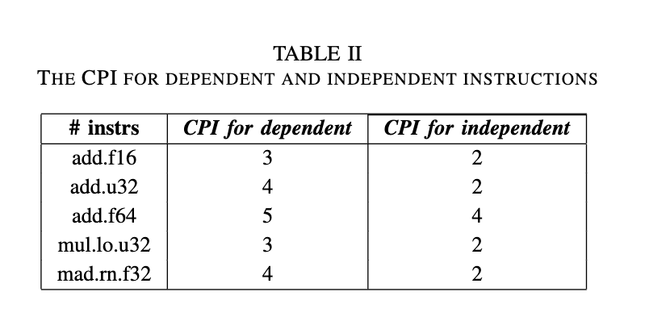

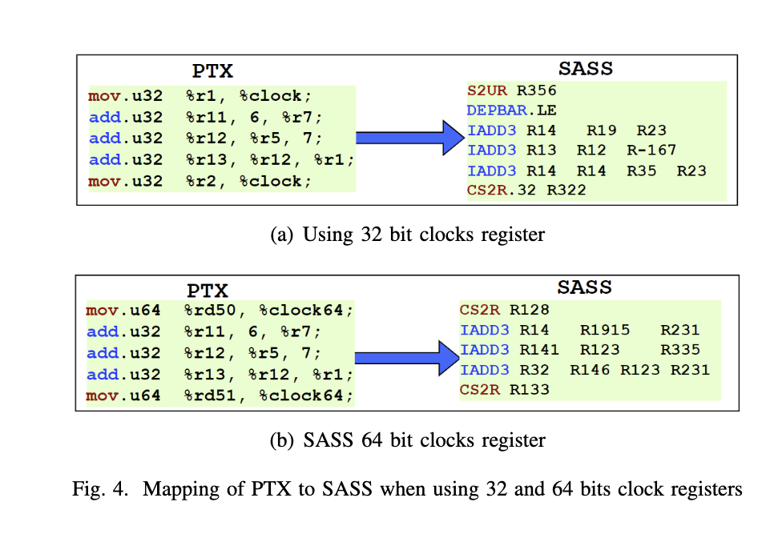

표 V는 다양한 PTX-SASS 명령어와 측정된 클록 사이클 레이턴시를 설명한다. 표의 각 필드에 대해 별도의 마이크로벤치마크가 있다.

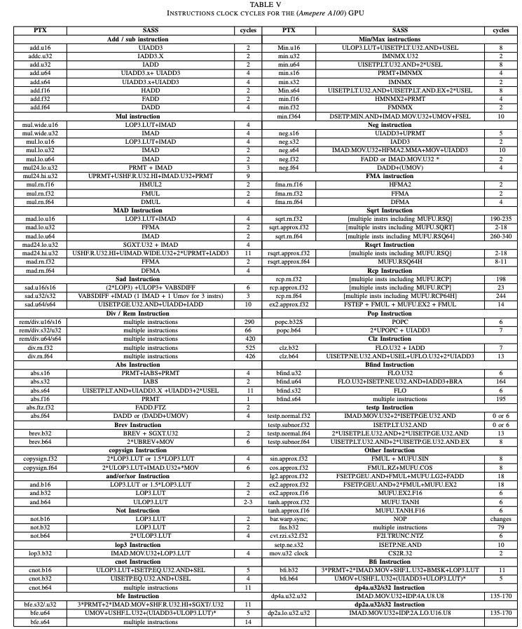

> 명령어 테스트는 https://github.com/BBuf/how-to-optim-algorithm-in-cuda/blob/master/cuda-mode/cudabmk/instructions.h 및 https://github.com/BBuf/how-to-optim-algorithm-in-cuda/blob/master/cuda-mode/cudabmk/pipeline.cu 에서 볼 수 있다.

다음으로 결과 생성 시 발견한 몇 가지 추가 통찰을 논의한다:

**1**: `mad` 명령어는 정수 값을 사용하더라도 정수 파이프라인이 아닌 부동 소수점 파이프라인에서 실행된다. 이는 다음과 같이 증명할 수 있다:
    - 표 V의 PTX 명령어 `mad.lo.u32`는 SASS FFMA(부동 소수점 곱셈-덧셈)에 매핑된다.
    - 두 개의 `add` 명령어와 두 개의 `mad` 명령어를 하나의 스레드로 실행하는 특수 코드를 만들었더니 총 사이클 수가 약 4사이클임을 발견했다. 이는 각 명령어가 약 1사이클이 필요하다는 것을 의미한다. 이는 두 타입이 서로 다른 파이프라인에서 동시에 실행됨을 증명한다.

`mad` 명령어가 다른 파이프라인을 사용한다는 것은 일부 경우에 의존적인 PTX `add.u32` 명령어가 SASS (IMAD.IADD) 명령어에 매핑되는 이유를 설명한다. 컴파일러는 정수 파이프라인이 완료되기를 기다리는 동안 부동 소수점 파이프라인을 사용하려 한다.

**2**: `bfind`, `min`, `max` 명령어를 제외하고는 부호 있는 또는 부호 없는 명령어를 사용할 때 클록 사이클 수나 PTX에서 SASS 매핑에 차이가 없다. 예를 들어, add.u64와 add.s64는 동일한 매핑과 동일한 레이턴시를 제공한다.

**3**: 일반적으로 `mov` 또는 `add` 명령어는 레이턴시를 계산하려는 명령어에서 레지스터를 입력 피연산자로 사용하기 전에 값으로 초기화하는 데 사용된다. 그러나 일부 경우에 입력이 초기화되는 방식에 따라 클록 사이클 수와 PTX-SASS 매핑이 달라짐을 발견했다. 예를 들어, `add` 명령어로 입력을 초기화할 때 PTX `neg.f32`는 SASS FADD에 매핑된다. 반면 `mov`로 초기화할 때는 `mov`와 `neg` 명령어를 하나의 SASS 명령어(IMAD.MOV.u32)로 합친다. `abs.f32` 명령어도 동일한 상황이 발생한다.

**4**: 많은 PTX 명령어가 SASS 명령어로 1대1 매핑되지만, `div`, `rem`, `sinf`, `cosf` 등은 여러 개의 다른 SASS 명령어로 변환된다.

**5**: 동일한 데이터 타입의 모든 명령어가 동일한 레이턴시를 갖는 것은 아니다. 더 구체적으로, `mad.lo.u64`는 IMAD SASS 명령어에 매핑되며 2사이클만 필요하다. 그러나 배정밀도 `add`, `sub`, `fma` 명령어는 각각 4사이클이 필요하다.

**6**: `testp` 명령어의 경우 레이턴시는 상태에 따라 달라진다.

#### 메모리 접근 레이턴시

다양한 유형의 메모리에서 관찰된 레이턴시는 표 IV에 나타난다. 전역 메모리 레이턴시는 약 290사이클이다. 이 값은 모든 레벨에서 캐시를 차단했으므로 캐시 미스 레이턴시를 포함하지 않는다. Turing 아키텍처의 434사이클에 비해 개선되었다 [13]. L2 접근 레이턴시는 200사이클이며, Turing 아키텍처는 188사이클이다. 또한 Ampere와 Turing 아키텍처 모두에서 L1 캐시 히트 레이턴시는 각각 33과 32사이클이다. 공유 메모리의 경우 저장 접근 레이턴시가 로드 명령어보다 작으며, 로드와 저장은 각각 23과 19사이클이다.

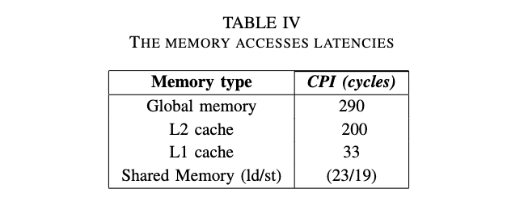

#### Tensor Core 레이턴시 및 처리량

Ampere 아키텍처의 ISA는 새로운 데이터 타입을 지원하며 Tensor Core에서 실행되는 다양한 SASS 명령어를 제공한다. Volta 아키텍처의 ISA는 모든 Tensor Core 연산(단정밀도 및 혼합 정밀도 연산)을 처리하는 `HMMA.884 SASS` 명령어만 있다. Turing의 경우 다양한 입력 형상에 대해 두 가지 **HMMA** SASS 명령어, 즉 `HMMA.1688`과 `HMMA.884`가 있다 [26].

표 III은 **Ampere 아키텍처**의 Tensor Core 명령어를 설명한다. 구체적으로 `DMMA.884`, `IMMA.16816`, `IMMA.8832`가 각각 `FP64`, `U8`, `U4` 데이터 타입을 처리하기 위해 추가되었다. 각 데이터 타입에 대한 각 PTX 명령어는 다른 수의 SASS 명령어로 변환된다. `FP16`, `BF16`, `U8` 입력의 경우 PTX가 2개의 명령어로 변환된다. TensorFloat-32(TF32) 정밀도는 4개의 SASS 명령어에 매핑되며, FP64와 U4는 1개에만 매핑된다. 이러한 차이는 지원되는 PTX 형상과 SASS가 처리할 수 있는 형상 간의 차이와 관련이 있다. 예를 들어, 표 III의 첫 번째 행에서 PTX 명령어는 16x16x16과 같은 다양한 형상을 사용할 수 있지만 SASS는 16x8x16만 처리할 수 있다. 따라서 PTX 형상을 반복하기 위해 2개의 SASS 명령어가 필요하다. 그러나 물리적 Tensor Core 구현은 848 [21]을 실행할 수 있다. 이전에 [25]에서 Turing의 Tensor Core 레이턴시가 형상에 의존한다고 언급되었지만, Ampere 아키텍처에서는 동일한 데이터 타입의 다른 형상이 계산 레이턴시에 영향을 미치지 않음을 발견했다. Ampere 아키텍처에서는 타입에 따라 다를 수 있다.

표에 나타난 Tensor Core 처리량과 레이턴시에 대한 관찰은 백서 [11]에 언급된 동작과 일치한다. 마지막으로, 모든 반정밀도 부동 소수점(fp16 및 bf16) 입력에 대해 SASS 명령어 `MOVM.16.MT88`이 행렬을 Tensor Core에 로드하는 데 사용됨을 주목한다. 일반적으로 MOVM SASS 명령어는 전치가 있는 행렬을 이동하는 데 사용된다. 발행되는 MOVM 명령어 수는 행렬 형상과 레이아웃(행 우선 또는 열 우선)에 따라 다르다. 예를 들어, PTX 코드에서 A와 B 행렬을 모두 행 우선으로 사용하면 A의 각 행과 B의 각 열을 곱하기 위해 B 행렬을 전치하는 데 MOVM 명령어가 사용된다. 그러나 모두 열 우선으로 사용하면 A와 C 행렬에 MOVM 명령어가 사용된다. 실행 전에 A와 C를 전치하고 실행 후에 C를 전치한다. 마지막으로, A가 행 우선이고 B가 열 우선이면 추적에 MOVM 명령어가 없다. 위와 동일한 방법을 사용하여 레이턴시를 계산하여 메모리 처리량을 계산한다. 관찰 결과는 백서에 언급된 처리량 값과 매우 유사하다.

### 결론

내용 자체가 간결하므로 요약은 생략한다.
