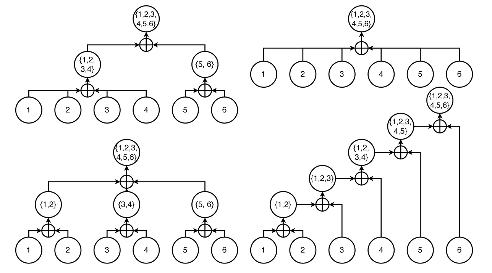
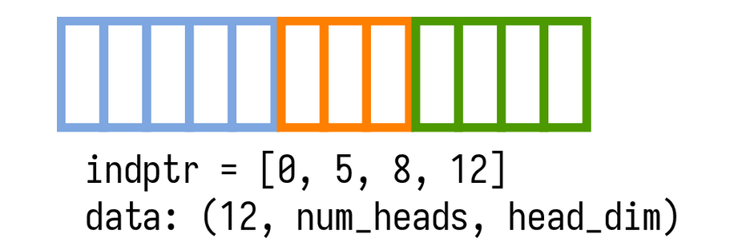
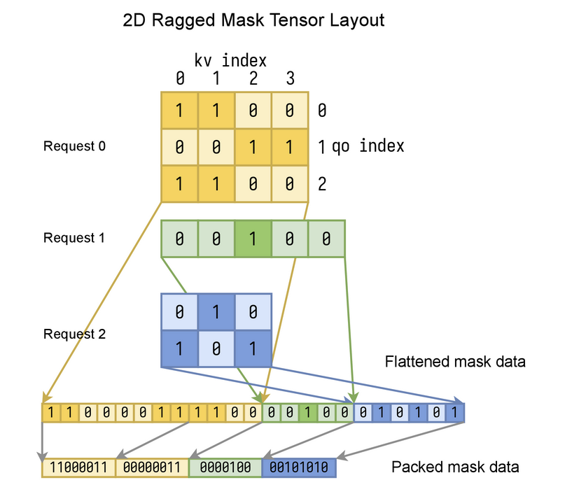
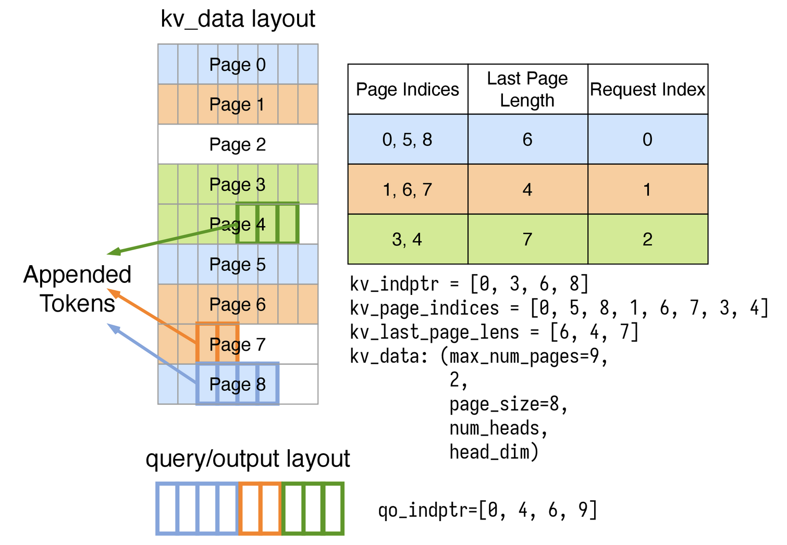
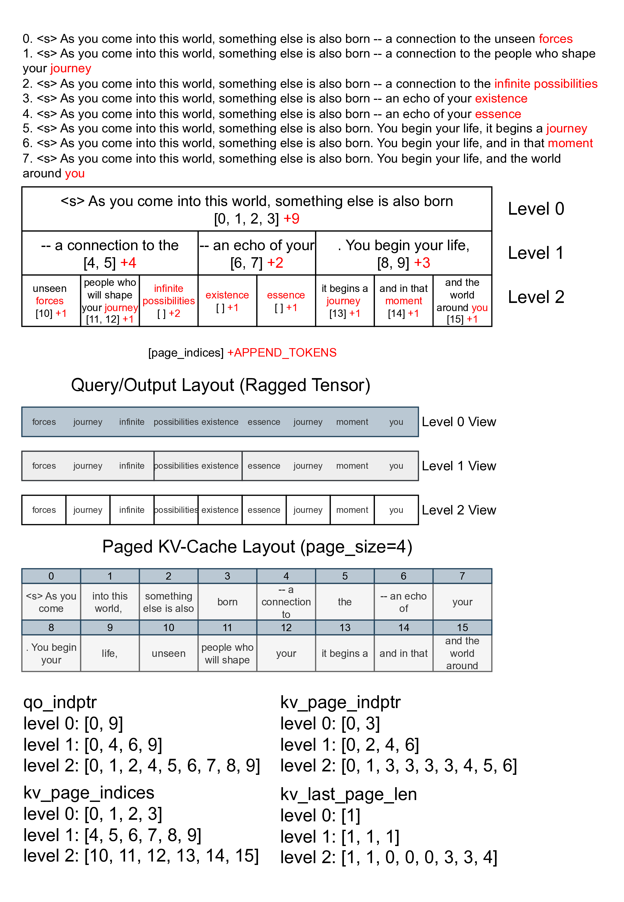

# 설치

## Python 패키지

FlashInfer는 `PyTorch <https://pytorch.org/>`_ 위에 구축된 Python 패키지로, Python 애플리케이션에 쉽게 통합할 수 있다.

### 사전 조건

- 운영체제: Linux 전용

- Python: 3.8, 3.9, 3.10, 3.11, 3.12

- PyTorch: 2.2/2.3/2.4, CUDA 11.8/12.1/12.4 지원 (CUDA 12.4는 PyTorch 2.4 전용)

  - ``python -c "import torch; print(torch.version.cuda)"`` 로 PyTorch CUDA 버전을 확인할 수 있다.

- 지원 GPU 아키텍처: ``sm75``, ``sm80``, ``sm86``, ``sm89``, ``sm90``.

### 빠른 시작

FlashInfer를 설치하는 가장 간단한 방법은 pip을 사용하는 것이다:

```shell
.. tabs::

    .. tab:: PyTorch 2.4

        .. tabs::

            .. tab:: CUDA 12.4

                .. code-block:: bash

                    pip install flashinfer -i https://flashinfer.ai/whl/cu124/torch2.4/

            .. tab:: CUDA 12.1

                .. code-block:: bash

                    pip install flashinfer -i https://flashinfer.ai/whl/cu121/torch2.4/

            .. tab:: CUDA 11.8

                .. code-block:: bash

                    pip install flashinfer -i https://flashinfer.ai/whl/cu118/torch2.4/

    .. tab:: PyTorch 2.3

        .. tabs::

            .. tab:: CUDA 12.1

                .. code-block:: bash

                    pip install flashinfer -i https://flashinfer.ai/whl/cu121/torch2.3/

            .. tab:: CUDA 11.8

                .. code-block:: bash

                    pip install flashinfer -i https://flashinfer.ai/whl/cu118/torch2.3/

    .. tab:: PyTorch 2.2

        .. tabs::

            .. tab:: CUDA 12.1

                .. code-block:: bash

                    pip install flashinfer -i https://flashinfer.ai/whl/cu121/torch2.2/

            .. tab:: CUDA 11.8

                .. code-block:: bash

                    pip install flashinfer -i https://flashinfer.ai/whl/cu118/torch2.2/

    .. tab:: PyTorch 2.1

        Since FlashInfer version 0.1.2, support for PyTorch 2.1 has been ended. Users are encouraged to upgrade to a newer
        PyTorch version or :ref:`compile FlashInfer from source code. <compile-from-source>` .

        .. tabs::

            .. tab:: CUDA 12.1

                .. code-block:: bash

                    pip install flashinfer -i https://flashinfer.ai/whl/cu121/torch2.1/

            .. tab:: CUDA 11.8

                .. code-block:: bash

                    pip install flashinfer -i https://flashinfer.ai/whl/cu118/torch2.1/
```

### 소스 코드에서 컴파일

특정 상황에서는 main 브랜치의 최신 기능을 사용하거나 특정 요구 사항에 맞게 라이브러리를 커스터마이징하기 위해 소스 코드에서 FlashInfer를 컴파일할 수 있다. 다음 단계에 따라 소스 코드에서 FlashInfer를 컴파일할 수 있다:

1. FlashInfer 저장소를 클론한다:

```shell
git clone https://github.com/flashinfer-ai/flashinfer.git --recursive
```

2. CUDA를 지원하는 PyTorch가 설치되어 있는지 확인한다. 다음 명령으로 PyTorch 버전과 CUDA 버전을 확인할 수 있다:

```shell
python -c "import torch; print(torch.__version__, torch.version.cuda)"
```

3. Ninja 빌드 시스템을 설치한다:

```shell
pip install ninja
```

4. FlashInfer를 컴파일한다:

```shell
cd flashinfer
pip install -e . -v
```

## C++ API

FlashInfer는 CUDA/C++ 표준 라이브러리만 의존하는 헤더 전용 라이브러리로, 별도 설치 없이 C++ 프로젝트에 직접 통합할 수 있다.

C++ API 사용 방법은 `단위 테스트 및 벤치마크 <https://github.com/flashinfer-ai/flashinfer/tree/main/src>`_ 를 참고하면 된다.

> `3rdparty` 디렉터리의 `nvbench` 및 `googletest` 의존성은 단위 테스트 및 벤치마크 컴파일에만 필요하며, 라이브러리 자체에는 필수가 아니다.

### 벤치마크 및 단위 테스트 컴파일

C++ 벤치마크(`nvbench <https://github.com/NVIDIA/nvbench>`_ 사용)와 단위 테스트를 컴파일하려면 다음 단계를 따른다:

1. FlashInfer 저장소를 클론한다:

```shell
git clone https://github.com/flashinfer-ai/flashinfer.git --recursive
```

2. conda가 설치되어 있는지 확인한다(cmake와 ninja를 다른 방법으로 이미 설치한 경우 이 단계를 건너뛸 수 있다):

```shell
conda --version
```

conda가 설치되어 있지 않다면 `miniconda <https://docs.conda.io/en/latest/miniconda.html>`_ 또는 `miniforge <https://github.com/conda-forge/miniforge>`_ 사이트의 안내에 따라 설치할 수 있다.

2. CMake와 Ninja 빌드 시스템을 설치한다:

```shell
conda install cmake ninja
```

3. 빌드 디렉터리를 만들고 설정 파일을 복사한다

```shell       
mkdir -p build
cp cmake/config.cmake build/  # you can modify the configuration file if needed
```

4. 벤치마크와 단위 테스트를 컴파일한다:
   
```shell
cd build
cmake .. -G Ninja -DCMAKE_BUILD_TYPE=Release
ninja
```

----------------------------------------------------------------------


# attention 상태와 재귀적 attention

FlashInfer는 **attention 상태** 개념을 도입한다. attention 상태는 query와 키-값 쌍 집합 사이의 attention을 완전히 기술한다. 또한 **attention 상태**에 작용하는 **병합(merge)** 연산자를 정의한다. 이 병합 연산자는 attention 상태를 재귀적으로 합칠 수 있게 하여 전체 attention 계산을 가능하게 한다.

query $\mathbf{q}$ 와 키 $\mathbf{k}_i$ 사이의 pre-softmax attention 점수를 $s_i = \mathbf{q}\mathbf{k}_i^T$ 로 정의한다. 인덱스 $i$ 의 자기 attention 점수는 인덱스 집합 $I$ 로 일반화할 수 있다:

$$
s(I)=\log\left(\sum_{i\in I}\exp\left(s_i\right)\right)
$$

인덱스 $i$ 에서의 값도 인덱스 집합 $I$ 로 일반화할 수 있다:

$$
\mathbf{v}(I) = \sum_{i\in I}\textrm{softmax}(s_i) \mathbf{v}_i = \frac{\sum_{i\in I}\exp\left(s_i\right)\mathbf{v}_i}{\exp(s(I))}
$$

$softmax$ 함수는 인덱스 집합 $I$ 에만 적용된다. $\mathbf{v}(\{1,2,\cdots, n\})$ 은 전체 시퀀스의 자기 attention 출력임을 주목한다.
인덱스 집합 $i$ 의 *attention 상태*는 튜플 $(s(I), \mathbf{v}(I))$ 로 정의할 수 있으며, 두 attention 상태의 이진 **병합** 연산자 $\oplus$ 를 다음과 같이 정의한다(실제로는 수치 안정성을 위해 $s$ 의 최대값을 빼지만, 여기서는 단순화를 위해 생략한다):

$$
\begin{bmatrix}\mathbf{v}(I\cup J)\\s(I\cup J)\end{bmatrix}=\begin{bmatrix}\mathbf{v}(I)\\s(I)\end{bmatrix}\oplus\begin{bmatrix}\mathbf{v}(J)\\s(J)\end{bmatrix}=\begin{bmatrix} \frac{\mathbf{v}(I)\exp(s(I)) + \mathbf{v}(J)\exp(s(J))}{\exp(s(I)) + \exp(s(J))} \\  \log(\exp(s(I)) + \exp(s(J))) \end{bmatrix}
$$

**병합** 연산자는 임의 개수의 attention 상태 입력으로 일반화할 수 있다:

$$
\begin{bmatrix}\mathbf{v}(\bigcup_{i=1}^{n}I_i) \\ s(\bigcup_{i=1}^{n}I_i) \end{bmatrix} = \bigoplus_{i=1}^{n}\begin{bmatrix}\mathbf{v}(I_i) \\ s(I_i)\end{bmatrix} = \begin{bmatrix} \sum_{i=1}^{n} \textrm{softmax}(s(I_i))\mathbf{v}(I_i) \\ \log(\sum_{i=1}^{n} \exp (s(I_i))) \end{bmatrix}
$$

위의 n-항 병합 연산자는 이진 병합 연산자와 일치하며, 이 연산자는 *교환적*이고 *결합적*임을 증명할 수 있다. 인덱스 부분 집합의 attention 상태를 병합함으로써 전체 시퀀스의 attention 상태를 구하는 방법은 여러 가지가 있으며, 수학적으로 모두 동일한 결과를 낸다:



> 일반 점수 $s$ 는 log-sum-exp(``lse`` 로 줄여 씀)라고도 한다.

## 응용

$\oplus$ 연산자는 **교환적**이고 **결합적**이므로, 자기 attention 계산의 일부 KV를 다른 디바이스로 안전하게 오프로드하고 **임의의 순서로** 결과를 **병합**할 수 있다.

지금까지 FlashInfer에서 재귀 형태의 자기 attention에 활용되는 흥미로운 응용 사례들이 있다:

**공유 prefix 배치 decode**
  많은 LLM 애플리케이션은 공유된 긴 프롬프트를 가진 배치 decode를 수반한다. FlashInfer는 전체 KV cache에 대한 attention을 공유 prefix attention과 고유 suffix attention으로 분해한다.
  이 분해를 통해 각 구성 요소를 서로 다른 kernel 구현으로 오프로드할 수 있으며, 긴 컨텍스트와 대규모 배치 크기에서 최대 30배의 가속을 달성했다.
  이 분해는 긴 컨텍스트 설정에서 연산을 30배 가속한다.
  이 응용에 대한 자세한 내용은 `블로그 글 <https://flashinfer.ai/2024/01/08/cascade-inference.html>`_ 을,
  FlashInfer에서 이 기능을 사용하는 방법은 https://docs.flashinfer.ai/api/python/cascade.html#api-cascade-attention 을 참고한다.

**KV 시퀀스 병렬성**
  긴 컨텍스트 LLM 추론/서빙에서는 GPU당 배치 크기와 head 수가 GPU 메모리에 의해 제한되어, 기본 병렬 전략으로는 GPU의 모든 SM을 활용하지 못해 성능이 저하된다.
  `Split-K <https://github.com/NVIDIA/cutlass/blob/8825fbf1efebac973d96730892919ab241b755bb/media/docs/efficient_gemm.md#parallelized-reductions>`_ 기법에서 영감을 받아,
  FlashInfer는 KV 시퀀스 차원을 분할하여 attention 계산을 서로 다른 thread block에 분배하고 두 번째 단계에서 이를 병합한다. 이 아이디어는 Flash-Decoding에서도 제안되었으며,
  시각화 및 자세한 내용은 `블로그 글 <https://crfm.stanford.edu/2023/10/12/flashdecoding.html>`_ 을 참고한다.

## 관련 API

FlashInfer는 재귀적 attention 계산을 지원하는 여러 API를 제공한다:

- https://docs.flashinfer.ai/api/python/cascade.html#api-merge-states 는 attention 상태 병합 연산자를 정의한다.
- https://docs.flashinfer.ai/api/python/prefill.html#apiprefill 과 https://docs.flashinfer.ai/api/python/decode.html#apidecode 는 attention 상태를 반환하는 연산자를 정의한다(``_return_lse`` 접미사가 붙은 API는 attention 출력 $v$ 와 점수 $s$ 를 반환한다).

----------------------------------------------------------------------------

# FlashInfer에서의 KV-Cache 레이아웃

## 레이아웃: NHD/HND

FlashInfer는 KV-Cache의 마지막 세 차원에 대해 ``NHD`` 와 ``HND`` 두 가지 레이아웃을 지원한다:

- ``NHD``: 마지막 세 차원이 ``(seq_len, num_heads, head_dim)`` 으로 구성된다.
- ``HND``: 마지막 세 차원이 ``(num_heads, seq_len, head_dim)`` 으로 구성된다.

``NHD`` 레이아웃은 $xW_k$ 와 $xW_v$ 의 출력과 일치하여 전치 없이 자연스럽게 사용할 수 있다. ``HND`` 레이아웃은 KV-Cache에 저의 정밀도 데이터 타입(예: fp8)을 사용할 때 GPU 구현에 더 유리하다.
실제로 두 레이아웃 간의 성능 차이는 크지 않으므로, 가독성을 위해 ``NHD`` 레이아웃을 기본으로 사용한다. FlashInfer는 두 레이아웃 모두에서 attention kernel을 구현하며 선택 옵션을 제공한다(기본값은 ``NHD``).

## Ragged Tensor

배치 추론/서빙에서는 입력 시퀀스 길이가 요청마다 다를 수 있다. 시퀀스 길이가 변하지 않는 경우(예: prefill 단계)에는 단일 가변 길이 차원을 가진 ``RaggedTensor`` 를 사용하여 KV cache의 Key/Value 텐서를 저장할 수 있다:




모든 요청의 key(또는 value)는 패딩 없이 단일 ``data`` 텐서에 압축 저장되며, ``indptr`` 배열(``num_requests+1`` 개 원소, 첫 번째 원소는 항상 0)로 각 요청의 가변 시퀀스 길이 정보를 저장한다(``indptr[i+1]-indptr[i]`` 는 요청 ``i`` 의 시퀀스 길이). 레이아웃이 ``NHD`` 인 경우 ``data`` 텐서의 형상은 ``(indptr[-1], num_heads, head_dim)`` 이다.

요청 ``i`` 의 key(또는 value)는 ``data[indptr[i]:indptr[i+1]]`` 로 슬라이싱할 수 있다.

### FlashInfer API

FlashInfer는 `flashinfer.prefill.BatchPrefillWithRaggedKVCacheWrapper` 를 제공하여 ragged tensor에 저장된 query와 ragged KV cache에 저장된 Key/Value 사이의 prefill attention을 계산한다.


## Mask 레이아웃 (2D Ragged Tensor)

위의 Ragged Tensor는 여러 "ragged" 차원으로 일반화할 수 있다. 예를 들어, 배치 크기가 1보다 클 때 FlashInfer의 attention 마스크는 2D ragged tensor이다:



요청 수가 1보다 클 때 서로 다른 요청은 다른 query 길이와 kv 길이를 가질 수 있다. 패딩을 피하기 위해 2D ragged tensor를 사용하여 attention 마스크를 저장한다. 입력 ``qo_indptr`` 과 ``kv_indptr`` 배열(길이는 모두 ``num_requests+1``)은 각 요청의 가변 시퀀스 길이 정보를 저장하며, ``qo_indptr[i+1]-qo_indptr[i]`` 는 요청 ``i`` 의 query 길이(``qo_len[i]``), ``kv_indptr[i+1]-kv_indptr[i]`` 는 요청 ``i`` 의 kv 길이(``kv_len[i]``)이다.

모든 요청의 마스크 배열은 (query를 첫 번째 차원, kv를 마지막 차원으로) 평탄화하여 연결한 1D 배열 ``mask_data`` 로 저장된다. FlashInfer는 각 요청의 마스크가 평탄화된 마스크 배열에서 시작하는 오프셋을 저장하는 ``qk_indptr`` 배열을 내부적으로 생성한다: ``qk_indptr[1:] = cumsum(qo_len * kv_len)``.

``mask_data`` 의 형상은 ``(qk_indptr[-1],)`` 이며, 요청 ``i`` 의 평탄화된 마스크는 ``mask_data[qk_indptr[i]:qk_indptr[i+1]]`` 로 슬라이싱할 수 있다.

메모리 절약을 위해 부울 평탄화 마스크 배열을 비트 패킹 배열(원소당 1비트, 8개 원소를 하나의 `uint8` 로 패킹)로 더 압축할 수 있으며, "little" 비트 순서를 사용한다(`numpy.packbits <https://numpy.org/doc/stable/reference/generated/numpy.packbits.html>`_ 참고). FlashInfer는 부울 마스크와 비트 패킹 마스크 모두 받는다. 부울 마스크를 제공하면 FlashInfer가 내부적으로 bit-packed 배열로 변환한다.

### FlashInfer API

`flashinfer.prefill.BatchPrefillWithPagedKVCacheWrapper` 와 `flashinfer.prefill.BatchPrefillWithRaggedKVCacheWrapper` 는 사용자가 `begin_forward` 함수에서 ``qo_indptr``, ``kv_indptr``, 사용자 정의 attention 마스크 ``custom_mask`` 를 지정할 수 있게 한다. 마스크 데이터는 attention kernel에서 softmax 전(그리고 softmax 스케일링 후) attention 점수에 더해진다.

`flashinfer.quantization.packbits` 와 `flashinfer.quantization.segment_packbits` 는 부울 마스크를 bit-packed 배열로 변환하는 유틸리티 함수이다.

## Page Table 레이아웃

KV-Cache가 동적인 경우(예: append 또는 decode 단계), 각 요청의 시퀀스 길이가 시간에 따라 변하기 때문에 모든 Key/Value를 패킹하는 것은 비효율적이다. `vLLM <https://arxiv.org/pdf/2309.06180.pdf>`_ 은 KV-Cache를 Page Table로 구성할 것을 제안했다. FlashInfer에서는 Page Table을 블록 희소 행렬(사용 중인 각 Page를 블록 희소 행렬의 비영 블록으로 볼 수 있음)로 취급하고 `CSR 형식 <https://docs.scipy.org/doc/scipy/reference/generated/scipy.sparse.csr_matrix.html>` 을 사용하여 KV-Cache의 Page를 인덱싱한다.



각 요청에 대해 ``page_indices`` 와 ``last_page_len`` 을 기록하며, 이는 각각 해당 요청이 사용하는 Page와 마지막 Page의 항목 수를 추적한다. 요청 ``i`` 의 KV 시퀀스 길이는 ``page_size * (len(page_indices[i]) - 1) + last_page_length[i]`` 이다.

> 각 요청의 ``last_page_len`` 은 반드시 0보다 크고 ``page_size`` 이하여야 한다.

전체 ``kv_indptr`` 배열(길이 ``num_requests+1``)은 ``[0, len(page_indices[0]), len(page_indices[0])+len(page_indices[1]), ...]`` 로 계산할 수 있다. 전체 ``kv_page_indices`` 배열(길이 ``kv_indptr[-1]``)은 모든 요청의 ``page_indices`` 를 연결한 것이다. 전체 ``kv_last_page_lens`` 배열(길이 ``num_requests``)은 모든 요청의 ``last_page_length`` 를 연결한 것이다. ``kv_data`` 텐서는 5D 텐서 또는 4D 텐서 튜플로 저장할 수 있으며, 단일 텐서로 저장 시 ``kv_data`` 의 형상은:

```python
(max_num_pages, 2, page_size, num_heads, head_dim) # NHD layout
(max_num_pages, 2, num_heads, page_size, head_dim) # HND layout
```

텐서 튜플로 저장 시 ``kv_data = (k_data, v_data)`` 이며, 각 텐서의 형상은:

```python
(max_num_pages, page_size, num_heads, head_dim) # NHD layout
(max_num_pages, num_heads, page_size, head_dim) # HND layout
```

여기서 ``max_num_pages`` 는 모든 요청이 사용하는 최대 Page 수, ``page_size`` 는 각 Page에 수용되는 토큰 수이다. 단일 텐서 저장에서 ``2`` 는 K/V를 나타낸다(첫 번째는 Key, 두 번째는 Value).

### FlashInfer API

`flashinfer.page.append_paged_kv_cache` 는 ragged tensor로 저장된 Key/Value 배치를 paged KV-Cache에 추가할 수 있다(추가할 Key/Value의 Page는 이 API를 호출하기 전에 할당되어야 한다).

`flashinfer.decode.BatchDecodeWithPagedKVCacheWrapper` 와 `flashinfer.prefill.BatchPrefillWithPagedKVCacheWrapper` 는 ragged tensor로 저장된 query와 paged KV-Cache에 저장된 Key/Value 사이의 decode attention과 prefill/append attention을 구현한다.


## 다단계 cascade 추론 데이터 레이아웃

다단계 `cascade 추론 <https://flashinfer.ai/2024/02/02/cascade-inference.html>`_ 을 사용할 때, query와 출력은 ragged tensor에 저장되고, 모든 레벨의 KV-Cache는 통합된 paged KV-Cache에 저장된다. 각 레벨은 고유한 ``qo_indptr`` 배열(해당 서브트리에서 추가할 토큰 수의 누적 전치합)과 ``kv_page_indptr``, ``kv_page_indices``, ``kv_last_page_len`` 을 가지며, 이들의 의미는 Page Table 레이아웃 섹션과 동일하다. 아래 그림은 8개 요청에 대해 prefix 재사용을 위해 KV-Cache를 3개 레벨로 구성할 때 이러한 데이터 구조를 어떻게 만드는지 설명한다:



ragged query/output 텐서나 paged kv-cache의 데이터 레이아웃은 레벨마다 변경할 필요가 없다. 모든 레벨은 동일한 기본 데이터 레이아웃을 공유하지만, 서로 다른 ``qo_indptr`` / ``kv_page_indptr`` 배열을 사용하여 다르게 바라본다.

### FlashInfer API
FlashInfer는 cascade attention 계산을 위해 `flashinfer.cascade.MultiLevelCascadeAttentionWrapper` 를 제공한다.

## FAQ

**FlashInfer는 KV-Cache를 어떻게 관리하는가?**

  FlashInfer 자체는 Page Table 관리(예: Page 제거 및 새 Page 할당 등)를 담당하지 않으며, 그 정책은 사용자에게 맡긴다. 서비스 엔진마다 Page Table 관리 전략이 다를 수 있다. FlashInfer는 KV-Cache에 저장된 query와 Key/Value 사이의 attention 계산만 담당한다.

# FlashInfer API

## flashinfer.decode

### Single Request Decoding

- `single_decode_with_kv_cache(q, k, v[, ...])`: kv cache를 사용하는 단일 요청 decode attention으로, attention 출력을 반환한다.

`def single_decode_with_kv_cache(
    q: torch.Tensor,
    k: torch.Tensor,
    v: torch.Tensor,
    kv_layout: str = "NHD",
    pos_encoding_mode: str = "NONE",
    use_tensor_cores: bool = False,
    q_scale: Optional[float] = None,
    k_scale: Optional[float] = None,
    v_scale: Optional[float] = None,
    window_left: int = -1,
    logits_soft_cap: Optional[float] = None,
    sm_scale: Optional[float] = None,
    rope_scale: Optional[float] = None,
    rope_theta: Optional[float] = None,
) -> torch.Tensor:`

kv cache를 사용하는 단일 요청 decode attention으로, attention 출력을 반환한다.

```python

Parameters

q : torch.Tensor
    query 텐서, 형상: ``[num_qo_heads, head_dim]``.
k : torch.Tensor
    key 텐서, 형상: `kv_layout` 이 ``NHD`` 이면 ``[kv_len, num_kv_heads, head_dim]``, `kv_layout` 이 ``HND`` 이면 ``[num_kv_heads, kv_len, head_dim]``.
v : torch.Tensor
    value 텐서, 형상: `kv_layout` 이 ``NHD`` 이면 ``[kv_len, num_kv_heads, head_dim]``, `kv_layout` 이 ``HND`` 이면 ``[num_kv_heads, kv_len, head_dim]``.
kv_layout : str
    입력 key/value 텐서의 레이아웃, ``NHD`` 또는 ``HND``.
pos_encoding_mode : str
    attention kernel에 적용할 위치 인코딩, ``NONE``/``ROPE_LLAMA``(LLAMA 스타일 회전 인코딩)/``ALIBI``. 기본값은 ``NONE``.
use_tensor_cores: bool
    Tensor Core를 사용하여 계산할지 여부. 큰 그룹 크기의 grouped query attention에서는 Tensor Core가 더 빠르다. 기본값은 ``False``.
q_scale : Optional[float]
    query의 fp8 입력 보정 스케일. 제공하지 않으면 ``1.0``으로 설정된다.
k_scale : Optional[float]
    key의 fp8 입력 보정 스케일. 제공하지 않으면 ``1.0``으로 설정된다.
v_scale : Optional[float]
    value의 fp8 입력 보정 스케일. 제공하지 않으면 ``1.0``으로 설정된다.
window_left : int
    attention 윈도우의 왼쪽(포함) 크기. ``-1``로 설정하면 시퀀스 전체 길이로 설정된다. 기본값은 ``-1``.
logits_soft_cap : Optional[float]
    attention logit의 소프트 상한값(Gemini, Grok, Gemma-2 등에서 사용). 제공하지 않으면 ``0``으로 설정된다. 0보다 크면 logit에 다음 공식을 적용한다:
    $\text{logits_soft_cap} \times \mathrm{tanh}(x / \text{logits_soft_cap})$,
    여기서 $x$ 는 입력 logit이다.
sm_scale : Optional[float]
    softmax 스케일. 제공하지 않으면 ``1 / sqrt(head_dim)``으로 설정된다.
rope_scale : Optional[float]
    RoPE 보간에 사용할 스케일. 제공하지 않으면 ``1.0``으로 설정된다.
rope_theta : Optional[float]
    RoPE에 사용할 theta. 제공하지 않으면 ``1e4``으로 설정된다.

Returns
-------
torch.Tensor
    attention 출력, 형상: ``[num_qo_heads, head_dim]``

Examples
--------

import torch
import flashinfer
kv_len = 4096
num_qo_heads = 32
num_kv_heads = 32
head_dim = 128
q = torch.randn(num_qo_heads, head_dim).half().to("cuda:0")
k = torch.randn(kv_len, num_kv_heads, head_dim).half().to("cuda:0")
v = torch.randn(kv_len, num_kv_heads, head_dim).half().to("cuda:0")
o = flashinfer.single_decode_with_kv_cache(q, k, v)
o.shape
torch.Size([32, 128])

Note
----
The ``num_qo_heads`` must be a multiple of ``num_kv_heads``. If ``num_qo_heads`` is
not equal to ``num_kv_heads``, the function will use
`grouped query attention <https://arxiv.org/abs/2305.13245>`_.

```

### Batch Decoding

`class flashinfer.decode.BatchDecodeWithPagedKVCacheWrapper(float_workspace_buffer: torch.Tensor, kv_layout: str = 'NHD', use_cuda_graph: bool = False, use_tensor_cores: bool = False, paged_kv_indptr_buffer: torch.Tensor | None = None, paged_kv_indices_buffer: torch.Tensor | None = None, paged_kv_last_page_len_buffer: torch.Tensor | None = None)`

Paged KV cache decode attention(vLLM에서 최초 제안)을 배치 요청에 사용하는 래퍼 클래스.

예시

```python
import torch
import flashinfer
num_layers = 32
num_qo_heads = 64
num_kv_heads = 8
head_dim = 128
max_num_pages = 128
page_size = 16
# allocate 128MB workspace buffer
workspace_buffer = torch.empty(128 * 1024 * 1024, dtype=torch.uint8, device="cuda:0")
decode_wrapper = flashinfer.BatchDecodeWithPagedKVCacheWrapper(
    workspace_buffer, "NHD"
)
batch_size = 7
# kv_page_indices: [0, 1, 2, ..., 128]
kv_page_indices = torch.arange(max_num_pages).int().to("cuda:0")
kv_page_indptr = torch.tensor(
    [0, 17, 29, 44, 48, 66, 100, 128], dtype=torch.int32, device="cuda:0"
) # 이는 전치합 관계이며, 각 요청의 Paged Table 수는 [17, 12, 15, 4, 18, 34, 28]이다
# 1 <= kv_last_page_len <= page_size
kv_last_page_len = torch.tensor(
    [1, 7, 14, 4, 3, 1, 16], dtype=torch.int32, device="cuda:0"
)
kv_cache_at_layer = [
    torch.randn(
        max_num_pages, 2, page_size, num_kv_heads, head_dim, dtype=torch.float16, device="cuda:0"
    ) for _ in range(num_layers)
]
# create auxiliary data structures for batch decode attention
decode_wrapper.plan(
    kv_page_indptr,
    kv_page_indices,
    kv_last_page_len,
    num_qo_heads,
    num_kv_heads,
    head_dim,
    page_size,
    pos_encoding_mode="NONE",
    data_type=torch.float16
)
outputs = []
for i in range(num_layers):
    q = torch.randn(batch_size, num_qo_heads, head_dim).half().to("cuda:0")
    kv_cache = kv_cache_at_layer[i]
    # compute batch decode attention, reuse auxiliary data structures for all layers
    o = decode_wrapper.run(q, kv_cache)
    outputs.append(o)

print(outputs[0].shape)
# torch.Size([7, 64, 128])
```

> 계산 가속을 위해 FlashInfer의 배치 decode attention은 여러 배치 decode attention 호출(예: 서로 다른 Transformer 레이어)에서 재사용할 수 있는 보조 데이터 구조를 생성한다. 이 래퍼 클래스는 이러한 데이터 구조의 수명을 관리한다.

`__init__(float_workspace_buffer: torch.Tensor, kv_layout: str = 'NHD', use_cuda_graph: bool = False, use_tensor_cores: bool = False, paged_kv_indptr_buffer: torch.Tensor | None = None, paged_kv_indices_buffer: torch.Tensor | None = None, paged_kv_last_page_len_buffer: torch.Tensor | None = None) → None`

`BatchDecodeWithPagedKVCacheWrapper` 생성자.

```python
Parameters
    float_workspace_buffer : torch.Tensor
        split-k 알고리즘에서 중간 attention 결과를 저장하기 위해 사용자가 사전 할당한 부동소수점 워크스페이스 버퍼. 권장 크기는 128MB이며, 워크스페이스 버퍼의 디바이스는 입력 텐서의 디바이스와 같아야 한다.

    kv_layout : str
        입력 k/v 텐서의 레이아웃, ``NHD`` 또는 ``HND``.

    use_cuda_graph : bool
        배치 decode attention에 CUDAGraph를 사용할지 여부. 활성화하면 보조 데이터 구조가 제공된 버퍼에 저장된다. CUDAGraph를 활성화하면 이 래퍼의 수명 동안 ``batch_size``를 변경할 수 없다.

    use_tensor_cores : bool
        Tensor Core를 사용하여 계산할지 여부. 큰 grouped query attention에서 더 빠르다. 기본값은 ``False``.

    indptr_buffer : Optional[torch.Tensor]
        Paged KV cache의 indptr를 저장하기 위해 사용자가 사전 할당한 GPU 버퍼. 버퍼 크기는 ``[batch_size + 1]`` 이어야 한다.
        ``use_cuda_graph`` 가 ``True`` 일 때만 필요하다.

    indices_buffer : Optional[torch.Tensor]
        Paged KV cache의 페이지 인덱스를 저장하기 위해 사용자가 사전 할당한 GPU 버퍼. 이 래퍼의 수명 동안 최대 페이지 인덱스 수(``max_num_pages``)를 저장할 만큼 충분히 커야 한다.
        ``use_cuda_graph`` 가 ``True`` 일 때만 필요하다.

    last_page_len_buffer : Optional[torch.Tensor]
        마지막 페이지의 항목 수를 저장하기 위해 사용자가 사전 할당한 GPU 버퍼. 버퍼 크기는 ``[batch_size]`` 이어야 한다.
        ``use_cuda_graph`` 가 ``True`` 일 때만 필요하다.
```

`plan(indptr: torch.Tensor, indices: torch.Tensor, last_page_len: torch.Tensor, num_qo_heads: int, num_kv_heads: int, head_dim: int, page_size: int, pos_encoding_mode: str = 'NONE', window_left: int = -1, logits_soft_cap: float | None = None, data_type: str | torch.dtype = 'float16', q_data_type: str | torch.dtype | None = None, sm_scale: float | None = None, rope_scale: float | None = None, rope_theta: float | None = None) → None`

Plan batch decode for given problem specification.

```python
Parameters
    indptr : torch.Tensor
         Paged KV cache의 indptr, 형상: ``[batch_size + 1]``
    indices : torch.Tensor
         Paged KV cache의 페이지 인덱스, 형상: ``[qo_indptr[-1]]``
    last_page_len : torch.Tensor
        각 요청의 Paged KV cache에서 마지막 페이지의 항목 수, 형상: ``[batch_size]``
    num_qo_heads : int
        query/출력 head 수
    num_kv_heads : int
        key/value head 수
    head_dim : int
        head 차원
    page_size : int
         Paged KV cache의 페이지 크기
    pos_encoding_mode : str
        attention kernel에 적용할 위치 인코딩, ``NONE``/``ROPE_LLAMA``(LLAMA 스타일 회전 임베딩)/``ALIBI``.
        기본값은 ``NONE``.
    window_left : int
        attention 윈도우의 왼쪽(포함) 크기. ``-1``로 설정하면 시퀀스 전체 길이로 설정된다. 기본값은 ``-1``.
    logits_soft_cap : Optional[float]
        attention logit의 소프트 상한값(Gemini, Grok, Gemma-2 등에서 사용). 제공하지 않으면 ``0``으로 설정된다. 0보다 크면 logit에 다음 공식을 적용한다:
        $\texttt{logits_soft_cap} \times \mathrm{tanh}(x / \texttt{logits_soft_cap})$,
        여기서 $x$ 는 입력 logit이다.
    data_type : Union[str, torch.dtype]
         Paged KV cache의 데이터 타입. 기본값은 ``float16``.
    q_data_type : Optional[Union[str, torch.dtype]]
        query 텐서의 데이터 타입. None이면 ``data_type``으로 설정된다. 기본값은 ``None``.

    주의
    ----
    `run` 또는 `run_return_lse` 호출 전에 `plan` 메서드를 호출해야 하며, 보조 데이터 구조는 이 호출에서 생성되어 여러 run 호출에서 캐싱된다.

    ``num_qo_heads`` 는 ``num_kv_heads`` 의 배수여야 한다. ``num_qo_heads`` 와
    ``num_kv_heads`` 가 다르면 `grouped query attention <https://arxiv.org/abs/2305.13245>`_ 을 사용한다.
```

`reset_workspace_buffer(float_workspace_buffer: torch.Tensor, int_workspace_buffer: torch.Tensor) → None`

Reset the workspace buffer.

```python
Parameters
    float_workspace_buffer : torch.Tensor
        새 부동소수점 워크스페이스 버퍼. 디바이스는 입력 텐서의 디바이스와 같아야 한다.

    int_workspace_buffer : torch.Tensor
        새 정수 워크스페이스 버퍼. 디바이스는 입력 텐서의 디바이스와 같아야 한다.
```

`run(q: torch.Tensor, paged_kv_cache: torch.Tensor | Tuple[torch.Tensor, torch.Tensor], q_scale: float | None = None, k_scale: float | None = None, v_scale: float | None = None, return_lse: bool = False) → torch.Tensor | Tuple[torch.Tensor, torch.Tensor]`

Compute batch decode attention between query and paged kv cache.

```python
Parameters
    q : torch.Tensor
        query 텐서, 형상: ``[batch_size, num_qo_heads, head_dim]``
    paged_kv_cache : Union[torch.Tensor, Tuple[torch.Tensor, torch.Tensor]]
         Paged KV cache, 텐서 튜플 또는 단일 텐서로 저장:

        * 4D 텐서 튜플 ``(k_cache, v_cache)``, 각 텐서의 형상:
            `kv_layout` 이 ``NHD`` 이면 ``[max_num_pages, page_size, num_kv_heads, head_dim]``,
            `kv_layout` 이 ``HND`` 이면 ``[max_num_pages, num_kv_heads, page_size, head_dim]``.

        * 5D 텐서, 형상:
            `kv_layout` 이 ``NHD`` 이면 ``[max_num_pages, 2, page_size, num_kv_heads, head_dim]``,
            `kv_layout` 이 ``HND`` 이면 ``[max_num_pages, 2, num_kv_heads, page_size, head_dim]``.
            ``paged_kv_cache[:, 0]`` 은 key cache, ``paged_kv_cache[:, 1]`` 은 value cache.

    q_scale : Optional[float]
        query의 보정 스케일. fp8 입력의 경우. 제공하지 않으면 ``1.0``으로 설정된다.
    k_scale : Optional[float]
        key의 보정 스케일. fp8 입력의 경우. 제공하지 않으면 ``1.0``으로 설정된다.
    v_scale : Optional[float]
        value의 보정 스케일. fp8 입력의 경우. 제공하지 않으면 ``1.0``으로 설정된다.
    return_lse : bool
        attention 점수의 logsumexp를 반환할지 여부. 기본값은 ``False``.

    Returns
    Union[torch.Tensor, Tuple[torch.Tensor, torch.Tensor]]
        `return_lse` 가 ``False`` 이면 attention 출력, 형상: ``[batch_size, num_qo_heads, head_dim]``.
        `return_lse` 가 ``True`` 이면 두 텐서의 튜플:

        * attention 출력, 형상: ``[batch_size, num_qo_heads, head_dim]``
        * attention 점수의 logsumexp, 형상: ``[batch_size, num_qo_heads]``.
```

`class flashinfer.decode.CUDAGraphBatchDecodeWithPagedKVCacheWrapper(workspace_buffer: torch.Tensor, indptr_buffer: torch.Tensor, indices_buffer: torch.Tensor, last_page_len_buffer: torch.Tensor, kv_layout: str = 'NHD', use_tensor_cores: bool = False)`

Paged KV cache(`vLLM <https://arxiv.org/abs/2309.06180>`_ 에서 최초 제안)를 배치 요청에 처리하는 CUDAGraph 호환 decode attention 래퍼 클래스.

이 래퍼 클래스는 CUDAGraph 요구 사항을 충족하기 위해 배치 크기, 시퀀스 길이 등에 따라 다른 kernel을 분기하지 않으므로 `BatchDecodeWithPagedKVCacheWrapper` 보다 비효율적일 수 있다.

> plan() 메서드는 CUDAGraph로 캡처할 수 없다.

Constructor of `BatchDecodeWithPagedKVCacheWrapper`.

```python
Parameters
    workspace_buffer : torch.Tensor
        보조 데이터 구조를 저장하기 위해 사용자가 사전 할당한 GPU 워크스페이스 버퍼. 권장 크기는 128MB이며, 디바이스는 입력 텐서의 디바이스와 같아야 한다.

    indptr_buffer : torch.Tensor
        paged kv cache의 indptr를 저장하기 위해 사용자가 사전 할당한 GPU 버퍼. 이 래퍼의 수명 동안 최대 배치 크기(``[max_batch_size + 1]``)의 indptr를 저장할 만큼 충분히 커야 한다.

    indices_buffer : torch.Tensor
        paged kv cache의 페이지 인덱스를 저장하기 위해 사용자가 사전 할당한 GPU 버퍼. 이 래퍼의 수명 동안 최대 페이지 인덱스 수(``max_num_pages``)를 저장할 만큼 충분히 커야 한다.

    last_page_len_buffer : torch.Tensor
        각 페이지의 항목 수를 저장하기 위해 사용자가 사전 할당한 GPU 버퍼. 이 래퍼의 수명 동안 최대 배치 크기(``[max_batch_size]``)를 저장할 만큼 충분히 커야 한다.

    use_tensor_cores : bool
        Tensor Core를 사용하여 계산할지 여부. 큰 그룹 크기의 grouped query attention에서 더 빠르다. 기본값은 ``False``.

    kv_layout : str
        입력 k/v 텐서의 레이아웃, ``NHD`` 또는 ``HND``.
```

## flashinfer.prefill

Attention kernels for prefill & append attention in both single request and batch serving setting.

### Single Request Prefill/Append Attention

- `single_prefill_with_kv_cache(q, k, v[, ...])`: kv cache를 사용하는 단일 요청 prefill/append attention으로, attention 출력을 반환한다.

```python
Parameters
    ----------
    q : torch.Tensor
        query 텐서, 형상: ``[qo_len, num_qo_heads, head_dim]``.
    k : torch.Tensor
        key 텐서, 형상: `kv_layout` 이 ``NHD`` 이면 ``[kv_len, num_kv_heads, head_dim]``, `kv_layout` 이 ``HND`` 이면 ``[num_kv_heads, kv_len, head_dim]``.
    v : torch.Tensor
        value 텐서, 형상: `kv_layout` 이 ``NHD`` 이면 ``[kv_len, num_kv_heads, head_dim]``, `kv_layout` 이 ``HND`` 이면 ``[num_kv_heads, kv_len, head_dim]``.
    custom_mask : Optional[torch.Tensor]
        사용자 정의 부울 마스크 텐서, 형상: ``[qo_len, kv_len]``.
        마스크 텐서의 원소는 ``True`` 또는 ``False`` 이어야 하며, ``False`` 는 attention 행렬에서 해당 원소가 마스킹됨을 나타낸다.

        `custom_mask` 가 제공되고 `packed_custom_mask` 가 제공되지 않으면, 함수는 사용자 정의 마스크 텐서를 1D packed 마스크 텐서로 변환하며 추가 오버헤드가 발생한다.
    packed_custom_mask : Optional[torch.Tensor]
        1D packed uint8 마스크 텐서. 제공하면 `custom_mask` 는 무시된다.
        packed 마스크 텐서는 :func:`flashinfer.quantization.packbits` 로 생성된다.
    causal : bool
        attention 행렬에 인과 마스크를 적용할지 여부.
        `custom_mask` 가 제공되지 않을 때만 유효하다.
    kv_layout : str
        입력 k/v 텐서의 레이아웃, ``NHD`` 또는 ``HND``.
    pos_encoding_mode : str
        attention kernel에 적용할 위치 인코딩, ``NONE``/``ROPE_LLAMA``(LLAMA 스타일 회전 임베딩)/``ALIBI``.
        기본값은 ``NONE``.
    allow_fp16_qk_reduction : bool
        f16으로 qk 리덕션을 수행할지 여부(더 빠르지만 약간의 정밀도 손실 있음).
    window_left : int
        attention 윈도우의 왼쪽(포함) 크기. ``-1``로 설정하면 시퀀스 전체 길이로 설정된다. 기본값은 ``-1``.
    logits_soft_cap : Optional[float]
        attention logit의 소프트 상한값(Gemini, Grok, Gemma-2 등에서 사용). 제공하지 않으면 ``0``으로 설정된다. 0보다 크면 logit에 다음 공식을 적용한다:
        $\texttt{logits_soft_cap} \times \mathrm{tanh}(x / \texttt{logits_soft_cap})$,
        여기서 $x$ 는 입력 logit이다.
    sm_scale : Optional[float]
        softmax 스케일링 인수. 제공하지 않으면 ``1.0 / sqrt(head_dim)``으로 설정된다.
    rope_scale : Optional[float]
        RoPE 보간에 사용할 스케일링 인수. 제공하지 않으면 1.0으로 설정된다.
    rope_theta : Optional[float]
        RoPE에 사용할 theta. 제공하지 않으면 1e4로 설정된다.
    return_lse : bool
        attention logit의 logsumexp 값을 반환할지 여부.

    Returns
    -------
    Union[torch.Tensor, Tuple[torch.Tensor, torch.Tensor]]
        `return_lse` 가 ``False`` 이면 attention 출력, 형상: ``[qo_len, num_qo_heads, head_dim]``.
        `return_lse` 가 ``True`` 이면 두 텐서의 튜플:

        * attention 출력, 형상: ``[qo_len, num_qo_heads, head_dim]``.
        * attention logit의 logsumexp 값, 형상: ``[qo_len, num_qo_heads]``.

    Examples
    --------

    import torch
    import flashinfer
    qo_len = 128
    kv_len = 4096
    num_qo_heads = 32
    num_kv_heads = 4
    head_dim = 128
    q = torch.randn(qo_len, num_qo_heads, head_dim).half().to("cuda:0")
    k = torch.randn(kv_len, num_kv_heads, head_dim).half().to("cuda:0")
    v = torch.randn(kv_len, num_kv_heads, head_dim).half().to("cuda:0")
    o = flashinfer.single_prefill_with_kv_cache(q, k, v, causal=True,
            allow_fp16_qk_reduction=True)
    o.shape
    torch.Size([128, 32, 128])
    mask = torch.tril(
        torch.full((qo_len, kv_len), True, device="cuda:0"),
        diagonal=(kv_len - qo_len),
    )
    print(mask)
    tensor([[ True,  True,  True,  ..., False, False, False],
            [ True,  True,  True,  ..., False, False, False],
            [ True,  True,  True,  ..., False, False, False],
            ...,
            [ True,  True,  True,  ...,  True, False, False],
            [ True,  True,  True,  ...,  True,  True, False],
            [ True,  True,  True,  ...,  True,  True,  True]], device='cuda:0')
    o_custom = flashinfer.single_prefill_with_kv_cache(q, k, v, custom_mask=mask)
    assert torch.allclose(o, o_custom, rtol=1e-3, atol=1e-3)
    True

    주의
    ----
    ``num_qo_heads`` 는 ``num_kv_heads`` 의 배수여야 한다. ``num_qo_heads`` 와 ``num_kv_heads`` 가 다르면 `grouped query attention <https://arxiv.org/abs/2305.13245>`_ 을 사용한다.
```

- `single_prefill_with_kv_cache_return_lse(q, k, v)`: kv cache를 사용하는 단일 요청 prefill/append attention으로, attention 출력을 반환한다.

### Batch Prefill/Append Attention

`class flashinfer.prefill.BatchPrefillWithPagedKVCacheWrapper(float_workspace_buffer: torch.Tensor, kv_layout: str = 'NHD', use_cuda_graph: bool = False, qo_indptr_buf: torch.Tensor | None = None, paged_kv_indptr_buf: torch.Tensor | None = None, paged_kv_indices_buf: torch.Tensor | None = None, paged_kv_last_page_len_buf: torch.Tensor | None = None, custom_mask_buf: torch.Tensor | None = None, qk_indptr_buf: torch.Tensor | None = None)`

배치 요청 prefill/append attention을 위한 Paged kv-cache 래퍼 클래스.

예시:

```python
import torch
import flashinfer

# 모델 파라미터 정의
num_layers = 32  # 모델 레이어 수
num_qo_heads = 64  # query/출력 head 수
num_kv_heads = 16  # key/value head 수
head_dim = 128  # 각 head의 차원
max_num_pages = 128  # 최대 페이지 수
page_size = 16  # 페이지 크기

# 128MB 워크스페이스 버퍼 할당
workspace_buffer = torch.empty(128 * 1024 * 1024, dtype=torch.uint8, device="cuda:0")

# BatchPrefillWithPagedKVCacheWrapper 인스턴스 생성
prefill_wrapper = flashinfer.BatchPrefillWithPagedKVCacheWrapper(
    workspace_buffer, "NHD"
)

# 배치 크기 및 비영 query/출력 수 정의
batch_size = 7
nnz_qo = 100

# query/출력 indptr 배열 생성
qo_indptr = torch.tensor(
    [0, 33, 44, 55, 66, 77, 88, nnz_qo], dtype=torch.int32, device="cuda:0"
)

# paged key/value 인덱스 배열 생성
paged_kv_indices = torch.arange(max_num_pages).int().to("cuda:0")

# paged key/value indptr 배열 생성
paged_kv_indptr = torch.tensor(
    [0, 17, 29, 44, 48, 66, 100, 128], dtype=torch.int32, device="cuda:0"
)

# paged key/value 마지막 페이지 길이 배열 생성
paged_kv_last_page_len = torch.tensor(
    [1, 7, 14, 4, 3, 1, 16], dtype=torch.int32, device="cuda:0"
)

# query 텐서 생성
q_at_layer = torch.randn(num_layers, nnz_qo, num_qo_heads, head_dim).half().to("cuda:0")

# key/value cache 텐서 생성
kv_cache_at_layer = torch.randn(
    num_layers, max_num_pages, 2, page_size, num_kv_heads, head_dim, dtype=torch.float16, device="cuda:0"
)

# 배치 prefill attention 보조 데이터 구조 생성
prefill_wrapper.plan(
    qo_indptr,
    paged_kv_indptr,
    paged_kv_indices,
    paged_kv_last_page_len,
    num_qo_heads,
    num_kv_heads,
    head_dim,
    page_size,
    causal=True,
)

# 각 레이어의 배치 prefill attention 계산
outputs = []
for i in range(num_layers):
    q = q_at_layer[i]
    kv_cache = kv_cache_at_layer[i]
    # 배치 prefill attention 계산, 보조 데이터 구조 재사용
    o = prefill_wrapper.run(q, kv_cache)
    outputs.append(o)

print(outputs[0].shape)  # 출력 형상: torch.Size([100, 64, 128])

# 사용자 정의 마스크를 사용하는 예시
mask_arr = []
qo_len = (qo_indptr[1:] - qo_indptr[:-1]).cpu().tolist()
kv_len = (page_size * (paged_kv_indptr[1:] - paged_kv_indptr[:-1] - 1) + paged_kv_last_page_len).cpu().tolist()
for i in range(batch_size):
    mask_i = torch.tril(
        torch.full((qo_len[i], kv_len[i]), True, device="cuda:0"),
        diagonal=(kv_len[i] - qo_len[i]),
    )
    mask_arr.append(mask_i.flatten())

mask = torch.cat(mask_arr, dim=0)

# 사용자 정의 마스크로 배치 prefill attention 재계획
prefill_wrapper.plan(
    qo_indptr,
    paged_kv_indptr,
    paged_kv_indices,
    paged_kv_last_page_len,
    num_qo_heads,
    num_kv_heads,
    head_dim,
    page_size,
    custom_mask=mask,
)

# 사용자 정의 마스크로 각 레이어 배치 prefill attention 계산
for i in range(num_layers):
    q = q_at_layer[i]
    kv_cache = kv_cache_at_layer[i]
    # 배치 prefill attention 계산, 보조 데이터 구조 재사용
    o_custom = prefill_wrapper.run(q, kv_cache)
    assert torch.allclose(o_custom, outputs[i], rtol=1e-3, atol=1e-3)
```


> 주의: 계산 가속을 위해 FlashInfer의 배치 prefill/append attention 연산자는 여러 prefill/append attention 호출(예: 서로 다른 Transformer 레이어)에서 재사용할 수 있는 보조 데이터 구조를 생성한다. 이 래퍼 클래스는 이러한 데이터 구조의 수명을 관리한다.

`__init__(float_workspace_buffer: torch.Tensor, kv_layout: str = 'NHD', use_cuda_graph: bool = False, qo_indptr_buf: torch.Tensor | None = None, paged_kv_indptr_buf: torch.Tensor | None = None, paged_kv_indices_buf: torch.Tensor | None = None, paged_kv_last_page_len_buf: torch.Tensor | None = None, custom_mask_buf: torch.Tensor | None = None, qk_indptr_buf: torch.Tensor | None = None) → None`

Constructor of `BatchPrefillWithPagedKVCacheWrapper`.

```python
Parameters
    ----------
    float_workspace_buffer : torch.Tensor
        split-k 알고리즘에서 중간 attention 결과를 저장하기 위해 사용자가 사전 할당한 워크스페이스 버퍼. 권장 크기는 128MB이며, 디바이스는 입력 텐서의 디바이스와 같아야 한다.

    kv_layout : str
        입력 k/v 텐서의 레이아웃, ``NHD`` 또는 ``HND``.

    use_cuda_graph : bool
        prefill kernel 가속을 위해 CUDA 그래프 캡처를 활성화할지 여부. 활성화하면 보조 데이터 구조가 제공된 버퍼에 저장된다. CUDAGraph를 활성화하면 이 래퍼의 수명 동안 ``batch_size``를 변경할 수 없다.

    qo_indptr_buf : Optional[torch.Tensor]
        ``qo_indptr`` 배열을 저장하기 위해 사용자가 사전 할당한 버퍼. 버퍼 크기는 ``[batch_size + 1]`` 이어야 한다. ``use_cuda_graph`` 가 ``True`` 일 때만 유효하다.

    paged_kv_indptr_buf : Optional[torch.Tensor]
        ``paged_kv_indptr`` 배열을 저장하기 위해 사용자가 사전 할당한 버퍼. 버퍼 크기는 ``[batch_size + 1]`` 이어야 한다. ``use_cuda_graph`` 가 ``True`` 일 때만 유효하다.

    paged_kv_indices_buf : Optional[torch.Tensor]
        ``paged_kv_indices`` 배열을 저장하기 위해 사용자가 사전 할당한 버퍼. 이 래퍼의 수명 동안 ``paged_kv_indices`` 배열의 최대 가능 크기를 저장할 만큼 충분히 커야 한다. ``use_cuda_graph`` 가 ``True`` 일 때만 유효하다.

    paged_kv_last_page_len_buf : Optional[torch.Tensor]
        ``paged_kv_last_page_len`` 배열을 저장하기 위해 사용자가 사전 할당한 버퍼. 버퍼 크기는 ``[batch_size]`` 이어야 한다. ``use_cuda_graph`` 가 ``True`` 일 때만 유효하다.

    custom_mask_buf : Optional[torch.Tensor]
        사용자 정의 마스크 텐서를 저장하기 위해 사용자가 사전 할당한 버퍼. 이 래퍼의 수명 동안 packed 사용자 정의 마스크 텐서의 최대 가능 크기를 저장할 만큼 충분히 커야 한다. ``use_cuda_graph`` 가 ``True`` 이고 attention 계산에 사용자 정의 마스크를 사용할 때만 유효하다.

    qk_indptr_buf : Optional[torch.Tensor]
        ``qk_indptr`` 배열을 저장하기 위해 사용자가 사전 할당한 버퍼. 버퍼 크기는 ``[batch_size + 1]`` 이어야 한다. ``use_cuda_graph`` 가 ``True`` 이고 attention 계산에 사용자 정의 마스크를 사용할 때만 유효하다.
```


`plan(qo_indptr: torch.Tensor, paged_kv_indptr: torch.Tensor, paged_kv_indices: torch.Tensor, paged_kv_last_page_len: torch.Tensor, num_qo_heads: int, num_kv_heads: int, head_dim: int, page_size: int, custom_mask: torch.Tensor | None = None, packed_custom_mask: torch.Tensor | None = None, causal: bool = False, pos_encoding_mode: str = 'NONE', allow_fp16_qk_reduction: bool = False, sm_scale: float | None = None, window_left: int = -1, logits_soft_cap: float | None = None, rope_scale: float | None = None, rope_theta: float | None = None, q_data_type: str | torch.dtype = 'float16', kv_data_type: str | torch.dtype | None = None) → None`

Plan batch prefill/append attention on Paged KV-Cache for given problem specification.

```python
Parameters
    ----------
    qo_indptr : torch.Tensor
        query/출력 텐서의 indptr, 형상: ``[batch_size + 1]``.
    paged_kv_indptr : torch.Tensor
        paged kv cache의 indptr, 형상: ``[batch_size + 1]``.
    paged_kv_indices : torch.Tensor
        paged kv cache의 페이지 인덱스, 형상: ``[qo_indptr[-1]]``.
    paged_kv_last_page_len : torch.Tensor
        각 요청의 paged kv cache에서 마지막 페이지의 항목 수, 형상: ``[batch_size]``.
    num_qo_heads : int
        query/출력 head 수.
    num_kv_heads : int
        key/value head 수.
    head_dim : int
        head 차원.
    page_size : int
        paged kv cache의 각 페이지 크기.
    custom_mask : Optional[torch.Tensor]
        평탄화된 부울 마스크 텐서, 형상: ``(sum(q_len[i] * k_len[i] for i in range(batch_size))``.
        마스크 텐서의 원소는 ``True`` 또는 ``False`` 이어야 하며, ``False`` 는 attention 행렬에서 해당 원소가 마스킹됨을 나타낸다.

        마스크 텐서 평탄화 레이아웃에 대한 자세한 내용은 `mask layout <mask-layout>` 을 참고한다.

        `custom_mask` 가 제공되고 `packed_custom_mask` 가 제공되지 않으면, 함수는 사용자 정의 마스크 텐서를 1D packed 마스크 텐서로 변환하며 추가 오버헤드가 발생한다.
    packed_custom_mask : Optional[torch.Tensor]
        1D packed uint8 마스크 텐서. 제공하면 `custom_mask` 는 무시된다.
        packed 마스크 텐서는 :func:`flashinfer.quantization.packbits` 로 생성된다.
    causal : bool
        attention 행렬에 인과 마스크를 적용할지 여부.
        `plan` 에서 `custom_mask` 가 제공되지 않을 때만 유효하다.
    pos_encoding_mode : str
        attention kernel에 적용할 위치 인코딩, ``NONE``/``ROPE_LLAMA``(LLAMA 스타일 회전 임베딩)/``ALIBI``.
        기본값은 ``NONE``.
    allow_fp16_qk_reduction : bool
        f16으로 qk 리덕션을 수행할지 여부(더 빠르지만 약간의 정밀도 손실 있음).
    window_left : int
        attention 윈도우의 왼쪽(포함) 크기. ``-1``로 설정하면 시퀀스 전체 길이로 설정된다. 기본값은 ``-1``.
    logits_soft_cap : Optional[float]
        attention logit의 소프트 상한값(Gemini, Grok, Gemma-2 등에서 사용). 제공하지 않으면 ``0``으로 설정된다. 0보다 크면 logit에 다음 공식을 적용한다:
        $\texttt{logits_soft_cap} \times \mathrm{tanh}(x / \texttt{logits_soft_cap})$,
        여기서 $x$ 는 입력 logit이다.
    sm_scale : Optional[float]
        softmax 스케일링 인수. 제공하지 않으면 ``1.0 / sqrt(head_dim)``으로 설정된다.
    rope_scale : Optional[float]
        RoPE 보간에 사용할 스케일링 인수. 제공하지 않으면 ``1.0``으로 설정된다.
    rope_theta : Optional[float]
        RoPE에 사용할 theta. 제공하지 않으면 ``1e4``으로 설정된다.
    q_data_type : Union[str, torch.dtype]
        query 텐서의 데이터 타입. 기본값은 torch.float16.
    kv_data_type : Optional[Union[str, torch.dtype]]
        key/value 텐서의 데이터 타입. None이면 `q_data_type`으로 설정된다.

    주의
    ----
    `run` 또는 `run_return_lse` 호출 전에 `plan` 메서드를 호출해야 하며, 보조 데이터 구조는 이 호출에서 생성되어 여러 kernel 실행에서 캐싱된다.

    ``num_qo_heads`` 는 ``num_kv_heads`` 의 배수여야 한다. ``num_qo_heads`` 와 ``num_kv_heads`` 가 다르면 `grouped query attention <https://arxiv.org/abs/2305.13245>`_ 을 사용한다.
```

`reset_workspace_buffer(float_workspace_buffer: torch.Tensor, int_workspace_buffer: torch.Tensor) → None`

Reset the workspace buffer.

```python
Parameters
    float_workspace_buffer : torch.Tensor
        새 부동소수점 워크스페이스 버퍼. 디바이스는 입력 텐서의 디바이스와 같아야 한다.

    int_workspace_buffer : torch.Tensor
        새 정수 워크스페이스 버퍼. 디바이스는 입력 텐서의 디바이스와 같아야 한다.
```

`run(q: torch.Tensor, paged_kv_cache: torch.Tensor | Tuple[torch.Tensor, torch.Tensor], k_scale: float | None = None, v_scale: float | None = None, return_lse: bool = False) → torch.Tensor | Tuple[torch.Tensor, torch.Tensor]`

query와 paged kv-cache 사이의 배치 prefill/append attention을 계산한다.

```python
Parameters
    ----------
    q : torch.Tensor
        query 텐서, 형상: ``[qo_indptr[-1], num_qo_heads, head_dim]``
    paged_kv_cache : Union[torch.Tensor, Tuple[torch.Tensor, torch.Tensor]]
        paged KV cache, 텐서 튜플 또는 단일 텐서로 저장:

        * 4D 텐서 튜플 ``(k_cache, v_cache)``, 각 텐서의 형상:
            `kv_layout` 이 ``NHD`` 이면 ``[max_num_pages, page_size, num_kv_heads, head_dim]``,
            `kv_layout` 이 ``HND`` 이면 ``[max_num_pages, num_kv_heads, page_size, head_dim]``.

        * 5D 텐서, 형상:
            `kv_layout` 이 ``NHD`` 이면 ``[max_num_pages, 2, page_size, num_kv_heads, head_dim]``,
            `kv_layout` 이 ``HND`` 이면 ``[max_num_pages, 2, num_kv_heads, page_size, head_dim]``.
            ``paged_kv_cache[:, 0]`` 은 key cache, ``paged_kv_cache[:, 1]`` 은 value cache.

    k_scale : Optional[float]
        fp8 입력의 key 보정 스케일. 제공하지 않으면 ``1.0``으로 설정된다.
    v_scale : Optional[float]
        fp8 입력의 value 보정 스케일. 제공하지 않으면 ``1.0``으로 설정된다.
    return_lse : bool
        attention 출력의 log-sum-exp를 반환할지 여부.

    Returns
    -------
    Union[torch.Tensor, Tuple[torch.Tensor, torch.Tensor]]
        `return_lse` 가 ``False`` 이면 attention 출력, 형상: ``[qo_indptr[-1], num_qo_heads, head_dim]``.
        `return_lse` 가 ``True`` 이면 두 텐서의 튜플:

        * attention 출력, 형상: ``[qo_indptr[-1], num_qo_heads, head_dim]``.
        * attention 출력의 log-sum-exp, 형상: ``[qo_indptr[-1], num_qo_heads]``.
```

`class flashinfer.prefill.BatchPrefillWithRaggedKVCacheWrapper(float_workspace_buffer: torch.Tensor, kv_layout: str = 'NHD', use_cuda_graph: bool = False, qo_indptr_buf: torch.Tensor | None = None, kv_indptr_buf: torch.Tensor | None = None, custom_mask_buf: torch.Tensor | None = None, qk_indptr_buf: torch.Tensor | None = None)`

ragged(비정형) kv-cache를 지원하는 배치 요청 prefill/append attention 래퍼 클래스.

EXAMPLE:

```python
import torch
import flashinfer

# 모델 레이어 수 정의
num_layers = 32
# query/출력 head 수 정의
num_qo_heads = 64
# key/value head 수 정의
num_kv_heads = 16
# 각 head의 차원 정의
head_dim = 128

# 128MB 워크스페이스 버퍼 할당
workspace_buffer = torch.empty(128 * 1024 * 1024, dtype=torch.uint8, device="cuda:0")

# BatchPrefillWithRaggedKVCacheWrapper 인스턴스 생성
prefill_wrapper = flashinfer.BatchPrefillWithRaggedKVCacheWrapper(
    workspace_buffer, "NHD"
)

# 배치 크기 및 비영 key/value 수 정의
batch_size = 7
nnz_kv = 100
# 비영 query/출력 수 정의
nnz_qo = 100

# query/출력 indptr 배열 생성
qo_indptr = torch.tensor(
    [0, 33, 44, 55, 66, 77, 88, nnz_qo], dtype=torch.int32, device="cuda:0"
)

# key/value indptr 배열 생성
kv_indptr = qo_indptr.clone()

# query 텐서 생성
q_at_layer = torch.randn(num_layers, nnz_qo, num_qo_heads, head_dim).half().to("cuda:0")

# key 텐서 생성
k_at_layer = torch.randn(num_layers, nnz_kv, num_kv_heads, head_dim).half().to("cuda:0")

# value 텐서 생성
v_at_layer = torch.randn(num_layers, nnz_kv, num_kv_heads, head_dim).half().to("cuda:0")

# 배치 prefill attention 보조 데이터 구조 생성
prefill_wrapper.plan(
    qo_indptr,
    kv_indptr,
    num_qo_heads,
    num_kv_heads,
    head_dim,
    causal=True,
)

# 출력 결과 저장
outputs = []

# 각 레이어 배치 prefill attention 계산
for i in range(num_layers):
    q = q_at_layer[i]
    k = k_at_layer[i]
    v = v_at_layer[i]
    # 배치 prefill attention 계산, 보조 데이터 구조 재사용
    o = prefill_wrapper.run(q, k, v)
    outputs.append(o)

# 첫 번째 출력의 형상 출력
print(outputs[0].shape)
# torch.Size([100, 64, 128])

# 사용자 정의 마스크를 사용하는 예시
mask_arr = []
# 각 query/출력 길이 계산
qo_len = (qo_indptr[1:] - qo_indptr[:-1]).cpu().tolist()
# 각 key/value 길이 계산
kv_len = (kv_indptr[1:] - kv_indptr[:-1]).cpu().tolist()

# 각 배치에 대해 사용자 정의 마스크 생성
for i in range(batch_size):
    mask_i = torch.tril(
        torch.full((qo_len[i], kv_len[i]), True, device="cuda:0"),
        diagonal=(kv_len[i] - qo_len[i]),
    )
    mask_arr.append(mask_i.flatten())

# 모든 마스크를 하나의 텐서로 연결
mask = torch.cat(mask_arr, dim=0)

# 사용자 정의 마스크로 보조 데이터 구조 생성
prefill_wrapper.plan(
    qo_indptr,
    kv_indptr,
    num_qo_heads,
    num_kv_heads,
    head_dim,
    custom_mask=mask
)

# 사용자 정의 마스크로 출력 결과 저장
outputs_custom_mask = []

# 각 레이어 배치 prefill attention 계산
for i in range(num_layers):
    q = q_at_layer[i]
    k = k_at_layer[i]
    v = v_at_layer[i]
    # 배치 prefill attention 계산, 보조 데이터 구조 재사용
    o_custom = prefill_wrapper.run(q, k, v)
    # 사용자 정의 마스크 출력이 기본 마스크 출력과 일치하는지 확인
    assert torch.allclose(o_custom, outputs[i], rtol=1e-3, atol=1e-3)
    outputs_custom_mask.append(o_custom)

# 사용자 정의 마스크를 사용한 첫 번째 출력의 형상 출력
print(outputs_custom_mask[0].shape)
# torch.Size([100, 64, 128])
```

> 계산 가속을 위해 FlashInfer의 배치 prefill/append attention 연산자는 여러 prefill/append attention 호출(예: 서로 다른 Transformer 레이어)에서 재사용할 수 있는 보조 데이터 구조를 생성한다. 이 래퍼 클래스는 이러한 데이터 구조의 수명을 관리한다.

`__init__(float_workspace_buffer: torch.Tensor, kv_layout: str = 'NHD', use_cuda_graph: bool = False, qo_indptr_buf: torch.Tensor | None = None, kv_indptr_buf: torch.Tensor | None = None, custom_mask_buf: torch.Tensor | None = None, qk_indptr_buf: torch.Tensor | None = None) → None`

Constructor of `BatchPrefillWithRaggedKVCacheWrapper`.

```python
Parameters
    ----------
    float_workspace_buffer : torch.Tensor
        split-k 알고리즘에서 중간 attention 결과를 저장하기 위해 사용자가 사전 할당한 부동소수점 워크스페이스 버퍼.
        권장 크기는 128MB이며, 디바이스는 입력 텐서의 디바이스와 같아야 한다.

    kv_layout : str
        입력 k/v 텐서의 레이아웃, ``NHD`` 또는 ``HND``.

    use_cuda_graph : bool
        prefill kernel에 CUDA 그래프 캡처를 활성화할지 여부. 활성화하면 보조 데이터 구조가 제공된 버퍼로 저장된다.

    qo_indptr_buf : Optional[torch.Tensor]
        ``qo_indptr`` 배열을 저장하기 위해 사용자가 사전 할당한 GPU 버퍼. 버퍼 크기는 ``[batch_size + 1]`` 이어야 한다.
        ``use_cuda_graph`` 가 ``True`` 일 때만 유효하다.

    kv_indptr_buf : Optional[torch.Tensor]
        ``kv_indptr`` 배열을 저장하기 위해 사용자가 사전 할당한 GPU 버퍼. 버퍼 크기는 ``[batch_size + 1]`` 이어야 한다.
        ``use_cuda_graph`` 가 ``True`` 일 때만 유효하다.

    custom_mask_buf : Optional[torch.Tensor]
        사용자 정의 마스크 텐서를 저장하기 위해 사용자가 사전 할당한 GPU 버퍼. 래퍼의 수명 동안 packed 사용자 정의 마스크 텐서의 최대 가능 크기를 저장할 만큼 충분히 커야 한다.
        ``use_cuda_graph`` 가 ``True`` 이고 attention 계산에 사용자 정의 마스크를 사용할 때만 유효하다.

    qk_indptr_buf : Optional[torch.Tensor]
        ``qk_indptr`` 배열을 저장하기 위해 사용자가 사전 할당한 GPU 버퍼. 버퍼 크기는 ``[batch_size]`` 이어야 한다.
        ``use_cuda_graph`` 가 ``True`` 이고 attention 계산에 사용자 정의 마스크를 사용할 때만 유효하다.
```

`plan(qo_indptr: torch.Tensor, kv_indptr: torch.Tensor, num_qo_heads: int, num_kv_heads: int, head_dim: int, custom_mask: torch.Tensor | None = None, packed_custom_mask: torch.Tensor | None = None, causal: bool = True, pos_encoding_mode: str = 'NONE', allow_fp16_qk_reduction: bool = False, window_left: int = -1, logits_soft_cap: float | None = None, sm_scale: float | None = None, rope_scale: float | None = None, rope_theta: float | None = None, q_data_type: str = 'float16', kv_data_type: str | None = None) → None`

Plan batch prefill/append attention on Ragged KV-Cache for given problem specification.

```python
Parameters
    ----------
    qo_indptr : torch.Tensor
        query/출력 텐서의 indptr, 형상: ``[batch_size + 1]``.
    kv_indptr : torch.Tensor
        key/value 텐서의 indptr, 형상: ``[batch_size + 1]``.
    num_qo_heads : int
        query/출력 head 수.
    num_kv_heads : int
        key/value head 수.
    head_dim : int
        head 차원.
    custom_mask : Optional[torch.Tensor]
        평탄화된 부울 마스크 텐서, 형상: ``(sum(q_len[i] * k_len[i] for i in range(batch_size)))``.
        마스크 텐서의 원소는 ``True`` 또는 ``False`` 이어야 하며,
        ``False`` 는 attention 행렬에서 해당 원소가
        마스킹됨을 나타낸다.
        
        `custom_mask` 가 제공되고 `packed_custom_mask` 가 제공되지 않으면,
        함수는 사용자 정의 마스크 텐서를 1D packed 마스크 텐서로 변환하며
        추가 오버헤드가 발생한다.
    packed_custom_mask : Optional[torch.Tensor]
        1D packed uint8 마스크 텐서. 제공하면 `custom_mask` 는 무시된다.
        packed 마스크 텐서는 :func:`flashinfer.quantization.packbits` 로 생성된다.

        제공하면 사용자 정의 마스크가 softmax 전, 스케일링 후
        attention 행렬에 더해진다. 마스크 텐서는 입력 텐서와 동일한 디바이스에 있어야 한다.
    causal : bool
        attention 행렬에 인과 마스크를 적용할지 여부.
        `plan` 에서 ``mask`` 가 제공되면 이 파라미터는 무시된다.
    pos_encoding_mode : str
        attention kernel에 적용할 위치 인코딩,
        ``NONE``/``ROPE_LLAMA``(LLAMA 스타일 회전 임베딩)/``ALIBI``.
        기본값은 ``NONE``.
    allow_fp16_qk_reduction : bool
        f16으로 qk 리덕션을 수행할지 여부(약간의 정밀도 손실을 대가로 속도 향상).
    window_left : int
        attention 윈도우의 왼쪽(포함) 크기. ``-1``로 설정하면
        시퀀스 전체 길이로 설정된다. 기본값은 ``-1``.
    logits_soft_cap : Optional[float]
        attention logit 소프트 상한값(Gemini, Grok, Gemma-2 등에서 사용). 제공하지
        않으면 ``0``으로 설정된다. 0보다 크면 logit에 다음 공식을 적용한다:
        `\texttt{logits_soft_cap} \times \mathrm{tanh}(x / \texttt{logits_soft_cap})`,
        여기서 `x` 는 입력 logit이다.
    sm_scale : Optional[float]
        softmax에 사용할 스케일. 제공하지 않으면
        ``1.0 / sqrt(head_dim)``으로 설정된다.
    rope_scale : Optional[float]
        RoPE 보간에 사용할 스케일. 제공하지 않으면
        ``1.0``으로 설정된다.
    rope_theta : Optional[float]
        RoPE에 사용할 theta. 제공하지 않으면 ``1e4``로 설정된다.
    q_data_type : Union[str, torch.dtype]
        query 텐서의 데이터 타입. 기본값은 torch.float16.
    kv_data_type : Optional[Union[str, torch.dtype]]
        key/value 텐서의 데이터 타입. None이면 `q_data_type`으로 설정된다.

    주의
    ----
    `run` 또는 `run_return_lse` 호출 전에 `plan` 메서드를 호출해야 하며,
    보조 데이터 구조는 이 plan 호출에서 생성되어 여러 kernel 실행에서 캐싱된다.

    ``num_qo_heads`` 는 ``num_kv_heads`` 의 배수여야 한다. ``num_qo_heads``
    와 ``num_kv_heads`` 가 다르면
    `grouped query attention <https://arxiv.org/abs/2305.13245>`_ 을 사용한다.
```

`reset_workspace_buffer(float_workspace_buffer: torch.Tensor, int_workspace_buffer: torch.Tensor) → None`

Reset the workspace buffer.

```python
Parameters
    float_workspace_buffer : torch.Tensor
        새 부동소수점 워크스페이스 버퍼. 디바이스는 입력 텐서의 디바이스와 같아야 한다.

    int_workspace_buffer : torch.Tensor
        새 정수 워크스페이스 버퍼. 디바이스는 입력 텐서의 디바이스와 같아야 한다.
```

`run(q: torch.Tensor, k: torch.Tensor, v: torch.Tensor, return_lse: bool = False) → torch.Tensor | Tuple[torch.Tensor, torch.Tensor]`

Compute batch prefill/append attention between query and kv-cache stored as ragged tensor.

```python
Parameters
    ----------
    q : torch.Tensor
        query 텐서, 형상: ``[qo_indptr[-1], num_qo_heads, head_dim]``
    k : torch.Tensor
        key 텐서, 형상: ``[kv_indptr[-1], num_kv_heads, head_dim]``
    v : torch.Tensor
        value 텐서, 형상: ``[kv_indptr[-1], num_kv_heads, head_dim]``
    return_lse : bool
        attention 출력의 log-sum-exp를 반환할지 여부

    Returns
    -------
    Union[torch.Tensor, Tuple[torch.Tensor, torch.Tensor]]
        `return_lse` 가 ``False`` 이면 attention 출력, 형상: ``[qo_indptr[-1], num_qo_heads, head_dim]``.
        `return_lse` 가 ``True`` 이면 두 텐서의 튜플:

        * attention 출력, 형상: ``[qo_indptr[-1], num_qo_heads, head_dim]``.
        * attention 출력의 log-sum-exp, 형상: ``[qo_indptr[-1], num_qo_heads]``.
```
