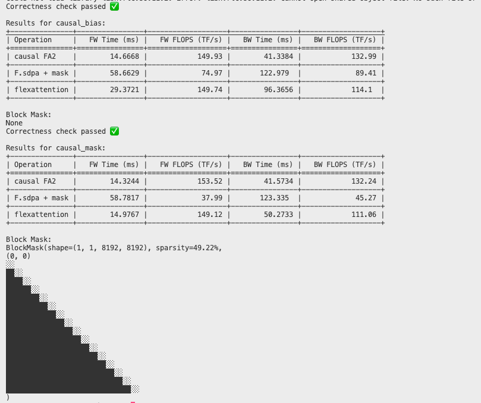
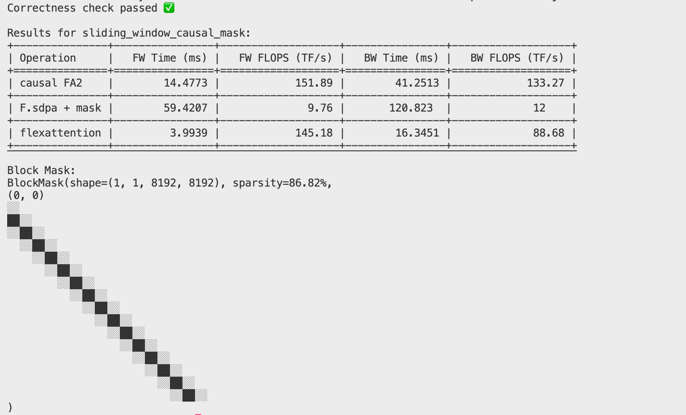
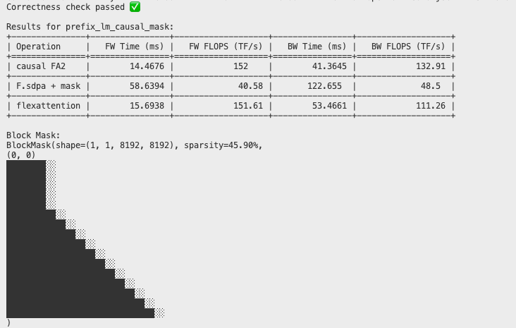
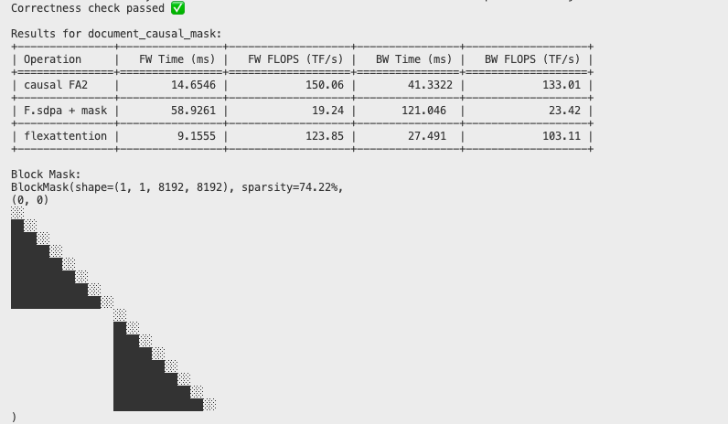
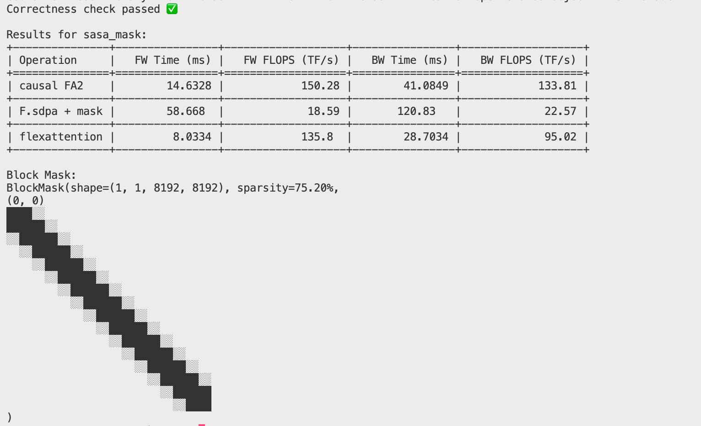
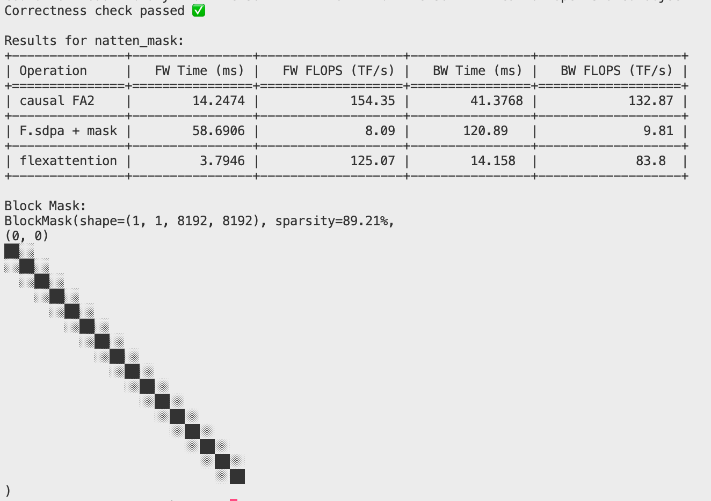
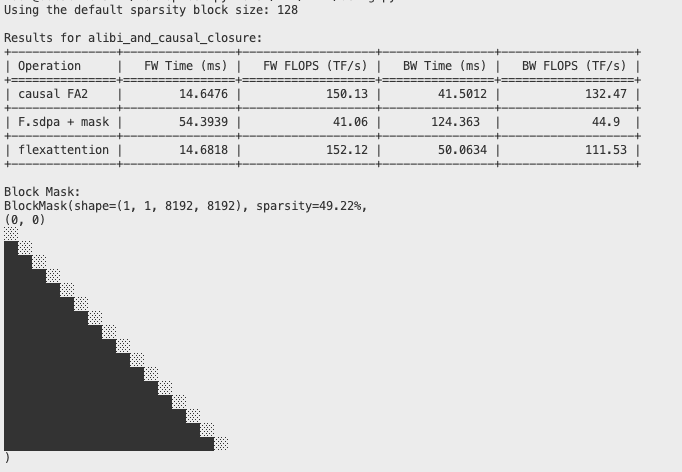
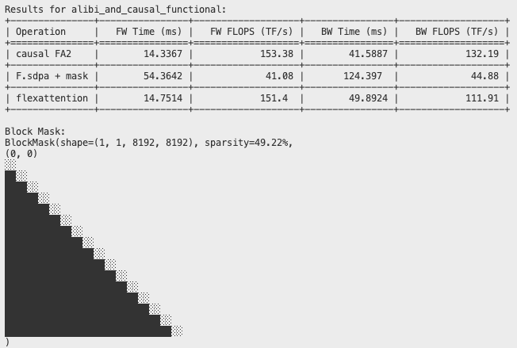
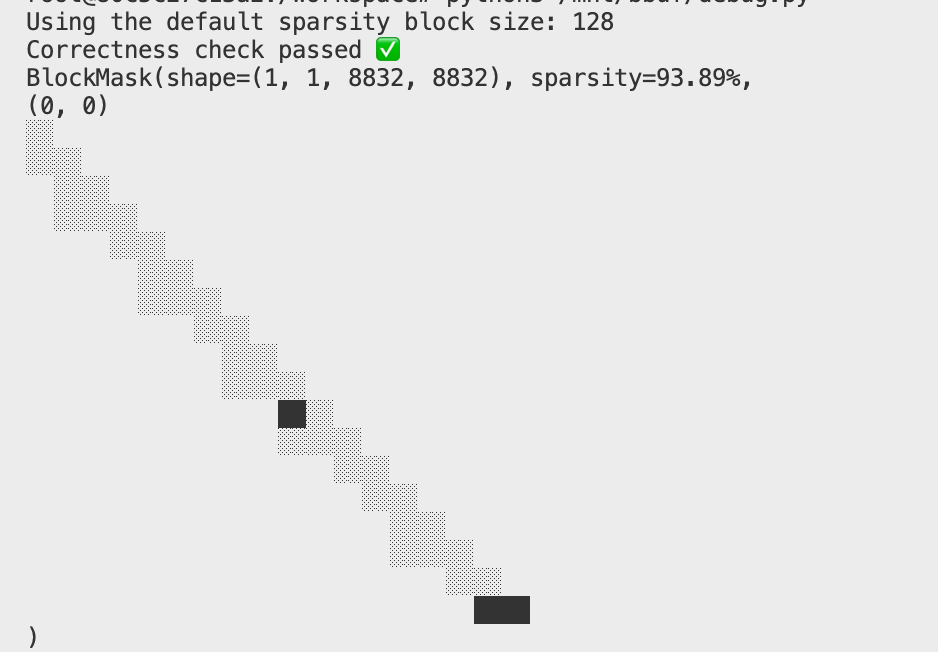
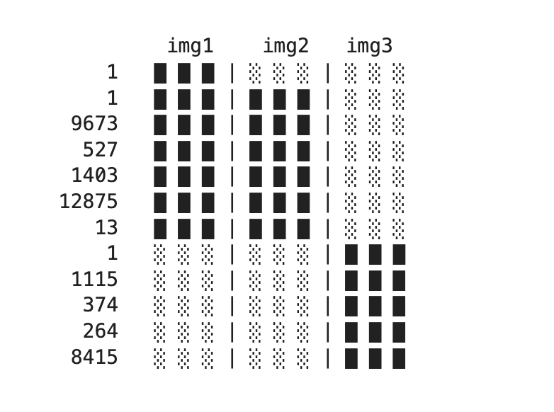

> FlexAttention의 자주 쓰는 API 사용법을 해설한다. 블로그 출처: https://github.com/pytorch-labs/attention-gym/blob/main/examples/flex_attn.ipynb . 이 글에서는 일부 코드에 설명을 추가하고, 코드의 몇 가지 bug를 수정했으며, PyTorch nightly 버전으로 예제를 실행해 각 custom attention의 출력을 얻었다. 출력은 아래 각 예제 코드 뒤에 표시했다. 마지막에는 torch compile inductor backend에서 FlexAttention을 구현하는 진입점 코드도 훑어본다.

# FlexAttention API 사용 Notebook

이 notebook은 새로운 FlexAttention API의 사용 방법을 보여준다. 이 API를 사용하면 scaled dot product attention(SDPA)에서 계산되는 attention score에 대해 사용자가 직접 수정 함수를 지정할 수 있다.

## 목차

1. [소개](#소개)
2. [설정](#설정)
3. [기본 사용법](#기본-사용법)
4. [score 수정 vs score mask](#score-수정-vs-score-mask)
5. [score 수정 예제](#score-수정-예제)
   - [전체 attention](#전체-attention)
   - [표준 causal mask](#표준-causal-mask)
   - [sliding window attention](#sliding-window-attention)
   - [Prefix LM](#prefix-lm-bidirectional-causal)
   - [document mask](#document-mask)
   - [NATTEN mask](#natten-masking)
   - [Alibi bias](#alibi-bias)
   - [Tanh soft capping](#tanh-soft-capping)
   - [nested jagged tensor](#nested-jagged-tensor)
   - [Flamingo cross attention](#flamingo-cross-attention)

## 소개

FlexAttention API 관련 내용사용관련 내용에서Fused Scaled Dot Product Attention Kernel중관련 내용대해attentionscore의이 부분은 원문의 해당 기술 설명을 이어서 서술한다 (attention)모드와bias가능관련 내용높은관련 내용구현，그리고관련 내용있다관련 내용에서의이 부분은 원문의 해당 기술 설명을 이어서 서술한다 (row)와이 부분은 원문의 해당 기술 설명을 이어서 서술한다 (API)할 것이다관련 내용사용관련 내용의관련 내용생성한다융합의이 부분은 원문의 해당 기술 설명을 이어서 서술한다 (kernel)

## 관련 내용
먼저，관련 내용우리는필요한 라이브러리를 import그리고관련 내용우리는의관련 내용

```python
import random
from functools import lru_cache, partial

import torch
import torch.nn.functional as F

from tabulate import tabulate
from torch.nn.attention.flex_attention import (
    _DEFAULT_SPARSE_BLOCK_SIZE,
    create_block_mask,
    create_mask,
    flex_attention,
)
from triton.testing import do_bench

torch.set_default_device("cuda")
torch.manual_seed(0)

torch._dynamo.config.cache_size_limit = 1000

# Compile the flex_attention function
flex_attention = torch.compile(flex_attention, dynamic=False)

# For better performance, you can use:
# flex_attention = torch.compile(_flex_attention, dynamic=False, mode="max-autotune-no-cudagraphs")

data_type = torch.float16

# The kernels will utilize block sparisty to increase performance
print(f"Using the default sparsity block size: {_DEFAULT_SPARSE_BLOCK_SIZE}")
```

우리는할 것이다관련 내용있다사용의테스트관련 내용이들관련 내용할 것이다이 부분은 원문의 해당 기술 설명을 이어서 서술한다 (score_mod)함수와mask_fn의block관련 내용

관련 내용할 것이다관련 내용로하관련 내용구현의성능：

- FlexAttention
- 이 부분은 원문의 해당 기술 설명을 이어서 서술한다 (FlashAttentionV2)의SOTA구현，관련 내용있다이 부분은 원문의 해당 기술 설명을 이어서 서술한다 (mask)
- `nn.F.scaled_dot_product_attention` + 완전히 materialize된의attn_mask。관련 내용할 것이다dispatch까지관련 내용개융합구현`EFFICIENT_ATTENTION`，이 부분은 원문의 해당 기술 설명을 이어서 서술한다 (mask)

```python
@lru_cache
def create_block_mask_cached(score_mod, B, H, M, N, device="cuda"):
    """
    생성한다그리고cacheblockmask。
    
    파라미터:
    - score_mod: score관련 내용함수
    - B: batch크기
    - H: 관련 내용
    - M: 이 부분은 원문의 해당 기술 설명을 이어서 서술한다 (column)
    - N: 이 부분은 원문의 해당 기술 설명을 이어서 서술한다 (column)
    - device: 관련 내용
    
    반환한다:
    - block_mask: 생성한다의blockmask
    """
    block_mask = create_block_mask(score_mod, B, H, M, N, device=device)
    return block_mask


def calculate_tflops(flops: float, time_ms: float, multiplier: int) -> float:
    """
    계산TFLOPS。
    
    파라미터:
    - flops: 이 부분은 원문의 해당 기술 설명을 이어서 서술한다
    - time_ms: 이 부분은 원문의 해당 기술 설명을 이어서 서술한다
    - multiplier: 관련 내용
    
    반환한다:
    - TFLOPS관련 내용
    """
    return multiplier * flops * (1e3 / time_ms) / 1e12


def test_mask(
    score_mod=None,
    mask_mod=None,
    B=16,
    H=16,
    S=8192,
    D=64,
    skip_correctness=False,
    print_mask=True,
):
    """
    테스트mask관련 내용가능。
    
    파라미터:
    - score_mod: score관련 내용함수
    - mask_mod: mask관련 내용함수
    - B: batch크기
    - H: 관련 내용
    - S: 이 부분은 원문의 해당 기술 설명을 이어서 서술한다 (column)
    - D: 관련 내용차원
    - skip_correctness: 여부이 부분은 원문의 해당 기술 설명을 이어서 서술한다
    - print_mask: 여부이 부분은 원문의 해당 기술 설명을 이어서 서술한다 (mask)
    """
    assert (
        score_mod is not None or mask_mod is not None
    ), "Must provide a score_mod or mask_mod"
    
    # 생성한다입력텐서
    query = torch.randn(
        B, H, S, D, device="cuda", dtype=torch.float16, requires_grad=True
    )
    key = torch.randn(
        B, H, S, D, device="cuda", dtype=torch.float16, requires_grad=True
    )
    value = torch.randn(
        B, H, S, D, device="cuda", dtype=torch.float16, requires_grad=True
    )
    gradOut = torch.randn(B, H, S, D, device="cuda", dtype=torch.float16)

    # 생성한다blockmask
    if mask_mod is not None:
        block_mask = create_block_mask_cached(mask_mod, 1, 1, S, S, device=query.device)
    else:
        block_mask = None
    
    # 이 부분은 원문의 해당 기술 설명을 이어서 서술한다 (mask)함수
    sdpa_mask_fn = mask_mod if mask_mod is not None else score_mod
    mask = create_mask(sdpa_mask_fn, 1, 1, S, S, device=query.device)

    # 관련 내용아니관련 내용의attention계산함수
    causal_fa2 = lambda: F.scaled_dot_product_attention(
        query, key, value, is_causal=True
    )
    xformers_mask = lambda: F.scaled_dot_product_attention(
        query, key, value, attn_mask=mask
    )
    flex_attention_call = lambda: flex_attention(
        query, key, value, score_mod=score_mod, block_mask=block_mask
    )

    results = []
    
    # 계산관련 내용
    if block_mask is not None:
        density = (100 - block_mask.sparsity()) / 100
    else:
        density = 1.0
    
    # 계산이 부분은 원문의 해당 기술 설명을 이어서 서술한다
    causal_fav2_flops = 0.5 * B * H * D * S * S
    flops = density * B * H * D * S * S

    # 전이 부분은 원문의 해당 기술 설명을 이어서 서술한다
    causal_fa2_time = do_bench(causal_fa2)
    xformers_mask_time = do_bench(xformers_mask)
    flex_ms = do_bench(flex_attention_call)

    # 후이 부분은 원문의 해당 기술 설명을 이어서 서술한다
    causal_fa2_out = causal_fa2()
    xformers_out = xformers_mask()
    flex_out = flex_attention_call()

    causal_fa2_bw_time = do_bench(
        lambda: causal_fa2_out.backward(gradOut, retain_graph=True)
    )
    xformers_mask_bw_time = do_bench(
        lambda: xformers_out.backward(gradOut, retain_graph=True)
    )
    flex_bw_ms = do_bench(lambda: flex_out.backward(gradOut, retain_graph=True))

    # 이 부분은 원문의 해당 기술 설명을 이어서 서술한다
    if not skip_correctness:
        xformers_outs = []
        flex_outs = []

        query.grad = None
        key.grad = None
        value.grad = None

        out1 = xformers_mask()
        xformers_outs.append(out1)
        out1.backward(gradOut)
        xformers_outs += [query.grad, key.grad, value.grad]

        query.grad = None
        key.grad = None
        value.grad = None

        out2 = flex_attention_call()
        flex_outs.append(out2)
        out2.backward(gradOut)
        flex_outs += [query.grad, key.grad, value.grad]
        for flex, xformer in zip(flex_outs, xformers_outs):
            torch.testing.assert_close(flex, xformer, atol=1e-1, rtol=1e-2)

        print("Correctness check passed ✅")
    
    # 결과관련 내용
    results = [
        [
            "causal FA2",
            f"{causal_fa2_time:.4f}",
            f"{calculate_tflops(causal_fav2_flops, causal_fa2_time, 4):.2f}",
            f"{causal_fa2_bw_time:.4f}",
            f"{calculate_tflops(causal_fav2_flops, causal_fa2_bw_time, 10):.2f}",
        ],
        [
            "F.sdpa + mask",
            f"{xformers_mask_time:.4f}",
            f"{calculate_tflops(flops, xformers_mask_time, 4):.2f}",
            f"{xformers_mask_bw_time:.4f}",
            f"{calculate_tflops(flops, xformers_mask_bw_time, 10):.2f}",
        ],
        [
            "flexattention",
            f"{flex_ms:.4f}",
            f"{calculate_tflops(flops, flex_ms, 4):.2f}",
            f"{flex_bw_ms:.4f}",
            f"{calculate_tflops(flops, flex_bw_ms, 10):.2f}",
        ],
    ]
    print(
        f"\nResults for {score_mod.__name__ if score_mod is not None else mask_mod.__name__}:"
    )
    print(
        tabulate(
            results,
            headers=[
                "Operation",
                "FW Time (ms)",
                "FW FLOPS (TF/s)",
                "BW Time (ms)",
                "BW FLOPS (TF/s)",
            ],
            tablefmt="grid",
        )
    )
    if print_mask:
        print(f"\nBlock Mask:\n{block_mask}")

    # 관련 내용
    del query, key, value, gradOut, causal_fa2_out, xformers_out, flex_out
    torch.cuda.empty_cache()
```

> 여기의multiplier로관련 내용이다4와10관련 내용

## 관련 내용사용관련 내용

로하이다관련 내용사용FlexAttention API의관련 내용예제：

```python

def checkerboard(score, batch, head, token_q, token_kv):
    score = torch.where(torch.abs(token_kv - token_q) % 1 == 0, score * 0.5, score)
    score = torch.where(torch.abs(token_kv - token_q) % 2 == 0, score * 2.0, score)
    return score


# Create input tensors
query = torch.randn(8, 8, 2048, 64, device="cuda", dtype=torch.float32)
key = torch.randn(8, 8, 2048, 64, device="cuda", dtype=torch.float32)
value = torch.randn(8, 8, 2048, 64, device="cuda", dtype=torch.float32)

# Call flex_attention with the checkerboard score modification
output = flex_attention(query, key, value, score_mod=checkerboard)

# Compile and run
compiled_flex_attention = torch.compile(flex_attention)
out_compiled = compiled_flex_attention(query, key, value, score_mod=checkerboard)

# Check if the results are close
torch.testing.assert_close(output, out_compiled, atol=2e-2, rtol=2e-2)
```

## score이 부분은 원문의 해당 기술 설명을 이어서 서술한다 (vsscoremask)

우리는할 것이다이 부분은 원문의 해당 기술 설명을 이어서 서술한다개핵심관련 내용이들관련 내용대해이 부분은 원문의 해당 기술 설명을 이어서 서술한다 (FlexAttention)의관련 내용큰성능이 부분은 원문의 해당 기술 설명을 이어서 서술한다 (flex_attention)의완전한API관련 내용하：

```python
flex_attention(
    query: torch.Tensor,
    key: torch.Tensor,
    value: torch.Tensor,
    score_mod: Optional[Callable[[torch.Tensor, torch.Tensor, torch.Tensor, torch.Tensor, torch.Tensor], torch.Tensor]] = None,
    block_mask: Optional[torch.nn.attention.flex_attention.BlockMask] = None,
    scale: Optional[float] = None,
)
```

사용자는가능가능된다좋은관련 내용로관련 내용우리는이 부분은 원문의 해당 기술 설명을 이어서 서술한다사용 `score_mod` 와 `block_mask`。

- 관련 내용사용자는관련 내용에서attentionweightmatrix중이 부분은 원문의 해당 기술 설명을 이어서 서술한다 (score)사용 `score_mod` 함수。
- 관련 내용사용자는관련 내용에서attentionweightmatrix중maskscore이 부분은 원문의 해당 기술 설명을 이어서 서술한다사용 `mask_mod` 함수，이들score관련 내용독립이 부분은 원문의 해당 기술 설명을 이어서 서술한다 (score)

주의：관련 내용`block_mask` 도가능로사용 `score_mod` 이 부분은 원문의 해당 기술 설명을 이어서 서술한다 (kernel)의성능할 것이다아니이다관련 내용의。

### 관련 내용우리는통해이 부분은 원문의 해당 기술 설명을 이어서 서술한다 (attention)와서관련 내용차이관련 내용

관련 내용사용score_mod의구현：

```python
def causal_bias(score, b, h, q_idx, kv_idx):
    return torch.where(q_idx >= kv_idx, score, -float("inf"))
```
각관련 내용사용자는관련 내용쓰기관련 내용개 `score_mod` 함수，관련 내용함수대해이 부분은 원문의 해당 기술 설명을 이어서 서술한다원본score，관련 내용대해관련 내용로 설정 -inf 관련 내용사용자는관련 내용가능가능관련 내용사용 `mask_mod`。

관련 내용사용 `mask_mod` 의구현：

```python
def casual_mask(b,h,q_idx, kv_idx):
    return q_idx >= kv_idx
```

관련 내용사용자는이 부분은 원문의 해당 기술 설명을 이어서 서술한다보다관련 내용와서관련 내용모두반환한다관련 내용텐서。핵심의관련 내용에서관련 내용

- `mask_mods` 반환한다관련 내용텐서，여기서 `True` 관련 내용계산이 부분은 원문의 해당 기술 설명을 이어서 서술한다 (score)`False` 관련 내용우리는이 부분은 원문의 해당 기술 설명을 이어서 서술한다 (mask score)
- `mask_mods` 아니관련 내용`score` 파라미터，왜냐하면관련 내용에서계산관련 내용중아니이 부분은 원문의 해당 기술 설명을 이어서 서술한다

### 관련 내용필자는관련 내용사용 score_mod 와 mask_mod 관련 내용된다관련 내용

score_mod 함수할 것이다응용관련 내용각개이 부분은 원문의 해당 기술 설명을 이어서 서술한다 (mask)의관련 내용

### 필자는있다관련 내용개 mask mod 함수，관련 내용생성한다관련 내용개 BlockMask？

관련 내용좋은，읽다이 부분은 원문의 해당 기술 설명을 이어서 서술한다 (flex_attention)우리는관련 내용개주요의 API。

```python
create_block_mask(
    mask_mod (Callable): mask_mod function.
    B (int): Batch size.
    H (int): Number of heads.
    Q_LEN (int): Sequence length of query.
    KV_LEN (int): Sequence length of key/value.
    device (str): Device to run the mask creation on.
    KV_BLOCK_SIZE (int): Block size of block mask for each query.
    Q_BLOCK_SIZE (int): Block size of block mask for each key/value.
    _compile (bool): Whether to compile the mask creation.
)
```

따라서，대해관련 내용상관련 내용예제，호출한다flex_attention의관련 내용성능관련 내용이다：

```python
causal_block_mask = create_block_mask(causal_mask, B, H, M, N)
flex_attention(query, key, value, block_mask = causal_block_mask)
```

B,H,Q_LEN,KV_LEN 관련 내용이다 batch_size、num_heads、query_sequence_length 와 key_sequence_length。

### 로관련 내용모두있다？

관련 내용이다위해성능。이 부분은 원문의 해당 기술 설명을 이어서 서술한다 (mask)상관련 내용만있다attentionscore의하관련 내용부분이다관련 내용의。만약아니생성한다BlockMask，우리는할 것이다관련 내용하다관련 내용의관련 내용아래우리는할 것이다이 부분은 원문의 해당 기술 설명을 이어서 서술한다구현의성능차이관련 내용

## score관련 내용예제
관련 내용우리는관련 내용가능로관련 내용사용FlexAttention API의이 부분은 원문의 해당 기술 설명을 이어서 서술한다 (score)예제。

관련 내용우리는할 것이다관련 내용이들score_mod + mask_fns의이 부분은 원문의 해당 기술 설명을 이어서 서술한다

이 부분은 원문의 해당 기술 설명을 이어서 서술한다 (block)의이 부분은 원문의 해당 기술 설명을 이어서 서술한다 (mask)상아니관련 내용계산관련 내용의attention출력
- ██ 이block계산관련 내용있다관련 내용와이 부분은 원문의 해당 기술 설명을 이어서 서술한다 (token)의이 부분은 원문의 해당 기술 설명을 이어서 서술한다 (attention)
- ░░ 이block부분mask，이 부분은 원문의 해당 기술 설명을 이어서 서술한다 (token token mask)로-inf

### 이 부분은 원문의 해당 기술 설명을 이어서 서술한다 (attention)

응용관련 내용개“없음관련 내용의score이 부분은 원문의 해당 기술 설명을 이어서 서술한다 (attentionscore)아니관련 내용

```python
def noop(score, b, h, q_idx, kv_idx):
    return score

test_mask(noop, print_mask=True)
```

실행한다후의출력로：

```python
Results for noop:
+---------------+----------------+-------------------+----------------+-------------------+
| Operation     |   FW Time (ms) |   FW FLOPS (TF/s) |   BW Time (ms) |   BW FLOPS (TF/s) |
+===============+================+===================+================+===================+
| causal FA2    |        14.6478 |            150.13 |        41.1986 |            133.44 |
+---------------+----------------+-------------------+----------------+-------------------+
| F.sdpa + mask |        58.8032 |             74.79 |       125.07   |             87.91 |
+---------------+----------------+-------------------+----------------+-------------------+
| flexattention |        27.3449 |            160.84 |        94.4015 |            116.47 |
+---------------+----------------+-------------------+----------------+-------------------+

Block Mask:
None
```

### 이 부분은 원문의 해당 기술 설명을 이어서 서술한다 (mask)

이 부분은 원문의 해당 기술 설명을 이어서 서술한다 (mask)이다이 부분은 원문의 해당 기술 설명을 이어서 서술한다모델중의핵심관련 내용보장각개token만가능이 부분은 원문의 해당 기술 설명을 이어서 서술한다 (column)중관련 내용및관련 내용이전에는의token。block이 부분은 원문의 해당 기술 설명을 이어서 서술한다 (mask)의하관련 내용

있다관련 내용이들구현의더많은이 부분은 원문의 해당 기술 설명을 이어서 서술한다위의《score이 부분은 원문의 해당 기술 설명을 이어서 서술한다 (vsscoremask)

```python
def causal_bias(score, b, h, q_idx, kv_idx):
    return torch.where(q_idx >= kv_idx, score, -float("inf"))

test_mask(score_mod=causal_bias)

def causal_mask(b, h, q_idx, kv_idx):
    return q_idx >= kv_idx

test_mask(mask_mod=causal_mask)
```



### 이 부분은 원문의 해당 기술 설명을 이어서 서술한다 (attention)

Mistral 관련 내용중있다관련 내용개관련 내용좋은의이 부분은 원문의 해당 기술 설명을 이어서 서술한다 (bias)상，사용자는관련 내용개관련 내용크기의“관련 내용에서이 부분은 원문의 해당 기술 설명을 이어서 서술한다중，사용자는만관련 내용`torch.abs(q_tokens - kv_tokens) < SLIDING_WINDOW` 의 token 이 부분은 원문의 해당 기술 설명을 이어서 서술한다도된다와이 부분은 원문의 해당 기술 설명을 이어서 서술한다 (attention)사용。우리는할 것이다통해관련 내용개관련 내용좋은의모드와서구현이 부분은 원문의 해당 기술 설명을 이어서 서술한다 (mask mask)가능로관련 내용상관련 내용로관련 내용개부분，그다음관련 내용에서관련 내용

여기서는 mask 함수 두 개를 작성한다. 하나는 `causal mask`를 적용하고, 다른 하나는 `window attention`을 적용한다. 그런 다음 두 mask 함수를 조합해 최종 mask를 만든다. 앞에서처럼 mask 함수가 `True`를 반환하는 위치만 attention 계산에 참여한다.

```python
SLIDING_WINDOW = 1024


def sliding_window_causal_mask(b, h, q_idx, kv_idx):
    causal_mask = q_idx >= kv_idx
    windowed_mask = (
        q_idx - kv_idx <= SLIDING_WINDOW
    )  # We dont need to check the right side of the sliding window since we are applying the causal mask

    return causal_mask & windowed_mask

test_mask(mask_mod=sliding_window_causal_mask)
```



### 전이 부분은 원문의 해당 기술 설명을 이어서 서술한다 (LM +)

T5(https://paperswithcode.com/method/t5)는 prefix attention을 사용한다. 여기서는 일정 개수의 `prefix` token이 서로 양방향으로 attention하고, 이후 token은 causal attention을 수행한다. 다시 mask 함수 하나를 작성해 이 동작을 구현하며, 기본 구조는 앞의 causal mask와 비슷하다.

```python
PREFIX_LENGTH = 2048

def prefix_lm_causal_mask(b, h, q_idx, kv_idx):
    prefix_mask = kv_idx <= PREFIX_LENGTH
    causal_mask = q_idx >= kv_idx
    return prefix_mask | causal_mask

test_mask(mask_mod=prefix_lm_causal_mask)
```



### 이 부분은 원문의 해당 기술 설명을 이어서 서술한다 (mask)

관련 내용하，우리는있다많은개아니관련 내용의관련 내용우리는이 부분은 원문의 해당 기술 설명을 이어서 서술한다 (mask)의attention，이 부분은 원문의 해당 기술 설명을 이어서 서술한다의token관련 내용의attention。우리는가능로통해관련 내용사용관련 내용개document_id텐서와서구현이 부분은 원문의 해당 기술 설명을 이어서 서술한다텐서관련 내용각개token관련 내용의관련 내용그다음，우리는가능로mask관련 내용있다document_id[q_idx]와document_id[kv_idx]아니관련 내용의attentionscore。

주의：만있다관련 내용`score_mod`관련 내용우리는관련 내용컴파일관련 내용개새의kernel（관련 내용된다관련 내용사용torch.compile이 부분은 원문의 해당 기술 설명을 이어서 서술한다까지관련 내용이예제코드이다통해cacheBlockMask구현의，관련 내용와서이 부분은 원문의 해당 기술 설명을 이어서 서술한다 (BlockMask)아니관련 내용새컴파일。도관련 내용이다관련 내용대해이 부분은 원문의 해당 기술 설명을 이어서 서술한다 (mask)우리는만관련 내용에서이 부분은 원문의 해당 기술 설명을 이어서 서술한다계산관련 내용개새의BlockMask，관련 내용아니이다관련 내용개새의kernel。

```python
document_id = torch.zeros(32768, dtype=torch.int, device="cuda")
document_id[:4096] = 0
document_id[4096:8192] = 1
for i in range(8192, 32768, 8192):
    document_id[i: i + 8192] = i // 8192 + 1

def document_causal_mask(b, h, q_idx, kv_idx):
    causal_mask = q_idx >= kv_idx
    document_mask = document_id[q_idx] == document_id[kv_idx]
    return causal_mask & document_mask

test_mask(mask_mod=document_causal_mask, S=32768)
```

필자는에서4090상관련 내용된다oom，여기관련 내용작은관련 내용

```python
document_id = torch.zeros(8192, dtype=torch.int, device="cuda")
document_id[:4096] = 0
document_id[4096:8192] = 1
# for i in range(8192, 32768, 8192):
#     document_id[i: i + 8192] = i // 8192 + 1

def document_causal_mask(b, h, q_idx, kv_idx):
    causal_mask = q_idx >= kv_idx
    document_mask = document_id[q_idx] == document_id[kv_idx]
    return causal_mask & document_mask

test_mask(mask_mod=document_causal_mask, S=8192)
```



### 독립이 부분은 원문의 해당 기술 설명을 이어서 서술한다 (attentionmask)

이 예제에서는 크기가 H x W인 2D token grid가 있다고 가정한다. 각 query token은 가까운 이웃, 예를 들어 반경 8 안의 `pixel` token에만 attend한다고 본다.

우리는가능로통해먼저할 것이다이 부분은 원문의 해당 기술 설명을 이어서 서술한다로관련 내용와서구현이mask_mod。그다음，우리는가능로이 부분은 원문의 해당 기술 설명을 이어서 서술한다개관련 내용의관련 내용여부에서관련 내용

더많은관련 내용보다이 부분은 원문의 해당 기술 설명을 이어서 서술한다 (Stand-Alone Self-Attention in Vision Models)https://arxiv.org/abs/1906.05909)

```python
H = 128
W = 128
WINDOW = 8

def get_x_y(idx):
    return idx // W, idx % W

def sasa_mask(b, h, q_idx, kv_idx):
    q_x, q_y = get_x_y(q_idx)
    kv_x, kv_y = get_x_y(kv_idx)
    horizontal_mask = (q_x - kv_x).abs() <= WINDOW
    vertical_mask = (q_y - kv_y).abs() <= WINDOW
    return horizontal_mask & vertical_mask

test_mask(mask_mod=sasa_mask)
```




### NATTEN mask

관련 내용개크기로 (H x W) 의이 부분은 원문의 해당 기술 설명을 이어서 서술한다개token이 부분은 원문의 해당 기술 설명을 이어서 서술한다 (column)에서관련 내용개이 부분은 원문의 해당 기술 설명을 이어서 서술한다 (kernel K_H x K_W)가능가능로관련 내용로중이 부분은 원문의 해당 기술 설명을 이어서 서술한다에서관련 내용그리고이 부분은 원문의 해당 기술 설명을 이어서 서술한다

관련 내용와SASA관련 내용있다관련 내용의관련 내용와서이 부분은 원문의 해당 기술 설명을 이어서 서술한다 (kernel)에서관련 내용보장관련 내용있다이 부분은 원문의 해당 기술 설명을 이어서 서술한다개수의관련 내용할 것이다관련 내용와kernel중관련 내용수행한다관련 내용아니이다이 부분은 원문의 해당 기술 설명을 이어서 서술한다 (kernel)중이 부분은 원문의 해당 기술 설명을 이어서 서술한다에서이 부분은 원문의 해당 기술 설명을 이어서 서술한다

더많은이 부분은 원문의 해당 기술 설명을 이어서 서술한다 (NATTEN)저장소(https://github.com/SHI-Labs/NATTEN)。
> 주의：더완전한의NATTEN구현할 것이다관련 내용대해kernel관련 내용의지원。NATTEN관련 내용융합의kernel관련 내용있다관련 내용가능이 부분은 원문의 해당 기술 설명을 이어서 서술한다 (registertoken)가능。관련 내용가능관련 내용가능로에서Flex Attention중관련 내용여기관련 내용있다관련 내용

```python
H = 128
W = 128
K_H = 7
K_W = 7

def get_x_y(idx):
    return idx // W, idx % W

def natten_mask(
    b,
    h,
    q_idx,
    kv_idx,
):
    q_x, q_y = get_x_y(q_idx)
    kv_x, kv_y = get_x_y(kv_idx)
    # kernel nominally attempts to center itself on the query, but kernel center
    # is clamped to a fixed distance (kernel half-length) from the canvas edge
    kernel_x = q_x.clamp(K_W // 2, (W - 1) - K_W // 2)
    kernel_y = q_y.clamp(K_H // 2, (H - 1) - K_H // 2)
    hori_mask = (kernel_x - kv_x).abs() <= K_W // 2
    vert_mask = (kernel_y - kv_y).abs() <= K_H // 2
    return hori_mask & vert_mask

test_mask(mask_mod=natten_mask)
```



### Alibi bias

Alibi attentionbias에서 Train Short, Test Long: Attention with Linear Biases Enables Input Length Extrapolation(https://arxiv.org/abs/2108.12409) 중이 부분은 원문의 해당 기술 설명을 이어서 서술한다 (row)그리고관련 내용에서관련 내용있다관련 내용의있다이 부분은 원문의 해당 기술 설명을 이어서 서술한다 (ALiBi)아니된다할 것이다관련 내용추가까지관련 내용중；관련 내용통해와이 부분은 원문의 해당 기술 설명을 이어서 서술한다의관련 내용와서bias이 부분은 원문의 해당 기술 설명을 이어서 서술한다 (- attentionscore)

우리는할 것이다로관련 내용구현관련 내용로관련 내용개새의관련 내용가능，관련 내용에서score관련 내용함수중관련 내용사용관련 내용텐서의가능관련 내용함수관련 내용아니관련 내용텐서，관련 내용사용관련 내용가능로통해 `closure` 와서구현관련 내용에서여기，우리는관련 내용사용우리는관련 내용의이 부분은 원문의 해당 기술 설명을 이어서 서술한다 (mask)함수로및관련 내용개관련 내용의bias。

```python
# Alibi Bias
def generate_alibi_bias():
    alibi_bias = []
    for h in range(H):
        alibi_bias.append(-((h + 1) * 8.0 / H))
    alibi_bias = torch.tensor(alibi_bias, device="cuda")
    alibi_bias = torch.exp2(alibi_bias)
    return alibi_bias


alibi_bias = generate_alibi_bias()


# In this case we are going to use a mask_mod and a score_mod
def causal_mask(b, h, q_idx, kv_idx):
    return q_idx >= kv_idx


def alibi_and_causal_closure(score, b, h, q_idx, kv_idx):
    bias = alibi_bias[h] * (q_idx - kv_idx)
    return score + bias


def alibi_and_causal_functional(score, b, h, q_idx, kv_idx):
    scale = torch.exp2(-((h + 1) * 8.0 / H))
    bias = (q_idx - kv_idx) * scale
    return score + bias


# Correctness check here is simple and only works with mask_fns and not actual score_mods

test_mask(
    alibi_and_causal_closure,
    mask_mod=causal_mask,
    skip_correctness=True,
    print_mask=False,
)
test_mask(
    alibi_and_causal_functional,
    mask_mod=causal_mask,
    skip_correctness=True,
    print_mask=False,
)
```

> 여기의H관련 내용있다관련 내용우리는쓰기관련 내용개H=64와서보다하결과。이 부분은 원문의 해당 기술 설명을 이어서 서술한다 (print_mask True)가능보다까지mask관련 내용






### Tanh 관련 내용상관련 내용
우리는도가능로관련 내용사용이API구현tanh관련 내용상관련 내용통해tanh수행한다logit관련 내용상관련 내용에서Gemma 2중이 부분은 원문의 해당 기술 설명을 이어서 서술한다 (row)

에서관련 내용하，있다관련 내용차이관련 내용이다，PyTorch（와CUDA/Triton）중의관련 내용`tanh`관련 내용된다낮춘다까지관련 내용개관련 내용상이 부분은 원문의 해당 기술 설명을 이어서 서술한다대해）관련 내용느린의SASS구현。관련 내용https://godbolt.org/z/W8afevWv1이 부분은 원문의 해당 기술 설명을 이어서 서술한다 (SASS)의관련 내용

따라서，에서관련 내용하，우리는관련 내용할 것이다`tanh`낮춘다까지이 부분은 원문의 해당 기술 설명을 이어서 서술한다 (tanh)구현。우리는가능로통해에서PyTorch중관련 내용개이 부분은 원문의 해당 기술 설명을 이어서 서술한다그다음수행한다Inductor낮춘다와서구현관련 내용

```python
def causal_mask(b, h, q_idx, kv_idx):
    return q_idx >= kv_idx

# Tanh Soft-Capping
@torch.library.custom_op("approx::tanh", mutates_args=())
def tanh_approx(inp: torch.Tensor) -> torch.Tensor:
    return torch.tanh(inp)


@tanh_approx.register_fake
def _(inp: torch.Tensor) -> torch.Tensor:
    return torch.tanh(inp)


from torch._inductor.lowering import make_pointwise, register_lowering

# Some internal torch.compile details
from torch._inductor.virtualized import ops

def tanh_approx_lowering(inp):
    fn = partial(ops.inline_asm_elementwise, asm="tanh.approx.f32 0,1;")
    return make_pointwise(fn)(inp)

register_lowering(torch.ops.approx.tanh)(tanh_approx_lowering)

class TanhApprox(torch.autograd.Function):
    @staticmethod
    def forward(x):
        return torch.ops.approx.tanh(x)

    @staticmethod
    def setup_context(ctx, inputs, output):
        (x,) = inputs
        result = output
        ctx.save_for_backward(result)

    @staticmethod
    def backward(ctx, grad_output):
        (result,) = ctx.saved_tensors
        return grad_output * (1 - result * result)

tanh_approx = TanhApprox.apply

def tanh_soft_cap(score, b, h, q_idx, kv_idx):
    score = score / 2
    score = tanh_approx(score)
    return score * 2

# The baseline (xformers) does not have a way to generate tanh-softcapping so we skip correctness checks
test_mask(tanh_soft_cap, mask_mod=causal_mask, skip_correctness=True)
```

> 코드관련 내용의asm코드있다관련 내용이관련 내용없음이 부분은 원문의 해당 기술 설명을 이어서 서술한다 (row)하：

```shell
ptxas /tmp/tmpmehxr5i1.ptx, line 3972; error: Arguments mismatch for instruction 'tanh'
ptxas /tmp/tmpmehxr5i1.ptx, line 3977; error: Arguments mismatch for instruction 'tanh'
ptxas /tmp/tmpmehxr5i1.ptx, line 3982; error: Arguments mismatch for instruction 'tanh'
ptxas /tmp/tmpmehxr5i1.ptx, line 3987; error: Arguments mismatch for instruction 'tanh'
ptxas /tmp/tmpmehxr5i1.ptx, line 3992; error: Arguments mismatch for instruction 'tanh'
ptxas /tmp/tmpmehxr5i1.ptx, line 3997; error: Arguments mismatch for instruction 'tanh'
ptxas /tmp/tmpmehxr5i1.ptx, line 4002; error: Arguments mismatch for instruction 'tanh'
ptxas /tmp/tmpmehxr5i1.ptx, line 4007; error: Arguments mismatch for instruction 'tanh'
ptxas /tmp/tmpmehxr5i1.ptx, line 4012; error: Arguments mismatch for instruction 'tanh'
ptxas fatal: Ptx assembly aborted due to errors

```

### 관련 내용아니관련 내용텐서

관련 내용텐서이다관련 내용텐서관련 내용사용된다높은관련 내용와계산아니관련 내용가능로관련 내용사용FlexAttention이 부분은 원문의 해당 기술 설명을 이어서 서술한다로높은관련 내용대해아니관련 내용의이 부분은 원문의 해당 기술 설명을 이어서 서술한다 (columnbatch)실행한다이 부분은 원문의 해당 기술 설명을 이어서 서술한다 (attention)

에서이 부분은 원문의 해당 기술 설명을 이어서 서술한다 (layer NJT)아니관련 내용텐서)할 것이다관련 내용아니이 부분은 원문의 해당 기술 설명을 이어서 서술한다로관련 내용`[[sequence_0], [sequence_1], ..., [Sequence_B]], sum(*),..`

```python
# 이 부분은 원문의 해당 기술 설명을 이어서 서술한다로보장결과가능관련 내용
random.seed(0)
torch.manual_seed(0)

# 이 부분은 원문의 해당 기술 설명을 이어서 서술한다 (batch)크기、관련 내용와차원
batch_size = 16
n_heads = 16
D = 64

# 이 부분은 원문의 해당 기술 설명을 이어서 서술한다 (QKV)가능로계산관련 내용
def prepare_qkv_values(tensor):
    return tensor._values.detach().requires_grad_()

# 이 부분은 원문의 해당 기술 설명을 이어서 서술한다 (column)인덱스관련 내용
def build_seq_idx(tensor: torch.Tensor):
    offsets = tensor.offsets()
    total_length = tensor.offsets()[-1].item()
    # 생성한다부터0까지total_length의관련 내용텐서
    range_tensor = torch.arange(total_length, device="cuda", dtype=torch.int32)

    # 관련 내용사용searchsorted관련 내용각개관련 내용의인덱스
    seq_idx = torch.searchsorted(offsets, range_tensor, right=True) - 1

    return seq_idx

# 생성한다NJT관련 내용할 것이다이 부분은 원문의 해당 기술 설명을 이어서 서술한다 (mask)함수관련 내용로NJTmask함수
def create_njt_wrapper(orig_mask_mod, offsets, seq_idx):
    """관련 내용사용관련 내용할 것이다이 부분은 원문의 해당 기술 설명을 이어서 서술한다 (mask)함수관련 내용로NJTmask함수"""

    def njt_score_mod(b, h, q_idx, kv_idx):
        q_nested = q_idx - offsets[seq_idx[q_idx]]
        kv_nested = kv_idx - offsets[seq_idx[kv_idx]]
        is_same_sequence = seq_idx[q_idx] == seq_idx[kv_idx]
        return orig_mask_mod(b, h, q_nested, kv_nested) & is_same_sequence

    return njt_score_mod

# 이 부분은 원문의 해당 기술 설명을 이어서 서술한다 (scoremask)함수
def causal_mask(b, h, q_idx, kv_idx):
    return q_idx >= kv_idx
    # return torch.where(q_idx >= kv_idx, score, -float("inf"))

# 현재이 부분은 원문의 해당 기술 설명을 이어서 서술한다 (column)반드시가능이 부분은 원문의 해당 기술 설명을 이어서 서술한다 (128)
sentence_lengths = [random.randint(1, 1024) for _ in range(batch_size - 1)]
total = sum(sentence_lengths)
sentence_lengths.append(128 - total % 128)
total = sum(sentence_lengths)

# 생성한다아니관련 내용텐서
ragged_tensors = [torch.randn(l, n_heads, D, device="cuda") for l in sentence_lengths]
query = torch.nested.nested_tensor(
    ragged_tensors, layout=torch.jagged, requires_grad=True
)
key = torch.nested.nested_tensor(
    ragged_tensors, layout=torch.jagged, requires_grad=True
)
value = torch.nested.nested_tensor(
    ragged_tensors, layout=torch.jagged, requires_grad=True
)

# 이 부분은 원문의 해당 기술 설명을 이어서 서술한다 (seq_idx)
offsets = query.offsets()
seq_idx = build_seq_idx(query)

# 생성한다NJT이 부분은 원문의 해당 기술 설명을 이어서 서술한다 (scoremask)함수
causal_score_mod_njt = create_njt_wrapper(causal_mask, offsets, seq_idx)

# 이 부분은 원문의 해당 기술 설명을 이어서 서술한다 (QKV)
query_values = prepare_qkv_values(query)
key_values = prepare_qkv_values(key)
value_values = prepare_qkv_values(value)

# 생성한다blockmask
block_mask = create_block_mask_cached(
    causal_score_mod_njt, 1, 1, total, total, device=query_values.device
)
# 관련 내용사용FlexAttention계산출력
out_flex = flex_attention(
    query_values.view(1, -1, n_heads, D).transpose(1, 2),
    key_values.view(1, -1, n_heads, D).transpose(1, 2),
    value_values.view(1, -1, n_heads, D).transpose(1, 2),
    block_mask=block_mask,
)
# 관련 내용사용Scaled Dot-Product Attention계산출력
out_sdpa = F.scaled_dot_product_attention(
    query.transpose(1, 2),
    key.transpose(1, 2),
    value.transpose(1, 2),
    is_causal=True,
)

# 관련 내용출력결과
sdpa_outs = []
flex_outs = []

# 생성한다관련 내용출력
gradOut = torch.randn_like(out_sdpa)

# 계산그리고이 부분은 원문의 해당 기술 설명을 이어서 서술한다 (SDPA)의출력와관련 내용
sdpa_outs.append(out_sdpa)
out_sdpa.backward(gradOut)
sdpa_outs += [query.grad, key.grad, value.grad]

# 계산그리고이 부분은 원문의 해당 기술 설명을 이어서 서술한다 (FlexAttention)의출력와관련 내용
flex_outs.append(out_flex)
out_flex.backward(gradOut._values.unsqueeze(0))
flex_outs += [query_values.grad, key_values.grad, value_values.grad]

# 이 부분은 원문의 해당 기술 설명을 이어서 서술한다의출력와관련 내용
for flex, sdpa in zip(flex_outs, sdpa_outs):
    flex = flex.squeeze(0)
    torch.testing.assert_close(flex, sdpa._values, atol=1e-2, rtol=1e-2)

# 이 부분은 원문의 해당 기술 설명을 이어서 서술한다결과
print("Correctness check passed ✅")
print(block_mask)
```



### Flamingo Cross Attention

🦩 Flamingo 관련 내용https://arxiv.org/pdf/2204.14198）소개이 부분은 원문의 해당 기술 설명을 이어서 서술한다모델（VLM）이 부분은 원문의 해당 기술 설명을 이어서 서술한다로관련 내용의관련 내용와관련 내용로입력，그리고생성한다관련 내용에 의해관련 내용의관련 내용로출력。”

관련 내용사용 `VisionCrossAttentionMask` 와서보장관련 내용만관련 내용관련의이 부분은 원문의 해당 기술 설명을 이어서 서술한다 (TorchTune)대해이 부분은 원문의 해당 기술 설명을 이어서 서술한다 (mask)있다관련 내용좋은의이 부분은 원문의 해당 기술 설명을 이어서 서술한다 (VisionCrossAttentionMask)https://github.com/pytorch/torchtune/blob/bbc48e089b072c7cbaea175bc70501b2193ba482/torchtune/modules/transforms/_transforms.py#L22-L43）

이 부분은 원문의 해당 기술 설명을 이어서 서술한다 (attention)보장이 부분은 원문의 해당 기술 설명을 이어서 서술한다 (column)전관련 내용의관련 내용아니이 부분은 원문의 해당 기술 설명을 이어서 서술한다와서의또는아니관련의관련 내용

```python
Example:
    >>> text = "<img1><img2>These are two dogs. <img3>This is a cat."
    >>> image_token_id = 1
    >>> tokens = [1, 1, 9673, 527, 1403, 12875, 13, 1, 1115, 374, 264, 8415]
    >>> transform = VisionCrossAttentionMask(tile_size=400, patch_size=40, image_token_id=1)
    >>> intervals = transform._get_image_attention_intervals(tokens)
    >>> print(intervals)
    [[0, 7], [1, 7], [7, 12]]
```

에서위의관련 내용중，우리는할 것이다생성한다관련 내용개12 x sum(image_tokens_1 + image_tokens_2 + image_tokens_3)의mask

이 부분은 원문의 해당 기술 설명을 이어서 서술한다 (image_tokens)의크기로3



```python
# Given information
num_tokens = 12
num_images = 3
image_token_length = 3
num_image_tokens = num_images * image_token_length
intervals = [[0, 7], [1, 7], [7, 12]]
# This is only needed if your images have different number of tokens per image
# If they are all the same number of tokens you can use image_idx = kv_idx // image_token_length
image_boundaries = [image_token_length * i for i in range(num_images)]
image_boundaries = (
    [0] * image_token_length + [1] * image_token_length + [2] * image_token_length
)

image_boundaries = torch.tensor(image_boundaries, dtype=torch.long, device="cuda")
intervals = torch.tensor(intervals, dtype=torch.long, device="cuda")


def vision_x_attention_mask(b, h, q_idx, kv_idx):
    image_idx = image_boundaries[kv_idx]
    interval = intervals[image_idx]
    return (q_idx >= interval[0]) & (q_idx < interval[1])


mask = create_mask(vision_x_attention_mask, 1, 1, num_tokens, num_image_tokens, "cuda")

print(mask)
```


# FlexAttention이다관련 내용구현의

FlexAttention이다통해PyTorch컴파일관련 내용와서구현의，통해inductor후관련 내용생성한다FlexAttention의관련 내용대응의Triton코드。관련 내용구현관련 내용https://github.com/pytorch/pytorch/blob/ee09d066d35d7e17cf7e9479c0b8bfc70cffc264/torch/_inductor/kernel/flex_attention.py#L317 ，아래대해 flex_attention 의이 부분은 원문의 해당 기술 설명을 이어서 서술한다둘러보기관련 내용하：

```python
# TODO: We probably also need a layout constraint?
@register_lowering(torch.ops.higher_order.flex_attention, type_promotion_kind=None)
def flex_attention(
    query,
    key,
    value,
    subgraph,
    block_mask,
    scale,
    score_mod_other_buffers,
    mask_mod_other_buffers,
):
    # 관련 내용 (row)코드관련 내용상관련 내용얻는다우리는에서API응용중관련 내용의score_mod와mask_mod이후관련 내용계산의Q,K,V
    (
        kv_num_blocks,
        kv_indices,
        full_kv_num_blocks,
        full_kv_indices,
        q_num_blocks,
        q_indices,
        full_q_num_blocks,
        full_q_indices,
        SPARSE_KV_BLOCK_SIZE,
        SPARSE_Q_BLOCK_SIZE,
        mask_graph,
    ) = block_mask
    // 생성한다관련 내용입력column이 부분은 원문의 해당 기술 설명을 이어서 서술한다 (score b h m n)개이 부분은 원문의 해당 기술 설명을 이어서 서술한다로query의관련 내용와int32
    placeholder_inps = [
        create_placeholder(name, dtype, query.get_device())
        for name, dtype in [
            ("score", query.get_dtype()),
            ("b", torch.int32),
            ("h", torch.int32),
            ("m", torch.int32),
            ("n", torch.int32),
        ]
    ]
    // 이 부분은 원문의 해당 기술 설명을 이어서 서술한다입력와이 부분은 원문의 해당 기술 설명을 이어서 서술한다 (score)
    subgraph_buffer = build_subgraph_buffer(
        placeholder_inps + list(score_mod_other_buffers), subgraph
    )
    // 생성한다mask관련 내용의관련 내용입력column이 부분은 원문의 해당 기술 설명을 이어서 서술한다 (b h m n)개이 부분은 원문의 해당 기술 설명을 이어서 서술한다로int32
    mask_graph_placeholder_inps = [
        create_placeholder(name, dtype, query.get_device())
        for name, dtype in [
            ("b", torch.int32),
            ("h", torch.int32),
            ("m", torch.int32),
            ("n", torch.int32),
        ]
    ]
    // 이 부분은 원문의 해당 기술 설명을 이어서 서술한다 (mask mask)의관련 내용입력와이 부분은 원문의 해당 기술 설명을 이어서 서술한다 (mask)
    mask_graph_buffer = build_subgraph_buffer(
        mask_graph_placeholder_inps + list(mask_mod_other_buffers), mask_graph
    )
    // 만약관련 내용사용Flex관련 내용반환한다생성한다의Flex이 부분은 원문의 해당 기술 설명을 이어서 서술한다 (kernel)
    if _use_flex_decoding(query):
        return create_flex_decoding_kernel(
            query,
            key,
            value,
            block_mask,
            scale,
            subgraph_buffer,
            mask_graph_buffer,
            score_mod_other_buffers,
            mask_mod_other_buffers,
        )
    // 대해관련 내용있다관련 내용수행한다realize관련 내용보장이 부분은 원문의 해당 기술 설명을 이어서 서술한다
    for buf in [
        query,
        key,
        value,
        kv_num_blocks,
        kv_indices,
        q_num_blocks,
        q_indices,
        full_kv_num_blocks,
        full_kv_indices,
        full_q_num_blocks,
        full_q_indices,
    ]:
        if buf is not None:
            buf.realize()

    // 생성한다관련 내용대해이 부분은 원문의 해당 기술 설명을 이어서 서술한다크기와관련 내용
    layout = FixedLayout(
        query.get_device(),
        query.get_dtype(),
        query.get_size(),
        query.get_stride(),
    )
    // 계산logsumexp의shape，이 부분은 원문의 해당 기술 설명을 이어서 서술한다 (query)의shape제거마지막으로관련 내용개차원
    logsumexp_shape = query.get_size()[:-1]  # [B, H, M]
    // 생성한다logsumexp텐서，관련 내용로float32，관련 내용와query관련 내용
    logsumexp = empty_strided(
        logsumexp_shape,
        None,
        dtype=torch.float32,  # The logsumexp is always stored in fp32 regardless of the input dtype
        device=query.get_device(),
    )
    // 관련 내용여부관련 내용에서완전한block，만약full_kv_num_blocks로None，관련 내용아니관련 내용에서완전한block
    has_full_blocks = full_kv_num_blocks is not None
    if full_kv_num_blocks is None:
        full_kv_num_blocks, full_kv_indices = (
            empty(0, device=query.get_device()) for _ in range(2)
        )
    // 초기화선택column관련 내용와설정column관련 내용
    choices: List[Any] = []
    configs: List[Tuple[int, int, int, int]] = []
    // 추가기본설정
    configs.append(_get_default_config_fwd(query))
    // 만약관련 내용사용관련 내용큰이 부분은 원문의 해당 기술 설명을 이어서 서술한다추가관련 내용설정
    if config.max_autotune:
        configs += [
            (128, 64, 4, 3),
            (128, 128, 4, 3),
            (128, 128, 8, 2),
            (64, 128, 4, 3),
            (64, 64, 4, 3),
        ]

    // 관련 내용있다설정，만약block크기아니관련 내용또는설정로2단계，관련 내용
    for BLOCK_M, BLOCK_N, num_warps, num_stages in configs:
        if SPARSE_KV_BLOCK_SIZE % BLOCK_N!= 0 or SPARSE_Q_BLOCK_SIZE % BLOCK_M!= 0:
            continue
        if num_stages == 2:
            continue

        // 할 것이다현재설정추가까지선택column관련 내용중
        flex_attention_template.maybe_append_choice(
            choices=choices,
            input_nodes=[
                query,
                key,
                value,
                logsumexp,
                kv_num_blocks,
                kv_indices,
                full_kv_num_blocks,
                full_kv_indices,
            ],
            layout=layout,
            subgraphs=[
                subgraph_buffer,
                mask_graph_buffer,
            ],
            mutated_inputs=[
                logsumexp,
            ],
            num_stages=num_stages,
            num_warps=num_warps,
            call_sizes=query.get_size(),
            OUTPUT_LOGSUMEXP=True,
            SM_SCALE=scale,
            BLOCK_DMODEL=query.get_size()[-1],
            BLOCK_M=BLOCK_M,
            BLOCK_N=BLOCK_N,
            SPARSE_Q_BLOCK_SIZE=SPARSE_Q_BLOCK_SIZE,
            SPARSE_KV_BLOCK_SIZE=SPARSE_KV_BLOCK_SIZE,
            ROWS_GUARANTEED_SAFE=False,
            PRESCALE_QK=False,
            HAS_FULL_BLOCKS=has_full_blocks,
        )
    // 생성한다사용된다관련 내용의입력column관련 내용
    inputs_for_autotuning = (
        [
            query,
            key,
            value,
            logsumexp,
            kv_num_blocks,
            kv_indices,
            full_kv_num_blocks,
            full_kv_indices,
        ]
        + list(score_mod_other_buffers)
        + list(mask_mod_other_buffers)
    )
    // 생성한다입력생성한다함수관련 내용
    input_gen_fns = {
        4: create_num_blocks_fake_generator(full_kv_indices),
        5: create_indices_fake,
    }
    // 반환한다관련 내용선택관련 내용의결과와logsumexp
    return (
        autotune_select_algorithm(
            "flex_attention",
            choices,
            inputs_for_autotuning,
            layout,
            input_gen_fns=input_gen_fns,
        ),
        logsumexp,
    )

```


이`flex_attention`함수의`block_mask`파라미터이다통해위API응용중관련 내용까지의`create_block_mask`함수와서생성한다의。그다음이함수이 부분은 원문의 해당 기술 설명을 이어서 서술한다 (query key value subgraph blockmask block_mask scale)로및score와mask이 부분은 원문의 해당 기술 설명을 이어서 서술한다로입력。함수관련 내용통해생성한다관련 내용입력、관련 내용와mask관련 내용그리고관련 내용설정선택관련 내용의kernel와서구현 FlexAttention 계산。관련 내용반환한다관련 내용선택관련 내용의결과와 logsumexp 텐서。관련 내용의관련 내용도가능로보다하여기의triton kernel의관련 내용구현。


