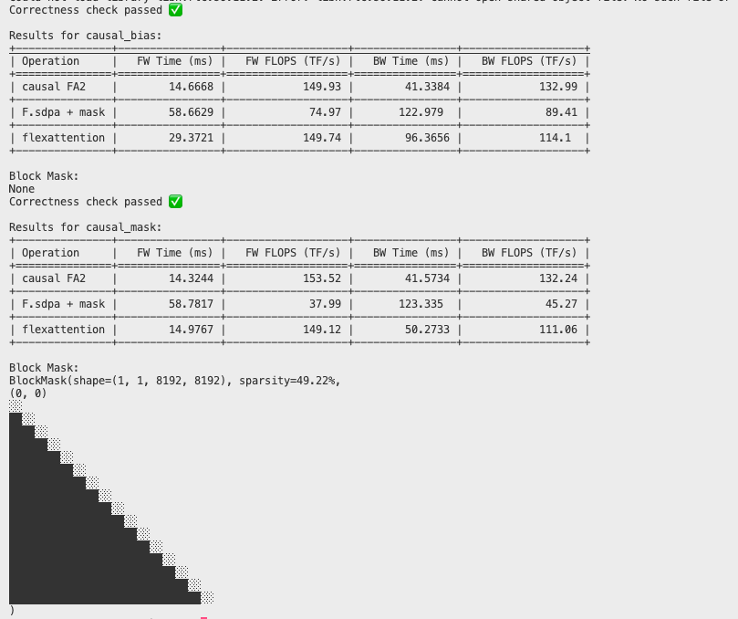
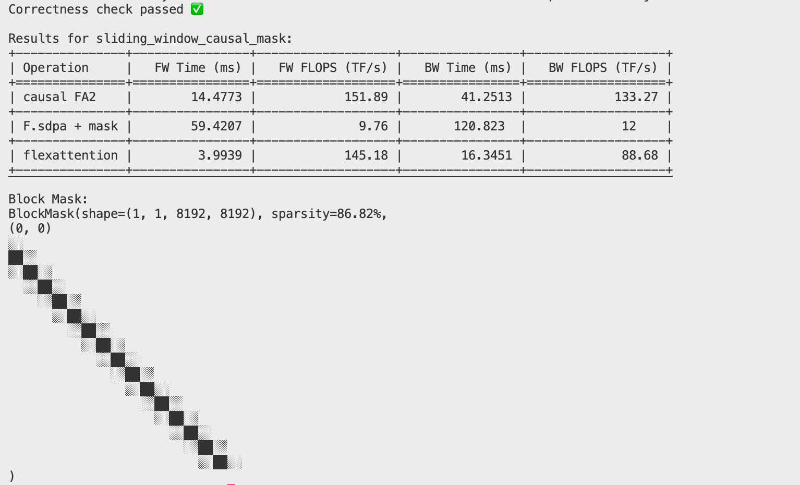
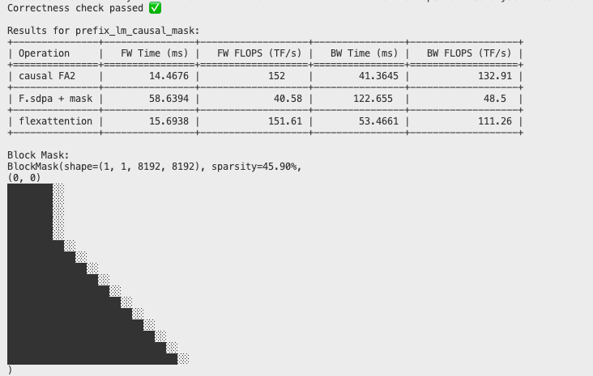
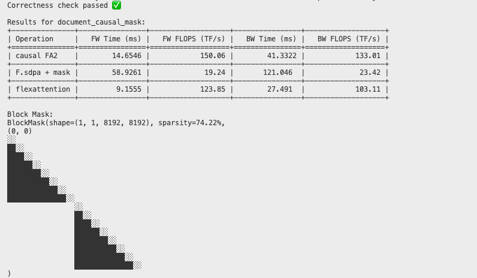
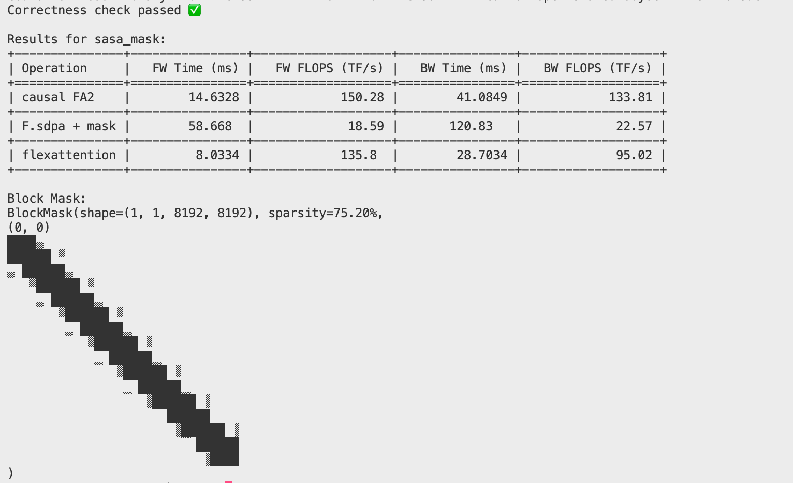
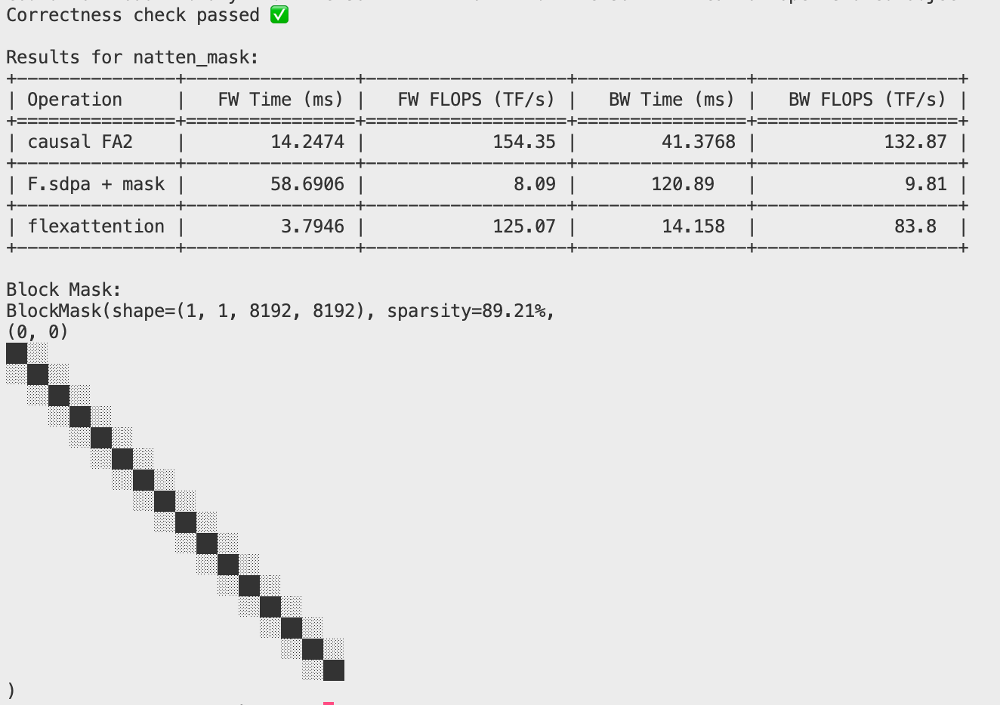
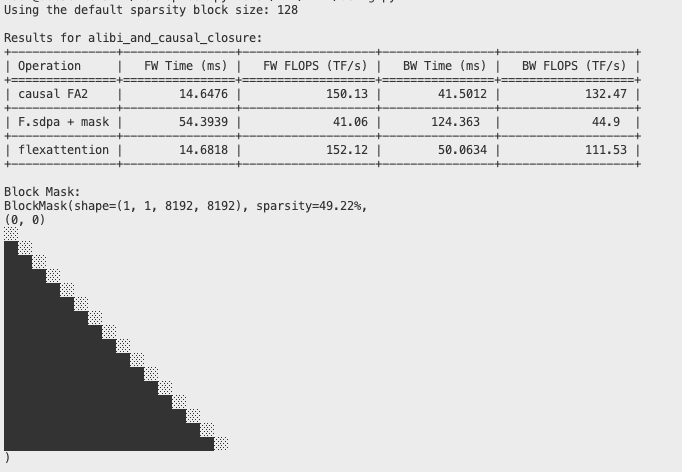
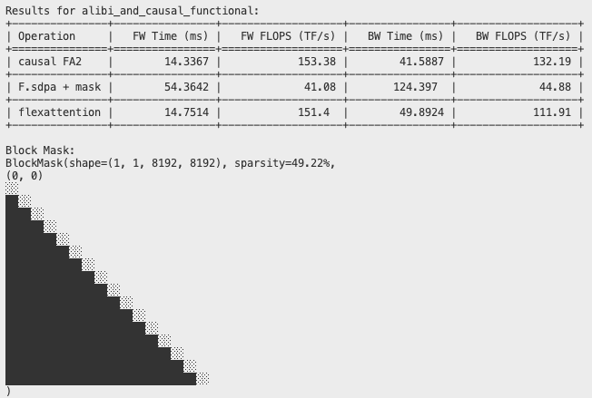
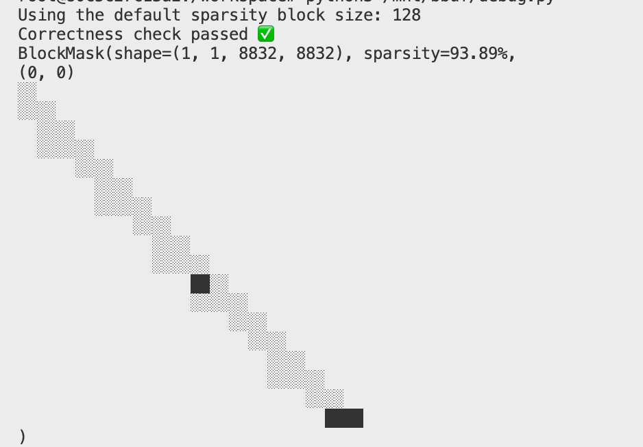
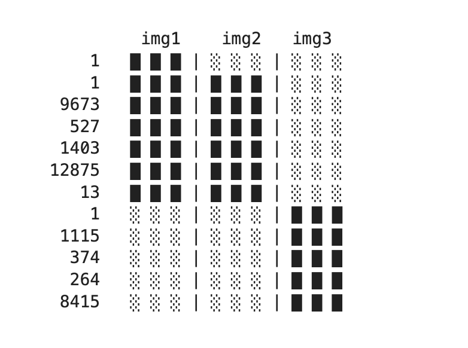

> FlexAttention의 자주 쓰이는 API 사용 방법을 해설한다. 블로그 출처: https://github.com/pytorch-labs/attention-gym/blob/main/examples/flex_attn.ipynb , 이 글을 바탕으로 일부 코드에 설명을 덧붙이고 코드에 있던 몇 가지 bug를 수정했으며, PyTorch nightly 버전으로 예제를 실행해 각 custom attention의 출력을 얻어 아래 각 예제 코드 뒤에 실었다. 마지막으로 torch compile inductor 백엔드에서 FlexAttention을 구현하는 진입점 코드를 훑어보는 내용도 보충했다.

# FlexAttention API 사용 NoteBook

이 노트북은 새로운 FlexAttention API의 사용 방법을 보여준다. 이 API는 scaled dot product attention(SDPA)에서 계산되는 attention score에 대한 수정을 사용자가 직접 지정할 수 있게 해준다.

## 목차

1. [소개](#介绍)
2. [설정](#设置)
3. [기본 사용법](#基本用法)
4. [score 수정 vs score 마스킹](#分数修改vs分数掩码)
5. [score 수정 예제](#分数修改示例)
   - [Full Attention(no-op)](#全注意力)
   - [표준 causal 마스크](#标准因果掩码)
   - [Sliding Window Attention](#滑动窗口注意力)
   - [Prefix LM(양방향 + causal)](#prefix-lm-bidirectional-causal)
   - [문서 마스킹](#文档掩码)
   - [NATTEN 마스킹](#natten-masking)
   - [Alibi bias](#alibi-bias)
   - [Tanh soft-capping](#tanh-soft-capping)
   - [Nested Jagged Tensor](#nested-jagged-tensor)
   - [Flamingo Cross Attention](#flamingo-cross-attention)

## 소개

FlexAttention API는 Fused Scaled Dot Product Attention Kernel 안에서 attention score에 대한 커스텀 수정을 지정할 수 있게 해준다. 이를 통해 다양한 attention 패턴과 bias를 효율적으로 구현할 수 있고, 실행 시간과 메모리를 절약할 여지도 생긴다. 또한 API는 사용자가 정의한 수정에 맞춰 융합된 backward kernel도 생성해 준다.

## 설정
먼저 필요한 라이브러리를 import하고 환경을 설정하자.

```python
import random
from functools import lru_cache, partial

import torch
import torch.nn.functional as F

from tabulate import tabulate
from torch.nn.attention.flex_attention import (
    _DEFAULT_SPARSE_BLOCK_SIZE,
    create_block_mask,
    create_mask,
    flex_attention,
)
from triton.testing import do_bench

torch.set_default_device("cuda")
torch.manual_seed(0)

torch._dynamo.config.cache_size_limit = 1000

# Compile the flex_attention function
flex_attention = torch.compile(flex_attention, dynamic=False)

# For better performance, you can use:
# flex_attention = torch.compile(_flex_attention, dynamic=False, mode="max-autotune-no-cudagraphs")

data_type = torch.float16

# The kernels will utilize block sparisty to increase performance
print(f"Using the default sparsity block size: {_DEFAULT_SPARSE_BLOCK_SIZE}")
```

score_mod 함수와 mask_fn의 블록 희소성 표현을 출력해 주는 유용한 테스트 유틸리티를 몇 가지 정의한다.

또한 다음 몇 가지 구현의 성능을 비교한다:

- FlexAttention
- causal 마스크를 적용한 FlashAttentionV2의 SOTA 구현.
- `nn.F.scaled_dot_product_attention` + 완전히 구체화된 attn_mask. 이 경우 임의의 마스크를 허용하는 융합 구현 `EFFICIENT_ATTENTION`으로 dispatch된다.

```python
@lru_cache
def create_block_mask_cached(score_mod, B, H, M, N, device="cuda"):
    """
    블록 마스크를 생성하고 캐싱한다.
    
    파라미터:
    - score_mod: score 수정 함수
    - B: 배치 크기
    - H: head 수
    - M: query 시퀀스 길이
    - N: key/value 시퀀스 길이
    - device: 디바이스 종류
    
    반환:
    - block_mask: 생성된 블록 마스크
    """
    block_mask = create_block_mask(score_mod, B, H, M, N, device=device)
    return block_mask


def calculate_tflops(flops: float, time_ms: float, multiplier: int) -> float:
    """
    TFLOPS를 계산한다.
    
    파라미터:
    - flops: 부동소수점 연산 횟수
    - time_ms: 시간(밀리초)
    - multiplier: 승수
    
    반환:
    - TFLOPS 값
    """
    return multiplier * flops * (1e3 / time_ms) / 1e12


def test_mask(
    score_mod=None,
    mask_mod=None,
    B=16,
    H=16,
    S=8192,
    D=64,
    skip_correctness=False,
    print_mask=True,
):
    """
    마스크 기능을 테스트한다.
    
    파라미터:
    - score_mod: score 수정 함수
    - mask_mod: 마스크 수정 함수
    - B: 배치 크기
    - H: head 수
    - S: 시퀀스 길이
    - D: 임베딩 차원
    - skip_correctness: 정확성 검사를 건너뛸지 여부
    - print_mask: 마스크를 출력할지 여부
    """
    assert (
        score_mod is not None or mask_mod is not None
    ), "Must provide a score_mod or mask_mod"
    
    # 입력 텐서 생성
    query = torch.randn(
        B, H, S, D, device="cuda", dtype=torch.float16, requires_grad=True
    )
    key = torch.randn(
        B, H, S, D, device="cuda", dtype=torch.float16, requires_grad=True
    )
    value = torch.randn(
        B, H, S, D, device="cuda", dtype=torch.float16, requires_grad=True
    )
    gradOut = torch.randn(B, H, S, D, device="cuda", dtype=torch.float16)

    # 블록 마스크 생성
    if mask_mod is not None:
        block_mask = create_block_mask_cached(mask_mod, 1, 1, S, S, device=query.device)
    else:
        block_mask = None
    
    # 마스크 함수 결정
    sdpa_mask_fn = mask_mod if mask_mod is not None else score_mod
    mask = create_mask(sdpa_mask_fn, 1, 1, S, S, device=query.device)

    # 서로 다른 attention 계산 함수 정의
    causal_fa2 = lambda: F.scaled_dot_product_attention(
        query, key, value, is_causal=True
    )
    xformers_mask = lambda: F.scaled_dot_product_attention(
        query, key, value, attn_mask=mask
    )
    flex_attention_call = lambda: flex_attention(
        query, key, value, score_mod=score_mod, block_mask=block_mask
    )

    results = []
    
    # 밀도 계산
    if block_mask is not None:
        density = (100 - block_mask.sparsity()) / 100
    else:
        density = 1.0
    
    # 부동소수점 연산 횟수 계산
    causal_fav2_flops = 0.5 * B * H * D * S * S
    flops = density * B * H * D * S * S

    # 순전파 시간
    causal_fa2_time = do_bench(causal_fa2)
    xformers_mask_time = do_bench(xformers_mask)
    flex_ms = do_bench(flex_attention_call)

    # 역전파 시간
    causal_fa2_out = causal_fa2()
    xformers_out = xformers_mask()
    flex_out = flex_attention_call()

    causal_fa2_bw_time = do_bench(
        lambda: causal_fa2_out.backward(gradOut, retain_graph=True)
    )
    xformers_mask_bw_time = do_bench(
        lambda: xformers_out.backward(gradOut, retain_graph=True)
    )
    flex_bw_ms = do_bench(lambda: flex_out.backward(gradOut, retain_graph=True))

    # 정확성 검사
    if not skip_correctness:
        xformers_outs = []
        flex_outs = []

        query.grad = None
        key.grad = None
        value.grad = None

        out1 = xformers_mask()
        xformers_outs.append(out1)
        out1.backward(gradOut)
        xformers_outs += [query.grad, key.grad, value.grad]

        query.grad = None
        key.grad = None
        value.grad = None

        out2 = flex_attention_call()
        flex_outs.append(out2)
        out2.backward(gradOut)
        flex_outs += [query.grad, key.grad, value.grad]
        for flex, xformer in zip(flex_outs, xformers_outs):
            torch.testing.assert_close(flex, xformer, atol=1e-1, rtol=1e-2)

        print("Correctness check passed ✅")
    
    # 결과 포매팅
    results = [
        [
            "causal FA2",
            f"{causal_fa2_time:.4f}",
            f"{calculate_tflops(causal_fav2_flops, causal_fa2_time, 4):.2f}",
            f"{causal_fa2_bw_time:.4f}",
            f"{calculate_tflops(causal_fav2_flops, causal_fa2_bw_time, 10):.2f}",
        ],
        [
            "F.sdpa + mask",
            f"{xformers_mask_time:.4f}",
            f"{calculate_tflops(flops, xformers_mask_time, 4):.2f}",
            f"{xformers_mask_bw_time:.4f}",
            f"{calculate_tflops(flops, xformers_mask_bw_time, 10):.2f}",
        ],
        [
            "flexattention",
            f"{flex_ms:.4f}",
            f"{calculate_tflops(flops, flex_ms, 4):.2f}",
            f"{flex_bw_ms:.4f}",
            f"{calculate_tflops(flops, flex_bw_ms, 10):.2f}",
        ],
    ]
    print(
        f"\nResults for {score_mod.__name__ if score_mod is not None else mask_mod.__name__}:"
    )
    print(
        tabulate(
            results,
            headers=[
                "Operation",
                "FW Time (ms)",
                "FW FLOPS (TF/s)",
                "BW Time (ms)",
                "BW FLOPS (TF/s)",
            ],
            tablefmt="grid",
        )
    )
    if print_mask:
        print(f"\nBlock Mask:\n{block_mask}")

    # 메모리 정리
    del query, key, value, gradOut, causal_fa2_out, xformers_out, flex_out
    torch.cuda.empty_cache()
```

> 여기서 multiplier가 왜 4와 10인지는 명확히 파악하지 못했다.

## 기본 사용법

다음은 FlexAttention API를 사용하는 기본 예제이다:

```python

def checkerboard(score, batch, head, token_q, token_kv):
    score = torch.where(torch.abs(token_kv - token_q) % 1 == 0, score * 0.5, score)
    score = torch.where(torch.abs(token_kv - token_q) % 2 == 0, score * 2.0, score)
    return score


# Create input tensors
query = torch.randn(8, 8, 2048, 64, device="cuda", dtype=torch.float32)
key = torch.randn(8, 8, 2048, 64, device="cuda", dtype=torch.float32)
value = torch.randn(8, 8, 2048, 64, device="cuda", dtype=torch.float32)

# Call flex_attention with the checkerboard score modification
output = flex_attention(query, key, value, score_mod=checkerboard)

# Compile and run
compiled_flex_attention = torch.compile(flex_attention)
out_compiled = compiled_flex_attention(query, key, value, score_mod=checkerboard)

# Check if the results are close
torch.testing.assert_close(output, out_compiled, atol=2e-2, rtol=2e-2)
```

## score 수정 vs score 마스킹

잠시 주제에서 벗어나 두 가지 핵심 개념을 설명한다. 이 개념들은 FlexAttention의 성능 이점을 최대로 끌어내는 방법을 이해하는 데 매우 중요하다. flex_attention의 전체 API는 다음과 같다:

```python
flex_attention(
    query: torch.Tensor,
    key: torch.Tensor,
    value: torch.Tensor,
    score_mod: Optional[Callable[[torch.Tensor, torch.Tensor, torch.Tensor, torch.Tensor, torch.Tensor], torch.Tensor]] = None,
    block_mask: Optional[torch.nn.attention.flex_attention.BlockMask] = None,
    scale: Optional[float] = None,
)
```

왜 `score_mod`와 `block_mask`를 둘 다 써야 하는지 궁금할 수 있다.

- attention 가중치 행렬에서 score 값을 수정하고 싶을 때는 `score_mod` 함수를 사용해야 한다.
- attention 가중치 행렬에서 score 값을 마스킹하고 싶을 때는 `mask_mod` 함수를 사용해야 한다. 이때 마스킹 여부는 score 값 자체와는 무관하며 위치 정보에만 의존한다.

주의: 어떤 `block_mask`든 `score_mod`로 표현할 수 있지만, 그렇게 하면 kernel 성능이 최적이 되지 않는다.

### causal attention을 통해 차이를 살펴보자.

score_mod를 사용한 구현:

```python
def causal_bias(score, b, h, q_idx, kv_idx):
    return torch.where(q_idx >= kv_idx, score, -float("inf"))
```
어떤 원소에는 원래 score를 그대로 넘기고 다른 원소에는 -inf를 설정하는 `score_mod` 함수를 작성하고 있다면, 아마도 `mask_mod`를 사용하는 편이 맞다.

`mask_mod`를 사용한 구현:

```python
def casual_mask(b,h,q_idx, kv_idx):
    return q_idx >= kv_idx
```

보다시피 둘은 매우 비슷해 보이며, 모두 스칼라 텐서를 반환한다. 핵심적인 차이는 다음과 같다:

- `mask_mods`는 불리언 텐서를 반환한다. `True`는 해당 score를 계산해야 한다는 뜻이고, `False`는 해당 score를 마스킹하겠다는 뜻이다.
- `mask_mods`는 `score` 인자를 받지 않는다. 계산 과정에서 실제 값에 의존하는 것이 허용되지 않기 때문이다.

### score_mod와 mask_mod를 동시에 사용하면 어떻게 되는가?

score_mod 함수는 마스킹되지 않은 모든 원소에 적용된다.

### mask mod 함수가 있는데 BlockMask는 어떻게 만드는가?

좋은 질문이다, 독자여! flex_attention 외에 우리는 주요 API를 하나 더 제공한다.

```python
create_block_mask(
    mask_mod (Callable): mask_mod function.
    B (int): Batch size.
    H (int): Number of heads.
    Q_LEN (int): Sequence length of query.
    KV_LEN (int): Sequence length of key/value.
    device (str): Device to run the mask creation on.
    KV_BLOCK_SIZE (int): Block size of block mask for each query.
    Q_BLOCK_SIZE (int): Block size of block mask for each key/value.
    _compile (bool): Whether to compile the mask creation.
)
```

따라서 위 예제에서 flex_attention을 호출하는 가장 성능이 좋은 방식은 다음과 같다:

```python
causal_block_mask = create_block_mask(causal_mask, B, H, M, N)
flex_attention(query, key, value, block_mask = causal_block_mask)
```

B, H, Q_LEN, KV_LEN은 각각 batch_size, num_heads, query_sequence_length, key_sequence_length이다.

### 왜 둘 다 있는가?

순전히 성능 때문이다. causal 마스크는 실제로 매우 희소하다. attention score의 하삼각 부분만 의미가 있다. BlockMask를 생성하지 않으면 두 배의 작업을 해야 한다! 아래에서 두 구현의 성능 차이를 비교한다.

## score 수정 예제
FlexAttention API로 구현할 수 있는 다양한 score 수정 예제를 살펴보자.

범례: 이 score_mod + mask_fns들의 희소성 표현을 출력한다.

블록이 빠져 있다는 것은 그 블록이 완전히 마스킹되었다는 뜻이며, 실제로 최종 attention 출력을 계산할 때 계산할 필요가 없다
- ██ 이 블록은 모든 query token과 key token 사이의 완전한 attention을 계산한다
- ░░ 이 블록은 부분적으로 마스킹되어, 일부 query token은 일부 key token에 attend하지만 일부는 -inf로 마스킹된다

### Full Attention

'no-op' score 수정을 적용한다. attention score를 그대로 유지한다.

```python
def noop(score, b, h, q_idx, kv_idx):
    return score

test_mask(noop, print_mask=True)
```

실행 후의 출력은 다음과 같다:

```python
Results for noop:
+---------------+----------------+-------------------+----------------+-------------------+
| Operation     |   FW Time (ms) |   FW FLOPS (TF/s) |   BW Time (ms) |   BW FLOPS (TF/s) |
+===============+================+===================+================+===================+
| causal FA2    |        14.6478 |            150.13 |        41.1986 |            133.44 |
+---------------+----------------+-------------------+----------------+-------------------+
| F.sdpa + mask |        58.8032 |             74.79 |       125.07   |             87.91 |
+---------------+----------------+-------------------+----------------+-------------------+
| flexattention |        27.3449 |            160.84 |        94.4015 |            116.47 |
+---------------+----------------+-------------------+----------------+-------------------+

Block Mask:
None
```

### 표준 causal 마스크

표준 causal 마스크는 autoregressive 언어 모델의 핵심 기법으로, 각 token이 시퀀스에서 자기 자신과 그 앞의 token에만 attend하도록 보장한다. 블록 희소성 표현은 이 마스크의 하삼각 성질을 잘 보여준다.

이 구현들에 대한 더 자세한 내용은 위의 「score 수정 vs score 마스킹」을 참고하라

```python
def causal_bias(score, b, h, q_idx, kv_idx):
    return torch.where(q_idx >= kv_idx, score, -float("inf"))

test_mask(score_mod=causal_bias)

def causal_mask(b, h, q_idx, kv_idx):
    return q_idx >= kv_idx

test_mask(mask_mod=causal_mask)
```



### Sliding Window Attention

Mistral 논문에는 이 bias를 아주 잘 설명해 주는 그림이 하나 있다. 본질적으로는 고정 크기의 '슬라이딩 윈도우'를 정의하고, autoregressive 디코딩에서 `torch.abs(q_tokens - kv_tokens) < SLIDING_WINDOW`를 만족하는 token끼리만 서로 attend하도록 허용하는 것이다. 보통 이것은 causal attention과 결합해서 사용된다. 여기서는 마스크 조합이라는 좋은 패턴을 통해 이를 구현한다. 일반적으로 마스크는 개념적으로 몇 개의 부분으로 나눈 다음 다시 조합할 수 있다.

마스크 함수를 두 개 작성한다. 하나는 `causal 마스크`를 수행하고 다른 하나는 `윈도우 attention`을 수행하며, 이 둘을 조합해 최종 마스크 함수를 만든다. 앞서 살펴본 것처럼 마스크 함수는 불리언 값을 반환하며, `True`는 해당 원소가 attention 계산에 참여해야 함을 의미한다.

```python
SLIDING_WINDOW = 1024


def sliding_window_causal_mask(b, h, q_idx, kv_idx):
    causal_mask = q_idx >= kv_idx
    windowed_mask = (
        q_idx - kv_idx <= SLIDING_WINDOW
    )  # We dont need to check the right side of the sliding window since we are applying the causal mask

    return causal_mask & windowed_mask

test_mask(mask_mod=sliding_window_causal_mask)
```



### Prefix LM(양방향 + causal)

T5 아키텍처 논문(https://paperswithcode.com/method/t5)은 prefix attention을 수행하는 attention 변형을 설명한다. 여기서는 일정 개수의 `prefix` token이 완전히 참여할 수 있고, 그 뒤의 모든 token은 causal attention을 수행한다. 이번에도 마스크 함수 두 개를 조합해 이를 구현하는데, 하나는 causal 마스크용이고 다른 하나는 prefix 길이에 기반한다.

```python
PREFIX_LENGTH = 2048

def prefix_lm_causal_mask(b, h, q_idx, kv_idx):
    prefix_mask = kv_idx <= PREFIX_LENGTH
    causal_mask = q_idx >= kv_idx
    return prefix_mask | causal_mask

test_mask(mask_mod=prefix_lm_causal_mask)
```



### 문서 마스킹

길이가 서로 다른 문서가 여러 개 있다고 상상해 보자. 문서 사이의 attention은 마스킹하고 같은 문서 안의 token 사이 attention만 허용하고자 한다. 각 token이 어느 문서에 속하는지 알려 주는 document_id 텐서를 사용하면 이를 구현할 수 있다. 그다음 document_id[q_idx]와 document_id[kv_idx]가 서로 다른 모든 attention score를 마스킹하면 된다.

주의: 새로운 kernel을 컴파일해야 하는 경우는 `score_mod`가 바뀔 때뿐이다(torch.compile 인프라가 이를 자동으로 감지한다). 이 예제 코드는 BlockMask를 캐싱하는 방식으로 구현되어 있지만, 일반적으로 BlockMask를 바꾸는 데에는 재컴파일이 필요 없다. 즉 문서 마스킹의 경우 문서 길이가 바뀔 때 새로운 BlockMask만 계산하면 되고, 새로운 kernel은 필요하지 않다.

```python
document_id = torch.zeros(32768, dtype=torch.int, device="cuda")
document_id[:4096] = 0
document_id[4096:8192] = 1
for i in range(8192, 32768, 8192):
    document_id[i : i + 8192] = i // 8192 + 1

def document_causal_mask(b, h, q_idx, kv_idx):
    causal_mask = q_idx >= kv_idx
    document_mask = document_id[q_idx] == document_id[kv_idx]
    return causal_mask & document_mask

test_mask(mask_mod=document_causal_mask, S=32768)
```

4090에서 실행하면 oom이 나므로, 여기서는 길이를 조금 줄인다:

```python
document_id = torch.zeros(8192, dtype=torch.int, device="cuda")
document_id[:4096] = 0
document_id[4096:8192] = 1
# for i in range(8192, 32768, 8192):
#     document_id[i : i + 8192] = i // 8192 + 1

def document_causal_mask(b, h, q_idx, kv_idx):
    causal_mask = q_idx >= kv_idx
    document_mask = document_id[q_idx] == document_id[kv_idx]
    return causal_mask & document_mask

test_mask(mask_mod=document_causal_mask, S=8192)
```



### Stand-Alone Self-Attention 마스킹

이 경우에는 크기가 (H x W)인 2차원 이미지가 token 시퀀스로 평탄화되어 있다고 상상해 보자. 우리는 2차원 관점에서 8`픽셀` 이내에 있는 token에만 attend하고자 한다.

이 mask_mod는 먼저 1차원 위치를 2차원 좌표로 변환하는 방식으로 구현할 수 있다. 그다음에는 두 좌표의 거리가 윈도우 안에 들어오는지만 확인하면 된다.

더 자세한 내용은 논문 Stand-Alone Self-Attention in Vision Models(https://arxiv.org/abs/1906.05909)를 참고하라

```python
H = 128
W = 128
WINDOW = 8

def get_x_y(idx):
    return idx // W, idx % W

def sasa_mask(b, h, q_idx, kv_idx):
    q_x, q_y = get_x_y(q_idx)
    kv_x, kv_y = get_x_y(kv_idx)
    horizontal_mask = (q_x - kv_x).abs() <= WINDOW
    vertical_mask = (q_y - kv_y).abs() <= WINDOW
    return horizontal_mask & vertical_mask

test_mask(mask_mod=sasa_mask)
```




### NATTEN 마스킹

크기가 (H x W)인 2차원 이미지가 token 시퀀스로 평탄화되어 있다고 하자. query는 고정된 kernel 영역 (K_H x K_W) 안의 key에 attend하며, 이 영역은 가능한 한 query를 중심에 두되 캔버스 안에 머무르고 항상 query 자신을 포함한다.

이는 SASA와 비슷하지만, kernel을 캔버스 안에 유지해 모든 query가 고정된 개수의 key에 attend하도록 하는 추가 처리가 들어간다. key는 자신의 위치를 query가 아니라 kernel 중심과 비교한다. kernel 중심은 query 위치를 따라가려 하지만, 캔버스 가장자리로부터 일정한 거리(그 절반 길이)를 유지하도록 제한된다.

더 많은 정보는 NATTEN 저장소(https://github.com/SHI-Labs/NATTEN)를 참고하라.
> 주의: 더 완전한 NATTEN 구현이라면 kernel dilation 지원까지 포함할 것이다. NATTEN의 융합되지 않은 kernel에는 register token에 cross-attend할 수 있는 것과 같은 기능도 있다. 이런 기능은 Flex Attention으로도 표현할 수 있지만 여기서는 시도하지 않았다.

```python
H = 128
W = 128
K_H = 7
K_W = 7

def get_x_y(idx):
    return idx // W, idx % W

def natten_mask(
    b,
    h,
    q_idx,
    kv_idx,
):
    q_x, q_y = get_x_y(q_idx)
    kv_x, kv_y = get_x_y(kv_idx)
    # kernel nominally attempts to center itself on the query, but kernel center
    # is clamped to a fixed distance (kernel half-length) from the canvas edge
    kernel_x = q_x.clamp(K_W // 2, (W - 1) - K_W // 2)
    kernel_y = q_y.clamp(K_H // 2, (H - 1) - K_H // 2)
    hori_mask = (kernel_x - kv_x).abs() <= K_W // 2
    vert_mask = (kernel_y - kv_y).abs() <= K_H // 2
    return hori_mask & vert_mask

test_mask(mask_mod=natten_mask)
```



### Alibi bias

Alibi attention bias는 Train Short, Test Long: Attention with Linear Biases Enables Input Length Extrapolation(https://arxiv.org/abs/2108.12409)에서 널리 알려졌으며, 추론 시 길이 외삽이라는 유용한 특성을 가진다고 주장한다. "ALiBi는 위치 임베딩을 단어 임베딩에 더하지 않는다. 대신 query-key attention score에 그 거리에 비례하는 페널티를 주어 bias를 건다."

여기서는 이를 두 가지 방식으로 구현해, score 수정 함수 안에서 다른 텐서를 활용할 수 있다는 새로운 기능을 부각한다. 함수 시그니처는 다른 텐서를 받지 않지만, 사용자는 `closure`를 통해 이를 구현할 수 있다. 여기서는 이미 아주 익숙해진 causal 마스크 함수와 head별 bias를 활용한다.

```python
# Alibi Bias
def generate_alibi_bias():
    alibi_bias = []
    for h in range(H):
        alibi_bias.append(-((h + 1) * 8.0 / H))
    alibi_bias = torch.tensor(alibi_bias, device="cuda")
    alibi_bias = torch.exp2(alibi_bias)
    return alibi_bias


alibi_bias = generate_alibi_bias()


# In this case we are going to use a mask_mod and a score_mod
def causal_mask(b, h, q_idx, kv_idx):
    return q_idx >= kv_idx


def alibi_and_causal_closure(score, b, h, q_idx, kv_idx):
    bias = alibi_bias[h] * (q_idx - kv_idx)
    return score + bias


def alibi_and_causal_functional(score, b, h, q_idx, kv_idx):
    scale = torch.exp2(-((h + 1) * 8.0 / H))
    bias = (q_idx - kv_idx) * scale
    return score + bias


# Correctness check here is simple and only works with mask_fns and not actual score_mods

test_mask(
    alibi_and_causal_closure,
    mask_mod=causal_mask,
    skip_correctness=True,
    print_mask=False,
)
test_mask(
    alibi_and_causal_functional,
    mask_mod=causal_mask,
    skip_correctness=True,
    print_mask=False,
)
```

> 여기서 H는 정의되어 있지 않으므로, H=64로 두고 결과를 확인한다. 또한 mask가 어떻게 생겼는지 보려면 print_mask를 True로 바꿔야 한다.






### Tanh soft-capping
이 API로 tanh soft-capping도 구현할 수 있다. tanh를 통한 logit soft-capping은 Gemma 2에서 널리 알려졌다.

이 경우에는 미묘한 점이 몇 가지 있다. 특히 PyTorch(그리고 CUDA/Triton)의 표준 `tanh` 연산자는 수치적으로는 정확하지만 (상대적으로) 느린 SASS 구현으로 lowering된다. SASS가 어떤 모습인지는 https://godbolt.org/z/W8afevWv1 을 참고하라.

따라서 이 경우에는 `tanh`를 근사 tanh 구현으로 lowering하고 싶다. PyTorch에 커스텀 연산자를 하나 등록한 다음 Inductor lowering을 지정하면 이를 구현할 수 있다.

```python
def causal_mask(b, h, q_idx, kv_idx):
    return q_idx >= kv_idx

# Tanh Soft-Capping
@torch.library.custom_op("approx::tanh", mutates_args=())
def tanh_approx(inp: torch.Tensor) -> torch.Tensor:
    return torch.tanh(inp)


@tanh_approx.register_fake
def _(inp: torch.Tensor) -> torch.Tensor:
    return torch.tanh(inp)


from torch._inductor.lowering import make_pointwise, register_lowering

# Some internal torch.compile details
from torch._inductor.virtualized import ops

def tanh_approx_lowering(inp):
    fn = partial(ops.inline_asm_elementwise, asm="tanh.approx.f32 0,1;")
    return make_pointwise(fn)(inp)

register_lowering(torch.ops.approx.tanh)(tanh_approx_lowering)

class TanhApprox(torch.autograd.Function):
    @staticmethod
    def forward(x):
        return torch.ops.approx.tanh(x)

    @staticmethod
    def setup_context(ctx, inputs, output):
        (x,) = inputs
        result = output
        ctx.save_for_backward(result)

    @staticmethod
    def backward(ctx, grad_output):
        (result,) = ctx.saved_tensors
        return grad_output * (1 - result * result)

tanh_approx = TanhApprox.apply

def tanh_soft_cap(score, b, h, q_idx, kv_idx):
    score = score / 2
    score = tanh_approx(score)
    return score * 2

# The baseline (xformers) does not have a way to generate tanh-softcapping so we skip correctness checks
test_mask(tanh_soft_cap, mask_mod=causal_mask, skip_correctness=True)
```

> 코드 안의 asm 코드에 오류가 있어 이 예제는 실행되지 않는다. 오류 메시지는 다음과 같다:

```shell
ptxas /tmp/tmpmehxr5i1.ptx, line 3972; error   : Arguments mismatch for instruction 'tanh'
ptxas /tmp/tmpmehxr5i1.ptx, line 3977; error   : Arguments mismatch for instruction 'tanh'
ptxas /tmp/tmpmehxr5i1.ptx, line 3982; error   : Arguments mismatch for instruction 'tanh'
ptxas /tmp/tmpmehxr5i1.ptx, line 3987; error   : Arguments mismatch for instruction 'tanh'
ptxas /tmp/tmpmehxr5i1.ptx, line 3992; error   : Arguments mismatch for instruction 'tanh'
ptxas /tmp/tmpmehxr5i1.ptx, line 3997; error   : Arguments mismatch for instruction 'tanh'
ptxas /tmp/tmpmehxr5i1.ptx, line 4002; error   : Arguments mismatch for instruction 'tanh'
ptxas /tmp/tmpmehxr5i1.ptx, line 4007; error   : Arguments mismatch for instruction 'tanh'
ptxas /tmp/tmpmehxr5i1.ptx, line 4012; error   : Arguments mismatch for instruction 'tanh'
ptxas fatal   : Ptx assembly aborted due to errors

```

### Nested Jagged Tensor

Nested tensor는 불규칙한 데이터를 효율적으로 표현하고 계산하기 위한 텐서 서브클래스이다. 이런 데이터를 FlexAttention으로 처리하면 길이가 서로 다른 시퀀스 배치에 대해 causal attention을 효율적으로 수행할 수 있다.

내부적으로 NJT(Nested Jagged Tensor)는 불규칙 데이터를 연속된 데이터 `[[sequence_0], [sequence_1], ..., [Sequence_B]], sum(*),..` 형태로 저장한다.

```python
# 결과를 재현할 수 있도록 랜덤 시드 설정
random.seed(0)
torch.manual_seed(0)

# 배치 크기, head 수, 차원 정의
batch_size = 16
n_heads = 16
D = 64

# 그래디언트를 계산할 수 있도록 QKV 값을 준비
def prepare_qkv_values(tensor):
    return tensor._values.detach().requires_grad_()

# 시퀀스 인덱스 테이블 구성
def build_seq_idx(tensor: torch.Tensor):
    offsets = tensor.offsets()
    total_length = tensor.offsets()[-1].item()
    # 0부터 total_length까지의 range 텐서 생성
    range_tensor = torch.arange(total_length, device="cuda", dtype=torch.int32)

    # searchsorted로 각 위치의 인덱스를 찾는다
    seq_idx = torch.searchsorted(offsets, range_tensor, right=True) - 1

    return seq_idx

# dense 마스크 함수를 NJT 마스크 함수로 변환하는 NJT 래퍼 생성
def create_njt_wrapper(orig_mask_mod, offsets, seq_idx):
    """dense 마스크 함수를 NJT 마스크 함수로 변환하는 범용 래퍼"""

    def njt_score_mod(b, h, q_idx, kv_idx):
        q_nested = q_idx - offsets[seq_idx[q_idx]]
        kv_nested = kv_idx - offsets[seq_idx[kv_idx]]
        is_same_sequence = seq_idx[q_idx] == seq_idx[kv_idx]
        return orig_mask_mod(b, h, q_nested, kv_nested) & is_same_sequence

    return njt_score_mod

# dense score 마스크 함수
def causal_mask(b, h, q_idx, kv_idx):
    return q_idx >= kv_idx
    # return torch.where(q_idx >= kv_idx, score, -float("inf"))

# 현재 제약: 전체 시퀀스 길이는 128로 나누어떨어져야 한다
sentence_lengths = [random.randint(1, 1024) for _ in range(batch_size - 1)]
total = sum(sentence_lengths)
sentence_lengths.append(128 - total % 128)
total = sum(sentence_lengths)

# 불규칙 텐서 생성
ragged_tensors = [torch.randn(l, n_heads, D, device="cuda") for l in sentence_lengths]
query = torch.nested.nested_tensor(
    ragged_tensors, layout=torch.jagged, requires_grad=True
)
key = torch.nested.nested_tensor(
    ragged_tensors, layout=torch.jagged, requires_grad=True
)
value = torch.nested.nested_tensor(
    ragged_tensors, layout=torch.jagged, requires_grad=True
)

# seq_idx 조회 테이블 구성
offsets = query.offsets()
seq_idx = build_seq_idx(query)

# NJT causal score 마스크 함수 생성
causal_score_mod_njt = create_njt_wrapper(causal_mask, offsets, seq_idx)

# QKV 값 준비
query_values = prepare_qkv_values(query)
key_values = prepare_qkv_values(key)
value_values = prepare_qkv_values(value)

# 블록 마스크 생성
block_mask = create_block_mask_cached(
    causal_score_mod_njt, 1, 1, total, total, device=query_values.device
)
# FlexAttention으로 출력 계산
out_flex = flex_attention(
    query_values.view(1, -1, n_heads, D).transpose(1, 2),
    key_values.view(1, -1, n_heads, D).transpose(1, 2),
    value_values.view(1, -1, n_heads, D).transpose(1, 2),
    block_mask=block_mask,
)
# Scaled Dot-Product Attention으로 출력 계산
out_sdpa = F.scaled_dot_product_attention(
    query.transpose(1, 2),
    key.transpose(1, 2),
    value.transpose(1, 2),
    is_causal=True,
)

# 출력 결과 저장
sdpa_outs = []
flex_outs = []

# 그래디언트 출력 생성
gradOut = torch.randn_like(out_sdpa)

# SDPA의 출력과 그래디언트를 계산해 저장
sdpa_outs.append(out_sdpa)
out_sdpa.backward(gradOut)
sdpa_outs += [query.grad, key.grad, value.grad]

# FlexAttention의 출력과 그래디언트를 계산해 저장
flex_outs.append(out_flex)
out_flex.backward(gradOut._values.unsqueeze(0))
flex_outs += [query_values.grad, key_values.grad, value_values.grad]

# 두 방법의 출력과 그래디언트를 비교
for flex, sdpa in zip(flex_outs, sdpa_outs):
    flex = flex.squeeze(0)
    torch.testing.assert_close(flex, sdpa._values, atol=1e-2, rtol=1e-2)

# 정확성 검사 결과 출력
print("Correctness check passed ✅")
print(block_mask)
```



### Flamingo Cross Attention

🦩 Flamingo 논문(https://arxiv.org/pdf/2204.14198)은 "시각 데이터와 텍스트가 교차로 섞인 형태를 입력으로 받아 자유 형식의 텍스트를 출력으로 생성하는 시각 언어 모델(VLM) 계열"을 소개한다.

이 모델은 `VisionCrossAttentionMask`를 활용해 텍스트가 관련 있는 이미지에만 attend하도록 보장한다. TorchTune에 이 마스크 유형에 대한 좋은 설명이 있다: VisionCrossAttentionMask(https://github.com/pytorch/torchtune/blob/bbc48e089b072c7cbaea175bc70501b2193ba482/torchtune/modules/transforms/_transforms.py#L22-L43)

이 attention 메커니즘은 텍스트 시퀀스가 앞선 이미지에는 완전히 attend하고, 그 밖의 미래 이미지나 관련 없는 이미지에는 attend하지 않도록 보장한다.

```python
Example:
    >>> text = "<img1><img2>These are two dogs. <img3>This is a cat."
    >>> image_token_id = 1
    >>> tokens = [1, 1, 9673, 527, 1403, 12875, 13, 1, 1115, 374, 264, 8415]
    >>> transform = VisionCrossAttentionMask(tile_size=400, patch_size=40, image_token_id=1)
    >>> intervals = transform._get_image_attention_intervals(tokens)
    >>> print(intervals)
    [[0, 7], [1, 7], [7, 12]]
```

위 예제에서는 12 x sum(image_tokens_1 + image_tokens_2 + image_tokens_3) 크기의 마스크를 생성한다

image_tokens의 크기가 3이라고 가정한다



```python
# Given information
num_tokens = 12
num_images = 3
image_token_length = 3
num_image_tokens = num_images * image_token_length
intervals = [[0, 7], [1, 7], [7, 12]]
# This is only needed if your images have different number of tokens per image
# If they are all the same number of tokens you can use image_idx = kv_idx // image_token_length
image_boundaries = [image_token_length * i for i in range(num_images)]
image_boundaries = (
    [0] * image_token_length + [1] * image_token_length + [2] * image_token_length
)

image_boundaries = torch.tensor(image_boundaries, dtype=torch.long, device="cuda")
intervals = torch.tensor(intervals, dtype=torch.long, device="cuda")


def vision_x_attention_mask(b, h, q_idx, kv_idx):
    image_idx = image_boundaries[kv_idx]
    interval = intervals[image_idx]
    return (q_idx >= interval[0]) & (q_idx < interval[1])


mask = create_mask(vision_x_attention_mask, 1, 1, num_tokens, num_image_tokens, "cuda")

print(mask)
```


# FlexAttention은 어떻게 구현되어 있는가

FlexAttention은 PyTorch 컴파일러를 통해 구현되며, inductor 백엔드가 FlexAttention의 여러 변형에 대응하는 Triton 코드를 생성한다. 구체적인 구현은 https://github.com/pytorch/pytorch/blob/ee09d066d35d7e17cf7e9479c0b8bfc70cffc264/torch/_inductor/kernel/flex_attention.py#L317 을 참고하라. 아래에서 flex_attention의 핵심 진입점을 간단히 훑어본다:

```python
# TODO: We probably also need a layout constraint?
@register_lowering(torch.ops.higher_order.flex_attention, type_promotion_kind=None)
def flex_attention(
    query,
    key,
    value,
    subgraph,
    block_mask,
    scale,
    score_mod_other_buffers,
    mask_mod_other_buffers,
):
    # 이 코드는 API 활용 부분에서 정의한 score_mod와 mask_mod를 거친 뒤 실제로 계산해야 할 Q, K, V를 가져온다
    (
        kv_num_blocks,
        kv_indices,
        full_kv_num_blocks,
        full_kv_indices,
        q_num_blocks,
        q_indices,
        full_q_num_blocks,
        full_q_indices,
        SPARSE_KV_BLOCK_SIZE,
        SPARSE_Q_BLOCK_SIZE,
        mask_graph,
    ) = block_mask
    // score, b, h, m, n 다섯 개의 플레이스홀더를 담은 플레이스홀더 입력 리스트를 생성한다. 타입은 각각 query의 타입과 int32이다
    placeholder_inps = [
        create_placeholder(name, dtype, query.get_device())
        for name, dtype in [
            ("score", query.get_dtype()),
            ("b", torch.int32),
            ("h", torch.int32),
            ("m", torch.int32),
            ("n", torch.int32),
        ]
    ]
    // 플레이스홀더 입력과 그 밖의 score 수정 버퍼를 담아 서브그래프 버퍼를 구성한다
    subgraph_buffer = build_subgraph_buffer(
        placeholder_inps + list(score_mod_other_buffers), subgraph
    )
    // 마스크 그래프의 플레이스홀더 입력 리스트를 생성한다. b, h, m, n 네 개의 플레이스홀더이며 타입은 모두 int32이다
    mask_graph_placeholder_inps = [
        create_placeholder(name, dtype, query.get_device())
        for name, dtype in [
            ("b", torch.int32),
            ("h", torch.int32),
            ("m", torch.int32),
            ("n", torch.int32),
        ]
    ]
    // 마스크 그래프의 플레이스홀더 입력과 그 밖의 마스크 수정 버퍼를 담아 마스크 그래프 버퍼를 구성한다
    mask_graph_buffer = build_subgraph_buffer(
        mask_graph_placeholder_inps + list(mask_mod_other_buffers), mask_graph
    )
    // Flex 디코딩을 사용하는 경우, 생성한 Flex 디코딩 kernel을 반환한다
    if _use_flex_decoding(query):
        return create_flex_decoding_kernel(
            query,
            key,
            value,
            block_mask,
            scale,
            subgraph_buffer,
            mask_graph_buffer,
            score_mod_other_buffers,
            mask_mod_other_buffers,
        )
    // 모든 버퍼에 realize 연산을 수행해 실제로 인스턴스화되도록 한다
    for buf in [
        query,
        key,
        value,
        kv_num_blocks,
        kv_indices,
        q_num_blocks,
        q_indices,
        full_kv_num_blocks,
        full_kv_indices,
        full_q_num_blocks,
        full_q_indices,
    ]:
        if buf is not None:
            buf.realize()

    // 디바이스, 데이터 타입, 크기, stride 정보를 담은 레이아웃 객체를 생성한다
    layout = FixedLayout(
        query.get_device(),
        query.get_dtype(),
        query.get_size(),
        query.get_stride(),
    )
    // logsumexp의 shape을 계산한다. 즉 query의 shape에서 마지막 차원을 제거한 것이다
    logsumexp_shape = query.get_size()[:-1]  # [B, H, M]
    // logsumexp 텐서를 생성한다. 타입은 float32이고 디바이스는 query와 동일하다
    logsumexp = empty_strided(
        logsumexp_shape,
        None,
        dtype=torch.float32,  # The logsumexp is always stored in fp32 regardless of the input dtype
        device=query.get_device(),
    )
    // full 블록이 존재하는지 판단한다. full_kv_num_blocks가 None이면 full 블록은 존재하지 않는다
    has_full_blocks = full_kv_num_blocks is not None
    if full_kv_num_blocks is None:
        full_kv_num_blocks, full_kv_indices = (
            empty(0, device=query.get_device()) for _ in range(2)
        )
    // choice 리스트와 config 리스트를 초기화한다
    choices: List[Any] = []
    configs: List[Tuple[int, int, int, int]] = []
    // 기본 config를 추가한다
    configs.append(_get_default_config_fwd(query))
    // max autotune이 켜져 있으면 다른 config들도 추가한다
    if config.max_autotune:
        configs += [
            (128, 64, 4, 3),
            (128, 128, 4, 3),
            (128, 128, 8, 2),
            (64, 128, 4, 3),
            (64, 64, 4, 3),
        ]

    // 모든 config를 순회하면서 블록 크기가 맞지 않거나 config가 2 stage이면 건너뛴다
    for BLOCK_M, BLOCK_N, num_warps, num_stages in configs:
        if SPARSE_KV_BLOCK_SIZE % BLOCK_N != 0 or SPARSE_Q_BLOCK_SIZE % BLOCK_M != 0:
            continue
        if num_stages == 2:
            continue

        // 현재 config를 choice 리스트에 추가한다
        flex_attention_template.maybe_append_choice(
            choices=choices,
            input_nodes=[
                query,
                key,
                value,
                logsumexp,
                kv_num_blocks,
                kv_indices,
                full_kv_num_blocks,
                full_kv_indices,
            ],
            layout=layout,
            subgraphs=[
                subgraph_buffer,
                mask_graph_buffer,
            ],
            mutated_inputs=[
                logsumexp,
            ],
            num_stages=num_stages,
            num_warps=num_warps,
            call_sizes=query.get_size(),
            OUTPUT_LOGSUMEXP=True,
            SM_SCALE=scale,
            BLOCK_DMODEL=query.get_size()[-1],
            BLOCK_M=BLOCK_M,
            BLOCK_N=BLOCK_N,
            SPARSE_Q_BLOCK_SIZE=SPARSE_Q_BLOCK_SIZE,
            SPARSE_KV_BLOCK_SIZE=SPARSE_KV_BLOCK_SIZE,
            ROWS_GUARANTEED_SAFE=False,
            PRESCALE_QK=False,
            HAS_FULL_BLOCKS=has_full_blocks,
        )
    // 자동 튜닝에 사용할 입력 리스트를 생성한다
    inputs_for_autotuning = (
        [
            query,
            key,
            value,
            logsumexp,
            kv_num_blocks,
            kv_indices,
            full_kv_num_blocks,
            full_kv_indices,
        ]
        + list(score_mod_other_buffers)
        + list(mask_mod_other_buffers)
    )
    // 입력 생성 함수 매핑을 생성한다
    input_gen_fns = {
        4: create_num_blocks_fake_generator(full_kv_indices),
        5: create_indices_fake,
    }
    // 자동 튜닝 선택 알고리즘의 결과와 logsumexp를 반환한다
    return (
        autotune_select_algorithm(
            "flex_attention",
            choices,
            inputs_for_autotuning,
            layout,
            input_gen_fns=input_gen_fns,
        ),
        logsumexp,
    )

```


이 `flex_attention` 함수의 `block_mask` 인자는 위 API 활용 부분에서 언급한 `create_block_mask` 함수로 생성한다. 그리고 이 함수는 query, key, value, subgraph(서브그래프), block_mask(블록 마스크), scale(스케일 팩터), 그리고 score 수정 버퍼와 마스크 수정 버퍼를 입력으로 받는다. 함수 내부에서는 플레이스홀더 입력을 만들고 서브그래프 버퍼와 마스크 그래프 버퍼를 구성한 뒤, config에 따라 적절한 kernel을 선택해 FlexAttention 계산을 구현한다. 최종적으로 자동 튜닝 선택 알고리즘의 결과와 logsumexp 텐서를 반환한다. 관심 있는 분은 여기 나오는 triton kernel의 구체적인 구현도 살펴보면 좋다.


