> 제 강의 노트입니다. 많은 관심 부탁드립니다: https://github.com/BBuf/how-to-optim-algorithm-in-cuda/tree/master/cuda-mode

## 1강: PyTorch에서 CUDA kernels를 profile하는 방법

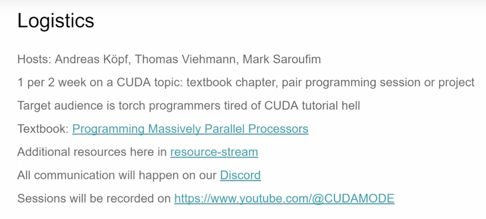

여기는 강의 계획입니다. 강사는 Andreas, Thomas, Mark 세 명이고, 대략 2주마다 CUDA 주제 설명과 엔지니어링 또는 페어 프로그래밍 영상을 하나씩 내는 구성입니다. 강의에서 다루는 주제는 《Programming Massively Parallel Processors》라는 책을 기반으로 합니다. Mark도 8분쯤에 이 책을 강하게 추천했습니다. 또 6분쯤 Mark는 CUDA 학습의 어려움은 초보자 입장에서 문서를 끝없이 찾아보는 순환에 빠질 수 있다는 점이며, 이것이 매우 고통스럽다고 지적했습니다.

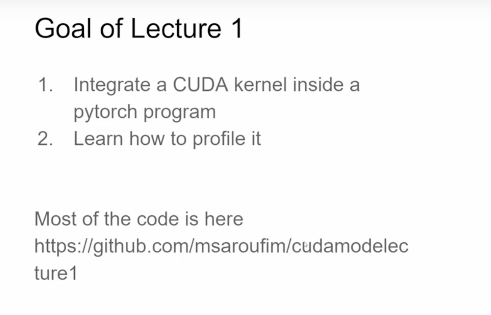

여기서는 Lecture 1의 목표가 CUDA kernel을 PyTorch 안에 임베딩하는 방법과 그것을 Profile하는 방법이라고 설명합니다. 관련 코드는 모두 https://github.com/cuda-mode/lectures/tree/main/lecture_001 에 있습니다. Mark는 또한 이 강의가 예전의 순수 튜토리얼과 비교해 CUDA 전문 용어의 세부 사항에 독자를 빠뜨리는 것보다, CUDA로 무엇을 할 수 있는지에 더 집중한다고 언급했습니다. 그런 세부 사항에 빠지면 매우 고통스럽기 때문입니다.

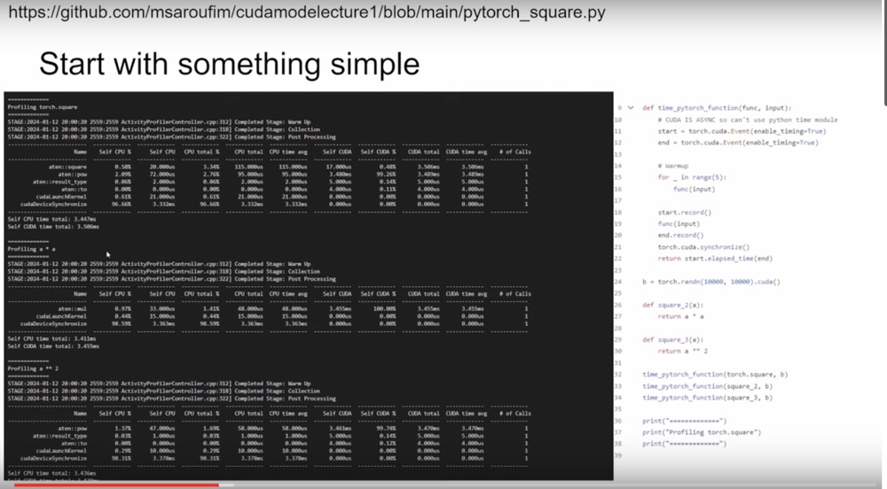

이 Slides 페이지의 코드는 https://github.com/cuda-mode/lectures/blob/main/lecture_001/pytorch_square.py 에 있습니다.

```python
import torch

a = torch.tensor([1., 2., 3.])

print(torch.square(a))
print(a ** 2)
print(a * a)

def time_pytorch_function(func, input):
    # CUDA IS ASYNC so can't use python time module
    # CUDA는 비동기이므로 python의 time 모듈을 사용할 수 없고, CUDA Event를 사용해야 한다.
    start = torch.cuda.Event(enable_timing=True)
    end = torch.cuda.Event(enable_timing=True)

    # Warmup (CUDA Context 초기화가 시간 기록 정확도에 영향을 주지 않게 하기 위함)
    for _ in range(5):
        func(input)

    start.record()
    func(input)
    end.record()
    # 프로그램이 완료된 뒤 CUDA 동기화를 한 번 수행해야 한다.
    torch.cuda.synchronize()
    return start.elapsed_time(end)

b = torch.randn(10000, 10000).cuda()

def square_2(a):
    return a * a

def square_3(a):
    return a ** 2

time_pytorch_function(torch.square, b)
time_pytorch_function(square_2, b)
time_pytorch_function(square_3, b)

print("=============")
print("Profiling torch.square")
print("=============")

# Now profile each function using pytorch profiler
with torch.autograd.profiler.profile(use_cuda=True) as prof:
    torch.square(b)

print(prof.key_averages().table(sort_by="cuda_time_total", row_limit=10))

print("=============")
print("Profiling a * a")
print("=============")

with torch.autograd.profiler.profile(use_cuda=True) as prof:
    square_2(b)

print(prof.key_averages().table(sort_by="cuda_time_total", row_limit=10))

print("=============")
print("Profiling a ** 2")
print("=============")

with torch.autograd.profiler.profile(use_cuda=True) as prof:
    square_3(b)

print(prof.key_averages().table(sort_by="cuda_time_total", row_limit=10))
```

여기서는 PyTorch 안에서 제곱과 세제곱 함수를 구현하고 autograd profiler 도구로 profile합니다. `time_pytorch_function` 함수의 시간 측정 기능은 `torch.autograd.profiler.profile`과 비슷합니다. 세 번째 Slides에서는 PyTorch Profiler 결과를 통해 현재 `torch.autograd.profiler.profile` context manager로 감싼 PyTorch 프로그램의 cuda kernel이 cpu, cuda에서 실행된 시간과 비율, kernel 호출 횟수, 현재 kernel 실행 시간이 전체 시간에서 차지하는 비율을 볼 수 있습니다.

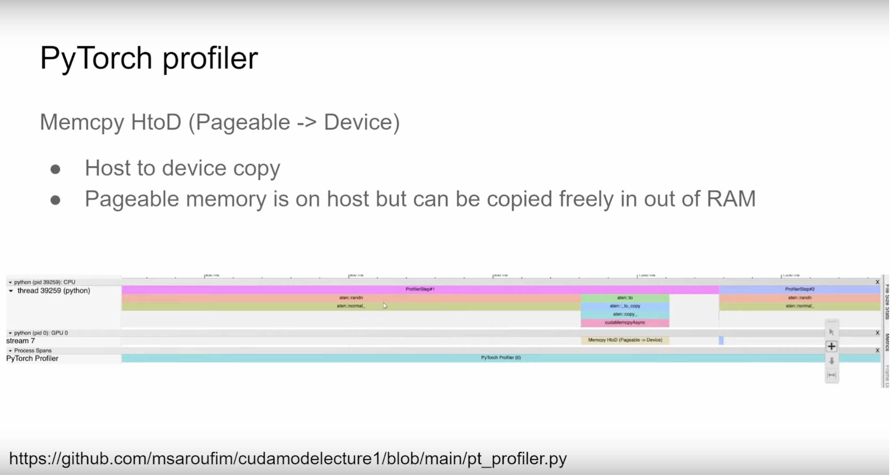

이 Slides 페이지는 https://github.com/cuda-mode/lectures/blob/main/lecture_001/pt_profiler.py 파일을 설명합니다. 이전에 저도 PyTorch Profiler TensorBoard 플러그인 튜토리얼을 번역한 적이 있는데, 주소는 https://zhuanlan.zhihu.com/p/692749819 입니다.

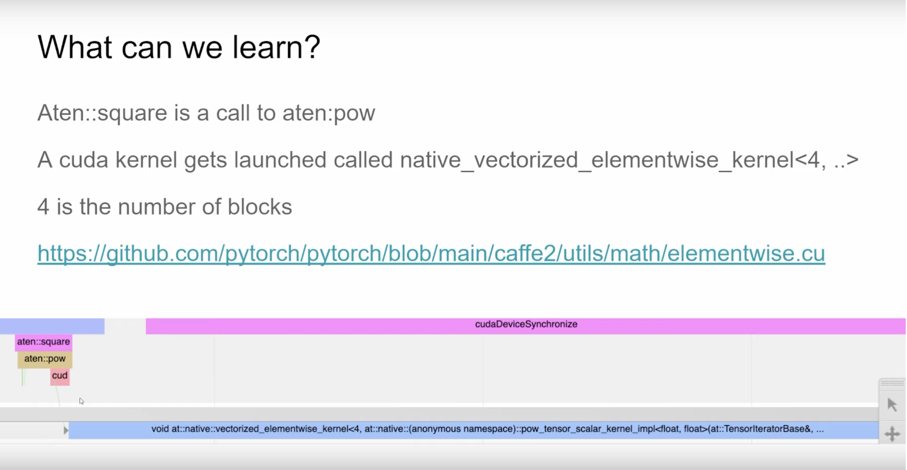

`aten::square`가 실제로는 `aten::pow`를 호출하고, `aten::pow` 아래의 `cud`는 cuda kernel dispatch, 즉 CUDA kernel 실행을 의미한다는 것을 볼 수 있습니다. 또한 이 CUDA kernel의 이름이 `naive_vectorized_elementwise_kernel<4, ..>`인 것도 확인할 수 있는데, 여기서 4는 Block 수를 뜻합니다. 하지만 여기서 문제는 kernel 이름만 볼 수 있고, 그것이 얼마나 빠르게 실행되는지는 알 수 없다는 점입니다. 이어서 업로더는 PyTorch의 `.cu` 구현을 이해하고 공부해 보기를 추천했는데, 이런 구현은 좋은 도구가 됩니다.

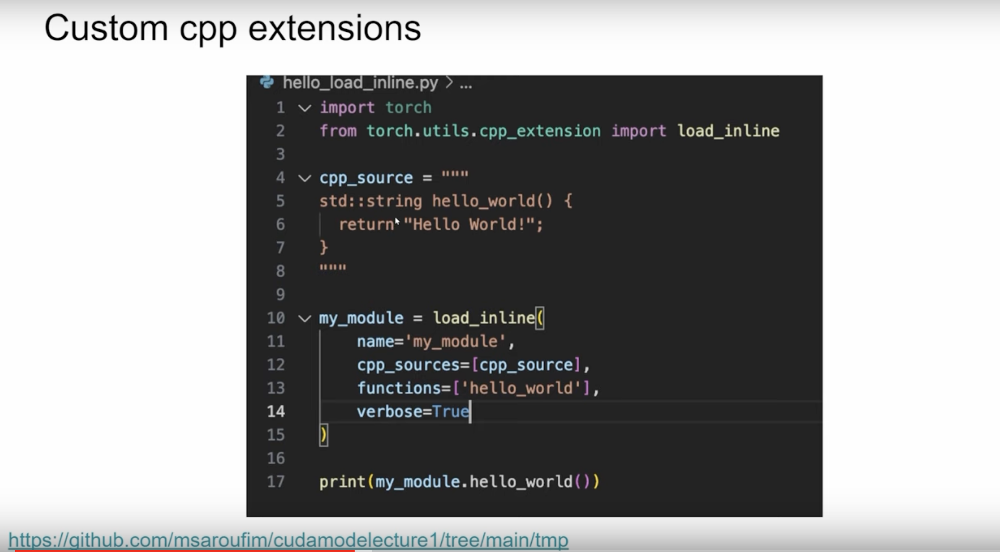

PyTorch의 `load_inline`은 c/c++ 소스 코드를 함수 형태로 모듈에 로드할 수 있습니다. 이어서 작성자는 `load_inline`으로 cuda 소스 코드를 로드하는 방법을 보여줍니다: https://github.com/cuda-mode/lectures/blob/main/lecture_001/load_inline.py .

```python
# Look at this test for inspiration
# https://github.com/pytorch/pytorch/blob/main/test/test_cpp_extensions_jit.py

import torch
from torch.utils.cpp_extension import load_inline

# Define the CUDA kernel and C++ wrapper
cuda_source = '''
__global__ void square_matrix_kernel(const float* matrix, float* result, int width, int height) {
    int row = blockIdx.y * blockDim.y + threadIdx.y;
    int col = blockIdx.x * blockDim.x + threadIdx.x;

    if (row < height && col < width) {
        int idx = row * width + col;
        result[idx] = matrix[idx] * matrix[idx];
    }
}

torch::Tensor square_matrix(torch::Tensor matrix) {
    const auto height = matrix.size(0);
    const auto width = matrix.size(1);

    auto result = torch::empty_like(matrix);

    dim3 threads_per_block(16, 16);
    dim3 number_of_blocks((width + threads_per_block.x - 1) / threads_per_block.x,
                          (height + threads_per_block.y - 1) / threads_per_block.y);

    square_matrix_kernel<<<number_of_blocks, threads_per_block>>>(
        matrix.data_ptr<float>(), result.data_ptr<float>(), width, height);

    return result;
    }
'''

cpp_source = "torch::Tensor square_matrix(torch::Tensor matrix);"

# Load the CUDA kernel as a PyTorch extension
square_matrix_extension = load_inline(
    name='square_matrix_extension',
    cpp_sources=cpp_source,
    cuda_sources=cuda_source,
    functions=['square_matrix'],
    with_cuda=True,
    extra_cuda_cflags=["-O2"],
    build_directory='./load_inline_cuda',
    # extra_cuda_cflags=['--expt-relaxed-constexpr']
)

a = torch.tensor([[1., 2., 3.], [4., 5., 6.]], device='cuda')
print(square_matrix_extension.square_matrix(a))

# (cudamode) ubuntu@ip-172-31-9-217:~/cudamode/cudamodelecture1$ python load_inline.py
# tensor([[ 1.,  4.,  9.],
#         [16., 25., 36.]], device='cuda:0')

```

여기서 `build_directory='./load_inline_cuda',`는 빌드 과정에서 생성된 코드와 컴파일 중간 산물이 모두 https://github.com/cuda-mode/lectures/tree/main/lecture_001/load_inline_cuda 폴더에 저장된다는 뜻입니다.

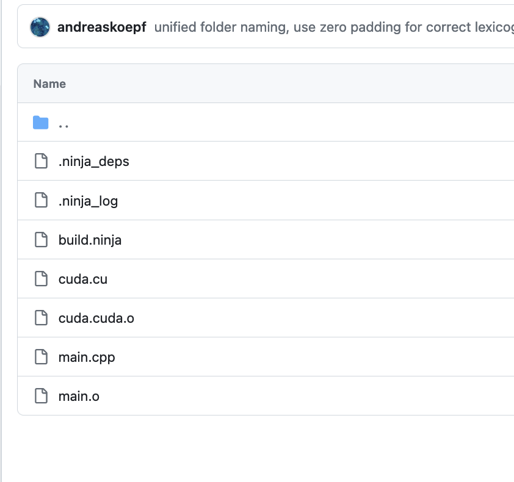

이런 컴파일 과정을 피하고 싶다면 Python 프로그램인 Triton 사용을 고려할 수 있습니다.

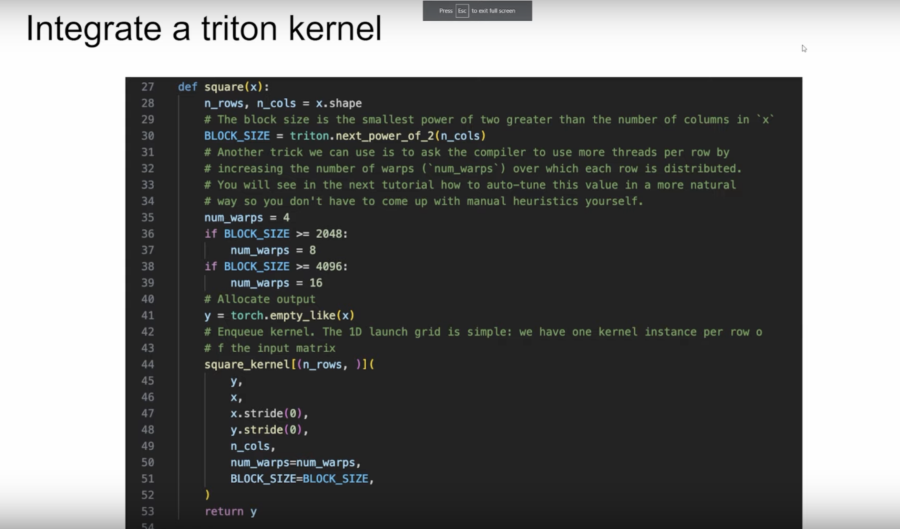

이것은 Triton으로 작성한 square kernel입니다. 아래에는 `torch.compile`, naive torch, Triton 구현 kernel의 A10 성능 비교가 나와 있습니다.

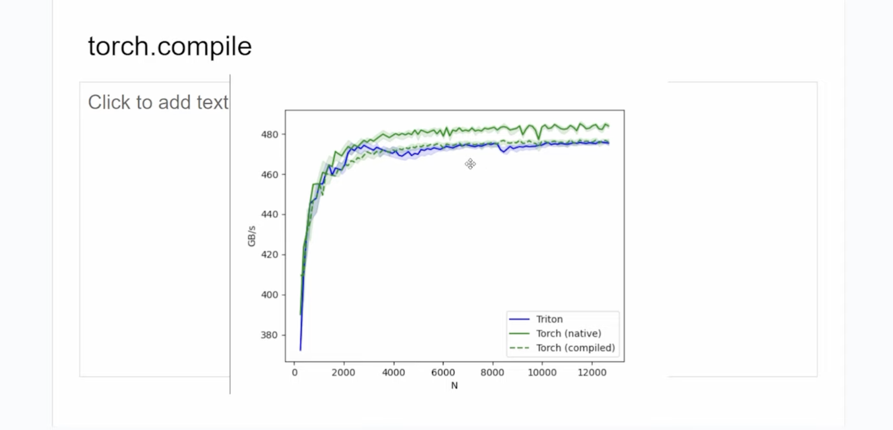

naive torch의 kernel이 Triton과 `torch.compile`이 생성한 kernel보다 조금 더 빠르다는 것을 볼 수 있습니다. 이어서 4090에서도 실험을 했고 비슷한 결과를 얻었습니다. 작성자가 쓴 kernel은 https://github.com/cuda-mode/lectures/blob/main/lecture_001/triton_square.py 에 있습니다.

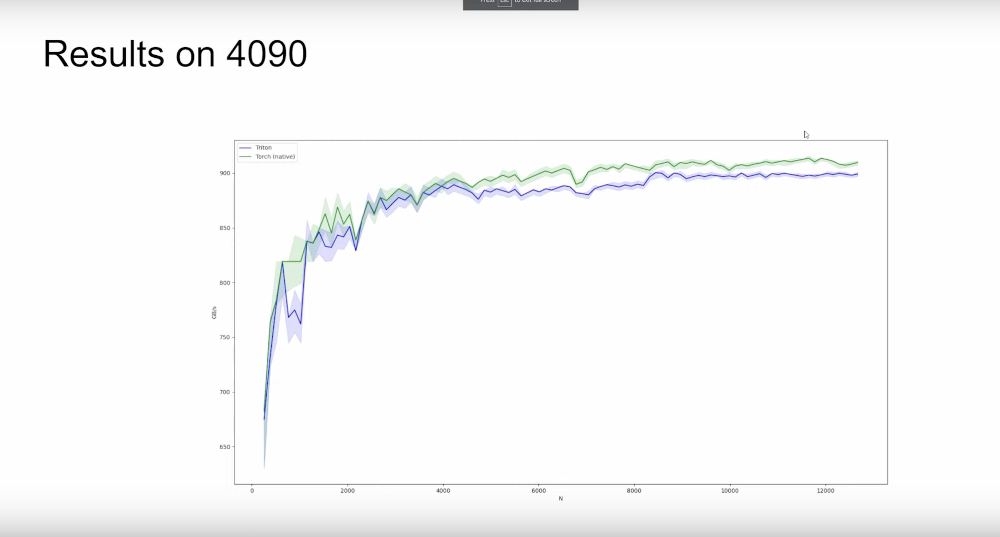

Triton kernel은 다음과 같습니다.

```python
# Adapted straight from https://triton-lang.org/main/getting-started/tutorials/02-fused-softmax.html
import triton
import triton.language as tl
import torch

# if @triton.jit(interpret=True) does not work, please use the following two lines to enable interpret mode
# import os
# os.environ["TRITON_INTERPRET"] = "1"

@triton.jit
def square_kernel(output_ptr, input_ptr, input_row_stride, output_row_stride, n_cols, BLOCK_SIZE: tl.constexpr):
    # The rows of the softmax are independent, so we parallelize across those
    row_idx = tl.program_id(0)
    # The stride represents how much we need to increase the pointer to advance 1 row
    row_start_ptr = input_ptr + row_idx * input_row_stride
    # The block size is the next power of two greater than n_cols, so we can fit each
    # row in a single block
    col_offsets = tl.arange(0, BLOCK_SIZE)
    input_ptrs = row_start_ptr + col_offsets
    # Load the row into SRAM, using a mask since BLOCK_SIZE may be > than n_cols
    row = tl.load(input_ptrs, mask=col_offsets < n_cols, other=-float('inf'))

    square_output = row * row
    
    # Write back output to DRAM
    output_row_start_ptr = output_ptr + row_idx * output_row_stride
    output_ptrs = output_row_start_ptr + col_offsets
    tl.store(output_ptrs, square_output, mask=col_offsets < n_cols)


def square(x):
    n_rows, n_cols = x.shape
    # The block size is the smallest power of two greater than the number of columns in `x`
    BLOCK_SIZE = triton.next_power_of_2(n_cols)
    # Another trick we can use is to ask the compiler to use more threads per row by
    # increasing the number of warps (`num_warps`) over which each row is distributed.
    # You will see in the next tutorial how to auto-tune this value in a more natural
    # way so you don't have to come up with manual heuristics yourself.
    num_warps = 4
    if BLOCK_SIZE >= 2048:
        num_warps = 8
    if BLOCK_SIZE >= 4096:
        num_warps = 16
    # Allocate output
    y = torch.empty_like(x)
    # Enqueue kernel. The 1D launch grid is simple: we have one kernel instance per row o
    # f the input matrix
    square_kernel[(n_rows, )](
        y,
        x,
        x.stride(0),
        y.stride(0),
        n_cols,
        num_warps=num_warps,
        BLOCK_SIZE=BLOCK_SIZE,
    )
    return y
```

이 kernel은 Triton의 fused softmax 튜토리얼을 고친 것입니다. 그 튜토리얼에서는 Triton 속도가 PyTorch와 `torch.compile`보다 모두 빨랐기 때문에, 여기 성능 양상은 조금 이상해 보입니다. 둘 다 element-wise 연산이기 때문입니다. 이어서 작성자는 위의 `BLOCK_SIZE`를 1024로 고정했고, 성능이 크게 향상되는 것을 관찰했습니다.

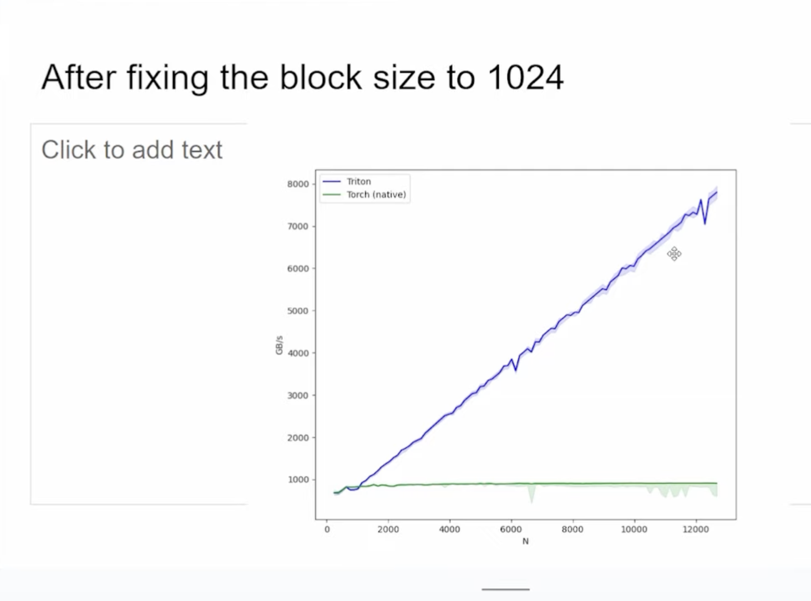

> 여기서 `BLOCK_SIZE`를 고정하면 위 Kernel도 그에 맞춰 수정해야 합니다. 예를 들어 `BLOCK_SIZE` 간격으로 열 방향 데이터를 반복해서 로드해야 합니다.

다음 Slides 페이지에서는 Triton이 현재 debugger를 제공한다고 언급합니다.

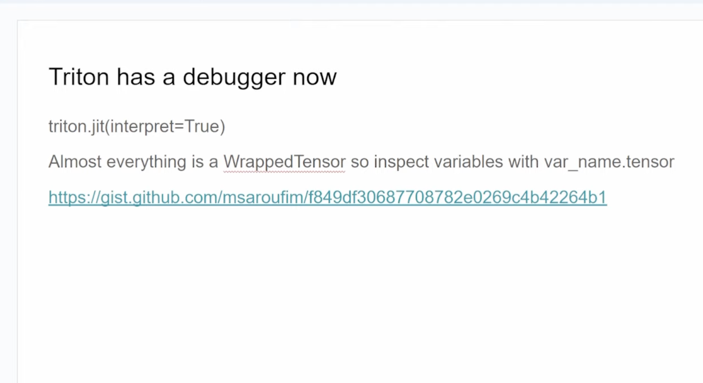

debugger 모드를 켜면 Triton kernel 안의 임의의 줄에 breakpoint를 걸고 코드를 한 줄씩 검사할 수 있습니다. 거의 모든 변수는 Tensor이므로 `var_name.tensor`로 출력할 수 있습니다.

> 이 기능은 정말 훌륭합니다.

이어서 업로더는 Triton의 PTX를 관찰하면 유용한 정보를 얻을 수 있다고 언급했습니다. 예를 들어 위 행렬 제곱 연산의 Triton kernel이 생성한 PTX 파일은 https://github.com/cuda-mode/lectures/blob/main/lecture_001/square_kernel.ptx 입니다.

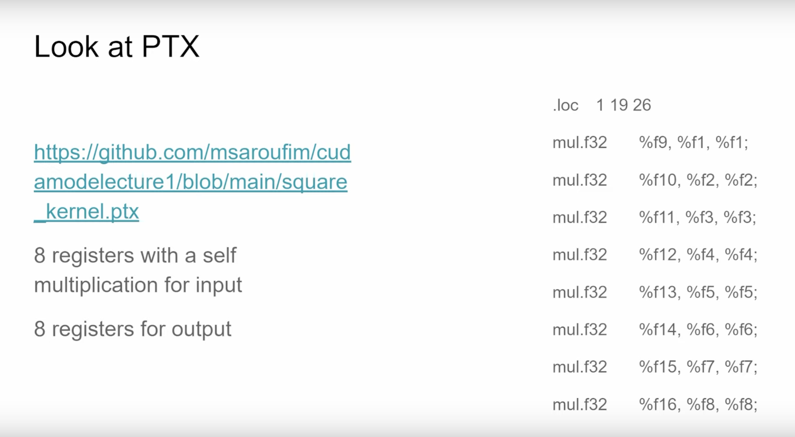

매번 계산할 때 Triton이 입력을 제곱하기 위해 8개 레지스터를 사용하고, 출력을 저장하기 위해 또 8개 레지스터를 사용한다는 것을 볼 수 있습니다. 또한 PTX kernel을 확인하면 global memory와 shared memory를 직접 조작하는 부분을 볼 수 있습니다.

> PTX를 ChatGPT에 붙여 넣고 주석을 달아 달라고 할 수 있습니다.

아래 Slides는 PyTorch 컴파일러가 생성한 Triton Kernel을 확인하는 방법을 언급합니다.

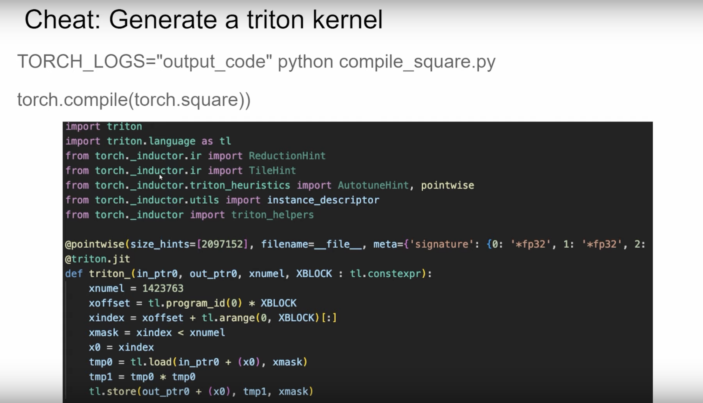

이렇게 하면 Triton kernel을 직접 작성할 필요 없이 PyTorch 프로그램만 작성해도 됩니다. 또는 이 Triton Kernel을 출발점으로 삼아 수정하고, 최적화하고, 학습할 수도 있습니다.

다음 Slides입니다.

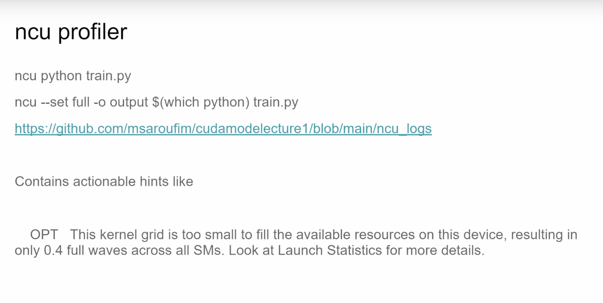

업로더는 nsight compute profile 도구를 소개했습니다. 예제는 https://github.com/cuda-mode/lectures/blob/main/lecture_001/ncu_logs 입니다. ncu의 profile 결과에서 성능, 대역폭 관련 지표나 대략적인 튜닝 제안을 얻을 수 있습니다.

또한 ncu에 `--set full` 파라미터를 지정하면 ncu의 시각화 소프트웨어에서 profile 결과를 다음처럼 볼 수 있습니다.

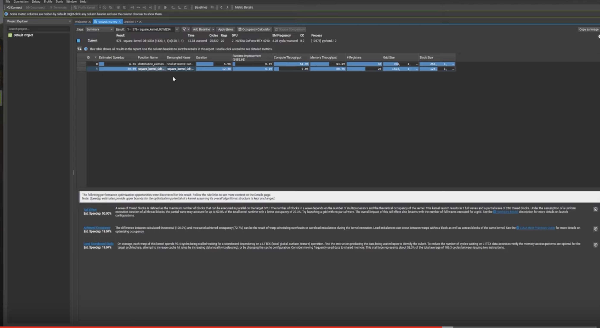

각 kernel의 `grid_size`, `block_size`, 계산 처리량, 메모리 대역폭 처리량 등의 지표를 직관적으로 볼 수 있습니다. 또 아래쪽 흰색 글씨 뒤에는 현재 kernel 지표를 바탕으로 한 대략적인 튜닝 제안이 있습니다. 예를 들어 여기 첫 번째 항목은 active wave가 너무 낮기 때문에 `grid_size`와 `block_size`를 조정하라는 제안입니다. 두 번째 항목은 이론적인 occupancy(100.0%)와 실제 측정 occupancy(72.0%) 사이의 차이가 kernel 실행 중 warp 스케줄링 오버헤드 또는 workload 불균형 때문일 수 있다는 내용입니다. 같은 kernel의 서로 다른 block 사이와 block 내부의 서로 다른 warps 사이에서 모두 load imbalance가 발생할 수 있습니다. 세 번째 항목은 memory access pattern이 최적인지, Shared memory를 사용할 필요가 있는지 검증해야 한다는 것입니다.

다음 Slides에서는 ncu profile 결과를 통해 tail 쪽 요구 사항을 처리할지 결정할 수 있다고 말합니다. 예를 들어 우리가 제어할 수 있는 Padding 방식, 메모리 읽기/쓰기 병합, Shared Memory 사용(다만 Shared Memory는 Triton이 제어함)을 통해 kernel 성능을 높일 수 있습니다. 이 Slides는 CUDA와 Triton으로 각각 어떤 최적화를 조작할 수 있는지도 보여줍니다. 손으로 쓴 Kernel은 모든 최적화를 조작할 수 있지만, Triton은 SM 간 스케줄링만 조작할 수 있음을 볼 수 있습니다.

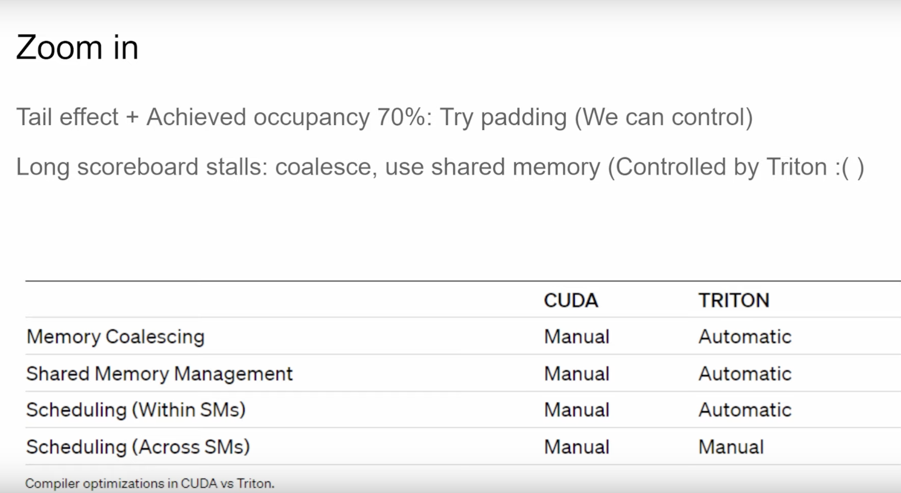

다음 Slides는 Nsight Compute의 source pages입니다. 여기서는 소스 코드, CUDA PTX 코드, 코드에 대응하는 레지스터 사용량, 예를 들어 global memory read 작업 등을 보여줍니다.

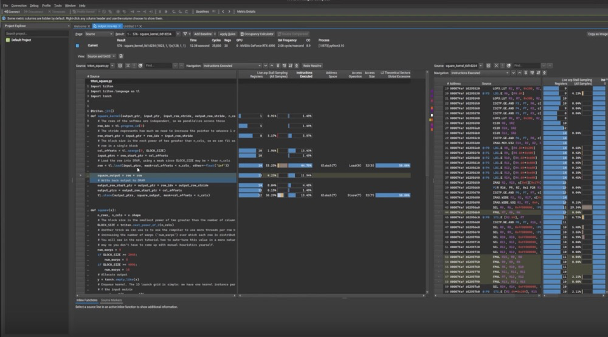

마지막으로 이 강의를 요약하면, PyTorch에 CUDA kernel을 통합하는 일은 쉽고, 이어서 `torch.autograd.profiler`와 Nsight Compute를 활용해 profile과 성능 최적화를 해야 한다는 내용입니다.
