> 내 강의 노트입니다. 팔로우 환영: https://github.com/BBuf/how-to-optim-algorithm-in-cuda/tree/master/cuda-mode 

## CUDA-MODE 강의 노트 제7강: Quantization Cuda vs Triton

### 강의 자료 상세 해설

> 저자의 강의 자료는 여기서 찾을 수 있다: https://github.com/cuda-mode/lectures 。다운로드 받은 사본도 https://github.com/BBuf/how-to-optim-algorithm-in-cuda/tree/master/cuda-mode/ppt 에 두었다.

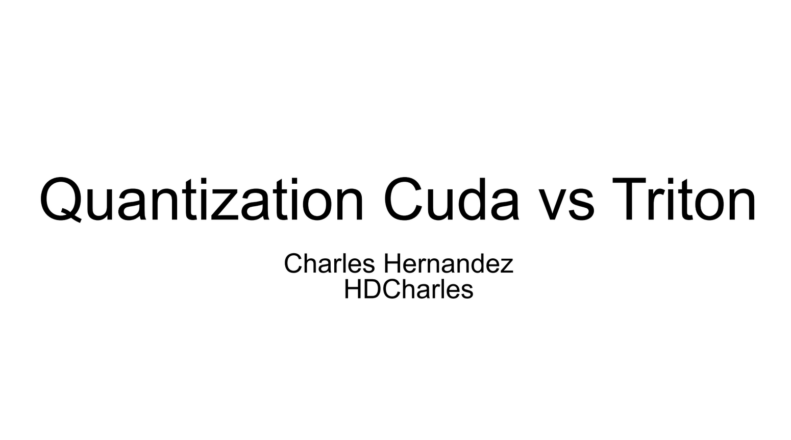

PyTorch는 최근 1년간 생성형 AI 모델에 대한 여러 사례 연구를 발표했다. 이 모델들은 매우 빠르게 실행되고 코드도 극도로 간결하다. GPT-FAST, SAM-FAST 등 이 모델들은 양자화 기술을 적용했으며, Charles는 이러한 양자화 kernel의 주요 개발자다. 따라서 이 강의에서는 Charles가 양자화 기술을 공유한다.


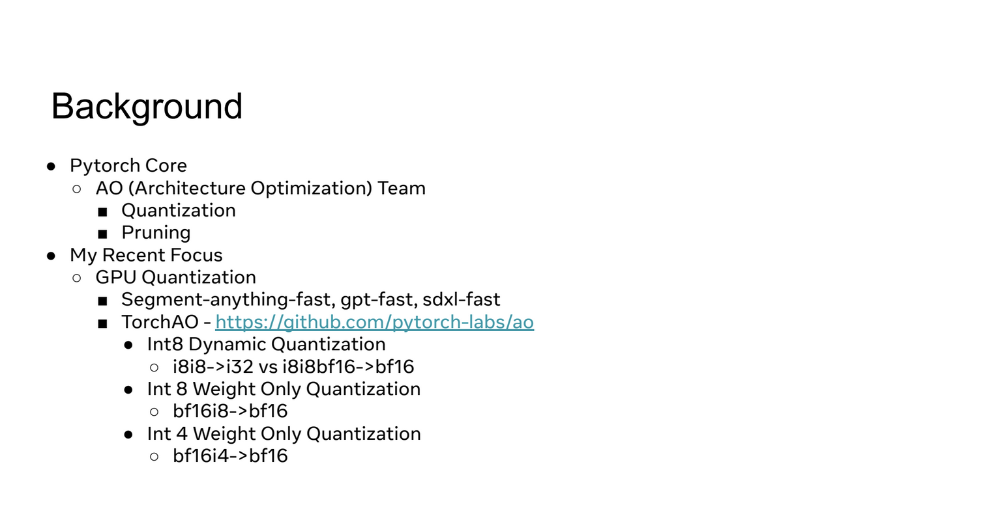


이 Slides는 발표자의 배경과 최근 연구 중점을 소개한다:
- Pytorch Core
    - AO (Architecture Optimization) 팀
        - 양자화(Quantization)
        - 가지치기(Pruning)
- 최근 연구 중점
    - GPU 양자화
        - Segment-anything-fast, gpt-fast, sdxl-fast 등 프로젝트
        - TorchAO - GitHub 링크 제공 (https://github.com/pytorch-labs/ao)
        - Int8 동적 양자화
            - i8i8->i32 vs i8i8bf16->bf16
        - Int8 가중치 전용 양자화
            - bf16i8->bf16
        - Int4 가중치 전용 양자화
            - bf16i4->bf16

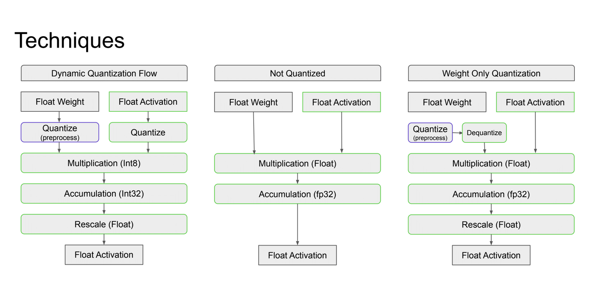

이 Slides는 세 가지 다른 양자화 기술을 소개한다:

- 동적 양자화 흐름(Dynamic Quantization Flow):
    - 가중치와 활성화 모두 부동소수점에서 시작
    - 가중치는 **전처리** 단계에서 양자화
    - 활성화는 **런타임** 시 양자화
    - 곱셈 연산에 Int8 사용
    - 누적에 Int32 사용
    - 마지막으로 부동소수점으로 rescale
- 양자화하지 않음(Not Quantized):
    - 가중치와 활성화 모두 부동소수점 형식 유지
    - 모든 연산(곱셈과 누적)이 부동소수점으로 수행
- 가중치 전용 양자화(Weight Only Quantization):
    - 가중치는 **전처리** 단계에서 양자화
    - 이후 즉시 부동소수점으로 역양자화
    - 활성화는 부동소수점 형식 유지
    - 곱셈과 누적 모두 부동소수점으로 수행
    - 마지막에 rescale 단계가 있음

전체적으로 이 Slides는 신경망 계산 시 이 세 가지 기술의 서로 다른 흐름을 보여준다. 동적 양자화는 계산 과정에서 정수 연산을 사용하여 효율성을 높이고, 가중치 전용 양자화는 가중치만 압축하며 실제 계산 시에는 여전히 부동소수점을 사용한다. 양자화하지 않는 방법은 완전히 부동소수점을 사용하여 최고의 정밀도를 제공할 수 있지만 계산 효율성이 낮다.

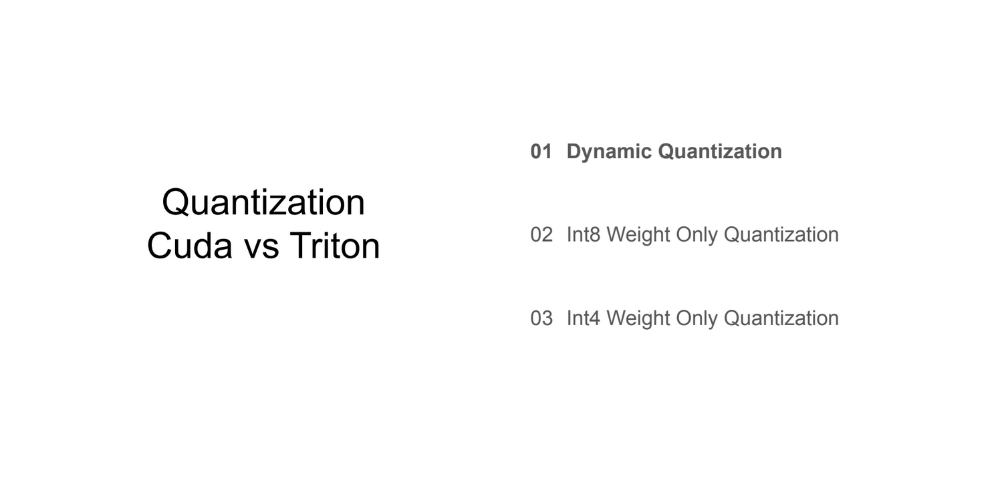

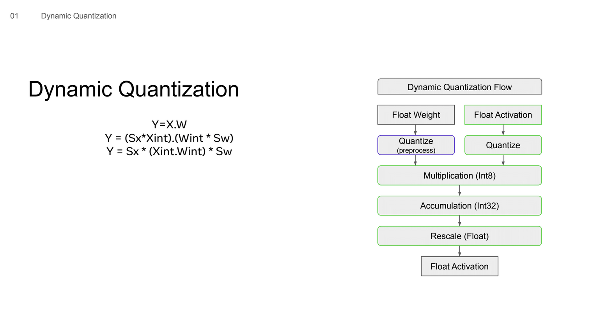


이 Slides는 동적 양자화(Dynamic Quantization)의 개념과 흐름을 더 자세히 설명한다:
- 수식 표현:
    - 원래 공식: Y = X.W
    - 양자화 후 공식: Y = (Sx*Xint).(Wint * Sw)
    - 재배열 후 공식: Y = Sx * (Xint.Wint) * Sw
여기서 Sx와 Sw는 스케일 팩터이고, Xint와 Wint는 양자화된 정수값이다.
- 동적 양자화 흐름도:
    - 부동소수점 가중치(Float Weight)와 부동소수점 활성화 값(Float Activation)에서 시작
    - 가중치는 전처리 단계에서 양자화(Quantize (preprocess))
    - 활성화 값은 런타임 시 양자화(Quantize)
    - 곱셈 연산에 Int8 사용(Multiplication (Int8))
    - 누적 연산에 Int32 사용(Accumulation (Int32))
    - 마지막으로 결과를 재스케일(Rescale (Float))하여 부동소수점으로 변환
    - 부동소수점 활성화 값 출력(Float Activation)

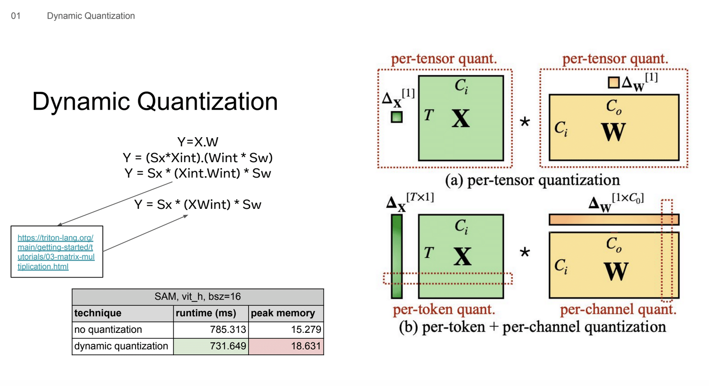

이 Slides는 per-tensor 양자화(per-tensor quantization)와 per-token 양자화 + per-channel 양자화(per-token + per-channel quantization) 두 가지 동적 양자화 방식을 보여준다.
성능 비교(SAM 모델 기준, vit_h, bsz=16):
- 양자화 없음: 실행 시간 785.313ms, 피크 메모리 15.279(단위 미지정, 아마도 GB)
- 동적 양자화: 실행 시간 731.649ms, 피크 메모리 18.631
또한 여기의 링크는 Triton의 행렬 곱셈 튜토리얼이다.

결론: 동적 양자화는 계산 효율성을 높일 수 있으며, 이 예시에서 실행 시간이 약 7% 감소했다. 서로 다른 양자화 전략(per-tensor, per-token, per-channel)을 서로 다른 텐서에 적용하여 성능과 정밀도를 최적화할 수 있다. 동적 양자화가 계산 속도를 높이지만 메모리 점유는 약 15%-20% 더 늘어났다.

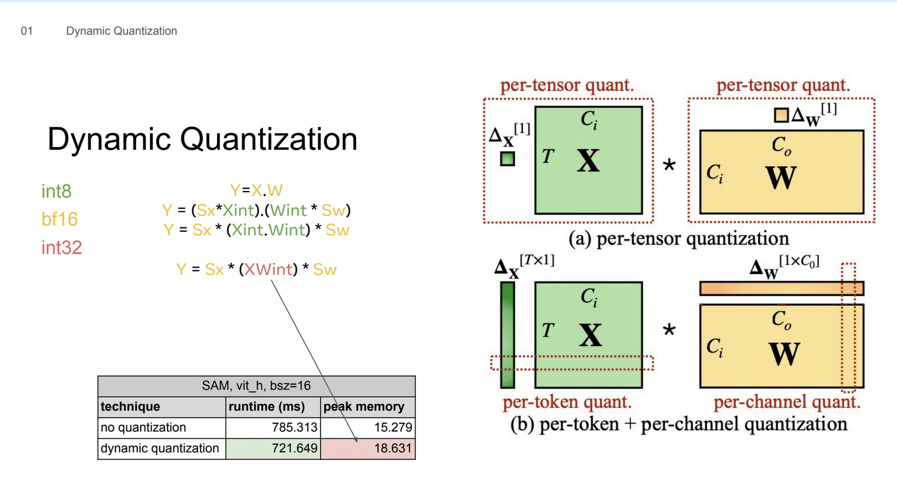

이 Slides는 메모리 증가의 원인이 int8 결과를 int32 타입으로 누적해야 하기 때문임을 지적한다. 따라서 BFloat16에 비해 추가적인 메모리가 소요된다.

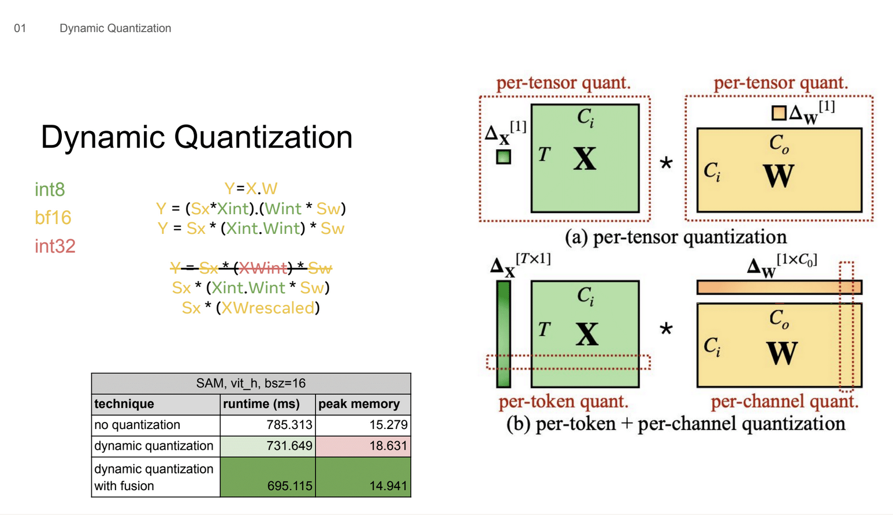

이 Slides는 동적 양자화(Dynamic Quantization)의 개념, 방법, 성능 비교를 더 자세히 소개한다:
- 동적 양자화의 수식 표현:
    - 원래 공식: Y = X.W
    - 양자화 공식: Y = (Sx*Xint).(Wint * Sw)
    - 재배열 공식: Y = Sx * (Xint.Wint) * Sw
    - 추가 최적화: Sx * (XWrescaled)
> 서로 다른 데이터 타입이 사용된다:
    - int8: Xint와 Wint에 사용
    - bf16: Sx와 Sw에 사용
    - int32: 중간 계산 결과 XWint에 사용
- 성능 비교(SAM 모델 기준, vit_h, bsz=16):
    - 양자화 없음: 실행 시간 785.313ms, 피크 메모리 15.279GB
    - 동적 양자화: 실행 시간 731.649ms, 피크 메모리 18.631GB
    - 융합을 포함한 동적 양자화: 실행 시간 695.115ms, 피크 메모리 14.941GB
결론: 동적 양자화는 계산 효율성을 크게 높일 수 있으며, 실행 시간이 약 7% 감소한다. 융합을 포함한 동적 양자화는 성능을 더욱 최적화하며, 실행 시간이 양자화 없음 대비 약 11.5% 감소하고 메모리 사용도 약간 줄어든다.

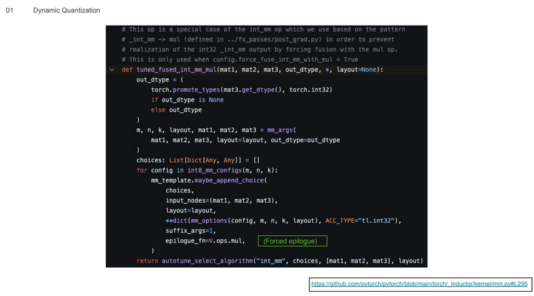


여기서는 Torch Compile에서 융합을 포함한 동적 양자화를 구현하는 데 필요한 노력을 보여준다. Torch Compile이 곱셈 연산의 융합을 꺼려하기 때문에, 저자는 Torch Compile의 행렬 곱셈 kernel 이후에 강제로 곱셈의 epilogue를 추가해야 했다(실제로 이것은 컴파일러의 PASS로, 행렬 곱셈+곱셈 패턴을 매칭해야 효과가 발생한다). 그림은 코드를 보기 어려워 여기에 붙여넣는다:
```python
# This op is a special case of the int_mm op which we use based on the pattern
# _int_mm -> mul (defined in ../fx_passes/post_grad.py) in order to prevent
# realization of the int32 _int_mm output by forcing fusion with the mul op.
# This is only used when config.force_fuse_int_mm_with_mul = True
def tuned_fused_int_mm_mul(mat1, mat2, mat3, out_dtype, *, layout=None):
    out_dtype = (
        torch.promote_types(mat3.get_dtype(), torch.int32)
        if out_dtype is None
        else out_dtype
    )
    m, n, k, layout, mat1, mat2, mat3 = mm_args(
        mat1, mat2, mat3, layout=layout, out_dtype=out_dtype
    )
    choices: List[Dict[Any, Any]] = []
    for config in int8_mm_configs(m, n, k):
        mm_template.maybe_append_choice(
            choices,
            input_nodes=(mat1, mat2, mat3),
            layout=layout,
            **dict(mm_options(config, m, n, k, layout), ACC_TYPE="tl.int32"),
            suffix_args=1,
            epilogue_fn=V.ops.mul,
        )
    return autotune_select_algorithm("int_mm", choices, [mat1, mat2, mat3], layout)
```

반면 Triton은 이 요구사항을 구현할 때 Torch Compile보다 훨씬 간단하여 한 줄의 코드로 가능하다.

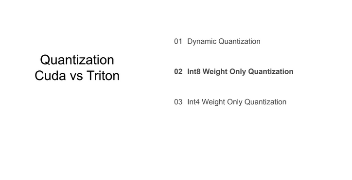

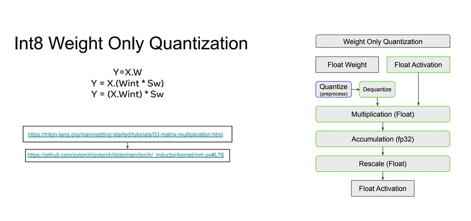

이 Slides는 Int8 가중치 양자화(Int8 Weight Only Quantization)의 개념과 흐름을 소개한다. 주요 내용:
- 수식 표현:
    - 원래 공식: Y = X.W
    - 양자화 공식: Y = X.(Wint * Sw)
    - 재배열 공식: Y = (X.Wint) * Sw
- 가중치 양자화 흐름도:
    - 부동소수점 가중치(Float Weight)에서 시작
    - 양자화(Quantize) 단계: 전처리 단계에서 수행
    - 역양자화(Dequantize) 단계: 양자화된 가중치를 부동소수점으로 되돌림
    - 부동소수점 활성화(Float Activation)는 변경 없음
    - 곱셈 연산은 부동소수점 사용(Multiplication (Float))
    - 누적에는 fp32 사용(Accumulation (fp32))
    - 재스케일(Rescale (Float))
    - 마지막으로 부동소수점 활성화 출력(Float Activation)
- 특징:
    - 활성화 값이 아닌 가중치만 양자화
    - 실제 계산 전 양자화된 가중치를 부동소수점 형식으로 역양자화
    - 모든 계산(곱셈과 누적)이 부동소수점 정밀도로 수행
- 기타:
    - 가중치를 Int8 형식으로 저장하므로 모델 저장 공간 감소
    - 실제 연산이 여전히 부동소수점으로 수행되므로 계산 정밀도 유지
    - 완전 양자화 방법(예: 동적 양자화)보다 더 높은 정밀도를 가질 수 있음
    - 정밀도 요구가 높지만 여전히 모델 크기를 줄이고자 하는 시나리오에 적합
    - 일부 하드웨어에서 완전 양자화 방법보다 구현 및 최적화하기 더 쉬울 수 있음

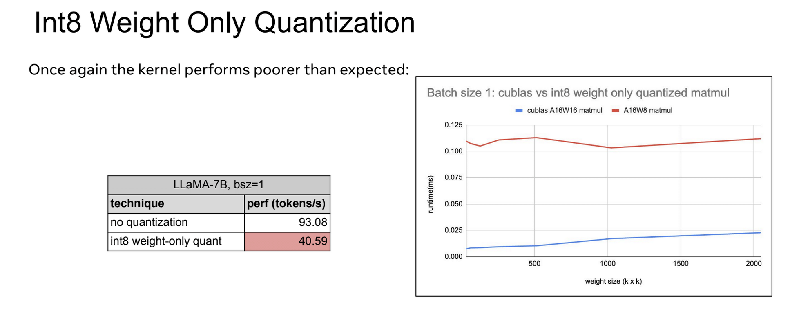


이 Slides는 Int8 가중치 양자화(Int8 Weight Only Quantization)의 성능 표현을 보여준다. 양자화 없음: 93.08 tokens/s, int8 가중치 양자화: 40.59 tokens/s. int8 가중치 양자화가 오히려 처리 속도를 낮추어 양자화 없는 버전의 약 43.6%에 해당한다는 것을 볼 수 있다.

그림에서는 Batch size 1: cublas와 int8 weight only quantized matmul을 비교한다. 파란선: cublas A16W16 matmul(16비트 정밀도의 cublas 행렬 곱셈). 빨간선: A16W8 matmul(16비트 활성화와 8비트 가중치를 사용하는 행렬 곱셈)

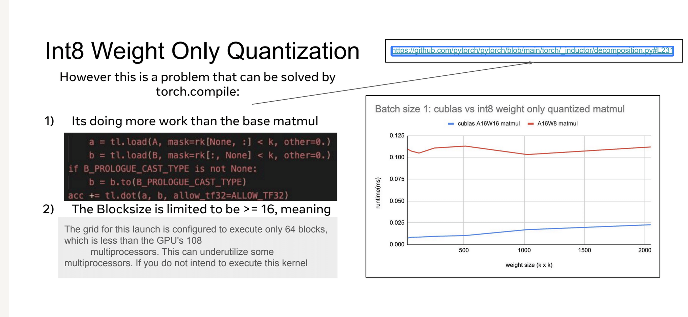

이 Slides는 일반 GEMM Triton kernel 템플릿을 사용할 경우 위 Int8 가중치 양자화의 성능이 기대치보다 낮은 이유를 설명한다:
- 기본 matmul보다 더 많은 작업을 수행한다. 추가 로드와 타입 변환 연산을 보여주는 코드 일부를 제시하며, 이 추가 연산들이 성능 저하를 야기할 수 있다
- 블록 크기가 16 이상으로 제한되어 현재 설정에서 64개의 블록만 실행되어 A100 GPU의 108개 멀티프로세서보다 적다. 이로 인해 일부 멀티프로세서가 충분히 활용되지 않을 수 있다

그런 다음 Torch Compile은 링크의 코드를 통해 이 문제를 해결했다. 붙여넣으면:

```python
@register_decomposition([aten.mm])
@pw_cast_for_opmath
def mm(self, input2):
    # Our matrix vector multiplies only achieve peak bandwidth with coordinate descent tuning.
    # todo: Look into why and fix it (hopefully)
    if config.coordinate_descent_tuning:
        if guard_size_oblivious(self.shape[0] == 1) or guard_size_oblivious(
            input2.shape[1] == 1
        ):
            return (self.unsqueeze(2) * input2.unsqueeze(0)).sum(dim=1)
    ...
    return NotImplemented
```

실제로 이 연산은 GEMV를 Tensor Core 대신 Cuda Core로 계산하도록 하는 것이다. 구체적인 방법은 GEMV 연산을 요소별 곱셈과 리덕션 연산으로 등가 변환하는 것이다. 이 연산은 Torch Compile이 생성한 Triton Kernel 코드로 다음과 같다:

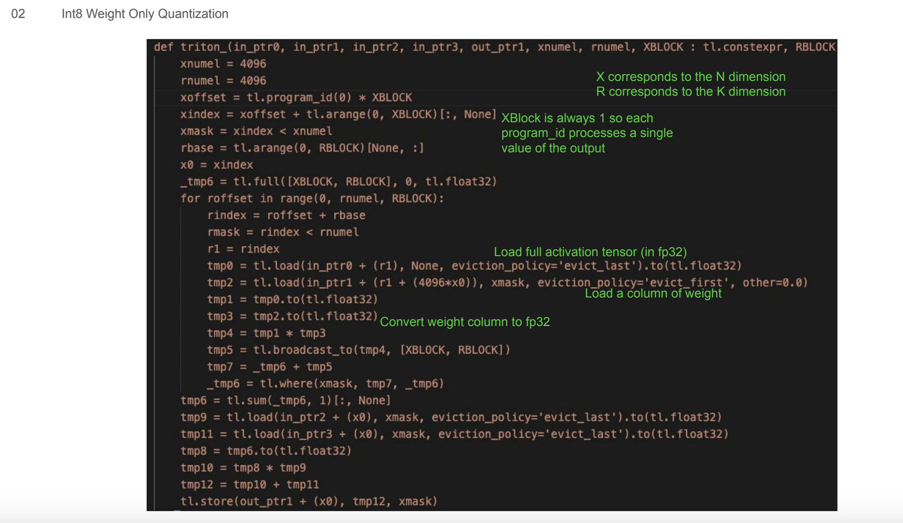


이 Slides는 triton_()이라는 함수(Torch 컴파일러가 생성한)를 보여주며, Int8 가중치 양자화의 GEMV 연산을 구현한다. 전체 흐름:
- xnumel과 rnumel 모두 4096으로 설정
- X는 N 차원에 해당하고 R은 K 차원에 해당
- program_id(0)와 XBLOCK을 사용하여 오프셋 계산
- XBLOCK은 항상 1이며, 각 program_id는 출력의 단일 값을 처리
- 완전한 활성화 텐서(fp32 형식) 로드
- 가중치의 한 열에 대해 루프
- 가중치 열의 한 chunk 로드(int8 형식일 수 있음)
- 가중치 열을 fp32 형식으로 변환
- 행렬 곱셈의 핵심 계산 수행
- 브로드캐스트와 누적 연산 사용
- 결과에 마스크 처리 및 ReduceSum 수행
- 추가 데이터 로드(편향 또는 스케일 팩터일 수 있음)
- 마지막 곱셈과 덧셈 연산 수행
- 결과를 메모리에 다시 저장

```python
def triton_(in_ptr0, in_ptr1, in_ptr2, in_ptr3, out_ptr1, xnumel, rnumel, XBLOCK: tl.constexpr, RBLOCK: tl.constexpr):
    xnumel = 4096
    rnumel = 4096
    xoffset = tl.program_id(0) * XBLOCK
    xindex = xoffset + tl.arange(0, XBLOCK)[:, None]
    xmask = xindex < xnumel
    rbase = tl.arange(0, RBLOCK)[None, :]
    x0 = xindex
    _tmp6 = tl.full([XBLOCK, RBLOCK], 0, tl.float32)
    for roffset in range(0, rnumel, RBLOCK):
        rindex = roffset + rbase
        rmask = rindex < rnumel
        r1 = rindex
        tmp0 = tl.load(in_ptr0 + (r1), None, eviction_policy='evict_last').to(tl.float32)
        tmp2 = tl.load(in_ptr1 + (r1 + (4096*x0)), xmask, eviction_policy='evict_first', other=0.0)
        tmp1 = tmp0.to(tl.float32)
        tmp3 = tmp2.to(tl.float32)
        tmp4 = tmp1 * tmp3
        tmp5 = tl.broadcast_to(tmp4, [XBLOCK, RBLOCK])
        tmp7 = _tmp6 + tmp5
        _tmp6 = tl.where(xmask, tmp7, _tmp6)
    tmp6 = tl.sum(_tmp6, 1)[:, None]
    tmp9 = tl.load(in_ptr2 + (x0), xmask, eviction_policy='evict_last').to(tl.float32)
    tmp11 = tl.load(in_ptr3 + (x0), xmask, eviction_policy='evict_last').to(tl.float32)
    tmp8 = tmp6.to(tl.float32)
    tmp10 = tmp8 * tmp9
    tmp12 = tmp10 + tmp11
    tl.store(out_ptr1 + (x0), tmp12, xmask)
```

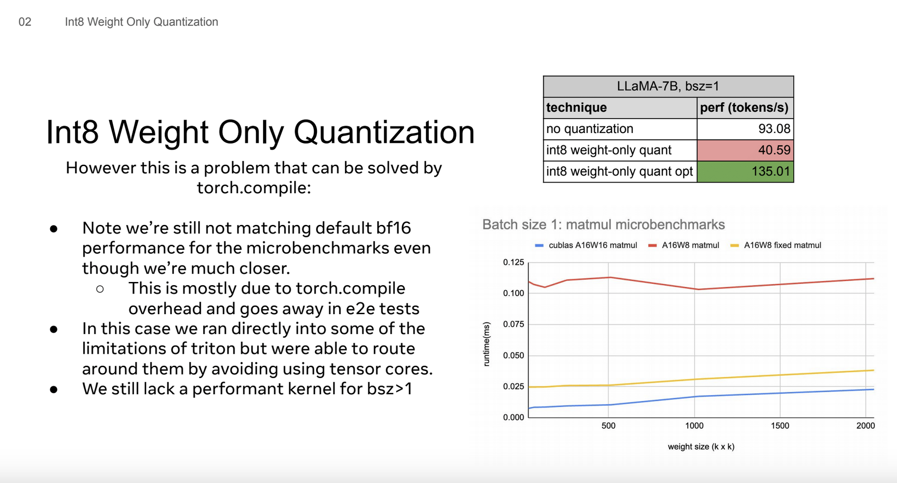

이 Slides는 주로 Int8 가중치 양자화(Int8 Weight Only Quantization)의 최적화 과정과 결과를 설명한다.
- 성능 문제 해결: torch.compile을 사용하여 이전에 발생한 성능 문제를 해결할 수 있다.
- 성능 비교(LLaMA-7B 모델, 배치 크기 1):
    - 양자화 없음: 93.08 tokens/s
    - int8 가중치 양자화: 40.59 tokens/s
    - int8 가중치 양자화 최적화 후: 135.01 tokens/s
    - 최적화 후 int8 가중치 양자화의 성능이 크게 향상되어 양자화 없는 버전을 초과했다.
- 마이크로 벤치마크 결과:
    - 차트는 서로 다른 가중치 크기에서의 성능 비교를 보여준다
    - cublas A16W16 matmul(파란선) 성능 최고
    - A16W8 matmul(빨간선) 성능 낮음
    - A16W8 fixed matmul(노란선) 성능은 두 사이
- 최적화 과정에서의 발견:
    - 성능 향상이 뚜렷하지만 여전히 기본 bf16의 성능과 완전히 일치하지 않음
    - 주로 torch.compile의 오버헤드 때문이며, 엔드투엔드 테스트에서는 이 격차가 줄어든다
    - 최적화 과정에서 Triton의 일부 제한 사항을 만나 Tensor Core 사용을 피하는 방법으로 우회함
    - 현재 배치 크기 1보다 큰 경우(bsz>1)에 대한 고성능 커널 부재
- 향후 작업:
    - bf16의 성능을 완전히 달성하거나 초과하기 위한 추가 최적화 필요
    - 더 큰 배치 크기를 지원하는 고성능 커널 개발

여기서 bsz=1일 때는 memory bound인 GEMV이고, bsz>1이면 GEMM Kernel이 되어 compute bound가 될 가능성이 높다. 일반적인 kernel 최적화로는 cuBLAS의 성능을 초과하기 어려울 것으로 예상된다.

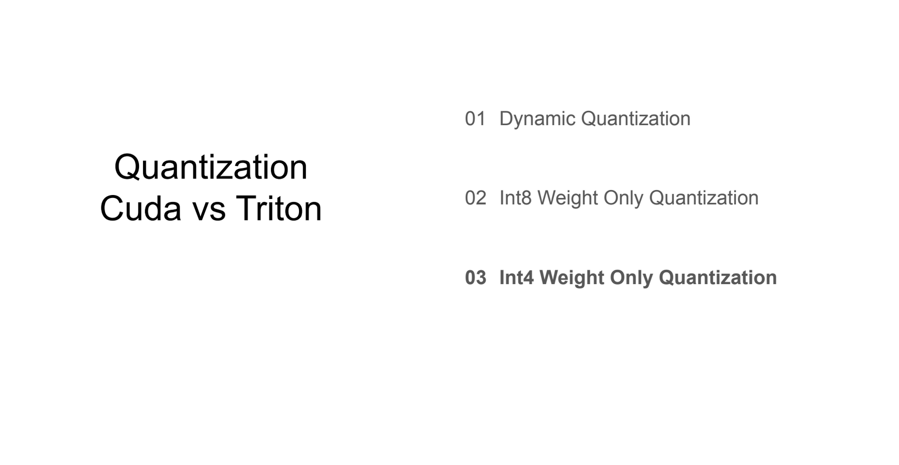

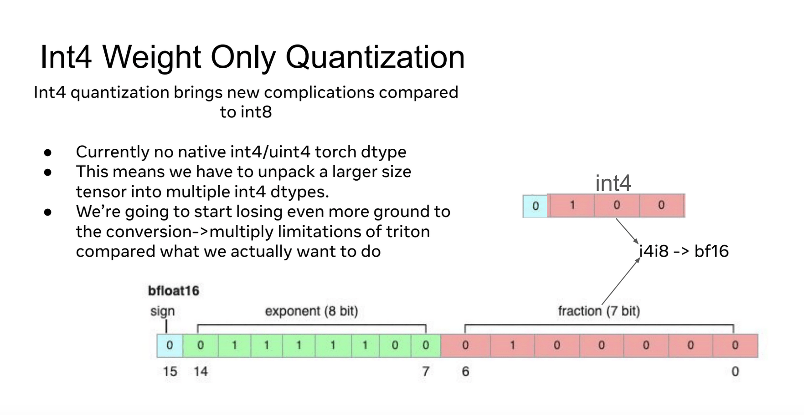

Int4 Weight Only부터 Triton이 한계를 보이기 시작한다. 핵심은:
- 현재 PyTorch에 기본 int4/uint4 데이터 타입(dtype)이 없다.
- 이는 더 큰 크기의 텐서를 여러 개의 int4 타입으로 분해해야 한다는 것을 의미한다.
- Triton의 타입 변환과 곱셈 연산에서의 제한으로 인해 실제 연산에서 더 많은 성능을 잃는다.
- 그림은 int4 데이터(4비트 정수)가 더 큰 데이터 타입으로 어떻게 패킹되는지 보여준다.

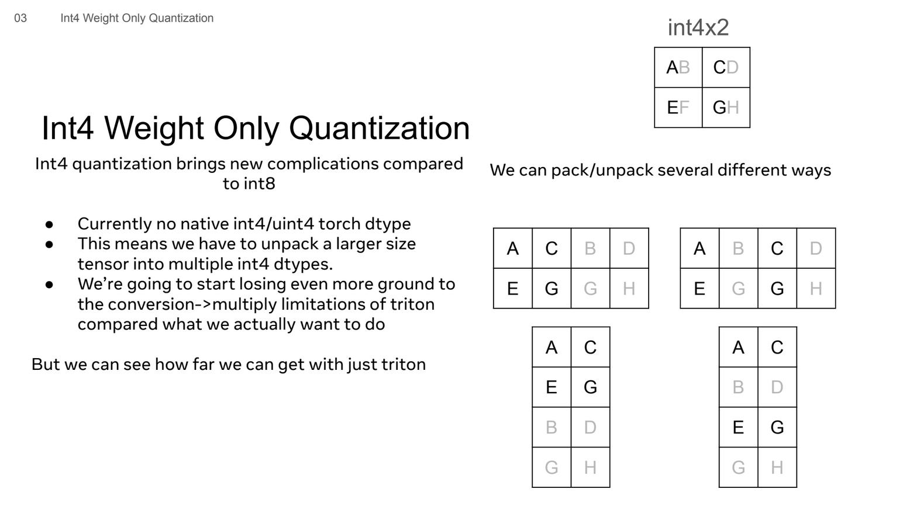

"But we can see how far we can get with just triton"(하지만 Triton만 사용해서 얼마나 멀리 갈 수 있는지 볼 수 있다)라는 말은 저자가 기존 Triton 프레임워크 제한 내에서 Int4 양자화의 잠재력을 탐구하고자 한다는 것을 보여준다. 오른쪽 상단에는 int4x2의 기본 구조가 표시되어 있으며, 각 요소는 두 개의 4비트 정수를 포함한다. 아래에는 더 큰 데이터 구조에서 int4 데이터를 어떻게 구성하는지 보여주는 네 가지 다른 패킹/언패킹 레이아웃이 있다.

> Slides 오른쪽 하단의 그림 4장에 오타가 있으니 주의하여 식별해야 한다. 예를 들어 마지막 그림의 첫 번째 열은 ABEF이어야 한다.

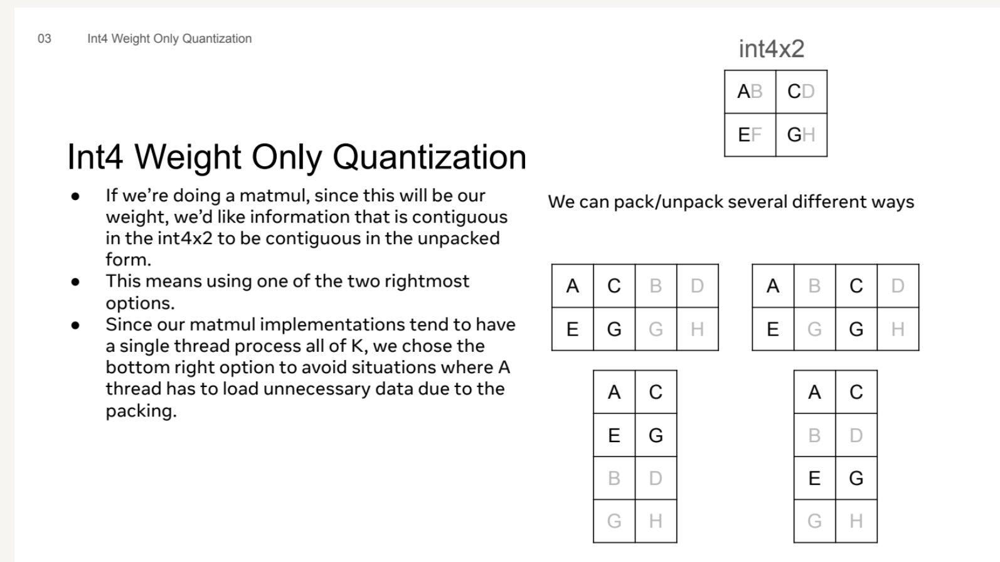

이 Slides는 행렬 곱셈(matmul)에서 Int4 가중치 양자화(Int4 Weight Only Quantization)의 구현 전략, 특히 데이터 패킹 및 언패킹 선택에 대해 자세히 설명한다.
- 행렬 곱셈을 수행할 때 이것이 가중치이므로 int4x2 형식에서 연속적인 정보가 언패킹 후에도 연속으로 유지되길 원한다.
- 따라서 오른쪽 두 옵션 중 하나를 사용해야 한다.
- 행렬 곱셈 구현은 일반적으로 단일 스레드가 모든 K 차원을 처리하므로, 오른쪽 하단 옵션을 선택한다. 이 선택은 패킹 방식으로 인해 스레드가 불필요한 데이터를 로드하는 것을 피할 수 있다.

> Slides 오른쪽 하단의 그림 4장에 오타가 있으니 주의하여 식별해야 한다. 예를 들어 마지막 그림의 첫 번째 열은 ABEF이어야 한다.

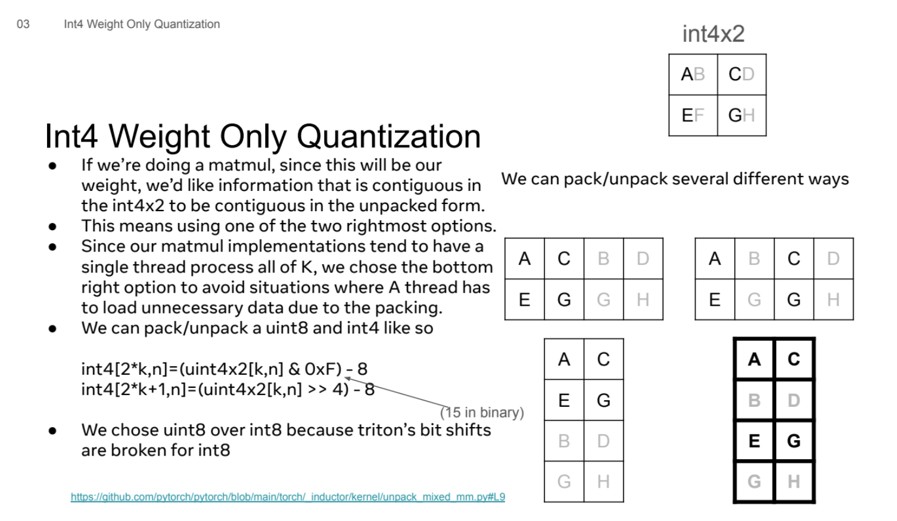

여기서는 uint8과 int4를 어떻게 패킹/언패킹하는지 보여주는 구체적인 코드를 제공한다:
```python
int4[2*k,n]=(uint4x2[k,n] & 0xF) - 8
int4[2*k+1,n]=(uint4x2[k,n] >> 4) - 8
```
Triton 프레임워크가 int8의 비트 시프트 연산에 문제가 있어 uint8을 선택했다고 설명한다. 여기서 uint4x2 양자화 Kernel 코드는: https://github.com/pytorch/pytorch/blob/main/torch/_inductor/kernel/unpack_mixed_mm.py

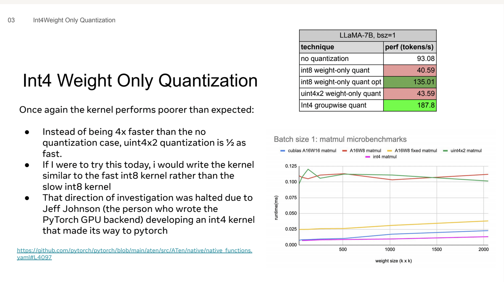

이 Slides는 주로 Int4 가중치 양자화(Int4 Weight Only Quantization)의 성능 표현과 관련 관찰을 논의한다.
- 성능 데이터 표(LLaMA-7B, bsz=1):
    - 양자화 없음: 93.08 tokens/s
    - int8 가중치 양자화: 40.59 tokens/s
    - int8 가중치 양자화 최적화 버전: 135.01 tokens/s
    - uint4x2 가중치 양자화: 43.59 tokens/s
    - Int4 그룹 양자화: 187.8 tokens/s 

> uint4x2 양자화 성능(Triton 구현)은 양자화 없는 경우의 절반에 불과하며, 기대했던 4배 빠름이 아니다. 저자는 지금 다시 구현한다면 slow int8 kernel 방법이 아닌 fast int8 kernel 방법을 참고할 것이라고 언급한다. 또한 Jeff Johnson(PyTorch GPU 백엔드 개발자)이 CUDA를 사용하여 int4 kernel을 개발하여 PyTorch에 통합했으며 속도가 매우 빠르다고 언급하며, 이것이 위 표의 Int4 그룹 양자화다. 코드: https://github.com/pytorch/pytorch/blob/main/aten/src/ATen/native/native_functions.yaml


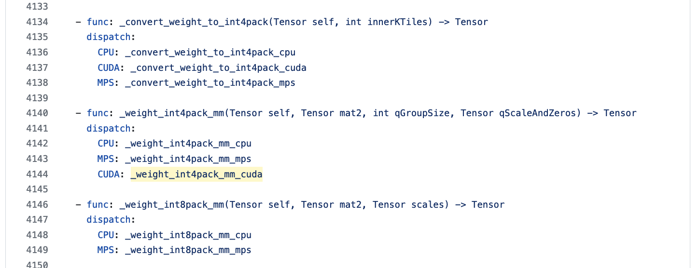


이것은 kernel의 시그니처이며, 관심 있는 독자는 코드를 직접 확인할 수 있다.

이 Int4 Weight Only의 CUDA 양자화 kernel 구현에서 Triton의 한계를 볼 수 있다.

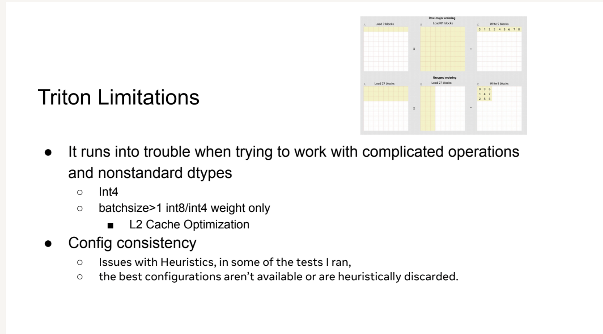

이 Slides는 Triton의 일부 한계를 논의한다:
- 복잡한 연산과 비표준 데이터 타입 문제:
    - Triton은 복잡한 연산과 비표준 데이터 타입을 처리할 때 어려움에 부딪힌다.
    - 구체적으로 Int4(4비트 정수) 타입을 언급한다.
    - 배치 크기가 1보다 클 때 int8/int4 가중치 양자화도 문제가 발생한다.
    - 이러한 경우 L2 캐시 최적화가 영향을 받을 수 있다.
- 설정 일관성 문제:
    - 일부 테스트에서 휴리스틱 알고리즘에 문제가 있다.
    - 최적 설정이 사용 불가능하거나 휴리스틱 알고리즘에 의해 잘못 버려질 수 있다.

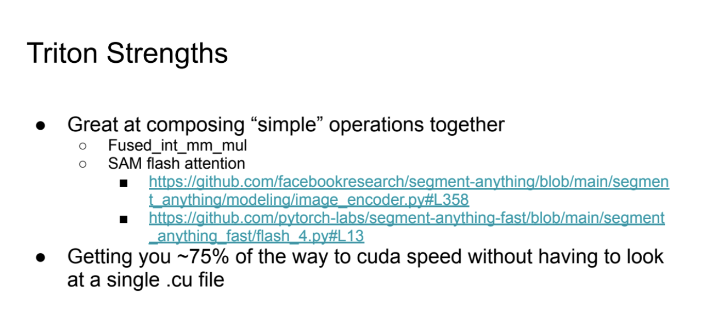

이 Slides는 Triton의 장점을 소개한다:
- "단순한" 연산의 조합에 능숙하다:
    - Triton은 단순한 연산을 조합하는 데 뛰어나다.
    - 두 가지 구체적인 예시를 언급한다:
    a) Fused_int_mm_mul(정수 행렬 곱셈과 곱셈 연산 융합)
    b) SAM flash attention(Segment Anything Model에서 사용되는 빠른 어텐션 메커니즘)
- CUDA에 가까운 성능, 더 간단한 사용:
    - Triton은 CUDA 속도의 약 75%를 달성할 수 있다.
    - 가장 중요한 것은 Triton을 사용하면 .cu 파일(CUDA 소스 코드 파일)을 직접 다루지 않고도 이 성능 수준에 도달할 수 있다는 것이다.

- 코드:
    - https://github.com/facebookresearch/segment-anything/blob/main/segment_anything/modeling/image_encoder.py#L325
    - https://github.com/pytorch-labs/segment-anything-fast/blob/main/segment_anything_fast/flash_4.py#L13

여기서 말하는 것은 SAM의 어텐션 연산이 표준 SelfAttention과 비교하여 두 개의 MASK를 융합해야 한다는 것이다. 이 경우 Triton으로 구현한 FlashAttention을 사용하면 이 요구사항을 매우 빠르게 구현할 수 있으며 성능도 우수하다.

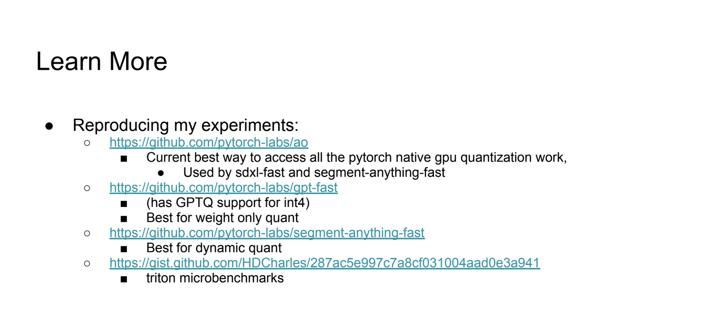

저자의 실험을 재현하거나 GPU에서의 양자화 Kernel 구현을 학습하려면 이 Slides의 링크를 클릭하면 된다.

저자가 공유한 Slides에는 부록으로 흥미로운 내용이 더 있으며, 그 중 일부를 선정하여 해설한다. 주로 실험 결과와 개념 부분이며, torchao 사용에 관한 Slides는 필요한 독자가 직접 확인할 수 있다.

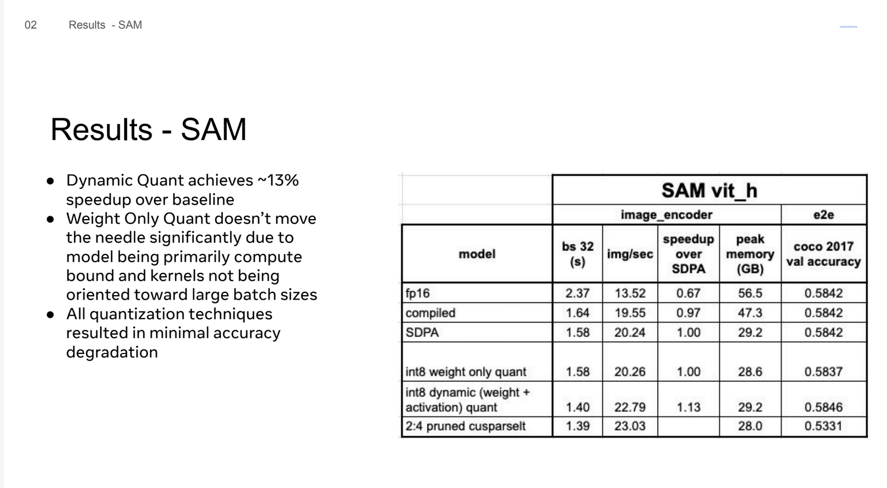

이 Slides는 SAM(Segment Anything Model) 모델에 서로 다른 양자화 및 최적화 기술을 적용한 실험 결과를 보여준다. 주요 내용:

- 동적 양자화(Dynamic Quant)는 기준 모델 대비 약 13%의 속도 향상을 얻었다.
- 가중치 전용 양자화(Weight Only Quant)는 성능 향상이 미미하다. 모델이 주로 계산에 제한되고 커널 설계가 대형 배치에 맞게 최적화되어 있지 않기 때문이다.
- 모든 양자화 기술은 매우 작은 정확도 손실만 초래했다.
그림은 서로 다른 방법의 성능 비교를 자세히 보여준다:
- fp16(반정밀도 부동소수점)
- compiled(컴파일 최적화)
- SDPA
- int8 weight only quant(8비트 정수 가중치 전용 양자화)
- int8 dynamic quant(8비트 정수 동적 양자화, 가중치와 활성화 포함)
- 2:4 pruned cusparselt(희소화 기술)
표에서는 이 방법들의 다음 항목들을 비교한다:
- 배치 크기 32의 처리 시간(bs 32(s))
- 초당 처리 이미지 수(img/sec)
- SDPA 대비 가속비(speedup over SDPA)
- 피크 메모리 사용(peak memory (GB))
- COCO 2017 검증 세트 정확도(coco 2017 val accuracy)

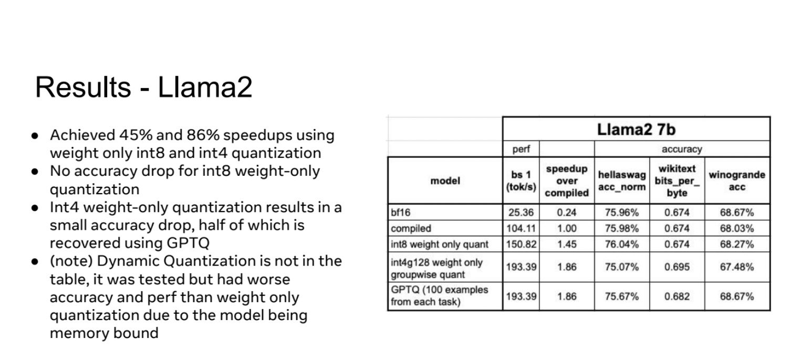

이 Slides는 Llama2 7B 모델에 서로 다른 양자화 방법을 적용한 실험 결과를 보여준다. 주요 내용:

- 가중치 전용 int8 및 int4 양자화를 사용하여 각각 45%와 86%의 속도 향상을 달성했다.
- int8 가중치 전용 양자화의 경우 정확도 저하가 관찰되지 않았다.
- int4 가중치 전용 양자화는 약간의 정확도 저하를 초래했지만, GPTQ(양자화 기술)를 사용하면 그 중 절반의 정확도 손실을 회복할 수 있다.
- 동적 양자화(Dynamic Quantization)도 테스트했지만, 모델이 메모리 제한을 받기 때문에 정확도와 성능 모두 가중치 전용 양자화보다 못하여 표에 포함하지 않았다.
- 표는 서로 다른 방법의 성능과 정확도 비교를 자세히 보여준다:
    - bf16
    - compiled(Torch 컴파일 최적화 버전)
    - int8 weight only quant(8비트 정수 가중치 전용 양자화)
    - int4g128 weight only groupwise quant(4비트 정수 그룹 가중치 전용 양자화)
    - GPTQ(각 태스크당 100개 샘플 사용)
- 성능 지표:
    - 초당 처리 토큰 수(bs 1 (tok/s))
    - compiled 버전 대비 가속비
    - hellaswag_acc_norm
    - wikitext bits_per_byte(퍼플렉시티 관련 지표)
    - winogrande acc
- 결과는 int4 양자화가 가장 큰 속도 향상(1.86배)을 제공하지만 약간의 정확도 손실이 있음을 보여준다. int8 양자화는 정확도를 유지하면서 상당한 속도 향상(1.45배)을 제공한다.

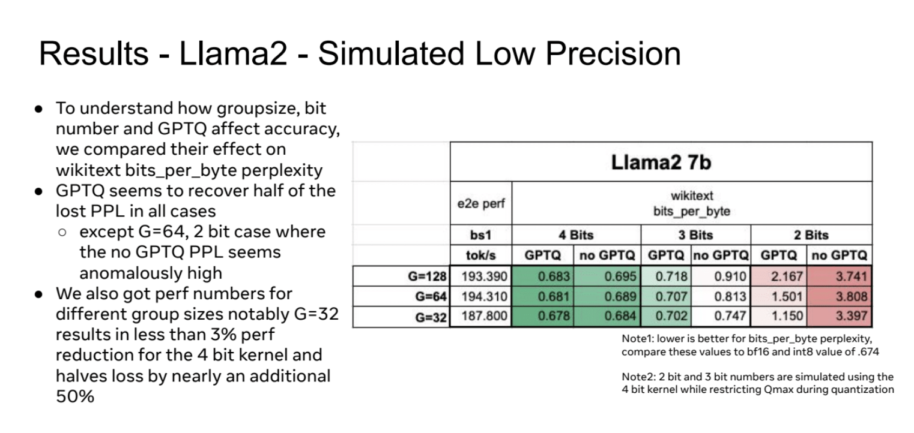

이 Slides는 Llama2 7B 모델에 시뮬레이션 저정밀도 양자화를 적용한 실험 결과를 보여준다. 주요 내용:
- 실험 목적: 그룹 크기(groupsize), 비트 수(bit number), GPTQ(양자화 기술)가 모델 정확도에 어떤 영향을 미치는지 이해한다. 실험은 wikitext bits_per_byte 퍼플렉시티를 평가 지표로 사용한다.
- GPTQ 효과: 대부분의 경우 GPTQ는 성능 손실(PPL, 퍼플렉시티)의 약 절반을 회복할 수 있다. 특례: G=64, 2비트 양자화의 경우 GPTQ 미사용 시 PPL이 비정상적으로 높다.
- 그룹 크기 영향: 서로 다른 그룹 크기(G=128, 64, 32)를 테스트했다. G=32일 때 4비트 양자화의 성능 손실은 3% 미만이며, GPTQ는 손실을 추가로 약 50% 줄인다.
- 양자화 비트 수 영향: 4비트, 3비트, 2비트 양자화 효과를 비교했다. 비트 수가 낮을수록 일반적으로 성능 손실이 크지만, GPTQ는 어느 정도 이 손실을 완화할 수 있다.
- 성능 데이터: 표는 서로 다른 설정에서의 추론 속도(tok/s)와 wikitext bits_per_byte 값을 보여준다. bits_per_byte 값이 낮을수록 더 나은 성능을 나타낸다(주1).
- 저정밀도 시뮬레이션: 3비트와 2비트 데이터는 4비트 kernel에서 시뮬레이션하여 얻었으며, 방법은 양자화 과정에서 Qmax(주2)를 제한하는 것이다.
- 기준 비교: 결과는 bf16(bfloat16)과 int8 양자화의 기준값 0.674와 비교해야 한다(주1).


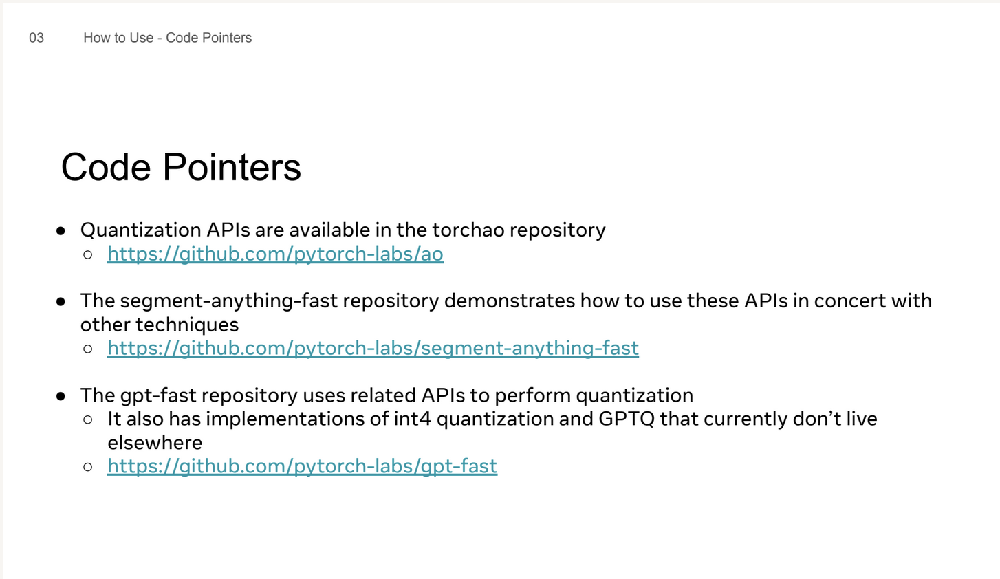

이 Slides는 양자화 관련 코드 리소스와 도구를 소개한다:
- 양자화 API:
    - 양자화 API는 torchao 저장소에서 찾을 수 있다
    - 링크: https://github.com/pytorch-labs/ao
- segment-anything-fast 저장소:
    - 이 저장소는 이 API를 다른 기술과 어떻게 결합하여 사용하는지 보여준다
    - 링크: https://github.com/pytorch-labs/segment-anything-fast
- gpt-fast 저장소:
    - 관련 API를 사용하여 양자화를 수행한다
    - 다른 곳에서는 아직 없는 int4 양자화와 GPTQ 구현을 포함한다
    - 링크: https://github.com/pytorch-labs/gpt-fast

뒤에는 서로 다른 양자화 방법을 소개하는 몇 장의 Slides가 더 있다.

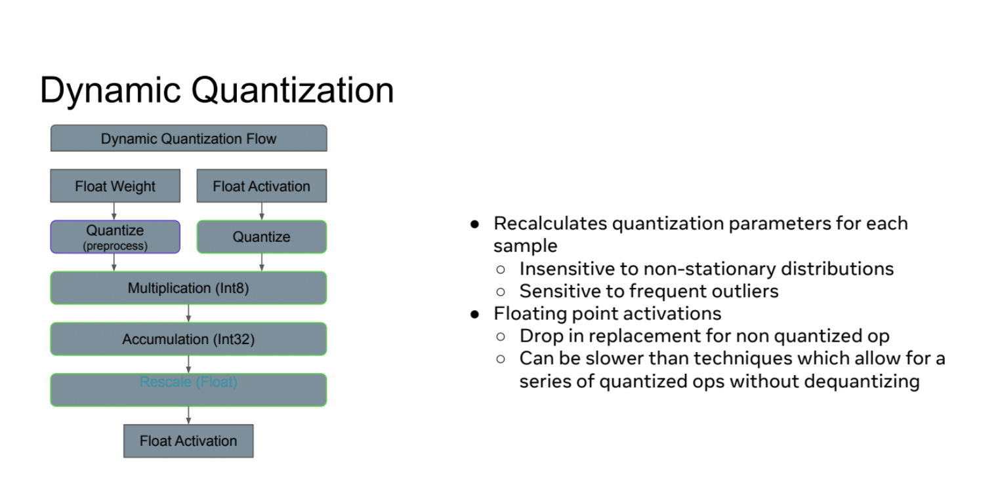

이 Slides는 동적 양자화(Dynamic Quantization)의 과정과 특징을 소개한다:
- 동적 양자화 흐름(Dynamic Quantization Flow):
    - 가중치와 활성화 모두 부동소수점에서 시작
    - 가중치는 **전처리** 단계에서 양자화
    - 활성화는 **런타임** 시 양자화
    - 곱셈 연산에 Int8 사용
    - 누적에 Int32 사용
    - 마지막으로 부동소수점으로 rescale
- 동적 양자화의 특징:
    - 각 샘플에 대해 양자화 파라미터를 재계산
        - 비정상 분포에 민감하지 않다
        - 자주 발생하는 이상치에 민감하다
- 부동소수점 활성화:
    - 양자화되지 않은 연산을 대체하는 데 사용
    - 역양자화 없이 일련의 양자화 연산을 허용하는 기술보다 느릴 수 있다

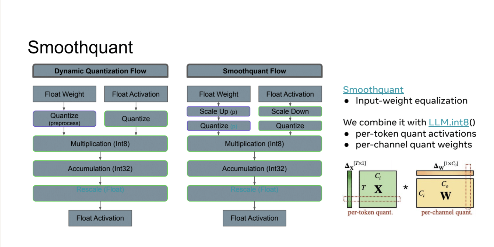

이 Slides는 Smoothquant(평활 양자화) 기술을 소개하고 동적 양자화와 비교한다:

- 두 가지 양자화 흐름 비교:
    - 왼쪽은 동적 양자화 흐름(이전 Slides와 동일)
    - 오른쪽은 Smoothquant 흐름으로, 주요 차이점:
        - a. 가중치 먼저 스케일 업(Scale Up)
        - b. 활성화 먼저 스케일 다운(Scale Down)
        - c. 그런 다음 양자화 수행
- Smoothquant의 특징: 입력-가중치 균등화(Input-weight equalization) 기술 사용
- Smoothquant와 LLM.int8()의 결합:
    - 활성화에 per-token 양자화 사용(per-token quant activations)
    - 가중치에 per-channel 양자화 사용(per-channel quant weights)
- Smoothquant의 장점:
    - 미리 스케일링 연산을 통해 가중치와 활성화의 수치 범위를 더 잘 균형 잡을 수 있다
    - 양자화 과정에서의 정보 손실을 줄이는 데 도움이 된다
    - LLM.int8() 기술과 결합하여 정밀도를 유지하면서 효율성을 높일 수 있다

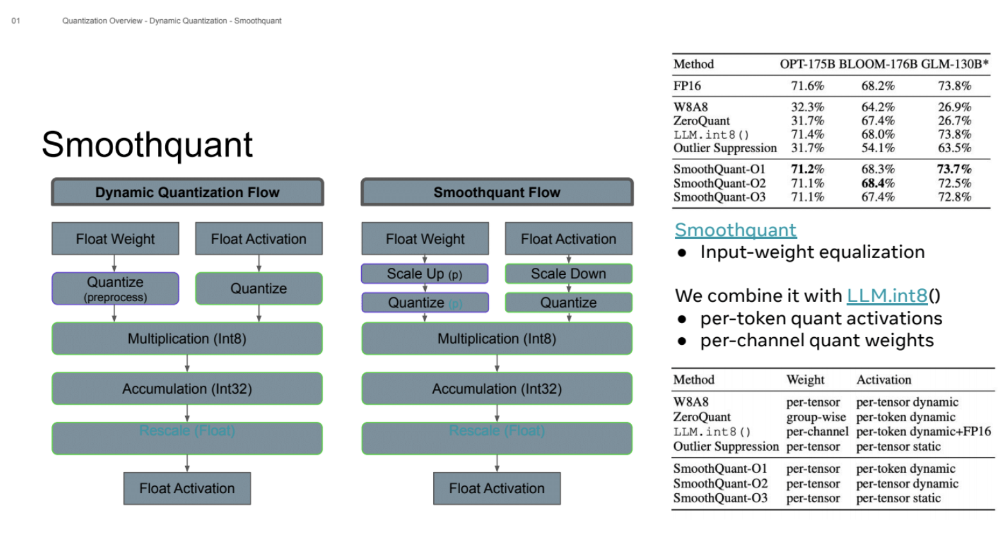

이 Slides는 서로 다른 양자화 방법이 OPT-175B, BLOOM-176B, GLM-130B* 모델에서 보이는 성능을 보여준다. Smoothquant(O1, O2, O3)는 대부분의 경우 FP16과 LLM.int8()에 가깝거나 더 나은 성능을 보인다.

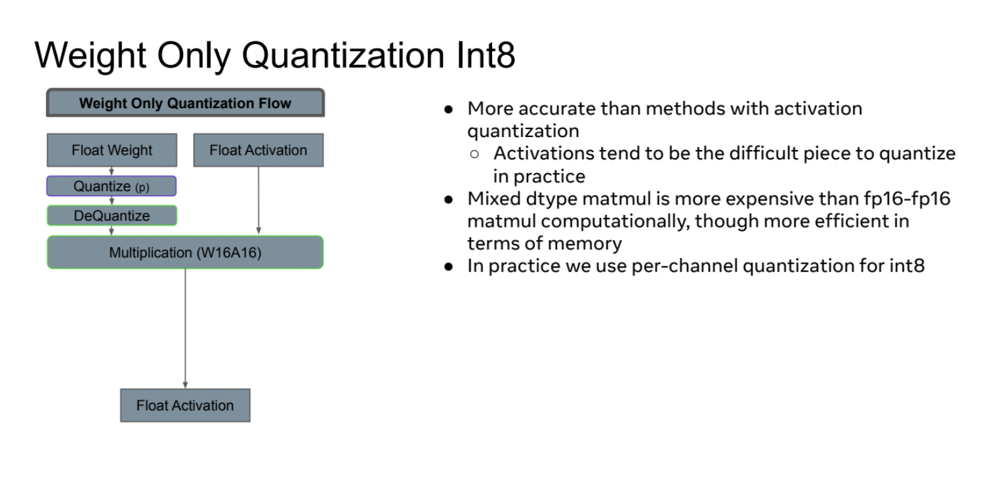

이 Slides는 Int8 가중치 전용 양자화(Weight Only Quantization)를 소개한다.
- 양자화 흐름:
    - 부동소수점 가중치를 먼저 양자화(Quantize)
    - 그런 다음 역양자화(DeQuantize)
    - 16비트 가중치와 16비트 활성화를 사용하여 곱셈 연산(Multiplication W16A16)
    - 마지막으로 부동소수점 활성화 출력
- 장점: 활성화 양자화를 포함하는 방법보다 더 정확하다. 이유: 실제 응용에서 활성화가 일반적으로 더 양자화하기 어려운 부분이다
계산 특성:
- 혼합 데이터 타입 행렬 곱셈(Mixed dtype matmul)은 계산상 fp16-fp16 행렬 곱셈보다 비용이 크다
하지만 메모리 사용에서는 더 효율적이다
- 실제 응용: 실제로 int8에 대해 per-channel 양자화를 사용한다

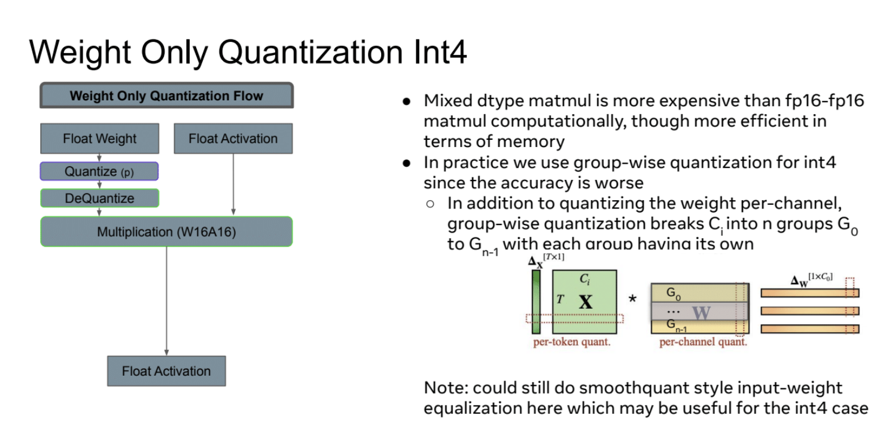

이 Slides는 Int4 가중치 전용 양자화를 소개한다.
- 양자화 흐름은 Int8 양자화와 유사하며, 가중치 양자화, 역양자화, 16비트 곱셈 연산을 포함한다.
- 실제 응용에서의 양자화 전략: int4에 그룹 양자화(group-wise quantization)를 사용한다. 이유는 int4의 정밀도가 낮아 그룹 양자화가 정밀도를 높일 수 있기 때문이다.
- 그룹 양자화의 구체적 연산: 각 채널을 양자화하는 것 외에도 채널 Ci를 n개의 그룹(G0부터 Gn-1까지)으로 나눈다. 각 그룹은 자체 양자화 파라미터를 갖는다.
- 오른쪽에는 per-token 양자화된 활성화 행렬과 per-channel 그룹 양자화된 가중치 행렬도 보여준다.
- smoothquant 스타일의 입력-가중치 균등화 기술 사용을 고려할 수 있다. int4의 경우 정밀도가 낮기 때문에 이 최적화가 특히 유용할 수 있다.

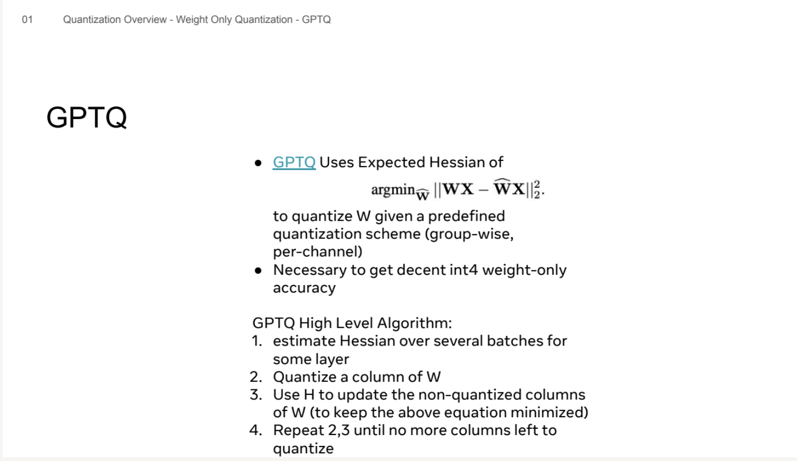

이 Slides는 GPTQ(Generative Pre-trained Transformer Quantization) 기술을 소개한다.
- GPTQ의 핵심 아이디어: 예상 Hessian(Expected Hessian)을 사용하여 가중치 W를 양자화하며, 목표는 argmin ||WX - ŴX||²₂를 최소화하는 것이다. 여기서 Ŵ는 양자화된 가중치다.
- 양자화 방식: 그룹 양자화(group-wise) 또는 per-channel 양자화일 수 있다
- GPTQ의 중요성: 좋은 int4 가중치 전용 양자화 정확도를 얻기 위해 필요하다
- GPTQ 거시적 알고리즘 흐름:
    - 어떤 계층에 대해 여러 배치의 Hessian 행렬을 추정한다
    - W의 한 열을 양자화한다
    - Hessian 행렬 H를 사용하여 양자화되지 않은 W 열을 업데이트한다(위 방정식의 최소화를 유지하기 위해)
    - 모든 열이 양자화될 때까지 2단계와 3단계를 반복한다


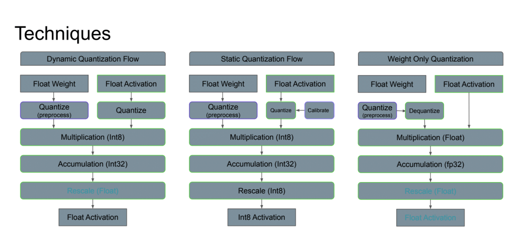

이 Slides는 동적 양자화, 정적 양자화, 가중치 전용 양자화 세 가지 다른 양자화 기술을 비교한다. 특히 정적 양자화 흐름에 대해(나머지 두 가지는 이미 설명했다):
- 가중치 전처리 양자화
- 활성화 양자화 전에 보정이 필요하다
- 곱셈 연산에 Int8 사용
- Int32 누적
- Int8로 재스케일

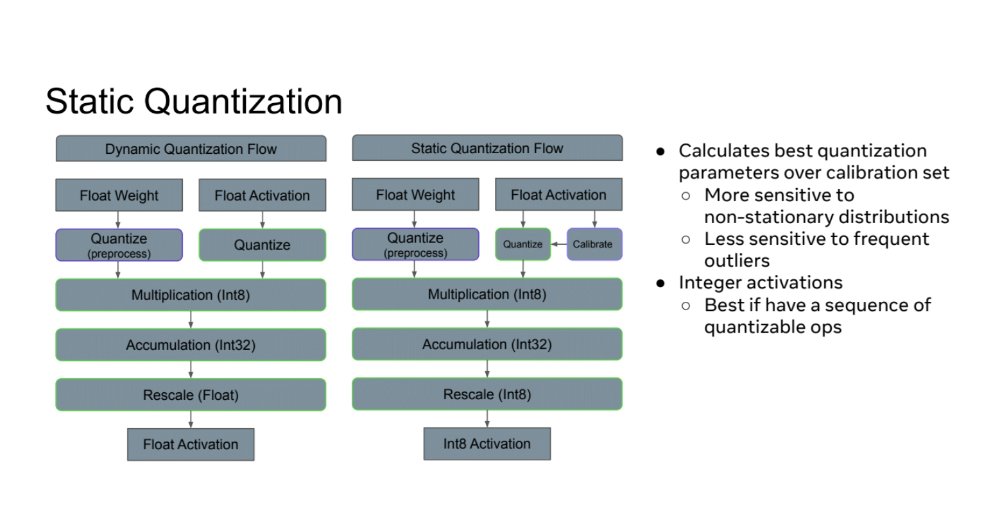

이 Slides는 정적 양자화(Static Quantization) 기술을 계속 소개하고 동적 양자화와 비교한다.
- 양자화 흐름 비교: 왼쪽은 동적 양자화 흐름, 오른쪽은 정적 양자화 흐름
- 정적 양자화의 특징: 보정 세트를 통해 최적 양자화 파라미터를 계산한다. 활성화의 양자화 파라미터를 결정하기 위한 보정 단계를 포함한다
- 정적 양자화의 장점: 비정상 분포에 더 민감하다(데이터 분포 변화에 더 잘 적응한다). 자주 발생하는 이상치에 덜 민감하다
- 정수 활성화: 정적 양자화는 정수 활성화(Int8 Activation)를 사용한다. 일련의 양자화 가능한 연산이 있는 경우에 가장 적합하다
- 계산 과정: 두 방법 모두 Int8 곱셈과 Int32 누적을 사용한다. 정적 양자화는 마지막 단계에서 Int8로 재스케일하고, 동적 양자화는 부동소수점으로 재스케일한다

또한 정적 양자화의 출력도 Float으로 Rescale할 수 있다.


### 정리

Lecture 7은 주로 CUDA와 Triton 기반 양자화 기술을 생성형 AI 모델에 적용하는 것을 소개했다. 내용에는 동적 양자화, 가중치 전용 양자화(int8/int4) 등 서로 다른 양자화 방법의 원리, 구현, 성능 비교와 Smoothquant, GPTQ 등 양자화 최적화 기술 소개가 포함된다. 동적 양자화와 int8/int4 weight only 양자화 구현 설명에서 저자는 이러한 시나리오에서 Triton 대 CUDA의 장단점을 분석했다. 예를 들어 int4 weight only의 경우 Triton 자체의 제한으로 이 CUDA kernel을 구현하기에 적합하지 않다. 또한 이러한 양자화에 대한 Torch Compiler의 최적화에 대해서도 많이 논의했다. 예를 들어 decode 단계의 GEMV는 컴파일러가 성능 향상을 위해 요소별 곱셈+리덕션의 특수 분기를 따르도록 한다. Lecture 7을 통해 양자화, CUDA/Triton/Torch Compiler의 응용에 대해 더 잘 이해할 수 있으며, 여유가 있는 독자는 원본 영상을 볼 것을 권장한다. 영상 말미의 QA 세션에도 흥미로운 질문과 견해가 있다.
