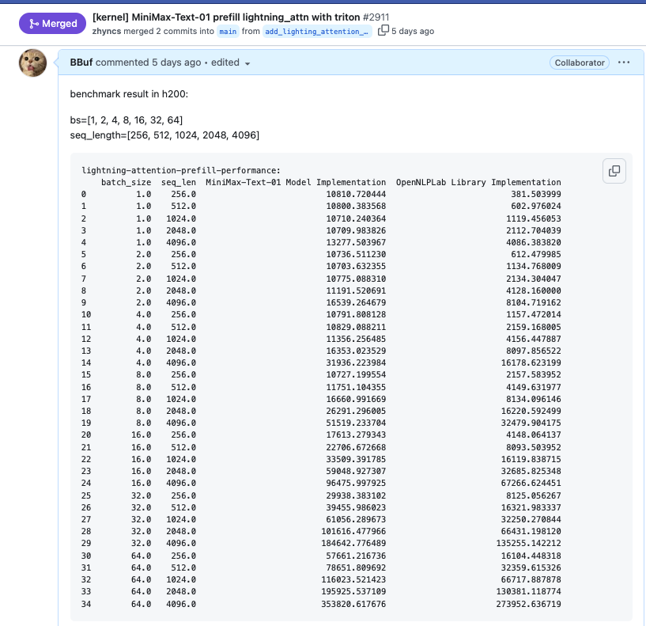
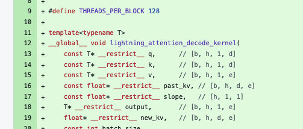
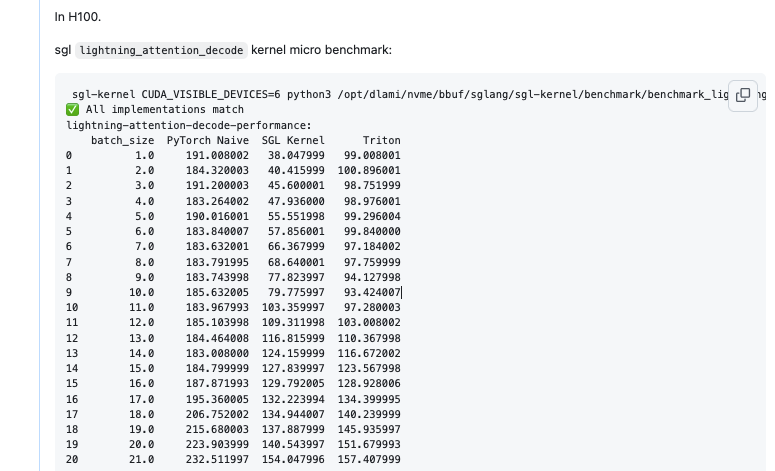
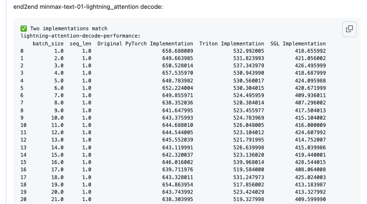
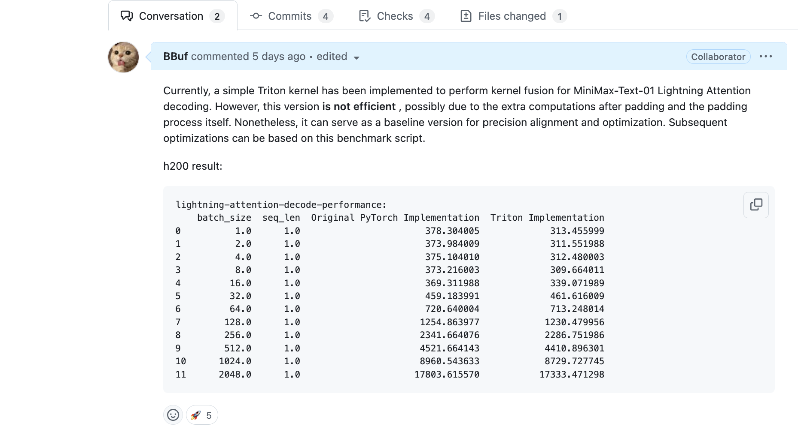
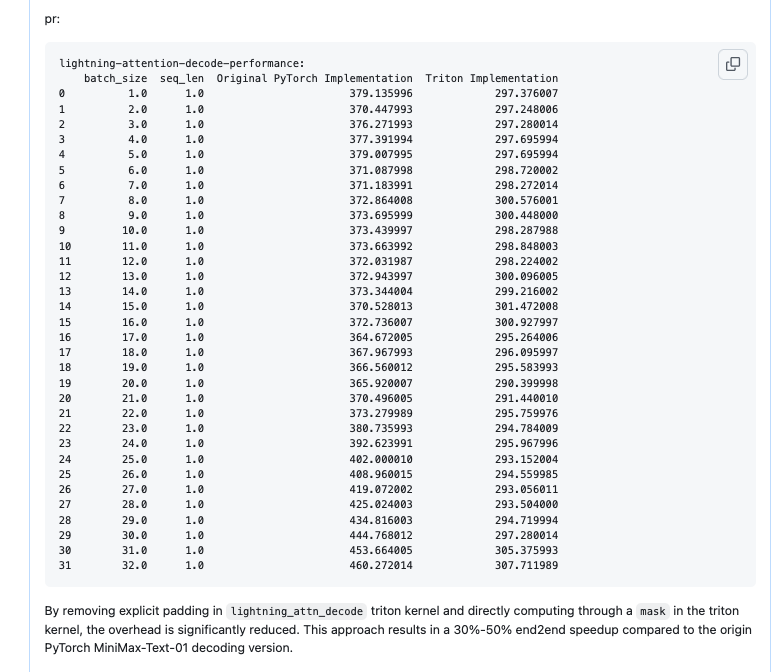
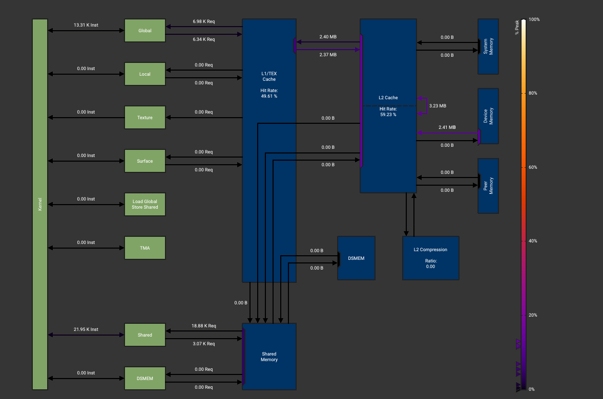
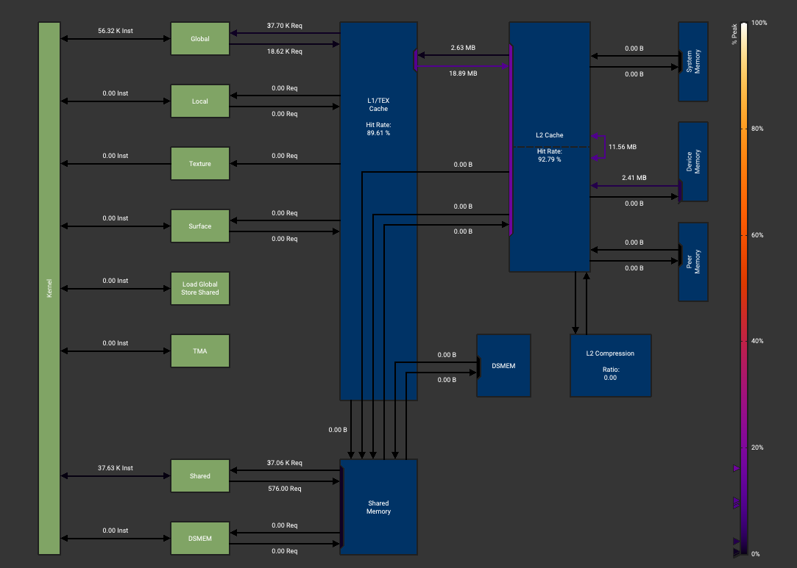

# NCU와 Cursor Claude-sonnet-3.5로 효율적인 CUDA operator를 작성하는 올바른 방법

> 내 강의 노트이며, 관심 있으면 팔로우해도 좋다: https://github.com/BBuf/how-to-optim-algorithm-in-cuda/tree/master/cuda-mode .

## 0x0. Preview

지난주 MiniMax가 4560억 parameter MoE large model을 open source했다. 눈에 띄는 점 중 하나는 이 model이 Lightning Attention과 Softmax Attention의 hybrid architecture라는 것이다. technical report link는 https://filecdn.minimax.chat/_Arxiv_MiniMax_01_Report.pdf 이다. 이 model에 대한 더 많은 detail은 관심 있는 독자에게 @sonta의 답변 https://www.zhihu.com/question/9630107500/answer/79882585725 를 추천한다.

Linear Attention 이야기가 나오면 나는 정신이 번쩍 든다. 작년에 RWKV architecture에 관심을 갖고 open-source contribution도 했으며, Linear Attention architecture의 algorithm principle과 inference advantage도 어느 정도 이해했다. 자세한 내용은 예전에 쓴 몇 편의 blog를 참고할 수 있다.

- [GPU에서 RWKV6 model의 Linear Attention 계산 가속하기](https://mp.weixin.qq.com/s/YXtvafdxB1rVeoy0qJmjyA)
- [flash-linear-attention의 fused_recurrent_rwkv6 Triton 구현 정독](https://mp.weixin.qq.com/s/H6wWBxwIJNCzkIlH_uIuiw)
- [flash-linear-attention의 Chunkwise parallel algorithm 이해](https://mp.weixin.qq.com/s/7utRk157_TFxF8gNRCyIyA)
- [hardware-efficient linear attention mechanism Gated Linear Attention paper reading](https://mp.weixin.qq.com/s/IVFeHK1ItPVzttmRRa7ycw)

SGLang inference framework에서 MiniMax Text01 model을 지원하려면 먼저 https://huggingface.co/MiniMaxAI/MiniMax-Text-01/blob/main/modeling_minimax_text_01.py 안의 `MiniMaxText01LightningAttention` module을 구현해야 한다. 이 부분이 바로 내가 잘하는 영역이다. 그래서 거의 주말 전체를 써서 SGLang 안에 `MiniMaxText01LightningAttention` module의 Prefill과 Decode process를 위한 optimized operator와 Benchmark를 만들었다. Prefill의 경우 benchmark만 만들었고, OpenNLPLab이 제공한 `lightning_attn2` Triton operator https://github.com/OpenNLPLab/lightning-attention/blob/main/lightning_attn/ops/triton/lightning_attn2.py 를 사용했다. 이 Triton operator는 HuggingFace original implementation 대비 Prefill end-to-end time을 몇 배 개선한다. 아래 screenshot을 참고할 수 있다.



Decode stage는 전형적인 memory-bound operator다. 이 operator의 Python code만 떼어내면 매우 간단하다. 이 글의 출발점도 바로 이 operator의 performance를 optimization하고 bandwidth utilization을 높이며 execution time을 줄이는 것이다. 이어서 Cursor와 NCU를 올바르게 결합해 CUDA optimization을 시도하는 방법을 보여준다.

먼저 이 operator의 PyTorch code는 다음 몇 줄로 작성할 수 있다.

```python
def lightning_attention_decode_naive(q, k, v, past_kv, slope):
    """Naive implementation of lightning attention decode"""
    original_dtype = q.dtype
    ratio = torch.exp(-slope)  # [h, 1, 1]

    kv = past_kv
    b, h, n, d = q.shape

    output = []
    for i in range(n):
        kv = ratio * kv.to(torch.float32) + torch.einsum(
            "... n d, ... n e -> ... d e",
            k[:, :, i : i + 1],
            v[:, :, i : i + 1],
        )
        qkv = torch.einsum(
            "... n e, ... e d -> ... n d",
            q[:, :, i : i + 1].to(torch.float32),
            kv.to(torch.float32),
        )
        output.append(qkv)
    output = torch.concat(output, dim=-2)

    return output.to(original_dtype), kv
```

input tensor shape는 아래 screenshot과 같다.



내 목표는 이 kernel을 optimization해서 bandwidth utilization을 최대한 높이고 kernel time을 줄이는 것이다. 전체적으로 나는 Cursor의 도움을 받아 Triton kernel 2개 version과 CUDA kernel 몇 개 version을 작성했다. 최종적으로 `lightning_attention_decode` operator의 micro benchmark와 end-to-end Lightning Attention module time 모두 original PyTorch implementation 대비 speedup을 얻었다. operator 기준으로는 batch가 작을 때 최대 2배 speedup에 도달할 수 있다.





상세 data는 https://github.com/sgl-project/sglang/pull/3030 을 참고하면 된다.

마지막으로 이 kernel에는 아직 매우 큰 개선 여지가 있다. 하지만 이것이 이 글의 중점은 아니다. 중점은 다음 절에서 내가 Cursor+NCU를 함께 사용해 CUDA kernel을 어떻게 optimize했는지 보여주는 것이다. Cursor에서 최신 Claude-3.5-sonnet-20241022를 사용해 성능 좋은 CUDA kernel을 바로 작성하려 한다면, 내 사용 기록상 매우 어렵다. large model은 bank conflict도 피하지 못하고, memory access coalescing도 해주지 않으며, 대부분의 경우 매우 비효율적인 Python 직역 CUDA code를 작성한다. 다만 Cursor의 Claude-3.5-sonnet-20241022는 multimodal 기능이 있어 image를 이해할 수 있다. 그래서 NCU의 핵심 profile 정보를 보여주고, 수동 reinforcement learning처럼 feedback을 줄 수 있다. 잠시 뒤 NCU 결과를 이용해 Cursor를 더 똑똑하게 만들고 원하는 optimized code를 쓰게 하는 방법을 보여준다.

## 0x1. Practical version

### 0x1.1 Triton naive version

kernel code: https://github.com/sgl-project/sglang/pull/2920/files#diff-16ed66afc4b7f52545a3fffd55c9fd6daaf87189d9a0d252fccba42951c1cc40R14-R105



먼저 가장 naive한 version이다. q, k, v의 각 head마다 block 하나를 사용해 계산한다. 즉 총 `$b\times h$` block이 있고, 각 head dimension은 Triton kernel 계산 요구를 만족하도록 92에서 128로 padding된다.

위 performance result를 보면 original PyTorch implementation과 거의 차이가 없다.

### 0x1.2 Triton optimized version

https://github.com/sgl-project/sglang/pull/2966



위 naive Triton kernel 앞에 있던 manual padding to 128을 제거하고, kernel 안에서 mask로 dim dimension이 power-of-2에 align되지 않는 문제를 해결했다. 위 result에서 Lightning Attention module end-to-end time이 실제로 조금 내려간 것을 볼 수 있다.

### 0x1.3 CUDA version

위 몇 줄의 Lightning Attention Decode Python code를 Cursor Sonnet 3.5 20241022 model에 그대로 던지면 빠르게 CUDA kernel 하나를 만들어낸다.

```c++
#define THREADS_PER_BLOCK 128

template<typename T>
__global__ void lightning_attention_decode_kernel(
    const T* __restrict__ q,      // [b, h, 1, d]
    const T* __restrict__ k,      // [b, h, 1, d]
    const T* __restrict__ v,      // [b, h, 1, e]
    const float* __restrict__ past_kv, // [b, h, d, e]
    const float* __restrict__ slope,   // [h, 1, 1]
    T* __restrict__ output,       // [b, h, 1, e]
    float* __restrict__ new_kv,   // [b, h, d, e]
    const int batch_size,
    const int num_heads,
    const int dim,
    const int embed_dim) {
    
    const int32_t tid = threadIdx.x;
    const int32_t current_head = blockIdx.x;
    const int32_t b = current_head / num_heads;
    const int32_t h = current_head % num_heads;
    
    if (b >= batch_size) return;
    
    const int32_t qk_offset = b * num_heads * dim + h * dim;
    const int32_t v_offset = b * num_heads * embed_dim + h * embed_dim;
    const int32_t kv_offset = b * num_heads * dim * embed_dim + h * dim * embed_dim;
    
    // 1. Compute new kv: new_kv = ratio * past_kv + k * v^T
    const float ratio = expf(-1.0f * slope[h]);
    for (int d = tid; d < dim; d += THREADS_PER_BLOCK) {
        T k_value = k[qk_offset + d];
        for (int e = 0; e < embed_dim; e++) {
            const int32_t kv_index = kv_offset + d * embed_dim + e;
            new_kv[kv_index] = ratio * past_kv[kv_index] + k_value * v[v_offset + e];
        }
    }
    
    __syncthreads();  // Ensure all threads have finished computing new_kv.
    
    // 2. Compute qkv attention output: output = q * new_kv
    for (int e = tid; e < embed_dim; e += THREADS_PER_BLOCK) {
        float sum = 0.0f;
```

하지만 benchmark를 돌려보면 이 kernel version은 Triton operator보다 약 5배 느리다.

performance 차이의 원인을 찾는 가장 확실한 방법은 NCU result를 분석하는 것이다. 아래 profile script를 작성했다.

```python
import math
import torch
import triton
import triton.language as tl
from sgl_kernel import lightning_attention_decode


def next_power_of_2(n):
    return 2 ** (int(math.ceil(math.log(n, 2))))

@triton.jit
def _decode_kernel(
    Q,
    K,
    V,
    KV,
    Out,
    S,
    b: tl.constexpr,
    h: tl.constexpr,
    n: tl.constexpr,
    d: tl.constexpr,
    d_original: tl.constexpr,
    e: tl.constexpr,
    e_original: tl.constexpr,
):
    off_bh = tl.program_id(0)
    off_h = off_bh % h

    qk_offset = off_bh * n * d
    v_offset = off_bh * n * e
    o_offset = off_bh * n * e
    kv_offset = off_bh * d * e

    s = tl.load(S + off_h)
    ratio = tl.exp(-s)

    d_idx = tl.arange(0, d)
    e_idx = tl.arange(0, e)

    # Create masks for original dimensions
    d_mask = d_idx < d_original
    e_mask = e_idx < e_original

    # Load with masking
    q = tl.load(Q + qk_offset + d_idx, mask=d_mask, other=0.0)
    k = tl.load(K + qk_offset + d_idx, mask=d_mask, other=0.0)
    v = tl.load(V + v_offset + e_idx, mask=e_mask, other=0.0)

    # Load KV with 2D masking
    kv = tl.load(
        KV + kv_offset + d_idx[:, None] * e + e_idx[None, :],
        mask=(d_mask[:, None] & e_mask[None, :]),
        other=0.0,
    )

    # Compute outer product using element-wise operations
    k_v_prod = k[:, None] * v[None, :]
    kv = ratio * kv + k_v_prod

    # Store KV with 2D masking
    tl.store(
        KV + kv_offset + d_idx[:, None] * e + e_idx[None, :],
        kv.to(KV.dtype.element_ty),
        mask=(d_mask[:, None] & e_mask[None, :]),
    )

    # Compute matrix-vector multiplication using element-wise operations and reduction
    o = tl.sum(q[:, None] * kv, axis=0)

    # Store output with masking
    tl.store(Out + o_offset + e_idx, o.to(Out.dtype.element_ty), mask=e_mask)
```

~~~python
def triton_lightning_attn_decode(q, k, v, kv, s):
    """Triton implementation of Lightning Attention decode operation"""
    b, h, n, d = q.shape
    e = v.shape[-1]
    assert n == 1, "Sequence length must be 1 in decode mode"

    # Get padded dimensions (power of 2)
    d_padded = next_power_of_2(d)
    e_padded = next_power_of_2(e)

    # Create output tensor (padded)
    o_padded = torch.empty(b, h, n, e_padded, dtype=v.dtype, device=v.device)

    # Create padded tensors without actually padding the data
    q_padded = torch.empty(b, h, n, d_padded, dtype=q.dtype, device=q.device)
    k_padded = torch.empty(b, h, n, d_padded, dtype=k.dtype, device=k.device)
    v_padded = torch.empty(b, h, n, e_padded, dtype=v.dtype, device=v.device)
    kv_padded = torch.empty(
        b, h, d_padded, e_padded, dtype=torch.float32, device=kv.device
    )

    # Copy data to padded tensors
    q_padded[..., :d] = q
    k_padded[..., :d] = k
    v_padded[..., :e] = v
    kv_padded[..., :d, :e] = kv

    # Launch kernel
    grid = (b * h, 1)
    _decode_kernel[grid](
        q_padded,
        k_padded,
        v_padded,
        kv_padded,
        o_padded,
        s,
        b=b,
        h=h,
        n=n,
        d=d_padded,
        d_original=d,
        e=e_padded,
        e_original=e,
    )

    # Get unpadded outputs
    o = o_padded[..., :e]
    kv_out = kv_padded[..., :d, :e]

    return o, kv_out

dtype = torch.bfloat16
device = torch.device("cuda")
num_heads = 64
head_dim = 96
seq_len = 1
batch_size = 1

q = torch.randn(batch_size, num_heads, seq_len, head_dim, device=device, dtype=dtype)
k = torch.randn(batch_size, num_heads, seq_len, head_dim, device=device, dtype=dtype)
v = torch.randn(batch_size, num_heads, seq_len, head_dim, device=device, dtype=dtype)
past_kv = torch.randn(batch_size, num_heads, head_dim, head_dim, device=device)
slope = torch.randn(num_heads, 1, 1, device=device)

output_triton, new_kv_triton = triton_lightning_attn_decode(q.clone(), k.clone(), v.clone(), past_kv.clone(), slope.clone())

output_kernel = torch.empty_like(output_triton)
new_kv_kernel = torch.empty_like(new_kv_triton)
lightning_attention_decode(
    q.clone(), k.clone(), v.clone(), past_kv.clone(), slope.clone(),
    output_kernel, new_kv_kernel
)

print('end')
~~~

그리고 다음을 실행한다. ` /usr/local/NVIDIA-Nsight-Compute-2024.3/ncu --set full -o lightning_attention_decode_bs=1 python3 test_lighting_attention.py`

NCU file을 얻은 뒤에는 Memory Workload Analysis column을 중점적으로 보면 된다.

Triton version:



CUDA version:



주요 차이는 두 가지다. 첫째, CUDA version은 shared memory를 사용해 read/write를 가속하지 않는다. 둘째, Triton version은 global memory로 write back하는 data volume이 훨씬 작다.

이제 Cursor에게 shared memory version 작성을 도와달라고 할 수 있다. q, k, v와 new_kv 계산을 모두 shared memory 안에 넣는 방식이다. Cursor는 실제로 작성할 수 있다. 하지만 bank conflict가 존재하는지 지적하지 않으면 신경 쓰지 않는다. 그 결과 Cursor가 구현한 첫 shared memory version은 처음의 global memory read/write version보다 kernel execution time이 4배 더 느렸다. 여기서는 code를 붙이지 않는다. 다음으로 Cursor에게 bank conflict가 있다는 점을 수동으로 설명해야 한다. 주로 `new_kv_shared`를 계산할 때 많은 bank conflict가 발생하므로, padding을 수행해 bank conflict를 피하라고 요구한다. 그러면 Cursor는 겉보기에 정상적인 code를 작성할 수 있다.

```c++
#define THREADS_PER_BLOCK 128

template<typename T>
__global__ void lightning_attention_decode_kernel(
    const T* __restrict__ q,      // [b, h, 1, d]
    const T* __restrict__ k,      // [b, h, 1, d]
    const T* __restrict__ v,      // [b, h, 1, e]
    const float* __restrict__ past_kv, // [b, h, d, e]
    const float* __restrict__ slope,   // [h, 1, 1]
    T* __restrict__ output,       // [b, h, 1, e]
    float* __restrict__ new_kv,   // [b, h, d, e]
    const int batch_size,
    const int num_heads,
    const int dim,
    const int embed_dim) {
    
    extern __shared__ char smem[]; // Dynamic shared memory declaration
    // Allocate space in shared memory for all arrays.
    T* q_shared = reinterpret_cast<T*>(smem);
    T* k_shared = reinterpret_cast<T*>(smem + dim * sizeof(T));
    T* v_shared = reinterpret_cast<T*>(smem + 2 * dim * sizeof(T));
    float* new_kv_shared = reinterpret_cast<float*>(smem + (2 * dim + embed_dim) * sizeof(T));
    T* output_shared = reinterpret_cast<T*>(smem + (2 * dim + embed_dim) * sizeof(T) + dim * (embed_dim + 1) * sizeof(float));
    
    const int32_t tid = threadIdx.x;
    const int32_t current_head = blockIdx.x;
    const int32_t b = current_head / num_heads;
    const int32_t h = current_head % num_heads;
    
    if (b >= batch_size) return;
    
    const int32_t qk_offset = b * num_heads * dim + h * dim;
    const int32_t v_offset = b * num_heads * embed_dim + h * embed_dim;
    const int32_t kv_offset = b * num_heads * dim * embed_dim + h * dim * embed_dim;

    for (int d = tid; d < dim; d += blockDim.x) {
        q_shared[d] = q[qk_offset + d];
        k_shared[d] = k[qk_offset + d];
    }
    for (int e = tid; e < embed_dim; e += blockDim.x) {
        v_shared[e] = v[v_offset + e];
    }
    
    __syncthreads();
    
    const float ratio = expf(-1.0f * slope[h]);

    for (int d = tid; d < dim; d += blockDim.x) {
        T k_val = k_shared[d];
        for (int e = 0; e < embed_dim; ++e) {
            int past_kv_idx = kv_offset + d * embed_dim + e;
            T v_val = v_shared[e];
            float new_val = ratio * past_kv[past_kv_idx] + k_val * v_val;
            int shared_idx = d * (embed_dim + 1) + e;
            new_kv_shared[shared_idx] = new_val;
        }
    }
    
    __syncthreads();
    
    for (int idx = tid; idx < dim * embed_dim; idx += blockDim.x) {
        int d = idx / embed_dim;
        int e = idx % embed_dim;
        int shared_idx = d * (embed_dim + 1) + e;
        int global_idx = kv_offset + idx;
        new_kv[global_idx] = new_kv_shared[shared_idx];
    }
    
    __syncthreads();
    
    for (int e = tid; e < embed_dim; e += blockDim.x) {
        float sum = 0.0f;
        for (int d = 0; d < dim; ++d) {
            int shared_idx = d * (embed_dim + 1) + e;
            sum += q_shared[d] * new_kv_shared[shared_idx];
        }
        output_shared[e] = static_cast<T>(sum);
    }
    
    __syncthreads();
    
    if (tid == 0) {
        for (int e = 0; e < embed_dim; ++e) {
            output[v_offset + e] = output_shared[e];
        }
    }
}
```

하지만 benchmark를 해보면 이 version은 `bs<=4`에서는 Triton보다 꽤 빠르지만, bs가 계속 커지면 점점 느려져 Triton의 2-3배 execution time이 된다.

다시 NCU의 Memory Workload Analysis를 열어보면 이번에는 global memory write가 contiguous하지 않아 performance가 떨어진다는 문제가 나온다.


이 result를 Cursor에게 feedback하면 Cursor는 주요 문제가 `new_kv`를 write할 때 inner loop `for (int e = 0; e < embed_dim; ++e)` 때문에 thread들이 global memory에 접근할 때 stride가 너무 커지고, memory access가 coalesced되지 않으며, 각 thread가 global memory를 여러 번 write해 memory transaction 수가 늘어난다는 점을 알 수 있다. 이것이 이 kernel이 global memory write에서 Triton보다 몇 배 더 많은 traffic을 보인 이유다. 원인을 알면 Cursor는 올바른 code로 고칠 수 있다. code는 다음과 같다.

```c++
#define THREADS_PER_BLOCK 128

template<typename T>
__global__ void lightning_attention_decode_kernel(
    const T* __restrict__ q,      // [b, h, 1, d]
    const T* __restrict__ k,      // [b, h, 1, d]
    const T* __restrict__ v,      // [b, h, 1, e]
    const float* __restrict__ past_kv, // [b, h, d, e]
    const float* __restrict__ slope,   // [h, 1, 1]
    T* __restrict__ output,       // [b, h, 1, e]
    float* __restrict__ new_kv,   // [b, h, d, e]
    const int batch_size,
    const int num_heads,
    const int dim,
    const int embed_dim) {
    
    extern __shared__ char smem[]; // Dynamic shared memory declaration
    // Allocate space in shared memory for all arrays.
    T* q_shared = reinterpret_cast<T*>(smem);
    T* k_shared = reinterpret_cast<T*>(smem + dim * sizeof(T));
    T* v_shared = reinterpret_cast<T*>(smem + 2 * dim * sizeof(T));
    float* new_kv_shared = reinterpret_cast<float*>(smem + (2 * dim + embed_dim) * sizeof(T));
    T* output_shared = reinterpret_cast<T*>(smem + (2 * dim + embed_dim) * sizeof(T) + dim * (embed_dim + 1) * sizeof(float));
    
    const int32_t tid = threadIdx.x;
    const int32_t current_head = blockIdx.x;
    const int32_t b = current_head / num_heads;
    const int32_t h = current_head % num_heads;
    
    if (b >= batch_size) return;
    
    const int32_t qk_offset = b * num_heads * dim + h * dim;
    const int32_t v_offset = b * num_heads * embed_dim + h * embed_dim;
    const int32_t kv_offset = b * num_heads * dim * embed_dim + h * dim * embed_dim;

    for (int d = tid; d < dim; d += blockDim.x) {
        q_shared[d] = q[qk_offset + d];
        k_shared[d] = k[qk_offset + d];
    }
    for (int e = tid; e < embed_dim; e += blockDim.x) {
        v_shared[e] = v[v_offset + e];
    }
    
    __syncthreads();
    
    const float ratio = expf(-1.0f * slope[h]);

    for (int d = tid; d < dim; d += blockDim.x) {
        T k_val = k_shared[d];
        for (int e = 0; e < embed_dim; ++e) {
            int past_kv_idx = kv_offset + d * embed_dim + e;
            T v_val = v_shared[e];
            float new_val = ratio * past_kv[past_kv_idx] + k_val * v_val;
            int shared_idx = d * (embed_dim + 1) + e;
            new_kv_shared[shared_idx] = new_val;
        }
    }
    
    __syncthreads();
    
    for (int idx = tid; idx < dim * embed_dim; idx += blockDim.x) {
        int d = idx / embed_dim;
        int e = idx % embed_dim;
        int shared_idx = d * (embed_dim + 1) + e;
        int global_idx = kv_offset + idx;
        new_kv[global_idx] = new_kv_shared[shared_idx];
    }
    
    __syncthreads();
    
    for (int e = tid; e < embed_dim; e += blockDim.x) {
        float sum = 0.0f;
        for (int d = 0; d < dim; ++d) {
            int shared_idx = d * (embed_dim + 1) + e;
            sum += q_shared[d] * new_kv_shared[shared_idx];
        }
        output_shared[e] = static_cast<T>(sum);
    }
    
    __syncthreads();
    
    if (tid == 0) {
        for (int e = 0; e < embed_dim; ++e) {
            output[v_offset + e] = output_shared[e];
        }
    }
}
```

여기서는 `new_kv` memory access pattern을 refactor해 adjacent threads가 contiguous memory address에 접근하도록 했고, memory coalescing을 달성했다.

이 kernel에는 여전히 많은 optimization space가 있다. 예를 들어 block 하나에 실제로 일하지 않는 warp가 하나 있다. block은 128 threads인데 `dim=96`이므로, warp 하나가 row 하나를 처리하는 version으로 바꿀 수 있다. 또한 vectorized load를 사용하지 않아 memory transaction을 더 줄일 여지도 있다.

하지만 kernel micro benchmark와 end-to-end Lightning Attention module benchmark 결과를 보면, 이미 Triton optimized version을 넘어섰고 각 batch에서 우위를 얻었다.

## 0x3. 정리

MiniMax Lightning Attention Decode operator를 바탕으로 Cursor Claude-sonnet-3.5-20241022 같은 최신 large model이 현재 CUDA low-level optimization code를 작성할 때 갖는 한계를 보여주었다. 또한 이런 tool을 사용하려면 어떤 식으로 수동 feedback을 주어야 실제로 올바르게 동작하게 할 수 있는지도 보여주었다. AI가 생성한 어떤 code도 쉽게 믿지 말아야 한다. 특히 optimization 관련 code라면 더더욱 그렇다.


