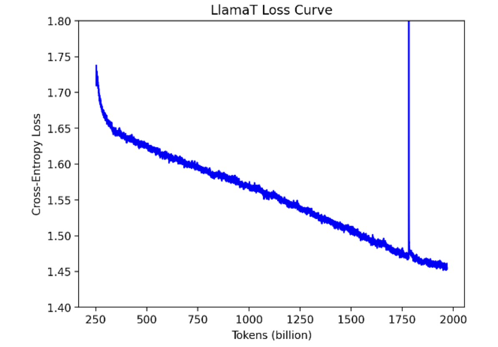
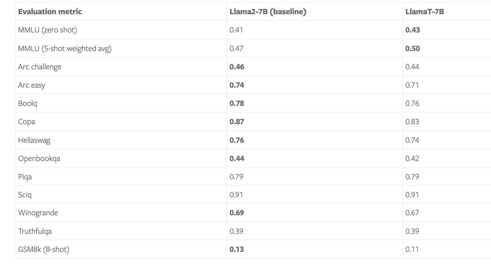
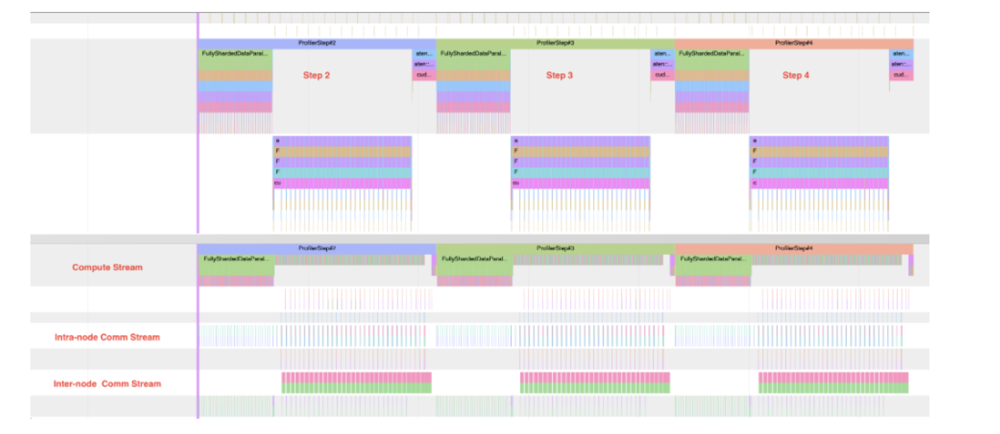
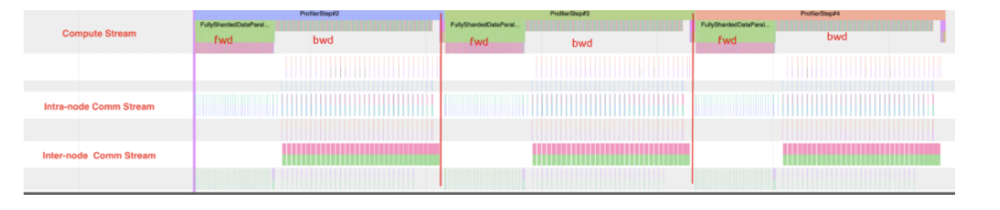

> 블로그 링크: https://pytorch.org/blog/maximizing-training/ . 이 블로그는 IBM의 PyTorch team과 Meta의 PyTorch team이 작성했습니다. 현재 Torch도 training infra에서 지속적으로 발전하고 있으며, DeepSpeed나 Megatron-LM 외에도 PyTorch의 FSDP를 선택해 72B급 이하의 더 큰 모델을 학습할 수 있습니다. 이 블로그는 FSDP 기반으로 7B/13B/34B/70B 모델을 A100/H100에서 효율적으로 학습하는 방법을 소개하며, 모든 코드는 https://github.com/foundation-model-stack/fms-fsdp 에 공개되어 있습니다. 이 블로그에서 소개한 pretrain과 SFT training 외에도, source에는 HF conversion script가 제공되어 이 training model이 Hugging Face ecosystem의 post-training tool을 사용할 수 있습니다.

이 블로그에서는 FSDP의 scalability를 보여줍니다. 예시로 2T token을 학습한 7B pretraining example을 들고, GPU당 3,700 tokens/sec의 빠른 training speed를 달성하기 위해 사용한 다양한 technique을 공유합니다. 이는 128개 A100 GPU에서 하루 40B token을 처리하는 수준입니다. 이는 57% model FLOPS utilization(MFU) 및 hardware FLOPS utilization(HFU)에 해당합니다. 또한 FSDP가 512 GPU까지 확장될 때 거의 linear하게 증가하는 것을 관찰했습니다. 이는 이 방법을 사용하면 512 GPU에서 7B model을 2T token까지 학습하는 데 2주가 채 걸리지 않는다는 뜻입니다.

IBM 연구원들은 Meta Llama 2 7B architecture를 2T token으로 학습했으며, 이를 LlamaT(est)라고 부릅니다. 이 model은 다양한 academic benchmark에서 Llama 2와 비슷한 model quality를 보였습니다. 모든 training code(https://github.com/foundation-model-stack/fms-fsdp)와 이 throughput을 달성한 방법은 이 블로그에서 확인할 수 있습니다. 또한 Llama 2 model에 적용할 수 있는 configuration parameter를 공유합니다. A100과 H100에 대해 7B, 13B, 34B, 70B model용입니다.

이 과정에서 우리는 FSDP에 적용할 새로운 selective activation checkpointing mechanism도 제안했습니다. 이를 통해 out-of-the-box FSDP보다 10% performance improvement를 얻었습니다. 이 throughput을 구현하는 방법으로 training codebase(https://github.com/foundation-model-stack/fms-fsdp)와 관련 scalable data loader를 open source로 공개했습니다.

PyTorch native training path의 핵심 장점 중 하나는 여러 hardware backend에서 seamless하게 training할 수 있다는 점입니다. 예를 들어 최근 AllenAI가 OLMo로 공개한 end-to-end training stack도 PyTorch FSDP를 활용해 AMD와 NVIDIA GPU에서 training합니다. 우리는 throughput을 달성하기 위해 FSDP의 세 가지 주요 component를 활용했습니다.

- SDPA Flash attention(https://pytorch.org/tutorials/intermediate/scaled_dot_product_attention_tutorial.html): fused attention kernel과 효율적인 attention compute를 지원합니다.
- compute와 communication overlap은 GPU를 더 잘 활용하도록 합니다(https://engineering.fb.com/2021/07/15/open-source/fsdp/).
- Selective activation checkpointing(https://arxiv.org/pdf/2205.05198)은 GPU memory와 compute 사이의 trade-off를 가능하게 합니다.

IBM은 Meta의 PyTorch team과 거의 2년 동안 PyTorch FSDP(https://arxiv.org/abs/2304.11277)를 협업했습니다. Ethernet interconnect에서 더 나은 throughput을 얻기 위한 rate limiter(https://pytorch.org/blog/scaling-pytorch-fsdp-for-training-foundation-models-on-ibm-cloud/), checkpointing 시간을 한 자릿수 order만큼 개선한 distributed checkpointing(https://pytorch.org/blog/performant-distributed-checkpointing/), 그리고 FSDP hybrid sharding mode를 위한 초기 checkpointing version을 도입했습니다. 작년 말에는 FSDP로 model 하나를 end-to-end로 training했습니다.

## Training details

7B model은 128개 A100 GPU에서 training했으며, network bandwidth는 400Gbps이고 GPU Direct RDMA를 사용했습니다. attention compute에는 SDPA FlashAttention v2를 사용했습니다. 이 model에서는 batch size를 제한하는 activation checkpointing을 껐고, 이것이 가장 높은 throughput을 제공했습니다. 128개 GPU의 batch size는 batch당 100만 token이며, activation checkpointing과 비교해 throughput이 약 10% 향상되었습니다. 이 parameter를 사용해 compute와 communication의 거의 완전한 overlap을 달성했습니다. 32-bit AdamW optimizer를 사용했고, beta1은 0.9, beta2는 0.95, weight decay는 0.1입니다. learning rate는 최종적으로 3e-5이며, maximum learning rate 3e-4까지 warmup한 뒤 2T token 동안 cosine schedule로 3e-5까지 낮췄습니다. training은 내부 dataset에서 mixed precision bf16으로 수행했습니다. training stack은 IBM의 Foundation Model Stack(https://github.com/foundation-model-stack/foundation-model-stack/blob/main/fms/models/llama.py)을 model architecture로 사용했고, FSDP와 SDPA에는 PyTorch 2.2 release 이후의 nightly build를 사용했습니다. 2023년 11월부터 2024년 2월 사이에 여러 nightly build를 시도했고, throughput 향상을 관찰했습니다.

### Selective activation checkpointing

우리는 간단한 selective activation checkpointing(AC) mechanism을 함께 구현했습니다. FSDP에서 흔한 practice는 transformer block마다 checkpointing하는 것입니다. 간단한 확장은 매 _n_개 block마다 checkpointing하고 recompute 양을 줄이는 대신 필요한 memory를 늘리는 것입니다. 이는 13B model size에서 매우 효과적이었고 throughput을 10% 높였습니다. 7B model size에서는 activation checkpointing이 전혀 필요하지 않았습니다. FSDP의 future version은 operator level selective activation checkpointing을 제공해 최적의 compute-memory trade-off를 구현할 것입니다. 위 code는 여기(https://github.com/foundation-model-stack/fms-fsdp/blob/main/fms_fsdp/policies/ac_handler.py)에 구현되어 있습니다.


```python
from functools import partial

from torch.distributed.algorithms._checkpoint.checkpoint_wrapper import (
    CheckpointImpl,
    apply_activation_checkpointing,
    checkpoint_wrapper,
)

# non-reentrant checkpoint wrapper 생성
non_reentrant_wrapper = partial(
    checkpoint_wrapper,
    checkpoint_impl=CheckpointImpl.NO_REENTRANT,
)

def apply_fsdp_checkpointing(model, block, p):
    """
    selective activation checkpointing을 적용한다.

    선택성은 percentage p로 정의된다. 즉 전체 block 수 중 p 비율에 activation checkpointing을 적용한다.
    p는 [0, 1] 범위의 float이다.

    몇 가지 예:
    p = 0: 모든 block에 activation checkpointing을 적용하지 않는다. `fsdp_activation_checkpointing=False`와 같다.
    p = 1: 모든 block에 activation checkpointing을 적용한다. 즉 "full activation checkpointing"이다.
    p = 1/2: [activation checkpointing, no activation checkpointing, activation checkpointing, no activation checkpointing, ...]
    p = 1/3: [no activation checkpointing, activation checkpointing, no activation checkpointing, no activation checkpointing, activation checkpointing, no activation checkpointing, ...]
    p = 2/3: [activation checkpointing, no activation checkpointing, activation checkpointing, activation checkpointing, no activation checkpointing, activation checkpointing, ...]
    block은 homogeneous하므로 activation checkpointing block이 모든 block에 균등하게 분포하도록 한다.

    구현:
    주어진 activation checkpointing ratio p에 대해, 본질적으로 매 "1/p"개 block마다 activation checkpointing을 적용해야 한다.
    첫 activation checkpointing block은 빠르면 0번째 block일 수 있고 늦으면 "1/p"번째 block일 수 있다. 우리는 중간값인 (0.5p)번째 block을 선택한다.
    따라서 본질적으로 다음 block에 activation checkpointing을 적용한다.
    (0.5/p)번째 block, (1.5/p)번째 block, (2.5/p)번째 block 등이다. 물론 이 값들은 integer로 round된다.
    activation checkpointing은 recursive하게 적용되므로, code에서는 다음 math method를 사용해 해당 block에 activation checkpointing을 적용할 수 있다.
    """
    block_idx = 0
    cut_off = 1 / 2
    # p가 fraction으로 전달될 때(예: 1/3), argv에서는 string으로 해석된다.
    # 따라서 여기서 fraction에 eval("1/3")을 사용해야 한다.
    p = eval(p) if isinstance(p, str) else p

    def selective_checkpointing(submodule):
        nonlocal block_idx
        nonlocal cut_off

        if isinstance(submodule, block):
            block_idx += 1
            if block_idx * p >= cut_off:
                cut_off += 1
                return True
        return False

    apply_activation_checkpointing(
        model,
        checkpoint_wrapper_fn=non_reentrant_wrapper,
        check_fn=selective_checkpointing,
    )
```

### Throughput 및 MFU, HFU 계산

우리는 7B model만 2T token까지 training했지만, 다른 model size에 대해서도 best configuration option을 제공하기 위해 많은 experiment를 수행했습니다. 아래 표는 두 infrastructure의 결과를 요약합니다. 하나는 128개 GPU와 400Gbps inter-node interconnect를 가진 A100 cluster이고, 다른 하나는 96개 GPU와 800Gbps inter-node interconnect를 가진 H100 cluster입니다.

| 모델 크기 | 배치 크기 | activation checkpointing | Throughput tokens/sec/GPU (A100 80GB 및 400Gbps interconnect) | MFU % (A100 80GB) | HFU % (A100 80GB) | Throughput tokens/sec/GPU (H100 80GB 및 800Gbps interconnect) | MFU % (H100 80GB) | HFU % (H100 80GB) |
|---------|---------|------------|-------------------------------------------------|------------------|------------------|-------------------------------------------------|------------------|------------------|
| 7B | 2 | 아니오 | 3700 | 0.57 | 0.57 | 7500 | 0.37 | 0.37 |
| 13B | 2 | 선택적 | 1800 | 0.51 | 0.59 | 3800 | 0.35 | 0.40 |
| 34B | 2 | 예 | 700 | 0.47 | 0.64 | 1550 | 0.32 | 0.44 |
| 70B | 2 | 예 | 370 | 0.50 | 0.67 | 800 | 0.34 | 0.45 |

표 1: A100 및 H100 GPU에서 여러 model size의 model FLOPS utilization과 hardware FLOPS utilization

HFU 값은 PyTorch FLOP counter(https://github.com/pytorch/pytorch/blob/2240018c03744ee34ea14ad53481db934c37e384/torch/utils/flop_counter.py#L336)와 A100, H100 GPU의 theoretical bf16 performance로 계산했으며, MFU 값은 NanoGPT(https://github.com/karpathy/nanoGPT)와 PaLM paper에서 설명한 방법으로 계산했습니다. 또한 큰 model에 대해서는 GPU당 batch size를 의도적으로 2로 유지했습니다. 이는 4k sequence length model training에서의 선택을 모방하고, popular한 4M tokens batch size를 넘지 않으면서 최대 512 GPU까지 scale하기 위한 것입니다. 이 규모를 넘으면 tensor parallel이나 sequence parallel을 사용해야 합니다.

위 표에서 A100의 경우 activation checkpointing은 MFU를 낮추지만 HFU를 높입니다! 더 나은 activation checkpointing scheme이 도입되면 MFU가 증가해 HFU를 따라잡을 것으로 예상합니다. 그러나 H100에서는 MFU와 HFU가 모두 상대적으로 낮았습니다. H100의 PyTorch performance analysis trace를 분석한 결과 network "peeking" 때문에 10% gap이 있음을 발견했습니다. 또한 H100의 HBM bandwidth가 H100에서 HFU/MFU를 낮추는 원인으로 추정합니다. H100은 이론적으로 A100보다 3배 빠르지만(312 vs 989 TFLOPS), HBM bandwidth는 A100의 2배 미만(2.0 vs 3.35 TBps)이기 때문에 3배 performance improvement를 얻을 수 없습니다. H100에서 70B model의 performance parameter를 개선하기 위해 tensor parallel 같은 다른 configuration option도 시도할 계획입니다.

## Model details

training loss curve는 아래 그림과 같습니다.



그림 1: LlamaT training loss curve

2T checkpoint는 repository에서 제공하는 script를 통해 Hugging Face format으로 변환했고, 이후 lm-evaluation-harness를 사용해 주요 academic benchmark를 계산했습니다. 비교를 위해 Llama2-7B에서도 실행했습니다. 이러한 결과는 아래 표에 담겨 있습니다.



표 1: LM evaluation harness score

이 model은 Llama2와 비교해 competitive한 성능을 보였습니다(더 bold인 값이 더 좋음).

## Training log

training process는 전반적으로 안정적이었고 crash는 없었지만, 몇 가지 작은 문제를 관찰했습니다.

**0-200B tokens**: iteration time(training step 하나를 수행하는 데 필요한 시간)이 느려지는 것을 관찰했습니다. data loader가 slowdown을 일으키지 않는지, checkpointing operation이 효율적이고 정확한지 확인하기 위해 job을 중지했습니다. 문제는 발견하지 못했습니다. 이 시점에 PyTorch에는 이미 HSDP checkpointing code가 있었고, 이 기회를 사용해 PyTorch checkpointing code로 전환했습니다.

**200B tokens-1.9T**: 12월 하순에는 job에 어떤 manual intervention도 하지 않았습니다. 1월 초에 돌아와 보니 disk space가 초과되어 checkpointing을 쓸 수 없었지만 training job은 계속 진행 중이었습니다. 마지막으로 알려진 checkpoint는 1.5T였습니다.

**1.5T-1.7T**: lm-evaluation-harness로 1.5T checkpoint를 평가했고, model이 두 document 사이에서 extra special token 하나를 추가로 학습했다는 것을 발견했습니다. 이는 Hugging Face tokenizer가 separator token을 도입했고, 우리의 data loader도 자체 document separator를 append했기 때문입니다. extra special token을 제거하도록 data loader를 수정했고, 1.7T token부터 수정된 data loader로 training을 계속했습니다.

**1.7T-2T**: special token 변화 때문에 loss가 처음에는 spike를 보였지만, 수십억 token 이후 빠르게 회복했습니다. training은 다른 manual intervention 없이 완료되었습니다!

## Key takeaways and more acceleration

우리는 FSDP를 사용해 model을 2T token까지 training하고, GPU당 3700 tokens/sec의 뛰어난 performance를 달성했으며, high-quality model을 생성하는 방법을 보여주었습니다. 이 experiment의 일부로, training에 사용한 모든 code와 이 throughput을 구현하는 tuning parameter를 open source로 공개했습니다. 이러한 parameter는 large-scale run뿐 아니라 small-scale tuning run에도 사용할 수 있습니다. code는 여기(https://github.com/foundation-model-stack/fms-fsdp)에서 찾을 수 있습니다.

FSDP API는 PyTorch native 방식으로 ZeRO(https://pytorch.org/docs/stable/fsdp.html) algorithm을 구현해 large model의 tuning과 training을 가능하게 합니다. 과거에도 FSDP proof point(Stanford Alpaca(https://github.com/tatsu-lab/stanford_alpaca), Hugging Face(https://huggingface.co/blog/ram-efficient-pytorch-fsdp), Llama 2 recipes(https://github.com/meta-llama/llama-recipes))는 simple training loop로 Meta Llama 2 7B부터 70B Llama까지 여러 LLM을 tuning할 때 좋은 throughput과 training time을 달성했습니다.

마지막으로 training을 가속할 수 있는 몇 가지 lever를 짚어 보겠습니다.

- 특정 operation을 가속할 수 있는 node optimization(예: attention compute에 Flash Attention V2 사용)
- graph optimization(예: fuse kernels, torch.compile)
- compute-communication overlap
- activation recomputation

이 블로그에서는 1, 3, 4의 variant를 활용했으며, Meta의 PyTorch team과 긴밀히 협업해 torch.compile(2) 및 per-operator selective activation recomputation의 더 advanced version인 4를 얻으려 하고 있습니다. 다른 사람들이 이 codebase로 model training을 할 수 있도록, 우리의 data loader로 import할 수 있는 simple formatted code와 example data를 공유할 계획입니다.

## Acknowledgements

이 proof point에 도달하는 과정에는 여러 team이 참여했으며, Meta와 IBM team에 감사를 전하고 싶습니다. 구체적으로 PyTorch distributed team, Facebook Research, Applied AI team에 감사를 전합니다. 이들은 FSDP API(https://arxiv.org/abs/2304.11277)를 구축했고 우리의 feedback에 따라 개선했습니다. 또한 이번 experiment에 사용한 data corpus를 정리한 IBM Research data team과, NCCL 및 network configuration을 최적화한 IBM Research infrastructure team, 특히 Claudia Misale, Shweta Salaria, Seetharami Seelam에게도 감사드립니다. 이러한 모든 component를 구축하고 활용함으로써 우리는 LlamaT proof point를 성공적으로 보여주었습니다.

Selective activation checkpointing 개념은 IBM의 Linsong Chu, Davis Wertheimer, Mudhakar Srivatsa, Raghu Ganti가 제안했고, Meta의 Less Wright가 구현했습니다.

많은 feedback을 제공하고 이 블로그를 개선하는 데 도움을 준 Stas Bekman과 Minjia Zhang에게 특별히 감사드립니다. 이들의 insight는 training optimization의 핵심 측면을 부각하고 추가 개선을 탐색하는 데 매우 소중했습니다.

## Appendix

### Communication-computation overlap

multi-node setting에서 training할 때 또 다른 핵심 측면은 communication과 computation을 overlap하는 능력입니다. FSDP에는 여러 overlap opportunity가 있습니다. forward pass의 FSDP unit gather stage와 backward pass computation 동안입니다. forward pass 동안 이전 unit의 computation과 gather를 overlap하고, backward computation과 다음 unit의 gather 및 gradient ReduceScatter를 overlap하면 GPU utilization을 거의 2배 높일 수 있습니다. 우리는 400Gbps network interconnect를 가진 A100 80GB GPU에서 이를 보여주었습니다. HSDP의 경우 forward pass prefetch stage에는 inter-node traffic이 없고, overlap은 backward gradient computation stage에서만 발생합니다. 물론 HSDP는 model을 single node 안에서 shard할 수 있을 때만 가능하며, model size를 약 30B parameter 정도로 제한합니다.

아래 그림은 FSDP의 세 step을 보여줍니다. 이미지 아래쪽 하단은 node 간 communication이고, 위쪽은 compute stream입니다. activation recomputation이 없는 7B model에서는 overlap이 완전한 것을 관찰했습니다. 실제로 가능한 overlap percentage는 90%입니다. forward pass의 첫 block과 backward pass의 마지막 block은 overlap할 수 없기 때문입니다.



위 세 단계 process 중 단일 step의 확대 view는 아래와 같습니다. compute와 communication의 granularity, 그리고 이들이 interleaved 방식으로 어떻게 overlap되는지 명확히 볼 수 있습니다.




> 실제로 FSDP는 Zero3입니다. 여기서 언급한 overlap은 Zero3의 원리와 함께 이해해야 합니다. 이는 왜 두 layer 사이에서 communication과 computation을 overlap할 수 있는지 알려줍니다. https://zhuanlan.zhihu.com/p/485208899 글의 FSDP 작동 원리 그림을 추천합니다.
