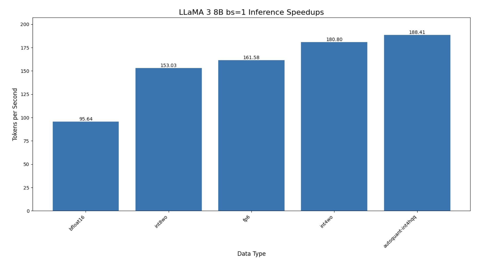
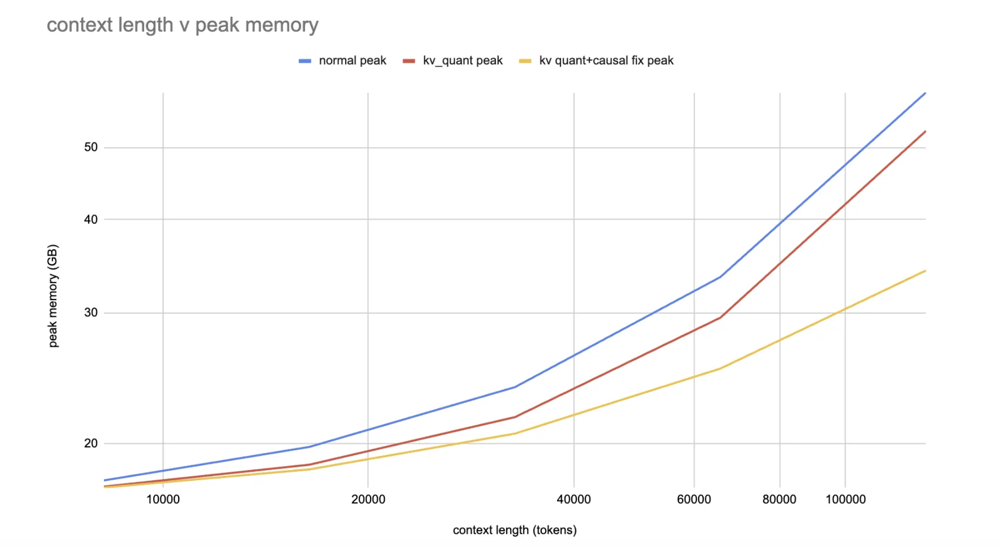
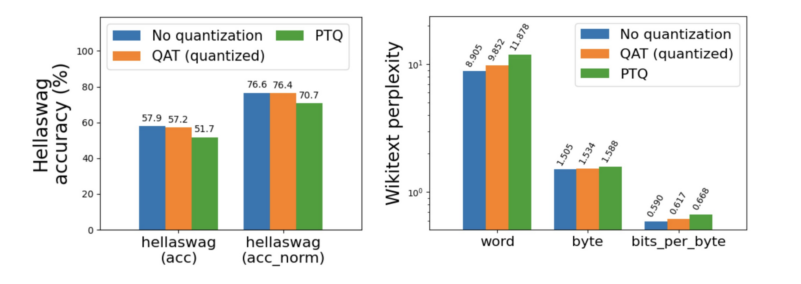
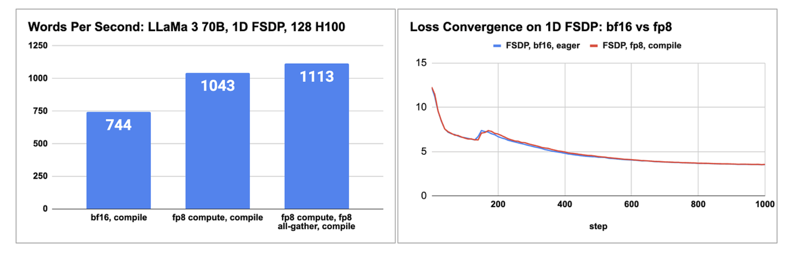
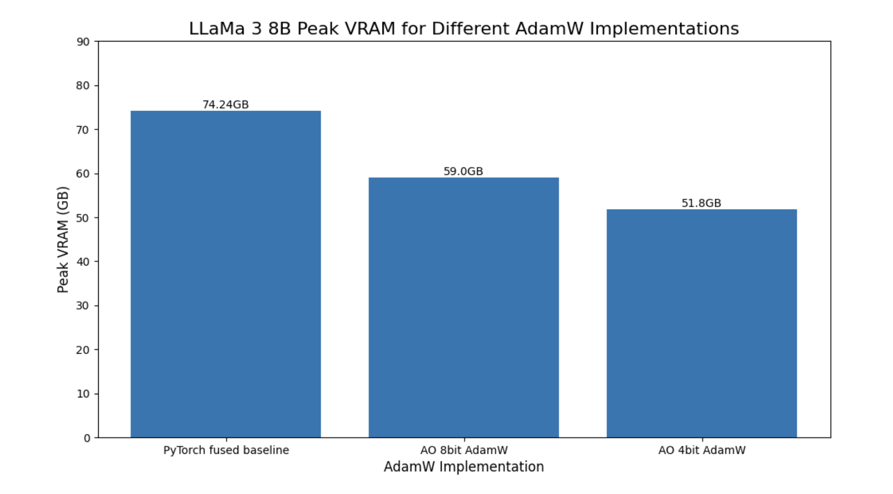

> 글 출처: https://pytorch.org/blog/pytorch-native-architecture-optimization/

# PyTorch 네이티브 아키텍처 최적화: torchao

우리는 torchao를 정식으로 출시하게 되어 매우 기쁘다. torchao는 저비트 데이터 타입, 양자화, sparsity를 활용해 모델을 더 빠르고 작게 만드는 PyTorch 네이티브 라이브러리다. torchao(https://github.com/pytorch/ao)는 사용하기 쉬운 툴킷이며, 추론과 학습을 포괄하는 기술들이 읽기 쉬운 PyTorch 코드로 주로 작성되어 있다. 이 글은 여러분의 workload에 적합한 기술을 선택하는 데 도움을 준다.

우리는 LLama 3와 Diffusion 모델 같은 인기 GenAI 모델에서 우리의 기술을 benchmark했으며, 정확도 하락이 매우 작다는 것을 발견했다. 별도 설명이 없으면 benchmark는 모두 A100 80GB GPU에서 bf16으로 실행했다.

llama 3에 대한 주요 지표는 다음과 같다.

- autoquant와 int4 weight quantization 및 hqq를 사용해 Llama 3 8B 추론 속도 97% 향상
- 128K context length에서 quantized KV cache를 사용해 Llama 3.1 8B 추론의 peak VRAM 73% 감소
- H100에서 float8 학습을 사용해 Llama 3 70B pretraining 속도 50% 향상
- 4비트 양자화 optimizer를 사용해 Llama 3 8B의 peak VRAM 30% 감소

diffusion 모델 추론에 대한 주요 지표는 다음과 같다.

- H100의 flux1.dev에서 float8 dynamic quantization inference와 float8 row-wise scaling을 사용해 속도 53% 향상
- int8 dynamic quantization을 사용해 CogVideoX의 model VRAM 50% 감소

아래에서는 torchao에서 추론과 학습에 사용할 수 있는 몇 가지 기술을 소개한다.

## 추론

우리의 inference quantization algorithm(https://github.com/pytorch/ao/tree/main/torchao/quantization)은 nn.Linear layer를 포함하는 모든 PyTorch 모델에 적용할 수 있다. 최상위 `quantize_` API를 사용해 weight-only quantization과 dynamic activation quantization을 선택할 수 있으며, 다양한 데이터 타입과 sparse layout을 지원한다.

```python
from torchao.quantization import (  
    quantize_,  
    int4_weight_only,  
)  
quantize_(model, int4_weight_only())
```

때로는 한 layer를 양자화하는 것이 overhead 때문에 더 느려질 수 있다. 따라서 모델의 각 layer에 대해 어떤 양자화 방식을 사용할지 우리가 선택해 주기를 원한다면, 대신 다음을 실행할 수 있다.

```python
model = torchao.autoquant(torch.compile(model, mode='max-autotune'))
```

`quantize_` API에는 모델이 compute bound인지 memory bound인지에 따라 몇 가지 다른 옵션이 있다.

```python
from torchao.quantization import (  
    # Memory bound models  
    int4_weight_only,  
    int8_weight_only,

    # Compute bound models  
    int8_dynamic_activation_int8_semi_sparse_weight,  
    int8_dynamic_activation_int8_weight,  
      
    # Device capability 8.9+  
    float8_weight_only,  
    float8_dynamic_activation_float8_weight,  
)
```

우리는 diffusers-torchao(https://github.com/sayakpaul/diffusers-torchao)에서 HuggingFace diffusers 팀과 광범위한 diffusion 모델 benchmark를 수행했으며, Flux.1-Dev에서 53.88% 가속, CogVideoX-5b에서 27.33% 가속을 보여주었다.



우리 API는 composable하다. 예를 들어 sparsity와 quantization을 결합해 ViT-H 추론에 5% 가속(https://github.com/pytorch/ao/tree/main/torchao/sparsity)을 가져왔다.


또한 weight를 int4로, KV cache를 int8로 양자화해 Llama 3.1 8B가 128K context length에서 18.9GB 미만의 VRAM(https://github.com/pytorch/ao/pull/738)으로 실행되도록 지원할 수 있다.




## QAT

Post-training quantization은 특히 4비트보다 작을 때 심각한 정확도 하락을 겪을 수 있다. Quantization-aware training(QAT https://pytorch.org/blog/quantization-aware-training/)을 사용해 우리는 hellaswag에서 최대 96%의 정확도 하락을 회복하는 데 성공했다. 이를 torchtune에 통합했으며 최소 튜토리얼(https://github.com/pytorch/ao/tree/main/torchao/quantization/prototype/qat)을 제공한다.




## 학습

### 저정밀 계산과 통신

torchao는 학습 계산과 분산 통신의 precision을 줄이기 위한 사용하기 쉬운 end-to-end workflow를 제공한다. `torch.nn.Linear` layer에는 float8부터 시작한다. 학습 실행 중 계산 GEMM을 float8로 변환하는 한 줄 코드는 다음과 같다.

```python
from torchao.float8 import convert_to_float8_training  
convert_to_float8_training(model)
```

float8을 사용해 LLaMa 3 70B pretraining을 최대 1.5배 가속하는 end-to-end 예제는 우리의 README(https://github.com/pytorch/ao/tree/main/torchao/float8), 그리고 torchtitan의 블로그와 float8 recipe(https://github.com/pytorch/torchtitan/blob/main/docs/float8.md)를 참고하면 된다.

### float8 pretraining LLaMa 3 70B의 성능과 정확도, vs bfloat16



(source: https://dev-discuss.pytorch.org/t/enabling-float8-all-gather-in-fsdp2/2359)

우리는 더 많은 데이터 타입과 layout을 지원하도록 학습 workflow를 확장하고 있다.

- NF4 QLoRA in torchtune(https://pytorch.org/torchtune/main/tutorials/qlora_finetune.html)
- prototype int8 학습 지원(https://github.com/pytorch/ao/pull/748)
- sparse 2:4 학습 가속(https://pytorch.org/blog/accelerating-neural-network-training/)

### 저정밀 optimizer

Bits and Bytes에서 영감을 받아, 우리는 AdamW의 대체품으로 8비트와 4비트 optimizer의 prototype support도 추가했다.

```python
from torchao.prototype.low_bit_optim import AdamW8bit, AdamW4bit  
optim = AdamW8bit(model.parameters())
```



## 통합

우리는 torchao가 오픈소스 프로젝트에서 잘 작동하도록 적극적으로 노력해 왔다.

1. Huggingface transformers의 inference backend(https://huggingface.co/docs/transformers/main/quantization/torchao)
2. diffusers-torchao(https://github.com/sayakpaul/diffusers-torchao)에서 diffusion 모델 가속을 위한 reference implementation
3. HQQ에서 빠른 4비트 추론에 사용(https://github.com/mobiusml/hqq#faster-inference)
4. torchtune(https://github.com/pytorch/torchtune)에서 PyTorch native QLoRA와 QAT recipe에 사용
5. torchchat(https://github.com/pytorch/torchchat)에서 post-training quantization에 사용
6. SGLang에서 int4와 int8 post-training quantization에 사용(https://github.com/sgl-project/sglang/pull/1341)

## 결론

모델을 더 빠르고 작게 만드는 데 관심이 있다면 torchao가 유용하고 통합하기 쉽다고 느끼길 바란다.

```bash
pip install torchao
```

우리에게는 4비트 미만, 고성능 kernel, 더 많은 layer로 확장, 확장 타입 또는 granularity, MX hardware support, 더 많은 hardware backend 지원 등 흥미로운 일이 많다. 위 내용 중 무엇이든 관심이 있다면 우리의 진행 상황을 팔로우할 수 있다. https://github.com/pytorch/ao

torchao에 관심이 있다면, 우리는 contributor guide를 만들었다. 질문이 있으면 discord.gg/gpumode의 #torchao 채널에 참여하면 된다.

## 감사의 말

우리는 거인의 어깨 위에 설 수 있었고, 오픈소스 커뮤니티의 뛰어난 인재들과 협력할 수 있어 매우 행운이었다. 감사한다!

- Bits and Bytes의 저정밀 optimizer와 QLoRA에 대한 선구적 작업
- Answer.ai의 engineering work로 FSDP와 QLoRA를 조합할 수 있게 해준 점
- Mobius Labs와 quantization algorithm 및 저정밀 kernel에 대해 나눈 멋진 교류
- HuggingFace transformers가 우리의 작업을 battle test하고 통합하는 데 준 도움
- HuggingFace diffusers가 광범위한 benchmark와 best practice에서 협력한 점
- torch.compile 덕분에 우리가 pure PyTorch로 algorithm을 작성할 수 있었던 점
- GPU MODE가 우리의 초기 contributor에게 준 지원


