> 출처: https://pytorch.org/blog/accelerating-generative-ai-2/ . 이 blog는 순수 PyTorch만으로 LLM inference performance를 optimize하는 방법을 보여준다. 기본 구현의 25.5 tok/s에서 시작해 `torch.compile`과 static kv-cache로 CPU overhead를 줄이고, int8 weight quantization으로 memory bandwidth bottleneck을 완화하며, speculative decoding으로 small model이 large model output을 예측하게 하고, int4 quantization과 GPTQ로 weight를 추가 압축하며, tensor parallelism을 도입해 multi-GPU로 확장한다. 최종적으로 performance는 거의 10배 향상되어 244.7 tok/s에 도달한다. 가장 중요한 점은 이러한 optimization이 모두 PyTorch native feature만으로 구현되며 추가 dependency가 필요 없고, 전체 implementation도 1000 lines 미만이면서 code의 simplicity와 ease of use를 유지한다는 것이다.

# GPT Fast의 몇 가지 문제

GPT Fast의 code는 매우 짧고, `torch.compile` 같은 비교적 advanced technique을 적용한다. int8/int4 weight only quantize implementation도 포함한다. 하지만 여기에는 몇 가지 뚜렷한 문제가 있다. 이는 내가 GPT Fast의 INT8/INT4 weight only quantize code를 DiT model로 port하려고 시도하면서 발견한 것이다.

- 먼저 GPT Fast는 original Bfloat16 weight를 load한 뒤 int8/int4 quantization을 수행한다. 즉 https://github.com/pytorch-labs/gpt-fast/blob/7dd5661e2adf2edd6a1042a2732dcd3a94064ad8/generate.py#L242 의 `model = simple_quantizer.convert_for_runtime()` 부분이다. 이는 original BF16 model이 더 작은 VRAM card에 올라가지 못한다면, INT8/INT4 quantized model도 정상 load할 수 없다는 뜻이다. Linear Module을 runtime에 수정하기 때문이다.
- INT8 weight only quantization implementation은 다음 code를 사용한다: https://github.com/pytorch-labs/gpt-fast/blob/7dd5661e2adf2edd6a1042a2732dcd3a94064ad8/quantize.py#L355 . `return F.linear(input, self.weight.to(dtype=input.dtype)) * self.scales` . 실제로 이 INT8 quantization은 바로 BF16 implementation으로 fallback하며, GEMM과 dequantize kernel fusion을 구현하지 않는다. https://github.com/pytorch-labs/gpt-fast/pull/187 에서는 `torch.ops.aten._weight_int8pack_mm`가 이 기능을 구현할 수 있다고 언급하지만, 내가 실행해 보니 error가 났다.
- INT4 weight only quantization을 실행할 때 `torch.ops.aten._weight_int4pack_mm`는 먼저 sm89 또는 sm90 이상의 architecture를 요구한다. 그리고 PyTorch nightly와 PyTorch 2.4에서 각각 실행해 봤지만 모두 kernel 내부에서 cuda illegal memory access error가 발생했다.
- 현재 inference framework는 이미 vLLM/SGLang 같은 전문 framework로 이동했으므로 GPT Fast는 demo로 보면 된다. 사실상 유지보수도 거의 계속되지 않는다. 다만 blog와 code에 포함된 technique은 현재 inference framework에서 가장 mainstream인 technique이므로 참고할 만하다.


# PyTorch로 생성형 AI 가속하기 Part 2: GPT Fast

이 글은 순수 native PyTorch로 generative AI model을 가속하는 방법을 다루는 multi-series blog의 두 번째 글이다. 새로 release된 PyTorch performance feature와 practice example을 공유하며, PyTorch native performance를 어디까지 밀어붙일 수 있는지 살펴본다. 첫 번째 글에서는 pure native PyTorch만으로 Segment Anything(https://pytorch.org/blog/accelerating-generative-ai/)을 8배 넘게 가속하는 방법을 보여주었다. 이번 blog에서는 LLM optimization에 집중한다.

지난 1년 동안 generative AI의 use case는 폭발적으로 증가했다. Text generation은 특히 인기 있는 영역이며, llama.cpp, vLLM, MLC-LLM 같은 open source project가 많은 innovation을 만들었다.

이 project들은 performance가 좋지만, ease of use 측면에서는 tradeoff가 필요한 경우가 많다. 예를 들어 model을 특정 format으로 convert하거나 새로운 dependency를 build/deploy해야 한다. 그래서 다음 질문이 나온다. **순수 native PyTorch만 사용하면 transformer inference를 얼마나 빠르게 실행할 수 있을까?**

최근 PyTorch Developer Conference(https://www.youtube.com/watch?v=IWpM_9AsC-U)에서 발표했듯, PyTorch team은 처음부터 LLM을 작성했고, baseline보다 거의 10배 빠르며 accuracy loss가 없고, 모두 native PyTorch optimization을 사용했다. 우리는 다음을 포함한 폭넓은 optimization을 활용했다.

- Torch.compile: PyTorch model compiler
- GPU quantization: reduced precision operation으로 model을 가속한다.
- Speculative decoding(https://github.com/pytorch-labs/gpt-fast/blob/main/generate.py#L76): 작은 "draft" model로 큰 "target" model의 output을 예측해 LLM을 가속한다.
- Tensor parallelism(https://github.com/pytorch-labs/gpt-fast/blob/main/tp.py): 여러 device에서 실행해 model을 가속한다.

더 좋은 점은 이 모든 것을 **1000 lines 미만의 native PyTorch code**로 구현할 수 있다는 것이다.

곧장 code를 보고 싶을 정도로 흥미롭다면 https://github.com/pytorch-labs/gpt-fast 를 방문하라!

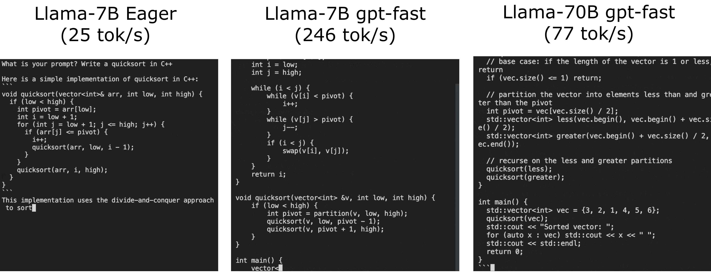

> Note: 모든 benchmark에서 latency(batch size=1)에 집중한다. 달리 언급하지 않는 한 모든 benchmark는 power limit 330W의 A100-80GB에서 실행했다.

# Starting Point (25.5 tok/s)

매우 basic하고 simple한 implementation에서 시작하자.

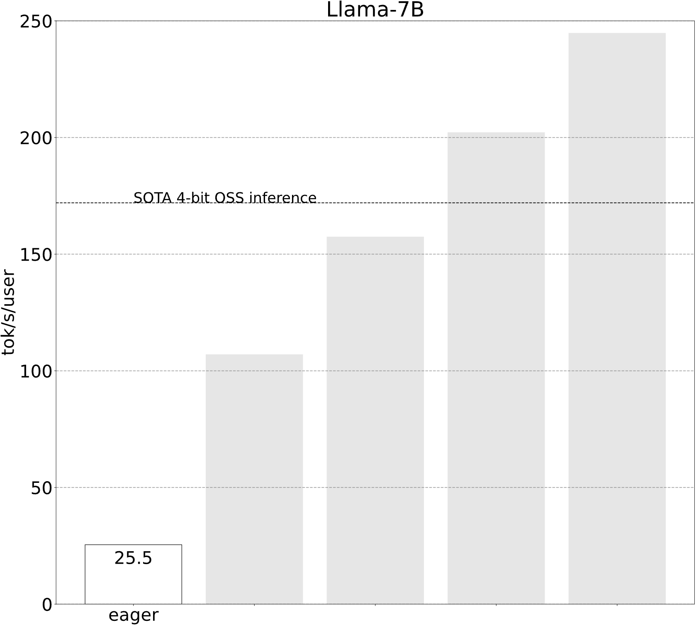

아쉽게도 이 performance는 이상적이지 않다. 왜 그럴까? Trace를 보면 답이 나온다. **CPU overhead에 심하게 제한**되어 있다! 이는 CPU가 GPU에게 무엇을 해야 하는지 충분히 빠르게 알려주지 못해 GPU가 충분히 활용되지 못한다는 뜻이다.

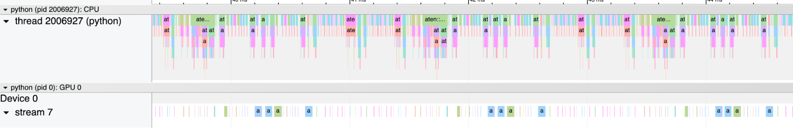

GPU를 엄청난 compute capability를 가진 super factory라고 생각해 보자. 그리고 CPU를 GPU 사이를 오가며 instruction을 전달하는 messenger라고 생각하자. Large-scale deep learning system에서 GPU는 work의 100%를 수행한다는 점을 기억하라! 이런 system에서 CPU의 유일한 역할은 GPU에게 어떤 work를 해야 하는지 알려주는 것이다.

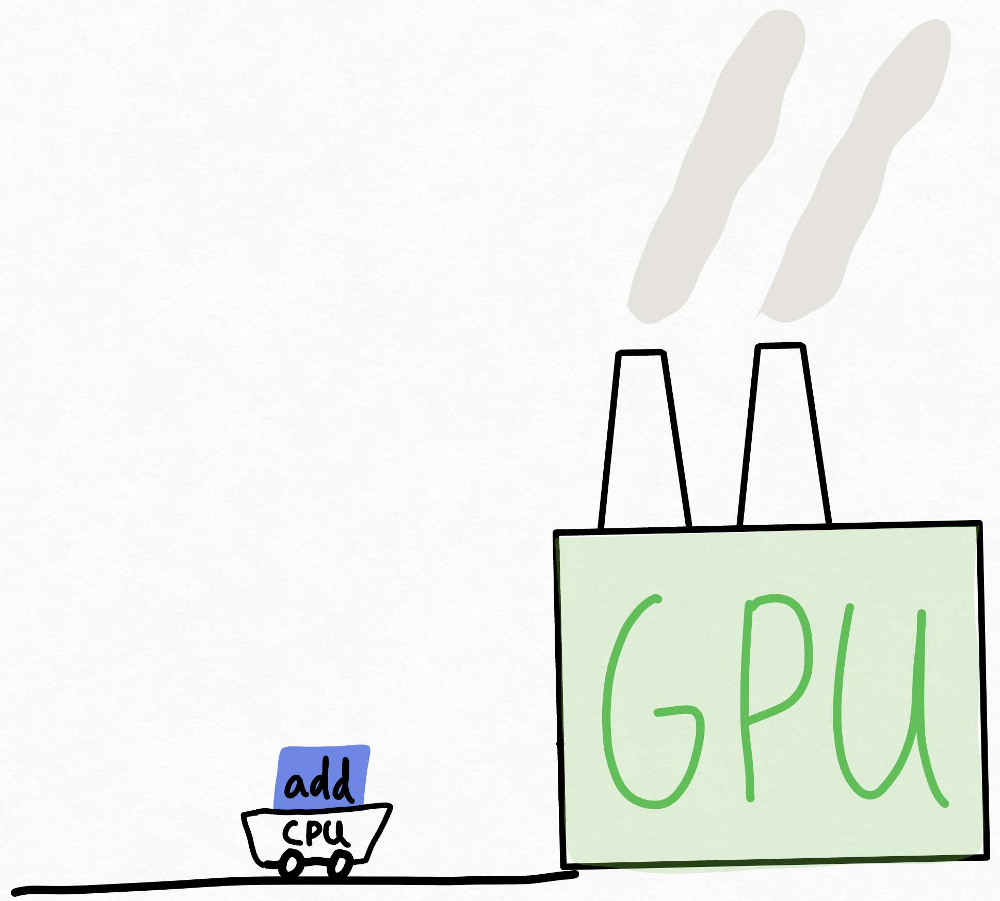

따라서 CPU가 달려와 GPU에게 "add" operation을 실행하라고 알려주지만, CPU가 다음 work를 GPU에게 줄 수 있을 때쯤이면 GPU는 이미 이전 work를 끝낸 지 오래다.

GPU는 수천 번의 computation을 수행해야 하고 CPU는 orchestration만 하면 되는데도 이런 상황은 놀랄 만큼 흔하다. 원인은 여러 가지다. CPU가 single-threaded Python을 실행하고 있을 수도 있고, modern GPU의 operation speed가 너무 빠른 것도 영향을 준다.

어쨌든 우리는 지금 **CPU overhead limited** 상태에 있다. 그렇다면 무엇을 할 수 있을까? 한 가지 방법은 implementation을 C++로 다시 쓰거나, framework를 완전히 버리고 CUDA를 직접 쓰는 것이다. 또는... GPU에 한 번에 더 많은 work를 보낼 수 있다.

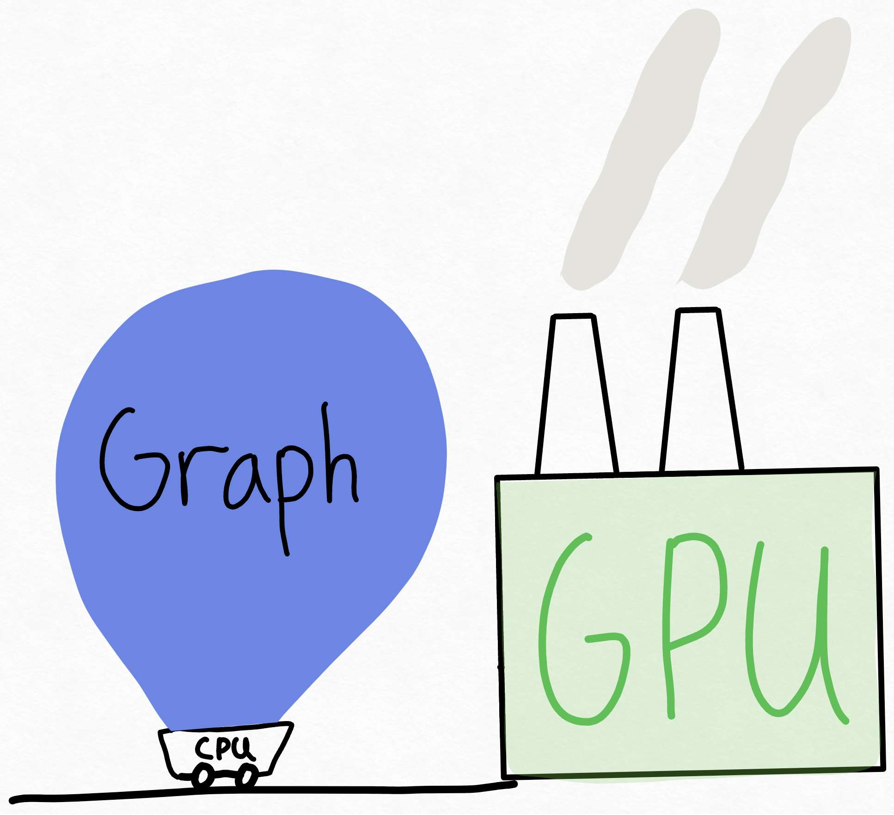

한 번에 많은 work를 보내면 GPU를 계속 바쁘게 만들 수 있다! Training 시에는 batch size를 키우는 것만으로도 가능할 수 있지만, inference에서는 어떻게 해야 할까?

`torch.compile`이 등장한다.

# Step 1: torch.compile과 Static kv-cache로 CPU Overhead 줄이기 (107.0 tok/s)

`torch.compile`은 더 큰 영역을 single compiled region으로 capture할 수 있게 한다. 특히 `mode="reduce-overhead"`로 실행하면 CPU overhead를 줄이는 데 매우 효과적이다. 여기서는 `fullgraph=True`도 지정한다. 이는 model 안에 "graph break"(`torch.compile`이 compile할 수 없는 부분)가 없음을 검증한다. 다시 말해 `torch.compile`이 최대 잠재력을 발휘할 수 있도록 보장한다.

적용하려면 function(또는 module)을 이것으로 감싸면 된다(https://github.com/pytorch-labs/gpt-fast/blob/main/generate.py#L296).

```python
torch.compile(decode_one_token, mode="reduce-overhead", fullgraph=True)
```

하지만 text generation에 `torch.compile`을 적용해 큰 performance improvement를 얻는 과정에는 몇 가지 subtle detail이 있다.

첫 번째 obstacle은 kv-cache다. kv-cache는 inference-time optimization으로, 이전에 생성한 token의 activation을 cache한다(더 자세한 내용은 여기(https://www.dipkumar.dev/becoming-the-unbeatable/posts/gpt-kvcache/) 참고). 하지만 더 많은 token을 생성할수록 kv-cache의 "logical length"는 커진다. 여기에는 두 가지 문제가 있다. 하나는 cache가 커질 때마다 cache를 reallocate(그리고 copy!)하는 cost가 크다는 것이다. 또 하나는 이런 dynamic nature 때문에 overhead reduction이 더 어려워진다는 점이다. 더 이상 cuda graph 같은 방법을 활용할 수 없기 때문이다.

이 문제를 해결하기 위해 우리는 "static" kv-cache(https://github.com/pytorch-labs/gpt-fast/blob/0afae1ace441ce4c5d02ef11a72da28cf7ca4795/generate.py#L154)를 사용했다. 이는 kv-cache의 maximum size를 static하게 allocate한 뒤 attention computation 부분에서 사용하지 않는 value를 mask하는 것을 의미한다.

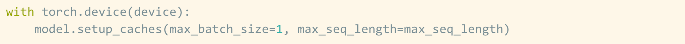

두 번째 obstacle은 prefill stage다. Transformer text generation은 두 stage로 볼 수 있다. 1. prefill stage에서는 전체 prompt를 처리하고, 2. decoding stage에서는 각 token을 autoregressive하게 생성한다.

Decoding은 kv-cache가 static해지면 완전히 static하게 만들 수 있지만, prefill stage는 prompt length가 variable이므로 여전히 훨씬 더 많은 dynamic behavior가 필요하다. 따라서 실제로는 두 stage를 서로 다른 compile strategy로 compile해야 한다.

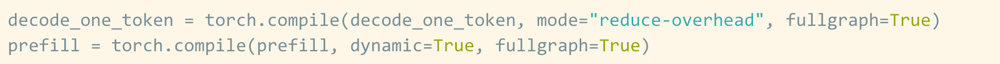

이 detail들은 조금 복잡하지만 실제 implementation은 어렵지 않다(gpt-fast 참고)! 그리고 performance improvement는 상당하다.

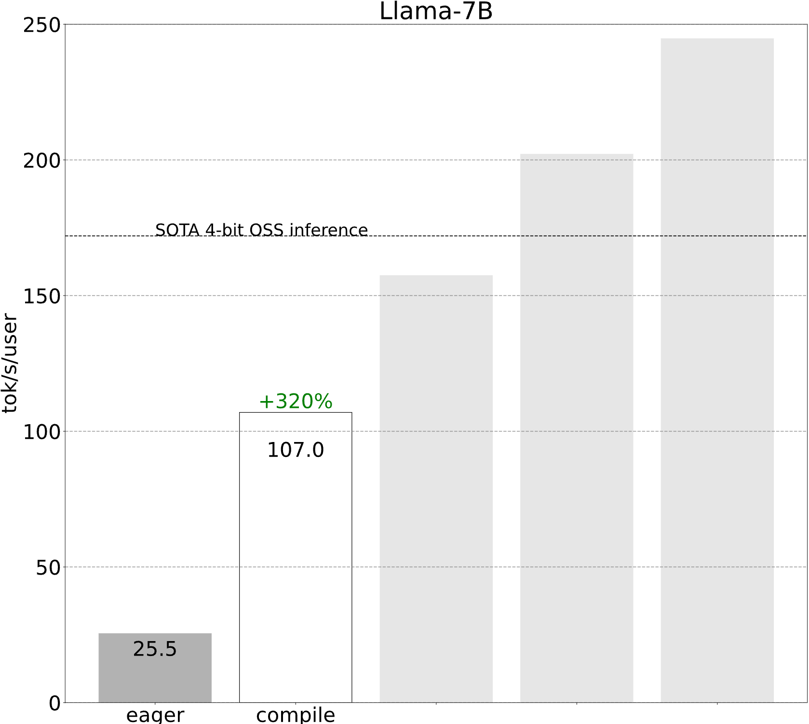

이 모든 것을 합치면 performance가 4배 이상 향상된다. 이런 performance improvement는 overhead-limited workload를 다룰 때 흔히 볼 수 있다.

# Side Note: torch.compile은 어떻게 도움이 되는가?

`torch.compile`이 어떻게 performance를 높이는지 나눠 볼 가치가 있다. `torch.compile`의 performance를 만드는 주요 factor는 두 가지다.

첫 번째 factor는 위에서 말했듯 overhead reduction이다. `torch.compile`은 여러 optimization으로 overhead를 줄이는데, 그중 가장 효과적인 것 중 하나가 CUDA Graphs다. `torch.compile`은 "reduce-overhead" 설정 시 이를 자동 적용하므로, 사용자가 추가 work와 code를 직접 작성할 필요를 줄인다.

두 번째 factor는 `torch.compile`이 단순히 더 빠른 kernel을 생성한다는 점이다. Decoding benchmark에서 `torch.compile`은 matrix multiplication과 attention을 포함해 모든 kernel을 처음부터 생성한다! 더 멋진 점은 이 kernel들이 built-in alternative(CuBLAS와 FlashAttention2)보다 실제로 더 빠르다는 것이다.

효율적인 matrix multiplication/attention kernel 작성이 얼마나 어려운지, 그리고 CuBLAS와 FlashAttention에 얼마나 많은 인력이 투입되었는지 생각하면 믿기 어려울 수 있다. 하지만 여기서 핵심은 transformer decoding이 매우 특이한 computational property를 가진다는 점이다. 특히 KV-cache 때문에 BS=1에서는 각 transformer 안의 matrix multiplication이 사실상 matrix-vector multiplication이다.

이는 computation이 완전히 memory bandwidth limited이며, 따라서 compiler의 범위 안에 있다는 뜻이다. 실제로 `torch.compile`의 matrix-vector multiplication을 CuBLAS와 benchmark했을 때, `torch.compile` kernel이 훨씬 빠르다는 것을 발견했다.

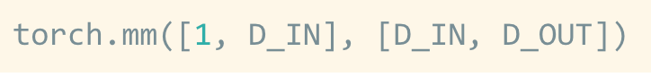

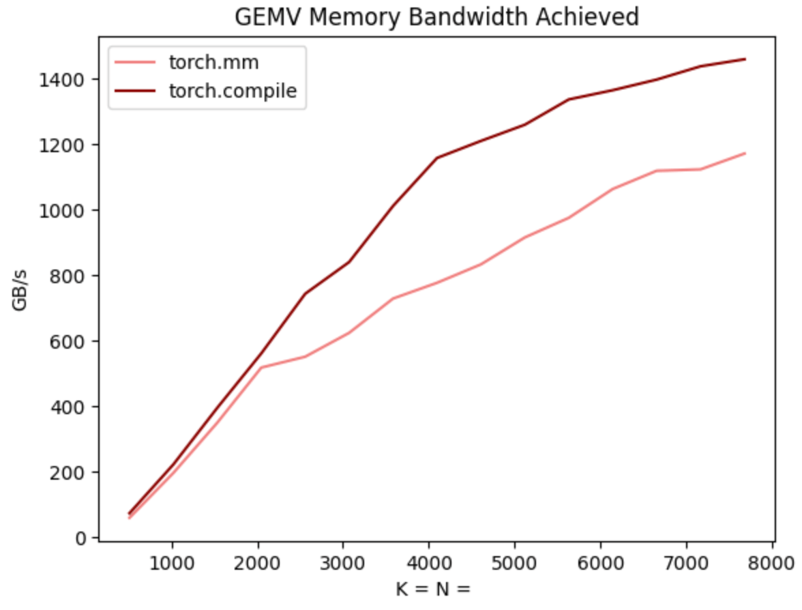


# Step 2: int8 Weight Quantization으로 Memory Bandwidth Bottleneck 완화하기 (157.4 tok/s)

이미 `torch.compile` 적용으로 큰 performance improvement를 보았으니, 더 잘할 수 있을까? 이 문제를 생각하는 한 가지 방법은 theoretical peak에 얼마나 가까운지 계산하는 것이다. 이 경우 가장 큰 bottleneck은 weight를 GPU global memory에서 register로 load하는 cost다. 다시 말해 각 forward pass는 GPU 위의 모든 parameter를 "touch"해야 한다. 그렇다면 model의 각 parameter를 theoretical하게 얼마나 빨리 "touch"할 수 있을까?

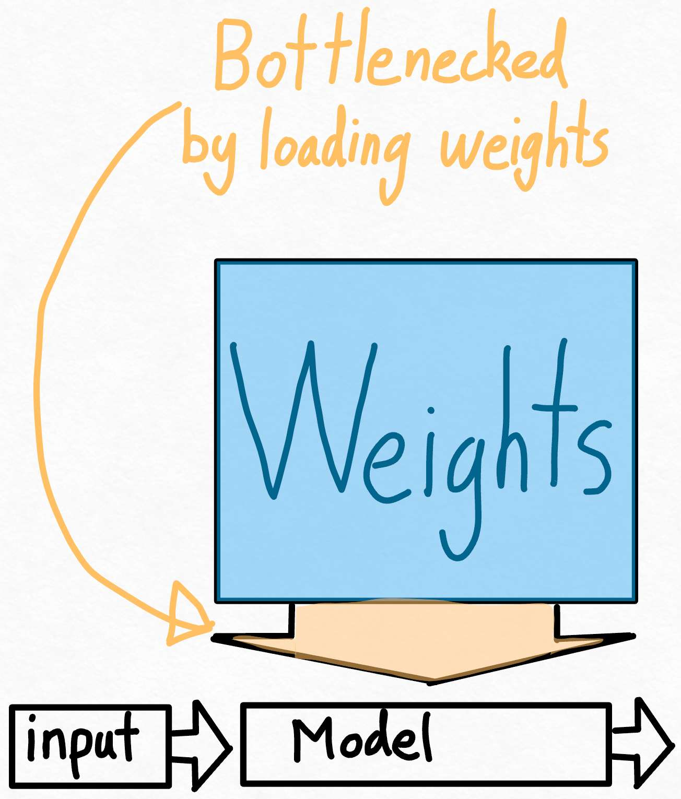

이를 측정하기 위해 **Model Bandwidth Utilization(MBU)**를 사용할 수 있다. 이는 inference 동안 사용할 수 있는 memory bandwidth percentage를 측정한다.

계산은 간단하다. Model size(parameter 수 * parameter당 byte 수)에 초당 수행 가능한 inference 수를 곱한다. 그 다음 이 값을 GPU peak bandwidth로 나누면 MBU를 얻는다.


예를 들어 위 case에서는 7B parameter model이 있다. 각 parameter는 fp16 format으로 저장된다(parameter당 2 byte). 우리는 107 tokens/s speed에 도달했다. 마지막으로 A100-80GB의 theoretical memory bandwidth는 2 TB/s다.


이 모든 것을 합치면 **72% MBU**가 나온다! 단순 memory copy조차 85%를 넘기 어렵다는 점을 고려하면 꽤 좋다.

하지만 이는 우리가 theoretical limit에 매우 가까우며, memory에서 weight를 load하는 것에 명확히 제한되어 있다는 의미이기도 하다. 어떤 일을 해도 문제 정의를 어떤 식으로든 바꾸지 않으면 performance는 아마 10% 정도 더 얻는 데 그칠 것이다.

위 equation을 다시 보자. Model의 parameter 수는 실제로 바꿀 수 없다. GPU memory bandwidth도 진짜로 바꾸기는 어렵다(돈을 더 쓰지 않는 한). 하지만 parameter당 저장 byte 수는 바꿀 수 있다!


그래서 다음 technique인 int8 quantization에 도달한다. 아이디어는 간단하다. Memory에서 weight를 load하는 것이 주요 bottleneck이라면, weight를 더 작게 만들면 되지 않을까?

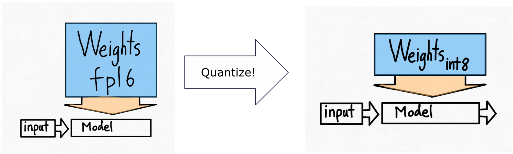

주의할 점은 이것이 weight만 quantize한다는 것이다. Computation 자체는 여전히 bf16에서 수행된다. 그래서 이런 형태의 quantization은 적용하기 매우 쉽고, accuracy drop도 거의 없다.

또한 `torch.compile`은 efficient int8 quantization code를 쉽게 생성할 수 있다. 위 benchmark를 다시 보자. 이번에는 int8 weight quantization을 포함한다.

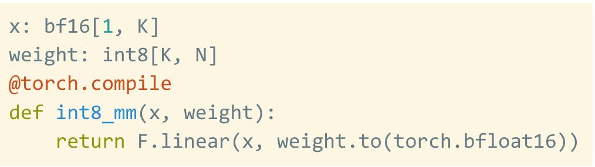

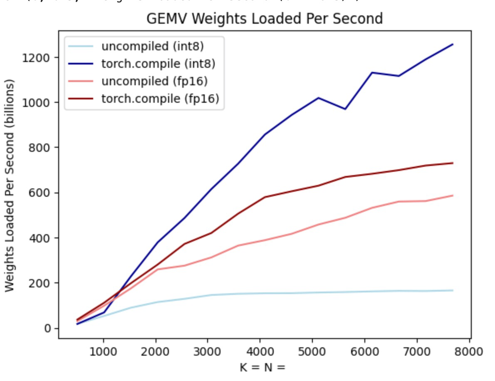

Dark blue line(torch.compile + int8)에서 볼 수 있듯, torch.compile + int8 weight quantization을 사용하면 performance가 크게 향상된다! 또한 light blue line(torch.compile 없이 int8)은 fp16 performance보다도 나쁘다. int8 quantization의 performance advantage를 활용하려면 kernel fusion이 필요하기 때문이다. 이는 `torch.compile`의 이점을 보여준다. 이런 kernel을 사용자에게 자동 생성해 줄 수 있다!

Model(https://github.com/pytorch-labs/gpt-fast/blob/main/quantize.py#L314)에 int8 quantization을 적용하자 50% performance improvement가 나타났고, 157.4 tokens/s까지 올라갔다.

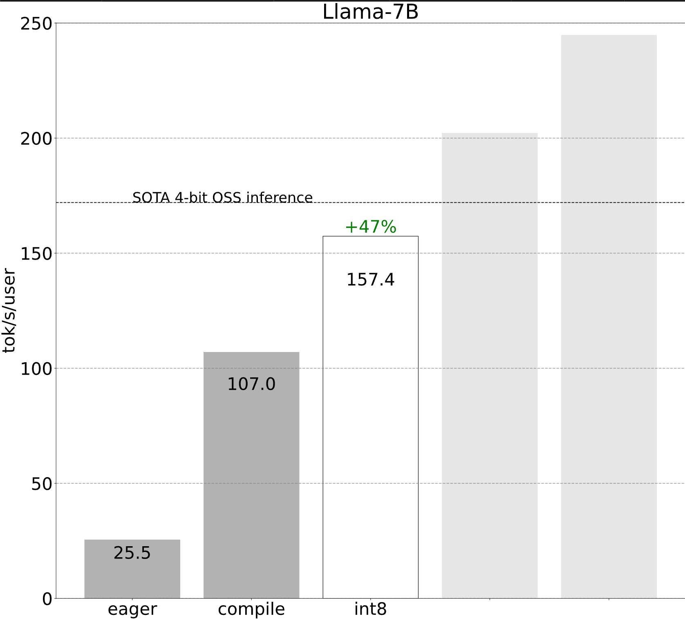

# Step 3: Speculative Decoding으로 문제를 다시 표현하기 (157.4 tok/s)

Quantization technique을 사용했음에도 또 다른 문제가 남아 있다. 100 token을 생성하려면 weight를 100번 load해야 한다.

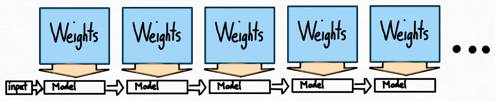

Weight가 quantized되어 있어도 token 하나를 생성할 때마다 weight를 계속 반복해서 load해야 한다. 이 문제를 우회할 방법이 있을까?

언뜻 보면 답은 없어 보인다. Autoregressive generation에는 strict sequence dependency가 있기 때문이다. 하지만 speculative decoding(https://arxiv.org/abs/2211.17192)을 활용하면 이 strict sequence dependency를 깨고 performance improvement를 얻을 수 있음이 밝혀졌다.

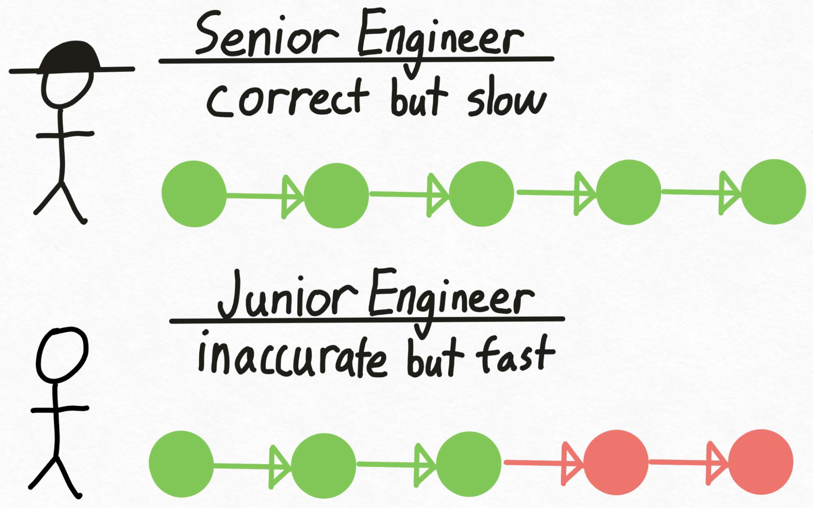

상상해 보자. Verity라는 senior engineer가 있다. 그는 올바른 technical decision을 내리지만 code 작성은 느리다. 반면 Drake라는 junior engineer도 있다. 그는 가끔 잘못된 technical decision을 내리지만, Verity보다 code를 훨씬 빠르게(그리고 더 싸게!) 작성한다. 올바른 technical decision을 계속 보장하면서 Drake(junior engineer)를 활용해 code를 더 빠르게 작성하려면 어떻게 해야 할까?

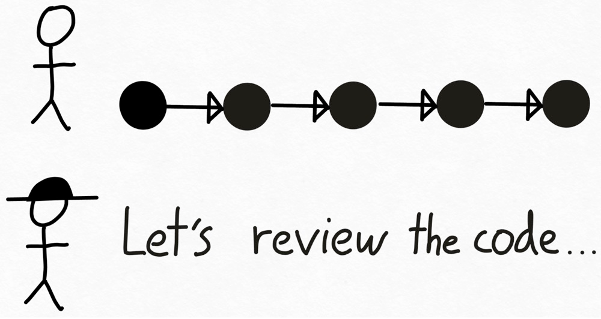

먼저 Drake가 labor-intensive process를 통해 code를 작성하고 그 과정에서 technical decision을 내린다. 다음으로 우리는 code를 Verity에게 review하도록 넘긴다.

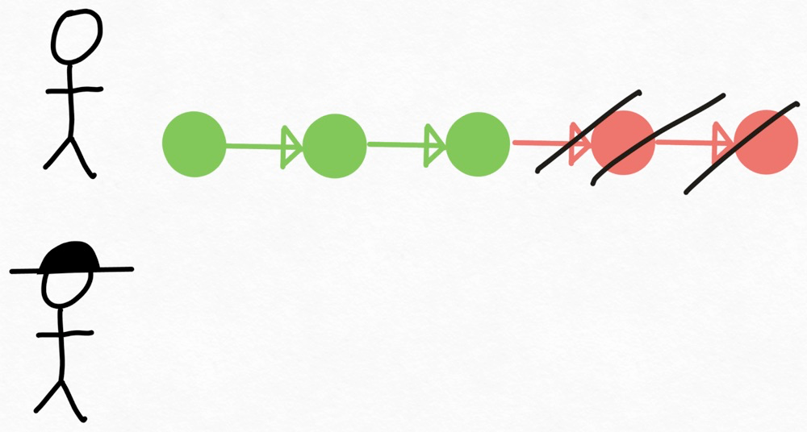


Code를 review할 때 Verity는 Drake의 앞 3개 technical decision은 올바르지만 마지막 2개는 다시 해야 한다고 판단할 수 있다. 따라서 Drake는 시작점으로 돌아가 마지막 2개의 decision을 버리고 거기서부터 다시 code를 작성한다.

중요한 점은 Verity(senior engineer)가 code를 한 번만 보았음에도, 그녀가 직접 작성했을 code와 완전히 동일한 verified code 3개 segment를 생성할 수 있었다는 것이다. 따라서 Verity가 이 3개 segment를 직접 작성하는 것보다 code review를 더 빨리 할 수 있다면, 이 방법은 직접 작성하는 것보다 우수하다.

Transformer inference context에서 Verity는 task에 필요한 output을 생성하는 larger model이 맡으며, 이를 **verification model**이라고 부른다. 마찬가지로 Drake는 larger model보다 더 빠르게 text를 생성할 수 있는 smaller model이 맡으며, 이를 **draft model**이라고 부른다. 따라서 우리는 draft model로 8 tokens를 생성한 다음, verification model로 이 8 tokens를 병렬 처리하고, mismatch token을 discard한다.

위에서 말했듯 speculative decoding의 핵심 특성은 **output quality를 바꾸지 않는다**는 것이다. Draft model로 token을 생성하고 verification하는 데 필요한 시간이 이 token들을 직접 생성하는 시간보다 적기만 하면 우리는 앞서게 된다.

Native PyTorch로 이를 구현하는 이점은 이 방법이 실제로 매우 구현하기 쉽다는 것이다(https://github.com/pytorch-labs/gpt-fast/blob/main/generate.py#L76)! 전체 implementation은 약 50 lines의 native PyTorch code다.

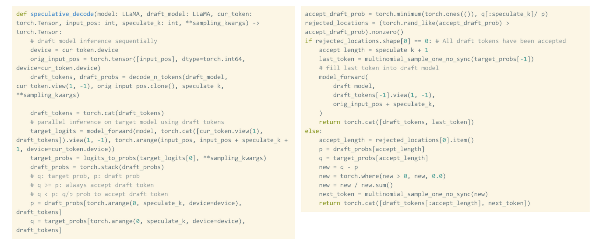


Speculative decoding은 normal generation과 비교해 mathematically identical result를 보장하지만, runtime performance가 generated text의 property와 draft model/verification model의 alignment 정도에 의존한다는 특성이 있다. 예를 들어 CodeLlama-34B + CodeLlama-7B로 실행하면 2x performance improvement를 얻을 수 있었다. 반면 Llama-7B + TinyLlama-1B에서는 약 1.3x performance improvement만 얻을 수 있었다.

# Side Note: AMD에서 실행하기

위에서 말했듯 decoding의 각 kernel은 `torch.compile`이 처음부터 생성하고 OpenAI Triton으로 변환한다. AMD에는 `torch.compile` backend(https://pytorch.org/blog/experience-power-pytorch-2.0/)와 Triton backend가 있으므로, 위 모든 optimization을 그대로 사용할 수 있다. 단, AMD GPU를 사용한다! int8 quantization을 사용해 MI250x의 절반, 즉 하나의 GCD에서 102.5 tokens/s를 달성할 수 있었다.

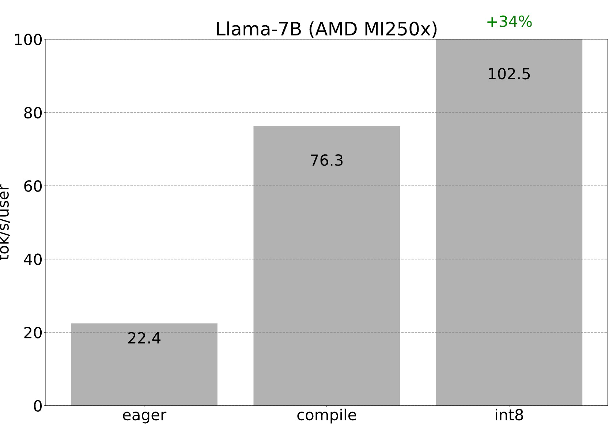

# Step 4: int4 Quantization과 GPTQ로 Weight Size 더 줄이기 (202.1 tok/s)

물론 weight를 16 bit에서 8 bit로 낮추면 load해야 하는 byte 수가 줄어 속도가 빨라진다면, weight를 4 bit로 낮추면 더 큰 speed improvement가 있을 것이다!

불행히도 weight를 4 bit로 낮추면 model accuracy가 더 큰 문제가 되기 시작한다. 우리의 preliminary evaluation에 따르면 int8 weight quantization은 뚜렷한 accuracy drop이 없었지만, int4 weight quantization은 accuracy drop을 유발했다.

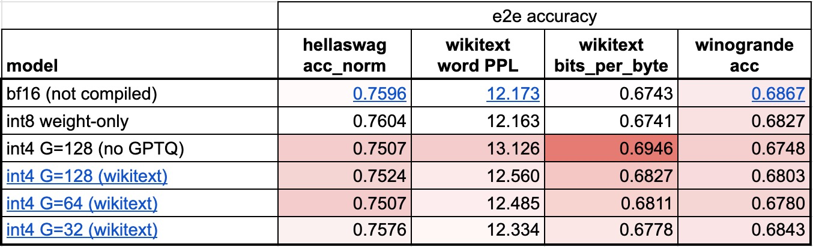

int4 quantization의 accuracy drop을 제한하는 주요 방법은 두 가지다.

첫 번째 방법은 scaling factor를 더 fine-grained하게 만드는 것이다. Scaling factor를 생각하는 한 방법은 quantized tensor representation이 floating-point tensor(각 value에 scaling factor가 있음)와 integer tensor(value에 scaling factor가 없음) 사이의 sliding scale이라는 것이다. 예를 들어 int8 quantization에서는 row마다 scaling factor 하나가 있다. 하지만 더 높은 accuracy를 원한다면 scaling factor를 "32 elements마다 하나의 scaling factor"로 바꿀 수 있다. 우리는 accuracy drop을 최소화하기 위해 group size 32를 선택했으며, 이는 community에서도 흔한 선택이다.

두 번째 방법은 단순히 weight를 rounding하는 것보다 더 advanced한 quantization strategy를 사용한다. 예를 들어 GPTQ는 example data를 활용해 weight를 더 정확히 calibrate한다. 이 경우 우리는 최근 release된 PyTorch `torch.export`(https://pytorch.org/tutorials/intermediate/torch_export_tutorial.html)를 기반으로 repository에 GPTQ implementation을 prototype했다.

또한 int4 dequantization과 matrix-vector multiplication을 fuse해야 한다. 이 경우 `torch.compile`은 아쉽게도 이러한 kernel을 처음부터 생성할 수 없어서, 일부 handwritten CUDA kernel을 활용했다.

이 technique들은 추가 작업이 필요하지만, 결합하면 더 나은 performance를 얻을 수 있다!

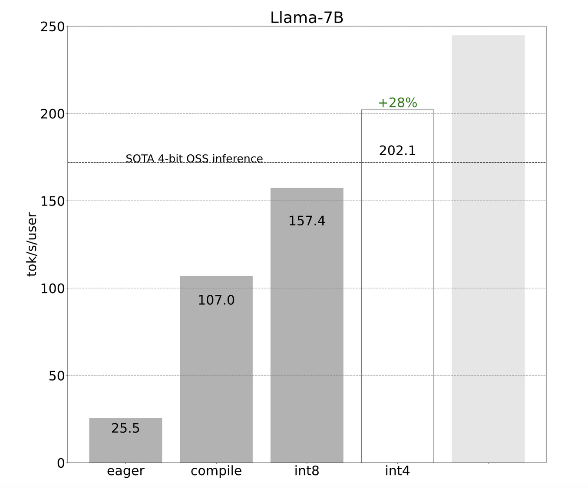

# Step 5: 모든 Technique 결합하기 (244.7 tok/s)

마지막으로 이 모든 technique을 결합해 더 나은 performance를 얻을 수 있다.

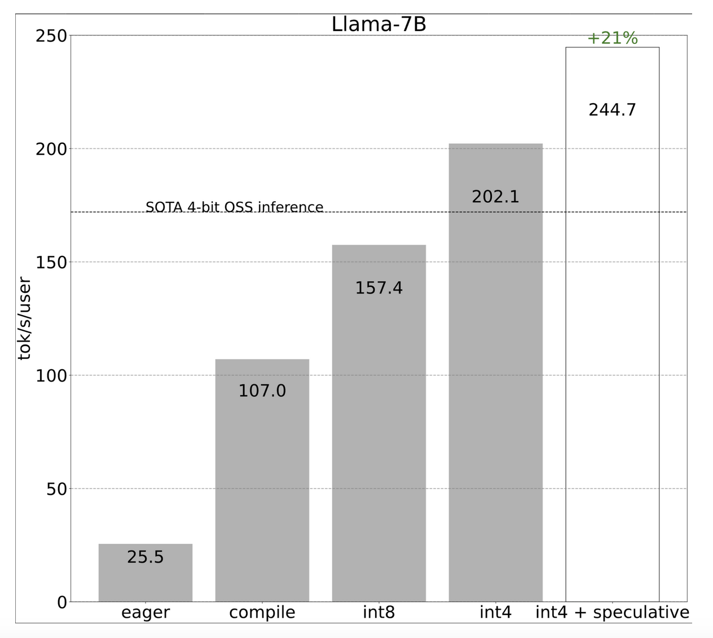

# Step 6: Tensor Parallelism 사용하기

지금까지 우리는 single GPU에서 latency를 최소화하는 데만 자신을 제한했다. 하지만 많은 경우 여러 GPU에 접근할 수 있다. 이는 latency를 추가로 개선할 수 있게 한다!

왜 이것이 latency를 개선할 수 있는지 직관적으로 이해하기 위해, 이전의 MBU equation, 특히 denominator를 보자. 여러 GPU에서 실행하면 더 많은 memory bandwidth에 접근할 수 있으므로 potential performance가 향상된다.


어떤 parallel strategy를 선택할지에 대해서는, 하나의 example latency를 줄이려면 여러 device의 memory bandwidth를 동시에 활용할 수 있어야 한다는 점에 유의하라. 이는 하나의 token processing을 여러 device로 split해야 함을 의미한다. 다시 말해 tensor parallelism을 사용해야 한다.

다행히 PyTorch는 tensor parallelism을 구현할 수 있는 low-level tool도 제공하며, 이는 `torch.compile`과 함께 사용할 수 있다. Tensor parallelism을 표현하는 higher-level API도 개발 중이니 계속 지켜봐 달라!

하지만 higher-level API가 없어도 tensor parallelism implementation은 실제로 꽤 쉽다. 우리의 implementation은 150 lines code(https://github.com/pytorch-labs/gpt-fast/blob/main/tp.py)에 불과하며 model change가 전혀 필요 없다.

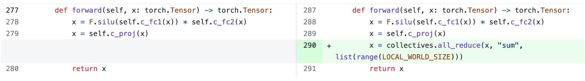

앞서 언급한 모든 optimization도 그대로 활용할 수 있으며, 이들은 tensor parallelism과 함께 사용할 수 있다. 이를 결합해 int8 quantization에서 Llama-70B를 55 tokens/s로 service할 수 있었다.

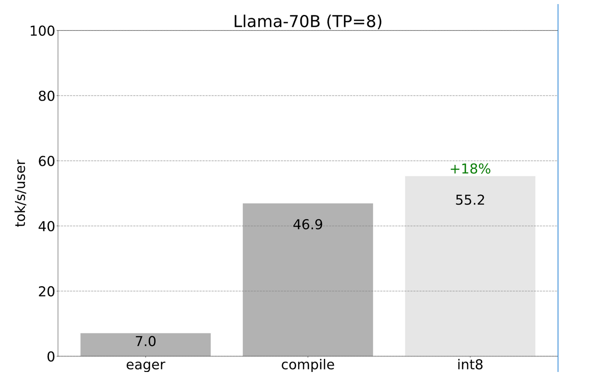

# Conclusion

우리가 무엇을 달성했는지 보자.

- Simplicity: quantization을 제외하면 model.py(https://github.com/pytorch-labs/gpt-fast/blob/main/model.py) (244 LOC) + generate.py(https://github.com/pytorch-labs/gpt-fast/blob/main/generate.py) (371 LOC) + tp.py(https://github.com/pytorch-labs/gpt-fast/blob/main/tp.py) (151 LOC), 총 766 LOC로 fast inference + speculative decoding + tensor parallelism을 구현했다.
- Performance: Llama-7B를 사용해 `torch.compile` + int4 quantization + speculative decoding으로 241 tok/s에 도달했다. Llama-70B에서는 tensor parallelism을 더해 80 tok/s에 도달할 수 있었다. 이들은 SOTA performance에 가깝거나 이를 넘는다!

PyTorch는 항상 simplicity, ease of use, flexibility를 허용해 왔다. 이제 `torch.compile`과 함께 performance도 더할 수 있다!

Code는 여기서 볼 수 있다: https://github.com/pytorch-labs/gpt-fast . Community가 유용하다고 느끼기를 바란다. 우리의 목표는 library나 framework를 제공하는 것이 아니라, 사용자가 code를 copy, fork, modify하도록 장려하는 것이다.

# Acknowledgements

Open source community의 지속적인 support에 감사드린다.
- Lightning AI는 pytorch와 flash attention, int8 quantization, LoRA fine-tuning 작업을 support했다.
- GGML은 on-device fast LLM inference 발전을 이끌었다.
- Andrej Karpathy는 simple, interpretable, fast LLM implementation을 이끌었다.
- MLC-LLM은 heterogeneous hardware에서 4-bit quantization performance를 이끌었다.


# Speculative Decoding Code Reading

Speculative decoding code를 해석해 보자: https://github.com/pytorch-labs/gpt-fast/blob/7dd5661e2adf2edd6a1042a2732dcd3a94064ad8/generate.py#L103

```python
def speculative_decode(
    model: Transformer,  # target model
    draft_model: Transformer,  # draft model
    cur_token: torch.Tensor,  # current token
    input_pos: int,  # input position
    speculate_k: int,  # number of speculative tokens
    **sampling_kwargs
) -> torch.Tensor:
    # Get device information
    device = cur_token.device
    # Record original input position
    orig_input_pos = torch.tensor([input_pos], dtype=torch.int64, device=cur_token.device)
    # Use draft model to sequentially generate k tokens and their probabilities
    draft_tokens, draft_probs = decode_n_tokens(draft_model, cur_token.view(1, -1), orig_input_pos.clone(), speculate_k, **sampling_kwargs)

    draft_tokens = torch.cat(draft_tokens)
    # Use target model to run inference on draft tokens in parallel
    target_logits = model_forward(
        model,
        torch.cat([cur_token.view(1), draft_tokens]).view(1, -1),
        torch.arange(input_pos, input_pos + speculate_k + 1, device=cur_token.device)
    )
    # Convert logits to probability distribution
    target_probs = logits_to_probs(target_logits[0], **sampling_kwargs)
    draft_probs = torch.stack(draft_probs)
    
    # Compute acceptance probability
    # q: target model probability, p: draft model probability
    # q >= p: always accept the draft token
    # q < p: accept draft token with probability q/p
    p = draft_probs[torch.arange(0, speculate_k, device=device), draft_tokens]
    q = target_probs[torch.arange(0, speculate_k, device=device), draft_tokens]
    accept_draft_prob = torch.minimum(torch.ones(()), q[:speculate_k]/ p)
    # Find rejected positions
    rejected_locations = (torch.rand_like(accept_draft_prob) > accept_draft_prob).nonzero()

    if rejected_locations.shape[0] == 0:  # all draft tokens are accepted
        accept_length = speculate_k + 1
        # Sample the last token
        last_token = multinomial_sample_one_no_sync(target_probs[-1])
        # Feed the last token into the draft model
        model_forward(
            draft_model,
            draft_tokens[-1].view(1, -1),
            orig_input_pos + speculate_k,
        )
        return torch.cat([draft_tokens, last_token])
    else:  # there is a rejected token
        # Get the number of tokens before the first rejected position
        accept_length = rejected_locations[0].item()
        p = draft_probs[accept_length]
        q = target_probs[accept_length]
        # Compute the new probability distribution
        new = q - p
        new = torch.where(new > 0, new, 0.0)
        new = new / new.sum()
        # Sample the next token from the new probability distribution
        next_token = multinomial_sample_one_no_sync(new)
        return torch.cat([draft_tokens[:accept_length], next_token])


@torch.no_grad()
def generate(
    model: Transformer,  # target model
    prompt: torch.Tensor,  # input prompt
    max_new_tokens: int,  # maximum number of generated tokens
    batch_size: int,  # batch size
    *,
    interactive: bool,  # whether it is interactive mode
    draft_model: Transformer,  # draft model
    speculate_k: Optional[int] = 8,  # number of speculative tokens
    callback = lambda x: x,  # callback function
    **sampling_kwargs  # sampling-related parameters
) -> torch.Tensor:
    """
    Takes a conditioning sequence (prompt) as input and continues to generate as many tokens as requested.
    """

    # Check whether speculative decoding is used
    is_speculative = draft_model is not None
    # Compute sequence length
    T = prompt.size(-1)  # input sequence length
    T_new = T + max_new_tokens  # final sequence length
    # Set maximum sequence length
    if interactive:
        max_seq_length = 350  # fixed length in interactive mode
    else:
        max_seq_length = min(T_new, model.config.block_size)  # in non-interactive mode, take the smaller one

    # Get device and data type
    device, dtype = prompt.device, prompt.dtype
    # If using speculative decoding, increase sequence length to accommodate speculative tokens
    max_seq_length = max_seq_length + speculate_k + 1 if is_speculative else max_seq_length
    # Set model cache
    with torch.device(device):
        model.setup_caches(max_batch_size=batch_size, max_seq_length=max_seq_length)
        if is_speculative and draft_model is not model:
            draft_model.setup_caches(max_batch_size=batch_size, max_seq_length=max_seq_length)

    # Create output sequence tensor
    empty = torch.empty(batch_size, T_new, dtype=dtype, device=device)
    # Copy prompt to each batch
    prompt = prompt.view(1, -1).repeat(batch_size, 1)
    empty[:, :T] = prompt
    seq = empty
    input_pos = torch.arange(0, T, device=device)

    # Use prefill to generate the first token
    next_token = prefill(model, prompt.view(batch_size, -1), input_pos, **sampling_kwargs).clone()
    if is_speculative:
        prefill(draft_model, prompt.view(batch_size, -1), input_pos, **sampling_kwargs)
    seq[:, T] = next_token.squeeze()

    # Set input position and acceptance counter
    input_pos = torch.tensor([T], device=device, dtype=torch.int)
    accept_counts = [0] * (speculate_k + 1)

    # Main generation loop
    if is_speculative:  # use speculative decoding
        input_pos = input_pos.item()  # convert to scalar for speculative decoding
        while input_pos < T_new - 1:
            cur_token = next_token.view(())

            # Use speculative decoding to generate the next group of tokens
            next_tokens = speculative_decode(
                model, draft_model, cur_token, input_pos, speculate_k, **sampling_kwargs
            )

            # Update acceptance counts
            accept_counts[len(next_tokens) - 1] += 1
            # Compute the actual number of tokens added
            num_added = min(T_new - input_pos - 1, len(next_tokens))
            # Add generated tokens to the sequence
            seq[input_pos + 1 : input_pos + num_added + 1] = next_tokens[: num_added]
            # Call callback for each token
            for i in next_tokens[: num_added,]:
                callback(i)
            # Update position and next token
            input_pos = input_pos + num_added
            next_token = next_tokens[-1]
    else:  # do not use speculative decoding
        # Directly generate all tokens
        generated_tokens, _ = decode_n_tokens(model, next_token.view(batch_size, -1), input_pos, max_new_tokens - 1, callback=callback, **sampling_kwargs)
        seq[:, T + 1:] = torch.cat(generated_tokens, dim=-1)

    # Return generated sequence and statistics
    generate_stats = {
        'accept_counts': accept_counts
    }
    return seq, generate_stats
```

Code 전체는 비교적 이해하기 쉽지만, 이 line이 실제로 어떤 역할을 하는지는 잘 모르겠다.

```python
for i in next_tokens[: num_added,]:
    callback(i)
```
