> 출처: https://pytorch.org/blog/accelerating-generative-ai/ . 이 문서는 PyTorch team이 `torch.compile`, GPU quantization, SDPA, semi-structured sparsity, nested tensor, Triton custom operator 같은 native PyTorch feature를 통해 Meta의 Segment Anything model 성능을 8배 높인 방법을 소개한다. Accuracy loss 없이 의미 있는 inference acceleration과 memory optimization을 달성했다.

이 글은 순수 native PyTorch로 generative AI model을 가속하는 방법에 초점을 둔 multi-series blog의 첫 번째 글이다. 새로 release된 다양한 PyTorch performance feature와, 이 feature들을 함께 사용하는 실제 예시를 공유하게 되어 기쁘다. 이를 통해 PyTorch native performance를 어디까지 밀어붙일 수 있는지 살펴본다.

PyTorch Developer Conference 2023에서 발표했듯, PyTorch team은 Meta의 Segment Anything("SAM") model(https://github.com/facebookresearch/segment-anything)을 다시 작성했다. 결과는 original implementation보다 8배 빠르며 accuracy loss가 없고, 모두 native PyTorch optimization으로 구현되었다. 우리는 다음과 같은 여러 새로운 PyTorch feature를 활용했다.

- Torch.compile: PyTorch model compiler
- GPU quantization(https://github.com/pytorch/ao/tree/main#torchao): reduced precision operation으로 model을 가속한다.
- Scaled Dot Product Attention(SDPA): memory-efficient attention implementation.
- Semi-structured(2:4) sparsity(https://pytorch.org/tutorials/prototype/semi_structured_sparse.html): GPU-optimized sparse memory format.
- Nested tensor(https://pytorch.org/tutorials/prototype/nestedtensor.html): 서로 다른 image size처럼 크기가 다른 non-uniform data를 하나의 tensor로 batch 구성한다.
- **Triton custom operator**: Triton Python DSL로 GPU operation을 작성하고 custom operator registration을 통해 PyTorch의 다양한 component에 쉽게 통합한다.

독자가 Github의 SAM implementation(https://github.com/pytorch-labs/segment-anything-fast)에서 code를 copy-paste해 사용하고, Github에서 질문해 주기를 권한다.

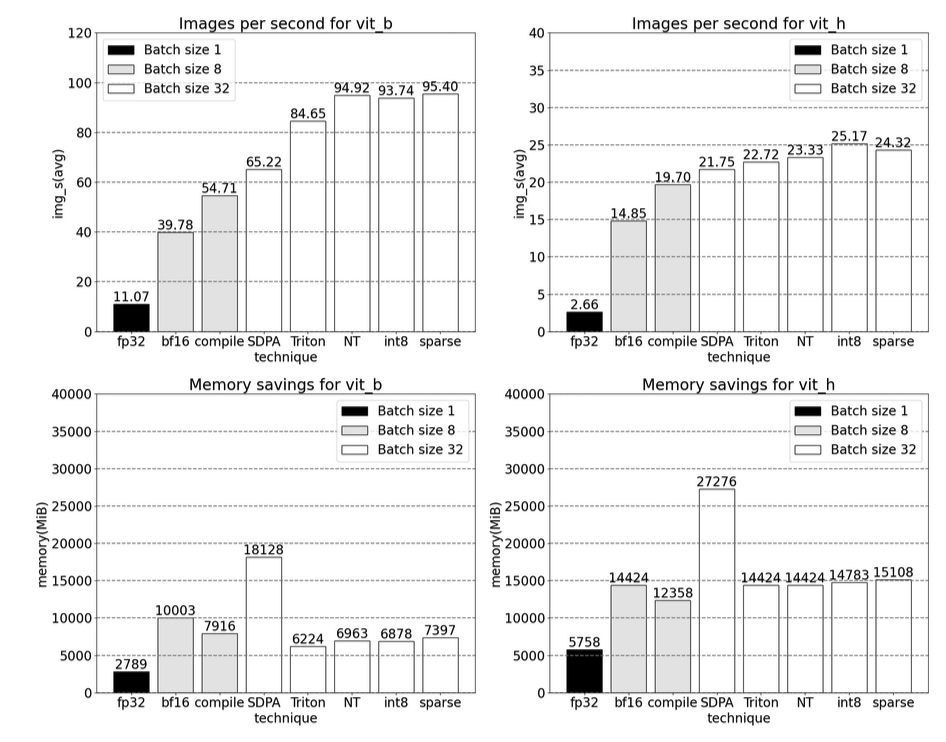

# SegmentAnything Model

SAM은 promptable image mask를 생성하는 zero-shot vision model이다.


SAM architecture는 [paper에서 설명된 것처럼](https://arxiv.org/abs/2304.02643) Transformer architecture 기반의 여러 prompt encoder와 image encoder를 포함한다. 여기서는 최소 및 최대 Vision Transformer backbone의 성능을 측정했다. ViT-B와 ViT-H다. 단순화를 위해 ViT-B model trace만 보여준다.

# Optimization

아래에서는 SAM을 optimize한 이야기를 다룬다. Performance analysis, bottleneck identification, 그리고 이 문제를 해결하는 새로운 PyTorch feature 구축이다. 전체 과정에서 `torch.compile`, SDPA, Triton kernel, nested tensor, semi-structured sparsity 같은 새로운 PyTorch feature를 보여준다. 다음 절들은 단계적으로 쌓이며, 최종적으로 Github에서 사용할 수 있는 SAM-fast(https://github.com/pytorch-labs/segment-anything-fast)를 만든다. 각 feature의 동기를 설명하기 위해 실제 kernel 및 memory trace를 사용하고, 완전한 PyTorch native tool을 사용하며, Perfetto UI(https://perfetto.dev/#viewer)로 trace를 visualize한다.

## Baseline

우리의 SAM baseline은 Facebook Research의 수정하지 않은 model이며, float32 data type과 batch size 1을 사용한다. 초기 warmup을 조금 거친 뒤 PyTorch Profiler로 kernel trace를 볼 수 있다.

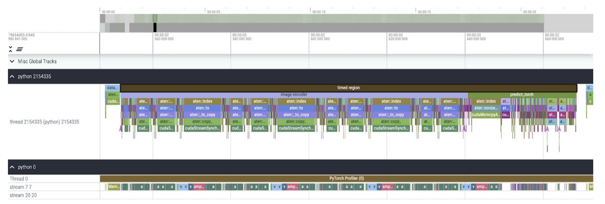

두 가지 mature optimization 영역을 확인했다.

첫 번째는 `aten::index`의 긴 호출이다. 이는 tensor indexing operation(예: `[]`)의 lower-level call이다. `aten::index`에서 소비한 실제 GPU time은 상대적으로 낮지만, `aten::index`는 두 kernel을 launch하고 그 사이에 blocking `cudaStreamSynchronize`가 발생한다. 이는 CPU가 두 번째 kernel을 launch하기 전 GPU 처리가 끝날 때까지 기다린다는 뜻이다. SAM을 optimize하려면 idle time을 만드는 blocking GPU synchronization을 제거해야 한다.

두 번째는 matrix multiplication에 많은 GPU time이 쓰인다는 점이다(위 trace에서 stream 7의 dark green). 이는 Transformer에서 흔하다. Matrix multiplication에 쓰는 GPU time을 줄일 수 있다면 SAM을 크게 가속할 수 있다.

Out-of-the-box SAM에서 throughput(img/s)과 memory overhead(GiB)를 측정해 baseline을 세울 수 있다.

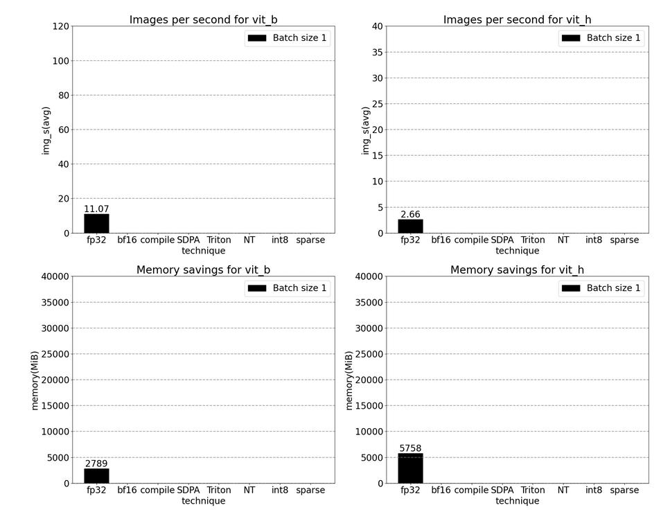

## Bfloat16 Half Precision(+GPU Synchronization and Batching)

Matrix multiplication에 더 적은 시간을 쓰도록 하는 첫 번째 문제를 해결하기 위해 bfloat16으로 전환할 수 있다. Bfloat16은 흔히 쓰는 half precision type이다. Parameter와 activation의 precision을 낮추면 computation에서 많은 시간과 memory를 절약할 수 있다. Parameter precision을 낮출 때는 end-to-end model accuracy를 검증하는 것이 매우 중요하다.

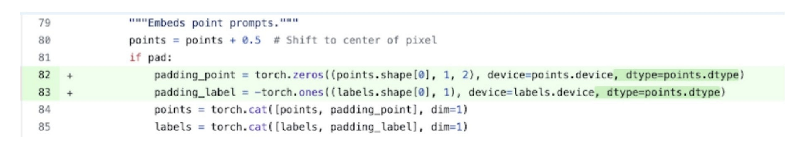

여기서는 padding data type을 half precision bfloat16으로 바꾸는 예를 보여준다. Code는 여기 있다(https://github.com/pytorch-labs/segment-anything-fast/blame/main/segment_anything_fast/modeling/prompt_encoder.py#L86).

단순히 `model.to(torch.bfloat16)`을 설정하는 것 외에도, default data type을 가정하는 몇 가지 작은 부분을 바꿔야 했다.

이제 GPU synchronization을 제거하려면 이를 유발하는 operation을 audit해야 한다. GPU trace에서 `cudaStreamSynchronize` 호출을 검색하면 해당 code snippet을 찾을 수 있다. 실제로 synchronization 없이 다시 쓸 수 있는 위치를 두 곳 찾았다.

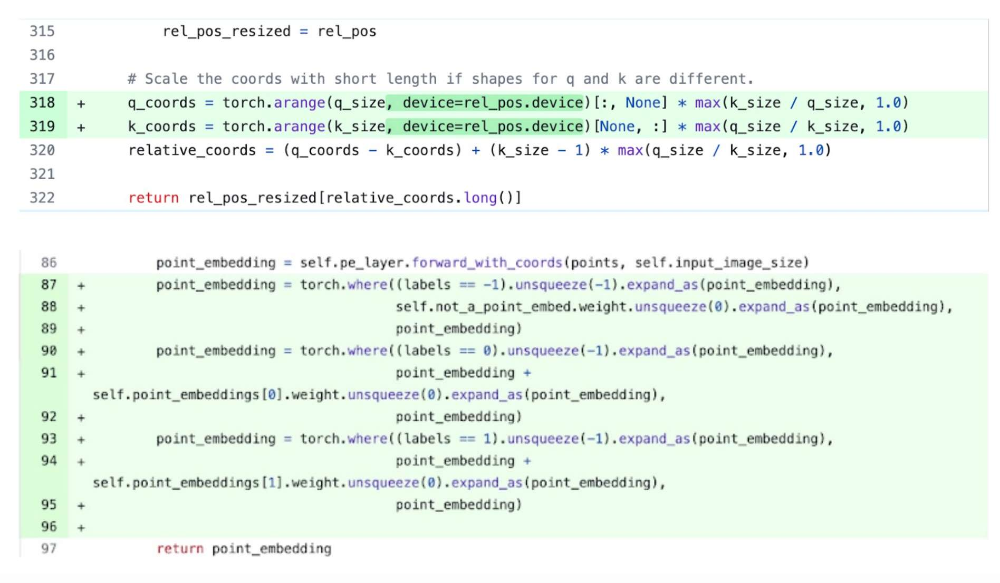

구체적으로 SAM의 image encoder에서 coordinate scaler 역할을 하는 변수 `q_coords`와 `k_coords`가 있다. 이들은 CPU에서 allocate되고 처리된다. 하지만 이 변수들이 `rel_pos_resized`에서 indexing에 사용되는 순간, indexing operation이 자동으로 이 변수들을 GPU로 옮긴다. 이 copy가 위에서 관찰한 GPU synchronization을 일으켰다. SAM의 prompt encoder에서도 indexing의 두 번째 호출을 발견했고, 위와 같이 `torch.where`로 다시 쓸 수 있었다.

### Kernel Trace

이 변경을 적용한 뒤, 각 kernel call 사이에 눈에 띄는 time gap이 보이기 시작했다. 이는 보통 작은 batch size(여기서는 1)에서 관찰되며, kernel launch의 GPU overhead 때문이다. 실제 optimization 영역을 더 자세히 보기 위해 batch size 8로 SAM inference를 분석하기 시작할 수 있다.

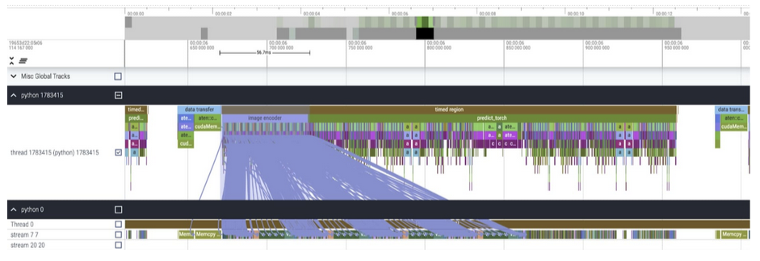

각 kernel이 소비한 시간을 보면, SAM의 대부분 GPU time은 elementwise kernel과 softmax operation에 쓰인다. 따라서 matrix multiplication은 이제 상대적으로 작은 overhead가 되었음을 볼 수 있다.

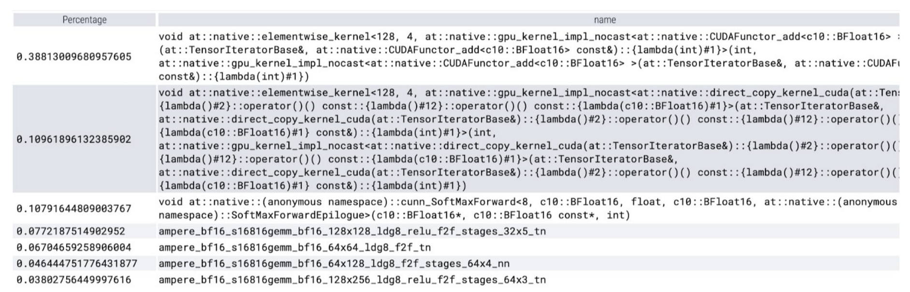

GPU synchronization과 bfloat16 optimization을 합치면 SAM performance를 최대 3배까지 높였다.

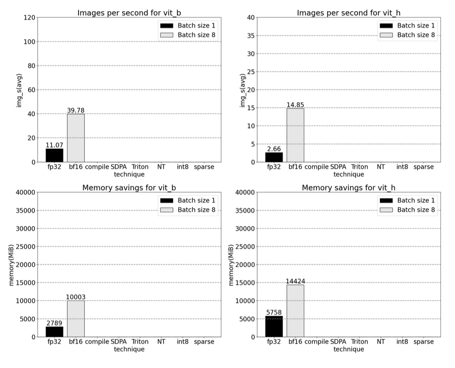

## Torch.compile(+Graph Break and CUDA Graph)

위에서 분석한 elementwise kernel처럼 많은 small operation이 관찰될 때, operation을 fuse하는 compiler로 전환하면 강력한 이점을 얻을 수 있다. 최근 release된 PyTorch의 `torch.compile`은 다음을 잘 수행한다.

- `nn.LayerNorm` 또는 `nn.GELU` 같은 operation sequence를 하나의 GPU kernel call로 fuse한다.
- Epilogue: matrix multiplication kernel 바로 뒤에 오는 operation을 fuse하여 GPU kernel call 수를 줄인다.

이러한 optimization을 통해 GPU global memory round trip 수를 줄이고 inference를 가속한다. 이제 SAM image encoder에 `torch.compile`(https://github.com/pytorch-labs/segment-anything-fast/blob/3bd74614fe7285de4de3d763d8ec2e951c4c589c/experiments/eval_combo.py#L196-L201)을 시도할 수 있다. Performance를 최대화하기 위해 다음과 같은 advanced compile technique을 사용한다.

- `torch.compile`의 max-autotune mode를 사용해 CUDA graph와 custom epilogue가 있는 shape-specific kernel을 활성화한다.
- `TORCH_LOGS="graph_breaks,recompiles"`를 설정해 graph break(https://pytorch.org/docs/main/torch.compiler_faq.html#graph-breaks)나 recompilation이 발생하지 않는지 수동으로 확인한다.
- Encoder에 입력되는 image batch를 zero padding하여 compile이 static shape를 받도록 한다. 이를 통해 recompilation 없이 custom epilogue가 있는 shape-specific optimized kernel을 항상 사용할 수 있다.

```python
predictor.model.image_encoder = \
    torch.compile(predictor.model.image_encoder, mode=use_compile)
```

### Kernel Trace

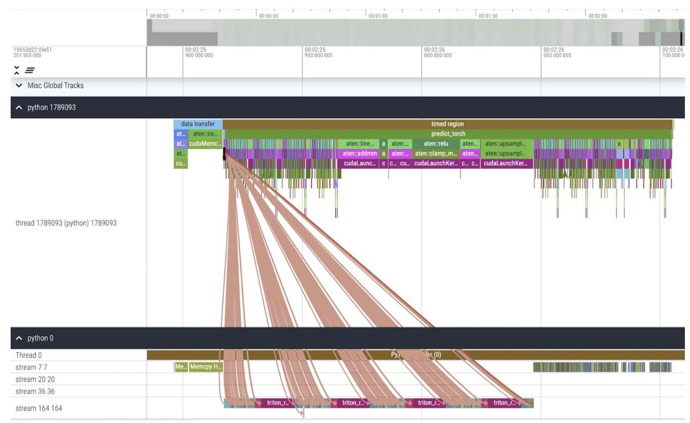

`torch.compile`은 매우 잘 동작한다. 단일 CUDA graph를 launch하며, 이는 timed region 안에서 GPU time의 큰 부분을 차지한다. 다시 performance analysis를 실행하고 특정 kernel이 소비한 GPU time percentage를 보자.

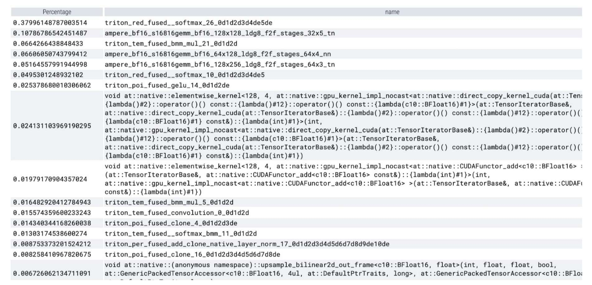

이제 softmax가 대부분의 시간을 차지하고, 그 다음은 여러 GEMM variant다. Batch size 8과 위 변경을 사용했을 때 다음 measurement를 관찰했다.

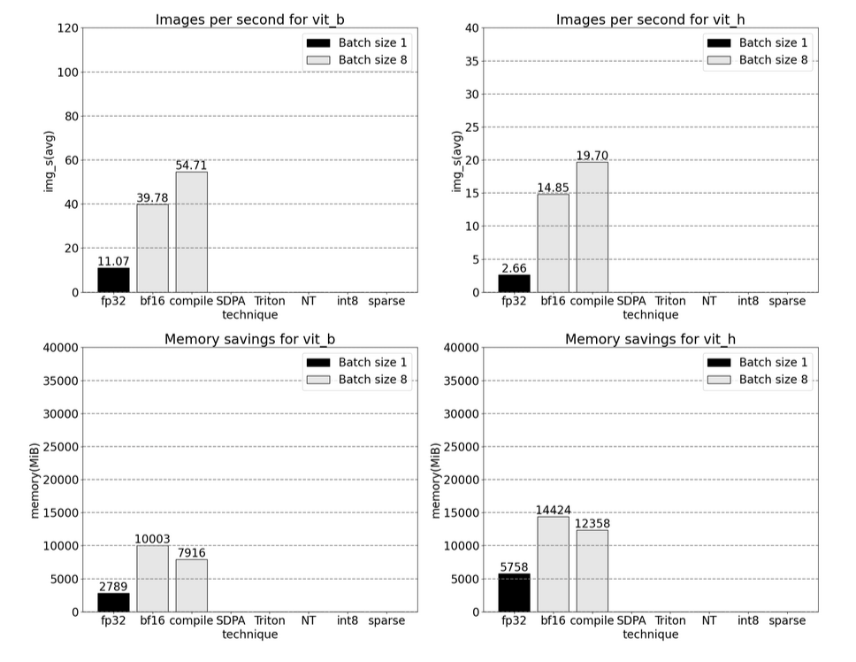

## SDPA: scaled_dot_product_attention

다음으로 Transformer performance overhead에서 가장 흔한 영역 중 하나인 attention mechanism을 다룬다. Naive attention implementation은 sequence length에 대해 time과 memory가 quadratic하게 scale된다. PyTorch의 `scaled_dot_product_attention` operation은 Flash Attention, FlashAttentionV2, xFormers의 memory-efficient attention 원리에 기반하며, GPU attention을 크게 가속할 수 있다. `torch.compile`과 결합하면 이 operation은 MultiheadAttention variant의 common pattern을 표현하고 fuse할 수 있게 한다. 작은 변경 묶음(https://github.com/facebookresearch/segment-anything/compare/50cb459d080bcd783a4b481d3bde4150d35ac497...7dc75fdf283693f73606f2fe7fdcb693afcb16b9)을 통해 model이 `scaled_dot_product_attention`을 사용하도록 조정할 수 있다.

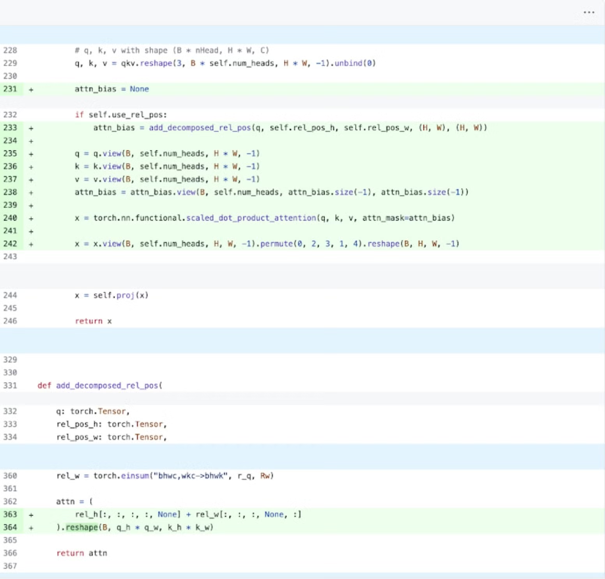

PyTorch native attention implementation, code 보기(https://github.com/pytorch-labs/segment-anything-fast/blob/main/segment_anything_fast/modeling/image_encoder.py#L236).

### Kernel Trace

이제 특히 memory-efficient attention kernel이 GPU에서 많은 computation time을 차지하는 것을 볼 수 있다.

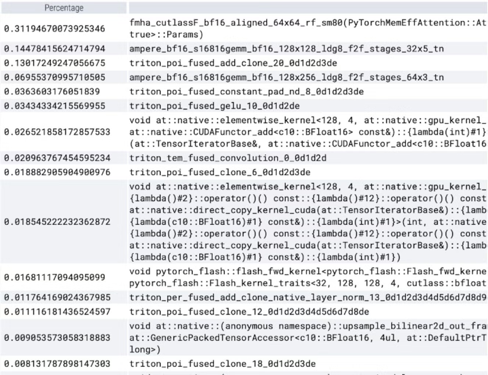

PyTorch native `scaled_dot_product_attention`을 사용하면 batch size를 크게 늘릴 수 있다. 이제 batch size 32와 위 변경을 사용했을 때 다음 measurement를 관찰했다.

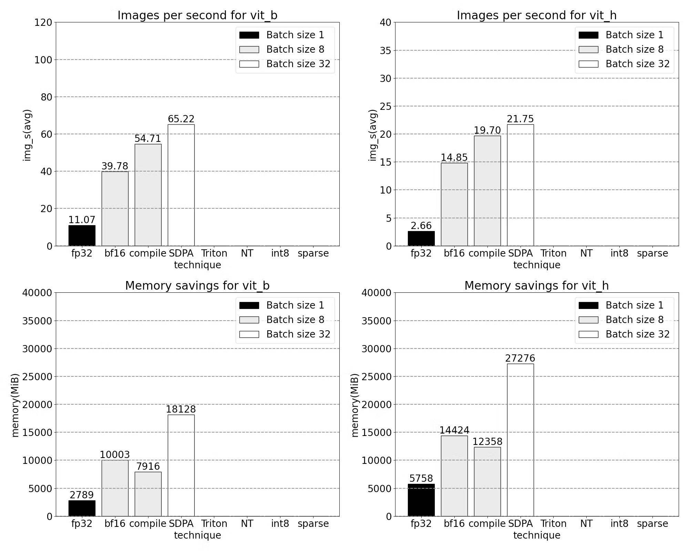

## Triton: Relative Positional Encoding을 Fuse하기 위한 Custom SDPA

잠시 inference throughput에서 벗어나 전체 SAM memory를 분석하기 시작했다. Image encoder에서 큰 memory allocation peak를 보았다.

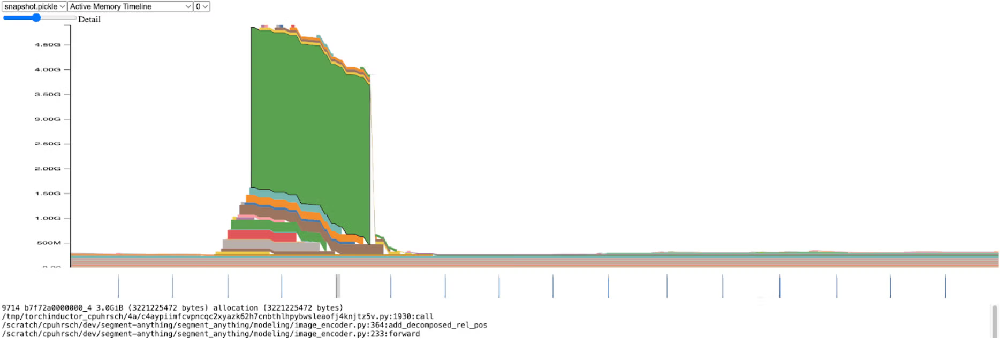

확대해 보면 이 allocation은 `add_decomposed_rel_pos`의 다음 line(https://github.com/pytorch-labs/segment-anything-fast/blob/main/segment_anything_fast/modeling/image_encoder.py#L373)에서 발생한다.

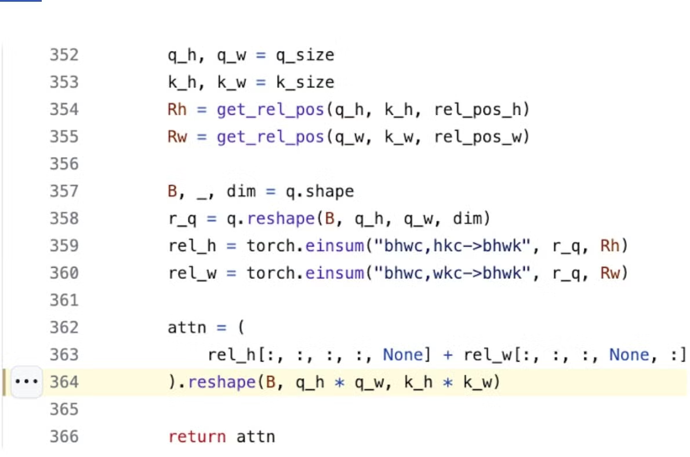

여기서 `attn` variable은 두 개의 작은 tensor를 더한 것이다. 하나는 shape `(B, q_h, q_w, k_h, 1)`의 `rel_h`, 다른 하나는 shape `(B, q_h, q_w, 1, k_w)`의 `rel_w`다.

Attention bias size가 3.0GiB를 넘을 때 memory-efficient attention kernel(SDPA를 통해 사용)이 오래 걸리는 것은 놀랍지 않다. 이 큰 `attn` tensor를 allocate하지 않고 두 개의 작은 `rel_h`와 `rel_w` tensor를 SDPA에 전달한 뒤, 필요한 순간에만 `attn`을 구성한다면 significant performance improvement를 기대할 수 있다.

불행히도 이는 간단한 수정이 아니다. SDPA kernel은 CUDA로 작성된 highly optimized kernel이다. 우리는 Triton으로 전환해 이해하고 사용하기 쉬운 FlashAttention implementation tutorial(https://triton-lang.org/main/getting-started/tutorials/06-fused-attention.html)을 사용할 수 있다. 많은 탐색과 xFormers의 Daniel Haziza와의 긴밀한 협업 끝에, fused version의 kernel을 비교적 간단히 구현할 수 있는 input shape case를 찾았다. 자세한 내용은 repository(https://github.com/pytorch-labs/segment-anything-fast/blob/main/segment_anything_fast/flash_4.py)에 추가되어 있다. 놀랍게도 inference case에서는 350 lines 미만의 code로 완료할 수 있다.

이는 Triton code로 직접 구축한 새로운 kernel로 PyTorch를 확장하는 좋은 예다.

### Kernel Trace

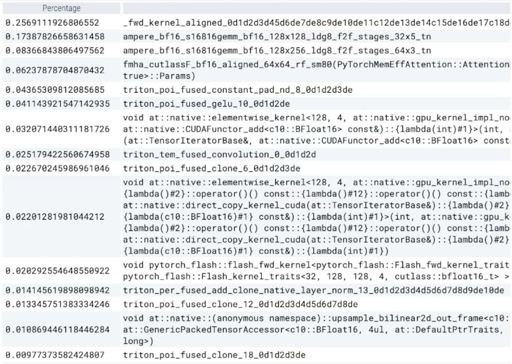

Custom positional Triton kernel을 사용했을 때 batch size 32에서 다음 measurement를 관찰했다.

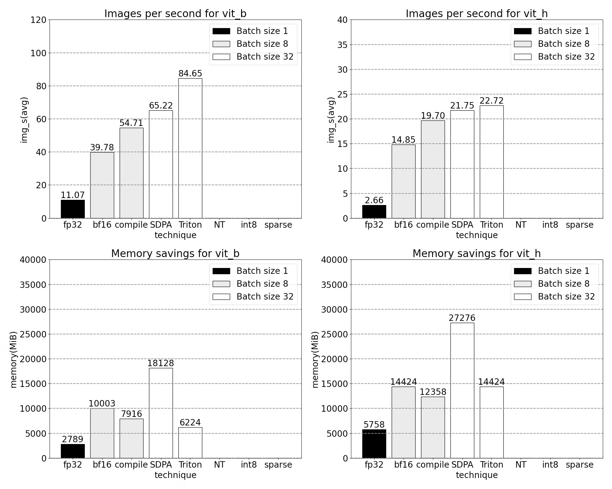

## NT: NestedTensor와 Batched predict_torch

우리는 image encoder에 많은 시간을 썼다. 가장 많은 computation time을 차지하므로 당연하다. 하지만 이 시점에서 이미 꽤 optimize되었고, 가장 많은 시간을 차지하는 operator를 더 개선하려면 상당한 추가 투자가 필요하다.

Mask prediction pipeline에서 흥미로운 관찰(https://github.com/pytorch-labs/segment-anything-fast/blob/7cd6ba3cea451602acb7d36d176da06c70ac68f1/experiments/eval_combo.py#L137-L157)을 발견했다. 각 image마다 연관된 `size`, `coords`, `fg_labels` tensor가 있다. 이 tensor들은 각각 다른 batch size를 가진다. Image 자체도 크기가 다르다. 이런 data representation은 jagged data(https://en.wikipedia.org/wiki/Jagged_array)처럼 보인다. PyTorch가 최근 release한 NestedTensor(pytorch.org/tutorials/prototype/nestedtensor.html)를 사용하면 data pipeline을 수정해 batched coordinate와 `fg_labels` tensor를 하나의 NestedTensor로 결합할 수 있다. 이는 image encoder 뒤의 prompt encoder와 mask decoder에 큰 performance benefit을 줄 수 있다. 호출은 다음과 같다.

```python
torch.nested.nested_tensor(data, dtype=dtype, layout=torch.jagged)
```

### Kernel Trace

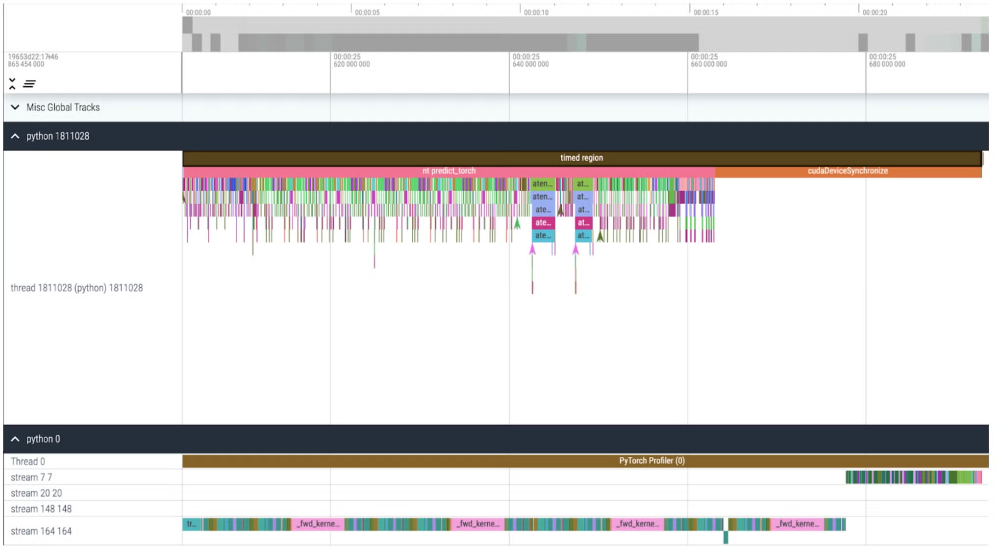

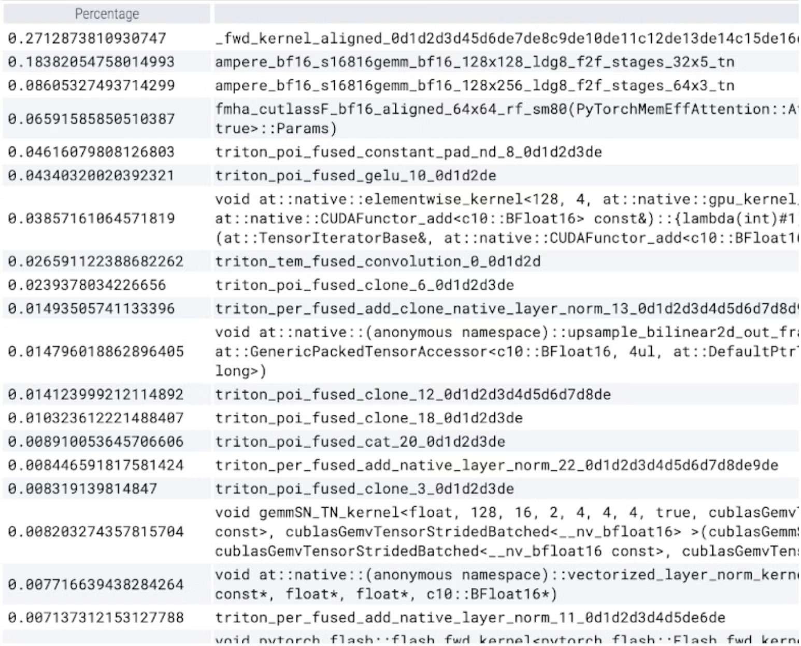

이제 CPU가 GPU 처리보다 빠르게 kernel을 launch할 수 있고, timed region 끝에서 GPU 완료를 기다리며 긴 시간을 소비하는 것(`cudaDeviceSynchronize`)을 볼 수 있다. 더 이상 GPU에서 kernel 사이 idle time(blank area)도 보이지 않는다.

Nested tensor를 사용했을 때 batch size 32와 위 변경을 사용해 다음 measurement를 관찰했다.

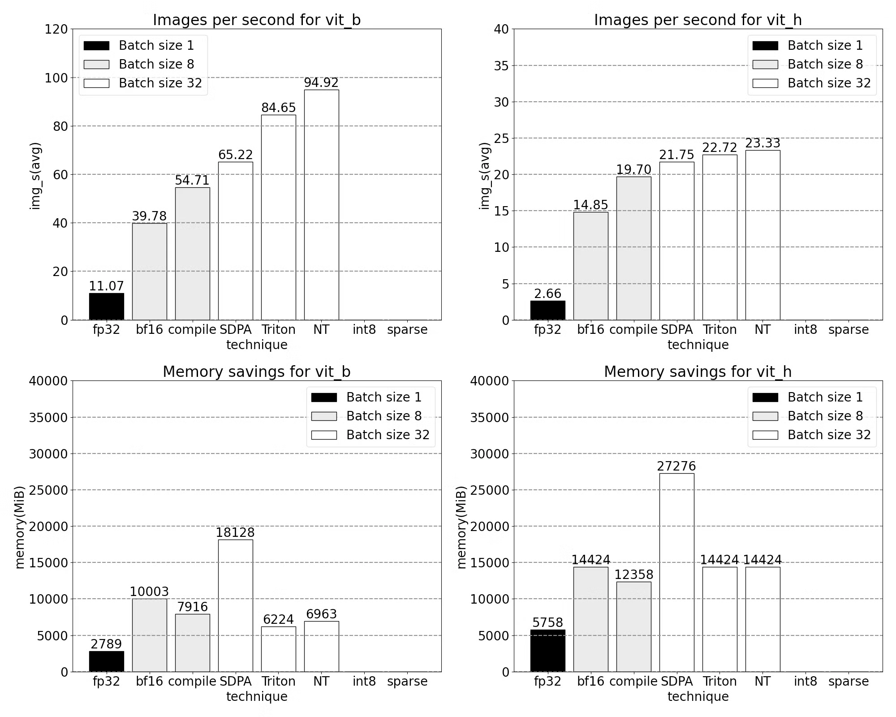

## int8: Quantization and Approximate Matrix Multiplication

위 trace에서 이제 GEMM kernel에 많은 시간이 쓰이는 것을 보았다. 충분히 optimize되어 이제 inference에서 matrix multiplication이 scaled dot product attention보다 더 많은 시간을 차지한다.

fp32에서 bfloat16으로 전환하며 얻은 초기 학습을 바탕으로, int8 quantization을 통해 더 낮은 precision을 simulate해 한 단계 더 나아가 보자. Quantization method를 보면 우리는 dynamic quantization(https://docs.pytorch.org/tutorials/recipes/quantization.html)에 집중한다. 여기서 model은 layer의 possible input과 weight range를 관찰하고, 표현 가능한 int8 range를 세분화해 관찰된 value를 균등하게 "spread"한다. 최종적으로 각 floating-point input은 range [-128, 127]의 단일 integer로 mapping된다. 더 많은 정보는 PyTorch quantization tutorial(https://docs.pytorch.org/tutorials/recipes/quantization.html)을 참고하라.

Precision을 낮추면 peak memory를 즉시 절약할 수 있지만, inference acceleration을 실현하려면 SAM operation 전체에서 int8을 충분히 활용해야 한다. 이를 위해 efficient int8@int8 matrix multiplication kernel, high precision에서 low precision으로의 conversion logic(quantization), 그리고 low precision에서 high precision으로 돌아가는 reverse conversion(dequantization)을 구축해야 한다. `torch.compile`의 힘을 활용하면 이러한 quantization 및 dequantization routine을 compile하고 efficient single kernel 및 matrix multiplication epilogue로 fuse할 수 있다. 생성된 implementation은 꽤 짧아서 250 lines 미만이다(https://github.com/pytorch-labs/segment-anything-fast/blob/21b0208ae46eefc5659f7f200a2bf447add8765b/segment_anything_fast/dynamic_quant.py). API와 usage에 대한 자세한 정보는 pytorch-labs/ao를 참고하라.

Inference 시 model을 quantize하면 보통 accuracy regression이 보이지만, SAM은 low-precision inference에 특히 robust해 accuracy loss가 최소다. Quantization을 추가한 뒤 **batch size 32**와 위 변경에서 다음 measurement를 관찰했다.

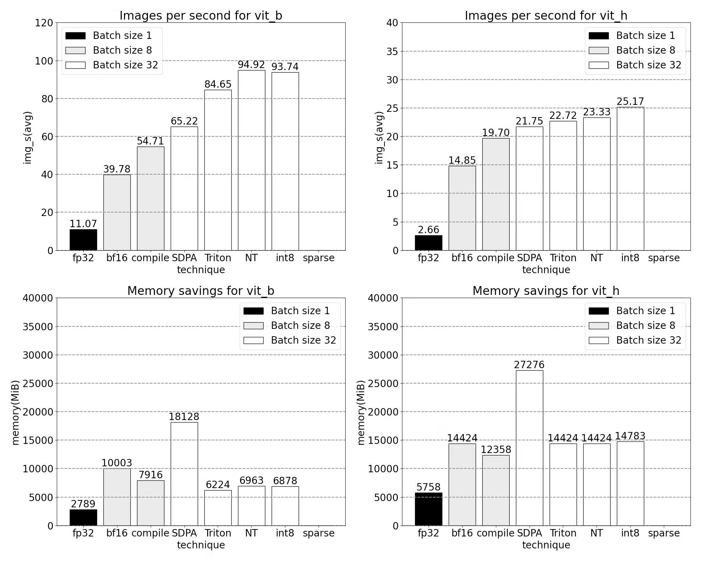

## sparse: Semi-Structured(2:4) Sparsity

Matrix multiplication은 여전히 bottleneck이다. Model acceleration handbook의 또 다른 classic method인 sparsification으로 matrix multiplication을 approximate할 수 있다. Matrix를 sparsify한다는 것은 일부 값을 zero로 만드는 것이며, 이론적으로 더 적은 bit로 weight와 activation tensor를 저장할 수 있다. Tensor의 어떤 weight를 zero로 설정할지 결정하는 과정을 pruning이라고 부른다. Pruning의 아이디어는 weight tensor의 작은 weight가 layer의 net output에 거의 기여하지 않는다는 것이다. 보통 output은 weight와 activation의 product다. 작은 weight를 prune하면 accuracy를 크게 잃지 않고 model size를 줄일 수 있다.

Pruning method는 매우 다양하다. Weight를 greedy하게 prune하는 completely unstructured 방식부터, tensor의 큰 subcomponent를 한 번에 prune하는 highly structured 방식까지 있다. 어떤 방법을 선택할지는 단순하지 않다. Unstructured pruning은 이론적으로 accuracy에 가장 작은 영향을 줄 수 있지만, GPU는 큰 dense matrix multiplication에 매우 효율적이고 sparse case에서는 큰 performance drop을 겪을 수 있다. PyTorch가 지원하는 최근 pruning method 하나는 balance를 추구하며, semi-structured(또는 2:4) sparsity라고 부른다. 이 sparse storage는 original tensor를 의미 있는 50%까지 줄이면서 high-performance 2:4 GPU kernel을 활용할 수 있는 dense tensor output을 만든다. 아래 그림을 참고하라.

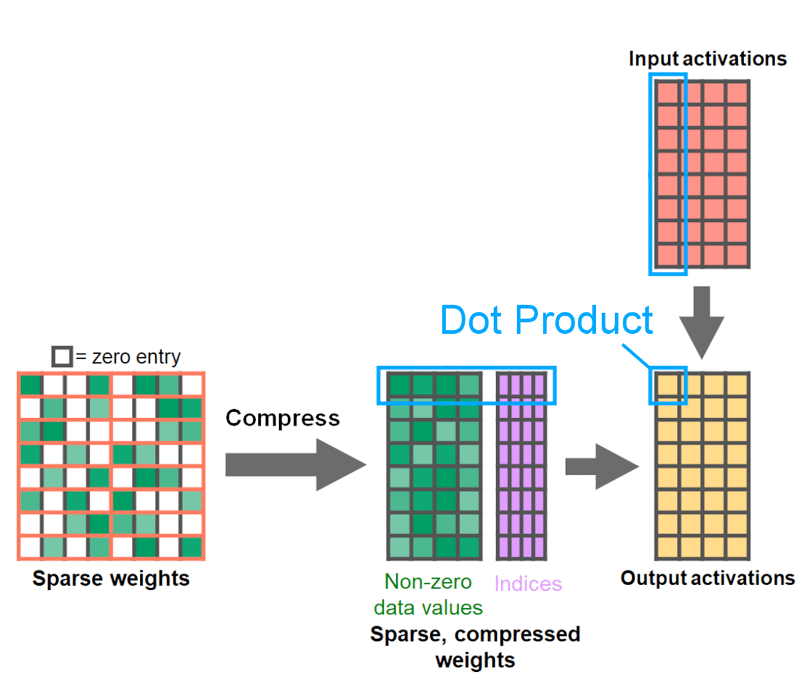

출처: developer.nvidia.com/blog/exploiting-ampere-structured-sparsity-with-cusparselt

이 sparse storage format과 관련 fast kernel을 사용하려면 weight를 format constraint에 맞게 prune해야 한다. 우리는 1x4 region에서 가장 작은 weight 두 개를 prune하는 방식을 선택하고, performance와 accuracy tradeoff를 측정했다. Weight를 default PyTorch("strided") layout에서 새로운 semi-structured sparse layout으로 바꾸는 것은 쉽다. `apply_sparse(model)`을 구현하는 데 필요한 것은 32 lines의 Python code뿐이다.

```python
import torch
from torch.sparse import to_sparse_semi_structured, SparseSemiStructuredTensor

# Sparsity helper functions
def apply_fake_sparsity(model):
    """
    This function simulates 2:4 sparsity on all linear layers in a model.
    It uses the torch.ao.pruning flow.
    """
    # torch.ao.pruning flow
    from torch.ao.pruning import WeightNormSparsifier
    sparse_config = []
    for name, mod in model.named_modules():
        if isinstance(mod, torch.nn.Linear):
            sparse_config.append({"tensor_fqn": f"{name}.weight"})

    sparsifier = WeightNormSparsifier(sparsity_level=1.0,
                                      sparse_block_shape=(1,4),
                                      zeros_per_block=2)
    sparsifier.prepare(model, sparse_config)
    sparsifier.step()

    sparsifier.step()
    sparsifier.squash_mask()


def apply_sparse(model):
    apply_fake_sparsity(model)
    for name, mod in model.named_modules():
        if isinstance(mod, torch.nn.Linear):
            mod.weight = torch.nn.Parameter(to_sparse_semi_structured(mod.weight))
```

2:4 sparsity를 사용하면 ViT-B와 batch size 32의 SAM에서 peak performance를 관찰했다.

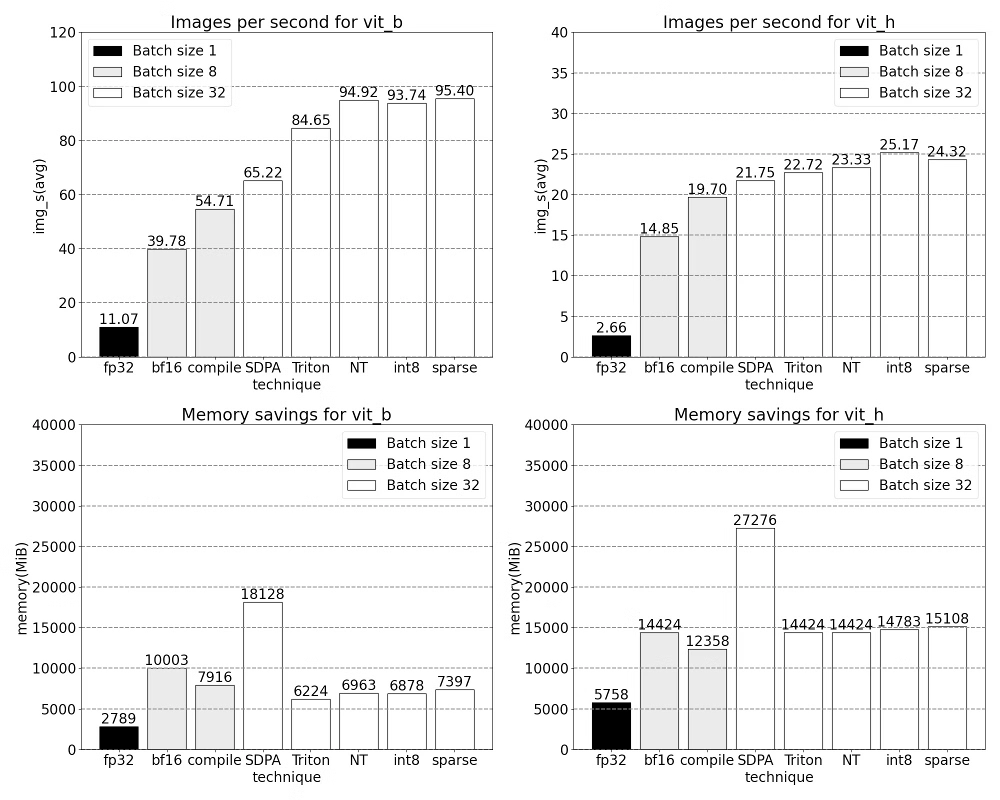

# Conclusion

요약하면, 우리는 지금까지 가장 빠른 Segment Anything(https://github.com/facebookresearch/segment-anything) implementation을 발표(https://www.youtube.com/watch?v=IWpM_9AsC-U)하게 되어 기쁘다. 새로 release된 많은 feature를 사용해 Meta의 original SAM을 pure PyTorch로 다시 작성했으며 accuracy loss는 없다.

- Torch.compile: PyTorch native JIT compiler로, 빠르고 자동화된 PyTorch operation fusion을 제공한다. [tutorial]
- GPU quantization: reduced precision operation으로 model을 가속한다. [https://github.com/pytorch/ao/tree/main#torchao]
- Scaled Dot Product Attention(SDPA): 새로운 memory-efficient attention implementation. [https://docs.pytorch.org/tutorials/intermediate/scaled_dot_product_attention_tutorial.html]
- Semi-structured(2:4) sparsity: 더 적은 bit로 weight와 activation을 저장해 model을 가속한다. [https://docs.pytorch.org/tutorials/prototype/semi_structured_sparse.html]
- Nested tensor: non-uniform batch 및 image size를 위한 highly optimized jagged array processing. [https://docs.pytorch.org/tutorials/prototype/nestedtensor.html]
- Triton kernel: Triton으로 쉽게 구축하고 optimize할 수 있는 custom GPU operation.

이 blog post에 제시된 data를 재현하는 방법에 대한 자세한 정보는 segment-anything-fast의 experiments folder(https://github.com/pytorch-labs/segment-anything-fast/tree/main/experiments)를 확인하라. 기술적 문제가 있으면 주저하지 말고 연락하거나 issue를 제기해 달라.

다음 글에서는 PyTorch native로 작성한 LLM에 대해 유사한 performance improvement를 공유할 예정이라 기대된다!

## Acknowledgements

SDPA kernel을 작성하고 custom one-off Triton kernel 설계를 도와준 Meta의 xFormers(https://github.com/facebookresearch/xformers) team, 특히 Daniel Haziza와 Francisco Massa에게 감사드린다.

