> 블로그 출처: https://pytorch.org/blog/accelerating-generative-ai-4/ By Yejin Lee, Carole-Jean Wu, Christian Puhrsch, Joel Schlosser, Driss Guessous, Jeffrey Wan, Joe Isaacson, Can Balioglu, Juan Pino. 이 글은 과학 보급과 지식 공유 목적으로 번역했으며, 권리 침해 시 삭제합니다.

# PyTorch로 생성형 AI 가속하기 4부: Seamless M4T, 빠른 최적화

이 글은 pure native PyTorch를 사용해 generative AI model을 가속하는 방법에 집중한 multi-series blog의 네 번째 부분입니다. code를 바로 보려면 github(seamless_communication(https://github.com/facebookresearch/seamless_communication/pull/328), fairseq2(https://github.com/facebookresearch/fairseq2/pull/272))를 확인하세요. 우리는 새로 release된 PyTorch performance feature와 실제 예시를 공유하게 되어 기쁩니다. native PyTorch performance를 어디까지 끌어올릴 수 있는지 살펴봅니다. 1부에서는 pure native PyTorch만 사용해 Segment Anything을 8배 이상 가속하는 방법을 보여주었습니다(pytorch.org/blog/accelerating-generative-ai/). 2부에서는 native PyTorch optimization만으로 Llama-7B를 거의 10배 가속하는 방법을 보여주었습니다(https://pytorch.org/blog/accelerating-generative-ai-2/). 3부에서는 native PyTorch optimization만으로 text-to-image diffusion model을 최대 3배 가속하는 방법을 보여주었습니다(https://pytorch.org/blog/accelerating-generative-ai-3/).

이 블로그에서는 FAIR의 Seamless M4T-v2 model acceleration에 집중합니다. CUDA Graph와 native PyTorch optimization을 사용해 **accuracy 손실 없이 text decoder module 2배 acceleration, vocoder module 30배 acceleration, 최종 end-to-end inference 2.7배 acceleration**을 달성합니다.

- [PyTorch 블로그 번역 Accelerating Generative AI Part III: Diffusion, Fast](https://mp.weixin.qq.com/s/Sbad9AiMQng3-NZUP5vROA)
- [【블로그 번역】Presenting Flux Fast: Flux를 H100에서 빠르게 달리게 하기
](https://mp.weixin.qq.com/s/KRKqZdcTjfbAmhIPYDXwTQ)
- [PyTorch로 생성형 AI 가속하기 - GPT Fast](https://mp.weixin.qq.com/s/wNfpeWxP4HK633RcTBkKyg)

## 소개

Seamless M4T는 FAIR가 개발한 open source foundation speech/text translation 및 transcription technology입니다. Seamless M4T는 large-scale multilingual and multimodal machine translation model이며, 최신 version(https://github.com/facebookresearch/seamless_communication)인 Seamless M4T-v2는 2023년 11월 30일 release되었습니다. Seamless M4T-v2의 high-level model architecture는 그림 1과 같습니다.

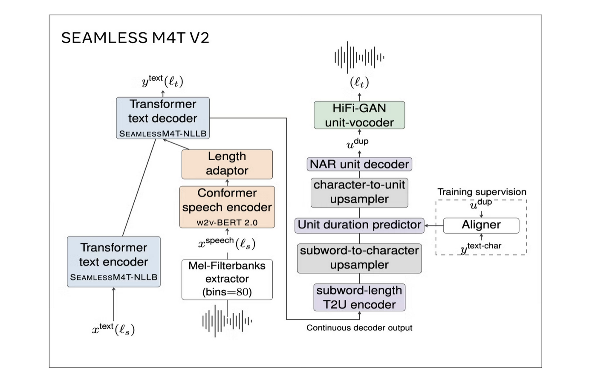

**그림 1. Seamless M4T-v2의 model architecture.**

translation model에서 inference latency를 가속하는 것은 더 빠른 cross-language communication을 통해 user experience를 개선하는 데 매우 중요합니다. 특히 chatbot, speech translation, real-time subtitle 같은 application에서는 빠른 translation을 위해 batch_size=1이 자주 사용되며 latency가 매우 중요합니다. 따라서 우리는 Amdahl's law의 bottleneck을 이해하기 위해 그림 2처럼 batch_size=1 inference를 performance analysis했습니다. 결과는 text decoder와 vocoder가 가장 시간이 많이 드는 module이며, 각각 inference time의 61%와 23%를 차지함을 보여줍니다.

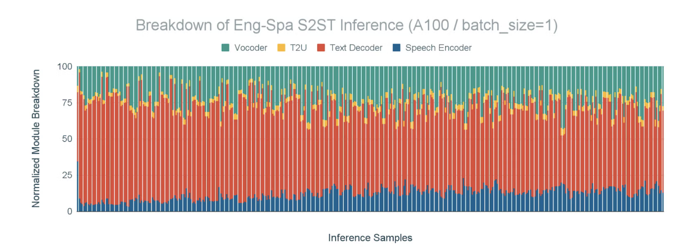

**그림 2. Text decoder와 vocoder는 가장 시간이 많이 걸리는 module입니다. A100 GPU에서 batch_size=1 영어-스페인어 S2ST(speech-to-speech text) task의 module별 inference time breakdown.**

text decoder와 vocoder의 performance bottleneck을 더 자세히 보기 위해, FLEURS dataset(https://huggingface.co/datasets/google/fleurs)의 영어-스페인어 translation example 8번째 sample에 대해 text decoder와 vocoder의 GPU trace를 분석했습니다. 그림 3과 같습니다. 결과는 **text decoder와 vocoder가 심각하게 CPU bound인 module**임을 보여줍니다. CPU overhead로 인해 생긴 큰 gap이 GPU kernel launch를 지연시키고, 두 module의 execution time을 크게 늘리는 것을 관찰했습니다.

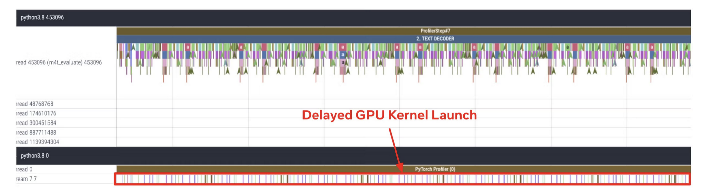

**(a) Text Decoder의 CPU 및 GPU trace**

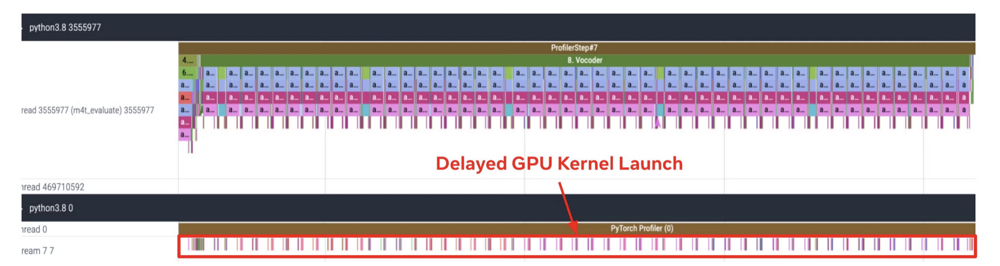

**그림 3. Text Decoder와 Vocoder는 심각한 CPU bound module입니다. FLEURS dataset 영어-스페인어 translation example 8번째 sample에서 (a) Text Decoder (b) Vocoder의 CPU 및 GPU trace. 이 trace는 A100 GPU에서 batch_size=1 inference를 실행해 얻었습니다.**

실제 system performance analysis 결과를 바탕으로 Seamless M4T-v2에서 text_decoder와 vocoder가 심각하게 CPU bound인 module임을 확인했고, 이 module들에 torch.compile + CUDA Graph를 활성화했습니다. 이 글에서는 batch_size=1 inference scenario에서 각 module에 torch.compile + CUDA Graph를 활성화하기 위해 필요한 수정 사항, CUDA Graph에 대한 논의, 다음 계획을 공유합니다.

## Torch.compile과 CUDA Graph

`torch.compile`은 PyTorch model을 독립적인 executable 또는 script로 compile할 수 있게 하는 PyTorch API입니다. 보통 불필요한 overhead를 제거해 model performance를 최적화하는 데 사용됩니다.

CUDA Graph는 NVIDIA가 제공하는 feature로, CUDA application에서 kernel launch를 최적화할 수 있게 합니다. CUDA kernel execution graph를 만들고, GPU에서 실행되기 전에 driver가 이를 preprocess하고 optimize할 수 있습니다. CUDA Graph의 주요 장점은 개별 kernel launch와 관련된 overhead를 줄인다는 것입니다. graph를 single unit으로 launch할 수 있기 때문에 host와 device 사이의 API call 및 data transfer 횟수가 줄어듭니다. 이는 특히 많은 small kernel을 가지거나 같은 kernel set을 여러 번 반복하는 application에서 큰 performance improvement로 이어질 수 있습니다. 더 알고 싶다면 이 논문을 참고하세요. 이 논문은 accelerated computing에서 data의 중요성을 강조합니다. "Where is the data? Why you cannot debate CPU vs GPU performance without the answer"(https://ieeexplore.ieee.org/abstract/document/5762730), 저자는 우리의 Kim Hazelwood입니다! 이는 deep learning이 compute industry를 완전히 바꾸기 전, NVIDIA가 general-purpose GPU(GPGPU)에 크게 투자하던 시기였습니다.

하지만 CUDA Graph는 1) fixed memory pointer, 2) compile time에 기록된 fixed tensor shape에서 동작합니다. 그래서 우리는 여러 input size 사이에서 CUDA Graph를 재사용하고, 매 iteration마다 CUDA Graph를 생성하는 일을 막고, CUDA Graph 내부 data가 서로 다른 run 사이에서 재사용되도록 하여 여러 decoding step에서 KV Cache를 공유할 수 있게 하기 위해 다음 개선을 도입했습니다.

## Text Decoder

Seamless의 Text Decoder는 NLLB [1]에서 온 decoder이며, T2TT(text-to-text translation)를 수행합니다. 또한 이 module은 CPU bound model입니다. GPU execution time이 CPU overhead를 숨길 만큼 길지 않습니다. **이는 autoregressive generation의 특성상 token을 sequential하게 처리해야 하기 때문**이며, GPU에서 달성 가능한 parallelism 양을 제한합니다. 이 관찰을 바탕으로 text decoder에 torch.compile + CUDA Graph를 활성화해 지배적인 CPU overhead를 줄였습니다. 그림 4와 같습니다.

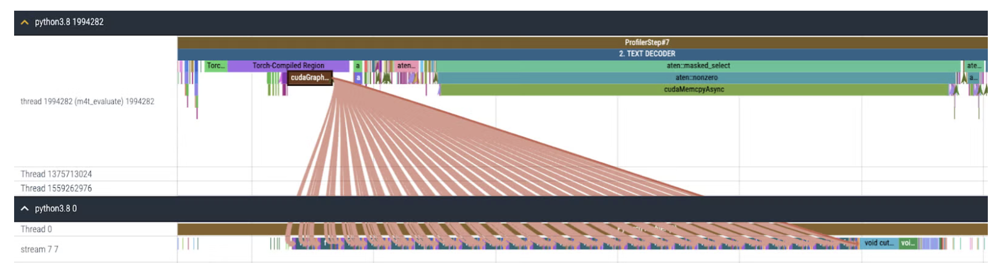

**그림 4. torch.compile + CUDA Graph 활성화 후 Text Decoder의 CPU 및 GPU trace.**

### 1. KV cache update와 retrieval

inference 동안 text decoder에는 두 compute phase가 있습니다. prompt를 consume하는 prefill phase와 output token을 하나씩 생성하는 incremental generation phase입니다. 충분히 높은 batch size 또는 input length가 주어지면, prefill은 충분히 많은 token을 parallel하게 처리할 수 있습니다. 이때 GPU performance가 bottleneck이고 CPU overhead는 performance에 큰 영향을 주지 않습니다. 반면 incremental token generation은 항상 sequence length 1로 실행되고, 대개 작은 batch size, 심지어 1로 실행됩니다. 예를 들어 interactive use case가 그렇습니다. 따라서 incremental generation은 CPU speed에 의해 제한될 수 있으므로 torch.compile + CUDA Graph의 좋은 candidate입니다.

하지만 incremental token generation phase에서 attention compute에 참여하는 key와 value의 sequence_length dimension은 매 step마다 1씩 증가하고, query의 sequence length는 항상 1로 유지됩니다. 구체적으로 key/value는 새로 계산한 sequence length 1의 key/value를 지금까지 KV cache에 저장된 key/value에 append해 생성합니다. 그러나 위에서 말했듯 CUDA Graph는 compile 중 모든 tensor shape을 기록하고 기록된 shape으로 replay합니다. 따라서 여기의 훌륭한 작업(https://fireworks.ai/blog)을 따라 이 문제를 해결하기 위해 몇 가지 수정을 했습니다.

**a)** KV-cache 처리를 수정해 Python integer가 아니라 새 값을 쓸 index를 CUDA tensor, 즉 `valid_seq_pos`로 받도록 했습니다.

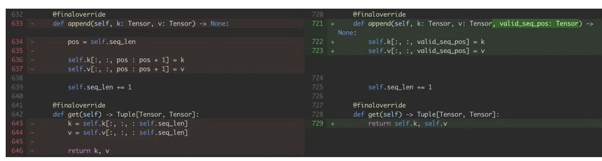

**그림 5. KV cache `append`와 `get` 수정.**

**b)** 또한 attention을 수정해 fixed shape의 key와 value를 사용하여 `max_seq_length` 위에서 동작하도록 했습니다. softmax는 현재 decoding step까지의 sequence position, 즉 `valid_seq_pos`에 대해서만 계산합니다. sequence position > 현재 decoding step, 즉 `valid_seq_pos`인 부분을 mask하기 위해 boolean mask tensor, 즉 `mask`를 만들고, sequence position > `valid_seq_pos`인 위치를 False로 설정합니다.

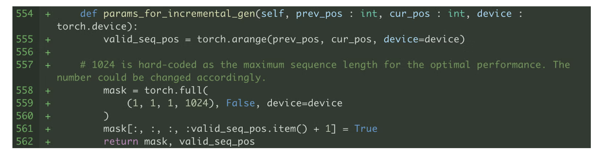

**그림 6. `valid_seq_pos`와 `mask`를 생성하는 helper function.**

중요한 점은 이러한 수정이 필요한 것보다 더 많은 sequence position, 최대 `max_seq_length`까지 attention을 계산해야 하므로 required compute를 늘린다는 것입니다. 하지만 이런 단점에도 불구하고, 우리의 결과는 standard PyTorch code와 비교해 torch.compile + CUDA Graph가 여전히 큰 performance advantage를 제공함을 보여줍니다.

**c)** 서로 다른 inference sample은 서로 다른 sequence length를 가지므로, cross-attention layer에 대해서도 서로 다른 shape의 input이 생성되며, 이 input들은 key와 value로 projection되어야 합니다. 따라서 input을 padding해 static shape을 갖도록 만들고, padding된 output을 mask하기 위한 padding mask를 생성합니다.

### 2. Memory pointer management

CUDA Graph는 tensor shape뿐 아니라 memory pointer도 기록하므로, 각 inference sample이 기록된 memory pointer, 예를 들어 KV cache를 올바르게 참조하게 하는 것이 중요합니다. 그래야 inference sample마다 CUDA Graph를 compile하지 않아도 됩니다. 그러나 Seamless codebase의 일부는 서로 다른 inference sample이 서로 다른 memory address를 참조하게 만들기 때문에, memory impact를 개선하기 위해 수정했습니다.

**e)** Seamless는 text decoding strategy로 beam search를 사용합니다. beam search 과정에서는 각 incremental decoding step마다 모든 attention layer에 대해 KV cache reordering을 수행해야 합니다. 그래야 선택된 각 beam이 해당 KV cache와 함께 실행됩니다. 아래 code snippet과 같습니다.

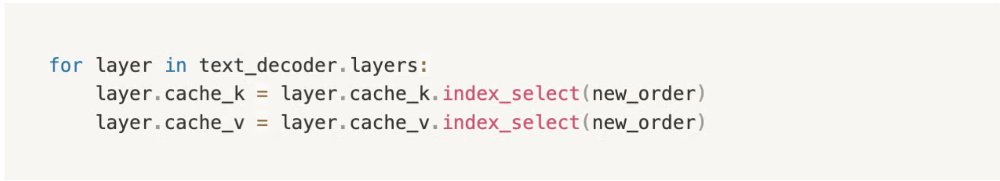

**그림 8. beam search decoding strategy의 KV cache reordering operation.**

위 code는 `cache_k`와 `cache_v`에 새 memory space를 allocate하고 original memory pointer를 overwrite합니다. 따라서 우리는 `copy_`(https://docs.pytorch.org/docs/stable/generated/torch.Tensor.copy_.html) operator를 사용해 각 cache의 memory pointer가 compile 중 기록된 상태를 유지하도록 KV cache reordering을 수정했습니다.

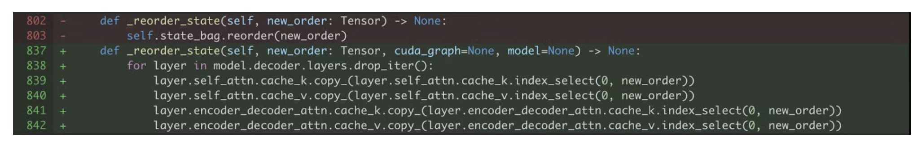

**그림 9. `copy_` operator로 KV cache를 in-place update**

**f)** 위 code를 수정해 text decoder에 torch.compile + CUDA Graph를 활성화한 뒤, text decoder의 overhead는 KV cache reordering으로 이동했습니다. 그림 10과 같습니다. KV cache reordering은 index_select를 96번 반복 호출합니다(24 decoder layer라고 가정하면, 각 layer는 두 type의 attention layer로 구성되고, 각 layer는 key와 value cache를 가집니다).

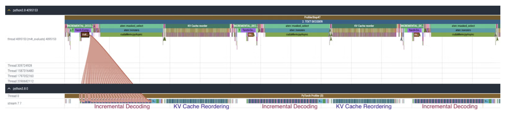

**그림 10. torch.compile + CUDA Graph 활성화 후 Text Decoder의 CPU 및 GPU trace.**

text decoder를 가속하는 일부로, 우리는 KV cache reordering에 추가로 torch.compile을 적용해 fused kernel의 이점을 얻었습니다. 그림 11과 같습니다. 여기서는 CUDA Graph(`mode='max-autotune'`)를 사용할 수 없다는 점에 주의하세요. `copy_` operation이 input을 수정하는데, 이는 torch.compile의 CUDA graph version에서 static input requirement를 위반하기 때문입니다.

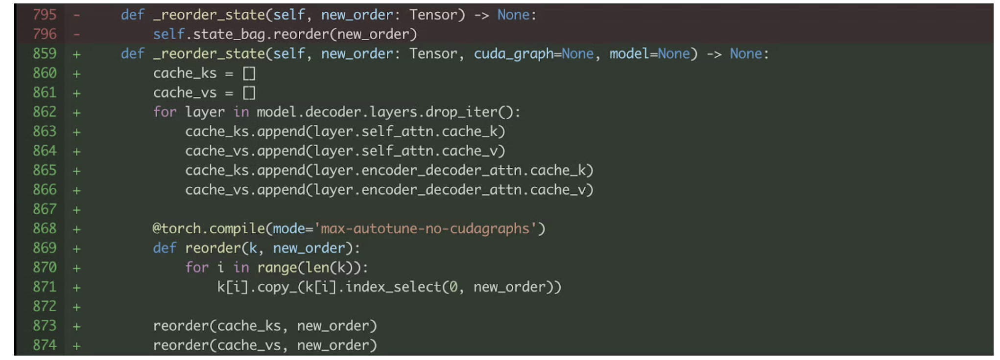

**그림 11. KV Cache reordering에 torch.compile 적용.**

KV cache reordering에 torch.compile을 활성화했기 때문에, 원래 각각 launch되던 GPU kernel(그림 12(a))이 이제 fuse되어 launch해야 하는 GPU kernel 수가 크게 줄었습니다(그림 12(b)).

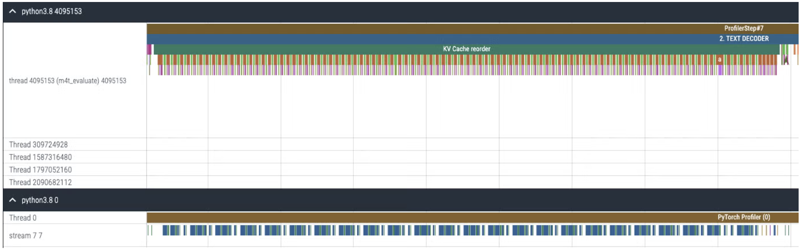

**(a) torch.compile 활성화 전 KV cache reordering의 CPU 및 GPU trace**

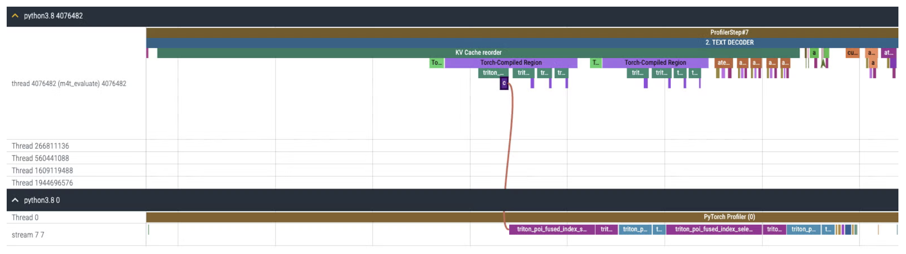

**(b) torch.compile 활성화 후 KV cache reordering의 CPU 및 GPU trace**

**그림 12. KV cache reordering의 CPU 및 GPU trace (a) torch.compile 활성화 전, (b) 활성화 후**

## Vocoder

Seamless의 Vocoder는 HiFi-GAN unit-vocoder입니다. 생성된 unit을 waveform output으로 변환합니다. 여기서 unit은 speech representation이며, phoneme과 syllable 같은 서로 다른 측면을 결합해 사람이 들을 수 있는 sound를 생성하는 데 사용할 수 있습니다. Vocoder는 Conv1d와 ConvTranspose1d layer로 구성된 비교적 단순한 module이며, 그림 3처럼 CPU bound module입니다. 이 관찰을 바탕으로 vocoder에 torch.compile + CUDA Graph를 활성화해 불균형하게 큰 CPU overhead를 줄이기로 했습니다. 그림 10과 같습니다. 다만 수정해야 할 몇 가지 문제가 있었습니다.

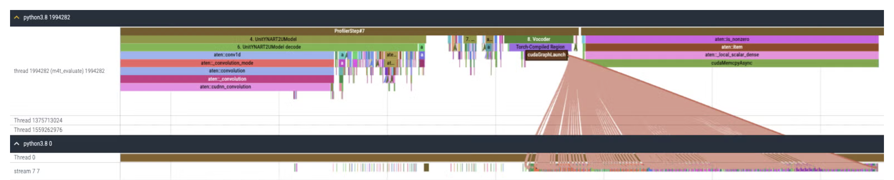

**그림 13. torch.compile + CUDA Graph 활성화 후 Vocoder의 CPU 및 GPU trace.**

**a)** vocoder의 input tensor shape은 서로 다른 inference sample에서 다릅니다. 그러나 CUDA Graph는 tensor shape을 기록하고 replay하므로, input을 fixed size zero로 padding해야 합니다. vocoder는 Conv1d layer만으로 구성되어 있으므로 추가 padding mask는 필요 없고, zero padding이면 충분합니다.

**b)** Vocoder는 `torch.nn.utils.weight_norm`으로 wrapping된 conv1d layer로 구성됩니다(여기(https://github.com/facebookresearch/seamless_communication/blob/main/src/seamless_communication/models/vocoder/hifigan.py#L37-L112) 참고). 하지만 Vocoder에 torch.compile을 직접 적용하면 아래와 같은 graph break가 발생하고, 이는 suboptimal performance improvement로 이어집니다. 이 graph break는 `weight_norm`의 PyTorch code에서 hook 처리 부분 내부에서 발생합니다.

```shell
[1/0_2] torch._dynamo.symbolic_convert.__graph_breaks: [DEBUG] Graph break: setattr(UserDefinedObjectVariable) <function Module.__setattr__ at 0x7fac8f483c10> from user code at:
[1/0_2] torch._dynamo.symbolic_convert.__graph_breaks: [DEBUG]   File "/mnt/fsx-home/yejinlee/yejinlee/seamless_communication/src/seamless_communication/models/vocoder/vocoder.py", line 49, in forward
[1/0_2] torch._dynamo.symbolic_convert.__graph_breaks: [DEBUG]     return self.code_generator(x, dur_prediction)  # type: ignore[no-any-return]1/0_2] torch._dynamo.symbolic_convert.__graph_breaks: [DEBUG]   File "/data/home/yejinlee/mambaforge/envs/fairseq2_12.1/lib/python3.8/site-packages/torch/nn/modules/module.py", line 1520, in _call_impl
[1/0_2] torch._dynamo.symbolic_convert.__graph_breaks: [DEBUG]     return forward_call(*args, **kwargs)
[2023-12-13 04:26:16,822] [1/0_2] torch._dynamo.symbolic_convert.__graph_breaks: [DEBUG]   File "/mnt/fsx-home/yejinlee/yejinlee/seamless_communication/src/seamless_communication/models/vocoder/codehifigan.py", line 101, in forward
[1/0_2] torch._dynamo.symbolic_convert.__graph_breaks: [DEBUG]     return super().forward(x)
[1/0_2] torch._dynamo.symbolic_convert.__graph_breaks: [DEBUG]   File "/mnt/fsx-home/yejinlee/yejinlee/seamless_communication/src/seamless_communication/models/vocoder/hifigan.py", line 185, in forward
[1/0_2] torch._dynamo.symbolic_convert.__graph_breaks: [DEBUG]     x = self.ups[i](x)
[1/0_2] torch._dynamo.symbolic_convert.__graph_breaks: [DEBUG]   File "/data/home/yejinlee/mambaforge/envs/fairseq2_12.1/lib/python3.8/site-packages/torch/nn/modules/module.py", line 1550, in _call_impl
[1/0_2] torch._dynamo.symbolic_convert.__graph_breaks: [DEBUG]     args_result = hook(self, args)
[1/0_2] torch._dynamo.symbolic_convert.__graph_breaks: [DEBUG]   File "/data/home/yejinlee/mambaforge/envs/fairseq2_12.1/lib/python3.8/site-packages/torch/nn/utils/weight_norm.py", line 65, in __call__
[1/0_2] torch._dynamo.symbolic_convert.__graph_breaks: [DEBUG]     setattr(module, self.name, self.compute_weight(module))
[1/0_2] torch._dynamo.symbolic_convert.__graph_breaks: [DEBUG] 
```

inference 동안 layer weight는 변하지 않으므로 weight normalization이 필요하지 않습니다. 따라서 Seamless codebase에 이미 제공된 `remove_weight_norm` function(여기(https://github.com/facebookresearch/seamless_communication/blob/main/src/seamless_communication/models/vocoder/hifigan.py#L198-L205))을 활용해 그림 14처럼 Vocoder에서 weight normalization을 간단히 제거했습니다.

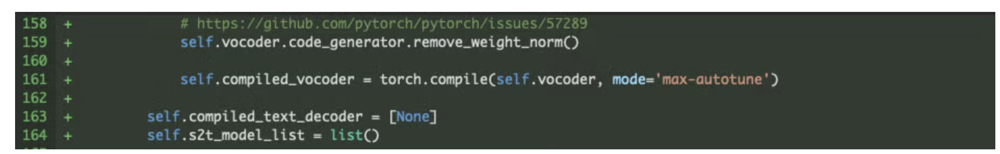

**그림 14. Vocoder에서 `weight_norm` 제거**

## Performance evaluation + CUDA Graph의 영향

그림 15는 text decoder와 vocoder에 torch.compile(mode="max-autotune") + CUDA Graph를 활성화한 acceleration result를 보여줍니다. 우리는 **text decoder 2배 acceleration과 vocoder 30배 acceleration을 달성했고, end-to-end inference time 2.7배 acceleration**을 얻었습니다.

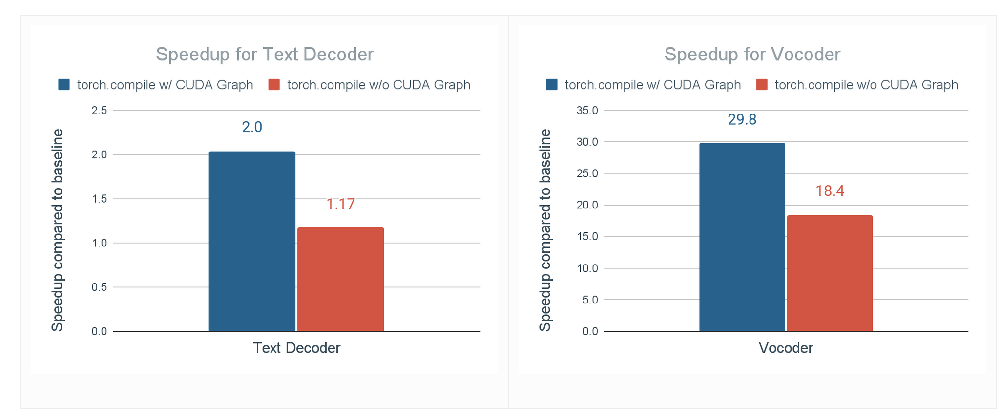

**그림 15. torch.compile 및 torch.compile + CUDA Graph 적용 시 text decoder와 vocoder의 inference time speedup**

CUDA Graph 없이 torch.compile을 사용한 text decoder와 vocoder의 speedup도 보고합니다. 이는 torch.compile API에서 지원됩니다. 즉 `torch.compile(mode="max-autotune-no-cudagraphs")`입니다. 이를 통해 CUDA Graph가 performance에 미치는 영향을 식별합니다. CUDA Graph가 없을 때 text decoder와 vocoder의 speedup은 각각 1.17배와 18.4배로 줄어듭니다. 여전히 상당히 크지만, CUDA Graph의 중요한 역할을 보여줍니다. 우리는 Seamless M4T-v2가 많은 CUDA kernel launch time에 직면한다고 결론내립니다. 특히 batch size가 작을 때, 예를 들어 1일 때는 GPU kernel execution time이 GPU kernel launch time을 상쇄하기에 충분하지 않습니다.

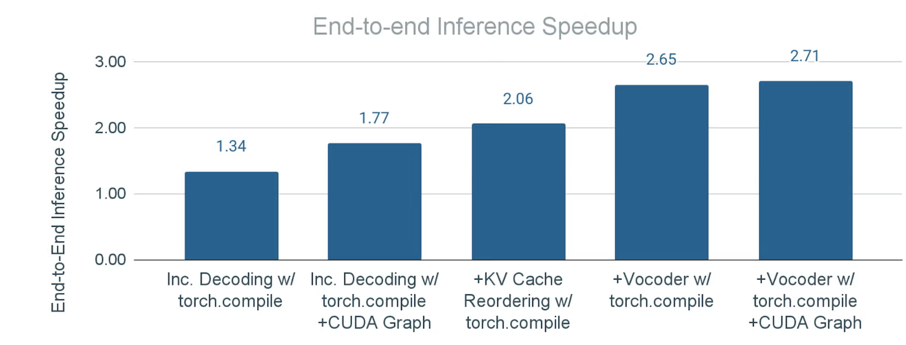

**그림 16. torch.compile과 CUDA graph를 단계적으로 적용한 end-to-end inference speedup. a) "Inc. Decoding": text decoder에만 torch.compile 적용 b) "Inc. Decoding w/ CUDA Graph": text decoder에 torch.compile + CUDA Graph 적용 c) "+KV Cache Reordering": b)에 추가로 KV cache reordering operation에 torch.compile 적용 d) "+Vocoder": c)에 추가로 vocoder에 torch.compile 적용 e) "+Vocoder w/ CUDA Graph": d)에 추가로 vocoder에 torch.compile + CUDA Graph 적용.**

그림 16은 module에 CUDA Graph 포함/미포함 torch.compile을 적용한 cumulative effect를 보여줍니다. 결과는 end-to-end inference acceleration이 크게 개선되었음을 나타내며, 이러한 technique이 overall latency optimization에 효과적임을 증명합니다. 결과적으로 batch_size=1에서 Seamless M4T-v2에 대해 **2.7배** end-to-end inference acceleration을 얻었습니다.

## Acknowledgements

이 작업에서 큰 support를 제공한 PyTorch team과 Seamless team에 감사드립니다.
