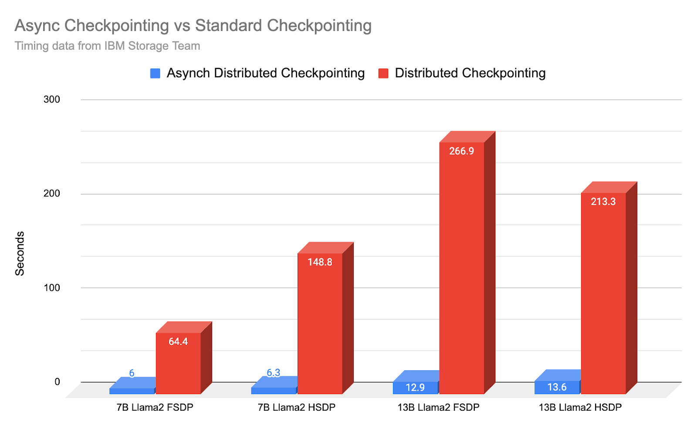
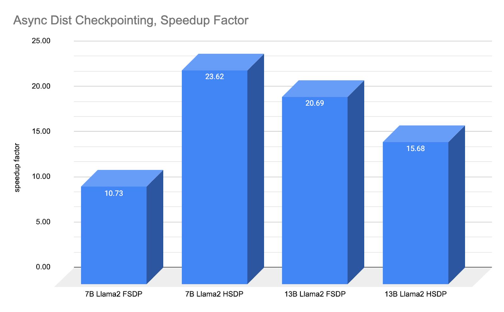
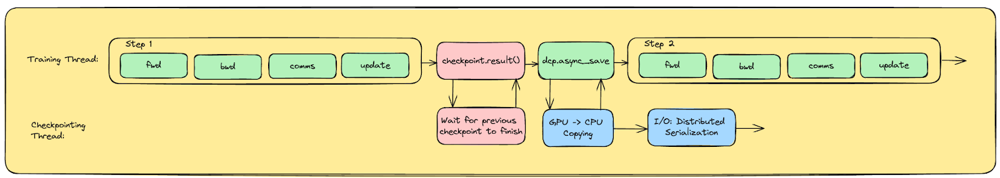
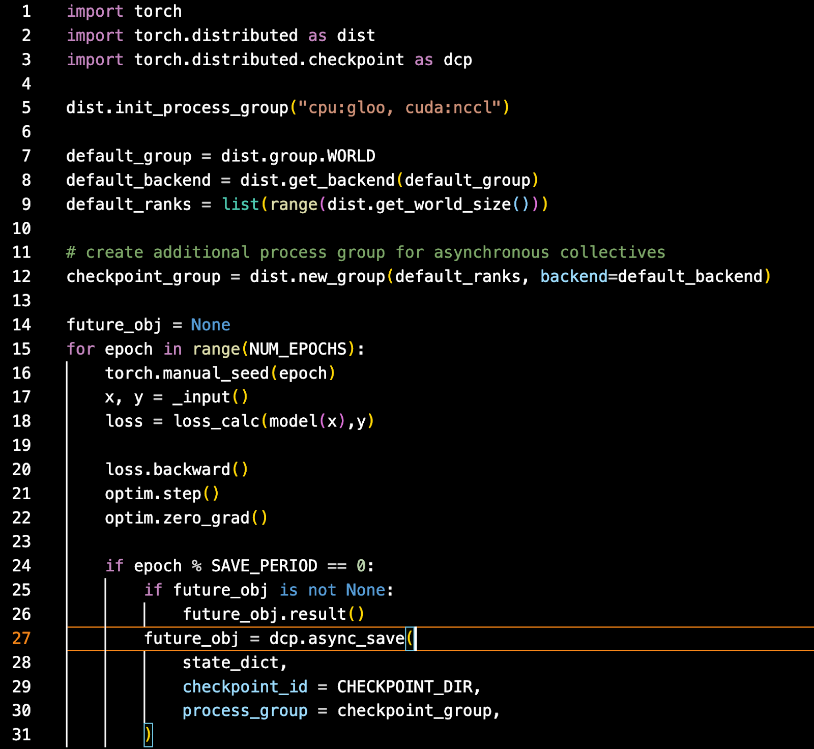
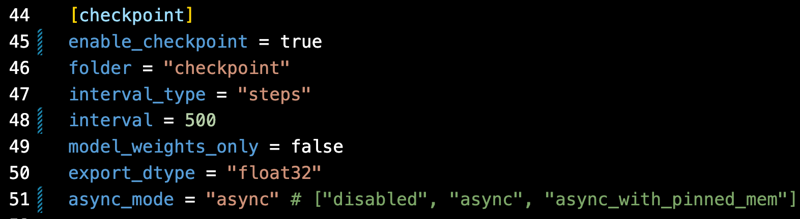

## PyTorch Async Checkpoint Save

- PyTorch 블로그 자료: https://pytorch.org/blog/reducing-checkpointing-times/
- PyTorch 구현과 사용 데모: https://github.com/pytorch/pytorch/blob/main/torch/distributed/checkpoint/state_dict_saver.py

### 기능 소개

PyTorch 2.4 이후에는 PyTorch가 IBM과 함께 개발한 비동기 Checkpoint 저장 기능을 사용할 수 있습니다. 7B 대형 모델 학습에서 Checkpoint 저장 시간은 평균 148.8초에서 6.3초로 줄었고, 23.62배 빨라졌습니다. 이는 다음 두 가지 이점으로 이어질 수 있습니다.

- 계속해서 견고하게 Checkpoint를 저장하면서도, 주어진 24시간 안에 더 많은 순수 학습 진척을 얻을 수 있습니다.
- Checkpoint를 더 자주 저장해 학습 복구 창 또는 시간을 줄일 수 있습니다.



결과 그림을 보면 단일 머신 FSDP든 다중 머신 HSDP든 Async Checkpoint Save는 큰 속도 이점을 보여줍니다. 파라미터 수가 더 큰 모델에서는 기대 이득이 더 클 것입니다. 현재 TorchTian(https://github.com/pytorch/torchtitan)에는 이 새로운 기능이 이미 통합되어 있으며, 다른 주요 학습 프레임워크도 곧 이 feature를 따라올 것이라고 생각합니다.

### 블로그 내용

#### 배경

모델 Checkpoint는 대형 모델 학습의 중요한 구성 요소입니다. 하지만 Checkpoint는 비용이 큰 과정입니다. 각 Checkpoint 과정이 최신 모델 가중치를 저장하기 위해 학습 진행을 막아야 하기 때문입니다. 그렇다고 Checkpoint를 하지 않거나 Checkpoint 빈도를 낮추면 학습 진척 손실이 커질 수 있습니다. 예를 들어 deadlock, straggler, GPU 오류 같은 장애가 발생하면 학습 과정을 다시 시작해야 합니다. 장애에서 재시작하려면 모든 학습 워커가 학습 과정을 중단하고 마지막으로 저장된 Checkpoint에서 다시 시작해야 합니다.

따라서 장애에 대한 견고성과 학습 진척 사이에는 균형을 잡기 어렵습니다. 하지만 이제 비동기 Checkpoint 덕분에 PyTorch 분산 학습은 이 긴장을 크게 완화하고, 전체 학습 시간에 미치는 영향을 최소화하면서 잦은 Checkpoint를 구현할 수 있습니다.

약 1년 전(https://pytorch.org/blog/performant-distributed-checkpointing/) 우리는 분산 Checkpoint가 기존 `torch.save()` 기능에서 시작해 Checkpoint 시간을 어떻게 크게 줄일 수 있는지 보여주었습니다. IBM 연구팀이 지적했듯이, `torch.save`는 11B 모델을 저장하는 데 최대 30분까지 걸릴 수 있었습니다(PyTorch 1.13).

분산 Checkpoint가 발전하면서, 최대 30B 모델 크기에서도 Checkpoint는 4분 안에 완료될 수 있게 되었습니다. 비동기 Checkpoint를 사용하면 Checkpoint로 인한 학습 시간 손실은 이제 30초 미만으로 내려가며, 보통 6초 정도만 필요합니다.

분명히 해둘 점은 비동기 Checkpoint가 이전 업데이트에서 보여준 것처럼 실제 직렬화 Checkpoint 시간을 줄이는 것은 아니라는 점입니다. 대신 **최종 Checkpoint 과정을 핵심 경로 밖, 즉 CPU 스레드로 옮겨 GPU 학습이 별도 스레드에서 Checkpoint를 완료하는 동안 계속 진행될 수 있게 합니다**.



위 그림처럼 비동기 Checkpoint는 1년 전의 개선에서 더 나아가 10배에서 23배까지 향상되었습니다.

#### Async Checkpoint Save는 어떻게 동작하는가

비동기 Checkpoint는 Checkpoint 과정을 하나의 단일 덩어리 과정 대신 두 부분으로 모듈화합니다. 첫 번째 단계는 각 GPU/rank의 데이터를 GPU에서 CPU로 복사합니다. 이것이 사용자에게 보이는 중단 시간이며, 7B-13B 모델 크기에서는 약 6초에서 14초가 걸릴 수 있습니다. 두 번째 단계는 데이터를 CPU 메모리에서 디스크로 비동기 복사해 Checkpoint를 영구 저장합니다.

첫 번째 단계에서 데이터가 CPU로 복사되면 GPU는 즉시 학습을 재개할 수 있습니다. 따라서 비동기 Checkpoint에서 Checkpoint 중단 시간은 최신 모델 상태를 CPU로 복사하는 데 필요한 시간뿐입니다. 학습이 재개되는 동안, 논블로킹 CPU 스레드는 메모리에 새로 도착한 데이터를 사용해 전체 Checkpoint/직렬화 과정을 디스크까지 완료합니다. 즉 영구 저장을 마칩니다.



PyTorch의 분산 Checkpoint는 저장을 최적화하는 데 필요한 rank별 메타데이터를 얻고, Checkpoint를 완료된 것으로 표시해 작업을 원자적으로 만들기 위한 최종 동기화를 수행하기 위해 집합 통신 호출에 의존합니다. Checkpoint 스레드가 학습과 동일한 프로세스 그룹을 사용하면 분산 학습을 방해할 수 있습니다. 분산 학습도 여러 GPU에 걸친 학습 동기화를 위해 비슷한 호출에 의존하기 때문입니다. 구체적으로, 호출 사이의 경쟁 조건 때문에 학습 스레드와 비동기 Checkpoint 저장 스레드가 동시에 집합 통신 호출을 기다리게 되어 실제 집합 통신 hang이 발생할 수 있습니다. 우리는 **비동기 Checkpoint를 위해 별도의 프로세스 그룹을 초기화함으로써 이 문제를 피합니다**. 이렇게 하면 Checkpoint 집합 통신이 자체 논리 프로세스 그룹으로 분리되어, 주 학습 스레드의 집합 통신 호출을 방해하지 않게 됩니다.

### PyTorch Async Checkpoint Save 사용 방법

다음은 PyTorch Async Checkpoint Save를 사용하는 최소 데모입니다.



주의할 부분은 12번째 줄입니다. 비동기 Checkpoint 집합 통신 작업을 위한 새 group을 만들고, `dcp.save`를 호출할 때 이 group을 전달해야 합니다.


https://github.com/pytorch/torchtitan 에서도 이미 이 기능을 사용하고 있으며, 자체 Llama2 또는 Lllama3 모델 사전 학습에 사용할 수 있습니다. 설정 파일에서 Async Checkpoint Save 사용 여부를 선택할 수 있습니다. 아래 그림과 같습니다.



### 코드 흐름 간단히 훑어보기

코드 구현은 https://github.com/pytorch/pytorch/blob/main/torch/distributed/checkpoint/state_dict_saver.py 파일에 있습니다. 핵심 부분은 다음 두 함수이며, 여기서는 흐름만 간단히 보여줍니다.

```python
# state_dict의 얕은 복사본을 만들고, 각 Stateful 객체에는 state_dict() 메서드를 호출합니다.
def _stateful_to_state_dict(state_dict: STATE_DICT_TYPE) -> STATE_DICT_TYPE:
    """Creates a shallow copy of `state_dict` where `state_dict` is called for each Stateful object."""
    stateful_state_dict = {}
    for key, elem in state_dict.items():
        stateful_state_dict[key] = (
            elem.state_dict() if isinstance(elem, Stateful) else elem
        )
    return stateful_state_dict

@_dcp_method_logger(log_exceptions=True)
def async_save(
    state_dict: STATE_DICT_TYPE,
    *,
    checkpoint_id: Union[str, os.PathLike, None] = None,
    storage_writer: Optional[StorageWriter] = None,
    planner: Optional[SavePlanner] = None,
    process_group: Optional[dist.ProcessGroup] = None,
) -> Future:
    torch._C._log_api_usage_once("torch.distributed.checkpoint.async_save")

    # 분산 환경 설정을 확인합니다.
    if dist.is_available() and dist.is_initialized():
        pg = process_group or _get_default_group()
        assert (
            torch.device("cpu") in pg._device_types  # type: ignore[attr-defined]
        ), "A CPU backend must be enabled for async save; try initializing process group with 'cpu:gloo,cuda:nccl'"

    # 스토리지 writer를 설정합니다.
    storage_writer = cast(
        StorageWriter, _storage_setup(storage_writer, checkpoint_id, reader=False)
    )

    # 상태 딕셔너리를 처리합니다(_stateful_to_state_dict 호출).
    state_dict = _stateful_to_state_dict(state_dict)
    # storage writer가 비동기 staging을 지원하면 사용하고, 아니면 상태 딕셔너리를 CPU로 내립니다.
    if isinstance(storage_writer, AsyncStager):
        staged_state_dict = storage_writer.stage(state_dict)
    else:  # provides bwc for storage_writers not implementing AsyncStager
        staged_state_dict = _offload_state_dict_to_cpu(state_dict, type_check=False)

    # ThreadPoolExecutor를 만들고 저장 작업을 제출합니다. 여기서는 스레드 하나를 사용합니다.
    executor = ThreadPoolExecutor(max_workers=1)
    f: Future = executor.submit(
        save,
        staged_state_dict,
        checkpoint_id=checkpoint_id,
        storage_writer=storage_writer,
        planner=planner,
        process_group=process_group,
    )
    # 작업 완료 후 executor를 종료하는 callback을 설정합니다.
    f.add_done_callback(lambda f: executor.shutdown(wait=False))

    # 필요하면 staging 작업을 동기화합니다.
    if (
        isinstance(storage_writer, AsyncStager)
        and storage_writer.should_synchronize_after_execute
    ):
        storage_writer.synchronize_staging()

    # Future 객체를 반환합니다.
    return f
```

### 향후 개선

PyTorch Blog에서는 Checkpoint가 지난 1년 동안 큰 진전을 이루었다고 언급합니다. 거의 30분 가까이 걸리던 Checkpoint가 분산 Checkpoint를 사용해 5분 미만으로 줄었고, 이제 비동기 Checkpoint를 사용하면 30초 미만까지 줄었습니다. **마지막 전선은 zero-overhead Checkpoint입니다. 역전파 동안 업데이트된 가중치를 스트리밍해 비동기 Checkpoint가 시작될 때 Checkpoint 데이터가 이미 CPU에 있도록 만들면, 30초 미만의 시간마저 제거할 수 있습니다**. 이렇게 되면 대형 모델 학습은 사실상 Checkpoint 중단이나 정지 시간이 없는 수준으로 이동하며, 더 자주 Checkpoint할 수 있어 견고성이 좋아지고 Checkpoint 중단 시간이 없어 학습 진척도 빨라집니다.
