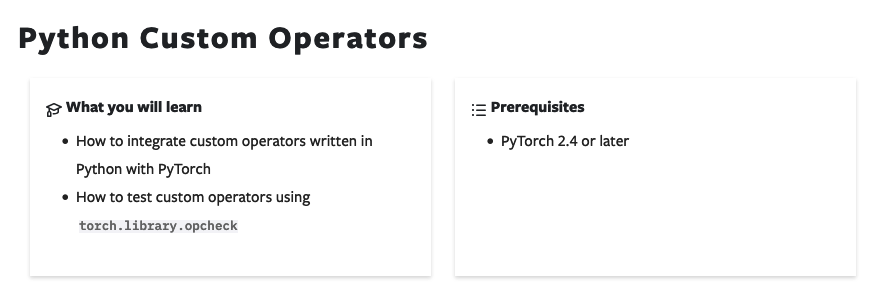
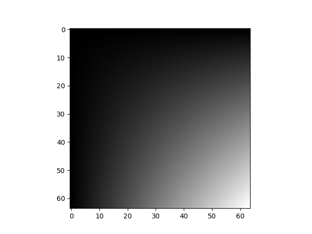
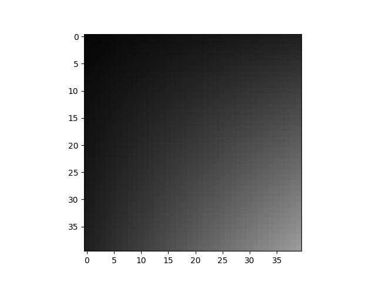
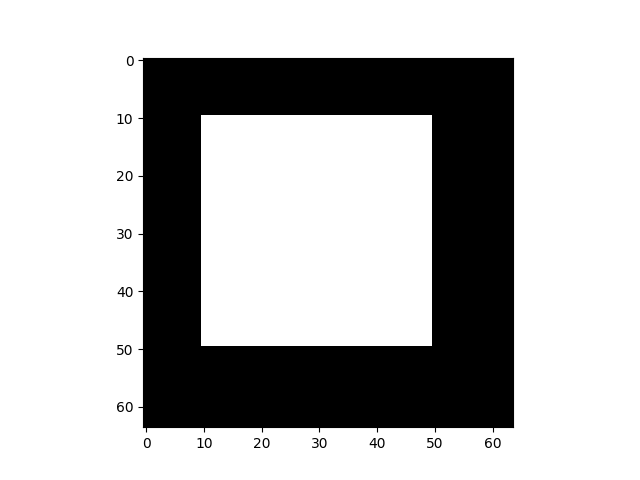

## 서문

vllm 안에서 flash attention이 `@torch.library.custom_op` decorator(https://github.com/vllm-project/vllm/pull/7536)로 한 겹 감싸진 것을 보았다. 자료를 찾아보니 이것은 torch 2.4 이후의 새 feature이며, torch compile하려는 graph를 막기 위한 것이다. 공식 튜토리얼을 번역해 이 사용법을 조금 이해해 본다. 

출처: https://pytorch.org/tutorials/advanced/python_custom_ops.html

## Python Custom Operators 튜토리얼




이 튜토리얼은 Python custom operator 주제를 소개한다. 여기서는 Python으로 작성한 custom operator를 PyTorch와 통합하는 방법, 그리고 `torch.library.opcheck`로 custom operator를 테스트하는 방법을 포함해 이 튜토리얼에서 배울 내용을 나열한다. 필요한 전제 조건은 PyTorch 2.4 이상 설치다.

PyTorch는 Tensor에서 실행할 수 있는 많은 operator(예: torch.add, torch.sum 등)를 제공한다. 하지만 PyTorch에서 새로운 custom operator를 사용하고 싶을 수 있으며, 이는 third-party library가 작성한 것일 수도 있다. 이 튜토리얼은 Python 함수를 감싸 PyTorch native operator처럼 동작하게 만드는 방법을 보여준다. PyTorch에서 custom operator를 만드는 이유는 다음과 같을 수 있다.

- 임의의 Python 함수를 `torch.compile`에 대해 opaque callable로 취급한다. 즉 `torch.compile`이 함수 안으로 trace해 들어가는 것을 막는다.
- 임의의 Python 함수에 training support를 추가한다.

주의할 점은, operation이 기존 PyTorch operator의 조합으로 표현될 수 있다면 일반적으로 custom operator를 사용할 필요가 없다는 것이다. 예를 들어 autograd를 지원하는 operation은 바로 작동해야 한다.

## 예시: PIL 라이브러리의 crop 기능을 custom operator로 감싸기

PIL의 `crop` operation을 사용한다고 가정하자.

```python
import torch
from torchvision.transforms.functional import to_pil_image, pil_to_tensor
import PIL
import IPython
import matplotlib.pyplot as plt

def crop(pic, box):
    img = to_pil_image(pic.cpu())
    cropped_img = img.crop(box)
    return pil_to_tensor(cropped_img).to(pic.device) / 255.

def display(img):
    plt.imshow(img.numpy().transpose((1, 2, 0)))

img = torch.ones(3, 64, 64)
img *= torch.linspace(0, 1, steps=64) * torch.linspace(0, 1, steps=64).unsqueeze(-1)
display(img)
```




```python
cropped_img = crop(img, (10, 10, 50, 50))
display(cropped_img)
```


`crop` 기능은 `torch.compile`에서 out-of-the-box로 효과적으로 처리될 수 없다. `torch.compile`은 처리할 수 없는 함수에서 "graph break"(https://pytorch.org/docs/stable/torch.compiler_faq.html#graph-breaks)를 일으키며, graph break는 성능 저하로 이어진다. 아래 코드는 error를 발생시켜 이를 보여준다. graph break가 발생하면 `torch.compile(with fullgraph=True)`가 error를 발생시킨다.

```python
@torch.compile(fullgraph=True)
def f(img):
    return crop(img, (10, 10, 50, 50))

# The following raises an error. Uncomment the line to see it.
# cropped_img = f(img)
```

`torch.compile`에서 `crop`을 black box operation으로 사용하려면 두 가지를 해야 한다.

- 이 함수를 PyTorch custom operator로 감싼다.
- 이 operator에 "FakeTensor kernel"("meta kernel"이라고도 함)을 추가한다. 입력 Tensor의 metadata(예: shape)가 주어졌을 때, 이 함수는 출력 Tensor의 metadata를 어떻게 계산할지 설명한다.

```python
from typing import Sequence

# Use torch.library.custom_op to define a new custom operator.
# If your operator mutates any input Tensors, their names must be specified
# in the ``mutates_args`` argument.
@torch.library.custom_op("mylib::crop", mutates_args=())
def crop(pic: torch.Tensor, box: Sequence[int]) -> torch.Tensor:
    img = to_pil_image(pic.cpu())
    cropped_img = img.crop(box)
    return (pil_to_tensor(cropped_img) / 255.).to(pic.device, pic.dtype)

# Use register_fake to add a ``FakeTensor`` kernel for the operator
@crop.register_fake
def _(pic, box):
    channels = pic.shape[0]
    x0, y0, x1, y1 = box
    return pic.new_empty(channels, y1 - y0, x1 - x0)
```

위 작업을 마치면 crop은 이제 graph break를 만들지 않고 정상적으로 작동할 수 있다.

```python
@torch.compile(fullgraph=True)
def f(img):
    return crop(img, (10, 10, 50, 50))

cropped_img = f(img)
display(img)
```


```python
display(cropped_img)
```





## crop에 training support 추가하기

`torch.library.register_autograd`를 사용해 operator에 training support를 추가한다. `torch.autograd.Function`을 직접 사용하는 것보다 이 방식을 우선 사용하라. `autograd.Function`은 PyTorch operator registration API와 조합해 사용할 때, `torch.compile`과 조합되면 조용한 incorrectness를 일으킬 수 있기 때문이다.

`crop`의 gradient formula는 본질적으로 `PIL.paste`다(유도는 독자 연습으로 남겨둔다). 먼저 `paste`를 custom operator로 감싸 보자.

```python
@torch.library.custom_op("mylib::paste", mutates_args=())
def paste(im1: torch.Tensor, im2: torch.Tensor, coord: Sequence[int]) -> torch.Tensor:
    assert im1.device == im2.device
    assert im1.dtype == im2.dtype
    im1_pil = to_pil_image(im1.cpu())
    im2_pil = to_pil_image(im2.cpu())
    PIL.Image.Image.paste(im1_pil, im2_pil, coord)
    return (pil_to_tensor(im1_pil) / 255.).to(im1.device, im1.dtype)

@paste.register_fake
def _(im1, im2, coord):
    assert im1.device == im2.device
    assert im1.dtype == im2.dtype
    return torch.empty_like(im1)
```

이제 `register_autograd`를 사용해 `crop`에 gradient formula를 지정하자.

```python
def backward(ctx, grad_output):
    grad_input = grad_output.new_zeros(ctx.pic_shape)
    grad_input = paste(grad_input, grad_output, ctx.coords)
    return grad_input, None

def setup_context(ctx, inputs, output):
    pic, box = inputs
    ctx.coords = box[:2]
    ctx.pic_shape = pic.shape

crop.register_autograd(backward, setup_context=setup_context)
```

주의할 점은 backward가 PyTorch가 이해할 수 있는 operator로 구성되어야 한다는 것이다. 이것이 우리가 paste를 custom operator로 감싸고 PIL의 paste를 직접 사용하지 않는 이유다.

```python
img = img.requires_grad_()
result = crop(img, (10, 10, 50, 50))
result.sum().backward()
display(img.grad)
```




이는 올바른 gradient다. crop 영역 안은 1(흰색)이고, 사용되지 않은 영역은 0(검은색)이다.

## Python custom operator 테스트

`torch.library.opcheck`를 사용해 custom operator가 올바르게 등록되었는지 테스트한다. 이것은 gradient가 수학적으로 올바른지는 테스트하지 않으므로, 별도의 테스트를 작성하라(수동 테스트 또는 `torch.autograd.gradcheck` 사용).

`opcheck`를 사용하려면 테스트에 사용할 example input set을 전달한다. operator가 training을 지원한다면 example에는 gradient 계산이 필요한 Tensor가 포함되어야 한다. operator가 여러 device를 지원한다면 example에는 각 device의 Tensor가 포함되어야 한다.

```python
examples = [
    [torch.randn(3, 64, 64), [0, 0, 10, 10]],
    [torch.randn(3, 91, 91, requires_grad=True), [10, 0, 20, 10]],
    [torch.randn(3, 60, 60, dtype=torch.double), [3, 4, 32, 20]],
    [torch.randn(3, 512, 512, requires_grad=True, dtype=torch.double), [3, 4, 32, 45]],
]

for example in examples:
    torch.library.opcheck(crop, example)
```

## mutable Python custom operator

입력을 수정하는 Python 함수도 custom operator로 감쌀 수 있다. 입력을 수정하는 함수는 흔하다. 많은 low-level kernel이 이렇게 작성되기 때문이다. 예를 들어 sin을 계산하는 kernel은 입력을 수정하고 output tensor를 `input.sin()`으로 할당할 수 있다.

`numpy.sin`을 사용해 mutable Python custom operator 예시를 보여준다.

```python
import numpy as np

@torch.library.custom_op("mylib::numpy_sin", mutates_args={"output"}, device_types="cpu")
def numpy_sin(input: torch.Tensor, output: torch.Tensor) -> None:
    assert input.device == output.device
    assert input.device.type == "cpu"
    input_np = input.numpy()
    output_np = output.numpy()
    np.sin(input_np, out=output_np)
```

이 operator는 return value가 없기 때문에 `torch.compile`에서 정상 작동하기 위해 FakeTensor kernel(meta kernel)을 등록할 필요가 없다.

```python
@torch.compile(fullgraph=True)
def f(x):
    out = torch.empty(3)
    numpy_sin(x, out)
    return out

x = torch.randn(3)
y = f(x)
assert torch.allclose(y, x.sin())
```

다음은 opcheck 실행 결과로, 이 kernel이 실제로 올바르게 등록되었음을 알려준다. 예를 들어 `mutates_args`에 output을 추가하는 것을 잊으면 `opcheck`가 error를 낸다.

## 요약

이 튜토리얼에서는 `torch.library.custom_op`를 사용해 `torch.compile` 및 `autograd` 같은 PyTorch subsystem과 함께 작동하는 Python custom operator를 만드는 방법을 배웠다.

이 튜토리얼은 custom operator에 대한 기본 소개를 제공한다. 더 자세한 내용은 다음을 참고하라.

- torch.library 문서: https://pytorch.org/docs/stable/library.html
- custom operator manual: https://pytorch.org/tutorials/advanced/custom_ops_landing_page.html#the-custom-operators-manual


