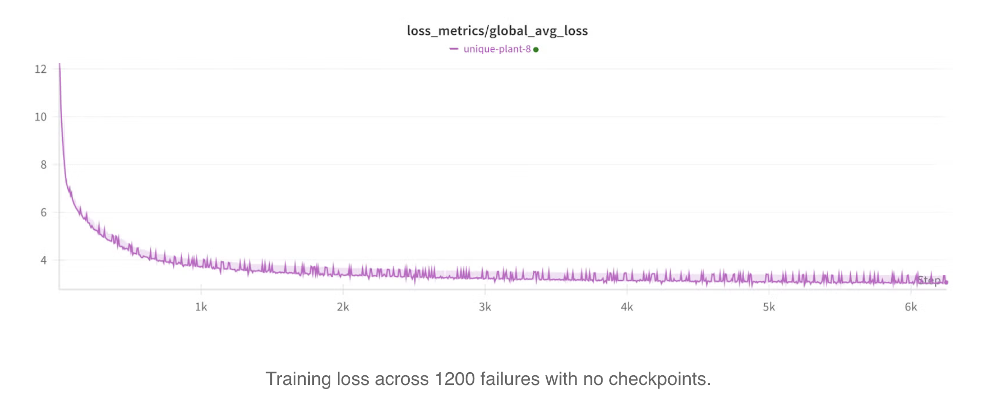
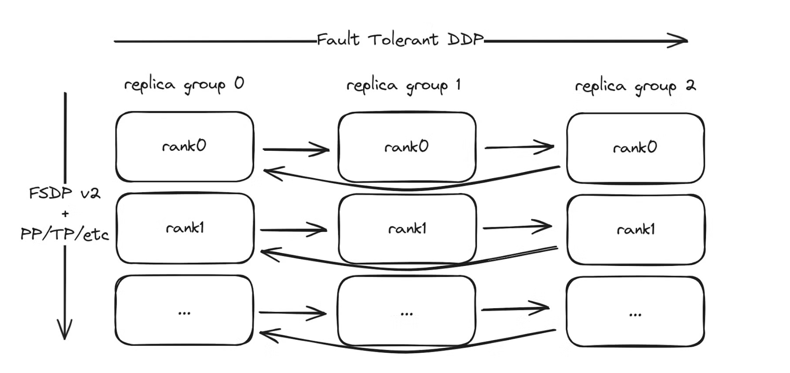
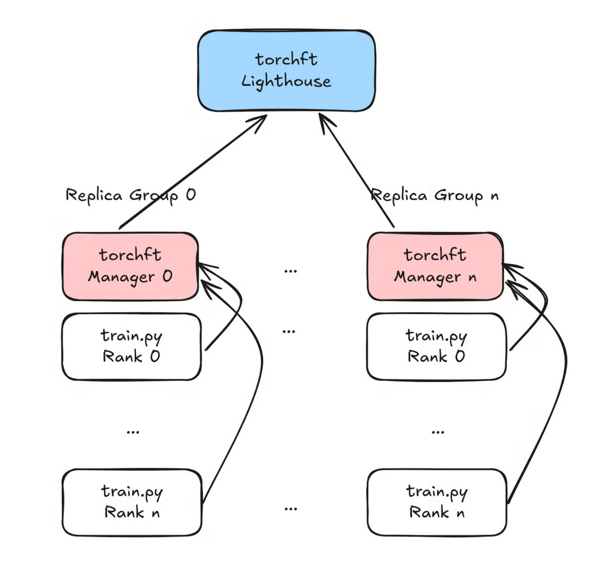
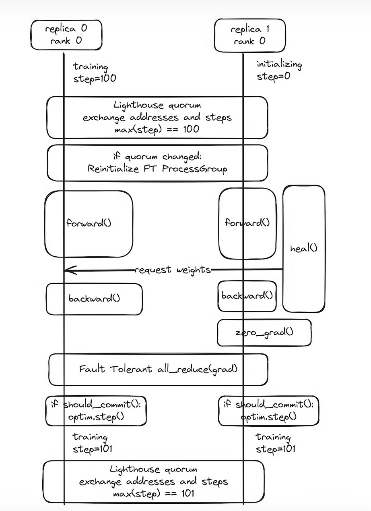
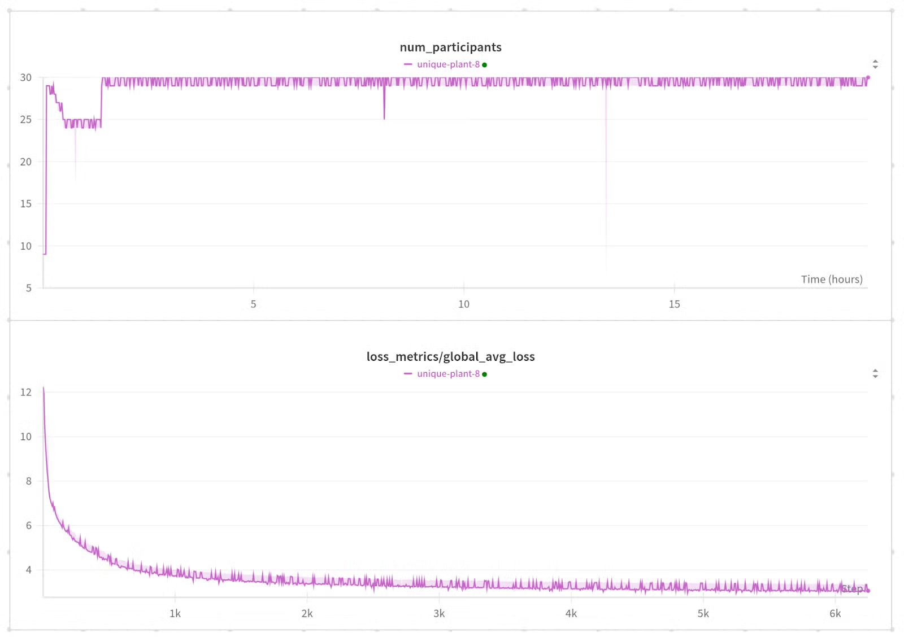
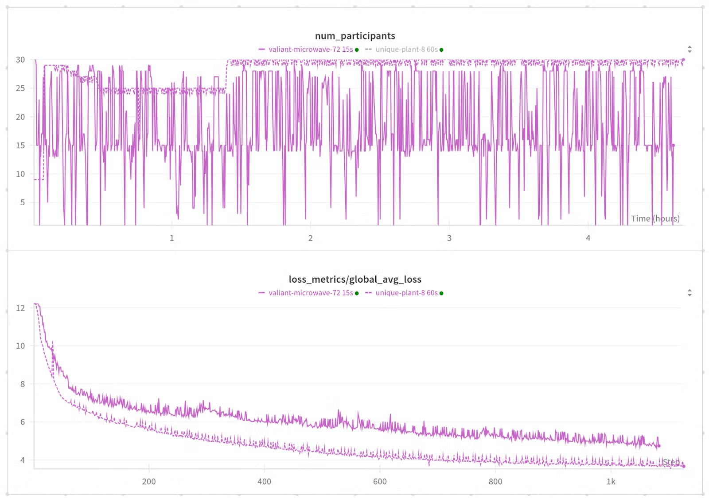
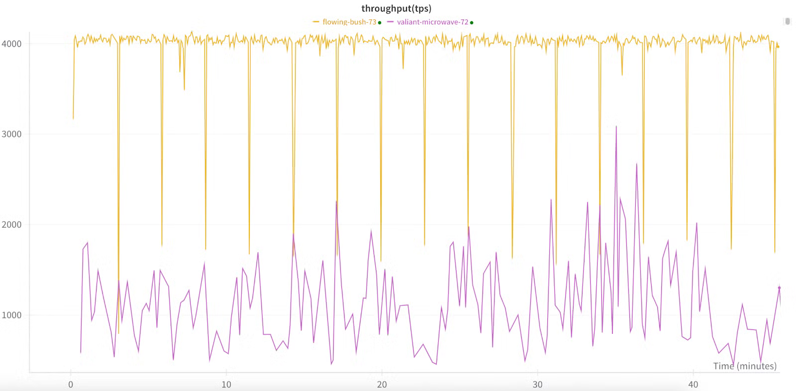
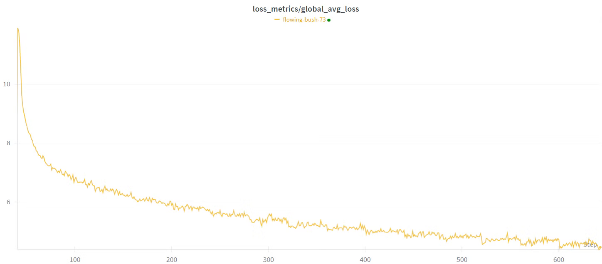

> 출처: https://pytorch.org/blog/fault-tolerant-llama-training-with-2000-synthetic-failures-every-15-seconds-and-no-checkpoints-on-crusoe-l40s/

# Crusoe L40S에서 15초마다 2000회 Synthetic Failure를 주입하며 Checkpoint 없이 Training하기

> Authors: Tristan Rice, Howard Huang, 2025년 6월 20일

Collaborators: Less Wright, Howard Huang, Chien-Chin Huang, Crusoe: Martin Cala, Ethan Petersen

**Brief**: 우리는 torchft(https://github.com/pytorch/torchft)와 torchtitan(https://github.com/pytorch/torchtitan)을 사용해 real environment에서 극단적인 synthetic failure rate로 model을 training함으로써 fault-tolerant training의 reliability와 correctness를 증명했다.



Note: 각 작은 peak는 non-participating worker node의 recovery이며, metric에는 영향을 주지만 model에는 영향을 주지 않는다.

## Introduction

우리는 가장 극단적인 failure rate에서 training job을 실행해 worst case에서 torchft가 어떻게 동작하는지 보여주고자 했다.

대부분의 LLM pretraining은 FSDP의 sharded model을 사용한다. torchft는 FSDP2의 sharded model을 지원하며, sharded model과 torchft의 fault-tolerant DDP all reduce를 결합한다. 우리는 torchft를 torchtitan에 통합했으므로 fault-tolerance feature를 바로 사용할 수 있다. torchft+titan은 각 replica group 안에서 tensor parallelism(TP), pipeline parallelism(PP) 등 다른 sharding/parallelization도 지원한다.

다음은 torchft를 사용하는 training job structure다.



Training job structure. torchft의 fault-tolerant DDP implementation은 replica group 사이에서 gradient를 synchronize하는 데 사용된다. Standard FSDP2와 다른 parallelization은 각 replica group 안에서 사용된다.



torchft는 global Lighthouse server와 각 replica group의 manager를 사용해 worker node를 real-time coordination한다. Lighthouse는 heartbeat를 통해 모든 worker node의 state와 어떤 node가 healthy한지 파악한다.

torchft는 여러 fault-tolerant algorithm을 구현한다. 가장 중요한 두 가지는 다음과 같다.

- **Fault-tolerant HSDP**: FSDPv2의 extension으로 fault-tolerant all reduce를 사용한다. 이는 standard HSDP training을 완전히 simulate하며, every-step gradient all reduce와 every-step fault tolerance를 가진다. Infiniband 같은 fast backend network가 있는 large-scale training에 가장 적합하다.
- **LocalSGD/DiLoCo**: semi-synchronous training의 fault-tolerant implementation이다. 이 algorithm은 HSDP처럼 every step sync하는 대신 지정된 interval마다 sync하여 communication overhead를 최소화한다. 보통 Ethernet/TCP 또는 지리적으로 분리된 location(federated learning 또는 multi-data-center training)처럼 communication-limited training scenario에 사용된다.

우리는 곧 나올 streaming DiLoCo support 같은 새로운 algorithm에도 항상 관심이 있다. 협업하고 싶은 새로운 use case가 있으면 연락해 달라!

## Cluster Setup

Crusoe(https://crusoe.ai/)는 300개 L40S GPU로 구성된 cluster를 우리에게 제공해 주었다. 이 GPU들은 30개 host에 분산되어 있고, 각 host에는 NVIDIA L40S GPU 10개가 있다.

Model은 사용 가능한 hardware에 맞추기 위해 torchtitan과 10억 parameter의 Llama 3 model을 사용했다.

NVIDIA L40S GPU는 보통 inference에 사용되므로, non-traditional environment에서 torchft를 테스트할 기회를 제공했다. 이런 환경에서는 낮은 TCP-only(no infiniband/nvlink) network bottleneck 때문에 DiLoCo 같은 algorithm이 실제로 힘을 발휘한다. L40S는 48GB VRAM(consumer-grade GPU에 가까움)을 갖고 있어 더 작은 model과 batch size를 사용했다. Training의 average step time은 약 9초였다.

Limited network에서 performance를 최대화하기 위해 우리는 30x1x10 configuration으로 model을 training했다. 30개 replica group(fault-tolerance domain)이 있고, 각 group은 1 host와 10 GPU/worker node를 가진다. torchft는 각 replica group에 많은 host를 둘 수 있지만, 이 cluster에서는 network bandwidth가 제한되어 replica group당 single host/10 GPU가 best performance였다. 더 많은 group은 coordination과 reconfiguration algorithm에 더 많은 stress를 주기 때문에 30개 replica group을 실행했다.

Network communication에는 각 replica group 안의 모든 communication(즉 FSDP)에 NCCL을 사용하고, replica group 사이의 communication에는 Gloo를 사용했다. Gloo는 보통 NCCL만큼 빠르지는 않지만 initialization이 더 빠르고 failure도 더 빠르게 감지할 수 있어 failure detection에 중요하다. torchft는 IB cluster에서 NCCL fault tolerance를 지원하지만 몇 가지 caveat가 있으며, 이 demo에서는 사용하지 않았다. Failure와 recovery 총량을 최대화하고 싶었기 때문에, 우리의 use case에서 <1초 안에 reinitialize할 수 있는 Gloo를 사용했고 모든 operation timeout을 5초로 설정할 수 있었다.

Fault-tolerant algorithm으로는 주로 fault-tolerant HSDP를 사용해 테스트했다. 이것이 communication과 arbitration layer를 가장 잘 stress test하기 때문이다. Final test에서는 Ethernet-based cluster에 더 적합한 DiLoCo를 사용했다.

## Checkpoint 없이 Recovery하기

전통적인 machine learning은 error가 발생했을 때 checkpoint에서 reload하는 방식으로 "fault tolerance"를 구현한다. 이는 모든 worker node를 restart하고 최근 persisted checkpoint에서 load하는 complete stop-the-world operation을 포함한다.

torchft에서는 failure를 single GPU group으로 isolate하는 데 집중한다. 해당 group 안에서 error가 발생하면 그 group을 asynchronous하게 restart할 수 있고, 다른 모든 group은 reconfigure하고 해당 group 없이 training을 계속할 수 있다.

그 group이 restart 또는 scheduler의 machine replacement를 통해 recover될 때, 이 worker node들은 더 이상 weight와 optimizer state의 valid copy를 갖고 있지 않다. Checkpoint에서 recover하려고 하면 다른 group은 이미 앞으로 진행해 버린 상태다. 대신 우리는 runtime asynchronous weight transfer에 의존한다. 이는 healthy replica에서 recovering node로 point-to-point weight transfer를 수행한다.

항상 다른 worker node에서 recover하므로, 적어도 하나의 group이 healthy하다는 것을 보장할 수만 있다면 사실 checkpoint가 전혀 필요 없다. 이 demo에서는 persistent checkpoint의 save/load가 P2P recovery time보다 훨씬 오래 걸리기 때문에 checkpoint를 완전히 껐다.

아래 diagram은 recovering replica(replica 1)가 arbitration에 join하고 healthy peer(replica 0)에서 recover하면서 downtime 없이, 그리고 healthy worker node training에 영향을 주지 않고 동작하는 방식을 보여준다.



torchft는 distributed database의 많은 개념을 채택했다.

- **Arbitration operation**은 frequent heartbeat를 사용해 어떤 worker node가 healthy한지 판단하고, active worker node를 빠르게 결정하고, metadata를 fault-tolerant 방식으로 교환하며, split-brain-free condition을 강제할 수 있음을 보장한다.
- Consistency를 보장하고 worker node recovery가 필요한 시점을 식별하기 위해, 우리는 사실상 traditional database semantics를 training에 사용한다. Traditional database는 "transaction"을 사용하며, 각 operation은 commit(완전히 적용됨)되거나 rollback(버려짐)된다. torchft는 각 training step을 같은 방식으로 처리한다. Replica group 안의 각 training step은 distributed transaction으로 처리되며, 모든 worker node가 optimizer step을 commit하거나, error가 발생하면 모두 gradient를 discard하여 rollback하도록 보장한다.

자세한 내용은 torchft README(https://github.com/pytorch/torchft/blob/main/README.md)를 참고하라. 여기에는 documentation, design document, presentation link가 포함되어 있다.

## Training Loop Integration

TorchFT는 이미 TorchTitan과 통합되어 있으므로 config flag 하나만 설정하면 사용할 수 있다. 일반적인 model에 대해 torchft는 wrapper를 제공하며, fault tolerance를 제공하기 위해 torchft manager hook을 자동 호출한다.

```python
from torchft import Manager, DistributedDataParallel, Optimizer, ProcessGroupGloo

# Instantiate your model and optimizer normally
m = nn.Linear(2, 3)
optimizer = optim.AdamW(m.parameters())

# Set up the torchft manager and wrap the model and optimizer
manager = Manager(
    pg=ProcessGroupGloo(),
    load_state_dict=lambda state_dict: m.load_state_dict(state_dict),  # callback to load the state dict
    state_dict=lambda: m.state_dict(),  # callback to get the state dict
)
m = DistributedDataParallel(manager, m)  # wrap the model with fault-tolerant DDP
optimizer = Optimizer(manager, optimizer)  # wrap with the fault-tolerant optimizer

for batch in dataloader:
    # When you call zero_grad, we start async arbitration
    # and perform async weight recovery if necessary
    optimizer.zero_grad()

    out = m(batch)
    loss = out.sum()

    # Gradient all reduce will be done through torchft's fault-tolerant ProcessGroupGloo wrapper
    loss.backward()

    # The optimizer will conditionally step depending on whether any error occurred.
    # If gradient synchronization was interrupted, the batch will be discarded.
    optimizer.step()
```

## Fault-Tolerant Scheduling

Replica group 안의 worker node semantics는 normal job과 같으므로 Slurm 같은 standard ML job scheduler를 사용할 수 있다. Group 안의 어떤 worker node에서 error가 발생하면 전체 group이 동시에 restart될 것으로 기대한다. 각 replica group 안에서 application은 standard non-fault-tolerant operation을 사용하는 완전한 standard training job이다.

Traditional scheduler에서 fault tolerance를 구현하기 위해 우리는 이런 job을 여러 개 실행했다. 각 replica group은 Slurm에서 separate training job으로 실행되고, Lighthouse와 monitoring script는 head node에서 실행된다. 모든 cross-group communication은 torchft의 managed ProcessGroup과 arbitration API를 통해 수행된다. Failure 시 group을 restart하고 failure를 inject하기 위해 torchx Python API를 사용하는 작은 script를 사용했다.

Monitoring script는 다음과 같다.

```python
from torchx.runner import get_runner

NUM_REPLICA_GROUPS = 30  # number of replica groups

with get_runner() as runner:
    while True:
        # Get the current list of all jobs
        jobs = runner.list(scheduler)
        
        # Find the replica groups currently active
        active_replicas = {
            parse_replica_id(job.name)
            for job in jobs
            if not job.is_terminal()  # if the job is not terminal
        }

        # Find missing replica groups
        missing_replicas = set(range(NUM_REPLICA_GROUPS)) - active_replicas

        # Launch a new job for each missing replica group
        for replica_id in missing_replicas:
            app_def = make_app_def(replica_id=replica_id)  # create app definition
            app_handle = runner.run(
                app_def, 
                scheduler="slurm",  # use Slurm scheduler
                cfg={"partition": "batch"},  # configure partition
            )
            print("launched:", replica_id, app_handle)

        time.sleep(5.0)  # check every 5 seconds
```

Failure는 특정 replica group의 Slurm job을 `scancel`로 cancel하여 inject했다. Real-world scenario에서는 training process 중 error가 failure를 trigger하고, 외부 failure가 아니라 해당 replica group이 독립적으로 crash할 것으로 기대한다.

## Metrics and Logs

Job에 대한 consistent view를 확보하기 위해, 더 단순하게 job metric과 arbitration event를 추적할 수 있도록 한 replica group에는 failure를 inject하지 않았다. 이 group은 participant count, step success/failure, loss를 consistent하게 log할 수 있었다.

Every-step fault tolerance를 수행하므로 participant count와 batch size는 어떤 worker node가 healthy한지에 따라 step마다 변한다.

Loss는 cross-replica-group all reduce를 사용해 job 안의 모든 worker node/replica group 사이에서 average한다.

Note: 아래 loss graph의 small peak는 모든 host(recovering worker node 포함) 사이에서 loss를 average하는 방식 때문에 발생한다. 이 worker node들은 stale weight를 갖고 있어 해당 step의 loss가 잘못 높게 나타난다.

## Run Result

우리는 torchft의 다양한 failure scenario와 기능을 보여주는 세 가지 experiment를 실행했다.

### Run 1: 60초마다 Failure를 Inject, 총 1100회 Failure



이 run은 19시간을 조금 넘게 지속되었고 총 6249 step이었다. Average step time은 10.9초였다.

Initial run에서는 60초마다 failure를 한 번 inject했고, pattern은 매우 reproducible했다. Cluster에 처음에는 bad machine 하나가 있었기 때문에 machine이 replace될 때까지 world size를 잠시 25 host로 줄였고, 이후 zero downtime으로 job을 다시 scale up했다.

60초마다 failure가 한 번이면 각 failure 사이에 약 5 step을 문제 없이 완료할 수 있을 것으로 기대한다. 결과를 보면 6249 step과 5145 successful commit이 있다. torchft는 가능한 안전하게 설계되어 있어 error가 발생하면 optimizer를 실행하기 전 "should_commit"을 통해 해당 step을 discard한다.

전체 step efficiency는 다음과 같다.

5145 successful steps / 6249 total steps = 82.3%

Step time이 약 11초이고 60초마다 failure가 한 번이면 6 step 중 5 step(83.3%)을 완료할 수 있어야 하며, 이는 측정된 performance와 거의 정확히 일치한다.

평균적으로 step마다 29.6개 participating replica group이 있었으므로 total training efficiency는 81.2%다. 1000회가 넘는 failure를 고려하면 나쁘지 않다.

### Run 2: 15초마다 Failure를 Inject, 총 1015회 Failure

우리는 어디까지 밀어붙일 수 있는지 보고 싶었고, 더 어렵게 만들고 싶었다. 두 번째 run에서는 0~30초 사이에 failure를 inject하여 평균 15초마다 failure가 한 번 발생하도록 했다.

보통 10분에서 몇 시간 범위의 mean time between failure를 갖는 training job과 비교하면 이 failure rate는 극단적이다. 하지만 error가 언제 발생해도 recover할 수 있는지 검증하고, 많은 test cycle을 실행해 implementation에 대한 confidence를 얻을 수 있게 해준다.

Failure interval을 randomize함으로써 failure가 stable state가 아니라 worker node가 아직 initializing 중일 때 발생하게 만들었고, edge case를 더 쉽게 마주치게 했다. torchft가 예상대로 동작했고 unrecoverable error가 없었다고 보고할 수 있어 기쁘다.



보이는 것처럼 이 job의 behavior는 더 unstable하다. 60초 failure rate에서는 거의 30 machine에 가까웠지만, 15초마다 failure가 발생하자 step마다 1 machine에서 30 machine까지 다양했다.

평균적으로 임의 step에서 18.9(18.9/30 = 63%)개 worker node가 healthy하고 participate했으며, average step time은 15.46초였다.

앞의 888 step 중 268 step이 successful commit되어 step efficiency는 30.2%였다.

이는 13.4% training efficiency를 준다. 일반적인 training job에서는 좋지 않지만, 15초마다 crash하는데도 model이 계속 convergence한다는 것은 놀랍다! Checkpoint에서 model을 load하는 것만으로도 보통 1분 이상 걸린다.

60초 MTBF run과 비교하면 loss convergence는 더 느리지만, error 때문에 더 많은 batch가 discard되므로 이는 예상된 것이다.

Loss에 더 큰 peak도 일부 보였는데, 이는 healthy participant가 1개뿐이라 batch size가 1/30이 된 시점과 관련되어 있다. Minimum replica count를 조정하면 쉽게 피할 수 있다. 이 test에서는 이를 1로 설정했다.

### Run 3: Semi-Synchronous Training

TorchFT는 LocalSGD와 DiLoCo를 포함한 semi-synchronous training algorithm도 지원하며, 앞으로 더 추가할 계획이다. HSDP2와 달리 이 algorithm들은 every step에서 sync하지 않는다. 대신 weight를 synchronize하기 전에 몇 step local training을 수행하고, parameter 또는 gradient를 average한다. 이 방법은 communication cost를 every step이 아니라 N step마다 한 번(configurable hyperparameter)으로 줄여 performance를 높인다. Cluster test에서는 throughput이 뚜렷하게 개선되었다. 40 step마다 sync했을 때 communication overhead가 최소화되어 더 높은 overall throughput을 얻었다. 아래는 DiLoCo throughput(yellow)의 비교로 평균 약 4000 tps이며, regular HSDP2(purple)는 평균 약 1200 tps다.



자연스럽게 synchronization 사이 interval이 길수록 replica group 안의 model은 더 divergence한다. 이 divergence는 model convergence에 영향을 줄 수 있다. 하지만 우리의 test에서는 이런 긴 sync interval에도 model이 여전히 효과적으로 training되고 convergence에 도달할 수 있음을 관찰했다. 이런 resilience는 replica가 예상치 못하게 group을 떠날 수 있는 dynamic environment에서 유익하다. 이런 경우에도 model은 큰 interruption 없이 training을 계속할 수 있음을 보였다.



## Next Steps

torchft는 활발히 개발 중이며, streaming DiLoCo 같은 updated algorithm, PyTorch Distributed를 failure에 더 robust하게 만드는 것(infiniband/nvlink 위에서도!), 그리고 더 효율적으로 만드는 것 등 계획된 개선이 많다.

torchft 사용에 관심이 있다면 torchft README(https://github.com/pytorch/torchft/blob/main/README.md)와 torchft documentation(https://docs.pytorch.org/torchft/)을 확인하라. 우리도 기꺼이 이야기하고 싶으니 GitHub, LinkedIn, Slack을 통해 언제든 직접 연락해 달라.

