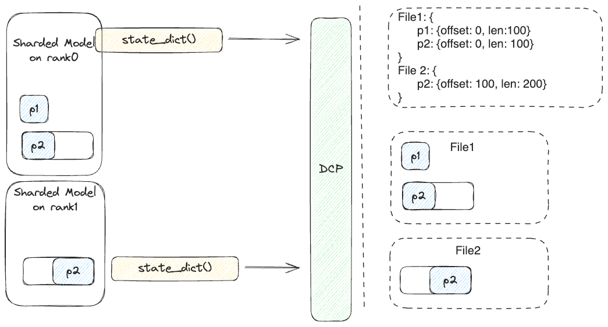
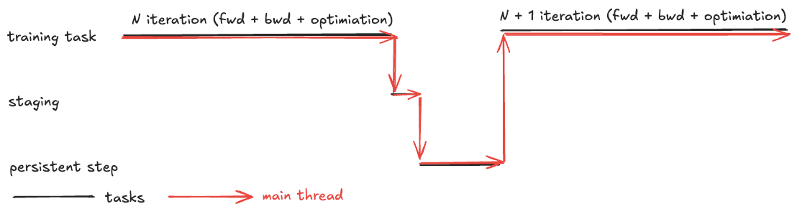
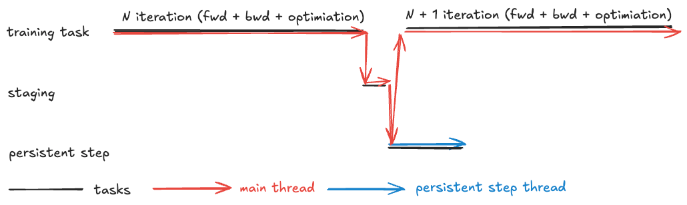
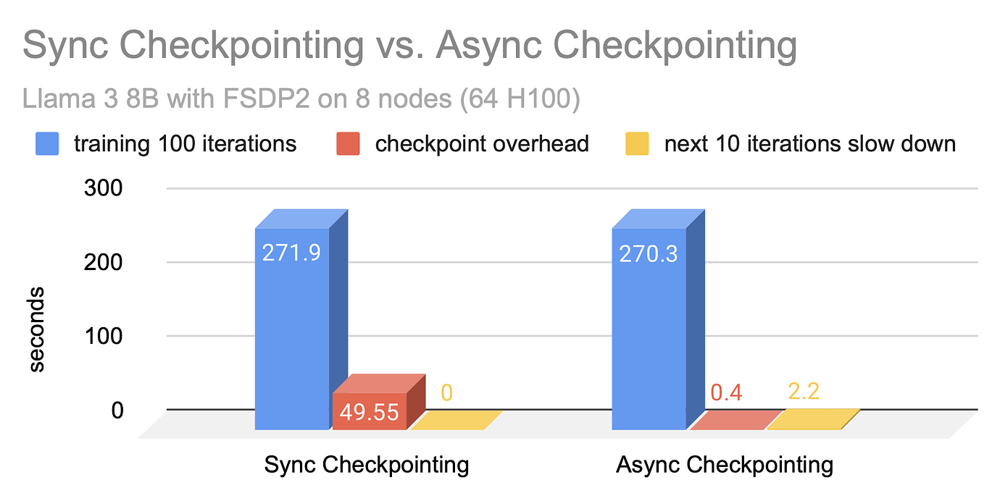
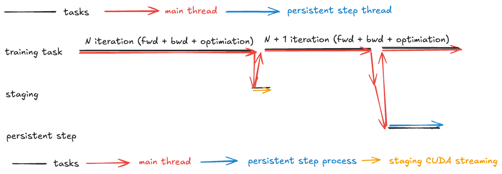
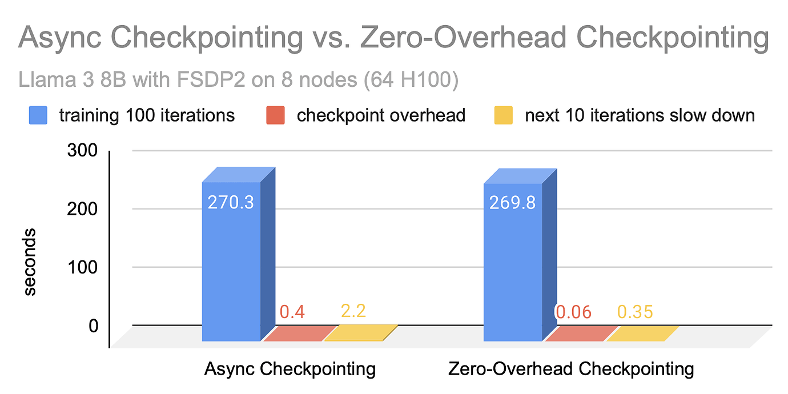

# [번역]PyTorch DCP로 모델 Checkpointing 효율 최적화

> 출처: https://discuss.pytorch.org/t/distributed-w-torchtitan-optimizing-checkpointing-efficiency-with-pytorch-dcp/211250 . 이 글은 주로 PyTorch Distributed Checkpoint(DCP)가 TorchTitan에서 어떻게 적용되고 최적화되는지 소개한다. 글에서는 전통적인 동기 checkpoint, 비동기 checkpoint, zero-overhead checkpoint라는 세 가지 checkpoint 전략을 자세히 다룬다. 비동기 checkpoint는 저장 작업을 학습 iteration과 병렬로 수행해 checkpoint 오버헤드를 19배 줄인다. zero-overhead checkpoint는 GPU에서 CPU로의 데이터 복사를 forward/backward propagation과 겹치고, 독립적인 CUDA stream과 process를 활용해 오버헤드를 추가로 5배 낮춘다(전체 오버헤드는 1초 미만). zero-overhead checkpoint는 구현이 더 복잡하고 더 많은 리소스가 필요하지만, 학습 효율과 GPU 사용률을 높이는 중요한 방향을 보여준다.

> 이는 [【PyTorch 기묘한 기법】Async Checkpoint Save](https://mp.weixin.qq.com/s/DcNjBi_rJKvrU9Ssp8Mo0Q)를 학습 프레임워크 TorchTitan에서 실천한 사례다.

## 개요

- 우리는 PyTorch Distributed Checkpoint(DCP)를 TorchTitan에 통합해 효율적인 distributed checkpoint 기능을 구현했다.
- 우리는 PyTorch DCP에 비동기 checkpoint를 구현해, 저장 작업이 이후 학습 iteration과 겹칠 수 있게 하여 처리 효율을 최적화했다.
    - 동기 checkpoint와 비교해 checkpoint 오버헤드를 19배 줄였다.
- 우리는 TorchTitan에서 DCP를 사용해 zero-overhead checkpoint prototype을 개발했고, GPU에서 CPU로의 복사를 이후 forward 및 backward 작업과 추가로 겹쳤다.
    - 비동기 checkpoint와 비교해 이 방법은 checkpoint 오버헤드를 다시 5배 줄였고, 전체 checkpoint 오버헤드를 1초 미만으로 낮췄다.

## TorchTitan으로 Distributed Training 수행하기

GitHub repository TorchTitan(https://github.com/pytorch/torchtitan)은 native PyTorch로 대규모 LLM training을 수행하는 proof-of-concept 프로젝트다. 이해, 사용, 확장이 쉽도록 설계되었고, 다양한 training 목적에 사용할 수 있으며, modular component를 통해 multi-dimensional parallelism을 지원한다. 이 주제 시리즈에서는 TorchTitan에서 활성화된 최신 PyTorch distributed training 기능을 소개한다.

- Topic 1: [【번역】FSDP2에서 Float8 All-Gather 켜기](https://mp.weixin.qq.com/s/44zFNWr5aVtA3zPtegY9dg)
- Topic 2: 【번역】PyTorch의 Async Tensor Parallelism 한 번에 이해하기(https://discuss.pytorch.org/t/distributed-w-torchtitan-introducing-async-tensor-parallelism-in-pytorch/209487)
- → Topic 3: Optimizing Checkpointing Efficiency with PyTorch DCP

## DCP 소개

Checkpoint는 대형 모델 학습에서 매우 중요하며, 주로 두 가지 용도가 있다. 하나는 inference와 evaluation 같은 application에 사용하는 것이고, 다른 하나는 장애 복구에 사용하는 것이다. 효과적인 checkpoint는 checkpoint가 쉽게 재사용될 수 있고 성능 병목이 되지 않도록 해야 한다. 이 절에서는 PyTorch Distributed Checkpoint(DCP)가 이러한 목표를 어떻게 달성하는지 살펴본다.

일반적인 distributed checkpoint 방식은 두 가지가 있다. 첫 번째는 모든 model weight와 optimizer state를 단일 rank(보통 rank 0)로 모은 뒤, 그 rank가 전체 checkpoint를 저장하는 방식이다. 이 방식은 단순하고 직관적이지만 느리고 storage I/O 활용률이 낮다. rank 0의 storage I/O만 사용하기 때문이며, 성능 문제를 일으킬 수 있는 추가 통신도 포함된다. 두 번째 방식은 각 rank가 자신의 local state를 독립적으로 저장하도록 하여 사용 가능한 모든 I/O 리소스를 활용해 과정을 빠르게 한다. 하지만 이 방식은 보통 번거롭고 확장성이 낮은 후처리가 필요하며, sharded checkpoint를 다른 용도에 맞추기 위한 전용 parallelism 정보도 필요하다.

이러한 문제를 해결하기 위해 우리는 PyTorch에 DCP를 도입했다. DCP는 각 rank가 tensor 통신 없이 자신의 tensor를 local에 저장할 수 있게 하며, 이후 다양한 parallelism 방식이나 전체 checkpoint로 재조립하는 데 필요한 정보를 함께 보존한다. DCP는 parallelism 방식과 무관하게 설계되었고, PyTorch native distributed parallelism(예: DDP, FSDP2, TP, PP)이 생성하는 DTensor에만 의존한다. DCP는 underlying parallelism을 알 필요 없이 DTensor(또는 torch.Tensor)를 분석하고 내부 형식으로 변환한다.

Checkpoint를 load할 때 DCP는 현재 state dictionary를 사용해 tensor shard를 결정하고, 필요한 데이터를 즉시 가져온다. 사용자는 load 시간을 최소화하기 위해 checkpoint를 offline으로 전처리하는 선택도 할 수 있다. DCP는 내부 형식을 최종 결과로 변환함으로써 후처리를 단순화한다.

아래 그림은 저장 흐름을 설명한다. 이 예시에서 parameter P2는 rank0과 rank1 사이에 shard되어 있고, parameter P1은 rank0에 shard되지 않은 상태로 유지된다. 각 rank에서 `state_dict`를 저장할 때 tensor data 자체에는 통신이 발생하지 않는다. 하지만 metadata 관련 통신은 발생하며, 이후 metadata file에 저장된다. 이 metadata file은 각 file 안에서 각 parameter의 offset과 length를 자세히 기록한다. 이 그림은 설명 목적이며 일부 측면을 단순화했다는 점에 유의하라. 실제 구현 세부 사항은 다를 수 있다.



## DCP를 TorchTitan에 통합하기

TorchTitan에서 DCP로 checkpoint를 저장하려면 다음 code snippet을 사용할 수 있다.

```python
import torch.distributed.checkpoint as dcp
def save_checkpoint(self, state_dict: Dict[str, Any], path: Union[str, os.PathLike]):
    dcp.save(state_dict, path)
```

`path` parameter는 local file system을 가리키는 일반 경로일 수도 있고, fsspec이 지원하는 storage를 가리키는 경로일 수도 있다. 자체 전용 storage solution을 사용하려는 사용자를 위해 DCP는 custom storage backend도 허용한다. `state_dict` parameter는 저장할 state를 담은 dictionary다. DCP는 `state_dict`를 순회하면서 각 value에 `state_dict()` method가 있는지 확인한다. 있다면 DCP는 그 object에서 해당 method를 호출하고 반환값을 저장한다. 그렇지 않으면 그 value를 직접 저장한다. model과 optimizer를 함께 저장하려면 다음 `state_dict`면 충분하다.

```python
model = MyModel()
optim = MyOptimizer(model)
state_dict = {"model": model, "optimizer": optim}
```

하지만 이런 `state_dict` 내용은 data parallelism과 tensor parallelism을 사용하는 model에는 적용할 수 있지만, pipeline parallelism에는 적용할 수 없다. 또한 GPU 수가 다르거나 parallelism 방식이 다른 환경 사이에서 optimizer를 resharding하는 데에도 사용할 수 없다. 두 제한은 모두 `torch.optim.Optimizer.state_dict()`가 반환하는 dictionary가 parameter/state를 나타내는 데 fully qualified name(FQN)이 아니라 parameter ID를 사용한다는 점에서 비롯된다. `model.state_dict()`는 `layer1.weight` 같은 key를 반환하며, GPU 분포나 model parallelization과 무관하게 이것은 unique FQN이다. 반면 `optim.state_dict()`는 숫자 ID로 `layer1.weight`를 나타내며, 이 ID는 parameter가 optimizer에 전달된 순서를 반영한다. 이 parameter ID는 unique하지 않아 충돌을 일으킬 수 있으며, 특히 pipeline parallelism에서는 `layer1.weight`와 `layer2.weight` 같은 parameter가 서로 다른 GPU에서 동일한 parameter ID를 가질 수 있다.

이 문제를 해결하기 위해 우리는 PyTorch에 distributed `state_dict` API를 구현했다. 이 API는 model과 optimizer의 `state_dict`를 모두 distributed checkpoint에 친화적인 형식으로 변환한다. TorchTitan에서는 다음 `OptimizerWrapper`로 optimizer를 감싼다(`ModelWrapper`는 기본 개념이 `OptimizerWrapper`와 같으므로 논의는 생략한다).

```python
class OptimizerWrapper(Stateful):
    def __init__(
        self,
        model: Union[nn.Module, List[nn.Module]],
        optim: Union[torch.optim.Optimizer, List[torch.optim.Optimizer]],
    ) -> None:
        self.model = [model] if isinstance(model, nn.Module) else model
        self.optim = [optim] if isinstance(optim, torch.optim.Optimizer) else optim

    def state_dict(self) -> None:
        func = functools.partial(
            get_optimizer_state_dict,
            options=StateDictOptions(flatten_optimizer_state_dict=True),
        )
        return {k: v for sd in map(func, self.model, self.optim) for k, v in sd.items()}

    def load_state_dict(self, state_dict: Dict[str, Any]) -> None:
        func = functools.partial(
            set_optimizer_state_dict,
            optim_state_dict=state_dict,
            options=StateDictOptions(flatten_optimizer_state_dict=True),
        )
        list(map(func, self.model, self.optim))
```

TorchTitan은 model과 optimizer를 `dcp.save()`에 직접 전달하는 대신 `model_wrapper`와 `optim_wrapper`를 사용한다. 주목할 점은 `OptimizerWrapper`(및 유사한 `ModelWrapper`)가 model과 optimizer의 list를 받을 수 있다는 것이다. 이는 각 rank에서 여러 model 및 optimizer block을 관리하는 일부 pipeline parallel algorithm에 대응하기 위해서다. Distributed `state_dict`는 여러 `state_dict` entry를 하나로 flatten할 수 있다.

이 절에서는 DCP를 TorchTitan에 통합하는 기본 개념을 개괄했다. 더 자세한 정보는 code(https://github.com/pytorch/torchtitan/blob/main/torchtitan/checkpoint.py)를 참고하라.

## 비동기 Checkpoint

DCP를 사용하면 tensor를 aggregate할 필요는 없어지지만, 학습 step과 비교하면 checkpoint 오버헤드는 여전히 크다. Checkpoint 과정에서 trainer는 그 과정이 완료될 때까지 기다려야 하며, 이는 사실상 GPU 리소스를 낭비한다.

Checkpoint에는 두 가지 주요 bottleneck이 있다. tensor를 GPU에서 CPU memory로 복사하는 것(이를 "staging"이라 부른다)과 tensor를 CPU memory에서 persistent storage로 전송하는 것이다. 아래 그림은 이를 보여준다. 이 그림은 time axis(x축)를 따라 세 가지 다른 task(training, staging, persistence step)를 나타내며, trainer가 training을 멈추고 staging을 수행한 뒤 persistence step을 수행해야 함을 보여준다. 현대적인 model에서 staging 오버헤드는 보통 몇 초 지속되고, persistence step은 storage system에 따라 수십 초에서 수백 초까지 걸릴 수 있다.



Checkpoint 빈도를 낮추는 것은 오버헤드를 줄이는 흔한 방법이다. 예를 들어 checkpoint 오버헤드가 50초이고 GPU 시간 낭비를 1% 이하로 제한하는 것이 목표라면, 최적 해법은 5000초마다 checkpoint를 저장하는 것이다. 이 빈도는 더 작은 규모에서는 받아들일 수 있을지 몰라도, 수백 또는 수천 개 GPU node에 걸쳐 학습할 때는 문제가 된다. 이런 큰 규모에서는 5000초 동안 node failure가 없다고 가정하는 것이 현실적이지 않다. Training의 SPMD 특성 때문에 이 기간에 단일 node만 실패해도 모든 node가 마지막 checkpoint에서 다시 시작해야 하며, 이는 training efficiency를 크게 낮춘다.

이 비효율을 해결하기 위해 우리는 DCP에 비동기 checkpoint를 구현했다. 비동기 checkpoint의 기본 원리는 persistence step(GPU를 사용하지 않음)을 별도 thread에서 training step과 동시에 실행할 수 있다는 것이다. 비동기 checkpoint를 사용할 때 과정은 main training을 잠시 멈추고 tensor를 GPU에서 CPU memory로 복사하는 것으로 시작한다. 그 후 main training thread는 training task를 재개하고, persistence step은 다른 thread에 위임된다. 아래 그림은 비동기 checkpoint의 개념을 설명한다. Main thread는 더 이상 persistence step을 처리하지 않고, 이 task 전용 thread를 하나 시작한 뒤 즉시 training으로 돌아간다.



아래 그림은 실험 결과를 보여준다. 우리는 64개의 H100 GPU를 갖춘 8개 node에서 TorchTitan FSDP2로 Llama 3 8B model을 학습했다. Checkpoint 빈도는 100 iteration마다 한 번으로 설정했다. 그림에서 볼 수 있듯 checkpoint를 수행하지 않고 100 iteration을 학습하는 데는 약 270초가 걸린다. 동기 checkpoint를 사용하면 checkpoint 오버헤드는 거의 50초에 이른다. 분명히 이 오버헤드는 너무 커서 100 iteration마다 한 번 또는 5분마다 한 번의 checkpoint 빈도를 유지하기 어렵다.



비동기 checkpoint를 사용하면 checkpoint 오버헤드는 0.5초 미만으로 줄어든다. 이상적으로는 이것이 비동기 checkpoint의 전체 오버헤드를 의미해야 한다. 그러나 Python global interpreter lock(GIL) 때문에 persistence thread가 가끔 main training thread를 방해하며, 이후 10번의 training iteration에서 약 2.2초의 지연을 추가한다. GIL 문제가 있더라도 결과는 동기 checkpoint 대비 뚜렷한 개선을 보여주며, 오버헤드는 최대 19배 줄었다. 이 실험에서 checkpoint 오버헤드를 1% 이내로 제한할 수 있었기 때문에, checkpoint 빈도를 실제로 5분마다 한 번 또는 100 iteration마다 한 번까지 높일 수 있었다.

TorchTitan에서 수행한 실험 외에도, 우리는 IBM과 협력해 비동기 checkpoint의 성능 이점을 보여주었다(https://pytorch.org/blog/reducing-checkpointing-times/).

## Zero-Overhead Checkpoint

비동기 checkpoint는 GPU 리소스 낭비를 크게 줄였지만, GPU의 비용과 전력 소모가 계속 증가하는 상황에서는 1% 손실조차 너무 높다고 여겨질 수 있다. 비동기 checkpoint를 더 개선할 수 있을까? Checkpoint 속도를 늦추는 다른 요인은 무엇일까?

남은 bottleneck 하나는 staging 과정, 즉 tensor를 GPU에서 CPU memory로 복사하는 것이다. 얼핏 보면 다음 training iteration의 state가 일부 update되어 잘못된 checkpoint가 생길 위험 없이 staging을 training과 병렬화하는 것은 불가능해 보인다. 하지만 training step(forward, backward, optimization phase 포함)을 자세히 살펴보면 state를 수정하는 것은 optimization step뿐임을 알 수 있다. 따라서 staging을 forward 및 backward step과 겹칠 수 있다면 checkpoint 오버헤드를 거의 제거할 수 있다.

실제로는 staging 과정을 별도의 CUDA stream에 두고 모든 copy operation을 `non_blocking=True`로 설정한 다음, 다음 optimization step 직전에만 stream을 synchronize하면 이러한 overlap을 구현할 수 있다. 이 전략은 staging 과정을 효과적으로 숨긴다. 우리는 이를 PyTorch private API `_copy_state_dict`에 구현했으며, TorchTitan에서 zero-overhead checkpoint(또는 near-zero-overhead)라고 부르는 기능의 prototype을 만들 때 사용했다.

하지만 staging 시간이 너무 길어 forward와 backward step의 합산 시간보다 길어지면 여전히 visible해질 수 있다. Staging 성능을 높이기 위해 우리는 CUDA의 pinned memory allocation option을 활용해 copy 과정을 가속한다.

또 다른 문제는 staging thread가 main thread 실행을 방해하지 않도록 하는 것이다. 우리의 prototype에서는 persistence step을 위한 별도 process를 생성해 이 문제를 해결했다. Process 사이에서 tensor를 전송하는 것은 시간이 많이 들 수 있지만, PyTorch는 CPU tensor를 process 간 공유 가능하도록 표시하는 기능을 통해 이를 지원한다. Pinned memory와 shared memory 특성을 결합해 우리는 또 다른 PyTorch private API `_create_cpu_state_dict`를 개발했다. 이 API는 zero-overhead checkpoint의 staging에 사용할 CPU `state_dict`를 만든다.

아래 그림은 zero-overhead checkpoint 흐름을 설명한다. Staging CUDA stream context에서 staging을 시작한 뒤, main thread는 즉시 N+1번째 iteration의 training을 재개할 수 있다. Staging CUDA stream은 training과 동시에 staging 과정을 수행한다. Optimization step에 들어가기 전에 main thread는 staged state를 검증해야 한다. staging이 이미 완료되어 있다면 이 검사는 매우 작은 오버헤드만 만든다. 이어서 main thread는 앞서 설명한 것처럼 별도 process에서 persistence step을 시작할 수 있다. 그런 다음 main thread는 training task로 돌아간다.



아래 그림은 이전 절과 동일한 model 및 hardware configuration을 사용한 실험 결과를 보여준다. 결과에 따르면 staging 오버헤드는 0.06초에 불과하고, 이후 training step의 slowdown은 0.4초 미만이다. 이로써 전체 오버헤드는 0.5초 미만으로 내려가며, 비동기 checkpoint보다 6배 빠르다. 하지만 아직 개선 여지는 있다. 추가 0.35초는 주로 main thread가 staging CUDA stream 상태를 monitor하고 `state_dict`를 persistence process로 전송하는 데서 발생한다. 향후 작업에서는 이러한 operation을 다른 thread로 offload해 오버헤드를 더 줄일 수 있다.

그림 6: 비동기 checkpoint vs zero-overhead checkpoint



비동기 checkpoint와 비교하면 zero-overhead checkpoint는 더 복잡하며, 추가 CPU memory(pinned memory는 pageable하지 않음)와 multiprocessing이 필요하고, 이들은 모두 관리하기 더 어렵다. 따라서 CPU memory가 제한되어 있거나 사용자가 더 단순한 checkpoint 과정을 선호한다면 비동기 checkpoint가 더 적합한 선택일 수 있다. 이러한 어려움에도 불구하고 zero-overhead checkpoint는 training efficiency와 GPU utilization을 높이는 유망한 방향을 보여준다.
