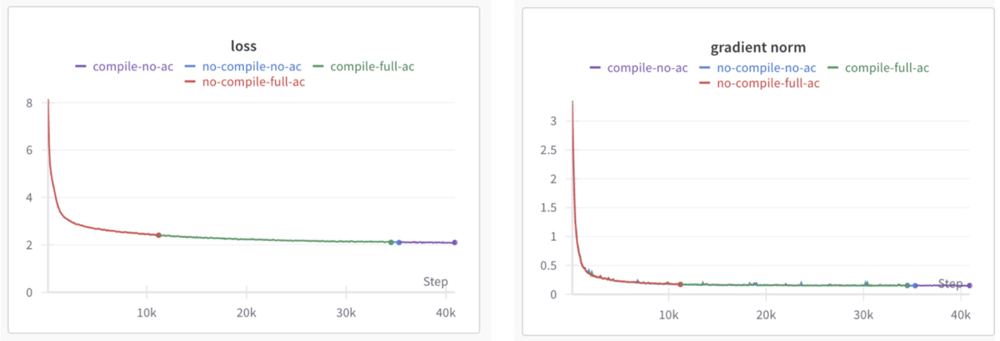
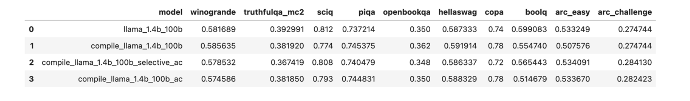
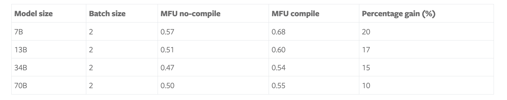
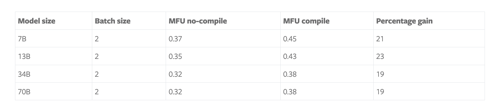
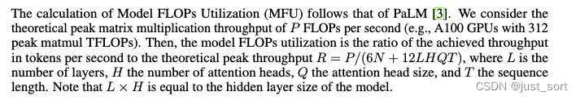
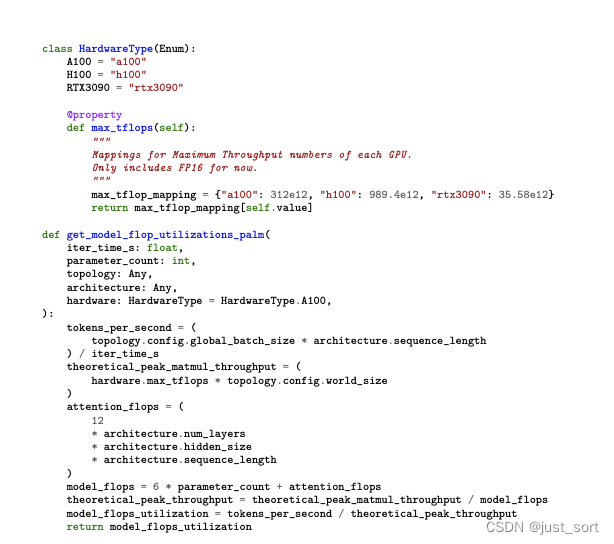

# [번역]PyTorch FSDP와 Torch.compile로 Training Throughput 극대화

> Blog link: https://pytorch.org/blog/maximizing-training-throughput/ . 이 blog는 IBM의 PyTorch team과 Meta의 PyTorch team이 작성했다. [【번역】PyTorch FSDP로 Training Throughput 극대화](https://mp.weixin.qq.com/s/6wNX38rKcFjxLb4ooYQokw)를 기반으로 `torch.compile`을 사용하고 dataloader를 최적화해 7B model의 MFU를 57%에서 68%로 끌어올린다. 여기서는 관련 개념만 간단히 소개하며, 구체적인 세부 사항은 여전히 open source code에서 확인할 수 있다. https://github.com/foundation-model-stack/fms-fsdp . 마지막에는 이 두 blog의 MFU 계산 code도 보충한다. 또한 이 두 blog에서 hardware FLOPS를 인용할 때 https://github.com/stas00/ml-engineering 를 link한 것을 발견했다. repository 일부를 살펴보니 AI system을 다루는 독자에게 매우 유용한 내용이 많아서, 이후 일부 내용을 선택해 번역할 예정이다.

최근(https://pytorch.org/blog/maximizing-training/) 우리는 FSDP와 selective activation checkpointing을 사용해 A100 GPU에서 7B model을 학습할 때 57% MFU(model FLOPs utilization)에 도달하는 방법을 보여주었다. 또한 고품질 model을 학습하는 방법도 보여주었으며, 이를 Granite 7B base model(https://huggingface.co/ibm-granite/granite-7b-base)로 Hugging Face Hub에 Apache v2.0 license로 open source했다.

우리는 `torch.compile`을 활용해 GPU utilization을 계속 높였다. `torch.compile`과 이전 작업의 selective activation checkpointing을 사용하여 A100 GPU에서 7B model에 대해 68% MFU를 달성했다! `torch.compile`은 다양한 model size에서 training MFU를 10%에서 23%까지 높였다.

이 blog는 세 부분으로 나뉜다. (1) `torch.compile`로 training할 때 해결한 challenge, (2) compile과 no-compile의 numerical consistency, (3) MFU report다.

우리는 모든 code를 open source했고 fms-fsdp repository(https://github.com/foundation-model-stack/fms-fsdp)에 업데이트했다. 또한 Meta PyTorch team과 협력해 이 내용을 새로 release된 torch titan(https://github.com/pytorch/torchtitan) pretraining repository에 기여했다.

## torch.compile 사용의 Challenge

`torch.compile`은 GPU utilization을 높일 수 있는 graph compilation 기술이다. torch compile의 동작 원리에 대한 자세한 내용은 최근 PyTorch paper(https://pytorch.org/blog/pytorch-2-paper-tutorial/)와 관련 tutorial을 참고하기를 권한다. `torch.compile`이 좋은 성능을 내게 하는 핵심 challenge 중 하나는 graph break를 최소화하거나 제거하는 것이다. 우리는 처음에 Meta가 제공한 Llama 구현에서 시작했지만, 이를 compile하면 graph break가 너무 많이 발생해 training throughput이 낮아졌다.

Model architecture의 몇 부분은 수정이 필요했고, 그중 가장 중요한 것은 positional embedding layer(RoPE)였다. 일반적인 RoPE 구현은 complex number를 사용하는데, test 당시 `torch.compile`은 complex number를 지원하지 않았다. 우리는 original model architecture 구현과의 일관성을 유지하면서 einops로 RoPE를 구현했다. 또한 RoPE 구현에서 graph break를 피하려면 frequency를 올바르게 cache해야 했다.

FSDP model을 compile하면 실제로 graph break가 발생하며, Meta PyTorch team은 이를 제거하기 위해 노력하고 있다. 하지만 PyTorch 2.3 기준으로 이 graph break는 FSDP unit boundary에서 발생하며 throughput에 큰 영향을 주지는 않는다.

Custom kernel을 사용할 때는 각 kernel의 API를 노출하는 wrapper를 만들어 `torch.compile`이 사용할 수 있게 해야 한다. 여기에는 어떤 argument가 inplace로 수정되는지, 어떻게 수정되는지, 그리고 input에 기반해 return value가 어떤 shape와 stride를 갖는지 알려주는 작업이 포함된다. 우리의 경우 SDPA Flash attention은 이미 적절히 통합되어 있었기 때문에, graph break 없이 해당 kernel을 `torch.compile`과 함께 동작하게 할 수 있었다.

또한 data volume을 2T에서 6T tokens로 늘렸을 때 dataloader가 bottleneck이 되는 것을 관찰했다. 이 문제의 핵심 원인 중 하나는 이전 dataloader에서 document shuffling을 단순하게 구현해, 각 worker가 shuffled document pointer list를 유지했다는 점이다.

Dataset이 커지면서 이 pointer list는 각 worker process에서 수십만 entry로 늘어났다. 이 규모의 pointer list를 유지하는 비용이 너무 커져 CPU contention이 training throughput을 제한했다. 우리는 linear congruential generator(https://en.wikipedia.org/wiki/Linear_congruential_generator)를 사용해 document shuffling을 다시 구현했고, 어떤 pointer list도 필요하지 않게 했다. LCG는 pseudorandom number generator algorithm으로, 한 집합 위에서 random walk를 구현하며 replacement 없는 sampling을 제공한다.

우리는 같은 아이디어를 활용해 ordered document index에서 shuffled document index로 가는 implicit bijection mapping을 만들었다. 이를 통해 골치 아픈 수십만 개 pointer list를 LCG의 단일 integer state로 줄일 수 있었다. 이로써 bottleneck의 80%가 제거되었고 성능이 크게 향상됐다. 우리는 high-performance pretraining dataloader의 모든 세부 사항을 별도 blog에서 자세히 소개할 계획이다.

## torch.compile과 torch.no-compile의 Numerical Consistency

우리는 이전에 compile option과 no-compile option으로 training할 때 consistency 문제가 있음을 관찰했으며, 그중 하나는 SDPA 사용과 관련되어 있었다. Meta와 IBM의 PyTorch team이 며칠 동안 집중적인 debugging session을 진행한 끝에, PyTorch compile mode와 no-compile mode 사이의 consistency를 성공적으로 달성했다. 이 consistency를 기록하고 검증하기 위해 1.4B size의 mini Llama model architecture를 사용했고, 네 가지 variant로 100B tokens까지 학습했다. no-compile, activation checkpointing 없는 compile, selective activation checkpointing이 있는 compile, full activation checkpointing이 있는 compile이다.

아래에는 이 option들의 loss curve와 gradient norm을 그렸다.

또한 `lm-evaluation-harness`를 실행해 여러 benchmark에서 다양한 model의 score를 비교했고, 아래와 같이 compile과 no-compile 사이에 중대한 차이가 없음을 관찰했다.

이 모든 결과에서 compile과 그 모든 variant가 no-compile option과 동등함을 관찰했고, 따라서 compile과 no-compile 사이의 consistency를 입증했다.

## MFU Report

마지막으로 이전 blog와 마찬가지로 두 cluster에서 네 가지 서로 다른 model size의 MFU를 계산했다. 한 cluster는 400 Gbps inter-node connection을 갖춘 128개 A100 GPU이고, 다른 하나는 3.2 Tbps inter-node connection을 갖춘 464개 H100 GPU다. Compile 외에도 이전 blog에서 소개한 selective activation checkpointing을 사용했다. 결과는 아래 표에 정리했다.

우리는 내부적으로 448개 GPU를 사용해 Llama2 7B architecture의 production run도 한 번 수행했다. Compile과 selective activation checkpointing을 사용하고 global batch size를 3.7M으로 설정해 13일 10시간 만에 4T tokens를 학습했다!

Training 중에는 data center의 cooling system이 추가 air conditioner를 가동해야 했고, training team은 우리가 GPU를 매우 효율적으로 사용하고 있었기 때문에 이와 관련한 alert를 받았다 ☺

표 1과 표 2에서 볼 수 있는 핵심 관찰 중 하나는 MFU 값이 model size에 따라 linear하게 증가하지 않는다는 점이다. 우리는 두 가지 가능한 설명을 적극적으로 조사하고 있다. 하나는 model size가 증가할 때 FSDP의 scalability와, GPU를 더 효율적으로 사용하기 위해 언제 tensor parallelism을 켜야 하는지다. 다른 하나는 batch size이며, 더 나은 MFU를 얻기 위해 추가로 늘릴 수 있다. 우리는 FSDP v2와 selective operator checkpointing, 그리고 tensor parallel feature를 탐색해 model size에 따른 FSDP scaling 법칙을 연구할 계획이다.

## Future Work

우리는 PyTorch 2.4의 일부로 release될 FSDP v2 테스트를 시작할 계획이다. FSDP2는 per-parameter sharding과 selective operator checkpointing 기능을 제공하며, 더 나은 memory-compute tradeoff를 제공할 수 있다.

또한 Meta PyTorch team과 협력해 새로운 asynchronous checkpoint 기능을 평가하고 있으며, checkpoint write 시간을 줄여 GPU utilization을 추가로 높이려 한다.

우리는 현재 inference에 사용하는 다양한 Triton kernel을 backward operation 수행까지 확장해, inference 바깥에서도 acceleration을 얻는 방안을 탐색하고 있다.

마지막으로 fp8을 사용하는 최근 작업들이 등장함에 따라, 2배 acceleration을 약속하는 이 새로운 data type으로 model training을 어떻게 추가 가속할 수 있을지 탐색할 계획이다.

## 감사의 말

이 proof point를 달성하는 데 여러 team이 참여했으며, 우리는 Meta와 IBM team에 감사드린다. 특히 Meta의 PyTorch distributed 및 compiler team, 그리고 IBM Research에 감사드린다.

우리 model의 `torch.compile` numerical consistency를 달성하는 노력에는 많은 사람이 폭넓게 참여했다. 이 작업에 참여한 핵심 인물들에게 감사드리고 싶다. Meta의 Animesh Jain과 Less Wright, IBM Research의 Linsong Chu, Davis Wertheimer, Brian Vaughan, Antoni i Viros Martin, Mudhakar Srivatsa, Raghu Ganti에게 감사드린다.

Stas Bekman에게 특별히 감사드린다. 그는 광범위한 feedback을 제공하고 이 blog를 개선하는 데 도움을 주었다. 그의 insight는 training optimization의 핵심 측면을 부각하고 추가 개선을 탐색하는 데 매우 소중했다.

## MFU 보충

이 blog와 [AI Infra 논문 읽기: table lookup으로 대형 모델 training의 최적 parallel configuration 얻기](https://mp.weixin.qq.com/s/D-14J482SFQf-zh-EFa-1w)에서 사용하는 MFU는 PaLM의 계산 방법을 따른다. 이를 자세히 설명해 본다.

Model FLOPs utilization(MFU)의 계산은 PaLM 방법을 따른다. 우리는 이론적인 matrix multiplication peak throughput을 초당 P FLOPs로 본다(예: A100 GPU의 peak matrix multiplication TFLOPs는 312). 그러면 model의 FLOPs utilization은 실제 달성한 초당 처리 token 수와 이론 peak throughput `R = P/(6N + 12LHQT)`의 비율이다. 여기서 L은 layer 수, H는 attention head 수, Q는 attention head size, T는 sequence length다. L × H가 model의 hidden layer size와 같다는 점에 유의하라. N은 parameter 수다. 계산 code는 다음과 같다.

내가 이해하기로는 7B 기준 68% MFU는 이미 Megatron-LM의 MFU와 상당히 가깝다. 관심 있는 독자는 [AI Infra 논문 읽기: table lookup으로 대형 모델 training의 최적 parallel configuration 얻기](https://mp.weixin.qq.com/s/D-14J482SFQf-zh-EFa-1w) 글을 읽어봐도 좋다.
