> 출처: https://discuss.pytorch.org/t/distributed-w-torchtitan-introducing-async-tensor-parallelism-in-pytorch/209487 . 이 문서는 PyTorch에 새로 구현된 asynchronous tensor parallelism(Async-TP) 기술을 소개한다. 이 기술은 communication과 computation operation을 분해하고 overlap해 실행함으로써 large-scale language model training performance를 크게 높인다. Llama3 series model 테스트에서는 forward propagation 속도를 20~29%, end-to-end training 속도를 약 8% 높일 수 있음을 보였다. 글은 communication overhead와 computation efficiency 문제를 포함해 구현 과정의 technical challenge를 자세히 논의하고, 그에 대한 solution을 제안한다. 현재 이 기술은 TorchTitan에 통합되어 있으며 `torch.compile` 또는 eager mode로 사용할 수 있다. 다만 NVSwitch support가 필요하고 intra-node configuration에만 적용되는 등 일부 limitation이 있다. 이 기술은 large-scale distributed training efficiency를 높이는 데 중요한 의미가 있다.

# [Distributed Training and TorchTitan] PyTorch의 Asynchronous Tensor Parallelism 소개

## Summary

- 우리는 PyTorch에 experimental asynchronous tensor parallelism support를 구현했다.
- 이를 TorchTitan에 통합했으며 다음을 관찰했다.
    - Llama3 7B model에서 forward propagation 속도는 최대 약 29%, end-to-end 속도는 최대 약 8% 향상됐다.
    - Llama3 70B model에서 forward propagation 속도는 최대 약 20%, end-to-end 속도는 최대 약 8% 향상됐다.
- Performance challenge와 우리가 설계한 solution을 간단히 논의한다.

## TorchTitan의 Distributed Training

GitHub repository `torchtitan`은 native PyTorch로 large-scale LLM training을 수행하는 proof-of-concept project다. 이해, 사용, 확장이 쉽도록 설계되었고, 다양한 training 목적에 사용할 수 있으며 modular component를 통해 multi-dimensional parallelism을 지원한다. 이 series에서는 TorchTitan에서 활성화된 최신 PyTorch distributed training feature를 소개한다.

- Topic 1: [【번역】FSDP2에서 Float8 All-Gather 켜기](https://mp.weixin.qq.com/s/44zFNWr5aVtA3zPtegY9dg)
- → Topic 2: PyTorch에 asynchronous tensor parallelism 도입하기

## Tensor Parallelism

Tensor parallelism(TP)은 널리 쓰이는 model parallelism technique이다. Data parallelism은 batch dimension에서만 computation을 shard하는 데 제한되지만, TP는 feature dimension을 따라 computation을 추가로 distribute하여 여러 GPU가 동일 sample을 동시에 처리할 수 있게 한다. 이 특성 때문에 TP는 large-scale LLM training에 매우 중요하다. Global batch size보다 device 수가 많아질 때 생기는 제약을 깨기 때문이다.

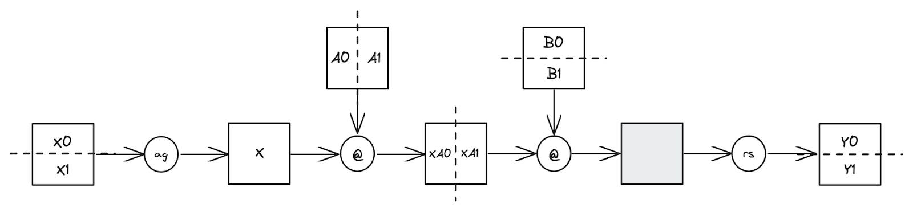

간단히 돌아보면, 그림은 2개 device에 TP를 적용한 two-layer FFN을 보여준다. 먼저 row-sharded input `[X0, X1]`, column-sharded linear weight `[A0, A1]`, row-sharded linear weight `[B0, B1]`에서 시작한다. 먼저 `[X0, X1]`에 all-gather operation을 수행해 unsharded input X를 생성한다. 그런 다음 각 device에서 X @ A0 @ B0와 X @ A1 @ B1을 독립적으로 계산하면서 activation sharding을 유지한다. 마지막으로 reduce-scatter를 사용해 unsharded output part를 합치고 최종 sharded output을 형성한다.

이 방법은 activation을 가능한 오래 sharded 상태로 유지함으로써 communication volume을 효과적으로 최소화한다. 하지만 communication은 여전히 efficiency challenge를 가진다. 이 communication이 노출되기 때문이다. Asynchronous tensor parallelism은 이 문제를 해결하기 위한 optimization design이다.

## Asynchronous Tensor Parallelism

우리가 아는 한, asynchronous tensor parallelism(async-TP) 개념은 논문 《Breaking the Computation and Communication Abstraction Barrier in Distributed Machine Learning Workloads》(https://arxiv.org/abs/2105.05720)에서 처음 제안되었다. 다만 Wang et al. 2022(https://dl.acm.org/doi/abs/10.1145/3567955.3567959)와 Chang et al. 2024(https://arxiv.org/abs/2406.06858)를 포함한 parallel research work도 있다. 핵심 insight는 서로 의존하는 communication operator와 computation operator를 분해하면 원래는 불가능했던 overlap opportunity를 만들 수 있다는 것이다.

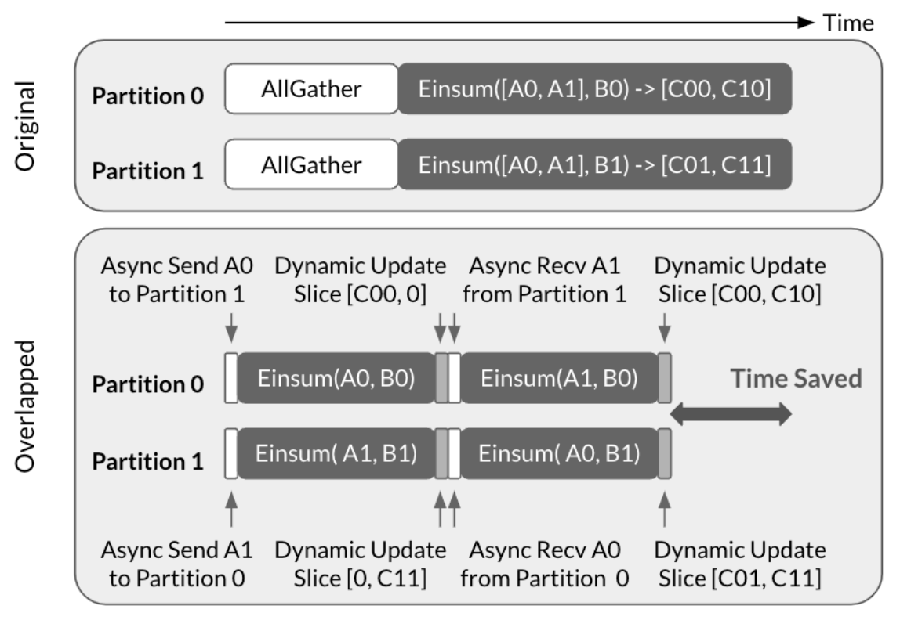

> 위쪽(Original traditional method): 두 partition(Partition 0과 1)이 순서대로 실행된다. 먼저 AllGather operation으로 data를 모으고, 그 다음 Einsum matrix computation을 수행한다. 이 방식에서는 computation과 communication이 serial하며 waiting time이 존재한다. 아래쪽(Overlapped async method): communication은 asynchronous Send와 Recv operation으로 분해되고, computation도 더 작은 Einsum operation으로 분해된다. 두 partition은 동시에 진행될 수 있다. Partition 0은 A0를 Partition 1로 보내면서 동시에 Einsum(A0, B0)을 계산하고, Partition 1은 A1을 Partition 0으로 보내면서 동시에 Einsum(A1, B1)을 계산한다. Dynamic Update로 computation result를 update한다. 이 방법은 communication과 computation을 overlap하여 실행할 수 있어 전체 waiting time을 줄인다. 그림 오른쪽 화살표처럼 traditional method 대비 시간이 절약된다.

Wang et al.의 그림은 이 기술을 all-gather 뒤의 matmul에 어떻게 적용하는지 보여준다. all-gather는 send와 recv operation으로 분해되고, matmul은 sub-matmul로 나뉜다. 이런 분해를 통해 한 sub-matmul을 계산하는 동시에 다음 sub-matmul에 필요한 data를 transfer할 수 있어 communication latency를 효과적으로 숨길 수 있다.

## Performance Challenge

Asynchronous tensor parallelism의 개념은 이론적으로 단순하고 직관적이지만, CUDA에서 high-performance implementation을 구현하려면 여러 challenge가 있다. 이 절에서는 이러한 challenge와 우리가 채택한 solution을 논의한다.

**Acknowledgement**: 이 challenge 중 상당수는 처음에 Luca Wehrstedt(https://discuss.pytorch.org/u/lcw/summary)가 탐색했다. PyTorch의 async-TP implementation은 xFormers의 async-TP 작업에서 중요한 inspiration을 얻었다.

### Communication Overhead

Communication을 분해할 때 NCCL의 send/recv operation을 사용하고 싶은 유혹이 있을 수 있다. 사용하기 쉽기 때문이다. 하지만 NCCL의 send/recv operation은 async tensor parallelism에 적합하지 않은 몇 가지 특성을 가진다.

- **Overlapped computation과 communication 사이의 경쟁** - computation과 communication은 독립적으로 사용할 수 있는 두 resource라고 흔히 생각하지만, 실제로는 독립성에 미묘한 차이가 있으며 경쟁이 실제로 발생한다. Intra-node setting(TP에서 가장 흔한 경우)에서 NCCL의 send/recv kernel은 NVLink로 data를 transfer하기 위해 SM을 활용한다. 이는 overlap되는 matrix multiplication kernel에 사용할 수 있는 SM 수를 줄여 속도를 낮춘다. 흥미롭게도 관찰된 slowdown은 communication kernel이 소비한 resource percentage보다 클 수 있다. cuBLAS가 full wave로 실행되는 kernel을 선택하려고 하기 때문에, communication kernel이 SM을 점유하면 balance가 깨져 matrix multiplication kernel이 additional wave를 실행해야 할 수 있다.

- **Bidirectional synchronization** - NCCL의 send/recv kernel은 bidirectional synchronization을 수행한다. 즉 sender와 receiver 모두 operation이 완료될 때까지 block된다. 이 방법은 operator-internal parallelism의 data transfer에 항상 optimal하지는 않다. 구체적인 상황에 따라 여러 data transfer에 대해 single synchronization을 수행하거나, remote node에 data를 push하는 것과 remote node에서 data를 pull하는 것 중 선택하는 편이 더 적합할 수 있다.

다행히 CUDA의 P2P mechanism을 활용하면 앞서 언급한 단점을 피할 수 있다. 이 mechanism은 device가 peer device에 allocate된 memory를 virtual memory address space에 mapping하여 접근할 수 있게 한다. 이로써 memory operation(load/store/atomic 등)이 NVLink를 통해 실행될 수 있다. 현재 PyTorch의 async-TP implementation은 acceleration을 위해 모든 device pair 사이에 NVLink connection(예: NVSwitch를 통해)이 필요하다. 이는 앞으로 해결하려는 limitation이다. 또한 contiguous data를 peer device 사이에서 `cudaMemcpyAsync`로 transfer할 때, 이 operation은 copy engine(GPU의 dedicated hardware unit으로, 서로 다른 memory location 사이의 data movement를 관리하며 GPU compute core(SM)와 독립적으로 동작한다)이 처리한다. SM이 전혀 필요하지 않으므로 앞서 논의한 competition problem을 피할 수 있다. Copy engine을 통한 data transfer도 같은 memory bandwidth를 공유하지만, (1) transfer rate가 NVLink bandwidth에 의해 제한되어 memory bandwidth competition을 피할 만큼 낮고, (2) overlap되는 matrix multiplication이 compute-intensive이므로 큰 competition이 생길 가능성은 낮다.

향후 이 mechanism을 async-TP와 유사한 use case에 활용하기 위해 우리는 SymmetricMemory라는 experimental abstraction(https://github.com/pytorch/pytorch/blob/main/torch/csrc/distributed/c10d/SymmetricMemory.hpp)을 개발했다. 개념적으로 이는 device group 사이에 symmetric하게 allocate된 buffer를 나타내며, virtual memory/multicast address를 통해 각 GPU가 peer device의 대응 buffer에 접근할 수 있게 한다. Async-TP를 사용하는 데 SymmetricMemory와 직접 상호작용할 필요는 없지만, 사용자는 이를 활용해 async-TP와 유사한 custom fine-grained intra-node/operator-internal optimization을 만들 수 있다.

### Work Decomposition으로 인한 Wave Quantization Efficiency 증폭 문제

Tiled matrix multiplication kernel은 SM 수에 따라 wave 형태로 실행된다. 마지막 wave가 소수의 block만 포함하더라도 완료 시간은 거의 full wave만큼 길며, 이것이 소위 quantization efficiency problem을 만든다. 하나의 matrix multiplication을 분해하면 각 kernel의 block 수가 줄어들고, 분해된 matrix multiplication의 combined quantization efficiency loss가 원래 matrix multiplication보다 커질 수 있다.

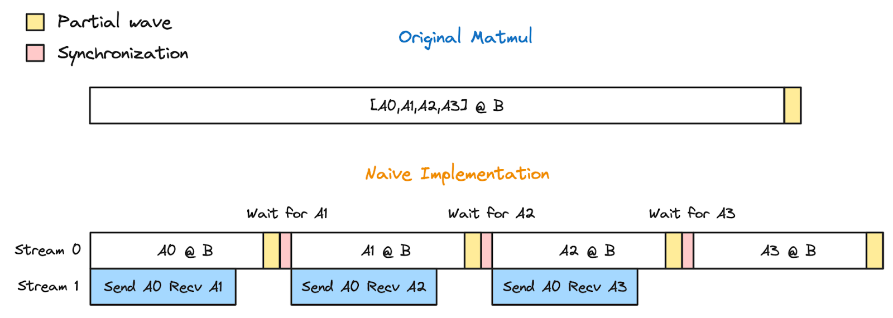

이 문제를 설명하기 위해 all-gather → matmul 예를 보자. 이 예에서 A는 4개 device에 sharded되어 있다. async-TP를 사용하지 않으면, 먼저 4개 device에서 A를 gather한 뒤 모든 device에서 A @ B를 계산한다. async-TP를 사용하면 A @ B는 A0 @ B, A1 @ B, A2 @ B, A3 @ B로 분해된다. Native async-TP implementation은 한 stream에서 이러한 sub-matrix multiplication을 순서대로 실행하고, 다른 stream에서 다음 sub-matrix multiplication에 필요한 data를 prefetch한다. 이 방법은 communication latency를 효과적으로 숨긴다. 하지만 matrix multiplication이 더 작은 부분으로 분해되면서 partial wave 수가 증가하고, 전체 matrix multiplication execution time이 길어진다.

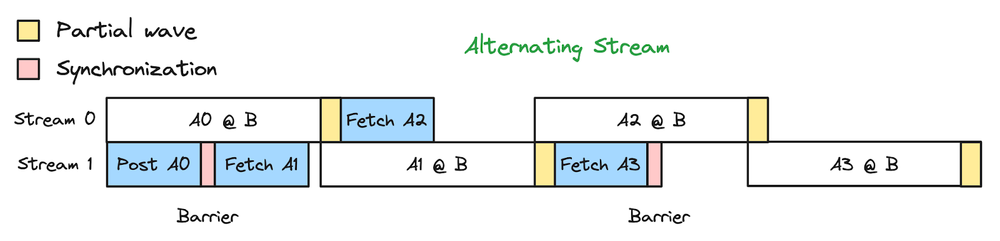

증폭된 quantization efficiency 문제를 해결하기 위해 우리는 alternating stream 방식을 채택했다. Dedicated compute stream과 communication stream을 사용하는 대신, 역할이 번갈아 바뀌는 두 symmetric stream을 사용한다. 이 방법은 computation과 communication overlap을 허용할 뿐 아니라, 현재 sub-matrix multiplication의 partial wave가 다음 sub-matrix multiplication과 overlap되게 하여 decomposition으로 인한 추가 quantization efficiency problem을 완화한다.

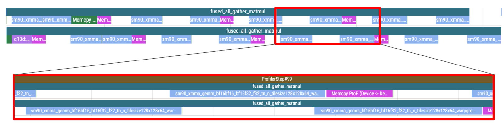

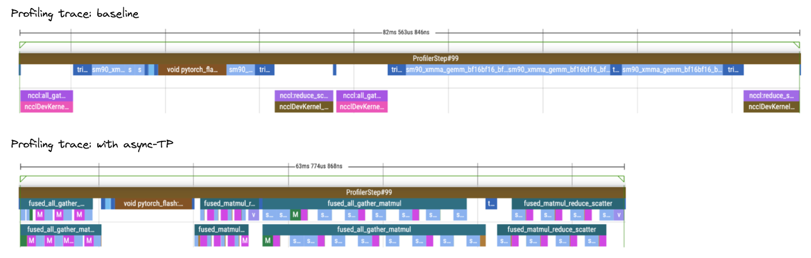


## End-to-End Performance Evaluation

우리는 TorchTitan으로 Llama3 8B와 70B에 대해 end-to-end performance evaluation을 수행했다. Llama3 8B에서는 forward propagation 속도가 약 29%, end-to-end 속도가 약 8% 향상됨을 관찰했다. Llama3 70B에서는 forward propagation 속도가 약 20%, end-to-end 속도가 약 8% 향상됐다.

Benchmark configuration:

- Benchmark는 64개 H100 GPU를 사용했다. Benchmark에 사용한 H100 GPU는 standard가 아니다. HBM2e를 사용하고 TDP가 제한되어 있다. 실제 peak TFLOP는 SXM과 NVL 사이여야 하지만 정확한 값은 모른다. 따라서 보고된 MFU는 실제 MFU보다 낮다. SXM의 peak TFLOP를 직접 사용했기 때문이다. 각 host에는 8개 GPU와 NVSwitch가 있다.
- Baseline과 async-TP configuration 모두 `torch.compile`을 활성화했다.
- Model은 bf16 precision으로 training했다.
- Llama3 8B에는 selective activation checkpointing을 적용했고, Llama3 70B에는 full activation checkpointing을 적용했다.

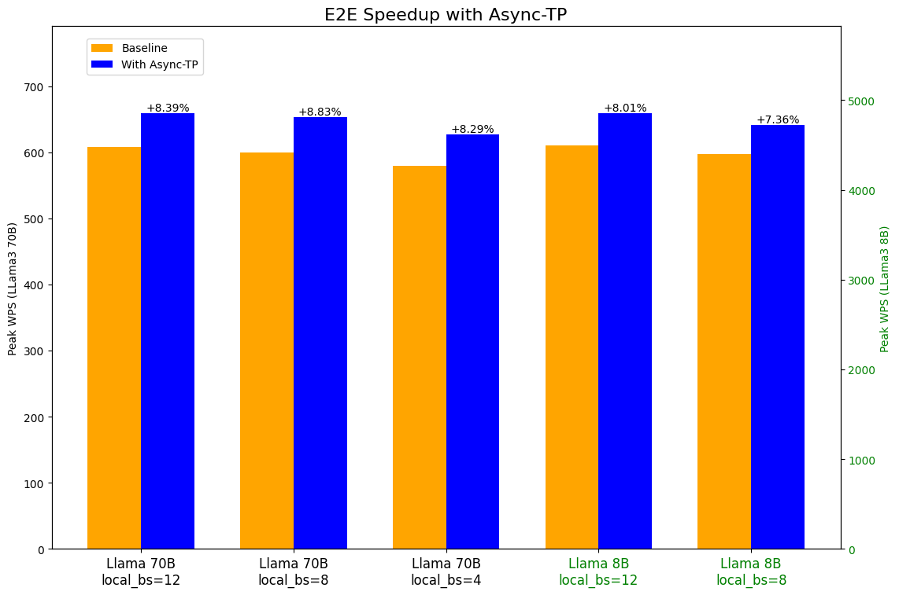

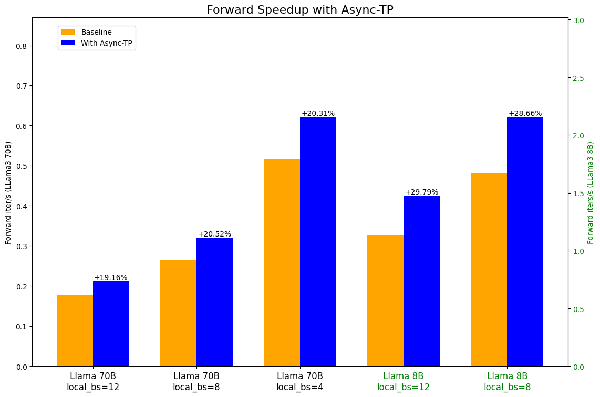

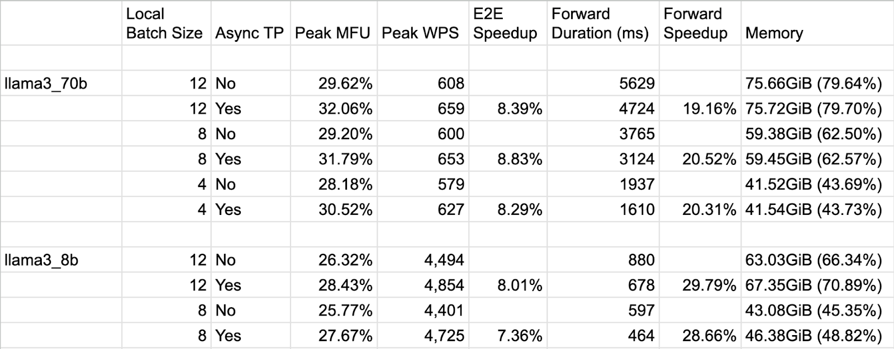

우리는 Llama 3.1 405B에서도 async-TP benchmark를 수행했다. 자세한 정보는 여기(https://github.com/pytorch/torchtitan/blob/main/docs/performance.md)에서 볼 수 있다.

## TorchTitan에서 Async-TP 사용하기

Async-TP support는 이미 TorchTitan에 통합되어 있다. 이를 활성화하려면 tensor parallel training을 사용할 때 `--experimental.enable_async_tensor_parallel` option을 제공하면 된다.

## PyTorch에서 Async-TP 사용하기

Async-TP support는 최신 PyTorch nightly build에서 사용할 수 있다. `torch.compile`을 통해서도 사용할 수 있고, eager mode에서 직접 사용할 수도 있다.

### torch.compile로 Async-TP 사용하기

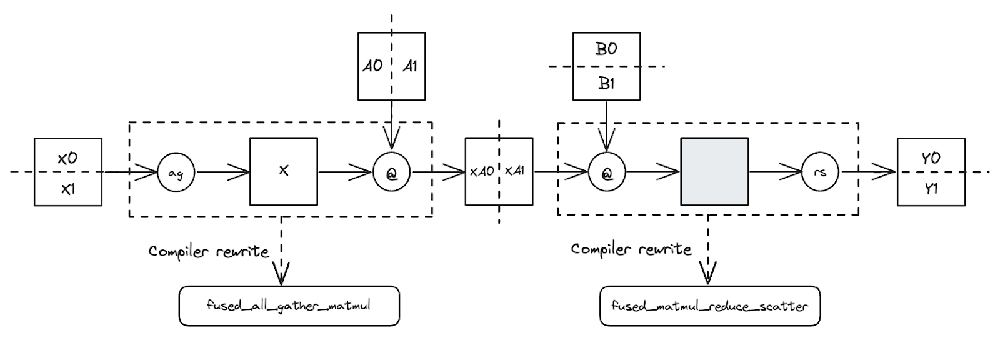

현재 `torch.compile`은 async-TP를 적용하는 데 추천하는 방법이다.

- Model의 TP pattern을 자동으로 detect하고 async-TP operator로 rewrite하므로 model은 original structure를 유지할 수 있다.
- Optimized async-TP implementation은 input이 specific layout을 갖기를 요구한다. 그렇지 않으면 추가 copy가 발생한다. `torch.compile`은 upstream operator가 가능한 한 required layout으로 output을 생성하도록 자동으로 보장한다.
- `torch.compile`은 all-gather가 여러 matrix multiplication과 overlap될 수 있는 경우도 detect하여 communication latency를 더 잘 숨길 수 있다.

이러한 것들은 eager mode에서도 수동 구현할 수 있지만, model code와 optimization logic 사이의 coupling이 더 강해질 수 있다.

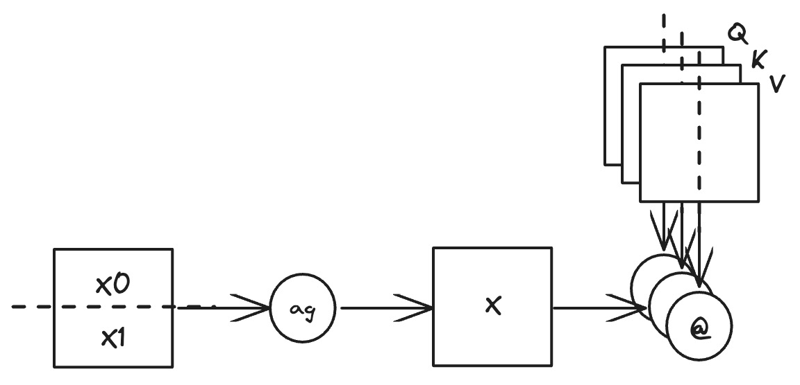

TP logic 작성에는 PyTorch Tensor Parallel APIs 사용을 추천한다. Tutorial은 여기(https://pytorch.org/tutorials/intermediate/TP_tutorial.html), TorchTitan의 example은 여기(https://github.com/pytorch/torchtitan/blob/1923ce4/torchtitan/parallelisms/parallelize_llama.py#L158-L183)에서 볼 수 있다. 또한 `torch.compile`은 functional collective operation과 `torch.mm`, `torch.matmul`, `torch._scaled_mm`을 사용해 수동 작성한 TP logic에도 async-TP를 적용할 수 있다. Example은 여기(https://github.com/pytorch/pytorch/blob/16b8146/test/distributed/tensor/parallel/test_micro_pipeline_tp.py#L206-L208)에 있다.

```python
from torch.distributed._symmetric_memory import enable_symm_mem_for_group

# Enable symmetric memory for the TP process group
enable_symm_mem_for_group(tp_group.group_name)

# Tell torch.compile to enable async-TP
torch._inductor.config._micro_pipeline_tp = True

# Apply torch.compile to the model
model = torch.compile(model)

# Or apply torch.compile to only the model region that contains TP logic
model.tp_submodule = torch.compile(model.tp_submodule)
```

### Eager mode에서 Async-TP 사용하기

Async-TP operator를 직접 호출해 eager mode에서도 async-TP를 적용할 수 있다.

```python
from torch.distributed._symmetric_memory import enable_symm_mem_for_group

# Enable symmetric memory for the TP process group
enable_symm_mem_for_group(tp_group.group_name)

# Invoke the async-TP operators directly
# all-gather -> matmul
ag_output, mm_outputs = torch.ops.symm_mem.fused_all_gather_matmul(
    x,
    [wq, wk, wv],
    gather_dim=1,
    group_name=tp_group.group_name,
)

# matmul -> reduce-scatter
output = torch.ops.symm_mem.fused_matmul_reduce_scatter(
    x,
    w,
    "avg",
    scatter_dim=0,
    group_name=tp_group.group_name,
)
```

## Limitations and Future Work

PyTorch async-TP support의 현재 limitation은 다음과 같다.

- **Large matrix multiplication problem에 최적화됨**: 현재 PyTorch의 async-TP는 large matrix multiplication operation에서 가장 잘 동작한다. 특히 decomposition 후 block size를 바꾸지 않아도 되는 operation에서 그렇다. 우리는 inference workload 같은 더 작은 problem size에서 performance를 높이기 위해 finer-grained pipeline solution을 탐색 중이다.
- **NVSwitch 필요**: 현재 PyTorch의 async-TP는 best performance를 위해 NVSwitch에 의존한다. Community feedback과 demand에 따라 NVLink ring topology support 확장을 고려하고 있다.
- **Intra-node configuration에만 한정**: PyTorch의 async-TP는 현재 intra-node setting에만 적용된다. 향후 cross-node environment로 support를 확장하는 방안을 탐색할 수 있다.

## Notes

- PyTorch Distributed는 이 기술을 설명하기 위해 "async-TP"라는 term을 선택했지만, 이것이 보편적으로 이렇게 불리지는 않을 수 있다.
- 현재 PyTorch의 async-TP implementation은 acceleration을 위해 모든 device pair 사이에 NVLink connection(예: NVSwitch를 통해)이 필요하다. 이는 앞으로 해결하려는 limitation 중 하나다.
- Copy engine은 GPU의 dedicated hardware unit이며, 서로 다른 memory location 사이의 data movement를 관리하고 GPU compute core(SM)와 독립적으로 동작한다.
- Copy engine을 통한 data transfer도 같은 memory bandwidth를 공유한다. 하지만 큰 competition을 만들 가능성은 낮다. (1) transfer rate가 NVLink bandwidth에 의해 제한되어 memory bandwidth competition을 피할 만큼 낮고, (2) overlap되는 matrix multiplication이 compute-intensive이기 때문이다.
- 우리는 matrix multiplication problem size가 충분히 커서 decomposition 후 tiling shape가 바뀌지 않는다고 가정한다. Decomposition overhead의 주요 source는 quantization efficiency다.
- Benchmark에 사용한 H100 GPU는 standard가 아니다. HBM2e를 사용하고 더 낮은 TDP로 제한되어 있다. 실제 peak TFLOPs는 SXM과 NVL 사이일 것이다. 정확한 값은 알 수 없다. 따라서 보고된 MFU는 SXM peak TFLOPs를 직접 사용했기 때문에 실제 MFU보다 낮다.

