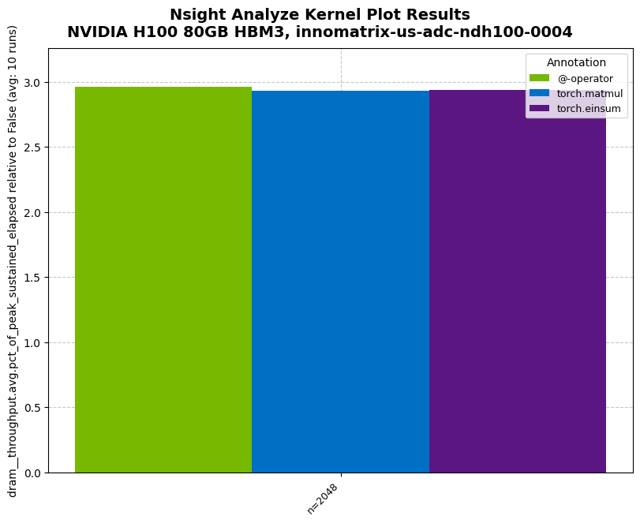
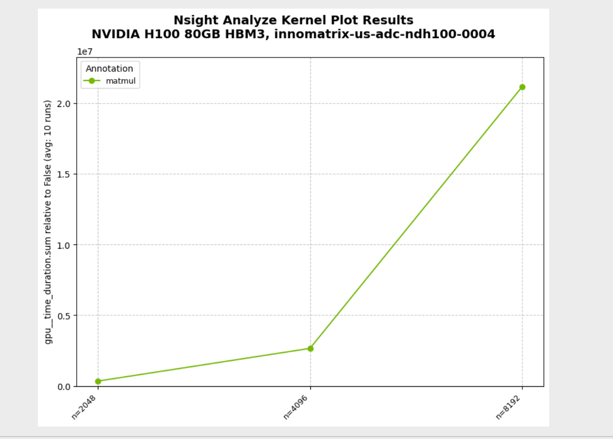
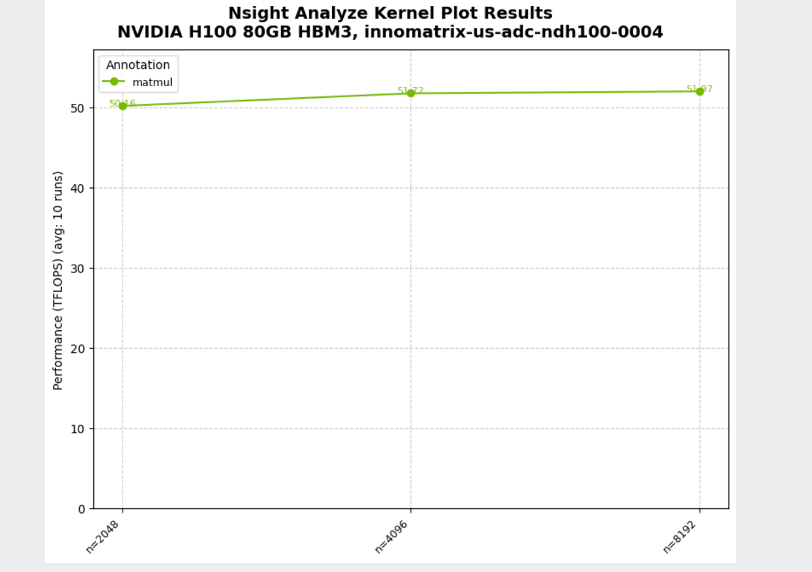
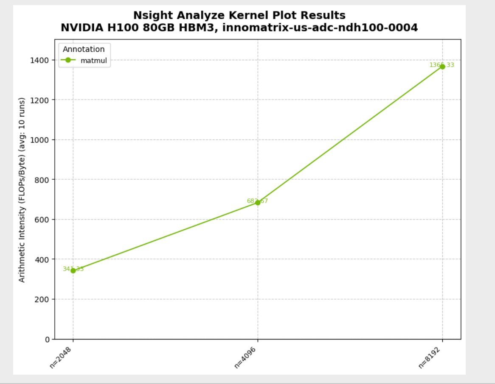
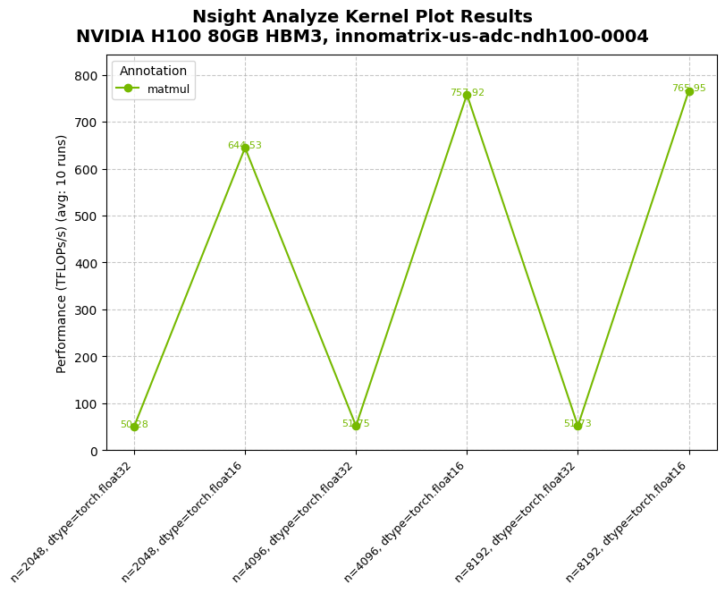
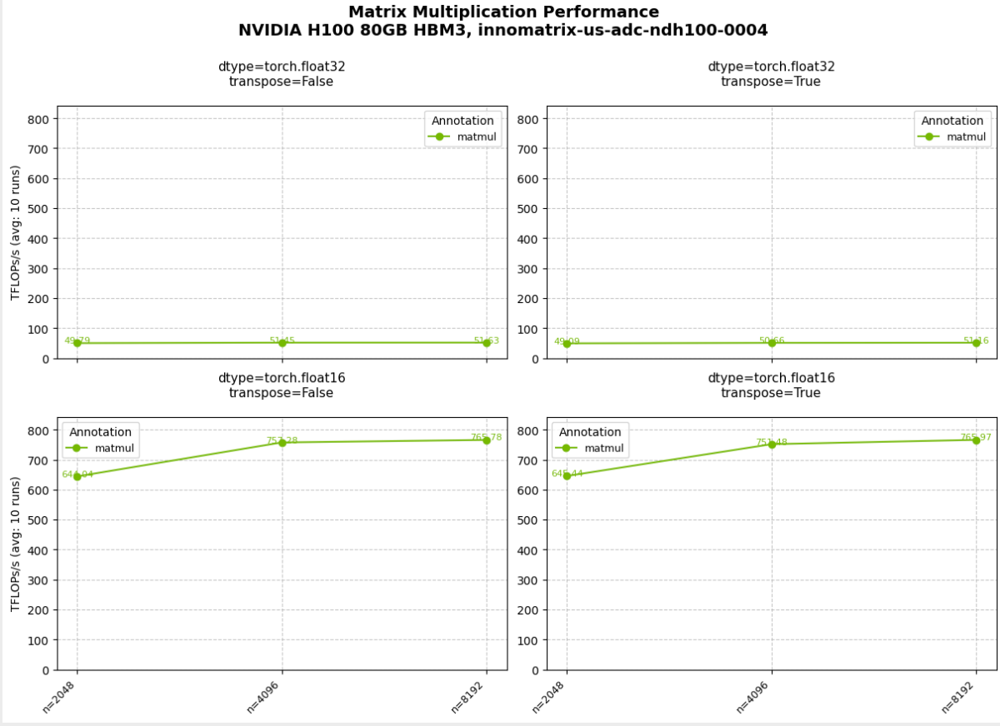
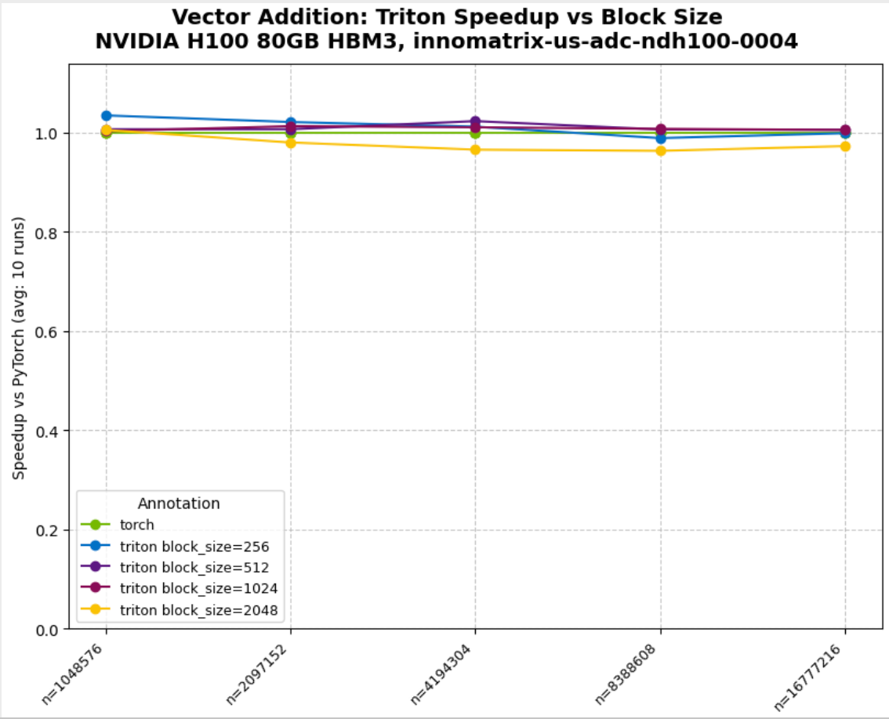
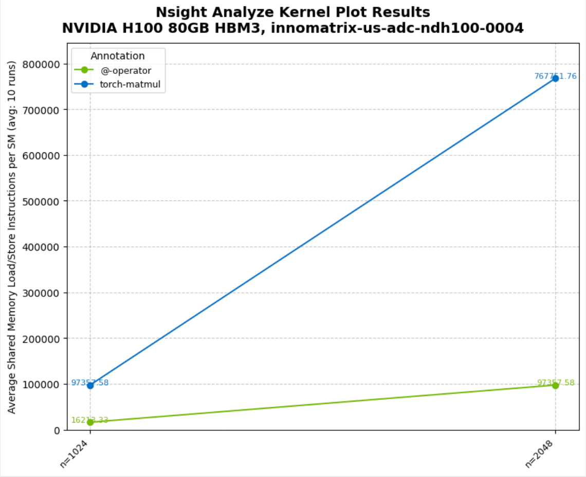
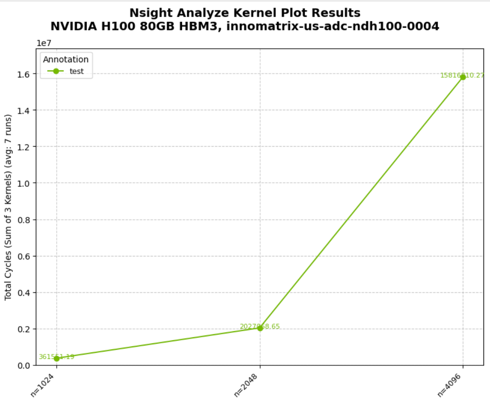
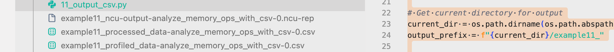

## 0x0. 서문

코드 저장소: https://github.com/NVIDIA/nsight-python

Nsight Python(`nsight-python`)은 NVIDIA Nsight Tools 기반의 Python profiling 인터페이스입니다. 현재는 주로 **Nsight Compute CLI(`ncu`)** 를 통해 CUDA kernel의 성능 지표를 수집하며, 다음 기능을 제공합니다.

- `configs` 기반의 파라미터 스캔(sweep)과 여러 번 반복 실행(`runs`)
- 수집 지표를 pandas DataFrame으로 추출(`ProfileResults.to_dataframe()`)
- 선택적 그래프 출력(`@nsight.analyze.plot`)과 CSV 출력(`output_csv`)

동작 방식은 "두 단계 실행" 모델입니다. 첫 번째 실행은 launcher 역할을 하고, 내부에서 `ncu`를 호출해 스크립트를 한 번 더 실행하여 profiling을 마친 뒤 `.ncu-rep` 출력 결과를 파싱합니다.

개인적으로는 이 도구가 지금 Agent와 더 쉽게 결합될 수 있다고 느낍니다. 예를 들어 중요한 Metrics를 수집하는 example 스크립트를 SKILLS로 정리해 Agent의 보조 도구로 만들면, Agent가 더 빠른 kernel 코드를 작성하는 데 도움이 될 수 있습니다. 원본 NCU 파일은 Agent가 직접 인식하기 어렵기 때문입니다.

## 0x1. 환경과 의존성

- Python 3.10+
- CUDA-capable GPU
- NVIDIA Nsight Compute CLI(`ncu`, `PATH`에 있어야 함)
- PyTorch
- Triton(선택 사항, `07_triton_minimal.py`에서만 필요)

Quick Start(공식 examples 기준):

```bash
cd examples
python 00_minimal.py
```


## 0x2. 자주 쓰는 API

### 2.1 `nsight.annotate(name, ignore_failures=False)`

용도: NVTX range를 표시해 `ncu` 보고서에서 profile할 영역을 찾는 데 사용합니다. context manager와 decorator 두 가지 형태를 모두 지원합니다.

제약:

- 같은 profiling run 안에서 annotation 이름은 고유해야 합니다.
- 중첩 annotation은 지원하지 않습니다.

### 2.2 `@nsight.analyze.kernel(...)`

용도: decorator가 붙은 함수를 profiling하고 `ProfileResults`를 반환합니다.

자주 쓰는 파라미터:

- `configs`: 설정 목록(sweep에 사용)
- `runs`: 각 설정의 반복 횟수
- `metrics`: `ncu` 지표 이름 목록, 기본값은 `gpu__time_duration.sum`
- `derive_metric`: 수집한 지표를 사용자 정의 지표로 변환(스칼라 또는 `dict`)
- `normalize_against`: 지정한 annotation 기준으로 정규화(현재값 / baseline)
- `ignore_kernel_list`: 특정 kernel 무시
- `combine_kernel_metrics`: 하나의 annotation 안에서 여러 kernel이 실행될 때의 병합 전략(이항 함수)
- `replay_mode`: `"kernel" | "range"`
- `cache_control`: `"all" | "none"`
- `clock_control`: `"base" | "none"`
- `thermal_mode`: `"auto" | "manual" | "off"`(`thermal_wait/thermal_cont/thermal_timeout` 설정 가능)
- `output_csv` / `output_prefix`: CSV 출력과 경로 prefix

### 2.3 `@nsight.analyze.plot(...)`

용도: `@nsight.analyze.kernel` 출력 결과를 시각화합니다.

자주 쓰는 파라미터:

- `filename`
- `metric`: 여러 metric이 있을 때(여러 `metrics` 또는 `derive_metric` 사용) 명시해야 합니다.
- `plot_type`: `"line" | "bar"`
- `row_panels` / `col_panels`: subplot 배치
- `variant_fields` / `variant_annotations`: 같은 annotation을 서로 다른 파라미터 값별로 여러 선으로 분리
- `plot_callback`: matplotlib 스타일 사용자 정의

제약: `@nsight.analyze.plot`은 한 번에 하나의 metric만 시각화할 수 있습니다.


## 0x3. Examples

examples는 `00_minimal.py`부터 복잡도가 점점 올라가는 순서로 구성되어 있으므로, 순서대로 읽고 실행하는 것을 권장합니다. H100에서 이 예제들을 간단히 실행해보고 일부 결과를 골라 붙였습니다.

### `00_minimal.py`: 최소 예제

- 기본 `@nsight.analyze.kernel` 사용법
- 단일 `with nsight.annotate(...)` 표시 범위
- `ProfileResults.to_dataframe()`으로 집계 결과 확인

```shell
 examples python3 00_minimal.py 
╔══════════════════════════════════════════════════════════════════════════════╗
║                          Profiling benchmark_matmul                          ║
║                        1 configurations, 1 runs each                         ║
╚══════════════════════════════════════════════════════════════════════════════╝
Config 1/1: ['1024']
Progress: [████████████████████████████████████████████████████████████████████████████████████████████████████] 100.00% | Estimated time remai
Progress: [████████████████████████████████████████████████████████████████████████████████████████████████████] 100.00% | Estimated time remaining: 00:00:00
[NSIGHT-PYTHON] Profiling completed successfully !
[NSIGHT-PYTHON] Refer to /tmp/nspy_wtlxvsfq/ncu-output-benchmark_matmul-0.ncu-rep for the NVIDIA Nsight Compute CLI report
[NSIGHT-PYTHON] Refer to /tmp/nspy_wtlxvsfq/ncu-output-benchmark_matmul-0.log for the NVIDIA Nsight Compute CLI logs
[NSIGHT-PYTHON] Loading profiled data
Extracting profiling data
Extracting matmul profiling data
[NSIGHT-PYTHON] Processing profiled data
  Annotation     n                  Metric AvgValue  NumRuns                    GPU
0     matmul  1024  gpu__time_duration.sum  61088.0        1  NVIDIA H100 80GB HBM3
Benchmark complete!
```


### `01_compare_throughput.py`: 서로 다른 구현 비교(처리량 지표 수집)

- 같은 함수 안의 여러 `annotate` 구간을 비교에 사용
- `metrics=["dram__throughput.avg.pct_of_peak_sustained_elapsed"]`로 DRAM 처리량 지표 수집
- `@nsight.annotate`를 함수 decorator로 사용하는 방식
- `print_data=True`로 그래프 데이터를 출력

```shell
examples python3 01_compare_throughput.py 
╔══════════════════════════════════════════════════════════════════════════════╗
║                    Profiling benchmark_matmul_throughput                     ║
║                        1 configurations, 10 runs each                        ║
╚══════════════════════════════════════════════════════════════════════════════╝
Config 1/1: ['2048']
Progress: [██████████------------------------------------------------------------------------------------------] 10.00% | Estimated time remain
Progress: [████████████████████████████████████████████████████████████████████████████████--------------------] 80.00% | Estimated time remain
Progress: [████████████████████████████████████████████████████████████████████████████████████████████████████] 100.00% | Estimated time remaining: 00:00:00
[NSIGHT-PYTHON] Profiling completed successfully !
[NSIGHT-PYTHON] Refer to /tmp/nspy_sj37qt83/ncu-output-benchmark_matmul_throughput-0.ncu-rep for the NVIDIA Nsight Compute CLI report
[NSIGHT-PYTHON] Refer to /tmp/nspy_sj37qt83/ncu-output-benchmark_matmul_throughput-0.log for the NVIDIA Nsight Compute CLI logs
[NSIGHT-PYTHON] Loading profiled data
Extracting profiling data
Extracting @-operator profiling data
Extracting torch.matmul profiling data
Extracting torch.einsum profiling data
[NSIGHT-PYTHON] Processing profiled data
     Annotation                                             Metric     n  AvgValue  ...  RelativeStdDevPct StableMeasurement Normalized   Geomean
0    @-operator  dram__throughput.avg.pct_of_peak_sustained_ela...  2048  2.960419  ...           2.300243             False      False  2.960419
1  torch.matmul  dram__throughput.avg.pct_of_peak_sustained_ela...  2048   2.93248  ...           0.394342              True      False  2.932480
2  torch.einsum  dram__throughput.avg.pct_of_peak_sustained_ela...  2048  2.937353  ...           0.665138              True      False  2.937353

[3 rows x 19 columns]
✓ Benchmark complete! Check '01_compare_throughput.png'

Tip: Run 'ncu --query-metrics' to see all available metrics!
```



### `02_parameter_sweep.py`: 파라미터 스캔(configs sweep)

- `configs=[(n1,), (n2,), ...]`로 서로 다른 입력 크기를 스캔
- decorator가 붙은 함수는 명시적으로 인자를 넘기지 않아도 되고, 인자는 `configs`에서 옵니다.

```shell
python3 02_parameter_sweep.py   
╔══════════════════════════════════════════════════════════════════════════════╗
║                       Profiling benchmark_matmul_sizes                       ║
║                        3 configurations, 10 runs each                        ║
╚══════════════════════════════════════════════════════════════════════════════╝
Config 1/3: ['2048']
Config 3/3: ['8192']
Progress: [████████████████████████████████████████████████████████████████████████████████--------------------] 80.00% | Estimated time remain
Progress: [████████████████████████████████████████████████████████████████████████████████████████████████████] 100.00% | Estimated time remaining: 00:00:00
[NSIGHT-PYTHON] Profiling completed successfully !
[NSIGHT-PYTHON] Refer to /tmp/nspy_9mf071wx/ncu-output-benchmark_matmul_sizes-0.ncu-rep for the NVIDIA Nsight Compute CLI report
[NSIGHT-PYTHON] Refer to /tmp/nspy_9mf071wx/ncu-output-benchmark_matmul_sizes-0.log for the NVIDIA Nsight Compute CLI logs
[NSIGHT-PYTHON] Loading profiled data
Extracting profiling data
Extracting matmul profiling data
[NSIGHT-PYTHON] Processing profiled data
  Annotation                  Metric     n    AvgValue  ...  RelativeStdDevPct StableMeasurement Normalized       Geomean
0     matmul  gpu__time_duration.sum  2048    341628.8  ...            0.12064              True      False  2.676955e+06
1     matmul  gpu__time_duration.sum  4096   2653696.0  ...           0.146789              True      False  2.676955e+06
2     matmul  gpu__time_duration.sum  8192  21160092.8  ...           0.038769              True      False  2.676955e+06

[3 rows x 19 columns]
✓ Benchmark complete! Check '02_parameter_sweep.png'
```



### `03_custom_metrics.py`: `derive_metric` 사용자 정의 지표(TFLOPS/산술 강도)

- `derive_metric`가 스칼라를 반환하는 방식과 `dict`를 반환하는 방식
- metric이 여러 개 있을 때는 `@nsight.analyze.plot(metric=...)`에 명시가 필요합니다.
  - 스칼라 반환: `metric`은 `derive_metric` 함수 이름
  - `dict` 반환: `metric`은 dictionary key

```shell
 python3 03_custom_metrics.py 
Running TFLOPs benchmark (scalar return pattern)...
Running TFLOPs benchmark (scalar return pattern)...
╔══════════════════════════════════════════════════════════════════════════════╗
║                          Profiling benchmark_tflops                          ║
║                        3 configurations, 10 runs each                        ║
╚══════════════════════════════════════════════════════════════════════════════╝
Config 1/3: ['2048']
Config 3/3: ['8192']
Progress: [███████████████████████████████████████████████████████████████████████████████████-----------------] 83.33% | Estimated time remain
Progress: [████████████████████████████████████████████████████████████████████████████████████████████████████] 100.00% | Estimated time remaining: 00:00:00
[NSIGHT-PYTHON] Profiling completed successfully !
[NSIGHT-PYTHON] Refer to /tmp/nspy_3dclsban/ncu-output-benchmark_tflops-0.ncu-rep for the NVIDIA Nsight Compute CLI report
[NSIGHT-PYTHON] Refer to /tmp/nspy_3dclsban/ncu-output-benchmark_tflops-0.log for the NVIDIA Nsight Compute CLI logs
[NSIGHT-PYTHON] Loading profiled data
Extracting profiling data
Extracting matmul profiling data
[NSIGHT-PYTHON] Processing profiled data
✓ TFLOPs benchmark complete! Check '03_custom_metrics_tflops.png'

Running combined benchmark (dictionary return pattern)...
Running TFLOPs benchmark (scalar return pattern)...
✓ TFLOPs benchmark complete! Check '03_custom_metrics_tflops.png'

Running combined benchmark (dictionary return pattern)...
╔══════════════════════════════════════════════════════════════════════════════╗
║             Profiling benchmark_tflops_and_arithmetic_intensity              ║
║                        3 configurations, 10 runs each                        ║
╚══════════════════════════════════════════════════════════════════════════════╝
Config 1/3: ['2048']
Config 3/3: ['8192']
Progress: [██████████████████████████████████████████████████████████████████████████████████████--------------] 86.67% | Estimated time remain
Progress: [████████████████████████████████████████████████████████████████████████████████████████████████████] 100.00% | Estimated time remaining: 00:00:00
[NSIGHT-PYTHON] Profiling completed successfully !
[NSIGHT-PYTHON] Refer to /tmp/nspy_2b0qn_d1/ncu-output-benchmark_tflops_and_arithmetic_intensity-0.ncu-rep for the NVIDIA Nsight Compute CLI report
[NSIGHT-PYTHON] Refer to /tmp/nspy_2b0qn_d1/ncu-output-benchmark_tflops_and_arithmetic_intensity-0.log for the NVIDIA Nsight Compute CLI logs
[NSIGHT-PYTHON] Loading profiled data
Extracting profiling data
Extracting matmul profiling data
[NSIGHT-PYTHON] Processing profiled data
  Annotation                  Metric     n     AvgValue  ...  RelativeStdDevPct StableMeasurement Normalized       Geomean
0     matmul  gpu__time_duration.sum  2048     341728.0  ...             0.1115              True      False  2.680363e+06
1     matmul  gpu__time_duration.sum  4096    2653417.6  ...           0.177246              True      False  2.680363e+06
2     matmul  gpu__time_duration.sum  8192   21237062.4  ...           0.287651              True      False  2.680363e+06
3     matmul                  TFLOPS  2048    50.273575  ...           0.111437              True      False  5.127645e+01
4     matmul          ArithIntensity  2048   341.333333  ...                0.0              True      False  6.826667e+02
5     matmul                  TFLOPS  4096    51.797101  ...           0.176597              True      False  5.127645e+01
6     matmul          ArithIntensity  4096   682.666667  ...                0.0              True      False  6.826667e+02
7     matmul                  TFLOPS  8192    51.773631  ...           0.287988              True      False  5.127645e+01
8     matmul          ArithIntensity  8192  1365.333333  ...                0.0              True      False  6.826667e+02

[9 rows x 19 columns]

✓ TFLOPs and Arithmetic Intensity benchmark complete! Check '03_custom_metrics_arith_intensity.png'
```





### `04_multi_parameter.py`: 다중 파라미터 스캔(`itertools.product`)

- size, dtype처럼 여러 파라미터를 동시에 스캔
- `derive_metric(time_ns, *conf)`는 `*conf`로 다중 파라미터 입력을 처리합니다.



### `05_subplots.py`: subplot grid(faceting)

- `row_panels` / `col_panels`로 서로 다른 파라미터를 subplot 차원에 매핑합니다.
- 다변수 비교를 시각적으로 정리하는 데 적합합니다.



### `06_plot_customization.py`: 그래프 커스터마이징

- `plot_type="bar"`와 기본 line plot 전환
- `plot_callback(fig)`로 더 세밀한 matplotlib 스타일 제어

### `07_triton_minimal.py`: Triton 통합과 variants

- Triton kernel profiling
- `normalize_against="torch"`: baseline 기준 정규화
- `derive_metric`로 speedup 계산(예제에서는 정규화 결과의 역수를 사용)
- `variant_fields` / `variant_annotations`: 파라미터(예: `block_size`)별로 곡선을 분리



### `08_multiple_metrics.py`: 여러 metrics를 한 번에 수집

- `metrics=[m1, m2, ...]`로 여러 지표를 동시에 수집
- 결과는 DataFrame의 `Metric` 열로 구분됩니다.
- 제약: `@nsight.analyze.plot`은 여러 metric을 한 번에 그릴 수 없습니다.

```shell
import torch
import nsight

sizes = [(2**i,) for i in range(11, 13)]


@nsight.analyze.kernel(
    configs=sizes,
    runs=5,
    # Collect both shared memory load and store SASS instructions
    metrics=[
        "smsp__sass_inst_executed_op_shared_ld.sum",
        "smsp__sass_inst_executed_op_shared_st.sum",
    ],
)
def analyze_shared_memory_ops(n: int) -> None:
    """Analyze both shared memory load and store SASS instructions
    for different kernels.

    Note: To evaluate multiple metrics, pass them as a sequence
    (list/tuple). All results are merged into one ProfileResults
    object, with the 'Metric' column indicating each specific metric.
    """

    a = torch.randn(n, n, device="cuda")
    b = torch.randn(n, n, device="cuda")
    c = torch.randn(2 * n, 2 * n, device="cuda")
    d = torch.randn(2 * n, 2 * n, device="cuda")

    with nsight.annotate("@-operator"):
        _ = a @ b

    with nsight.annotate("torch.matmul"):
        _ = torch.matmul(c, d)


def main() -> None:
    # Run analysis with multiple metrics
    results = analyze_shared_memory_ops()

    df = results.to_dataframe()
    print(df)

    unique_metrics = df["Metric"].unique()
    print(f"\n✓ Collected {len(unique_metrics)} metrics:")
    for metric in unique_metrics:
        print(f"  - {metric}")

    print("\n✓ Sample data:")
    print(df[["Annotation", "n", "Metric", "AvgValue"]].to_string(index=False))

    print("\n" + "=" * 60)
    print("IMPORTANT: @plot decorator limitation")
    print("=" * 60)
    print("When multiple metrics are collected:")
    print("  ✓ All metrics are collected in a single ProfileResults object")
    print("  ✓ DataFrame has 'Metric' column to distinguish them")
    print("  ✗ @nsight.analyze.plot decorator will RAISE AN ERROR")
    print("    Why? @plot can only visualize one metric at a time.")
    print("    Tip: Use separate @kernel functions for each metric or use")
    print("         'derive_metric' to compute custom values.")


if __name__ == "__main__":
    main()
```

```shell
[NSIGHT-PYTHON] Processing profiled data
     Annotation                                     Metric     n     AvgValue  ...  RelativeStdDevPct StableMeasurement Normalized       Geomean
0    @-operator  smsp__sass_inst_executed_op_shared_ld.sum  2048   12720128.0  ...                0.0              True      False  3.588080e+07
1    @-operator  smsp__sass_inst_executed_op_shared_st.sum  2048     131072.0  ...                0.0              True      False  1.310720e+05
2    @-operator  smsp__sass_inst_executed_op_shared_ld.sum  4096  101212160.0  ...                0.0              True      False  3.588080e+07
3    @-operator  smsp__sass_inst_executed_op_shared_st.sum  4096     131072.0  ...                0.0              True      False  1.310720e+05
4  torch.matmul  smsp__sass_inst_executed_op_shared_ld.sum  2048  101212160.0  ...                0.0              True      False  2.858828e+08
5  torch.matmul  smsp__sass_inst_executed_op_shared_st.sum  2048     131072.0  ...                0.0              True      False  2.621440e+05
6  torch.matmul  smsp__sass_inst_executed_op_shared_ld.sum  4096  807501824.0  ...                0.0              True      False  2.858828e+08
7  torch.matmul  smsp__sass_inst_executed_op_shared_st.sum  4096     524288.0  ...                0.0              True      False  2.621440e+05

[8 rows x 19 columns]

✓ Collected 2 metrics:
  - smsp__sass_inst_executed_op_shared_ld.sum
  - smsp__sass_inst_executed_op_shared_st.sum

✓ Sample data:
  Annotation    n                                    Metric     AvgValue
  @-operator 2048 smsp__sass_inst_executed_op_shared_ld.sum   12720128.0
  @-operator 2048 smsp__sass_inst_executed_op_shared_st.sum     131072.0
  @-operator 4096 smsp__sass_inst_executed_op_shared_ld.sum  101212160.0
  @-operator 4096 smsp__sass_inst_executed_op_shared_st.sum     131072.0
torch.matmul 2048 smsp__sass_inst_executed_op_shared_ld.sum  101212160.0
torch.matmul 2048 smsp__sass_inst_executed_op_shared_st.sum     131072.0
torch.matmul 4096 smsp__sass_inst_executed_op_shared_ld.sum  807501824.0
torch.matmul 4096 smsp__sass_inst_executed_op_shared_st.sum     524288.0
```

### `09_advanced_metric_custom.py`: 여러 metrics 기반의 파생 지표 계산

- `derive_metric`의 인자 순서: 먼저 `metrics`에 대응하는 값이 오고, 그 뒤에 decorator가 붙은 함수의 인자가 옵니다.
- `dict`를 반환해 여러 파생 지표를 출력합니다(예제에서는 그중 하나를 선택해 그림).




### `10_combine_kernel_metrics.py`: 단일 annotation 안의 여러 kernel 병합

- 전형적인 시나리오: 같은 annotation 구간 안에서 여러 번 kernel을 실행
- `combine_kernel_metrics=lambda x, y: x + y`로 여러 kernel의 지표를 단일 값으로 합산



### `11_output_csv.py`: CSV 출력

- `output_csv=True`로 raw와 processed 두 종류의 CSV를 생성
- `output_prefix`로 출력 경로와 파일명 prefix 제어

```python
# 이 예제의 목표:
# - @nsight.analyze.kernel(...)로 파라미터 sweep + 지표 수집 수행
# - output_csv=True를 켜서 수집 결과(원본/집계 후)를 CSV에 기록하고, 오프라인 분석에 활용
import os

import pandas as pd
import torch

import nsight

# Get current directory for output
# 스크립트가 있는 디렉터리를 출력 디렉터리로 사용해 현재 작업 디렉터리(cwd)의 영향을 피합니다.
current_dir = os.path.dirname(os.path.abspath(__file__))
# output_prefix는 출력 파일의 "경로 + 파일명 prefix"가 됩니다.
# 예를 들어 여기서 생성되는 파일명은 보통 example11_로 시작하고 current_dir 아래에 저장됩니다.
output_prefix = f"{current_dir}/example11_"


# Matrix sizes to benchmark
# configs는 sequence여야 합니다. 각 원소가 한 번의 설정으로 decorator가 붙은 함수에 전달됩니다.
# 여기서 각 config는 (n,) 형태의 1-원소 tuple이며 analyze_memory_ops_with_csv(n)에 대응합니다.
sizes = [(2**i,) for i in range(10, 13)]


@nsight.analyze.kernel(
    configs=sizes,
    # 각 config를 profile할 반복 횟수입니다. nsight-python은 runs번의 결과를 통계적으로 집계합니다(Avg/Std 등).
    runs=3,
    output_prefix=output_prefix,
    # output_csv=True: ProfileResults를 반환하는 것 외에도 데이터를 CSV로 저장합니다(보관/재현/그래프 작성에 편리).
    output_csv=True,  # Enable CSV file generation
    metrics=[
        # metrics: Nsight Compute가 수집하는 지표 목록입니다.
        # 목록 순서가 중요합니다.
        # - 결과 DataFrame에서는 'Metric' 열로 서로 다른 지표를 구분합니다.
        # - derive_metric을 함께 사용할 경우 위치 인자가 metrics 순서에 맞춰 전달됩니다.
        "smsp__sass_inst_executed_op_shared_ld.sum",
        "smsp__sass_inst_executed_op_shared_st.sum",
    ],
)
def analyze_memory_ops_with_csv(n: int) -> None:
    """
    Analyze memory operations with CSV output enabled.

    When output_csv=True, two CSV files are generated:
    1. {prefix}processed_data-<name_of_decorated_function>-<run_id>.csv - Raw profiled data
    2. {prefix}profiled_data-<name_of_decorated_function>-<run_id>.csv - Processed/aggregated data

    Args:
        n: Matrix size (n x n)
    """
    # GPU 위에 랜덤 행렬을 생성해 matmul 관련 kernel(보통 cuBLAS/GEMM 경로)을 트리거합니다.
    a = torch.randn(n, n, device="cuda")
    b = torch.randn(n, n, device="cuda")

    # nsight.annotate는 NVTX range를 삽입합니다. 최종 결과에서는 'Annotation' 열에 나타납니다.
    with nsight.annotate("matmul-operator"):
        _ = a @ b

    with nsight.annotate("torch-matmul"):
        _ = torch.matmul(a, b)


def print_full_dataframe(
    df: pd.DataFrame, max_rows: int = 20, max_col_width: int = 100
) -> None:
    """
    Print DataFrame without truncation.

    Args:
        df: DataFrame to print
        max_rows: Maximum number of rows to display (None for all rows)
        max_col_width: Maximum column width (None for no limit)
    """
    # Save current display options
    # pandas는 기본적으로 행/열/열 너비를 생략할 수 있으므로, 여기서 display 옵션을 임시로 바꿔 더 온전하게 출력합니다.
    original_options = {
        "display.max_rows": pd.get_option("display.max_rows"),
        "display.max_columns": pd.get_option("display.max_columns"),
        "display.max_colwidth": pd.get_option("display.max_colwidth"),
        "display.width": pd.get_option("display.width"),
        "display.expand_frame_repr": pd.get_option("display.expand_frame_repr"),
    }

    try:
        # Set display options for full output
        pd.set_option("display.max_rows", max_rows if max_rows else None)
        pd.set_option("display.max_columns", None)
        pd.set_option("display.max_colwidth", max_col_width if max_col_width else None)
        pd.set_option("display.width", None)
        pd.set_option("display.expand_frame_repr", False)

        print(df.to_string())

    finally:
        # Restore original options
        # 출력이 끝난 뒤 전역 설정을 복원해 다른 곳의 DataFrame 표시 방식에 영향을 주지 않게 합니다.
        for option, value in original_options.items():
            pd.set_option(option, value)


def read_and_display_csv_files() -> None:
    """Read and display the generated CSV files."""

    # Find CSV files
    # 출력 디렉터리 아래의 example11_*.csv를 스캔합니다. 이 파일들은 output_csv=True가 자동 생성합니다.
    csv_files = []
    for file in os.listdir(current_dir):
        if file.startswith("example11_") and file.endswith(".csv"):
            csv_files.append(os.path.join(current_dir, file))

    for file_path in sorted(csv_files):
        file_name = os.path.basename(file_path)
        print(f"\nFile: {file_name}")
        print("-" * (len(file_name) + 6))

        # Read CSV file
        try:
            df = pd.read_csv(file_path)

            # Display only columns related to metrics/values
            # CSV 필드는 보통 많으므로, 빠르게 훑어보기 쉽도록 Annotation / Metric / Value가 들어간 열만 골라 봅니다.
            value_cols = [
                col
                for col in df.columns
                if "Value" in col or "Metric" in col or "Annotation" in col
            ]
            # print(df[value_cols].head())
            # Show full DataFrame without truncation
            print_full_dataframe(df[value_cols])
        except Exception as e:
            print(f"Error reading {file_name}: {e}")


def main() -> None:
    # Clean up any previous output files
    # 이전에 생성된 example11_ 출력 파일이 섞이지 않도록 먼저 삭제합니다(부작용이 있는 작업).
    for old_file in os.listdir(current_dir):
        if old_file.startswith("example11_") and old_file.endswith(
            (".csv", ".ncu-rep", ".log")
        ):
            os.remove(os.path.join(current_dir, old_file))

    # Run the analysis with CSV output
    # @kernel decorator가 붙은 함수를 호출하면 configs * runs번 profiling이 실행되고 ProfileResults가 반환됩니다.
    result = analyze_memory_ops_with_csv()
    print(result.to_dataframe())

    # Read and display generated CSV files
    read_and_display_csv_files()


if __name__ == "__main__":
    main()
```




## 0x4. Examples의 제약

- 단일 annotation은 기본적으로 kernel 1개를 기대합니다. 여러 kernel이 있을 때는 다음을 사용할 수 있습니다.
  - `replay_mode="range"`
  - `combine_kernel_metrics`
  - `ignore_kernel_list`
- 다중 metrics 시나리오에서는 DataFrame이 여러 지표를 동시에 담을 수 있지만, `@nsight.analyze.plot`은 한 번에 하나의 metric만 그릴 수 있습니다.
