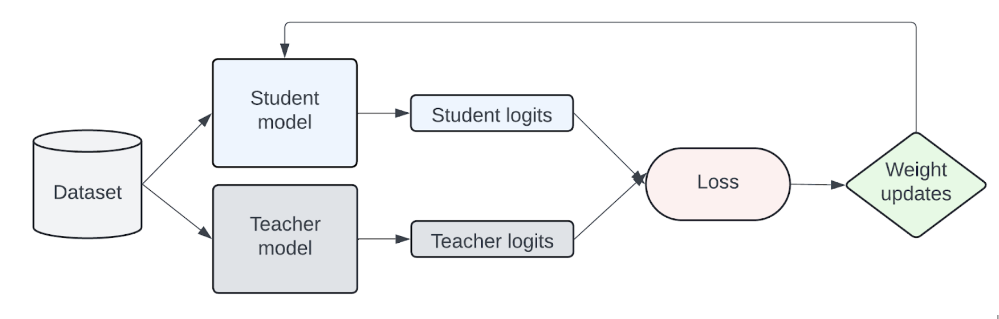
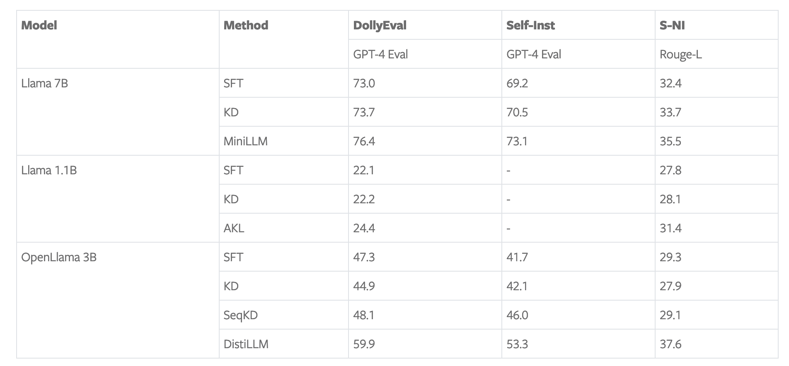
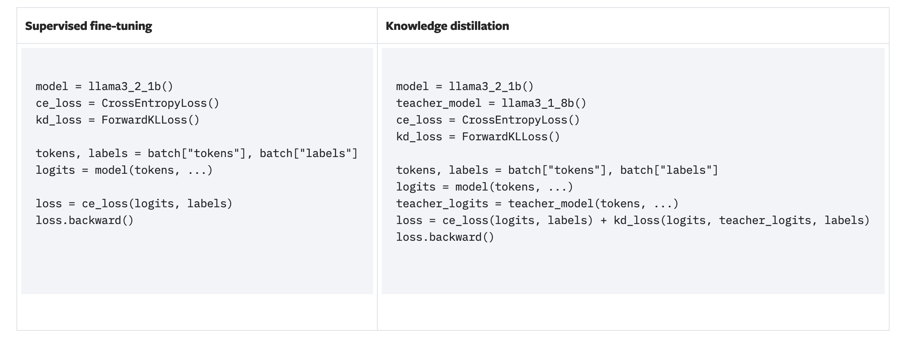
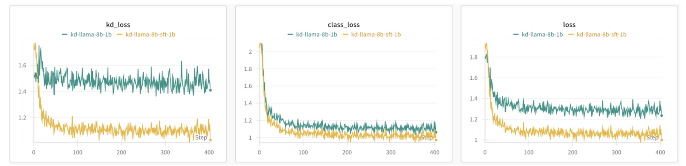
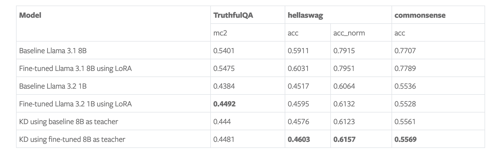
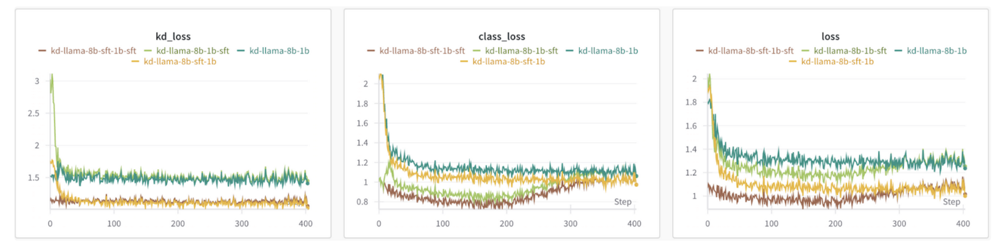
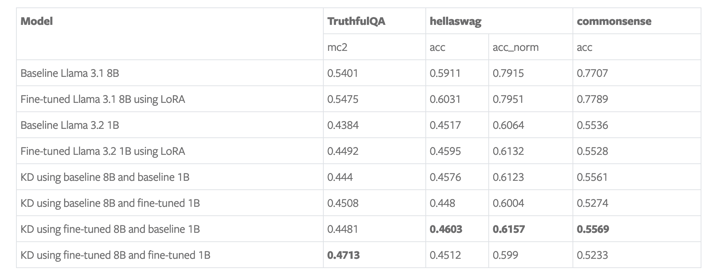
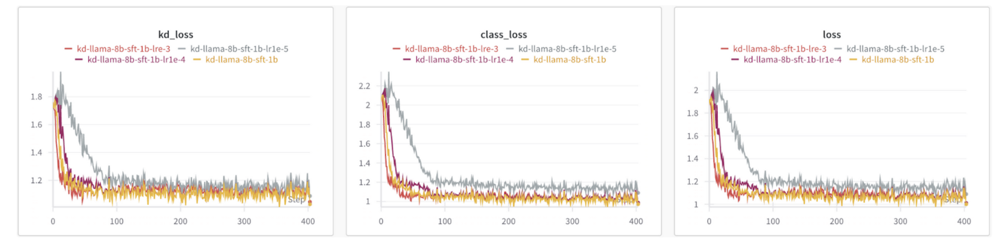
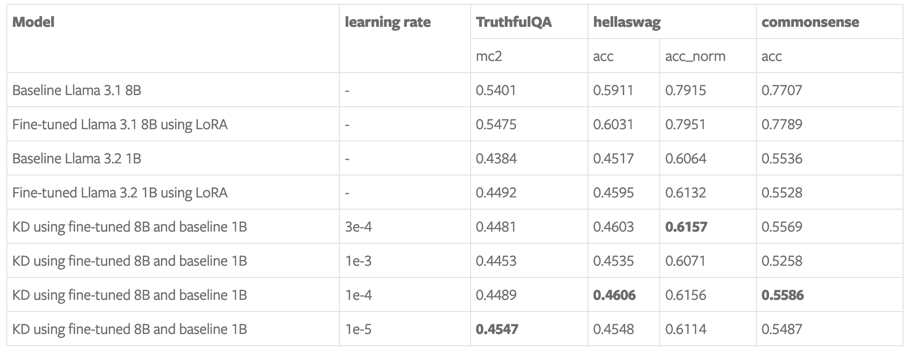
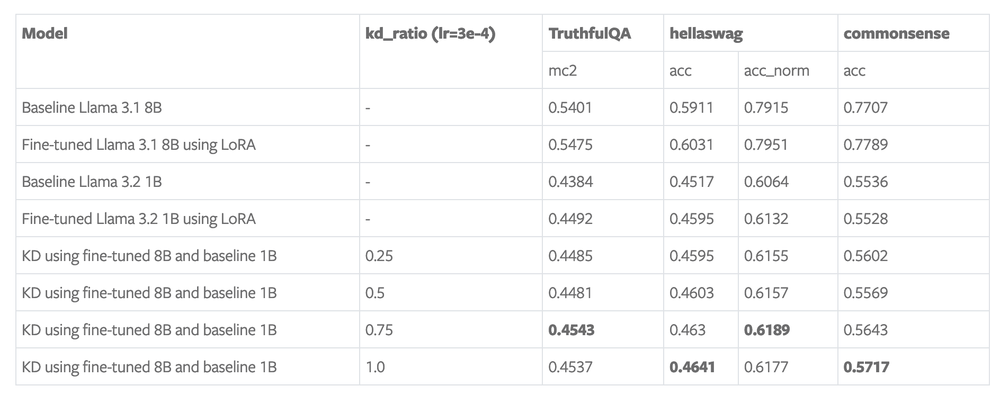

> 블로그 출처: https://pytorch.org/blog/llama-into-torchtune/ by Linda Wang, Evan Smothers, Kartikay Khandelwal. 여기서는 독자가 LLM에 지식 증류를 적용하는 방법을 이해할 수 있도록 번역했습니다. 요약하면, 이 블로그는 torchtune을 사용해 Llama 3.1 8B 모델을 1B 모델로 증류하고, 지식 증류 기법으로 작은 모델의 instruction following task 성능을 높이는 방법을 소개합니다. 글에서는 지식 증류의 작동 원리를 자세히 설명하고, 모델 다운로드, teacher model fine-tuning, distillation step을 포함해 torchtune에서 구현하는 과정을 보여줍니다. 또한 블로그는 4개의 ablation experiment를 통해 서로 다른 configuration과 hyperparameter가 결과에 미치는 영향을 살펴보고, 마지막으로 앞으로 이어서 할 수 있는 일을 이야기합니다.

# torchtune으로 LLaMa-3.1 8B를 1B로 증류하기

이 블로그에서는 torchtune의 knowledge distillation recipe를 사용해 Llama 3.1 8B 모델을 Llama 3.2 1B로 증류하는 case study를 보여줍니다. training 이후 knowledge distillation(KD)을 사용해 instruction following task 성능을 높이는 방법을 시연하고, 사용자가 이 recipe를 어떻게 활용할 수 있는지 보여줍니다.

## 지식 증류란 무엇인가?

지식 증류(https://arxiv.org/pdf/1503.02531)는 널리 쓰이는 compression technique으로, 더 큰 teacher model의 지식을 더 작은 student model로 옮깁니다. 큰 모델은 더 많은 parameter와 knowledge capacity를 갖지만, 이 큰 capacity는 deployment 시 더 많은 compute resource도 필요로 합니다. 지식 증류는 큰 모델의 지식을 작은 모델 안으로 압축하는 데 사용할 수 있습니다. 기본 아이디어는 큰 모델의 output을 학습함으로써 작은 모델의 성능을 높일 수 있다는 것입니다.

## 지식 증류는 어떻게 동작하는가?

지식은 transfer set에서 training하는 방식으로 teacher model에서 student model로 전달됩니다. 이 과정에서 student model은 teacher model의 token-level probability distribution을 모방하도록 학습됩니다. 여기서의 가정은 teacher model의 distribution이 transfer dataset과 유사하다는 것입니다. 아래 그림은 지식 증류가 동작하는 방식을 단순화해 나타낸 것입니다.



LLM의 지식 증류는 활발한 연구 분야이기 때문에, 현재 MiniLLM(https://arxiv.org/pdf/2306.08543), DistiLLM(https://arxiv.org/pdf/2402.03898), AKL(https://arxiv.org/pdf/2404.02657), Generalized KD(https://arxiv.org/pdf/2306.13649)처럼 서로 다른 loss function approach를 연구하는 논문이 많습니다. 이 case study에서는 baseline으로 standard cross entropy(CE) loss와 forward Kullback-Leibler(KL) divergence loss(https://en.wikipedia.org/wiki/Kullback%E2%80%93Leibler_divergence)에 집중합니다. forward KL divergence의 목표는 student model distribution을 teacher model의 전체 distribution과 맞추도록 강제해 차이를 최소화하는 것입니다.

## 지식 증류는 왜 유용한가?

지식 증류의 아이디어는, from-scratch training이나 supervised fine-tuning과 비교했을 때, 작은 모델이 teacher model의 output을 추가 signal로 사용해 더 나은 성능을 얻을 수 있다는 것입니다. 예를 들어 Llama 3.2 lightweight 1B 및 3B text model(https://ai.meta.com/blog/llama-3-2-connect-2024-vision-edge-mobile-devices/)은 pruning 후 Llama 3.1 8B와 70B의 logits를 통합해 성능을 복구했습니다. 또한 instruction following task fine-tuning에서 LLM distillation 연구는 knowledge distillation 방법이 supervised fine-tuning(SFT)만 사용하는 것보다 나을 수 있음을 보여줍니다.



아래는 지식 증류와 supervised fine-tuning의 차이를 보여주는 간단한 예시입니다.



## torchtune의 지식 증류 recipe

torchtune을 사용하면 Llama3 및 다른 LLM model family에 지식 증류를 쉽게 적용할 수 있습니다. 이는 torchtune의 knowledge distillation recipe(https://github.com/pytorch/torchtune/blob/4234b78b914af23384ce0348f564e2119d107a96/recipes/knowledge_distillation_single_device.py)를 사용해 구현됩니다. 이 recipe의 목표는 Llama3.1-8B에서 지식을 증류해 Alpaca instruction following dataset에서 Llama3.2-1B를 fine-tuning하는 것입니다. 이 recipe는 post-training distillation에 집중하며, teacher와 student model이 모두 이미 pre-trained되어 있다고 가정합니다.

먼저 model weight를 다운로드해야 합니다. 다른 torchtune fine-tuning configuration과 일관성을 유지하기 위해 Llama3.1-8B의 instruction-tuned model을 teacher model로 사용하고, Llama3.2-1B를 student model로 사용합니다.

```shell
tune download meta-llama/Meta-Llama-3.1-8B-Instruct --output-dir /tmp/Meta-Llama-3.1-8B-Instruct --ignore-patterns "original/consolidated.00.pth" --hf_token <HF_TOKEN>

tune download meta-llama/Llama-3.2-1B-Instruct --output-dir /tmp/Llama-3.2-1B-Instruct --ignore-patterns "original/consolidated.00.pth" --hf_token <HF_TOKEN>
```

teacher model의 distribution이 Alpaca dataset과 유사하도록 만들기 위해 LoRA로 teacher model을 fine-tuning합니다. 다음 절에서 보여주는 experiment에 따르면, teacher model이 target dataset에서 이미 fine-tuning되어 있을 때 지식 증류 효과가 더 좋았습니다.

```shell
tune run lora_finetune_single_device --config llama3_1/8B_lora_single_device
```

마지막으로 다음 command를 실행해 single GPU에서 fine-tuned 8B model을 1B model로 증류할 수 있습니다. 이 case study에서는 A100 80GB GPU 하나를 사용했습니다. 여러 device에서 실행하기 위한 distributed recipe(https://github.com/pytorch/torchtune/blob/09c2619f713e771b4159f7b83bac8971c7053bd3/recipes/knowledge_distillation_distributed.py)도 있습니다.

```shell
tune run knowledge_distillation_single_device --config llama3_2/knowledge_distillation_single_device
```

## Ablation study

이 절에서는 configuration과 hyperparameter를 바꾸면 성능에 어떤 영향을 주는지 보여줍니다. 기본적으로 우리의 configuration은 LoRA fine-tuned 8B teacher model, 다운로드한 1B student model, learning rate 3e-4, KD loss ratio 0.5를 사용합니다. 이 case study에서는 alpaca_cleaned_dataset(https://pytorch.org/torchtune/main/generated/torchtune.datasets.alpaca_cleaned_dataset.html#torchtune.datasets.alpaca_cleaned_dataset)에서 fine-tuning했고, EleutherAI LM evaluation harness(https://github.com/EleutherAI/lm-evaluation-harness/tree/main)를 통해 truthfulqa_mc2, hellaswag, commonsense_qa task에서 model을 평가했습니다. 다음 요소들의 영향을 살펴보겠습니다.

### fine-tuned teacher model 사용

configuration의 default setting은 fine-tuned teacher model을 사용합니다. 이제 teacher model을 먼저 fine-tuning하지 않았을 때의 효과를 살펴보겠습니다.

loss 관점에서 보면 baseline 8B를 teacher model로 사용할 때 fine-tuned teacher model을 사용할 때보다 더 높은 loss가 발생합니다. KD loss도 비교적 일정하게 유지되는데, 이는 teacher model이 transfer dataset과 같은 distribution을 가져야 함을 시사합니다.



benchmark에서는 1B model의 supervised fine-tuning이 baseline 1B model보다 더 좋은 accuracy를 얻는 것을 볼 수 있습니다. fine-tuned 8B teacher model을 사용하면 truthfulqa에서는 비슷한 결과를 보였고, hellaswag와 commonsense에서는 개선이 있었습니다. baseline 8B를 teacher model로 사용할 때도 모든 metric이 향상되었지만, 다른 configuration보다는 낮았습니다.



### fine-tuned student model 사용

이 experiment에서는 student model이 이미 fine-tuned된 경우 KD의 효과를 연구했습니다. baseline 및 fine-tuned 8B와 1B model의 서로 다른 조합을 사용한 효과를 분석했습니다.

loss chart에 따르면, student model이 fine-tuned되었는지와 무관하게 fine-tuned teacher model을 사용하면 더 낮은 loss가 발생합니다. 흥미롭게도 fine-tuned student model을 사용할 때 classification loss가 증가하기 시작했습니다.



fine-tuned student model을 사용하면 truthfulqa accuracy를 더 높일 수 있지만, hellaswag와 commonsense의 accuracy는 떨어졌습니다. fine-tuned teacher model과 baseline student model을 사용한 경우 hellaswag와 commonsense dataset에서 가장 좋은 결과를 얻었습니다. 이러한 발견을 바탕으로 보면, 최적 configuration은 최적화하려는 evaluation dataset과 metric에 따라 달라집니다.



### Hyperparameter tuning: learning rate

기본적으로 recipe는 learning rate 3e-4를 사용합니다. 이 experiment에서는 learning rate를 최고 1e-3에서 최저 1e-5까지 조정했습니다.

loss chart에 따르면 1e-5가 더 높은 KD loss와 classification loss를 유발하는 것을 제외하면 모든 learning rate가 유사한 loss를 만들었습니다.



benchmark에 따르면 최적 learning rate는 최적화하려는 evaluation metric과 task에 따라 달라집니다.



### Hyperparameter tuning: KD ratio

기본적으로 KD ratio는 0.5로 설정되며, classification loss와 KD loss를 균등하게 weighting합니다. 이 experiment에서는 서로 다른 KD ratio의 효과를 연구했습니다. 여기서 0은 classification loss만 사용한다는 뜻이고, 1은 KD loss만 사용한다는 뜻입니다.

전반적으로 benchmark 결과는 이러한 task와 metric에 대해 더 높은 KD ratio가 약간 더 좋게 동작함을 보여줍니다.



## 앞으로의 방향

이 글에서는 forward KL divergence loss를 사용해 torchtune으로 Llama 3.1 8B와 Llama 3.2 1B의 logits를 distillation하는 연구를 소개했습니다. 성능을 더 높이고 distillation method에 더 큰 유연성을 제공하기 위해 앞으로 탐색할 수 있는 방향은 많습니다.

- KD loss function 확장. KD recipe는 forward KL divergence loss를 사용합니다. 그러나 위에서 말했듯 student distribution을 teacher 전체 distribution에 맞추는 것이 항상 효과적인 것은 아닐 수 있습니다. MiniLLM(https://arxiv.org/pdf/2306.08543), DistiLLM(https://arxiv.org/pdf/2402.03898), Generalized KD(https://arxiv.org/pdf/2306.13649) 같은 여러 논문은 이 한계를 해결하기 위한 새로운 KD loss와 strategy를 도입했고, standard cross entropy 및 forward KL divergence loss보다 우수함을 보였습니다. 예를 들어 MiniLLM은 reverse KL divergence를 사용해 student가 teacher의 low-probability region을 과대평가하지 않도록 합니다. DistiLLM은 skewed KL loss와 adaptive training strategy를 도입합니다.

- cross-tokenizer distillation 활성화. 현재 recipe는 teacher와 student model이 같은 tokenizer를 사용해야 하며, 이는 서로 다른 LLM family 간 distillation 능력을 제한합니다. Universal Logit Distillation(https://arxiv.org/pdf/2402.12030) 같은 cross-tokenizer method 관련 연구가 이미 일부 있으며, 탐색할 가치가 있습니다.

- distillation을 multimodal LLM과 encoder model로 확장. KD recipe의 자연스러운 확장은 multimodal LLM으로 확장하는 것입니다. 더 효율적인 LLM을 deployment해야 하는 것과 마찬가지로, 더 작고 효율적인 multimodal LLM도 deployment할 필요가 있습니다. 또한 LLM을 encoder model로 사용하는 일부 작업도 이미 있습니다. 예를 들어 LLM2Vec(https://arxiv.org/pdf/2404.05961)이 있습니다. LLM encoder에서 더 작은 encoder model로 증류하는 것도 탐색할 만한 유망한 방향일 수 있습니다.
