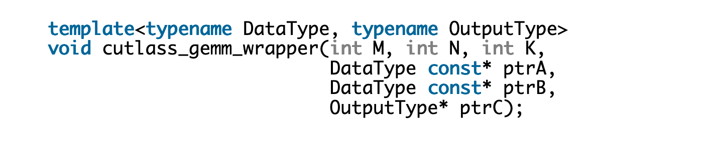

> 블로그 출처: https://research.colfax-intl.com/tutorial-python-binding-for-cuda-libraries-in-pytorch/ , 여기서는 번역하며 학습해 봅니다.

# 튜토리얼: PyTorch에서 CUDA 라이브러리용 Python interface binding하기

PyTorch는 오늘날 가장 널리 쓰이는 AI framework 중 하나입니다. Meta(이전 Facebook)가 개발해 2017년에 open source로 공개했으며, 간결하고 친근한 "Pythonic" interface를 갖고 있습니다. 이런 사용 편의성은 연구와 개발 영역에 특히 잘 맞습니다. 연구자들은 새로운 AI workload를 여러 번 반복해 실험해야 할 수 있기 때문입니다. 하지만 순수 Python 개발에도 단점은 있습니다. 대표적인 단점 중 하나가 performance 문제입니다. Python은 보통 C++ 같은 언어보다 실행 속도가 느리고, 특히 Python 코드가 GPU hardware acceleration을 전혀 활용하지 않거나 비교적 단순한 방식으로만 가속할 때 더 그렇습니다(예: 특정 GPU architecture의 특수 기능에 맞춰 최적화하지 않은 경우).

PyTorch가 NVIDIA® GPU에 대해 최적화한 코드를 충분히 활용하는 가장 간단한 방법 중 하나는, PyTorch가 optimized GPU acceleration library를 호출하게 하는 것입니다. PyTorch는 이미 많은 일반 AI workload에 대해 이런 작업을 해두었지만, 모든 workload가 통합된 것은 아닙니다. 어떤 workload에는 PyTorch가 기본으로 사용하는 library보다 더 나은 성능을 내는 CUDA® C++ library가 있을 수 있습니다.

또한 새 CUDA library를 만드는 개발자는 이를 PyTorch로 이식해 library 접근성을 높이고 싶을 수 있습니다. PyCUDA 같은 library로 Python에서 CUDA를 호출할 수도 있지만, C++는 여전히 CUDA 개발의 주요 언어입니다. 따라서 CUDA 개발자는 자신의 C++ 함수를 PyTorch와 함께 쓸 수 있는 Python call로 binding해야 할 수 있습니다.

PyTorch website에는 이미 C++ extension을 작성하는 과정을 단계별로 소개하는 매우 유용한 guide(https://pytorch.org/tutorials/advanced/cpp_extension.html)가 있습니다. 이 글에서는 CUDA 및 CUTLASS 같은 CUDA library를 사용할 때 발견한 보충 정보를 소개합니다. 이를 설명하기 위해 NVIDIA의 CUTLASS library로 general matrix multiplication(GEMM)을 수행하는 PyTorch C++ extension 예시를 소개합니다. Python-side interface는 torch.mm(https://pytorch.org/docs/stable/generated/torch.mm.html)을 template으로 삼아 drop-in replacement처럼 바로 사용할 수 있게 설계합니다. 목표는 이후 개발의 template으로 쓸 수 있는 완전한 runnable example을 만드는 것입니다.

## Torch 입력을 CUTLASS 입력으로 변환하기

우리는 CUTLASS basic_gemm example 0(https://github.com/NVIDIA/cutlass/blob/main/examples/00_basic_gemm/basic_gemm.cu)을 기반으로 구현합니다. CUTLASS에 익숙한 분이라면 이 예제가 2.X syntax를 사용한다는 점에 주의하세요. 또한 이 글의 appendix에는 NVIDIA Hopper™ architecture를 대상으로 3.X syntax를 사용하는 별도 예시도 제공합니다.

먼저 단순화를 위해 이 예제를 단일 함수 호출로 감쌉니다.



그다음 이 호출에 필요한 parameter를 얻는 데 집중합니다. 구체적으로 필요한 것은 세 가지입니다.

- tensor의 shape,
- tensor의 data type,
- data를 가리키는 pointer.

목표는 PyTorch 입력을 받는 함수를 만들고, 위 정보를 추출한 뒤 CUTLASS wrapper 함수를 호출하는 것입니다.

### 입력 Torch tensor

새 함수 cutlass_gemm의 입력 parameter는 `torch::Tensor` class 형태를 사용합니다. 이는 Python의 `torch.Tensor` class를 C++에서 표현한 것입니다. 예를 들어 함수 signature는 다음과 같을 수 있습니다.

```c++
torch::Tensor cutlass_gemm(torch::Tensor A, torch::Tensor B, torch::Tensor C)
```

위 코드에서 matrix C가 required parameter로 등장한다는 점에 주의하세요. `mm`에서는 optional이지만, 이 문제는 뒤에서 해결합니다.

### Tensor shape

GEMM에 필요한 data를 추출하기 위해 PyTorch ATen API를 활용할 수 있습니다. 먼저 `.sizes()` method로 tensor의 shape를 얻습니다.

`auto A_shape = A.sizes();`

이는 tensor shape를 담은 array를 반환합니다. 구체적으로는 Torch의 `IntArrayRef`입니다.

### Tensor data type

다음은 data type입니다. Torch tensor에는 여러 가능한 data type이 있고, `.dtype()` method로 얻을 수 있습니다.

`auto A_type = A.dtype();`

이후 Torch data type과 비교할 수 있습니다.

`bool is_half = (A.dtype() == torch::kHalf);`

서로 다른 data type의 전체 목록은 여기(https://github.com/pytorch/pytorch/blob/main/torch/csrc/api/include/torch/types.h)에서 확인할 수 있습니다.

### Tensor data pointer

마지막으로 tensor의 `.data_ptr()` method를 사용해 data pointer를 추출할 수 있습니다.

`float* A_ptr = A.data_ptr<float>();`

여기서 `.data_ptr()`는 template화되어 있어 개발자가 반환 pointer를 필요한 data type으로 변환할 수 있습니다. application이 기본 data type만 처리한다면 이런 template 방식으로 충분하지만, custom data type은 지원하지 않습니다. 예를 들어 CUTLASS에서 FP16 data type은 `cutlass::half_t`이고, 대응하는 FP16 data type의 `.data_ptr()` template은 torch::kFloat16입니다.

따라서 우리는 template 방식 대신 `reinterpret_cast`를 사용해 필요한 data type으로 변환합니다.

`float* A_ptr = reinterpret_cast<float*>(A.data_ptr());`

우리 예시에서는 CUTLASS가 사용자가 입력한 어떤 data type이든 사용하도록 할 것입니다. 따라서 앞 단계에서 찾은 data type을 사용하고 올바른 precision으로 변환합니다. 이를 위해 `reinterpret_cast`를 intermediate function 안에 넣고, C++ template으로 data type을 전달합니다.

```c++
template<typename DataType, typename OutputType>
void cutlass_gemm_unpack(torch::Tensor A, torch::Tensor B, torch::Tensor C) {
  // Get data sizes
  const int M = A.sizes()[0];
  const int K = B.sizes()[0];
  const int N = B.sizes()[1];
 
  // Casting to the data type of the input tensor
  DataType const *ptrA = reinterpret_cast<DataType*>(A.data_ptr());
  DataType const *ptrB = reinterpret_cast<DataType*>(B.data_ptr());
  DataType *ptrC = reinterpret_cast<OutputType*>(C.data_ptr());
  cutlass_gemm_wrapper<DataType, OutputType>(M, N, K, ptrA, ptrB, ptrC);
}
``

template parameter는 compile time에 resolve됩니다. 하지만 여기서는 A와 C의 data type에 따라 cutlass_gemm_unpack의 올바른 template instance를 선택해야 하고, 이 정보는 runtime에 알 수 있습니다. 이를 위해 다음과 같은 conditional logic을 도입할 수 있습니다.

```c++
if(A.dtype() == torch::kFloat16 && C.dtype() == torch::kFloat32)
cutlass_gemm_unpackcutlass::half_t,float(A, B, C);
// ...
```

실제로는 이 방식 그대로 코드를 작성하지 않습니다. 몇 가지 중요한 점을 더 논의한 뒤 전체 program을 보여 주겠습니다.

## 입력 검증

이제 입력과 관련 정보를 얻었으니, 이 입력이 유효한지 검사해 보겠습니다. tensor shape와 data type에 접근할 수 있으므로, matrix multiplication의 dimension compatibility 같은 비교적 단순한 검사는 자명합니다. 따라서 여기서는 Torch와 CUTLASS에 더 특화된 주제에 집중합니다.

CUTLASS의 matrix multiplication 제한 중 하나는 입력이 contiguous해야 한다는 점입니다. 즉 인접한 element가 memory에서도 인접해야 합니다. PyTorch tensor는 row-major로 저장되므로, contiguous tensor란 같은 row의 인접한 column element들이 memory에서 서로 인접한 tensor입니다. `.is_contiguous()` method로 tensor가 contiguous한지 검사할 수 있습니다.

```c++
bool a_contiguous = A.is_contiguous();
```

tensor가 contiguous하지 않다면 `.contiguous()` method로 contiguous하게 만들 수 있습니다.

```c++
torch::Tensor _A = A.contiguous();
```

원본 tensor가 이미 contiguous하면 이 method는 원본 tensor를 그대로 반환합니다. 하지만 contiguous하지 않으면 새 contiguous tensor를 만듭니다. 입력 matrix A와 B에서는 문제가 아니지만 C matrix에서는 문제가 됩니다. `torch.mm`은 inplace operation을 지원하기 때문입니다. 따라서 C matrix에는 필요할 경우 `.copy_()`를 사용해 data를 복사합니다.

```c++
torch::Tensor _C = C.contiguous();

// ... GEMM operation ... //

if(!C.is_contiguous())
C.copy_(_C);
return C
```

또 다른 제한은 data가 GPU device 위에 있어야 한다는 점입니다. 이는 쉽게 검사할 수 있습니다.

```c++
bool is_cuda = A.device().is_cuda();
```

우리 library는 GPU만 대상으로 build합니다. data를 host에 allocate해야 한다면 Python에서 `.to()` method로 device로 옮깁니다. C++에서 `.to()`를 사용해 data를 device로 자동 이동하는 것도 가능하지만, 이런 동작은 대부분의 다른 PyTorch 함수와 일관되지 않습니다. 따라서 device가 GPU가 아니면 바로 error를 던집니다.

## C를 optional로 만들기


PyTorch의 `mm`과 마찬가지로, 우리 함수는 C tensor를 PyTorch로 반환해 사용할 것입니다. 또한 function parameter를 update해 C를 optional로 표시해야 합니다. Torch C++ API는 Tensor parameter를 optional로 지정하는 도구 `c10::optional<torch::Tensor>`를 제공합니다. 이를 사용하면 `.has_value()` method로 입력이 제공되었는지 검사할 수 있습니다. true를 반환하면 `.value()` method로 값을 얻을 수 있습니다.

`.has_value()`가 false를 반환하면 새 tensor를 만들어야 합니다. ATen에는 tensor를 만드는 많은 option이 있고, 문서는 여기(https://pytorch.org/cppdocs/notes/tensor_creation.html)에 있습니다. 우리의 목적에는 empty tensor 하나면 충분합니다. 종합하면 다음과 같습니다.

```c++
torch::Tensor cutlass_gemm(torch::Tensor A, torch::Tensor B, c10::optional<torch::Tensor> out) { 
 
  // Handling the optional C matrix
  torch::Tensor C;
  if(out.has_value()) {  // Output tensor was provided. So we will use it.
    C = out.value();
  } else {               // Output tensor was not provided. Creating an empty tensor.
    const int M = A.sizes()[0];
    const int N = B.sizes()[1];
 
    // We will allocate the matrix on GPU and set the datatype to be the same as the input
    auto c_options = torch::TensorOptions().device(torch::kCUDA).dtype(A.dtype());
    C = torch::empty({M, N}, c_options);
  }
 
  // ... Rest of the GEMM workload ...//
}
```

새 matrix를 만들 때 option을 설정해 device는 GPU로, data type은 input tensor와 같게 둡니다. 새 tensor를 만들 때는 ATen library 사용을 권장합니다. 기존 data pointer에서 새 `torch::Tensor`를 만들 수도 있지만, 이는 ATen이 해당 data를 소유하지 않는다는 뜻입니다. 이 경우 tensor가 Python으로 돌아간 뒤 resize 같은 일부 operation이 제한될 수 있습니다. 따라서 CUTLASS에는 `HostTensor` 같은 특수 allocator가 있지만 여기서는 사용하지 않습니다.

## 모두 합치기

위 내용을 합치면 전체 코드는 다음과 같습니다.

```c++
template<typename DataType, typename OutputType>
void cutlass_gemm_unpack(torch::Tensor A, torch::Tensor B, torch::Tensor C) {
  // Get data sizes
  const int M = A.sizes()[0];
  const int K = B.sizes()[0];
  const int N = B.sizes()[1];
 
  // Casting to the data type of the input tensor
  DataType const *ptrA = reinterpret_cast<DataType*>(A.data_ptr());
  DataType const *ptrB = reinterpret_cast<DataType*>(B.data_ptr());
  DataType *ptrC = reinterpret_cast<OutputType*>(C.data_ptr());
  cutlass_gemm_wrapper<DataType, OutputType>(M, N, K, ptrA, ptrB, ptrC);
}
 
// Intermediate function to get the output precision to use for the wrapper template. 
template<typename DataType>
void cutlass_gemm_find_output_type(torch::Tensor A, torch::Tensor B, torch::Tensor C) {
  if(C.dtype() == torch::kFloat16)
    cutlass_gemm_unpack<DataType, cutlass::half_t>(A, B, C);
  else if(C.dtype() == torch::kFloat32)
    cutlass_gemm_unpack<DataType, float>(A, B, C);
  else
    throw std::invalid_argument("Unsupported precision type");
} 
 
// This function is bound to "cutlass_gemm.mm". Takes torch::Tensors as inputs
torch::Tensor cutlass_gemm(torch::Tensor A,  // A matrix (m x k)
                           torch::Tensor B,  // B matrix (k x n)
                           c10::optional<torch::Tensor> out) {  // optional out matrix (m x n)
  // Handling the optional C matrix
  torch::Tensor C;
  if(out.has_value()) {  // Output tensor was provided. So we will use it.
    C = out.value();
  } else {               // Output tensor was not provided. Creating an empty tensor.
    const int M = A.sizes()[0];
    const int N = B.sizes()[1];
    // We will allocate the matrix on GPU and set the datatype to be the same as the input
    auto c_options = torch::TensorOptions().device(torch::kCUDA).dtype(A.dtype());
    C = torch::empty({M, N}, c_options);
  }
 
  // Check that all tensors are allocated on GPU device.
  if(!(A.device().is_cuda() && B.device().is_cuda() && C.device().is_cuda()))
    throw std::invalid_argument("cutlass_gemm only supports GPU device.
                                 Use .to(device=torch.device('cuda'))");
 
  // Ensuring that the matrices are contiguous. 
  torch::Tensor _A = A.contiguous();
  torch::Tensor _B = B.contiguous();
  torch::Tensor _C = C.contiguous();
 
  // Select the CUTLASS precision type to use based on Torch input data type.
  if(A.dtype() == torch::kFloat16)
    cutlass_gemm_find_output_type<cutlass::half_t>(_A, _B, _C);
  else if(A.dtype() == torch::kFloat32)
    cutlass_gemm_find_output_type<float>(_A, _B, _C);
  else
    throw std::invalid_argument("Unsupported precision type");
 
  // If C was not contiguous, C != _C so copy the result back into C
  if(!C.is_contiguous())
    C.copy_(_C);
 
  // Return the Torch tensor back to PyTorch
  return C;
}
```

이 코드에서는 A와 C의 data type에 따라 적절한 template 함수로 dispatch하는 conditional logic을 임시적인 방식으로 처리했습니다. 분명히 이 방식은 template parameter가 많아지면 확장성이 떨어집니다. CUTLASS에 있는 고도로 template화된 C++/CUDA 함수 wrapper를 Python script로 작성하는 방법의 예시는 CUTLASS library의 _python_gemm(https://github.com/NVIDIA/cutlass/blob/main/python/cutlass/emit/pytorch.py#L704) method와 EmitGemmUniversalInstance3x(https://github.com/NVIDIA/cutlass/blob/main/python/cutlass/backend/gemm_operation.py#L1195) class를 보는 것을 권장합니다.

## Binding과 compile

이제 함수가 있으므로 이를 compile하고 Python 함수에 binding해 보겠습니다. 여기서는 PyBind11과 setuptools(https://setuptools.pypa.io/en/latest/userguide/index.html)를 함께 사용합니다. 이 도구들을 전반적으로 다루지는 않고, 우리에게 직접 관련 있는 내용만 다룹니다.

### PyBind11

우리 함수의 binding은 다음과 같습니다.

```python
PYBIND11_MODULE(TORCH_EXTENSION_NAME, m) {
  m.def("mm", 
        py::overload_cast<torch::Tensor, torch::Tensor, c10::optional<torch::Tensor>>(
          &cutlass_gemm), 
        py::arg("A"), 
        py::arg("B"), 
        py::arg("out") = py::none());
}
```

또한 세 번째 argument를 keyword argument `"out"`으로 지정해 `torch.mm`과 일치시키고, 기본값을 Python의 None으로 설정합니다.

### setuptools

아쉽게도 setuptools 자체는 CUDA compiler인 nvcc를 지원하지 않습니다. workaround가 있기는 하지만 꽤 복잡할 수 있습니다. 다행히 PyTorch는 CUDA code를 compile할 수 있는 CUDAExtension이라는 utility를 제공합니다.

```c++
from setuptools import setup
from torch.utils.cpp_extension import BuildExtension, CUDAExtension
 
### ... set up lists cutlass_include_dirs, nvcc_flags, and ld_flags ... ###
setup(
    name='cutlass_gemm',
    ext_modules=[
        CUDAExtension(name="cutlass_gemm",
                      sources=["cutlass_gemm.cu"],
                      include_dirs=cutlass_include_dirs,
                      extra_compile_args={'nvcc': nvcc_flags},
                      libraries=ld_flags)
    ],
    cmdclass={'build_ext': BuildExtension})
```

argument syntax는 기본 Extension class와 같습니다. 다만 필요한 모든 Torch library flag를 자동으로 추가합니다. 따라서 우리가 해야 할 일은 CUTLASS path를 추가하는 것뿐입니다. CUTLASS는 header-only library이므로 include_dir만 설정하면 됩니다. setup.py를 실행하면 이제 PyTorch code에서 새 module `cutlass_gemm`에 접근할 수 있습니다.

## PyTorch에서 새 mm 함수 호출하기

아래는 새 함수로 CUTLASS GEMM을 실행하는 간단한 PyTorch script입니다.

```python
import math
import cutlass_gemm
 
M = K = N = 4096
cuda = torch.device('cuda')
A = torch.normal(0,1,size=(M, K)).to(device=cuda).to(dtype=torch.float16)/math.sqrt(K)
B = torch.normal(0,1,size=(K, N)).to(device=cuda).to(dtype=torch.float16)/math.sqrt(K)
 
C1 = cutlass_gemm.mm(A,B)
print("cutlass_gemm.mm result:")
print(C1)
print()
 
C2 = torch.mm(A,B)
print("torch.mm result:")
print(C2)
print()
print("max deviation: {:.10f}".format(torch.max(torch.abs(C2-C1))))
```

우리는 `.to(device=cuda)`를 지정해 A와 B가 GPU에서 접근 가능하도록 했고, 두 matrix에는 FP16 precision을 사용했습니다. 또한 `torch.mm`과 비교하는 validation step을 넣어 Torch version과의 최대 편차를 보여 줍니다.

```shell
cutlass_gemm.mm result:
tensor([[-0.0045, -0.0139, 0.0109, ..., 0.0192, -0.0117, 0.0083],
[ 0.0110, 0.0005, -0.0079, ..., 0.0106, -0.0012, -0.0083]],
device='cuda:0', dtype=torch.float16)

torch.mm result:
tensor([[-0.0045, -0.0139, 0.0109, ..., 0.0192, -0.0117, 0.0083],
[ 0.0110, 0.0005, -0.0079, ..., 0.0106, -0.0012, -0.0083]],
device='cuda:0', dtype=torch.float16)

max deviation: 0.0000610352
```

여기서 결과 matrix가 실제로 FP16 precision format을 사용했고, 우리가 얻은 결과가 오차 범위 안에서 `torch.mm`과 같음을 볼 수 있습니다. 이제 이 optimized GEMM을 `torch.mm` 대신 사용할 수 있습니다.

## 코드 다운로드

전체 코드는 여기에서 확인하세요: https://github.com/ColfaxResearch/cfx-article-src

## Appendix A: AMP 지원

PyTorch에는 automatic mixed precision(AMP)이라는 기능이 있어 mixed precision workload를 단순화할 수 있습니다. 이는 autocast context를 중심으로 동작하며, operation이 적절한 경우 자동으로 lower precision을 사용하게 합니다. 이 기능은 상당한 performance improvement를 가져올 수 있습니다.

우리 예시는 이 기능을 지원하지 않지만, C++ package에서 AMP를 지원하는 방법에 대한 더 많은 정보는 여기(https://pytorch.org/tutorials/advanced/dispatcher.html#autocast)에서 확인할 수 있습니다.

## Appendix B: CUTLASS 3.X와 Hopper architecture

앞서 말했듯 위 예시는 CUTLASS 2.X syntax를 사용합니다. 우리 github에는 `hopper_warp_specialized_gemm` 기반의 CUTLASS 3.X 예시도 제공합니다(예시 48(https://github.com/NVIDIA/cutlass/blob/main/examples/48_hopper_warp_specialized_gemm/48_hopper_warp_specialized_gemm.cu)). 하지만 이 글의 범위 안에서는 2.X와 3.X CUTLASS에 필요한 내용이 다르지 않습니다. 우리의 3.X 예시도 wrapper 함수 안에 모든 CUTLASS code를 포함합니다. CUTLASS 3.X와 특정 architecture에 맞춘 optimization에 대한 더 자세한 정보는 CUTLASS documentation을 참고하세요.

## Appendix C: build backend

이 글에서는 PyTorch와 함께 사용할 수 있는 extension 작성에 초점을 맞췄습니다. 이를 위해 setuptools를 build backend로 사용하고, PyTorch의 CUDAExtension utility class와 결합했습니다. 하지만 이렇게 하면 PyTorch가 extension의 dependency가 됩니다. 해당 extension이 PyTorch를 위해 개발된 것이 아니라면 이는 이상적이지 않을 수 있습니다. setuptools를 CUDAExtension 없이 사용할 수도 있습니다. 예시는 CUTLASS의 Python installation을 참고하세요.

또한 nvcc와 호환되는 다른 build backend도 있으며, C/C++ 기반 Python extension을 만드는 데 사용할 수 있습니다. 예를 들어 scikit-build-core(https://github.com/scikit-build/scikit-build-core)는 cmake 기반 backend로 setuptools 대신 사용할 수 있습니다. Nvidia developer forum에는 cmake에서 nvcc를 사용하는 guide(https://developer.nvidia.com/blog/building-cuda-applications-cmake/)가 있습니다.

마지막으로 build backend는 보통 `pyproject.toml` 파일에 지정되고, 이후 Python packaging software가 이를 사용합니다. pyproject.toml과 그 사용법에 대한 자세한 정보는 여기(https://packaging.python.org/en/latest/guides/writing-pyproject-toml/)에서 확인할 수 있습니다.

## 전체 코드 보충

### cutlass_gemm.hpp

코드 링크: https://github.com/ColfaxResearch/cfx-article-src/blob/master/cutlass_gemm/cutlass_gemm/cutlass_gemm.hpp . 이 코드는 CUTLASS 쪽에서 복사한 것이며, 구체적인 내용은 코드 앞부분의 comment를 참고하세요. Hopper architecture와 Hopper 이전 architecture를 각각 대상으로 서로 다른 구현을 제공합니다.

```c++
#ifndef COMPILE_3X_HOPPER

// CUTLASS 2.X syntax GEMM
// Adapted from https://github.com/NVIDIA/cutlass/blob/main/examples/00_basic_gemm/basic_gemm.cu

#include <cutlass/gemm/device/gemm.h>

template<typename DataType, typename OutputType> void cutlass_gemm_wrapper(int M, int N, int K, DataType const* ptrA, DataType const* ptrB, OutputType* ptrC) {
  using Gemm = cutlass::gemm::device::Gemm<
    DataType,                     // ElementA
    cutlass::layout::RowMajor,    // LayoutA
    DataType,                     // ElementB
    cutlass::layout::RowMajor,    // LayoutB
    OutputType,                     // ElementOutput
    cutlass::layout::RowMajor,    // LayoutOutput
    float                         // ElementAccumulator
  >;

  float alpha = 1.0f;
  float beta = 0.0f;

  int lda = M;
  int ldb = K;
  int ldc = M;

  Gemm gemm_op;
  gemm_op({
    {M, N, K},
    {ptrA, lda},            // TensorRef to A device tensor
    {ptrB, ldb},            // TensorRef to B device tensor
    {ptrC, ldc},            // TensorRef to C device tensor
    {ptrC, ldc},            // TensorRef to D device tensor - may be the same as C
    {alpha, beta}           // epilogue operation arguments
  });
}

#else

// CUTLASS 3.X syntax GEMM
// Adapted from https://github.com/NVIDIA/cutlass/blob/main/examples/48_hopper_warp_specialized_gemm/48_hopper_warp_specialized_gemm.cu

#include "cute/tensor.hpp"
#include "cutlass/tensor_ref.h"
#include "cutlass/epilogue/collective/default_epilogue.hpp"
#include "cutlass/epilogue/thread/linear_combination.h"
#include "cutlass/gemm/dispatch_policy.hpp"
#include "cutlass/gemm/collective/collective_builder.hpp"
#include "cutlass/epilogue/collective/collective_builder.hpp"
#include "cutlass/gemm/device/gemm_universal_adapter.h"
#include "cutlass/gemm/kernel/gemm_universal.hpp"

#include "cutlass/util/host_tensor.h"
#include "cutlass/util/packed_stride.hpp"

using namespace cute;

template<typename DataType, typename OutputType> void cutlass_gemm_wrapper(int M, int N, int K, DataType const* ptrA, DataType const* ptrB, OutputType* ptrC) {


  // A matrix configuration
  using         LayoutA     = cutlass::layout::RowMajor;                      // Layout type for A matrix operand
  constexpr int AlignmentA  = 128 / cutlass::sizeof_bits<DataType>::value;    // Memory access granularity/alignment of A matrix in units of elements (up to 16 bytes)

  // B matrix configuration
  using         LayoutB     = cutlass::layout::RowMajor;                   // Layout type for B matrix operand
  constexpr int AlignmentB  = 128 / cutlass::sizeof_bits<DataType>::value;    // Memory access granularity/alignment of B matrix in units of elements (up to 16 bytes)

  // C/D matrix configuration
  using         LayoutC     = cutlass::layout::RowMajor;                   // Layout type for C and D matrix operands
  constexpr int AlignmentC  = 128 / cutlass::sizeof_bits<OutputType>::value;

  // Core kernel configurations
  using ElementAccumulator  = float;                                          // Element type for internal accumulation
  using ArchTag             = cutlass::arch::Sm90;                            // Tag indicating the minimum SM that supports the intended feature
  using OperatorClass       = cutlass::arch::OpClassTensorOp;                 // Operator class tag
  using TilesShape          = Shape<_128,_128,_64>;                           // Threadblock-level tile size
  using ClusterShape        = Shape<_1,_2,_1>;                                // Shape of the threadblocks in a cluster
  using StageCountType = cutlass::gemm::collective::StageCountAuto;           // Stage count maximized based on the tile size
  using KernelSchedule = cutlass::gemm::collective::KernelScheduleAuto;       // Kernel to launch based on the default setting in the Collective Builder 

  using CollectiveMainloop = typename cutlass::gemm::collective::CollectiveBuilder<
      ArchTag, OperatorClass,
      DataType, LayoutA, AlignmentA,
      DataType, LayoutB, AlignmentB,
      ElementAccumulator,
      TilesShape, ClusterShape,
      cutlass::gemm::collective::StageCountAuto,
      cutlass::gemm::collective::KernelScheduleAuto
    >::CollectiveOp;

  using CollectiveEpilogue = typename cutlass::epilogue::collective::CollectiveBuilder<
    ArchTag, OperatorClass,
    TilesShape, ClusterShape,
    cutlass::epilogue::collective::EpilogueTileAuto,
    ElementAccumulator, ElementAccumulator,
    OutputType, LayoutC, AlignmentC,
    OutputType, LayoutC, AlignmentC,
    cutlass::epilogue::collective::EpilogueScheduleAuto
  >::CollectiveOp;

  using GemmKernel = cutlass::gemm::kernel::GemmUniversal<
      Shape<int,int,int>, // Indicates ProblemShape
      CollectiveMainloop,
      CollectiveEpilogue
  >;

  using Gemm = cutlass::gemm::device::GemmUniversalAdapter<GemmKernel>;

  Gemm gemm_op;
  cutlass::Status status;

  //
  // Define the problem size
  //

  float alpha = 1.00f;
  float beta = 0.0f;

  //
  // Allocate device memory
  //
  using StrideA = typename Gemm::GemmKernel::StrideA;
  using StrideB = typename Gemm::GemmKernel::StrideB;
  using StrideC = typename Gemm::GemmKernel::StrideC;
  using StrideD = typename Gemm::GemmKernel::StrideD;

  StrideA stride_A;
  StrideB stride_B;
  StrideC stride_C;
  StrideD stride_D;

  stride_A = cutlass::make_cute_packed_stride(StrideA{}, cute::make_shape(M, K, Int<1>{}));
  stride_B = cutlass::make_cute_packed_stride(StrideB{}, cute::make_shape(N, K, Int<1>{}));
  stride_C = cutlass::make_cute_packed_stride(StrideC{}, cute::make_shape(M, N, Int<1>{}));
  stride_D = cutlass::make_cute_packed_stride(StrideD{}, cute::make_shape(M, N, Int<1>{}));

  //
  // Launch GEMM on the device
  //
  typename Gemm::Arguments arguments{
    cutlass::gemm::GemmUniversalMode::kGemm,
    {M, N, K},
    {ptrA, stride_A, ptrB, stride_B},
    {{alpha, beta}, ptrC, stride_C, ptrC, stride_D}
  };
  
  // Using the arguments, query for extra workspace required for matrix multiplication computation
  size_t workspace_size = Gemm::get_workspace_size(arguments);

  // Allocate workspace memory
  cutlass::device_memory::allocation<uint8_t> workspace(workspace_size);

  // Check if the problem size is supported or not
  gemm_op.can_implement(arguments);

  // Initialize CUTLASS kernel with arguments and workspace pointer
  gemm_op.initialize(arguments, workspace.get());

  // Correctness / Warmup iteration
  gemm_op.run();

}
#endif
```

이 블로그에서 이야기한 Pybind 관련 전체 코드는 위의 "모두 합치기" section에 이미 완전히 보여 주었습니다.
