> 제 강의 노트입니다. 많은 관심 부탁드립니다: https://github.com/BBuf/how-to-optim-algorithm-in-cuda/tree/master/cuda-mode 


# CUDA-MODE 1강 수업 후 실습(상)

## Nsight Compute 소개

Nsight Compute는 CUDA kernel 분석기입니다. 하드웨어 counter와 소프트웨어로 metric을 수집합니다. 또한 내장된 전문 지식을 사용해 kernel에서 흔히 나타나는 성능 문제를 감지하고, 문제가 발생한 위치를 짚어 주며, 일부 해결 방법에 대한 제안도 제공합니다. 이 내장 rule set과 guide가 우리가 말하는 Guided Analysis입니다. 아래에서는 Lecture 1의 예시와 함께 Nsight Compute를 더 깊이 살펴보겠습니다.

Nsight Compute에서는 각 metric 위에 마우스를 올리면 해당 설명을 볼 수 있습니다.

### Nsight Compute Profile 흐름

여기서는 Lecture 1 강의안의 Triton 구현 행렬 제곱 코드를 Nsight Compute로 Profile하여, 현재 Nsight Compute가 어떤 핵심 정보를 제공할 수 있는지 살펴봅니다. Nsight Compute 설치 패키지는 https://developer.nvidia.com/tools-overview/nsight-compute/get-started 에서 받을 수 있습니다. Nsight Compute는 Windows/Linux/MacOS 등 여러 운영체제를 지원하므로, 자신의 운영체제에 맞는 버전을 선택해 설치하면 됩니다. 저는 Linux 서버와 로컬 Mac에 각각 설치한 뒤, 서버에서 Nsight Compute Profile을 수행하고 생성된 `xxx.ncu-rep` 파일을 로컬 Mac의 Nsight Compute로 여는 방식을 선택했습니다.


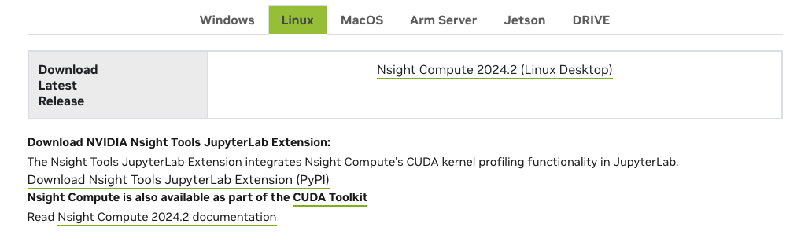


Profile할 코드는 다음과 같으며, 파일 이름은 `triton_sample.py`입니다.

```python
# Adapted straight from https://triton-lang.org/main/getting-started/tutorials/02-fused-softmax.html
import triton
import triton.language as tl
import torch

# if @triton.jit(interpret=True) does not work, please use the following two lines to enable interpret mode
# import os
# os.environ["TRITON_INTERPRET"] = "1"

@triton.jit
def square_kernel(output_ptr, input_ptr, input_row_stride, output_row_stride, n_cols, BLOCK_SIZE: tl.constexpr):
    # The rows of the softmax are independent, so we parallelize across those
    row_idx = tl.program_id(0)
    # The stride represents how much we need to increase the pointer to advance 1 row
    row_start_ptr = input_ptr + row_idx * input_row_stride
    # The block size is the next power of two greater than n_cols, so we can fit each
    # row in a single block
    col_offsets = tl.arange(0, BLOCK_SIZE)
    input_ptrs = row_start_ptr + col_offsets
    # Load the row into SRAM, using a mask since BLOCK_SIZE may be > than n_cols
    row = tl.load(input_ptrs, mask=col_offsets < n_cols, other=-float('inf'))

    square_output = row * row
    
    # Write back output to DRAM
    output_row_start_ptr = output_ptr + row_idx * output_row_stride
    output_ptrs = output_row_start_ptr + col_offsets
    tl.store(output_ptrs, square_output, mask=col_offsets < n_cols)


def square(x):
    n_rows, n_cols = x.shape
    # The block size is the smallest power of two greater than the number of columns in `x`
    BLOCK_SIZE = triton.next_power_of_2(n_cols)
    # Another trick we can use is to ask the compiler to use more threads per row by
    # increasing the number of warps (`num_warps`) over which each row is distributed.
    # You will see in the next tutorial how to auto-tune this value in a more natural
    # way so you don't have to come up with manual heuristics yourself.
    num_warps = 4
    if BLOCK_SIZE >= 2048:
        num_warps = 8
    if BLOCK_SIZE >= 4096:
        num_warps = 16
    # Allocate output
    y = torch.empty_like(x)
    # Enqueue kernel. The 1D launch grid is simple: we have one kernel instance per row o
    # f the input matrix
    square_kernel[(n_rows, )](
        y,
        x,
        x.stride(0),
        y.stride(0),
        n_cols,
        num_warps=num_warps,
        BLOCK_SIZE=BLOCK_SIZE,
    )
    return y


torch.manual_seed(0)
x = torch.randn(1823, 781, device='cuda')
y_triton = square(x)
y_torch = torch.square(x)
assert torch.allclose(y_triton, y_torch), (y_triton, y_torch)
```

Profile 명령은 다음과 같습니다.

```bash
../NVIDIA-Nsight-Compute-2024.2/ncu --set full -o matrix_square python3 triton_sample.py
```

아래 화면이 나타나고 `maxtrix_square.ncu-rep`가 생성되면 Profile 프로그램이 성공적으로 실행된 것입니다. 이제 이 파일을 분석할 수 있습니다.


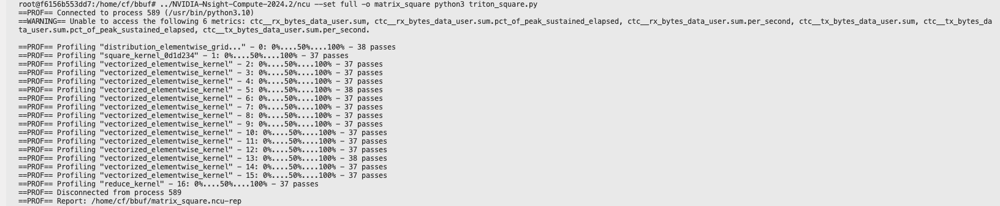

### Nsight Compute Profile 결과 분석

Nsight Compute로 프로그램을 Profile할 수 있을 뿐만 아니라, Nsight Compute를 통해 CUDA의 programming model과 memory model 등도 배울 수 있습니다.

#### Summary 부분

Nsight Compute로 `maxtrix_square.ncu-rep`를 열면 첫 페이지는 다음과 같습니다.

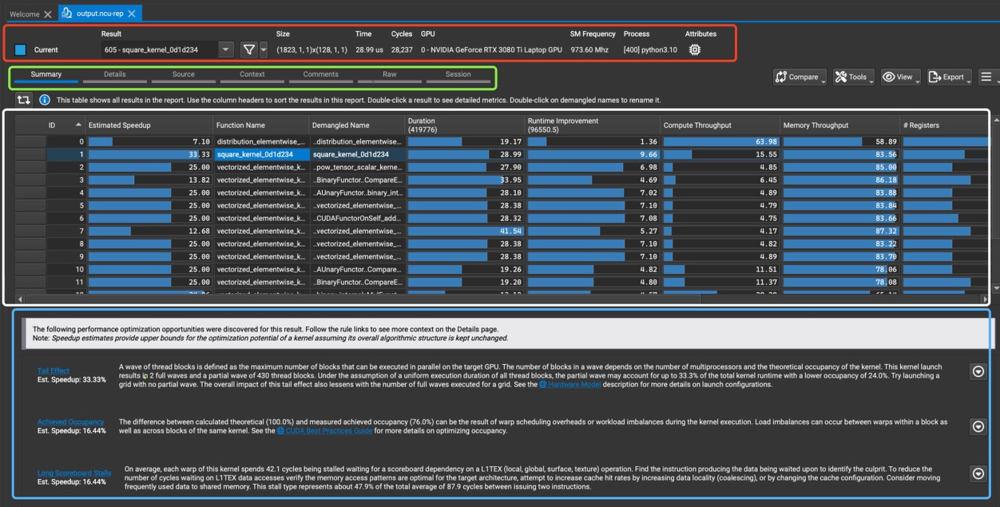


1. 첫 번째 빨간 박스는 상단 toolbar입니다. Result는 현재 선택된 Kernel 이름이 `605 - square_kernel_0d1d234`임을 나타냅니다. Size는 이 Kernel의 launch parameter, 즉 Grid Size와 Block Size를 나타냅니다. Time, Cycles, GPU는 각각 실행 시간이 28.99 us, cycle 수가 28,327, 사용 GPU가 NVIDIA GeForce RTX 3080 Ti Laptop GPU임을 뜻합니다. SM Frequency, Process, Attributes는 각각 SM frequency가 973.60 MHz, process ID가 [400], 실행 프로그램이 python3.10임을 뜻합니다.

2. 두 번째 초록색 박스에는 Summary, Details, Source 등 여러 선택지가 있으며, 일반적으로는 앞의 세 가지 선택지만 보면 됩니다.

3. 세 번째 흰색 박스는 Summary 선택 아래에서 Profile 프로그램 안의 어떤 Kernel들을 볼 수 있는지 나타냅니다. 커서로 구체적인 Kernel을 선택해 볼 수 있으며, 예를 들어 Function Name 열을 보면 현재 선택된 것이 `605 - square_kernel_0d1d234` Kernel임을 알 수 있습니다. 이 표의 모든 열을 나열하면 다음과 같습니다.
- ID: 각 함수의 unique identifier.
- Estimated Speedup: 예상 speedup. 이 함수를 최적화하면 얻을 수 있는 속도 향상을 의미합니다.
- Function Name: 함수 이름.
- Demangled Name: modifier를 제거한 함수 이름.
- Duration: 함수 실행 시간(ns 단위).
- Runtime Improvement: 예상 runtime 개선 힌트(ns 단위). 이 함수를 최적화하면 얻을 수 있는 실행 시간 개선을 의미합니다.
- Compute Throughput: 계산 throughput.
- Memory Throughput: 메모리 throughput.
- Registers: thread마다 사용하는 register 수.
- GridSize: kernel launch의 grid size.
- BlockSize: 각 Block의 thread 수.
- Cycles: instruction cycle.

Compute Throughput 열에 마우스를 올리면 아래 화면이 표시됩니다.


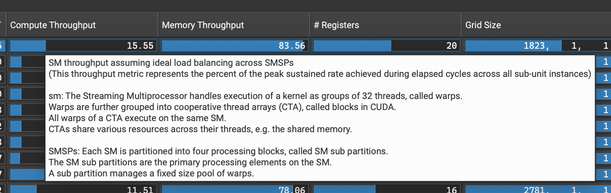

SM throughput은 SMSP 사이의 load balancing이 이상적이라고 가정합니다.
(이 throughput metric은 모든 sub-unit instance의 elapsed cycle 동안 달성한 peak sustained rate의 percentage를 나타냅니다.)
 
sm: Streaming Multiprocessor는 32개 thread를 한 묶음으로 kernel을 실행하며, 이를 warp라고 합니다.
warp는 다시 Cooperative Thread Array(CTA)로 묶이며, CUDA에서는 block이라고 부릅니다.
CTA의 모든 warp는 같은 SM에서 실행됩니다.
CTA는 thread 사이에서 shared memory 같은 다양한 resource를 공유합니다.

SMSPs: 각 SM은 네 개의 processing block으로 나뉘며, 이를 SM subpartition이라고 합니다.
SM subpartition은 SM의 주요 processing unit입니다.
하나의 subpartition은 고정 크기의 warp pool을 관리합니다.

Memory Throughput 열에 마우스를 올리면 아래 화면이 표시됩니다.


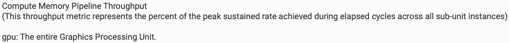

compute memory pipeline throughput
(이 throughput metric은 모든 sub-unit instance의 elapsed cycle 동안 달성한 peak sustained rate의 percentage를 나타냅니다.)

gpu: 전체 graphics processing unit.

마찬가지로 #Registers 열에 마우스를 올리면 아래 화면이 표시됩니다.

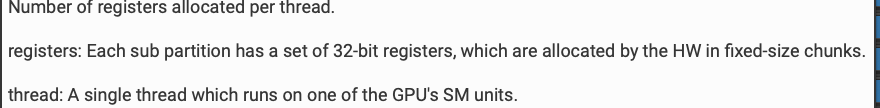

thread마다 할당된 register 수.

register: 각 subpartition에는 32-bit register 집합이 있으며, hardware가 고정 크기 block 단위로 할당합니다.

thread: GPU의 한 SM unit에서 실행되는 단일 thread.

마지막으로 Cycles 화면을 번역하면 다음과 같습니다.


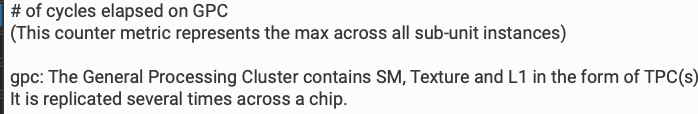


GPC에서 경과한 cycle 수
(이 counter metric은 모든 sub-unit instance 중 maximum 값을 나타냅니다.)

gpc: General Processing Cluster는 TPC(Texture Processing Cluster) 형태의 SM, texture, L1 cache를 포함합니다.
이는 chip 위에 여러 번 복제됩니다.


> 여기서 보여주는 세부 사항을 통해 CUDA programming model을 더 자세히 이해할 수 있습니다.

4. 네 번째 파란 박스는 현재 kernel metric을 바탕으로 제공되는 간단한 tuning 제안입니다. 예를 들어 여기 첫 번째 항목은 active wave가 너무 낮아서 grid_size와 block_size 조정을 제안합니다. 두 번째 항목은 theoretical occupancy(100.0%)와 측정된 실제 occupancy(76.0%) 사이의 차이가 kernel 실행 중 warp scheduling overhead나 workload imbalance 때문에 발생했을 수 있다는 내용입니다. load imbalance는 같은 kernel의 서로 다른 block 사이와 block 내부의 서로 다른 warp 사이에서 모두 발생할 수 있습니다. 세 번째 항목은 memory access pattern이 최적인지, Shared Memory를 사용해야 하는지 검증하라는 것입니다.

#### Details 부분

##### SOL 부분

먼저 GPU Speed Of Light Throughput 부분입니다. 보통 Details 부분의 맨 위에 위치하며, GPU resource 활용 상황을 명확히 설명합니다. 아래 screenshot에서도 마우스를 올리는 방식으로 각 metric의 세부 사항을 볼 수 있으며, 여기서는 더 반복하지 않겠습니다.

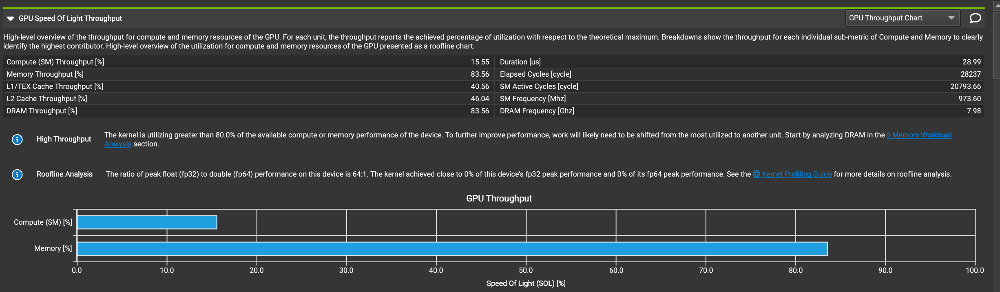

이 결과에서 알 수 있는 점은 다음과 같습니다.

- memory throughput(83.56%)이 compute throughput(15.55%)보다 훨씬 높으므로, 이는 memory-intensive task일 가능성이 있습니다.
- L1/TEX와 L2 cache throughput이 상대적으로 낮아 최적화 여지가 있을 수 있습니다.
- DRAM throughput이 전체 memory throughput과 같으므로, 주요 memory operation이 DRAM과 직접 상호작용한다는 뜻입니다.


##### Memory Workload Analysis 부분

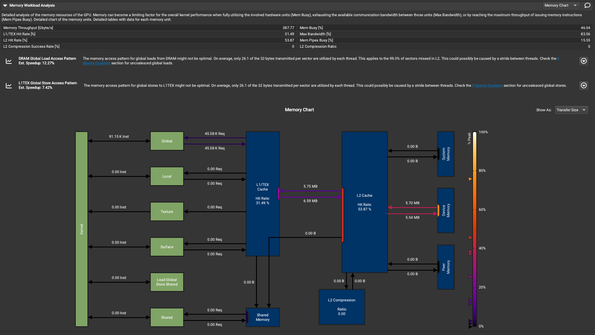


위에서 아래로 각 부분을 해석해 보겠습니다.

###### 상단 성능 metric

Detailed analysis of the memory resources of the GPU. Memory can become a limiting factor for the overall kernel performance when fully utilizing the involved hardware units (Mem Busy), exhausting the available communication bandwidth between those units (Max Bandwidth), or by reaching the maximum throughput of issuing memory instructions (Mem Pipes Busy). Detailed chart of the memory units. Detailed tables with data for each memory unit.

> 번역: GPU memory resource의 상세 분석입니다. 관련 hardware unit을 완전히 활용하는 경우(Mem Busy), 해당 unit 사이의 가용 communication bandwidth를 소진하는 경우(Max Bandwidth), 또는 memory instruction issue의 maximum throughput에 도달하는 경우(Mem Pipes Busy), memory는 전체 kernel 성능의 제한 요인이 될 수 있습니다. memory unit의 상세 chart와 각 memory unit의 상세 data table은 아래와 같습니다.

- Memory Throughput: 387.77 Gbyte/s
- L1/TEX Hit Rate: 31.49%
- L2 Hit Rate: 53.87%
- L2 Compression Success Rate: 0%
- Mem Busy: 46.04%
- Max Bandwidth: 83.56%
- Mem Pipe Busy: 13.55%
- L2 Compression Ratio: 0


마우스를 올리는 방식으로 각 metric의 상세 정보를 볼 수 있습니다.

- Memory Throughput

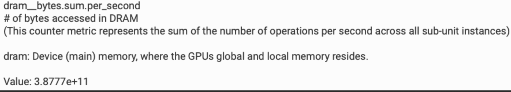

dram__bytes.sum.per_second
DRAM에서 접근한 byte 수
(이 counter metric은 초당 모든 sub-unit instance operand의 합을 나타냅니다.)

dram: device(main) memory, GPU의 global memory와 local memory가 있는 위치입니다.

- Mem Busy


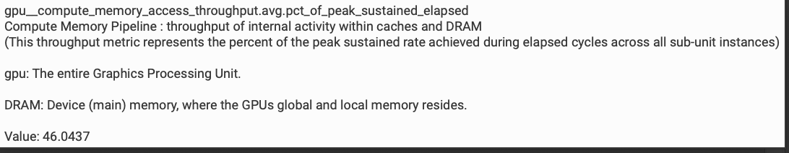

gpu_compute_memory_access_throughput.avg.pct_of_peak_sustained_elapsed
compute memory pipeline: cache와 DRAM 내부 activity의 throughput
(이 throughput metric은 모든 sub-unit instance의 elapsed cycle 동안 달성한 peak sustained rate의 percentage를 나타냅니다.)

gpu: 전체 graphics processing unit.

DRAM: device(main) memory, GPU의 global memory와 local memory가 있는 위치입니다.

- L1/TEX Hit Rate

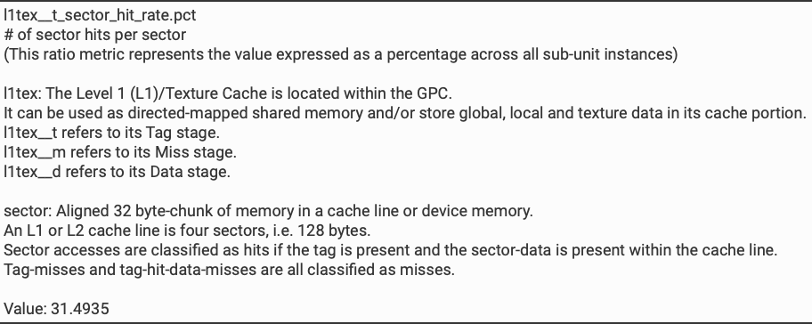

l1tex_t_sector_hit_rate.pct

sector당 sector hit 횟수
(이 ratio metric은 모든 sub-unit instance에 걸친 값을 percentage로 나타냅니다.)

l1tex: level 1(L1)/texture cache는 GPC 내부에 있습니다.
이는 direct-mapped shared memory로 사용될 수 있고, 또는 cache 부분에 global, local, texture data를 저장할 수 있습니다.
l1tex_t는 tag stage를 가리킵니다.
l1tex_m은 miss stage를 가리킵니다.
l1tex_d는 data stage를 가리킵니다.

sector: cache line 또는 device memory 안의 32-byte aligned memory block.
하나의 L1 또는 L2 cache line은 네 개의 sector, 즉 128 byte입니다.
tag가 존재하고 sector data가 cache line 안에 있으면 sector access는 hit로 분류됩니다.
tag miss와 tag hit이지만 data miss인 경우는 모두 miss로 분류됩니다.

- Max Bandwidth

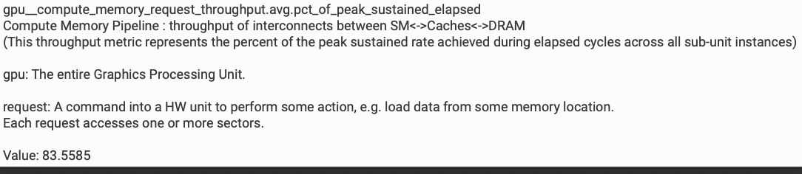


gpu_compute_memory_request_throughput.avg.pct_of_peak_sustained_elapsed
compute memory pipeline: SM<->cache<->DRAM 사이 interconnect의 throughput
(이 throughput metric은 모든 sub-unit instance의 elapsed cycle 동안 달성한 peak sustained rate의 percentage를 나타냅니다.)

gpu: 전체 graphics processing unit.

request: 어떤 memory location에서 data를 load하는 등 특정 작업을 수행하라고 hardware unit에 보내는 command입니다.
각 request는 하나 이상의 sector에 접근합니다.

- L2 Hit Rate

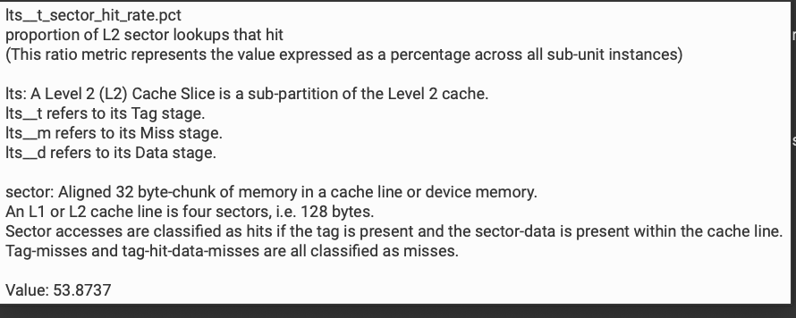

l2s_t_sector_hit_rate.pct
L2 sector lookup hit의 비율
(이 ratio metric은 모든 sub-unit instance에 걸친 값을 percentage로 나타냅니다.)

l2s: level 2(L2) cache slice는 L2 cache의 subpartition입니다.
l2s_t는 tag stage를 가리킵니다.
l2s_m은 miss stage를 가리킵니다.
l2s_d는 data stage를 가리킵니다.

sector: cache line 또는 device memory 안의 32-byte aligned memory block.
하나의 L1 또는 L2 cache line은 네 개의 sector, 즉 128 byte입니다.
tag가 존재하고 sector data가 cache line 안에 있으면 sector access는 hit로 분류됩니다.
tag miss와 tag hit이지만 data miss인 경우는 모두 miss로 분류됩니다.

나머지 몇 가지 metric은 더 나열하지 않겠습니다.

###### Memory Access Pattern 분석

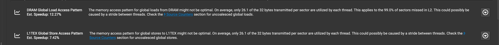

여기에는 두 가지 memory access pattern의 performance analysis 결과가 표시됩니다.

1. DRAM global load access pattern
- 문제: thread마다 sector 전송 32 byte 중 평균 26.1 byte만 사용했습니다.
- 이는 L2 cache에서 miss한 sector의 99.0%에 적용됩니다.
- thread 사이 stride 때문에 발생했을 수 있습니다.
- 예상 speedup은 12.27%입니다.

2. L1TEX global store access pattern
- 문제: thread마다 sector 전송 32 byte 중 평균 26.1 byte만 사용했습니다.
- thread 사이 stride 때문에 발생했을 수 있습니다.
- 예상 speedup은 7.42%입니다.

두 경우 모두 uncoalesced global load 또는 store에 관한 더 많은 정보를 얻기 위해 "Source Counters" 부분을 보라고 권합니다. Source Counters 부분은 다음 절에서 보겠습니다.

###### Memory Chart 그림 분석

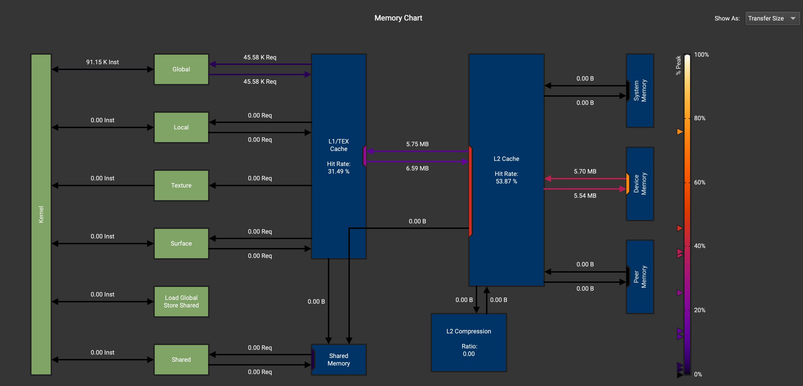

먼저 프로그램의 입력은 `x = torch.randn(1823, 781, device='cuda')`입니다. 즉 읽고 써야 하는 data는 `1823*781*4/1024/1024=5.43MB` 정도이고, local memory read/write data를 일부 포함하면 대략 예상과 맞습니다. 여기서는 특별한 단서를 보기는 어렵습니다. 다만 이 그림에서 자신의 kernel이 Device Memory에서 읽고 쓰는 data가 정상인지 관찰해, 프로그램 최적화가 효과를 냈는지 판단할 수 있다는 점은 짚어 둘 필요가 있습니다.


##### Source Counters 부분

아래 그림은 Source Counters 부분의 상세 정보를 보여줍니다.


그리고 source code입니다.

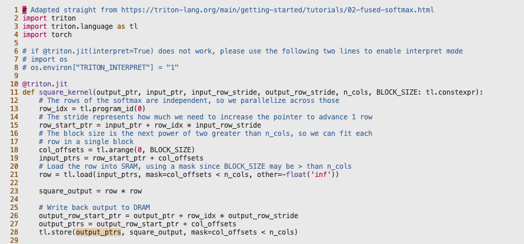


이어서 이 정보를 분석해 보겠습니다.

1. branch instruction:
    - branch instruction 수: 7292
    - branch instruction 비율: 0.01%
    - branch efficiency와 average divergent branch가 모두 0입니다. 이는 branch prediction 효과가 좋다는 뜻입니다.
2. uncoalesced global access:
    - 이 kernel에는 uncoalesced global access가 있으며, 78384개의 불필요한 sector가 발생했습니다(총 sector 435692의 18%).
    - 예상 speedup: 13.81%
    - 주요 source location을 확인하기 위해 L2 Theoretical Sectors Global Excessive table을 보라고 권합니다.
3. L2 Theoretical Sectors Global Excessive:
    - 주요 문제 위치 5개가 표시되며, 모두 triton_sample.py 파일의 28번째 줄이지만 kernel location은 서로 다릅니다.
    - 각 위치의 값은 모두 6380이고, 비율은 모두 8%입니다.
4. Warp Stall Sampling:
    - warp stall의 주요 원인과 위치를 보여줍니다.
    - 가장 심각한 stall은 triton_sample.py의 21번째 줄에서 발생했으며, 값은 358, 비율은 27%입니다.
    - 다른 stall 위치의 값은 각각 171, 154, 110, 88이고, 비율은 13%에서 6%까지입니다.
5. Most Instructions Executed:
    - 실행 instruction이 가장 많은 위치를 나열합니다.
    - 상위 5개 위치가 모두 triton_sample.py의 28번째 줄이고, 각 위치에서 7292개 instruction이 실행되어 각각 1%를 차지합니다.

정리하면, 코드에는 uncoalesced global memory access가 있으며 이것이 성능 손실을 일으킬 수 있습니다. branch efficiency는 높으므로 주요 성능 병목은 아닙니다. 주요 성능 문제는 triton_sample.py 파일의 21번째 줄과 28번째 줄에 집중되어 있습니다. warp stall은 주목할 만한 문제이며, 특히 21번째 줄에서 그렇습니다.

여기서 21번째 줄 코드는 `row = tl.load(input_ptrs, mask=col_offsets < n_cols, other=-float('inf'))`이고, 28번째 줄 코드는 `tl.store(output_ptrs, square_output, mask=col_offsets < n_cols)`입니다.


따라서 kernel의 bandwidth를 더 높이고 싶다면 이 부분의 제안에서 유용한 정보를 반드시 얻을 수 있습니다. 예를 들어 현재 코드는 data를 store할 때 mask `mask=col_offsets < n_cols`를 사용하는데, 이것이 uncoalesced memory access를 일으킬 수 있습니다. 가능하다면 data를 BLOCK_SIZE에 맞춰 padding해서 mask를 쓰지 않도록 할 수 있습니다. 또는 다른 BLOCK_SIZE를 시도해 더 좋은 성능을 얻을 수도 있습니다.

> 다음 글에서는 이 부분과 Source 부분의 관계를 볼 수 있습니다.

##### Warp State Statistics 부분

이 부분은 Kernel 실행 중 warp가 각 state에서 소비한 cycle을 제공합니다. 각 state에 대해 chart는 issue된 instruction마다 해당 state에서 소비한 평균 cycle 수를 보여줍니다. 일반적으로 특정 Stall state에서 소비한 cycle 수가 많을수록 성능에 영향을 줄 가능성이 큽니다.

On average, each warp of this kernel spends 42.1 cycles being stalled waiting for a scoreboard dependency on a L1TEX (local, global, surface, texture) operation. Find the instruction producing the data being waited upon to identify the culprit. To reduce the number of cycles waiting on L1TEX data accesses verify the memory access patterns are optimal for the target architecture, attempt to increase cache hit rates by increasing data locality (coalescing), or by changing the cache configuration. Consider moving frequently used data to shared memory. This stall type represents about 47.9% of the total average of 87.9 cycles between issuing two instructions.

> 이 예시에서는 Long Scoreboard Stalls 경고가 나타났고, 예상 개선 speedup은 16.44%입니다. 평균적으로 이 kernel의 각 warp는 L1TEX(local, global, surface, texture) operation의 scoreboard dependency를 기다리며 42.1 cycle 동안 stall됩니다. 대기 중인 data를 생성하는 instruction을 찾아 문제의 원인을 파악하세요. L1TEX data access를 기다리는 cycle 수를 줄이려면 memory access pattern이 target architecture에 최적인지 검증하고, data locality(coalescing)를 높이거나 cache configuration을 변경해 cache hit rate를 높여 보세요. 자주 사용하는 data를 shared memory로 옮기는 것도 고려하세요. 이 stall type은 두 instruction issue 사이 총 평균 87.9 cycle 중 약 47.9%를 차지합니다.

표시된 결과에서는 중요도 순으로 정렬되므로 사용자는 가장 중요한 문제에 집중할 수 있습니다. 가장 중요한 문제가 가장 큰 영향을 낼 가능성이 높기 때문입니다. 여기서는 instruction마다 Long Scoreboard Stalls가 평균 거의 42 cycle을 차지합니다. 이러한 stall은 여러 단계의 memory hierarchy에 접근하는 데 필요한 latency와 관련이 있습니다. 이런 종류의 내장 전문 지식 덕분에 사용자는 hardware architecture 전문 지식이 없어도 성능 문제를 이해할 수 있습니다.


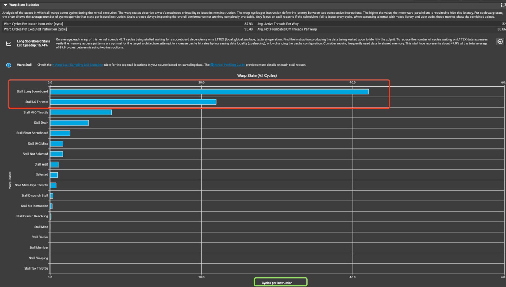

Warp Stall Sampling을 클릭하면 Source Counters 부분으로 이동합니다. 구체적인 내용은 앞 절의 분석을 참고하세요.

또한 아래 빨간 박스의 버튼을 클릭하면 계산에 어떤 hardware event가 사용되었는지, 성능 문제를 나타내는 threshold가 어떻게 정의되어 있는지 등 일부 내장 rule 정보를 볼 수 있습니다.

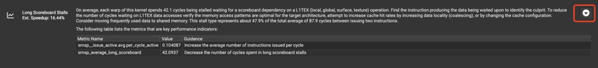

Stall Long Scoreboard 또는 다른 state에 마우스를 올리면 해당 knowledge base를 볼 수 있습니다. Stall Long Scoreboard의 설명을 보겠습니다.

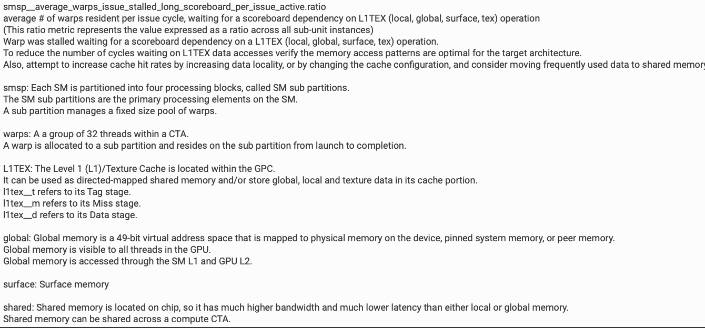

smsp_average_warps_issue_stalled_long_scoreboard_per_issue_active.ratio
각 issue cycle에서 resident average warp 수. L1TEX(local, global, surface, texture) operation의 scoreboard dependency를 기다리는 상태입니다.
(이 ratio metric은 모든 sub-unit instance에 걸친 값을 나타냅니다.)
Warp는 L1TEX(local, global, surface, texture) operation의 scoreboard dependency를 기다리느라 stall됩니다.
L1TEX data access를 기다리는 cycle 수를 줄이려면 memory access pattern이 target architecture에 적합한지 검증하세요.
또한 data locality를 높이거나 cache configuration을 변경해 cache hit rate를 높여 보고, 자주 사용하는 data를 shared memory로 옮기는 것도 고려하세요.

smsp: 각 SM은 네 개의 processing block으로 나뉘며, 이를 SM subpartition이라고 합니다.
SM subpartition은 SM의 주요 processing element입니다.
하나의 subpartition은 고정 크기의 warp pool을 관리합니다.

warps: CTA 안의 32개 thread 그룹입니다.
하나의 warp는 하나의 subpartition에 할당되며, launch부터 completion까지 해당 subpartition에 resident로 남습니다.

L1TEX: level 1(L1)/texture cache는 GPC 내부에 있습니다.
이는 direct-mapped shared memory로 사용될 수 있고, 또는 cache 부분에 global, local, texture data를 저장할 수 있습니다.
l1tex_t는 tag stage를 가리킵니다.
l1tex_m은 miss stage를 가리킵니다.
l1tex_d는 data stage를 가리킵니다.

global: global memory는 49-bit virtual address space이며, device의 physical memory, pinned system memory 또는 peer memory에 mapping됩니다.
global memory는 GPU의 모든 thread에서 볼 수 있습니다.
global memory는 SM L1과 GPU L2를 통해 접근합니다.

surface: surface memory

shared: shared memory는 chip 위에 있으므로 local 또는 global memory보다 더 높은 bandwidth와 더 낮은 latency를 가집니다.
shared memory는 계산 CTA 안에서 공유될 수 있습니다.


## 구분점

분량 때문에 CUDA-MODE 1강 수업 후 실습(상)은 여기서 마칩니다. 남은 Nsight Compute 성능 분석 도구를 이해하려면 CUDA-MODE 1강 수업 후 실습(하) 편을 계속 읽어 주세요.


- 추천 읽을거리: https://www.youtube.com/watch?v=04dJ-aePYpE
