# CUDA-MODE 1강 수업 후 실습(하)

> 내 강의 노트이며, 많은 관심 바란다: https://github.com/BBuf/how-to-optim-algorithm-in-cuda/tree/master/cuda-mode 

## CUDA-MODE 제1강 과제 실전(하)

### Nsight Compute Profile 결과 분석

Nsight Compute의 Profile 결과 분석을 계속한다.

#### Details 부분

상편의 Warp State Statistics 부분 뒤에 이어진다.

##### Compute Workload Analysis 부분

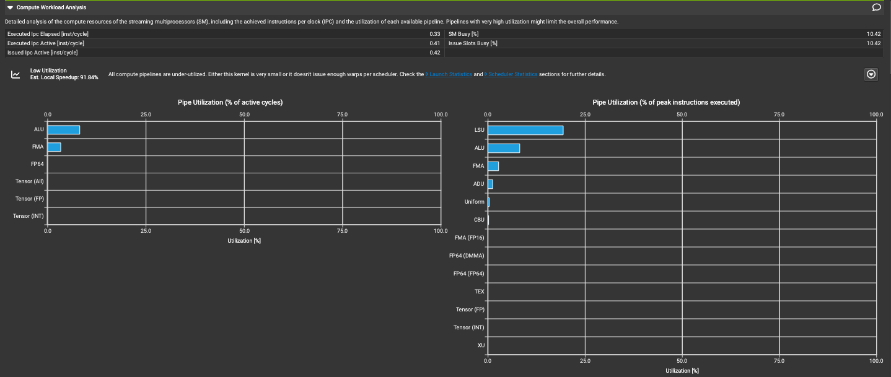

Detailed analysis of the compute resources of the streaming multiprocessors (SM), including the achieved instructions per clock (IPC) and the utilization of each available pipeline. Pipelines with very high utilization might limit the overall performance.

> streaming multiprocessor(SM)의 compute resource를 자세히 분석한다. 여기에는 실제 달성한 instructions per clock(IPC)과 각 available pipeline의 utilization이 포함된다. utilization이 매우 높은 pipeline은 전체 성능을 제한할 수 있다.

아래에서는 여기에 관련된 table metric의 knowledge base를 번역한다. 뒤에서 첫 번째 metric인 Executed Ipc Elapsed와 같은 부분은 번역을 생략한다.

- Executed Ipc Elapsed[inst/cycle]

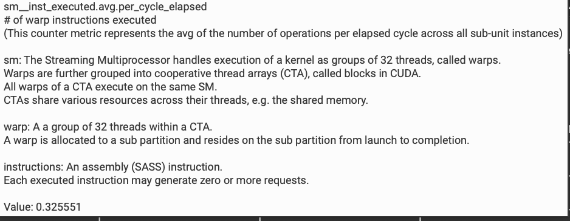

executed warp instruction count

sm_inst_executed.avg.per_cycle_elapsed
(이 counter metric은 모든 subunit instance에서 elapsed cycle당 평균 operation 수를 나타낸다.)

sm: streaming multiprocessor는 32개 thread를 한 group으로 묶어 kernel execution을 처리한다. 이를 warps라고 부른다.
Warps는 다시 cooperative thread array(CTA)로 group화되며, CUDA에서는 block이라고 부른다.
하나의 CTA에 속한 모든 warps는 같은 SM에서 실행된다.
CTA는 thread 사이에서 shared memory 같은 다양한 resource를 공유한다.

warp: CTA 안의 32개 thread group.
하나의 warp는 하나의 subpartition에 할당되며, 시작부터 완료까지 해당 subpartition에 resident한다.

instructions: assembly(SASS) instruction 하나.
실행된 각 instruction은 0개 이상의 request를 생성할 수 있다.

- SM Busy

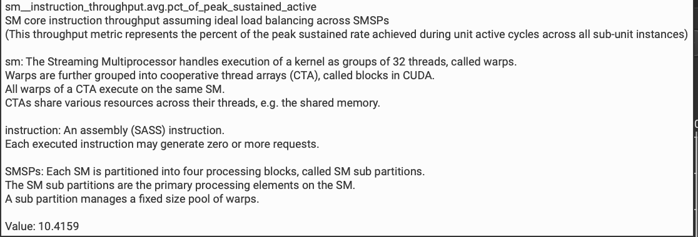

sm_instruction_throughput.avg.pct_of_peak_sustained_active
SMSP 사이에 이상적인 load balance가 있다고 가정한 SM core instruction throughput
(이 throughput metric은 모든 subunit instance의 active cycle 동안 달성한 peak sustained rate의 percentage를 나타낸다.)

SMSPs: 각 SM은 SM subpartition이라고 부르는 네 개의 processing block으로 나뉜다.
SM subpartition은 SM 위의 주요 processing element다.
하나의 subpartition은 fixed-size warp pool을 관리한다.

- Executed Ipc Active[inst/cycle]

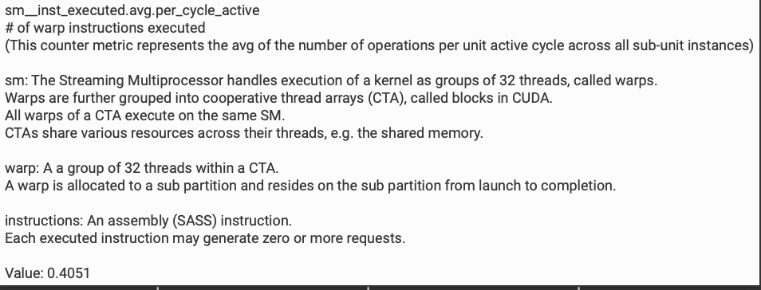

sm_inst_executed.avg.per_cycle_active
executed warp instruction count
(이 counter metric은 모든 subunit instance에서 active cycle당 평균 operation 수를 나타낸다.)

- Issue Slots Busy

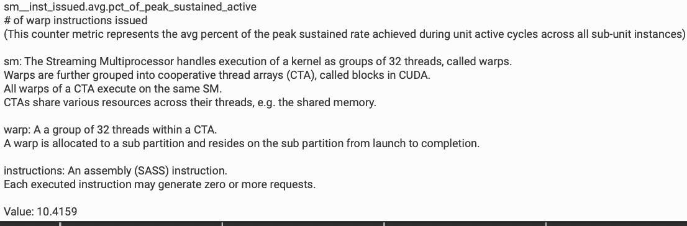

sm_inst_issued.avg.pct_of_peak_sustained_active
issued warp instruction count
(이 counter metric은 모든 subunit instance의 active cycle 동안 달성한 peak sustained rate의 평균 percentage를 나타낸다.)

- Issued Ipc Active[inst/cycle]

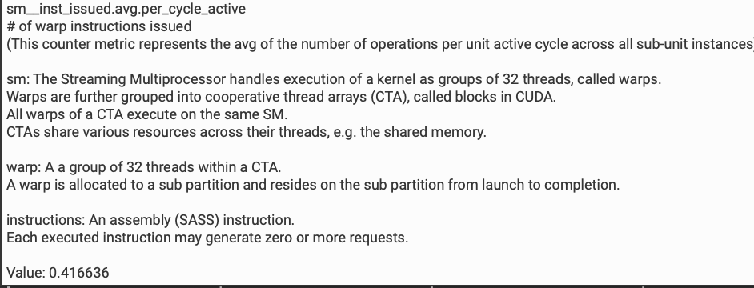

sm_inst_issued.avg.per_cycle_active
issued warp instruction count
(이 counter metric은 모든 subunit instance에서 active cycle당 평균 operation 수를 나타낸다.)

이어서 후반부 chart를 분석한다.

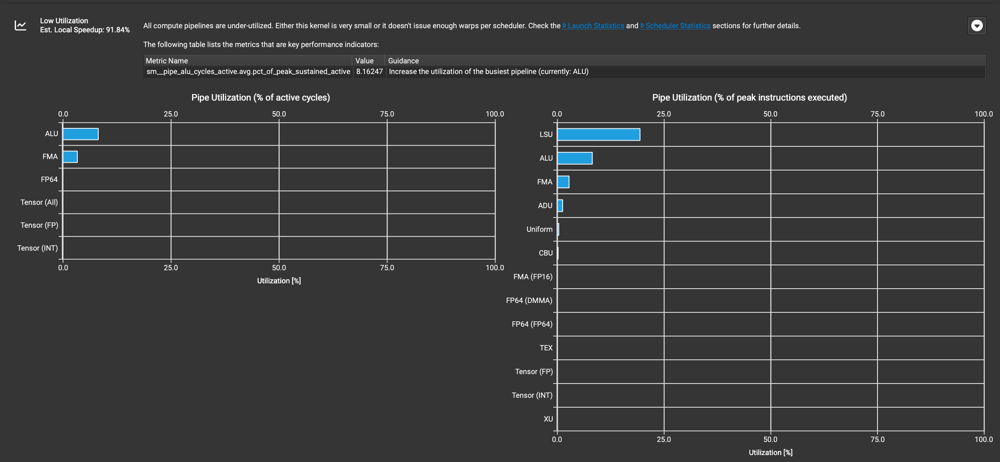

여기서는 Low Utilization을 제시하며, estimated speedup이 91.84%까지 가능하다고 말한다. 모든 compute Pipeline이 충분히 활용되지 않았다. 이는 kernel이 너무 작거나, scheduler마다 충분한 warps가 issue되지 않았기 때문일 수 있다.

> 이는 memory-intensive operator이므로 compute utilization이 낮은 것은 사실 정상이다. 여기의 estimated speedup은 대략적인 계산이어서 완전히 참고할 수는 없다. Compute Workload Analysis 부분은 Memory Workload Analysis 부분과 함께 보아야 한다.

Low Utilization 오른쪽 끝 button을 클릭하면 핵심 performance metric과 guidance를 볼 수 있다.

가장 아래 Pipeline utilization chart는 두 부분으로 나뉘며, 서로 다른 type의 pipeline utilization을 각각 보여준다.

또한 그림에서는 "Launch Statistics"와 "Scheduler Statistics" 부분을 보아 더 많은 detail을 얻으라고 제안한다. 이는 Pipeline utilization이 왜 이렇게 낮은지 이해하는 데 도움이 될 수 있다.

##### Launch Statistics 부분

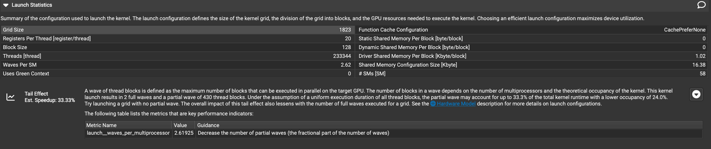

여기의 구체적인 metric knowledge base는 더 이상 자세히 설명하지 않고, Tail Effect 부분을 바로 본다. 여기서 말하는 Wave는 target GPU에서 parallel하게 실행할 수 있는 최대 block 수를 의미한다. 이 kernel에서는 2개의 full Wave와 1개의 partial Wave(433개 thread block 포함)가 실행되었다. 모든 thread block의 execution time이 균일하다고 가정하면 partial Wave는 전체 kernel runtime의 33.3%를 차지할 수 있으며, full occupancy는 24.0%다.

그림에서는 partial Wave가 없는 grid를 launch해보라고 제안한다. tail effect를 줄이면 full grid 실행에 필요한 Wave 수도 줄일 수 있다. launch configuration에 관한 더 많은 detail은 hardware model description을 참고하라고 제안한다.

##### Scheduler Statistics 부분

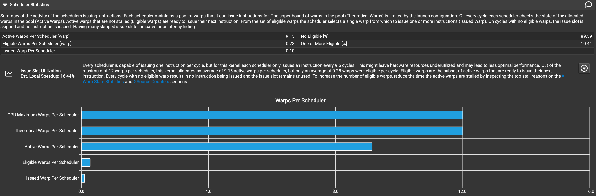

Summary of the activity of the schedulers issuing instructions. Each scheduler maintains a pool of warps that it can issue instructions for. The upper bound of warps in the pool (Theoretical Warps) is limited by the launch configuration. On every cycle each scheduler checks the state of the allocated warps in the pool (Active Warps). Active warps that are not stalled (Eligible Warps) are ready to issue their next instruction. From the set of eligible warps the scheduler selects a single warp from which to issue one or more instructions (Issued Warp). On cycles with no eligible warps, the issue slot is skipped and no instruction is issued. Having many skipped issue slots indicates poor latency hiding.

> 이는 scheduler가 instruction을 issue하는 activity의 summary다. 각 scheduler는 자신이 instruction을 issue할 수 있는 warp pool을 유지한다. pool 안의 warp upper bound(Theoretical Warps)는 launch configuration에 의해 제한된다. 매 cycle마다 각 scheduler는 pool 안에 할당된 warp 상태(Active Warps)를 확인한다. stalled 상태가 아닌 active warps(Eligible Warps)는 다음 instruction을 issue할 준비가 되어 있다. scheduler는 eligible warps 집합에서 하나의 warp를 선택해 하나 이상의 instruction을 issue한다(Issued Warp). eligible warp가 없는 cycle에서는 issue slot을 skip하고 instruction이 issue되지 않는다. skipped issue slot이 많다는 것은 latency hiding이 좋지 않음을 나타낸다.

아래는 metric의 knowledge base 번역이다.

- Active Warps Per Scheduler[warp]

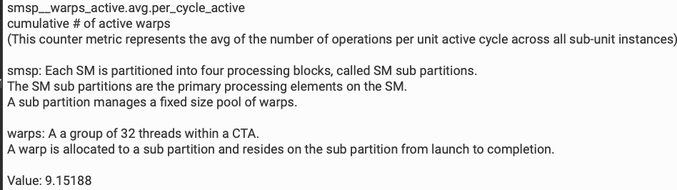

smsp__warps_active.avg_per_cycle_active
누적 active thread group 수
(이 counter는 각 active cycle 동안 모든 subunit instance의 평균 thread group 수를 측정한다.)

smsp: 각 SM(streaming multiprocessor)은 SM subpartition이라고 부르는 네 개의 processing block으로 나뉜다.
SM subpartition은 SM 위의 주요 processing unit이다.
각 subpartition은 fixed-size thread group pool을 관리한다.

warps: 하나의 CTA(cooperative thread array)에는 32개 thread가 있다.
하나의 thread group은 하나의 subpartition에 할당되고 완료될 때까지 그 subpartition에 resident한다.

- No Eligible[%]

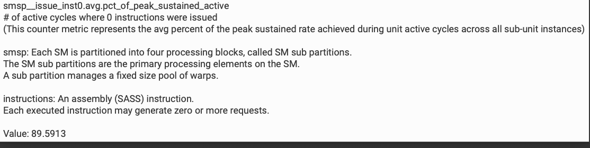

smsp__issue_inst0.avg.pct_of_peak_sustained_active

active cycle 중 instruction이 issue되지 않은 active cycle의 percentage다. 이 counter metric은 모든 subunit instance에서 peak sustained active state에 도달한 동안의 average percentage를 나타낸다.

instructions: assembly(SASS) instruction 하나.
실행된 각 instruction은 0개 이상의 request를 생성할 수 있다.

- Eligible Warps Per Scheduler[warp]

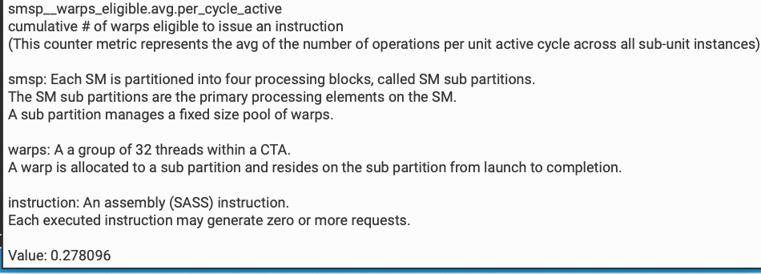

smsp__issue_active.avg.per_cycle_active

각 active cycle에서 instruction 1개를 issue한 cycle 수다. 이 counter metric은 모든 subunit instance에서 active cycle당 평균 operation 수를 나타낸다.

- One or More Eligible[%]

smsp__issue_active.avg.pct_of_peak_sustained_active

active cycle 중 instruction 하나가 issue된 active cycle의 percentage다. 이 counter metric은 모든 subunit instance에서 peak sustained active state에 도달한 동안의 average percentage를 나타낸다. 이 metric은 No Eligible[%]와 보완 관계다.

후속 analysis result:

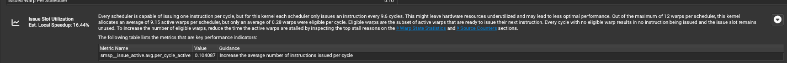

- 각 scheduler는 cycle마다 instruction 하나를 issue할 수 있지만, 이 kernel은 9.6 cycle마다 instruction 하나를 issue한다. 이는 hardware resource waste를 일으켜 performance에 영향을 줄 수 있다.
- 각 scheduler는 최대 12개 thread group(warp)을 할당할 수 있지만, 이 kernel은 평균 9.15개의 active thread group만 할당했다. 그러나 cycle마다 평균 0.28개의 thread group만 issue 가능한 eligible 상태다.
- issue 가능한 thread group(eligible warps)은 active warps의 subset이며, 다음 instruction을 issue할 준비가 된 상태다.
- cycle마다 issue 가능한 thread group이 없으면 scheduling slot(issue slot)이 낭비되어 아무 instruction도 issue되지 않는다.
- issue 가능한 thread group 수를 늘리려면 active thread group이 blocked되는 시간을 줄여야 한다. "Warp State Statistics"와 "Source Counters" 부분을 확인해 thread group이 blocked되는 주요 원인을 찾을 수 있다.

"Warp State Statistics"와 "Source Counters" 부분은 이미 보았다. 여기서 드러나는 문제는 Warp Stall 현상에 대한 설명이며, scheduler 자체의 관점에서 설명한 것이다.

##### Occupancy 부분

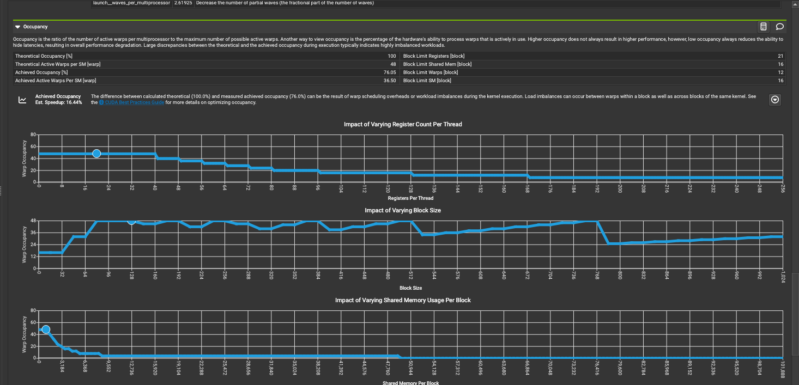

Occupancy는 각 SM에서 active한 thread group(warp) 수와 가능한 최대 active thread group 수의 ratio를 의미한다. occupancy를 보는 또 다른 방식은 hardware가 thread group을 처리할 수 있는 능력 중 실제로 사용된 percentage를 나타낸다고 보는 것이다. 높은 occupancy가 항상 더 높은 성능을 가져오지는 않지만, 낮은 occupancy는 latency hiding 능력을 낮추어 전체 성능 저하로 이어질 수 있다. 실행 과정에서 theoretical occupancy와 achieved occupancy 사이에 큰 차이가 있으면 보통 workload가 매우 불균형하다는 뜻이다. occupancy는 GPU resource utilization을 반영하며 CUDA program performance를 평가하는 key metric이다. 너무 낮은 occupancy는 performance degradation을 일으키므로, 낮은 occupancy의 원인을 분석하고 최적화해야 한다.

먼저 theoretical maximum active thread group count는 48개이고, 실제 achieved active thread group count는 36.50개이며, occupancy는 76.04%다.

그 다음 아래 세 개의 작은 그림을 통해 block size가 performance에 미치는 영향과 block당 shared memory usage가 performance에 미치는 영향을 볼 수 있다.

- thread당 register 수가 증가함에 따라 performance는 먼저 상승한 뒤 하락하며, optimal value가 존재한다. register 수가 증가하면 동시에 실행 가능한 thread 수가 제한되므로 trade-off가 필요하다.
- block size 변화도 performance에 영향을 주며, optimal value가 존재한다. block size가 너무 크면 parallelism이 제한되고, 너무 작으면 scheduling overhead가 증가한다.
- shared memory usage가 증가하면 동시에 실행 가능한 block 수가 줄어 performance에 영향을 준다.

#### Source 부분

마지막으로 Source 부분 해석으로 넘어간다.

CUDA-MODE 제1강 과제 실전(상)의 Source Counters 부분에서 이미 이것이 Souces 부분과 관련이 있다고 언급했다.

아래 그림은 Source Counters 부분의 detail을 보여준다.

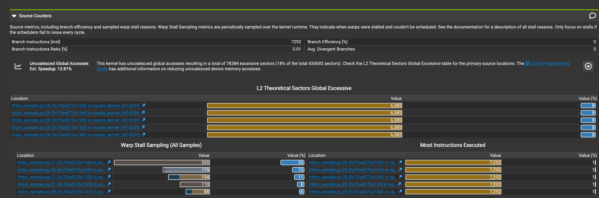

code에 non-coalesced global memory access가 존재하며, 이것이 performance loss를 유발할 수 있음을 볼 수 있다. branch efficiency는 매우 높아 주요 performance bottleneck은 아니다. 주요 performance issue는 `triton_sample.py` file의 21번째 줄과 28번째 줄에 집중되어 있다. warp stall은 주목할 만한 문제이며, 특히 21번째 줄에서 그렇다.

초록색 code link를 클릭하면 Source 부분으로 jump해서 문제를 일으키는 source code line으로 바로 들어갈 수 있다.

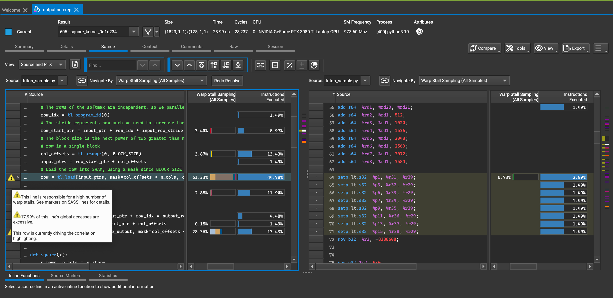

문제를 일으키는 source code뿐 아니라 compiler가 생성한 PTX/SASS 같은 format의 code도 볼 수 있다. source code를 찾아내고 Source Counters 부분에서 제공한 suggestion과 결합하면 code optimization에 큰 도움이 된다.

또한 source code에 대응하는 SASS assembly code를 볼 때 instruction 위에 mouse를 올리면 아래쪽에 해당 assembly의 역할이 표시된다. 일부 instruction은 표시되지 않는다.

## 요약

Nsight Compute를 학습해보면 Nvidia의 Profile tool은 usability와 전문성이 모두 매우 강하다는 것을 알 수 있다. CUDA 개발자에게 이는 필수적이다. 이 두 글은 CUDA-MODE Lecture1을 학습한 뒤 Nsight Compute로 실습한 내용이다.

- 추천 읽기: https://www.youtube.com/watch?v=04dJ-aePYpE
