> 내 강의 노트다. 관심 있으면 봐도 좋다: https://github.com/BBuf/how-to-optim-algorithm-in-cuda/tree/master/cuda-mode 

## CUDA-MODE 강의 노트 11강: Sparsity

> 이 강의는 주로 작성자가 PyTorch 팀이 Sparsity 방향에서 해 온 작업을 소개한다. 초점은 Sparsity의 GPU 추론이다. Sparsity에 관심이 있고 실제 엔지니어링 적용 측면의 진전을 알고 싶다면 들어볼 만하다. 관심이 없다면 건너뛰어도 된다. 이 기술은 비교적 마이너하고, 현재 산업계의 추론 방안은 주로 quantization에 집중되어 있다.

### 강의 노트

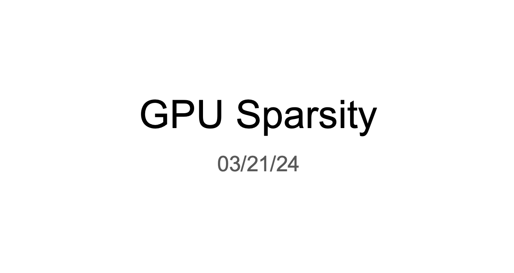


작성자의 자기소개다. PyTorch Core 팀 소속이며 architecture optimization, quantization, Sparsity 작업을 하고 있다. 특히 지난 2년 동안 연구 초점은 LLMs와 Vision Transformers 같은 생성형 AI에 주로 맞춰져 있었다. 지금은 이 기술들을 GPU로 가져오는 데 집중하고 있다. 이전에 팀은 주로 edge device와 CPU 관련 작업에 집중했다. 모델 규모가 이렇게 커졌기 때문에 이제 추론은 GPU에서 실행해야 한다. 우리는 이미 학습된 모델을 활용하되, 일부 weight를 제거하거나 특정 weight의 데이터 타입을 low-bit로 조정해 약간의 accuracy를 희생하는 대신 모델 성능을 높이고자 한다. 핵심 아이디어는 accuracy를 영리하게 복구할 수 있다면 이런 하락은 정량화할 수 있다는 것이다.

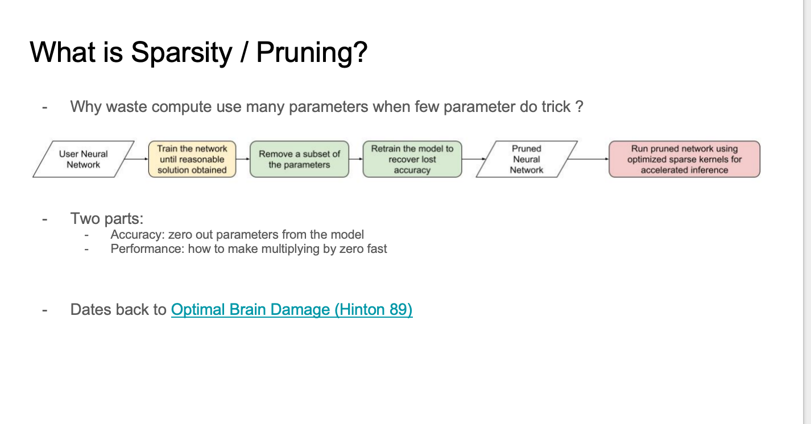

Slides의 흐름도는 Sparsity/pruning 과정을 보여준다.
- 사용자 neural network
- 합리적인 solution을 얻을 때까지 network 학습
- 일부 parameter 제거
- 손실된 accuracy를 복구하기 위해 모델 재학습
- pruning된 neural network 획득
- 최적화된 Sparsity kernel로 pruning된 network를 실행해 추론 가속

Pruning에는 두 주요 부분이 있다.
- Accuracy: 모델에서 parameter를 제거하는 것
- Performance: 0과 곱하는 연산을 어떻게 빠르게 할 것인가

그리고 이 개념은 Optimal Brain Damage(Hinton 89) 논문까지 거슬러 올라가며, 오래된 연구 분야다.

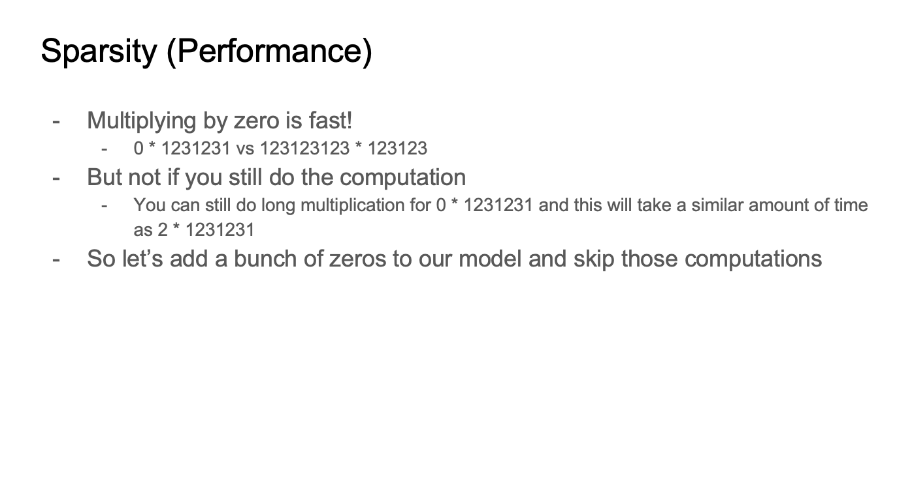

이론적으로 0을 곱하는 것은 매우 빠른 연산이다. 하지만 계산 시스템이 이런 zero multiplication을 인식하고 최적화하지 못하면 실제로는 계산 시간을 절약하지 못한다. 진짜 성능 향상은 모델의 zero parameter를 식별하고, 이 zero와 관련된 계산을 완전히 건너뛰는 데서 온다.

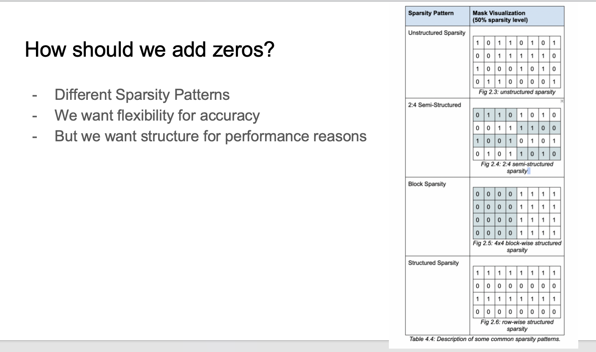

이 Slides는 neural network에 0을 어떻게 추가하는지, 즉 sparsity를 어떻게 구현하는지 설명한다. 먼저 서로 다른 Sparsity pattern이 있다. 둘째, accuracy를 보장하려면 유연성이 필요하다. 마지막으로 performance를 높이려면 구조화된 pattern도 필요하다. 오른쪽 그림은 서로 다른 sparsity mode를 보여주며, 모든 mode는 50% Sparsity를 나타낸다.
- 비구조화 sparsity(Unstructured Sparsity): 0과 non-zero 원소가 무작위로 분포한다.
- 2:4 반구조화 sparsity(2:4 Semi-Structured): 원소 4개 중 2개가 non-zero다.
- block sparsity(Block Sparsity): 4x4 block 단위로 절반의 block이 전부 0이다.
- 구조화 sparsity(Structured Sparsity): row 기준으로 sparsify하고, 한 row씩 건너 전부 0으로 만든다.

서로 다른 Sparsity pattern은 accuracy에 미치는 영향도 다르다. accuracy와 performance 사이 균형을 어떻게 잡을지가 우리가 고려해야 할 핵심 문제다. 이것이 작성자가 지난 몇 년 동안 연구한 문제다.

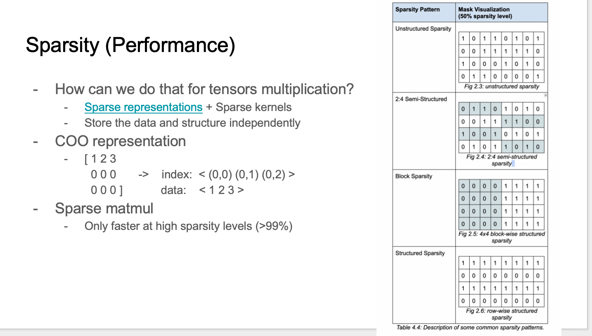

이 Slides는 performance 측면에서 Sparsity를 고려한다. 특히 tensor multiplication 구현을 다룬다. Sparse representations, Sparse kernels, 독립적인 저장 data structure를 사용해 이를 완성한다. 아래에는 COO(Coordinate) 표현 예시가 있으며, non-zero 원소의 좌표와 data만 저장한다. 더 많은 표현 방식은 https://pytorch.org/docs/stable/sparse.html 를 참고하면 된다. Sparsity가 99%를 넘는 경우에만 Dense Matmul 대비 speed advantage가 나타난다. 이 slide는 CPU에서의 Sparsity를 논하는 것에 가깝다.

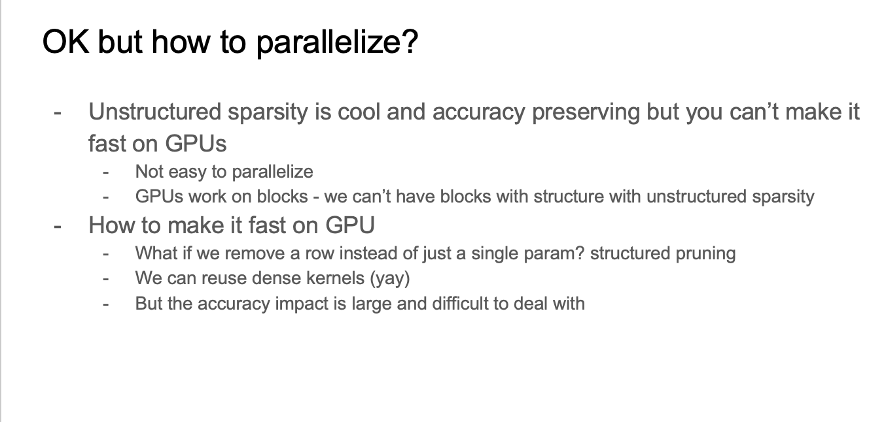

GPU에서는 상황이 더 나쁘다. Dense Matmul은 병렬 계산의 영향으로 속도가 매우 빠르다. Unstructured sparsity는 멋지고 accuracy를 유지할 수 있지만, GPU에서는 빠르게 실행할 수 없다. GPU는 block operation 기반인데, unstructured sparsity는 구조화된 block을 만들 수 없기 때문이다. 그렇다면 GPU에서 어떻게 더 빠르게 달릴 수 있을까? 전체 row를 제거하는 structured pruning을 사용하고 dense kernels를 재사용할 수 있지만, 이 방법은 accuracy에 큰 영향을 주어 다루기 어렵다.

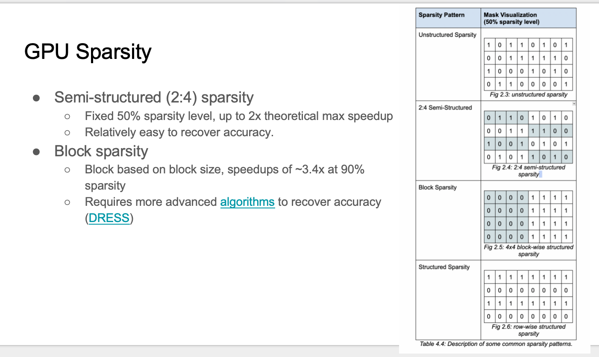

이 Slides는 GPU Sparsity의 서로 다른 mode와 특징을 설명한다.
- 반구조화(Semi-structured) sparsity (2:4):
    - 고정 50% sparsity이며, 이론적으로 최대 2배 가속을 얻을 수 있다.
    - accuracy 복구가 비교적 쉽다(NVIDIA 지원).
- Block sparsity:
    - block size 기반이며, 90% sparsity에서 약 3.4배 가속을 얻을 수 있다.
    - accuracy 복구를 위해 DRESS 같은 더 고급 알고리즘이 필요하다.

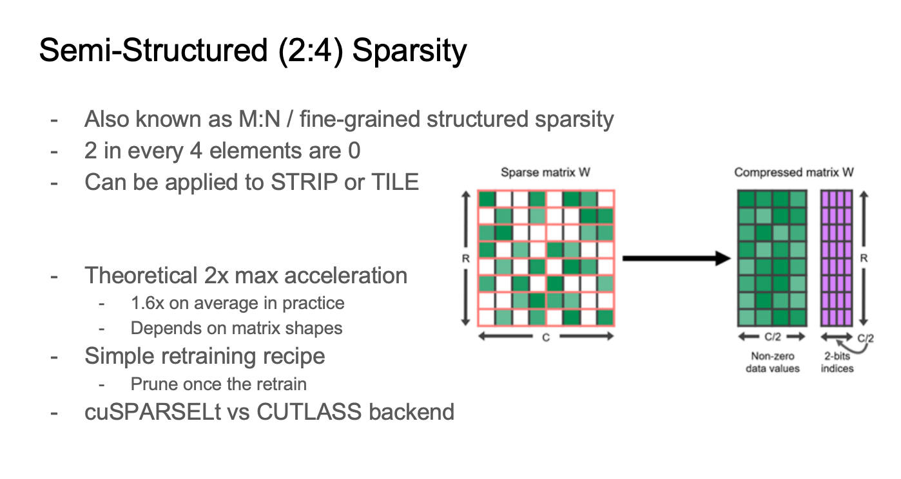

여기서는 Semi-Structured (2:4) Sparsity를 자세히 소개한다. 이는 M:N / fine-grained structured sparsity라고도 하며, 원소 4개 중 2개가 0이다. STRIP 또는 TILE mode에 적용할 수 있다. 오른쪽 그림은 압축 후 저장하는 matrix 원소가 원래의 절반뿐임을 보여준다. 추가로 2Bit dtype의 mask matrix가 있으며, 이 mask matrix는 Sparse Matmul에 적용된다. 이것은 이미 PyTorch에 통합되어 있어 시험하고 사용할 수 있다. backend는 두 가지 처리 방법을 선택할 수 있다. CutLass에서는 원시 instruction에 따라 이 작업을 수행할 수 있고, NVIDIA의 Sparse 처리 전용 library인 cuSPARSELt는 몇 가지 부가 기능을 제공해 더 빠르고 편하게 시험할 수 있게 한다. 이 두 처리 방법은 모두 PyTorch에 통합되어 있다. PyTorch에서 cuSPARSELt를 본다면 Semi-Structured (2:4) Sparsity와 관련된 것이다. 이론적으로 2배 가속이 가능하지만 실제 가속은 대략 1.6배 정도다. 이는 kernel 구현과 관련이 있고, matrix 규모에 따라 가속 효과가 달라진다.

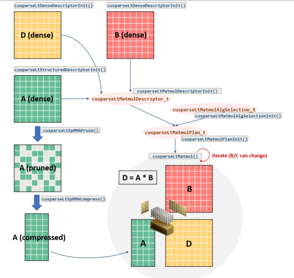

이 slides는 cuSPARSELt library로 GPU sparse matrix multiplication을 수행하는 과정을 설명한다.
- 초기화:
    - `cusparseLtDenseDescriptorInit()`으로 dense matrix D와 B를 초기화한다.
    - `cusparseLtStructuredDescriptorInit()`으로 structured sparse matrix A를 초기화한다.
- Sparsify와 compress:
    - `cusparseLtSpMAPrune()`으로 matrix A를 prune한다.
    - `cusparseLtSpMACompress()`로 pruning된 matrix A를 compress한다.
- 계획과 실행:
    - `cusparseLtMatmulDescriptorInit()`으로 matrix multiplication descriptor를 초기화한다.
    - `cusparseLtMatmulAlgSelectionInit()`으로 algorithm을 선택한다.
    - `cusparseLtMatmulPlanInit()`으로 execution plan을 만든다.
    - `cusparseLtMatmul()`로 matrix multiplication `D = A * B`를 실행한다.
- B는 iteration 과정에서 바뀔 수 있음에 주의한다.

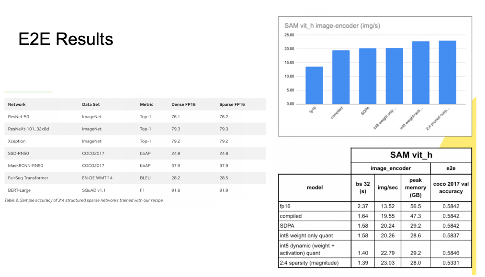

이 slides는 여러 모델과 기술의 end-to-end(E2E) 결과를 비교한다.
- 왼쪽 위 표는 dense FP16과 sparse FP16이 서로 다른 network와 dataset에서 보이는 성능을 비교한다. 이 결과는 2022 NVIDIA paper에 나온 것이다.
    - ResNet-50, ResNeXt-101, Xception 등의 ImageNet Top-1 accuracy
    - SSD-RN50과 MaskRCNN-RN50의 COCO2017 mAP
    - FairSeq Transformer의 EN-DE WMT'14 BLEU score
    - BERT-Large의 SQuAD v1.1 F1 score
    - 결과는 대부분의 경우 sparse FP16이 dense FP16과 비슷한 성능을 보임을 보여준다.
- 오른쪽 두 그림은 최근 2년 PyTorch 팀의 Sparisty 관련 성과를 보여준다.
    - 오른쪽 위 bar chart는 SAM vit_h image encoder가 서로 다른 optimization technique에서 처리하는 속도(img/s)를 보여준다. FP16에서 여러 최적화 방법으로 갈수록 처리 속도가 점진적으로 증가한다.
    - 오른쪽 아래 표는 SAM vit_h 모델이 서로 다른 optimization strategy에서 보이는 performance metric을 자세히 나열한다.
       - batch size, 초당 처리 image 수, peak memory usage, COCO 2017 validation accuracy를 포함한다.
        - optimization strategy에는 FP16, torch.compile, SDPA, INT8 quantization, dynamic quantization, 2:4 sparsification이 포함된다.
        - 결과는 optimization strategy를 적용할수록 처리 속도가 높아지고 메모리 사용이 줄며 accuracy는 거의 유지됨을 보여준다.
SAM vit 결과를 보면 Sparsity에는 속도상 이점이 있다. 특별히 지적해야 할 점은 SAM vit_h에 sparsification pruning 방법을 쓰면 accuracy가 0.53까지 떨어진다는 것이다. 작성자는 직접 fine-tuning하면 원래 accuracy를 복구할 수 있을 것이라고 설명한다. 또한 vision model은 일반적으로 parameter가 적고 fine-tuning cost가 높지 않기 때문에 fine-tuning을 받아들일 수 있다. 하지만 Sparse GPT에서는 accuracy 복구를 위해 fine-tuning이 아니라 one-shot calibration 기술을 탐색해야 한다. cost가 너무 높기 때문이다.

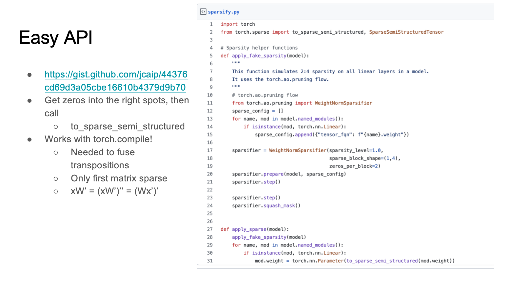

이 slides는 PyTorch에서 `nn.Linear` layer에 Sparse를 적용하는 방법을 보여준다. 코드 링크는 https://gist.github.com/jcaip/44376cd69d3a05cbe16610b4379d9b70 이다.

```python
import torch
from torch.sparse import to_sparse_semi_structured, SparseSemiStructuredTensor

# Sparsity helper functions
def apply_fake_sparsity(model):
    """
    This function simulates 2:4 sparsity on all linear layers in a model.
    It uses the torch.ao.pruning flow.
    """
    # torch.ao.pruning flow
    from torch.ao.pruning import WeightNormSparsifier
    sparse_config = []
    for name, mod in model.named_modules():
        if isinstance(mod, torch.nn.Linear):
            sparse_config.append({"tensor_fqn": f"{name}.weight"})

    sparsifier = WeightNormSparsifier(sparsity_level=1.0,
                                      sparse_block_shape=(1,4),
                                      zeros_per_block=2)
    sparsifier.prepare(model, sparse_config)
    sparsifier.step()

    sparsifier.step()
    sparsifier.squash_mask()


def apply_sparse(model):
    apply_fake_sparsity(model)
    for name, mod in model.named_modules():
        if isinstance(mod, torch.nn.Linear):
            mod.weight = torch.nn.Parameter(to_sparse_semi_structured(mod.weight))
```

전체 흐름은 먼저 모델을 sparsify하는 것이다. 여기서는 `apply_fake_sparsity` 함수를 사용하며, 이름상 이것은 fake sparsification이고 모델 accuracy를 보장하지는 못할 것으로 보인다. 그런 다음 `to_sparse_semi_structured` 함수를 호출해 실제 weight를 semi structured sparse tensor로 변환한다. 헷갈리는 점은 `apply_fake_sparsity` 함수 안에서 `sparsifier.step()`을 두 줄 실행한다는 점이다. 이는 PyTorch Sparisity를 더 깊이 알아야 이해할 수 있을 것 같다.

또한 현재 Torch가 구현한 이런 semi structured sparse는 첫 번째 matrix가 sparse인 경우만 지원하고 두 번째 matrix는 반드시 Dense여야 한다. PyTorch에서 Linear의 기본 형태는 xW'이므로 W의 sparsification을 지원하지 않는다. 다만 transpose를 사용해 다시 작성하면 W sparsification을 지원하게 만들 수 있다. Slides 왼쪽의 마지막 공식이 그 예다. 하지만 이는 GPU에서 memory copy operation을 수행해야 하므로 성능에 명백한 영향을 준다. compiler로 이 transpose를 ReLU 같은 이후 operation에 fuse하면 전체 흐름은 훨씬 빨라질 수 있다. 다만 현재 torch.comiple은 sparse Matmul 뒤의 이런 fusion을 지원하지 않는 것 같다.

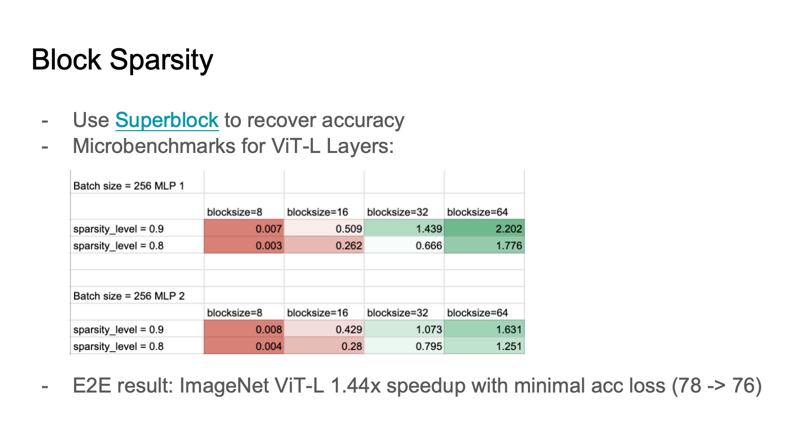

Block Sparsity에서는 https://github.com/pytorch-labs/superblock 의 기술로 accuracy를 복구한다. 이 Slides는 ViT-L layer를 microbenchmark했다.
- 두 표가 있으며 각각 batch size 256의 MLP 1과 MLP 2에 대응된다.
- 서로 다른 block size(8, 16, 32, 64)와 sparsity level(0.9, 0.8)을 테스트했다.
- 표의 숫자는 처리 속도를 나타낸다.

block size가 커질수록 성능은 전반적으로 높아지고, sparsity level 0.9가 일반적으로 0.8보다 더 높은 성능 수치를 얻는다. 또한 end-to-end(E2E) 결과는 ImageNet에서 ViT-L 모델을 테스트했을 때 1.44배 가속을 달성했고 accuracy 하락도 크지 않음을 보여준다.

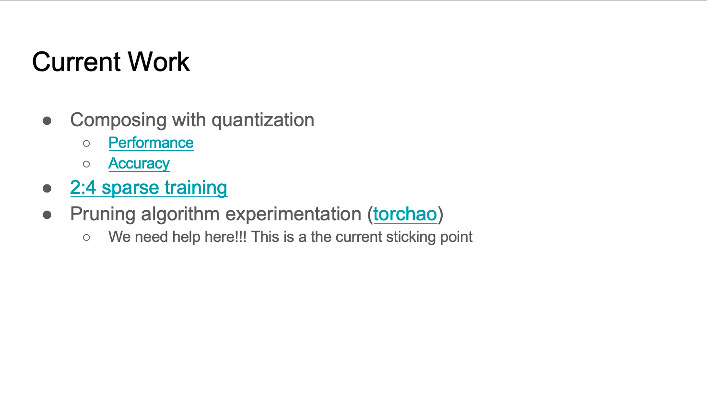

작성자는 현재 진행 중인 작업도 소개했다. 예를 들어 Sparse와 Quantization을 결합하는 작업이다. 여기서는 많은 문제가 발생했으며, torch.compile뿐 아니라 fusion operation 처리도 포함된다. sparsification의 본질은 기존 weight에 일부 0 값을 추가하고 compress한 뒤 compressed representation을 얻는 것이다. 이 모든 작업은 offline 상태에서 완료된다. 작성자는 문서를 하나 보여주었지만 공개되지는 않았고, screenshot 내용은 대략 다음과 같다.

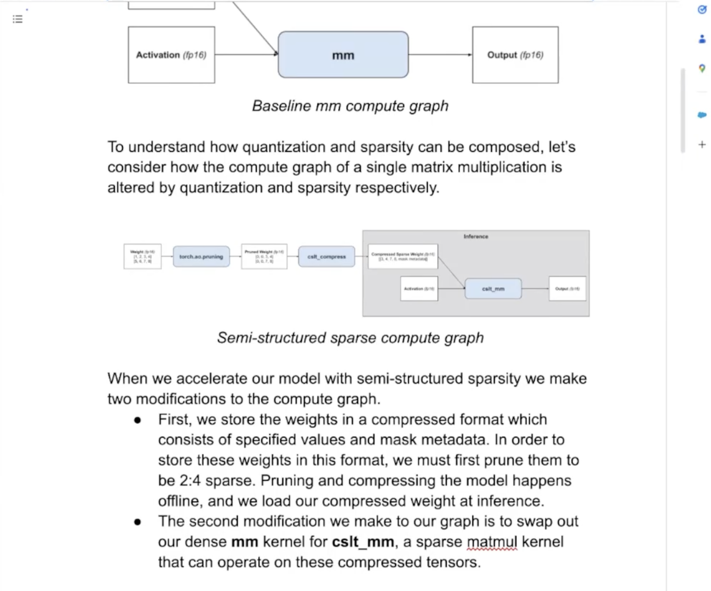
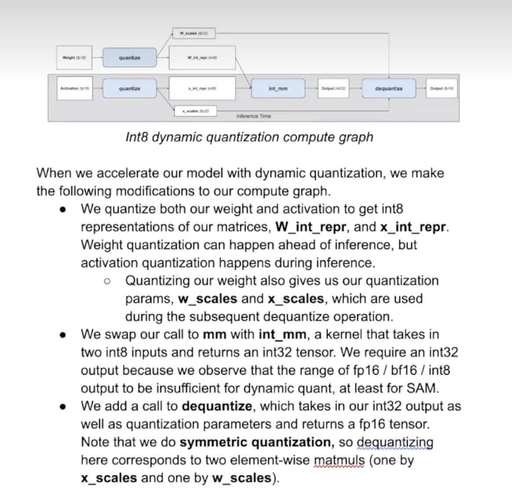

이 두 screenshot은 주로 semi-structured sparsity와 dynamic quantization이라는 두 모델 가속 기술의 computation graph와 구현 방법을 보여준다.
- Semi-structured sparse computation graph:
    - 2:4 sparse mode로 weight를 compress한다.
    - offline에서 pruning과 compression을 수행하고, 추론 때 compressed weight를 load한다.
    - dense matrix multiplication(mm)을 sparse matrix multiplication kernel(cslt_mm)로 대체한다.
- Int8 dynamic quantization computation graph:
    - weight와 activation을 모두 quantize해 int8 표현으로 바꾼다.
    - weight quantization은 추론 전에 수행할 수 있고, activation quantization은 추론 과정에서 수행한다.
    - quantization 과정은 이후 dequantization에 사용할 quantization parameter(w_scales, x_scales)를 만든다.
    - 일반 matrix multiplication(mm)을 int8 matrix multiplication(int_mm)으로 대체하고, 출력은 int32 tensor다.
    - dequantize 단계를 추가해 int32 출력을 fp16 형식으로 되돌린다.

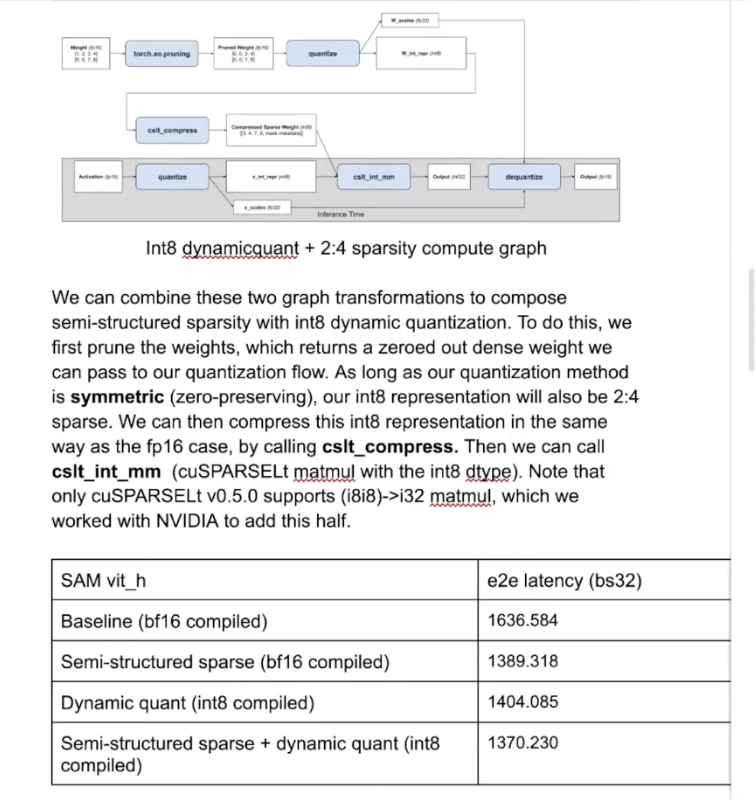

이 screenshot은 semi-structured sparsity와 int8 dynamic quantization 기술을 결합하는 방법을 설명하고 benchmark를 보여준다. 위 그림은 semi-structured sparsity와 int8 dynamic quantization을 결합한 computation graph를 보여주며, weight pruning, quantization, compression 같은 단계가 포함된다. 결합 방법은 다음과 같다.

- 먼저 weight를 prune해 sparse dense weight를 얻는다.
- pruning된 weight를 quantization flow로 넘긴다.
- symmetric(zero point 유지) quantization을 사용해 int8 표현이 여전히 2:4 sparsity를 유지하게 한다.
- fp16의 경우와 비슷하게 `cslt_compress`로 int8 표현을 compress한다.
- `cslt_int_mm`(cuSPARSELt의 int8 버전)으로 matrix multiplication을 수행한다.

> cuSPARSELt v0.5.0만 (i8i8)->i32 matrix multiplication을 지원한다. 이 기능은 NVIDIA와 협력해 개발되었다.

성능 비교 표는 SAM vit_h 모델이 서로 다른 optimization strategy에서 보이는 end-to-end latency(e2e latency)를 보여준다.

- baseline version(bf16 compile): 1636.584
- semi-structured sparse(bf16 compile): 1389.318
- dynamic quantization(int8 compile): 1404.085
- semi-structured sparse + dynamic quantization(int8 compile): 1370.230

여기서 Sparisty와 quantization을 함께 적용했을 때 latency 하락은 크지 않다. 주된 이유는 operator fusion 기술이 적용되지 않았기 때문이며, 현재 torch.compile이 이런 sparse mode의 operator fusion을 지원하지 않는 것으로 보인다.

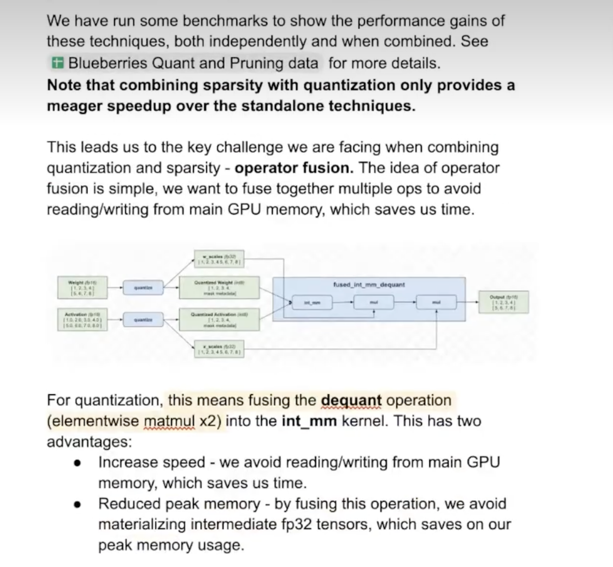

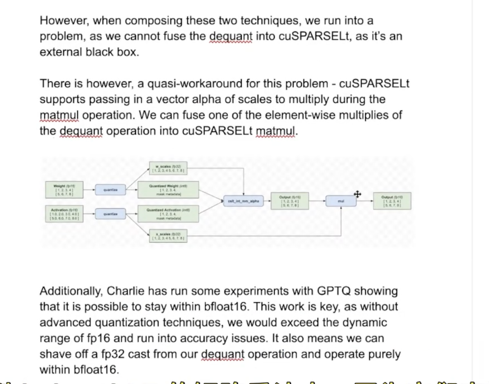

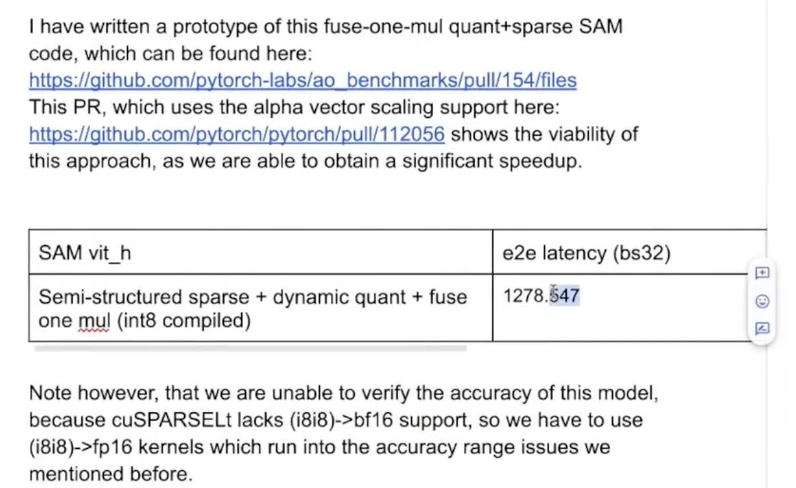

여기서는 sparsity와 quantization을 조합해서 쓰는 것보다 각각 단독으로 쓰는 편이 더 많은 가속을 얻을 수 있다고 언급한다. 핵심 과제는 여러 operation을 fuse해 GPU memory read/write를 줄이고 시간을 절약하는 것이다. quantization의 경우 이는 dequantization operation을 `int_mm` kernel 안으로 녹인다는 뜻이다. fusion을 통해 속도를 높일 수 있다. GPU memory access를 줄이고, 중간 fp32 tensor 생성을 피함으로써 peak memory usage도 줄인다. Sparse와 quantization을 조합할 때는 dequantization operation을 `cuSPARSELt` 안으로 녹일 수 없다. 그것이 외부 black box이기 때문이다. 한 가지 해결책은 `cuSPARSELt`가 matrix multiplication 때 scale vector를 넘기는 것을 지원한다는 점을 이용하는 것이다. dequantization operation의 element-wise multiplication 하나를 `cuSPARSELt` matrix multiplication 안에 녹일 수 있다.

Charlie의 GPTQ 실험은 bfloat16 범위 안에 머무를 수 있음을 보여준다. 이는 fp16 dynamic range와 precision 문제를 피한다. dequantization operation에서 fp32 변환을 제거하고 완전히 bfloat16 안에서 동작할 수 있다.

마지막으로 작성자는 단일 multiplication을 fuse한 quantization+sparse SAM 코드 prototype을 작성했다. GitHub 링크는 코드와 PR을 제공하며 이 방법의 가능성을 보여준다. 성능 결과에서는 SAM vit_h 모델이 semi-structured sparse + dynamic quantization + fused single multiplication(int8 compile)을 사용했을 때 end-to-end latency가 1278.547이었다.

> 제한: cuSPARSELt에 (i8i8)->bf16 지원이 없어서 모델 accuracy를 검증할 수 없다. (i8i8)->fp16 kernel을 사용해야 하며, 이는 앞서 언급한 precision range 문제를 유발한다.

이 절은 작성자가 현재 진행 중인 Sparsity + Quantization 혼합 사용 기술의 performance 문제를 다룬다.

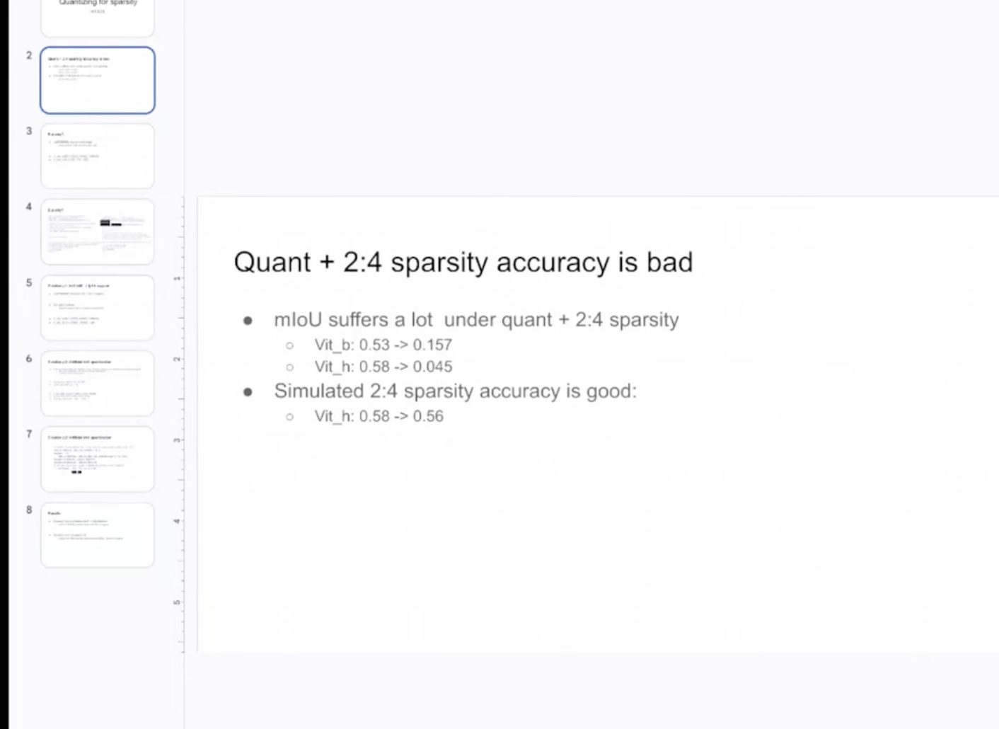

이 slides는 혼합 적용 후 accuracy가 급격히 떨어지는 것을 보여준다. 따라서 위에서 이야기한 여러 내용은 현재로서는 실제 적용이 어렵다. 우리가 실제 모델 추론을 할 때도 Sparse와 Quantization의 이런 혼합 적용을 선택하지는 않을 것이다. 작성자가 설명한 내용을 간단히 이해하는 정도면 충분하다. 최종 결론은 Sparisty와 Quantization을 결합하면 속도상 이점은 보일 수 있지만, accuracy 측면에서는 아직 매우 초기 실험 단계라는 것이다.

위 Current Work slides는 작성자 팀이 sparse training과 pruning algorithm 측면에서도 작업 중임을 보여주고, 모두가 이 오픈소스 작업에 참여하기를 환영한다고 말한다. 특히 pruning algorithm이 가장 핵심적인 지점이며, LLM 적용과 관계가 커 보인다.

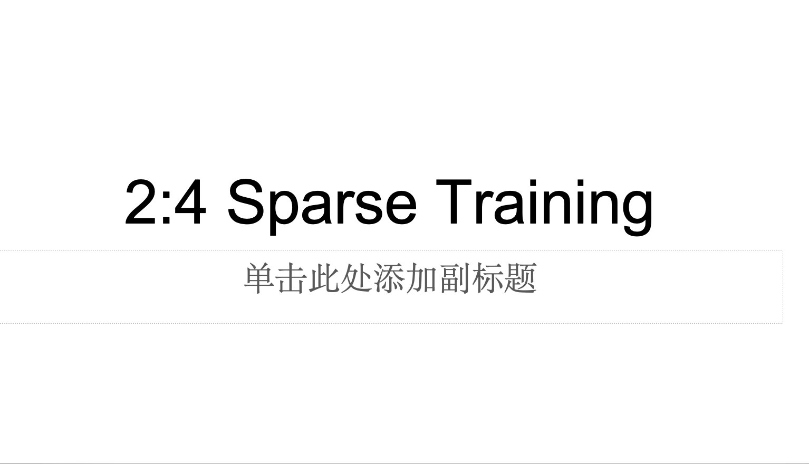

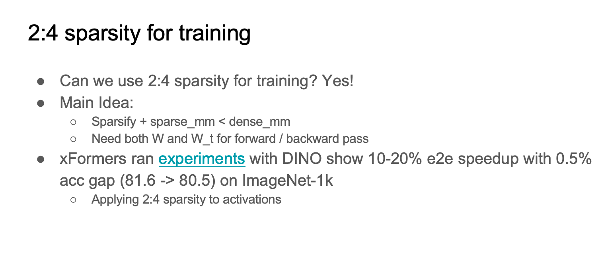

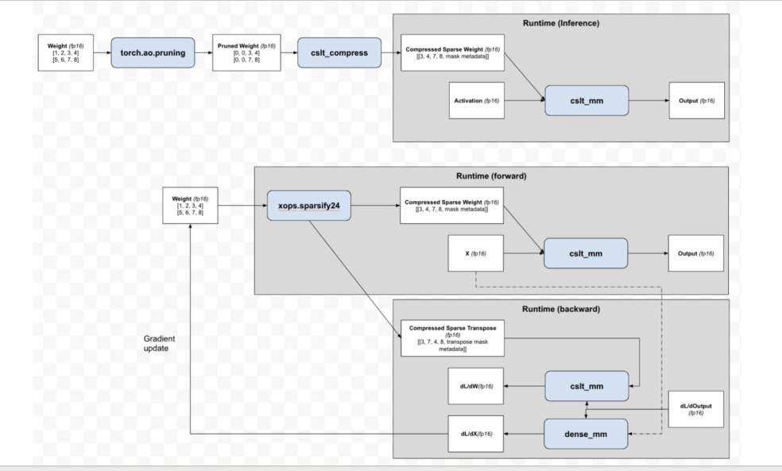

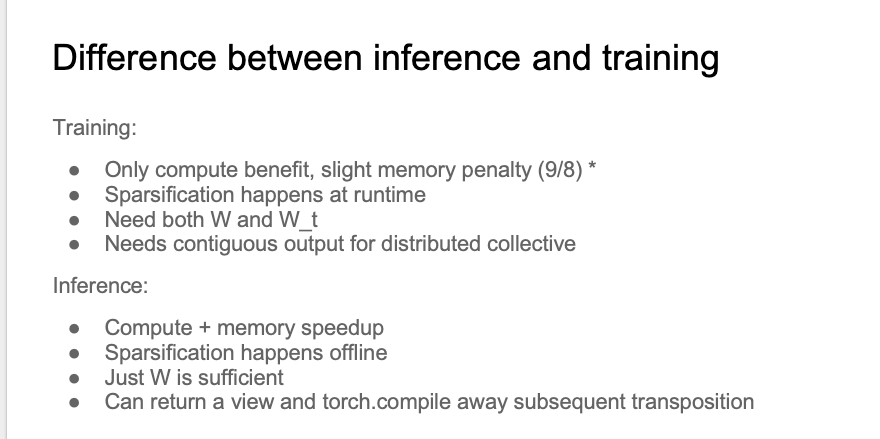

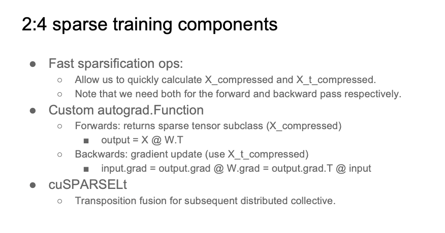

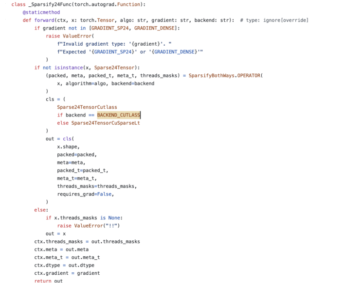

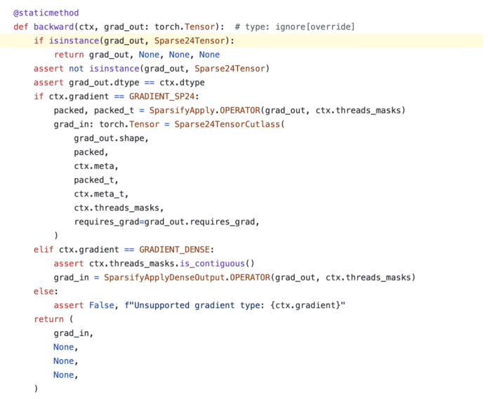

작성자는 Sparse Training을 더 깊이 설명하지 않고, xformers가 Semi-Structured (2:4) Sparsity Training을 지원했고 ImageNet에서 실험한 적이 있다고 간단히 언급했다. 이어 Sparse Training과 Inference의 주요 차이와 Sparse Training의 핵심 컴포넌트를 설명했다. 빠르게 계산되어야 하는 sparse operator, 입력 compression 수행, custom `torch.autograd.Function` 구현, cuSPARSELt가 transpose operation과 이후 distributed collective communication operator의 fusion을 지원해야 한다는 점이 포함된다.

### 정리

이 강의는 주로 작성자가 PyTorch 팀이 Sparsity 방향에서 해 온 작업을 소개한다. 초점은 Sparsity의 GPU 추론이다. Sparsity에 관심이 있고 실제 엔지니어링 적용 측면의 진전을 알고 싶다면 들어볼 만하다. 관심이 없다면 건너뛰어도 된다. 이 기술은 비교적 마이너하고, 현재 산업계의 추론 방안은 주로 quantization에 집중되어 있다.
