> 제 강의 노트입니다. 많은 관심 부탁드립니다: https://github.com/BBuf/how-to-optim-algorithm-in-cuda/tree/master/cuda-mode 

# 12강, Flash Attention

## 강의 노트

이번 강의의 발표자는 이전 [CUDA-MODE 강의 노트 4강: PMPP 책 4-5장 노트](https://mp.weixin.qq.com/s/P87c8LRJ1CEOOyaQw8L-cA) 의 발표자이기도 합니다. 4강 마지막에서는 행렬 곱셈의 Tiling 기법을 간단히 소개했고, Tiling의 대표적인 응용이 Flash Attention이라고도 언급했습니다. 그래서 이번 강의에서는 Flash Attention을 설명합니다.

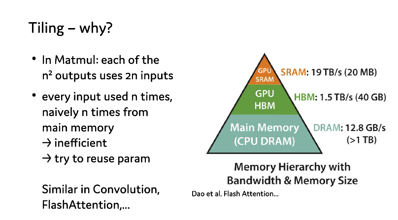

이 슬라이드는 특정 계산 연산에서 Tiling 기법을 사용하는 이유를 다루고, 메모리 계층 구조를 보여줍니다.
- Tiling을 사용하는 이유:
    - 행렬 곱셈(Matmul)에서는 각 출력이 2n개의 입력을 사용합니다(출력은 총 n^2개).
    - 각 입력은 n번 사용되므로, 매번 주 메모리에서 naive하게 n번 읽으면 매우 비효율적입니다.
    - 해결책: 파라미터를 재사용하려고 시도합니다(try to reuse param).
- 적용 시나리오:
    - 비슷한 상황은 Convolution과 FlashAttention 같은 연산에서도 나타납니다.
- 메모리 계층 구조(Memory Hierarchy)와 특징:
    - GPU SRAM(정적 랜덤 액세스 메모리): 대역폭 19 TB/s, 용량 20 MB
    - GPU HBM(고대역폭 메모리): 대역폭 1.5 TB/s, 용량 40 GB
    - Main Memory(주 메모리, CPU DRAM): 대역폭 12.8 GB/s, 용량 >1 TB
    - 위에서 아래로 갈수록 메모리 용량은 점차 커지지만, 접근 속도(대역폭)는 점차 낮아집니다.
    - 슬라이드에서는 이 메모리 계층 구조가 Dao 등의 Flash Attention 논문에서 왔다고 언급합니다.

요약하면, 여기서는 특정 계산 집약적 연산에서 Tiling 기법을 사용하는 것이 왜 중요한지 설명합니다. 데이터를 재사용하고 GPU SRAM처럼 더 빠른 메모리 계층을 활용하면 계산 효율을 크게 높일 수 있습니다. 또한 슬라이드의 메모리 계층 구조는 서로 다른 수준의 메모리 사이에 속도와 용량의 trade-off가 있음을 명확히 보여주며, 메모리 접근 패턴 최적화의 중요성을 다시 강조합니다.

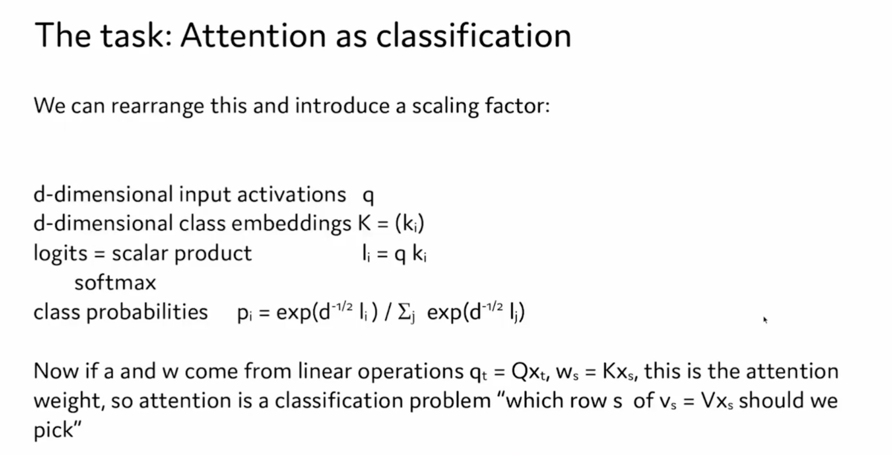

저자는 새로운 관점을 제시합니다. 즉 attention 메커니즘을 분류 문제로 보는 것입니다. 슬라이드의 자세한 설명은 다음과 같습니다.

1. 제목은 작업이 "attention을 분류로 보기"임을 나타냅니다.
2. 먼저 몇 가지 수학 기호와 공식을 소개합니다.
    - q: d차원 입력 activation
    - K = (ki): d차원 class embedding
    - logits (li): q와 ki의 스칼라 곱으로 계산
    - softmax 함수를 사용해 class 확률 pi 계산
3. class 확률 계산식은 다음과 같습니다.
    - pi = exp(d^(-1/2) li) / Σj exp(d^(-1/2) lj)
    - 여기에는 scaling factor d^(-1/2)가 도입됩니다.
4. 마지막으로 이 프레임워크를 attention 메커니즘에 적용하는 방법을 설명합니다.
    - q와 w가 선형 연산에서 나온다면: q_t = Qx_t, w_s = Kx_s
    - 그러면 attention weight를 분류 문제로 볼 수 있습니다.
    - 구체적으로는 "v_s = Vx_s의 어느 행 s를 선택해야 하는가"라는 문제가 됩니다.

> 슬라이드의 첫 번째 기호 q는 Q로 쓰는 것이 맞아 보입니다.

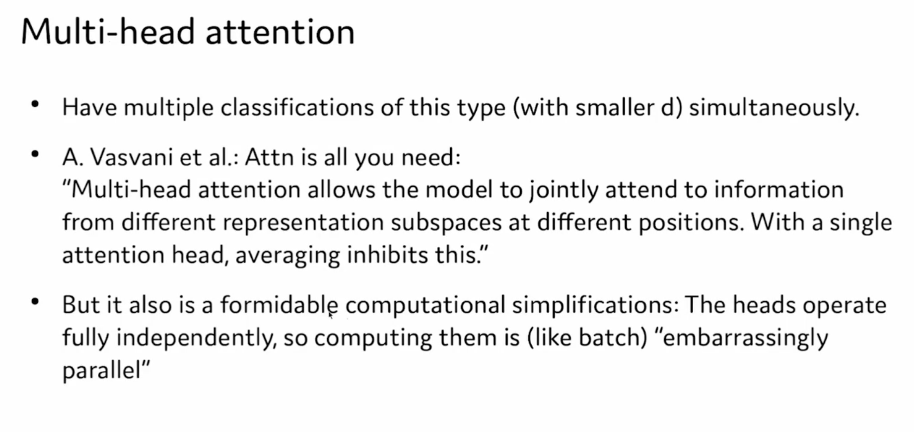

이 슬라이드는 Multi-head Attention을 설명하며, 주요 내용은 다음과 같습니다.
- Multi-head Attention은 여러 attention 분류 작업을 동시에 처리할 수 있고, 각 작업의 차원은 더 작습니다(d로 표시). 이는 모델이 여러 "head"에서 병렬로 계산할 수 있어, 서로 다른 attention head가 입력의 서로 다른 부분에 주목할 수 있음을 뜻합니다.
- Vaswani 등이 Transformer 논문 "Attention is All You Need"에서 설명한 내용을 인용합니다. Multi-head Attention은 모델이 입력의 서로 다른 위치에 동시에 주목하고, 서로 다른 표현 부분공간에서 정보를 얻을 수 있게 합니다. 단일 attention head만 사용하면 정보가 평균화되어 이런 능력이 억제될 수 있습니다.
- Multi-head Attention의 각 head는 완전히 독립적이므로, batch 연산처럼 병렬화할 수 있습니다. 이런 병렬성 덕분에 계산이 매우 효율적이고 복잡한 상호 의존성이 거의 없습니다.

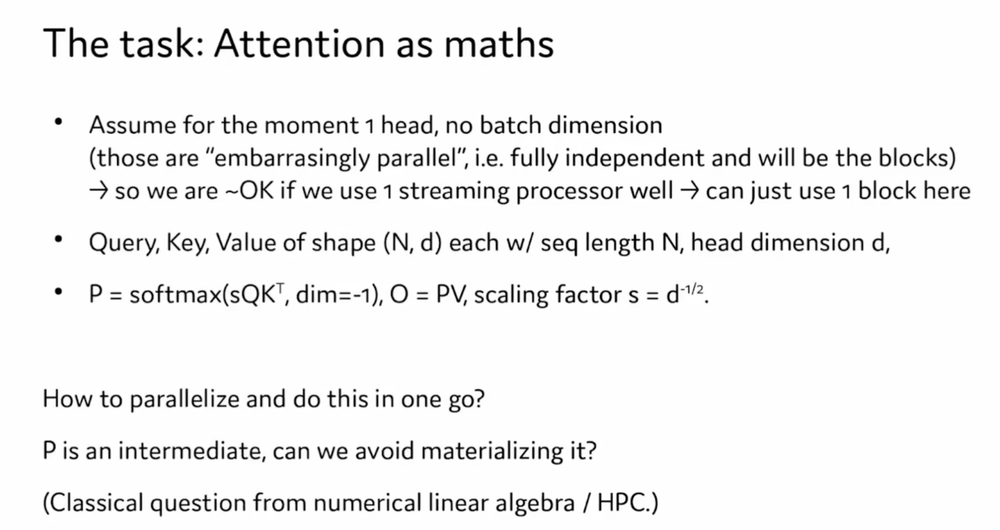

이 슬라이드는 attention 메커니즘의 수학적 표현과 계산에서 병렬화 최적화를 수행하는 방법을 다룹니다. 내용은 다음과 같습니다.
1. **가정**
    - 현재 attention head가 하나뿐이고(1 head), batch 차원이 없다고 가정합니다(no batch dimension). 이 경우 단일 attention head의 계산은 완전히 독립적입니다. 즉 "**embarrassingly parallel**"이므로 하나의 계산 block 안에서 독립적으로 처리할 수 있습니다.
    - 따라서 하나의 streaming processor를 효과적으로 활용하기만 하면 하나의 block만으로 이 계산을 완료할 수 있습니다.
2. **attention 메커니즘의 수학적 표현**:
    - **Query, Key, Value**(Q, K, V) 세 행렬의 shape은 (N, d)입니다. 여기서 N은 sequence length이고 d는 attention head의 차원입니다.
    - **attention matrix P의 계산식**:
        - P = softmax(s * QK^T). 여기서 s는 큰 차원으로 인한 수치 불안정성을 조정하는 scaling factor입니다.
    - **출력 O의 계산식**:
        - O = PV, 즉 attention weight P와 Value 행렬 V를 곱합니다.
3. **병렬화와 최적화 문제**:
    - 계산을 어떻게 병렬화하고 한 번의 연산으로 끝낼 수 있는가? fuse라는 질문을 제기합니다.
    - **P 행렬은 중간 결과**인데, 이를 명시적으로 저장하지 않을 수 있을까요? 이 부분은 numerical linear algebra와 HPC의 고전적인 문제와 관련됩니다.

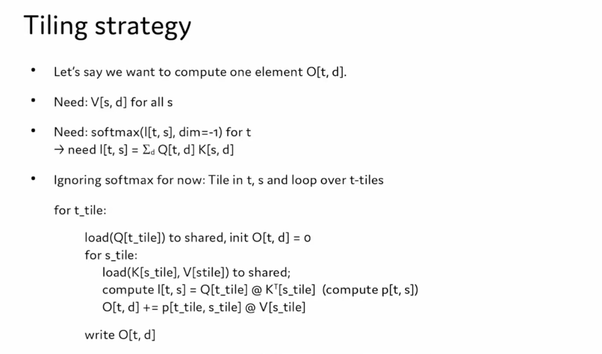

이 슬라이드부터 **Tiling Strategy**를 도입합니다. attention 메커니즘의 계산, 특히 행렬 곱셈을 계산할 때 Tiling을 통해 효율과 메모리 활용률을 높이는 전략입니다.

1. **목표**
    - 출력 행렬의 한 원소 $O[t, d]$를 계산해야 한다고 가정합니다. 여기서 $t$는 sequence 차원의 token이고, $d$는 hidden dimension입니다.
    - 이 원소를 계산하려면 다음이 필요합니다.
        - 모든 $s$에 대한 Value 행렬의 모든 행 $V[s, d]$.
        - Softmax weight $softmax(I[t, s])$. 여기서 $I[t, s]$는 Query와 Key의 곱으로 얻는 중간 결과입니다.
2. **중간 결과 계산**
    - Softmax weight $I[t, s]$를 계산하려면 행렬 곱셈 $I[t, s] = \sum_d{Q[t, d]K[s, d]}$가 필요합니다. 즉 Query와 Key의 dot product입니다.
3. **Softmax를 무시한 경우**
    - 잠시 Softmax 계산을 무시하고, 계산 중 Tiling 전략을 어떻게 사용하는지 논의합니다. 즉 시간 step $t$와 sequence $s$에서 tile을 나누고 t-tile에 대해 loop를 돕니다.
4. **Tiling 계산의 의사 코드**
    - 바깥 loop: t-tile에 대해 loop
        - Query 행렬의 t-tile을 shared memory에 로드하고 $O[t, d] = 0$으로 초기화합니다.
    - 안쪽 loop: s-tile에 대해 loop
        - Key 행렬의 s-tile과 Value 행렬의 s-tile을 shared memory에 로드합니다.
        - $I[t, s] = Q[t_{tile}]  K^T[s_{tile}]$를 계산해 Softmax 입력 항 $p[t_{tile}, s_{tile}]$를 얻습니다.
        - Softmax weight $p$를 사용해 출력 $O[t, d]$를 업데이트합니다. 즉 $O[t, d] += p[t_{tile}, s_{tile}] V[s_{tile}]$입니다.
    - 계산된 $O[t, d]$를 다시 씁니다.

> 제 생각에는 이 슬라이드가 명확하게 쓰이지 않았습니다. Tiling 관점에서 보면 여기서 계산하는 것은 t라는 token 하나의 attention 결과가 아니라, 실제로는 앞의 t개 token에 대한 attention 결과입니다. 아래 두 그림을 보면 이 Tiling 과정이 매우 명확하게 설명되어 있습니다. 출처: https://zhuanlan.zhihu.com/p/669926191 

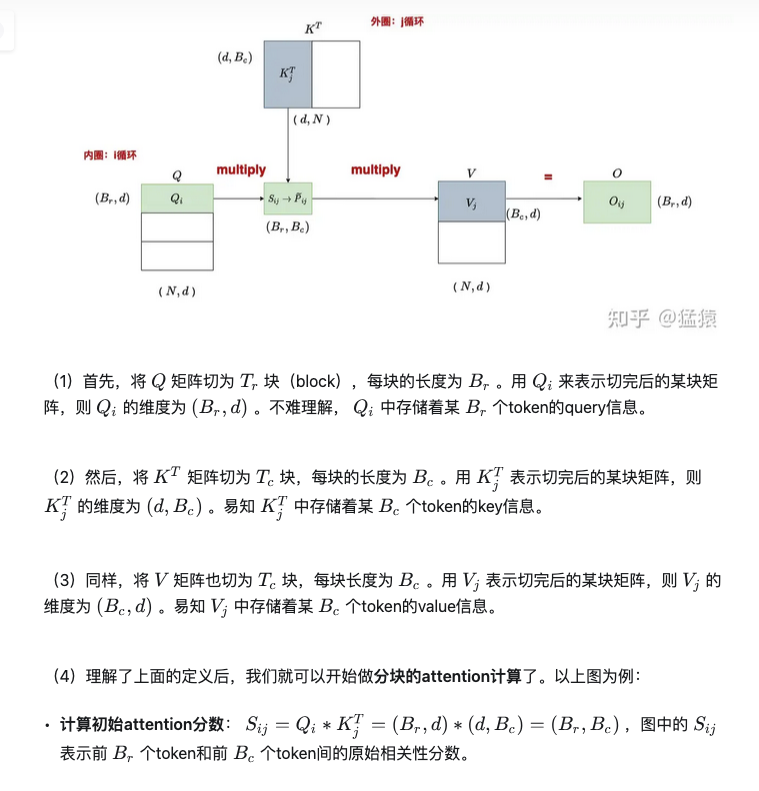

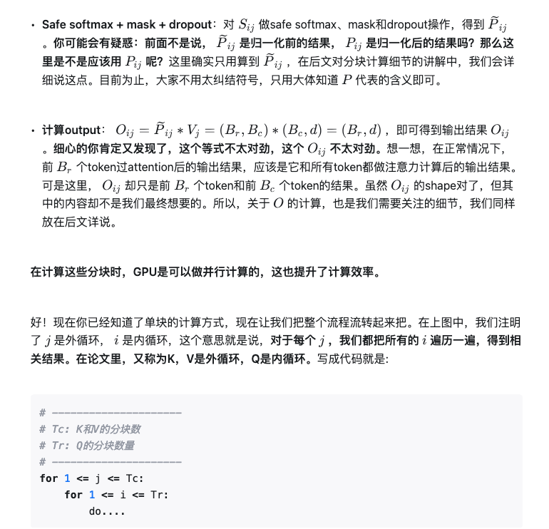


위에서 언급한 정규화 전후의 $P_{ij}$는 이 그림에서 설명됩니다.

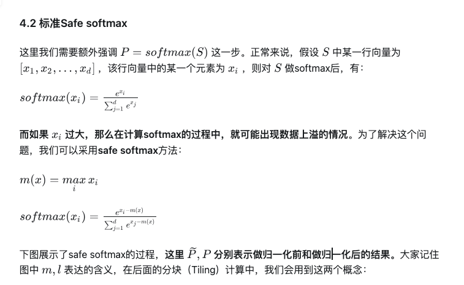

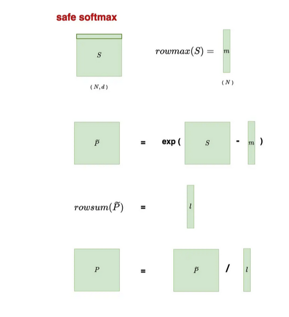

그다음 영상에서 나오는 슬라이드는 Safe Softmax를 설명하는데, 내용은 위의 두 그림에서 설명한 것과 같습니다.

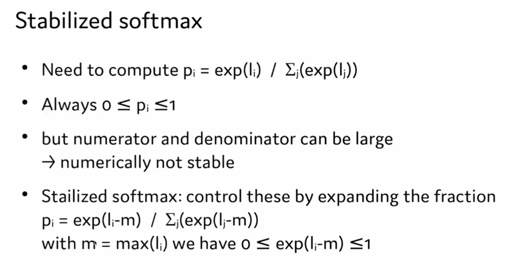

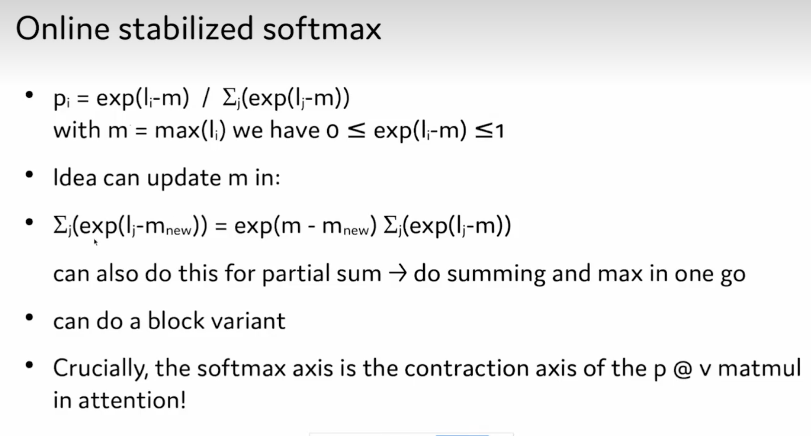

이 슬라이드는 Tiling을 해야 하므로 Online stabilized softmax를 사용해야 한다는 내용입니다. 이 부분은 저자의 설명이 다소 평범해서, https://zhuanlan.zhihu.com/p/669926191 의 설명 스크린샷으로 이 알고리즘을 설명하겠습니다.

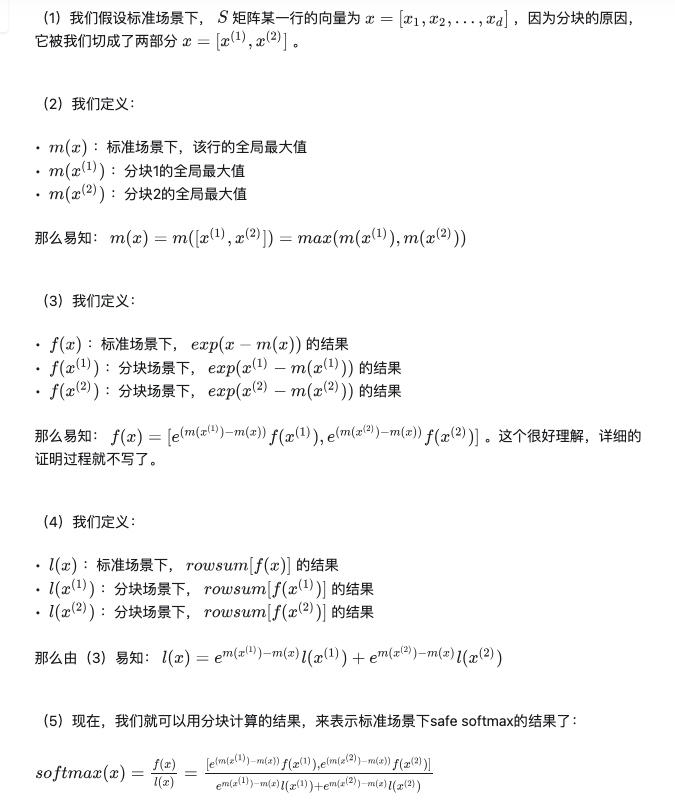

> 여기서 위 이미지의 []는 max 연산이라는 점에 주의해야 합니다. 저자 슬라이드의 m과 m_new는 위 설명에서 현재 Tiling 이전의 local maximum과 현재 Tiling의 maximum에 대응합니다.

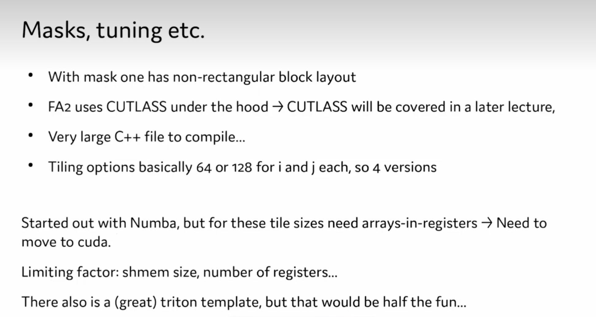

이 슬라이드는 구현과 최적화에 관련된 몇 가지 기술적 세부 사항을 다룹니다. 주요 내용은 다음과 같습니다.
- mask를 사용하면 비직사각형 block layout이 됩니다.
- Flash Attention v2는 저수준에서 CUTLASS 라이브러리를 사용하며, 이는 이후 강의에서 자세히 소개됩니다.
- Flash Attention v2에는 컴파일해야 하는 매우 큰 C++ 파일이 있습니다.
- Tiling 옵션은 기본적으로 i와 j에 대해 64 또는 128이고, 총 4가지 버전이 있습니다.
- 이 강의 저자는 처음에는 Numba로 구현을 시작했지만, 이런 tile size에서는 register 안의 array를 사용해야 하므로 CUDA 프로그래밍으로 옮겨야 했습니다.
- Flash Attention v2 구현의 제한 요인: shared memory(shmem) 크기와 register 수
- 기타: 좋은 Triton template이 하나 있지만, 그것을 사용하면 직접 구현하는 즐거움이 절반쯤 줄어들 수 있다고 언급합니다.

그래서 저자는 Flash Attention을 처음부터 구현하기로 선택했습니다.

이어서 저자는 Flash Attention Forward Pass에 따라 구현한 naive 코드를 보여줍니다. 이 코드를 보기 전에 https://zhuanlan.zhihu.com/p/669926191 글의 block-wise safe softmax 절을 읽어보는 것을 권합니다. 저자의 코드를 여기 옮겨 적습니다.

```python
import torch, math

N_inp = 64
N_out = 64
d = 128
Q = torch.randn(N_out, d)
K = torch.randn(N_inp, d)
V = torch.randn(N_inp, d)
O = torch.zeros(N_out, d)
L = torch.zeros(N_out, 1)

B_c = 16
B_r = 16
T_c = (N_inp + B_c - 1) // B_c
T_r = (N_out + B_r - 1) // B_r

scale_factor = 1 / math.sqrt(Q.size(-1))

# Q and O, L split into T_r; K, V in T_c blocks
for i in range(T_r):
    Q_i = Q[i * B_r: (i+1) * B_r]
    O_i = torch.zeros(B_r, d)
    L_i = torch.zeros(B_r, 1)
    m_i = torch.full((B_r, 1), -math.inf)
    last_m_i = m_i
    for j in range(T_c):
        K_j = K[j * B_c: (j + 1) * B_c]
        V_j = V[j * B_c: (j + 1) * B_c]
        S_i = scale_factor * (Q_i @ K_j.T)
        m_i = torch.maximum(m_i, S_i.max(dim=-1, keepdim=True).values)
        P_i = torch.exp(S_i - m_i)
        L_i = torch.exp(last_m_i - m_i) * L_i + P_i.sum(dim=-1, keepdim=True)
        O_i = torch.exp(last_m_i - m_i) * O_i + P_i @ V_j
        last_m_i = m_i
    O_i = (1.0 / L_i) * O_i
    L_i = m_i + torch.log(L_i)
    O[i * B_r: (i + 1) * B_r] = O_i
    L[i * B_r: (i + 1) * B_r] = L_i

expected = torch.nn.functional.scaled_dot_product_attention(Q[:, :], K[:, :], V[:, :])
print((O - expected).abs().max())
# tensor(1.1623e-06) 
```

저도 이전에 Flash Attention의 Forward Pass를 바탕으로 PyTorch에서 이 알고리즘을 재현해 본 적이 있습니다. 자세한 내용은 제 글 https://zhuanlan.zhihu.com/p/684557290 에서 볼 수 있습니다. 이 부분의 코드 설명은 별도의 "Flash Attention PyTorch naive 구현 설명 보충" 큰 절에 보충해 두어, 강의 노트의 흐름을 끊지 않도록 하겠습니다.

이어서 저자는 Numba로 Flash Attention을 구현한 예시를 보여주는데, 일반적으로 우리는 이를 사용하지 않으므로 넘어갑니다. 이후 이번 강의의 남은 내용은 아래 저자가 구현한 Flash Attention CUDA 코드를 보여주고 잡담하는 내용입니다. 일부를 옮기면 다음과 같습니다.

```python
cuda_src = r"""
constexpr int B_r = 16;
constexpr int B_c = 16;
constexpr int d = 128;
constexpr int o_per_thread_x = 1;
constexpr int o_per_thread_y = 128/32;

#define NEG_INFINITY __int_as_float(0xff800000)

extern "C" __global__
void silty_attn(float* out, float* out_l, float *K, float *V, float *Q, float scaling, int n, int T_r, int T_c) {
    int tid_x = threadIdx.x;
    int tid_y = threadIdx.y;
    __shared__ float Q_i[B_r][d];
    __shared__ float K_j[B_c][d];
    __shared__ float V_j[B_c][d];
    
    __shared__ float s_i[B_r][B_c];

    float l_i[o_per_thread_x];
    float m_i[o_per_thread_x];
    float o_i[o_per_thread_x][o_per_thread_y];

    for (int ii = 0; ii < T_r; ii++) {
        for (int i = 0; i < o_per_thread_x; i++) {
            for (int dd = 0; dd < o_per_thread_y; dd++) {
                o_i[i][dd] = 0.f;
            }
            l_i[i] = 0.f;
            m_i[i] = NEG_INFINITY;
        }

        for (int ii = tid_y; ii < B_r; ii += blockDim.y) {
            for (int dd = tid_x; dd < d; dd += blockDim.x) {
                Q_i[ii][dd] = Q[(ii + i * B_r) * d + dd];
            }
        }

        for (int jj = 0; jj < T_c; jj++) {
            for (int i = tid_y; i < B_c; i += blockDim.y) {
                for (int dd = tid_x; dd < d; dd += blockDim.x) {
                    K_j[i][dd] = K[(jj * B_c) * d + dd];
                    V_j[i][dd] = V[(jj * B_c) * d + dd];
                }
            }

            __syncthreads();

            // S_ij = scale_factor * Q_i @ K_j.T
            for (int ii = tid_y; ii < B_r; ii += blockDim.y) {
                for (int i = 0; i < o_per_thread_x; i++) {
                    float S_ij = 0.f;
                    for (int dd = 0; dd < d; dd++) {
                        S_ij += Q_i[ii][dd] * K_j[ii][dd];
                    }
                    s_i[ii][tid_x] = S_ij * scaling;
                }
            }

            __syncthreads();

            for (int ii = 0; ii < o_per_thread_x; ii++) {
                float m = m_i[ii];
                float l = l_i[ii];
                float last_m = m;

                for (int i = tid_y; i < B_c; i++) {
                    if (m < s_i[ii][tid_x]) {
                        m = s_i[ii][tid_x];
                    }
                }

                m_i[ii] = m;
                float l = exp(last_m - m) * l_i[ii];

                for (int dd = 0; dd < o_per_thread_y; dd++) {
                    o_i[ii][dd] *= exp(last_m - m);
                }

                for (int jj = 0; jj < o_per_thread_x; jj++) {
                    float S_ij = exp(s_i[ii][jj + blockDim.x * tid_x] - m);
                    l += S_ij;
                    for (int dd = 0; dd < o_per_thread_y; dd++) {
                        o_i[ii][dd] += S_ij * V_j[jj][dd + blockDim.y * tid_y];
                    }
                }
                l_i[ii] = l;
            }
        }

        for (int ii = 0; ii < o_per_thread_x; ii++) {
            for (int dd = 0; dd < o_per_thread_y; dd++) {
                out[(ii + blockDim.x * tid_x + i * B_r) * d + dd + blockDim.y * tid_y] = o_i[ii][dd] / l_i[ii];
            }
            out_l[ii + blockDim.x * tid_x + i * B_r] = 1 / l_i[ii];
        }
    }
}
"""

def fn():
    err = cuda.cuLaunchKernel(
        kernel,
        1,  # grid x dim
        1,  # grid y dim
        1,  # grid z dim
        32, # block x dim
        32, # block y dim
        1,  # block z dim
        0,  # dynamic shared memory
        torch.cuda.current_stream().stream_id, # stream
        args.data_ptr(), # kernel arguments
        0,  # extra (ignore)
    )
fn()

```

저자가 여기 구현한 kernel은 다소 이상해 보입니다. 특히 index를 섞어 쓰는 bug 때문에 이 kernel에는 correctness 문제가 있을 가능성이 큽니다. 또한 이 Kernel 안에서 각 thread가 구체적으로 어떤 계산을 맡는지 알아보기 어렵습니다. 그래서 뒤에 https://github.com/tspeterkim/flash-attention-minimal 의 Flash Attention 극소 CUDA 구현을 보여주는 절을 새로 추가했습니다. 이 구현은 매우 명확하고 이해하기 쉽습니다.

## Flash Attention PyTorch naive 구현 설명 보충

FlashAttention V1은 block-wise 계산 방법을 통해 Q, K, V를 여러 작은 block으로 나눈 뒤, 이 나뉜 작은 block들을 SRAM(shared memory)에 넣어 계산하고 마지막에 HBM에 다시 씁니다. 알고리즘 흐름은 다음과 같습니다.

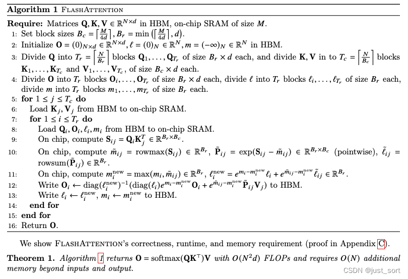

이 의사 코드의 앞뒤 맥락을 완전히 이해하고 싶다면 https://zhuanlan.zhihu.com/p/669926191 글을 추천합니다. 하지만 source 구현 관점에서는 이 의사 코드만 있어도 거의 충분합니다. 알아야 할 것은, 이 이상해 보이는 공식들이 block 단위로 순회할 때 매번 일부 token만 계산하기 때문에 생긴다는 점입니다. self-attention이 계산해야 하는 최종 결과는 모든 token 사이의 결과이므로, local에서 global로 갱신할 때 online softmax 알고리즘과 마지막 출력의 online update가 필요합니다. 이것이 위의 복잡한 공식들의 유래입니다.

여기서는 Python으로 이 알고리즘 흐름을 시뮬레이션해 보겠습니다. 구현해 두면 Triton 구현을 이해하는 데 도움이 됩니다. 앞의 몇 개 Triton 튜토리얼을 보면, 순수 Python 구현과 비교했을 때 Triton kernel은 block level kernel launch 과정만 더해진 것에 가깝기 때문입니다. 앞 절 GPT2 설정을 그대로 사용해 $N$과 $d$를 각각 1024와 64로 설정하면 Q, K, V의 shape은 모두 $(N, d)=(1024, 64)$입니다. FlashAttention에는 global S와 P가 없다는 점에 주의하세요. 하드웨어가 A100이라고 가정하면 A100의 Shared Memory 크기는 192KB=196608B이므로, 여기서 Flash Attention의 block size, 즉 위 의사 코드 첫 번째 줄을 계산할 수 있습니다.

$B_c=M/4/64=768$，$B_r=min(768, 64)=64$.

그다음 의사 코드 2번째 줄은 모두 0인 출력 행렬 $O$를 초기화합니다. shape 크기도 $(N, d)=(1024, 64)$입니다. 동시에 $l$과 $m$ 행렬을 초기화하며, 차원 크기는 모두 $(N)$입니다. 다만 $l$은 모두 0인 행렬로 초기화하고, $m$은 음의 무한대로 초기화합니다.

이어서 위 파라미터로 $T_r$과 $T_c$를 바로 계산할 수 있습니다. 이는 의사 코드 3번째 줄에 대응합니다. $T_r=ceil(N/B_r)=1024/64=16$, $T_c=ceil(N/B_c)=1024/768=2$입니다.

이후 의사 코드 해석은 아래 Python 구현 안에 직접 넣었습니다. 각 코드 줄은 위 의사 코드에 대응됩니다.

```python
import torch

N, d = 1024, 64  # N과 d 값 업데이트

Q_mat = torch.rand((N, d))
K_mat = torch.rand((N, d))
V_mat = torch.rand((N, d))

def standard_softmax_attention(Q, K, V):
    """
    표준 pytorch softmax와 attention 계산을 수행한다.
    """
    expected_softmax = torch.softmax(Q @ K.T, dim=1)
    expected_attention = expected_softmax @ V
    return expected_softmax, expected_attention

def flash_attention(Q, K, V, B_r=64, B_c=768):
    """
    block-wise 계산과 online softmax correction을 사용해 flash attention 알고리즘을 수행한다.
    """
    O = torch.zeros((N, d))  # 출력 행렬 초기화, 의사 코드 2번째 줄에 대응
    l = torch.zeros((N, 1))  # softmax 분모 저장, 의사 코드 2번째 줄에 대응
    m = torch.full((N, 1), -torch.inf)  # 각 block의 maximum 저장, 의사 코드 2번째 줄에 대응

    # 의사 코드 5번째 줄에 대응. for 1<=j<=T_c. 여기서는 K, V를 T_c=[N/B_c] block으로 나누며,
    # 각 block의 크기는 [B_c, d]이다.
    # 그래서 python 구현에서는 step size가 B_c인 loop로 직접 처리한다.
    for j in range(0, N, B_c):
        # 아래 세 줄은 의사 코드 6번째 줄 Load Kj, Vj from HBM to on-chip SRAM에 대응한다.
        # 하지만 여기서는 순수 python 구현이므로 실제로 이 메모리 block을 HBM에서 SRAM으로 옮길 수는 없다.
        # 여기서는 의사 코드의 논리 설명일 뿐이고, Triton에서는 정말 Python 레벨에서 할 수 있다고 생각하면 된다.
        j_end = j + B_c
        Kj = K[j:j_end, :]
        Vj = V[j:j_end, :]

        # 의사 코드 7번째 줄에 대응. for 1<=i<T_r. 여기서는 Q를 Tr=[N/B_r] block으로 나누며,
        # 각 block의 크기는 [B_r, d]이다.
        # 그래서 python 구현에서는 step size가 B_r인 loop로 직접 처리한다.
        for i in range(0, N, B_r):
            i_end = i + B_r
            mi = m[i:i_end, :]
            li = l[i:i_end, :]
            Oi = O[i:i_end, :]
            Qi = Q[i:i_end, :]

            # 의사 코드 9번째 줄에 대응: on chip에서 Sij 계산, Sij의 shape은 [B_r, B_c]
            Sij = Qi @ Kj.T
            # 의사 코드 10번째 줄에 대응
            mij_hat = torch.max(Sij, dim=1).values[:, None]
            pij_hat = torch.exp(Sij - mij_hat)
            lij_hat = torch.sum(pij_hat, dim=1)[:, None]

            # 의사 코드 11번째 줄에서 mi_new를 구하는 연산에 대응한다. 여기서는 두 tensor 전체에 대해 max를 구해야 하므로 stack 연산을 사용한다.
            mi_new = torch.max(torch.column_stack([mi, mij_hat]), dim=1).values[:, None]
            # 의사 코드 11번째 줄에서 li_new를 구하는 연산에 대응
            li_new = torch.exp(mi - mi_new) * li + torch.exp(mij_hat - mi_new) * lij_hat
            # 의사 코드 12번째 줄에 대응해 O_i를 업데이트한다. 여기서 한 가지 의문이 생기기 쉽다. 의사 코드에는 diag 연산이 있는데 왜 아래 구현에서는 생략했는가?
            # 이 diag는 vector에 작용하며, 실제로는 의사 코드에서 차원을 맞추기 위한 것이다. PyTorch 구현은 tensor broadcasting을 자동으로
            # 지원하므로 여기서는 바로 계산할 수 있다.
            O_i = (li * torch.exp(mi - mi_new) * Oi / li_new) + (torch.exp(mij_hat - mi_new) * pij_hat / li_new) @ Vj

            # 의사 코드 13번째 줄에 대응해 m_i, l_i, O_i를 업데이트한다.
            m[i:i_end, :] = mi_new
            l[i:i_end, :] = li_new
            O[i:i_end, :] = O_i

    return O

# flash attention 계산 수행
flash_attention_output = flash_attention(Q_mat, K_mat, V_mat)

# 표준 pytorch softmax와 attention 계산 수행
expected_softmax, expected_attention = standard_softmax_attention(Q_mat, K_mat, V_mat)

# flash attention 계산 결과가 표준 계산 결과와 가까운지 assertion
assert torch.allclose(flash_attention_output, expected_attention), "error in flash attention calculation"
```

위 Attention Forward Pass 흐름에서는 Dropout과 Mask 연산을 고려하지 않았다는 점을 설명해야 합니다. 이 두 연산을 고려하면 전체 흐름에 약간의 변화가 있으며, 구체적으로는 Flash Attention V1 paper의 Algorithm2에 나와 있습니다.

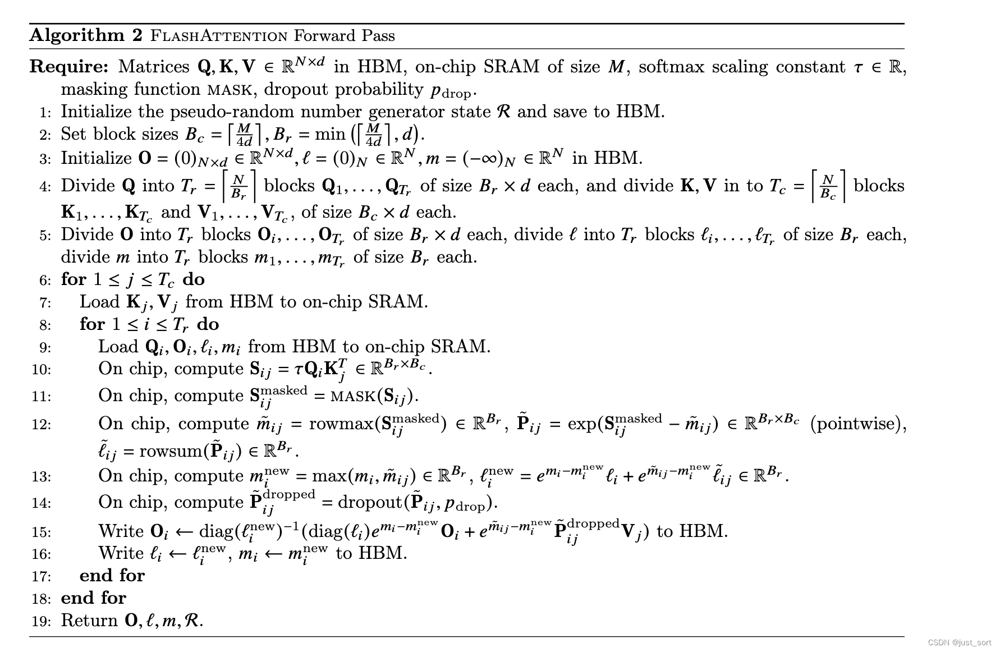

Algorithm1과 비교하면 Mask와 Dropout 연산이 추가되었고, 나머지는 변하지 않습니다.


## Mini Flash Attention CUDA 코드 해설

이 강의 저자가 구현한 Flash Attention CUDA kernel은 다소 이상합니다. 여기서는 매우 단순하고 명확한 Flash Attention 오픈소스 CUDA 구현인 https://github.com/tspeterkim/flash-attention-minimal 을 추천합니다.

```python
#include <torch/types.h>
#include <cuda.h>
#include <cuda_runtime.h>

__global__
void forward_kernel(const float* Q, const float* K, const float* V, const int N, const int d,
                    const int Tc, const int Tr, const int Bc, const int Br, const float softmax_scale,
                    float* l, float *m, float* O) {
    // 현재 thread의 block 내부 index 가져오기
    int tx = threadIdx.x;
    // 현재 block의 grid 내부 index 가져오기(batch와 head index)
    int bx = blockIdx.x; int by = blockIdx.y;  // batch and head index

    // Q,K,V,O,l,m의 global memory offset 계산 - batch와 head마다 다름
    int qkv_offset = (bx * gridDim.y * N * d) + (by * N * d);  // gridDim.y = nh
    int lm_offset = (bx * gridDim.y * N) + (by * N);  // l과 m의 offset

    // shared memory 안에 Q,K,V,S 공간 정의
    extern __shared__ float sram[];
    int tile_size = Bc * d;  // Qi, Kj, Vj의 크기
    float* Qi = sram;
    float* Kj = &sram[tile_size];
    float* Vj = &sram[tile_size * 2];
    float* S = &sram[tile_size * 3];

    // outer loop: 모든 K와 V block 순회
    for (int j = 0; j < Tc; j++) {

        // Kj, Vj를 shared memory로 로드
        for (int x = 0; x < d; x++) {
            // Bc개 thread, 각 thread가 K의 한 행을 담당한다. transpose 후에는 이 행렬이 column-major라는 점에 주의
            Kj[(tx * d) + x] = K[qkv_offset + (tile_size * j) + (tx * d) + x];
            // tx*d: Kj 안에서 현재 thread의 시작 위치
            // x: 현재 thread가 담당하는 행 안의 offset
            // qkv_offset: 현재 batch와 head의 시작 위치
            // tile_size * j: 현재 K block의 시작 위치
            // (tx * d) + x: 현재 K block 내부의 구체적 위치

            // Bc개 thread, 각 thread가 V의 한 행을 담당한다. 이 행렬은 row-major라는 점에 주의
            Vj[(tx * d) + x] = V[qkv_offset + (tile_size * j) + (tx * d) + x];
            // tx*d: Vj 안에서 현재 thread의 시작 위치
            // x: 현재 thread가 담당하는 행 안의 offset
            // qkv_offset: 현재 batch와 head의 시작 위치
            // tile_size * j: 현재 V block의 시작 위치
            // (tx * d) + x: 현재 V block 내부의 구체적 위치
        }
        __syncthreads();  // inner loop가 올바른 Kj, Vj를 사용하도록 보장

        // inner loop: 모든 Q block 순회
        for (int i = 0; i < Tr; i++)  {

            // Qi를 shared memory로 로드하고, l과 m을 register로 로드
            for (int x = 0; x < d; x++) {
                Qi[(tx * d) + x] = Q[qkv_offset + (tile_size * i) + (tx * d) + x];
                // tx*d: Qi 안에서 현재 thread의 시작 위치
                // x: 현재 thread가 담당하는 행 안의 offset
                // qkv_offset: 현재 batch와 head의 시작 위치
                // tile_size * i: 현재 Q block의 시작 위치
                // (tx * d) + x: 현재 Q block 내부의 구체적 위치
            }

            float row_m_prev = m[lm_offset + (Br * i) + tx];
            // lm_offset: 현재 batch와 head의 m 시작 위치
            // Br * i: 현재 Q block의 시작 행
            // tx: 현재 thread에 대응하는 행

            float row_l_prev = l[lm_offset + (Br * i) + tx];
            // lm_offset: 현재 batch와 head의 l 시작 위치
            // Br * i: 현재 Q block의 시작 행
            // tx: 현재 thread에 대응하는 행

            // S = QK^T를 계산하고 각 행의 maximum row_m을 찾는다
            float row_m = -INFINITY;
            for (int y = 0; y < Bc; y++) {
                float sum = 0;
                for (int x = 0; x < d; x++) {
                    sum += Qi[(tx * d) + x] * Kj[(y * d) + x];
                    // Qi[(tx * d) + x]: 현재 Q 행의 x번째 원소
                    // Kj[(y * d) + x]: 현재 K 행의 x번째 원소
                }
                sum *= softmax_scale;
                S[(Bc * tx) + y] = sum;
                // Bc * tx: S 안에서 현재 thread의 시작 위치
                // y: 현재 열의 offset

                if (sum > row_m)
                    row_m = sum;
            }

            // P = exp(S - row_m)을 계산하고 각 행의 합 row_l을 구한다
            float row_l = 0;
            for (int y = 0; y < Bc; y++) {
                S[(Bc * tx) + y] = __expf(S[(Bc * tx) + y] - row_m);
                // Bc * tx: S 안에서 현재 thread의 시작 위치
                // y: 현재 열의 offset
                row_l += S[(Bc * tx) + y];
            }

            // 새로운 m과 l 계산
            float row_m_new = max(row_m_prev, row_m);
            float row_l_new = (__expf(row_m_prev - row_m_new) * row_l_prev) + (__expf(row_m - row_m_new) * row_l);

            // O를 계산해 쓰고 l과 m 업데이트
            for (int x = 0; x < d; x++) {
                float pv = 0;  // Pij * Vj
                for (int y = 0; y < Bc; y++) {
                    pv += S[(Bc * tx) + y] * Vj[(y * d) + x];
                    // S[(Bc * tx) + y]: 현재 S 행의 y번째 원소
                    // Vj[(y * d) + x]: 현재 V 행의 x번째 원소
                }
                O[qkv_offset + (tile_size * i) + (tx * d) + x] = (1 / row_l_new) \
                    * ((row_l_prev * __expf(row_m_prev - row_m_new) * O[qkv_offset + (tile_size * i) + (tx * d) + x]) \
                    + (__expf(row_m - row_m_new) * pv));
                // qkv_offset: 현재 batch와 head의 O 시작 위치
                // tile_size * i: 현재 O block의 시작 위치
                // (tx * d) + x: 현재 O block 내부의 구체적 위치
            }
            m[lm_offset + (Br * i) + tx] = row_m_new;
            // lm_offset: 현재 batch와 head의 m 시작 위치
            // Br * i: 현재 Q block의 시작 행
            // tx: 현재 thread에 대응하는 행
            l[lm_offset + (Br * i) + tx] = row_l_new;
            // lm_offset: 현재 batch와 head의 l 시작 위치
            // Br * i: 현재 Q block의 시작 행
            // tx: 현재 thread에 대응하는 행
        }
        __syncthreads();  // thread가 inner loop에서 잘못된 Kj, Vj를 사용하지 않도록 방지
    }
}

torch::Tensor forward(torch::Tensor Q, torch::Tensor K, torch::Tensor V) {
    // TODO: Bc, Br을 동적으로 결정
    const int Bc = 32; const int Br = 32;

    // 입력 tensor의 차원 가져오기
    const int B = Q.size(0); const int nh = Q.size(1);
    const int N = Q.size(2); const int d = Q.size(3);

    // block 수 계산
    const int Tc = ceil((float) N / Bc); const int Tr = ceil((float) N / Br);
    const float softmax_scale = 1.0 / sqrt(d);

    // GPU memory에서 O, l, m 초기화
    auto O = torch::zeros_like(Q);
    auto l = torch::zeros({B, nh, N});
    auto m = torch::full({B, nh, N}, -INFINITY);
    torch::Device device(torch::kCUDA);
    l = l.to(device); m = m.to(device);

    // 각 block에 필요한 shared memory 크기 계산
    const int sram_size = (3 * Bc * d * sizeof(float)) + (Bc * Br * sizeof(float));
    int max_sram_size;
    cudaDeviceGetAttribute(&max_sram_size, cudaDevAttrMaxSharedMemoryPerBlock, 0);
    printf("Max shared memory: %d, requested shared memory: %d \n", max_sram_size, sram_size);

    // grid와 block 차원 설정
    dim3 grid_dim(B, nh);  // batch_size x num_heads
    dim3 block_dim(Bc);  // block마다 Bc개 thread

    // kernel launch
    forward_kernel<<<grid_dim, block_dim, sram_size>>>(
        Q.data_ptr<float>(), K.data_ptr<float>(), V.data_ptr<float>(),
        N, d, Tc, Tr, Bc, Br, softmax_scale,
        l.data_ptr<float>(), m.data_ptr<float>(), O.data_ptr<float>()
    );
    return O;
}
```

이 코드는 잘 작성되어 있으며, Flash Attention Forward Pass의 흐름을 거의 그대로 복원합니다. 또한 shm과 register의 사용도 이번 강의 저자가 설명한 내용과 일치합니다.

이 kernel은 Batch와 Num-heads 방향으로 병렬화합니다. `dim3 grid_dim(B, nh);` 입니다. 그리고 각 Block은 하나의 Batch에 속한 하나의 Head의 Attention 계산을 처리합니다. 각 block은 Bc=Br=32개의 thread를 띄우므로, 각 thread가 S:(Br, Bc)의 한 행 계산을 담당합니다(Tc와 Tr의 for loop가 2개 있으므로 각 thread는 실제로 총 Tc * Tr개의 S를 담당합니다). 각 thread가 접근하는 Qi 대응 행의 시작 주소는 tx*d이고, 여기서 tx는 threadIdx.x, d는 각 attention head의 크기입니다.

## 정리

이번 강의는 사실 내용이 많지는 않습니다. 대부분의 시간은 저자의 잡담이지만, 수십 분 안에 Flash Attention의 원리와 코드 구현을 설명할 수 있는 사람도 많지 않은 것은 사실입니다. Flash Attention을 깊이 이해하고 싶은 분은 제가 https://github.com/BBuf/how-to-optim-algorithm-in-cuda 에 모아 둔 Flash Attention 해설 자료를 참고하고, 직접 PyTorch나 CUDA/Triton 버전 코드를 구현해 보면 좋겠습니다.
