> 내 강의 노트다. 관심 있으면 이 저장소도 봐 달라: https://github.com/BBuf/how-to-optim-algorithm-in-cuda/tree/master/cuda-mode

# Lecture 13, Ring Attention

## 강의 노트

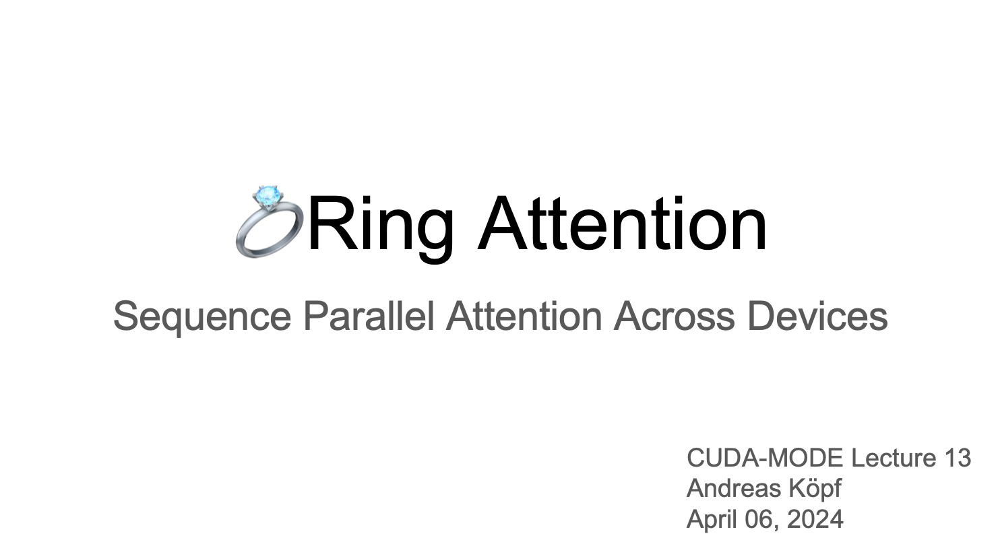

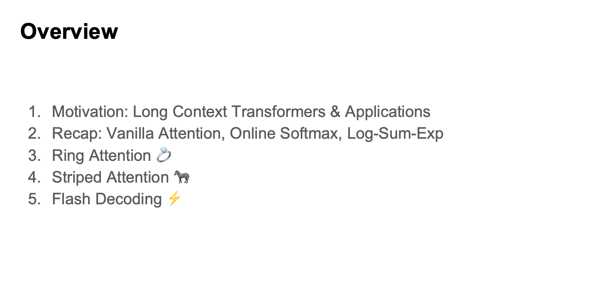

Overview 부분은 long-context Transformer model과 관련 application의 몇 가지 topic을 소개한다. 구체적인 내용은 다음과 같다.

- Motivation: long-context Transformer model과 application
- Review: ordinary attention mechanism, online Softmax, log-sum-exp computation
- Ring Attention
- Striped Attention
- Flash Decoding

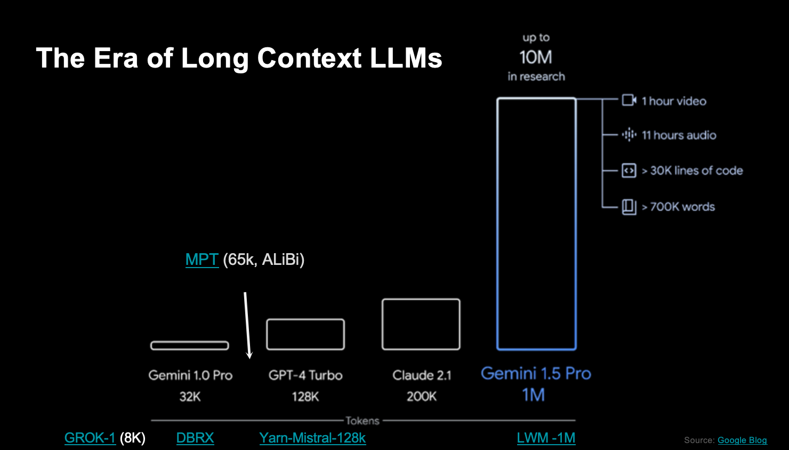

이 slides는 현재 popular LLM의 context length가 점점 길어지고 있음을 보여준다. 특히 Gemini 1.5 Pro는 context length를 1M까지 확장했다.

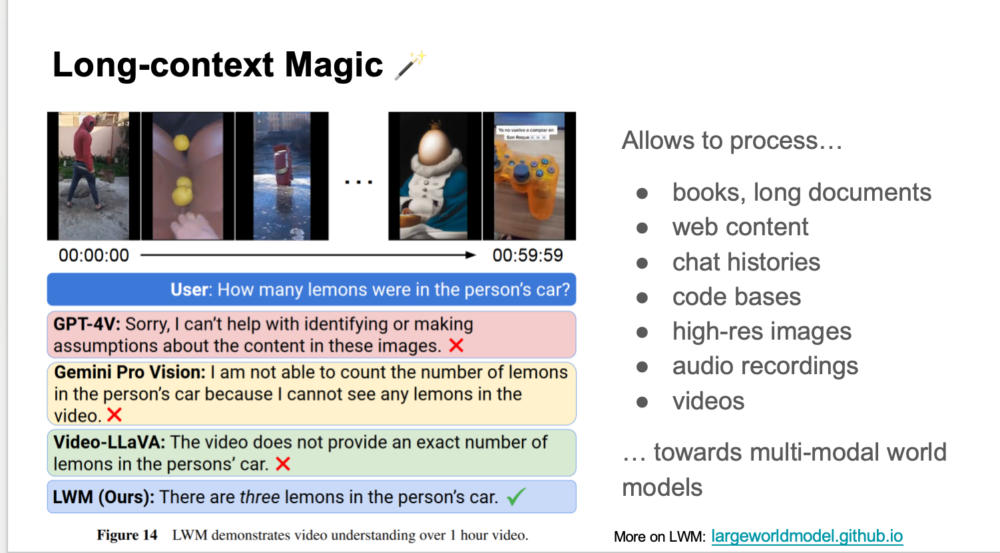

이 Slides는 long-context model(Long-context Magic)의 capability와 application을 소개한다. 주요 내용은 다음과 같다.

- 왼쪽에는 00:00:00부터 00:59:59까지의 video timeline이 있으며, model이 1시간 길이의 video content를 처리할 수 있음을 보여준다.
- 가운데에는 QA example이 있다.
  - user question: "사람의 차 안에는 lemon이 몇 개 있는가?"
  - GPT-4V, Gemini Pro Vision, Video-LLaVA 같은 여러 AI model은 모두 정확히 답하지 못한다.
  - LWM(Large World Model, author model)은 "차 안에는 lemon이 세 개 있다."고 정확히 답한다.
- 오른쪽에는 long-context model이 처리할 수 있는 content type이 나열되어 있다.
  - books
  - long documents
  - web content
  - chat history
  - codebase
  - high-resolution images
  - audio records
  - video
- Slides 아래쪽은 이런 capability가 multimodal world model로 향하고 있음을 강조하고, LWM에 관한 추가 link를 제공한다.

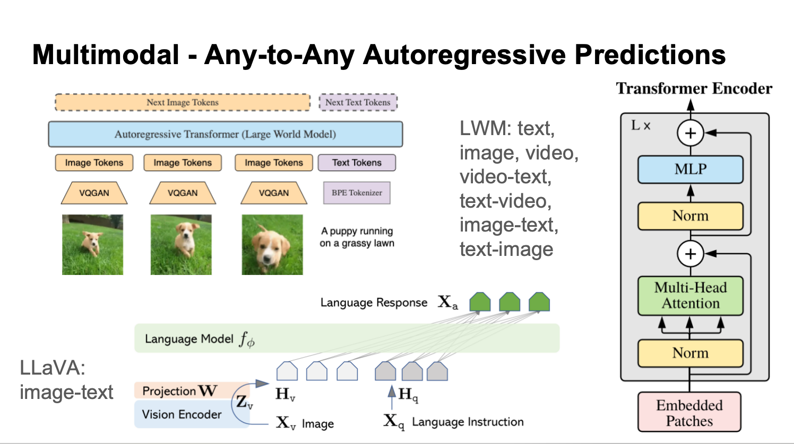

이 Slides는 multimodal any-to-any autoregressive prediction model을 소개하며, 주로 LWM(Large World Model)과 LLaVA 두 model을 비교한다. 주요 내용은 다음과 같다.

- title은 **multimodal** any-to-any autoregressive prediction 특성을 강조한다.
- LWM(Large World Model) 부분:
  - autoregressive Transformer structure를 사용한다.
  - text, image, video 등 여러 modality를 처리할 수 있다.
  - input에는 image tokens(VQGAN encoding 사용)와 text tokens(BPE tokenizer 사용)이 포함된다.
  - text-to-image, image-to-text 등 여러 modality 간 변환을 수행할 수 있다.
- LLaVA model 부분:
  - 주로 image-to-text task에 사용된다.
  - vision encoder로 image input을 처리한다.
  - language model로 text input과 generated output을 처리한다.
- Transformer encoder structure:
  - 오른쪽은 Transformer encoder의 detailed structure를 보여준다.
  - multi-head attention, normalization layer, MLP 같은 component를 포함한다.
  - 아래에는 input으로 쓰이는 Embedded Patches block이 있다.
- example input:
  - grass lawn에서 뛰는 puppy image 세 장을 보여준다.
  - text description은 "A puppy running on a grassy lawn"이다.

여기서는 multimodal overview를 하는데, 핵심은 multimodal을 지원하려면 model이 very long context를 처리할 수 있어야 한다는 점이다. 따라서 model은 Ring Attention 또는 유사한 long-context training technique을 사용해야 한다.

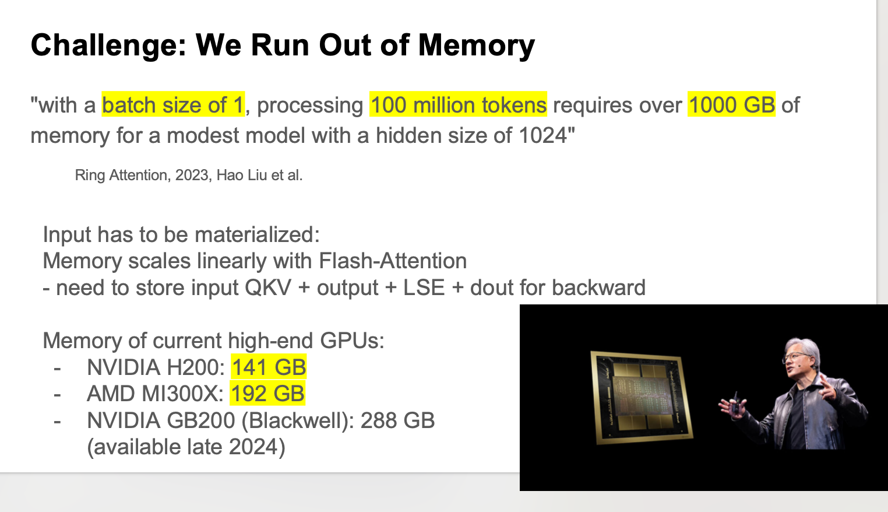

- 이 Slides는 large-scale language model을 처리할 때 마주치는 memory challenge를 논의한다. 주요 내용은 다음과 같다.
  - title: "Challenge: we are out of memory"
  - Ring Attention(2023, Hao Liu et al.)에서 인용:
    - "hidden layer size가 1024인 simple model에서 batch size 1로 100M tokens를 처리하려면 1000GB가 넘는 memory가 필요하다."
- memory challenge의 원인:
  - input이 materialized되어야 한다.
  - Flash-Attention을 사용할 때 memory requirement는 input length에 대해 linear하게 증가한다.
  - input QKV(query, key, value), output, LSE(log-sum-exp), backward를 위한 dout을 저장해야 한다.
- 현재 high-end GPU의 memory capacity:
  - NVIDIA H200: 141 GB
  - AMD MI300X: 192 GB
  - NVIDIA GB200(Blackwell): 288 GB, 2024년 말 출시 예정

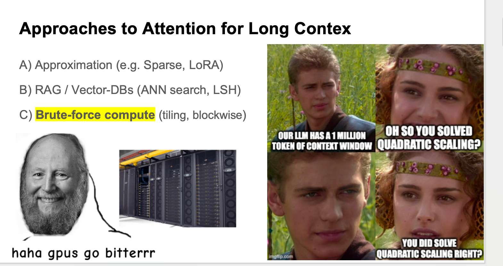

이 Slides는 long context를 처리할 때의 attention method를 논의하며, 관련 challenge를 humor 있게 보여준다. 주요 내용은 다음과 같다.

title: **Attention methods for long context**

세 가지 주요 method를 나열한다.
1. approximation method, 예: Sparse attention, LoRA
2. RAG / vector database, ANN search, LSH 사용
3. brute-force computation, 예: tiling, blockwise method

image와 meme:
- 왼쪽 아래:
  - 웃는 얼굴 image, 아마 어떤 computer scientist일 수 있다.
  - 옆에는 server rack image가 있다.
  - caption: "haha GPUs go bitterrr"
  - 암시: brute-force computation method는 GPU 부담을 크게 만든다.
- 오른쪽: 4-panel meme
  1. "우리 LLM에는 100만 token context window가 있다."
  2. "오, 그러면 quadratic scaling problem을 해결한 거야?"
  3. 남자아이의 confused expression
  4. "진짜 quadratic scaling problem을 해결한 거지?"

이 meme은 어떤 model이 very long context를 처리한다고 주장하더라도, context length에 따라 computation complexity가 quadratic하게 증가하는 문제를 실제로 해결하지 않았을 수 있음을 humorous하게 지적한다.

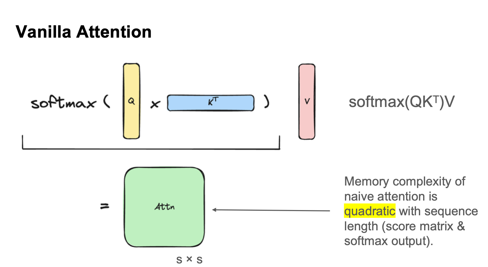

이 Slides는 "Vanilla Attention"의 basic concept과 memory complexity problem을 소개한다. 주요 내용은 다음과 같다.
- title: Vanilla Attention
- attention mechanism의 mathematical expression:
  - 왼쪽은 graphical expression: softmax(Q x K^T) x V
  - 오른쪽은 corresponding mathematical notation: softmax(QK^T)V
- attention matrix(Attn)의 representation:
  - green box 하나로 표시되며 size는 s x s다.
  - s는 sequence length를 뜻한다.
- memory complexity 설명:
  - 원문: "Memory complexity of naive attention is quadratic with sequence length (score matrix & softmax output)."
  - translation: naive attention mechanism의 memory complexity는 sequence length에 대해 quadratic하다(score matrix와 softmax output).

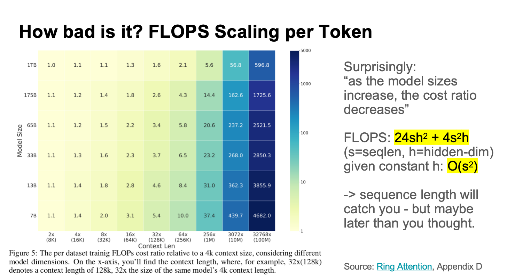

이 Slides는 model size와 context length가 token당 FLOPS scaling에 미치는 영향을 논의한다. 주요 내용은 다음과 같다.
- title: 상황이 얼마나 나쁜가? token당 FLOPS scaling
- heatmap:
  - x-axis: context length, 2x부터 32768x까지
  - y-axis: model size, 7B부터 1TB까지
  - value: 각 cell의 number는 4k context size 대비 FLOPS cost ratio를 나타낸다.
- key finding:
    - "surprisingly: **model size가 커질수록 cost ratio는 오히려 낮아진다**"
- FLOPS formula:
  - FLOPS = 24sh² + 4s²h
  - s=sequence length, h=hidden dimension
  - h가 constant이면 complexity는 O(s²)다.
- conclusion:
  - "sequence length가 결국 bottleneck이 된다. 하지만 생각보다 늦게 올 수 있다."

source는 Ring Attention appendix D다. 위 formula는 FFN에 대한 것이고, 여기서는 bs=1이다. 구체적인 formula derivation은 아래 그림을 보자.

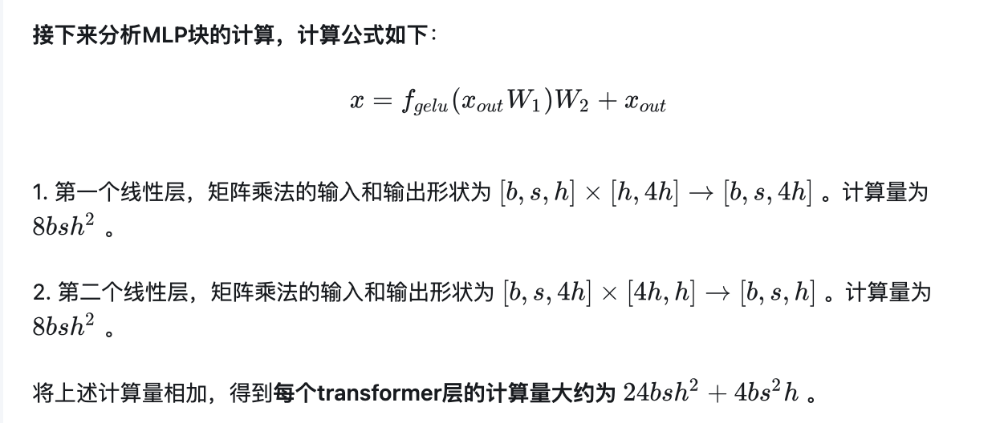

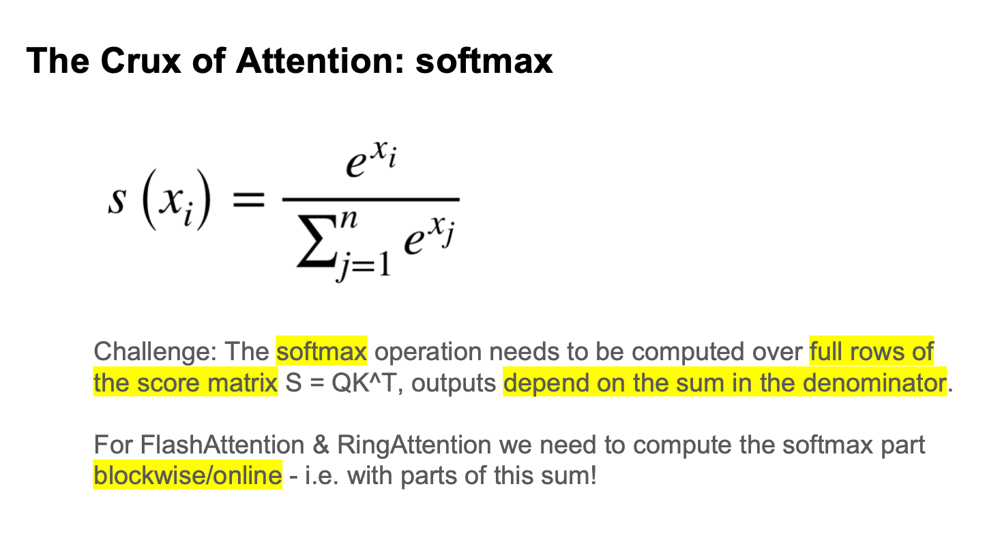

이 slides는 Softmax computation challenge를 설명한다. Softmax operation은 score matrix의 complete row 위에서 수행되어야 한다. 이 score matrix는 `S=QK^T`로 계산된다(Q는 Query matrix, K는 Key matrix transpose). Softmax output은 denominator의 sum, 즉 모든 input value의 exponential sum에 의존한다. FlashAttention과 RingAttention algorithm에 Softmax를 적용하려면 Softmax를 "chunked" 또는 "online" 방식으로 계산해야 한다. 즉 partial sum만 처리해 더 efficient하게 result를 계산한다.

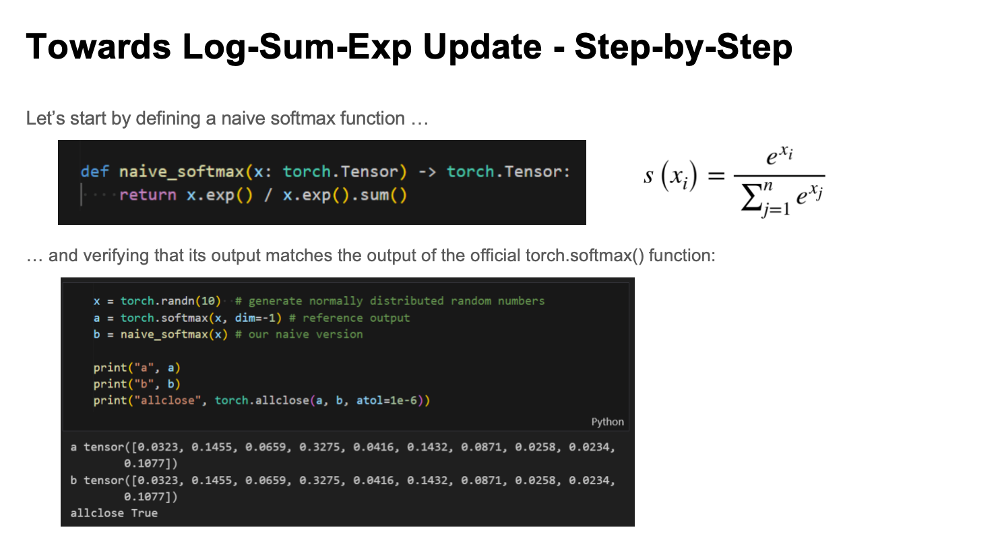

이 Slides는 Python의 PyTorch library로 simple Softmax function을 정의하고 검증하는 방법을 소개하며, 점차 Log-Sum-Exp update로 넘어간다. 여기서는 Python code로 naive Softmax function을 정의하는 방법을 보여준다. 이 function은 PyTorch tensor를 input으로 받아 Softmax value를 계산한다. 이어 custom Softmax function과 official PyTorch `torch.softmax()` function을 비교하는 방법을 보여준다. random tensor `x`를 생성하고 official Softmax result `a`와 custom version `b`를 각각 계산한다. `torch.allclose()` function으로 두 output이 가까운지 검증한다.

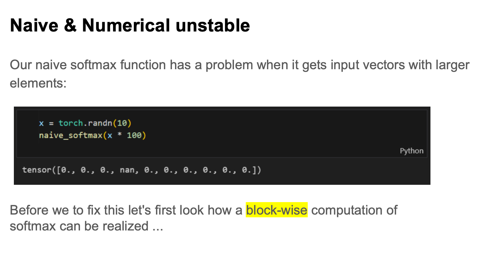

slides title은 "Naive & Numerical unstable"을 언급한다. 현재 정의한 naive Softmax function은 일부 input에서 문제가 생긴다는 뜻이다. slides는 구체적인 example을 보여준다. code는 random PyTorch tensor `x`를 생성하고 100을 곱한 뒤 naive `naive_softmax()` function에 넣는다. result output에서 tensor의 일부 value가 nan(Not a Number)이 된 것이 보인다. 이는 numerical overflow 또는 instability를 나타낸다.

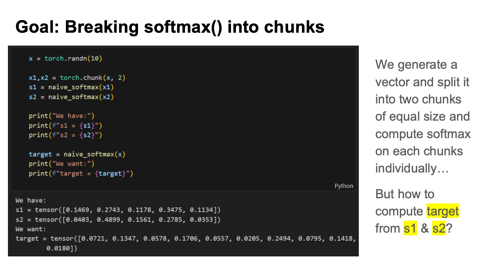

우리의 goal은 Softmax operation을 chunk로 나누어 처리하는 것이다(breaking softmax() into chunks). 오른쪽 text는 vector를 chunk로 나누어 각각 Softmax를 계산할 수 있지만, 최종 문제는 chunk result `s1`과 `s2`로 complete target result를 어떻게 reconstruct하느냐라고 지적한다. 이것이 다음 단계에서 해결해야 할 core problem이다.

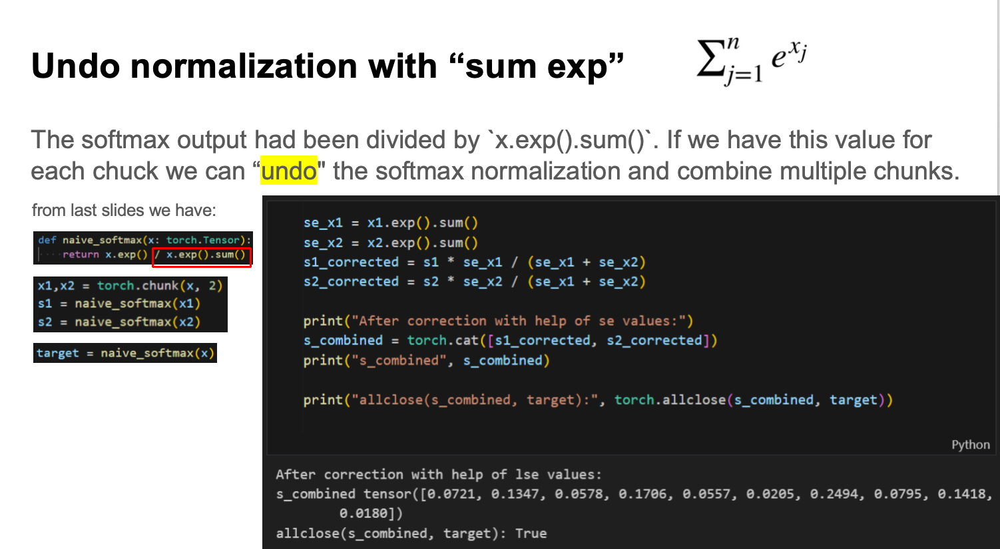

이 slides는 "sum exp"를 사용해 Softmax의 normalization을 되돌리고, chunked computation result를 merge하는 방법을 설명한다. 먼저 이전 slides의 문제를 되짚는다. Softmax output은 `x.exp().sum()`으로 나누어 normalize된다. 여러 chunk result를 merge하려면 이런 normalization을 undo해야 한다.

오른쪽 code는 chunk별 exponential sum으로 correction하는 방법을 보여준다. `x1.exp().sum()`과 `x2.exp().sum()`은 각각 chunk `x1`, `x2`의 exponential sum을 계산하며, `se_x1`, `se_x2`라고 이름 붙인다. 그런 다음 chunk result `s1`, `s2`를 각각 correction한다. formula는 slides code와 같다. corrected result는 `torch.cat()` function으로 merge하여 complete Softmax result를 얻는다.

merged result는 target result `target`과 비교되고, `torch.allclose()` function으로 검증된다. result는 `True`이며, 이 방식으로 chunked Softmax computation result를 성공적으로 merge했음을 보여준다.

> 하지만 이 방법도 여전히 모든 value에 access해야 한다. 너무 조급해하지 말고 더 들어가 보자.

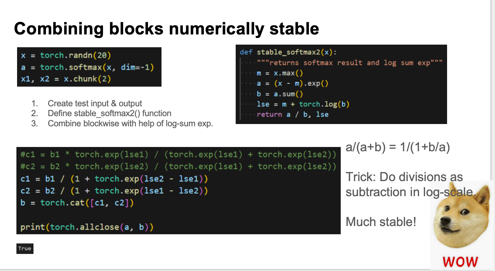

이 Slides는 numerically stable한 방식으로 chunked Softmax result를 merge하는 법을 설명한다. 구체적인 내용은 다음과 같다.
- title은 "Combining blocks numerically stable"이며, 핵심은 chunked Softmax result를 numerically stable하게 merge하는 것이다.
- 왼쪽 위 code는 20 elements를 가진 test tensor `x`를 보여주고 complete Softmax result `a`를 계산한다. 동시에 `x`를 두 chunk `x1`, `x2`로 나눈다.
- 오른쪽 위 code는 `stable_softmax2(x)`라는 function을 정의한다. 이 function은 다음 step으로 numerically stable Softmax를 구현한다.
  - `m = x.max()`: input vector의 maximum value `m`을 계산한다.
  - `a = (x - m).exp()`: input vector에서 maximum value를 뺀 뒤 exponentiation을 수행하여 value가 너무 커져 overflow되는 것을 막는다.
  - `b = a.sum()`: exponential sum을 계산한다.
  - `lse = m + torch.log(b)`: log-sum-exp(LSE) value를 계산한다.
  - Softmax result `a/b`와 LSE value를 return한다.
code는 LSE value를 기반으로 chunk result를 stable하게 merge하는 방법을 보여준다. traditional merge method는 다음처럼 exponential operation을 사용한다.
```python
c1 = b1 * torch.exp(lse1) / (torch.exp(lse1) + torch.exp(lse2))
c2 = b2 * torch.exp(lse2) / (torch.exp(lse1) + torch.exp(lse2))
```
exponential operation이 만드는 instability를 피하기 위해 code는 division을 subtraction으로 바꾸는 trick을 사용해 result를 merge한다.
```python
c1 = b1 / (1 + torch.exp(lse2 - lse1))
c2 = b2 / (1 + torch.exp(lse1 - lse2))
```
- 이렇게 하면 log-scale operation을 사용해 numerical overflow를 줄이고 stability를 높일 수 있다.
- merged result `b`를 complete computation result `a`와 비교하고, `torch.allclose()` function으로 검증한다. result는 `True`이며, numerically stable chunk merge strategy가 whole computation과 일치하는 result를 성공적으로 만든다는 뜻이다.
- 옆에는 mathematical trick 하나가 설명되어 있다: $\frac{a}{a+b}=\frac{1}{1+\frac{b}{a}}$.
division 대신 log scale의 subtraction을 수행해 numerical stability를 보장하라는 뜻이다.

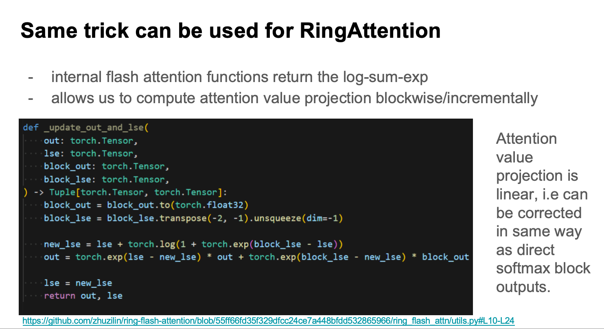

- 여기서는 RingAttention이 internal Flash Attention의 일부 function을 사용할 수 있다고 말한다. 이 function들은 log-sum-exp를 return할 수 있고, attention Value projection을 block-by-block 또는 incremental하게 계산하는 데 도움이 된다.
- 여기 code snippet은 `_update_out_and_lse`라는 PyTorch function이다. 역할은 `out`과 `lse`(log-sum-exp) value를 update하는 것이다. attention Value projection은 linear하므로, Softmax result를 chunk로 처리하는 것과 유사한 방식으로 correction과 computation을 수행할 수 있다.

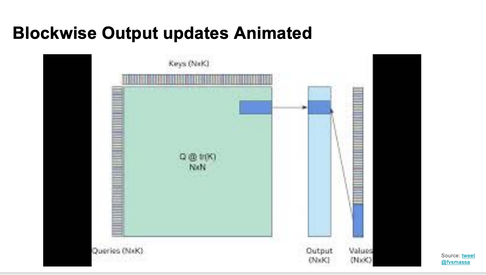

이 그림은 Flash Attention V2의 chunk-by-chunk softmax result와 output update를 보여준다. 실제로 여기 Ring Attention update에도 적용된다.

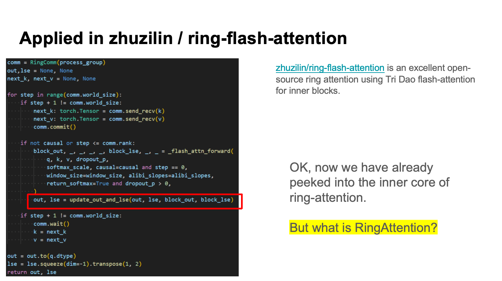

이 slides는 `zhuzilin/ring-flash-attention`의 Ring Attention open-source implementation을 보여준다. communication을 제외하면 Ring Attention이 Tri Dao의 Flash Attention을 호출해 각 block(device) 위의 Attention computation과 lse update를 수행한다는 것을 볼 수 있다. 사실 이것이 Ring Attention의 detail이다. 이어서 author는 Ring Attention의 communication 등을 계속 논의한다.

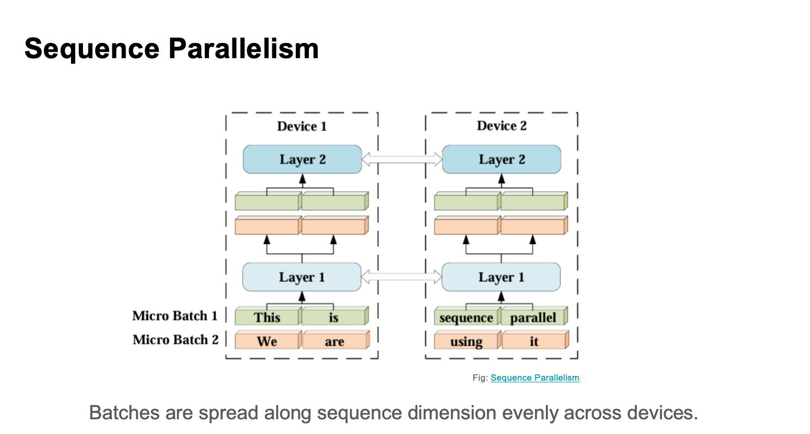

이 Slides는 sequence parallelism의 schematic diagram을 그린다. 여기서는 길게 설명하지 않는다. 대부분 익숙할 것이다.

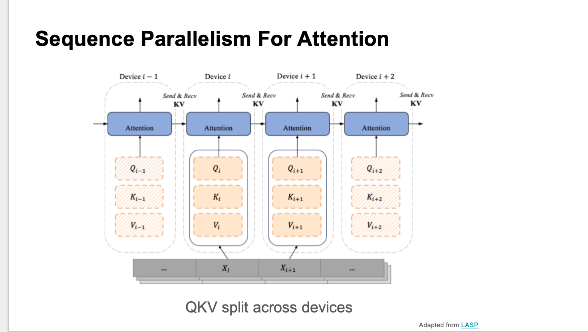

이 Slides는 attention mechanism의 Sequence Parallelism을 소개하고, query(Q), key(K), value(V) tensor를 서로 다른 device 사이에서 split하고 전달하는 방법을 보여준다. 각 device는 attention value의 일부를 계산하고 `Send & Recv KV` operation을 통해 device 간 communication을 수행함으로써 cross-device efficient parallel computation을 구현한다.

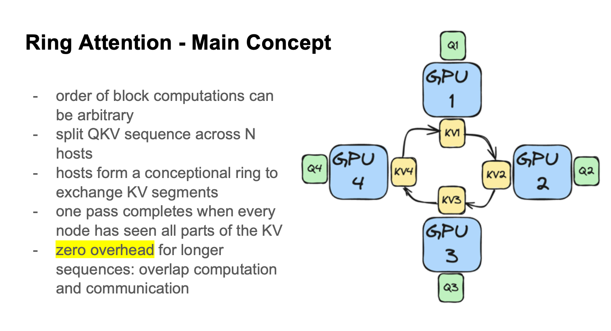

여기서는 "Ring Attention"의 main concept을 소개한다. 내용은 다음과 같다.
- **Flexible computation order**: block computation order는 arbitrary할 수 있고 제한받지 않는다.
- **QKV sequence splitting**: QKV(query, key, value) sequence를 N개의 서로 다른 host로 split해 처리한다.
- **Host ring structure**: 이 host들이 conceptual ring을 형성하여 KV(key/value) segment를 exchange한다.
- **Completion condition**: 각 node가 모든 KV part를 보면 complete cycle 하나가 끝난다.
- **Zero overhead**: 긴 sequence에서는 computation과 communication이 overlap될 수 있으므로 zero overhead를 실현한다.

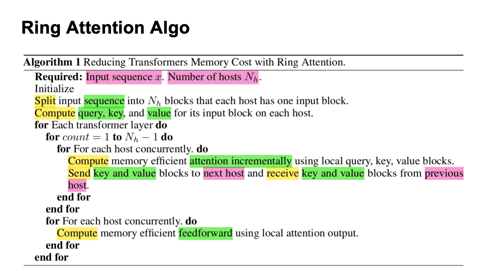

여기서는 Ring Attention pseudo-code를 보여준다. 앞의 두 slides의 code와 대응된다.

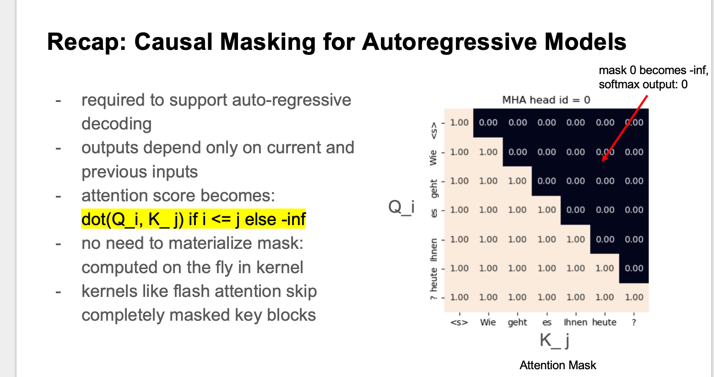

이 Slides는 autoregressive model의 causal masking concept과 role을 review한다. 내용은 다음과 같다.
- causal mask는 autoregressive decoding을 지원하는 데 필요하다. autoregressive model에서는 각 time step의 output이 current and previous input에만 의존할 수 있고 future input을 볼 수 없기 때문이다.
- attention score computation은 `dot(Q_i, K_j) if i <= j else -inf`가 된다. 즉 current query $Q_i$의 index `i`가 key $K_j$의 index `j`보다 작거나 같으면 dot product를 정상 계산하고, 그렇지 않으면 score를 negative infinity(-inf)로 만들어 해당 position이 softmax output에서 0이 되게 한다.
- mask는 명시적으로 저장할 필요가 없고, kernel 안에서 dynamic하게 계산할 수 있다.
- Flash Attention 같은 kernel은 완전히 masked된 key-value block을 skip하여 computation efficiency를 높일 수 있다.


이 Slides는 autoregressive model에서 Ring Attention을 사용할 때 마주치는 main problem과 그 effect를 설명한다.
- device idle problem:
    - causal masking을 사용할 때 ring structure에서 일부 device가 idle 상태가 될 수 있다. 이는 모든 autoregressive model, 예를 들어 language model에서 매우 흔하다.
    - causal mask 때문에 Query_index가 Key_index보다 작으면 output이 masked되어 0이 된다. 그래서 어떤 device는 computation에서 실제 valid output이 없고, 다른 device를 기다리는 동안 idle 상태가 된다.
- solution:
    - Ring Attention의 ring structure를 사용하면 완전히 masked된 key-value block을 dynamic하게 skip하여 computation efficiency를 높일 수 있다.
    - 이 방식은 computational resource waste를 줄이고 computation efficiency를 높인다.

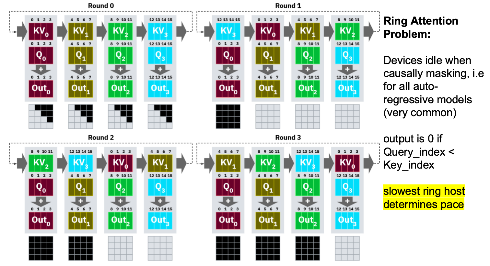

이 Slides는 autoregressive model에서 Ring Attention을 사용할 때 마주치는 main problem과 그 effect를 설명한다.
- device idle problem:
    - causal masking을 사용할 때 ring structure에서 일부 device가 idle 상태가 될 수 있다. 이는 모든 autoregressive model, 예를 들어 language model에서 매우 흔하다.
    - causal mask 때문에 Query_index가 Key_index보다 작으면 output이 masked되어 0이 된다. 그래서 어떤 device는 computation에서 실제 valid output이 없고, 다른 device를 기다리는 동안 idle 상태가 된다.
- solution:
    - Ring Attention의 ring structure를 사용하면 완전히 masked된 key-value block을 dynamic하게 skip하여 computation efficiency를 높일 수 있다.
    - 이 방식은 computational resource waste를 줄이고 computation efficiency를 높인다.


이 Slides는 autoregressive model에서 Ring Attention을 사용할 때 마주치는 main problem과 그 effect를 설명한다.
- **device idle problem**:
    - causal masking을 사용할 때 ring structure에서 일부 device가 idle 상태가 될 수 있다. 이는 모든 autoregressive model, 예를 들어 language model에서 매우 흔하다.
    - causal mask 때문에 Query_index가 Key_index보다 작으면 output이 masked되어 0이 된다. 그래서 어떤 device는 computation에서 실제 valid output이 없고, 다른 device를 기다리는 동안 idle 상태가 된다.
- **round-by-round process demonstration**:
    - 이 그림은 Ring Attention process를 Round 0부터 Round 3까지 네 round로 나누며, 각 round에서 각 device(GPU 등)가 서로 다른 KV(key-value) block과 Q(query) block을 담당한다.
    - 각 round에서 device는 query와 key의 index relationship에 따라 output을 계산한다. mask value가 0이면(black cell은 masked position을 나타냄) output은 forced to 0이 된다.
    - 그림에서 round가 진행될수록 일부 device의 computation result가 masked되어 black area가 늘어나고, device가 effective computation에 참여하지 못하는 것을 볼 수 있다.
- **slowest ring node determines overall speed**:
    - Slides는 ring structure에서 가장 느린 host(Ring Host)가 overall computation speed를 결정한다고 특별히 지적한다. 따라서 어떤 device가 mask 때문에 computation time이 길어지거나 idle time이 많아지면, entire ring computation speed가 느려지고 efficiency가 떨어진다.

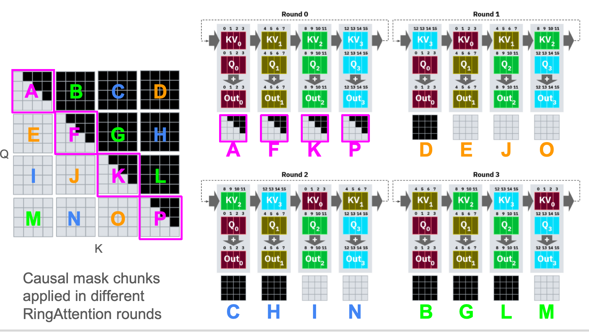

이 Slides는 위 Slides를 바탕으로 autoregressive model에서 Ring Attention에 causal mask를 적용하는 구체적인 process와 problem을 더 자세히 설명한다.
- **Causal Mask Chunks split and application**:
    - 왼쪽 legend는 causal mask matrix를 보여주며, 이를 여러 chunk(A, B, C 등)로 split한다. 이 chunk들은 Ring Attention의 different rounds에서 적용된다.
    - matrix의 각 chunk는 query Q와 key K 사이의 mask relationship을 나타낸다. gray는 valid computation이고 black은 masked position이다.
- **chunk application process**:
    - causal mask matrix를 여러 small chunk로 나누고, 이 chunk들이 각 Ring Attention round에서 computation에 할당된다.
    - 각 Ring Attention round(Round 0부터 Round 3까지)는 오른쪽 그림의 different computation order에 대응한다. 각 round에서 각 device는 서로 다른 KV segment를 계산하고 chunk mask에 따라 computation한다.
    - 각 round 아래에는 current round의 causal mask matrix chunk(A, F, K, P 등)가 표시된다. 이 chunk는 matrix의 different part에 대응하며, current round에서 적용되는 mask block을 표시한다.
- **mask relationship for each round**:
    - Round 0의 mask block: A, F, K, P.
    - Round 1의 mask block: D, E, J, O.
    - Round 2의 mask block: C, H, I, N.
    - Round 3의 mask block: B, G, L, M.
    - 각 round는 서로 다른 mask block을 통해 전체 causal mask matrix를 점진적으로 형성한다. 각 mask block은 자신의 round에서만 computation에 참여하여 autoregressive decoding의 causality를 보장한다.
- **mask application order**:
    - 서로 다른 color와 letter로 표시된 mask block은 Ring Attention이 multiple rounds에서 mask를 어떻게 distribute하고 apply하는지 보여준다. 이 방식으로 각 device는 different rounds에서 서로 다른 KV block과 Q block을 처리하여 entire causal mask matrix를 cover한다.

> 위에서 설명한 것은 모두 Ring Attention의 load imbalance problem이다. 이제 solution 하나를 소개한다.

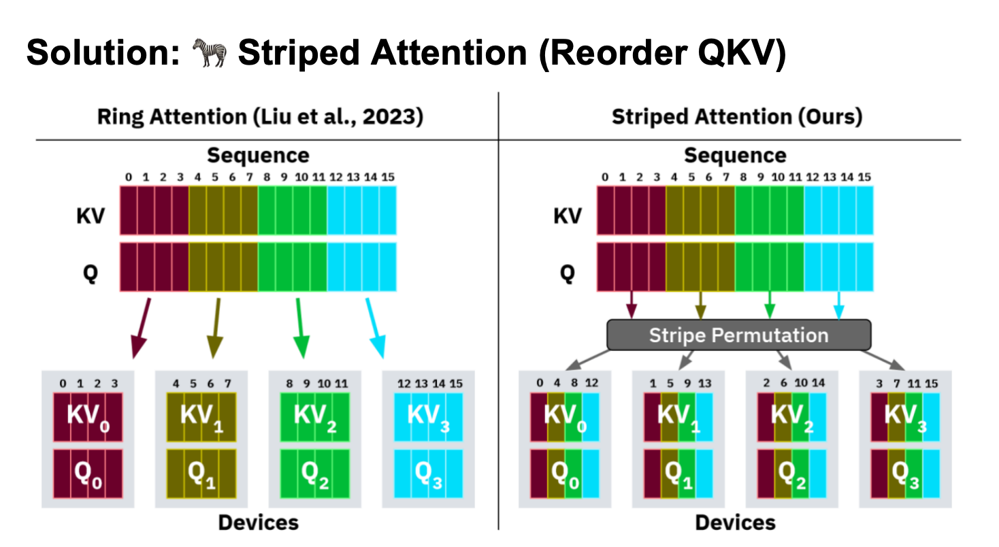

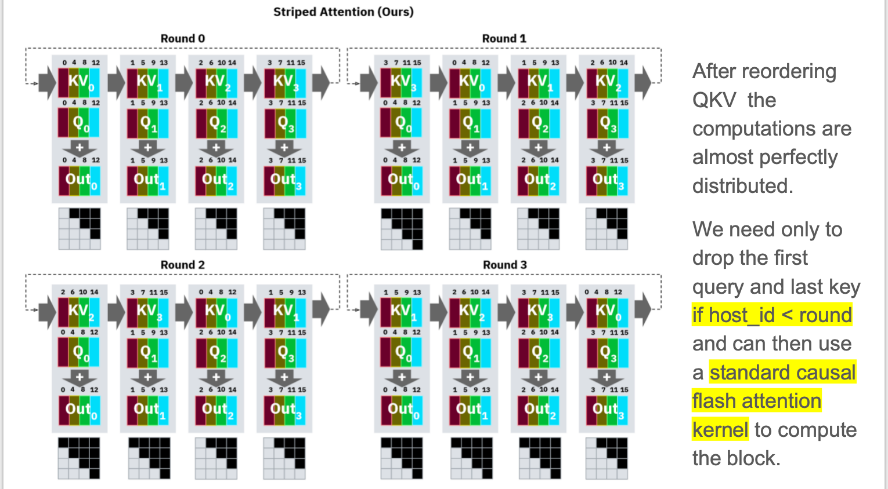

이 두 slides는 Ring Attention load imbalance의 solution을 설명한다. **Stripe Permutation** strategy를 통해 K, V, Q를 sequence dimension에서 stripe 형태로 rearrange한다. 예를 들어 KV0을 continuous 0,1,2,3이 아니라 0,4,8,12로 나누는 식이다. KV와 Q block을 rearrange하면 Striped Attention은 computational resource를 더 잘 distribute하여 device 간 imbalance를 완화하고 overall computation efficiency를 높일 수 있다. 두 번째 Slides를 보면 stripe permutation 이후 computation process가 거의 perfect하게 load balance되어, device 간 computation이 더 balanced해지고 Ring Attention의 device idle problem을 피할 수 있다. 각 round에서 `host_id < round`일 때만 first query와 last key computation을 discard해야 하며, 이것은 unnecessary computation을 피하고 efficiency를 더 높인다.

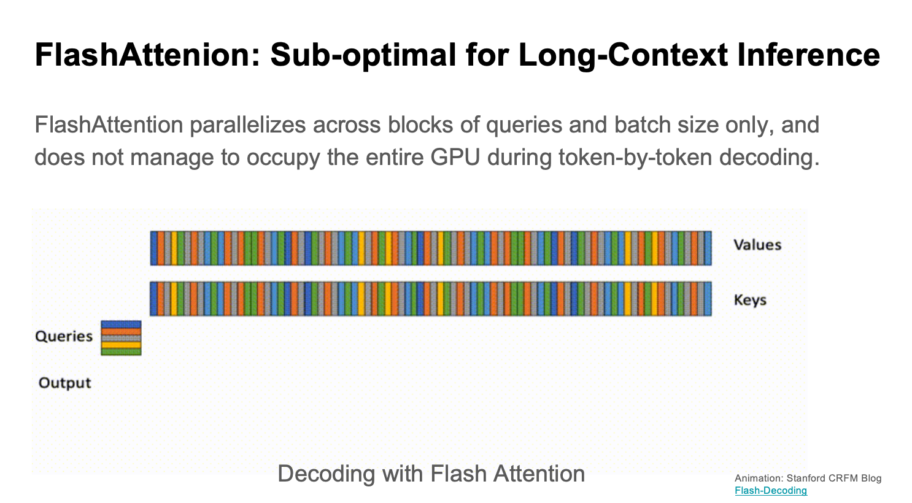

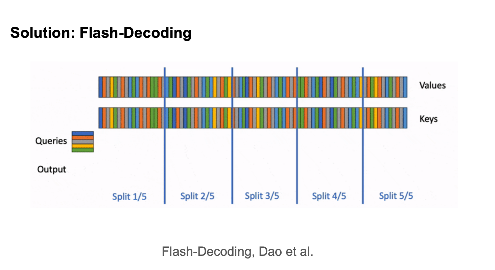

이 두 slides는 FlashAttention과 Flash-Decoding이라는 두 method가 long-text inference task에서 보이는 difference를 설명한다.
- FlashAttention은 long-text inference에서 잘 맞지 않는다.
    - FlashAttention은 queries block과 batch size에 대해서만 parallelize할 수 있다. token-by-token decoding에서는 전체 GPU compute resource를 충분히 활용하지 못한다.
    - 첫 번째 Slides 아래 diagram은 FlashAttention에서 Queries, Values, Keys를 처리하는 방식을 보여준다. 그림은 Queries, Values, Keys가 chunked processing되며 각 block size와 position이 fixed되어 있음을 보여준다. 이런 방식은 efficient parallel decoding을 만들기 어렵다.
- Flash-Decoding
    - Flash-Decoding은 Queries, Values, Keys를 여러 split으로 나누어 decoding process를 optimize한다. 그림에는 1/5, 2/5, 3/5, 4/5, 5/5 split 방식이 표시되어 있다.
    - 이 method는 각 split이 independent parallel decoding을 수행하게 하여 GPU compute resource를 더 잘 점유하고 decoding efficiency와 speed를 높인다.
    - 그림은 각 split part가 어떻게 따로 처리되고, 마지막에 complete output result로 merge되는지 보여준다.

Flash-Decoding과 Ring Attention의 차이는, Flash-Decoding이 multiple Host에서 sequence split을 수행하고 K/V를 communication으로 전달할 필요가 없다는 점이다. 대신 두 kernel로 long-sequence Attention computation을 완료한다. 어떤 관점에서는 Flash Decoding을 inference stage에서의 Ring Attention optimization으로 볼 수도 있다.

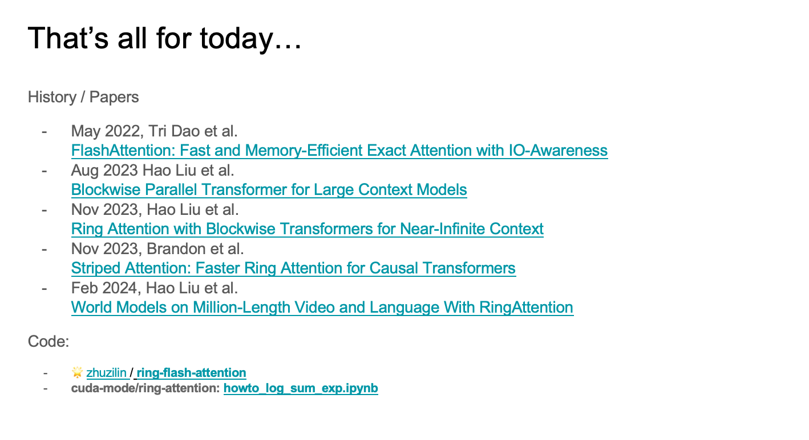

마지막 Slides는 이 lecture의 몇 가지 link를 제공한다.

## 요약

이 lecture는 Ring Attention의 principle, Flash Attention 기반 Ring Attention의 basic implementation, Stripe Permutation으로 Ring Attention load imbalance를 해결하는 방법을 소개했다. 마지막에는 Flash Decoding과 Flash Attention의 principle과 difference도 소개했다. 중국 개발자(github.com/zhuzilin)의 work가 CUDA-MODE까지 알려지는 것을 보니 반갑다. 원저자의 Ring Attention explanation과 improvement article도 추천한다: https://zhuanlan.zhihu.com/p/683714620 . 최근 author는 "flash attention 체질에 더 적합한 long-context training scheme"도 제안했다: https://zhuanlan.zhihu.com/p/718486708 . 이것도 함께 공부해 볼 만하다. zhuzilin의 훌륭한 work와 아낌없는 open source/share에 감사한다.
