> 내 강의 노트다. 관심이 있다면 팔로우를 환영한다: https://github.com/BBuf/how-to-optim-algorithm-in-cuda/tree/master/cuda-mode

> CUDA-MODE Lecture 15는 cutlass의 cute Layout 추상화를 다루는데, 설명이 비교적 아쉽다고 느꼈다. reed 님의 cutlass 시리즈 블로그 소개를 바로 보는 것을 권한다. 그래서 이후에는 이 강의 노트는 건너뛴다. CUDA-MODE Lecture 16: On Hands profiling은 PyTorch Lighting 엔지니어가 실제 gemma 모델 파인튜닝 프로그램을 바탕으로 profile하고 성능을 개선하는 강의다. 이 강의는 Slides가 없고 AI Infra 엔지니어의 일상에 더 가깝다. profile 도구로 Nsight System과 PyTorch Profiler를 사용한다. 관심 있는 독자는 직접 찾아보면 된다. Slides가 없고 강의도 꽤 자유롭게 진행되어 필자는 이 강의 노트를 기록하지 않기로 했다. 다만 평소 Profile 수요가 있다면 이 강의는 한 번 보는 것을 추천한다.

> 아래 강의 노트의 주요 출처는 Lecture 14 Triton 실천 가이드의 https://github.com/gpu-mode/lectures/blob/main/lecture_014/A_Practitioners_Guide_to_Triton.ipynb 이다.

# 14강, Triton 실천 가이드

<h1><b></v>Triton 실천 가이드</b></h1>

저자: UmerHA (https://x.com/UmerHAdil // https://github.com/UmerHA/), cuda-mode 그룹을 위해 작성 ❤️ May our brrrr level reach over.

# 왜, 그리고 언제 Triton을 사용하는가

**Triton이란 무엇인가**
간단히 말해 Triton은 GPU를 더 편하게 프로그래밍하기 위한 언어다. Python과 비슷한 코드를 작성하면, 그 코드는 ptx 코드로 컴파일된다(cuda 코드가 컴파일되는 결과와 동일하다).

컴파일 과정에서 Triton 컴파일러는 프로그램의 의미를 바꾸지 않으면서 프로그램 일부를 재배치하는 여러 영리한 기법을 시도해 더 빠르게 실행되도록 만든다.

**Triton vs Cuda**


source: https://zhuanlan.zhihu.com/p/672086654

CUDA는 전문가가 사용할 수 있는 설정이 많은 고급 도구다.
- 모든 내용을 완전히 제어할 수 있으므로 절대적인 최대 성능을 구현할 수 있다
- 좋은 성능을 얻기가 더 어렵다
- 작성과 디버깅이 더 번거롭다
- 더 복잡하므로 배우기도 더 어렵다

Triton은 대부분의 사용자에게 매우 적합한 도구다.
- 일부 일은 자동 최적화에 맡기기 때문에 모든 것을 제어할 수는 없다. 그래서 절대적인 최대 성능은 얻지 못할 수도 있다
- 좋은 성능을 얻기가 더 쉽다
- 작성과 디버깅이 더 쉽다
- Python과 비슷한 문법이 있어 배우기 쉽다

**Triton vs torch.compile**

`torch.compile`은 기존 kernel을 더 효율적으로 사용하고 단순한 새 kernel을 만들어 모델을 더 빠르게 한다. 이것만으로 모델이 충분히 빨라질 수도 있다. 그렇지 않다면 더 빠른 Triton kernel을 작성하는 데 시간을 들일지 결정할 수 있다.

(`torch.compile`이 만드는 이런 단순한 새 kernel은 실제로 Triton kernel이다. 따라서 커스텀 kernel을 만들 때 좋은 출발점이 된다. 어떻게 하는지는 [Mark Saroufim](https://twitter.com/marksaroufim)의 [cuda mode 첫 강의](https://www.youtube.com/watch?v=LuhJEEJQgUM&t=2200s)를 참고하라.)

**언제 Triton을 사용하는가**

AI 모델에서 시작한다.
1. 충분히 빠르지 않으면 `torch.compile`을 사용한다.
2. 그래도 충분히 빠르지 않으면, 코드가 `torch.compile`에 더 잘 맞도록 다시 쓸 수 있는지 확인한다.
3. 그래도 충분히 빠르지 않으면, 느린 부분을 확인하고 그 부분에 커스텀 Triton kernel을 작성한다.
4. 그래도 충분히 빠르지 않으면, 느린 부분을 확인하고 그 부분에 커스텀 CUDA kernel을 작성한다.

(사전에 절대적인 최대 성능이 필요하다는 것을 알고 있는 드문 경우라면, 곧바로 CUDA에서 시작하기로 결정할 수도 있다.)

**거친 모서리에 대한 설명**

Triton은 비교적 새로운 프로젝트이기 때문에, 사람들은 아직 다듬어지지 않은 부분이 있다는 것을 발견하고 있다. 내가 만난 모든 거친 부분은 기록해 두었고, 주석에 "Weirdness: <이상한 점에 대한 설명>"이라고 표시했다.

앞으로는 더 성숙해질 것이라고 예상한다.

# Triton kernel을 작성하는 방법

CUDA와 달리 환경 변수 `TRITON_INTERPRET = 1`을 설정하면 일반 CPU 프로그램을 디버깅하듯 Triton kernel을 디버깅할 수 있다. 이때 Triton은 CPU에서 실행되지만 GPU에서 실행되는 것처럼 시뮬레이션한다.

먼저 시뮬레이터에서 모든 프로그램을 작성하고 정확성을 확인하는 것을 권한다. 정확하다면 그 다음 빠르게 실행되도록 만들면 된다.

다음은 디버깅에 사용하는 몇 가지 유틸리티 함수다.
- `check_tensors_gpu_ready`: (i) 모든 텐서가 메모리에서 contiguous인지 단언하고, (ii) 시뮬레이션이 아닐 때만 모든 텐서가 GPU 위에 있는지 단언한다
- `breakpoint_if`: pids 조건에 따라 breakpoint를 설정한다
- `print_if`: pids 조건에 따라 내용을 출력한다

```python
import os
from IPython.core.debugger import set_trace

os.environ['TRITON_INTERPRET'] = '1' # needs to be set *before* triton is imported

def check_tensors_gpu_ready(*tensors):
    """모든 텐서가 GPU 위에 있고 contiguous인지 확인한다"""
    for t in tensors:
        assert t.is_contiguous, "A tensor is not contiguous"  # 텐서가 contiguous인지 단언한다
        if not os.environ.get('TRITON_INTERPRET') == '1': assert t.is_cuda, "A tensor is not on cuda"  # 시뮬레이션 모드가 아니면 텐서가 GPU 위에 있는지 단언한다

def test_pid_conds(conds, pid_0=[0], pid_1=[0], pid_2=[0]):
    """pid 조건이 만족되는지 테스트한다
    예:
        '=0'  pid_0 == 0인지 검사한다
        ',>1' pid_1 > 1인지 검사한다
        '>1,=0' pid_0 > 1이고 pid_1 == 0인지 검사한다
    """
    pids = pid_0[0], pid_1[0], pid_2[0]  # pid 값을 가져온다
    conds = conds.replace(' ','').split(',')  # 공백을 제거하고 조건을 나눈다
    for i, (cond, pid) in enumerate(zip(conds, pids)):
        if cond=='': continue  # 조건이 비어 있으면 건너뛴다
        op, threshold = cond[0], int(cond[1:])  # 연산자와 임계값을 가져온다
        if op not in ['<','>','>=','<=','=', '!=']: raise ValueError(f"Rules may only use these ops: '<','>','>=','<=','=', '!='. Invalid rule: '{condition}'.")  # 연산자가 유효한지 검사한다
        op = '==' if op == '=' else op  # '='를 '=='로 바꾼다
        if not eval(f'{pid} {op} {threshold}'): return False  # 조건이 만족되는지 평가한다
    return True

assert test_pid_conds('')  # 빈 조건을 테스트한다
assert test_pid_conds('>0', [1], [1])  # pid_0 > 0을 테스트한다
assert not test_pid_conds('>0', [0], [1])  # pid_0 > 0이 만족되지 않는 경우를 테스트한다
assert test_pid_conds('=0,=1', [0], [1], [0])  # pid_0 = 0이고 pid_1 = 1인 경우를 테스트한다

def breakpoint_if(conds, pid_0=[0], pid_1=[0], pid_2=[0]):
    """어떤 pid 조건이라도 만족되면 kernel을 멈춘다"""
    if test_pid_conds(conds, pid_0, pid_1, pid_2): set_trace()  # 조건이 만족되면 breakpoint를 설정한다

def print_if(txt, conds, pid_0=[0], pid_1=[0], pid_2=[0]):
    """어떤 pid 조건이라도 만족되면 txt를 출력한다"""
    if test_pid_conds(conds, pid_0, pid_1, pid_2): print(txt)  # 조건이 만족되면 텍스트를 출력한다

def cdiv(a,b): 
    """a를 b로 나눈 올림값을 계산한다"""
    return (a + b - 1) // b  # a를 b로 나눈 올림값을 계산한다
assert cdiv(10,2)==5  # cdiv 함수를 테스트한다
assert cdiv(10,3)==4  # cdiv 함수를 테스트한다
```

```python
import torch
import triton
import triton.language as tl
```

# 프로그래밍 모델

CUDA에서는 계산을 두 계층으로 나눈다. 먼저 block이 있고, 각 block은 다시 thread로 나뉜다. 한 block 안의 모든 thread는 같은 SM에서 실행되고 동일한 shared memory를 공유한다. 각 thread는 **스칼라**를 계산한다.

Triton에서는 계산을 한 계층, 즉 block으로만 나눈다. 더 이상 thread 분해가 없다. **Triton은 벡터를 대상으로 연산하라고 요구한다**. 또한 shared memory를 관리할 필요도 없고 관리할 수도 없다. Triton이 자동으로 처리한다.

예:

크기가 8인 벡터 `x`와 `y`를 더하고, 출력도 크기가 8인 벡터 `z`에 저장한다고 하자. block 크기를 4로 사용하므로 `8 / 4 = 2`개의 block이 있다.
- CUDA는 block 2개를 실행하고, 각 block에는 thread 4개가 있다. 8개 thread 각각은 예를 들어 `z[0] = x[0] + y[0]`처럼 하나의 위치를 계산한다
- Triton도 block 2개를 실행하지만, 각 block은 벡터화된 덧셈을 수행한다. 벡터 크기는 block 크기, 즉 4다. 예를 들어 `z[0:3] = x[0:3] + y[0:3]`이다

**모든** Triton kernel의 작업은 벡터화되어 있다. 데이터 로드, 데이터 조작, 데이터 저장, mask 생성이 모두 그렇다.

다른 간단한 예를 보자.

역시 크기가 **6**인 벡터 `x`와 `y`를 더하고, 출력도 크기가 6인 벡터 `z`에 저장한다고 하자. block 크기를 4로 사용하므로 `cdiv(6, 4) = 2`개의 block이 있다.

```python
x = torch.tensor([1,2,3,4,5,6])
y = torch.tensor([0,1,0,1,0,1])

x, y, x+y
```

CUDA kernel은 다음 C 코드와 비슷하다.

```python
# x,y = 입력 텐서, z = 출력 텐서, n = x의 크기, bs = block 크기
def add_cuda_k(x, y, z, n, bs):
    # 이 특정 kernel이 전체 계산의 어느 부분을 실행하는지 찾는다
    block_id = ... # 이 예에서는 [0,1] 중 하나
    thread_id = ... # 이 예에서는 [0,1,2,3] 중 하나

    # 이 특정 kernel에 필요한 데이터 위치를 식별한다
    offs = block_id * bs + thread_id
    
    # guard clause: 범위를 벗어나지 않도록 보장한다
    if offs < n:

        # 데이터를 읽는다
        x_value = x[offs]
        y_value = y[offs]
        
        # 연산을 수행한다
        z_value = x_value + y_value
        
        # 데이터를 쓴다
        z[offs] = z_value

    # 중요: offs, x_value, y_value, x_value는 모두 스칼라다!
    # guard 조건도 하나의 값에 대한 조건을 검사하므로 스칼라다.
```

설명을 위해 각 kernel의 변수는 다음과 같다.

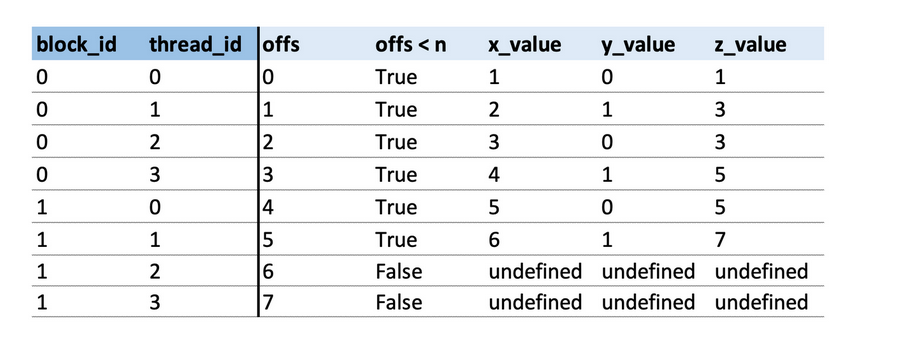

이제 대응되는 Triton kernel을 보면, 대략 다음과 같다.

```python
# 주의: 설명용 코드라 문법이 완전히 정확하지는 않다. 올바른 Triton 문법은 아래를 참고하라

def add_triton_k(x, y, z, n, bs):
    # 이 특정 kernel이 전체 계산의 어느 부분을 실행하는지 찾는다
    block_id = tl.program_id(0)  # 이 예에서는 [0,1] 중 하나
    
    # 이 특정 kernel에 필요한 데이터 위치를 식별한다
    offs = block_id * bs + tl.arange(0, bs) # <- 이것은 벡터다!
    
    # guard clause는 mask, 즉 bool 벡터가 된다
    mask = offs < n # <- 이것은 bool 벡터다!
    
    # 데이터를 읽는다
    x_values = x[offs] # <- 벡터를 읽는다!
    y_values = y[offs] # <- 벡터를 읽는다!
    
    # 연산을 수행한다
    z_value = x_value + y_value  # <- 벡터 덧셈!
    
    # 데이터를 쓴다
    z[offs] = z_value  # <- 벡터를 쓴다!
```

다시 설명하면, 각 kernel의 변수는 다음과 같다.

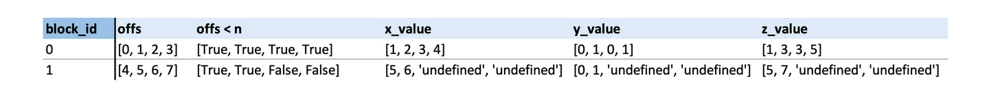

용어 설명: Triton 용어에서 각 처리 block의 kernel은 "program"이라고 부른다. 즉 위 예시는 2개의 program을 실행했다. 그래서 "block_id"는 보통 "pid"("program id"의 약어)라고 부르지만, 둘은 같은 개념이다.

# 예제 1: 텐서 복사

몇 가지 예제를 살펴보자. 단순하게 하기 위해 매우 작은 block 크기를 사용한다.

목표: 형태가 (n)인 텐서 `x`가 주어졌을 때, 이를 다른 텐서 `z`에 복사한다.

```python
# # Triton kernel을 시작하는 일반 Python 함수다
def copy(x, bs, kernel_fn):
    z = torch.zeros_like(x)
    check_tensors_gpu_ready(x, z)
    n = x.numel()
    n_blocks = cdiv(n, bs)
    grid = (n_blocks,)  # block이 몇 개인가? 1d/2d/3d tuple이거나 1d/2d/3d tuple을 반환하는 함수일 수 있다

    # grid를 시작한다!
    # - kernel_fn은 아래에서 작성하는 Triton kernel이다
    # - grid는 위에서 만든 grid다
    # - x,z,n,bs는 각 kernel 함수에 전달되는 인자다
    kernel_fn[grid](x,z,n,bs)

    return z
```

**주의:** 교육 목적상 아래 kernel에는 논리 오류가 하나 있다(문법은 올바르다). 찾을 수 있는가?

```python
# # 이것이 Triton kernel이다:

# triton.jit decorator는 Python 함수를 GPU에서 실행되는 Triton kernel로 변환한다.
# 이 함수 내부에서는 Python 연산의 일부만 허용된다.
# 예를 들어 시뮬레이션하지 않을 때는 GPU에 그런 기능이 없으므로 print나 breakpoint를 사용할 수 없다.
@triton.jit
# torch 텐서를 전달하면 첫 번째 값에 대한 pointer로 자동 변환된다
# 예를 들어 위에서는 x를 전달했지만 여기서는 x_ptr을 받는다
def copy_k(x_ptr, z_ptr, n, bs: tl.constexpr):
    pid = tl.program_id(0)
    offs = tl.arange(0, bs)  # pid에서 offset을 계산한다
    mask = offs < n
    x = tl.load(x_ptr + offs, mask) # 값 벡터를 로드하며, `x_ptr + offs`를 `x_ptr[offs]`처럼 본다
    tl.store(z_ptr + offs, x, mask) # 값 벡터를 저장한다

    print_if(f'pid = {pid} | offs = {offs}, mask = {mask}, x = {x}', '')

    # 질문: 이 kernel의 문제는 무엇인가?
```

```python
z = copy(x, bs=2, kernel_fn=copy_k)
```

```python
pid = [0] | offs = [0 1], mask = [ True  True], x = [1 2]
pid = [1] | offs = [0 1], mask = [ True  True], x = [1 2]
pid = [2] | offs = [0 1], mask = [ True  True], x = [1 2]
```

```
z
```

```shell
tensor([1, 2, 0, 0, 0, 0])
```

offset을 올바르게 이동하지 않았다. 항상 offsets = [0,1]을 사용하지만, pid에 따라 달라져야 한다.

```python
@triton.jit
def copy_k(x_ptr, z_ptr, n, bs: tl.constexpr):
    pid = tl.program_id(0)
    offs = pid * n + tl.arange(0, bs)
    mask = offs < n
    x = tl.load(x_ptr + offs, mask)
    tl.store(z_ptr + offs, x, mask)
    print_if(f'pid = {pid} | offs = {offs}, mask = {mask}, x = {x}', '')
```

```
z = copy(x, bs=2, kernel_fn=copy_k)
```

```python
pid = [0] | offs = [0 1], mask = [ True  True], x = [1 2]
pid = [1] | offs = [6 7], mask = [False False], x = [1 1]
pid = [2] | offs = [12 13], mask = [False False], x = [1 1]
```

완전히 맞지는 않다. `pid * n`을 더했지만, 우리가 더하고 싶은 것은 `pid * bs`다.

```python
@triton.jit
def copy_k(x_ptr, z_ptr, n, bs: tl.constexpr):
    pid = tl.program_id(0)
    offs = pid * bs + tl.arange(0, bs)
    mask = offs < n
    x = tl.load(x_ptr + offs, mask)
    tl.store(z_ptr + offs, x, mask)
    print_if(f'pid = {pid} | offs = {offs}, mask = {mask}, x = {x}', '')
```

```python
z = copy(x, bs=2, kernel_fn=copy_k)
```

```shell
pid = [0] | offs = [0 1], mask = [ True  True], x = [1 2]
pid = [1] | offs = [2 3], mask = [ True  True], x = [3 4]
pid = [2] | offs = [4 5], mask = [ True  True], x = [5 6]
```

Yes!

```python
x, z
```

```shell
(tensor([1, 2, 3, 4, 5, 6]), tensor([1, 2, 3, 4, 5, 6]))
```

보았듯 GPU 프로그램 작성에는 많은 indexing이 들어가고, 아주 쉽게 헷갈릴 수 있다. 그래서 먼저 시뮬레이션 모드에서 kernel을 작성하고 디버깅하며, 처음에는 작은 예제로 테스트하는 것을 강력히 권한다.


# 예제 2: 이미지를 grayscale로 변환

이 예제에서는 강아지 이미지를 grayscale로 바꾼다. 2차원 데이터를 처리하는 방법을 보게 된다.

이는 3차원 데이터에도 동일하게 적용된다.

이 예제는 Jeremy Howard의 예제를 이 [colab](https://colab.research.google.com/drive/180uk6frvMBeT4tywhhYXmz3PJaCIA_uk?usp=sharing) / [youtube](https://www.youtube.com/watch?v=4sgKnKbR-WE&feature=youtu.be)에서 가져와 수정했다. 따라서 그의 예제와 선택한 강아지 이미지에 감사한다.
> 주: 이 예제에서는 jupyter kernel을 재시작하지 않으면 두 가지 이상한 일이 발생한다.

1. torchvision을 import할 수 없다. 순환 의존성 때문일 수 있다. -> 현재는 이유를 모르며 더 파봐야 한다.
2. 아래 시뮬레이션 triton kernel이 실패한다. float가 uint 벡터와 곱해질 수 없기 때문이다. -> GPU에서 시뮬레이션하지 않고 실행하면 동작하므로 `TRITON_INTERPRET`의 bug로 보인다.

```python
import os

import matplotlib.pyplot as plt
from urllib.request import urlretrieve
from pathlib import Path

import torch
from torch import tensor
import torchvision as tv
import torchvision.transforms.functional as tvf
from torchvision import io

import triton
import triton.language as tl
def cdiv(a,b): return (a + b - 1) // b
url = 'https://upload.wikimedia.org/wikipedia/commons/thumb/4/43/Cute_dog.jpg/1600px-Cute_dog.jpg?20140729055059'
path_img = Path('puppy.jpg')
if not path_img.exists(): urlretrieve(url, path_img)
img = io.read_image('puppy.jpg')
print(img.shape)
img[:2,:3,:4]
```

```shell
torch.Size([3, 1066, 1600])
tensor([[[117, 119, 117, 113],
         [119, 129, 129, 113],
         [130, 126, 122, 115]],

        [[ 83,  85,  85,  80],
         [ 85,  97,  97,  82],
         [ 98,  93,  89,  83]]], dtype=torch.uint8)
```

```python
def show_img(x, figsize=(4,3), **kwargs):
    plt.figure(figsize=figsize)
    plt.axis('off')
    if len(x.shape)==3: x = x.permute(1,2,0)  # CHW -> HWC
    plt.imshow(x.cpu(), **kwargs)
img = tvf.resize(img, 150, antialias=True)
ch,h,w = img.shape
ch,h,w,h*w
```

```shell
(3, 150, 225, 33750)
```

```python
show_img(img)
```


2차원 데이터를 처리하려면 2차원 offset과 mask를 구성한다. 예를 들어 `4x7` matrix에서 각 차원의 block 크기가 `2`일 때 동작 방식은 다음과 같다.

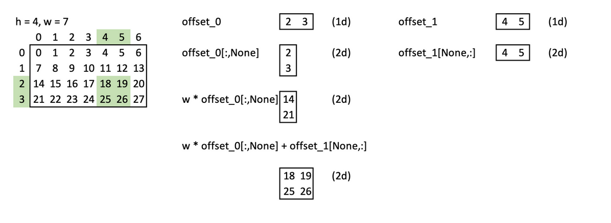

코드에서는 다음과 같은 모습이다.

```python
@triton.jit
def rgb2grey_k(x_ptr, out_ptr, h, w, bs0: tl.constexpr, bs1: tl.constexpr):
    pid_0 = tl.program_id(0)
    pid_1 = tl.program_id(1)
    
    offs_0 = pid_0 * bs0 + tl.arange(0,bs0)  # 1d 벡터
    offs_1 = pid_1 * bs1 + tl.arange(0,bs1)  # 1d 벡터

    # 이상한 점: CPU 시뮬레이션에서는 None slicing이 현재 동작하지 않는다. 대신 tl.expand_dim을 사용한다.
    # offs = w * tl.expand_dims(offs_0, 1) + tl.expand_dims(offs_1, 0)
    offs = w * offs_0[:,None] + offs_1[None, :]  # 2d matrix! - 첫 번째 offset에 width를 곱한다. 위 그림을 보라

    mask_0 = offs_0 < h  # 1d 벡터
    mask_1 = offs_1 < w  # 1d 벡터

    # mask = tl.expand_dims(mask_0, 1) & tl.expand_dims(mask_1, 0)
    mask = mask_0[:,None] & mask_1[None,:]  # 2d matrix! - 데이터가 어느 축의 범위도 넘어가면 안 되므로 `logical and`로 개별 mask를 결합한다
    
    r = tl.load(x_ptr + 0*h*w+offs, mask=mask)
    g = tl.load(x_ptr + 1*h*w+offs, mask=mask)
    b = tl.load(x_ptr + 2*h*w+offs, mask=mask)

    # 이상한 점: CPU 시뮬레이션에서는 float와 uint 벡터의 곱셈이 실패한다
    out = 0.2989*r + 0.5870*g + 0.1140*b  # 왜 이 세 숫자를 곱하는지는 걱정하지 않아도 된다

    tl.store(out_ptr + offs, out, mask=mask)
```

이 kernel을 사용해 보자!

```python
def rgb2grey(x, bs):
    c,h,w = x.shape
    out = torch.empty((h,w), dtype=x.dtype, device=x.device)

    # grid는 1d/2d/3d tuple을 반환하는 함수일 수 있다
    # (이 경우 grid 함수를 갖는 것이 grid tuple보다 더 유용하지는 않지만, 아래 benchmark와 autotune에서는 더 유용해진다)
    grid = lambda meta: (cdiv(h, meta['bs0']), cdiv(w,  meta['bs1']))
    
    rgb2grey_k[grid](x, out, h, w, bs0=bs[0], bs1=bs[1]) # 모든 keyword argument가 grid 함수로 전달된다
    return out.view(h,w)
grey_img = rgb2grey(img.to('cuda'), bs=(32, 32)).to('cpu')
show_img(grey_img, cmap='gray')
```


# 예제 3: 행렬 곱셈

```python
import os
# os.environ['TRITON_INTERPRET'] = '1'

import torch
import triton
import triton.language as tl

# 가독성을 높이기 위해 유틸리티 함수를 별도 파일로 옮긴다
from triton_util import cdiv, breakpoint_if, print_if, check_tensors_gpu_ready
```

이제 Triton에서 단순한 행렬 곱셈을 구현해 보자. 여기서 배울 내용은 다음과 같다.
- 계산을 분할하는 한 가지 방법
- kernel 안에서 함수를 호출하는 방법
- block 내부에서 미리 구현된 벡터/matrix 연산을 사용하는 방법

이는 [OpenAI가 Triton을 발표한 블로그 글](https://openai.com/research/triton)을 바탕으로 수정한 것이다.

우리는 `m x k` matrix `A`와 `k x n` matrix `B`를 곱해 `m x n` matrix `C`를 얻고 싶다.

계산은 세 축을 따라 나눈다.
- m 축을 따라 나눈다 - 이를 나타내기 위해 block dimension 0을 사용한다
- n 축을 따라 나눈다 - 이를 나타내기 위해 block dimension 1을 사용한다
- 공유되는 k 축을 따라 나눈다 - 이것은 block으로 표현하지 않는다. 모든 계산 block은 같은 block 안에서 완료된다.

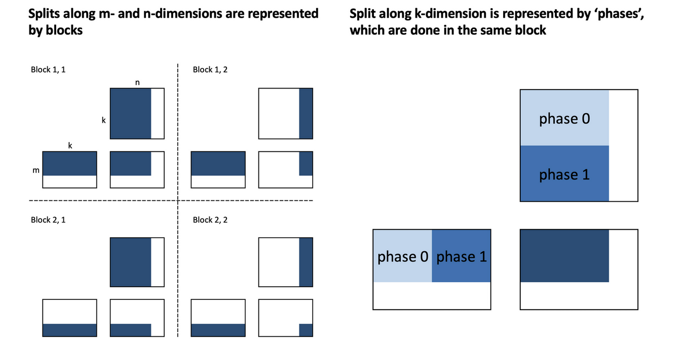

1차원 또는 2차원 offset과 mask를 자주 만들기 때문에, 이 기능을 유틸리티 함수로 빼자. 이 함수들이 `triton.jit`으로 컴파일되기만 하면 kernel 안에서 사용할 수 있다.

```python
@triton.jit
def get_1d_offset(size, n_prev_chunks):
    return n_prev_chunks * size + tl.arange(0, size)

@triton.jit
def get_2d_offset(offs_0, offs_1, stride_0, stride_1=1): 
    # tl.expand_dims를 사용해 offs_0과 offs_1을 2차원 tensor로 변환한다
    # tl.expand_dims(offs_0, 1)은 offs_0을 (offs_0, 1) 형태의 tensor로 변환한다
    # tl.expand_dims(offs_1, 0)은 offs_1을 (1, offs_1) 형태의 tensor로 변환한다
    return tl.expand_dims(offs_0, 1)*stride_0 + tl.expand_dims(offs_1, 0)*stride_1

@triton.jit
def get_1d_mask(offs, max):
    return offs < max

@triton.jit
def get_2d_mask(offs_0, offs_1, max_0, max_1):
    # tl.expand_dims를 사용해 offs_0과 offs_1을 2차원 tensor로 변환한다
    # tl.expand_dims(offs_0, 1)은 offs_0을 (offs_0, 1) 형태의 tensor로 변환한다
    # tl.expand_dims(offs_1, 0)은 offs_1을 (1, offs_1) 형태의 tensor로 변환한다
    return (tl.expand_dims(offs_0, 1) < max_0) & (tl.expand_dims(offs_1, 0) < max_1)
```

다음은 naive 행렬 곱셈 kernel이다.

```python
@triton.jit
def naive_matmul_k(
    a_ptr, b_ptr, c_ptr,
    m, n, k,
    stride_am, stride_ak, 
    stride_bk, stride_bn,
    stride_cm, stride_cn,
    bm: tl.constexpr, bn: tl.constexpr, bk: tl.constexpr
):
    # 현재 thread block의 ID를 가져온다
    pid_m, pid_n = tl.program_id(0), tl.program_id(1)
    # m/n/k 차원을 따라 계산을 분할한다
    rm = get_1d_offset(size=bm, n_prev_chunks=pid_m)  # m 차원의 offset을 계산한다
    rn = get_1d_offset(size=bn, n_prev_chunks=pid_n)  # n 차원의 offset을 계산한다
    rk = get_1d_offset(size=bk, n_prev_chunks=0)  # k 차원의 offset을 계산한다
    # a와 b의 관련 offset을 계산한다
    offs_a = a_ptr + get_2d_offset(rm, rk, stride_am, stride_ak)  # a의 offset을 계산한다
    offs_b = b_ptr + get_2d_offset(rk, rn, stride_bk, stride_bn)  # b의 offset을 계산한다
    # accumulator를 초기화하고 반복해서 갱신한다
    acc = tl.zeros((bm, bn), dtype=tl.float32)  # accumulator를 초기화한다
    for _ in range(0, k, bk):
        # todo umer: a와 b를 로드할 때 mask가 필요한가?
        a = tl.load(offs_a)  # a의 데이터를 로드한다
        b = tl.load(offs_b)  # b의 데이터를 로드한다
        acc += tl.dot(a, b, allow_tf32=False)  # block 내부에서 행렬 곱셈을 수행한다. 주의: 오래된 GPU에서는 allow_tf32를 False로 설정해야 컴파일된다
        # 다음 반복에서 다음 block을 로드하도록 offset을 증가시킨다
        offs_a += bk * stride_ak
        offs_b += bk * stride_bk
    c = c_ptr + get_2d_offset(rm, rn, stride_cm, stride_cn)  # c의 offset을 계산한다
    mask = get_2d_mask(rm, rn, m, n)  # mask를 계산한다
    tl.store(c, acc, mask=mask)  # 결과를 c에 저장한다
```

```python
from functools import partial

def matmul(a, b, matmul_k_fn, bs=16, group_sz=None):
    # matrix 차원이 호환되는지 검사한다
    assert a.shape[1] == b.shape[0], "matrix dims not compatible for matmul"
    # 텐서가 GPU에서 실행될 준비가 되었는지 검사한다
    check_tensors_gpu_ready(a, b)
    # matrix a와 b의 shape을 가져온다
    (m, k), (_, n) = a.shape, b.shape
    # 빈 출력 tensor c를 만든다
    c = torch.empty((m, n), device=a.device, dtype=torch.float16)
    # thread block 수를 계산하는 grid 함수를 정의한다
    grid = lambda meta: (triton.cdiv(m, meta['bm']),  triton.cdiv(n, meta['bn']))
    # group_sz 인자를 처리한다. None이면 빈 dict를 사용한다
    group_sz = {} if group_sz is None else {"group_sz":group_sz} # naive_matmul에서는 사용하지 않지만, 이후 grouped_matmul에서 사용한다
    # matmul_k_fn 함수를 호출하고 필요한 인자를 넘긴다
    matmul_k_fn[grid](
        a, b, c,
        m, n, k,
        a.stride(0), a.stride(1),
        b.stride(0), b.stride(1),
        c.stride(0), c.stride(1),
        bm=bs, bn=bs, bk=bs, # 주의: 오래된 GPU에서는 allow_tf32를 False로 설정해야 컴파일된다
        **group_sz
    )
    # 계산 결과를 반환한다
    return c

# partial을 사용해 부분 적용된 함수 naive_matmul을 만든다
naive_matmul = partial(matmul, matmul_k_fn=naive_matmul_k)
```

```python
a = torch.ones((3, 4), dtype=torch.float32, device='cuda')
b = torch.ones((4, 5), dtype=torch.float32, device='cuda')
```

```python
naive_matmul(a,b)
```

```shell
tensor([[4., 4., 4., 4., 4.],
        [4., 4., 4., 4., 4.],
        [4., 4., 4., 4., 4.]], device='cuda:0', dtype=torch.float16)
```

PyTorch 구현과 unit test를 해보자.

```python
torch.manual_seed(0)
a = torch.randn((512, 512), device='cuda', dtype=torch.float16)
b = torch.randn((512, 512), device='cuda', dtype=torch.float16)
triton_output = naive_matmul(a, b)
torch_output = torch.matmul(a, b)
if torch.allclose(triton_output, torch_output, atol=5e-2, rtol=0):
    print("✅ Triton and Torch match")
else:
    print("❌ Triton and Torch differ")
```

✅ Triton and Torch match

# 예제 4: 더 빠른 행렬 곱셈

Triton은 block 내부의 memory access 순서는 처리하지만, block 사이의 memory access 순서는 처리하지 않는다. 따라서 이것은 우리가 kernel을 가속하기 위해 조정할 수 있는 지점이다.

실제로 block을 영리하게 재정렬하면 L2 cache hit rate가 올라가 kernel이 더 빨라진다. 이 예제는 [Triton 문서](https://triton-lang.org/main/getting-started/tutorials/03-matrix-multiplication.html)에서 가져왔다. 이제 L2 cache를 더 잘 활용하려면 최근 로드한 데이터를 재사용하고 싶다. 그 데이터는 아직 L2 cache에 있을 가능성이 높다. 어떻게 할까? "연속적인" kernel 묶음이 필요로 하는 서로 다른 데이터 로드 횟수를 줄이면 된다. 여기서 "연속적인"이란 대략 같은 시점에 실행되는 kernel을 말한다.

이 그림([Triton 문서](https://triton-lang.org/main/getting-started/tutorials/03-matrix-multiplication.html)에서 수정)은 우리가 이를 어떻게 하는지 보여준다. naive 순서로 배치하면 출력 matrix의 첫 번째 row가 "연속적으로" 계산되고, 이는 서로 다른 block read 90회(matrix A에서 9회, matrix B에서 81회)를 필요로 한다. "grouped ordering"을 사용하면 출력 matrix의 3x3 block이 "연속적으로" 계산되고, 이는 서로 다른 block read 54회(matrix A에서 27회, matrix B에서 27회)를 필요로 한다.

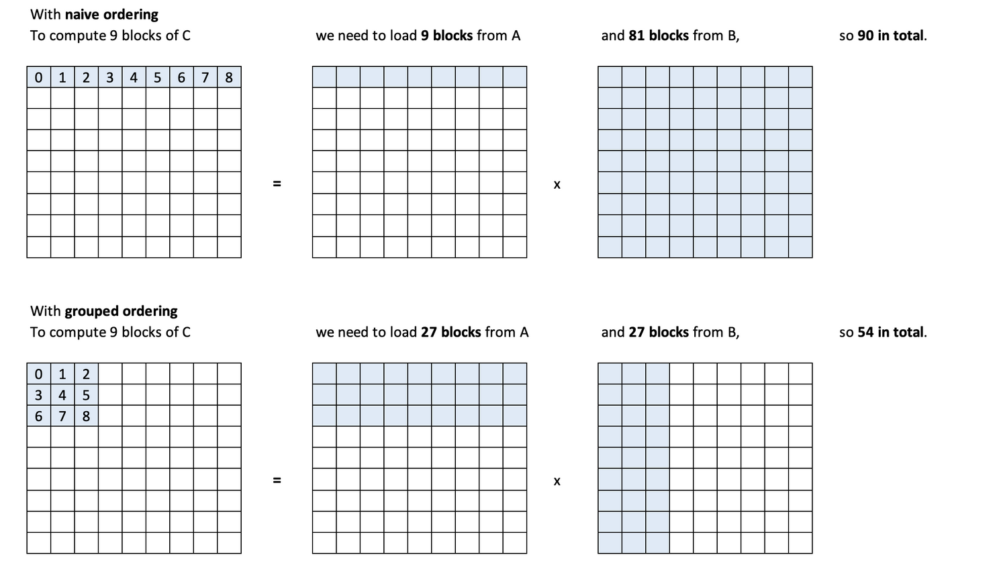

주의: 문서에서는 grouping을 "super-grouping"이라고 부른다.
좋다. Triton에게 어떤 순서로 block을 처리하라고 어떻게 알려줄까? 답은 pids를 가져와 바꾸고, 그것을 원래 pids처럼 사용하는 것이다.

이 원리를 최소 예제로 설명해 보자.

```python
def process_item(id): print(f"I'm processing item {id}")

for i in range(5): process_item(i)
```

```shell
I'm processing item 0
I'm processing item 1
I'm processing item 2
I'm processing item 3
I'm processing item 4
```

```python
def change_id(old_id): return 5-old_id

for i in range(5): process_item(change_id(i))
```

```shell
I'm processing item 5
I'm processing item 4
I'm processing item 3
I'm processing item 2
I'm processing item 1
```

이렇게 해서 item들이 다른 순서로 처리된다.

그렇다면 더 빠른 행렬 곱셈을 위한 pid 변환 함수는 어떤 모습이어야 할까? 왼쪽 matrix를 오른쪽 matrix로 변환해야 한다.

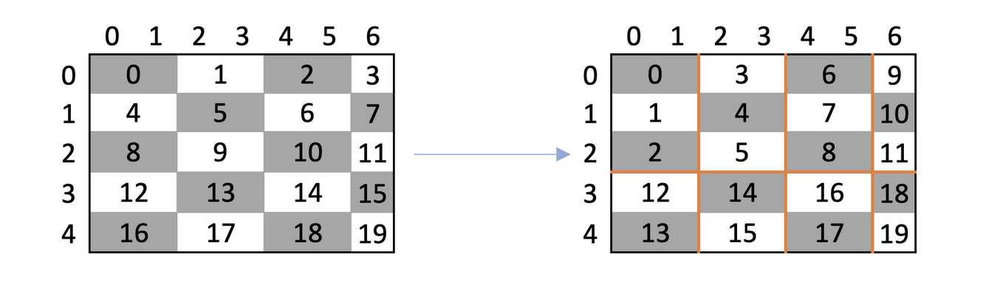

왼쪽은 기본 순서("row-major"라고 부른다)를 보여준다. 우리가 처리하는 것은 block이라는 점에 유의하라. 개별 cell의 처리 순서를 배치할 수는 없고, block의 순서만 배치할 수 있다. 그림에서 출력 matrix C는 `5x7 = 35`개의 cell을 갖지만, block은 `cdiv(5,1) x cdiv(7,2) = 5x4 = 20`개뿐이다.

오른쪽에서 처음 처리되는 9개 block이 우리가 원하는 `3x3` grid라는 점을 보라. 우리는 한 column에서 block 3개를 처리한다. 그런 다음 한 column 앞으로 이동하고 다시 block 3개를 처리하는 식으로 반복한다. 주황색 선은 앞으로 이동하는 위치를 나타낸다. 이 작업을 **"swizzling"**이라고 부른다.

덧붙이면 숫자 3은 당연히 바꿀 수 있다. 이것을 `group_size`라고 부른다.

직접 swizzling을 작성할 필요는 없다. Triton은 `triton.language.swizzle2d` 함수를 제공한다.

`swizzle2d`를 제대로 이해하기 위해, 먼저 기대한 대로 동작하는지 빠르게 검증해 보자. 그런 다음 더 빠른 행렬 곱셈 kernel에서 계속 사용한다.

부가 목표: `5x4` matrix에서 `swizzle2d`를 사용한다. 이 matrix의 원소는 row-major 순서로 `0 ... 19`로 배치되어 있다. 결과는 원소가 grouped 순서로 배치된 matrix여야 한다.

```python
@triton.jit
def swizzle_k(x_ptr, z_ptr, group_sz: tl.constexpr):
    # 현재 thread block의 ID를 가져온다
    pid_m, pid_n = tl.program_id(0), tl.program_id(1)
    # thread block의 전체 수를 가져온다
    num_pid_m, num_pid_n = tl.num_programs(0), tl.num_programs(1)

    # Triton의 swizzle2d 함수를 사용해 thread block ID를 재배열한다
    # 주의: CPU 시뮬레이션에서는 tl.swizzle2d가 정상 동작하지 않을 수 있다
    pid_m_, pid_n_ = tl.swizzle2d(pid_m, pid_n, num_pid_m, num_pid_n, group_sz)
    
    # 원래 thread block의 offset을 계산한다
    offs_m = get_1d_offset(1, n_prev_chunks=pid_m)
    offs_n = get_1d_offset(1, n_prev_chunks=pid_n)
    
    # 원래 thread block의 2D offset과 mask를 계산한다
    offs = get_2d_offset(offs_m, offs_n, stride_0=num_pid_n)
    mask = get_2d_mask(offs_m, offs_n, max_0=num_pid_m, max_1=num_pid_n )

    # 재배열된 thread block의 offset을 계산한다
    offs_sw_m = get_1d_offset(1, n_prev_chunks=pid_m_)
    offs_sw_n = get_1d_offset(1, n_prev_chunks=pid_n_)
    
    # 재배열된 thread block의 2D offset과 mask를 계산한다
    offs_sw = get_2d_offset(offs_sw_m, offs_sw_n, stride_0=num_pid_n)
    mask_sw = get_2d_mask(offs_sw_m, offs_sw_n, max_0=num_pid_m, max_1=num_pid_n)
    
    # 원래 matrix에서 데이터를 로드한다
    x = tl.load(x_ptr + offs, mask=mask)
    # 데이터를 재배열된 matrix에 저장한다
    tl.store(z_ptr + offs_sw, x, mask=mask_sw)
```

```python
blocks_m, blocks_n = 5,4

x = torch.arange(blocks_m*blocks_n, device='cuda').view(blocks_m,blocks_n)
x
```

```shell
tensor([[ 0,  1,  2,  3],
        [ 4,  5,  6,  7],
        [ 8,  9, 10, 11],
        [12, 13, 14, 15],
        [16, 17, 18, 19]], device='cuda:0')
```

```python
z = -torch.ones_like(x) # empty matrix, with -1 denoting empty
z
```

```shell
tensor([[-1, -1, -1, -1],
        [-1, -1, -1, -1],
        [-1, -1, -1, -1],
        [-1, -1, -1, -1],
        [-1, -1, -1, -1]], device='cuda:0')
```

```python
# swizzle x into z
swizzle_k[(blocks_m,blocks_n)](x,z, group_sz=3);
z
```

```shell
tensor([[ 0,  3,  6,  9],
        [ 1,  4,  7, 10],
        [ 2,  5,  8, 11],
        [12, 14, 16, 18],
        [13, 15, 17, 19]], device='cuda:0')
```

좋아 보인다!

___


이제 grouped 행렬 곱셈 kernel을 구현해 보자. 이것은 일반 행렬 곱셈보다 더 빠르다.

```python
@triton.jit
def grouped_matmul_k(
    a_ptr, b_ptr, c_ptr,  # matrix A, B, C를 가리키는 pointer
    m, n, k,  # matrix의 dimension
    stride_am, stride_ak,  # matrix A의 stride
    stride_bk, stride_bn,  # matrix B의 stride
    stride_cm, stride_cn,  # matrix C의 stride
    bm: tl.constexpr, bn: tl.constexpr, bk: tl.constexpr, group_sz: tl.constexpr  # block 크기와 group 크기
):
    pid_m, pid_n = tl.program_id(0), tl.program_id(1)  # 현재 thread block의 ID를 가져온다
    num_pid_m, num_pid_n = tl.num_programs(0), tl.num_programs(1)  # thread block의 전체 수를 가져온다
    # grouped ordering에서 block 위치를 결정한다 - 재배열!
    pid_m, pid_n = tl.swizzle2d(pid_m, pid_n, num_pid_m, num_pid_n, group_sz)  # 이상한 점: CPU 시뮬레이션에서는 tl.swizzle2d가 동작하지 않는다
    # m/n/k 차원의 block
    rm = get_1d_offset(size=bm, n_prev_chunks=pid_m)  # m 차원의 offset을 계산한다
    rn = get_1d_offset(size=bn, n_prev_chunks=pid_n)  # n 차원의 offset을 계산한다
    rk = get_1d_offset(size=bk, n_prev_chunks=0)  # k 차원의 offset을 계산한다
    # matrix A와 B의 관련 offset
    offs_a = a_ptr + get_2d_offset(rm, rk, stride_am, stride_ak)  # matrix A의 offset을 계산한다
    offs_b = b_ptr + get_2d_offset(rk, rn, stride_bk, stride_bn)  # matrix B의 offset을 계산한다
    # accumulator를 초기화하고 반복해서 갱신한다
    acc = tl.zeros((bm, bn), dtype=tl.float32)  # accumulator를 초기화한다
    for _ in range(0, k, bk):
        # todo umer: a & b를 로드할 때 mask가 필요한가?
        a = tl.load(offs_a)  # matrix A block을 로드한다
        b = tl.load(offs_b)  # matrix B block을 로드한다
        acc += tl.dot(a, b, allow_tf32=False)  # block level의 행렬 곱셈. 이상한 점: 오래된 GPU에서는 allow_tf32를 False로 설정해야 컴파일된다
        # 다음 반복에서 다음 block을 로드하도록 offset을 증가시킨다
        offs_a += bk * stride_ak
        offs_b += bk * stride_bk
    c = c_ptr + get_2d_offset(rm, rn, stride_cm, stride_cn)  # matrix C의 offset을 계산한다
    mask = get_2d_mask(rm, rn, m, n)  # mask를 계산한다
    tl.store(c, acc, mask=mask)  # accumulator 결과를 matrix C에 저장한다
```

```python
grouped_matmul = partial(matmul, matmul_k_fn=grouped_matmul_k)
```

```python
a = torch.ones((3, 4), dtype=torch.float32, device='cuda')
b = torch.ones((4, 5), dtype=torch.float32, device='cuda')
```

```python
grouped_matmul(a,b, group_sz=4)
```

```shell
tensor([[4., 4., 4., 4., 4.],
        [4., 4., 4., 4., 4.],
        [4., 4., 4., 4., 4.]], device='cuda:0', dtype=torch.float16)
```

PyTorch 구현과 unit test를 해보자.

```python
torch.manual_seed(0)
a = torch.randn((512, 512), device='cuda', dtype=torch.float16)
b = torch.randn((512, 512), device='cuda', dtype=torch.float16)
triton_output = grouped_matmul(a, b, group_sz=32)
torch_output = torch.matmul(a, b)
if torch.allclose(triton_output, torch_output, atol=5e-2, rtol=0):
    print("✅ Triton and Torch match")
else:
    print("❌ Triton and Torch differ")
```

✅ Triton and Torch match

# 성능 테스트

Triton에는 성능 테스트 도구가 포함되어 있다. 다음은 사용 예시다.

```python
# adapted from https://triton-lang.org/main/getting-started/tutorials/01-vector-add.html
@triton.testing.perf_report(
    triton.testing.Benchmark(
        x_names=['square_matrix_size'],  # plot에 사용할 x축 parameter 이름.
        x_vals=[2**i for i in range(5, 12, 1)],  # `x_name`이 가질 수 있는 여러 값.
        x_log=True,  # x축을 log scale로 둔다.
        line_arg='provider',  # plot의 서로 다른 line에 대응되는 parameter 이름.
        line_vals=['naive', 'grouped', 'torch'],  # `line_arg`가 가질 수 있는 값.
        line_names=['Naive', 'Grouped', 'Torch'],  # line label 이름.
        styles=[('blue', '-'), ('green', '-'), ('orange','-')],  # line style.
        ylabel='GB/s',  # y축 label 이름.
        plot_name='matmul-performance',  # plot 이름이며 저장 파일명으로도 사용된다.
        args={},  # `x_names`와 `y_name`에 없는 함수 parameter 값.
    ))
def benchmark(square_matrix_size, provider):
    sz = square_matrix_size  # matrix 크기
    a = torch.rand((sz, sz), device='cuda', dtype=torch.float32)  # random matrix a를 생성한다
    b = torch.rand((sz, sz), device='cuda', dtype=torch.float32)  # random matrix b를 생성한다
    quantiles = [0.5, 0.2, 0.8]  # 성능 테스트에 사용할 quantile
    if provider == 'naive':  # naive 방법을 사용하는 경우
        ms, min_ms, max_ms = triton.testing.do_bench(lambda: naive_matmul(a, b), quantiles=quantiles)  # 성능 테스트를 실행한다
    if provider == 'grouped':  # grouped 방법을 사용하는 경우
        ms, min_ms, max_ms = triton.testing.do_bench(lambda: grouped_matmul(a, b, group_sz=8), quantiles=quantiles)  # 성능 테스트를 실행한다
    if provider == 'torch':  # PyTorch 방법을 사용하는 경우
        ms, min_ms, max_ms = triton.testing.do_bench(lambda: torch.matmul(a, b), quantiles=quantiles)  # 성능 테스트를 실행한다
    gbps = lambda ms: 12 * sz / ms * 1e-6  # bandwidth(GB/s)를 계산한다
    return gbps(ms), gbps(max_ms), gbps(min_ms)  # bandwidth 값을 반환한다
```

> 개인적으로 여기의 gbps 공식에는 오류가 있는 것 같다. 12 * sz^2 / ms * 1e-6 이어야 하지 않을까? 아래에 Deepseek v2.5의 유도를 제시한다.

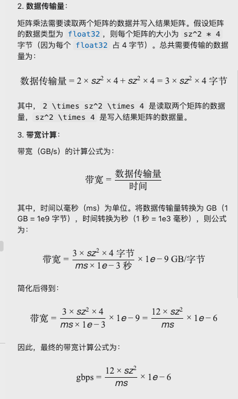

```python
benchmark.run(print_data=True, show_plots=True)
```

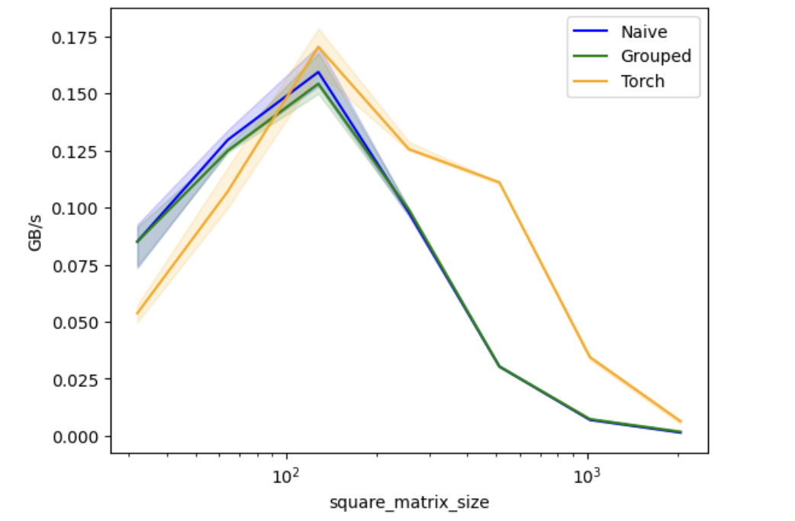

```shell
matmul-performance:
   square_matrix_size     Naive   Grouped     Torch
0                32.0  0.085106  0.085106  0.053691
1                64.0  0.129730  0.125000  0.107143
2               128.0  0.159468  0.154341  0.170515
3               256.0  0.097909  0.099071  0.125654
4               512.0  0.030346  0.030361  0.111079
5              1024.0  0.006971  0.007279  0.034461
6              2048.0  0.001405  0.001749  0.006355
```

Umer 주: 나는 matrix 크기가 커질수록 GB/s가 증가할 것이라고 생각했다. 왜 그렇지 않을까? shared memory가 가득 차서 kernel이 데이터를 다시 로드하는 데 점점 더 많은 시간을 쓰기 때문일 수 있다.

다른 block 크기를 시도해 보자.

```python
@triton.testing.perf_report(
    triton.testing.Benchmark(
        x_names=['batch_size'], x_vals=[2**i for i in range(4, 7, 1)], x_log=True,
        line_arg='provider', line_vals=['naive', 'grouped', 'torch'], line_names=['Naive', 'Grouped', 'Torch'],
        styles=[('blue', '-'), ('green', '-'), ('orange','-')],
        ylabel='GB/s', plot_name='matmul-performance', args={}
    ))
def benchmark(batch_size, provider):
    sz = 512
    a = torch.rand((sz, sz), device='cuda', dtype=torch.float32)
    b = torch.rand((sz, sz), device='cuda', dtype=torch.float32)
    quantiles = [0.5, 0.2, 0.8]
    if provider == 'naive':   ms, min_ms, max_ms = triton.testing.do_bench(lambda: naive_matmul(a, b, bs=batch_size), quantiles=quantiles)
    if provider == 'grouped': ms, min_ms, max_ms = triton.testing.do_bench(lambda: grouped_matmul(a, b, bs=batch_size, group_sz=8), quantiles=quantiles)
    if provider == 'torch':   ms, min_ms, max_ms = triton.testing.do_bench(lambda: torch.matmul(a,b), quantiles=quantiles)
    gbps = lambda ms: 12 * sz / ms * 1e-6
    return gbps(ms), gbps(max_ms), gbps(min_ms)

benchmark.run(print_data=True, show_plots=True)
```

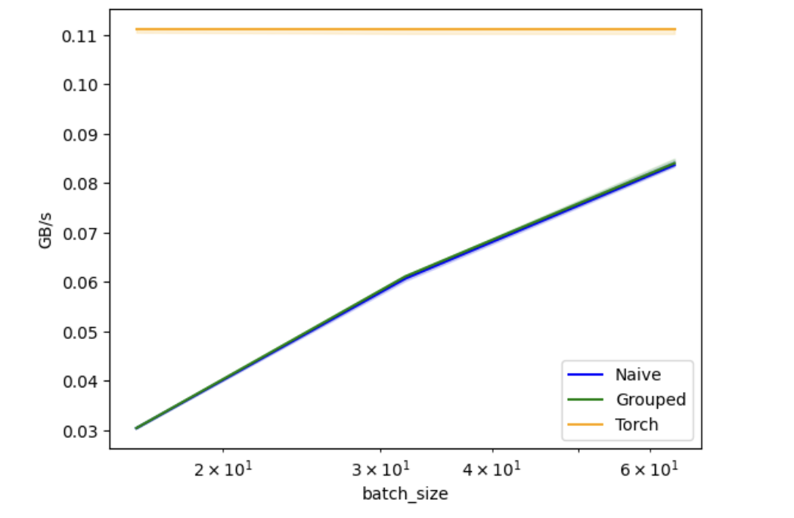

```shell
matmul-performance:
   batch_size     Naive   Grouped     Torch
0        16.0  0.030404  0.030433  0.111111
1        32.0  0.060683  0.061127  0.111111
2        64.0  0.083660  0.084026  0.111111
```

더 큰 block 크기가 더 좋아 보인다. 더 큰 block 크기를 사용해 다시 PyTorch와 비교해 보자.

```python
@triton.testing.perf_report(
    triton.testing.Benchmark(
        x_names=['square_matrix_size'], x_vals=[2**i for i in range(5, 12, 1)], x_log=True,
        line_arg='provider', line_vals=['naive', 'grouped', 'torch'], line_names=['Naive', 'Grouped', 'Torch'],
        styles=[('blue', '-'), ('green', '-'), ('orange','-')],
        ylabel='GB/s', plot_name='matmul-performance', args={}
    ))
def benchmark(square_matrix_size, provider):
    sz = square_matrix_size
    a = torch.rand((sz, sz), device='cuda', dtype=torch.float32)
    b = torch.rand((sz, sz), device='cuda', dtype=torch.float32)
    quantiles = [0.5, 0.2, 0.8]
    if provider == 'naive':   ms, min_ms, max_ms = triton.testing.do_bench(lambda: naive_matmul(a, b, bs=64), quantiles=quantiles)
    if provider == 'grouped': ms, min_ms, max_ms = triton.testing.do_bench(lambda: grouped_matmul(a, b, group_sz=8, bs=64), quantiles=quantiles)
    if provider == 'torch':   ms, min_ms, max_ms = triton.testing.do_bench(lambda: torch.matmul(a,b), quantiles=quantiles)
    gbps = lambda ms: 12 * sz / ms * 1e-6
    return gbps(ms), gbps(max_ms), gbps(min_ms)

benchmark.run(print_data=True, show_plots=True)
```

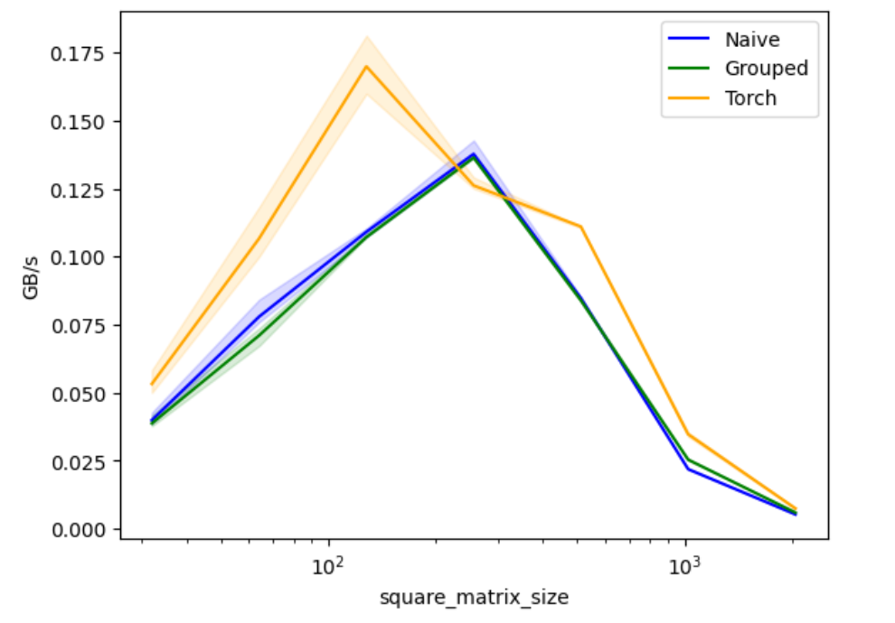

```shell
matmul-performance:
   square_matrix_size     Naive   Grouped     Torch
0                32.0  0.039867  0.038710  0.053215
1                64.0  0.077922  0.071006  0.106667
2               128.0  0.109091  0.107143  0.169912
3               256.0  0.137733  0.136364  0.126150
4               512.0  0.084731  0.083916  0.111047
5              1024.0  0.021879  0.025362  0.034691
6              2048.0  0.005257  0.005919  0.007440
```

이는 큰 matrix 크기에서 PyTorch와의 성능 차이를 줄였지만, PyTorch가 여전히 더 좋다.

팁: 성능 분석에는 Nsight Compute를 사용해 kernel을 분석할 수 있다.
`ncu --target-processes all your_python_file.py`

# 자동 튜닝

https://triton-lang.org/main/getting-started/tutorials/03-matrix-multiplication.html 에서 수정했다.

meta-parameter(예: block 크기)와 compile option(예: `num_warps`)의 선택은 kernel 속도에 영향을 준다. Triton은 가능한 선택 목록을 전달하고, 그 모든 선택을 실행한 다음, 가장 빠른 선택으로 kernel을 컴파일할 수 있게 해준다. 이것을 `자동 튜닝`이라고 부른다.

문제 크기가 변하면(예: matrix 크기 변화) 새로운 문제 크기에 대해 새로운 자동 튜닝이 수행된다.

```python
@triton.autotune(
    # Choices of configs to auto-tune over
    configs=[
        triton.Config({'bm': 128, 'bn': 256, 'bk': 64, 'group_sz': 8}, num_stages=3, num_warps=8),
        triton.Config({'bm': 64, 'bn': 256, 'bk': 32, 'group_sz': 8}, num_stages=4, num_warps=4),
        triton.Config({'bm': 128, 'bn': 128, 'bk': 32, 'group_sz': 8}, num_stages=4, num_warps=4),
        triton.Config({'bm': 128, 'bn': 64, 'bk': 32, 'group_sz': 8}, num_stages=4, num_warps=4),
        triton.Config({'bm': 64, 'bn': 128, 'bk': 32, 'group_sz': 8}, num_stages=4, num_warps=4),
        triton.Config({'bm': 128, 'bn': 32, 'bk': 32, 'group_sz': 8}, num_stages=4, num_warps=4),
        triton.Config({'bm': 64, 'bn': 32, 'bk': 32, 'group_sz': 8}, num_stages=5, num_warps=2),
        triton.Config({'bm': 32, 'bn': 64, 'bk': 32, 'group_sz': 8}, num_stages=5, num_warps=2),
    ],
    # Definition of problem size. If it changes, a new auto-tune is run for the new problem size.
    key=['m', 'n', 'k'],
)
@triton.jit
def grouped_autotuned_matmul_k(
    a_ptr, b_ptr, c_ptr,
    m, n, k,
    stride_am, stride_ak, 
    stride_bk, stride_bn,
    stride_cm, stride_cn,
    bm: tl.constexpr, bn: tl.constexpr, bk: tl.constexpr, group_sz: tl.constexpr
):
    pid_m = tl.program_id(0)
    pid_n = tl.program_id(1)
    num_pid_m = tl.num_programs(0)
    num_pid_n = tl.num_programs(1)
    # determine location of block in grouped ordering
    pid_m, pid_n = tl.swizzle2d(pid_m, pid_n, num_pid_m, num_pid_n, group_sz)  # Weirdness: tl.swizzle2d doesn't work when simulating on CPU
    # chunks along m/n/k dimensions
    rm = get_1d_offset(size=bm, n_prev_chunks=pid_m)
    rn = get_1d_offset(size=bn, n_prev_chunks=pid_n)
    rk = get_1d_offset(size=bk, n_prev_chunks=0)
    # relevant offsets of a, b
    offs_a = a_ptr + get_2d_offset(rm, rk, stride_am, stride_ak)
    offs_b = b_ptr + get_2d_offset(rk, rn, stride_bk, stride_bn)
    # initialize and iteratively update accumulator
    acc = tl.zeros((bm, bn), dtype=tl.float32)
    for _ in range(0, k, bk):
        # todo umer: don't we need mask when loading a & b?
        a = tl.load(offs_a)
        b = tl.load(offs_b)
        acc += tl.dot(a, b, allow_tf32=False) # block level matrix multiplication ; Weirdness: allow_tf32 must be set to False for older GPUs, otherwise won't compile
        # increase offets, so next iteration loads next chunks
        offs_a += bk * stride_ak
        offs_b += bk * stride_bk
    c = c_ptr + get_2d_offset(rm, rn, stride_cm, stride_cn)
    mask = get_2d_mask(rm, rn, m, n)
    tl.store(c, acc, mask=mask)

def grouped_autotuned_matmul(a, b):
    matmul_k_fn = grouped_autotuned_matmul_k
    
    assert a.shape[1] == b.shape[0], "matrix dims not compatible for matmul"
    check_tensors_gpu_ready(a, b)
    (m, k), (_, n) = a.shape, b.shape
    c = torch.empty((m, n), device=a.device, dtype=torch.float16)
    grid = lambda meta: (triton.cdiv(m, meta['bm']),  triton.cdiv(n, meta['bn']))
    matmul_k_fn[grid](
        a, b, c,
        m, n, k,
        a.stride(0), a.stride(1),
        b.stride(0), b.stride(1),
        c.stride(0), c.stride(1),
        # bm=bs, bn=bs, bk=bs, <- will be autotuned
        # **group_sz <- will be autotuned
    )
    return c
```

```
a,b = torch.ones(3,4, device='cuda'), torch.ones(4,5, device='cuda')
a@b
```

```shell
tensor([[4., 4., 4., 4., 4.],
        [4., 4., 4., 4., 4.],
        [4., 4., 4., 4., 4.]], device='cuda:0')
```

주의: 때때로 아래 줄이 잘못된 결과를 반환하는데, 나는 이 문제를 안정적으로 재현하지 못했다. 재현할 수 있다면 Twitter(@UmerHAdil)로 알려 달라! 🙏🏽

```python
grouped_autotuned_matmul(a,b)
```

```shell
tensor([[4., 4., 4., 4., 4.],
        [4., 4., 4., 4., 4.],
        [4., 4., 4., 4., 4.]], device='cuda:0', dtype=torch.float16)
```

자동 튜닝 config에 관한 조언, 기법, heuristic은 [Mark Saroufim의 발표 "CUDA Performance Checklist"](https://www.youtube.com/watch?v=SGhfUhlowB4)를 참고하라. 그중 많은 내용은 Triton에도 적용된다.

다시 benchmark를 실행해 보자. 각 benchmark parameter 선택마다 자동 튜닝을 수행하므로 시간이 많이 걸린다(즉, 우리에게는 12-5=7회).

```python
@triton.testing.perf_report(
    triton.testing.Benchmark(
        x_names=['square_matrix_size'], x_vals=[2**i for i in range(5, 12, 1)], x_log=True,
        line_arg='provider', line_vals=['naive', 'grouped', 'grouped-autotuned', 'torch'], line_names=['Naive', 'Grouped', 'Grouped & Auto-Tuned','Torch'],
        styles=[('blue', '-'), ('green', '-'), ('green', '--'), ('orange','-')],
        ylabel='GB/s', plot_name='matmul-performance', args={}
    ))
def benchmark(square_matrix_size, provider):
    sz = square_matrix_size
    a = torch.rand((sz, sz), device='cuda', dtype=torch.float32)
    b = torch.rand((sz, sz), device='cuda', dtype=torch.float32)
    quantiles = [0.5, 0.2, 0.8]
    if provider == 'naive':   ms, min_ms, max_ms = triton.testing.do_bench(lambda: naive_matmul(a, b, bs=64), quantiles=quantiles)
    if provider == 'grouped': ms, min_ms, max_ms = triton.testing.do_bench(lambda: grouped_matmul(a, b, group_sz=8, bs=64), quantiles=quantiles)
    if provider == 'grouped-autotuned': ms, min_ms, max_ms = triton.testing.do_bench(lambda: grouped_autotuned_matmul(a, b), quantiles=quantiles)
    if provider == 'torch':   ms, min_ms, max_ms = triton.testing.do_bench(lambda: torch.matmul(a,b), quantiles=quantiles)
    gbps = lambda ms: 12 * sz / ms * 1e-6
    return gbps(ms), gbps(max_ms), gbps(min_ms)

benchmark.run(print_data=True, show_plots=True)
```

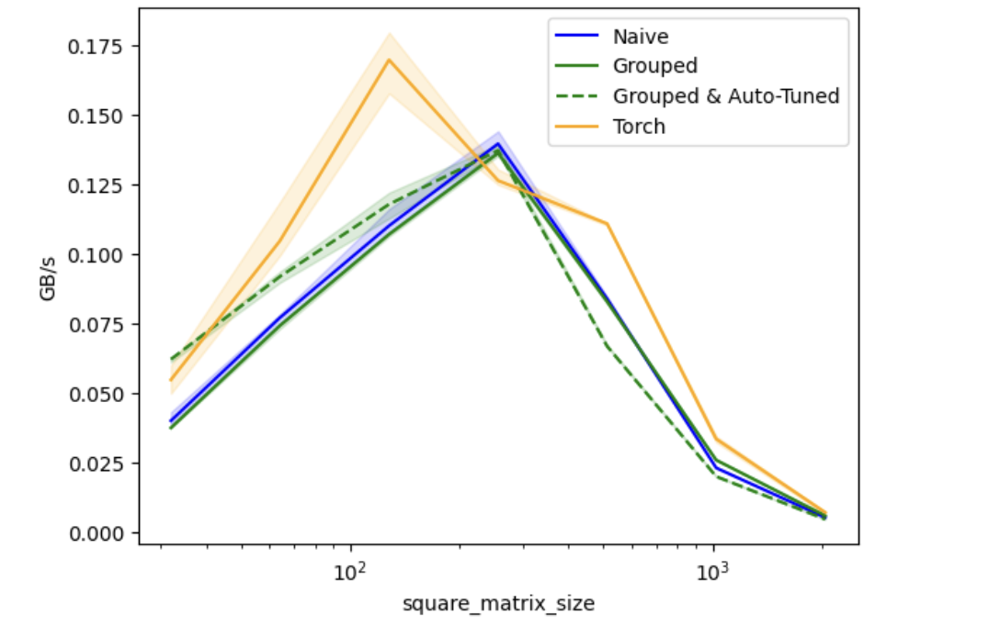

```shell
matmul-performance:
   square_matrix_size     Naive   Grouped  Grouped & Auto-Tuned     Torch
0                32.0  0.040067  0.037500              0.062176  0.054795
1                64.0  0.077170  0.074303              0.091954  0.104803
2               128.0  0.110218  0.107143              0.117936  0.169912
3               256.0  0.139738  0.136364              0.137339  0.126482
4               512.0  0.083953  0.082937              0.066864  0.110983
5              1024.0  0.023112  0.025932              0.020007  0.033520
6              2048.0  0.005235  0.005912              0.004629  0.007076
```

___
<h1>이것으로 전체 내용이 끝났다! 이 튜토리얼을 완료한 것을 축하한다 - Good work! 🥳</h1>

직접 Triton kernel을 몇 개 작성해 보는 것을 강력히 권한다. 예를 들어 Triton 퍼즐을 시도해 볼 수 있다: https://github.com/srush/Triton-Puzzles, 제공자는 [Sasha Rush](https://twitter.com/srush_nlp), Tejas Ramesh, [Keren Zhou](https://twitter.com/ZhouKeren)이다.

다음은 중급 및 고급 자료다.
- 공식 문서: https://triton-lang.org/
- LightLLM 저장소에는 실제 Triton kernel이 많이 들어 있다: https://github.com/ModelTC/lightllm/tree/main/lightllm/common/basemodel/triton_kernel
- Unsloth 저장소에도 실제 Triton kernel이 많이 들어 있다: https://github.com/unslothai/unsloth/tree/main/unsloth/kernels
GPU 프로그래밍과 성능 최적화에 관심이 있다면 [cuda mode Discord](https://discord.gg/cudamode)가 도움이 될 수 있다. 이 튜토리얼은 그들의 훌륭한 [강의 시리즈](https://www.youtube.com/@CUDAMODE)의 일부로 작성되었다.
