# Lecture 15 CUTLASS

> 내 강의 노트이며, 많은 관심 바란다: https://github.com/BBuf/how-to-optim-algorithm-in-cuda/tree/master/cuda-mode 

## 제15강: CUTLASS

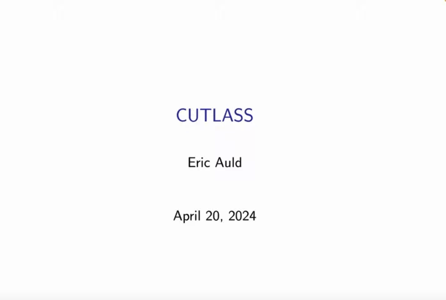

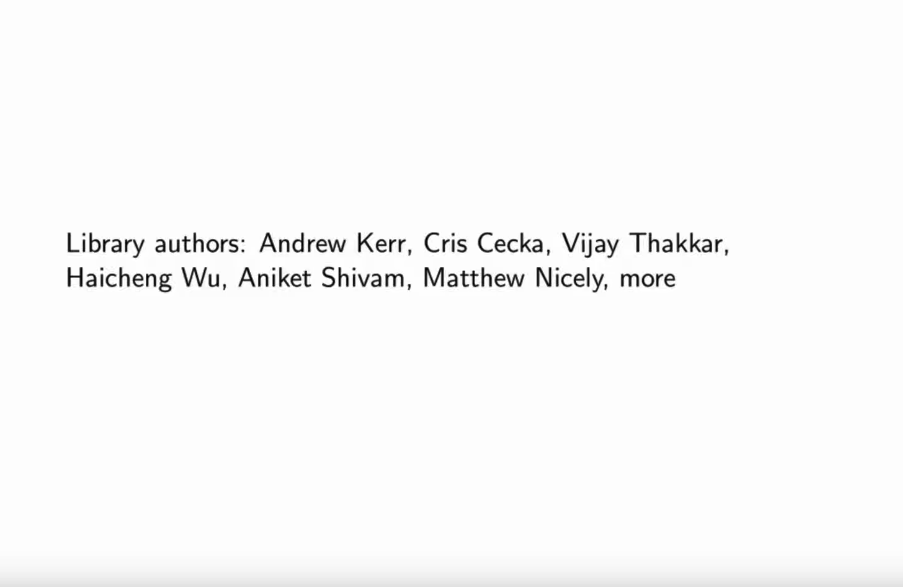

CUTLASS library의 일부 author를 보여준다.

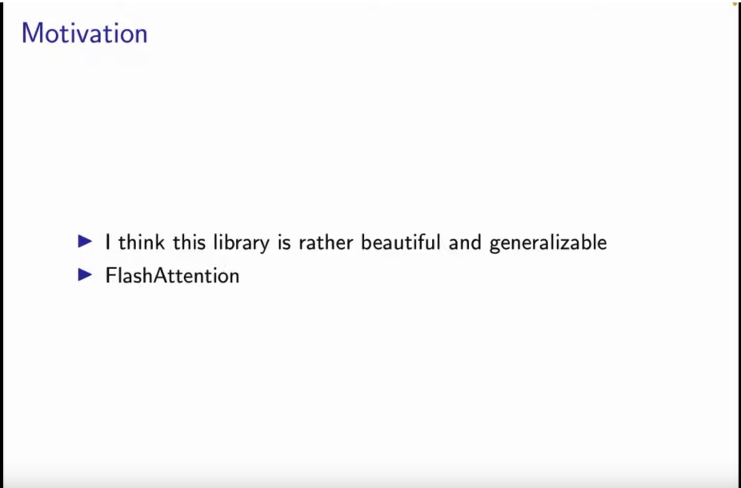

발표자는 CUTLASS library가 매우 아름답고 범용적으로 작성되어 있다고 본다. 또한 CUTLASS는 고성능 FlashAttention도 구현했다. 발표자는 이 강의에서 CUTLASS의 API와 구체적인 function, method를 많이 언급하지 않고, 개념 소개에 중점을 둔다.

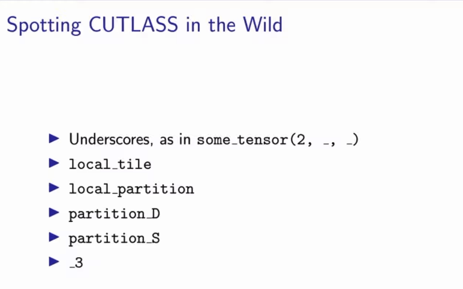

그림에는 CUTLASS의 몇 가지 특징적인 지표가 나열되어 있다.

- 밑줄 사용, 예를 들어 some_tensor(2, _, _)에서 보이는 방식
- local_tile
- local_partition
- partition_D
- partition_S
- _3

이러한 특징은 CUTLASS library에서 흔히 볼 수 있는 naming convention, function 또는 variable name이다.

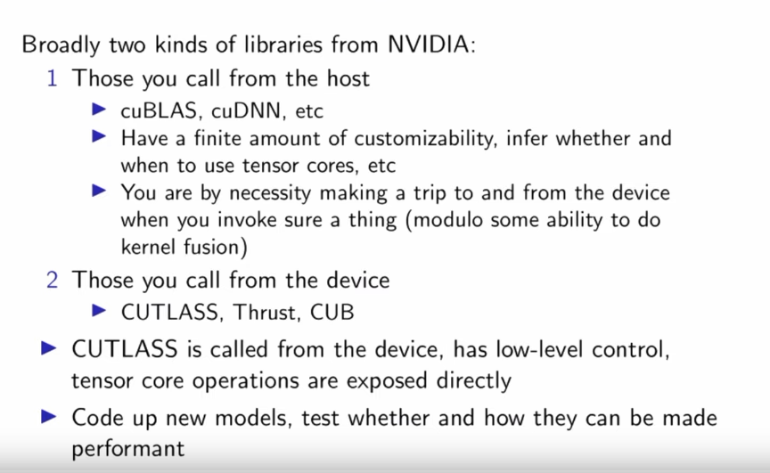

이 slide는 NVIDIA가 제공하는 두 큰 class의 library를 소개한다.

- host에서 호출하는 library
    - 예: cuBLAS, cuDNN 등
    - 이러한 library는 customization이 제한적이며, tensor core를 사용할지와 언제 사용할지를 추론할 수 있다.
    - 이러한 library를 사용할 때는 매번 호출마다 device와 host 사이의 data transfer가 필요하다. 단, kernel fusion을 수행할 수 있는 일부 경우는 제외한다.
- device에서 호출하는 library
    - 예: CUTLASS, Thrust, CUB
- 특히 CUTLASS는 device에서 호출되며, low-level control을 제공하고 tensor core operation을 직접 노출한다고 언급한다.
- developer는 새로운 model을 작성하고, 그것들이 고성능을 낼 수 있는지와 어떻게 낼 수 있는지 test할 수 있다.

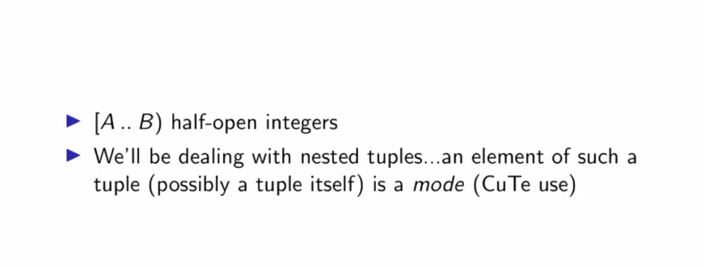

혼동을 피하기 위해 이 slide는 두 가지 중요한 개념을 소개한다.

- [A .. B] half-open interval integer: 이는 integer range를 나타내며, A부터 B까지의 모든 integer를 포함하지만 B는 포함하지 않는다. 예를 들어 [1 .. 5]는 integer set {1, 2, 3, 4}를 나타낸다.
- nested tuple과 mode: 여기서는 nested tuple을 다룰 것이라고 말한다. 이런 tuple 안의 element 하나, 그 자체가 tuple일 수도 있는 element를 "mode"라고 부른다. 특히 이것은 CuTe에서 사용하는 용어라고 지적한다. CuTe는 CUTLASS library의 subcomponent다. 이는 CUDA programming을 단순화하기 위한 C++ template library다. CuTe는 abstraction layer를 제공해 developer가 efficient CUDA code를 더 쉽게 작성할 수 있게 한다.

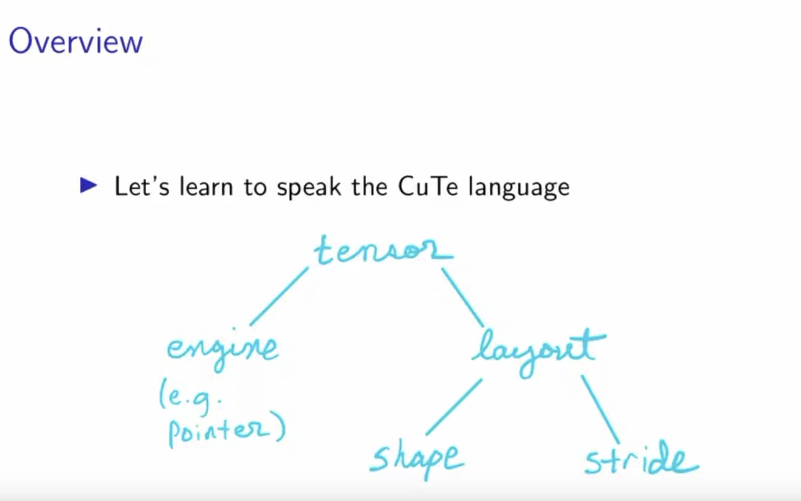

이 slide는 tree structure를 사용해 CuTe에서 tensor의 구성을 보여준다.

- 최상위는 "tensor"다.
- tensor는 두 주요 부분으로 구성된다.
    - "engine", 괄호 안에는 예시 "(e.g. pointer)"가 있어 engine이 pointer type일 수 있음을 나타낸다.
    - "layout", 이는 다시 두 subpart로 나뉜다.
        - "shape"
        - "stride"

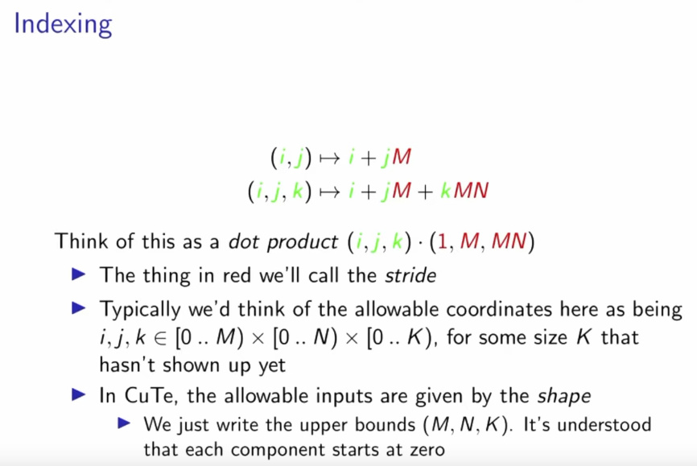

이 slide는 CuTe의 Indexing 개념을 설명한다.

- index formula:
    - 2D index: (i, j) -> i + jM
    - 3D index: (i, j, k) -> i + jM + kMN
- 이러한 formula는 dot product로 볼 수 있다: (i, j, k) · (1, M, MN)
- 빨간색 부분은 "stride"라고 부른다.
- 보통 허용되는 coordinate range는 다음과 같이 정의된다: i, j, k ∈ [0 .. M) × [0 .. N) × [0 .. K), 여기서 K는 아직 표시되지 않은 어떤 size다.
- CuTe에서는 허용되는 input이 "shape"로 주어진다. 상한 (M, N, K)만 적으면 되며, 기본적으로 각 component는 0부터 시작한다.

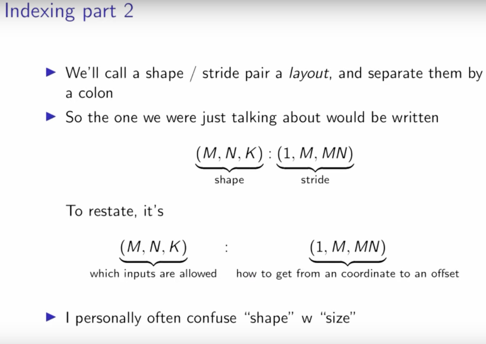

이 slide는 CuTe의 indexing 개념을 계속 설명한다.

- shape와 stride의 조합을 layout이라고 부르며, colon(:)으로 shape와 stride를 구분한다.
- 앞서 논의한 예시는 `(M, N, K) : (1, M, MN)`으로 쓸 수 있다. 여기서 `(M, N, K)`는 shape이고 `(1, M, MN)`은 stride다.
- 왼쪽 `(M, N, K)`는 "which inputs are allowed", 즉 허용되는 input range를 나타낸다. 오른쪽 `(1, M, MN)`은 "how to get from an coordinate to an offset", 즉 coordinate에서 offset으로 가는 방법을 나타낸다.
- 주석: "I personally often confuse 'shape' w 'size'", 즉 업로더 개인적으로 "shape"와 "size"를 자주 혼동한다고 한다.

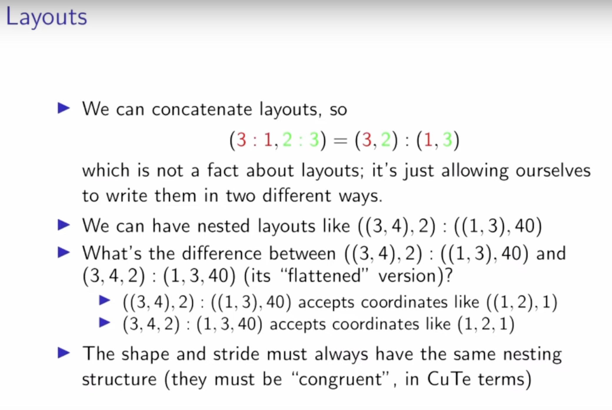

이 slide는 CuTe의 Layouts 개념을 설명한다.

- layout을 연결할 수 있다. 예를 들어 `(3 : 1, 2 : 3) = (3, 2) : (1, 3)`이다. 이는 layout에 관한 사실이 아니라, 같은 layout을 두 가지 방식으로 쓸 수 있게 허용하는 것이다.
- nested layout도 있을 수 있다. 예: `((3, 4), 2) : ((1, 3), 40)`
- `((3, 4), 2) : ((1, 3), 40)`와 `(3, 4, 2) : (1, 3, 40)`, 즉 그 "flattened" version을 비교한다.
    - `((3, 4), 2) : ((1, 3), 40)`은 `((1, 2), 1)` 같은 coordinate를 받는다.
    - `(3, 4, 2) : (1, 3, 40)`은 `(1, 2, 1)` 같은 coordinate를 받는다.
- shape와 stride는 항상 같은 nested structure를 가져야 한다. CuTe 용어로는 이들이 "consistent" 또는 "congruent"해야 한다.

이어지는 많은 시간은 사실 PyTorch 안에서 Tensor의 shape와 stride 관계를 설명하는 데 쓰인다. 이 부분의 설명은 모두 업로더가 손으로 그린 것이므로, 여기서는 요점만 간단히 문자로 기록한다.

- 큰 tensor, 예를 들어 2D tensor 안의 작은 slice tensor의 경우, 큰 tensor와 비교하면 shape만, 물리 memory 관점에서는 base pointer의 initial position만 바뀌고 stride는 변하지 않는다.
- 실제로 이 작은 slice tensor가 Tile이다. matrix 안의 모든 Tile에 대해 그들의 Strides는 원본 tensor와 동일하지만, base pointer 위치와 Shape는 다르다.
- PyTorch의 `is_contiguous`를 직관적으로 설명하면, Tensor의 underlying 1D array element 저장 순서가 Tensor를 row-major로 1D flatten했을 때의 element 순서와 일치하는지 여부다. 이 부분은 https://zhuanlan.zhihu.com/p/64551412 를 보며 자세히 이해하는 것을 추천한다.

실제로 이 부분은 Tensor의 Shape와 Stride 개념, 그리고 Tiling 이후 Sub Tensor의 Shape/Stride와 원 Tensor의 관계를 논의한다.

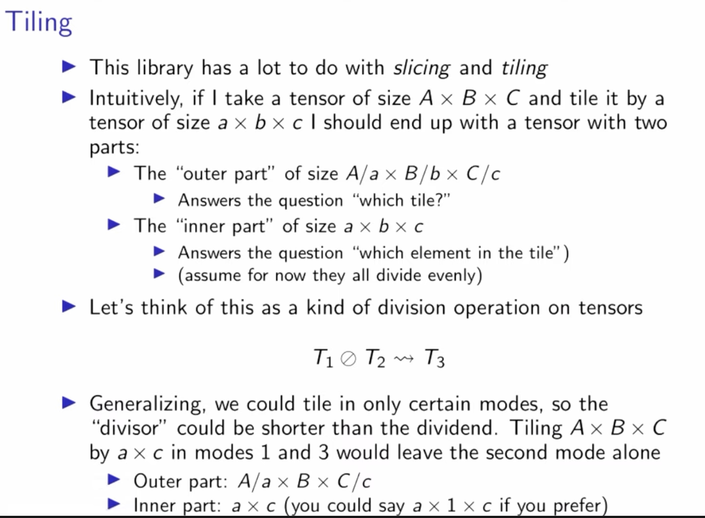

이 slide는 CUTLASS의 slicing과 tiling 개념을 논의한다.
- 이 library 설계에는 slicing과 tiling 개념이 많이 포함된다.
- Tiling operation의 직관적 설명:
    - A x B x C 크기의 tensor가 있고, a x b x c 크기의 tensor로 Tiling한다고 하자.
    - 결과는 두 부분을 포함하는 tensor가 된다.
        - a. "outer part", 크기는 A/a x B/b x C/c이며, "어느 tile인가?"라는 질문에 답한다.
        - b. "inner part", 크기는 a x b x c이며, "tile 안의 어느 element인가?"라는 질문에 답한다.
    - 모든 dimension이 나누어떨어진다고 가정한다.
- Tiling을 tensor 위의 division operation으로 본다: T1 ⊘ T2 -> T3
- Tiling의 일반화: 특정 mode(dimension)에 대해서만 Tiling할 수 있다. "divisor"가 dividend보다 짧을 수 있다. 예를 들어 A x B x C를 mode 1과 3에서 a x c로 Tiling하면:
    - outer part: A/a x B x C/c
    - inner part: a x c, 이는 a x 1 x c로도 나타낼 수 있다.

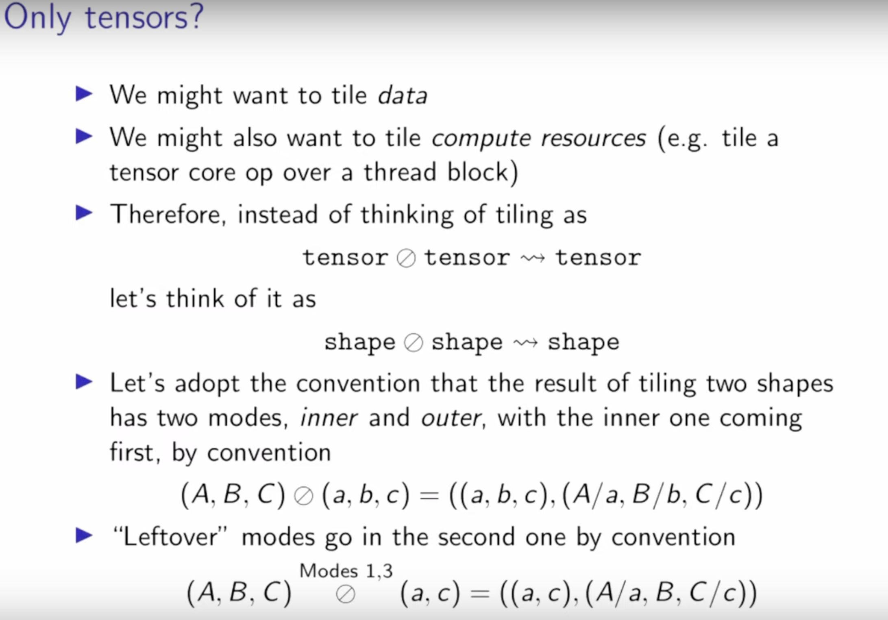

이 slide는 tiling operation의 확장 개념을 논의한다. 이는 tensor에만 한정되지 않는다.

- Tiling의 적용 범위: data를 Tiling할 수 있을 뿐 아니라 compute resources도 Tiling할 수 있다. 예를 들어 thread block 위에서 TensorCore operation을 Tiling한다.
- Tiling 개념의 일반화: 더 이상 단순히 tensor ⊘ tensor -> tensor만 고려하지 않고, 더 일반적으로 shape ⊘ shape -> shape를 고려한다.
- Tiling result의 convention: 두 shape를 Tiling한 결과에는 inner와 outer 두 mode가 있다. convention상 inner mode를 앞에 두고 outer mode를 뒤에 둔다.
- Tiling operation 예: `(A, B, C) ⊘ (a, b, c) = ((a, b, c), (A/a, B/b, C/c))`. 여기서 `(a, b, c)`는 inner mode, 즉 단일 tile의 크기를 나타내고, `(A/a, B/b, C/c)`는 outer mode, 즉 tile의 개수나 배열을 나타낸다.
- "Leftover" modes, 즉 Tiling되지 않은 dimension은 convention상 두 번째 outer mode에 둔다. 예: `(A, B, C)`를 mode 1, 3에서 `(a, c)`로 tiling하면 결과는 `((a, c), (A/a, B, C/c))`다. 여기서 B dimension은 "leftover" mode로 outer mode 안에 유지된다.

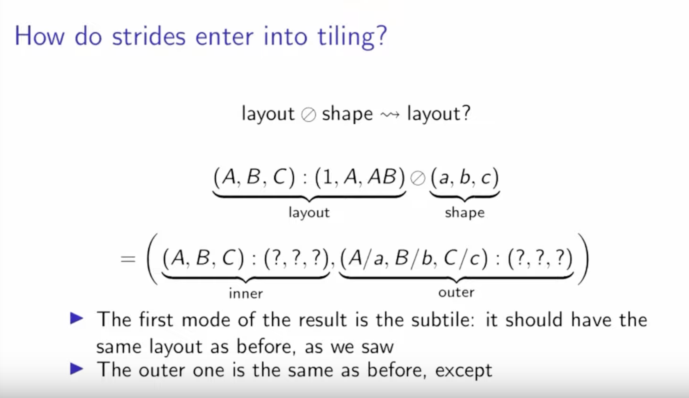

> 여기에 spelling error가 하나 있다. 두 번째 줄 formula의 시작 부분 A, B, C는 lowercase여야 한다.

- Slides는 "How do strides enter into tiling?", 즉 stride가 Tiling operation에 어떻게 들어가는가라는 문제를 제기한다.
- `layout ⊘ shape -> layout?` 이는 layout을 shape와 tiling했을 때 결과 layout이 무엇인지 나타낸다.
- 구체적 예: `(A, B, C) : (1, A, AB) ⊘ (a, b, c)`. 왼쪽 `(A, B, C) : (1, A, AB)`는 layout이고, 오른쪽 `(a, b, c)`는 shape다.
- 결과는 `= ((a, b, c) : (?, ?, ?), (A/a, B/b, C/c) : (?, ?, ?))`가 된다. 결과는 inner와 outer 두 부분으로 나뉜다.
    - 결과의 첫 번째 mode(inner)는 원래와 같은 layout을 유지해야 한다. 앞의 문자 기록 요점에서도 언급했다.
    - outer mode는 stride가 unknown이라는 점을 제외하면 앞과 동일하다. 물음표로 표시한다.

이 문제를 설명하기 위해 author는 그림 하나를 그렸다. 여기서는 `(M, N) : (1, M)`을 예로 든다. 즉 col major 2D matrix다.

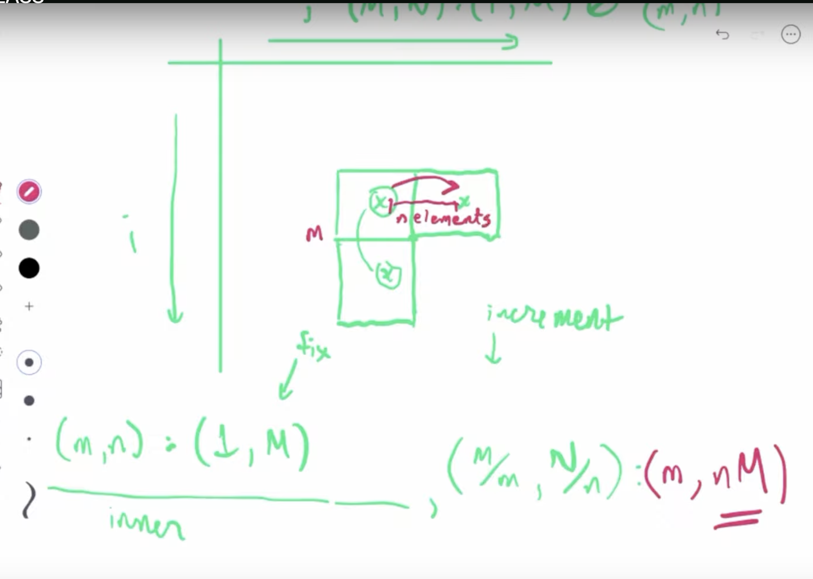

이를 Tiling하면 그림 속 세 작은 block을 얻을 수 있다. 이 작은 block들의 Layout은 최종적으로 `(M/m, N/n) : (m, nM)`으로 표현된다. 여기서 m, n은 각각 tiling size를 나타낸다.

따라서 `(A, B, C) : (1, A, AB) ⊘ (a, b, c) =`
    `((a, b, c) : (1, A, AB), (A/a, B/b, C/c) : (a, A * b, A * B * c))`

위 formula는 다음처럼 update된다.

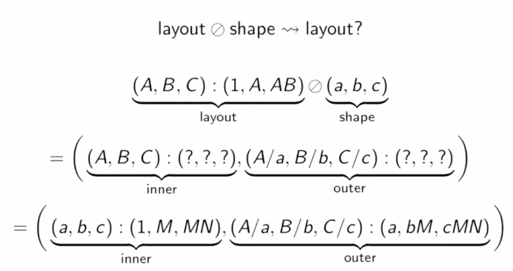

이 강의의 Slides는 여기까지다. 이 강의는 주로 CUTLASS 안에 2022년 말 도입된 CUTE의 몇 가지 기본 개념을 설명했다. 뒤에서 업로더는 cutlass source code의 일부를 골라 보고 CUTLASS code directory structure도 간단히 이야기했지만, 이 부분은 Notes에 넣을 필요가 없어 생략했다.
