> 내 강의 노트입니다. 팔로우 환영: https://github.com/BBuf/how-to-optim-algorithm-in-cuda/tree/master/cuda-mode 。이 강의는 CUDA C++ 핵심 라이브러리(CCCL)를 사용하여 llm.c를 llm.cpp로 포팅하는 방법을 소개한다. CCCL은 Thrust, CUB, libcu++ 등 라이브러리의 집합으로 고수준에서 저수준까지 완전한 툴체인을 제공한다. 강의에서 여러 핵심 개선 사항을 보여준다: 빌드 시스템을 Makefile에서 CMake로 마이그레이션하여 더 나은 크로스 플랫폼 지원을 얻는 것; `thrust::device_vector`를 사용하여 원시 메모리 관리를 대체함으로써 자동화와 타입 안전성을 실현하는 것; `cuda::std::mdspan`을 채택하여 다차원 배열 연산을 단순화하는 것; `cuda::atomic_ref`를 사용하여 더 명확한 스레드 범위 제어를 제공하는 것. Kernel Fusion과 CUB의 BlockReduce 등 최적화 기법과 함께 NVBench를 활용한 성능 테스트를 통해, 원래의 성능과 정확도를 유지하면서 코드를 더 간결하고 안전하며 유지 관리하기 쉽게 만들었다. 이번 포팅은 현대 CUDA C++ 툴체인을 사용하여 전통적인 CUDA C 코드를 개선하는 방법을 잘 보여주며, 성능을 유지하면서 코드 품질과 개발 효율성을 높인다. 다만 일부 고급 추상화는 학습 비용을 높일 수 있어 사용 편의성과 복잡성 사이의 균형을 찾아야 한다. CCCL 오픈소스 주소: https://github.com/NVIDIA/cccl

# 제16강, CUDA C++ 핵심 라이브러리를 이용한 llm.c 포팅

## 강의 노트

> CUDA C++ 핵심 라이브러리(약칭 CCCL)는 Thrust, CUB, libcu++ 등 기존 라이브러리들의 집합이다. CCCL(https://github.com/NVIDIA/cccl)은 이러한 CUDA C++ 라이브러리를 더 편리하고 빠르게 사용할 수 있도록 하며, 이 라이브러리들을 하나의 단일한 것으로 통합하는 것도 목표로 한다.

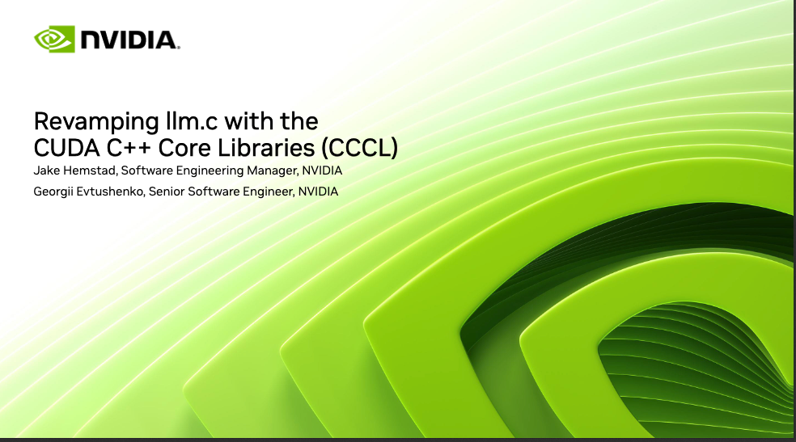

이 강의는 NVIDIA에서 CUDA C++ 핵심 라이브러리(이하 CCCL)를 개발하는 두 명의 엔지니어가 진행한다.

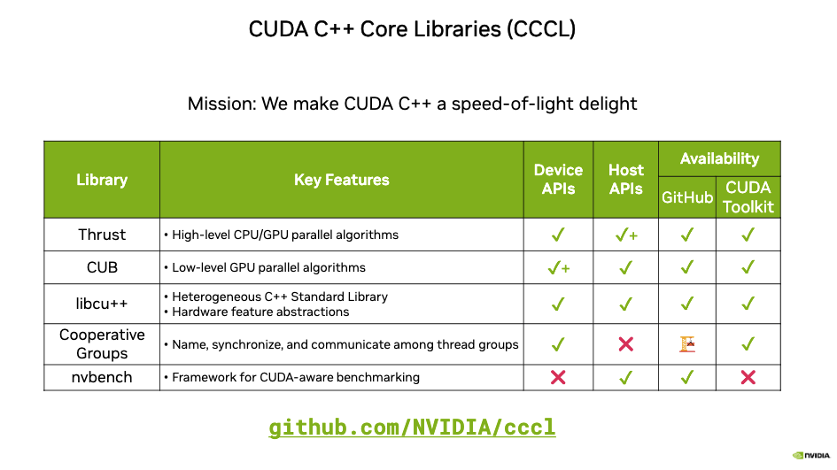

CCCL의 미션은 효율적인 라이브러리를 제공하여 CUDA C++ 개발을 더 효율적이고 쉽게 만드는 것이다. Slides의 표는 CUDA C++ 핵심 라이브러리의 이름, 주요 특성, API 지원, 그리고 가용성을 나열한다.

| **라이브러리 이름**   | **주요 특징**                              | **지원 API**                  | **가용성**          |
|-----------------------|------------------------------------------|-----------------------------|-------------------|
| **Thrust**            | 고수준 CPU/GPU 병렬 알고리즘              | 장치(Device), 호스트(Host)   | GitHub, CUDA Toolkit |
| **CUB**               | 저수준 GPU 병렬 알고리즘                  | 장치(Device), 호스트(Host)   | GitHub, CUDA Toolkit |
| **libcu++**           | 이종 C++ 표준 라이브러리, 하드웨어 기능 추상화 | 장치(Device), 호스트(Host)   | GitHub, CUDA Toolkit |
| **Cooperative Groups** | 스레드 그룹 간 명명, 동기화, 통신 제공    | 장치(Device) 전용            | CUDA Toolkit       |
| **nvbench**           | CUDA 성능 테스트 프레임워크               | 없음                         | GitHub             |

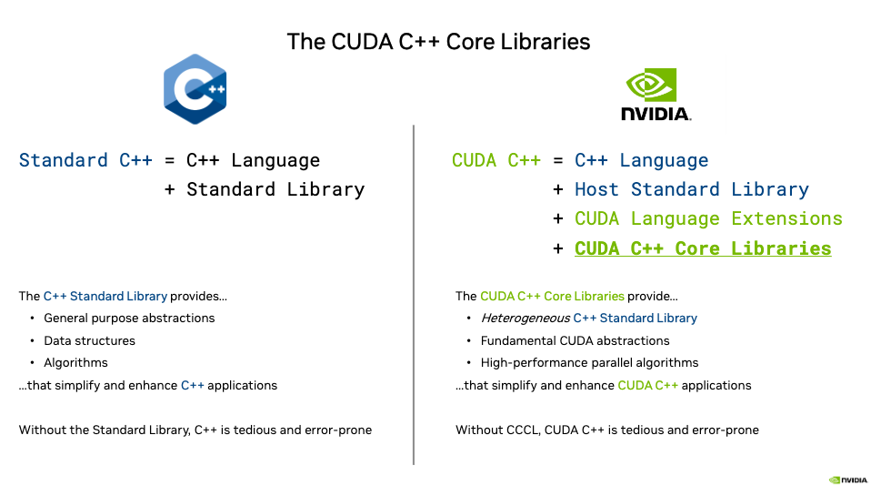

표준 C++는 C++ 언어 + 표준 라이브러리(Standard Library)로 정의된다. 표준 라이브러리는 범용 추상화(General purpose abstractions), 데이터 구조(Data structures), 알고리즘(Algorithms)을 제공하며, 이러한 기능들이 C++ 애플리케이션 개발을 단순화하고 향상시킨다. 표준 라이브러리 지원 없이는 C++ 개발이 번거롭고 오류가 발생하기 쉽다.

CUDA C++는 C++ 언어 + 호스트 표준 라이브러리(Host Standard Library) + CUDA 언어 확장(CUDA Language Extensions) + CUDA C++ 핵심 라이브러리(CUDA C++ Core Libraries)로 정의된다. CUDA C++ 핵심 라이브러리의 기능은 다음과 같다:
- 이종 C++ 표준 라이브러리(Heterogeneous C++ Standard Library): 이종 컴퓨팅 환경 지원.
- CUDA 기본 추상화(Fundamental CUDA Abstractions): 저수준 GPU 연산의 캡슐화 제공.
- 고성능 병렬 알고리즘(High-performance parallel algorithms): 복잡한 병렬 계산 지원.

이러한 기능들이 CUDA C++ 애플리케이션 개발을 단순화하고 향상시킨다. CCCL(CUDA C++ 핵심 라이브러리) 지원 없이는 CUDA C++ 개발도 번거롭고 오류가 발생하기 쉬워진다.

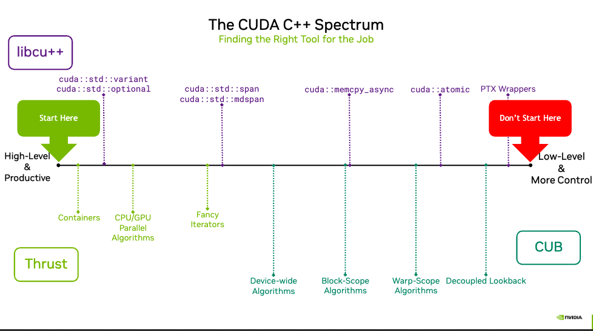

이 Slides는 **CUDA C++ 개발 도구의 계층적 범위(The CUDA C++ Spectrum)**와 서로 다른 개발 요구에 따른 적절한 도구 선택 방법을 설명한다. 가로축은 도구의 계층과 제어 능력을 나타내며, 왼쪽에서 오른쪽으로 갈수록 도구는 고수준이고 생산성이 높은 것(High-Level & Productive)에서 저수준이고 제어력이 강한 것(Low-Level & More Control)으로 변한다. 왼쪽 시작점(녹색 화살표 "Start Here")은 `Thrust`와 같은 고수준 도구부터 시작할 것을 권장하는데, 이 도구들이 더 사용하기 쉽고 생산성이 높기 때문이다. 오른쪽 끝점(빨간색 화살표 "Don't Start Here")은 PTX Wrappers와 같은 저수준 도구에서 직접 개발을 시작하지 말 것을 권장한다. 이것들은 복잡하고 유지 관리가 어렵기 때문이다.

고수준 도구(High-Level & Productive)에는 C++ 표준 라이브러리 확장을 제공하는 `libcu++`(예: `cuda::std::variant`와 `cuda::std::optional`)와 CPU/GPU 병렬 알고리즘을 제공하는 `Thrust`가 포함된다.

중간 계층 도구(중간 추상화 수준)에는 **반복자(Fancy Iterators)**(예: `cuda::std::span` 및 `cuda::std::mdspan`, 복잡한 데이터 구조 처리용), **장치 범위 알고리즘(Device-wide Algorithms)**(장치 내 데이터에 대한 전역 연산), **블록 범위 알고리즘(Block-Scope Algorithms)**(예: `cuda::memcpy_async`, 더 세밀한 블록 수준 제어에 적합), **Warp 범위 알고리즘(Warp-Scope Algorithms)**(`cuda::atomic`을 사용한 warp 간 동기화와 제어)이 포함된다.

**저수준 도구(Low-Level & More Control)**에는 극단적인 성능 최적화 시나리오에 적합한 PTX 어셈블리 코드 래핑을 제공하는 **PTX Wrappers**와 저수준 GPU 병렬 알고리즘을 구현하는 **CUB**(더 유연하지만 사용이 복잡하다)가 포함된다.

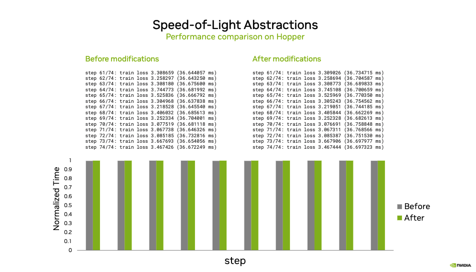

이 Slides는 llm.c를 llm.cpp로 포팅한 후 성능과 정확도에 아무런 영향이 없음을 보여준다.

이제 위에서 아래로 llm.c를 llm.cpp로 포팅할 때의 변경 사항을 설명하기 시작한다.

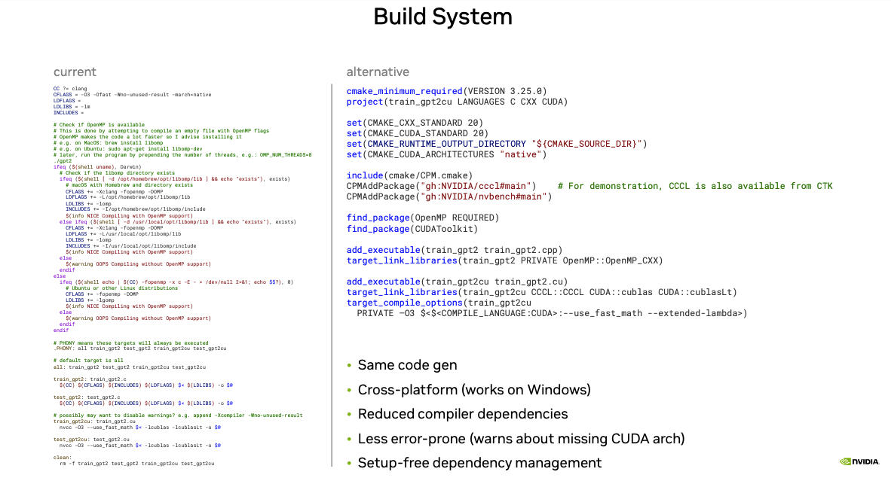

이 Slides는 llm.c를 llm.cpp로 포팅할 때 가장 먼저 한 일이 Makefile을 CMakeLists.txt로 마이그레이션하는 것임을 보여준다.

왼쪽의 Makefile은 컴파일러(CC=clang), 컴파일 옵션(CFLAGS), 링크 옵션(LDFLAGS), 라이브러리 경로(LDLIBS) 등을 수동으로 정의해야 한다. 또한 시스템 환경(예: OpenMP 존재 여부)에 따라 다른 컴파일러 옵션을 선택해야 하므로, 많은 if 조건문과 shell 호출을 포함한다. 또한 Makefile은 다양한 컴파일러, 플랫폼, 의존성의 세부 사항을 처리해야 한다. 현대 빌드 시스템의 고수준 추상화가 없어, 의존성을 수동으로 관리하면 오류가 발생하기 쉽다.

오른쪽의 CMakeLists.txt는 더 간단한 코드로 C++와 CUDA의 표준을 설정한다(`set(CMAKE_CXX_STANDARD 20)`, `set(CMAKE_CUDA_STANDARD 20)`). `set(CMAKE_CUDA_ARCHITECTURES "native")`를 사용하여 CUDA 아키텍처를 자동으로 감지함으로써 수동 설정의 복잡성을 줄인다. `find_package`와 `CPMAddPackage`를 사용하여 `OpenMP` 및 `CUDAToolkit` 등의 의존성을 자동으로 관리한다. 또한 `gh:NVIDIA/cccl#main`과 `gh:NVIDIA/nvbench#main`을 통해 CCCL 최신 코드 의존성을 추가하는 방법도 보여준다. `add_executable`로 실행 파일 대상을 정의하고 `target_link_libraries`를 통해 필요한 라이브러리(`OpenMP` 및 CUDA 라이브러리인 `cublas`와 `cublasLt`)를 쉽게 링크한다. 컴파일 옵션은 고수준 설정(`target_compile_options`)으로 단순화된다(예: `--use_fast_math` 및 `--extended-lambda`).

CMakeLists로 전환한 후의 장점:
- **동일한 코드 생성 능력(Same code gen)**: 빌드 결과물(예: 바이너리)은 Makefile을 수동으로 관리할 때와 동일하다.
- **크로스 플랫폼 지원(Cross-platform)**: CMake는 다중 플랫폼(예: Windows 및 Linux)을 지원하여 플랫폼 관련 설정을 줄인다.
- **컴파일러 의존성 감소(Reduced compiler dependencies)**: 컴파일러와 의존성을 자동으로 관리하여 컴파일 옵션을 수동으로 설정할 필요가 없다.
- **더 적은 오류(Less error-prone)**: 누락된 CUDA 아키텍처 등의 문제를 자동으로 알려주어 조용히 실패하지 않는다.
- **자동화된 의존성 관리(Setup-free dependency management)**: `CPM.cmake` 또는 `find_package`를 통해 의존성을 자동으로 다운로드하고 관리하므로 수동 설치 번거로움이 없다.

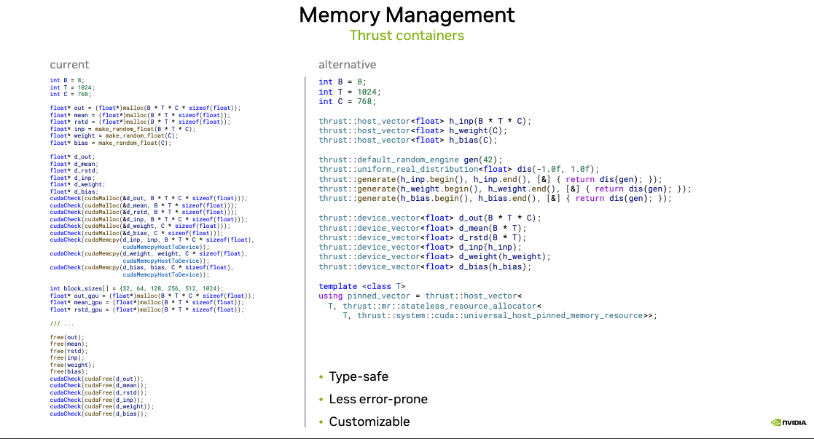

이 Slides는 메모리 관리 측면에서 Thrust가 llm.c 코드 포팅에 미치는 영향을 소개한다. Thrust 컨테이너의 직접적인 이점 중 하나는 메모리 해제를 자동으로 관리하므로 실수로 메모리 해제를 잊어버릴 걱정이 없다는 것이다.

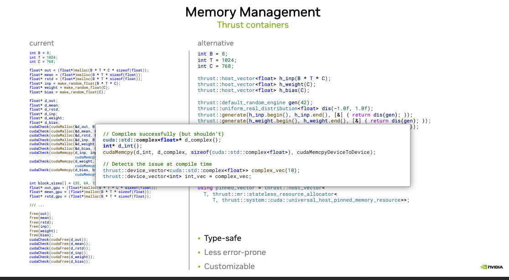

메모리 관리 안전성 외에도 Thrust는 타입 안전성도 제공한다. 이 Slides에서는 복소수를 정수에 할당하는 예를 들어, 위쪽 코드는 타입 안전성이 낮아서 cudaMemcpy의 소스와 대상 타입이 불일치해도(예: `int*`와 `cuda::std::complex<float>*`) 컴파일러가 문제를 감지할 수 없다. 그러나 Thrust를 사용하면 컴파일 시점에 타입 불일치 오류가 직접 보고된다.

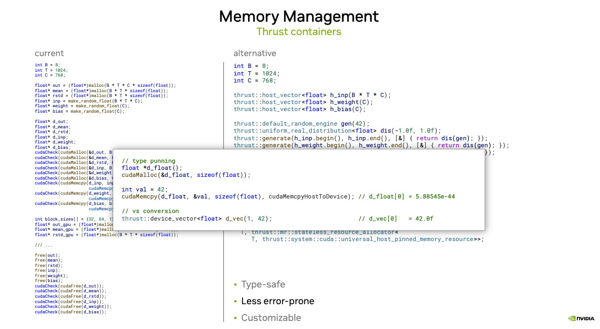

이 예는 수동 메모리 관리에서의 타입 오류(예: int와 float 혼용)가 감지하기 어려운 오류를 야기할 수 있음을 보여준다. `cudaMemcpy`는 오류를 보고하지 않지만 int의 이진 표현을 `float`로 잘못 해석하여 `d_float[0]`의 값이 무의미한 부동소수점 수(예: `5.88545e-44`)가 된다. 반면 Thrust 컨테이너는 강력한 타입 검사와 고수준 추상화를 통해 이러한 문제를 효과적으로 방지하여 코드의 안전성과 정확성을 보장한다.

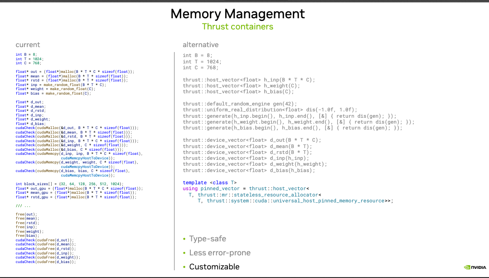

이 Slides는 Thrust의 사용자 정의 가능(Customizable) 특성을 보여주며, 커스텀 할당자(예: pinned memory)를 통해 특정 요구를 충족시킨다. Slides의 강조 표시된 부분에서 볼 수 있듯이, `pinned_vector`는 커스텀 할당자 `thrust::stateless_resource_allocator`를 사용하여 고정 메모리(pinned memory) 지원을 제공한다.

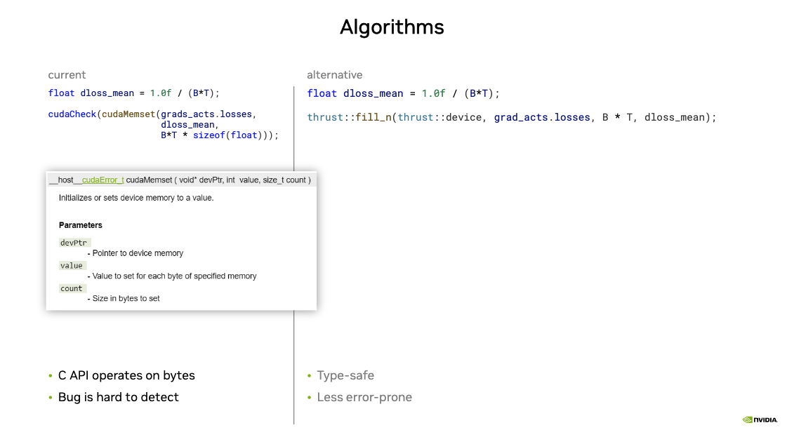

이 Slides는 두 가지 CUDA 프로그래밍 구현 방식을 비교한다. 왼쪽은 전통적인 CUDA C API의 `cudaMemset` 함수를 사용하는 구현으로, 바이트 수준에서 메모리를 직접 조작하지만 디버깅하기 어려운 오류가 발생하기 쉽다. 오른쪽은 현대 Thrust 라이브러리의 `fill_n` 함수를 사용하는 대안으로, 타입 안전하고 코드가 더 간결하며 명확하고 오류가 덜 발생한다. 이 비교는 더 높은 수준의 CUDA 라이브러리를 사용하여 코드의 안전성과 유지 관리성을 향상시키는 방법을 잘 보여준다.

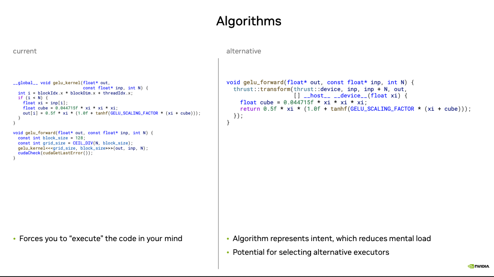

이 Slides는 GELU 함수를 구현하는 두 가지 방법을 비교한다. "현재" CUDA kernel 방법은 실행 세부 사항을 수동으로 관리해야 하는 반면, "대안" 방법은 `thrust::transform`을 사용하여 의도를 더 명확하게 표현한다. 대안 방법은 정신적 부담을 낮추고 실행 세부 사항을 추상화하여 더 나은 최적화 가능성을 제공한다.

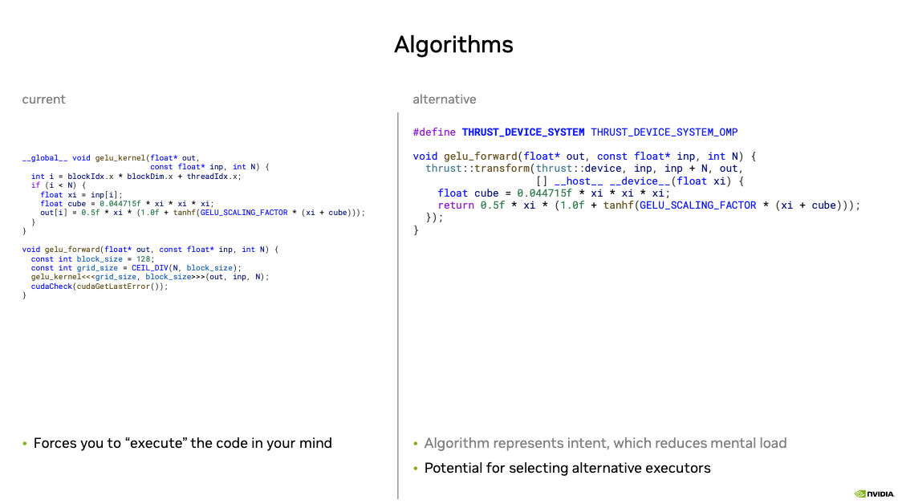

여기서 `THRUST_DEVICE_SYSTEM`을 정의하여 `thrust::transform`의 실행 장치를 지정할 수 있다고 언급한다. 이 Slides에서는 이 kernel의 실행 장치를 CPU로 정의하면서 kernel 구현 코드를 수정할 필요가 없음을 보여준다.

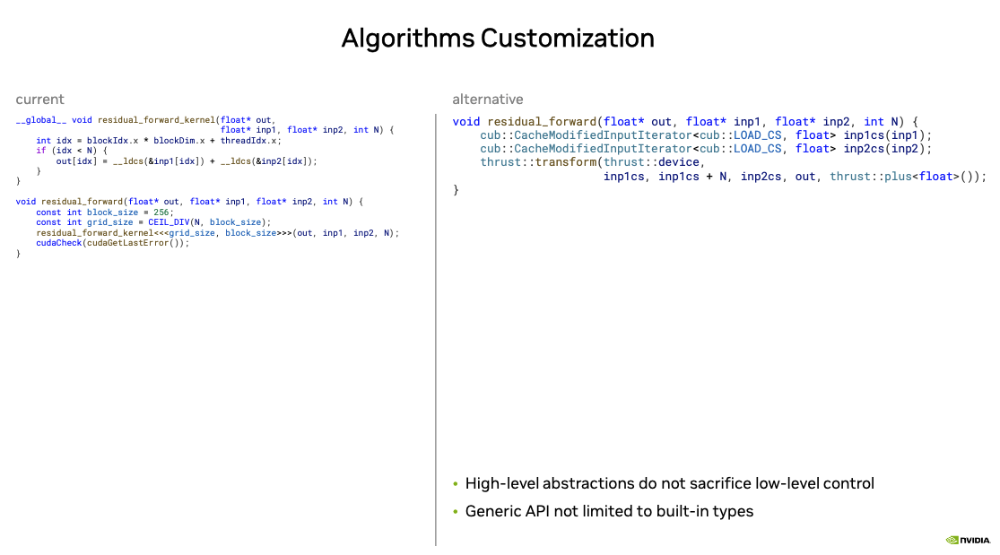

이 Slides는 고수준 추상화가 저수준 제어 능력을 희생하지 않는다는 것을 설명한다(High-level abstractions do not sacrifice low-level control). 예를 들어 `cub::CacheModifiedInputIterator<cub::LOAD_CS, float>`를 통해 CUDA kernel에서 직접 저수준 `__ldcs` 명령어를 호출하는 것과 동일한 효과를 얻을 수 있다.

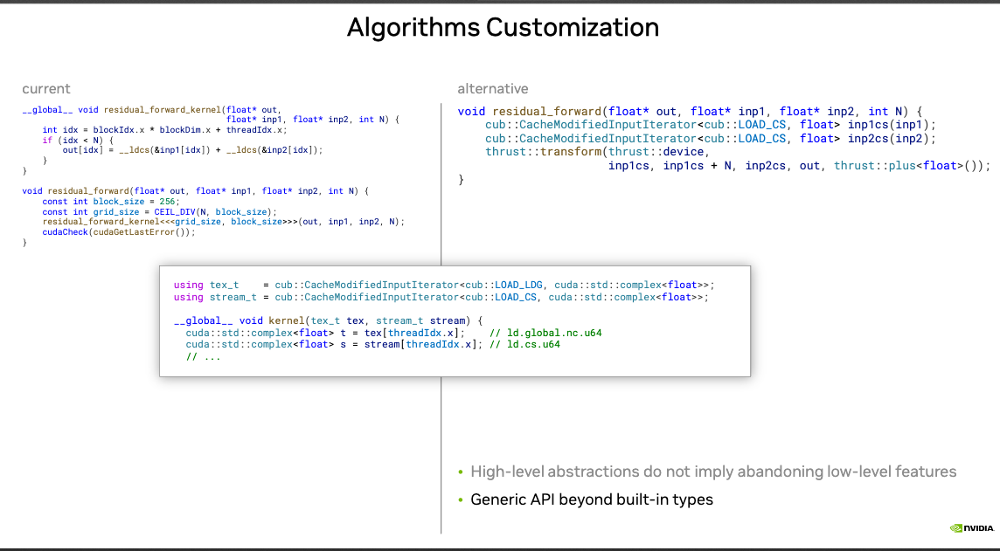

이 Slides는 `CacheModifiedInputIterator`가 내장 데이터 타입 외에도 복잡한 데이터 타입(예: `cuda::std::complex<float>`)을 지원한다는 것을 보여준다. 또한 `CacheModifiedInputIterator`는 스트리밍 로드(`LOAD_CS`)에 국한되지 않고 다른 로드 방식(`LOAD_LDG`, 이는 kernel에서 `__restrict__` 한정자와 동등하다)도 지원한다.

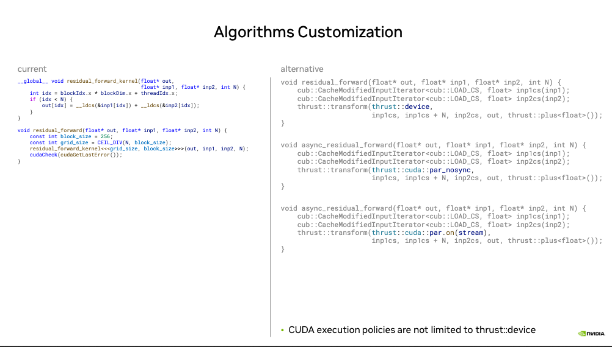

이 Slides는 알고리즘 사용자 정의의 두 가지 방법을 보여준다. 현재 방법은 CUDA kernel 함수를 통해 수동으로 구현하며, 스레드와 메모리 로드를 명시적으로 관리해야 한다. 대안 방법은 CUB 라이브러리와 `thrust::transform`을 사용하여 더 간결한 코드를 구현하고, 동시에 여러 CUDA 실행 전략(`thrust::device`, `thrust::cuda::par_nosync`, `thrust::cuda::par_on(stream)`)을 지원하여 kernel을 동기적으로 또는 비동기적으로 실행할 수 있다. Slides는 CUDA 실행 전략이 `thrust::device`에 국한되지 않고 유연하게 선택할 수 있음을 강조한다.

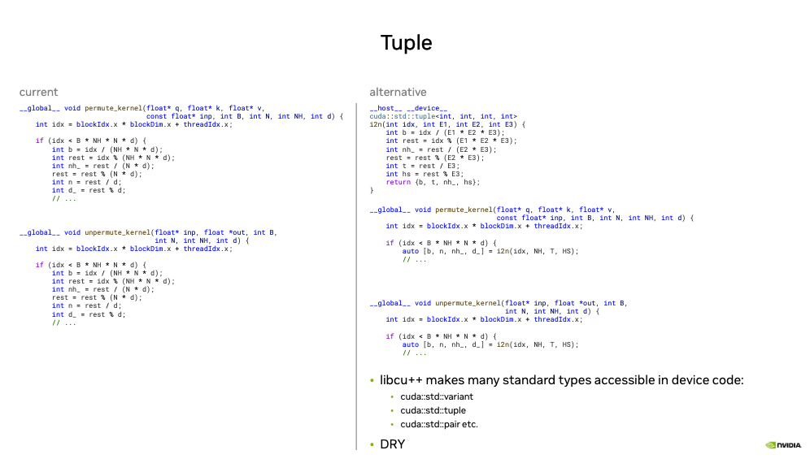

이 Slides는 `tuple`을 사용하여 CUDA 코드를 최적화하는 두 가지 방법을 보여준다. llm.c의 현재 방법은 인덱스를 수동으로 관리하고 계산 로직을 분해하므로 코드가 장황하고 반복적이다. 대안 방법은 `cuda::std::tuple`을 사용하여 인덱스 계산과 변수 관리를 단순화하고 코드의 가독성과 유지 관리성을 높인다. Slides는 libcu++가 `cuda::std::variant`, `cuda::std::tuple`, `cuda::std::pair` 등 많은 표준 타입을 장치 코드에서 사용 가능하게 하고, **DRY(Don't Repeat Yourself)** 원칙을 구현하여 코드 중복을 줄인다는 것을 강조한다.

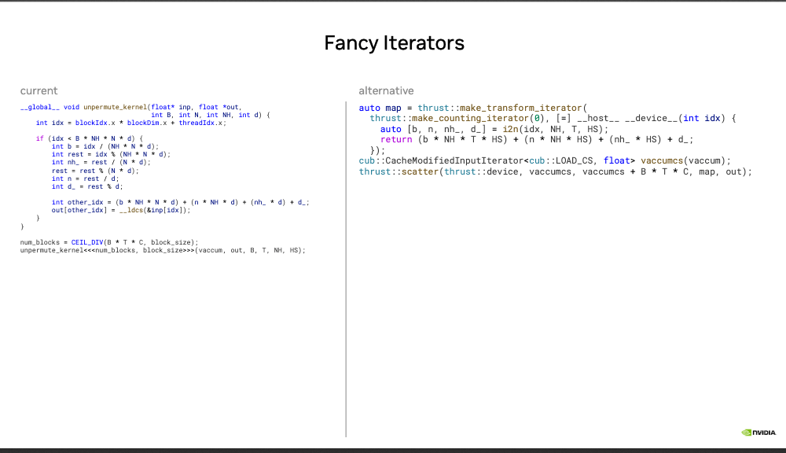

이 Slides는 두 가지 구현 방식을 비교한다. llm.c의 현재 방법은 명시적 인덱스 계산과 kernel 호출을 통해 데이터의 unpermute 연산을 구현하므로 코드가 복잡하고 유지 관리가 어렵다. 대안 방법은 `thrust::make_transform_iterator`와 `thrust::scatter`를 사용하여 반복자 추상화로 인덱스 계산과 데이터 연산을 단순화하고 코드의 간결성과 가독성을 향상시킨다. Slides는 고급 반복자를 활용하여 더 효율적이고 유지 관리하기 쉬운 CUDA 코드를 구현하는 방법을 보여준다.

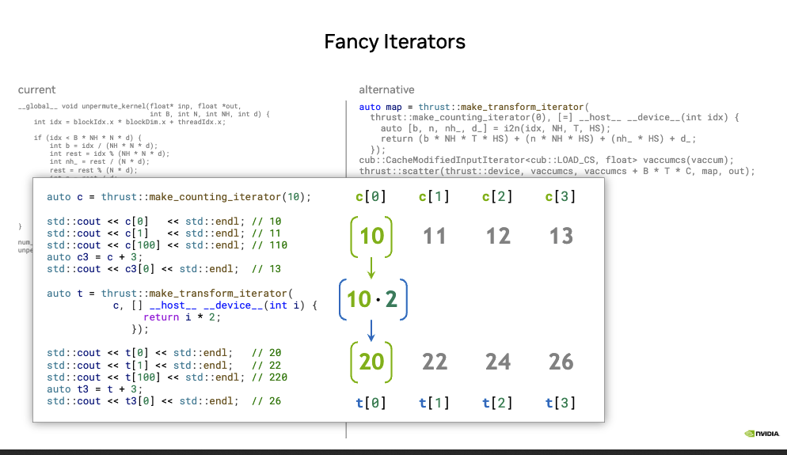

이 Slides는 `thrust::make_counting_iterator`와 `thrust::make_transform_iterator`의 사용 방법을 소개한다. 반복자 생성과 변환을 통해 더 효율적인 인덱스 계산과 데이터 연산을 구현한다. 예시에서 `make_counting_iterator`는 연속적인 숫자 시퀀스를 생성하는 데 사용되고, `make_transform_iterator`는 커스텀 변환 함수를 통해 생성된 시퀀스를 매핑한다. Slides는 반복자가 CUDA 코드를 단순화하고 수동 인덱스 관리를 줄이는 데 있어서의 역할을 강조하며, 코드의 가독성과 유연성을 높인다.

> 여기까지, 비디오에서 흥미로운 토론이 있다. 많은 사람들이 이 unpermute kernel 마이그레이션 예시가 지나치게 복잡하다고 생각했다. 원래 코드는 배워야 할 개념이 적고 이해하기 쉬운 반면, Thrust 코드는 더 복잡하고 더 많은 것을 배워야 한다는 것이다.

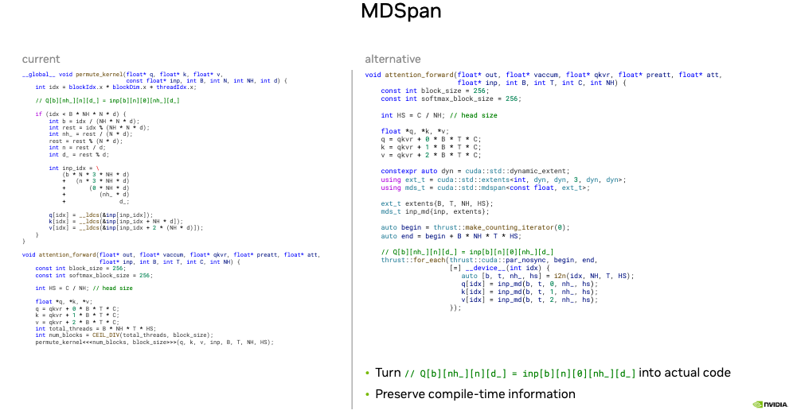

이 Slides는 전통적인 다차원 배열 인덱싱과 MDSpan을 사용한 CUDA 코드 최적화 방법을 비교한다. 전통적인 방법에서는 다차원 배열에 접근하기 위해 인덱스를 수동으로 계산해야 하므로 코드가 복잡하고 유지 관리가 어렵다. 대안 방법은 `cuda::std::mdspan`으로 다차원 데이터를 관리하여 추상화를 통해 인덱스 계산을 단순화하고 컴파일 시점 정보를 보존한다. 아래에 두 코드 그룹에 주석을 추가하여 설명한다.

llm.c의 코드:

```c++
// permute_kernel 함수는 행렬 재배열 연산을 구현한다
__global__ void permute_kernel(float* q, float* k, float* v,
                             const float* inp, int B, int N, int NH, int d) {
    // 현재 스레드의 전역 인덱스 계산
    int idx = blockIdx.x * blockDim.x + threadIdx.x;
    
    // 원래 코드의 행렬 재배열 계산
    // dlb[nh][n][d_] = inp[b][n][nh][d_]
    
    // 입력 텐서의 각 차원 인덱스 계산
    int b = idx / (NH * N * d);      // batch 차원
    int rest = idx % (NH * N * d);   // 나머지 부분
    int nh = rest / (N * d);         // head 차원
    rest = rest % (N * d);           // 나머지 부분 계속 분해
    int n = rest / d;                // 시퀀스 길이 차원
    int d_ = rest % d;               // 특성 차원
    
    // 입력 텐서의 선형 인덱스 계산
    int inp_idx = 
        (b * N * NH * d) +           // batch 오프셋
        (n * NH * d) +               // 시퀀스 길이 오프셋
        (nh * d) +                   // head 오프셋
        d_;                          // 특성 차원 오프셋
    
    // 텐서 재배열 연산 실행
    q[idx] = __ldcs(&inp[inp_idx]); // __ldcs로 캐시 최적화 메모리 읽기
    k[idx] = __ldcs(&inp[inp_idx + NH * d]);
    v[idx] = __ldcs(&inp[inp_idx + 2 * NH * d]);
}

// attention_forward 함수는 어텐션 순전파를 구현한다
void attention_forward(float* out, float* veccum, float* qkv, float* presft, float* att,
                      int B, int T, int C, int NH) {
    const int block_size = 256;              // CUDA 스레드 블록 크기
    const int softmax_block_size = 256;      // softmax 연산의 스레드 블록 크기

    int HS = C / NH;                        // 각 head의 차원 크기
    
    // 각 head의 차원 크기 계산
    float *q, *k, *v;
    q = qkv;                                 // 쿼리 행렬 Q의 시작 위치
    k = qkv + B * T * C;                     // 키 행렬 K의 시작 위치
    v = qkv + 2 * B * T * C;                 // 값 행렬 V의 시작 위치
    
    // 필요한 CUDA 스레드 블록 수 계산
    int total_threads = B * NH * T * HS;
    int num_blocks = CEIL_DIV(total_threads, block_size);
    
    // permute_kernel을 시작하여 텐서 재배열 실행
    permute_kernel<<<num_blocks, block_size>>>(q, k, v, qkv, B, T, NH, HS);
}
```

llm.cpp의 코드:

```c++
void attention_forward(float* out, float* vaccum, float* qkvr, float* prestt, float* att,
                      float* inp, int B, int T, int C, int NH) {
    // CUDA 블록 크기 상수 설정
    const int block_size = 256;
    const int softmax_block_size = 256;
    
    // 각 어텐션 head의 차원 크기 계산
    int HS = C / NH;  // head size
    
    // Q, K, V 행렬의 포인터 설정, 이들은 메모리에서 연속으로 저장된다
    float *q, *k, *v;
    q = qkvr + 0 * B * T * C;      // Q 행렬 시작 위치
    k = qkvr + 1 * B * T * C;      // K 행렬 시작 위치
    v = qkvr + 2 * B * T * C;      // V 행렬 시작 위치
    
    // CUDA 동적 메모리 할당 사용
    constexpr auto dyn = cuda::std::dynamic_extent;
    using ext_t = cuda::std::extent<int, dyn, dyn, 3, dyn, dyn>;
    using mds_t = cuda::std::mdspan<const float, ext_t>;
    
    // 다차원 배열 뷰 생성, 데이터 접근을 더 편리하게 한다
    ext_t extents(B, T, NH, HS);
    mds_t inp_md(inp, extents);
    
    // thrust 라이브러리를 사용하여 반복자 생성, 병렬 처리에 사용
    auto begin = thrust::make_counting_iterator(0);
    auto end = begin + B * NH * T * T;
    
    // 원래 재배열 연산 주석: Q[b][nh][t][d_] = inp[b][t][nh][d_]
    
    // thrust를 사용하여 각 요소를 병렬로 처리
    thrust::for_each(thrust::cuda::par,
                    begin, end,
                    [=] __device__ (int idx) {
                        // 현재 처리 위치의 각 차원 인덱스 계산
                        auto [b, t, nh_, hs] = idx2(idx, NH, T, HS);
                        
                        // Q, K, V 행렬의 데이터 재배열 실행
                        q[idx] = inp_md(b, t, 0, nh_, hs);  // Q 행렬 할당
                        k[idx] = inp_md(b, t, 1, nh_, hs);  // K 행렬 할당
                        v[idx] = inp_md(b, t, 2, nh_, hs);  // V 행렬 할당
                    });
}
```

llm.cpp의 코드를 설명하기 위해 `mdspan`에 대해 예시로 설명한다.

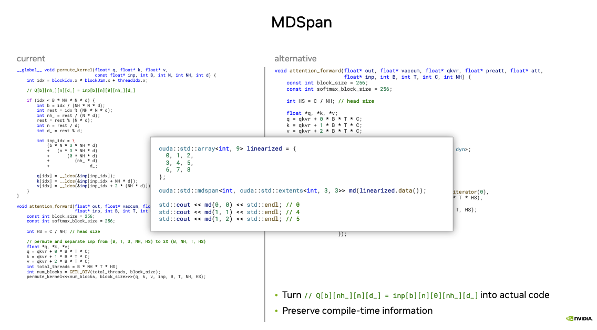

`mdspan`을 통해 1차원 배열을 다차원 방식으로 편리하게 접근할 수 있다.


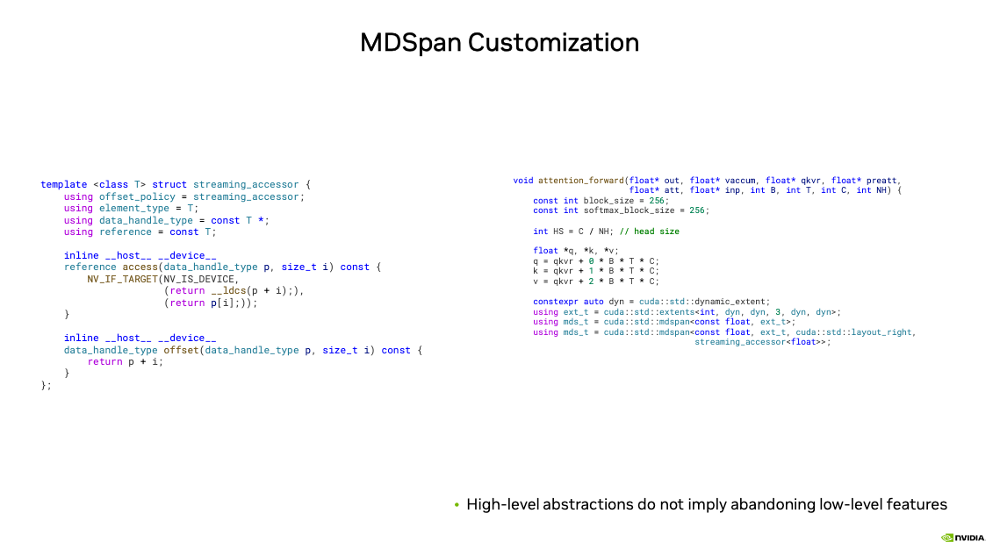

llm.c의 kernel에서는 또한 `__ldcs` 명령어를 사용하여 캐시 최적화 메모리 읽기를 수행하는데, MDSpan도 streaming_processor 추상화를 통해 이를 구현할 수 있다.

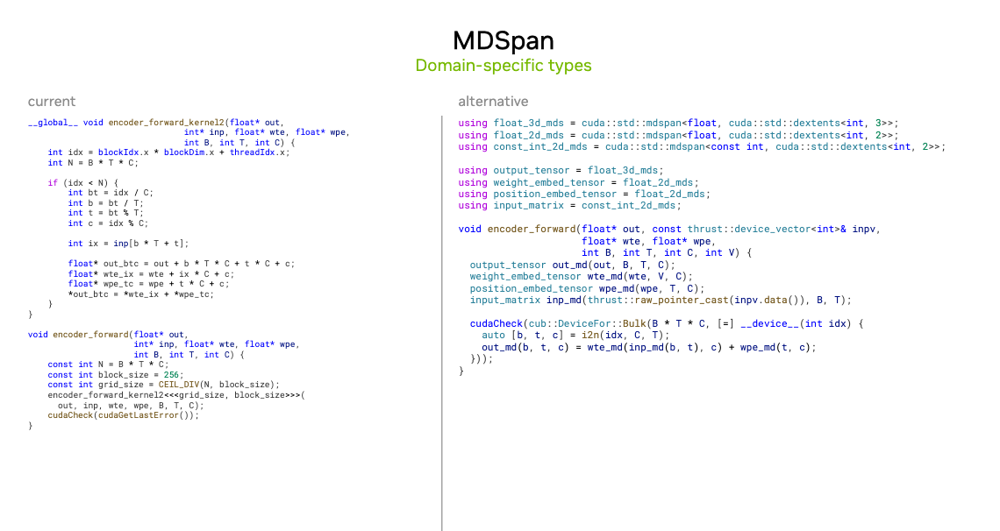


이 Slides는 현재 방법과 `MDSpan`을 사용한 CUDA 코드 최적화의 대안 방법을 비교한다. 현재 방법은 수동 인덱스 계산과 kernel 호출을 통해 구현되어 코드가 장황하고 유지 관리가 어렵다. 대안 방법은 `cuda::std::mdspan`을 활용하여 도메인 특화 타입(`float_3d_mds`, `float_2d_mds`)을 정의하고, 추상화 캡슐화를 통해 다차원 데이터 접근을 단순화하여 코드의 명확성과 유지 관리성을 크게 향상시킨다. 또한 `MDSpan`은 컴파일 시점에서 다차원 인덱스를 직접 관리하여 코드의 수동 계산과 반복 로직을 줄인다.

> 여기서 하나의 질문이 제기됐다. 루프 구문이 `thrust::for_each`에서 `cub::DeviceFor::Bulk`로 변경됐는데, 차이가 무엇인가? 답변: `thrust::for_each`는 CUDA kernel뿐만 아니라 CPU에서도 사용할 수 있지만, `cub::DeviceFor::Bulk`는 CUDA kernel에서만 사용할 수 있으며 포함 관계가 있다. 따라서 CUDA kernel만 구현한다면 `cub::DeviceFor::Bulk`를 사용할 수 있고, 이렇게 하면 kernel 실행이 비동기적으로 이루어진다.

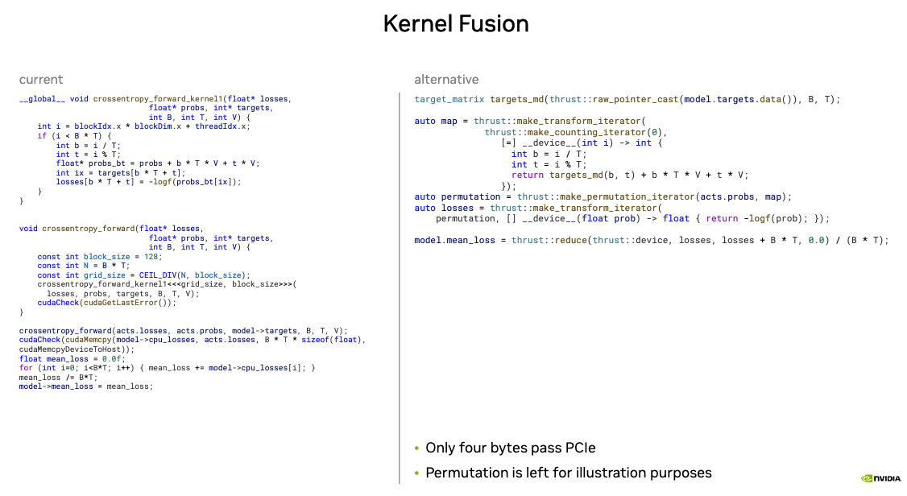

이 Slides는 Thrust의 kernel fusion 구현을 보여주기 시작하며, 코드가 다소 복잡하므로 계속 설명한다.

```c++
// CUDA 핵심 함수: 교차 엔트로피 순전파 계산
__global__ void crossentropy_forward_kernel1(float* losses,
                                           float* probs, int* targets,
                                           int B, int T, int V) {
    // 전역 스레드 인덱스 계산
    int i = blockIdx.x * blockDim.x + threadIdx.x;
    
    // 스레드 인덱스가 유효 범위 내에 있는지 확인
    if (i < B * T) {
        // batch 및 타임스텝 인덱스 계산
        int b = i / T;        // 배치 인덱스
        int t = i % T;        // 타임스텝 인덱스
        
        // 목표 클래스의 확률값을 가져와 음의 로그 가능도 계산
        float probs_t = probs[b * T * V + t * V + t];
        int ix = targets[b * T + t];
        losses[b * T + t] = -logf(probs[ix]);
    }
}

// 교차 엔트로피 순전파의 래퍼 함수
void crossentropy_forward(float* losses,
                         float* probs, int* targets,
                         int B, int T, int V) {
    // CUDA 그리드 및 블록 크기 정의
    const int block_size = 128;
    const int N = B * T;
    const int grid_size = (N + block_size - 1) / block_size;
    
    // CUDA 핵심 함수 시작
    crossentropy_forward_kernel1<<<grid_size, block_size>>>(
        losses, probs, targets, B, T, V);
    
    // CUDA 오류 확인
    cudaCheck(cudaGetLastError());
}

// 메인 함수에서의 호출 예시
crossentropy_forward(acts_losses, acts_probs, model->targets, B, T, V);
cudaCheck(cudaMemcpy(model->cpu_losses, acts_losses, B * T * sizeof(float),
                     cudaMemcpyDeviceToHost));

// 평균 손실 계산
float mean_loss = 0.0f;
for (int i=0; i<B*T; i++) { 
    mean_loss += model->cpu_losses[i]; 
}
mean_loss /= mean_loss;
```


주요 파라미터 설명:
- losses: 출력 손실값 배열
- probs: 모델이 예측한 확률 분포
- targets: 목표 클래스의 인덱스
- B: batch size(배치 크기)
- T: sequence length(시퀀스 길이)
- V: vocabulary size(어휘 크기)

```c++
// 목표 행렬 생성, 크기는 B×T
// B는 batch size, T는 시퀀스 길이
target_matrix targets_md(thrust::raw_pointer_cast(model.targets.data()), B, T);

// 변환 반복자 생성, 목표 인덱스 위치 계산에 사용
auto map = thrust::make_transform_iterator(
    thrust::make_counting_iterator(0),  // 0부터 시작하는 카운팅 반복자
    [=] __device__ (int i) -> int {     // 장치 측 lambda 함수
        int b = i / T;                  // 배치 인덱스 계산
        int t = i % T;                  // 타임스텝 인덱스 계산
        // 목표 위치 계산: 기본 위치 + batch 오프셋 + 타임스텝 오프셋
        // V는 어휘 크기
        return targets_md(b, t) + b * T * V + t * V;
    }
));

// 순열 반복자 생성, 계산된 인덱스로 확률값에 접근
auto permutation = thrust::make_permutation_iterator(acts.probs, map);

// 변환 반복자 생성, 각 확률값의 음의 로그 손실 계산
auto losses = thrust::make_transform_iterator(
    permutation, 
    [] __device__ (float prob) -> float { return -logf(prob); }
);

// 평균 손실 계산:
// 1. reduce를 사용하여 모든 손실을 합산
// 2. 총 샘플 수(B*T)로 나누어 평균값 산출
model.mean_loss = thrust::reduce(thrust::device, losses, losses + B * T, 0.0) / (B * T);
```

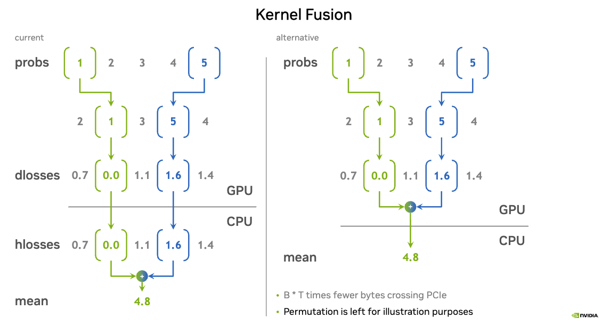

이 Slides는 **Kernel Fusion**을 통한 데이터 처리 흐름 최적화를 비교하여 보여준다. 현재 방법은 중간 결과(`dlosses`와 `hlosses`)를 GPU에서 CPU로 다시 전송한 후 평균값(`mean`)을 계산하므로 더 많은 데이터가 PCIe를 통해 전송된다. 대안 방법은 계산을 GPU에서 완료하도록 fusion하여 직접 평균값을 출력하므로 `B * T`배의 데이터가 PCIe를 통해 전송되는 것을 줄인다. Kernel Fusion은 성능과 데이터 전송 효율성을 크게 향상시킨다. Slides의 permutation 단계는 필수적이지 않다는 점에 유의한다.

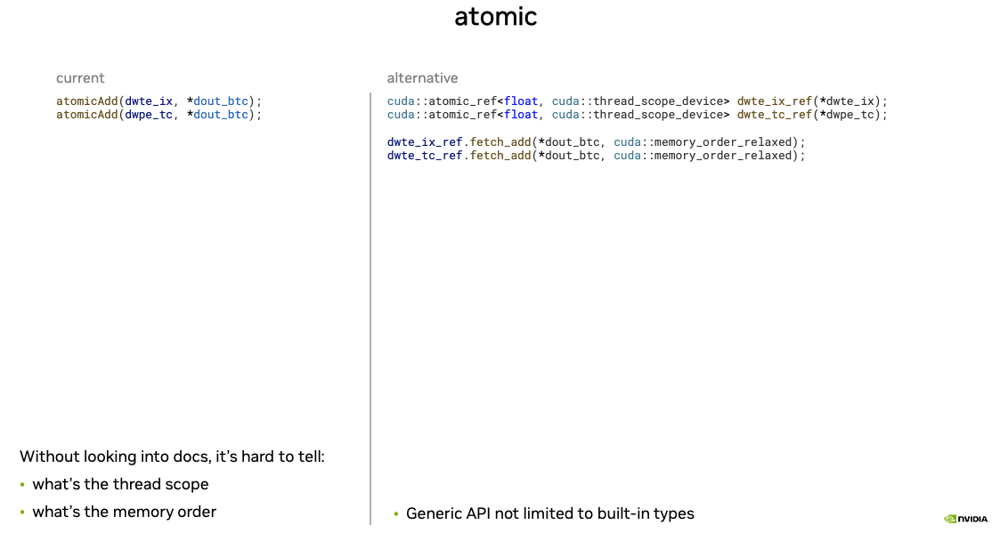

이 Slides는 전통적인 `atomicAdd`와 `cuda::atomic_ref`를 사용하는 대안 방법을 비교한다. 현재 방법은 `atomicAdd`로 구현되어 있지만 스레드 범위와 메모리 순서를 직관적으로 이해하기 어렵다. 대안 방법은 `cuda::atomic_ref`를 사용하여 스레드 범위(예: `cuda::thread_scope_device`)와 메모리 순서(예: `cuda::memory_order_relaxed`)를 명시적으로 지정하여 코드의 가독성과 제어 가능성을 높인다. Slides는 대안 방법의 범용 API가 내장 타입에 국한되지 않고 더 유연한 원자 연산 지원을 제공한다는 점을 강조한다.

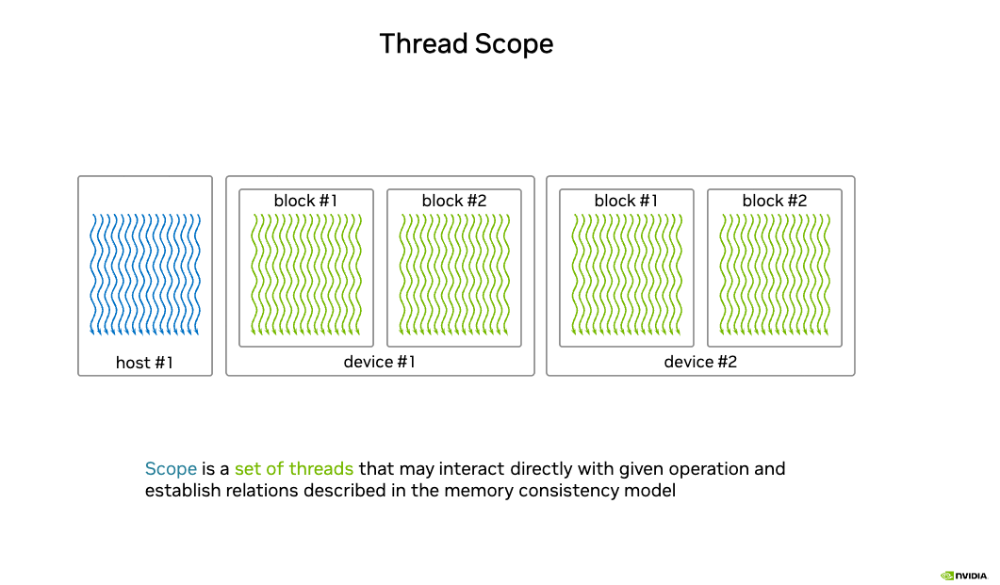

이 Slides는 주로 CUDA의 Thread Scope(스레드 범위) 개념을 소개한다. 그림은 1개의 호스트(host)와 2개의 장치(device)로 구성된 시스템 아키텍처를 보여주며, 각 장치에는 2개의 block이 있다. Thread Scope는 직접 상호작용할 수 있는 스레드 집합으로 정의되며, 이 스레드들 사이에서 메모리 일관성 모델에서 설명하는 관계를 수립할 수 있다. 그림은 서로 다른 색상의 물결선(파란색은 호스트 스레드, 녹색은 장치 스레드)을 통해 서로 다른 범위 내의 스레드 분포를 직관적으로 보여준다. 이 개념은 CUDA 프로그램에서 스레드 간 통신 및 동기화 메커니즘을 이해하는 데 매우 중요하다.

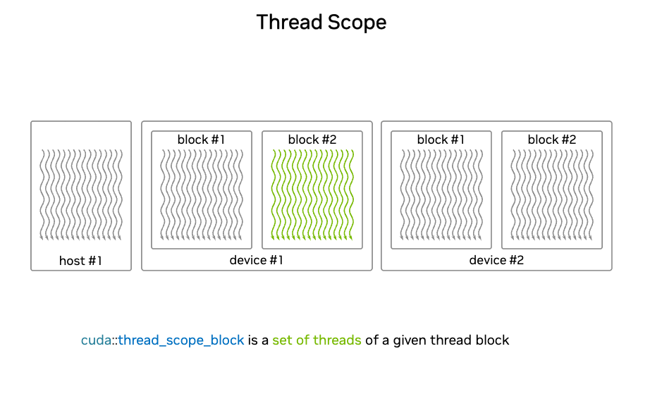

이 Slides는 CUDA의 스레드 범위(Thread Scope) 개념을 소개한다. 그림은 1개의 호스트(host)와 2개의 장치(device)로 구성된 시스템 아키텍처를 보여주며, 각 장치에는 2개의 스레드 블록(block)이 있다. `cuda::thread_scope_block`이 특정 스레드 블록 내의 스레드 집합임이 명확하게 표시되어 있다. 이 개념은 CUDA 프로그래밍에서 스레드의 조직과 관리가 계층적 구조를 기반으로 한다는 것을 설명한다. 호스트에서 장치, 장치 내 스레드 블록, 구체적인 스레드 집합으로 이어지는 명확한 계층 관계가 형성된다.

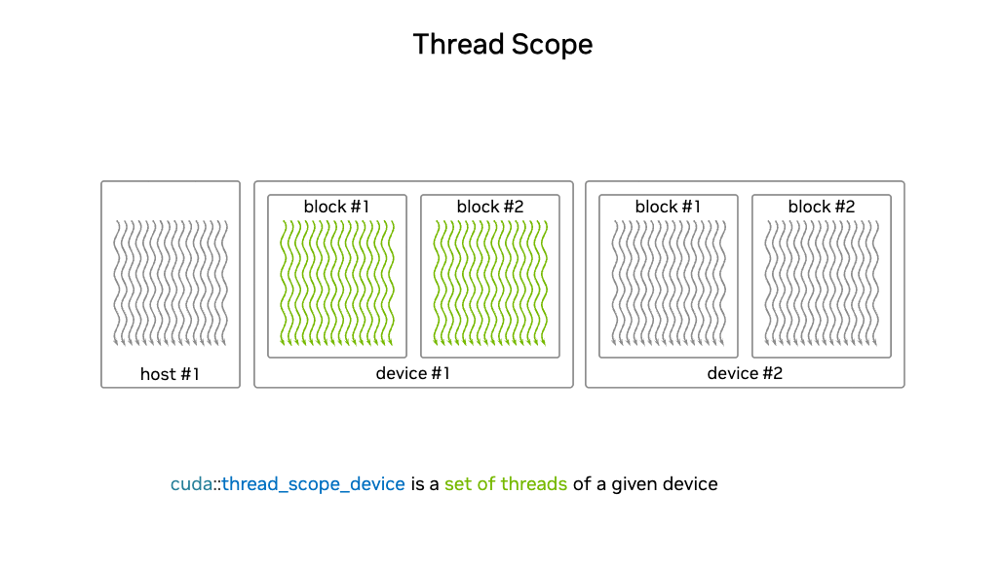

`cuda::thread_scope_device`는 특정 장치 내의 스레드 집합이다.

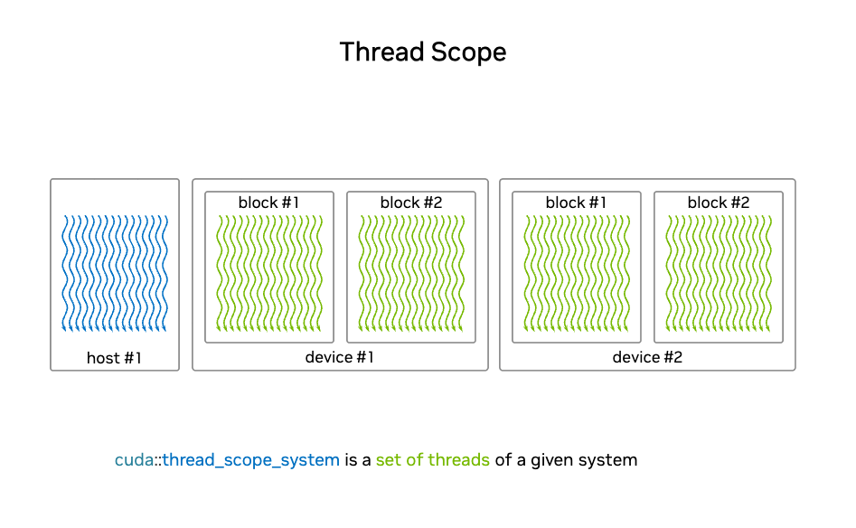

`cuda::thread_scope_system`은 전체 시스템 내의 스레드 집합이다.

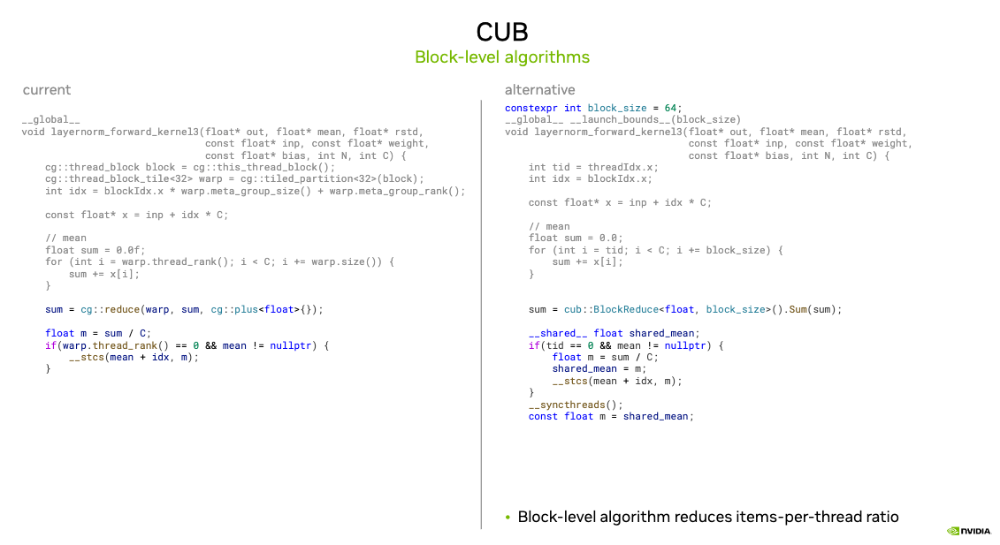

이 Slides는 `cub::BlockReduce`를 사용하여 각 열의 LayerNorm을 처리하는 병렬도를 높이는 방법을 보여준다. 스레드 수를 32에서 64로 변경하는 방식이다.

```c++
__global__
void layernorm_forward_kernel3(float* out, float* mean, float* rstd,
                             const float* inp, const float* weight,
                             const float* bias, int N, int C) {
    // 현재 스레드 블록 설정 가져오기
    cg::thread_block block = cg::this_thread_block();
    cg::thread_block_tile<32> warp = cg::tiled_partition<32>(block);
    // 현재 스레드의 전역 인덱스 계산
    int idx = blockIdx.x * warp.meta_group_size() + warp.meta_group_rank();
    
    // 입력 데이터의 시작 위치 계산
    const float* x = inp + idx * C;
    
    // 평균 계산
    float sum = 0.0f;
    // warp 내 스레드를 사용하여 병렬로 합산
    for (int i = warp.thread_rank(); i < C; i += warp.size()) {
        sum += x[i];
    }
    
    // warp 수준 리덕션 연산을 사용하여 합산
    sum = cg::reduce(warp, sum, cg::plus<float>());
    
    // 최종 평균 계산 및 저장
    float m = sum / C;
    if(warp.thread_rank() == 0 && mean != nullptr) {
        mean[idx] = m;
    }
}
```


이 코드는 LayerNorm 순전파 계산의 일부를 구현하며, 주로 평균 계산을 완료한다. 구체적인 설명:
1. 함수 파라미터에는 입력 데이터, 가중치, 편향 등 필요한 파라미터와 차원 정보 N과 C가 포함된다
2. CUDA Cooperative Groups를 사용하여 스레드 조직 구조를 관리한다
3. 코드는 warp 수준의 병렬 계산을 사용하여 효율성을 높인다
4. 평균 계산은 두 단계로 이루어진다:
    - 먼저 warp 내 스레드 간에 병렬로 누적 합산
    - 그런 다음 warp 수준 리덕션 연산을 사용하여 최종 결과 산출
5. 마지막으로 warp의 첫 번째 스레드가 결과를 출력 배열에 기록한다
이 구현 방식은 CUDA의 하드웨어 특성을 충분히 활용하여 LayerNorm에 필요한 평균 계산을 효율적으로 완료할 수 있다.

```c++
// 각 스레드 블록이 포함하는 스레드 수 설정
constexpr int block_size = 64;
// 핵심 함수의 스레드 블록 설정 정의
__global__ __launch_bounds__(block_size)
void layernorm_forward_kernel3(float* out, float* mean, float* rstd,
                             const float* inp, const float* weight,
                             const float* bias, int N, int C) {
    // 블록 내 스레드의 로컬 인덱스 가져오기
    int tid = threadIdx.x;
    // 현재 처리 중인 데이터 블록 인덱스 가져오기
    int idx = blockIdx.x;
    
    // 현재 스레드가 처리하는 입력 데이터 시작 위치 계산
    const float* x = inp + idx * C;
    
    // 평균 계산
    float sum = 0.0;
    // 스트라이드 루프 방식으로 각 스레드가 여러 요소를 처리
    for (int i = tid; i < C; i += block_size) {
        sum += x[i];
    }
    
    // CUB 라이브러리의 BlockReduce를 사용하여 블록 내 리덕션 합산
    sum = cub::BlockReduce<float, block_size>().Sum(sum);
    
    // 공유 메모리에 계산 결과 저장
    __shared__ float shared_mean;
    if(tid == 0 && mean != nullptr) {
        // 최종 평균 계산
        float m = sum / C;
        // 공유 메모리에 저장
        shared_mean = m;
        // 결과를 전역 메모리에 기록
        __stcs(mean + idx, m);
    }
    
    // 모든 스레드를 동기화하여 평균 계산 완료를 기다린다
    __syncthreads();
    // 공유 메모리에서 평균값을 읽어 이후 계산에 사용
    const float m = shared_mean;
}
```


이 구현은 이전 버전과 비교하여 다음과 같은 주요 차이점이 있다:
1. 고정된 block_size와 __launch_bounds__를 사용하여 컴파일러가 생성하는 코드를 최적화한다
2. 더 간단한 스레드 인덱스 계산 방식을 채택한다
3. CUB 라이브러리의 BlockReduce를 Cooperative Groups 구현 대신 사용한다
4. 공유 메모리를 통해 계산 결과를 공유한다
5. 명시적 스레드 동기화를 사용하여 데이터 일관성을 보장한다
CUB 라이브러리를 사용하면 최적화된 리덕션 연산 구현을 활용할 수 있고, 열 방향으로 병렬도를 높여 더 나은 성능을 기대할 수 있다.

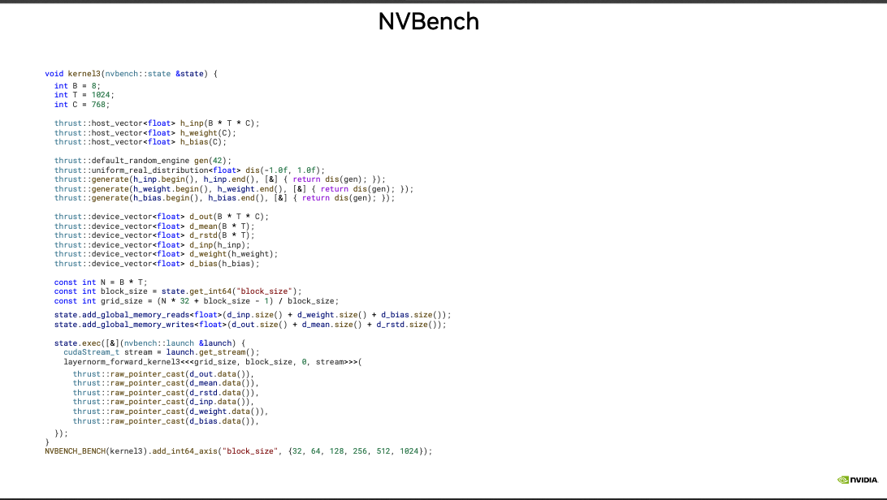

성능 테스트를 할 때 kernel을 여러 번 실행하면 두 번째 실행에서 캐시를 읽어 통계가 부정확해질 수 있다. 또한 성능 데이터가 정규 분포를 따르는 경우가 드물어, 이상적으로는 통계 데이터가 충분한지 판단하는 통계 엔진이 필요하다. 이 두 문제 모두 NVBench 라이브러리가 해결한다. NVBench는 CUDA kernel 성능을 신뢰성 있게 측정하도록 특별히 설계되었다.

```c++
// kernel 함수 정의, 신경망 계산에 사용
void kernel3(nvbench::state &state) {
    // 기본 파라미터 정의
    int B = 32;        // batch size
    int T = 1024;      // 시퀀스 길이
    int C = 768;       // 히든 레이어 차원

    // 호스트 측에 벡터 메모리 할당
    thrust::host_vector<float> h_inp(B * T * C);    // 입력 데이터
    thrust::host_vector<float> h_weight(C);         // 가중치
    thrust::host_vector<float> h_bias(C);           // 편향

    // 난수 생성기와 분포 초기화
    thrust::default_random_engine gen(42);
    thrust::uniform_real_distribution<float> dis(-1.0f, 1.0f);
    
    // 난수 데이터를 생성하여 입력, 가중치, 편향 채우기
    thrust::generate(h_inp.begin(), h_inp.end(), [&] { return dis(gen); });
    thrust::generate(h_weight.begin(), h_weight.end(), [&] { return dis(gen); });
    thrust::generate(h_bias.begin(), h_bias.end(), [&] { return dis(gen); });

    // 장치 측에 메모리 할당
    thrust::device_vector<float> d_out(B * T * C);    // 출력
    thrust::device_vector<float> d_mean(B * T);       // 평균
    thrust::device_vector<float> d_rstd(B * T);       // 표준편차의 역수
    thrust::device_vector<float> d_inp(h_inp);        // 입력 데이터를 장치에 복사
    thrust::device_vector<float> d_weight(h_weight);  // 가중치를 장치에 복사
    thrust::device_vector<float> d_bias(h_bias);      // 편향을 장치에 복사

    // 그리드와 블록 크기 계산
    const int N = B * T;
    const int block_size = state.get_int64("block_size");
    const int grid_size = (N * 32 + block_size - 1) / block_size;

    // 전역 메모리 할당
    state.add_global_memory_reads<float>(d_inp.size() + d_weight.size() + d_bias.size());
    state.add_global_memory_writes<float>(d_out.size() + d_mean.size() + d_rstd.size());

    // kernel 실행
    state.exec([&](nvbench::launch launch) {
        cudaStream_t stream = launch.get_stream();
        layernorm_forward_kernel3<<<grid_size, block_size, 0, stream>>>(
            // kernel 함수에 원시 포인터 전달
            thrust::raw_pointer_cast(d_out.data()),
            thrust::raw_pointer_cast(d_mean.data()),
            thrust::raw_pointer_cast(d_rstd.data()),
            thrust::raw_pointer_cast(d_inp.data()),
            thrust::raw_pointer_cast(d_weight.data()),
            thrust::raw_pointer_cast(d_bias.data())
        );
    });

    // 벤치마크 테스트 파라미터 설정
    NVBENCH_BENCH(kernel3).add_int64_axis("block_size", {32, 64, 128, 256, 512, 1024});
}
```

서로 다른 block_size에 대한 최종 테스트 결과는 다음과 같다.

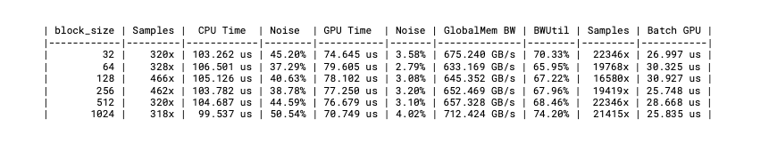

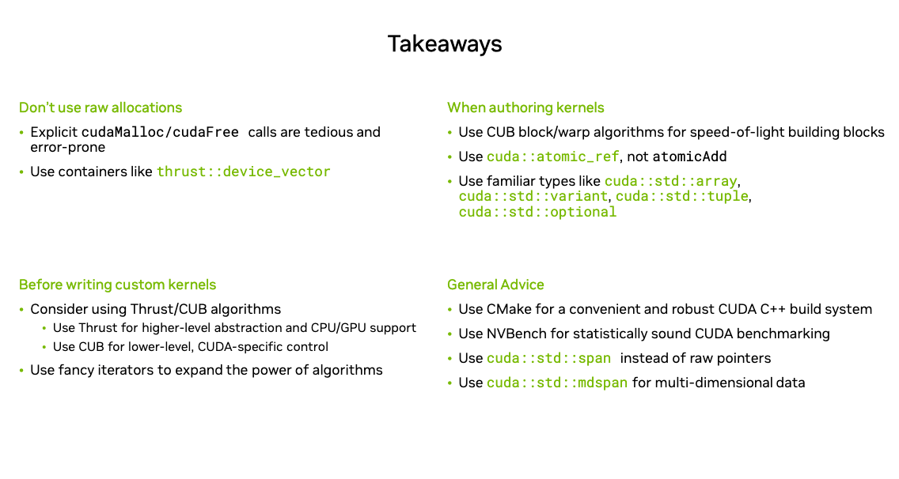

이 강의의 요점 정리:
- 메모리 관리 측면에서, `cudaMalloc/cudaFree`와 같은 원시 메모리 할당을 직접 사용하는 것보다 `thrust::device_vector`와 같은 컨테이너를 사용할 것을 권장한다.
- `kernel`을 작성할 때, CUB 라이브러리의 block/warp 알고리즘을 사용하여 기본 모듈을 구축하고, atomicAdd 대신 `cuda::atomic_ref`를 사용하며, `cuda::std`의 `array`, `variant`, `tuple`, `optional` 등 타입을 잘 활용할 것을 권장한다.
- 커스텀 kernel을 개발하기 전에, Thrust(고수준 추상화와 CPU/GPU 지원용) 또는 CUB(저수준 CUDA 제어용) 라이브러리의 기존 알고리즘을 사용하는 것을 고려하고, 반복자를 활용하여 알고리즘 기능을 강화해야 한다.
- 일반적인 권장 사항으로, CUDA C++의 빌드 시스템으로 CMake를 사용하고, 신뢰할 수 있는 CUDA 성능 테스트를 위해 NVBench를 사용하며, 원시 포인터 대신 `cuda::std::span`을 사용하고, 다차원 데이터 처리에는 `cuda::std::mdspan`을 사용할 것을 권장한다.


## 정리

이 강의는 CUDA C++ 핵심 라이브러리(CCCL)를 사용하여 llm.c를 llm.cpp로 포팅하는 방법을 소개했다. CCCL은 Thrust, CUB, libcu++ 등 라이브러리의 집합으로 고수준에서 저수준까지 완전한 툴체인을 제공한다. 강의에서 여러 핵심 개선 사항을 보여줬다: 빌드 시스템을 Makefile에서 CMake로 마이그레이션하여 더 나은 크로스 플랫폼 지원을 얻는 것; `thrust::device_vector`를 사용하여 원시 메모리 관리를 대체함으로써 자동화와 타입 안전성을 실현하는 것; `cuda::std::mdspan`을 채택하여 다차원 배열 연산을 단순화하는 것; `cuda::atomic_ref`를 사용하여 더 명확한 스레드 범위 제어를 제공하는 것. Kernel Fusion과 CUB의 BlockReduce 등 최적화 기법과 함께 NVBench를 활용한 성능 테스트를 통해, 원래의 성능과 정확도를 유지하면서 코드를 더 간결하고 안전하며 유지 관리하기 쉽게 만들었다. 이번 포팅은 현대 CUDA C++ 툴체인을 사용하여 전통적인 CUDA C 코드를 개선하는 방법을 잘 보여주며, 성능을 유지하면서 코드 품질과 개발 효율성을 높인다. 다만 일부 고급 추상화는 학습 비용을 높일 수 있어 사용 편의성과 복잡성 사이의 균형을 찾아야 한다. CCCL 오픈소스 주소: https://github.com/NVIDIA/cccl
