# Lecture 2 Ch1-3 PMPP book

> 내 강의 노트다. 관심 있으면 봐도 좋다: https://github.com/BBuf/how-to-optim-algorithm-in-cuda/tree/master/cuda-mode 

## 2강: PMPP 책 1-3장

> 이 강의는 매우 기초적이며 기본 개념과 초급 주의사항을 다룬다. CUDA 기초가 있는 사람은 시간을 들여 볼 필요가 없다.

### PMPP 1장

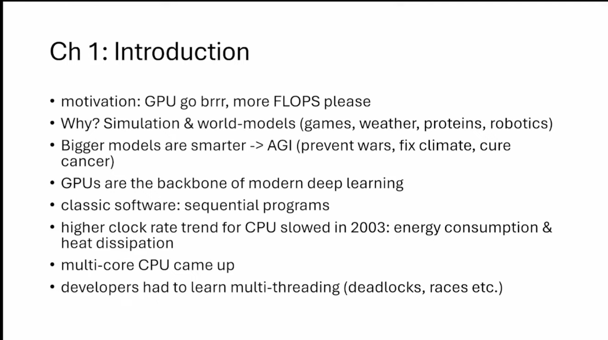

이 페이지는 특별히 할 말이 없다. 일부 대모델과 AI 배경, CPU와 GPU의 구조 차이, 그리고 GPU가 등장한 이유가 CPU가 hardware 기술만으로 해결하기 어려운 대규모 계산 성능 문제를 해결하기 위해서였다는 점을 소개한다.

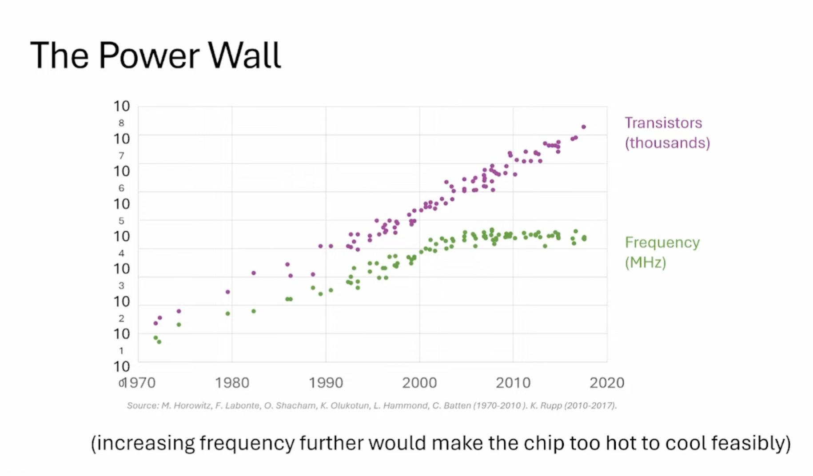

이 그림의 이름은 "The Power Wall"이며, 1970년부터 2020년까지 computer chip 기술의 두 핵심 parameter 발전 추세를 보여준다.

Transistor 수(보라색 선): 천 단위이며 지수적으로 증가한다.
Frequency(초록색 선): MHz 단위이며 processor clock speed 변화를 보여준다.

"Power Wall" 현상: 그림 아래 주석은 frequency가 더 이상 계속 증가하지 않는 이유를 설명한다. "frequency를 더 높이면 chip이 너무 뜨거워져 효율적으로 방열할 수 없게 된다."

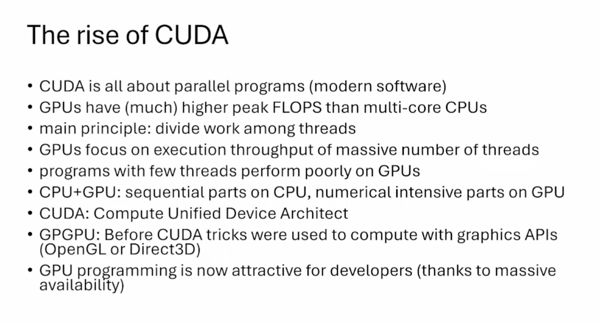

이 slides는 CUDA의 부상과 핵심 특성을 소개한다.

- CUDA는 parallel program에 집중하며 modern software에 적합하다.
- GPU의 peak FLOPS는 multi-core CPU보다 훨씬 높다.
- 주요 원칙은 작업을 여러 thread에 나누는 것이다.
- GPU는 대규모 thread 실행 throughput을 중시한다.
- thread가 적은 program은 GPU에서 성능이 좋지 않다.
- sequential 부분은 CPU에 두고, numerical intensive 부분은 GPU에 둔다.
- CUDA는 Compute Unified Device Architect(통합 계산 device architecture)다.
- CUDA 등장 전에는 OpenGL 또는 Direct3D 같은 graphics API로 계산했다.
- GPU가 널리 보급되면서 GPU programming은 developer에게 더 매력적이 되었다.

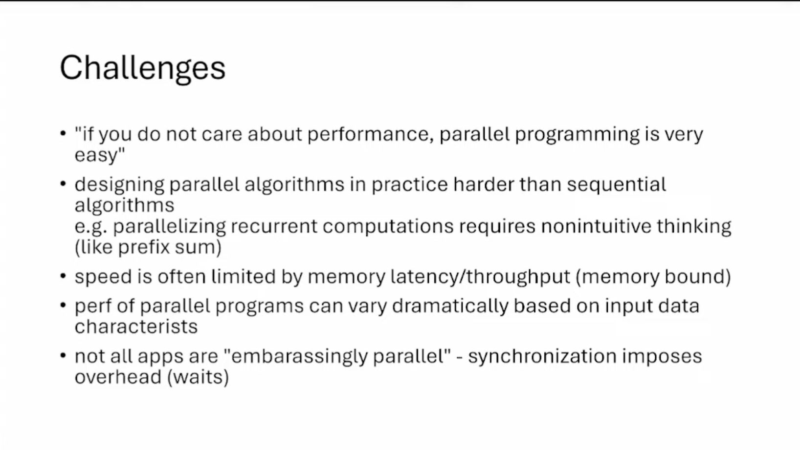

이 slides는 CUDA programming의 몇 가지 challenge를 소개한다.

- performance에 신경 쓰지 않는 parallel programming은 쉽지만, performance optimization은 어렵다.
- parallel algorithm 설계는 sequential algorithm 설계보다 어렵다. 예를 들어 recursive computation을 parallelize하려면 prefix sum 같은 비직관적인 사고방식이 필요하다.
- parallel program의 속도는 보통 memory latency와 throughput에 의해 제한된다. memory bottleneck의 예는 LLM inference의 decode다.
- parallel program의 performance는 input data 특성에 따라 크게 달라질 수 있다. 예를 들어 LLM inference에는 서로 다른 길이의 sequence가 있다.
- 모든 application이 쉽게 parallelize되는 것은 아니다. synchronization이 필요한 많은 지점은 추가 overhead(waiting time)를 가져온다. data dependency가 있는 경우가 예다.

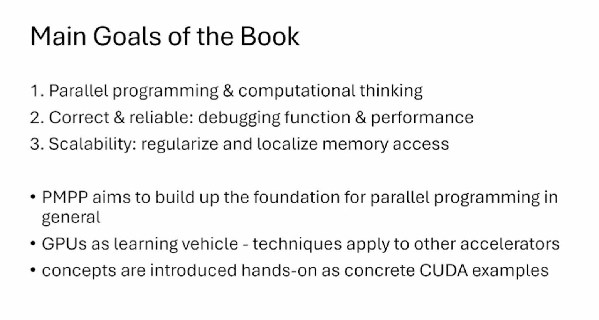

《Programming Massively Parallel Processors》 책의 세 주요 목표는 다음과 같다.

- parallel programming과 computational thinking을 가르친다.
- 이를 올바르고 reliable한 형태로 하도록 한다. 여기에는 debug와 performance가 모두 포함된다.
- 세 번째는 책 구성을 더 잘해 독자의 기억을 깊게 하는 것 등을 뜻하는 듯하다.

여기서는 GPU를 예로 들지만, 소개하는 기술은 다른 accelerator에도 적용된다. 책은 CUDA 예제로 관련 기술과 event를 소개한다.

### PMPP 2장

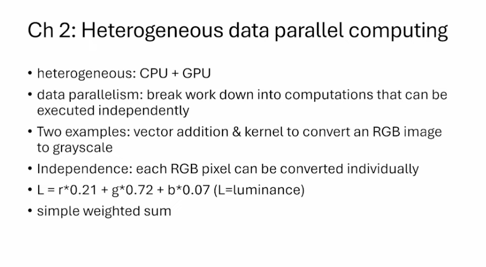

제목은 CH2: heterogeneous data parallel programming이다.
- Heterogeneous: CPU와 GPU를 함께 사용해 계산하고, 각자의 장점을 이용해 처리 속도와 효율을 높인다.
- Data parallelism: 큰 작업을 병렬 처리 가능한 작은 작업으로 나누어 data를 병렬 처리한다. 대량 data 처리 효율을 크게 높일 수 있다.
- Application 예시:
    - vector addition: parallel computing에서 흔한 예다. vector의 각 원소를 따로 더하면 병렬 처리할 수 있고 계산 속도를 높인다.
    - RGB image를 grayscale로 변환: 각 pixel의 RGB 값을 바탕으로 kernel function을 적용해 grayscale 값을 계산한다. 공식은 `L = r*0.21 + g*0.72 + b*0.07`이며 L은 luminance를 뜻한다. 이 변환은 사람 눈이 색마다 민감도가 다르다는 점에 기반하며, green의 weight가 가장 높다.

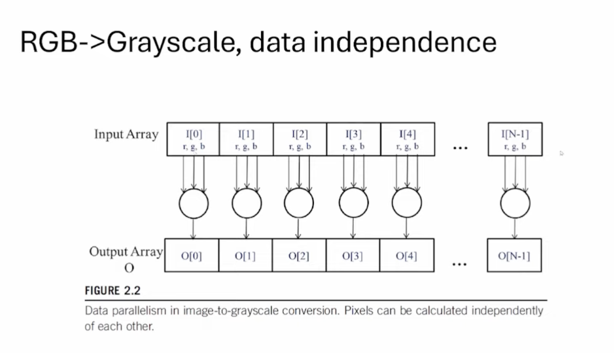

이 Slides에서 모든 pixel의 계산이 서로 독립임을 볼 수 있다.

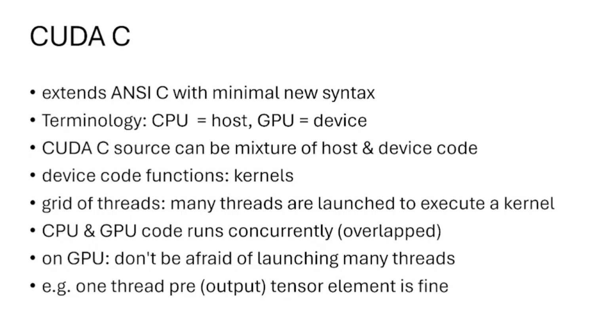

이 Slides는 CUDA C의 몇 가지 특징을 소개한다.
- ANSI C 문법을 확장하고 소량의 새 syntax element를 추가한다.
- 용어에서 CPU는 host, GPU는 device를 뜻한다.
- CUDA C source code는 host code와 device code가 섞일 수 있다.
- device code function은 kernel(kernels)이라고 부른다.
- thread grid를 사용해 kernel을 실행하며 여러 thread가 병렬로 실행된다.
- CPU와 GPU code는 concurrent execution(overlap)이 가능하다.
- GPU에서는 많은 thread를 launch할 수 있으며 걱정할 필요가 없다.
- output tensor의 각 원소마다 thread 하나를 launch하는 것은 매우 일반적이다.

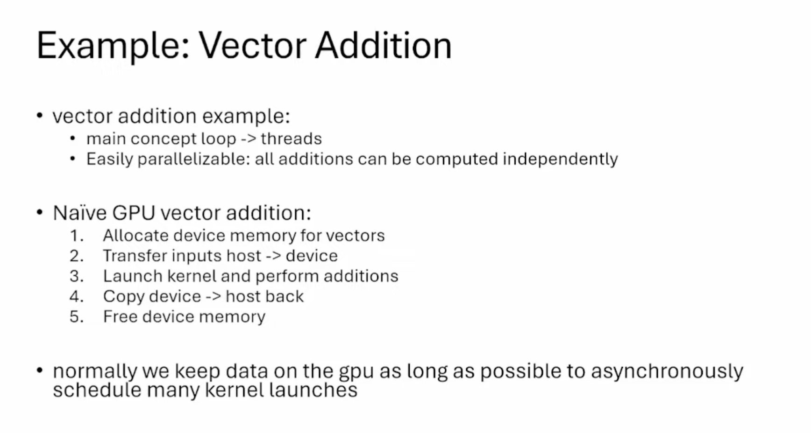

이 Slides는 vector addition의 CUDA C programming 예시를 제시한다.

- vector addition parallelization: 핵심 개념은 loop가 여러 thread에 mapping되어 독립 계산을 수행하고 쉽게 parallelize되는 것이다.
- Naive GPU vector addition 단계:
    - vector용 device memory 할당
    - input을 host에서 device로 전송
    - kernel을 launch해 vector addition 수행
    - 계산 결과를 device에서 host로 copy
    - device memory 해제
- concurrent kernel launch를 지원하려면 data를 가능한 오래 GPU에 유지한다. 이것이 performance를 최대화할 수 있다.

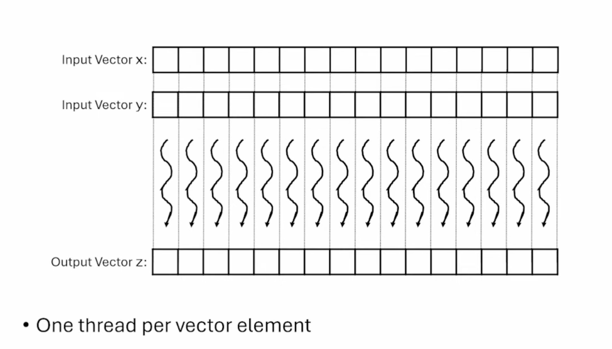

이 Slides는 각 thread가 output element 하나를 처리하며 서로 독립적으로 계산하는 모습을 보여준다.

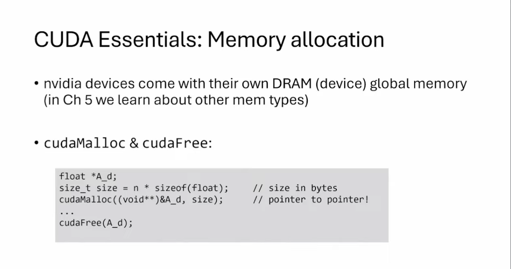

이 Slides는 CUDA programming에서 memory allocation의 중요한 개념을 소개한다.

- NVIDIA device는 자체 DRAM(device global memory)을 가진다.
- CUDA는 두 가지 중요한 memory allocation function을 제공한다.
    - cudaMalloc(): device global memory에 memory space를 할당한다.
    - cudaFree(): device global memory의 memory space를 해제한다.
- code 예시는 이 두 function으로 floating-point array memory를 동적으로 할당하고 해제하는 방법을 보여준다.
    - size_t size = n * sizeof(float);//array에 필요한 byte 수 계산
    - cudaMalloc((void**)&A_d, size);//device에 memory 할당
    - cudaFree(A_d);//device memory 해제

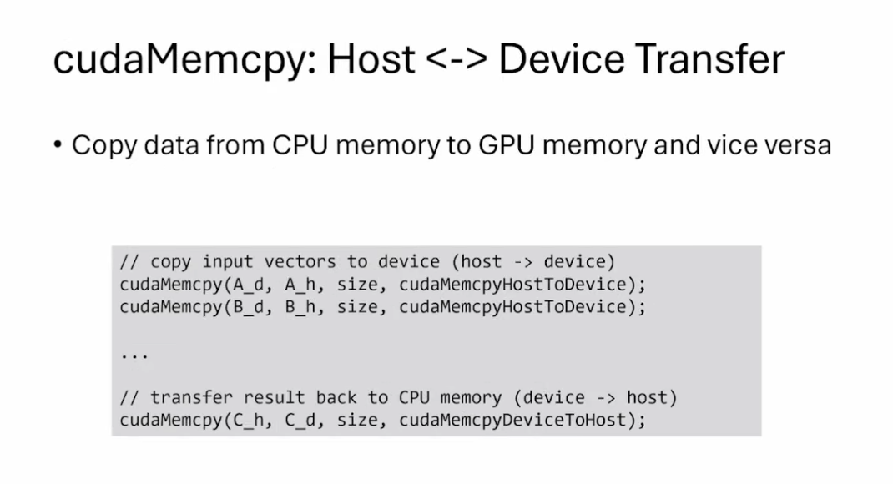

이 Slides는 CUDA의 memory movement API를 소개하며 D2H와 H2D를 포함한다. 일반적으로 CUDA program은 먼저 H2D Memcpy로 data를 GPU로 옮기고, kernel 실행 뒤 결과를 D2H Memcpy로 host 쪽에 다시 옮긴다.

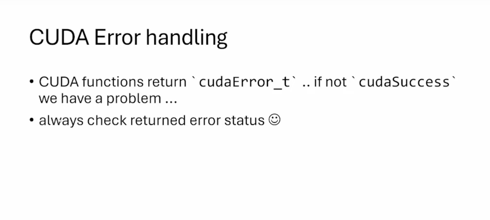

이 Slides는 CUDA programming의 error handling mechanism을 소개한다.

- CUDA function에서 error가 발생하면 특수 error code인 `cudaError_t`를 반환한다. `cudaSuccess`가 아니면 문제가 발생했다는 뜻이다. 이 error code로 문자열 표현도 얻을 수 있다.
- programming 때는 CUDA function의 return value를 항상 검사하고 발생 가능한 error를 처리해야 한다.

https://github.com/cuda-mode/lectures/blob/main/lecture_002/vector_addition/vector_addition.cu 에서 error code를 처리하는 방식을 볼 수 있다.

```c++
// https://stackoverflow.com/questions/14038589/what-is-the-canonical-way-to-check-for-errors-using-the-cuda-runtime-api
#define gpuErrchk(ans) { gpuAssert((ans), __FILE__, __LINE__); }
inline void gpuAssert(cudaError_t code, const char *file, int line, bool abort = true) {
  if (code != cudaSuccess) {
    fprintf(stderr, "GPUassert: %s %s %d\n", cudaGetErrorString(code), file, line);
    if (abort) {
      exit(code);
    }
  }
}

inline unsigned int cdiv(unsigned int a, unsigned int b) {
  return (a + b - 1) / b;
}

void vecAdd(float *A, float *B, float *C, int n) {
  float *A_d, *B_d, *C_d;
  size_t size = n * sizeof(float);

  cudaMalloc((void **)&A_d, size);
  cudaMalloc((void **)&B_d, size);
  cudaMalloc((void **)&C_d, size);

  cudaMemcpy(A_d, A, size, cudaMemcpyHostToDevice);
  cudaMemcpy(B_d, B, size, cudaMemcpyHostToDevice);

  const unsigned int numThreads = 256;
  unsigned int numBlocks = cdiv(n, numThreads);

  vecAddKernel<<<numBlocks, numThreads>>>(A_d, B_d, C_d, n);
  gpuErrchk(cudaPeekAtLastError());
  gpuErrchk(cudaDeviceSynchronize());

  cudaMemcpy(C, C_d, size, cudaMemcpyDeviceToHost);

  cudaFree(A_d);
  cudaFree(B_d);
  cudaFree(C_d);
}
```

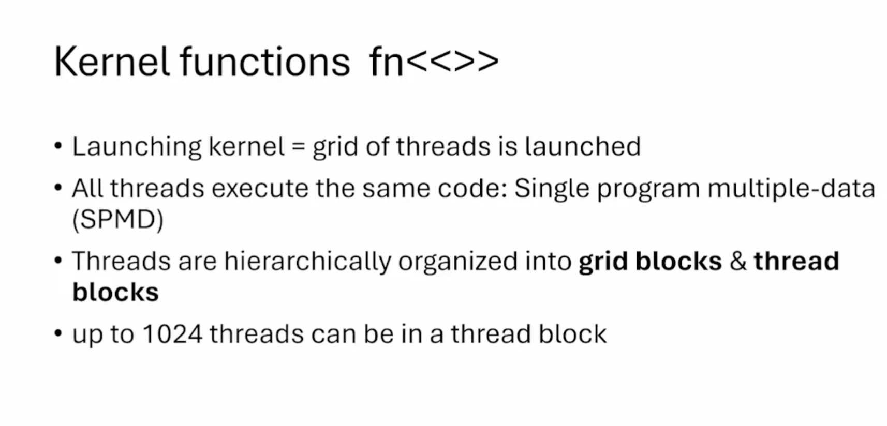

이 Slides는 CUDA programming에서 kernel function의 기본 특징을 소개한다.

- kernel function을 launch한다는 것은 여러 thread로 구성된 grid of threads를 launch한다는 뜻이다.
- 모든 thread는 같은 code를 실행하며, single program multiple data(SPMD) parallel mode를 구현한다.
- thread는 hierarchy 방식으로 조직되며 grid blocks와 thread blocks로 나뉜다.
- 각 thread block은 최대 1024개 thread를 포함할 수 있다.

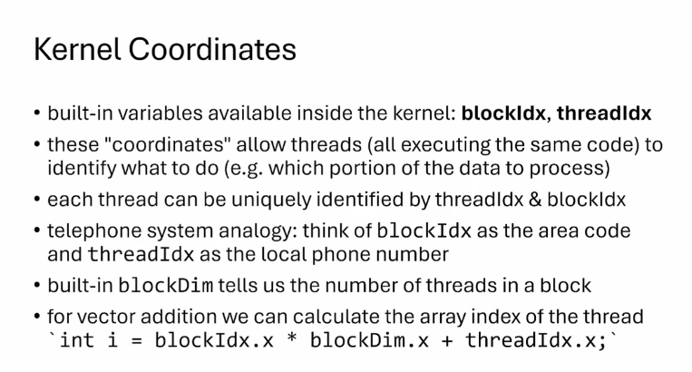

이 Slides는 Kernel coordinate의 몇 가지 지점을 설명한다.
- kernel에서 사용할 수 있는 built-in variables: `blockIdx`, `threadIdx`. CUDA programming에서 thread 위치를 식별하는 built-in variable이다. `blockIdx`는 현재 thread block의 index를 나타내고, `threadIdx`는 현재 thread가 속한 block 안에서의 index를 나타낸다.
- 이 "coordinates"는 같은 code를 실행하는 모든 thread가 처리할 data 부분을 식별하게 한다. `blockIdx`와 `threadIdx`를 사용하면 각 thread가 data의 어느 부분을 처리해야 하는지 정할 수 있다. 이는 parallel processing에서 중요하다. 서로 다른 thread가 서로 다른 data fragment를 동시에 처리할 수 있기 때문이다.
- 각 thread는 `threadIdx`와 `blockIdx`로 유일하게 식별될 수 있다. 이 조합은 thread 위치를 유일하게 정해 서로 다른 thread가 같은 data fragment를 처리하는 것을 피한다.
- 전화 시스템 비유: `blockIdx`를 area code로, `threadIdx`를 local phone number로 본다. `blockIdx`는 더 큰 region이고 `threadIdx`는 그 region 안의 구체 thread다.
- built-in `blockDim`은 block 안 thread 수를 알려준다. 이 variable은 각 thread의 global index를 계산할 때 필요하다.
- vector addition에서는 thread의 array index를 계산할 수 있다. 예시 code: `int i = blockIdx.x * blockDim.x + threadIdx.x;` 이 코드는 각 thread의 전체 data array 위치를 계산하는 법을 보여준다. `blockIdx.x * blockDim.x`는 현재 block 이전 모든 thread 수를 계산하고, `threadIdx.x`를 더해 현재 thread의 global index를 얻는다.

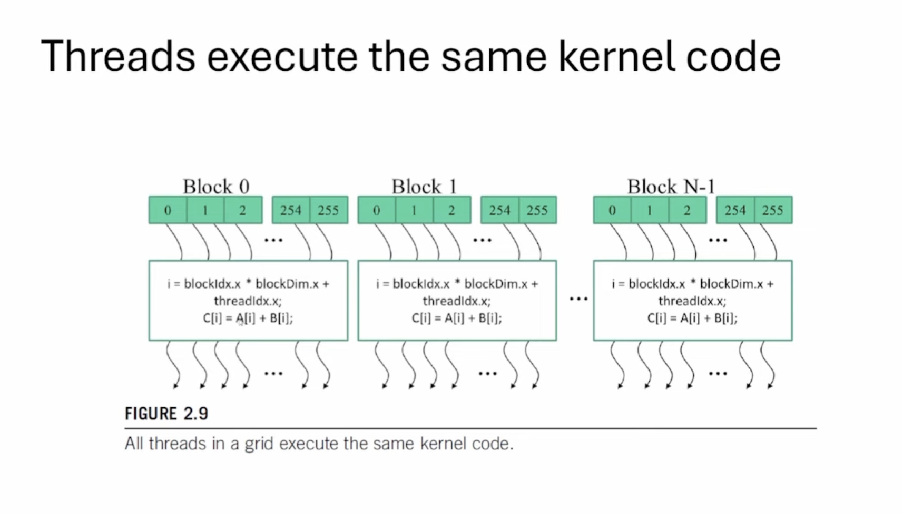

이 Slides는 Kernel coordinate positioning의 visualization이다. 각 thread가 같은 code를 실행하고 data 위치만 다르다는 점을 볼 수 있다.

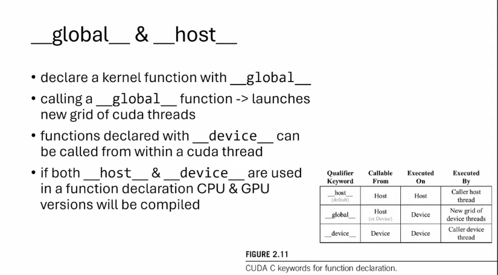

이 Slides는 CUDA C의 몇 가지 핵심 function declaration modifier인 `__global__`, `__device__`, `__host__`와 그 사용법 및 특성을 설명한다.

- `__global__` modifier:
    - `__global__`로 선언한 function은 kernel function이다.
    - `__global__` function을 호출하면 새로운 CUDA thread grid(grid of cuda threads)가 launch된다.
    - Host(CPU) 쪽에서 호출하고 Device(GPU)에서 실행된다.

- `__host__` modifier:
    - `__host__`로 선언한 function은 CPU에서 실행된다.
    - Host(CPU) 쪽에서 호출한다.

- `__device__` modifier:
    - `__device__`로 선언한 function은 CUDA thread 내부에서 호출할 수 있다.
    - Device(GPU)에서 실행된다.

- 조합 사용:
    - function declaration에서 `__host__`와 `__device__` modifier를 동시에 사용하면 compiler가 해당 function의 CPU와 GPU 두 version을 생성한다.

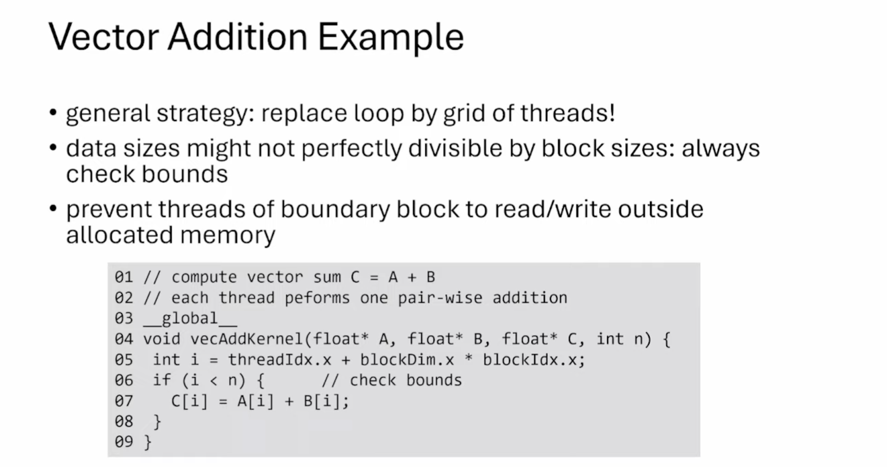

이 Slides는 CUDA programming에서 vector addition을 수행하는 예시와 몇 가지 중요한 strategy 및 주의사항을 설명한다.

- 전체 strategy: loop를 thread grid로 대체한다. CUDA parallel programming의 핵심 아이디어다.
- data size 고려: data size는 block size로 완벽히 나누어떨어지지 않을 수 있으므로 항상 boundary condition을 검사해야 한다.
- memory access safety: boundary block의 thread가 할당 memory 바깥을 읽고 쓰는 것을 막는다. memory access error를 피하기 위해서다.
- code 예시: vector addition CUDA kernel function을 보여준다.
    - function은 vector sum `C = A + B`를 계산한다.
    - 각 thread는 대응 원소의 addition operation을 한 번 수행한다.
    - `__global__` modifier로 kernel function을 선언한다.
    - function parameter에는 input vector A와 B, output vector C, vector length n이 포함된다.
    - thread와 block index로 각 thread가 담당할 원소 위치를 계산한다.
    - boundary check를 수행해 vector 범위를 넘는 원소에 접근하지 않게 한다.
    - 실제 addition operation을 수행한다.

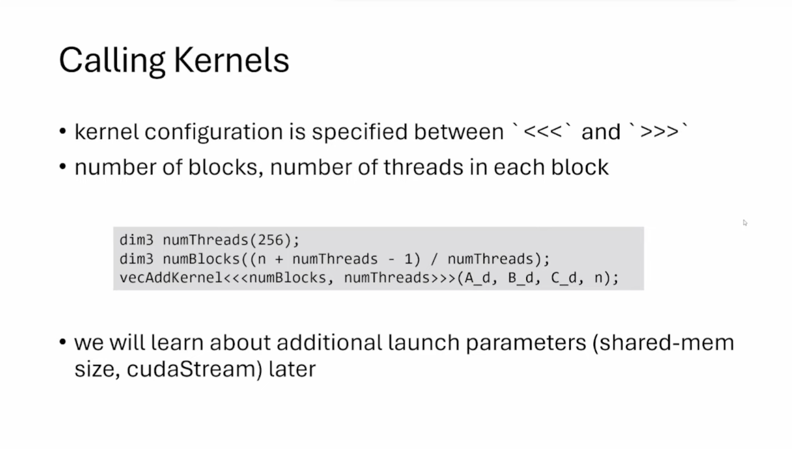

이 Slides는 CUDA에서 kernel을 호출할 때 주의할 점을 설명한다.

- kernel configuration은 `<<<`와 `>>>` 사이에 지정한다. 이 configuration은 주로 두 parameter, block 수와 block 안 thread 수를 포함한다.
- code block에서는 block마다 thread 수를 256으로 설정한다. `dim3 numThreads(256);` 필요한 block 수는 `dim3 numBlocks((n + numThreads - 1) / numThreads);`로 계산한다. 이 계산 방식은 n이 numThreads로 나누어떨어지지 않아도 모든 data를 덮도록 보장한다.
- 이후 shared memory size(shared-mem size)와 CUDA stream(cudaStream) 같은 다른 launch parameter를 배운다.

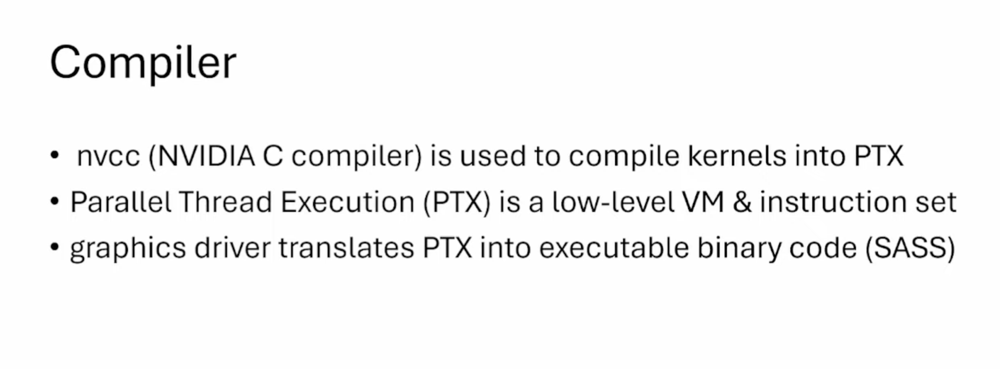

이 Slides는 CUDA programming의 compiler와 관련 개념을 소개한다.
- NVCC는 NVIDIA의 C compiler이며 CUDA kernel code를 PTX(Parallel Thread Execution)로 compile하는 데 사용된다.
- PTX는 low-level VM과 instruction set이며, CUDA code compilation 과정의 intermediate representation이다.
- graphics driver는 PTX를 executable binary code(SASS)로 translate한다. SASS(Streaming Assembly)는 GPU에서 실제 실행되는 machine code다.

### PMPP 3장

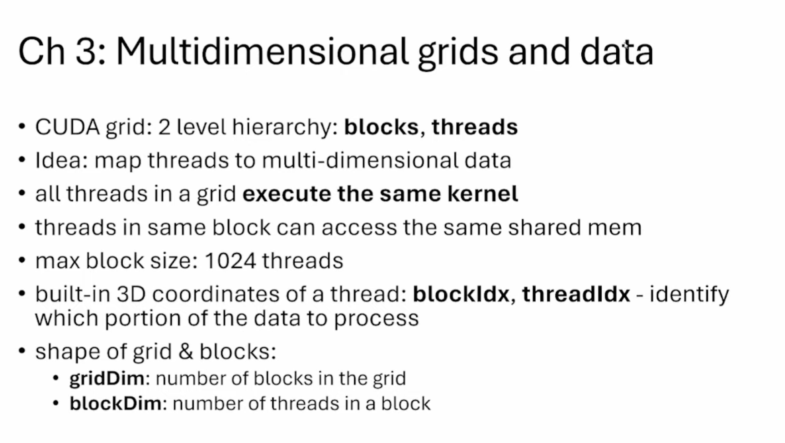

이 Slides는 Lecture 2와 거의 반복된다.

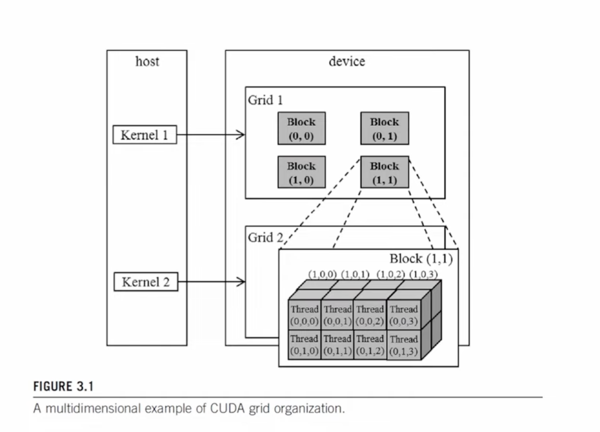

이 Slides는 kernel을 launch하는 2D thread grid(Grid)와 3D thread block(Block) 구조를 보여준다. 같은 device에서 여러 kernel을 launch할 수 있다.

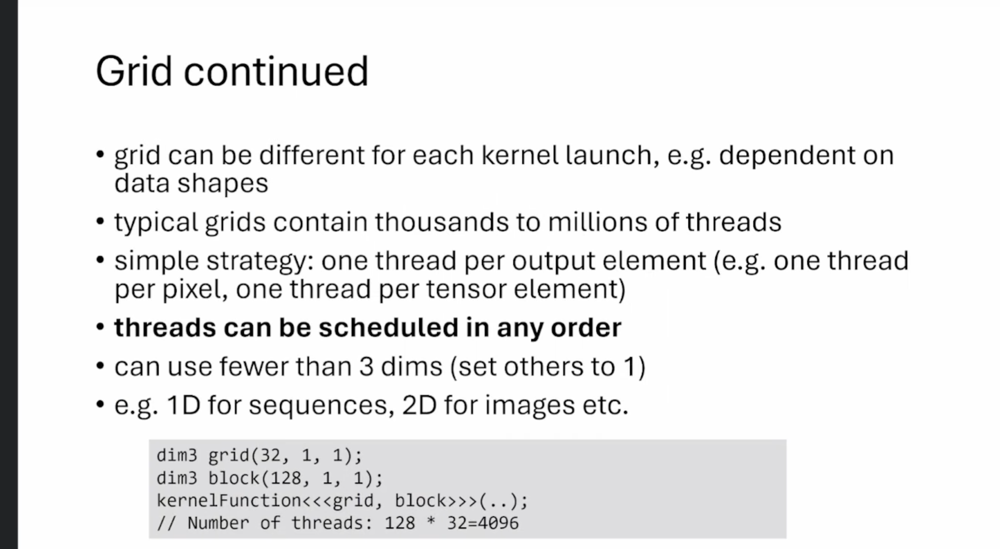

이 Slides는 CUDA의 grid 개념을 계속 논한다.

- 매 kernel launch마다 서로 다른 grid configuration을 사용할 수 있다. 예를 들어 data shape에 따라 결정한다.
- 전형적인 grid는 수천에서 수백만 thread를 포함한다.
- 자주 쓰는 strategy는 output element 하나마다 thread 하나를 대응시키는 것이다. 예를 들어 pixel마다 thread 하나, tensor element마다 thread 하나다.
- thread는 임의 순서로 schedule되어 실행될 수 있다.
- 3차원보다 적은 grid configuration도 사용할 수 있다. 사용하지 않는 dimension은 1로 둔다.
- 예: 1D는 sequence processing, 2D는 image processing 등에 사용된다.
- code 예시는 1D grid와 block configuration을 정의해 총 4096개 thread를 launch하는 방법을 보여준다.

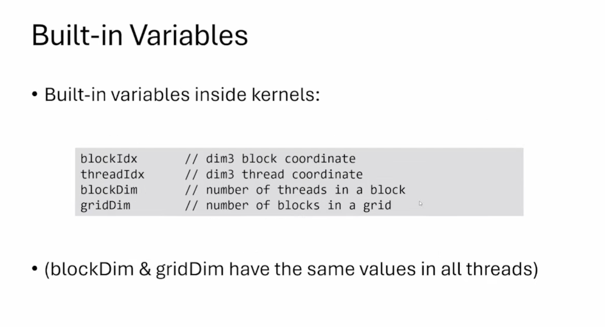

CUDA에는 이미 이런 built-in variables가 들어 있다. 2장에서 반복해서 언급했다.

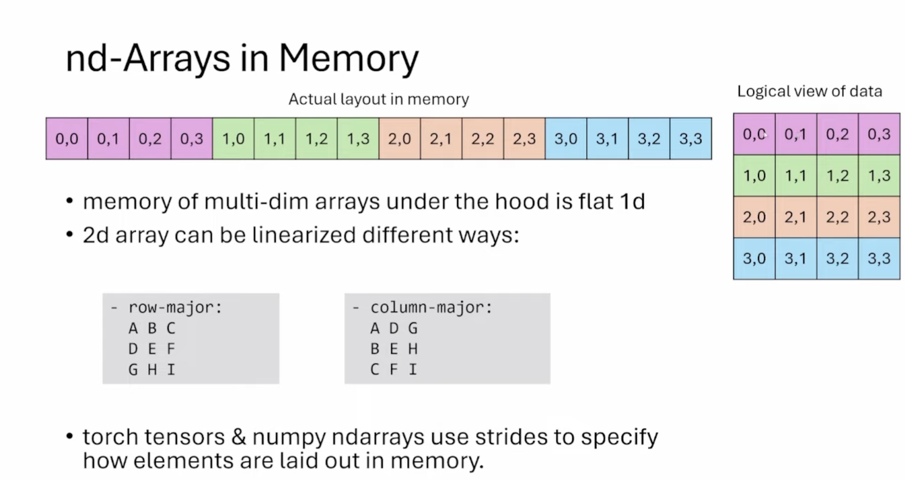

이 Slides는 multidimensional array가 memory에 저장되는 방식을 설명한다. 주요 내용은 다음과 같다.

- multidimensional array는 memory에서 실제로 flat 1D 방식으로 저장된다. 그림은 4x4 2D array가 memory에 linear하게 저장되는 방식을 보여준다.
- 왼쪽은 실제 memory layout(1D)을 보여주고, 오른쪽은 data의 logical view(2D)를 보여준다.
- 2D array는 서로 다른 방식으로 linearize할 수 있다.
    - a) row-major: row 기준 저장, 예: ABC DEF GHI
    - b) column-major: column 기준 저장, 예: ADG BEH CFI
- Torch tensors와 NumPy ndarrays 같은 library는 stride를 사용해 memory 안의 element layout 방식을 지정한다.
- memory layout 이해는 data access를 최적화하고 계산 효율을 높이는 데 매우 중요하다. 특히 parallel computing과 GPU programming에서 그렇다.

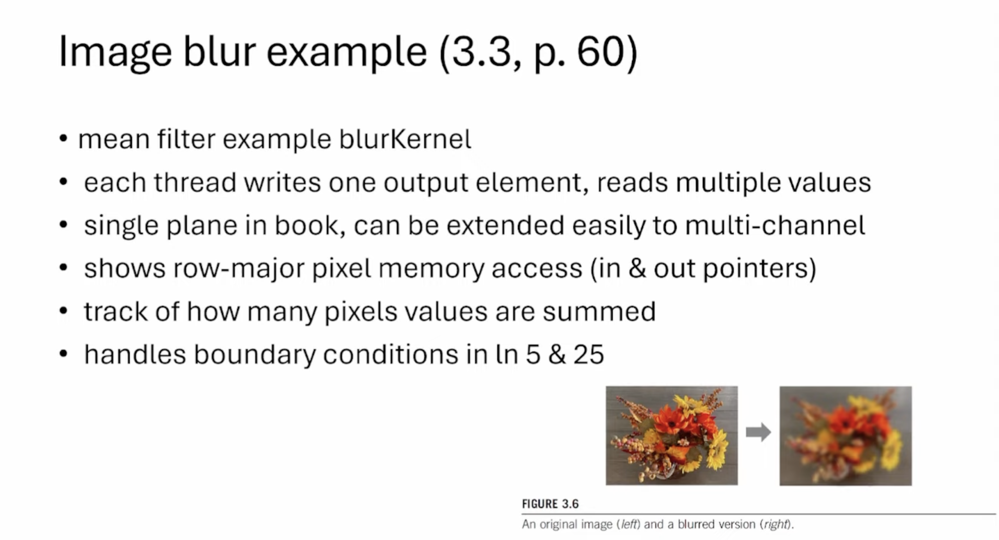

이 Slides는 image blur 예시를 설명한다. 주요 내용은 다음과 같다.

- `blurKernel`이라는 mean filter를 구현했다.
- 각 thread는 output element 하나를 write하지만 여러 input value를 read해야 한다.
- 예시는 single plane, 즉 grayscale image를 처리하지만 RGB image 같은 multi-channel로 쉽게 확장할 수 있다.
- row-major pixel memory access 방식(input/output pointer)을 보여준다.
- 얼마나 많은 pixel value가 누적되는지 추적한다.
- kernel의 5번째 줄과 25번째 줄에서 boundary condition을 처리한다. 자세히는 아래 screenshot의 두 red box 부분을 보면 된다. 코드는 https://github.com/cuda-mode/lectures/blob/main/lecture_002/mean_filter/mean_filter_kernel.cu 에 있다.
- 실제 효과: Slides는 원본 image(왼쪽)와 blur 처리 후 image(오른쪽)를 보여준다. 원본은 가을 꽃다발이고, blur 후 image는 전형적인 blur 효과를 보여준다.

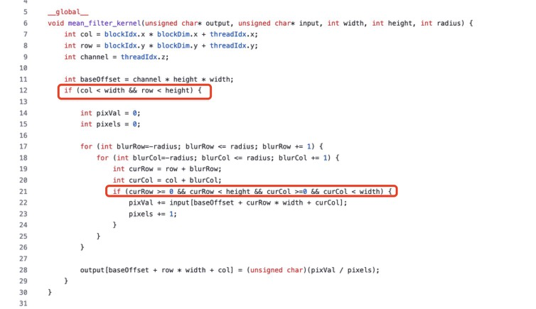

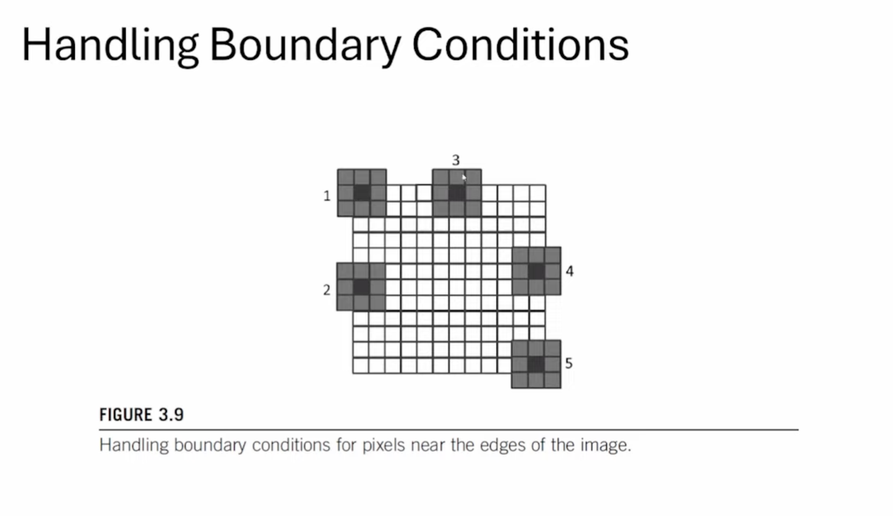

이 Slides는 boundary handling의 schematic을 보여준다. 그림의 서로 다른 위치에 있는 pixel마다 실제로 smoothing해야 하는 유효 pixel 수가 다를 수 있다.

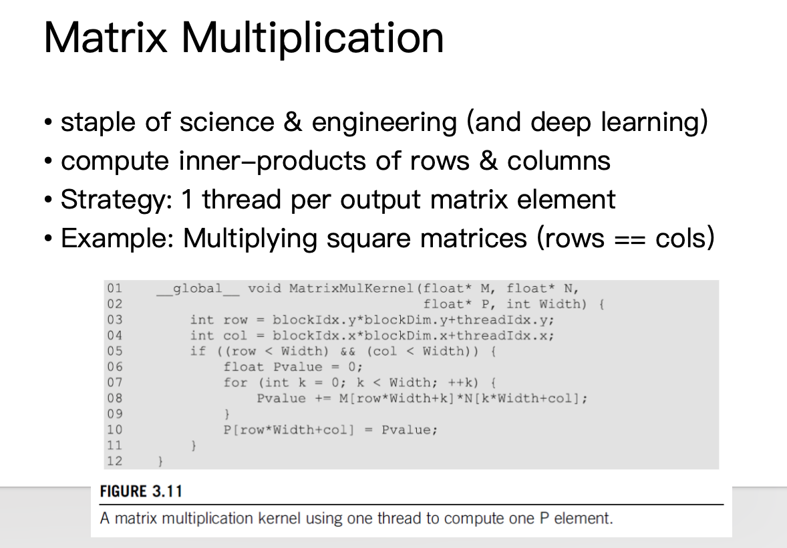

여기서는 여전히 thread 하나가 output element 하나를 계산하는 matrix multiplication CUDA kernel 구현 예시를 보여준다.

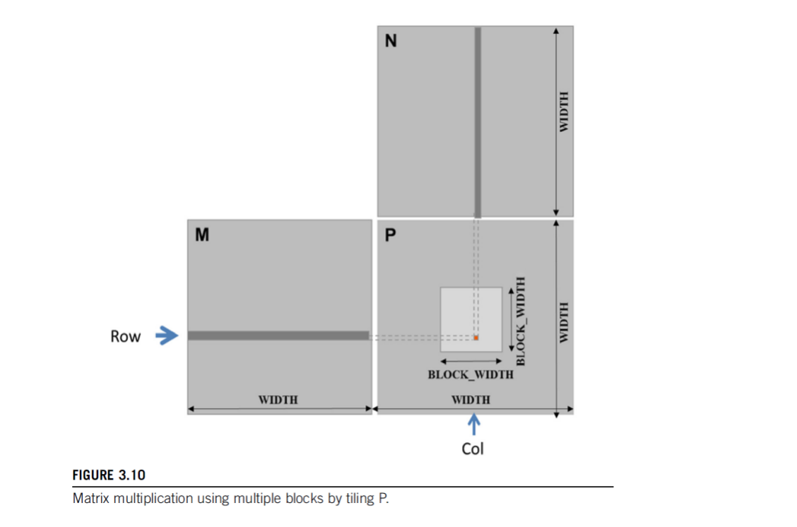

이 그림은 kernel launch의 tiling strategy를 보여준다. naive launch 방식보다 더 나은 data cache를 가질 수 있다. matrix multiplication에 대해서는 이 강의에서 더 깊이 들어가지 않는다.

matrix multiplication에는 매우 강력한 최적화가 많다. https://github.com/BBuf/how-to-optim-algorithm-in-cuda/blob/master/README.md 의 학습 자료 모음 중 matrix multiplication 블로그를 참고하거나 Triton의 matrix multiplication optimization tutorial을 참고하면 된다. 예전에 나도 한 편을 해설한 적이 있다: [BBuf의 CUDA 노트 13, OpenAI Triton 입문 노트 1](https://mp.weixin.qq.com/s/RMR_n1n6nBqpdMl6tdd7pQ). 결국 스스로 공부해야 한다.

정리하면 이 강의는 매우 기초적이며 기본 개념과 초급 주의사항을 다룬다. CUDA 기초가 있는 사람은 보지 않아도 된다.
