# Lecture 4 Ch4-5 PMPP book

> 내 강의 노트다. 관심 있으면 봐도 좋다: https://github.com/BBuf/how-to-optim-algorithm-in-cuda/tree/master/cuda-mode 

## 4강: 계산과 메모리 기초(PMPP 책 4-5장 기반)

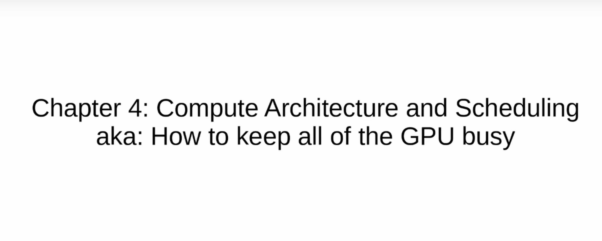

### 4장: compute architecture와 scheduling, GPU 전체를 계속 바쁘게 유지하는 법

다음 2장의 Slides는 책에서 CPU와 GPU 구조를 비교한 내용을 보여준다. 다만 이 두 Slides는 매우 낡았으므로 여기서는 screenshot을 넣지 않는다.

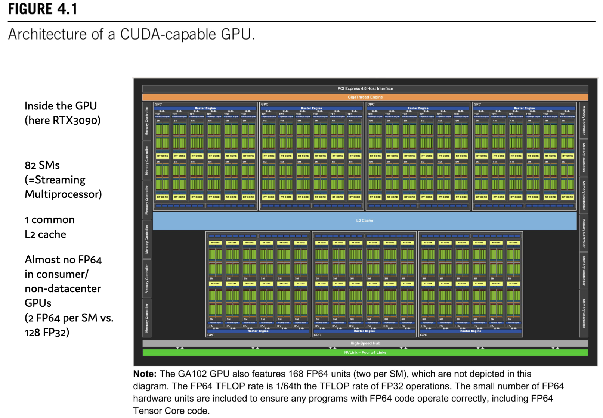

RTX 3090에는 82개의 streaming multiprocessor(SM)가 있으며, 각 SM에는 여러 RT Core(ray tracing core)와 Tensor Core가 포함된다. 모든 SM은 L2 cache를 공유한다.

consumer/non-data-center GPU에는 FP64(double precision floating point) unit이 거의 없다. 각 SM에는 FP64 unit 2개가 있고, FP32(single precision floating point) unit 128개와 대비된다.

GA102 GPU에는 실제로 FP64 unit이 168개 있다(SM마다 2개). 하지만 Slides에는 표시되어 있지 않다. FP64의 TFLOP rate는 FP32의 1/64다. 소량의 FP64 hardware unit이 들어 있는 이유는 FP64 code를 포함하는 program이 FP64 Tensor Core code를 포함해 올바르게 실행되도록 보장하기 위해서다.

> GA: "Graphics Ampere"를 뜻하며 NVIDIA Ampere architecture를 가리킨다. 102는 이 특정 GPU model의 numeric identifier다. 일반적으로 더 높은 숫자는 더 high-end 또는 더 큰 규모의 GPU design을 의미한다. GA102는 GeForce RTX 3090, RTX 3080, 일부 Quadro professional card 등 여러 graphics card에 사용되었다.

Slides에서 세어 보면 RTX 3090의 전체 SM 개수는 12x7=84개여야 한다. 하지만 그중 2개가 enabled되지 않았으므로 실제 동작 가능한 SM 개수는 82개다.

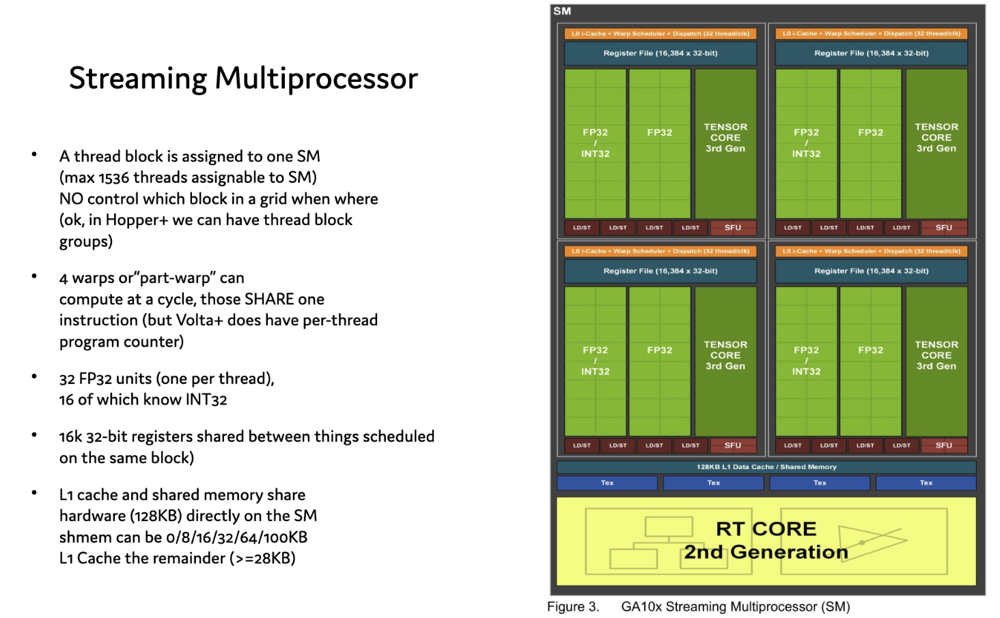

이 Slides는 NVIDIA GA10x GPU architecture 안의 streaming multiprocessor(SM) 구조와 특성을 설명한다.
- SM structure:
    - 4개의 processing unit, 각각 FP32(single precision floating point)와 INT32(integer) operation unit을 포함한다.
    - 각 processing unit에는 3세대 Tensor Core가 하나 있다.
    - register file(16,384 x 32-bit)
    - L0 I-Cache와 Warp scheduler
    - 128KB L1 data cache/shared memory
    - 2세대 RT Core(ray tracing core)
- thread block allocation:
    - thread block 하나는 SM 하나에 할당된다.
    - 각 SM은 최대 1536개 thread를 할당받을 수 있다.
    - grid 안의 어떤 block이 어디에 할당될지는 제어할 수 없다(Hopper+ architecture에는 thread block group이 있을 수 있다).
- Warp execution:
    - 4개 warp 또는 "partial warp"가 한 cycle 안에 계산할 수 있다.
    - 이 warp들은 instruction 하나를 공유한다(Volta+ architecture에서는 각 thread가 program counter를 가진다).
- compute unit:
    - FP32 unit 32개. 이 32개 FP32 unit은 warp의 32개 thread에 대응되며, 특정 clock cycle에서 32개 FP32 unit이 한 warp 안의 32개 thread를 동시에 처리할 수 있다.
    - 그중 16개는 INT32 operation도 동시에 지원한다.
- register:
    - 16k개의 32-bit register가 같은 block에서 schedule된 task 사이에 공유된다.
- cache와 shared memory:
    - L1 cache와 shared memory는 128KB hardware를 공유한다.
    - shared memory는 0/8/16/32/64/100KB로 설정할 수 있다.
    - L1 cache는 남은 공간을 사용한다(최소 28KB).

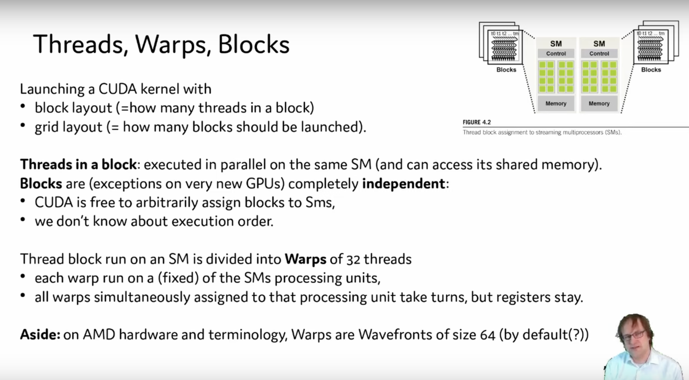

이 그림은 CUDA programming의 Threads, Warps, Blocks 개념과 관계를 설명한다.

- CUDA kernel launch: block layout(각 block 안 thread 수)을 지정하고, grid layout(launch할 block 수)을 지정한다.
- thread block 안의 thread: 같은 block 안 thread는 같은 streaming multiprocessor(SM)에서 병렬 실행된다. SM의 shared memory에 접근할 수 있다.
- 매우 새로운 GPU를 제외하면 block끼리는 완전히 독립이다. CUDA는 block을 SM에 자유롭게 할당할 수 있고, block 실행 순서는 random이다.
- thread block이 SM에서 실행될 때는 32-thread warp로 나뉜다. 각 warp는 SM의 고정 processing unit에서 실행된다. processing unit에 동시에 할당된 모든 warp는 번갈아 실행되지만 register state는 유지된다. 여기서는 warp switching 때 register state를 보존할 수 있다는 뜻으로 보인다. 예를 들어 어떤 warp가 실행을 잠시 멈추고 다른 warp에 양보하면 그 register state가 저장된다. 다시 실행 시간을 얻으면 이전 상태에서 이어 실행할 수 있으며 다시 initialize할 필요가 없다.
- AMD hardware와 용어에서는 warp를 Wavefronts라고 부르며 기본 size는 64인 듯하다.
- 오른쪽 chart는 thread block이 서로 다른 SM에 어떻게 할당되는지 보여준다.

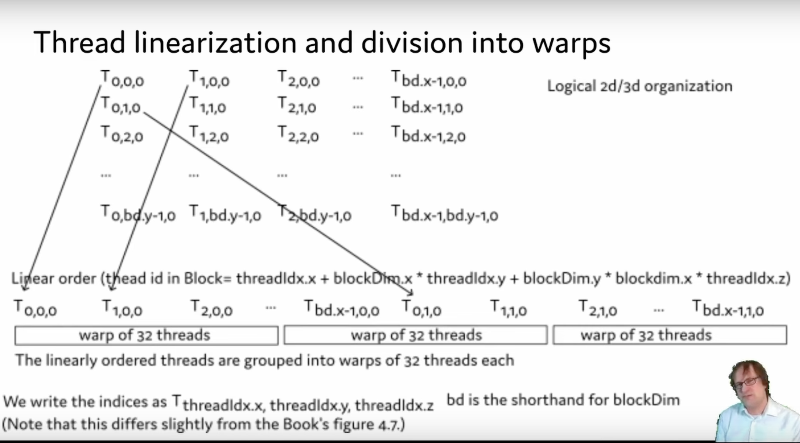

이 slides는 CUDA에서 thread linearization과 warp grouping 과정을 설명한다. T(x,y,z)는 thread index를 뜻하며 x, y, z는 세 dimension index다. multidimensional thread index를 1D linear index로 변환하는 공식은 `threadId = threadIdx.x + blockDim.x * (threadIdx.y + blockDim.y * threadIdx.z)`다. linearization된 thread는 32개 thread를 한 그룹으로 하는 warp로 묶인다. 그림 아래쪽은 thread가 어떻게 연속 warp로 그룹화되는지 보여준다.

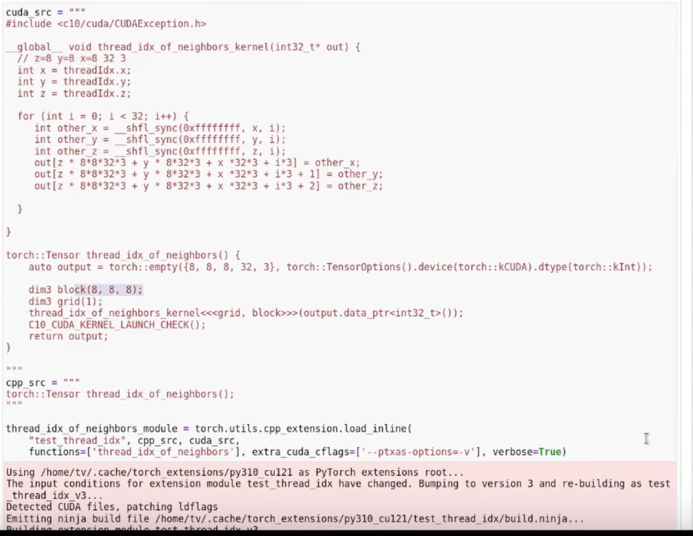

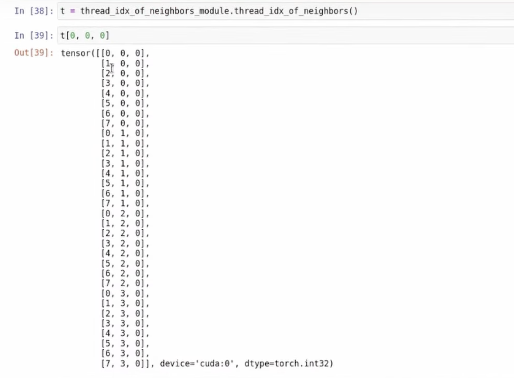

이 kernel의 목적은 3D space의 각 point에 대해 warp 안의 32개 "neighbor" index를 계산하는 것이다. CUDA의 warp-level shuffle operation을 사용해 thread 사이에서 data를 효율적으로 교환한다. output은 5D tensor이며 dimension은 (8, 8, 8, 32, 3)이다.

- 앞의 세 dimension(8, 8, 8)은 3D space의 point에 대응된다.
- 32는 각 point가 계산하는 32개 neighbor를 나타낸다.
- 3은 각 neighbor의 x, y, z coordinate를 나타낸다.

kernel output 결과는 위위 Slides의 설명과 일치한다.

여기서 `__shfl_sync()`에 주의해야 한다. 이는 CUDA programming에서 thread 간 communication에 사용하는 built-in function이다. 같은 Warp(동시에 실행되는 32개 thread group) 안의 thread가 data를 공유하게 한다. 이 function은 이른바 shuffle operation을 구현한다. 즉 Warp 안의 임의 thread에서 data를 가져와 같은 Warp 안의 다른 thread에게 broadcast할 수 있다.

`__shfl_sync()` function의 기본 syntax는 다음과 같다.

```c++
__shfl_sync(mask, var, srcLane, width);
```

- `mask`: 이 operation에 참여할 thread를 정하는 mask value다. 보통 모든 thread가 참여한다는 의미로 `0xffffffff`를 사용한다.
- `var`: 공유할 variable이다.
- `srcLane`: 어떤 thread(lane ID)에서 data를 가져올지 지정한다.
- `width`: shuffle operation의 범위를 나타내며, 일반적으로 Warp size와 관련된다. 표준 CUDA Warp size(32 thread)의 경우 width는 1, 2, 4, 8, 16, 32가 될 수 있다.
예를 들어 어떤 Warp에서 모든 thread가 9번째 thread의 `value` variable 값을 얻고 싶다면 다음처럼 호출할 수 있다.

```c++
int sharedValue = __shfl_sync(0xffffffff, value, 9, 32);
```

여기서 `sharedValue`는 9번째 thread의 `value` variable 값으로 설정되며, 다른 모든 thread도 그 값을 갖는다.

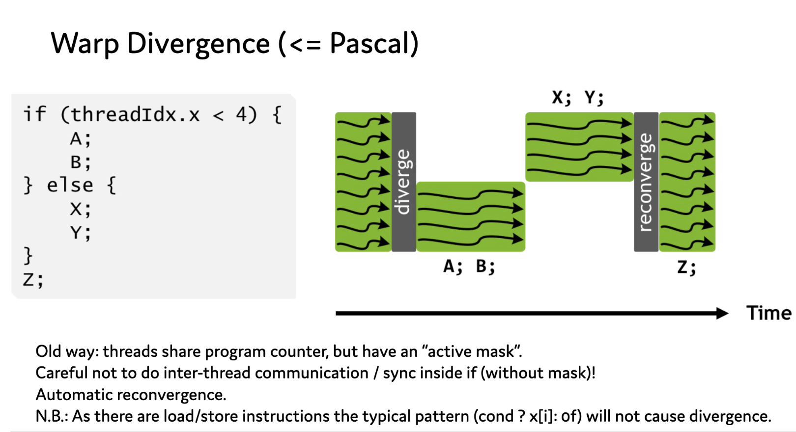

이 Slides는 CUDA의 Warp Divergence 현상을 설명한다. 특히 Pascal 및 이전 GPU architecture를 다룬다. 이 code는 thread ID에 따라 서로 다른 operation을 실행하는 conditional statement를 보여준다. 실행 흐름은 다음과 같다.
- 모든 thread가 먼저 divergence point에 도착한다.
- A와 B를 실행하는 thread(`threadIdx.x < 4`)가 계속 실행되고, 다른 thread는 기다린다.
- 그다음 X와 Y를 실행하는 thread가 계속 실행되고, 이전 thread는 기다린다.
- 마지막으로 모든 thread가 다시 합류해 Z를 실행한다.

핵심은 다음과 같다.
- 옛 방법: thread는 program counter를 공유하지만 "active mask"가 있다.
- if statement 내부에서 thread 간 communication이나 synchronization을 하지 않도록 조심해야 한다(mask를 사용하는 경우는 제외).
- automatic reconvergence: divergence 부분 실행이 끝나면 모든 thread는 자동으로 Z에서 다시 합류한다.

Performance 영향:

- Warp divergence는 일부 thread가 기다리는 동안 유효 작업을 수행할 수 없으므로 performance를 떨어뜨린다.
- 이상적으로는 같은 warp 안의 모든 thread가 같은 instruction path를 실행해야 한다.
- load/store instruction의 경우 전형적인 pattern(cond ? x[i] : 0f)은 divergence를 일으키지 않는다. hardware가 이런 단순 conditional execution을 효율적으로 처리할 수 있기 때문이다.

> 핵심은 <=Pascal architecture에서는 warp 안의 모든 thread가 program counter를 공유한다는 점이다.

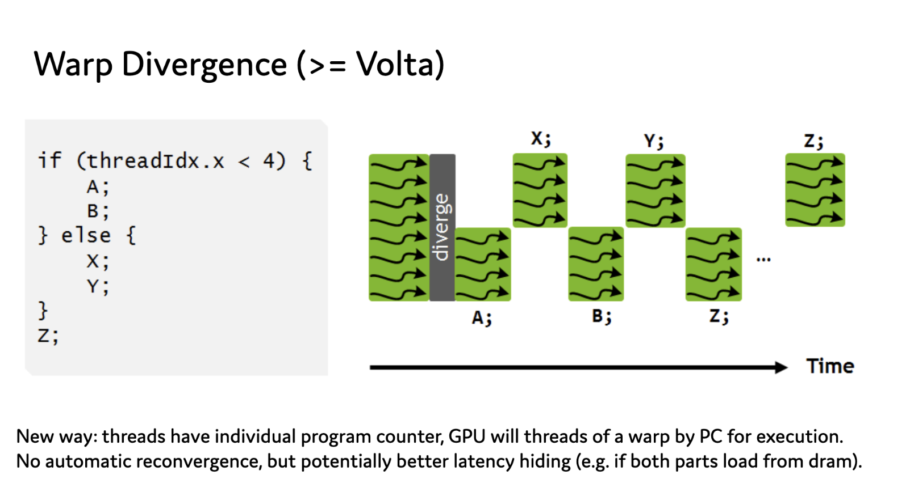

이 Slides는 NVIDIA Volta 및 이후 architecture에서 Warp Divergence를 처리하는 새 방법을 설명한다.

실행 흐름:
- 모든 thread가 먼저 divergence point에 도착한다.
- A를 실행하는 thread(`threadIdx.x < 4`)가 계속 실행된다.
- 동시에 X를 실행하는 thread(`threadIdx.x >= 4`)도 실행을 시작한다.
- B와 Y는 각각 자기 thread group에서 실행된다.
- 마지막으로 모든 thread가 Z를 실행하지만, explicit reconvergence는 필요 없다.

주요 개선:
- independent program counter: 각 thread가 자기 PC를 가지므로 더 유연하게 실행할 수 있다.
- divergence path parallel execution: 서로 다른 execution path가 동시에 진행되어 효율을 높인다.
- automatic reconvergence 없음: thread는 같은 instruction에 자연스럽게 도달할 때까지 독립적으로 실행될 수 있다.
- 더 나은 latency hiding: 두 branch 모두 DRAM load와 관련되면 병렬로 진행해 효율을 높일 수 있다.
- 더 높은 hardware utilization: thread waiting 상황을 줄인다.

> thread divergence 때 더 이상 automatic reconvergence가 없다는 점에 주의한다. developer는 synchronization point에 더 신경 써야 한다.

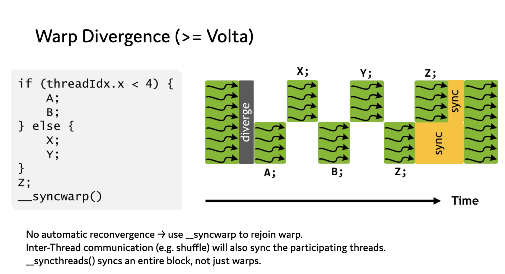

이 Slides의 code는 이전과 같지만 마지막에 `__syncwarp()` function을 추가했다. 핵심 변화와 개념은 다음과 같다.

- automatic reconvergence 없음: Volta architecture는 branch 끝에서 thread를 자동으로 다시 synchronize하지 않는다.
- explicit synchronization: `__syncwarp()` function을 사용해 warp를 수동으로 다시 synchronize한다.
- thread 간 communication: shuffle 같은 operation도 참여 thread를 synchronize한다.
- block-level synchronization: `__syncthreads()` function은 warp뿐 아니라 전체 thread block을 synchronize한다.

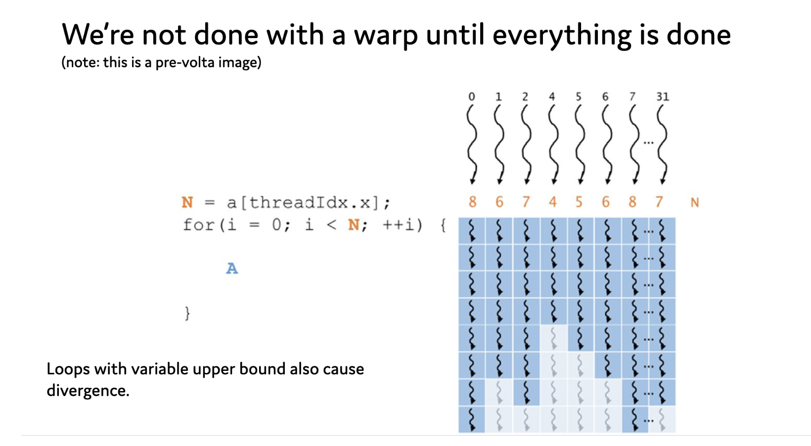

이 Slides는 CUDA programming에서 loop upper bound가 서로 달라 발생하는 Warp Divergence 상황을 보여준다.

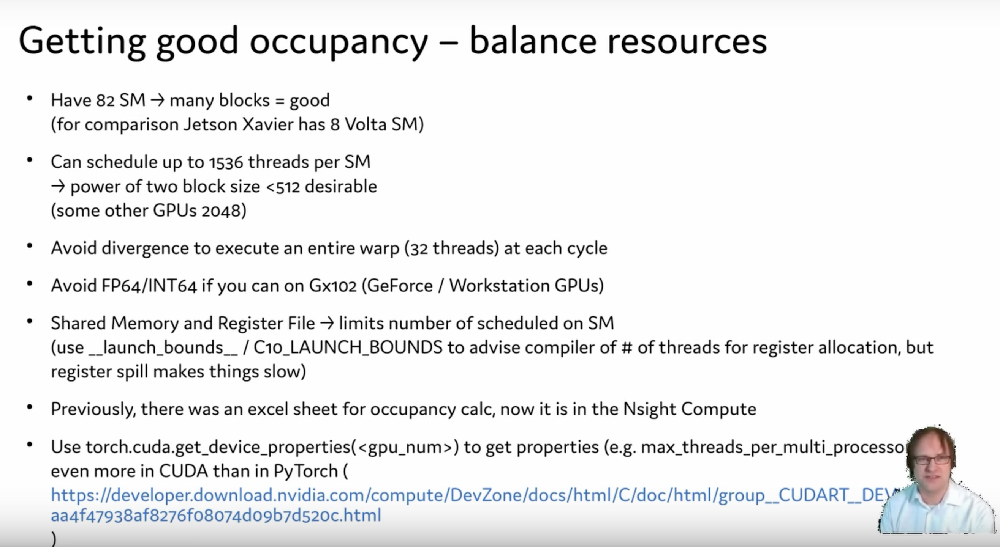

이 Slides는 CUDA programming에서 좋은 GPU occupancy를 얻고 resource use를 balance하는 방법을 논한다. 요점은 다음과 같다.
- SM(streaming multiprocessor)이 82개라는 것은 좋다. 여러 block을 실행할 수 있다는 뜻이다. 비교하면 Jetson Xavier에는 Volta SM이 8개 있다.
- 각 SM은 최대 1536개 thread를 schedule할 수 있다. 권장 block size는 512의 power-of-two, 예를 들어 256 또는 512다. 이는 performance optimization에 유리하다. 일부 다른 GPU는 2048개 thread를 지원한다.
- warp 안의 divergence를 가능한 피해서 각 cycle마다 전체 warp(32 thread)를 실행할 수 있게 한다.
- Gx102(GeForce / Workstation GPUs)에서는 가능하다면 FP64/INT64 data type 사용을 피한다.
- shared memory와 register resource는 SM에서 schedule 가능한 thread 수를 제한한다. `__launch_bounds__ / C10_LAUNCH_BOUNDS`로 compiler에 register allocation thread 수를 제안한다. 주의: register spill은 performance를 떨어뜨린다.
- 예전에는 occupancy 계산용 Excel table이 있었고, 지금은 이 기능이 Nsight Compute에 통합되어 있다.
- `torch.cuda.get_device_properties(<gpu_num>)`로 device property, 예를 들어 `max_threads_per_multi_processor`를 얻는다.

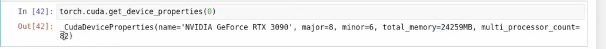

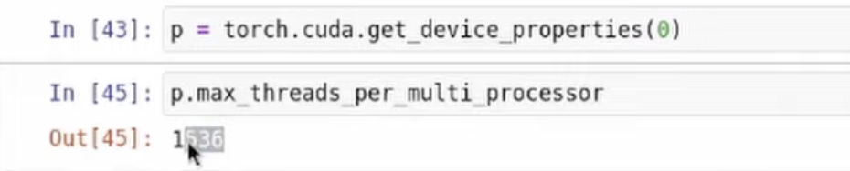

### 5장: memory architecture와 data locality, fast kernel의 기반

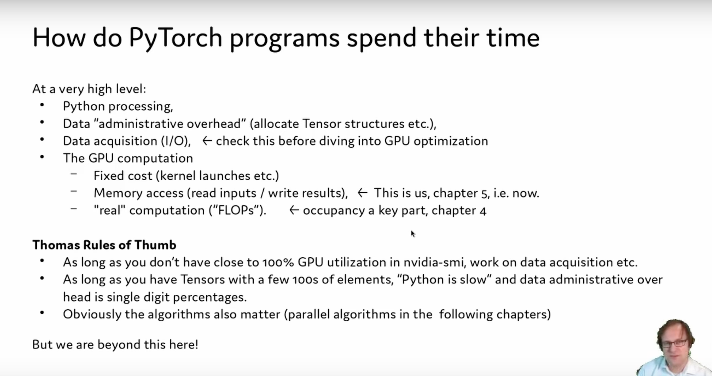

이 Slides는 PyTorch program이 실행 시간을 어떻게 배분하는지와 몇 가지 optimization suggestion을 논한다.

PyTorch program의 time allocation(high-level overview):

- Python 처리
- data "management overhead", 예를 들어 Tensor structure allocation
- data fetching(I/O). GPU optimization에 깊이 들어가기 전에 이 부분을 확인하는 것이 좋다.
- GPU compute, 다음을 포함한다.
    - fixed cost, 예를 들어 kernel launch
    - memory access(input read/output write). 현재 chapter(5장)의 초점이다.
    - "actual" compute(FLOPs). occupancy가 핵심이며 4장에서 이미 논했다.

Thomas의 rule of thumb:

- GPU utilization(nvidia-smi 기준)이 100%에 가깝지 않다면 먼저 data fetching 등을 개선해야 한다.
- 처리하는 Tensor가 수백 element뿐일 때는 "Python이 느리다". data management overhead 비중은 한 자리수 percent다.
- algorithm selection도 중요하다. 이후 chapter에서 parallel algorithm을 논한다.

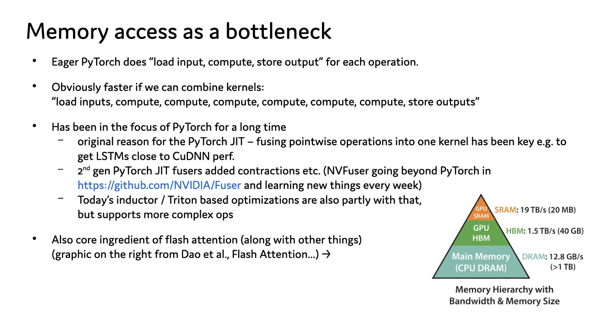

이 Slides는 memory access가 performance bottleneck이 되는 문제를 논한다.
- Eager PyTorch는 각 operation마다 "input load, compute, output store" 과정을 수행한다.
- kernel을 merge해 "input load, 여러 번 compute, output store"를 수행할 수 있으면 더 효율적이다.
- PyTorch의 optimization focus:
    - PyTorch는 오래전부터 이 문제에 집중해 왔다.
    - PyTorch JIT의 원래 목적은 elementwise operation을 하나의 kernel에 fuse하는 것이었다. 예를 들어 LSTM performance를 CuDNN에 가깝게 높이는 것이다.
    - 2세대 PyTorch JIT fusers는 reduction operation 등을 추가했다. NVFuser는 https://github.com/NVIDIA/Fuser 에서 계속 개선되고 있다.
    - 현재 inductor/Triton 기반 optimization도 부분적으로 이 지점을 겨냥하지만 더 복잡한 operation을 지원한다.
- memory access optimization은 flash attention의 핵심 구성 요소이기도 하다. 그림 오른쪽은 bandwidth와 memory size를 포함한 memory hierarchy를 보여준다. 그림은 Flash Attention paper에서 온 것이다.

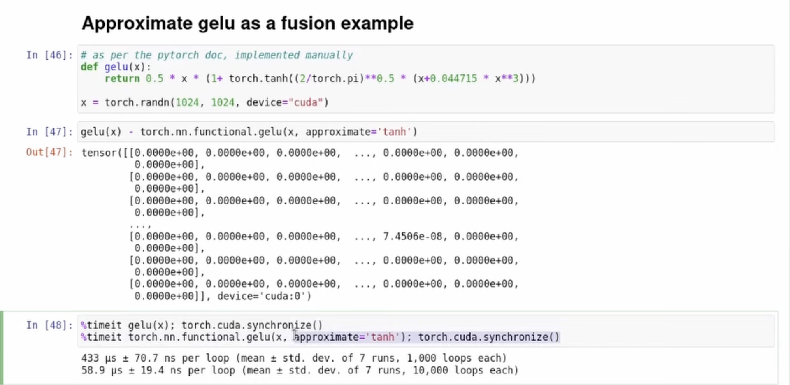

이어서 GeLU fuse 전후 실행 시간 비교 예시를 들어 모든 elementwise operation을 fuse했을 때의 효과를 설명한다.

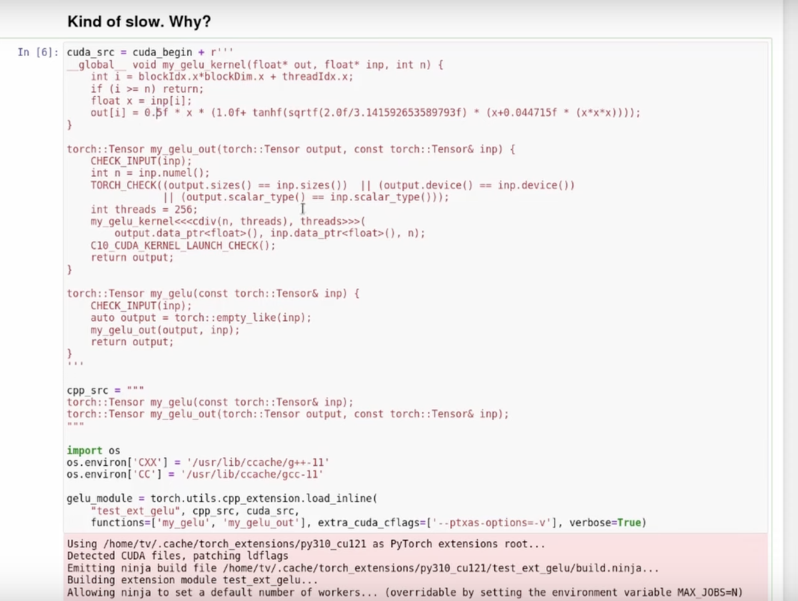

여기서는 CUDA로 이 fused cuda kernel을 수동 작성하는 방법도 보여준다.

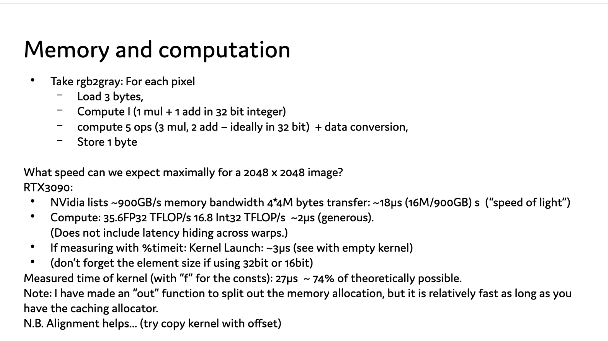

이 Slides는 image processing에서 memory access와 compute가 performance에 미치는 영향을 논한다.

- RGB to grayscale 예시:
    - pixel마다 3 byte를 load해야 한다.
    - I를 계산한다(32-bit integer에서 multiplication 1회와 addition 1회).
    - 5개 operation(3 multiplication, 2 addition, 이상적으로 32-bit 안에서 수행) + data conversion을 계산한다.
    - 1 byte를 store한다.
- performance expectation(2048 x 2048 image와 RTX3090 기준):
    - NVIDIA가 제시한 memory bandwidth는 약 900GB/s이며, 4*4M byte 전송에는 약 18μs가 필요하다("speed of light").
    - compute capability: 35.6 FP32 TFLOP/s 또는 16.8 Int32 TFLOP/s이며, 약 2μs가 필요하다(관대하게 추정).
    - kernel launch time: 약 3μs(empty kernel로 측정).
    - 주의: 32-bit 또는 16-bit 사용 시 element size를 고려해야 한다.

- 실제 측정 결과:
    - kernel execution time(`f`를 constant로 사용): 27μs이며, 이론 가능치의 약 74%다.

주의: 작성자는 memory allocation을 분리하기 위해 "out" function을 만들었다. caching allocator를 사용하면 이 과정은 상대적으로 빠르다. alignment는 performance 향상에 도움이 된다. stride가 있는 copy kernel도 시험해 보기를 권한다.

여기서 말하는 27us는 https://github.com/cuda-mode/lectures/blob/main/lecture_004/cuda-mode-session-4.ipynb 의 첫 번째 cuda kernel output이며, 아래 그림의 red box에 해당한다.

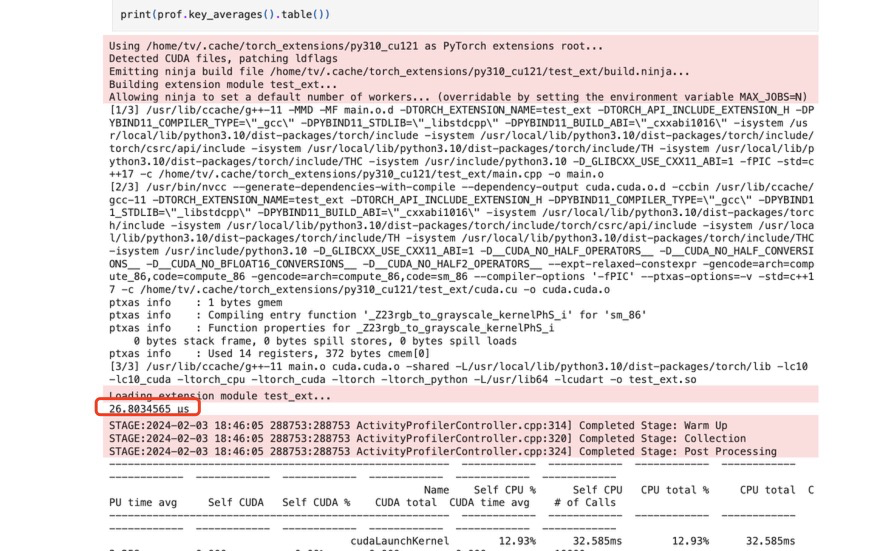

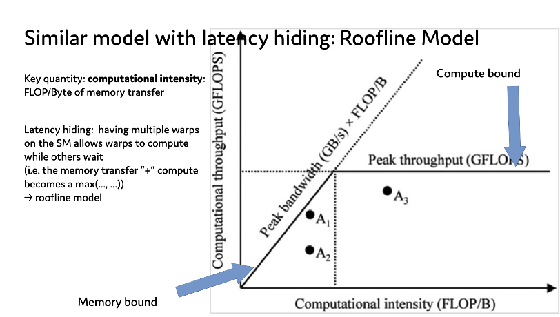

이 Slides는 latency hiding을 포함한 roofline model을 소개한다. 이는 특정 hardware에서 compute-intensive application의 performance upper bound를 평가하는 performance analysis model이다. 가로축은 computational intensity이며 단위는 FLOP/B, 즉 memory transfer byte당 floating-point operation 수다. 세로축은 computational throughput이며 단위는 GFLOP/s, 즉 초당 10억 floating-point operation이다.

몇 가지 개념:
- computational intensity: FLOP/Byte of memory transfer.
- latency hiding: SM(Streaming Multiprocessor)에서 여러 warp를 사용해 일부 warp가 compute할 때 다른 warp가 wait하도록 허용한다.
- peak throughput: hardware가 달성할 수 있는 최대 compute speed.
- peak bandwidth: memory transfer의 최대 speed.

A1, A2, A3는 서로 다른 algorithm 또는 optimization의 performance point를 나타낸다. roofline에 가까운 점일수록 performance가 hardware limit에 가깝다는 뜻이다. memory-bound 영역에서는 memory access pattern을 optimize하고 data transfer를 줄인다. compute-bound 영역에서는 더 효율적인 algorithm을 사용하는 등 compute efficiency를 높인다. 또한 여러 warp를 병렬 실행하면 memory access latency를 효과적으로 숨길 수 있어 실제 performance curve가 theoretical upper bound에 더 가까워진다.

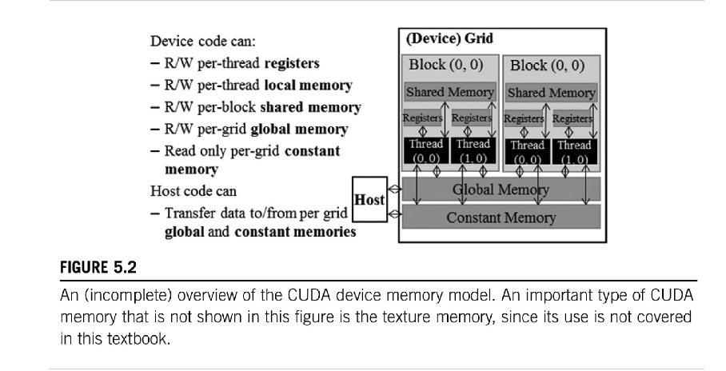

이 Slides는 CUDA device memory model 개요를 설명한다.

- device code가 접근할 수 있는 memory type:
    - per-thread register(R/W per-thread registers)
    - per-thread local memory(R/W per-thread local memory)
    - per-block shared memory(R/W per-block shared memory)
    - per-grid global memory(R/W per-grid global memory)
    - read-only per-grid constant memory(Read only per-grid constant memory)
- host code는 다음을 할 수 있다.
    - per-grid global memory와 constant memory로 data를 전송하거나 거기서 가져온다.
- device grid structure:
    - 여러 block으로 구성된다.
    - 각 block에는 shared memory가 있다.
    - 각 block에는 여러 thread가 있다.
    - 각 thread는 자기 register를 가진다.
- memory hierarchy:
    - global memory: 모든 block과 thread가 접근 가능하다.
    - constant memory: 모든 block과 thread가 read할 수 있다.
    - shared memory: block 안 thread가 공유할 수 있다.
    - register: 각 thread의 private memory다.

Texture memory: Slides에는 나오지 않는다. 이 교재가 그 용도를 다루지 않기 때문이다.

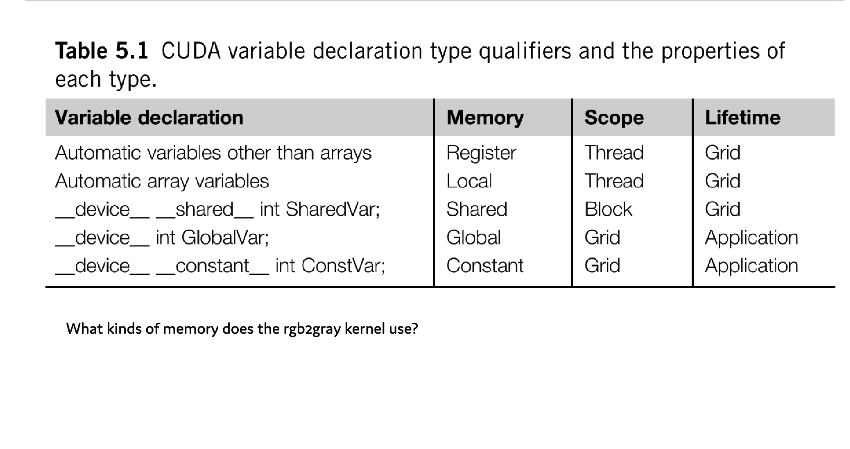

- array가 아닌 automatic variable: Register, Thread scope, Grid lifetime
- automatic array variable: Local, Thread scope, Grid lifetime
- SharedVar: Shared, Block scope, Grid lifetime
- GlobalVar: Global, Grid scope, Application lifetime
- ConstVar: Constant, Grid scope, Application lifetime


이 SLides는 특정 compute operation에서 tiling 기술을 사용하는 이유를 논하고 memory hierarchy를 보여준다.
- Tiling의 이유:
    - matrix multiplication(Matmul)에서 각 output은 2n개 input을 사용한다. output은 총 n^2개다.
    - 각 input은 n번 사용된다. 매번 main memory에서 naive하게 n번 읽으면 매우 비효율적이다.
    - 해결책: parameter 재사용을 시도한다(try to reuse param).
- application scenario:
    - 비슷한 상황은 convolution과 FlashAttention 같은 operation에서도 나타난다.
- memory hierarchy와 특징:
    - GPU SRAM(static random-access memory): bandwidth 19 TB/s, capacity 20 MB
    - GPU HBM(high bandwidth memory): bandwidth 1.5 TB/s, capacity 40 GB
    - Main Memory(CPU DRAM): bandwidth 12.8 GB/s, capacity >1 TB
    - 위에서 아래로 갈수록 memory capacity는 커지지만 access speed(bandwidth)는 낮아진다.
    - Slides는 이 memory hierarchy가 Dao 등의 Flash Attention paper에서 왔다고 말한다.

전체적으로 여기서는 특정 compute-intensive operation에서 tiling 기술을 사용하는 것이 왜 중요한지 설명한다. data reuse와 GPU SRAM 같은 더 빠른 memory layer 활용으로 compute efficiency를 크게 높일 수 있다.
동시에 Slides의 memory hierarchy는 서로 다른 level memory가 speed와 capacity 사이에서 어떤 tradeoff를 갖는지 명확히 보여준다. 이는 memory access pattern optimization의 중요성을 더 강조한다.

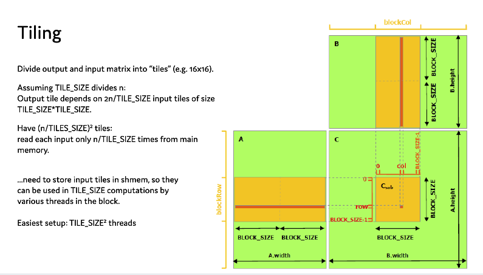

이 Slides는 matrix multiplication의 tiling 기술을 설명한다. 요점은 다음과 같다.
- output과 input matrix를 "tiles", 예를 들어 16x16 작은 block으로 나눈다.
- 각 output tile은 2n/TILE_SIZE개의 크기 TILE_SIZE*TILE_SIZE input tile에 의존한다.
- 전체 tile 수는 (n/TILE_SIZE)^2개다.
- 각 input은 main memory에서 n/TILE_SIZE번만 읽으면 된다.
- input tile을 shared memory(shmem)에 저장해야 한다. 이렇게 하면 block 안의 각 thread가 TILE_SIZE번 계산 동안 이 data를 사용할 수 있다.
- 가장 단순한 설정은 TILE_SIZE^2개 thread를 사용하는 것이다.

이 그림에서 A matrix row에 연속된 bidirectional arrow 2개가 그려져 있어 n=BLOCK_SIZE*2라는 오해를 줄 수 있다. 내 느낌에는 그림이 잘못된 것 같고, 아래 code 구현을 기준으로 보면 된다.

아래 그림은 일반 matrix multiplication CUDA 구현을 보여준다.

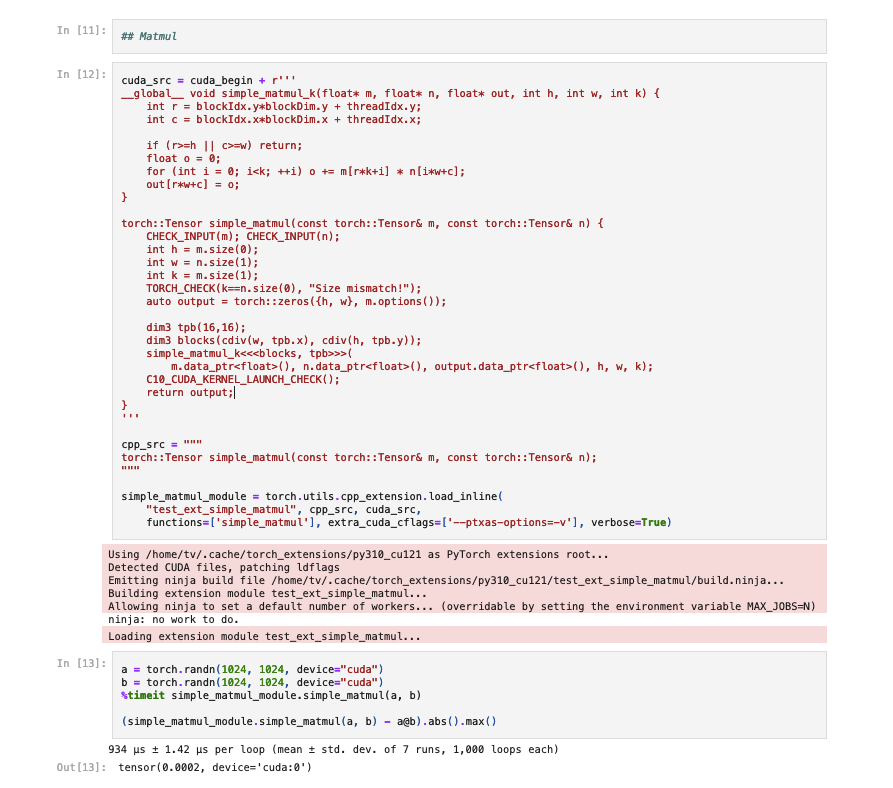

소요 시간은 934 µs ± 1.42 µs per loop(mean ± std. dev. of 7 runs, 1,000 loops each)다.

아래 code는 위 Slides의 matrix tiling 구현이다.

```python
cuda_src = cuda_begin + r"""
constexpr int TILE_SIZE = 16;

__global__ void tiled_matmul_kernel(float* out, float* M, float* N, int h, int w, int k) {
  __shared__ float M_tile[TILE_SIZE][TILE_SIZE];
  __shared__ float N_tile[TILE_SIZE][TILE_SIZE];
  
  // idxes into tile
  int ir = threadIdx.y;
  int ic = threadIdx.x;
  
  int r = blockIdx.y * blockDim.y + threadIdx.y;
  int c = blockIdx.x * blockDim.x + threadIdx.x;

  // note: cannot just exit if we want to do padding!
  
  float res = 0.0f;
  for (int K_tileidx = 0; K_tileidx < (k + TILE_SIZE -1) / TILE_SIZE; K_tileidx++) {
    // note how threadIdx.x is the fastes moving bit --> coalesced memory access
    M_tile[ir][ic] = (((r < h) && (K_tileidx * TILE_SIZE + ic < k)) ? M[r * k + K_tileidx * TILE_SIZE + ic] : 0.f);
    N_tile[ir][ic] = ((((K_tileidx * TILE_SIZE + ir) < k) && (c < w)) ? N[(K_tileidx * TILE_SIZE + ir) * w + c] : 0.f);
    //M_tile[ir][ic] = M[r * k + K_tileidx * TILE_SIZE + ic];
    //N_tile[ir][ic] = N[(K_tileidx * TILE_SIZE + ir) * w + c];
    __syncthreads();
    for (int idx = 0; idx < TILE_SIZE; idx++) {
       res += M_tile[ir][idx] * N_tile[idx][ic];
    }
    __syncthreads(); // important! (why?)
  }
  if ((r < h) && (c < w)) {
    out[r * w + c] = res;
  }
}

torch::Tensor tiled_matmul(const torch::Tensor& m, const torch::Tensor& n) {
    CHECK_INPUT(m); CHECK_INPUT(n);
    int h = m.size(0);
    int w = n.size(1);
    int k = m.size(1);
    TORCH_CHECK(k==n.size(0), "Size mismatch");
    //TORCH_CHECK((k % TILE_SIZE == 0) && (h % TILE_SIZE == 0) && (w % TILE_SIZE == 0), "Padding not done");
    auto output = torch::empty({h, w}, m.options());

    dim3 tpb(TILE_SIZE, TILE_SIZE);
    dim3 blocks(cdiv(w, tpb.x), cdiv(h, tpb.y));
    tiled_matmul_kernel<<<blocks, tpb>>>(
        output.data_ptr<float>(), m.data_ptr<float>(), n.data_ptr<float>(), h, w, k);
    C10_CUDA_KERNEL_LAUNCH_CHECK();
    return output;
}

"""
cpp_src = """
torch::Tensor tiled_matmul(const torch::Tensor& m, const torch::Tensor& n);
"""

tiled_matmul_module = torch.utils.cpp_extension.load_inline(
    "test_ext_tiled_matmul", cpp_src, cuda_src, 
    functions=['tiled_matmul'], extra_cuda_cflags=['--ptxas-options=-v'], verbose=True)
```

소요 시간은 707 µs ± 6.36 µs per loop(mean ± std. dev. of 7 runs, 10,000 loops each)다.

이 Cuda Kernel 구현은 비교적 단순하므로 여기서는 더 설명하지 않는다.

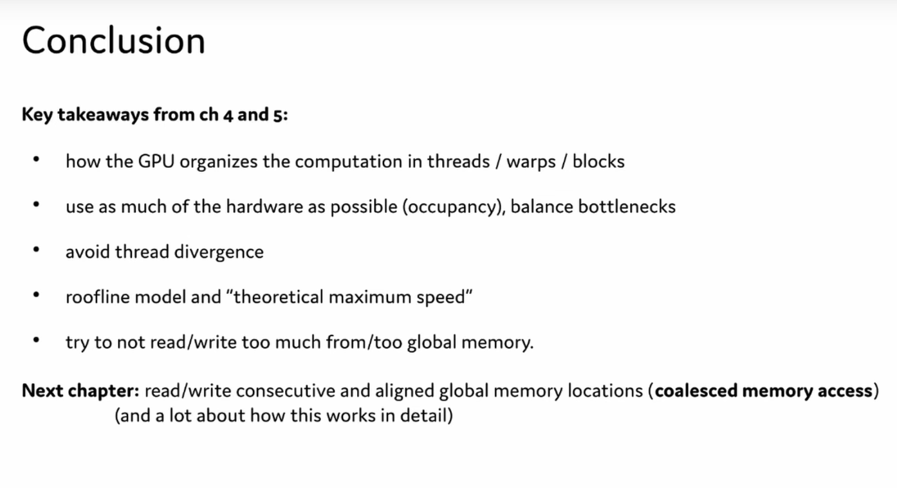

이는 4장과 5장의 정리이며 GPU programming의 핵심 요점을 나열한다.
- GPU는 threads, warps, blocks로 compute를 조직한다.
- hardware를 최대한 충분히 활용하고(occupancy 향상), 여러 bottleneck을 balance한다.
- thread divergence를 피해 performance를 높인다.
- roofline model과 "theoretical maximum speed"로 performance를 분석한다.
- global memory read/write operation을 가능한 줄인다.
- 다음 장은 연속적이고 aligned된 global memory location의 read/write, 즉 coalesced memory access를 논한다.
