# Lecture 40: CUDA Docs for Humans

> 내 강의 노트다. 관심이 있다면 https://github.com/BBuf/how-to-optim-algorithm-in-cuda/tree/master/cuda-mode 를 팔로우해도 좋다.

## 강의 요약

이번 강의는 Modal이 내놓은 GPU 용어 glossary 프로젝트(modal.com/gpu-glossary)를 소개한다. 이 프로젝트의 목표는 개발자에게 사람 친화적인 CUDA 문서를 제공하는 것이다. 강사 Charles Frye는 UC Berkeley에서 deep neural network 최적화를 연구하던 시절부터, Weights & Biases에서 사람들이 연구 프로젝트를 제품화하도록 돕던 경험, 그리고 지금 Modal에서 사람들이 배포를 수행하도록 돕는 현재 업무까지 자신의 커리어 흐름을 공유했다. 강의의 핵심 관점은 `"CUDA"`라는 단어가 실제로 여러 의미를 가진다는 것이다. CUDA는 software platform이기도 하고, programming model이기도 하며, computer architecture principle이기도 하다. 그러나 CUDA 기술 스택에서 가장 중요한 부분은 사실 "CUDA"라고 부르지 않고, NVIDIA GPU Driver와 다른 저수준 구성요소들이다. 강사는 CUDA 기술 스택의 각 계층을 이해하는 것이 중요하다고 강조했다. 여기에는 Device Hardware, Device Software, Host Software 세 가지 큰 범주가 포함된다. 강의에서는 Modal의 단기 목표(ChatGPU, interactive code snippets, interactive charts 등), 중기 목표(performance debugging, GPU cluster management, multi-GPU programming 등), 그리고 추정적 목표(multi-node programming, Triton support, open-source material, online course 등)도 논의했다. 전반적으로 이는 개발자가 CUDA 기술 스택을 더 잘 이해하고 사용할 수 있도록 돕는 교육 프로젝트다.

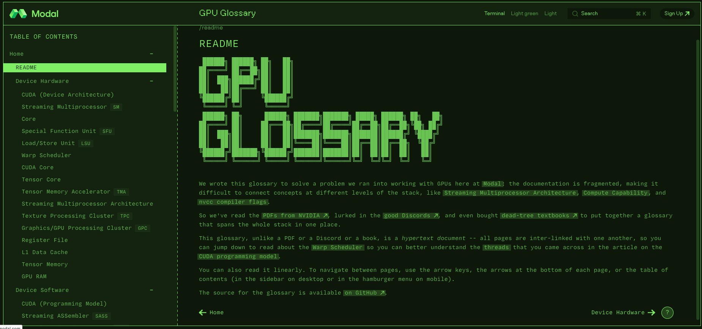

이 사이트는 꽤 cool해 보인다. 그래서 나는 이 사이트의 open-source markdown(MIT license)을 기반으로, SiliconFlow가 제공하는 DeepSeek-V3.2-EXP API를 사용해 스크립트로 일괄 번역하고 이미지 문제를 조금 고친 뒤, GitHub workflow로 deploy해서 1:1로 복각한 중국어 웹페이지를 만들었다. https://bbuf.github.io/gpu-glossary-zh/readme.html 에서 볼 수 있다.

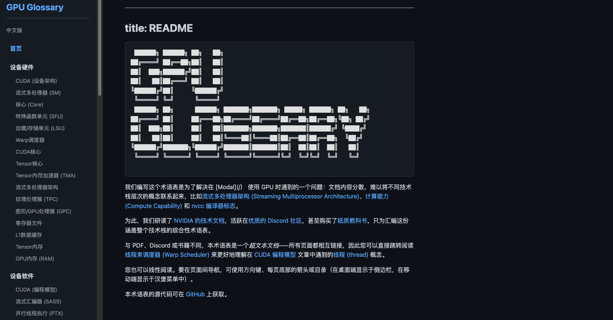

Typo를 발견하면 https://github.com/BBuf/gpu-glossary-zh 의 중국어 복각 웹페이지 대응 저장소에서 바로 수정해도 된다. 이 저장소의 스크립트는 Claude 4가 생성했고, 번역 스크립트 부분은 SiliconFlow가 제공하는 DeepSeek-V3.2-EXP API가 생성했다.

## 강의 내용

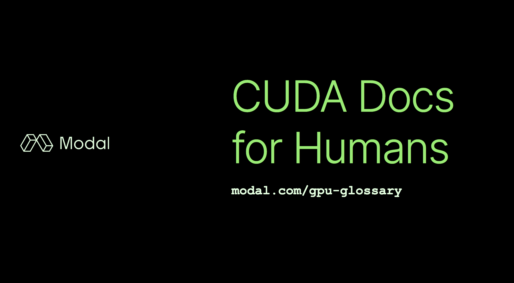

이것은 강의의 첫 화면이며, 이번 발표 주제인 "CUDA Docs for Humans"를 보여준다. 페이지는 Modal의 logo와 프로젝트 주소 modal.com/gpu-glossary 를 간결하게 보여준다. 이 프로젝트의 목표는 더 이해하기 쉬운 CUDA 문서 resource를 만들어 개발자가 GPU programming 기술을 더 잘 익히도록 돕는 것이다.

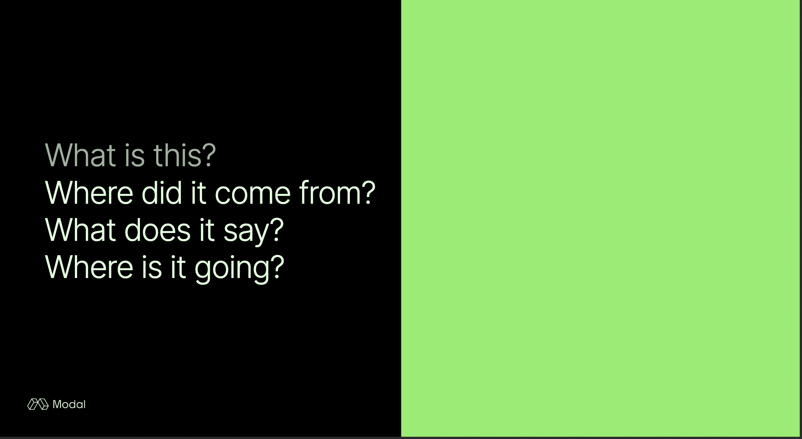

이 페이지는 네 가지 기본 질문을 제시한다. "이것은 무엇인가? (What is this?)", "어디서 왔는가? (Where did it come from?)", "무엇을 말하는가? (What does it say?)", "어디로 가는가? (Where is it going?)"이다. 이 네 질문은 어떤 기술 문서든 이해하기 위한 기본 framework이며, 이번 발표에서 논의를 전개하는 핵심 사고 흐름이기도 하다. 이 질문에 답하면 개발자는 CUDA 기술 스택에 대한 전체적인 인식을 세울 수 있다.

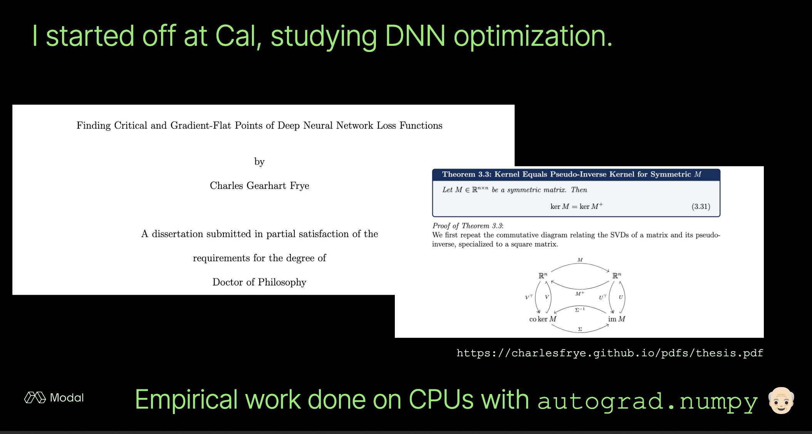

이 페이지는 강사 Charles Frye의 학술 배경을 소개한다. 그는 UC Berkeley(Cal)에서 박사 과정을 밟을 때 deep neural network(DNN)의 optimization 문제를 연구했다. 페이지에는 그의 박사 논문 제목인 "Finding Critical and Gradient-Flat Points of Deep Neural Network Loss Functions"가 보인다. 중요한 점은 이 연구 작업들이 CPU에서 autograd.numpy를 사용해 수행됐다는 것이다. 이는 강사의 연구 출발점이 전통적인 compute platform에서 진행한 empirical work였음을 보여준다.

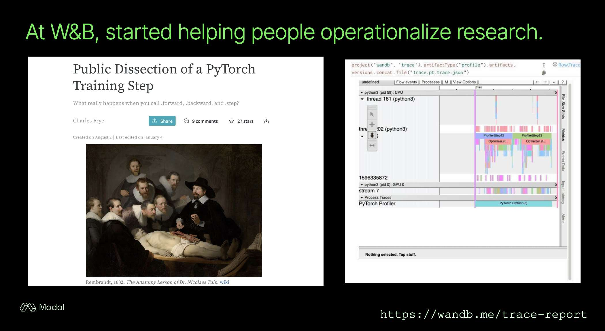

이 페이지는 강사가 Weights & Biases(W&B)에서 일한 경험을 소개한다. 그는 사람들이 연구 프로젝트를 operationalize하도록 돕기 시작했다. 왼쪽에는 그가 쓴 "Public Dissection of a PyTorch Training Step" 블로그 글이 보이고, 고전 회화인 `The Anatomy Lesson of Dr. Nicolaes Tulp`가 함께 있다. 오른쪽은 wandb.me/trace-report 로, PyTorch Profiler의 trace visualization interface를 보여준다. 여기서는 stream, GPU utilization 같은 자세한 performance information을 볼 수 있다. 이 단계에서 강사는 실제 GPU performance analysis 작업을 접하기 시작했다.

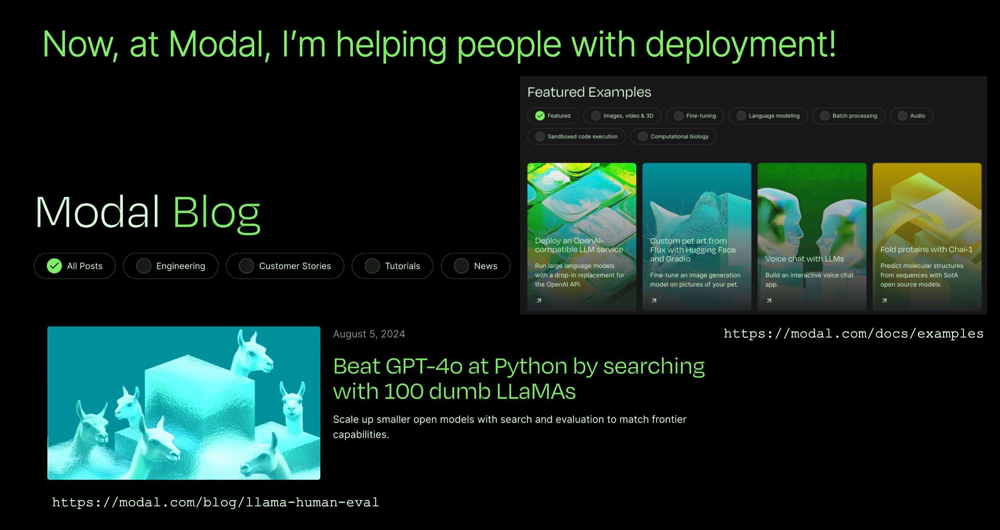

이 페이지는 강사가 현재 Modal에서 하는 일, 즉 "지금 Modal에서 나는 사람들이 배포하도록 돕고 있다!"를 보여준다. 페이지에는 Modal의 블로그 interface가 있고, open-source LLM service 배포, Mistral의 Pixtral을 사용한 image/text processing, LLaMA를 사용한 voice chat, Diffusion-3을 사용한 image generation 같은 여러 featured examples가 포함되어 있다. 아래에는 "Beat GPT-4o at Python by searching with 100 dumb LLaMAs"라는 블로그 글도 보인다. Modal은 modal.com/docs/examples 에 풍부한 문서와 예제를 제공하여 개발자가 AI application을 빠르게 배포하도록 돕는다.

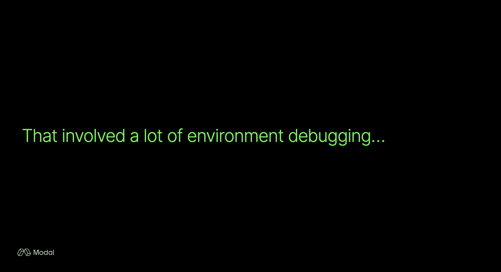

이 페이지에는 짧은 문장 하나만 있다. "That involved a lot of environment debugging..."이다. 이 말은 실제 배포 과정에서 environment configuration과 debugging이 매우 시간이 많이 들고 중요한 단계임을 드러낸다.

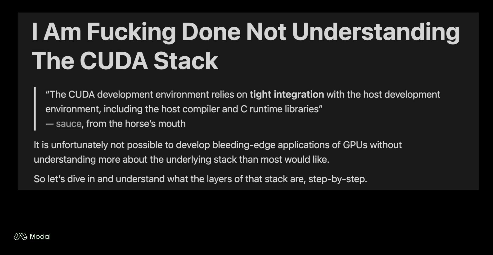

이 페이지는 고전적인 불평이다. "I Am Fucking Done Not Understanding The CUDA Stack", 즉 "CUDA 기술 스택을 이해하지 못하는 데 진절머리가 났다"라는 내용이다. 페이지는 공식 문서에서 가져온 한 문장을 인용한다. "CUDA development environment는 host compiler와 C runtime library를 포함해 host development environment와 긴밀히 통합되어 있다"는 내용이다. 아래 설명은 low-level technology stack을 깊게 이해하지 않으면 bleeding-edge GPU application을 개발할 수 없다고 말한다. 따라서 이 기술 스택의 각 계층을 차근차근 깊이 이해해 보자는 흐름이다.

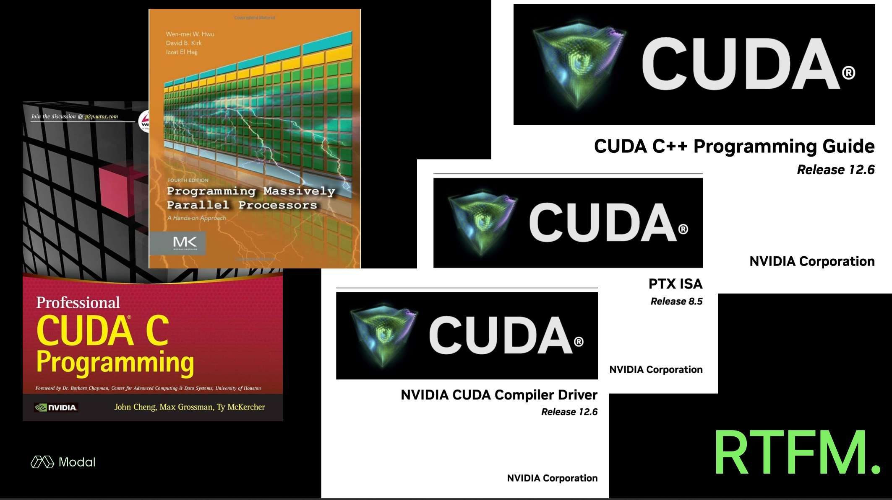

이 페이지는 다양한 CUDA 관련 책과 문서를 보여준다. 오른쪽 아래에는 큰 "RTFM."이 있다. 왼쪽에는 고전 교재인 `Programming Massively Parallel Processors`와 `Professional CUDA C Programming` 등이 있고, 오른쪽에는 NVIDIA 공식 문서들이 있다. CUDA C++ Programming Guide(Release 12.6), PTX ISA(Release 8.5), NVIDIA CUDA Compiler Driver(Release 12.6) 등이 보인다. 이 문서와 책들은 완전한 CUDA learning resource를 구성하지만, 그 수와 복잡성은 CUDA를 익히는 일이 쉽지 않다는 점도 보여준다.

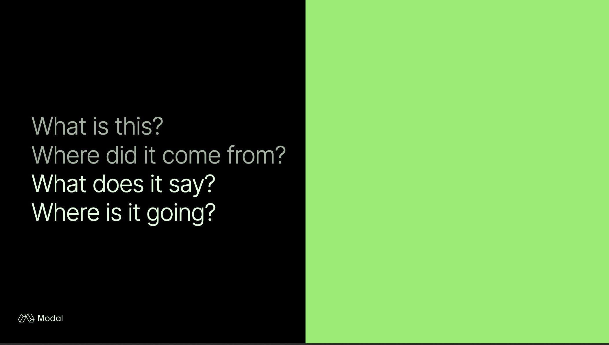

페이지를 넘기면 앞서 나온 네 가지 기본 질문이 다시 등장한다. "이것은 무엇인가?", "어디서 왔는가?", "무엇을 말하는가?", "어디로 가는가?"이다.

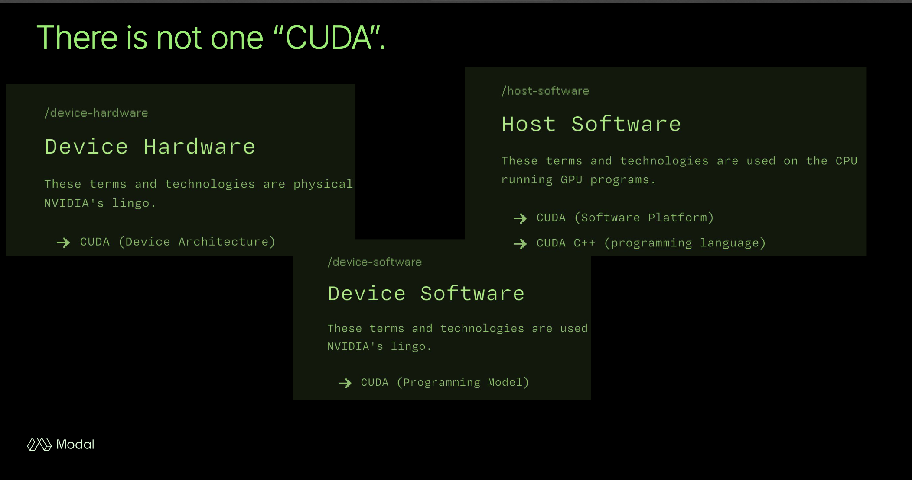

이 페이지는 중요한 관점을 드러낸다. "CUDA는 하나만 있는 것이 아니다"라는 것이다. 페이지는 CUDA 관련 용어와 기술을 세 범주로 나눈다. 첫 번째는 Device Hardware(`/device-hardware`)로, CUDA(Device Architecture)처럼 물리적인 NVIDIA hardware 용어를 포함한다. 두 번째는 Device Software(`/device-software`)로, CUDA(Programming Model)처럼 NVIDIA hardware 위에서 사용하는 용어와 기술을 포함한다. 세 번째는 Host Software(`/host-software`)로, CUDA(Software Platform)와 CUDA C++ programming language처럼 GPU program을 실행하는 CPU에서 사용하는 용어와 기술을 포함한다. 이 분류는 "CUDA"라는 단어의 여러 의미를 분명하게 설명한다.

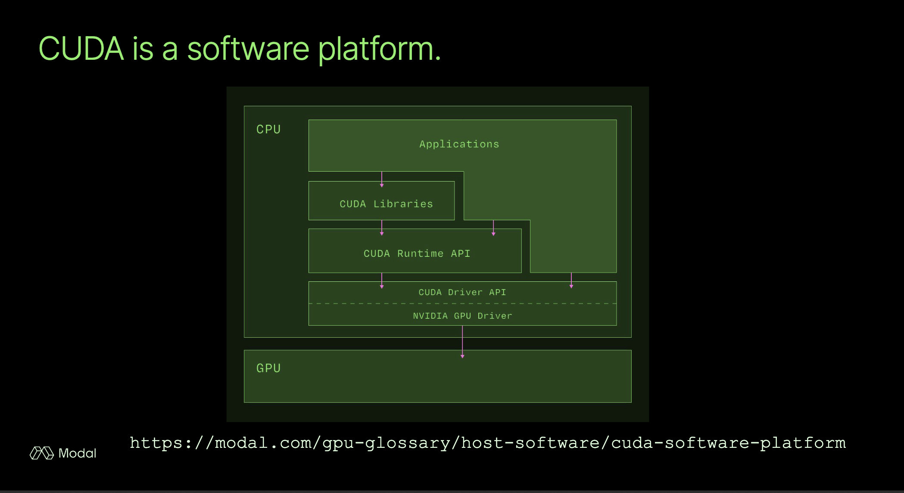

이 페이지는 "CUDA is a software platform"을 설명한다. 그림은 위에서 아래로 이어지는 완전한 technology stack을 보여준다. 가장 위에는 Applications가 있고, 그 아래 CUDA Libraries, CUDA Runtime API, CUDA Driver API, NVIDIA GPU Driver가 있으며, 가장 아래에는 GPU hardware가 있다. CPU는 이 software stack을 통해 GPU와 상호작용한다. 전체 구조는 CUDA가 software platform으로서 갖는 계층 구조를 분명하게 보여준다. 페이지 하단에는 자세한 문서 링크 https://modal.com/gpu-glossary/host-software/cuda-software-platform 가 있다.

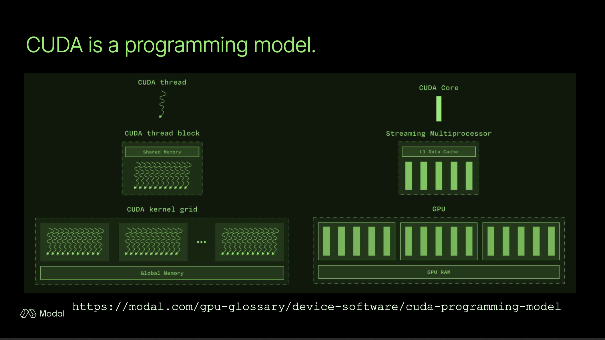

이 페이지는 "CUDA is a programming model"을 설명한다. 왼쪽은 programming model의 계층 구조를 보여준다. CUDA thread에서 CUDA thread block(shared memory 포함), 다시 CUDA kernel grid(global memory 포함)로 이어진다. 오른쪽은 hardware 대응 관계를 보여준다. CUDA Core는 Streaming Multiprocessor(SM, L1 Data Cache 포함)에 대응하고, 여러 SM이 GPU(GPU RAM 포함)를 이룬다. 이 그림은 CUDA programming model이 실제 GPU hardware architecture에 어떻게 mapping되는지 명확하게 설명한다. 페이지 하단 링크는 https://modal.com/gpu-glossary/device-software/cuda-programming-model 이다.

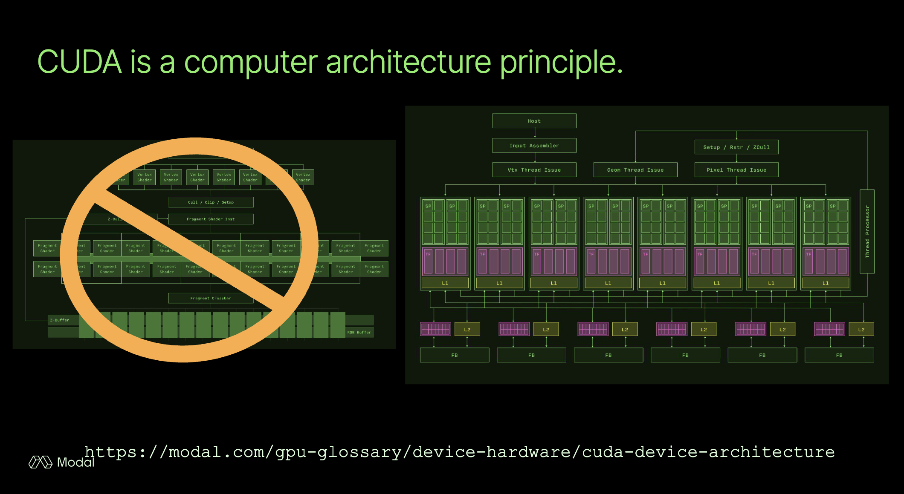

이 페이지는 "CUDA is a computer architecture principle"을 설명한다. 왼쪽에는 GPU architecture 그림 위에 큰 금지 기호가 그려져 있는데, 이는 "CUDA가 특정 세대의 GPU architecture를 가리키는 것은 아니다"라는 의미다. 오른쪽에는 Host, Input Assembler, Warp Thread Issue, Execution units 등 여러 구성요소를 포함한 자세한 GPU architecture 그림이 있다. 이는 CUDA가 architecture principle로서 특정 hardware implementation과 독립적인 abstraction concept임을 말한다. Volta, Ampere, Hopper 같은 각 GPU 세대는 CUDA architecture principle을 따르지만, 구체적인 implementation detail은 서로 다르다. 페이지 하단 링크는 https://modal.com/gpu-glossary/device-hardware/cuda-device-architecture 이다.

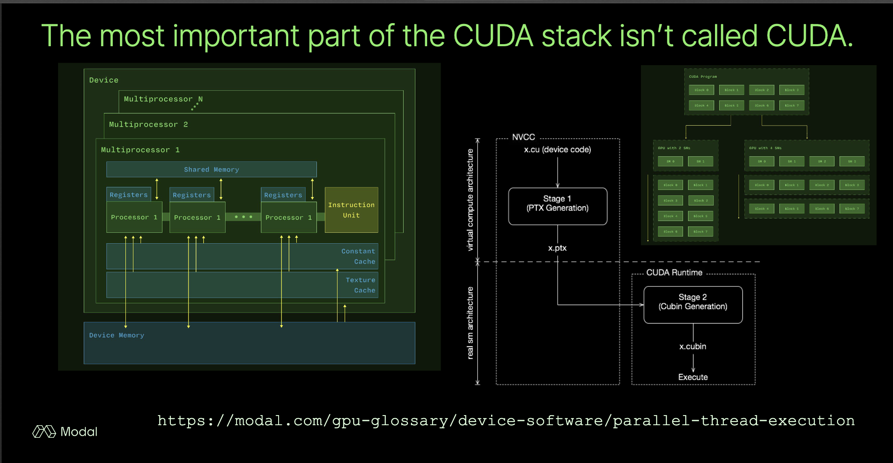

이 페이지는 핵심 관점을 제시한다. "CUDA 기술 스택에서 가장 중요한 부분은 CUDA라고 부르지 않는다"는 것이다. 왼쪽에는 여러 multiprocessor와 shared memory 등을 포함한 device architecture 그림이 있다. 가운데에는 NVCC compile flow가 보인다. `x.cu` source code가 Stage 1(PTX Generation)을 거쳐 `x.ptx` intermediate code가 되고, 다시 Stage 2(Cubin Generation)를 거쳐 최종 GPU executable code인 `x.cubin`이 된다. 오른쪽에는 GPU의 자세한 architecture가 있다. 핵심 정보는 이것이다. 우리가 CUDA code를 쓰더라도 실제로 program을 실행하는 것은 Parallel Thread Execution(PTX) 같은 low-level instruction set이다. 페이지 하단 링크는 https://modal.com/gpu-glossary/device-software/parallel-thread-execution 이다.

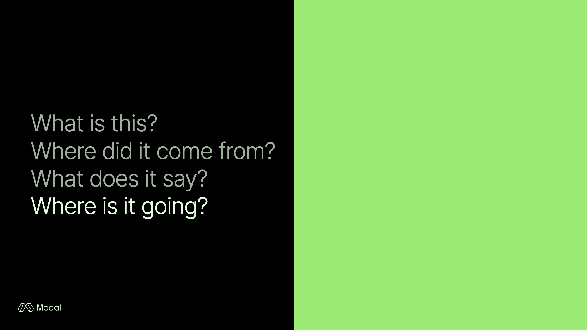

CUDA의 여러 의미를 소개한 뒤, 이제 이 질문들은 프로젝트의 미래 방향을 가리킨다.

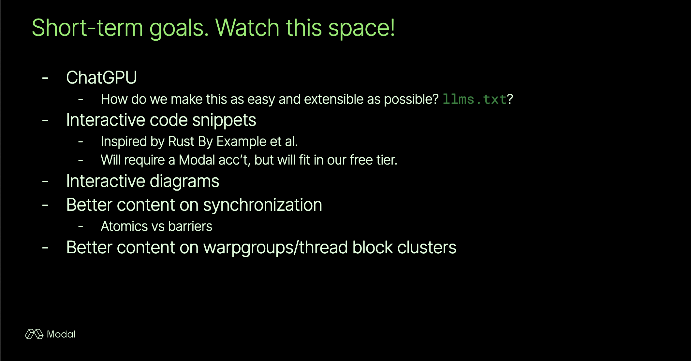

이 페이지는 프로젝트의 "Short-term goals. Watch this space!"를 나열한다. 구체적인 목표는 다음과 같다. 첫째, ChatGPU다. 어떻게 최대한 단순하고 scalable하게 만들 것인가가 문제이며, 11ms.txt라는 reference가 언급된다. 둘째, interactive code snippets다. Rust By Example 같은 프로젝트에서 영감을 받았고, Modal account가 필요하지만 free tier에 포함될 예정이다. 셋째, interactive charts다. 넷째, 더 나은 synchronization content다. atomics vs barriers가 주제다. 다섯째, 더 나은 warpgroups/thread block clusters content다. 이 목표들은 GPU programming 학습을 더 친절하고 실용적으로 만들기 위한 것이다.

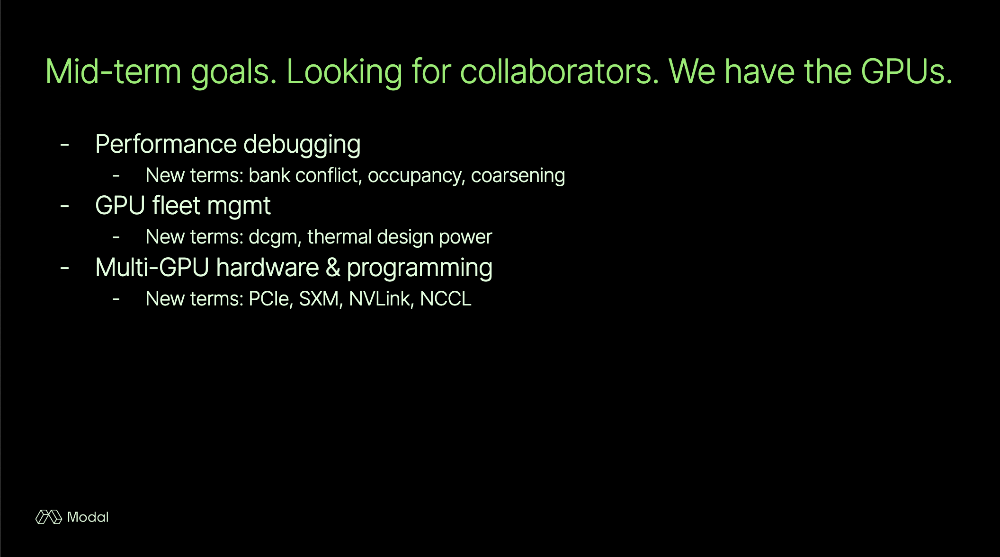

이 페이지는 "Mid-term goals. Looking for collaborators. We have the GPUs."를 보여준다. 구체적으로는 첫째 performance debugging이다. bank conflict, occupancy, coarsening 같은 새 용어가 들어간다. 둘째 GPU fleet management다. dcgm, thermal design power 같은 새 용어가 들어간다. 셋째 multi-GPU hardware & programming이다. PCIe, SXM, NVLink, NCCL 같은 새 용어가 들어간다. 이들은 실제 production environment에서 매우 중요한 주제다.

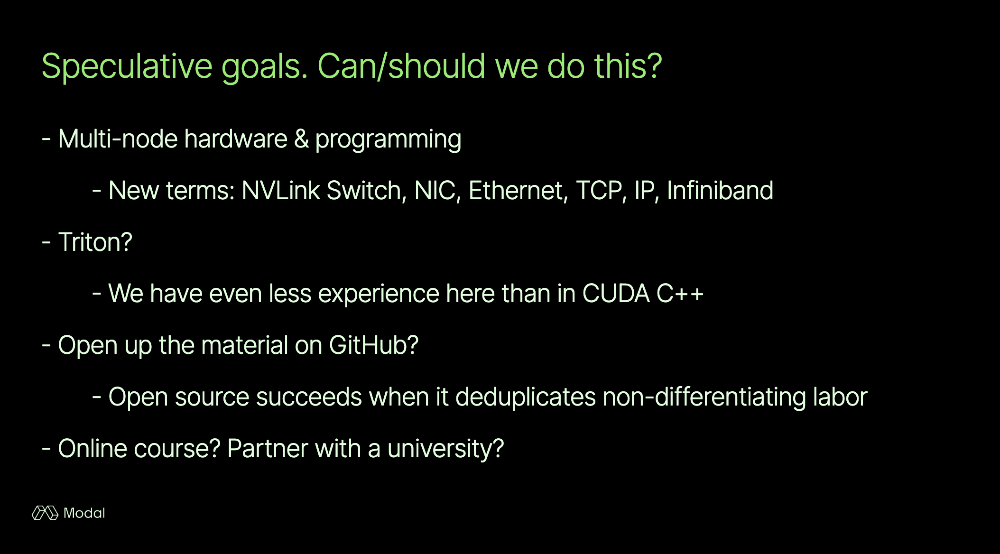

이 페이지는 "Speculative goals. Can/should we do this?"를 나열한다. 여기에는 첫째 multi-node hardware & programming이 있다. NVLink Switch, NIC, Ethernet, TCP, IP, Infiniband 같은 새 용어가 들어간다. 둘째 Triton?이 있다. 솔직히 말하면 그들은 Triton보다 CUDA C++ 경험이 더 많다고 한다. 셋째 GitHub에서 이 material을 open-source로 공개할 것인가가 있다. Open source는 differentiated되지 않는 중복 노동을 줄일 수 있을 때만 성공한다. 넷째 online course? 대학과 협력? 같은 주제가 있다. 이들은 더 장기적인 계획이지만 투입 대비 산출을 따져야 한다.

이것은 강의의 마지막 페이지이며 Modal logo를 보여준다. 페이지 하단에는 "we're hiring btw :)"와 연락 이메일 charles@modal.com 이 적혀 있다.
