# Lecture 53 torch.compile Q&A

> 내 강의 노트다. 관심이 있다면 https://github.com/BBuf/how-to-optim-algorithm-in-cuda/tree/master/cuda-mode 를 팔로우해도 좋다.

## 강의 요약

이번 강의는 `torch.compile`에 관한 Q&A 세션이며, 실제 사용에서 자주 만나는 performance pitfall, 향후 발전 방향, custom operator integration 같은 핵심 주제를 주로 논의한다. 강의는 먼저 `torch.compile`의 흔한 performance issue를 소개한다. 여기에는 graph breaks와 custom operator 처리 문제가 포함된다. Backend optimization 측면에서는 `"max-autotune"` mode와 `"reduce-overhead"` mode를 사용하는 방법, 그리고 recompilation 관련 문제를 설명한다. 강의는 third-party kernel, 즉 Python/C++/CUDA kernel과 Triton kernel을 `torch.compile`에 통합하는 방법을 자세히 설명하고, `torch.library.custom_op`와 `TORCH_LIBRARY` 두 가지 registration 방식을 소개한다. Custom operator와 PyTorch subsystem의 통합 측면에서는 custom operator가 `torch.compile`, autograd, vmap 같은 system과 함께 동작하게 하는 방법을 보여준다. 강의는 dead code elimination, common subexpression elimination, operator fusion 같은 `torch.compile`의 optimization capability도 논의하며, 구체적인 예제를 통해 어떤 optimization은 `torch.compile`이 자동으로 수행할 수 있고 어떤 것은 manual implementation이 필요한지 설명한다. 마지막으로 `torch.compile`의 design architecture, 즉 Dynamo, AOTDispatcher, Inductor 등의 component와 `TORCH_LOGS` 같은 tool을 사용한 debugging 및 performance analysis 방법을 소개한다. 전체적으로 이는 `torch.compile`의 practical application을 깊게 다루는 기술 교류 세션이다.

## 강의 내용

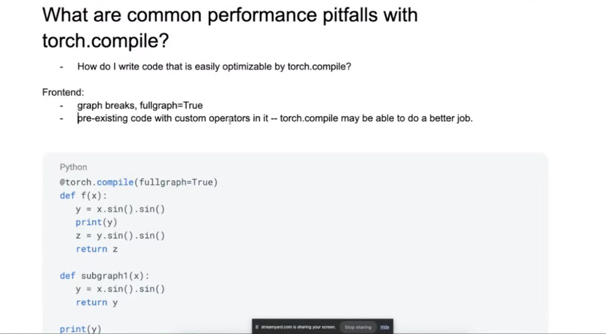

이 페이지는 핵심 질문 하나를 제시한다. "`torch.compile`에서 흔한 performance pitfall은 무엇인가?" 그리고 "`torch.compile`이 optimization하기 쉬운 code는 어떻게 작성하는가?"다. 페이지는 frontend와 backend 두 부분의 제안으로 나뉜다. Frontend 측면에서는 graph breaks와 `fullgraph=True` 사용, 그리고 이미 custom operator가 있는 code에 대해 이야기한다. `torch.compile`이 더 잘할 수도 있다는 관점이다. 페이지에는 `@torch.compile(fullgraph=True)`로 decorate된 example code도 있으며, 여기에는 function `f(x)`와 subgraph `subgraph1(x)`가 포함되어 graph break 상황을 보여준다. 이는 `torch.compile` performance optimization을 이해하는 출발점이다.

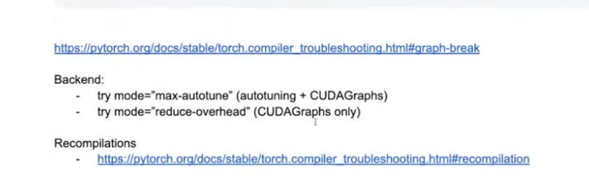

이 페이지는 performance optimization suggestion을 이어서 논의한다. 페이지 위에는 공식 문서 링크 https://pytorch.org/docs/stable/torch.compiler_troubleshooting.html#graph-break 가 있다. Backend 측면의 제안에는 `mode="max-autotune"`(autotuning + CUDAGraphs)과 `mode="reduce-overhead"`(CUDAGraphs only)를 시도하는 것이 포함된다. Recompilations 문제에 대해서는 또 다른 문서 링크 https://pytorch.org/docs/stable/torch.compiler_troubleshooting.html#recompilation 이 제공된다. 이들은 `torch.compile` backend optimization의 핵심 configuration option이다.

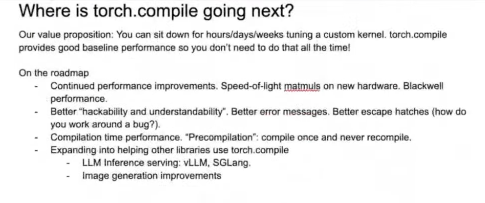

이 페이지는 "`torch.compile`의 향후 발전 방향"을 논의한다. 페이지는 `torch.compile`의 value proposition을 강조한다. 사용자는 custom kernel을 tuning하는 데 몇 시간, 며칠, 몇 주를 쓸 수 있지만, `torch.compile`은 좋은 baseline performance를 제공하므로 항상 그렇게 할 필요는 없다는 것이다. Roadmap에는 지속적인 performance improvement, 새 hardware에서 빛의 속도에 가까운 matmul performance 달성, Blackwell performance optimization이 포함된다. 또한 더 나은 hackability and understandability, 더 나은 error message, 더 나은 escape hatches, 즉 bug를 우회하는 방법도 포함된다. Compile-time performance 측면에서는 "Precompilation", 즉 한 번 compile하고 다시 recompilation하지 않는 방향이 언급된다. 또한 `torch.compile`을 다른 library가 사용하도록 돕는 방향도 포함되며, LLM inference service(vLLM, SGLang)와 image generation 개선이 예로 든다.

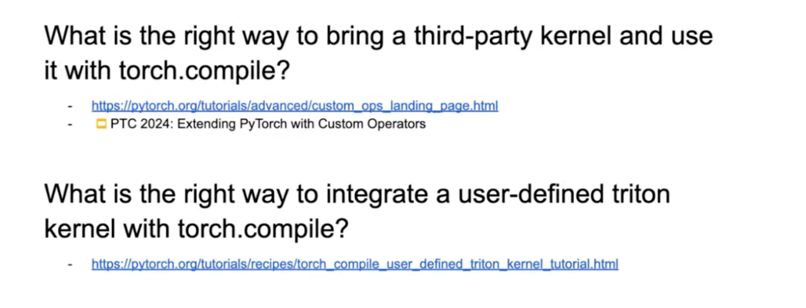

이 페이지는 두 가지 중요한 질문에 답한다. 첫 번째 질문은 "third-party kernel을 도입해 `torch.compile`과 함께 사용하는 올바른 방법은 무엇인가?"다. 공식 tutorial 링크 https://pytorch.org/tutorials/advanced/custom_ops_landing_page.html 와 PTC 2024 발표 "Extending PyTorch with Custom Operators"가 제공된다. 두 번째 질문은 "user-defined Triton kernel을 `torch.compile`과 통합하는 올바른 방법은 무엇인가?"다. Tutorial 링크 https://pytorch.org/tutorials/recipes/torch_compile_user_defined_triton_kernel_tutorial.html 이 제공된다. 이 두 질문은 실제 application에서 가장 자주 만나는 integration scenario다.

여기에는 PTC의 PPT가 관련되어 있으며 주소는 https://static.sched.com/hosted_files/pytorch2024/36/PTC%202024_%20Extending%20PyTorch%20with%20Custom%20Operators.pdf 이다. 내용 screenshot은 다음과 같다.

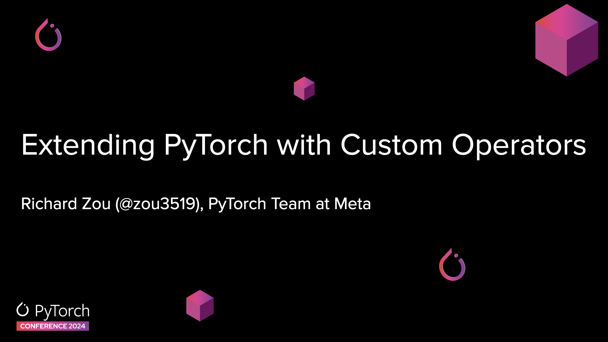

이것은 PyTorch Conference 2024 발표의 표지다. 주제는 "Extending PyTorch with Custom Operators"다. 발표자는 Richard Zou(@zou3519)이며 Meta의 PyTorch team 소속이다. 이 발표는 custom operator를 PyTorch ecosystem에 통합하는 방법에 관한 authoritative guide다.

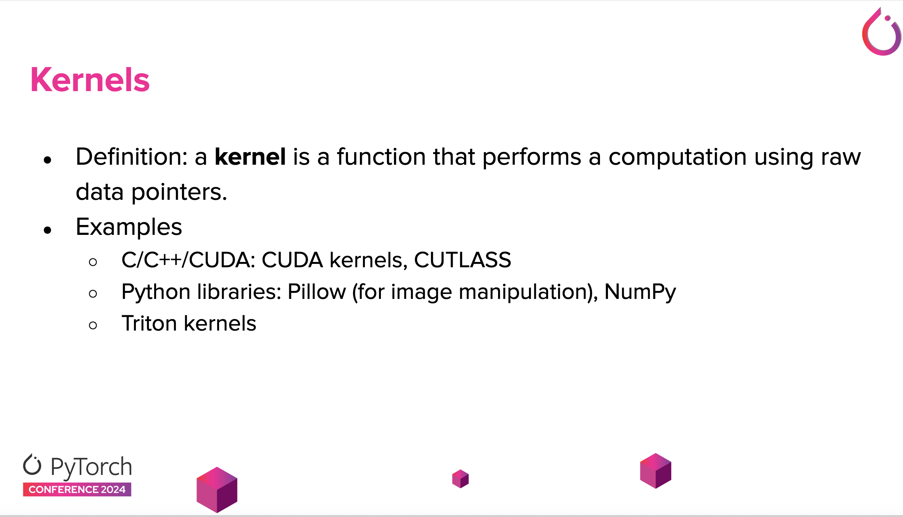

이 페이지는 "Kernels" 개념을 정의한다. 정의는 다음과 같다. **kernel**은 raw data pointer를 사용해 computation을 수행하는 function이다. 예시에는 C/C++/CUDA의 CUDA kernels와 CUTLASS, Python library의 Pillow(image processing용)와 NumPy, 그리고 Triton kernels가 포함된다. 이 정의는 이후 논의의 기초를 만든다.

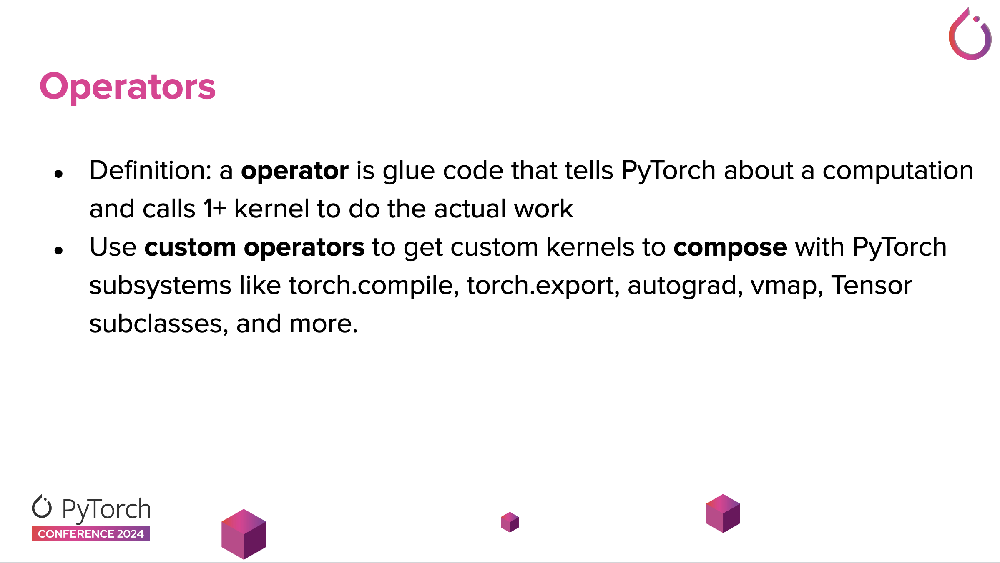

이 페이지는 "Operators" 개념을 정의한다. 정의는 다음과 같다. **operator**는 PyTorch에 computation에 대해 알려주는 glue code이며, 실제 작업을 완료하기 위해 하나 이상의 kernel을 호출한다. **custom operators**를 사용하면 custom kernel이 `torch.compile`, `torch.export`, autograd, vmap, Tensor subclass 같은 PyTorch subsystem과 조합될 수 있다. 이는 PyTorch extension mechanism을 이해하는 핵심이다.

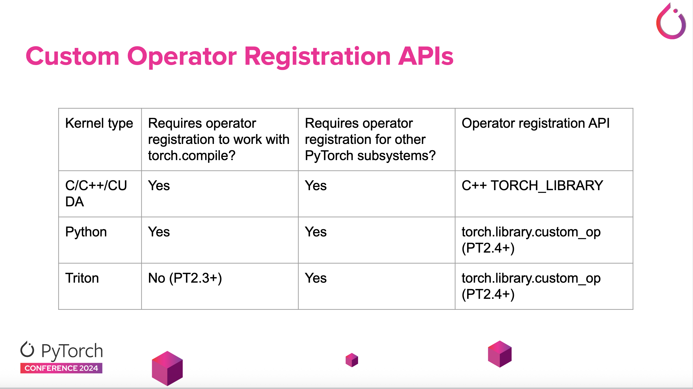

이 페이지는 "Custom Operator Registration APIs" comparison table을 보여준다. 표는 세 가지 kernel type, 즉 C/C++/CUDA, Python, Triton을 비교한다. 각 type에 대해 `torch.compile`과 함께 동작하려면 operator registration이 필요한지, 다른 PyTorch subsystem과 함께 동작하려면 operator registration이 필요한지, 어떤 operator registration API를 사용하는지 설명한다. C/C++/CUDA는 C++ `TORCH_LIBRARY`를 사용하고, Python은 `torch.library.custom_op`(PT2.4+)를 사용한다. Triton은 PT2.3+에서 explicit `torch.library` wrapper 없이도 `torch.compile`과 동작할 수 있지만, 다른 subsystem과 함께 동작하려면 `torch.library.custom_op`(PT2.4+)가 필요하다.

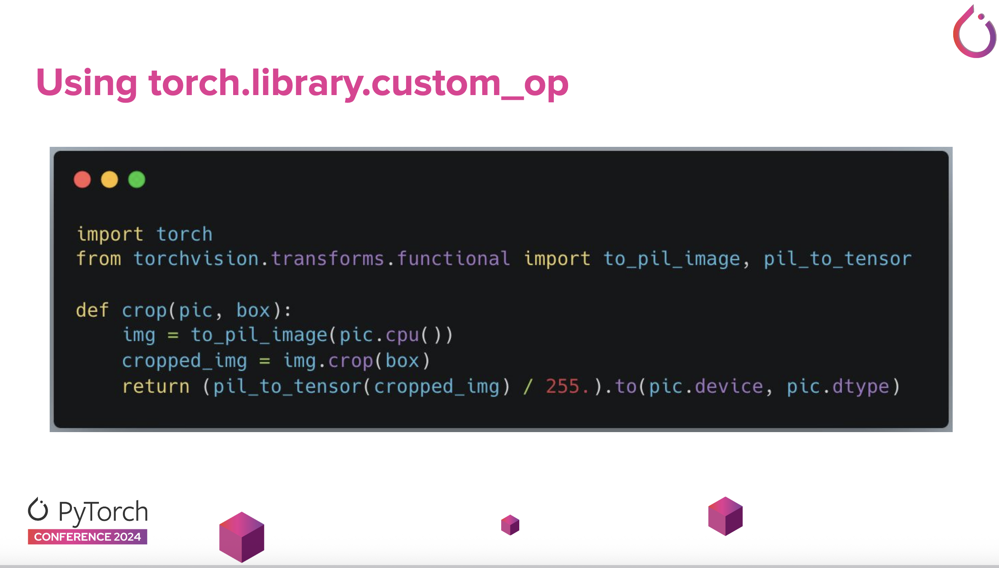

이 페이지는 `torch.library.custom_op`를 사용하는 방법을 보여준다. Code example은 간단한 `crop` function을 보여준다. 이 function은 image를 PIL format으로 변환하고 crop한 뒤 tensor로 다시 변환한다. 이 예제는 `torchvision` 같은 Python library의 기능을 custom operator로 wrapping하는 방법을 보여준다.

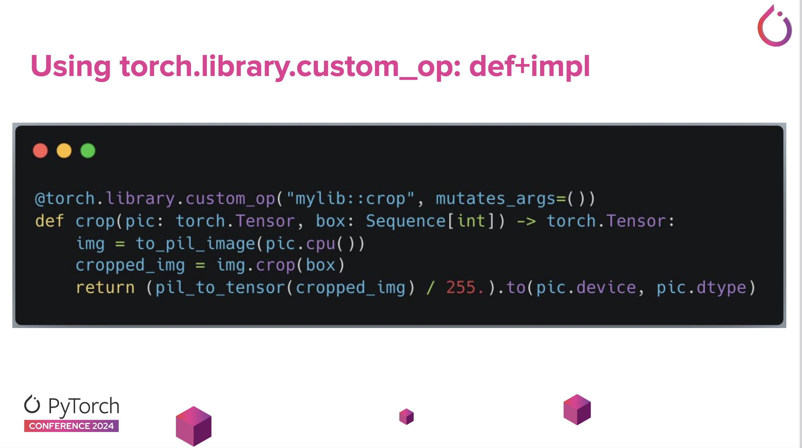

이 페이지는 `torch.library.custom_op`의 def+impl pattern을 보여준다. Code는 `@torch.library.custom_op` decorator를 사용해 `crop` function을 정의하고 `mutates_args=()` parameter를 지정한다. 이 방식은 function signature와 implementation을 분리할 수 있게 하며, PyTorch의 operator registration pattern에 더 잘 맞는다.

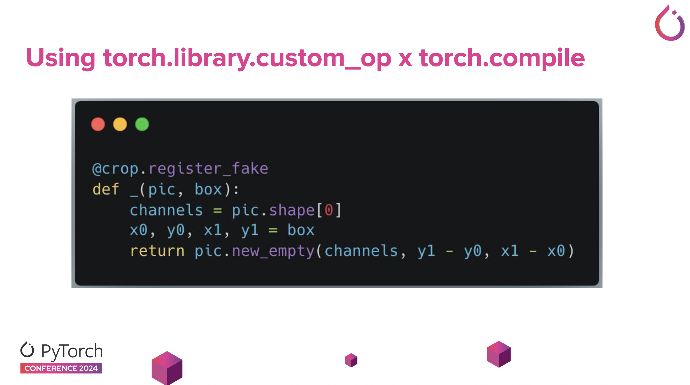

이 페이지는 `torch.library.custom_op`가 `torch.compile`과 함께 동작하도록 만드는 방법을 보여준다. Code는 `@crop.register_fake` decorator를 사용해 fake implementation을 등록한다. 이 fake implementation은 실제 computation을 수행하지 않고 output tensor의 shape information만 반환한다. 이는 `torch.compile`의 graph capture와 optimization에 매우 중요하다. `torch.compile`은 실제 execution 없이 tensor shape를 infer해야 하기 때문이다.

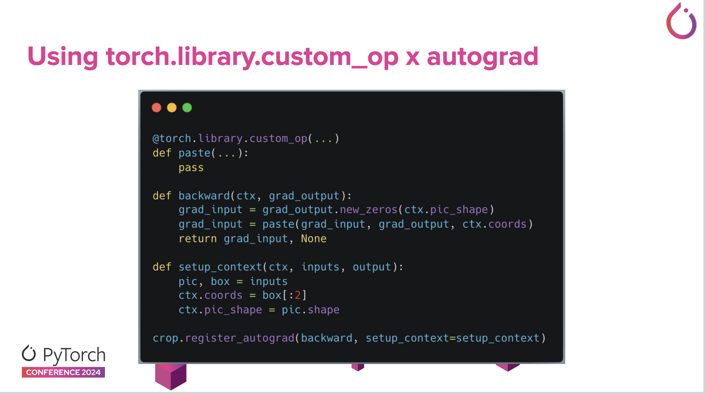

이 페이지는 `torch.library.custom_op`가 autograd와 함께 동작하도록 만드는 방법을 보여준다. Code는 gradient를 계산하는 `backward` function과 forward pass에서 필요한 intermediate result를 저장하는 `setup_context` function을 정의한다. 마지막으로 `crop.register_autograd`를 사용해 이 function들을 등록한다. 이를 통해 custom operator가 gradient computation에 참여하고 backward propagation을 지원할 수 있다.

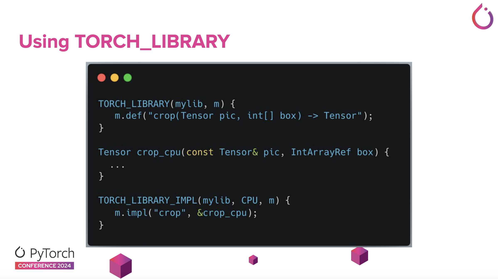

이 페이지는 `TORCH_LIBRARY`를 사용해 C++/CUDA custom operator를 등록하는 방법을 보여준다. Code는 두 부분을 보여준다. 먼저 `TORCH_LIBRARY(mylib, m)` macro로 operator signature를 정의하고, 그다음 `crop_cpu` function을 구현한다. 마지막으로 `TORCH_LIBRARY_IMPL(mylib, CPU, m)`을 사용해 implementation을 CPU backend에 등록한다. 이것은 C++ 쪽 operator registration pattern이며 Python의 `torch.library.custom_op`에 대응한다.

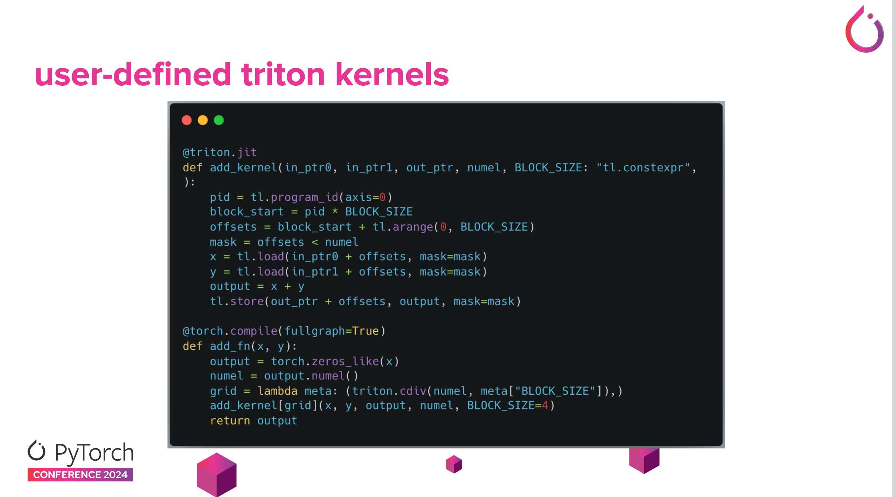

이 페이지는 user-defined Triton kernels의 code example을 보여준다. Code는 두 부분을 포함한다. 위쪽은 `@triton.jit` decorator로 `add_kernel`을 정의하고 element-wise addition을 구현한다. 아래쪽은 `@torch.compile(fullgraph=True)` decorator로 `add_fn` function을 정의하며, 이 function이 `add_kernel`을 호출한다. 이는 Triton kernel을 `torch.compile`에 통합하는 방법을 보여준다.

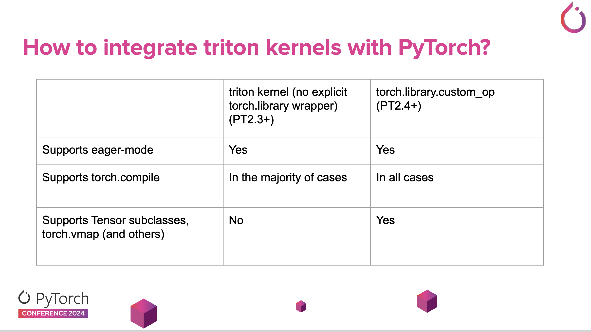

이 페이지는 "Triton kernels를 PyTorch와 통합하는 방법" comparison table을 보여준다. 표는 두 가지 방식, 즉 Triton kernel(explicit `torch.library` wrapper 없음, PT2.3+)과 `torch.library.custom_op`(PT2.4+)를 비교한다. 세 가지 핵심 특성에 대해 설명한다. Eager-mode support는 둘 다 지원한다. `torch.compile` support는 Triton kernel은 대부분의 경우 지원하고 custom_op는 모든 경우 지원한다. Tensor subclass, `torch.vmap` 등은 Triton kernel은 지원하지 않고 custom_op는 지원한다. 이 표는 개발자가 적절한 integration 방식을 선택하는 데 도움을 준다.

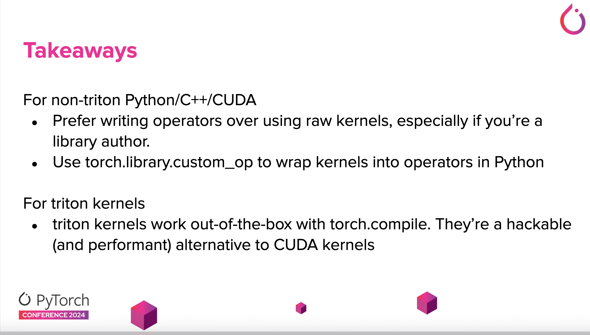

이 페이지는 "Takeaways"를 요약한다. Non-Triton Python/C++/CUDA에 대해서는 raw kernels를 사용하는 대신 operators를 우선 작성하라고 한다. 특히 library author라면 더욱 그렇다. `torch.library.custom_op`를 사용해 kernels를 Python 안의 operators로 wrapping하라고 제안한다. Triton kernels에 대해서는 Triton kernels가 `torch.compile`과 out-of-the-box로 동작하며, hackable하고 high-performance인 CUDA kernels 대안이라고 말한다. 이는 custom operator integration 주제를 간결하게 정리한 것이다.

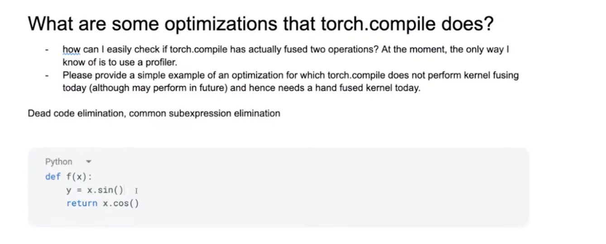

이 페이지는 "질문: `torch.compile`은 어떤 optimization을 수행하는가?"에 답한다. 두 가지 하위 질문을 제시한다. 첫째, `torch.compile`이 실제로 두 operation을 fuse했는지 쉽게 확인하려면 어떻게 해야 하는가? 현재 유일한 방법은 profiler를 사용하는 것이다. 둘째, `torch.compile`이 오늘은 kernel fusion을 수행하지 않는 optimization example을 보여 달라는 것이다. 미래에는 가능할 수 있지만, 현재는 manual kernel fusion이 필요하다는 맥락이다. 페이지는 `torch.compile`이 수행할 수 있는 optimization으로 dead code elimination과 common subexpression elimination을 나열한다. 아래에는 간단한 Python code example이 있다.

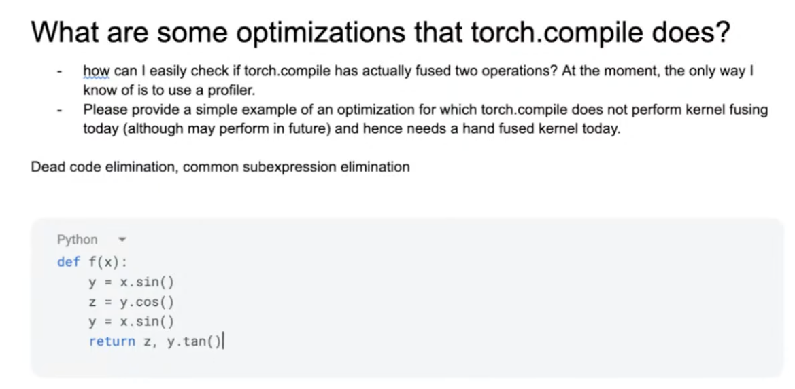

이 페이지는 같은 질문에 대한 더 완전한 code example을 이어서 보여준다. Code는 function `f(x)`를 정의하며, 사용되지 않는 `y = x.sin()` 같은 dead code와 `y = x.sin()`이 두 번 계산되는 common subexpression을 포함한다. `torch.compile`은 이런 invalid computation을 자동으로 제거하고 더 효율적인 code로 optimize할 수 있다.

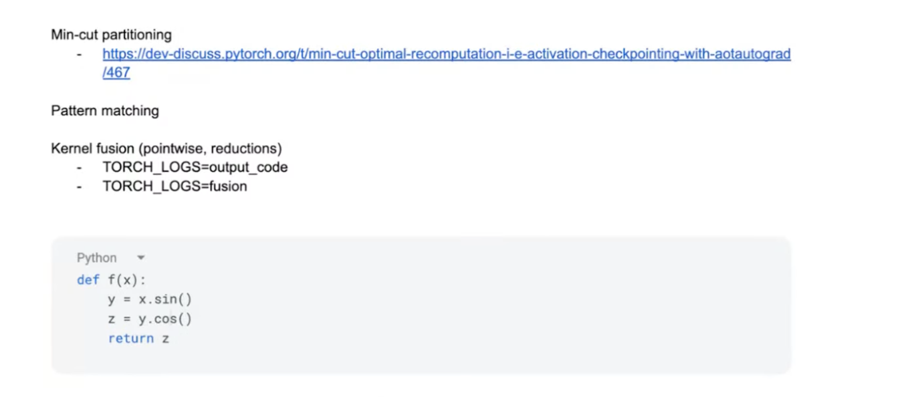

이 페이지는 `torch.compile`의 optimization capability를 계속 논의한다. Min-cut partitioning이 언급되며 관련 discussion link가 제공된다. 또한 pattern matching과 kernel fusion(pointwise, reductions)이 언급된다. `TORCH_LOGS=output_code`와 `TORCH_LOGS=fusion`을 통해 generated code와 fusion information을 볼 수 있다. 아래에는 `y = x.sin()`과 `z = y.cos()`를 하나의 kernel로 fuse할 수 있음을 보여주는 간단한 예제가 있다.

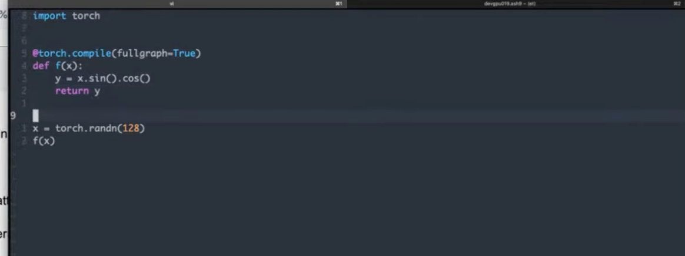

이 페이지는 실제 code example을 보여준다. Code는 `@torch.compile(fullgraph=True)` decorator를 사용해 function `f(x)`를 정의하며, 그 안에서 `y = x.sin().cos()`를 계산한다. 그런 다음 random tensor를 만들고 `f(x)`를 호출한다. 이 예제는 `torch.compile`이 여러 pointwise operation을 하나의 kernel로 fuse하는 방식을 보여준다.

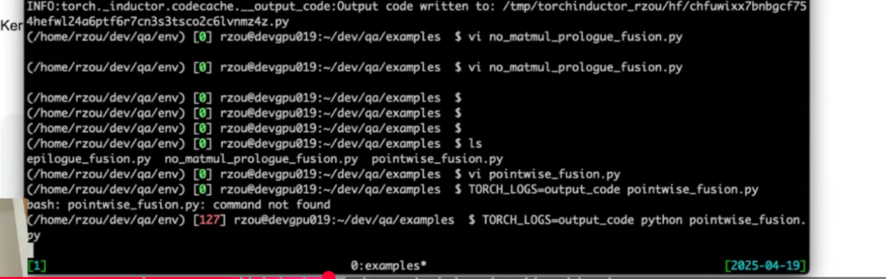

이 페이지는 `TORCH_LOGS=output_code` command를 사용해 generated code를 보는 terminal output을 보여준다. Output은 `torch.compile`이 생성한 intermediate code file path를 보여주고, directory의 file 목록을 나열한다. 여기에는 `epilogue_fusion.py`와 `pointwise_fusion.py` 등이 포함된다. 이 file들은 `torch.compile`이 생성한 optimized code를 담고 있어 compiler optimization 과정을 이해하는 데 도움이 된다.

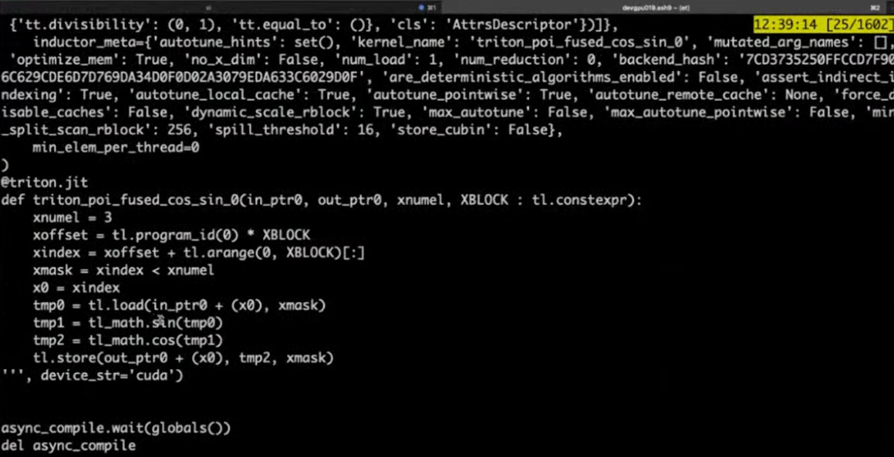

이 페이지는 generated Triton code example을 보여준다. Code는 `triton_poi_fused_cos_sin_0` function을 정의하는데, 이는 `torch.compile`이 생성한 fused kernel이다. Code는 sin과 cos operation을 하나의 Triton kernel로 fuse하는 방법을 보여준다. 여기에는 memory load, computation, store operation이 포함된다. 이는 `torch.compile`이 high-level PyTorch code를 efficient Triton kernel로 compile하는 방식을 보여준다.

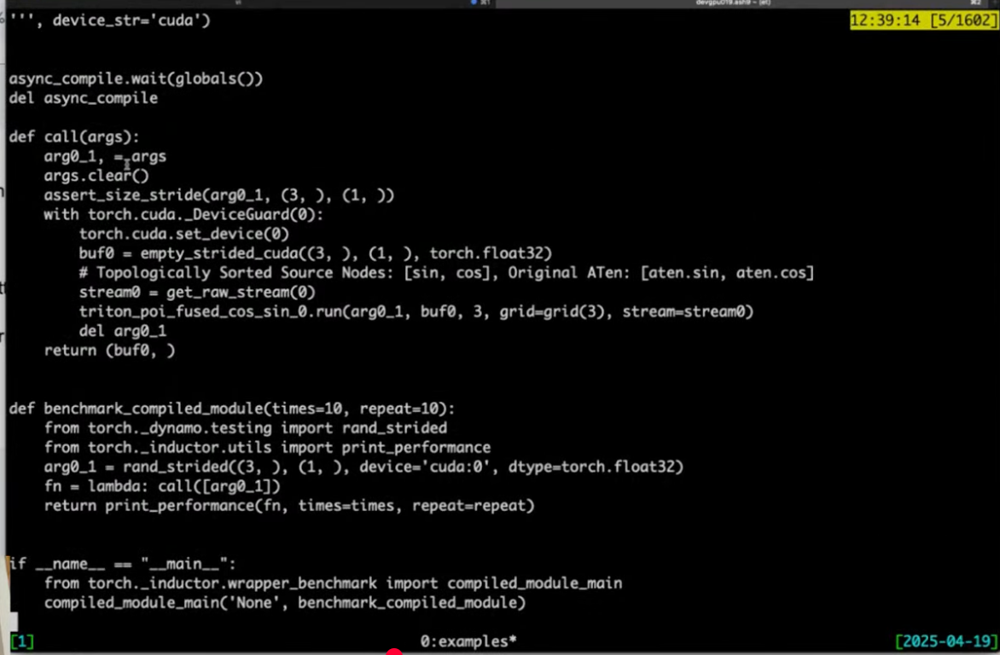

이 페이지는 generated code의 후속 부분을 보여주며, generated Triton kernel을 어떻게 호출하는지도 포함한다. Code에는 kernel launch parameter(grid와 stream)를 설정하고 `triton_poi_fused_cos_sin_0.run`을 호출하는 `call` function이 있다. 또한 performance test를 위한 `benchmark_compiled_module` function도 포함된다. 이는 `torch.compile`이 생성하는 complete call stack을 보여준다.

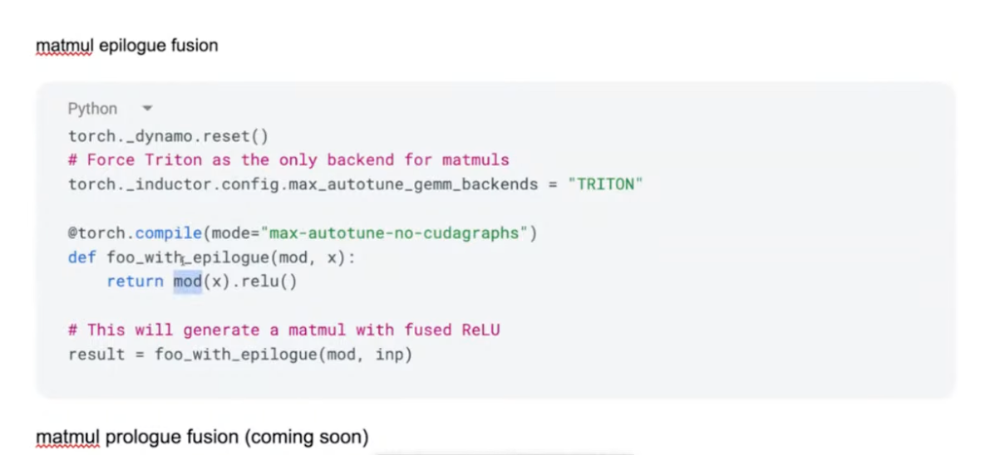

이 페이지는 matmul epilogue fusion을 논의한다. Code example은 `torch._inductor.config.max_autotune_gemm_backends = "TRITON"`을 설정해 matmul의 유일한 backend로 Triton을 강제하는 방법을 보여준다. 그다음 `@torch.compile(mode="max-autotune-no-cudagraphs")` decorator를 사용해 `foo_with_epilogue` function을 정의하며, 이 function은 `mod(x).relu()`를 수행한다. 주석은 이것이 fused ReLU가 있는 matmul을 생성한다고 설명한다. 페이지는 matmul prologue fusion도 곧 제공될 것이라고 언급한다.

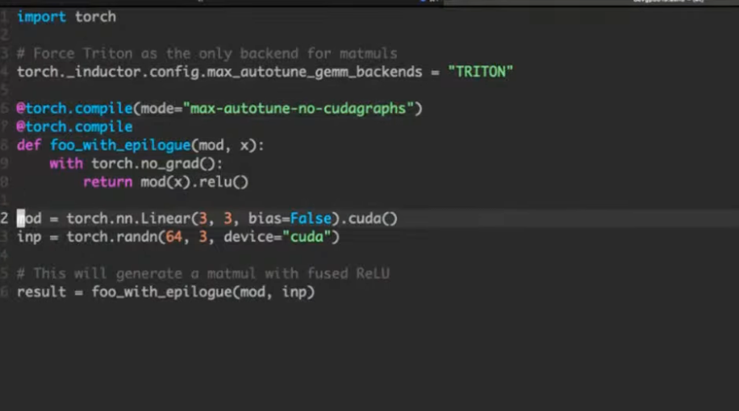

이 페이지는 실제 matmul epilogue fusion code example을 보여준다. Code는 Triton을 matmul backend로 강제하고, `@torch.compile`로 decorate된 두 function을 정의한다. 첫 번째 `foo_with_epilogue`는 `no_grad` context에서 `mod(x).relu()`를 수행한다. 두 번째는 간단한 linear layer와 input data를 만들고 `foo_with_epilogue`를 호출한다. 이는 matmul과 ReLU를 하나의 kernel로 fuse하는 방법을 보여준다.

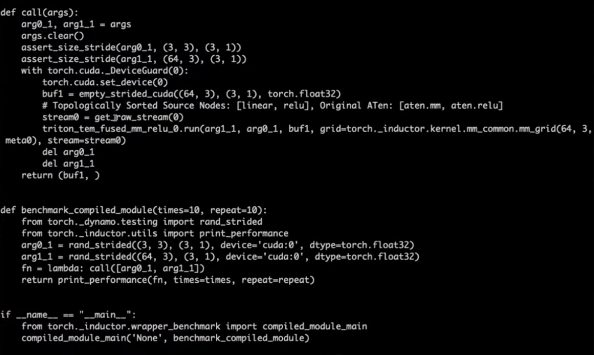

이 페이지는 generated matmul epilogue fusion code의 후속 부분을 보여준다. Code는 `call` function이 kernel launch parameter, 즉 grid와 stream을 설정하고 `triton_tem_fused_mm_relu_0.run`을 호출하는 방법을 보여준다. 이 kernel name은 mm(matrix multiplication)과 relu operation이 fuse되었음을 나타낸다. Performance test를 위한 `benchmark_compiled_module` function도 포함되어 있다.

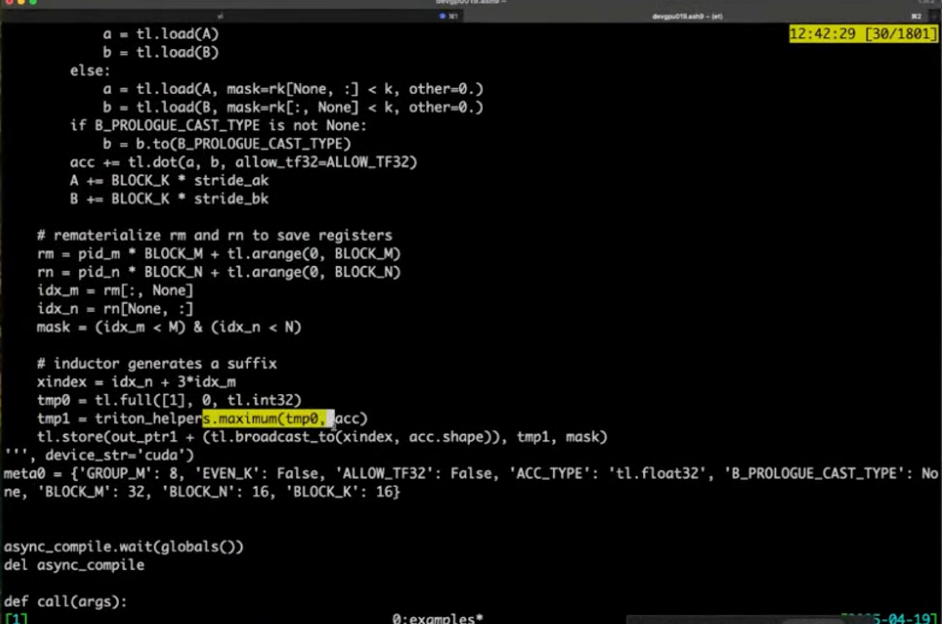

이 페이지는 generated Triton kernel의 detailed implementation을 보여준다. Code는 Triton에서 matmul과 ReLU fusion을 구현하는 방법을 보여주며, memory load, computation, store operation을 포함한다. Code 안에는 `triton_helpers.maximum` call이 보이는데, 이것이 ReLU operation의 implementation이다. 이는 `torch.compile`이 efficient fused kernel을 생성하는 방식을 보여준다.

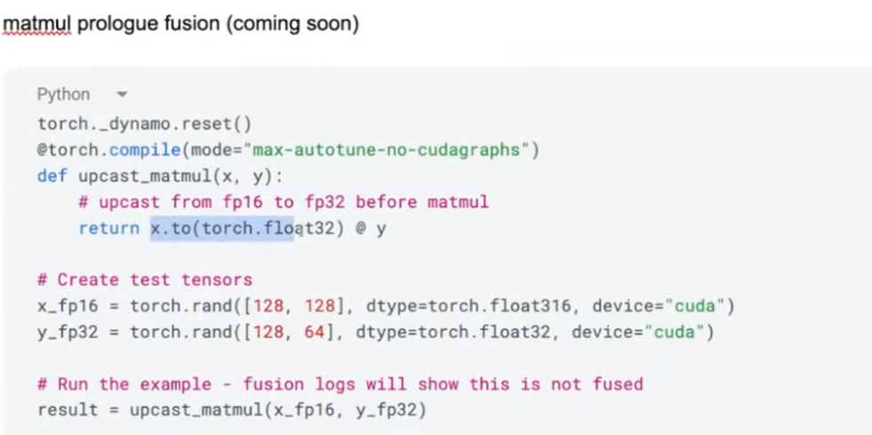

이 페이지는 matmul prologue fusion을 논의한다. 이는 곧 제공될 예정인 matrix multiplication prologue fusion이다. Code example은 `upcast_matmul` function을 정의해 matmul 전에 fp16 data를 fp32로 변환하는 방법을 보여준다. Code는 두 fp16 test tensor를 만든 뒤 example을 실행한다. 주석은 이 example을 실행하면 fusion log가 이 operation이 fuse되지 않았다고 표시한다고 설명한다. 이는 현재 `torch.compile`의 limitation, 즉 matmul 이전 operation을 fuse할 수 없음을 보여준다.

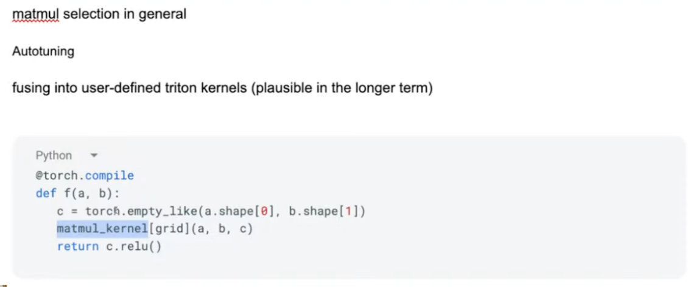

이 페이지는 일반적인 matmul selection을 논의한다. Autotuning과 fusing into user-defined Triton kernels(longer term에서는 plausible)이 언급된다. Code example은 `@torch.compile`로 decorate된 function `f(a, b)`를 보여주며, 이 function은 `matmul_kernel[grid](a, b, c)`를 호출한다. 이는 미래에 `torch.compile`이 matmul을 user-defined Triton kernels로 fuse하는 것을 지원할 수 있음을 보여준다.

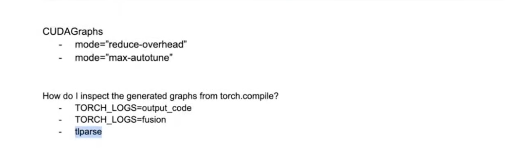

이 페이지는 CUDAGraphs 사용을 논의한다. 두 mode가 나열된다. `mode="reduce-overhead"`와 `mode="max-autotune"`이다. 페이지는 또 하나의 질문에 답한다. `torch.compile`이 생성한 graph를 어떻게 확인할 수 있는가? 사용할 수 있는 방법으로 `TORCH_LOGS=output_code`, `TORCH_LOGS=fusion`, `tlparse`가 제시된다. 이 tool들은 개발자가 `torch.compile`의 behavior를 이해하고 debug하는 데 도움을 준다.

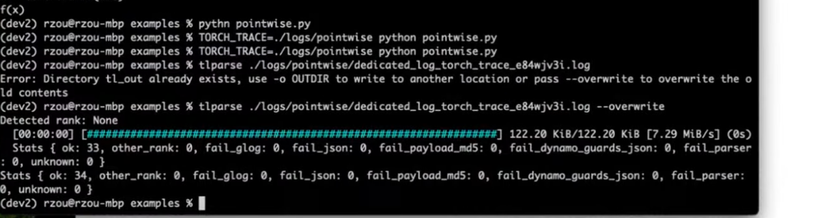

이 페이지는 `tlparse` tool을 사용한 terminal output을 보여준다. Command line은 `TORCH_TRACE` environment variable을 사용해 trace log를 생성하고, `tlparse` tool로 log를 parse하는 방법을 보여준다. Output에는 compile statistics가 표시되며, 성공적으로 compile된 수와 실패한 수 등이 포함된다. 이는 compile issue를 진단하는 데 도움을 주는 강력한 debugging tool이다.

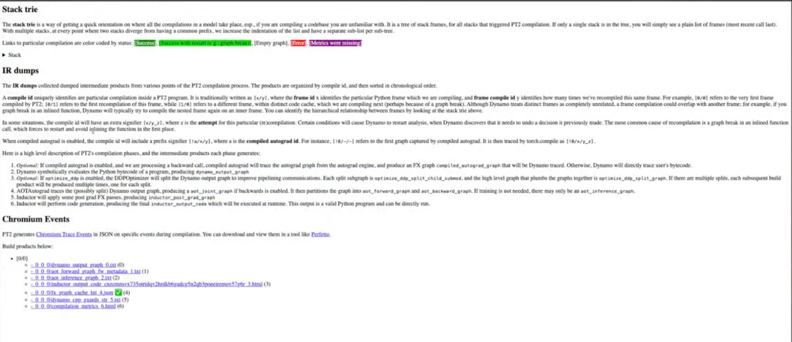

이 페이지는 `torch.compile`의 detailed debugging information을 보여준다. 페이지는 Stack trie, IR dumps, Chromium Events 세 부분을 포함한다. Stack trie는 compile 과정의 call stack information을 보여준다. IR dumps는 intermediate representation(IR)을 보는 방법을 설명하며, Dynamo output graph와 PTX code가 포함된다. Chromium Events는 performance analysis data를 생성하고 확인하는 방법을 설명한다. 이는 `torch.compile` 내부 동작을 깊이 이해하기 위한 핵심 tool이다.

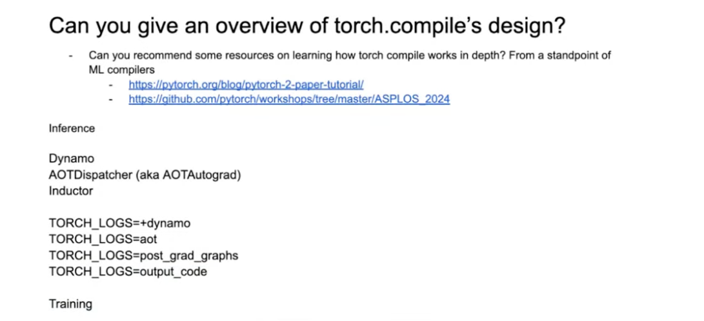

이 페이지는 "`torch.compile` design overview를 줄 수 있는가?"라는 질문에 답한다. 페이지는 learning resource를 추천한다. Machine learning compiler 관점에서는 https://pytorch.org/blog/pytorch-2-paper-tutorial/ 와 https://github.com/pytorch/workshops/tree/master/ASPLOS_2024 를 제시한다. 또한 `torch.compile`의 주요 component를 나열한다. Inference, Dynamo, AOTDispatcher(aka AOTAutograd), Inductor, 그리고 관련 `TORCH_LOGS` environment variable 설정이다. Training 부분도 비슷한 component를 가진다. 이는 `torch.compile` 전체 architecture를 이해하기 위한 roadmap을 제공한다.

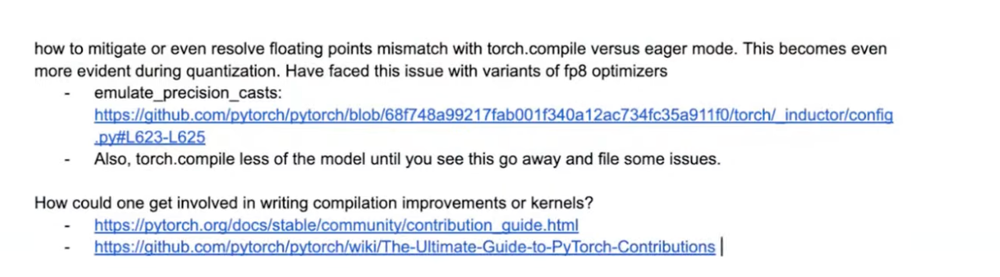

이 페이지는 두 질문에 답한다. 첫 번째 질문은 `torch.compile`과 eager mode 사이의 floating-point mismatch를 어떻게 완화하거나 해결할 수 있는가다. 이는 quantization 과정에서 더 뚜렷해진다. fp8 optimizer variant 문제를 겪은 적도 있다고 한다. 해결 방법은 `emulate_precision_casts`이며 GitHub link가 제공된다. 또는 문제를 없앨 때까지 model의 더 작은 부분만 `torch.compile`하고 issue를 제출할 수도 있다. 두 번째 질문은 compile improvement나 kernels 작성에 어떻게 참여할 수 있는가다. Contribution guide와 PyTorch contribution ultimate guide 링크가 제공된다. 이 두 질문은 실제 application에서 자주 만나는 문제와 community contribution 방법을 다룬다.

## 문서 요약

이 문서는 `torch.compile`에 관한 종합적인 Q&A 모음이며, basic usage부터 advanced optimization까지 여러 측면을 다룬다. 문서는 먼저 graph break 문제와 backend optimization strategy를 포함한 `torch.compile`의 흔한 performance pitfall을 논의하고, 향후 roadmap을 소개한다. Custom operator integration 측면에서는 `torch.library.custom_op`와 `TORCH_LIBRARY`를 사용해 Python/C++/CUDA kernel을 등록하는 방법과 Triton kernel을 PyTorch에 통합하는 방법을 자세히 소개한다. 또한 custom operator가 `torch.compile`, autograd 같은 subsystem과 함께 동작하게 하는 방법도 보여준다.

Optimization capability 측면에서는 `torch.compile`이 자동으로 수행할 수 있는 optimization을 자세히 설명한다. 여기에는 dead code elimination, common subexpression elimination, pointwise operation fusion, matmul epilogue fusion 등이 포함된다. 구체적인 code example과 generated Triton kernel code를 통해 `torch.compile`이 high-level PyTorch code를 efficient GPU kernel로 compile하는 방식을 보여준다. 또한 matmul prologue fusion이 아직 지원되지 않아 manual optimization이 필요하다는 현재 limitation도 지적한다.

문서는 `TORCH_LOGS` environment variable, `tlparse` tool, Stack trie, IR dumps, Chromium Events 같은 풍부한 debugging 및 performance analysis tool도 소개한다. 이 tool들은 개발자가 `torch.compile` 내부 동작을 깊이 이해하고 performance issue를 진단하는 데 도움을 준다. 마지막으로 Dynamo, AOTDispatcher, Inductor 같은 component를 포함한 `torch.compile`의 overall architecture를 소개하고 learning resource와 contribution guide도 제공한다.

전체적으로 이는 매우 실용적인 `torch.compile` practice guide다. `torch.compile`로 더 좋은 performance를 얻기 위한 제안뿐 아니라, `torch.compile` 기능을 확장하는 technical detail도 포함하고 있으며, debugging과 performance analysis를 위한 tool도 풍부하게 제공한다. `torch.compile`을 깊게 이해하고 사용하려는 개발자에게 좋은 reference document다.
