# Lecture 6 Optimizing Optimizer

> 내 강의 노트이며, 많은 관심 바란다: https://github.com/BBuf/how-to-optim-algorithm-in-cuda/tree/master/cuda-mode 

## CUDA-MODE 강의 노트 제6강: PyTorch의 Optimizer를 최적화하는 방법

### 강의 내용

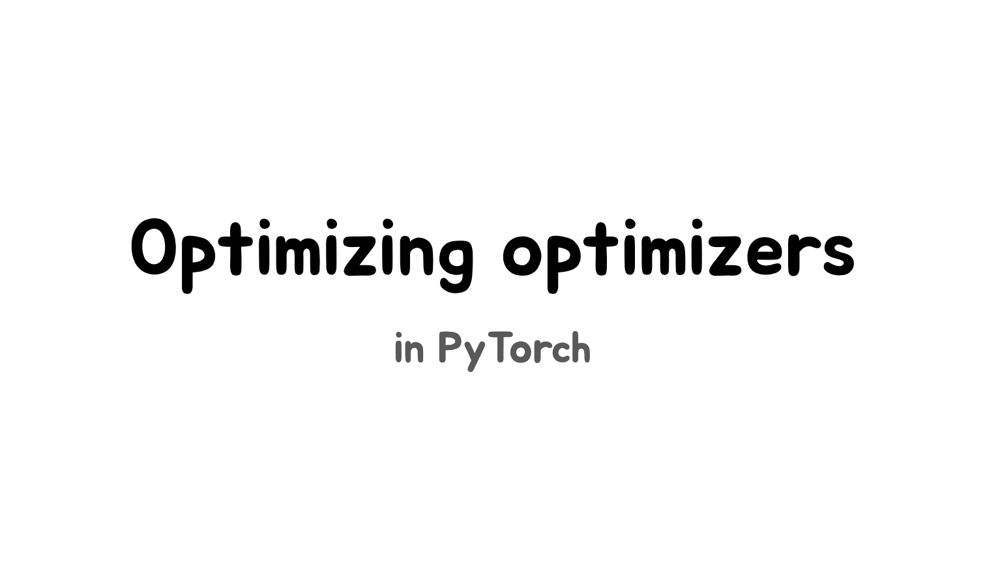

위 세 장의 slide는 runtime과 memory usage 사이의 trade-off 관계를 설명한다.

첫 번째 slide:
- runtime과 memory usage가 보통 서로 충돌한다는 점을 소개한다.
- 두 종류의 운송 차량을 보여준다. 작은 트럭은 낮은 memory usage지만 속도가 느린 방식을, 큰 트럭은 높은 memory usage지만 속도가 빠른 방식을 나타낸다.
- 512대의 차를 운송해야 한다면 어떤 트럭을 선택해야 하는가라는 질문을 던진다.

두 번째 slide:
- 첫 번째 그림에 새로운 제약 조건을 추가한다. 가는 길에 낮은 교량이 있다.
- 이는 어떤 상황에서는 hardware나 system 제약이 있기 때문에 high memory usage 방식인 큰 트럭을 단순히 선택할 수 없음을 나타낸다.

세 번째 slide:

- "오늘은 속도에 집중한다!"라고 명확히 말한다.
- 작은 트럭에 취소선이 그어져 있어 큰 트럭, 즉 high memory usage지만 빠른 방식을 선택했음을 나타낸다.
- 동시에 "이는 확실히 memory에 영향을 준다, disclaimer"라고 상기시킨다.

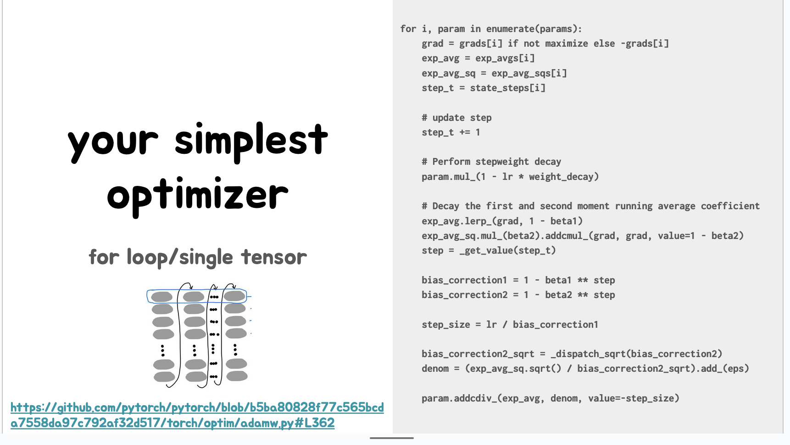

이 slide는 naive한 optimizer 구현을 보여준다. 핵심은 M개의 parameter가 있고 각 parameter마다 N개의 operation이 있다고 가정하면, 모든 parameter를 순회하며 처리하는 데 총 M * N개의 operation이 필요하다는 점이다. 

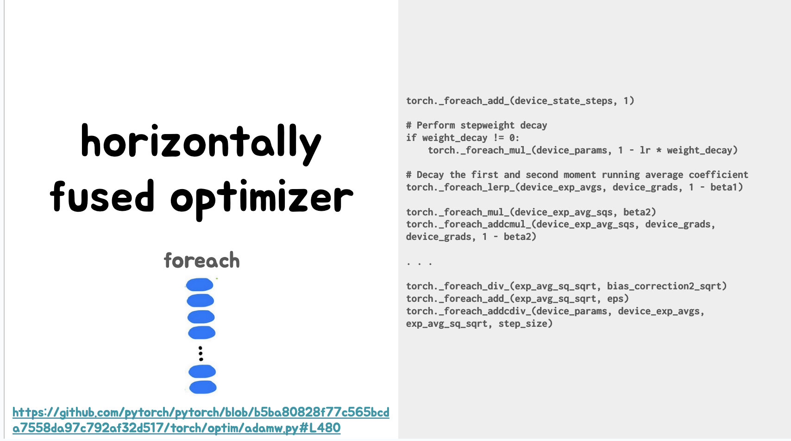

이 slide는 "horizontally fused optimizer"라고 부르는 최적화 방법을 소개한다. naive optimizer 구현의 for loop를 fuse할 수 있다.

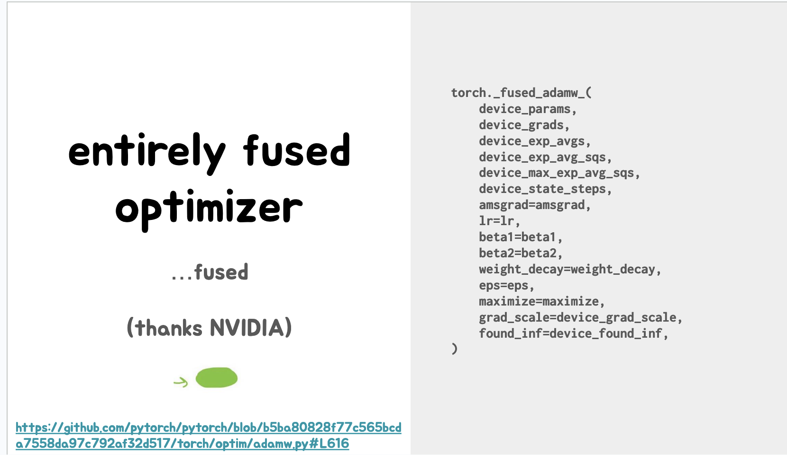

이 slide는 실제로 optimizer 전체 operation을 하나의 CUDA kernel로 fuse할 수 있음을 소개한다.

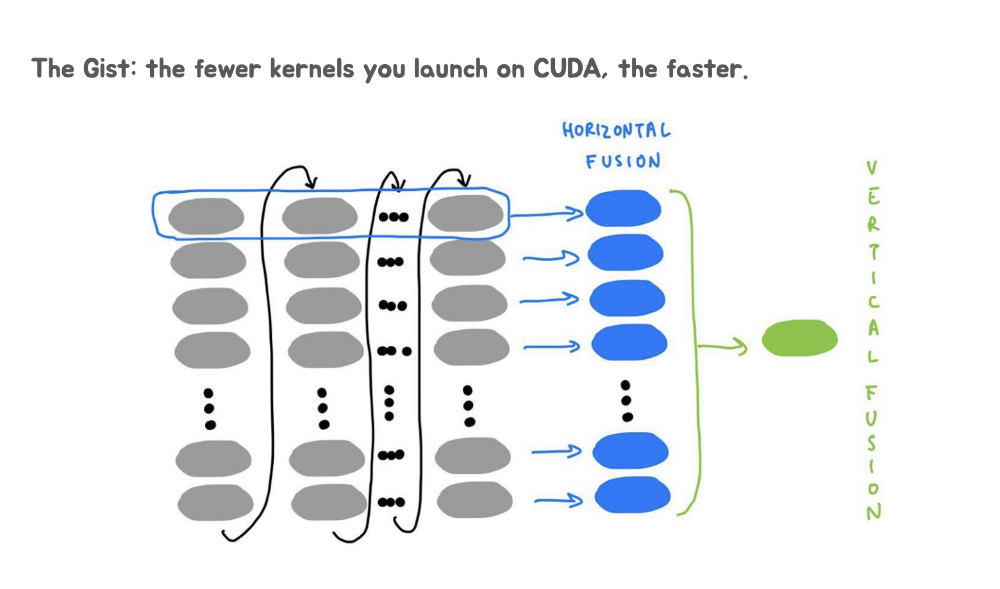

이 slide가 전달하는 핵심 메시지는 CUDA programming에서 kernel launch 횟수를 줄이면 프로그램 실행 효율을 높일 수 있다는 것이다. CUDA kernel을 시작할 때마다 일정한 overhead가 있기 때문에, 여러 operation을 더 적은 kernel로 합치면 이러한 overhead를 줄이고 전체 성능을 높일 수 있다. Horizontal fusion과 vertical fusion은 이 목표를 달성하는 두 가지 주요 전략이다. Horizontal fusion은 비슷한 parallel operation들을 합치고, vertical fusion은 서로 다른 계산 단계를 더 나아가 합친다.

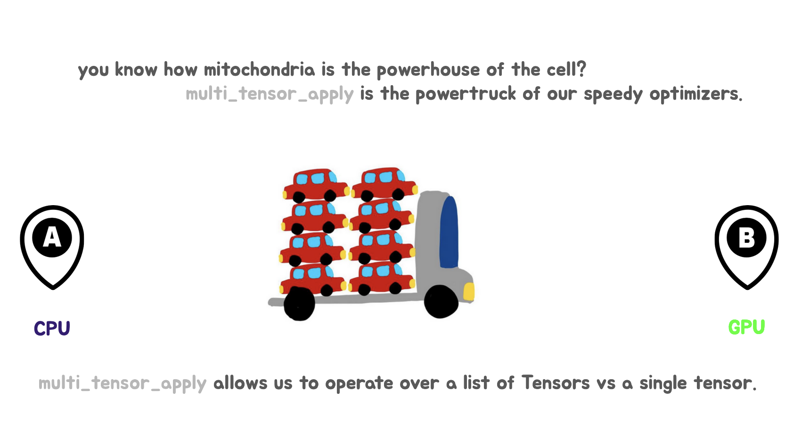

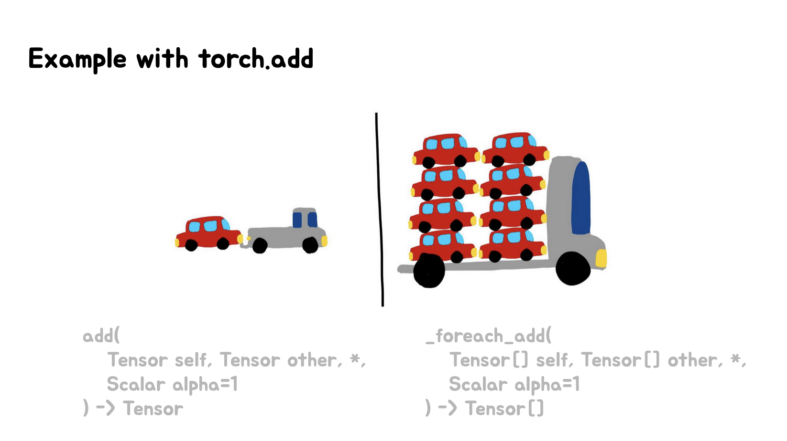

위에서 끝에서 두 번째 slide는 미토콘드리아가 세포의 에너지 공장이라는 비유처럼, multi_tensor_apply가 고속 optimizer의 "파워 트럭"이라고 비유한다. 여러 대의 작은 차를 실은 큰 트럭을 보여주며, multi_tensor_apply가 여러 tensor를 동시에 처리할 수 있음을 암시한다. multi_tensor_apply는 단일 tensor가 아니라 tensor list에 대해 operation을 수행할 수 있게 해준다.

위 마지막 slide는 일반적인 torch.add operation(왼쪽의 작은 차 + 작은 트럭)과 `_foreach_add` operation(오른쪽의 여러 작은 차를 싣는 큰 트럭)을 비교한다.

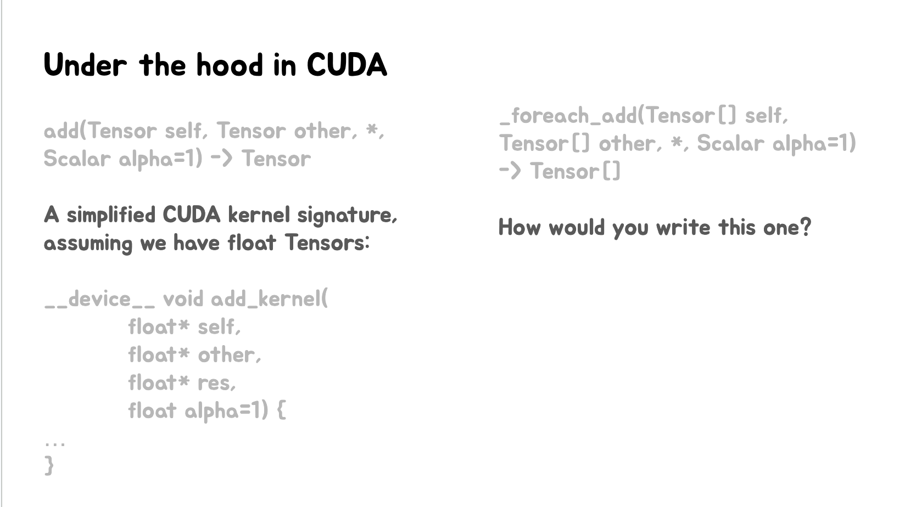

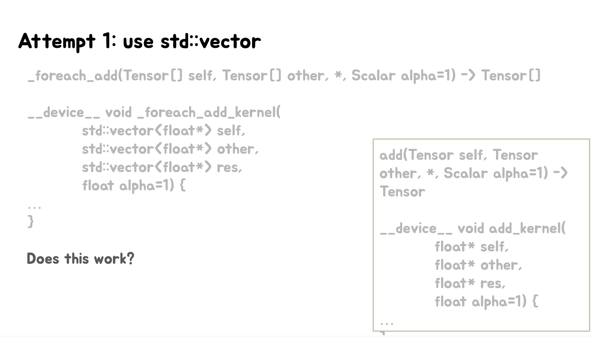

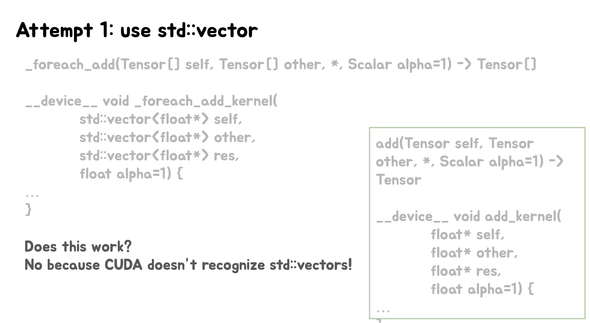

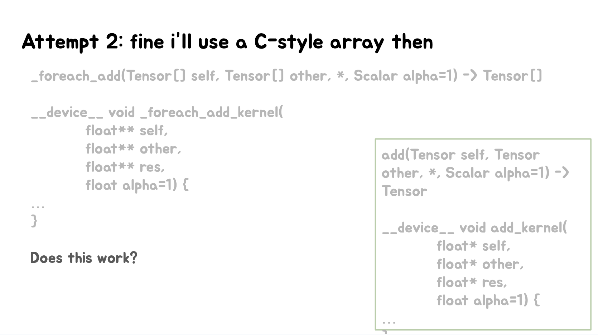

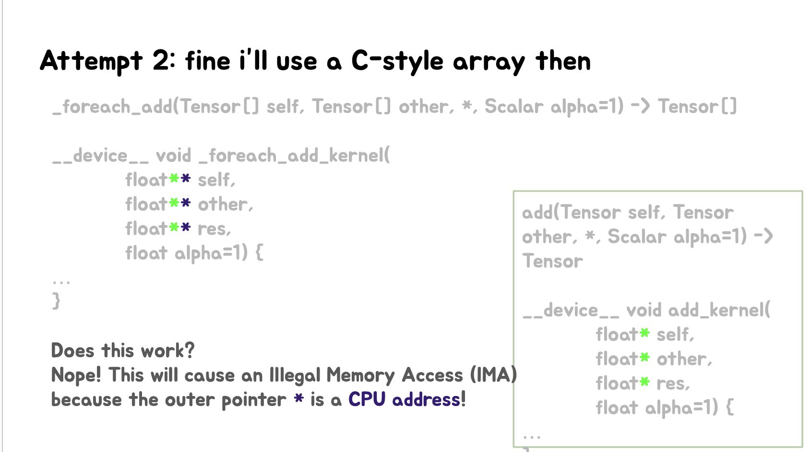

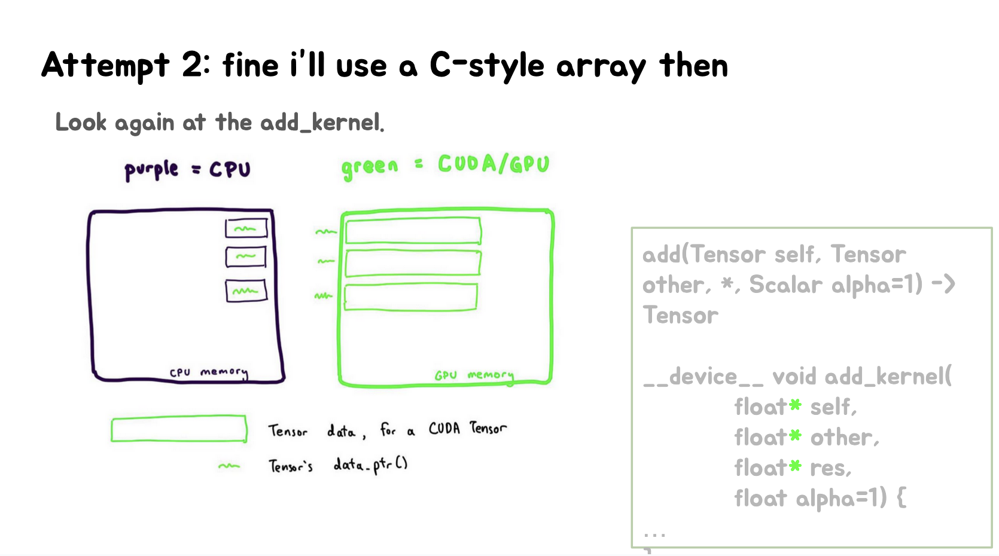

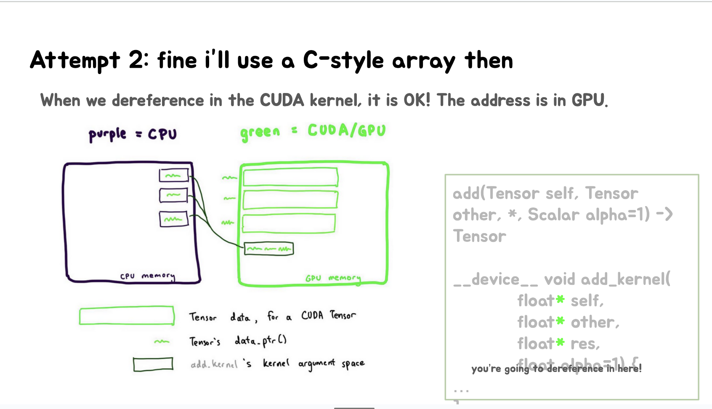

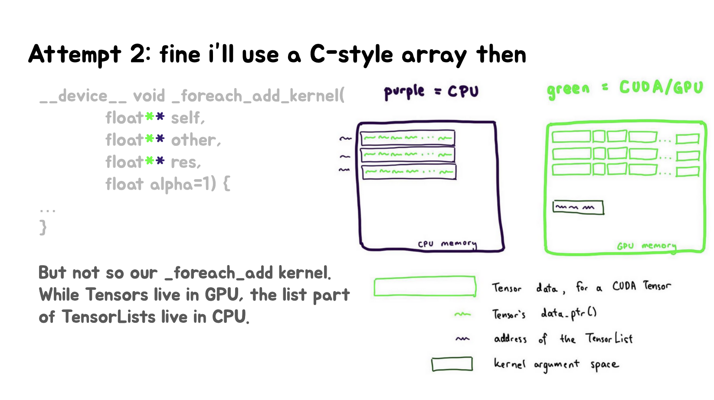

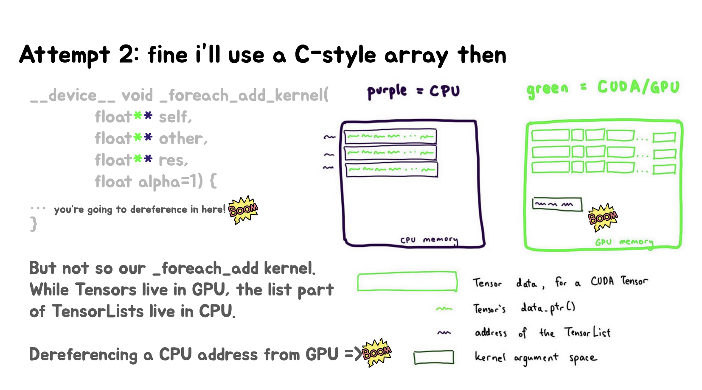

위의 일련의 slide는 CUDA에서 여러 tensor에 대한 add operation, 즉 `_foreach_add`를 구현할 때 input을 어떻게 전달해야 하는지 논의한다.

위 첫 번째 slide는 일반 add operation과 `_foreach_add` operation의 function signature를 보여준다. float type tensor를 사용한다고 가정한 일반 add operation의 CUDA kernel signature를 제공하고, `_foreach_add` operation의 CUDA kernel signature를 어떻게 작성해야 하는가라는 문제를 제기한다.

두 번째와 세 번째 slide는 `std::vector<float*>`를 사용해 `_foreach_add_kernel`을 구현하려고 시도한다. 이 방법은 CUDA가 `std::vector`를 인식하지 못하기 때문에 불가능하다.

네 번째와 다섯 번째 slide는 C style array(`float**`)를 사용해 `_foreach_add_kernel`을 구현하려고 시도한다. 결론은 이 방법도 불가능하며, 외부 pointer `*`가 CPU address이기 때문에 illegal memory access(IMA)가 발생한다는 것이다.

Slide 안에는 이 문제를 설명하기 위한 몇 가지 도식도 그려져 있다.

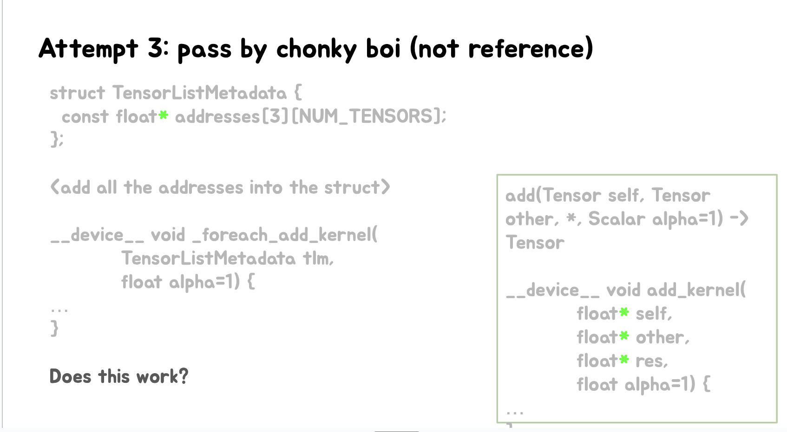

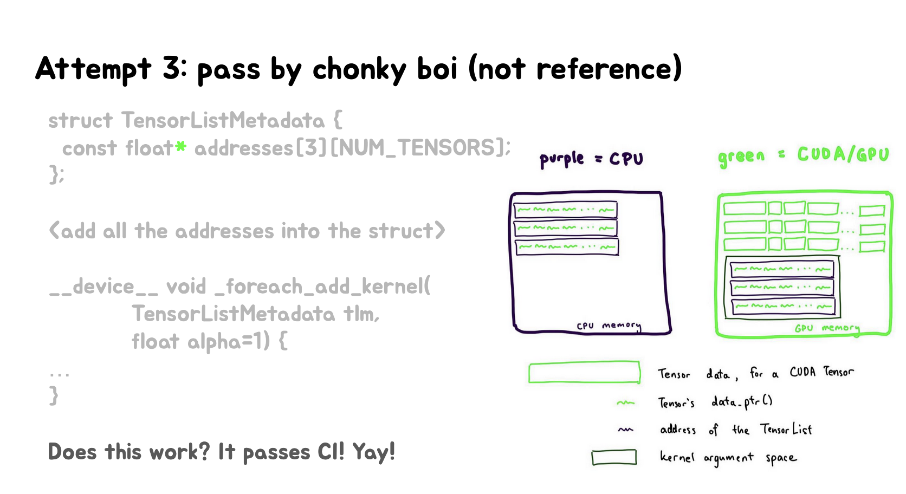

이 두 slide는 CUDA에서 multi-tensor operation, 구체적으로 `_foreach_add`를 구현하는 세 번째 시도 방법을 설명한다. 이를 "pass by chonky boi", 즉 큰 덩어리 데이터로 전달하기라고 부른다.

- 방법 설명:
    - TensorListMetadata라는 struct를 만들어 여러 tensor의 address 정보를 저장한다.
    - struct는 세 그룹의 tensor, 아마 input, output, intermediate result의 address를 저장하기 위한 2차원 배열 `addresses[3][NUM_TENSORS]`를 포함한다.
- memory layout 설명:
    - 보라색 box는 CPU memory를, 초록색 box는 GPU/CUDA memory를 나타낸다.
    - GPU memory 안에서 tensor data와 kernel parameter space는 분리되어 저장된다.
    - tensor의 data pointer(`data_ptr()`)와 tensor list의 address가 모두 GPU memory에 저장된다.
- 결과:
    - 이 방법은 compile을 통과했다("It passes CI! Yay!").
    - 이전 시도에서 만난 문제, 예를 들어 CUDA가 std::vector를 지원하지 않는 문제와 pointer array를 직접 사용했을 때 illegal memory access가 발생하는 문제를 해결했다.

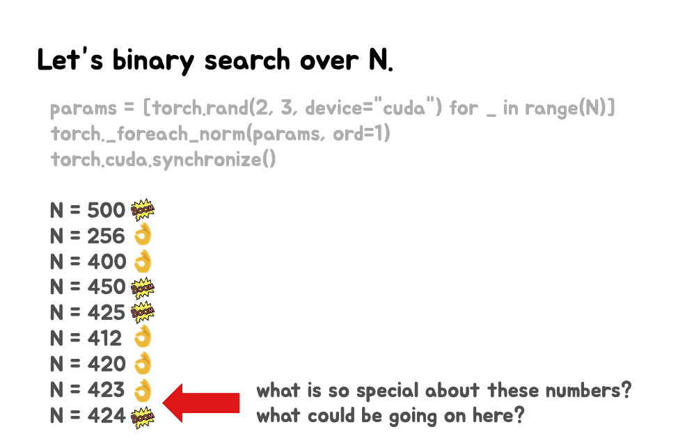

여기서 설명하는 것은 위의 큰 덩어리 데이터 전달 방식을 시도한 뒤 저자가 CUDA에서 illegal memory access를 만났다는 점이다. 문제는 tensor list의 크기(N)와 관련이 있어 보인다. N=423과 N=424 사이에 임계점이 있으며, CUDA의 memory management나 어떤 hardware limit와 관련이 있을 수 있다.

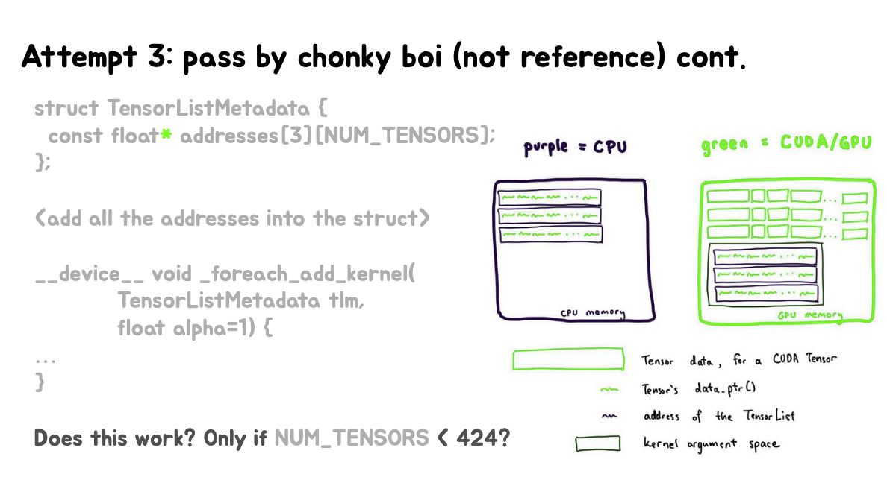

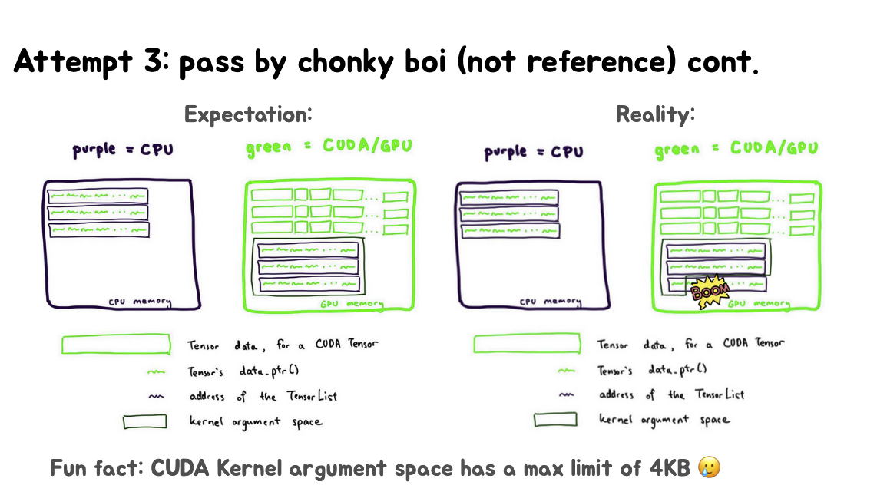

여기서는 많은 양의 데이터, 여기서는 tensor address를 kernel parameter로 전달하려 할 때 CUDA kernel parameter space의 4KB 제한을 넘을 수 있고, 그 결과 프로그램이 실패할 수 있음을 계속 설명한다. 이것이 NUM_TENSORS가 특정 값, 여기서는 424보다 작을 때만 code가 정상 동작하는 이유를 설명한다.

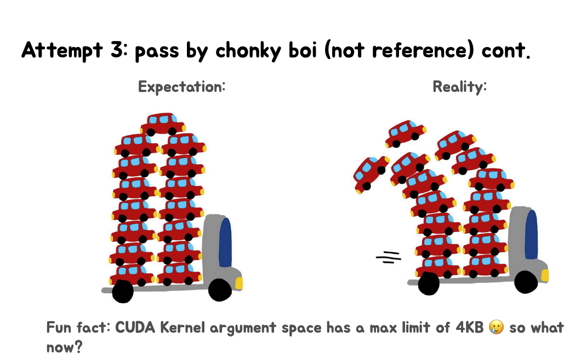

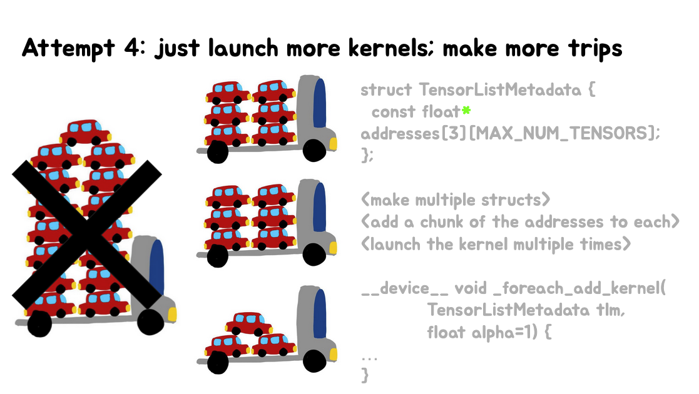

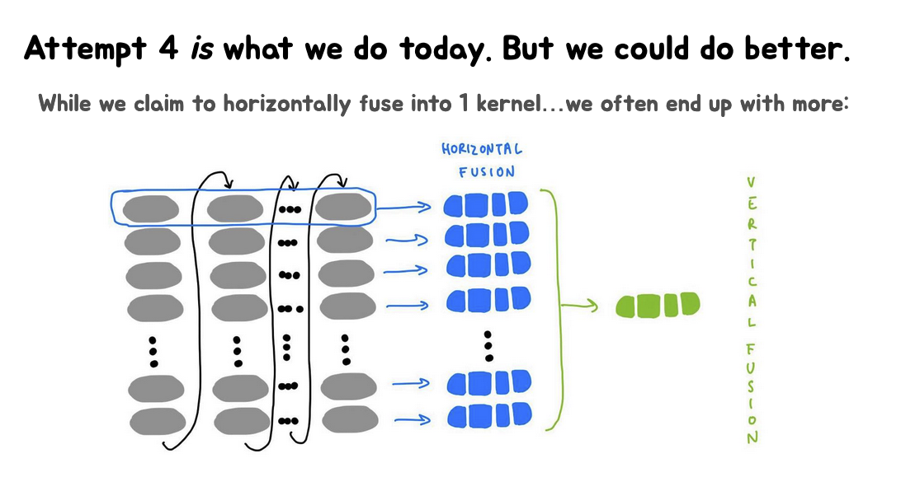

여기 첫 번째 slide의 기대는 모든 데이터, 즉 작은 차로 표현된 데이터를 한 번에 큰 트럭 하나에 싣는 것이다. 현실은 CUDA kernel parameter space의 4KB 제한 때문에 모든 데이터를 한 번에 실을 수 없고, 일부 데이터가 "떨어진다". 두 번째 slide는 "Attempt 4"의 해결책을 제시하며, 여러 번 kernel을 launch하는 방식, 즉 "make more trips"로 문제를 해결하자고 제안한다. 세 번째 slide는 현재 방법이 horizontal fusion, 즉 여러 operation을 하나의 kernel로 합치는 방식이지만, 실제로는 여러 horizontal fusion kernel과 vertical fusion kernel이 자주 생긴다는 점을 보여준다.

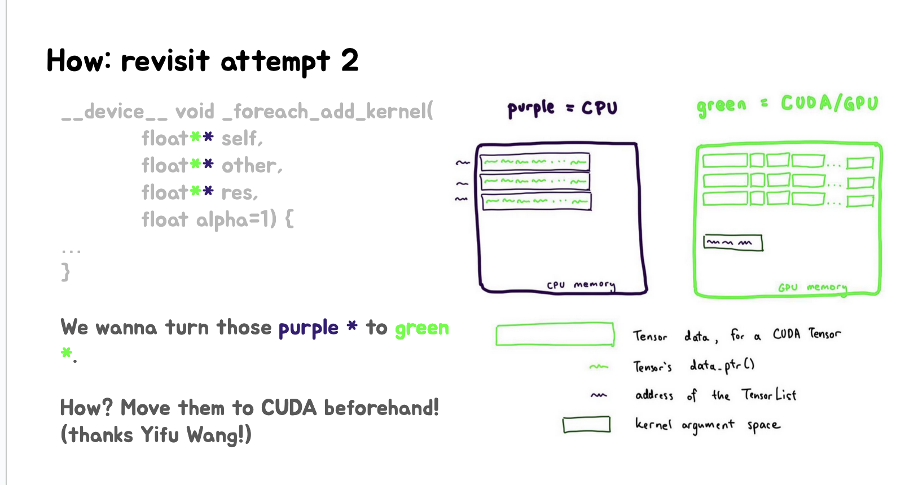

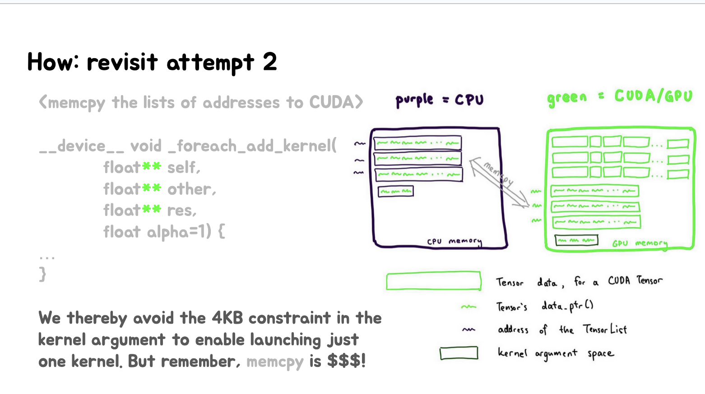

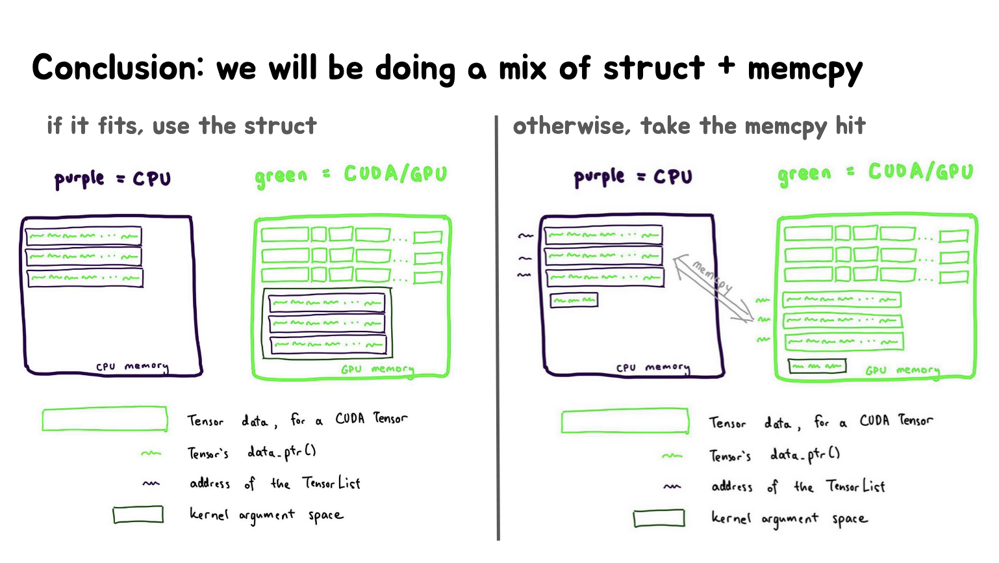

여기 첫 번째 slide는 "Attempt 2"를 돌아본다. 목표는 CPU memory(보라색)의 데이터를 CUDA/GPU memory(초록색)로 옮기는 것이다. 마지막에는 보라색 pointer(`*`)를 초록색으로 바꾸자는 생각, 즉 데이터를 CPU에서 GPU로 옮기자는 아이디어를 제시한다. 두 번째 slide는 해결책을 더 자세히 설명한다. memcpy를 사용해 address list를 CUDA memory로 복사한다. 이 방법을 통해 CUDA kernel parameter space의 4KB 제한을 피할 수 있고, 모든 데이터를 처리하는 단일 kernel을 launch할 수 있다. 단, memcpy operation은 비싸다($$$).

세 번째 slide는 최종 해결책을 요약하며, struct와 memcpy를 혼합해 사용하는 전략을 제시한다. 왼쪽은 데이터 양이 작아 kernel parameter space 제한에 맞으면 struct를 직접 전달하는 방식이다. 오른쪽은 데이터 양이 제한을 넘으면 memcpy로 데이터를 GPU memory에 복사한 뒤 pointer를 전달하는 방식이다.

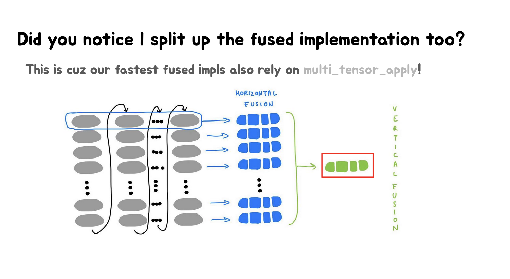

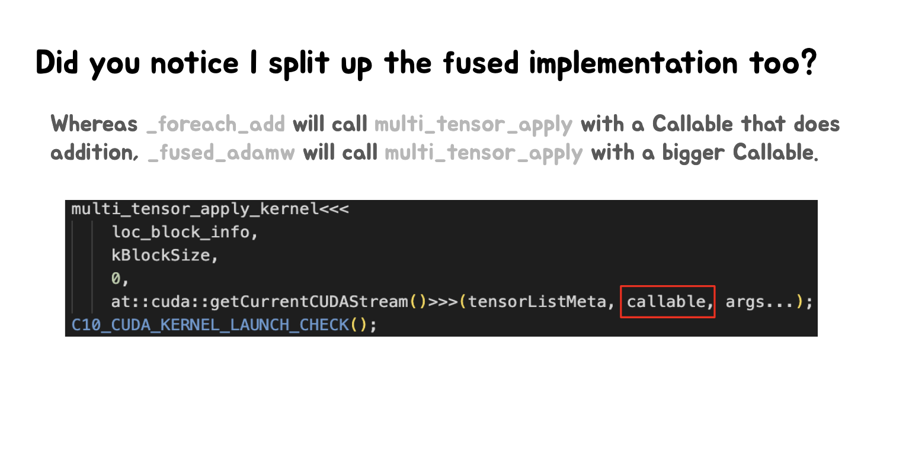

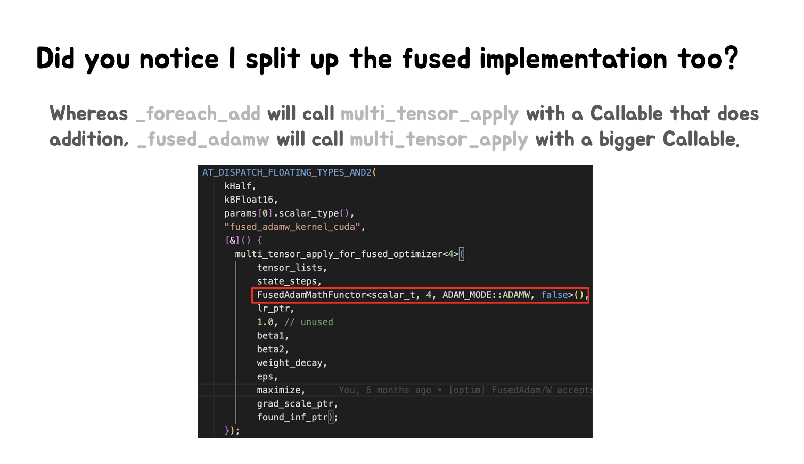

여기 첫 번째 slide는 horizontal fusion과 vertical fusion을 보여준다. 여러 독립 operation(회색 block)이 먼저 horizontal fusion되어 파란 block이 되고, 이 파란 block들이 다시 vertical fusion되어 더 큰 초록 block을 형성할 수 있다. 꽤 번거로워 보이는 이 구현은 multi_tensor_apply function에 의존한다.

두 번째 slide는 `_foreach_add`와 `_fused_adamw` 두 operation의 구현 차이를 설명한다. `_foreach_add`는 multi_tensor_apply를 호출할 때 addition을 수행하는 Callable을 사용한다. `_fused_adamw`는 multi_tensor_apply를 호출할 때 더 큰 Callable을 사용한다. 또한 callable parameter를 포함한 multi_tensor_apply_kernel의 code snippet도 보여준다.

세 번째 slide는 `_foreach_add`와 `_fused_adamw`의 구현 차이를 계속 설명하며 `_fused_adamw`의 구체적인 구현 code를 보여준다. 대략 살펴보면 AT_DISPATCH_FLOATING_TYPES_AND2 macro를 사용해 서로 다른 floating point type을 처리한다. multi_tensor_apply_for_fused_optimizer function을 호출하고, FusedAdamMathFunctor를 parameter로 전달한다.

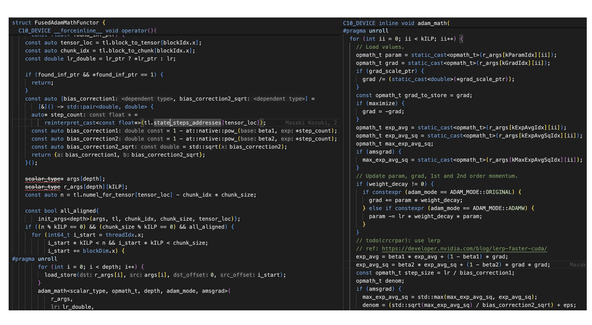

여기서 업로더는 FusedAdamMathFunctor의 code 구현을 보여준다. 여기에는 두 주요 부분이 포함된다.

- 왼쪽은 FusedAdamMathFunctor struct 정의이며, operator() function 구현을 포함한다.
- 오른쪽은 adam_math function 구현이다. 이는 Adam optimizer의 핵심 계산 logic이다. Adam optimizer의 각 단계, 즉 gradient 계산과 1차 및 2차 momentum update 등을 구현한다.

여기 세 번째 slide는 "...that was very manual."이라는 문구를 보여주며, 이런 구현 방식이 매우 manual하고 복잡하다는 점을 암시한다.

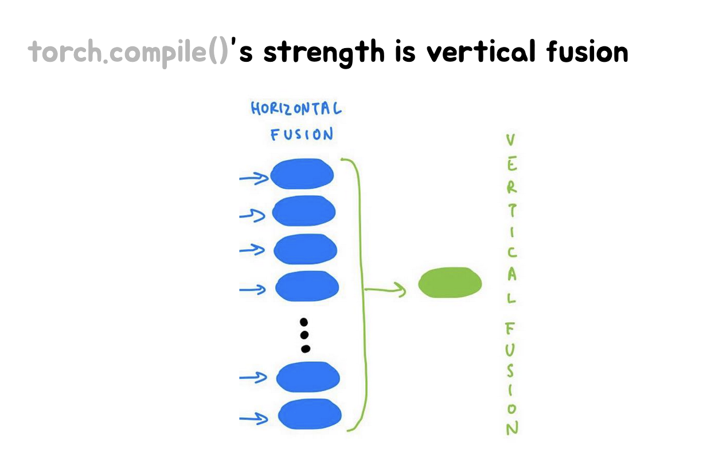

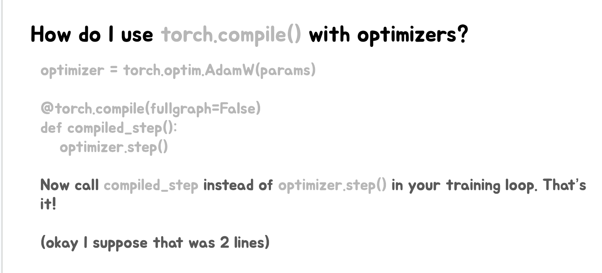

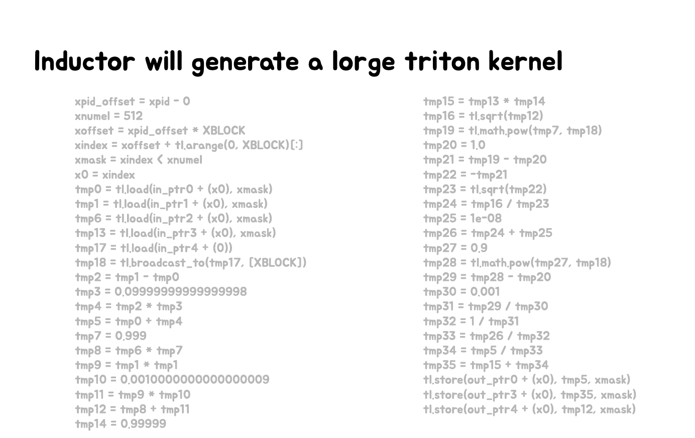

이 몇 장의 slide는 PyTorch의 torch.compile() 기능과 optimizer에서의 적용을 설명한다. 주요 내용은 다음과 같다.
- 첫 번째 slide는 torch.compile() function을 소개한다.
- 두 번째 slide는 torch.compile()의 주요 장점이 vertical fusion이라는 점을 설명한다. 그림은 여러 horizontal fusion operation을 더 큰 하나의 operation으로 다시 vertical fusion하는 방식을 보여준다.
- 세 번째 slide는 optimizer에서 torch.compile()을 사용하는 방법을 보여준다.
    - 먼저 AdamW optimizer를 만든다.
    - 그 다음 @torch.compile decorator를 사용해 compiled_step function을 정의한다.
    - training loop에서는 기존 optimizer.step() 대신 compiled_step을 사용한다.
- 마지막 slide는 torch.compile()이 생성한 Triton kernel code의 일부를 보여준다. 이는 임시 변수(tmp0, tmp1 등)와 복잡한 수학 연산을 많이 포함한 크고 고도로 최적화된 kernel이다. 이는 torch.compile()이 실제로 매우 복잡하고 효율적인 fused kernel을 생성할 수 있음을 보여준다. 

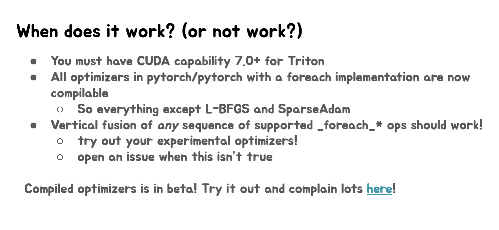

마지막 slide는 PyTorch에서 compiled optimizer가 동작하는 조건과 사용 상황을 보여준다.

- Triton을 지원하려면 CUDA capability version 7.0 이상이 필요하다.
- PyTorch에서 foreach 구현이 있는 모든 optimizer는 이제 compile할 수 있다.
- L-BFGS와 SparseAdam을 제외한 다른 모든 optimizer는 compile을 지원한다.
- 지원되는 foreach* operation sequence는 모두 vertical fusion이 가능해야 한다.
- 사용자가 자신의 experimental optimizer를 시도해보는 것을 권장한다. 동작하지 않는 경우를 발견하면 issue를 제출하라고 제안한다.

### 개인 요약
이 강의는 실제로 PyTorch Optimizer가 CUDA kernel fuse를 통해 어떻게 최적화되는지 거시적으로 소개한다. 여기서는 Claude-3-Opus-200k를 사용해 이 강의에서 다룬 요점을 요약해본다.

> 아래 내용은 Claude-3-Opus-200k가 요약한 것이다.

이 강의의 주요 내용은 PyTorch에서 optimizer 성능을 최적화하는 방법을 소개하는 것이다. 중점은 다음 몇 가지 측면을 포함한다.

- 1. runtime과 memory usage 사이의 trade-off. 일반적으로 속도를 높이려면 더 많은 memory가 필요하다. 하지만 때로는 hardware나 system 제한을 받을 수도 있다.
- 2. optimizer 구현의 여러 방식:
    - Naive 구현: 모든 parameter를 단순히 순회하고 모든 operation을 수행하며, 총 M*N번의 operation이 필요하다.
    - Horizontally fused: loop를 fuse해 전체 operation 수를 줄인다.
    - Vertically fused: optimizer 전체 operation을 하나의 CUDA kernel로 fuse한다.
- 3. CUDA programming에서 kernel launch 횟수를 줄이면 효율을 높일 수 있다. 이는 horizontal fusion(비슷한 parallel operation을 합침)과 vertical fusion(서로 다른 계산 단계를 합침)을 통해 구현할 수 있다.
- 4. PyTorch의 multi_tensor_apply function은 tensor list에 동시에 operation을 수행할 수 있게 해주며, vectorized한 `_foreach` operation과 유사하다. 하지만 CUDA kernel parameter space의 4KB 제한에 주의해야 한다.
- 5. 4KB 제한을 초과하는 경우 취할 수 있는 해결책:
    - kernel을 여러 번 launch한다(make more trips).
    - memcpy를 사용해 데이터를 CPU에서 GPU memory로 복사한다.
    - struct와 memcpy를 결합해 사용한다. 데이터 양이 작으면 struct로 직접 전달하고, 데이터 양이 크면 먼저 memcpy한 뒤 pointer를 전달한다.
- 6. FusedAdamW 같은 optimizer의 horizontal fusion과 vertical fusion을 수동으로 구현하는 과정은 비교적 복잡하다.
- 7. PyTorch의 torch.compile() 기능은 고도로 최적화된 vertical fusion kernel을 자동 생성할 수 있어 compiled optimizer 구현을 크게 단순화한다.
- 8. 현재 PyTorch의 대부분 optimizer는 compiled optimization을 지원하지만 CUDA version 요구사항이 있다(>=7.0). 사용자는 자신의 experimental optimizer도 시도해볼 수 있다.

종합하면, 이 강의는 PyTorch optimizer 구현을 여러 측면에서 최적화하는 방법을 깊이 설명한다. 여기에는 algorithm 차원의 horizontal/vertical fusion, engineering 구현 차원의 parameter 전달과 memory management, 그리고 torch.compile()이라는 새 기능이 가져오는 편의성이 포함된다.
