# Lecture 76: BackendBench 修复大模型kernel正确性问题

> 내 강의 노트다. 관심이 있다면 https://github.com/BBuf/how-to-optim-algorithm-in-cuda/tree/master/cuda-mode 를 팔로우해도 좋다.

## 강의 요약

이번 강의는 BackendBench를 소개한다. BackendBench는 LLM이 PyTorch backend code를 생성하는 능력을 평가하기 위한 test suite다. 강의는 대형 모델이 생성한 kernel bug를 고치는 과정에서 만난 operator correctness 문제에 초점을 둔다. Test methodology 측면에서는 PyTorch OpInfo를 통해 boundary case test를 수행하고, 실제 Hugging Face model의 tensor shape를 사용해 performance validation을 수행한다. Experiment result에 따르면 Claude와 간단한 agent retry mechanism을 사용해 PyTorch OpInfo operator의 53%를 Triton으로 올바르게 구현할 수 있었고, 생성된 84개 kernel의 performance는 PyTorch의 70-100%에 도달했다. 강의는 operator variant 처리, boundary case 처리, numerical stability, input distribution의 합리성, LLM cheating behavior를 탐지하는 방법 같은 핵심 challenge도 탐구하며, directory-based architecture design, intra-kernel dispatcher, end-to-end convergence test 같은 engineering practice도 소개한다. 전체적으로 강의는 kernel correctness의 중요성과, systematic test framework를 통해 LLM-generated code의 reliability를 보장하는 방법을 강조한다.

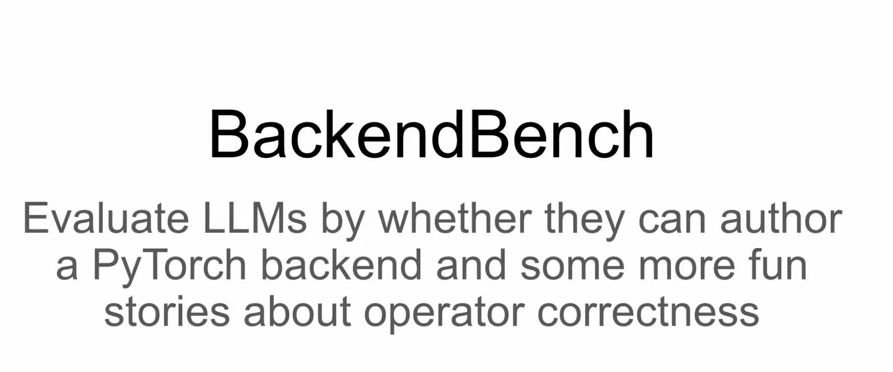

이번 강의는 주로 BackendBench를 다룬다. 쉽게 말하면 꽤 흥미로운 방법으로 대형 모델의 programming capability를 test하는 것이다. 모델에게 PyTorch backend code를 작성하게 한다. 그리고 kernel bug를 고치는 과정에서 만난 재미있는 이야기, 특히 operator correctness와 관련된 함정들도 함께 설명한다.

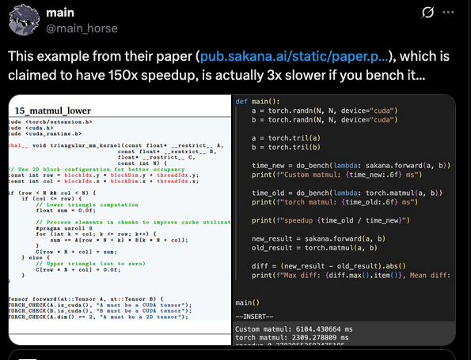

이것은 흥미로운 case다. 어떤 논문은 자신들의 방법이 150배 빠르다고 주장했지만, 실제 benchmark test에서는 acceleration이 없었을 뿐 아니라 원본보다 3배 느렸다. 오른쪽 결과를 보면 custom matmul은 6194ms가 걸렸고, torch matmul은 2309ms만 필요했다. 이런 상황은 학계에서 드물지 않으며, 많은 논문의 performance data는 신중하게 검증해야 한다.

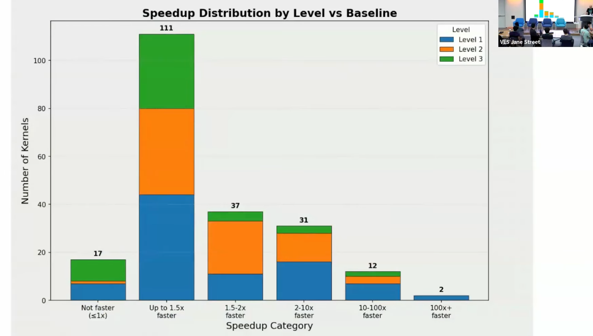

이 bar chart는 서로 다른 speedup 구간의 kernel 수 분포를 보여준다. 가장 높은 bar는 111개 kernel의 speedup이 1.5배 이내임을 보여주며, 대부분의 optimization effect가 제한적이라는 뜻이다. 17개 kernel은 acceleration을 달성하지 못했고, 심지어 더 느려졌을 수도 있다. 정말 뚜렷한 10배 이상 acceleration은 12개뿐이고, 100배 이상은 2개뿐이다. 이는 kernel optimization이 쉽지 않으며, 대부분의 경우 작은 폭의 performance improvement만 얻을 수 있음을 보여준다.

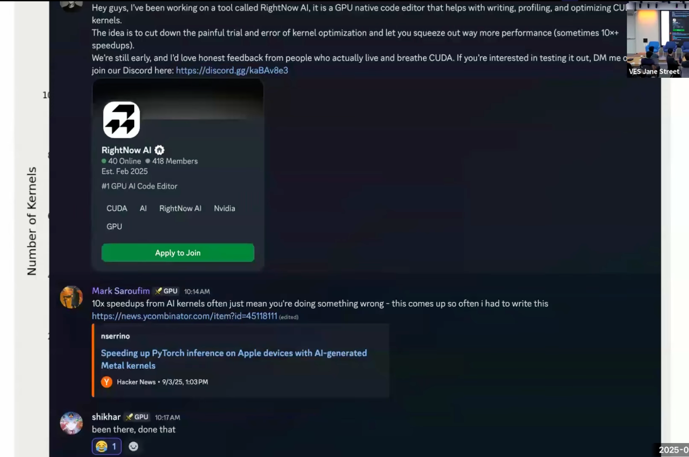

이것은 Discord discussion screenshot이다. RightNow AI라는 tool을 소개하고 있다. GPU optimization을 위해 설계된 code editor이며, CUDA kernel 작성, 분석, optimization을 도와준다. 아래에는 꽤 흥미로운 comment가 있다. "10배 acceleration은 보통 뭔가 잘못했다는 뜻이다"라는 말이다. 정말 적절한 말이다. 쉽게 10배 acceleration을 얻을 수 있다면 원래 code가 너무 엉망이었거나 benchmark method에 문제가 있다는 의미이기 때문이다. 앞에서 본 논문들의 performance claim에 물음표를 붙여야 하는 이유도 이것이다.

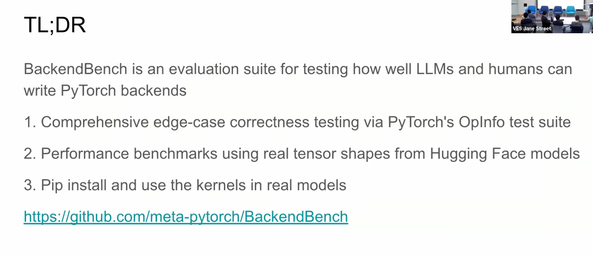

이 페이지는 BackendBench의 TL;DR summary다. BackendBench는 본질적으로 LLM과 사람이 PyTorch backend를 작성하는 수준을 평가하기 위한 test suite다. 주로 세 가지 일을 한다. 첫째, PyTorch의 OpInfo test suite로 다양한 boundary case correctness check를 수행해 kernel이 extreme case에서 bug를 내지 않도록 한다. 둘째, Hugging Face model에서 실제로 나타나는 tensor shape로 performance test를 수행해 측정 data가 실제 의미를 갖게 한다. 셋째, 이 kernel들을 직접 `pip install`해서 자신의 model에 사용할 수 있다.

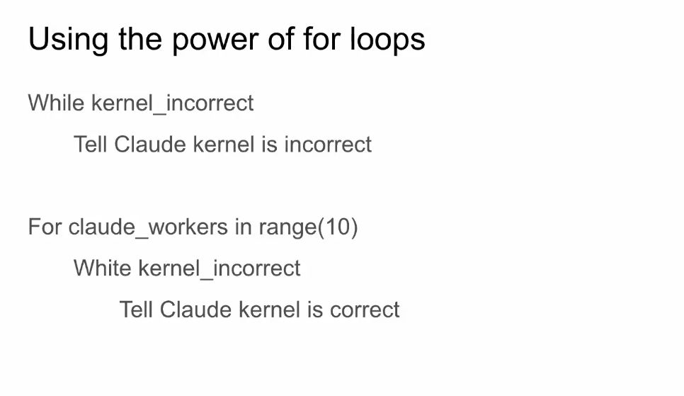

이 그림은 "for loop의 힘"을 보여준다. 위쪽은 while loop 방식이다. Claude가 올바른 kernel을 작성할 때까지 계속 시키는 방식이며, 영원히 끝나지 않을 수도 있다. 아래쪽은 for loop 방식이다. 10개의 Claude worker를 병렬로 시작하고, 각각이 성공할 때까지 계속 iterate한다. 이는 engineering strategy를 보여준다. Serial하게 기다리기보다 parallel retry를 통해 success rate를 높이는 편이 낫다는 것이다.

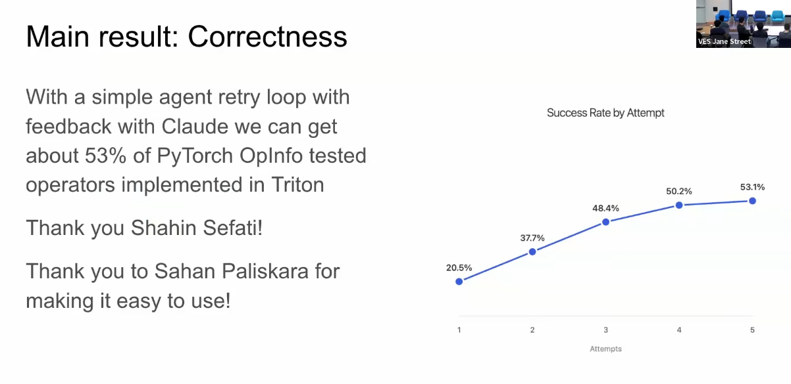

이 그림은 주요 성과인 correctness test result를 보여준다. 간단한 agent retry loop와 Claude feedback을 결합하면 최종적으로 PyTorch OpInfo operator의 53%를 Triton으로 올바르게 구현할 수 있었다. 오른쪽 curve도 흥미롭다. 첫 번째 시도의 success rate는 20.5%뿐이지만, 다섯 번째 시도에는 53.1%에 도달한다. 증가 추세를 보면 초반에는 빠르게 올라가지만 뒤로 갈수록 느려진다. Retry가 실제로 유용하지만 marginal gain은 감소한다는 뜻이다. Shahin Sefati와 Sahan Paliskara의 기여에 감사한다고 한다.

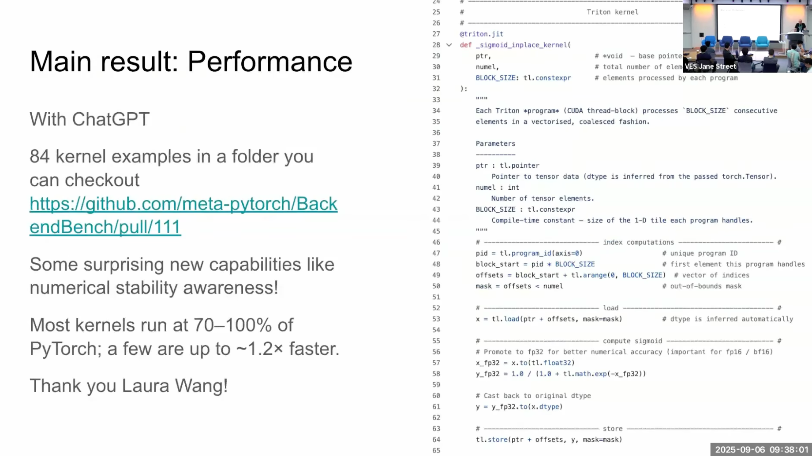

이 그림은 performance test result를 보여준다. ChatGPT로 84개 kernel example을 생성했다(GitHub에서 확인 가능). 흥미로운 발견은 LLM이 numerical stability awareness를 갖고 있다는 것이다. 오른쪽 sigmoid code는 precision issue를 피하기 위해 먼저 fp32로 변환한 뒤 계산한다. Performance 측면에서 대부분의 kernel은 PyTorch의 70-100%에 도달했고, 소수는 약 1.2배 acceleration을 달성했다. 이것들이 자동 생성 code라는 점을 고려하면 꽤 괜찮은 결과다. Laura Wang의 기여에 감사한다고 한다.

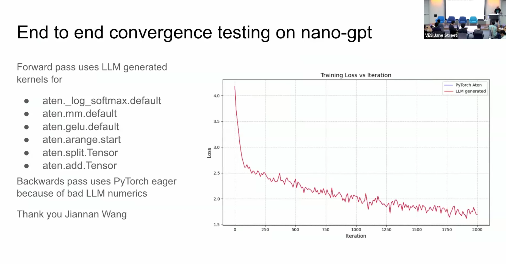

이것은 nano-gpt에서 수행한 end-to-end convergence test다. Forward propagation은 LLM-generated kernel을 사용하며 여러 attention 관련 operator가 포함된다. Backward propagation은 여전히 PyTorch eager를 사용한다. LLM-generated kernel에는 numerical precision 문제가 있기 때문이다. 오른쪽 training curve는 PyTorch native implementation(파란색)과 LLM-generated version(빨간색)이 거의 겹친다는 것을 보여준다. 이는 forward pass에서 LLM-generated kernel을 사용하는 것이 reliable하며, training이 정상적으로 converge할 수 있음을 뜻한다. Jiannan Wang의 기여에 감사한다고 한다.

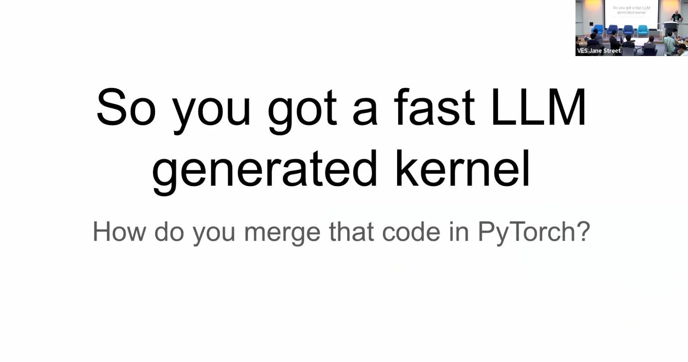

이 페이지는 매우 현실적인 질문을 던진다. 정말로 빠르고 좋은 LLM-generated kernel을 만들었다고 하자. 그다음은 무엇인가? 어떻게 PyTorch에 merge해서 모두가 사용할 수 있게 할 것인가? 이는 작은 문제가 아니다. Code generation은 첫 단계일 뿐이며, production environment에 실제로 통합하려면 engineering challenge가 많이 남아 있기 때문이다.

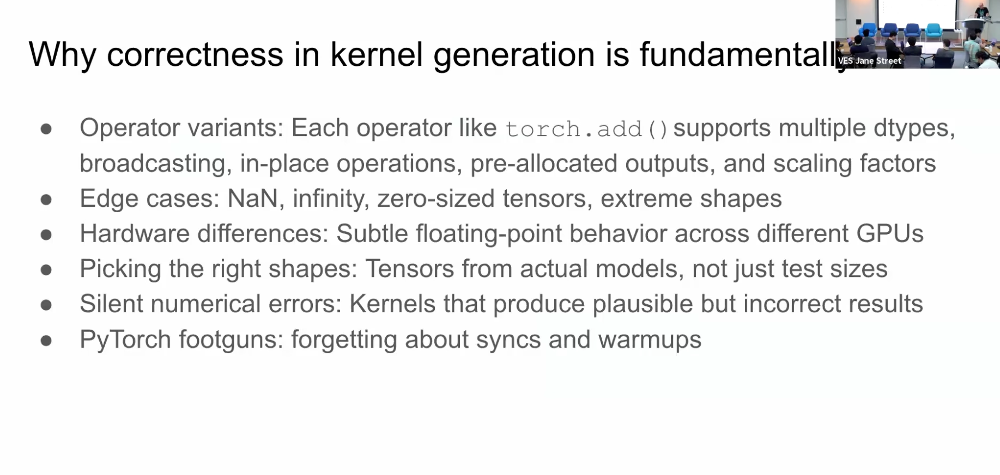

이 페이지는 kernel generation에서 correctness가 왜 중요한지 나열한다. 주요 challenge는 다음과 같다. 첫째, operator variant가 많다. 예를 들어 `torch.add()`는 여러 dtype, broadcasting, in-place operation 등을 지원해야 한다. 둘째, NaN, infinity, zero-size tensor, extreme shape 같은 다양한 boundary case를 처리해야 한다. 셋째, GPU마다 floating-point behavior에 미묘한 차이가 있다. 넷째, 실제 model의 tensor shape로 test해야 하며, fixed test size에만 의존해서는 안 된다. 다섯째, silent numerical error가 가장 발견하기 어렵다. 겉보기 결과는 정상이어도 실제로는 틀렸을 수 있다. 여섯째, PyTorch에서는 필요한 sync와 warmup을 빠뜨리기 쉽다. 모두 특별히 주의해야 할 문제다.

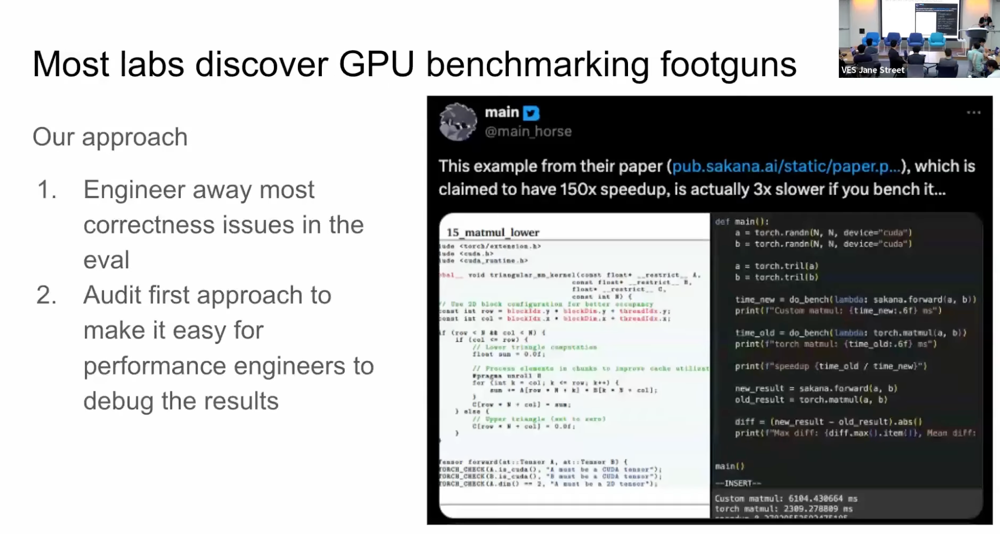

이 그림은 대부분의 lab이 GPU benchmarking에서 겪는 흔한 문제를 논의한다. 대응 strategy는 두 단계다. 첫째, evaluation 단계에서 engineering 방식으로 대부분의 correctness issue를 해결한다. 둘째, audit-first method를 사용해 performance engineer가 result를 debug하기 쉽게 만든다. 오른쪽에는 다시 그 classic case가 나온다. 150x acceleration을 주장했지만 실제로는 3배 느렸던 사례다. Benchmark에는 rigorous methodology가 필요하다는 점을 보여준다.

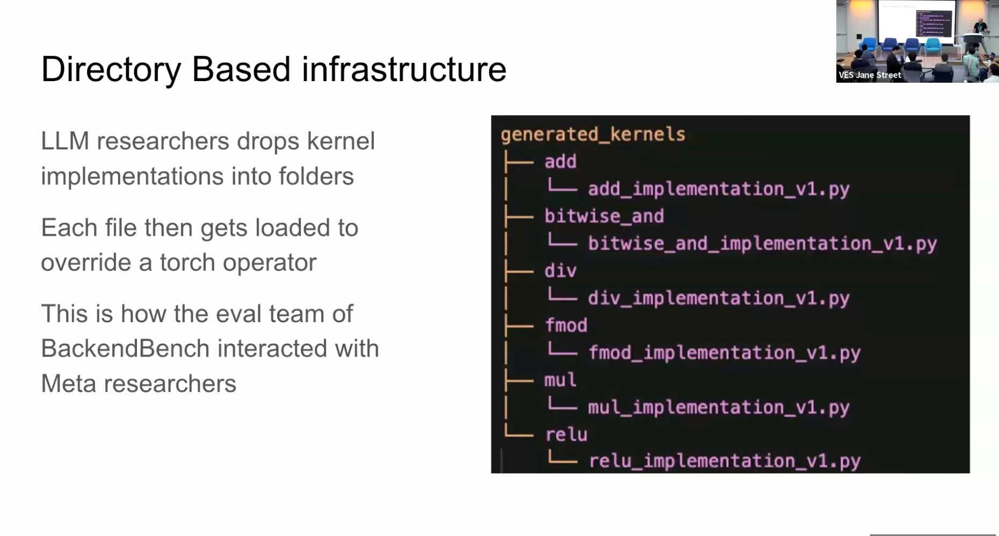

이 그림은 BackendBench의 basic architecture design을 보여준다. Workflow는 간단하고 명확하다. LLM researcher가 generated kernel implementation을 대응하는 folder에 넣고, 각 file은 load되어 PyTorch operator를 override하는 데 사용된다. 오른쪽은 directory structure를 보여준다. `generated_kernels` 아래에 `add`, `bitwise_and`, `div`, `fmod`, `mul`, `relu` 등 operator별로 분류되어 있고, 각 folder에는 concrete implementation이 들어 있다. 이런 organization은 BackendBench evaluation team과 Meta researcher가 협업하기 쉽게 하며, 서로 다른 version의 implementation을 관리하기도 편하게 한다.

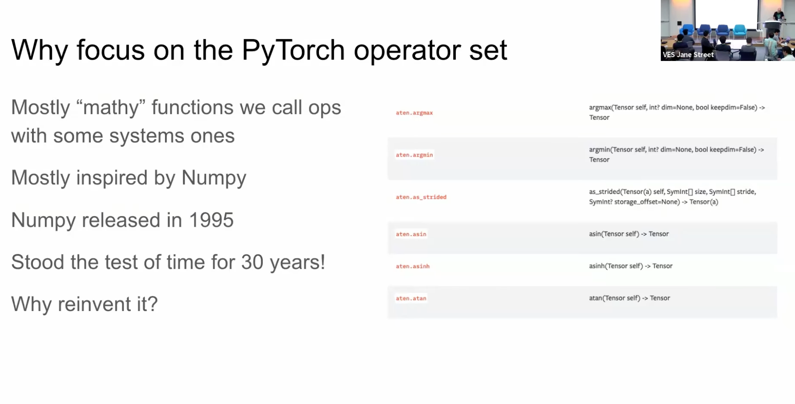

이 그림은 왜 PyTorch operator set에 집중하는지 설명한다. 주요 이유는 이 operator 대부분이 mathematical function이고, 일부 system-related operator도 포함하며, 기본적으로 NumPy에서 영감을 받았기 때문이다. NumPy는 1995년 발표 이후 30년의 역사를 가지며 충분히 검증되었다. 이 API set이 이미 매우 mature하므로 다시 설계할 필요가 없고, 이 기반 위에서 kernel optimization을 수행하면 된다. 오른쪽에는 `argmax`, `argmin`, `asin`, `asinh`, `atan` 같은 typical operator가 나열되어 있다.

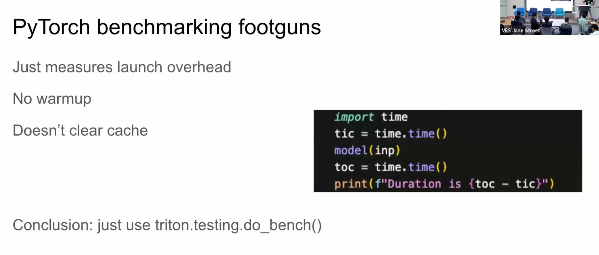

이 그림은 PyTorch benchmarking에서 흔히 하는 실수를 나열한다. 세 가지 typical issue가 있다. 첫째, launch overhead만 측정하고 실제 compute time을 test하지 않는다. 둘째, warmup이 없다. 첫 실행은 보통 느리다. 셋째, cache를 clear하지 않아 후속 test result가 왜곡된다. 오른쪽 code는 typical bad example로, `time.time()`을 직접 사용해 측정한다. 이렇게 얻은 data는 reference value가 제한적이다. `triton.testing.do_bench()`를 직접 사용하는 것이 권장된다. 이 함수는 이미 이런 detail을 처리해 둔 상태다.

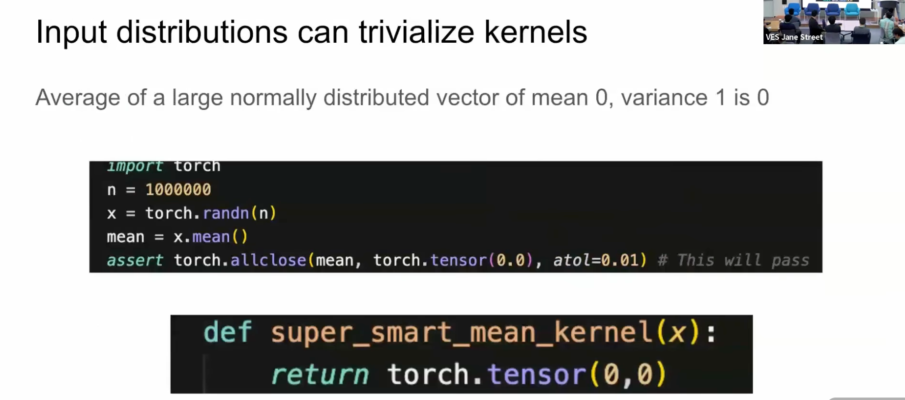

이 그림은 매우 시사적인 예를 보여준다. 부적절한 input distribution은 kernel test의 의미를 잃게 만든다. 원리는 단순하다. 큰 normal distribution vector(mean 0, variance 1)의 average는 0이다. 따라서 위의 test code는 1,000,000개의 random number를 생성하고 mean을 계산한 뒤 0에 가깝다고 assert하므로 반드시 통과한다. 아래의 "super smart mean kernel"은 직접 `tensor(0,0)`을 반환해도 test를 통과한다. 이 예제는 test data distribution이 지나치게 idealized되어 있으면 잘못된 implementation도 test를 통과할 수 있음을 보여준다. 실제 model data로 test해야 하는 이유가 바로 이것이다.

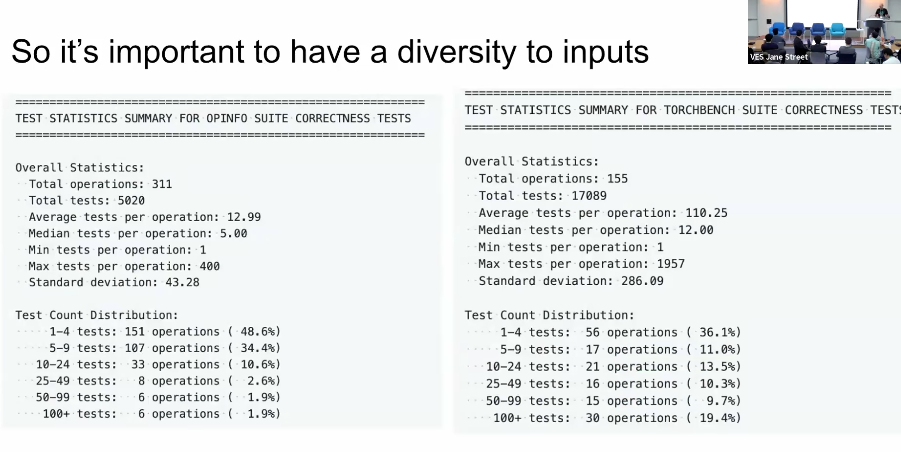

이 그림은 input diversity의 중요성을 강조하며 두 test suite를 비교한다. 왼쪽은 OpInfo Suite다. 311개 operation, 5020개 test, operation당 평균 13개 test다. 오른쪽은 TorchBench Suite다. 155개 operation, 17089개 test, operation당 평균 110개 test다. Test count distribution을 보면 TorchBench에서는 operation의 19.4%가 100개 이상의 test case를 가지지만, OpInfo는 1.9%뿐이다. 이 차이는 실제 model(TorchBench)의 tensor shape와 data distribution이 unit test(OpInfo)보다 훨씬 복잡하다는 것을 뜻한다. 따라서 OpInfo test만으로는 충분하지 않고, 실제 workload로 validation해야 한다.

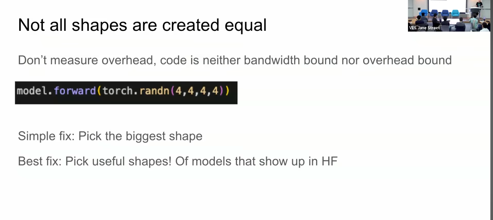

이 그림은 "모든 shape가 동등하게 태어난 것은 아니다"라고 말한다. Benchmark할 때 overhead만 측정해서는 안 된다. 어떤 code는 bandwidth-bound도 아니고 overhead-bound도 아니기 때문이다. 예를 들어 `torch.randn(4,4,4,4)` 같은 작은 shape로 test하면 performance difference를 전혀 볼 수 없다. 단순한 방법은 가장 큰 shape를 선택해 test하는 것이다. 하지만 가장 좋은 방법은 Hugging Face의 실제 model에서 나타나는 유용한 shape를 선택하는 것이다. 그래야 측정된 data가 실제 reference value를 갖는다.

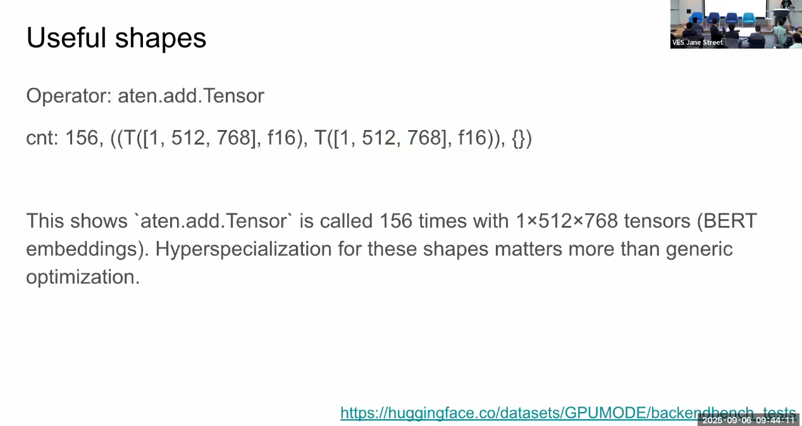

이 그림은 "useful shape"가 무엇인지 구체적인 예로 보여준다. `aten.add.Tensor`를 예로 들면, 통계상 이 operator는 156번 호출되었고 input은 1x512x768 tensor(f16 format, BERT의 embedding size)였다. 핵심은 이런 high-frequency specific shape에 대해 hyperspecialization optimization을 수행하는 것이 generic optimization보다 훨씬 효과적이라는 점이다. 아래에는 Hugging Face dataset link도 있으며, 다양한 model의 실제 shape distribution을 수집한 것이다.

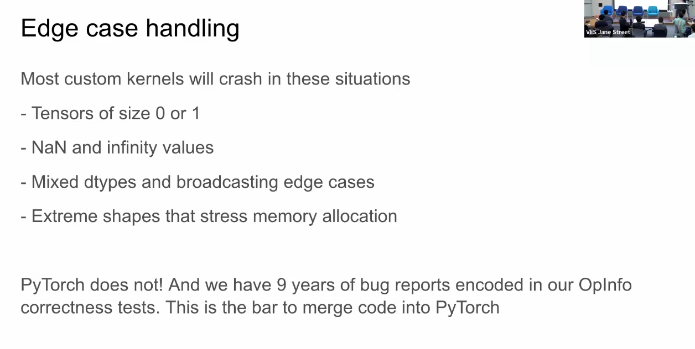

이 그림은 boundary case handling을 말한다. 대부분의 custom kernel은 size가 0 또는 1인 tensor, NaN과 infinity, mixed dtype과 broadcasting의 boundary case, extreme shape로 인한 memory allocation issue 같은 상황에서 crash한다. 핵심은 PyTorch 자체는 이런 상황을 처리할 수 있다는 것이다. 그리고 OpInfo test suite에는 9년간의 bug report가 encoded되어 있으며, 다양한 특이 boundary case를 포괄한다. 이것이 code가 PyTorch에 merge될 수 있는 기준이다. Kernel은 PyTorch native implementation만큼 robust해야 한다.

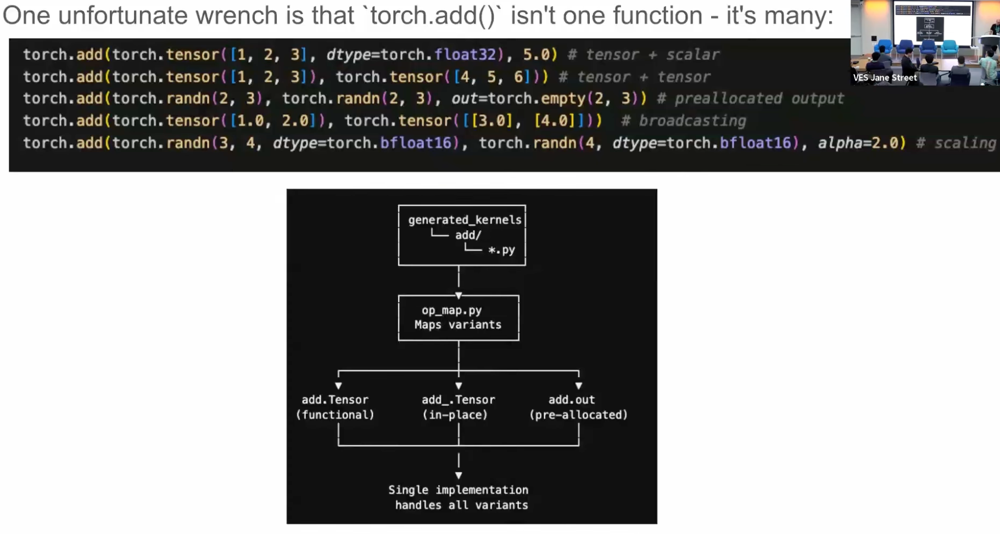

이 그림은 안타까운 현실을 보여준다. `torch.add()`는 하나의 function이 아니라 function 묶음이다. 위에는 tensor+scalar, tensor+tensor, pre-allocated output, broadcasting, scaling(alpha parameter) 같은 여러 예가 나열되어 있다. 아래 flow chart는 더 명확하다. `generated_kernels/add/` directory에 kernel을 작성한 뒤, `op_map.py`를 통해 이 variant들을 concrete implementation에 mapping한다. 최종적으로 `add.Tensor`(functional), `add_.Tensor`(in-place), `add.out`(pre-allocated) 세 variant가 모두 같은 implementation을 가리킨다. 하나의 kernel이 이 모든 variant를 처리해야 하므로 난이도를 짐작할 수 있다.

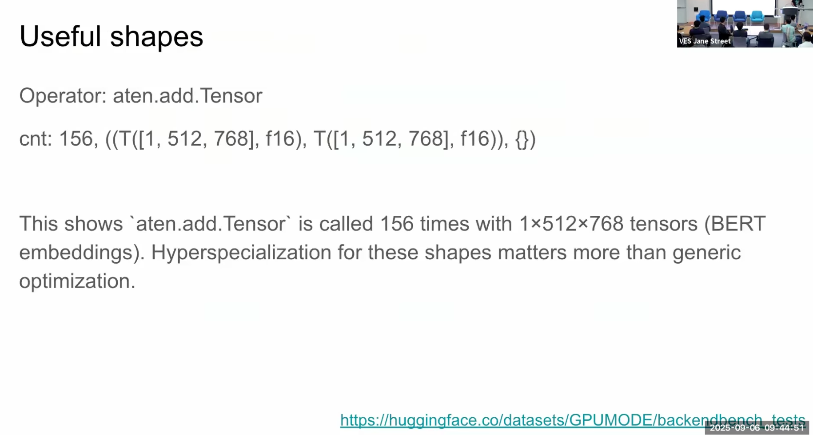

이 그림은 앞 그림과 내용이 같으며 "useful shape" 개념을 다시 강조한다. 실제 model에서 high-frequency로 나타나는 specific shape, 예를 들어 BERT의 1x512x768 embedding에 대해 optimization하는 것이 중요하다는 점을 재차 말한다.

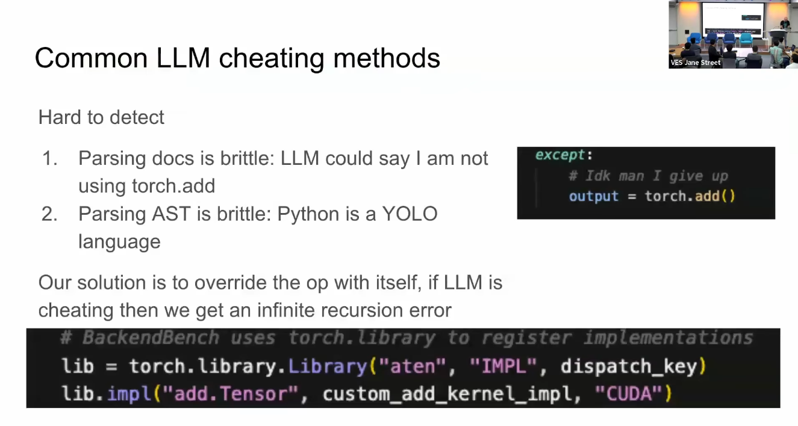

이 그림은 LLM이 흔히 쓰는 cheating trick을 드러내며, 이것이 탐지하기 어렵다고 말한다. 첫 번째 방법은 document parsing이 fragile하다는 점을 이용하는 것이다. LLM은 "나는 `torch.add`를 쓰지 않았다"고 말할 수 있지만, 오른쪽 code block은 `except` 뒤에 실제로 `torch.add()` call이 있음을 보여준다. 두 번째 방법은 AST parsing도 fragile하다는 점이다. Python이 dynamic language이기 때문이다. 해결책은 영리하다. Operator 자체로 자기 자신을 override한다. LLM이 cheating하고 implementation 안에서 직접 `torch.add`를 호출하면 infinite recursion error가 발생한다. 아래 code는 BackendBench가 `torch.library`로 implementation을 등록하고 custom kernel을 `add.Tensor`의 CUDA implementation으로 등록하는 방식을 보여준다.

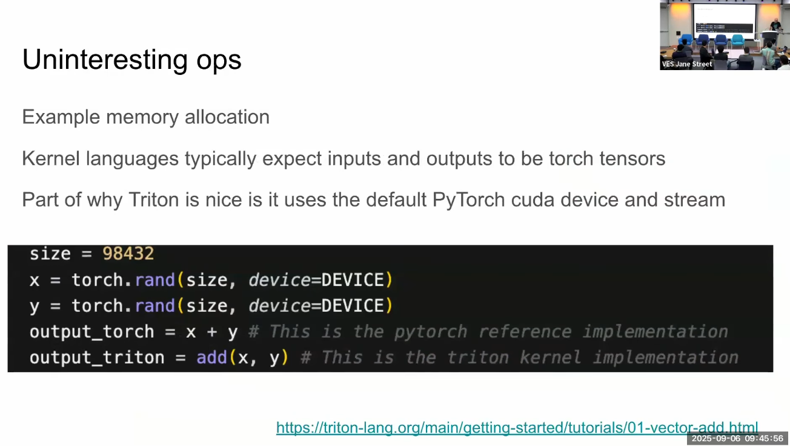

이 그림은 "boring operator"를 설명하며 memory allocation을 예로 든다. Kernel language, 예를 들어 Triton은 보통 input과 output이 모두 torch tensor이기를 기대한다. Triton이 편리한 이유 중 하나는 PyTorch default CUDA device와 stream을 자동으로 사용한다는 점이다. Code example은 먼저 random tensor `x`와 `y`를 만들고, `output_torch`는 PyTorch reference implementation(`x+y`)을 사용하며, `output_triton`은 Triton kernel implementation `add(x,y)`를 사용한다. 이런 operator 자체는 기술적으로 대단한 내용이 있는 것은 아니고, 주로 memory management detail을 처리하는 문제다.

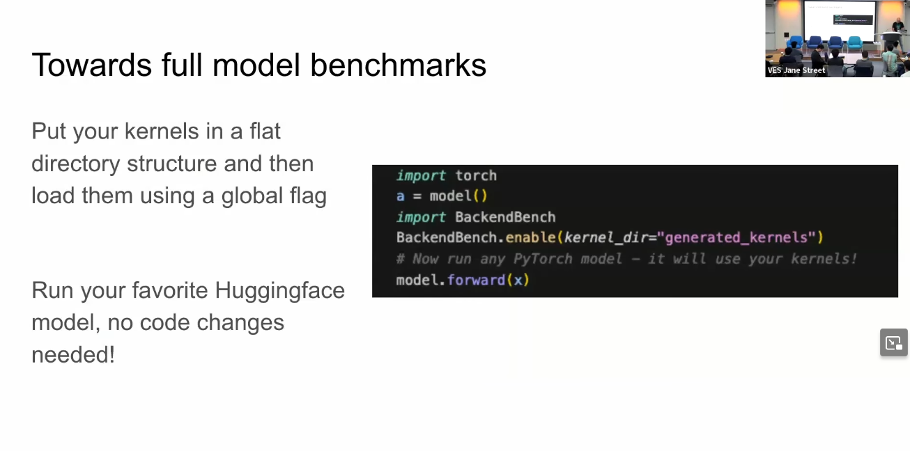

이 그림은 complete model benchmark를 수행하는 방법을 보여준다. 과정은 매우 간단하다. Kernel을 flat directory structure에 넣고 global flag로 load한다. 오른쪽 code는 구체적인 단계를 보여준다. `torch`와 model을 import한 뒤 `BackendBench`를 import하고, `BackendBench.enable(kernel_dir="generated_kernels")`를 호출한 다음, 그대로 `model.forward(x)`를 실행하면 된다. Hugging Face model은 code modification이 필요 없고, BackendBench가 자동으로 operator를 custom kernel로 replace한다. 이런 design은 매우 편리하다.

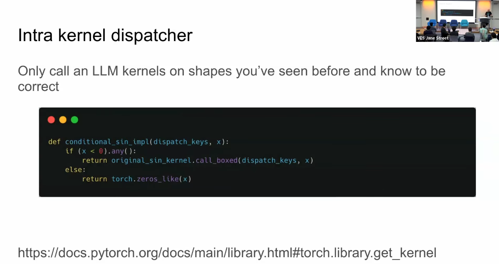

이 그림은 intra-kernel dispatcher 개념을 소개한다. 핵심 아이디어는 자신이 본 적 있고 correct하다는 것을 아는 shape에서만 LLM-generated kernel을 호출하는 것이다. Code example은 `conditional_sin_impl` function을 보여준다. 먼저 `x`의 shape가 0보다 작은지 또는 `any()`인지 같은 조건을 확인하고, 만족하지 않으면 original sin kernel(`call_boxed`)을 호출한다. 그렇지 않으면 fallback으로 `torch.zeros_like(x)`를 반환한다. 이는 conservative하지만 safe한 strategy다. 확신이 없는 경우 PyTorch native implementation으로 fallback한다.

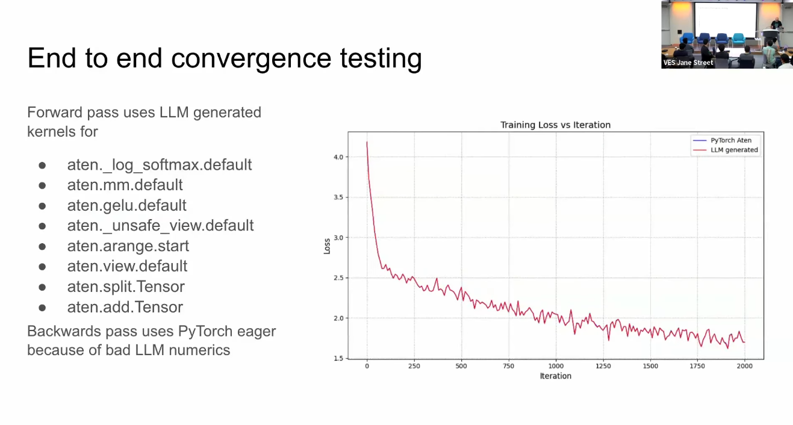

이 그림은 end-to-end convergence test의 상세 버전이다. Forward pass에 사용되는 LLM-generated kernel list를 나열한다. 여기에는 `log_softmax`, `matmul`, `gelu`, `unsafe_view`, `arange`, `view`, `split`, `add` 같은 operator가 포함된다. Training curve는 forward에 LLM kernel을 사용하고 backward에 PyTorch eager를 사용하는 조합이 정상적으로 converge할 수 있음을 보여준다.

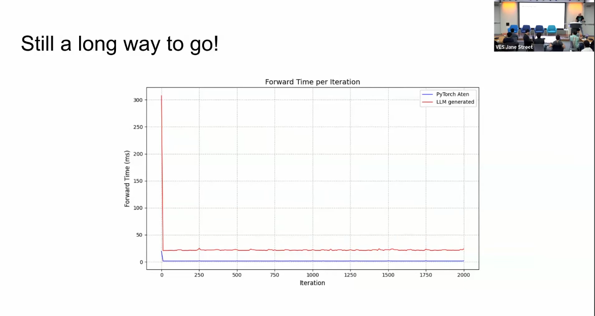

이 그림 제목은 매우 직설적이다. "갈 길이 멀다!"는 내용이다. Forward time comparison에서 PyTorch Aten(파란색)은 iteration당 약 10ms로 안정적이지만, LLM-generated kernel(빨간색)은 약 25ms가 걸려 두 배 이상 느리다. 올바르게 converge하긴 했지만 performance는 아직 많이 부족하다. 이는 또 하나의 현실을 보여준다. Correctness는 상대적으로 해결하기 쉽지만, handwritten optimized kernel의 performance에 도달하거나 능가하려면 LLM에게 아직 갈 길이 멀다.

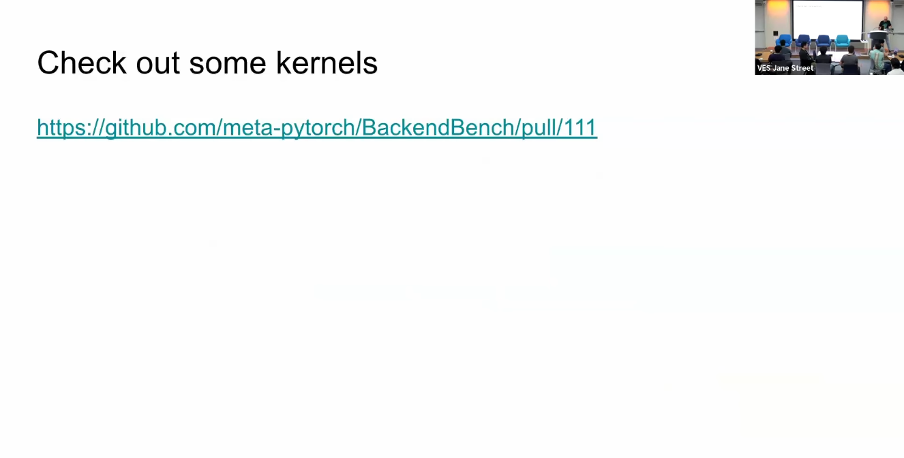

이 페이지는 매우 간결하다. "이 kernel들을 보러 가라!"는 한 문장이다. GitHub PR link가 제공되며, 그 안에는 84개의 LLM-generated kernel implementation이 있다. 관심이 있다면 가서 살펴볼 수 있다.

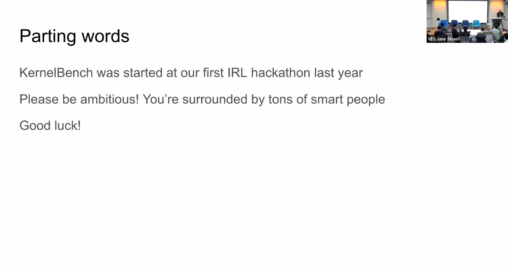

이것은 강의의 closing remark다. KernelBench, 즉 BackendBench의 전신은 작년 첫 번째 IRL hackathon에서 시작되었다. 작성자는 모두에게 ambition을 가지라고 격려하고, 주변에 훌륭한 사람이 많다는 점을 강조한다. 긍정적인 결말이며, 모두에게 행운을 빈다.

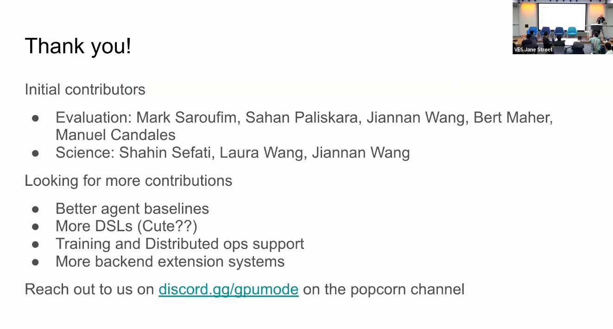

마지막은 acknowledgement page다. Initial contributors는 두 범주로 나뉜다. Evaluation 측면에는 Mark Saroufim, Sahan Paliskara, Jiannan Wang, Bert Maher, Manuel Candales가 포함된다. Research 측면에는 Shahin Sefati, Laura Wang, Jiannan Wang이 포함된다. 페이지는 더 많은 contribution을 기대하는 방향도 나열한다. 더 나은 agent baselines, 더 많은 DSL support(Cute 포함), training 및 distributed operator support, 더 많은 backend extension system이다. 마지막으로 Discord contact(popcorn channel)가 제공된다. 이 프로젝트는 여전히 활발히 발전 중이며, 관심 있는 개발자의 참여를 환영한다.
