# Lecture 77: Domain Specific Languages for GPU Kernels

> 내 강의 노트다. 관심이 있다면 https://github.com/BBuf/how-to-optim-algorithm-in-cuda/tree/master/cuda-mode 를 팔로우해도 좋다.

> 이 강의에서 Cute-DSL 관련 코드는 https://github.com/Dao-AILab/quack 에서 찾을 수 있다. 이 강의는 Tri Dao가 GPU kernel 개발을 위한 DSL ecosystem을 소개한 것이다. PyTorch, Triton, Cute-DSL까지 서로 다른 abstraction level의 성능과 개발 효율 trade-off를 보여주며, Softmax, GEMM, Attention을 통해 각 DSL의 성능, 제어 가능한 hardware hierarchy, 개발 난이도를 보여준다. 출처: https://www.youtube.com/watch?v=5qSN-R_E3w0

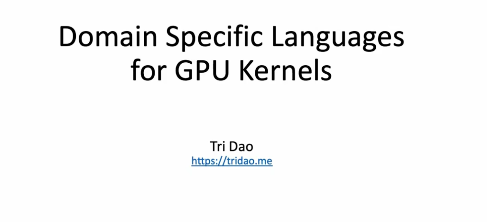

여기서 Tri Dao는 GPU kernels를 위한 domain-specific languages를 소개한다.

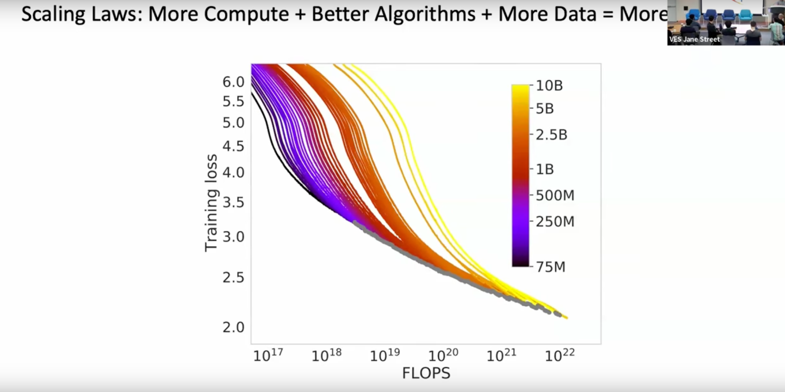

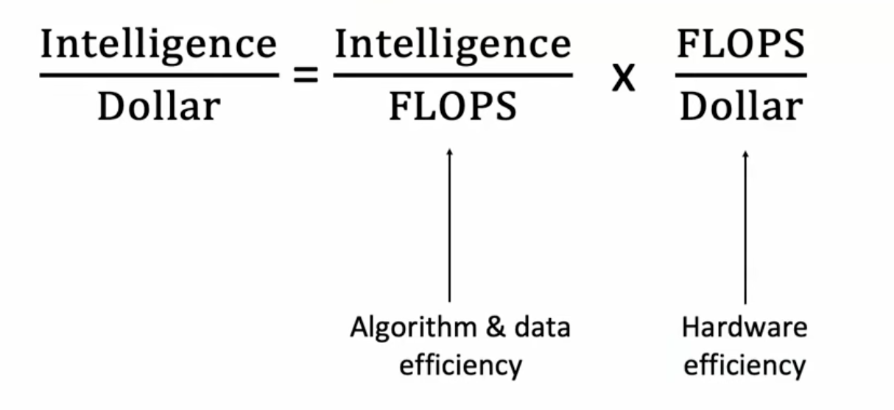

Tri Dao는 compute efficiency를 평가하는 공식을 제시한다. `Intelligence/Dollar = (Intelligence/FLOPS) × (FLOPS/Dollar)`이다. 이 공식은 AI cost-effectiveness를 두 부분으로 나눈다. algorithm efficiency(Intelligence/FLOPS)와 hardware efficiency(FLOPS/Dollar)다.

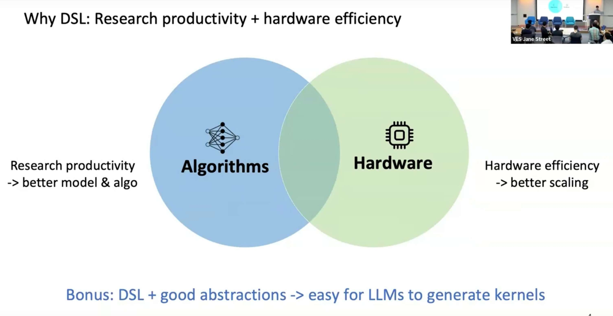

왜 DSL이 필요한가? 이 그림은 Venn diagram으로 이유를 설명한다. Algorithm research는 더 나은 model을 추구하고, hardware optimization은 더 나은 scalability를 추구한다. DSL은 두 영역의 교집합에 놓여 있어 research productivity를 보장하면서도 hardware를 충분히 활용할 수 있다. 또 하나의 bonus는 DSL과 좋은 abstraction이 있으면 LLM이 효율적인 GPU kernels를 더 쉽게 생성할 수 있다는 점이다.

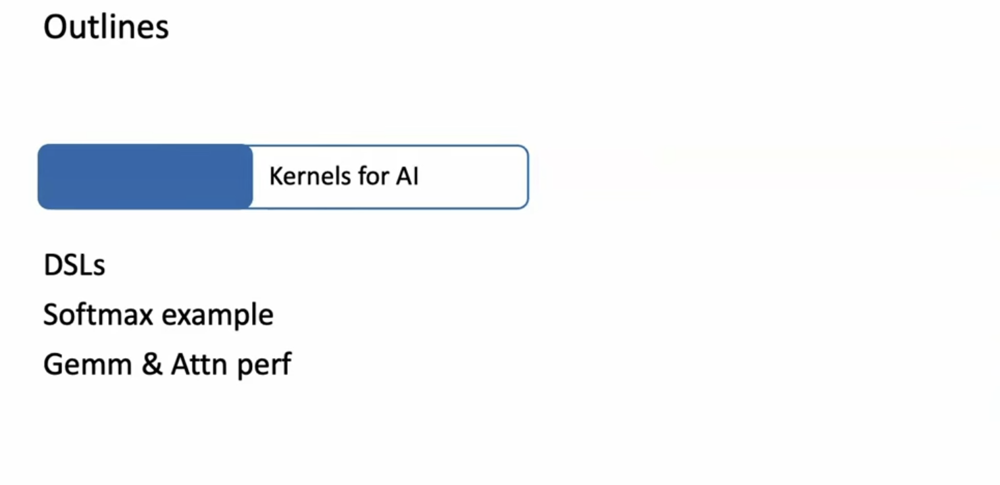

일련의 DSL과, 그 DSL을 기반으로 개발한 softmax, GEMM, attention의 performance result를 논의한다.

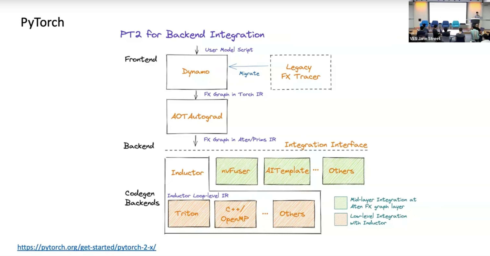

먼저 나는 PyTorch가 첫 번째 DSL이라고 생각한다. PyTorch로 program을 작성하면 code는 GPU에서 실행되는 일련의 kernels가 된다. 그리고 PyTorch 2.x는 Dynamo를 사용해 program을 capture하고, Triton을 통해 compile 및 execute할 수 있다.

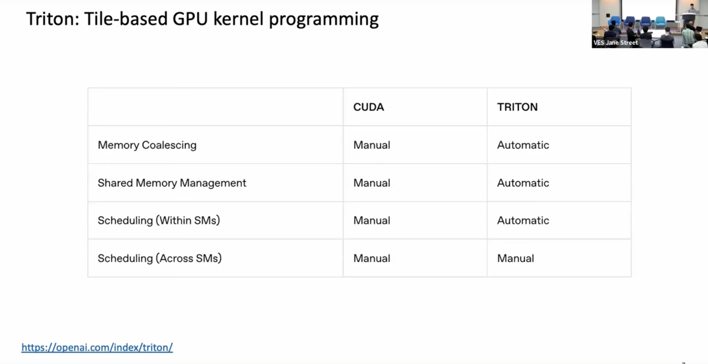

두 번째 DSL은 Triton이다. 비교 표는 Triton이 CUDA에 비해 가지는 장점을 보여준다. Memory coalescing, shared memory management, intra-SM scheduling 세 측면에서 CUDA는 manual optimization이 필요하지만 Triton은 자동으로 처리할 수 있다. Cross-SM scheduling만 두 쪽 모두 manual management가 필요하다. Triton의 tile-based programming model은 개발자가 algorithm logic에 집중하게 하고 low-level optimization detail을 덜 신경 쓰게 한다.

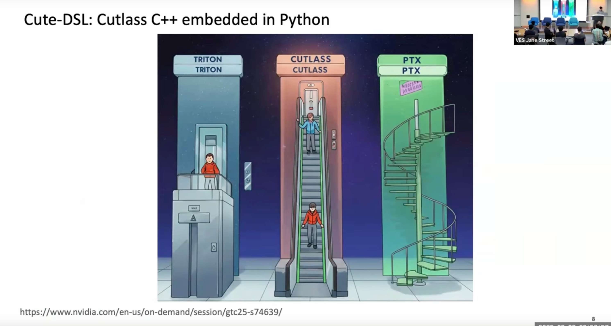

세 번째 DSL은 Cute-DSL이며, Cutlass C++를 Python에 embed한 것이다. Elevator 비유로 말하면 Triton은 직행 엘리베이터(high-level abstraction), Cutlass는 escalator(fine-grained control), PTX는 spiral staircase(low-level details)와 같다. Cute-DSL은 Cutlass의 high performance와 Python의 ease of use를 결합한다.

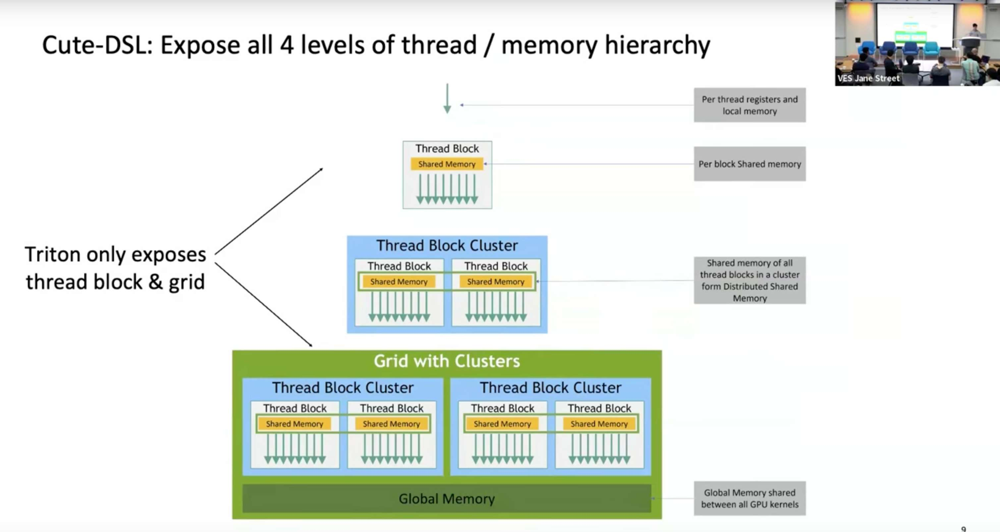

Cute-DSL이 Triton에 비해 가지는 중요한 장점은 GPU의 완전한 네 단계 thread/memory hierarchy를 노출할 수 있다는 것이다. 위에서 아래로 thread register와 local memory, block shared memory, cluster distributed shared memory, global memory가 있다. Triton은 thread block과 grid 두 계층만 노출할 수 있어 hardware control capability가 제한된다. Cute-DSL은 완전한 hierarchy를 노출하여 더 fine-grained memory management와 thread coordination을 제공한다.

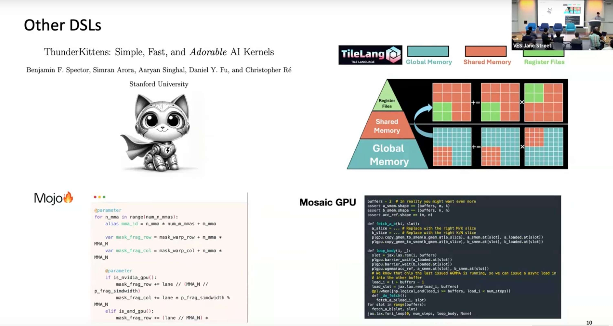

그 밖에 주목할 만한 DSL 도구도 있다. ThunderKittens는 Stanford에서 개발한 단순하고 빠른 AI kernel framework다. TileLang은 tile 기반 GPU programming abstraction이다. Mojo는 Python의 ease of use와 system-level performance를 결합한다. Mosaic GPU는 또 다른 GPU programming abstraction이다.

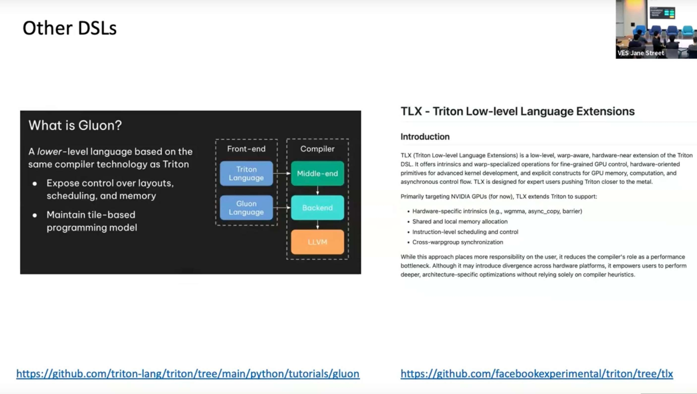

두 Triton extension project도 있다. Gluon은 Triton compiler technology를 기반으로 한 더 low-level language이며, layout, scheduling, memory에 대한 fine-grained control을 노출한다. TLX는 low-level, warp-aware Triton extension이며, wgmma, async_copy, barrier 같은 hardware-specific builtins를 제공한다. 두 프로젝트 모두 expert user에게 hardware에 더 가까운 control capability를 제공한다.

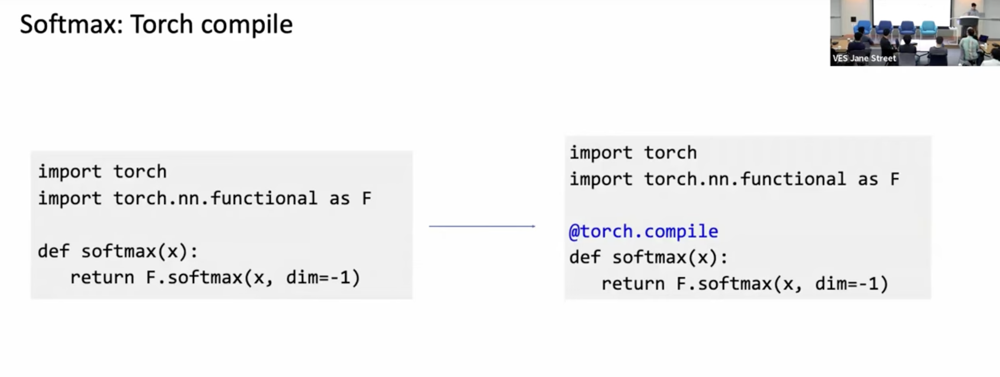

여기서는 Softmax 예제를 선택해 서로 다른 DSL의 implementation을 살펴본다. 먼저 Torch Compile이다.

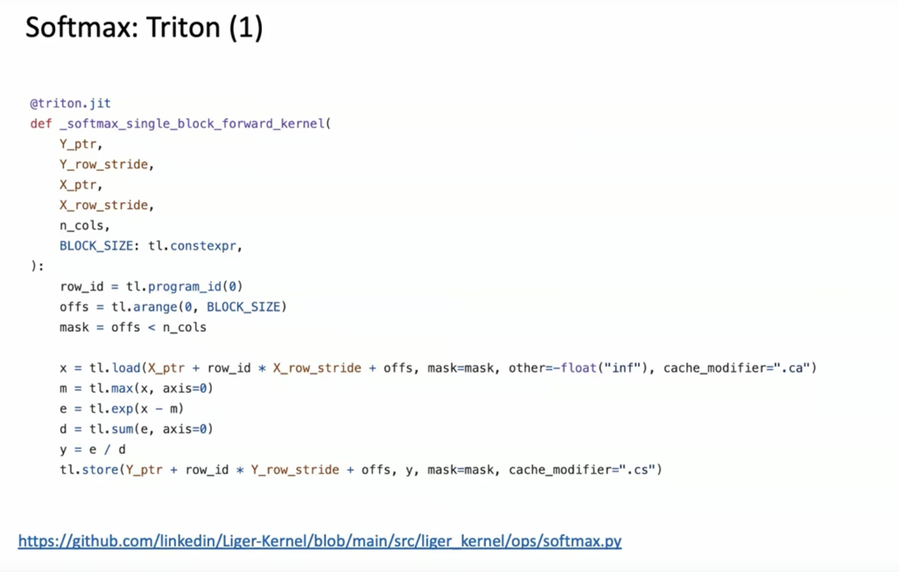

Liger Kernel의 SoftMax Triton implementation이다. 코드는 간결하다. `@triton.jit` decorator를 사용하며, 핵심 logic은 row ID와 offset 얻기, data load 및 boundary 처리, maximum 계산(numerical stability), exp와 normalization 계산, output result 저장으로 이어진다.

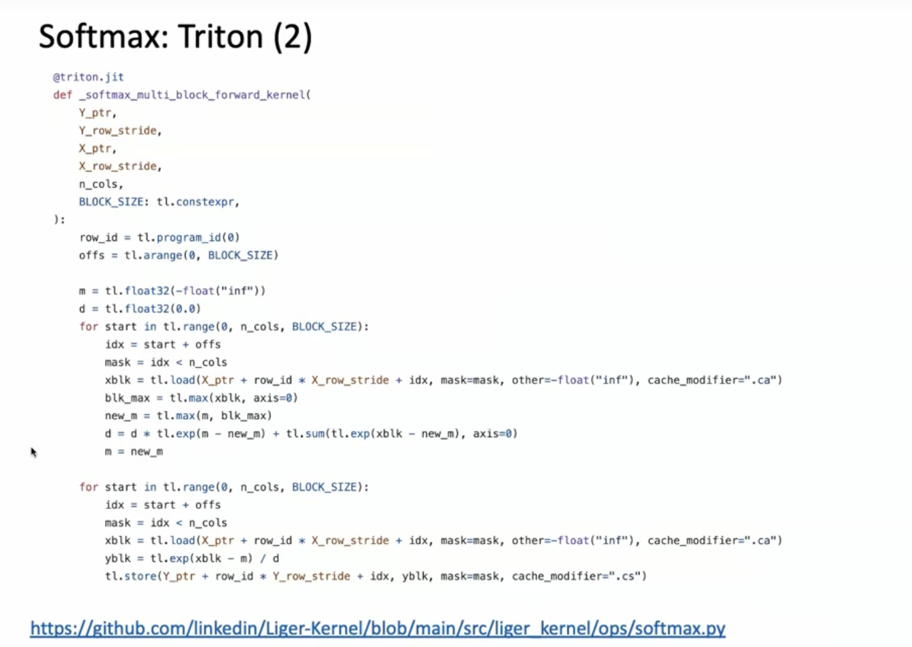

Triton Softmax의 multi-block implementation이다. Block strategy를 사용해 더 긴 sequence를 처리한다. 주요 loop는 두 개다. 첫 번째는 global maximum과 accumulated exponential sum을 계산한다. 이때 online algorithm으로 statistics를 update한다. 두 번째는 global statistics를 기반으로 final softmax output을 계산한다. 이런 구현은 single block capability를 넘는 large-scale data를 처리할 수 있다.

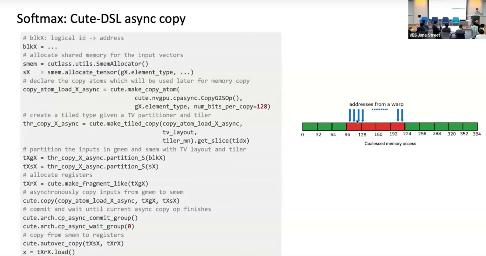

Cute-DSL은 Softmax에서 async copy optimization을 사용한다. Triton보다 더 fine-grained hardware control이 가능하다. Shared memory를 할당하고, asynchronous copy atom operation을 만들며(CopyG2SOp 같은 hardware instruction 지원), asynchronous data transfer를 수행하고, commit과 synchronization을 관리한다. 오른쪽 그림은 coalesced memory access optimization을 보여준다. Compute와 memory transfer overlap을 구현해 kernel performance를 높인다.

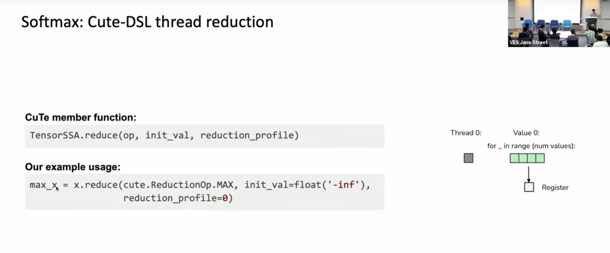

Cute-DSL의 thread reduction implementation이다. CuTe의 `TensorSSA.reduce(op, init_val, reduction_profile)` interface를 사용한다. 예시는 `max_X = X.reduce(cute.ReductionOp.MAX, init_val=float('-inf'), reduction_profile=0)`이다. 오른쪽 그림은 Thread 0이 일련의 값을 처리하고 reduction operation을 통해 단일 register로 합치는 과정을 보여준다.

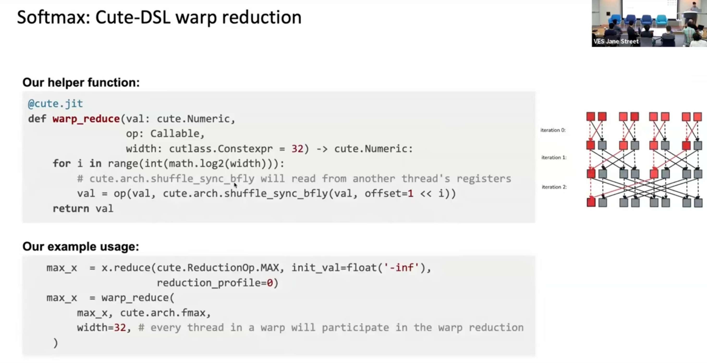

Cute-DSL의 warp reduction implementation이다. Custom `warp_reduce` function은 `@cute.jit` decorator를 사용하며, loop와 `cute.arch.shuffle_sync_bfly` instruction으로 butterfly pattern의 warp-level reduction을 수행한다. 오른쪽 그림은 butterfly reduction 과정을 보여준다. 32개 thread가 여러 round의 shuffle operation을 통해 점진적으로 하나의 result로 reduce된다. GPU의 warp synchronization primitive를 충분히 활용해 efficient multi-level reduction을 구현한다.

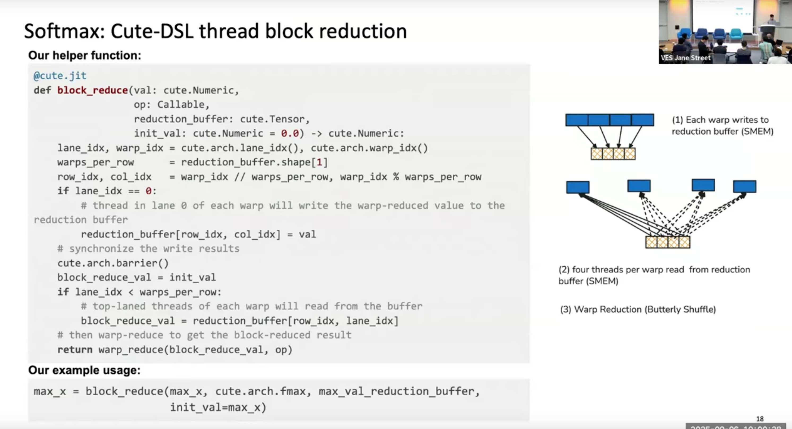

Cute-DSL의 thread block reduction implementation이다. `block_reduce` function은 여러 단계의 reduction을 구현한다. (1) 각 warp의 lane 0이 warp reduction result를 shared memory buffer에 쓴다. (2) 모든 write operation이 완료될 때까지 synchronize한다. (3) 일부 thread가 buffer에서 data를 읽어 추가 reduction을 수행한다. (4) `warp_reduce`를 호출해 final block-level reduction을 완료한다.

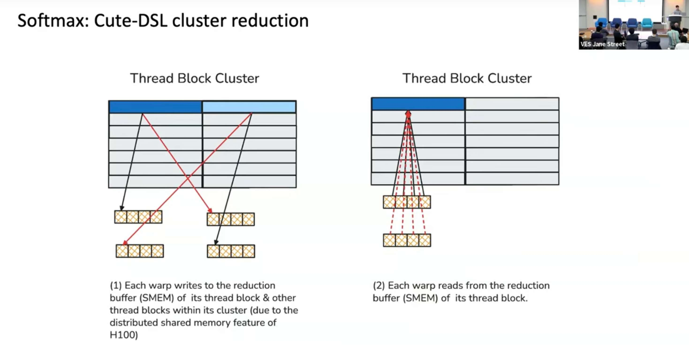

Cute-DSL의 cluster reduction, 즉 가장 높은 hierarchy의 reduction이다. 왼쪽 그림은 각 warp가 reduction result를 자기 block과 cluster 안의 다른 block의 reduction buffer에 쓰는 모습을 보여준다. 이는 H100의 distributed shared memory 덕분이다. 오른쪽 그림은 각 warp가 자기 block buffer에서 data를 읽어 final reduction을 수행하는 모습을 보여준다. 이 설계는 기존 GPU programming에서 thread block 사이에 직접 통신할 수 없다는 제한을 넘어선다.

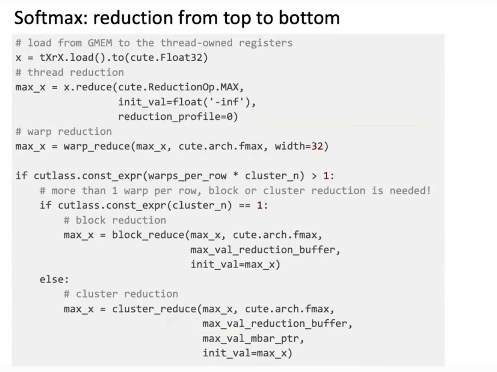

Cute-DSL Softmax의 완전한 reduction hierarchy다. Code flow는 data를 register로 load, thread reduction, warp reduction, conditional judgment(row마다 warp가 여러 개인 경우), cluster configuration에 따라 block reduction 또는 cluster reduction 선택으로 이어진다. 이런 adaptive design은 서로 다른 GPU configuration에 따라 optimal reduction strategy를 선택할 수 있다.

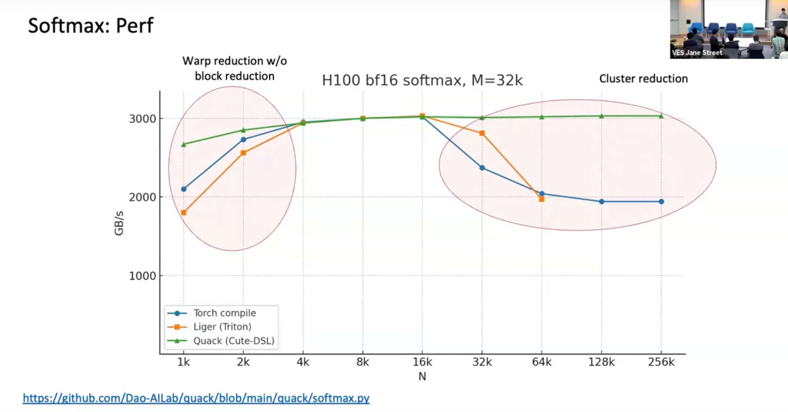

Softmax performance comparison이다. H100, bf16, M=32k 조건에서 Torch compile(파란색), Liger Triton(주황색), Quack Cute-DSL(초록색)을 비교한다. 작은 sequence length(1k-4k)에서는 성능이 비슷하지만, sequence가 길어지면 차이가 나타난다. 그림에는 두 핵심 구간인 Warp reduction w/o block reduction과 Cluster reduction이 표시되어 있다. Cute-DSL은 대부분의 경우 가장 좋은 성능을 보이며, 특히 긴 sequence scenario에서 안정적인 high performance를 유지한다.

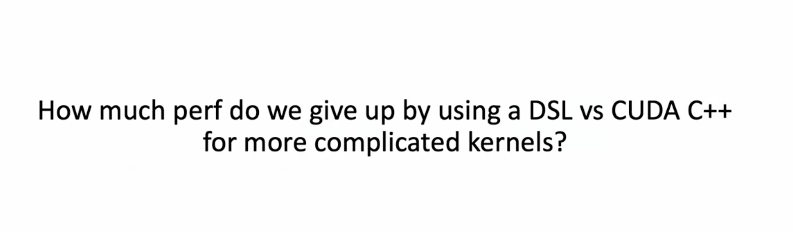

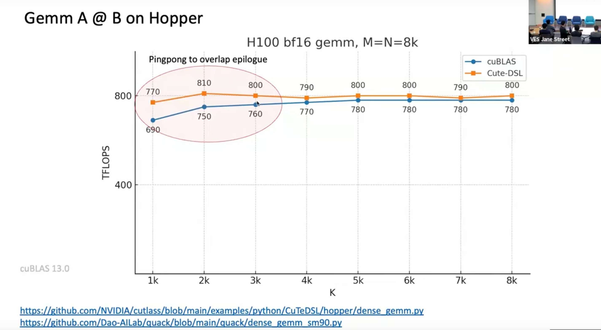

Hopper architecture GEMM A@B performance comparison이다. bf16, M=N=8k 조건에서 cuBLAS 13.0(파란색)과 Cute-DSL(주황색)을 비교한다. Cute-DSL은 모든 test point에서 cuBLAS보다 우수하다. 특히 K=2k-3k 구간(Pingpong to overlap epilogue)에서 Cute-DSL은 800 TFLOPS에 도달하지만 cuBLAS는 760 TFLOPS에 그친다. Cute-DSL은 전체 K range에서 안정적인 high performance를 유지하며, Hopper hardware 특성을 세밀하게 제어할 수 있음을 보여준다.

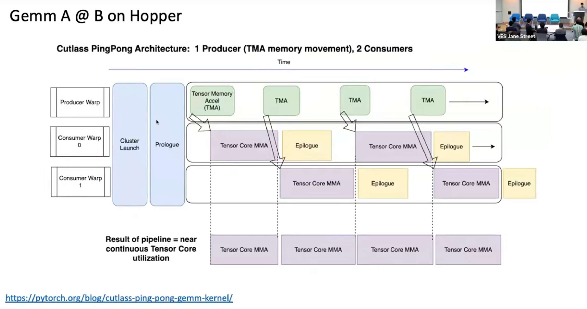

Ping-Pong Schedule 소개는 PyTorch blog https://pytorch.org/blog/cutlass-ping-pong-gemm-kernel/ 에서 볼 수 있다.

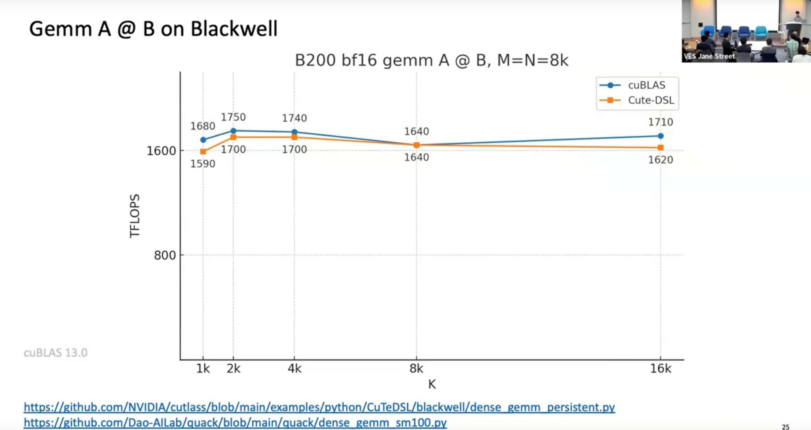

Blackwell에서는 cuBLAS의 성능이 현재 Cute-DSL 기반 implementation보다 더 좋다. 하지만 이 3% gap은 해결될 것으로 보인다.

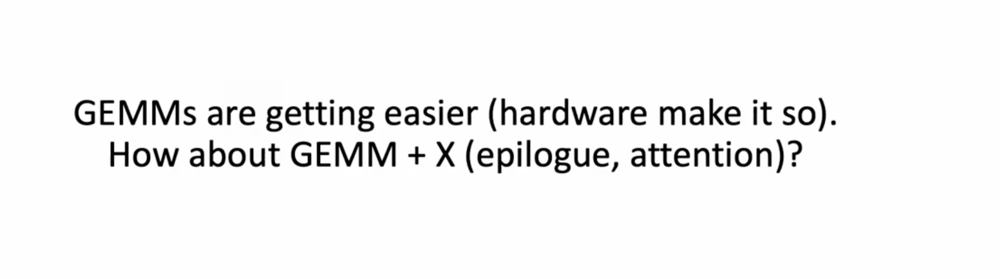

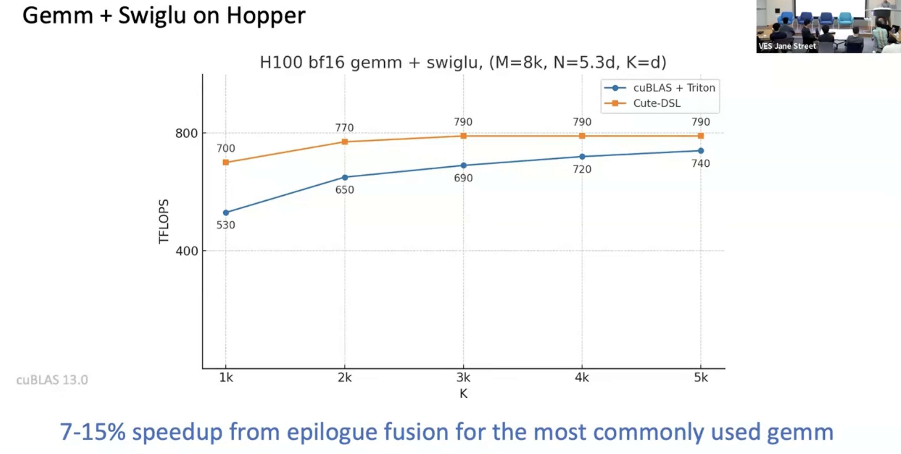

Hopper architecture GEMM + SwiGLU fusion operation performance comparison이다. bf16, M=8k, N=5.3d, K=d 조건에서 cuBLAS + Triton(파란색)과 Cute-DSL(주황색)을 비교한다. Cute-DSL은 모든 test point에서 combined solution보다 뚜렷하게 우수하다. Cute-DSL은 약 790 TFLOPS로 안정적이지만, cuBLAS + Triton은 530 TFLOPS에서 740 TFLOPS까지 올라가도 계속 더 낮다. Epilogue fusion technique을 통해 Cute-DSL은 일반적으로 쓰이는 GEMM operation에서 7-15% performance improvement를 달성한다.

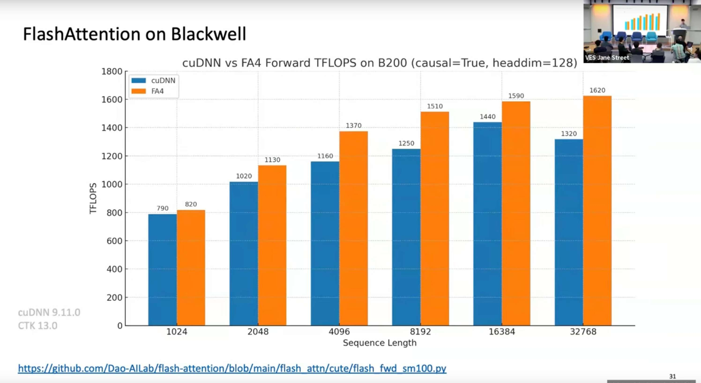

이 slide는 Cute-DSL 기반 FA4가 CUDNN implementation의 Flash Attention에 비해 가지는 장점을 보여준다.

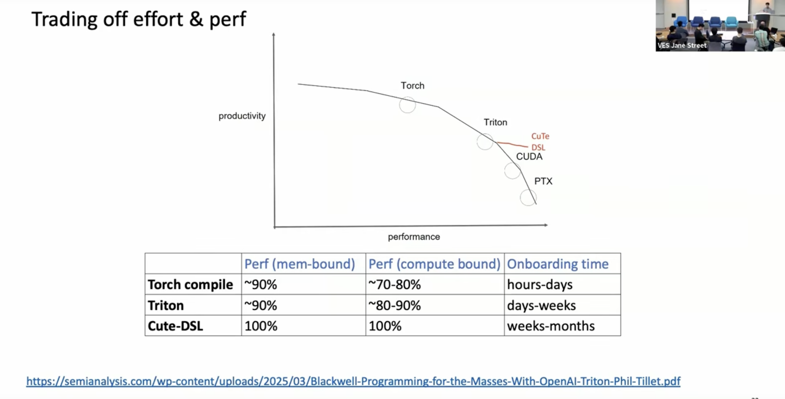

여기서는 여러 DSL의 위치를 정리한다. Torch는 productivity가 가장 높지만 performance가 상대적으로 낮은 위치에 있고, Triton은 중간에서 좋은 balance를 제공한다. Cute-DSL, CUDA, PTX는 high performance 영역에 있지만 더 많은 development effort가 필요하다. 아래 comparison table은 구체적인 quantitative data를 제공한다. Memory-bound scenario에서 Torch compile과 Triton은 약 90% performance에 도달할 수 있고, Cute-DSL은 100%에 도달할 수 있다. Compute-bound scenario에서 Torch compile은 약 70-80%, Triton은 80-90%, Cute-DSL은 여전히 100%다. Ramp-up time 측면에서 Torch compile은 몇 시간에서 며칠이면 되지만, Triton은 며칠에서 몇 주가 필요하고, Cute-DSL은 몇 주에서 몇 달이 필요하다.

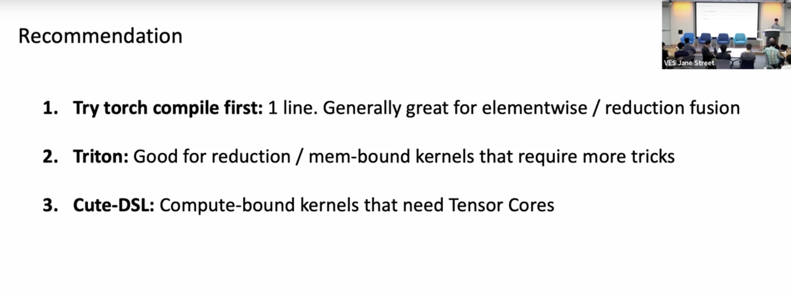

마지막으로 몇 가지 사용 제안을 제시한다.

SoftMax 관련 benchmark를 하나 보충한다. H200에서 test한 것이다.

```shell
softmax-bandwidth:
    token_num  hidden_size  HuggingFace  Torch Compile  FlashInfer        Quack
0       512.0       4096.0   498.372634      11.278891  404.543218   324.435651
1       512.0       8192.0   627.889810      22.135866  524.025960  1074.360676
2       512.0      16384.0  1044.398446      44.155216  572.679419  1409.376308
3       512.0      32768.0  1151.648537     889.566057  517.432039  1539.759166
4      1024.0       4096.0   667.882818     633.198054  518.071135  1081.006193
5      1024.0       8192.0   733.783037     812.534647  551.012070  1506.574707
6      1024.0      16384.0  1115.506385     918.997405  547.845344  1632.024895
7      1024.0      32768.0  1258.039589     957.603691  539.044331  1790.906990
8      2048.0       4096.0   790.781316     771.863094  535.534216  1510.916454
9      2048.0       8192.0   726.412168     894.880339  550.433609  1706.388872
10     2048.0      16384.0  1254.277480    1000.549669  584.490511  1815.716100
11     2048.0      32768.0  1287.979119    1059.033959  566.166629  1952.201120
12     4096.0       4096.0   854.237044     839.196500  537.180338  1706.388872
13     4096.0       8192.0   788.847816     961.996300  587.684453  1833.976427
14     4096.0      16384.0  1357.599659    1069.498055  608.487442  1965.926353
15     4096.0      32768.0  1425.421950    1111.957558  580.094950  2024.522377
16     8192.0       4096.0   914.788178     897.753389  571.275400  1837.189726
17     8192.0       8192.0   821.687552    1006.552476  603.366738  1971.470724
18     8192.0      16384.0  1414.605063    1108.577756  621.839001  2029.174741
19     8192.0      32768.0  1462.512876     609.338297  246.685668  2061.589571
20    16384.0       4096.0   958.041157     931.756935  591.205008  1974.719297
21    16384.0       8192.0   837.792610    1051.467569  609.725833  2027.213223
22    16384.0      16384.0  1443.542907     545.893445  253.550994  2056.472343
23    16384.0      32768.0   543.884852     489.570549  247.817994  2086.134646
24    32768.0       4096.0   968.549584     964.540379  599.464617  2030.402447
25    32768.0       8192.0   286.402022    1067.694412  252.425616  2055.716456
26    32768.0      16384.0   535.658202     485.785690  255.072718  2079.154372
27    32768.0      32768.0   778.791610     492.339755  266.321390   945.948067
```

Quack은 거의 모든 경우에서 Torch Naive/Torch Compile/FlashInfer보다 bandwidth가 가장 높다는 것을 볼 수 있다.
