# Lecture 8 CUDA Performance Checklist

> 내 강의 노트이며, 많은 관심 바란다: https://github.com/BBuf/how-to-optim-algorithm-in-cuda/tree/master/cuda-mode 

## CUDA-MODE 강의 노트 제8강: CUDA 성능 체크리스트

### 강의 노트


이 강의는 실제로 [CUDA-MODE 강의 노트 제1강: PyTorch에서 CUDA kernels를 profile하는 방법](https://mp.weixin.qq.com/s/owF7AFR61SLrOosUPdZPQQ) 강의를 더 세부적으로 설명한 내용이라고 볼 수 있다. 또한 nsight compute 관련 metric의 세부 설명은 [CUDA-MODE 제1강 과제 실전(상)](https://mp.weixin.qq.com/s/9XeJPWUsKTaMU2OdPkL-OQ),
[CUDA-MODE 제1강 과제 실전(하)](https://mp.weixin.qq.com/s/FCqnQESCQTtlqCG_BSLulA) 두 노트를 참고할 수 있다.

GPU를 계산에 사용할 때 우리가 가장 신경 쓰는 것은 당연히 성능이다. 다행히 몇 가지 성능 최적화 기법을 익히면 그것들은 자주 반복해서 쓰인다. 이 강의에서는 이러한 성능 최적화 기법을 체계적으로 소개한다.

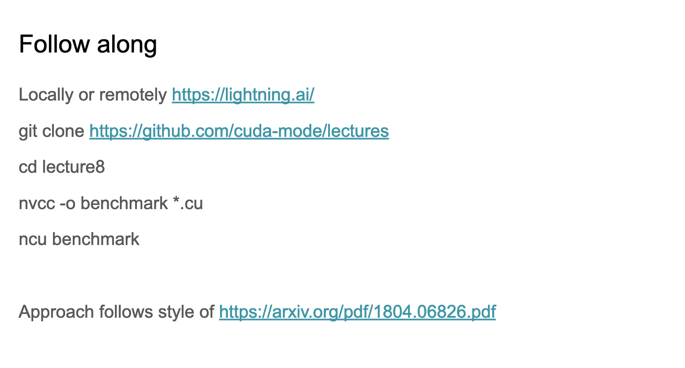

이 강의의 slide와 code는 모두 https://github.com/cuda-mode/lectures 에 open source로 공개되어 있다. lecture8 아래의 cu file을 nvcc로 compile한 뒤 ncu로 profile할 수 있다. 또한 여기의 방법은 https://arxiv.org/pdf/1804.06826.pdf 논문의 스타일을 따른다. 업로더도 이 논문을 읽어보기를 매우 추천한다. claude 3.5에게 paper의 주요 내용을 물어본 결과는 아래 screenshot과 같다.

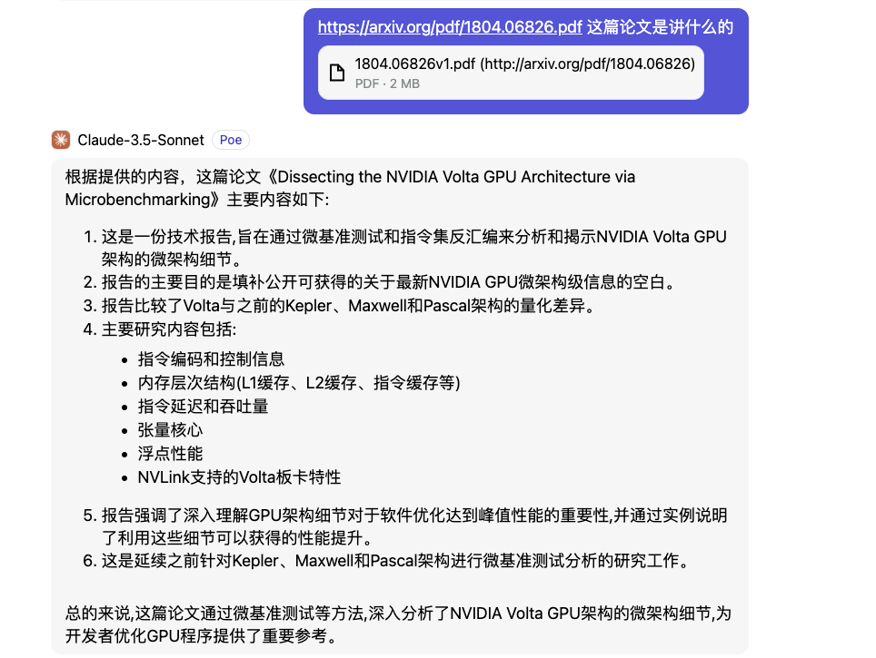

이 논문은 주로 Volta architecture GPU의 architecture 세부 사항을 분석하며, 성능 최적화에 매우 중요하다는 것을 볼 수 있다.

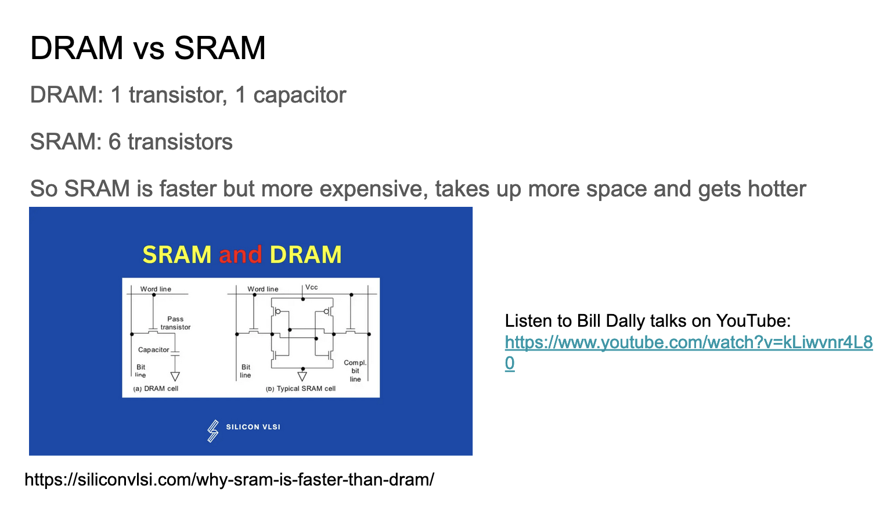

이 slide는 물리학 관점에서 SRAM과 DRAM의 차이를 분석한다.
- DRAM은 1개의 transistor와 1개의 capacitor로 구성된다. SRAM은 6개의 transistor로 구성된다.
- SRAM은 DRAM보다 빠르지만 더 비싸다. SRAM은 더 많은 공간을 차지하고 더 많은 열을 낸다.
실제로 SRAM은 GPU의 Shared Memory에 대응하고, DRAM에 대응하는 것은 Shared Memory다.

여기의 youtube link에서 저자인 Bill은 NVIDIA의 chief scientist이며, 왜 GPU가 지금과 같은 형태로 설계되었는지 많은 내용을 설명한다. 또한 쉬운 내용에서 깊은 내용으로 들어가며, 기초 세부 사항을 매우 명확하게 설명한다.

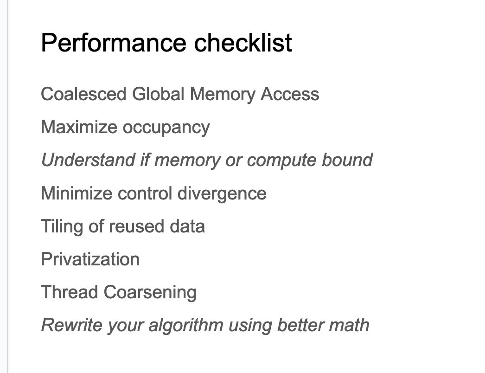

여기의 "Performance checklist"는 GPU program 성능을 최적화하는 일련의 전략과 기법을 나열한다.
- Coalesced Global Memory Access
- Maximize occupancy
- memory bound인지 compute bound인지 이해하기
- control divergence 최소화
- data reuse를 더 잘 하기 위한 Tiling
- Privatization
- Thread Coarsening
- 더 좋은 수학적 방법으로 algorithm rewrite

여기서 Privatization은 Shared Memory/register를 사용해 global memory read를 최적화하는 것을 가리키는 듯하다. Coarsening은 대략 하나의 thread가 얼마나 많은 task를 수행해야 하는가를 가리킨다. 일반적인 경우에는 thread 하나가 수행하는 task를 가능한 한 적게 만들지만, Compute Bound 상황에서는 thread 하나가 더 많은 work를 수행하게 하면 program이 더 빠르게 실행될 수 있다. 마지막 항목인 더 좋은 수학적 방법으로 algorithm을 rewrite하는 고전적인 예는 Flash Attention이다.

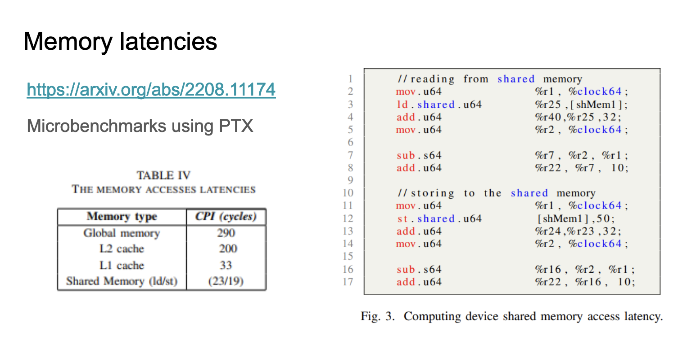

이 slide는 GPU memory access latency와 관련된 내용을 설명한다. 아래 Figure 3과 table은 모두 https://arxiv.org/pdf/2208.11174 에서 온 것이다. 이 table(Table IV)은 서로 다른 type의 memory access latency를 clock cycle 단위로 나열한다.

- Global memory: 290 cycles
- L2 cache: 200 cycles
- L1 cache: 33 cycles
- Shared Memory: read 23 cycles, write 19 cycles

> 뒤에서 이 paper 안의 micro benchmark code도 찾았다: https://www.stuffedcow.net/research/cudabmk?q=research/cudabmk . 나중에 시간이 있으면 이 paper와 test code를 계속 읽어볼 수 있다.

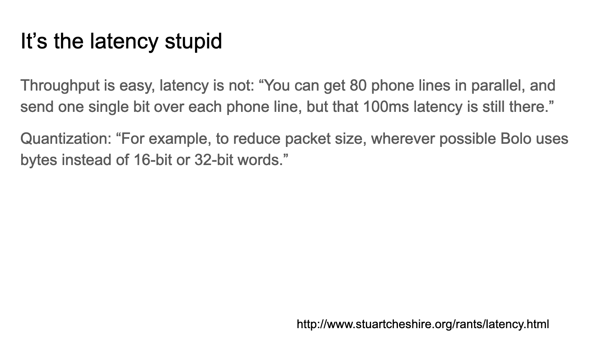

이 slide는 latency가 computer system에서 가지는 중요성과 몇 가지 관련 개념을 설명한다.
- 제목 "It's the latency stupid"은 latency의 중요성을 강조한다.
- Throughput과 Latency의 비교:
    - Throughput은 높이기 쉽지만, latency는 줄이기 어렵다.
    - 예를 들면, 80개의 telephone line을 병렬로 사용하고 각 line이 1 bit를 전송할 수 있어도 100ms latency는 여전히 존재한다.
- Quantization 기술:
    - data packet size를 줄이는 방법이다.
    - 예를 들어 Bolo, 아마 어떤 system이나 protocol은 packet size를 줄이기 위해 16-bit나 32-bit word 대신 가능한 한 byte를 사용한다.
- 아래쪽에는 이 주제에 대한 더 자세한 논의를 담은 URL link가 제공되어 있다.

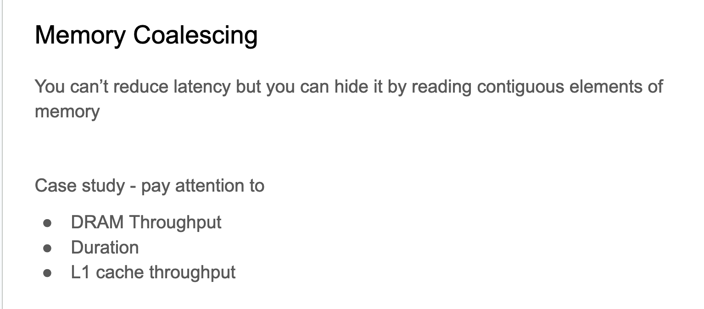

이 slide는 Memory Coalescing 개념 소개를 시작한다. 우리는 latency를 줄일 수 없지만, 연속된 memory element를 읽어 latency를 숨길 수 있다. Slide는 case study를 할 때 다음 세 가지 측면에 주목하라고 제안한다.
- DRAM Throughput
- Duration
- L1 cache throughput

여기서 말하는 memory coalescing case는 https://github.com/cuda-mode/lectures/blob/main/lecture_008/coalesce.cu 에서 보여주는 것이다. code는 다음과 같다.

```c++
#include <iostream>
#include <cuda_runtime.h>

__global__ void copyDataNonCoalesced(float *in, float *out, int n) {
    int index = blockIdx.x * blockDim.x + threadIdx.x;
    if (index < n) {
        out[index] = in[(index * 2) % n];
    }
}

__global__ void copyDataCoalesced(float *in, float *out, int n) {
    int index = blockIdx.x * blockDim.x + threadIdx.x;
    if (index < n) {
        out[index] = in[index];
    }
}

void initializeArray(float *arr, int n) {
    for(int i = 0; i < n; ++i) {
        arr[i] = static_cast<float>(i);
    }
}

int main() {
    const int n = 1 << 24; // Increase n to have a larger workload
    float *in, *out;

    cudaMallocManaged(&in, n * sizeof(float));
    cudaMallocManaged(&out, n * sizeof(float));

    initializeArray(in, n);

    int blockSize = 128; // Define block size
    // int blockSize = 1024; // change this when talking about occupancy
    int numBlocks = (n + blockSize - 1) / blockSize; // Ensure there are enough blocks to cover all elements

    // Launch non-coalesced kernel
    copyDataNonCoalesced<<<numBlocks, blockSize>>>(in, out, n);
    cudaDeviceSynchronize();

    initializeArray(out, n); // Reset output array

    // Launch coalesced kernel
    copyDataCoalesced<<<numBlocks, blockSize>>>(in, out, n);
    cudaDeviceSynchronize();

    cudaFree(in);
    cudaFree(out);

    return 0;
}
```

이 program은 비교적 간단하며, Memory Coalescing 개념과 그것이 성능에 미치는 영향을 보여주는 데 쓰인다. 주로 다음 일을 한다.
- 두 개의 CUDA kernel을 정의한다.
    - copyDataNonCoalesced kernel: non-coalesced memory access pattern이다. 비연속적인 방식으로 input array를 읽으며, `(index * 2) % n`을 index로 사용한다. 이런 access pattern은 non-coalesced memory access를 유발해 성능을 낮출 수 있다.
    - copyDataCoalesced kernel: coalesced memory access pattern이다. 연속적인 방식으로 input array를 읽으며, index를 직접 사용한다. 이런 access pattern은 coalesced memory access를 가능하게 하여 성능을 높일 수 있다.
- main function:
    - input과 output array를 위한 Unified Memory를 할당하고 input array를 초기화한다.
    - CUDA grid와 block size를 설정하고, non-coalesced kernel과 coalesced kernel을 각각 실행한다. 각 kernel 실행 후에는 `cudaDeviceSynchronize()`를 사용해 GPU operation이 완료되었는지 보장한다.


이어서 `nvcc -o benchmark coalesce.cu`를 사용해 program을 compile하고, `ncu benchmark`를 실행해 program을 profile한다.

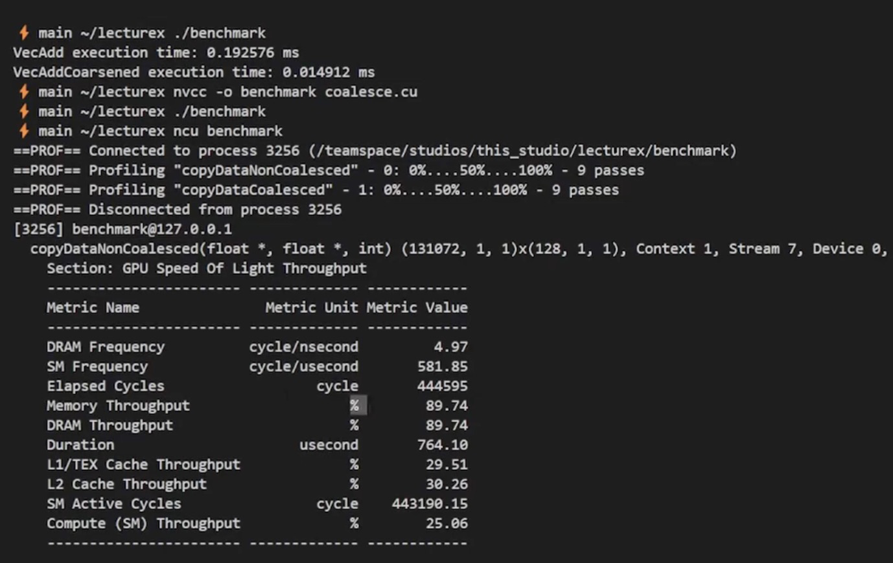

copyDataNonCoalesced kernel의 경우 DRAM memory throughput은 약 89%, L1 Cache throughput은 30%, kernel execution time은 764us이다.

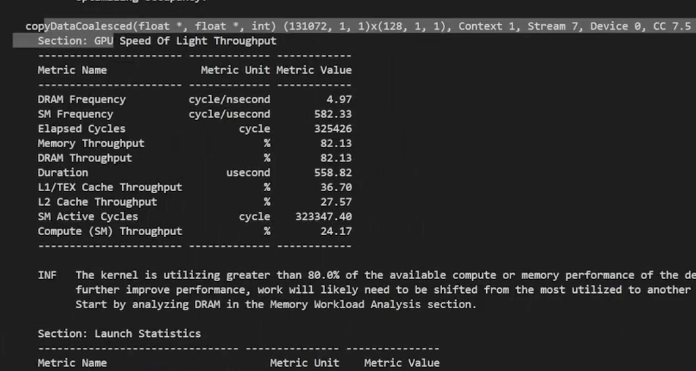

copyDataCoalesced kernel의 경우 L1 Cache throughput은 약 37%, DRAM memory throughput은 82%, execution time은 558us이다.

coalesced memory access kernel에 명확한 성능 향상이 있음을 볼 수 있다. input data size가 커질수록 coalesced memory access의 장점은 더 뚜렷해질 것이라고 예상할 수 있다. ncu 결과 안에는 계산된 theoretical occupancy(100.0%)와 측정된 achieved occupancy(77%) 사이의 차이가 kernel 실행 중 warp scheduling overhead나 workload imbalance 때문에 생겼을 수 있다는 안내도 나온다. 같은 kernel의 서로 다른 block 사이, 그리고 block 안의 서로 다른 warps 사이에서도 load imbalance가 발생할 수 있다. 위 program의 `int blockSize = 128`을 `int blockSize = 1024`로 바꾼 뒤 다시 ncu profile을 수행하면 occupancy가 85.94%까지 올라간 것을 볼 수 있다.

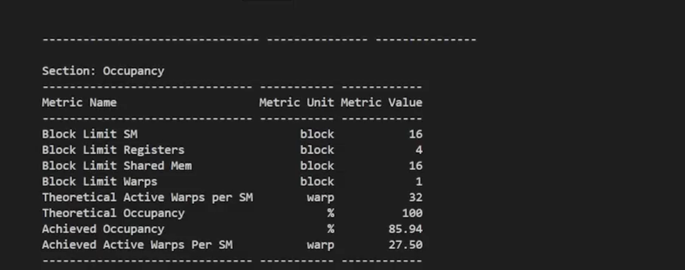

이 slide는 GPU의 Occupancy 문제를 논의한다. 주요 내용은 다음과 같다.
- 두 종류의 quantization 문제:
    - a) Tile quantization: matrix dimension이 thread block Tile size로 나누어떨어지지 않는다.
    - b) Wave quantization: Tile 총수가 GPU의 SM(streaming multiprocessor) 수로 나누어떨어지지 않는다.
- 성능 chart 비교와 분석:
    - 왼쪽 그림(a): cuBLAS v10에서 NN GEMM 성능
    - 오른쪽 그림(b): cuBLAS v11에서 NN GEMM 성능
    - 두 그림 모두 M = 1024, N = 1024 matrix dimension에서 test한 것이다.
    - 왼쪽 그림(a)은 성능이 뚜렷한 계단 형태를 보이며 큰 폭으로 변동한다.
    - 오른쪽 그림(b)은 성능 변동이 더 작고 전체적으로 더 smooth하다.
cuBLAS v11은 Tile과 Wave Quantization으로 인한 성능 변동을 줄이기 위해 더 나은 scheduling strategy나 optimization technique을 사용했을 가능성이 있음을 볼 수 있다.

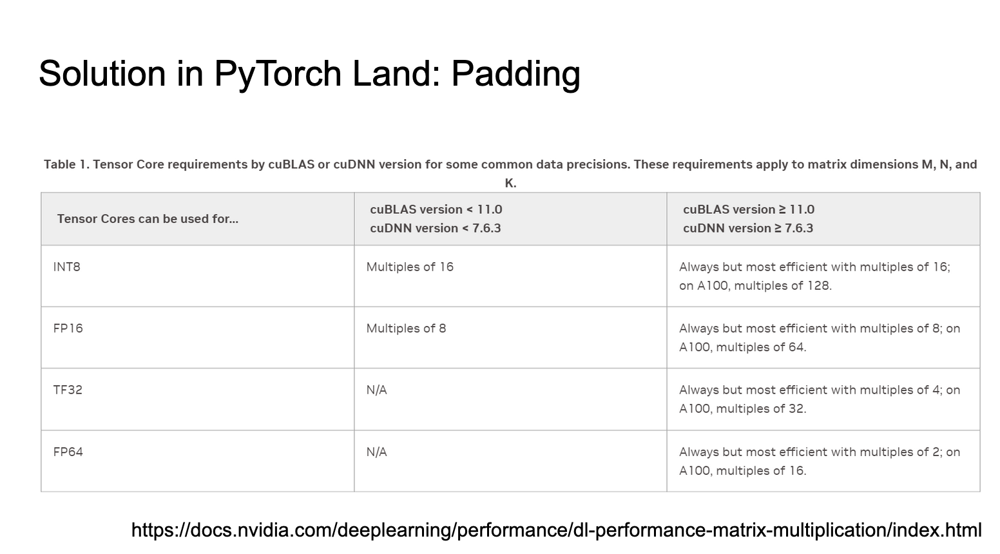

이 slide는 PyTorch에서 padding을 사용해 Tensor Core matrix multiplication dimension 요구사항을 해결하는 방법을 설명한다. 구체적인 내용은 다음과 같다.
- PyTorch 환경에서 padding은 어떤 문제를 해결하는 방법이다.
- table은 서로 다른 cuBLAS와 cuDNN version에서 Tensor Core를 사용할 때의 data precision 요구사항을 보여준다. 이 요구사항은 matrix dimension M, N, K에 적용된다.
- version 구분:
    - 왼쪽 열: cuBLAS < 11.0 및 cuDNN < 7.6.3 구버전
    - 오른쪽 열: cuBLAS >= 11.0 및 cuDNN >= 7.6.3 신버전
- data type 요구사항:
    - INT8: 구버전은 16의 배수를 요구한다. 신버전은 항상 사용할 수 있지만 16의 배수가 가장 효율적이며, A100에서는 128의 배수가 최적이다.
    - FP16: 구버전은 8의 배수를 요구한다. 신버전은 항상 사용할 수 있지만 8의 배수가 가장 효율적이며, A100에서는 64의 배수가 최적이다.
    - TF32: 구버전에는 해당하지 않는다. 신버전은 항상 사용할 수 있지만 4의 배수가 가장 효율적이며, A100에서는 32의 배수가 최적이다.
    - FP64: 구버전에는 해당하지 않는다. 신버전은 항상 사용할 수 있지만 2의 배수가 가장 효율적이며, A100에서는 16의 배수가 최적이다.

신버전의 cuBLAS와 cuDNN은 더 유연한 Tensor Core 사용 조건을 제공한다. 그리고 A100 GPU에서는 최적 성능을 얻기 위해 더 큰 배수가 필요할 수 있다. Padding은 matrix dimension을 이러한 추천 배수로 조정해 성능을 높이는 데 사용할 수 있다.

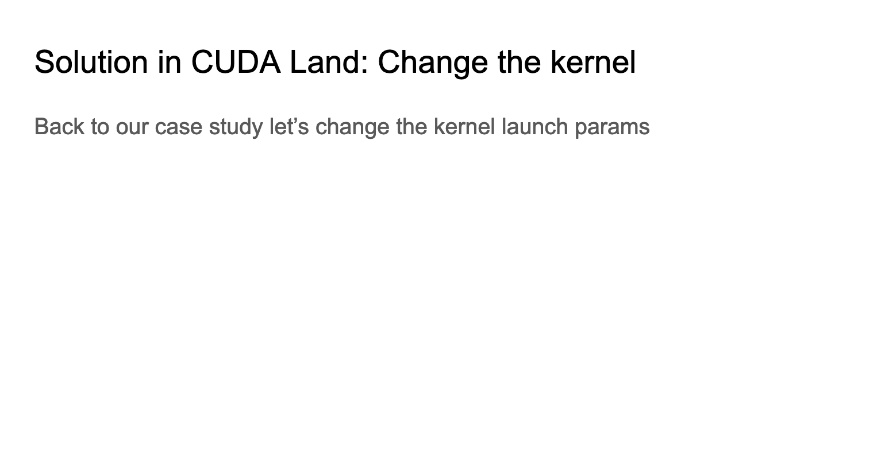

CUDA에서 Occupancy를 높이는 한 가지 방법은 kernel을 수정하는 것이다.

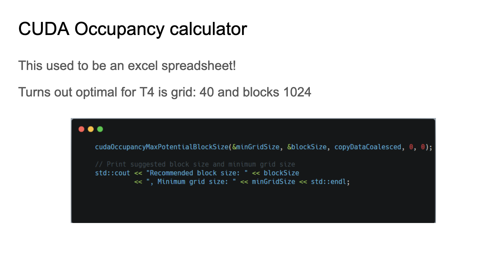

CUDA Occupancy calculator tool은 더 나은 Occupancy에 도달할 수 있는 kernel launch parameter를 자동으로 계산하는 데 도움을 준다. 앞 절의 coalesced memory access .cu에서 이 API를 호출한 결과, T4 GPU의 optimal configuration은 grid size 40, block size 1024로 표시된다. code는 https://github.com/cuda-mode/lectures/blob/main/lecture_008/occupancy.cu 를 참고한다.

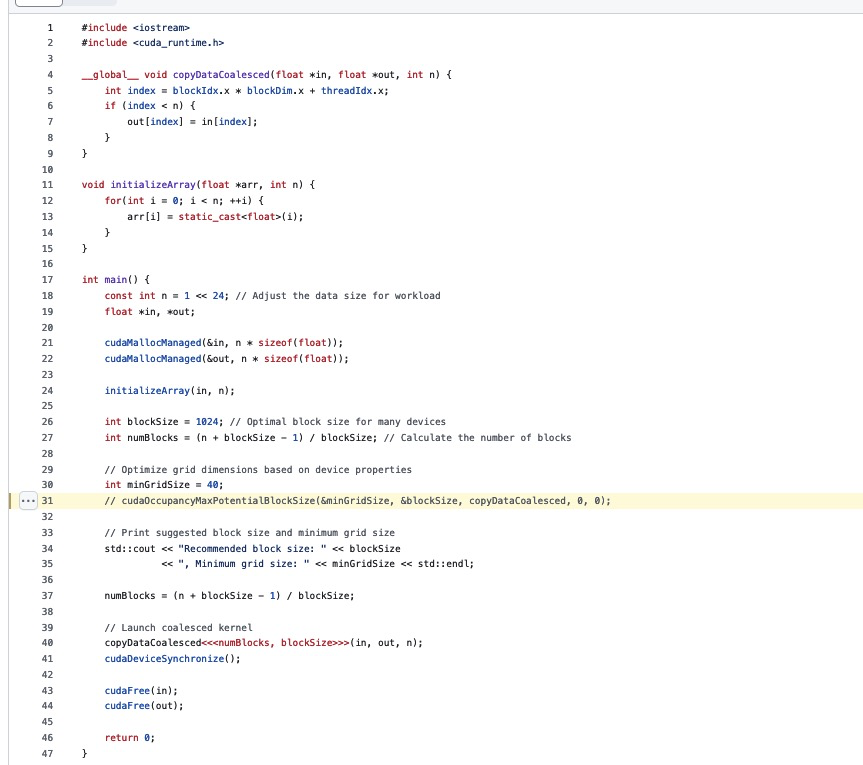

이 program을 ncu로 분석할 때 새로운 문제가 생긴다. 바로 아래에 표시된 문제다.

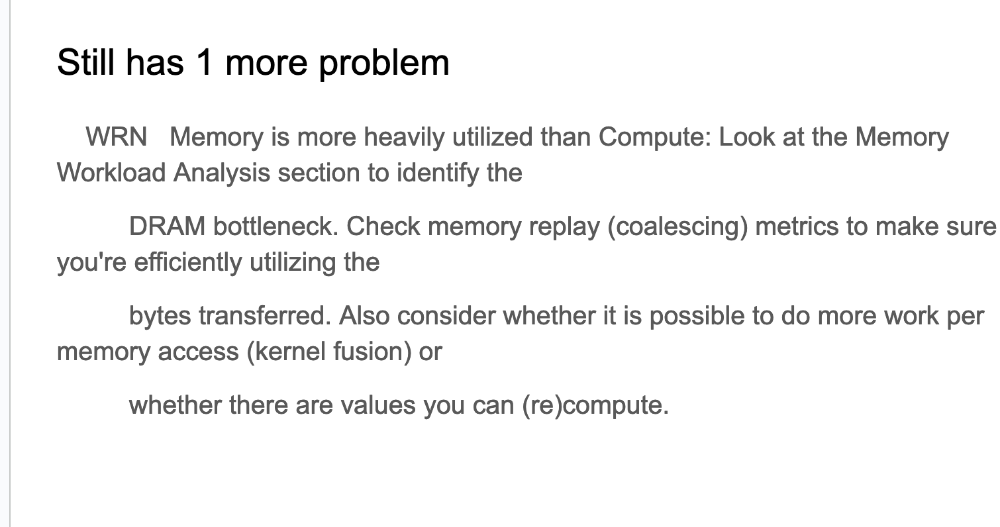

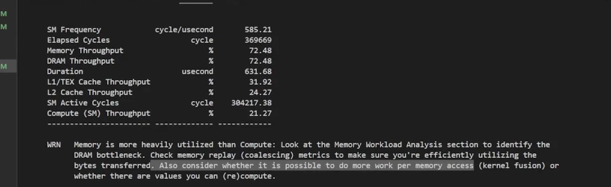

> 경고(WRN): memory utilization이 compute utilization보다 높다. DRAM bottleneck을 식별하려면 memory workload analysis section을 확인하라. memory replay(coalescing) metric을 검사해 전송된 byte를 효율적으로 활용하고 있는지 확인하라. 또한 memory access마다 더 많은 work를 수행할 수 있는지(kernel fusion) 또는 다시 계산할 수 있는 값이 있는지도 고려하라.

다음으로 이 문제를 논의하기 시작한다.

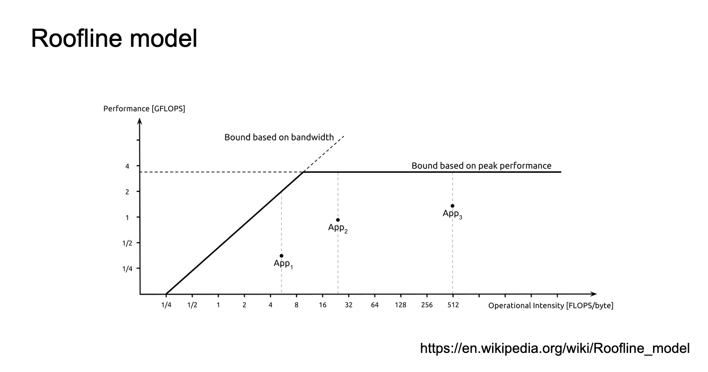

논의 전에 먼저 이 slide가 보여주는 Roofline model을 이해해야 한다. 이것은 CUDA kernel이 compute bound인지 memory bound인지를 결정한다.

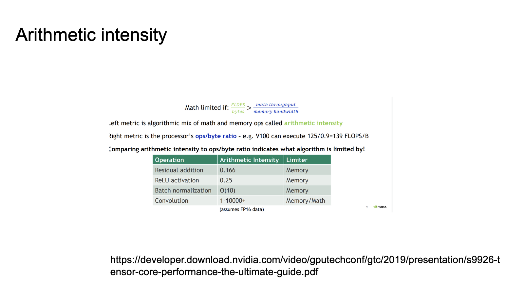

이 slide는 Arithmetic intensity 개념과 processor performance analysis에서의 적용을 설명한다. 이 slide는 gtc2019의 한 설명 자료에서 온 것이다.

왼쪽 metric은 mathematical operation과 memory operation의 algorithmic mix이며, 이를 arithmetic intensity라고 부른다. 오른쪽 metric은 processor의 ops/byte ratio다. 예를 들어 V100 GPU는 125/0.9=139 FLOPS/B를 실행할 수 있다. arithmetic intensity와 ops/byte ratio를 비교하면 algorithm이 어떤 요소에 제한되는지 알 수 있다.

아래에는 operation type과 그 arithmetic intensity table도 제공되어 있다.
- Residual addition: 0.166, memory bound
- ReLU activation: 0.25, memory bound
- Batch normalization: O(10), memory bound
- Convolution: 1-10000+(FP16 data라고 가정), memory 또는 math operation에 제한될 수 있음

link: https://developer.download.nvidia.com/video/gputechconf/gtc/2019/presentation/s9926-tensor-core-performance-the-ultimate-guide.pdf

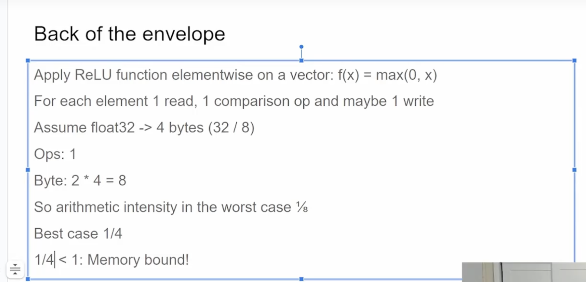

이 slide는 ReLU(Rectified Linear Unit) function의 arithmetic intensity analysis를 설명한다.
- ReLU function 정의: f(x) = max(0, x), vector의 각 element에 적용된다.
- operation 설명: element마다 1번 read, 1번 comparison operation, 그리고 가능하면 1번 write를 수행한다.
- data type: float32를 사용한다고 가정하며, 각 number는 4 byte(32 bit)를 차지한다.
- 계산 분석:
    - Ops: 1(element마다 한 번의 comparison operation)
    - Byte: 2 * 4 = 8(read와 가능한 write, 각각 4 byte)
- arithmetic intensity 계산:
    - worst case: 1/8(모든 element를 write해야 할 때)
    - best case: 1/4(write가 필요 없고 read operation만 있을 때)
결론: 1/4 < 1이므로 ReLU operation은 memory bandwidth에 제한된다(Memory bound).

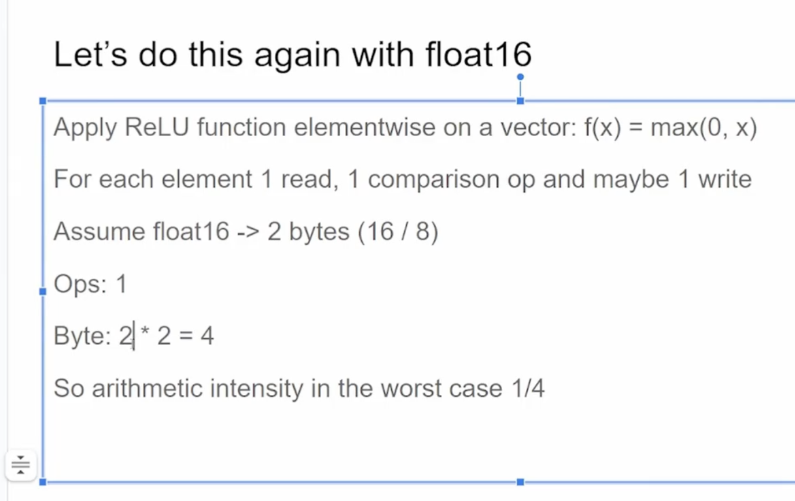

이 slide는 Float16의 ReLU에 대해 arithmetic intensity analysis를 수행한다. 이 경우 worst arithmetic intensity는 Float32일 때의 1/8이 아니라 1/4라는 것을 볼 수 있으며, 따라서 quantization은 compute intensity를 높일 수 있다.

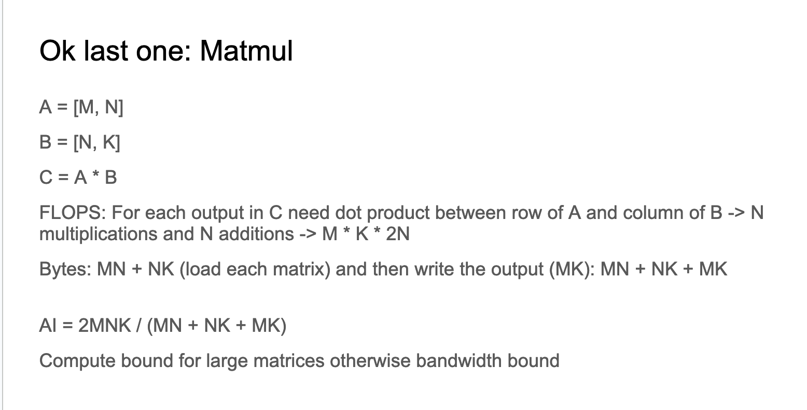

이 slide는 matrix multiplication(Matmul)의 arithmetic intensity analysis를 설명한다. 여기서:
- FLOPS(floating point operation count) 계산:
    - C의 각 output element에 대해 A의 한 row와 B의 한 column으로 dot product를 수행해야 한다.
    - N번의 multiplication과 N번의 addition이 필요하다.
    - total FLOPS = M * K * 2N
- byte count 계산:
    - matrix A와 B load: MN + NK
    - output matrix C write: MK
    - total bytes = MN + NK + MK
- Arithmetic intensity(AI) 계산:
    - AI = 2MNK / (MN + NK + MK)
- 결론:
    - 큰 matrix에서는 compute bound
    - 그렇지 않으면 bandwidth bound

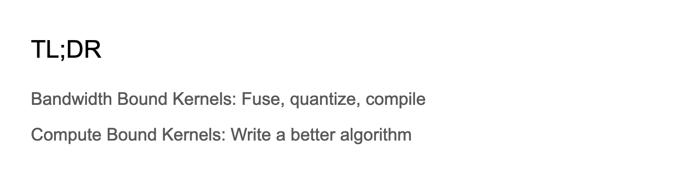

이 slide는 서로 다른 type의 kernels를 최적화하는 방법을 요약한다.

- Bandwidth Bound Kernels 최적화 전략:
    - Fuse: 여러 operation을 합쳐 memory access를 줄인다.
    - Quantize: 더 작은 data type을 사용해 memory transfer를 줄인다.
    - Compile: memory access pattern을 최적화하기 위해 특정 compile technique을 사용하는 것을 가리킬 수 있다.
- Compute Bound Kernels 최적화 전략:
    - Write a better algorithm: algorithm 차원에서 최적화해야 함을 의미한다.

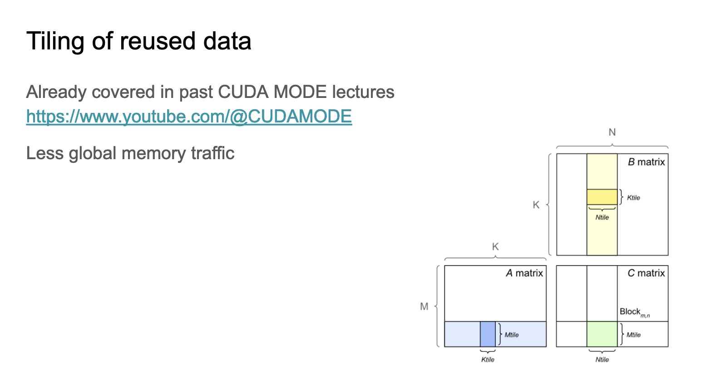

matrix multiplication Tiling으로 global memory access를 줄이는 내용은 이전의 [CUDA-MODE 강의 노트 제4강: PMPP 책 4-5장 노트](https://mp.weixin.qq.com/s/P87c8LRJ1CEOOyaQw8L-cA)를 참고하라.

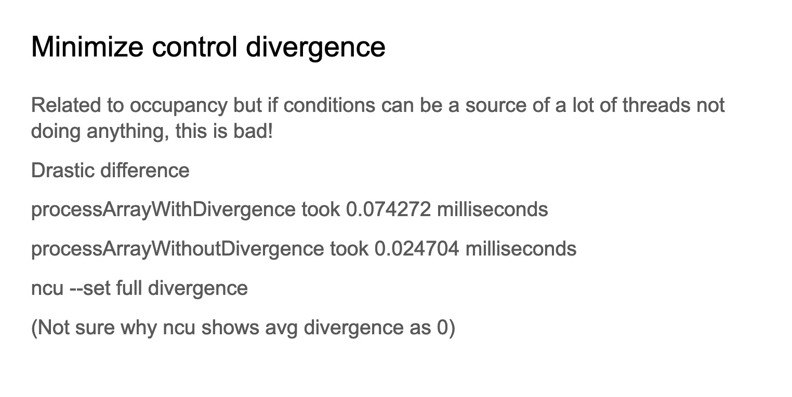

이 slide는 여기의 code에 대응한다: https://github.com/cuda-mode/lectures/blob/main/lecture_008/divergence.cu . 주로 아래 두 kernel을 분석한다.

```cpp
__global__ void processArrayWithDivergence(int *data, int N) {
    int idx = blockIdx.x * blockDim.x + threadIdx.x;
    if (idx < N) {
        if (data[idx] % 2 == 0) {
            data[idx] = data[idx] * 2; // 이 branch는 아래 branch보다 느리다. 한 Warp 안에서 이 branch를 실행하는 thread가 뒤처질 수 있고, Warp 안의 다른 thread들은 이 thread들의 계산 완료를 기다려야 한다.
        } else {
            data[idx] = data[idx] + 1;
        }
    }
}

__global__ void processArrayWithoutDivergence(int *data, int N) {
    int idx = blockIdx.x * blockDim.x + threadIdx.x;
    if (idx < N) {
        int isEven = !(data[idx] % 2); // 여기서 하는 일은 위와 같지만 thread divergence 문제를 피한다.
        data[idx] = isEven * (data[idx] * 2) + (!isEven) * (data[idx] + 1);
    }
}
```

- control divergence는 occupancy와 관련이 있지만, conditional statement 때문에 많은 thread가 idle 상태가 된다면 좋지 않다.
- processArrayWithDivergence는 0.074272ms가 걸리고, processArrayWithoutDivergence는 0.024704ms가 걸린다. 이는 control divergence를 제거하면 성능을 크게, 약 3배 향상할 수 있음을 보여준다.
- `"ncu --set full divergence"`는 이 명령으로 thread control divergence analysis를 설정한다.


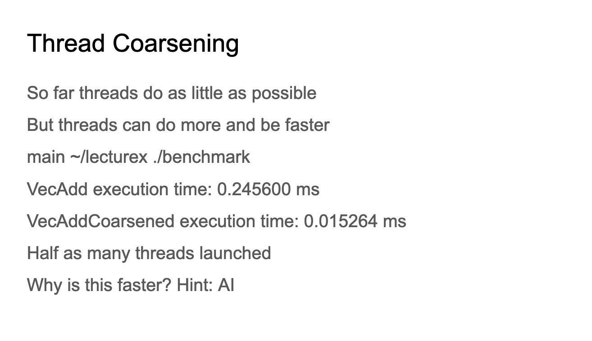

compute bound kernel의 경우 thread가 더 많은 일을 할 수 있게 하면 더 빠를 수 있다.
- 성능 비교:
    - 실행 명령: main ~/lecturex ./benchmark
    - VecAdd execution time: 0.245600 ms
    - VecAddCoarsened execution time: 0.015264 ms
- 핵심 관찰:
    - VecAddCoarsened는 절반의 thread 수를 launch했다.
    - thread 수가 줄었지만 execution speed는 크게, 약 16배 향상되었다.

여기의 code는 https://github.com/cuda-mode/lectures/blob/main/lecture_008/coarsening.cu 에 있다.

이것은 Lecture 7에서 Int4 Weight Only quantization의 efficient kernel 구현이 왜 일반 fp16 Kernel보다 더 빠르게 실행되는지 설명할 수도 있다.

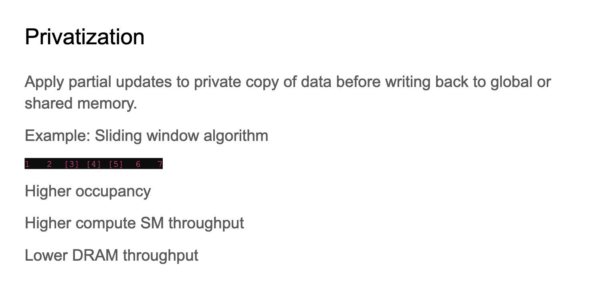

이 slide는 GPU programming의 "Privatization" 기술을 논의한다. 요점은 다음과 같다.
- 일부 update를 data의 private copy에 적용한 다음 global 또는 shared memory에 다시 write한다.
- 예시:
    - Sliding window algorithm
    - 도식: 1 2 [3] [4] [5] 6 7
    - 이는 algorithm이 local window 안에서 operation을 수행한다는 것을 나타낸다.
- Privatization의 장점:
    - Higher occupancy
    - Higher compute SM throughput
    - Lower DRAM throughput

이 sliding window algorithm에 대응하는 예가 바로 Mistral 등 large model의 sliding window attention algorithm이다.

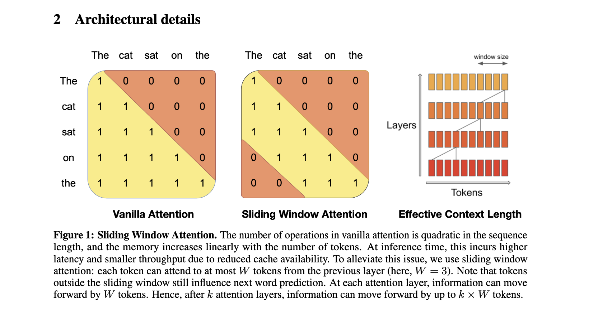

이 그림을 설명하면 다음과 같다.

- 왼쪽 matrix: Vanilla Attention
    - 전통적인 attention mechanism을 보여준다. 각 token은 모든 다른 token에 attention할 수 있다.
    - matrix는 lower triangular이며, 각 token이 자기 자신과 이전 token에만 attention할 수 있음을 나타낸다.
- 가운데 matrix: Sliding Window Attention
    - sliding window attention mechanism을 보여준다. 각 token은 고정 window size 안의 인접 token에만 attention한다.
    - 여기서 window size W=3이며, 각 token이 앞뒤 3개 token과만 연결되는 것을 볼 수 있다.
- 오른쪽 그림: Effective Context Length
    - 여러 layer의 sliding window attention이 어떻게 effective context length를 확장하는지 보여준다.
    - 각 layer는 정보를 W개의 token만큼 앞으로 전파할 수 있다.

정리하면, 전통적인 attention의 operation 수는 sequence length의 제곱에 비례하고, memory usage는 token 수에 선형으로 증가한다. inference 시에는 cache availability가 낮아져 더 높은 latency와 더 낮은 throughput이 발생한다. Sliding window attention은 각 token이 직전 layer의 최대 W개 token에만 attention하도록 제한함으로써 이 문제를 완화한다. window 밖의 token은 attention 계산에 직접 참여하지 않지만, 여전히 다음 단어 prediction에 영향을 줄 수 있다. 각 attention layer에서 정보는 W개의 token만큼 앞으로 전파될 수 있다. k개의 attention layer를 거치면 정보는 최대 k x W개의 token만큼 앞으로 전파될 수 있다.

Privatization 기술을 계속 논의한다. https://github.com/cuda-mode/lectures/blob/main/lecture_008/privatization.cu 에 있는 핵심 code는 다음과 같다.

```c++

// CUDA kernel for vector addition without privatization
__global__ void vectorAdd(const float *a, const float *b, float *result, int n) {
    int index = threadIdx.x + blockIdx.x * blockDim.x;
    if (index < n) {
        result[index] = a[index] + b[index];
    }
}

// CUDA kernel for vector addition with privatization
__global__ void vectorAddPrivatized(const float *a, const float *b, float *result, int n) {
    int index = threadIdx.x + blockIdx.x * blockDim.x;
    if (index < n) {
        float a_private = a[index]; // Load into private memory
        float b_private = b[index]; // Load into private memory
        result[index] = a_private + b_private;
    }
}
```

우리는 `a[index]`, `b[index]`를 private memory 안으로 load해 global memory에 대한 직접 operation을 피하지만, 이 VectorAdd 예시에서는 속도가 빨라지지 않았다.

하지만 아래 sliding window sum 예시에서는 global memory를 shared memory로 load한 다음 누적할 때 sum operation이 shared memory에서 수행된다.
code link: https://github.com/cuda-mode/lectures/blob/main/lecture_008/privatization2.cu 

```c++
// Kernel without privatization: Direct global memory access
__global__ void windowSumDirect(const float *input, float *output, int n, int windowSize) {
    int idx = blockIdx.x * blockDim.x + threadIdx.x;
    int halfWindow = windowSize / 2;
    if (idx < n) {
        float sum = 0.0f;
        for (int i = -halfWindow; i <= halfWindow; ++i) {
            int accessIdx = idx + i;
            if (accessIdx >= 0 && accessIdx < n) {
                sum += input[accessIdx];
            }
        }
        output[idx] = sum;
    }
}

// Kernel with privatization: Preload window elements into registers
__global__ void windowSumPrivatized(const float *input, float *output, int n, int windowSize) {
    int idx = blockIdx.x * blockDim.x + threadIdx.x;
    int halfWindow = windowSize / 2;
    __shared__ float sharedData[1024]; // Assuming blockDim.x <= 1024

    // Load input into shared memory (for demonstration, assuming window fits into shared memory)
    if (idx < n) {
        sharedData[threadIdx.x] = input[idx];
        __syncthreads(); // Ensure all loads are complete

        float sum = 0.0f;
        for (int i = -halfWindow; i <= halfWindow; ++i) {
            int accessIdx = threadIdx.x + i;
            // Check bounds within shared memory
            if (accessIdx >= 0 && accessIdx < blockDim.x && (idx + i) < n && (idx + i) >= 0) {
                sum += sharedData[accessIdx];
            }
        }
        output[idx] = sum;
    }
}
```

저자가 마지막으로 말한 한 가지는 Flash Attention을 예로 들며, 수학적 관점에서 algorithm을 rewrite할 수 있다면 code 성능을 크게 높일 가능성이 있다는 것이다. 예를 들어 Flash Attention은 Safe Softmax의 수학적 형태를 이용해 Attention을 block 단위로 계산한다. 이 부분의 설명은 이미 매우 많으므로, https://github.com/BBuf/how-to-optim-algorithm-in-cuda/README.md 안에 수집된 Flash Attention 관련 자료를 참고할 수 있다. 마지막 몇 장의 slide는 더 이상 자세히 설명하지 않는다.

### 요약

이 강의는 Lecture 1을 더 체계적으로 보완한 것에 해당하며, GPU kernel 최적화의 몇 가지 실용적인 technique과 analysis tool인 ncu를 중점적으로 소개한다. 강의는 "Performance checklist"를 깊이 탐구하고 핵심 최적화 전략을 개괄한다.

- Coalesced Global Memory Access: thread가 연속된 memory location에 access하도록 보장해 memory bandwidth utilization을 최대화한다.
- Maximize occupancy: kernel launch parameter를 최적화해 GPU processing capability를 충분히 활용한다.
- memory와 compute limitation 이해: kernel 특성을 분석해 제한 요인(memory bandwidth 또는 compute capability)을 파악하고 적절한 optimization technique을 적용한다.
- thread divergence 최소화: warp 안의 thread가 서로 다른 execution path를 따르게 만드는 conditional statement를 피해서 성능 저하를 줄인다.
- Tiling으로 data reuse: data access pattern을 구성해 cache 안의 data locality와 reuse를 최대화한다.
- Privatization: private memory(register 또는 shared memory)를 활용해 global memory access를 줄이고 occupancy를 높인다.
- Thread coarsening: thread granularity를 조정해 workload를 balance하고 thread overhead를 최소화한다.
- Algorithm rewrite: compute efficiency를 높이기 위해 대체 mathematical formulation이나 algorithm을 탐색한다.

업로더는 CUDA code 예제와 ncu tool의 analysis result를 통해 이러한 개념들을 설명한다. memory coalescing, occupancy optimization, control divergence minimization의 장점을 보여준다. 또한 kernel performance bottleneck을 분석하기 위한 Roofline model과, kernel이 memory bound인지 compute bound인지 판별하기 위한 arithmetic intensity 개념을 소개한다. 이어서 privatization technique을 논의하며, sliding window algorithm에서 shared memory를 사용해 data locality를 개선하고 global memory access를 줄이는 방법을 중점적으로 소개한다. 마지막으로, 수학적 관점에서 algorithm을 rewrite해 큰 성능 향상을 얻을 수 있는 잠재력을 간단히 설명하고, Flash Attention을 주요 예시로 든다. Flash Attention 자료는 이미 매우 많기 때문에 마지막 몇 장의 slide는 캡처하지 않았다.
