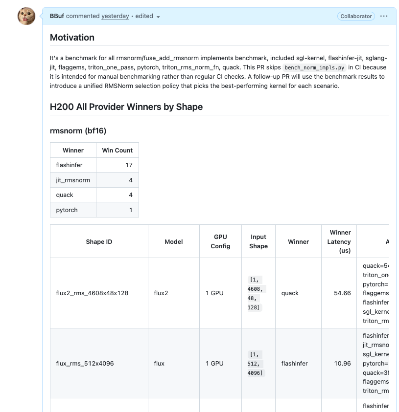
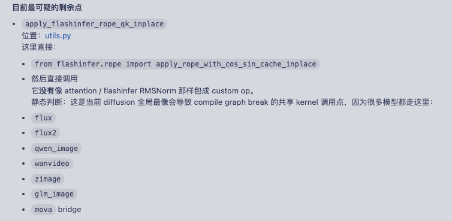
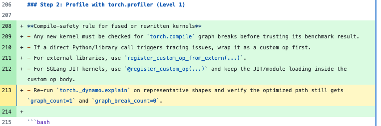
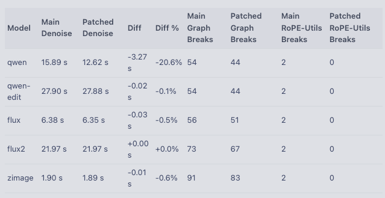
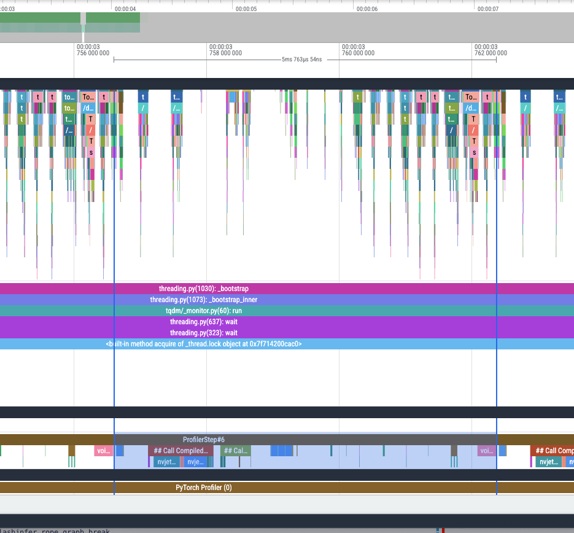
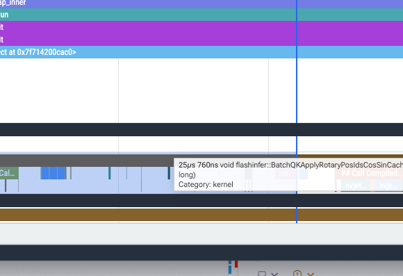
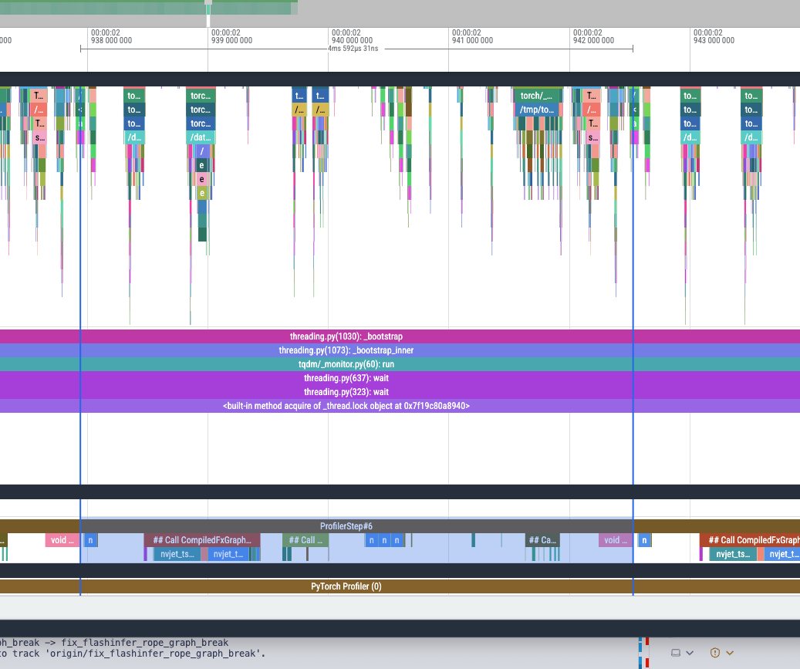
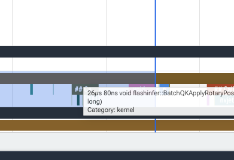
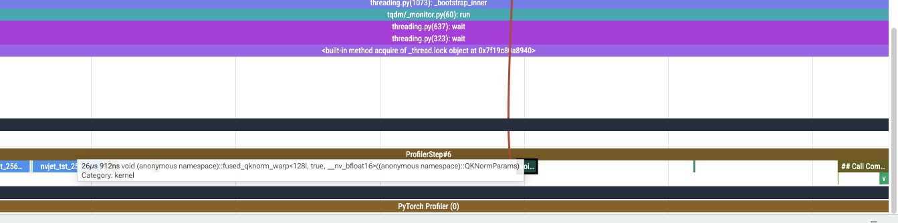

# Codex가 전통적인 추론 프레임워크 개발 흐름을 재구성하고 있다

## 0x0. 서문

[Codex for Open Source에 선정](https://mp.weixin.qq.com/s/Nh76NrekJwYlLlFKlpRJJw)된 뒤 나는 곧바로 달리기 시작했다. 이전에 쌓아 두었던 몇 가지 아이디어를 Codex에게 구현해 보게 하면서, Codex가 프레임워크 개발 보조 역할을 어느 정도까지 해낼 수 있는지 보려 했다. 그러던 오늘 Codex가 무심코 준 한 가지 알림이, Codex GPT5.4 High가 전통적인 추론 프레임워크 개발 흐름을 재구성하고 있다는 느낌을 주었다. 시대가 정말 크게 변하고 있다. 아래에서는 내가 이 결론을 얻게 된 예를 공유한다. 겸사겸사 말하자면, Codex를 받은 이번 주에 여가 시간으로 몇 가지 실험을 했고(GPT5.4 High를 켰다), 금방 이번 주 Codex 사용량의 70%를 써 버렸다. 그런데 방금 보니 Codex quota가 갱신되어 다시 100%가 되었다. OpenAI는 정말 통이 크다. 반면 어느 회사는 통과도 안 시켜준다.

## 0x1. 배경

내가 가장 먼저 한 일은 이전에 대부분 Cursor로 작성하고 미세 조정했던 SGLang Diffusion의 SKILLS 흐름을 Codex에게 보완하게 한 것이다. 그 안에는 모델 분석과 profile 흐름, kernel 추가 흐름이 포함되어 있었고, Codex가 능동적으로 검증하게 했다. 많은 SKILLS 버그를 수정해, 입력이 "SGLang Diffusion FLUX1 모델을 최적화해 줘" 같은 형태이면 자동으로 benchmark, profile, apply fuse kernel, kernel 최적화의 전체 흐름을 시작하는 SKILL이 되도록 했다. 모든 버그를 수정하고 전체 흐름이 원활히 동작하게 하기까지 많은 token을 썼다. 하지만 아쉽게도 더 강한 인간의 사전 지식이 없는 상황에서는 최적화가 기본적으로 실패했다. Codex에게 이 SKILL들을 기반으로 여러 모델을 스스로 2일 동안 최적화해 보게 했지만 효과는 제한적이었다.

## 0x2. Codex가 Benchmark를 수행하면서 가져온 성능 최적화

SGLang Diffusion에서 사용하는 rmsnorm은 현재 오픈소스 커뮤니티에 여러 버전이 있다. 이전부터 최적 선택 방안을 만들어야 하지 않을까 생각했는데, Codex가 있으니 이 아이디어를 현실로 만들 수 있었다. Codex에게 benchmark 스크립트를 만들게 했고, 여러 rmsnorm이 서로 다른 실제 shape, 즉 서로 다른 Diffusion 모델이 사용하는 shape에서 성능이 다르게 나타난다는 것을 발견했다. 구체적인 내용은 여기 표에서 볼 수 있다.

내가 Codex에게 이 flashinfer rmsnorm을 SGLang Diffusion 모델에 적용하게 했을 때, 이 모델들의 성능이 거의 모두 하락하는 것을 발견했다. Codex에게 원인을 찾게 했고, Codex가 찾은 원인은 이 kernel 호출이 torch compile break 횟수를 더 늘리기 때문이었다. custom op로 등록되어 있지 않았기 때문이다. 이후 Codex가 이를 수정하자 성능은 합리적인 수준이 되었고, baseline 모델 대비 약간의 향상이 있었다.

그다음 Codex는 현재 torch compile graph break가 여전히 비교적 많으며, flashinfer rmsnorm과 비슷하게 영향을 줄 수 있는 것은 flashinfer rope 호출이라고 알려 주었다.

또한 그 debug 과정을 관찰해 보니, Codex는 `torch._dynamo.explain`을 호출해 현재 kernel이 torch compile을 통해 하나의 graph 안으로 컴파일될 수 있는지 확인했다. 이 과정도 SKILLS에 적어 두었다.

이어서 Codex에게 이 flashinfer rope의 custom op 등록 문제를 계속 수정하게 했고, 그 결과는 https://github.com/sgl-project/sglang/pull/20699 에서 볼 수 있다.

qwen-image-2512는 단일 H200에서 1024x1024 이미지를 생성할 때 성능이 20% 향상되었다.

- main

한 step의 한 block: 5ms763us

rope kernel is not covered by torch compile graph

- pr

한 step의 한 block: 4ms592us

rope kernel is covered by torch compile graph

profiler 결과에서도 이제 flashinfer rope가 torch compile region 안에 들어갔으며, 향상이 매우 뚜렷하다는 것을 볼 수 있다.

또한 rope 앞의 2개 qknorm도 이론적으로는 torch compile region에 포함될 수 있음을 볼 수 있다.

이제 계속 Codex를 달리게 하면 된다.

## 0x3. 정리

개인적으로 현재는 전문성이 매우 강한 kernel을 제외하면, 추론 프레임워크 개발에서 Codex와 최첨단 모델이 할 수 있는 일이 이미 매우 강력해졌다고 느낀다. 내가 든 이 예시는 torch compile과 sglang 중 하나에 익숙한 엔지니어라도 문제를 발견하기 매우 어려운 경우인데, Codex는 거의 완벽하게 발견하고 해결했다. 이것이 생산성이다.
