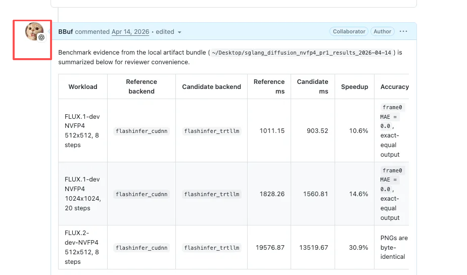
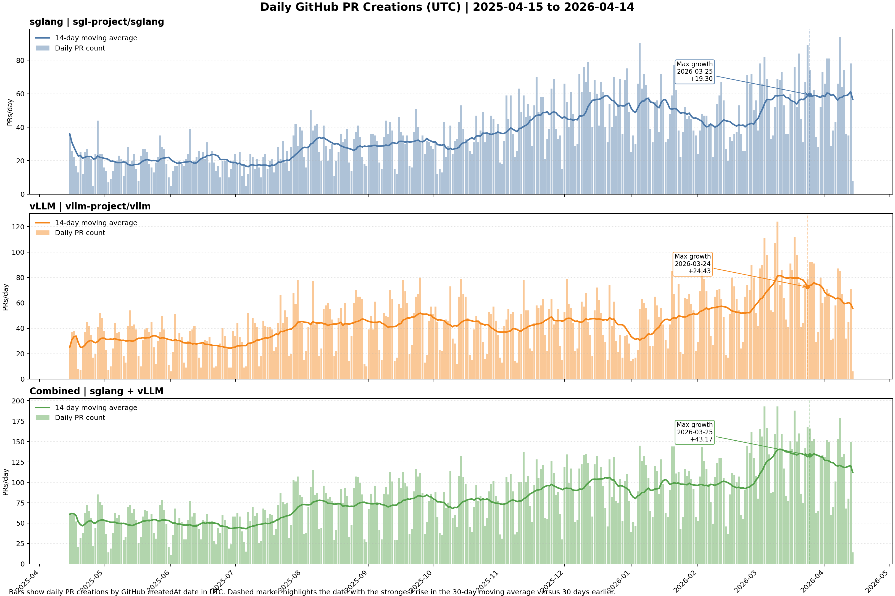
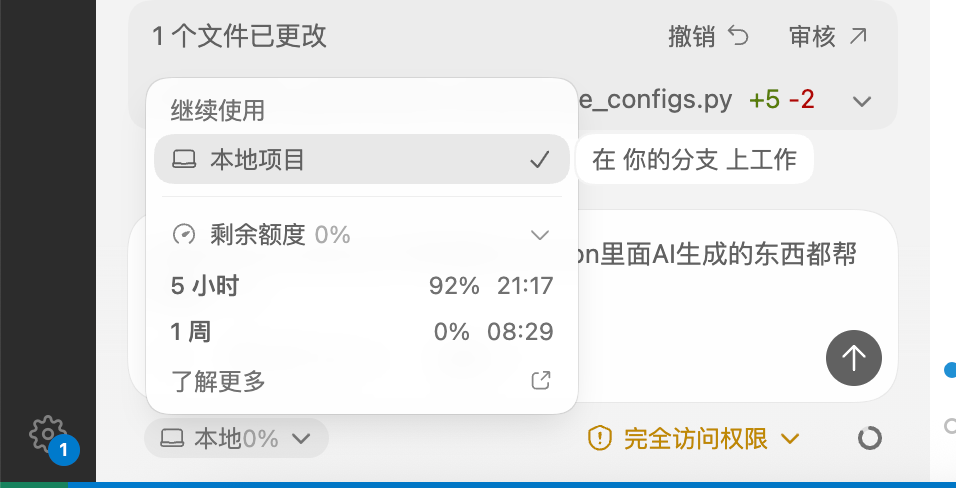
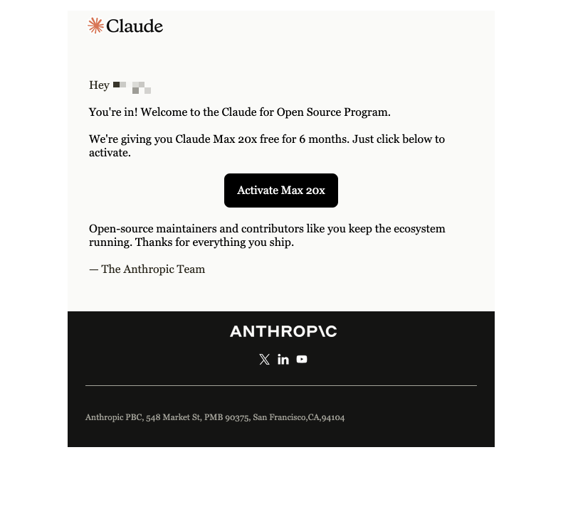
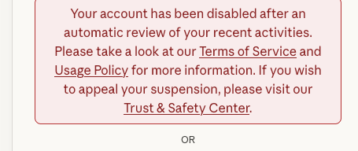
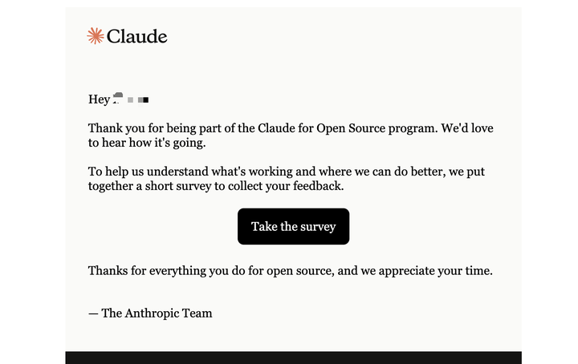

# 최신 체감

최근 Codex로 SGLang에서 개인적으로 꽤 solid하다고 느끼는 PR과 feature 구현을 많이 밀어붙였고, 여기서 한 번 복기해 본다. 기본적으로 idea는 내가 내고 중간에 개입하며, Codex가 implementation을 맡았다. 나는 거의 code를 쓰지 않았다. 예전 방식의 시대였다면 Codex 없이 나에게는 대략 3~4개월짜리 작업량이었을 것이다. 사실 refactor, skill, CI, benchmark도 있어서 이전의 나에게는 실제 작업량이 3~4개월보다 더 컸을 수도 있다. 어디까지나 취미 활동이었으니까. 지금은 1개월 반으로 줄었다. 아래에는 performance optimization과 중요한 feature implementation만 포함하며, 전 과정은 Codex로 밀어붙인 것이다.

한 가지 걱정은, 이 code 대부분을 Codex가 쓴다면 code quality와 correctness를 어떻게 보장하느냐다. 내 경험은 몇 가지다.

- 먼저 code style은 내가 이전에 작성한 PR style에 최대한 맞춰야 한다. 이는 사실 예전 PR들을 잔뜩 모아두면 할 수 있다. 예를 들어 Agent는 쉽게 과도한 방어적 `try catch`를 많이 만들곤 하는데, 실제로는 필요 없는 경우가 많다. 또 Agent는 import를 모두 code 중간에 삽입하려는 경향이 있다. 이런 문제는 자신이 예전에 제출했던 code style로 통일해 해결할 수 있다.
- 둘째, Agent가 수정한 모든 function code는 스스로 완전히 이해하고 loophole을 생각해야 한다. 만약 당신이 제출한 Agent 작성 code를 자신조차 완전히 이해하지 못했다면, 그것은 매우 위험한 폭탄이 된다. 예를 들어 Agent에게 nvfp4/fp8 quant test를 쓰게 하면, 직접 numeric comparison을 하는 식의 잘못된 test method를 만들 수 있다. 꼼꼼히 확인해야만 이를 발견하고, DeepGEMM 같은 cosine similarity 방식의 올바른 precision comparison으로 고치게 할 수 있다. CI monitoring과 test에 대한 요구도 더 높아졌다. Agent가 도입할 수 있는 loophole을 막으려면 이 부분의 능력을 계속 강화해야 한다.
- 마지막으로 performance optimization과 중요한 feature에 관련된 경우에는 최대한 expert review를 찾아야 한다. 현재 상황은 framework developer의 review 능력에 더 높은 요구를 제기한다. 예전 review는 한 사람 또는 몇 사람과 겨루는 일이었다면, 지금은 Claude Code/Codex 등과도 겨뤄야 한다. 심지어 review 의견에 답을 받은 뒤에도 그 답변이 실제 사람인지 Claude Code/Codex가 쓴 것인지 알 수 없다. 한참 생각해 보니 답변이 맞는 것 같아도, 상대는 애초에 사람이 사고한 과정 없이 Agent에게 바로 답변하게 했을 수도 있다. 게다가 Agent가 가져온 대량 PR 때문에 review는 더 어려워졌다. 요즘 비교적 유행하는 방식은 Claude Code가 Codex의 code를 review하는 것이며, 이것도 큰 도움이 된다. 현재 나는 Codex 안에서 GitHub를 연결해 두었고, Agent가 reply에 관여하면 avatar 옆에 logo가 자동으로 하나 더 붙어 구분하기 편하다.

시대가 여기까지 왔으니 Agent가 가져온 생산성을 거부할 수도 없다. 대세라 어떻게 해도 막을 수 없다. 예를 들어 아래 vLLM/SGLang의 PR 수 그래프를 보라. 하루에 수백 개가 올라오는데 어떻게 review할까?

나는 Agent programming을 충분히 인정하고 찬성한다. 다만 우리는 잠재적 risk에 더 조심해야 하며, 특히 대형 open source project에서는 자신이 무엇을 하고 있는지 아는 것이 매우 중요하다.

하지만 200달러 plan은 확실히 충분하지 않다.

# 인상 깊었던 일 하나

LTX2에 FP8을 지원할 때 처음 받은 output video가 깨져 있었다. 나는 Codex에게 이 video 결과가 깨졌다고 말하고 debug를 시켰고, Codex는 bug를 찾아 고쳤다. 인상 깊었던 부분은 debug 및 fix 과정에서 image의 PSNR과 MAE를 비교했을 뿐 아니라, `ffmpeg`로 생성 video에서 frame 하나를 잘라낸 뒤 multimodal 방식으로 그 이미지를 읽고 화면이 정상인지 깨졌는지 판단했다는 점이다. 이 instruction following 능력은 매우 인상적이었고, 사람의 사고방식과 점점 비슷해지고 있다.

# SGLang에서 Codex로 1개월 동안 밀어붙인 결과

이 결과들은 완전한 cold start로 나온 것이 아니다. 현재 SGLang 안의 Profile SKILLS와 Benchmark SKILLS에 크게 의존했다. 구체적으로는 https://github.com/sgl-project/sglang/tree/main/python/sglang/multimodal_gen/.claude 와 https://github.com/sgl-project/sglang/tree/main/.claude/skills 를 참고하라.

Agent에게 SGLang의 skills를 설치해 달라고 말할 수 있다.

- https://github.com/sgl-project/sglang/pull/20395 : Qwen-Image-Edit의 modulation path에 Triton fusion을 한 번 적용했다. `residual + layernorm + scale_shift + gate + select01` 전체 operation chain을 덮는다. benchmark와 correctness test도 함께 추가했다. denoise per-step은 `0.6383s`에서 `0.6256s`로 내려갔고, 약 `2%`다.
- https://github.com/sgl-project/sglang/pull/20576 : Hopper에서 upstream FlashAttention v3의 special path를 제거했다. 앞선 diffusion benchmark를 다시 돌려 보니 이 branch는 이미 별 장점이 없었고, 계속 남겨두는 것은 주로 maintenance burden을 늘리는 일이었다.
- https://github.com/sgl-project/sglang/pull/20632 : `bench_norm_impls.py`를 추가해 RMSNorm과 `fused_add_rmsnorm`의 여러 구현을 같은 script에서 측정하게 했다. shape도 diffusion의 실제 workload에 맞췄다. 이 PR은 직접적인 acceleration은 없지만, 이후 많은 kernel 선택과 regression 판단을 먼저 명확히 측정해 두는 역할을 한다.
- https://github.com/sgl-project/sglang/pull/20699 : flashinfer rope 부분을 compile-friendly custom op로 바꿔 `torch.compile`에서의 graph break를 해결했다. 실제 acceleration은 약 `3%`다.
- https://github.com/sgl-project/sglang/pull/20962 : `Z-Image`에서 `fp32 RMSNorm + wrap_triton`이 유발한 compile fallback을 고쳤다. 범위는 아주 좁게 잡았고, 가장 쉽게 eager로 떨어지는 path만 교체했다. `Z-Image-Turbo` 9-step denoise는 `1362.583 ms -> 744.656 ms`, 50-step은 `6297.997 ms -> 4652.565 ms`로, 이득은 `26%~45%` 사이다.
- https://github.com/sgl-project/sglang/pull/21248 : `Wan/MOVA`가 고메모리 GPU에서 `dit_layerwise_offload`를 자동으로 켜는 default logic을 껐다. 이유는 복잡하지 않다. H200 같은 card에서는 model execution latency에 영향을 주며, 여러 benchmark에서 regression이 대략 `60%~80%`였다.
- https://github.com/sgl-project/sglang/pull/21318 : `Qwen`의 select01 Triton kernel을 계속 최적화했다. 핵심은 pointer-select로, 실제로 선택될 `scale/shift/gate` path만 load하는 것이다. Qwen DenoisingStage는 `12788.15 ms -> 12432.77 ms`, E2E는 `12838.08 ms -> 12526.77 ms`로 약 `2.4%~2.8%`다.
- https://github.com/sgl-project/sglang/pull/21387 : Triton rotary embedding을 한 번에 여러 head를 처리하도록 바꿔, 반복적인 `cos/sin` access와 launch overhead를 꽤 줄였다. 실제 model 기준으로는 `HunyuanVideo`에서 약 `1.1%~1.3%`다.
- https://github.com/sgl-project/sglang/pull/21440 : JIT CUDA kernel을 추가해 `Q/K RMSNorm + RoPE`를 fuse했고, `Qwen`, `FLUX`, `Z-Image` 같은 diffusion DiT path에 연결했다. `Qwen-Image` denoise는 `14.43s -> 12.36s`, 약 `14.35%`다. 다른 model은 대부분 `1%` 안팎이고, 일부는 거의 동률이다.
- https://github.com/sgl-project/sglang/pull/21503 : `qknorm_across_heads`의 register와 shared memory 사용량을 계속 줄였다. 원래 하나의 CTA에서 같이 처리하던 `q/k`를 분리했다. microbench는 `1.07x~1.15x`이고, occupancy는 `45.25%`에서 `88.17%`로 올랐다.
- https://github.com/sgl-project/sglang/pull/22091 : diffusion NVFP4의 default backend를 CUTLASS로 전환했다. 여기에는 하나의 통일된 "얼마나 빨라졌다"를 쓰기 적합하지 않다. default 선택을 바꾸는 일이기 때문이다. comment에 업데이트된 결과로는 `265`개 real shape 중 CUTLASS가 `263`개에서 이겼고, default를 CUTLASS로 바꾸는 데 큰 이견은 없다.
- https://github.com/sgl-project/sglang/pull/22365 : diffusion의 ModelOpt FP8 path를 보완했다. runtime quant path, checkpoint conversion, trajectory comparison tool까지 넣었다. `FLUX.2` total time은 `24.47s -> 17.13s`, denoising은 `23.21s -> 16.21s`로 약 `30%`다. `Wan2.2`는 훨씬 작아서 `3.7%~3.8%`다.
- https://github.com/sgl-project/sglang/pull/22574 : `FLUX.1-dev`에 ModelOpt NVFP4를 붙였고, builder, nibble swap, test를 모두 보완했다. `4x RTX 5090`에서 BF16 denoise는 `37.6940s`, NVFP4 denoise는 `29.0421s`로 약 `22.95%`다. end-to-end도 `22.90%` 안팎이다.
- https://github.com/sgl-project/sglang/pull/22594 : quantized DiT의 layerwise offload를 고쳤다. 주로 stride 저장, buffer alignment, `modelopt_fp8` offload support가 핵심이다. latency가 주 목적은 아니며, comment에서 더 가치 있는 것은 memory data다. 여러 model의 `peak_allocated_mb`가 `87%~92%` 감소했다.
- https://github.com/sgl-project/sglang/pull/22664 : `Qwen3NextForCausalLM`에 FlashInfer allreduce fusion을 default로 켰다. H100, `tp=4`, `Qwen3-Coder-Next`에서 throughput은 `5.49 req/s -> 9.41 req/s`로 약 `71.4%`이며, TTFT와 TPOT도 함께 많이 내려갔다.
- https://github.com/sgl-project/sglang/pull/22681 : `Wan2.2`의 ModelOpt NVFP4 path를 완성했고, `transformer_2`를 BF16 checkpoint에 유지하는 문제와 scheduler compatibility도 함께 처리했다. `B200`에서 no-compile 결과는 명확하다. BF16은 `55.89s`, NVFP4는 `25.72s`, E2E는 약 `54.0%`, denoising은 약 `56.2%`다.
- https://github.com/sgl-project/sglang/pull/22717 : diffusion ModelOpt NVFP4에 `flashinfer_trtllm` backend를 추가했다. `FLUX.1-dev 512x512 8 steps`는 약 `10.6%`, `1024x1024 20 steps`는 약 `14.6%`, `FLUX.2-dev 512x512 8 steps`는 약 `30.9%`다.
- https://github.com/sgl-project/sglang/pull/22861 은 LTX-2.3 one-stage denoise path를 대상으로 한다. 먼저 원래 step마다 별도로 실행되던 `cond / neg / perturbed / modality` 여러 guider forward를 하나의 batched forward로 합쳐 transformer forward 횟수와 NCCL/launch/Python scheduling overhead를 크게 줄였다. 둘째, one-stage에서 매 step 반복 사용되는 RoPE coordinate와 batch 확장 후의 static tensor를 cache해 denoise loop 안의 반복적인 생성을 피했다. 마지막으로 transformer block 안에 흩어진 `RMSNorm + scale/shift + residual/gate` elementwise chain을 fused kernel로 연결해 intermediate tensor와 memory read/write overhead를 낮췄다. Optimization은 `legacy_ltx23_one_stage_semantics` switch를 통해 one-stage에만 적용되도록 제한했으며 two-stage path에는 영향을 주지 않는다. B200 stable retest에서 one-stage E2E는 `36.71 ± 2.56s`에서 `22.69 ± 0.38s`로 내려가 약 `1.62x`가 되었고, denoise는 `34.00 ± 2.57s`에서 `19.78 ± 0.12s`로 내려가 약 `1.72x`가 되었다.

사실 해낸 일은 여기에 나열한 것보다 훨씬 많다. 하지만 manual validation이 부족하고 token 소모가 너무 빠른 이유로 더 계속 나열하지는 않겠다. 그리고 Codex debug는 정말 훌륭한 도구다.

# Claude Code를 시도하지 않는 이유

지난주 email에서 나도 Claude for Open Source Program에 선정되었다는 것을 봤다.

하지만 email로 Claude Code에 login하려고 했을 때 내 email이 Anthropic에서 ban되어 있다는 것을 발견했다.

그리고 오늘 A➗가 usage feedback을 요청하는 email을 받았다.

완전히 농락당한 셈이다. 이후 identity verification이 필요해지면 국내 사용자에게는 더 어려워질 것이다. 다행히 Codex는 현재 내가 Vibe Coding으로 하려는 대부분의 일을 받아줄 수 있고 제한도 그렇게 많지 않다.
