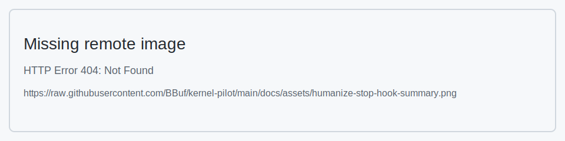
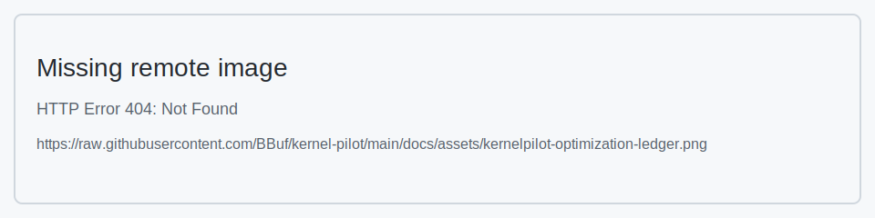

# Humanize가 가져온 Codex 사용 패러다임 변화

> Humanize가 가져온 Codex 사용 패러다임 변화, Agent kernel 최적화 한계 열기

## 0x0. 머리말

이전에 model profile tuning 관련 SKILL 몇 개와 kernel optimization 관련 SKILL 하나를 만들었지만, 효과는 제가 원하는 상태와 아직 거리가 있었습니다. long-term automatic optimization 수준에 도달하지 못했습니다. 이유는 간단합니다. SKILL은 본질적으로 one-shot context injection에 가깝습니다. Agent는 이를 따라 한동안 작업할 수 있지만, 장기적으로 goal, evidence, failure record, next direction을 스스로 유지하기는 어렵습니다.

Claude Opus 4.6, GPT-5.5 같은 model은 이미 충분히 강해서 single code patch는 어렵지 않습니다. 골치 아픈 것은 long task입니다. 같은 목표를 중심으로 수십 시간 동안 계속 iteration하고, 매 round마다 test, benchmark, profile, review evidence를 남겨야 합니다. 최근에는 Humanize(https://github.com/PolyArch/humanize), Codex `/goal`, AVO paper를 집중적으로 봤고, KernelPilot(https://github.com/BBuf/kernel-pilot) repository도 새로 만들었습니다.

model의 단발 code writing ability는 더 이상 주요 bottleneck이 아닙니다. 더 어려운 것은 model을 long-running loop 안에 넣을 수 있는지입니다. 이 loop는 code를 읽고, benchmark를 돌리고, NCU를 보고, version evolution relation을 기록해야 합니다. 몇 round 연속 gain이 낮을 때는 current bottleneck에 맞춰 새로운 PR, source, test, benchmark, profile record를 추가로 읽고, 이미 읽은 source를 기록해 다음 round에서 반복해서 읽지 않아야 합니다. 마지막으로 independent review를 통해 premature completion을 막아야 합니다. 이 중 하나라도 빠지면 ordinary Vibe Coding으로 퇴화합니다. 사람이 여러 round를 수동으로 물어보고, 다음에 무엇을 해야 하는지 계속 reminder를 줘야 하며, 뒤에서 보일 performance optimization effect를 안정적으로 얻기도 어렵습니다.

## 0x1. Humanize가 바꾼 것

Humanize(https://github.com/PolyArch/humanize)에서는 RLCR, 즉 Ralph-Loop with Codex Review를 사용합니다. 하는 일은 비교적 직접적입니다. implementation, summary, review, continue iteration 같은 action을 고정해 Agent가 현재 conversation window에만 의존하지 않게 합니다.

- plan과 acceptance criteria가 있으며, 생각나는 대로 수정하지 않습니다.
- 각 round implementation 후에는 반드시 summary를 작성합니다.
- Codex가 summary와 code를 independent review하고, 통과하지 못하면 다음 round를 계속합니다.
- 마지막에는 code review stage가 있으며, 스스로 끝났다고 말한다고 끝나지 않습니다.
- state는 모두 `.humanize/`에 저장되며, 현재 conversation window에 의존해 기억하지 않습니다.

Humanize의 가장 유용한 점은 "완료"를 external judgment로 바꾼 것입니다. 더 이상 Agent 자신이 완료 여부를 판단하지 않습니다. 이전에 Codex로 inference framework optimization을 할 때는 종종 사람이 옆에서 지켜봐야 했습니다. 중간에 profile을 잊었는지, test만 고쳤는지, benchmark가 baseline과 맞지 않는지 계속 봐야 했습니다. Humanize는 적어도 이런 문제를 review 가능한 state file과 next-round prompt로 바꿔 줍니다.

따라서 이것이 가져온 변화는 단지 "command 하나 추가"가 아닙니다. 더 정확히 말하면 Codex를 사용하는 자세가 바뀌었습니다. question-answer에서 Codex를 review가 있는 engineering loop 안에 넣는 방식으로 바뀐 것입니다.

## 0x2. AVO와 Codex /goal

AVO paper Agentic Variation Operators for Autonomous Evolutionary Search(https://arxiv.org/abs/2603.24517)는 LLM을 candidate generator에서 variation operator로 upgrade하는 것을 논의합니다. Agent가 history version, knowledge base, execution feedback을 직접 보고, 무엇을 읽을지, 무엇을 바꿀지, 무엇을 test할지, 어떻게 고칠지 결정할 수 있다는 것입니다.

이 논문에서 AVO는 B200에서 7일 연속 실행되어 500개 이상의 optimization direction을 탐색했고, 40개 kernel version을 제출했으며, 마지막에는 MHA에서 cuDNN보다 최대 3.5%, FlashAttention-4보다 최대 10.5% 빨랐습니다. 이후 MHA를 GQA로 port하는 데는 약 30분밖에 걸리지 않았습니다. 이 숫자 자체보다 더 유용한 것은, kernel optimization이 long-term autonomous search로 수행될 수 있다는 점을 명확히 보여준 것입니다. 이는 kernel 하나를 단발로 생성하는 것과는 다른 일입니다.

Codex `/goal`도 이 방향으로 가고 있습니다. OpenAI 문서에서는 `/goal`을 experimental long-running task target으로 정의하며, `features.goals`가 필요합니다. 목적은 long task에서 Codex가 persistent goal을 갖도록 하는 것입니다. 하지만 `/goal` 하나만으로는 충분하지 않습니다. Kernel optimization은 계속 실행되기만 하면 되는 것이 아니라, evidence를 가지고 계속 실행되어야 합니다.

간단히 비교하면 다음과 같습니다.

| 항목 | 하는 일 | 여기서의 사용 방식 |
| --- | --- | --- |
| Humanize | external review gate + state machine | Agent의 premature stop, goal drift, completion misjudgment 방지 |
| Codex `/goal` | Codex native long goal | long task를 official runtime capability 범위로 넣음 |
| AVO | paper의 long-term optimization experiment | version relation, knowledge base, execution feedback이 optimization을 어디까지 밀 수 있는지 확인 |
| KernelPilot | 현재 landing version | Humanize를 GPU kernel optimization loop로 개조 |

## 0x3. 일반 CUDA SKILL의 한계

ordinary SKILL의 가장 큰 문제는 너무 "manual" 같다는 것입니다. Codex에게 kernel을 어떻게 쓰고, benchmark를 어떻게 돌리고, ncu를 어떻게 쓰는지 알려줄 수는 있지만, 여러 experiment를 서로 연결하는 책임은 지지 않습니다.

실제 kernel optimization에서 가장 값진 정보는 종종 다음 state에 있습니다.

- 현재 best가 어떤 version이고, 왜 선택했는가.
- 어떤 direction을 이미 시도했고, 왜 실패했는가.
- benchmark의 shape, dtype, baseline이 일치하는가.
- NCU가 실제로 tensor pipe 부족, L1/L2 replay, long scoreboard, shared bank conflict, launch overhead 중 무엇을 보여주는가.
- 2 round 연속 gain이 1% 미만일 때, 계속 같은 parameter만 만질 것이 아니라 어떤 새 code를 읽어야 하는가.

이전에는 SGLang, vLLM, TensorRT-LLM, CUTLASS, FlashInfer, DeepGEMM, GPU Mode, CUDA blog 지식을 대량으로 SKILL에 넣었지만, 결국 context와 retrieval 문제에 부딪혔습니다. 문서 전체를 넣는 것은 소용이 없고, routing 가능한 knowledge base가 더 필요합니다. 현재 task가 GEMM이면 GEMM을 읽고, attention이면 attention을 읽습니다. 2 round 연속 low gain이면 topic과 framework에 따라 새로운 PR diff, kernel source, tests, benchmark, profile record를 추가로 읽고, 어떤 source를 이미 읽었는지 기억해야 합니다.

## 0x4. KernelPilot은 무엇을 했는가

KernelPilot(https://github.com/BBuf/kernel-pilot)은 기본적으로 위의 아이디어를 Humanize에 넣은 결과입니다. vendored upstream Humanize를 기반으로 하고, 여기에 kernel-specific workflow를 더했습니다.

original Humanize와 비교해 주된 변경점은 다음과 같습니다.

- `humanize-kernel-agent-loop` 추가: 사용자는 kernel optimization goal 한 문장만 주면, 스스로 plan을 만들고, plan을 refine하고, standalone repo를 만들고, RLCR을 시작합니다.
- `kernel-knowledge` 추가: local GPU kernel knowledge base로, 먼저 topic/framework별 routing을 하고 source guide, PR notes, benchmark, test를 읽습니다.
- `profile-evidence` 추가: NCU output을 Profile Evidence Digest로 정리하고, 마지막에는 반드시 구체적인 next modification으로 이어지게 합니다.
- standalone repo 강제: candidate kernel이 SGLang/vLLM 같은 대형 repository를 직접 오염시키지 않도록 binding, tests, benchmarks, ledgers, profile artifacts를 별도로 보관합니다.
- 기록 강제: `attempt-ledger.md`에는 모든 version을 기록하고, `optimization-ledger.md`에는 유효한 speedup version만 기록합니다. `source-idea-ledger.md`에는 source와 반복해서 읽지 말아야 할 mark를 기록하고, version relation record에는 parent version, motivation, result를 저장합니다.
- 2 round 연속 gain이 1% 미만이면 material expansion을 trigger합니다. 최소 50개의 새로운 code source를 추가로 읽은 뒤 계속 수정합니다.

knowledge base는 현재 주로 다음을 cover합니다.

- SGLang, vLLM, TensorRT-LLM, FlashAttention, FlashInfer, CUTLASS/CuTe, DeepGEMM, TileLang, CCCL/CUB 등 CUDA optimization PR.
- PyTorch, Triton, ThunderKittens, DeepSeek TileKernels, QuACK, blog companion code 같은 source-only code index.
- AKO4ALL의 CUDA/CUTLASS/Triton/NCU reference.
- topic별 matmul-gemm, attention, moe, normalization, activation-fusion, kv-cache, communication entry.

NCU에서는 주로 다음 metric을 봅니다.

| 범주 | 주로 보는 것 |
| --- | --- |
| overall throughput | `Compute (SM) Throughput`, `Memory Throughput`, tensor pipe utilization |
| memory hierarchy | DRAM / L2 / L1TEX throughput, L1/L2 hit rate |
| scheduling | `No Eligible`, `Eligible Warps Per Scheduler`, issue slot busy |
| stall | long scoreboard, short scoreboard, no instruction, imc miss, dispatch stall |
| memory access pattern | global load sector utilization, uncoalesced global/shared access |
| shared memory | bank conflict, shared load/store replay |
| resource | registers/thread, shared memory/block, occupancy, waves/SM, spills |

NCU의 역할은 먼저 bottleneck type을 판단하고 optimization direction을 좁히는 것입니다. compute bound에서는 tensor pipe / SM throughput, tile shape, epilogue overhead, instruction choice를 주로 봅니다. memory bound에서는 DRAM/L2/L1TEX throughput, sector utilization, memory coalescing, cache hit rate를 우선 봅니다. latency bound에서는 long/short scoreboard, eligible warps, occupancy, register, shared memory conflict를 더 봅니다. bottleneck마다 대응하는 수정도 다릅니다. compute bound는 tile과 tensor core path를 바꾸는 쪽으로 기울고, memory bound는 coalesce, vectorization, data reuse를 우선 처리하며, latency bound는 occupancy, independent instruction, shared bank conflict, dependency chain 감소에 더 집중합니다.

## 0x5. Prompt Cards와 사용법

설치는 간단합니다.

```bash
git clone https://github.com/BBuf/kernel-pilot.git
cd kernel-pilot
./scripts/install-codex-skills.sh
```

그런 다음 Codex를 restart하고 `/skills`에서 다음을 볼 수 있는지 확인합니다.

- `humanize-kernel-agent-loop`
- `kernel-knowledge`
- `profile-evidence`

이번 `int8_scaled_mm` demo는 baseline kernel code를 건드리지 않고, 처음부터 handwritten prompt로 진행했습니다.

```text
[$humanize-kernel-agent-loop] I want to optimize SGLang's H100 int8_scaled_mm kernel on H100. Implement the candidate kernel from scratch and use the existing SGLang/CUTLASS kernel only as the correctness/performance comparison baseline. Work in a clean standalone repo and keep source provenance plus version history.
```

이 workflow는 약 12시간 동안 autonomous하게 실행되어 처음부터 `int8_scaled_mm`를 작성했고, 마지막에는 focused case에서 SGLang baseline보다 `15.12%` 빨랐습니다. 아래는 Humanize stop hook과 KernelPilot ledger의 effect image입니다.





하지만 SGLang에 이미 있는 kernel이라면 기본적으로 from scratch로 시작하는 것은 추천하지 않습니다. 더 빠른 방식은 두 번째 prompt를 사용하는 것입니다. 기존 baseline kernel을 starting point로 두고 그 위에서 계속 optimize하면, correctness-first에서 baseline에 가까워지는 많은 무효 구간을 건너뛸 수 있습니다.

```text
[$humanize-kernel-agent-loop] I want to optimize SGLang's H100 int8_scaled_mm kernel on H100. Use the existing SGLang/CUTLASS kernel as the baseline and starting point. Work in a clean standalone repo, keep source provenance plus version history, and use the most appropriate kernel language for the candidate.
```

이번 from-scratch experiment에서는 SGLang을 correctness/performance baseline과 prior art로만 사용했고, candidate implementation은 handwritten CUDA C++로 제한했습니다. Triton, CUTLASS, CuTe DSL, ThunderKittens, torch.compile, cuBLAS/cuBLASLt는 사용하지 않았습니다.

## 0x6. int8_scaled_mm 현재 효과

이번 experiment directory는 `/Users/bbuf/workdir/Common/int8_scaled_mm`이고, Humanize cache는 `/Users/bbuf/.cache/humanize/-Users-bbuf-Common_int8_scaled_mm`입니다.

현재 selected version은 `v23-wmma-inblock-split-k8-two-n-half2`입니다. H100에서 `M=64,N=2048,K=2048,fp16,bias=true` focused case의 결과는 다음과 같습니다.

- v0 scalar: `0.603872 ms`
- SGLang same-run baseline: `0.017888 ms`
- 현재 v23: `0.015184 ms`

즉 처음 handwritten scalar에서 v23까지 약 `39.8x`이고, 같은 run의 SGLang baseline과 비교하면 v23이 `15.12%` 빠릅니다. 이후 v24-v29도 몇 round 더 시도했지만 모두 1% selection gate를 넘지 못했으므로 현재 best는 여전히 v23입니다. Round 41은 새 material expansion을 마쳤고, 다음 방향은 `v30-wmma-inblock-split-k8-two-n-combined-rowmajor-acc`이지만 아직 selected되지는 않았습니다.

아래는 주요 version record입니다.

| 버전 | p50(ms) | 결과 | 이번 round에서 바꾼 것 |
| --- | ---: | --- | --- |
| v0 | 0.603872 | baseline | thread 하나가 output element 하나를 계산, 먼저 correctness 보장 |
| v1 | 0.163648 | selected | warp-per-output, lane이 K dimension에서 협력 accumulate |
| v2 | 0.122496 | selected | shared memory staging A row, A 반복 read 감소 |
| v3 | 0.126400 | rejected | shared-A를 16 warps로 확장, 느려짐 |
| v4 | 0.179584 | rejected | K loop double accumulator, register/dependency 악화 |
| v5 | 0.074624 | selected | `__dp4a` packed-K route |
| v6 | 0.058592 | selected | warp 하나가 인접한 N 두 개를 동시에 계산 |
| v7 | 0.048576 | selected | contiguous 32-bit stride fast path, address overhead 감소 |
| v8 | 0.052576 | rejected | dp4a K loop unroll2, 느려짐 |
| v9 | 0.048064 | selected | warp 하나가 인접한 N 네 개 계산, 소폭 이득 |
| v10 | 0.045792 | selected | `__launch_bounds__`로 register 압박 |
| v11 | 0.045088 | selected | B pointer를 base offset으로 바꿔 live state 감소 |
| v12 | 0.045088 | rejected | exact N/K specialization, 이득 없음 |
| v13 | 0.053024 | rejected | launch bounds를 6 blocks/SM으로 완화, regression |
| v14 | 0.023392 | selected | handwritten WMMA int8 16x16 tensor core로 전환 |
| v15 | 0.021216 | selected | split-K8, partial int32 후 reduce |
| v16 | 0.027776 | rejected | split-K8 + shared-A grouped-N, regression |
| v17 | 0.018176 | selected | in-block split-K8, reduce/epilogue를 하나의 CTA에 merge |
| v18 | 0.018272 | rejected | shared accumulator padding to stride 20, 통과 못함 |
| v19 | 0.020160 | rejected | launch-bounds8, regression |
| v20 | 0.018432 | rejected | split-K4, regression |
| v21 | 0.021632 | rejected | exact 2048x2048 in-block split-K8, regression |
| v22 | 0.017184 | selected | epilogue에서 half2 pair writeback 사용 |
| v23 | 0.015184 | selected | CTA 하나가 16x16 N tile 두 개를 계산해 A fragment reuse |
| v24 | 0.015200 | rejected | v23 위에 accumulator padding 추가, 거의 동일 |
| v25 | 0.015168 | rejected | launch-bounds5, 이득이 1% 미만 |
| v26 | 0.015280 | rejected | epilogue reduction에서 `int2` pair load, regression |
| v27 | 0.015168 | rejected | `cudaFuncCachePreferL1`, 이득 1% 미만 |
| v28 | 0.023168 | rejected | inline `mma.m16n8k32` + register epilogue, 명확한 regression |
| v29 | 0.015088 | rejected | vectorized scale/bias load, 0.63%뿐이라 1% gate 미통과 |

여기서 참고 가치가 있는 점은, 보기에는 "더 빠를 것 같은" 많은 방향이 실제 benchmark 후에는 이득이 없었다는 것입니다. shared accumulator padding, launch bounds, prefer L1, inline MMA 같은 것들은 모두 test와 profile result로 확인해야 합니다. Humanize + KernelPilot의 장점은 여기에 있습니다. 모든 방향이 evidence를 남기고, 실패도 유용하며, 다음 round에서 같은 방향을 반복하지 않습니다.

## 0x7. 더 많은 model optimization 가능성 열기

현재 이 workflow로 보면 SGLang 같은 inference framework optimization은 세 가지 일이 됩니다.

- 사람이 goal, boundary, acceptance criteria를 정의합니다.
- Agent는 long-term execution, code reading, code editing, experiment running을 담당합니다.
- Harness는 memory, review, profile evidence, stopping condition을 담당합니다.

Codex에게 kernel 하나를 쓰게만 하면 효과는 사실 평범합니다. 심지어 사용자가 GPU kernel expert여서 direction을 주고, profile을 읽고, result가 신뢰할 만한지 판단할 수 있어야 합니다. SGLang, vLLM, TensorRT-LLM, FlashInfer, CUTLASS, DeepGEMM 같은 project의 optimization experience를 searchable knowledge base로 만들고, Humanize/`goal`/NCU/benchmark 같은 long-running loop와 결합하면 model optimization과 kernel optimization은 AVO 같은 autonomous search에 더 가까워집니다.

저는 Humanize를 사용해 model tuning과 kernel optimization을 결합하고 있으며, 이후 AI-Infra-Auto-Driven-SKILLS(https://github.com/BBuf/AI-Infra-Auto-Driven-SKILLS) repository로 push할 예정입니다. 목표는 SGLang의 model optimization과 kernel optimization을 모두 auto-driving으로 만들고, task를 준 뒤에는 가능한 한 중간 개입이 필요 없게 하는 것입니다.

## 0x8. 참고

- Humanize: https://github.com/PolyArch/humanize
- KernelPilot: https://github.com/BBuf/kernel-pilot
- AVO paper: https://arxiv.org/abs/2603.24517
- Codex `/goal` docs: https://developers.openai.com/codex/cli/slash-commands#set-an-experimental-goal-with-goal
- AI-Infra-Auto-Driven-SKILLS: https://github.com/BBuf/AI-Infra-Auto-Driven-SKILLS
- SGLang: https://github.com/sgl-project/sglang
- vLLM: https://github.com/vllm-project/vllm
- TensorRT-LLM: https://github.com/NVIDIA/TensorRT-LLM
- FlashInfer: https://github.com/flashinfer-ai/flashinfer
- FlashAttention: https://github.com/Dao-AILab/flash-attention
- CUTLASS/CuTe: https://github.com/NVIDIA/cutlass
- DeepGEMM: https://github.com/deepseek-ai/DeepGEMM
- TileLang: https://github.com/tile-ai/tilelang
- CCCL/CUB: https://github.com/NVIDIA/cccl
- AKO4ALL: https://github.com/TongmingLAIC/AKO4ALL
