# [CUDA 기초] LeetCUDA: v3.0 대규모 업그레이드, 면접 준비 길 잃지 않기

> 원문: https://zhuanlan.zhihu.com/p/19862356369

**목차**
- 0x00 서문
- 0x01 회고와 부족한 점
- 0x02 v3.0 소개
- 0x03 기본 환경 추천
- 0x04 PyTorch Python bindings
- 0x05 HGEMM Benchmark
- 0x06 FlashAttention-2 MMA Benchmark
- 0x07 200+ CUDA Kernels (Easy -> Hard++)
- 0x08 100+ 기술 블로그 추천
- 0x09 정리

### 0x00 서문

먼저 적어 두자면, **새해에는 CUDA 기초 입문 시리즈를 쓰기 시작할 예정입니다. CUDA 입문자를 대상으로 Easy -> very Hard까지 다룹니다.** 사실 이 생각은 2024년 3월부터 있었습니다. 다만 제 노트와 자료가 아직 만족스러운 상태가 아니었고, CUDA에 대한 제 이해와 응용도 더 보완이 필요했습니다. 그래서 이전에 정리해 둔 xlite-dev/LeetCUDA 노트를 계속 확장하기로 했습니다. 거의 1년 동안 여가 시간을 들여 정리한 끝에, 이제 CUDA 기초 시리즈 노트를 써도 되겠다고 생각하는 상태까지 왔습니다. 자료는 준비됐고, 2025년에도 노트를 계속 업데이트하며 공부를 이어갑니다.

이 글의 내용은 다음과 같습니다.

- 0x01 회고와 부족한 점
- 0x02 v3.0 소개
- 0x03 기본 환경 추천
- 0x04 PyTorch python bindings
- 0x05 HGEMM MMA Benchmark
- 0x06 FlashAttention-2 MMA Benchmark
- 0x07 200+ CUDA/Tensor Cores Kernels
- 0x08 100+ 기술 블로그 추천
- 0x09 정리

### 0x01 회고와 부족한 점

2024년 이맘때쯤, 저는 CUDA 노트를 글로 정리해 Zhihu에 올리고 동시에 xlite-dev/LeetCUDA 저장소로 오픈소스화했습니다. 관련 kernel에는 warp reduce, block all reduce, dot-product, softmax, layer-norm, rms-norm, element-wise, sgemv, sgemm 등이 포함되었습니다. 다룬 CUDA 최적화 기법은 주로 coalesced memory access, vectorization, bank conflicts reduce, warp shuffle, warp sgemv, sgemm double buffers 등이었습니다. 이전 글은 다음과 같습니다.


*DefTruth: [CUDA 최적화][3만 자] 고빈도 면접 문제 모음 - 대형 모델 CUDA 직접 구현*

첫 번째 LeetCUDA 버전은 어느 정도 좋아요와 stars를 받았습니다. 하지만 명백히 많은 문제가 있었습니다. 예를 들면 수치 검증 사례가 없고, FP32만 지원하며 FP16/BF16/INT8/FP8 등을 지원하지 않았고, 순수 CUDA/C++ 코드라 Python/PyTorch 사용자가 성능과 수치 결과를 비교하기 불편했습니다. Tensor Cores 적용 사례도 없고, TF32도 없고, HGEMM/FlashAttention의 Tensor Cores 구현도 없었습니다. 난이도도 쉬운 것부터 어려운 것까지 단계적으로 나뉘어 있지 않았습니다.

### 0x02 v3.0 소개

LeetCUDA가 단순한 `.cu` 파일 하나가 아니라 학습 의미가 있는 노트가 되도록, 지난 1년 동안 여가 시간에 계속 유지보수하고 업데이트했습니다. CUDA 입문에서 자주 만나는 주제를 매우 쉬운 것부터 매우 어려운 것까지 추가했고, Python/PyTorch 사용 습관을 충분히 고려해 각 주제의 kernel 구현에 PyTorch binding을 붙였습니다.

그래서 이제 전체 이름도 **LeetCUDA: Modern CUDA Learn Notes with PyTorch for Beginners**로 바꾸었습니다. 현재 **3k+ stars**도 받았습니다. CUDA 문제 풀이와 학습에는 xlite-dev/LeetCUDA를 참고해 주세요.

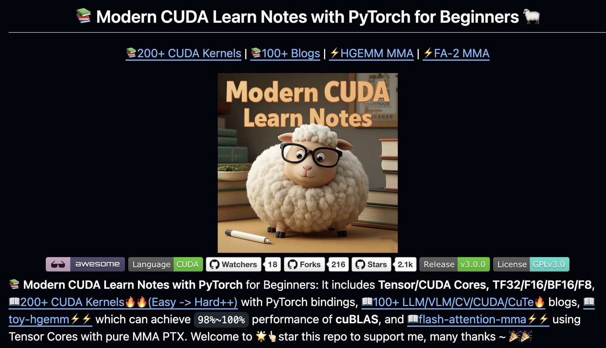
*Modern CUDA Learn Notes with PyTorch for Beginners*

**200+ CUDA/Tensor Cores Kernels**

xlite-dev/LeetCUDA는 kernel을 주제별로 구현하고 정리합니다. 총 **200개에 가까운 CUDA kernels**를 구현했고, CUDA Cores와 Tensor Cores 사용 사례를 포함합니다. 또한 FP32/TF32/FP16/BF16/FP8/INT8 등 대부분의 흔한 데이터 타입을 다룹니다. 어떤 kernel은 매우 단순하고, 예를 들어 elementwise가 그렇습니다. 반면 어떤 kernel은 매우 도전적입니다. 예를 들어 공식 FA2와 거의 같은 성능을 내는 MMA 버전 FlashAttention 직접 구현이 있습니다.

각 주제의 workflow는 다음과 같습니다.

```text
custom CUDA kernel 구현 -> PyTorch Python binding -> Python test
```

HGEMM처럼 peak performance 평가가 필요한 경우에는 추가 Python overhead를 피하기 위해 C++ binary 테스트 방식도 제공합니다. 난이도는 5단계입니다.

- Easy
- Medium
- Hard
- Hard+
- Hard++

Easy와 Medium 부분은 elementwise, matrix transpose(mat_trans), warp/block reduce, non-maximum suppression(nms), ReLU, GELU, Swish, ROPE, layer-norm, rms-norm, Online Softmax, dot-prod, Embedding, 그리고 FP32/FP16/BF16/FP8의 기본 사용법을 포함합니다. Hard, Hard+, Hard++ 부분은 고급 주제를 더 깊게 다룹니다. 주로 **sgemv, sgemm, hgemv, hgemm, flash-attention** 같은 op에 집중하며, 순수 Tensor Cores MMA PTX로 구현한 kernels도 많이 제공합니다.

그중 **HGEMM 최적 구현은 cuBLAS 98%~100% 성능**에 도달했습니다. 직접 구현한 FlashAttention-2 MMA는 MMA Acc F32 상황에서 공식 FA-2의 약 95%~99% 성능에 도달합니다.

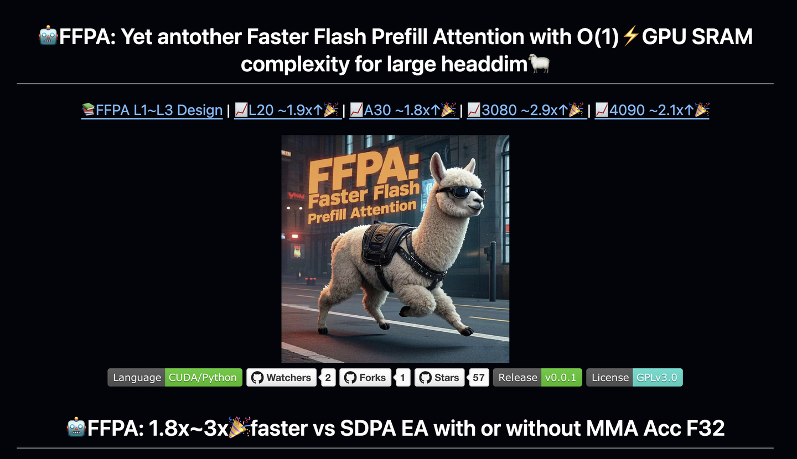
*FFPA: Yet another Faster Flash Prefill Attention*

이 과정에서 여러 SRAM 및 register 최적화 방식을 시도했고, **결국 FA-2에 대한 개선안**도 만들었습니다. 그것이 **FFPA**입니다. FFPA는 **O(1) SRAM complexity**로 head_dim을 1024까지 확장하고, 80% 이상의 TFLOPS utilization을 유지하며, SDPA EA보다 2~3배 빠릅니다.

FFPA의 공학적 아이디어는 FA2 및 SDPA EA와 다르고, FA를 더 확장하는 의미도 있으므로 LeetCUDA에서 분리해 별도 repo로 유지합니다. **head_dim > 256을 사용하는 장면은 많지 않기 때문에, FFPA는 현재 참고용 experimental kernel과 benchmark만 제공합니다. 그래도 성능은 꽤 좋습니다.** 관심 있는 분은 GitHub 링크를 참고해 주세요. 이 글에서는 FFPA를 자세히 소개하지 않고, 이후 별도 글에서 다룰 예정입니다.

**100+ 기술 블로그 추천**

제가 직접 쓴 CUDA 노트와 예제 외에도, 개인적으로 좋아하는 기술 블로그 100개 이상을 정리했습니다. 이 블로그들에서 정말 많은 것을 배웠고, 읽을 때마다 잘 썼다는 생각이 듭니다. 그래서 LeetCUDA 안에 함께 정리해 추천 목록으로 넣었습니다. 이 기술 블로그들은 주제별로 분류되어 있어 필요에 따라 읽으면 됩니다.


*100+ 기술 블로그 추천*

스크린샷 하나에는 전체 내용이 다 들어가지 않습니다. 관심 있는 분은 xlite-dev/LeetCUDA에서 확인하면 됩니다.

### 0x03 기본 환경 추천

- Python >= 3.10
- PyTorch >= 2.4.0, CUDA >= 12.4
- Recommended: PyTorch 2.5.1, CUDA 12.5
- Docker: http://nvcr.io/nvidia/pytorch:24.10-py3

그냥 NVIDIA 공식 이미지를 쓰는 것을 추천합니다. 편합니다. 추천 이미지: http://nvcr.io/nvidia/pytorch:24.10-py3. LeetCUDA의 모든 kernel은 이 환경에서 테스트를 통과했습니다. CUDA 11 환경은 특히 추천하지 않습니다. FP8과 최신 MMA instruction 일부는 CUDA 11에서 다루기 어렵습니다. 이제 2025년이니 CUDA 12+를 쓰는 편이 좋습니다.

### 0x04 PyTorch Python bindings

이 절에서는 xlite-dev/LeetCUDA의 workflow를 설명합니다. xlite-dev/LeetCUDA는 kernels를 주제별로 나누고, 각 주제의 kernel 구현에 PyTorch python binding을 제공합니다. 따라서 Python script로 성능과 수치 검증을 바로 수행할 수 있습니다. 예를 들어 아래는 block all reduce 예시입니다.

```cpp
// packed_type, acc_type, th_type, element_type, n_elements_per_pack, out_type
TORCH_BINDING_REDUCE(f32,              f32,  torch::kFloat32,       float,              1,  float)
TORCH_BINDING_REDUCE(f32x4,            f32,  torch::kFloat32,       float,              4,  float)
TORCH_BINDING_REDUCE(f16,              f16,  torch::kHalf,          half,               1,  float)
TORCH_BINDING_REDUCE(f16,              f32,  torch::kHalf,          half,               1,  float)
TORCH_BINDING_REDUCE(f16x2,            f16,  torch::kHalf,          half,               2,  float)
TORCH_BINDING_REDUCE(f16x2,            f32,  torch::kHalf,          half,               2,  float)
TORCH_BINDING_REDUCE(f16x8_pack,       f16,  torch::kHalf,          half,               8,  float)
TORCH_BINDING_REDUCE(f16x8_pack,       f32,  torch::kHalf,          half,               8,  float)
TORCH_BINDING_REDUCE(bf16,             bf16, torch::kBFloat16,      __nv_bfloat16,      1,  float)
TORCH_BINDING_REDUCE(bf16,             f32,  torch::kBFloat16,      __nv_bfloat16,      1,  float)
TORCH_BINDING_REDUCE(bf16x2,           bf16, torch::kBFloat16,      __nv_bfloat16,      2,  float)
TORCH_BINDING_REDUCE(bf16x2,           f32,  torch::kBFloat16,      __nv_bfloat16,      2,  float)
TORCH_BINDING_REDUCE(bf16x8_pack,      bf16, torch::kBFloat16,      __nv_bfloat16,      8,  float)
TORCH_BINDING_REDUCE(bf16x8_pack,      f32,  torch::kBFloat16,      __nv_bfloat16,      8,  float)
TORCH_BINDING_REDUCE(fp8_e4m3,         f16,  torch::kFloat8_e4m3fn, __nv_fp8_storage_t, 1,  float)
TORCH_BINDING_REDUCE(fp8_e4m3x16_pack, f16,  torch::kFloat8_e4m3fn, __nv_fp8_storage_t, 16, float)
TORCH_BINDING_REDUCE(fp8_e5m2,         f16,  torch::kFloat8_e5m2,   __nv_fp8_storage_t, 1,  float)
TORCH_BINDING_REDUCE(fp8_e5m2x16_pack, f16,  torch::kFloat8_e5m2,   __nv_fp8_storage_t, 16, float)
TORCH_BINDING_REDUCE(i8,               i32,  torch::kInt8,          int8_t,             1,  int32_t)
TORCH_BINDING_REDUCE(i8x16_pack,       i32,  torch::kInt8,          int8_t,             16, int32_t)
```

이 예시는 대부분의 흔한 데이터 타입을 포함합니다. 기존 CUDA 노트들이 FP16과 Tensor Cores를 거의 다루지 않는 것과 달리, xlite-dev/LeetCUDA는 FP16과 Tensor Cores에 많은 노력을 들였고, HGEMM과 FlashAttention-MMA 같은 사례를 많이 제공합니다. BF16/FP8 같은 데이터 타입도 적용 사례를 제공합니다. 예를 들어 이 block all reduce는 FP32/FP16/BF16/FP8/INT8 등을 지원합니다.

PyTorch binding을 거치면 수치 결과와 성능 검증이 매우 간단합니다. Python script를 바로 실행하면 되고, 별도의 C++ compile 환경을 구성할 필요가 없습니다.

```bash
# Ada architecture만 테스트. 지정하지 않으면 Volta, Ampere, Ada, Hopper 등 모든 architecture를 컴파일하므로 오래 걸림
export TORCH_CUDA_ARCH_LIST=Ada 
python3 block_all_reduce.py
```

로그 출력은 다음과 같습니다(block all reduce 예시).

```text
--------------------------------------------------------------------------------
                                        S=4096, K=4096
               out_f32f32: -2295.19458008 , time:0.10227132ms
             out_f32x4f32: -2295.19702148 , time:0.03361320ms
            out_f32f32_th: -2295.19946289 , time:0.02290916ms
--------------------------------------------------------------------------------
               out_f16f16: -2293.83764648 , time:0.10097337ms
               out_f16f32: -2296.36425781 , time:0.10095334ms
             out_f16x2f32: -2297.93896484 , time:0.03533483ms
             out_f16x2f16: -2297.96386719 , time:0.03572583ms
         out_f16x8packf16: -2299.68701172 , time:0.01311255ms
         out_f16x8packf32: -2296.36645508 , time:0.01308966ms
            out_f16f16_th: -2296.00000000 , time:0.01445580ms
--------------------------------------------------------------------------------
             out_bf16bf16: -2264.30468750 , time:0.10450244ms
              out_bf16f32: -2293.59399414 , time:0.10095382ms
            out_bf16x2f32: -2299.56005859 , time:0.03533602ms
           out_bf16x2bf16: -2284.02343750 , time:0.03620267ms
        out_bf16x8packf32: -2290.28173828 , time:0.01310396ms
       out_bf16x8packbf16: -2282.46875000 , time:0.01368093ms
          out_bf16bf16_th: -2288.00000000 , time:0.01442218ms
--------------------------------------------------------------------------------
            out_f8e4m3f16: -2332.72070312 , time:0.10321760ms
     out_f8e4m3x16packf16: -2329.65625000 , time:0.01123261ms
         out_f8e4m3f16_th: -2330.00000000 , time:0.01445007ms
--------------------------------------------------------------------------------
            out_f8e5m2f16: -2035.82812500 , time:0.10325360ms
     out_f8e5m2x16packf16: -2034.17187500 , time:0.01119351ms
         out_f8e5m2f16_th: -2036.00000000 , time:0.01442766ms
--------------------------------------------------------------------------------
                out_i8i32: -2746          , time:0.10370731ms
         out_i8x16packi32: -2746          , time:0.01133108ms
             out_i8i32_th: -2746          , time:0.36144137ms
--------------------------------------------------------------------------------
```

핵심은 시작하자마자 바로 실행해 볼 수 있다는 점입니다. 실행한 뒤 kernel 구현 코드를 읽고 직접 수정해 보면 자연스럽게 block all reduce 작성법을 익힐 수 있습니다. HGEMM과 FlashAttention도 마찬가지입니다.

### 0x05 HGEMM Benchmark

HGEMM은 CUDA 최적화에서 피하기 어려운 기본기입니다. 직접 써 보지 않으면 뭔가 아쉽습니다. xlite-dev/LeetCUDA도 많은 HGEMM + Tensor Cores MMA 구현을 제공합니다. 최적 구현의 성능은 cuBLAS의 98%~100%까지 도달합니다. 구현된 주요 특성은 대략 다음과 같습니다.

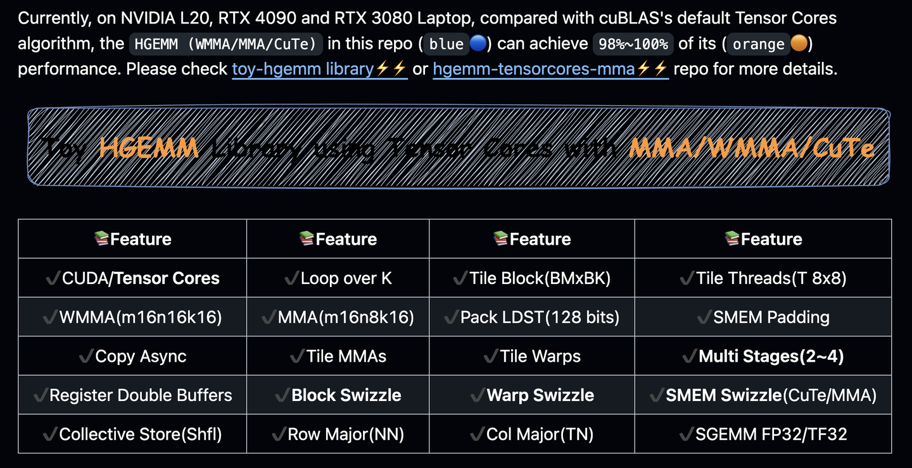
*HGEMM Tensor Cores*

현재 xlite-dev/LeetCUDA가 제공하는 HGEMM Kernels는 Loop over K, Tile Block, Tile MMAs(more threads), Tile Warps(more values), Pack LDST, SMEM Padding, SMEM Swizzle, Block Swizzle, Warp Swizzle, Multi-Stages, Registers Double Buffers, NN/TN Layout, Collective Store(Warp shuffle & registers reuse) 등의 주요 특성을 구현합니다. 구현된 HGEMM CUDA Kernel은 다음과 같습니다.

```cpp
void hgemm_naive_f16(torch::Tensor a, torch::Tensor b, torch::Tensor c);
void hgemm_sliced_k_f16(torch::Tensor a, torch::Tensor b, torch::Tensor c);
void hgemm_t_8x8_sliced_k_f16x4(torch::Tensor a, torch::Tensor b, torch::Tensor c);
void hgemm_t_8x8_sliced_k_f16x4_pack(torch::Tensor a, torch::Tensor b, torch::Tensor c);
void hgemm_t_8x8_sliced_k_f16x4_bcf(torch::Tensor a, torch::Tensor b, torch::Tensor c);
void hgemm_t_8x8_sliced_k_f16x4_pack_bcf(torch::Tensor a, torch::Tensor b, torch::Tensor c);
void hgemm_t_8x8_sliced_k_f16x8_pack_bcf(torch::Tensor a, torch::Tensor b, torch::Tensor c);
void hgemm_t_8x8_sliced_k_f16x8_pack_bcf_dbuf(torch::Tensor a, torch::Tensor b, torch::Tensor c);
void hgemm_t_8x8_sliced_k16_f16x8_pack_dbuf(torch::Tensor a, torch::Tensor b, torch::Tensor c);
void hgemm_t_8x8_sliced_k16_f16x8_pack_dbuf_async(torch::Tensor a, torch::Tensor b, torch::Tensor c);
void hgemm_t_8x8_sliced_k32_f16x8_pack_dbuf(torch::Tensor a, torch::Tensor b, torch::Tensor c);
void hgemm_t_8x8_sliced_k32_f16x8_pack_dbuf_async(torch::Tensor a, torch::Tensor b, torch::Tensor c);
void hgemm_t_16x8_sliced_k32_f16x8_pack_dbuf(torch::Tensor a, torch::Tensor b, torch::Tensor c);
void hgemm_t_16x8_sliced_k32_f16x8_pack_dbuf_async(torch::Tensor a, torch::Tensor b, torch::Tensor c);
void hgemm_cublas_tensor_op_nn(torch::Tensor a, torch::Tensor b, torch::Tensor c); 
void hgemm_cublas_tensor_op_tn(torch::Tensor a, torch::Tensor b, torch::Tensor c);
void hgemm_wmma_m16n16k16_naive(torch::Tensor a, torch::Tensor b, torch::Tensor c);
void hgemm_wmma_m16n16k16_mma4x2(torch::Tensor a, torch::Tensor b, torch::Tensor c);
void hgemm_wmma_m16n16k16_mma4x2_warp2x4(torch::Tensor a, torch::Tensor b, torch::Tensor c);
void hgemm_wmma_m16n16k16_mma4x2_warp2x4_dbuf_async(torch::Tensor a, torch::Tensor b, torch::Tensor c);
void hgemm_wmma_m32n8k16_mma2x4_warp2x4_dbuf_async(torch::Tensor a, torch::Tensor b, torch::Tensor c);
void hgemm_wmma_m16n16k16_mma4x2_warp2x4_stages(torch::Tensor a, torch::Tensor b, torch::Tensor c, int stages, bool swizzle, int swizzle_stride);
void hgemm_wmma_m16n16k16_mma4x2_warp2x4_stages_dsmem(torch::Tensor a, torch::Tensor b, torch::Tensor c, int stages, bool swizzle, int swizzle_stride);
void hgemm_wmma_m16n16k16_mma4x2_warp4x4_stages_dsmem(torch::Tensor a, torch::Tensor b, torch::Tensor c, int stages, bool swizzle, int swizzle_stride);                                                        
void hgemm_wmma_m16n16k16_mma4x4_warp4x4_stages_dsmem(torch::Tensor a, torch::Tensor b, torch::Tensor c, int stages, bool swizzle, int swizzle_stride);
void hgemm_mma_m16n8k16_naive(torch::Tensor a, torch::Tensor b, torch::Tensor c);
void hgemm_mma_m16n8k16_mma2x4_warp4x4(torch::Tensor a, torch::Tensor b, torch::Tensor c);
void hgemm_mma_m16n8k16_mma2x4_warp4x4_stages(torch::Tensor a, torch::Tensor b, torch::Tensor c, int stages, bool swizzle, int swizzle_stride);
void hgemm_mma_m16n8k16_mma2x4_warp4x4_stages_dsmem(torch::Tensor a, torch::Tensor b, torch::Tensor c, int stages, bool swizzle, int swizzle_stride);
void hgemm_mma_m16n8k16_mma2x4_warp4x4x2_stages_dsmem(torch::Tensor a, torch::Tensor b, torch::Tensor c, int stages, bool swizzle, int swizzle_stride);
void hgemm_mma_m16n8k16_mma2x4_warp4x4x2_stages_dsmem_x4(torch::Tensor a, torch::Tensor b, torch::Tensor c, int stages, bool swizzle, int swizzle_stride);
void hgemm_mma_m16n8k16_mma2x4_warp4x4x2_stages_dsmem_rr(torch::Tensor a, torch::Tensor b, torch::Tensor c, int stages, bool swizzle, int swizzle_stride);
void hgemm_mma_m16n8k16_mma2x4_warp4x4_stages_dsmem_tn(torch::Tensor a, torch::Tensor b, torch::Tensor c, int stages, bool swizzle, int swizzle_stride);
void hgemm_mma_stages_block_swizzle_tn_cute(torch::Tensor a, torch::Tensor b, torch::Tensor c, int stages, bool swizzle, int swizzle_stride);
void hgemm_mma_m16n8k16_mma2x4_warp4x4x2_stages_dsmem_swizzle(torch::Tensor a, torch::Tensor b, torch::Tensor c, int stages, bool swizzle, int swizzle_stride);
void hgemm_mma_m16n8k16_mma2x4_warp4x4x2_stages_dsmem_tn_swizzle_x4(torch::Tensor a, torch::Tensor b, torch::Tensor c, int stages, bool swizzle, int swizzle_stride);
```

추가로 SGEMM TF32도 한번 구현해 보았지만 성능은 cuBLAS에 크게 밀렸습니다. 아래는 HGEMM 성능 데이터입니다. 더 많은 benchmark는 xlite-dev/LeetCUDA에서 확인할 수 있습니다.

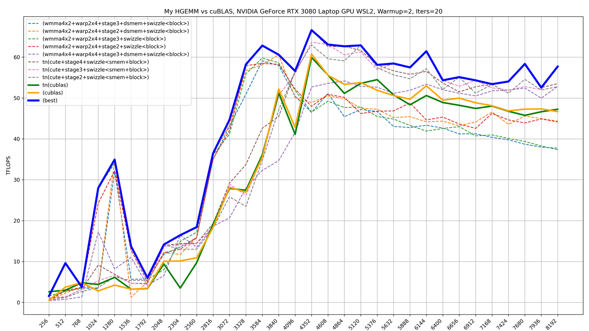
*HGEMM Benchmark vs cuBLAS*

### 0x06 FlashAttention-2 MMA Benchmark

Modern CUDA Learn Notes라면 FlashAttention이 빠질 수 없습니다. xlite-dev/LeetCUDA에서는 Tensor Cores MMA PTX로 FlashAttention-1(Split-KV)과 FlashAttention-2(Split-Q)를 직접 구현했습니다. 이 과정에서 SRAM 절약과 register 최적화 방식을 많이 시도했습니다.

최적 구현은 MMA Acc F32 상황에서 FA-2 공식 구현의 **95%~98%** 정도 성능에 도달합니다. 또한 MMA Acc F16 버전도 구현했는데, 4090 같은 장비에서는 FA-2 native 성능의 **1.5x**까지 도달할 수 있습니다. 다만 overflow가 발생할 수 있어 결과가 망가질 수 있습니다. 참고로 **FFPA에서는 혼합 MMA Acc precision을 구현했습니다. Q@K^T는 MMA Acc F32, P@V는 MMA Acc F16을 사용해 정확도를 보장하면서 1.2x~1.3x 성능 이득을 얻습니다.**

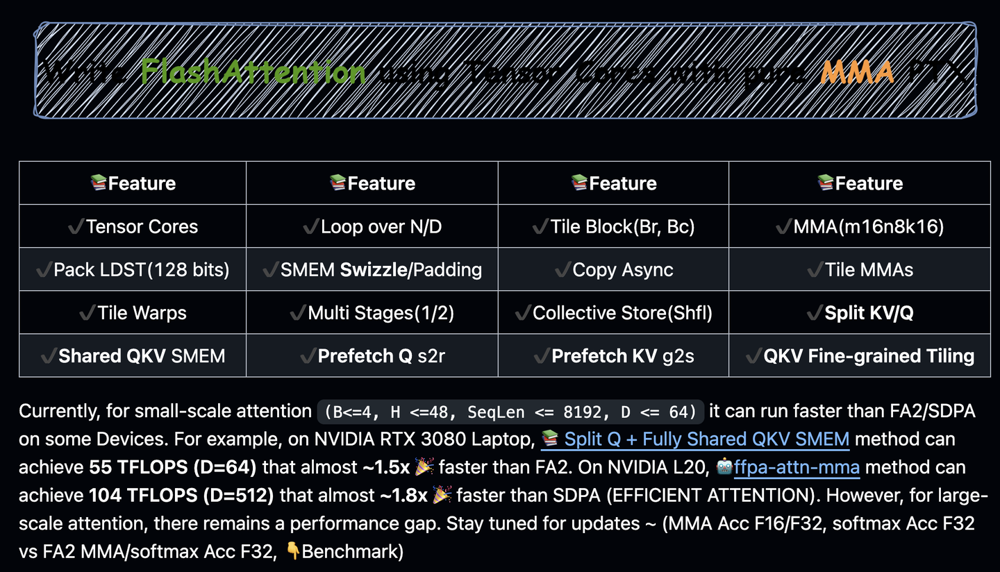
*FlashAttention-2 MMA Features*

FlashAttention-2 MMA가 지원하는 특성은 Multi-Stages, Tile MMA, Tile Warp, Shared KV SMEM, **Fully Shared QKV SMEM**, **Prefetch Q s2r**, **Prefetch K/V g2s**, **QKV Fine-grained Tiling**, Collective Store 등을 포함합니다.

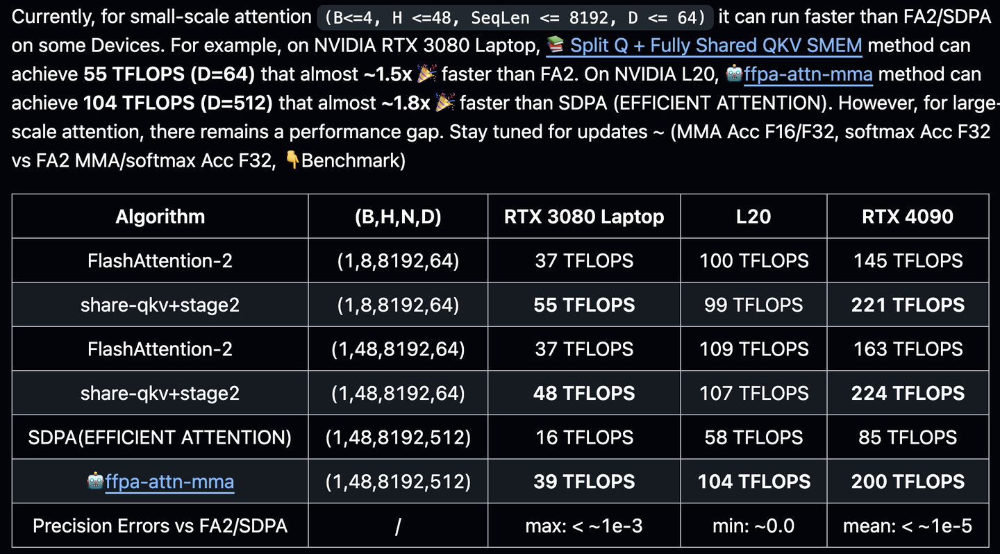
*FlashAttention-2 MMA benchmark*

현재 작은 규모의 attention(B <= 4, H <= 48, SeqLen <= 8192, D <= 64)에서는 일부 장비에서 FA2/SDPA보다 빠르게 동작할 수 있습니다. 예를 들어 NVIDIA RTX 3080 Laptop에서 **Split Q + Fully Shared QKV SMEM** 방식은 D=64일 때 **55 TFLOPS**에 도달합니다. 이는 **FA2보다 약 1.5배 빠릅니다(MMA Acc F16)**. NVIDIA L20에서는 **ffpa-attn-mma** 방식이 **D=512**일 때 **104 TFLOPS**에 도달하며, 이는 **SDPA(EFFICIENT ATTENTION)**보다 약 **1.8배** 빠릅니다.

FlashAttention-2 MMA 구현 과정에서는 SRAM 절약과 register 최적화를 많이 시도했습니다. 여기서 핵심 질문 하나가 생깁니다. **왜 FlashAttention의 head_dim은 SRAM에 의해 제한되는데, 일반 HGEMM/GEMM의 K dimension은 그렇지 않을까요?** GEMM의 K는 GPU memory에 들어가기만 하면 무한히 커질 수 있습니다. 이 질문과 여러 시도의 최종 결과가 FFPA: Yet another Faster Flash Prefill Attention with O(1) GPU SRAM complexity for large head_dim입니다. **FFPA는 FA-2의 SRAM complexity를 O(1)로 낮추고**, head_dim을 **1024까지, 그리고 더 크게도** 확장합니다. FFPA 외에도 여러 시도를 했고, 대략 다음과 같습니다.

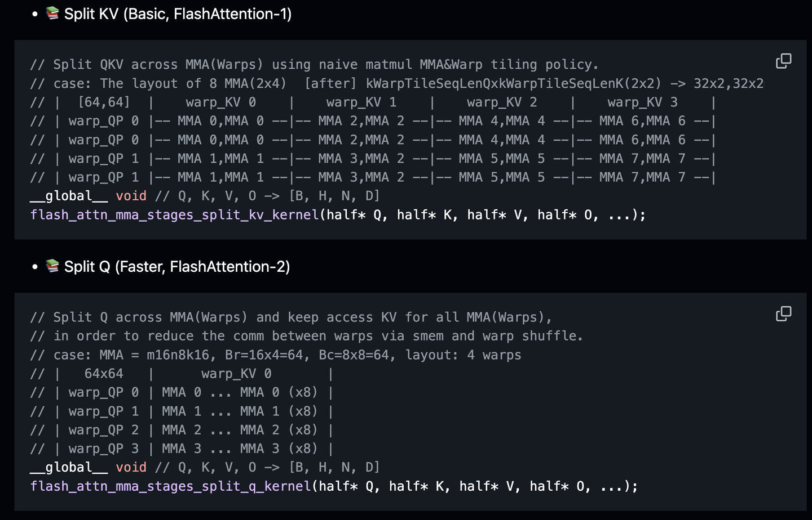
*Split-KV & Split-Q*

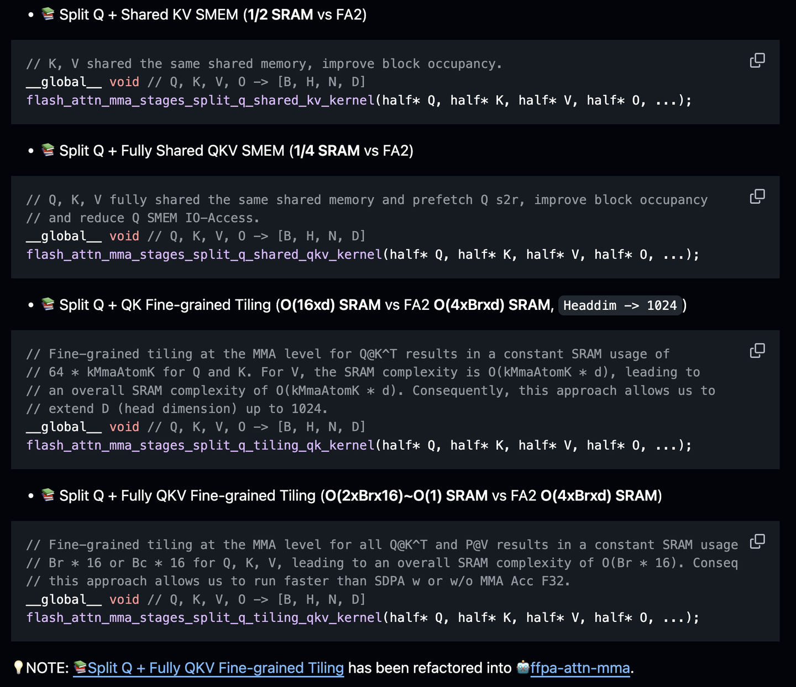
*여러 SRAM 및 register 최적화 전략*

### 0x07 200+ CUDA Kernels (Easy -> Hard++)

xlite-dev/LeetCUDA는 kernel을 주제별로 구현하고 정리합니다. 총 **200개에 가까운 CUDA kernels**가 있으며, CUDA Cores와 Tensor Cores 적용 사례, FP32/TF32/FP16/BF16/FP8/INT8 등 흔한 데이터 타입 대부분을 포함합니다. 어떤 kernel은 매우 간단하고, 어떤 kernel은 매우 어렵습니다. 예를 들어 공식 FA2와 거의 같은 성능을 내는 MMA 버전 FlashAttention 직접 구현이 있습니다.

각 주제의 workflow는 다음과 같습니다.

```text
custom CUDA kernel 구현 -> PyTorch Python binding -> test 실행
```

난이도는 5단계입니다.

- Easy
- Medium
- Hard
- Hard+
- Hard++

Easy와 Medium은 elementwise, matrix transpose(mat_trans), warp/block reduce, nms, ReLU, GELU, Swish, layer-norm, rms-norm, online Softmax, dot-prod, Embedding, 그리고 FP32/FP16/BF16/FP8의 기본 사용법을 포함합니다. Hard, Hard+, Hard++는 더 고급 주제를 다루며, 주로 **sgemv, sgemm, hgemv, hgemm, flash-attention** 같은 op에 집중합니다. 이 부분에는 순수 Tensor Cores MMA PTX로 구현한 kernels도 많이 있습니다.

면접 준비 목적이라면 **Easy, Medium, Hard 세 단계면 기본적으로 충분합니다**. Hard에는 HGEMM 기본 구현들과 Tensor Cores MMA 적용이 포함됩니다. Hard+는 FlashAttention-2 MMA의 여러 버전이고, Hard++는 FFPA의 MMA kernels입니다. FFPA는 실제로 SDPA EA보다 성능이 훨씬 좋으므로 가장 높은 난이도를 붙여도 과하지 않다고 봅니다. Kernels 수가 거의 200개라 각 난이도별 일부만 스크린샷으로 보여 줍니다. 전체 목록은 xlite-dev/LeetCUDA 저장소를 참고해 주세요.

**Easy & Medium**

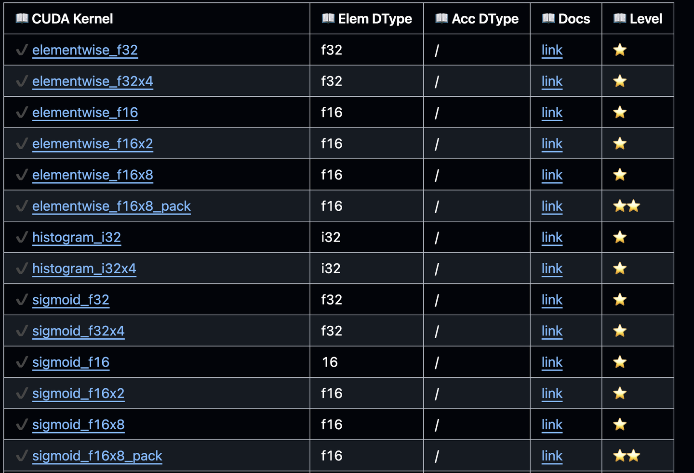
*Easy & Medium Part-1*

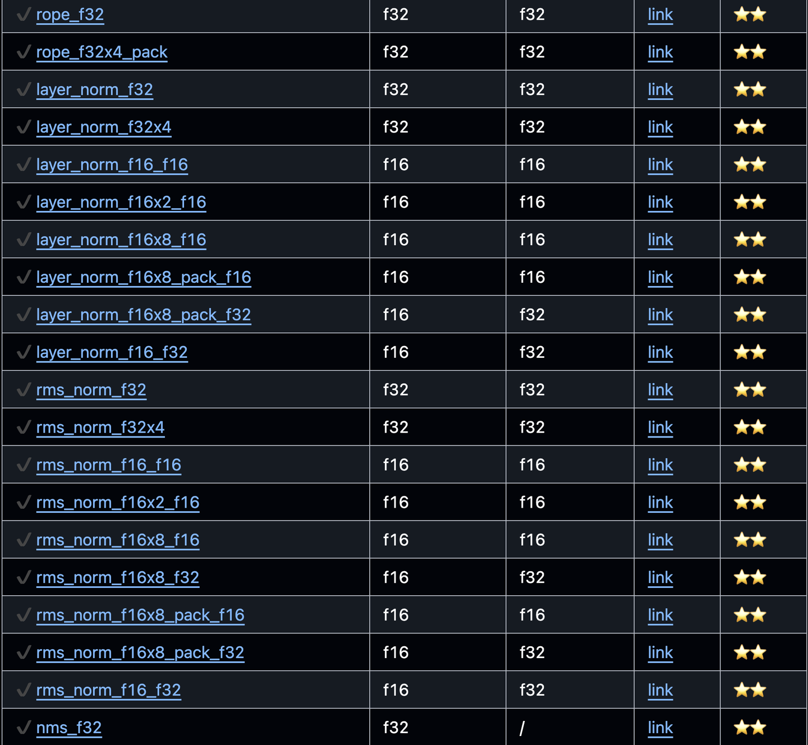
*Easy & Medium Part-2*

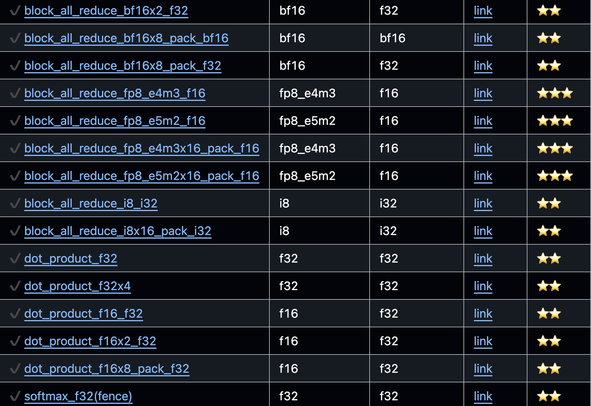
*Easy & Medium Part-3*

**Hard**

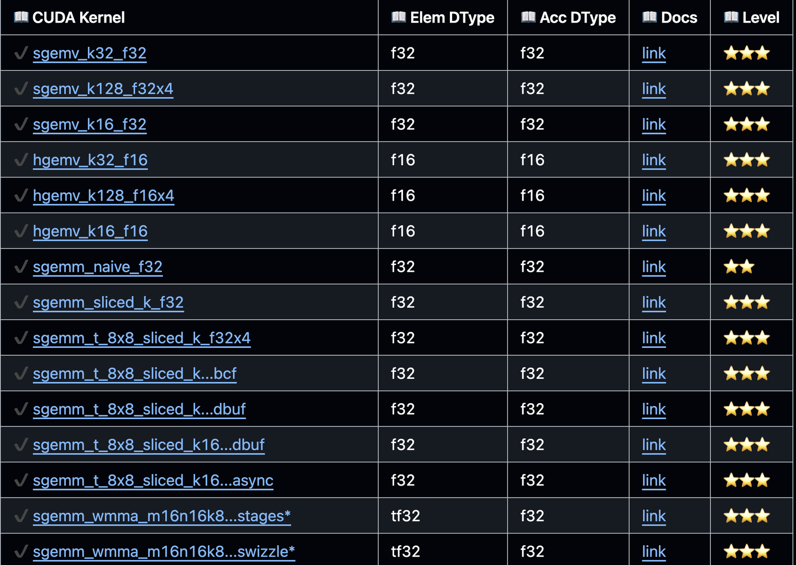
*Hard Part-1*

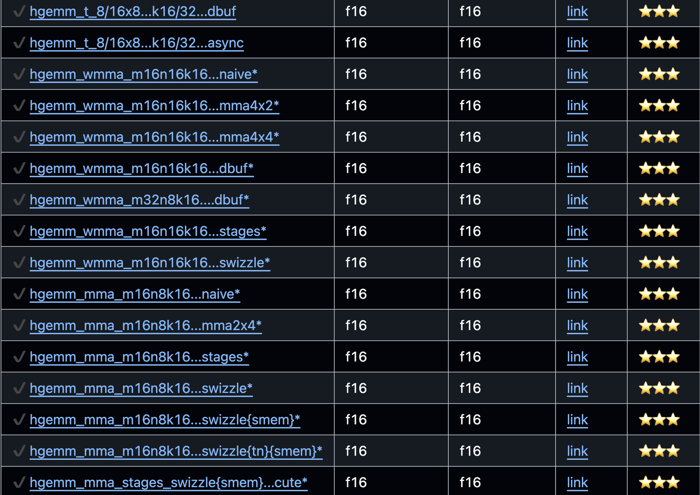
*Hard Part-2*

**Hard+ & Hard++**

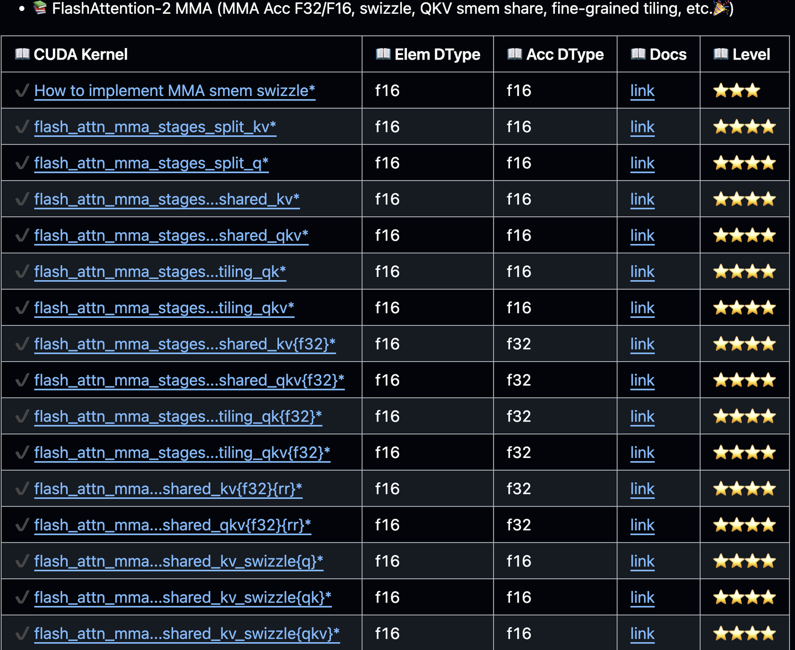
*Hard+ & Hard++ Part-1*

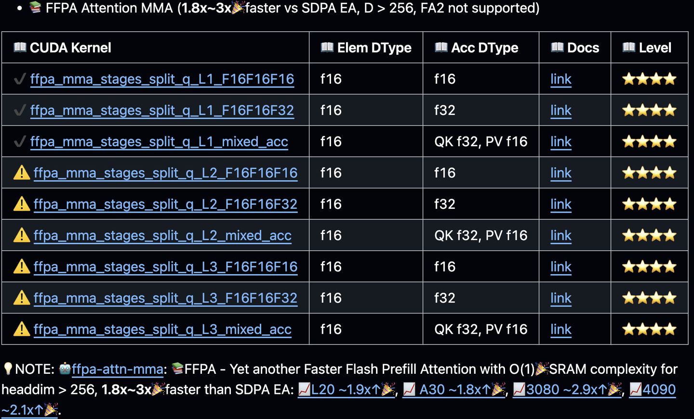
*Hard+ & Hard++ Part-2*

### 0x08 100+ 기술 블로그 추천

제가 직접 쓴 CUDA 노트와 예제 외에도, 개인적으로 좋아하는 기술 블로그 100개 이상을 정리했습니다. 이 블로그들에서 매우 많은 유용한 내용을 배웠고, 읽을 때마다 잘 쓴 글이라는 생각이 듭니다. 그래서 xlite-dev/LeetCUDA에 정리해 추천 목록으로 넣었습니다. 주제별로 분류해 두었으니 필요에 따라 읽으면 됩니다.

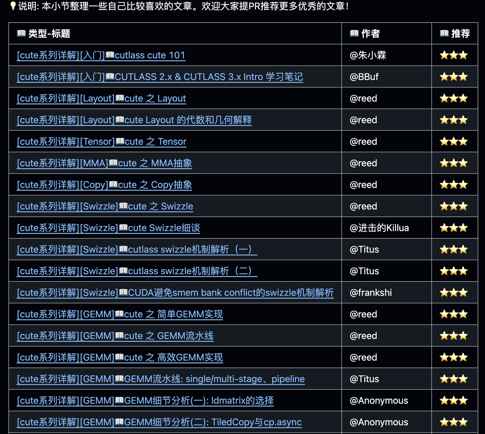
*100+ 기술 블로그 추천 Part-1*

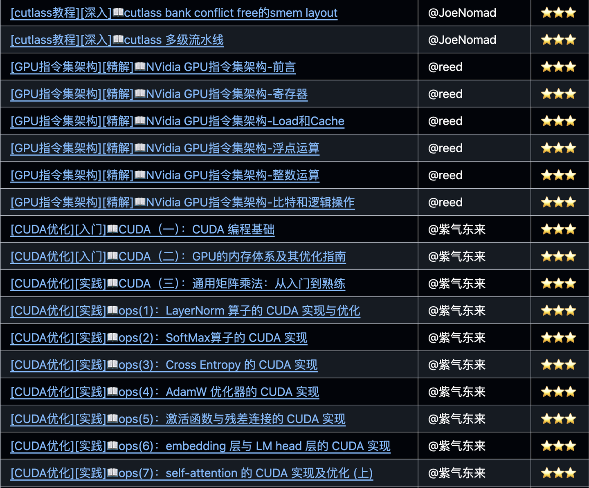
*100+ 기술 블로그 추천 Part-2*

### 0x09 정리

이 글에서는 xlite-dev/LeetCUDA v3.0 업그레이드의 새 기능을 종합적으로 소개했습니다. xlite-dev/LeetCUDA v3.0에는 200+ CUDA/Tensor Cores Kernels, PyTorch python bindings, 100+ LLM/CUDA 기술 블로그 추천, HGEMM-MMA와 FlashAttention-2 MMA 고성능 구현, 그리고 FlashAttention-2를 확장한 FFPA(1K head_dim)가 포함됩니다. 관련 repo 링크는 다음과 같습니다.

- **xlite-dev/LeetCUDA**
- **FFPA: 1.8x~3x faster vs SDPA EA**

관심 있는 분들은 star 부탁드립니다.
