# OSDI 2021 PET 논문 해설 (코드 생성 관련 작업)

오늘은 OSDI 2021 논문 한 편을 읽어보려고 한다. 《PET: Optimizing Tensor Programs with Partially Equivalent Transformations and Automated Corrections》라는 논문이다.

  * 논문 링크: [https://pacman.cs.tsinghua.edu.cn/~whj/pubs/Pet.pdf](<https://link.zhihu.com/?target=https%3A//pacman.cs.tsinghua.edu.cn/~whj/pubs/Pet.pdf>)
  * 오픈소스 코드 링크: [https://github.com/thu-pacman/PET](<https://link.zhihu.com/?target=https%3A//github.com/thu-pacman/PET>)

예전에 OSDI 2020의 《Ansor : Generating High-Performance Tensor Programs for Deep Learning》라는 논문도 읽은 적이 있다. Ansor가 보다 미시적인 관점에서 codegen을 다룬다면, 이번 PET 논문은 보다 거시적인 관점에서 codegen을 다룬다고 할 수 있다.

Ansor든 PET든 개인적으로는 모두 상당히 인상적이라고 생각한다. 이전에 작성한 Ansor 논문 해설은 다음 저장소에서 확인할 수 있다:

[GitHub - BBuf/tvm_mlir_learn: tvm learngithub.com/BBuf/tvm_mlir_learn](<https://link.zhihu.com/?target=https%3A//github.com/BBuf/tvm_mlir_learn>)

. 관심 있는 분들은 한 번 읽어보시길 권하며, 본 글에서는 PET 논문을 살펴보겠다.

## **0x1. 제목과 저자**

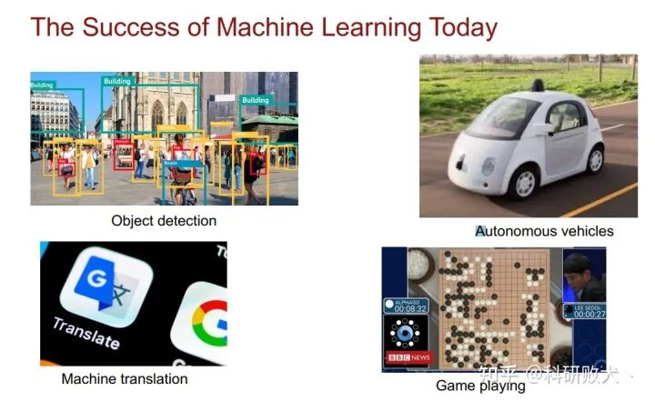

PET 제목과 저자

제목을 번역하면 **부분 등가 변환과 자동 교정 기반의 Tensor program 최적화** 정도가 된다. 저자 팀은 칭화대학교, CMU, Facebook 등에 소속되어 있다. 이 논문의 제1저자 왕하오제(Wang Haojie)는 칭화대학교 소속이다. 이후 설명하겠지만 이 논문에서 mutant program 집합을 생성할 때 효율이 가장 높은 K개의 mutant program을 유지하기 위해 TASO의 cost model과 평가 방식을 사용했기 때문에 저자 중에 지즈하오(Jia Zhihao) 대가가 포함되어 있는 것은 자연스러운 일이다.

## **0x2. 초록**

기존 프레임워크들은 그래프 레이어에서 최적화를 할 때 **일반적으로 등가 변환에 기반한다**. 즉, 변환 전후의 프로그램이 완전히 등가라는 의미다. 여기서 등가라는 것은 같은 입력이 주어지면 변환 전후의 프로그램이 반드시 같은 출력을 얻을 수 있다는 의미다. 이 논문은 새로운 영역을 개척했는데, 바로 PET라는 새로운 프레임워크를 만들어 **최적화 과정에서 부분 등가 변환을 허용**하고, 효율적인 검색 알고리즘을 설계해 완전 등가 변환과 부분 등가 변환을 조합하여 더 큰 search space를 탐색할 수 있게 한 것이다. 그리고 최종 결과도 상당히 좋다.

## **0x3. 서론**

여기서 먼저 한 가지 용어를 설명할 필요가 있다. **통계적 특성(statistical property)**이다. 통계적 특성이란 변환 전후의 프로그램이 완전히 수학적으로 등가인 특성을 말한다. 현재 TVM, TensorFlow, PyTorch, TensorRT 등의 프레임워크의 변환 최적화 또는 Pass는 모두 이 특성을 만족한다. 반면 부분 등가 변환은 변환 전후의 프로그램이 이 통계적 특성을 유지하도록 **요구하지 않는다**. 즉, 같은 입력에 대해 변환된 프로그램과 원본 프로그램의 출력 중 일부 위치의 원소가 다를 수 있다는 것을 허용한다. 부분 등가 변환을 지원하면 **(1) 입력 Tensor의 shape과 배열 순서를 변경해 계산 효율을 높일 수 있고, (2) 효율이 더 높은 operator로 효율이 낮은 operator를 대체할 수 있으며, (3) 그래프 구조를 변환해 더 많은 효율적인 최적화 기회를 얻을 수 있다**. 그러나 부분 등가 변환을 지원하기 위한 두 가지 도전 과제가 있다. **첫 번째**는 부분 등가 변환을 직접 사용하면 모델 정확도가 떨어지므로, 등가가 아닌 tensor 영역을 교정할 필요가 있다. 그러나 어떤 영역이 등가가 아닌지 빠르게 식별하고 교정 kernel을 생성하는 것은 매우 어려운 작업이며, 출력의 어느 위치가 변환 전후에 등가가 아닌지 표시하는 것 또한 난제다. **두 번째**는 부분 등가 변환을 적용하면 Tensor program의 search space가 확장되므로, 후보 Tensor program을 생성하는 알고리즘은 그 계산 복잡도를 신중히 관리해야 한다. **Program Optimizer**(나중에 별도의 절에서 설명)는 부분 등가 변환이 가져오는 이점과 그로 인해 발생하는 추가 오버헤드를 균형 있게 조정해야 하며, 완전 등가 변환과 결합하여 고성능 Tensor program을 얻어야 한다.

이 논문은 **부분 등가 변환을 활용해 Tensor program을 최적화하는 새로운 프레임워크 PET를 제안한다**. PET는 주로 3가지 부분으로 구성된다.

  * **Mutation Generator**. 변형 생성기. 입력 Tensor program에 대해 부분 등가 변환된 출력 Tensor program을 생성하는 데 사용된다. 각 mutant program과 입력 프로그램은 같은 입력에 대해 출력 Tensor의 shape이 동일하지만, 일부 영역의 값은 다를 수 있다.
  * **Mutation Corrector**. 변형 교정기. PET의 Mutation Corrector는 원본 프로그램과 mutant program의 등가성을 검사하고 자동으로 교정 kernel을 생성한다. 그리고 교정 kernel을 출력 tensor에 적용해 전체 변환이 통계적 특성에 부합하도록 보장한다. 또한 PET는 가능한 한 교정 kernel과 tensor 계산 kernel을 fusion하여 교정 kernel 도입으로 인한 추가 오버헤드를 줄인다. 부분 등가 변환을 검사하고 교정하는 것은 매우 어려운데, 이는 출력 tensor가 수백만 개의 원소를 포함할 수 있고 각 출력 원소는 많은 입력 원소와 관련이 있을 수 있기 때문이다. 하나하나 검증하면 오버헤드가 매우 크다. **PET의 핵심 기여 중 하나는 엄밀한 수학 이론을 발견하여 이 검증 과정을 크게 단순화한 것이다**(이 과정의 복잡도를 상수 수준으로 낮췄다). 출력 tensor의 모든 위치를 테스트하는 대신, PET는 몇 개의 대표적인 위치만 테스트하면 검증을 완료할 수 있다.
  * **Program Optimizer.** 먼저 모델이 여러 개의 subgraph로 분할되고, 각 subgraph에 부분 등가 변환을 적용해 더 많은 최적화 기회를 얻는다. 마지막으로 전체 모델의 각 subgraph 경계 부분에 일련의 후처리 최적화를 적용한다. 여기에는 중복 제거와 operator fusion 등이 포함되어 전체적인 최적의 성능을 달성한다.

기여 측면은 사실 위에서 언급한 세 가지로, 먼저 PET가 몇몇 모델에서 평가한 성능을 언급해보자. ResNet-18에서는 1.2배, CSRNet과 BERT에서는 2.5배 향상되었다.

## **0x4. 배경과 아이디어의 출처**

이 절은 별로 다룰 내용이 없으며, Introduction과 약간 중복되는 느낌이다. 단지 그림 1을 통해 부분 등가 변환이 무엇인지 이해하는 데 도움을 주려 한다. 먼저 그림 1은 다음과 같다:

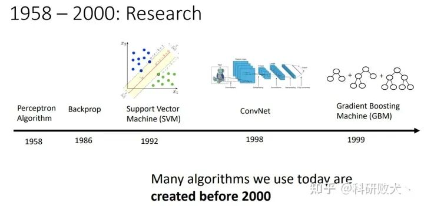

그림 1

먼저 (a)는 일반적인 convolution 연산을 나타낸다. 여기서 T1T_1은 입력 Tensor이고, 데이터 배치는 [b, c, h, w]로 표기된다. 즉, batch size, 입력 channel 수, 입력 feature map의 길이와 너비다. 그 다음 부분 등가 변환, 즉 그림 (b)는 reshape와 transpose를 통해 그림에서 **batch 방향**으로 인접한 두 feature map을 이어 붙였다. 즉 다음과 같다: [b, c, h, w] -> reshape -> [b / 2, 2, c, h, w] -> transpose -> [b / 2, c , h, w, 2]. 그림 안의 T1−>T3T_1->T_3에 해당한다. 그 다음 원래의 convolution kernel과 convolution 연산을 수행해 T4T_4를 얻고, 다시 reshape와 transpose를 이용해 출력 feature map을 원래 입력 feature map 크기로 복원한다. 이 변환을 거친 후 출력 Tensor의 경계 부분에 원본 convolution의 출력 Tensor 값과 일치하지 않는 영역이 존재함을 알 수 있다. 따라서 일치하지 않는 경계 부분에 대해 교정을 수행해야 하며, 이것이 (c) 그림이 나타내는 의미다.

다음 몇 절에서 **수치가 일치하지 않는 부분이 어떤 부분인지 확인하는 방법**과 **이 일치하지 않는 영역을 어떻게 교정하는지**에 대해 자세히 설명할 것이다. 지금 이해되지 않아도 괜찮다.

## **0x5. 설계 개요**

PET는 **최초로** 부분 등가 변환을 활용해 Tensor program을 최적화한 프레임워크이며, Tensor program의 다중선형(multi-linear) 특성을 활용한다. 먼저 **Multi-linear tensor programs (MLTPs)**, 즉 다중선형 Tensor program이 무엇인지 설명할 필요가 있다. 이후로는 일관되게 MLTPs라는 표현을 사용하겠다. n개의 입력 tensor I1,...,InI_1, ..., I_n을 가지는 Op가 있을 때, 각 입력 IkI_k에 대해 선형이라면 그 Op를 다중선형이라고 한다:

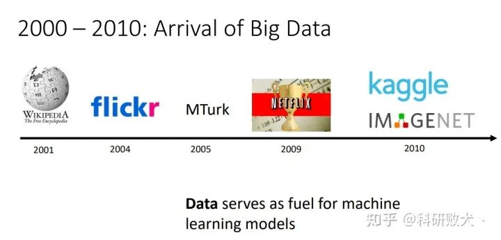

선형의 정의

여기서 X와 Y는 IkI_k와 같은 shape을 가진 임의의 tensor이며, α\alpha는 임의의 scalar다. 딥러닝 모델은 일반적으로 선형(Conv, MatMul) 및 비선형(예: ReLU, Sigmoid) operator로 구성되며, PET 프레임워크에서 사용하는 선형 operator는 Table 1과 같다:

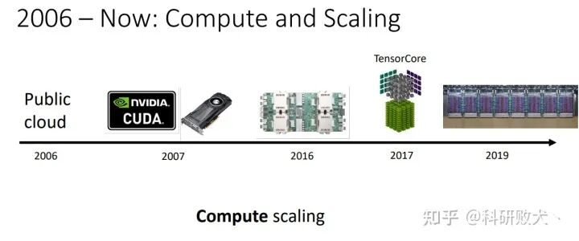

PET가 사용하는 다중선형 operator

이 표는 확장 가능하다는 점에 유의하자. **하나의 프로그램이 다중선형 Tensor program(MLTP)인 것은 프로그램 내의 모든 Op가 다중선형일 때, 그리고 오직 그때뿐이다**. 다음으로 PET의 설계 개요, 즉 Figure 2에 대해 설명하겠다.

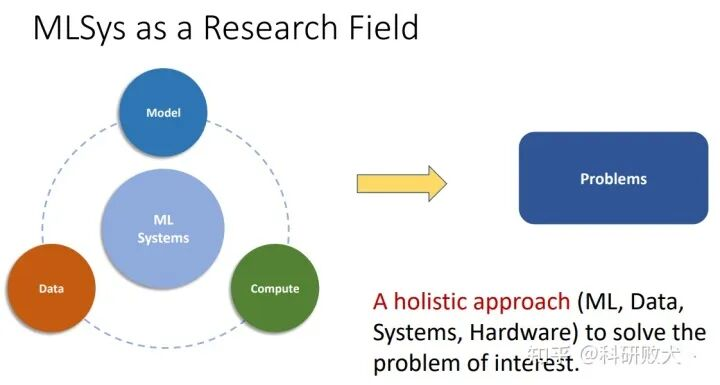

PET 개요

**먼저 원본 Tensor program이 PET 프레임워크에 입력된다. 그리고 PET는 먼저 이 프로그램을 작은 sub-program들로 분해하여 각 sub-program의 search space 복잡도를 낮춘다. 각 sub-program에 대해 PET의 Mutation Generator는 sub-program의 MLTPs에 대한 가능한 변형을 생성하여 부분 등가 변환된 변형 프로그램을 발견한다. 각 변형 프로그램과 원래의 sub-program은 동일한 입출력 Shape을 가진다. 종단 간(end-to-end) 수치 정확성을 유지하기 위해 PET의 Mutation Corrector는 원본 프로그램과 mutant program 사이에 어떤 영역이 등가가 아닌지 확인하고 교정 kernel을 자동으로 생성해 교정한다. PET는 엄밀한 수학 이론을 활용해 이 도전적인 작업을 단순화했다.**

**교정된 변형체들은 PET의 Program Optimizer로 전달되며, 이는 기존의 완전 등가 변환과 부분 등가 변환을 결합하여 프로그램 최적화를 위한 종합적인 search space를 구성한다. Optimizer는 각 sub-program에 대해 풍부한 변형체 집합을 평가하고, 그 경계에 후처리 최적화를 적용해 search space에서 고도로 최적화된 후보 프로그램을 발견한다.**

## **0x6. Mutation Generator**

이 절은 주로 Mutation Generator의 알고리즘 구현 흐름을 설명하고 몇 가지 전형적인 변형 패턴을 소개한다. Mutation Generator의 알고리즘은 아래 그림과 같다:

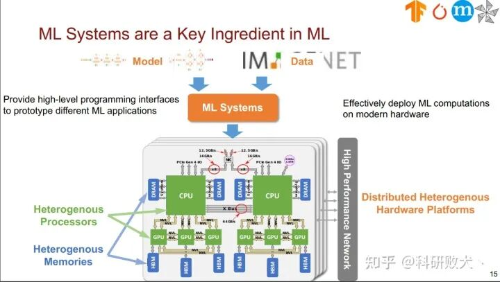

Mutation Generator Algorithm

먼저 원본 다중선형 Tensor program MLTP P_0와 operator 집합 O가 있고, 출력해야 하는 것은 합법적인 mutant program 집합 M이다. 그 다음 I_0를 정의하여 원본 MLTP의 모든 입력 Tensor를 나타낸다. 그리고 M은 빈 집합으로 초기화한다. 다음으로 BUILD라는 DFS 알고리즘을 실행해 mutant program 집합을 생성한다. 8-9행이 DFS 알고리즘의 종료 조건이다. P와 P_0의 입출력 shape이 완전히 같을 때 현재 mutant program이 합법적임을 의미하며, 이 mutant program P를 집합 M에 추가할 수 있다. 그 다음 n<depth일 때(이 depth는 DFS 재귀 깊이) 집합 O 안의 op를 계속 순회하여 변형을 진행할 수 있는데, 이것이 11행이다. 그리고 각 입력 Tensor i를 순회하면서, 입력 Tensor i가 현재 op에 대해 합법적이면 op를 집합 P에 추가하고 그 후는 DFS의 일반적인 동작을 수행한다.

다음으로 세 가지 전형적인 변형 프로그램을 소개한다. 간략히 설명하겠다.

  * **Reshape + Transpose.** 위의 Figure 1에서 이 변형을 이미 설명했다. Reshape와 Transpose의 결합을 통해 Tensor의 데이터 배치를 변경할 수 있다. 예를 들어 입력 feature map의 너비를 더 크게 만들면 병렬 계산에 유리하다. 또한 reshape와 transpose는 자주 함께 쓰이기 때문에 PET에서는 이 두 연산을 하나로 합쳐 **reshape & transpose**라고 부른다. 이 fusion은 변형체의 크기를 줄이고 더 크고 복잡한 변형체를 탐색할 수 있게 한다.
  * **Single-operator mutants.** PET는 비효율적인 operator를 효율적인 operator로 대체할 수 있다. 예를 들어 Dilated Conv를 일반 convolution으로 변환해 그 계산 효율을 크게 가속할 수 있다. Figure 3과 같다:

Mutation Generator를 통해 Dilated Conv를 일반 Conv 계산으로 변환해 가속을 얻음

여기서 가속을 얻을 수 있는 이유는 Dilated Conv가 일부 가속 라이브러리에서 일반적으로 크게 최적화되지 않은 반면, 일반 convolution은 깊이 최적화되어 있어 가속 효과가 매우 두드러지기 때문이다. 여기서도 여전히 교정 과정이 있다는 점에 유의하자.

  * **Multi-operator mutants.** 여기서는 한 operator 집합을 다른 효율적인 operator 집합으로 대체하는 것이다. 예를 들어 InceptionV3에서 비슷한 출력 shape을 가지는 일부 tensor에 해당하는 operator는 더 큰 convolution 하나로 결합되어 GPU 활용도를 높이고 Kernel Launch 오버헤드를 줄일 수 있다.

## **0x7. Mutation Corrector**

PET에서 가장 중요한 부분이 바로 이 Mutation Corrector라고 할 수 있다. Mutation Corrector를 설계할 때 두 가지 주요 도전 과제가 있다. **첫째: 출력 tensor가 매우 커서 수백만 개의 원소가 등가성 검증을 필요로 할 수 있다. 출력 tensor의 각 원소를 개별적으로 검증하는 것은 실현 가능하지 않다. 둘째: 각 출력 원소의 검증은 많은 입력 원소에 의존할 수 있다. 예를 들어 행렬 곱 operator에서 하나의 출력 원소는 두 입력 행렬의 한 행과 한 열의 내적이며, 두 가지 모두 수천 개에 이를 수 있다**. 이 두 가지 도전 과제를 해결하기 위해 PET는 두 가지 수학 이론을 제시한다.

## **0x7.1 이론적 기초**

여기서는 논문의 서술 방식을 그대로 따르지 않고 내 나름의 이해 방식으로 설명하여, 더 알기 쉽고 덜 이론적으로 풀어보겠다. 먼저 3\times 3 convolution은 다음 공식으로 표현될 수 있다:

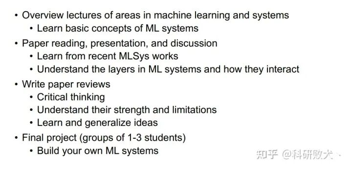

3x3 convolution의 공식 표현

여기서 I_1과 I_2는 각각 입력 Tensor와 convolution Kernel을 나타내고, D, H, W는 각각 입력 Tensor I_1의 channel 수, 길이, 너비를 나타낸다. 합 기호 위와 아래의 숫자는 각각 합 구간의 상한과 하한을 나타낸다. 그리고 이 convolution의 출력 Tensor에 대해서는 각 원소가 하나의 합 영역에 대응된다. 위에서 정의한 convolution operator에 대해, 좌상단 출력 위치 즉 h = 0, w = 0을 계산할 때는 2\times 2 Kernel만 관여한다. 즉 0<=x<=1, 0<=y<=1인데, 이 위치에는 좌측 이웃이나 상단 이웃이 없기 때문이다. 논문에서는 합 영역이 동일한 위치들을 하나의 Box라고 부른다. 이 convolution 예시에서 모든 Box는 Figure 4와 같이 표현될 수 있다.

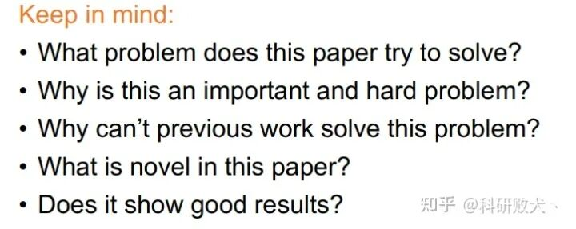

3x3 convolution 예시는 총 9개의 box가 있음

같은 Box의 모든 출력 위치는 동일한 합 구간을 가지며 유사한 수학적 특성을 공유한다. PET는 프로그램 등가성을 검사할 때 이 속성들을 활용한다. PET는 모든 개별 위치에서 두 MLTP의 등가성을 검증할 필요 없이 **각 Box의 m+1개 특성 위치에서의 등가성만 검증하면 된다. 여기서 m은 출력 tensor의 차원 수를 나타낸다**. 이 정리의 증명은 논문에서 P_1과 P_2에 대한 입력 변수의 계수 행렬을 비교함으로써 이루어진다고 언급하고 있는데, 우리는 구체적인 증명 과정에 대해 신경 쓰지 않고 이 정리를 기반으로 등가성 검증 시 모든 출력 원소를 검사하는 것을 피할 수 있다는 점만 알면 된다. 이는 교정 검사의 복잡도를 크게 낮춰준다.

두 번째 정리의 의미는 다음과 같다. n개의 입력 tensor를 가진 두 MLTPs가 특정 위치 v에서 등가가 아니라면, 범위가 F인 분포에서 무작위로 샘플링한 입력에 대해 이 위치 v가 두 MLTPs에 대해 같은 출력값을 생성할 확률은 n / p이다. 여기서 p는 F의 범위를 나타내며, 이 논문에서 p는 매우 큰 소수, 즉 2^{32}-1이다.

위 두 정리를 통해 PET는 매우 적은 위치에서만 검증을 수행해도 어떤 위치가 원본 프로그램과 등가가 아닌지 결정할 수 있다. 다음 그림은 정리 1과 정리 2가 검증해야 할 입력 원소 수에 미치는 영향을 보여준다.

Table 2

## **0x7.2 Mutation Correction 알고리즘**

위 두 정의를 통해 Mutation Correction 알고리즘을 도출할 수 있다. 이 알고리즘은 다음 세 단계로 나뉜다:

  * **Step 1: Box propagation**. 첫 번째 단계는 Box Propagation을 통해 주어진 MLTP의 값을 계산하는 것이다. PET는 tensor의 각 차원에 대해 분할점 집합을 유지하여 Box의 경계를 식별한다. 다중선형 operator의 경우 **입력 tensor의 분할점 및 operator 유형과 hyperparameter에 따라 출력 tensor의 분할점을 추론한다**. Figure 5는 Figure 1의 변형 예시의 Box 전파 과정을 보여준다.

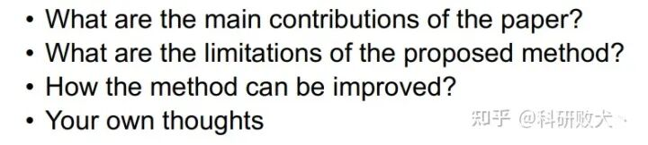

Box 전파 알고리즘 예시

  * **Step 2: Random testing for each box pair**. 두 번째 단계는 입력 MLTP P_1과 그 변형 P_2에 대해 이전 절에서 소개한 정리를 적용해 어느 영역이 수치적으로 등가인지 판단하는 것이다. 정리 1에 따르면 먼저 m+1개의 위치를 선택해야 한다. Figure 5의 예시에서 m=4다. 그 다음 m+1개의 위치 각각에 대해 무작위 데이터로 t회 검사하여, 오판 가능성을 (n/p)^t로 만든다. 여기서 p=2^{32}-1이며, t는 프로그램 검사 오버헤드와 오류 발생 가능성을 균형 잡기 위해 조정 가능한 hyperparameter다.
  * **Step 3: Correction kernel generation**. 마지막 단계는 출력 Tensor의 수치가 일치하지 않는 모든 영역에 대해 자동으로 교정 kernel을 생성하는 것이다. 교정 kernel의 오버헤드를 줄이기 위해 PET는 가능한 한 교정 kernel을 기존 계산 kernel과 fusion한다.

## **0x7.3 Correction Kernels의 fusion**

이 부분은 위의 Step 3에 대한 설명이다. Figure 6을 보자:

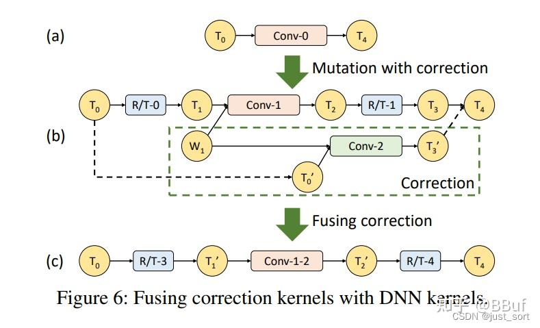

Figure 6

Figure 6(a)는 표준 convolution 과정을 나타낸다. 그 다음 Figure 6(b)는 Figure 6(a)에 부분 등가 변환을 적용한 것이다. Conv-2는 교정 kernel이며, 여기서 Conv-1과 가중치를 공유한다. 따라서 conv1-conv2를 fusion하여 conv-1-2 하나로 만들 수 있는데, Figure 6(c)와 같다. 구체적으로 이 fusion 연산은 T_1과 T_0^{'}을 하나의 단일 Tensor로 결합하고 Conv-1-2의 출력 결과를 T^2와 T_3^{'}로 분해하는 것이다. 여기서의 결합과 분해는 데이터 복사만 포함하며, reshape와 transpose로 수행할 수 있다.

## **0x8. Program Optimizer**

이 절에서는 PET의 Program Optimizer를 소개한다. 이는 등가 변환과 부분 등가 변환을 결합하여 더 큰 프로그램 최적화 search space를 탐색할 수 있다. **먼저 Program Optimizer는 입력 프로그램을 더 작은 크기의 sub-program 여러 개로 분해해 Mutation Generator에 전달한다. 그 다음 각 sub-program을 최적화하기 위해 PET는 풍부한 search space에서 변형에 참여하는 Op 집합과 DFS 검색 알고리즘의 반복 횟수를 조정해 가장 좋은 변형 프로그램을 찾는다. 마지막으로 모든 최적화된 sub-program을 함께 이어 붙일 때 경계를 가로지르는 추가 후처리 최적화를 적용하는데, 여기에는 operator fusion, 중복 Op 제거 등이 포함된다**. 아래의 알고리즘 2는 Program Optimizer의 전체 흐름을 설명한다:

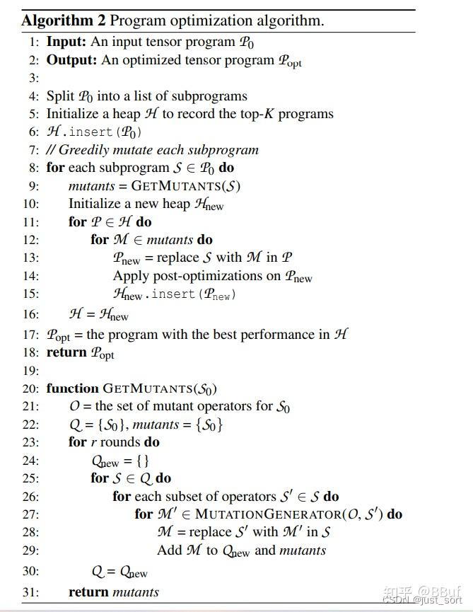

Program Optimizer의 흐름

전체 알고리즘 흐름은 복잡하지 않다. 먼저 8행에서 전체 프로그램을 잘라 sub-program 몇 개로 만든다. 각 sub-program S에 대해 GETMUTANTS 함수를 사용해 이 sub-program의 mutant program 집합 mutants를 생성한다(9행에 대응). 그 다음 새로운 stack H_{new}를 초기화한다. 그리고 원본 stack H를 순회하면서 그 안의 각 프로그램 P에 대해, 방금 얻은 변형 결과 M을 기반으로 P 내부의 sub-program에 변형을 적용해 새로운 mutant program P_{new}를 얻고, P_{new}를 새로운 stack H_{new}에 push한다. 마지막으로 원본 stack H를 H_{new}로 업데이트하여 현재 sub-program의 변형을 완료한다.

마지막으로 stack H에서 가장 성능이 좋은 프로그램을 선택해 후처리 최적화를 진행하면 최종 결과를 얻는다.

전체 알고리즘 흐름에서 몇 가지 세부 사항에 주의해야 한다.

  * Detail 1. 원본 프로그램을 어떻게 분할할까. 논문에서는 ReLU, Sigmoid 등의 비선형 Op를 분할점으로 사용한다. 이 또한 PET의 한계라고 할 수 있는데, 다중선형 operator로 구성된 subgraph만 변형할 수 있기 때문이다.
  * Detail 2. 알고리즘에서 stack은 성능이 가장 높은 K개의 sub-program을 유지해야 하는데, 여기서는 이전 논문 TASO의 cost model과 성능 평가 방법을 활용한다.
  * Detail 3. sub-program 변형 과정에서 search space 크기와 검색에 필요한 시공간 비용을 균형 잡기 위해 PET의 Program Optimizer는 두 가지 hyperparameter를 도입한다. 하나는 변형의 반복 횟수, 즉 알고리즘 2의 23행이다. 그리고 sub-program의 Op 개수가 d(여기서는 4)를 초과하면 PET는 최대 d개의 Op의 모든 가능한 조합을 열거하여 sub-program을 더 작은 Op 부분 집합으로 분할하고, 변형은 이 부분 집합에서만 발생하며 다른 Op는 변경되지 않는다. 알고리즘 2의 26행에 대응한다.
  * Detail 4. PET의 Program Optimizer는 완전 등가 변환과 완전히 호환된다. 완전 등가 변환과 부분 등가 변환을 결합함으로써 더 큰 search space를 탐색할 수 있다.

**이 절의 마지막에서는 Post-Optimizations에 대해서도 다룬다**. 위에서 언급했듯이 마지막에 모든 sub-program 변형체는 함께 이어 붙여져야 한다. 이들의 입력과 출력 tensor를 연결하는 것 외에도 PET는 **sub-program 경계를 가로질러 일부 후처리 최적화를 수행하여 프로그램 성능을 더욱 향상시킨다**. PET의 Mutation Generator는 많은 양의 Reshape와 Transpose(R/T) operator를 생성하며, 특히 sub-program의 시작과 끝에 그렇다는 점에 주목하자. 따라서 sub-program을 가로질러 이 R/T operator들을 fusion하고 위의 sub-program 최적화에서 제외되었던 비선형 operator들도 추가로 fusion할 기회가 있다. Figure 7은 두 개의 최적화된 sub-program을 포함하는 예시를 보여준다. sub-program의 경계를 최적화하기 위해 PET는 먼저 비선형 operator와 R/T operator를 재배열하여 두 sub-program 사이의 R/T operator를 한데 모은다. Figure 7(b)에 나타난 것처럼 이러한 재배열의 정확성은 완전히 보장된다. 재배열은 또한 PET가 비선형 활성화 operator와 다른 operator를 fusion할 수 있게 해주는데, 예를 들어 Conv와 ReLU를 Conv-ReLU로 fusion하는 것이다. Figure 7(c)와 같다.

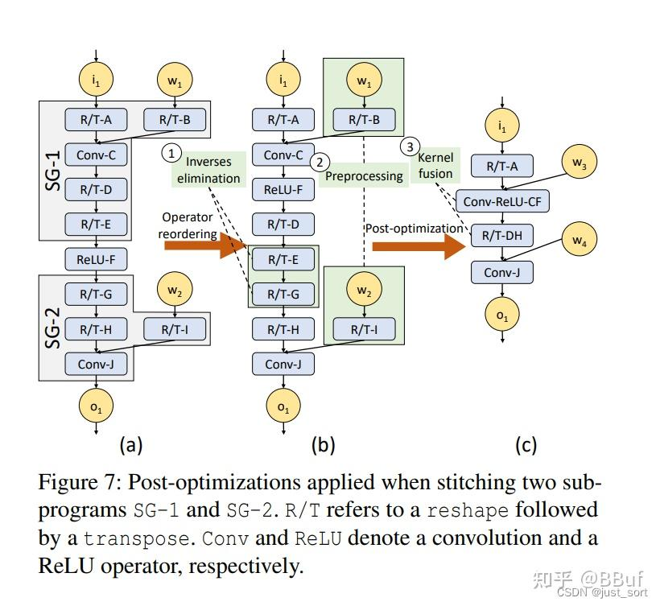

후처리 최적화 예시

따라서 여기에는 세 가지 최적화가 포함된다:

  * **역(逆) 제거**. 서로 상쇄될 수 있는 R/T operator 쌍을 모두 제거하여 무연산(no-op)과 동등하게 만든다. 이러한 각 쌍을 inverse group이라고 부르며, 후처리 최적화 과정에서 직접 삭제한다. inverse group의 한 예는 그림 7(b)의 R/T-E와 R/T-G다.
  * **operator fusion**. 그림 7(c)에서 보듯이 PET는 남은 연속된 R/T operator를 단일 operator(예: R/T-DH)로 fusion하여 Kernel Launch 비용을 낮춘다. Tensor program 내의 비선형 활성화도 R/T 또는 다른 선형 operator와 fusion된다. operator fusion은 비선형 operator에 가장 자주 사용되는 프로그램 최적화다. PET는 원본 Tensor program을 분할하면서 잃은 효율의 대부분을 회복할 수 있다.
  * **사전 처리**. 모든 입력 tensor가 정적으로 알려져 있다면 어떤 operator든 사전 처리한다. 예를 들어 그림 7(b)에서 R/T-B와 R/T-I는 모두 convolution 가중치 tensor w1과 w2에 대해 사전 처리될 수 있다. 사실 이것은 **상수 폴딩(constant folding)**이다.

## **0x9. 구현**

이들의 코드는 오픈소스이며, 약 13000행의 C++ 코드와 1000행의 Python 코드로 구성되어 있다. 이 작업에 관심이 있다면 소스 코드를 살펴볼 수 있다. 주소는 다음과 같다: [https://github.com/thu-pacman/PET](<https://link.zhihu.com/?target=https%3A//github.com/thu-pacman/PET>).

## **10\. 평가**

논문이 제시한 실험 결과는 상당히 풍부하므로, 여기서는 모든 실험 결과 도표를 자세히 다루지는 않겠다. 가장 중요한 실험 결과 그림 하나만 다루겠다:

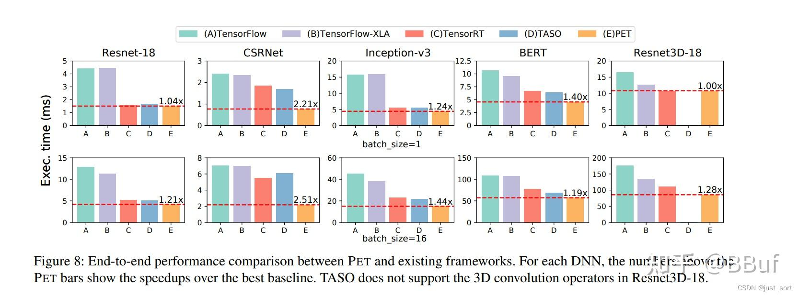

여러 네트워크에서 PET의 성능

ResNet-18, CSRNet, InceptionV3, BERT, ResNet33D-18에서 현재 인기 있는 일부 프레임워크 대비 모두 뚜렷한 우위를 보인다. 다만 아쉽게도 여기서는 PyTorch 결과와의 비교는 없다.

실험 부분에서는 또한 PET가 TVM 및 Ansor와 쉽게 결합될 수 있어 생성되는 Tensor program의 효율을 더욱 향상시킬 수 있다고 언급한다. **PET에서는 cuDNN/cuBLAS/TVM/Ansor 등 인기 있는 최적화 라이브러리와 codegen 컴파일러를 backend로 사용해 효율적인 Tensor program을 생성할 수 있다**. Figure 12는 이 프레임워크들이 backend로 사용될 때 일반적인 단일 operator의 가속 효과를 보여준다:

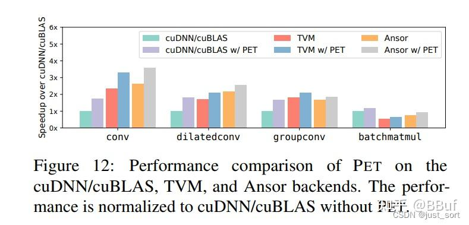

서로 다른 프레임워크나 라이브러리를 backend로 사용할 때 일반적인 단일 operator의 가속 효과

이는 PET의 확장성이 비교적 좋다는 것을 보여준다. 대부분의 첨단 codegen 작업과 수작업으로 최적화된 operator 라이브러리와 결합할 수 있다.

## **11\. 결론**

이 논문은 PET를 제안한다. 이는 부분 등가 변환을 Tensor program에 적용한 DNN 프레임워크다. 부분 등가 변환을 적용함으로써 더 큰 프로그램 search space를 탐색할 수 있고, 대부분의 인기 있는 딥러닝 네트워크에서 좋은 가속 효과를 얻을 수 있다. 이 논문의 실험 부분은 매우 탄탄하므로 모두에게 학습을 권한다.
